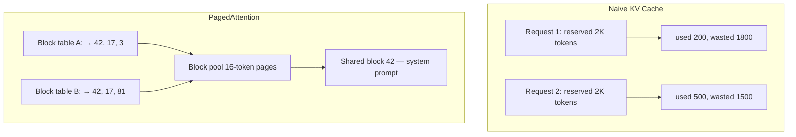
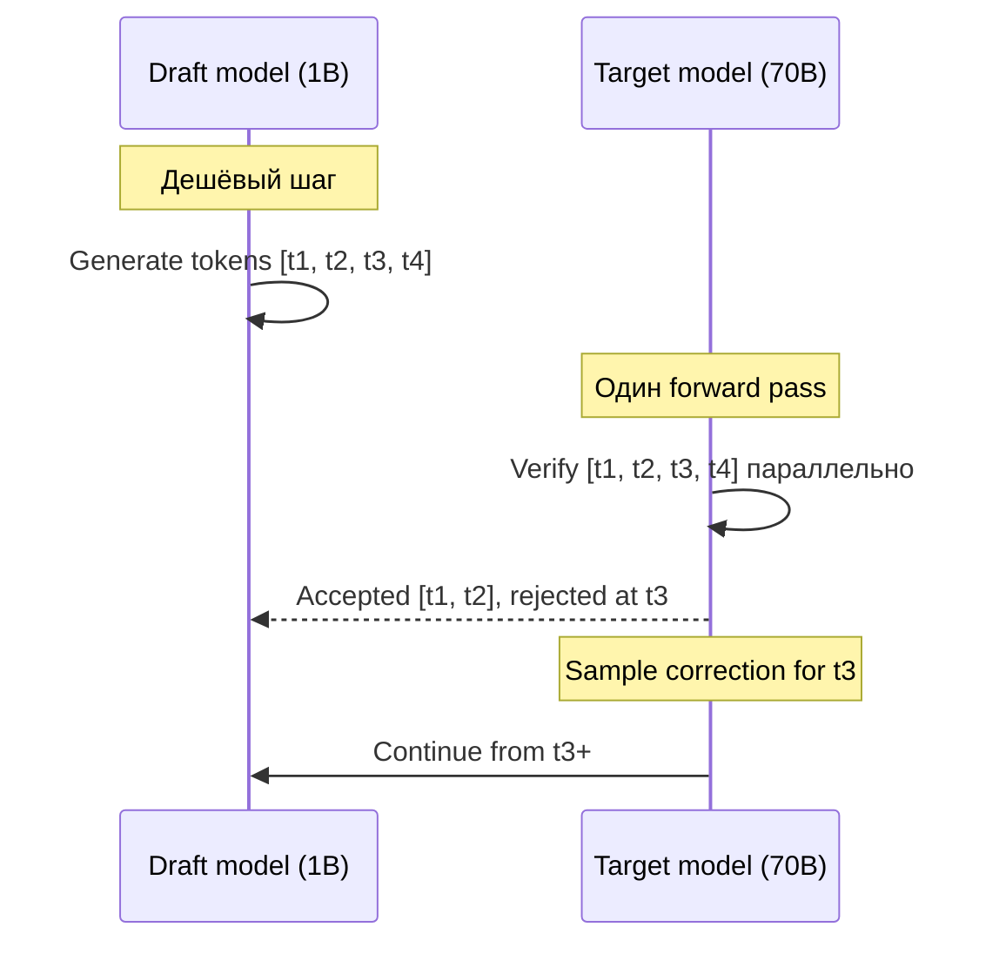

```mermaid
gantt
    title Static vs Continuous Batching
    dateFormat X
    axisFormat %s

    section Static
    Req A 50 tok        :0, 5
    Req B 200 tok       :0, 20
    Req C 30 tok (wait) :0, 20
    Req D (queue)       :20, 5

    section Continuous
    Req A 50 tok        :0, 5
    Req B 200 tok       :0, 20
    Req C 30 tok        :0, 3
    Req D                :3, 8
    Req E                :5, 10
```

# Вопросы на собеседовании: `LLM Inference Optimization`

**Inference optimization** — выжать максимум `tokens/sec` и минимум `latency` из дорогих GPU. Стек 2026: `vLLM`/`SGLang`/`TensorRT-LLM`, `PagedAttention` + `continuous batching`, `speculative decoding`, `FP8`/`INT4` quantization (`AWQ`, `GPTQ`), `FlashAttention v3`, `prefix caching`. Цена ошибки — `×10` к bill за GPU.

**Дата:** 2026-05-23

## Полезные ссылки

### Официальная документация и авторитетные источники

- [vLLM Documentation](https://docs.vllm.ai/) — основной inference-сервер
- [PagedAttention paper (Kwon et al., 2023)](https://arxiv.org/abs/2309.06180) — основа vLLM
- [FlashAttention paper (Dao et al., 2022)](https://arxiv.org/abs/2205.14135) — v1
- [FlashAttention-2 (Dao, 2023)](https://arxiv.org/abs/2307.08691)
- [FlashAttention-3 (2024)](https://arxiv.org/abs/2407.08608) — H100 FP8
- [AWQ paper (Lin et al., 2023)](https://arxiv.org/abs/2306.00978) — activation-aware квантизация
- [GPTQ paper (Frantar et al., 2022)](https://arxiv.org/abs/2210.17323)
- [Speculative Decoding (Leviathan et al., 2023)](https://arxiv.org/abs/2211.17192)
- [EAGLE paper (Li et al., 2024)](https://arxiv.org/abs/2401.15077) — улучшенная draft-модель
- [Anthropic Prompt Caching](https://docs.anthropic.com/en/docs/build-with-claude/prompt-caching)
- [OpenAI Prompt Caching](https://platform.openai.com/docs/guides/prompt-caching)
- [NVIDIA TensorRT-LLM](https://github.com/NVIDIA/TensorRT-LLM)
- [SGLang RadixAttention](https://lmsys.org/blog/2024-01-17-sglang/)
- [Hugging Face TGI](https://huggingface.co/docs/text-generation-inference/)

## Содержание

- [Полезные ссылки](#полезные-ссылки)
- [See also](#see-also)

**Метрики и autoregressive nature**
- [Q1. (!) Какие метрики важны для LLM inference?](#q1--какие-метрики-важны-для-llm-inference)
- [Q2. (!) Почему LLM inference медленный из-за авторегрессии?](#q2--почему-llm-inference-медленный-из-за-авторегрессии)
- [Q3. Prefill vs decode stage — в чём разница?](#q3-prefill-vs-decode-stage--в-чём-разница)
- [Q4. Memory-bound vs compute-bound — что лимитирует decode?](#q4-memory-bound-vs-compute-bound--что-лимитирует-decode)

**KV Cache и PagedAttention**
- [Q5. (!) Что такое KV cache и зачем он нужен?](#q5--что-такое-kv-cache-и-зачем-он-нужен)
- [Q6. (!) Как посчитать размер KV cache?](#q6--как-посчитать-размер-kv-cache)
- [Q7. (!) PagedAttention — что это и почему ×24 throughput?](#q7--pagedattention--что-это-и-почему-24-throughput)
- [Q8. KV cache fragmentation — что это?](#q8-kv-cache-fragmentation--что-это)

**Continuous batching**
- [Q9. (!) Чем continuous batching лучше static batching?](#q9--чем-continuous-batching-лучше-static-batching)
- [Q10. Iteration-level scheduling — как работает?](#q10-iteration-level-scheduling--как-работает)
- [Q11. Chunked prefill — зачем смешивать prefill и decode?](#q11-chunked-prefill--зачем-смешивать-prefill-и-decode)

**Speculative decoding**
- [Q12. (!) Speculative decoding — суть алгоритма?](#q12--speculative-decoding--суть-алгоритма)
- [Q13. EAGLE и Medusa heads — чем отличаются от классики?](#q13-eagle-и-medusa-heads--чем-отличаются-от-классики)
- [Q14. Когда speculative decoding НЕ помогает?](#q14-когда-speculative-decoding-не-помогает)

**Quantization (FP8/INT4/GPTQ/AWQ)**
- [Q15. (!) FP16/BF16/FP8/INT8/INT4 — таблица форматов?](#q15--fp16bf16fp8int8int4--таблица-форматов)
- [Q16. (!) GPTQ — как работает post-training quantization?](#q16--gptq--как-работает-post-training-quantization)
- [Q17. (!) AWQ — чем отличается от GPTQ?](#q17--awq--чем-отличается-от-gptq)
- [Q18. Почему FP8 на H100 — это важно?](#q18-почему-fp8-на-h100--это-важно)
- [Q19. Квантовать только веса или ещё и активации?](#q19-квантовать-только-веса-или-ещё-и-активации)
- [Q20. GGUF и llama.cpp — для CPU/edge?](#q20-gguf-и-llamacpp--для-cpuedge)

**FlashAttention и Prefix caching**
- [Q21. (!) FlashAttention — почему 2-3× speedup?](#q21--flashattention--почему-2-3-speedup)
- [Q22. (!) Как работает prefix caching (APC)?](#q22--как-работает-prefix-caching-apc)
- [Q23. (!) Anthropic Prompt Caching API — как использовать?](#q23--anthropic-prompt-caching-api--как-использовать)
- [Q24. OpenAI Prompt Caching — чем отличается?](#q24-openai-prompt-caching--чем-отличается)

**Inference servers**
- [Q25. (!) vLLM vs TensorRT-LLM vs TGI vs SGLang — сравнение?](#q25--vllm-vs-tensorrt-llm-vs-tgi-vs-sglang--сравнение)
- [Q26. vLLM config tuning — какие флаги важны?](#q26-vllm-config-tuning--какие-флаги-важны)
- [Q27. llama.cpp, Ollama, MLX — для local/edge?](#q27-llamacpp-ollama-mlx--для-localedge)

**Distributed serving (TP/PP/MoE)**
- [Q28. (!) Чем Tensor Parallelism отличается от Pipeline Parallelism?](#q28--чем-tensor-parallelism-отличается-от-pipeline-parallelism)
- [Q29. MoE serving — почему Mixtral/DeepSeek сложнее?](#q29-moe-serving--почему-mixtraldeepseek-сложнее)
- [Q30. Как устроен Multi-LoRA serving (LoRAX, Punica)?](#q30-как-устроен-multi-lora-serving-lorax-punica)
- [Q31. Что такое disaggregated inference (prefill/decode split)?](#q31-что-такое-disaggregated-inference-prefilldecode-split)

**Cost optimization**
- [Q32. (!) GPU выбор: A100 vs H100 vs H200 vs MI300X?](#q32--gpu-выбор-a100-vs-h100-vs-h200-vs-mi300x)
- [Q33. (!) Что дешевле за 1M токенов — API или self-host?](#q33--что-дешевле-за-1m-токенов--api-или-self-host)
- [Q34. Batch API (OpenAI/Anthropic) — когда использовать?](#q34-batch-api-openaianthropic--когда-использовать)
- [Q35. (!) Model routing — дешёвая модель на простое, дорогая на сложное?](#q35--model-routing--дешёвая-модель-на-простое-дорогая-на-сложное)
- [Q36. Streaming SSE — снижает ли реальную latency?](#q36-streaming-sse--снижает-ли-реальную-latency)


## Q1. (!) Какие метрики важны для LLM inference?

Одной `latency` мало — для LLM важна целая семья метрик, потому что генерация состоит из двух очень разных фаз (ожидание первого токена и поток следующих), а GPU дорогой, и каждую секунду надо обслужить как можно больше запросов:

| Метрика | Что измеряет | Цель |
|---------|--------------|------|
| `TTFT` (Time To First Token) | Задержка до первого токена | <500ms для UX |
| `TPOT` (Time Per Output Token) | Среднее время на следующий токен | <50ms (=20 tok/sec) |
| `Throughput` | `tokens/sec` суммарно по всем requests | Максимизировать |
| `End-to-end latency` | TTFT + TPOT × N | Зависит от длины ответа |
| `Cost` | `$/1M tokens` | Минимизировать при SLA |
| `Goodput` | Доля requests, уложившихся в SLA | >99% |

**Компромисс:** throughput и latency тянут в разные стороны. Растишь throughput большим batch — растёт `TTFT`, потому что новому запросу приходится ждать, пока отработает prefill всего батча. Continuous batching смягчает конфликт, но не убирает его полностью.

**Рекомендация:** дашборды в production показывают `p50/p95/p99` раздельно для prefill (`TTFT`) и decode (`TPOT`) — усреднять их вместе бессмысленно, у фаз разная природа задержки.


## Q2. (!) Почему LLM inference медленный из-за авторегрессии?

Корень медленности — **авторегрессионная природа** генерации: модель выдаёт **по одному токену за раз**, и каждый следующий зависит от всех предыдущих:

```
P(token_i | token_1, ..., token_{i-1})
```

На каждый токен делается **полный forward pass** через все слои модели. Поэтому ответ из 500 токенов — это 500 проходов через 70-миллиардную модель. Для Llama-70B на H100 это ~50 tokens/sec на одиночном запросе, то есть около 10 секунд на ответ.

**Что отсюда следует.** Внутри одного ответа генерацию токенов распараллелить **нельзя** — следующий токен физически не посчитать, не зная предыдущего. Параллелить можно только в обход этого ограничения:

- **разные запросы** одновременно (batching) — пока модель всё равно читается из памяти, обслужить сразу много пользователей;
- **угадывать токены вперёд** (speculative decoding) — за один проход проверять сразу несколько предсказанных токенов.

**Где настоящее узкое место.** На decode-стадии лимитирует не вычисление, а `memory bandwidth`. Каждый токен заставляет прочитать **все веса модели из HBM**: для Llama-70B в FP16 это 140 GB. На H100 с пропускной способностью 3.35 TB/s это даёт потолок ~24 tokens/sec на один запрос даже при идеальной утилизации — упираемся в скорость памяти, а не в FLOPs.


## Q3. Prefill vs decode stage — в чём разница?

Генерация делится на две стадии с **радикально разным профилем нагрузки** — это ключ к пониманию всех остальных оптимизаций.

**Prefill (обработка промпта).** Прогон всего входного промпта, чтобы получить первый выходной токен.
- Все токены prompt'а обрабатываются **параллельно** — одним большим матричным умножением.
- `compute-bound` — GPU загружен вычислениями под завязку.
- Один проход: на выходе первый output-токен и полностью заполненный KV cache.
- Время ≈ линейно растёт с длиной prompt.

**Decode (авторегрессионная генерация).** Поштучная генерация остальных токенов.
- Один токен за раз.
- `memory-bound` — ради одного токена нужно прочитать **все веса модели**.
- GPU недогружен: вычислительные ядра простаивают, насыщена пропускная способность памяти.
- Время ≈ линейно растёт с числом output-токенов.

**Почему это важно:** раз стадии упираются в разные ресурсы, их и оптимизируют по-разному. Prefill (compute-bound) ускоряют через `FlashAttention` и `chunked prefill`. Decode (memory-bound) — через `continuous batching` (амортизировать чтение весов по многим запросам), `speculative decoding` и KV cache.


## Q4. Memory-bound vs compute-bound — что лимитирует decode?

Decode почти всегда `memory-bound`: время определяется не количеством вычислений, а тем, сколько байт надо прочитать из памяти. Понять это помогает **arithmetic intensity** = FLOPs / bytes — сколько операций приходится на каждый прочитанный байт.

Сравнивают эту величину с «гребнем» (ridge point) GPU = `peak_FLOPS / peak_bandwidth`. Ниже него — упираемся в память, выше — в вычисления.

- **H100 ridge point:** ~290 FLOPs/byte (для BF16).
- **Decode batch=1:** всего ~1-2 FLOPs/byte → глубоко в зоне `memory-bound`, вычислительные ядра простаивают ~90% времени. Ради одного токена прочитали все веса и почти ничего ими не посчитали.

**Как сдвинуть нагрузку в сторону compute (поднять intensity):**
- **Большой batch** — главное средство. Веса читаются один раз, но обслуживают сразу N запросов. Batch=32 поднимает интенсивность до ~32 FLOPs/byte.
- **Quantization** — INT4 сокращает объём весов в 4 раза, значит и чтений из памяти меньше.
- **Speculative decoding** — за один проход весов проверяется сразу несколько токенов.
- **FlashAttention** — снижает трафик чтений из HBM при вычислении attention.

**Важная оговорка:** prefill даже на batch=1 с длинным промптом уже `compute-bound` — там много параллельной работы, и оптимизации нужны другие.


## Q5. (!) Что такое KV cache и зачем он нужен?

KV cache — это сохранённые keys/values предыдущих токенов, чтобы не пересчитывать их на каждом шаге генерации. Без него авторегрессия была бы квадратичной по длине.

Каждый attention-слой считает `Attention(Q, K, V)`. При генерации токена `t` участвуют:
- `Q_t` — новый query от текущего токена `t`;
- `K_1..K_t`, `V_1..V_t` — keys/values **всех предыдущих токенов**.

Ключевое наблюдение: `K` и `V` старых токенов от шага к шагу **не меняются** — их незачем пересчитывать. Без кэша пришлось бы заново гонять `K`, `V` для всех `t` токенов на каждом шаге, что даёт `O(n²)` по длине последовательности.

**С KV cache** на шаге `t` считаем только `K_t`, `V_t`, а всё остальное читаем из кэша:
- сложность одного шага падает до `O(n)`;
- **компромисс:** мы обменяли вычисления на память — она растёт линейно с длиной контекста.

**Цена в памяти:** для Llama-70B при 2K context в FP16 это **~1 GB на один запрос**. 100 одновременных запросов — уже 100 GB только под KV cache. Именно поэтому KV cache, а не сами веса, чаще всего ограничивает максимальный batch.


## Q6. (!) Как посчитать размер KV cache?

```
kv_cache_bytes = 2 × n_layers × n_kv_heads × head_dim × seq_len × bytes_per_element
```

Множитель `2` — потому что отдельно хранятся K и V. `bytes_per_element` зависит от точности: FP16=2, FP8=1, INT4=0.5. Остальные множители — это просто «по сколько чисел на каждый токен в каждом слое».

**Примеры:**

| Model | Layers | KV heads × dim | Seq 2K (FP16) | Seq 32K (FP16) |
|-------|--------|----------------|---------------|----------------|
| Llama-3-8B | 32 | 8 × 128 | ~256 MB | ~4 GB |
| Llama-3-70B (GQA) | 80 | 8 × 128 | ~640 MB | ~10 GB |
| Llama-3-405B | 126 | 8 × 128 | ~1 GB | ~16 GB |
| Mistral-7B | 32 | 8 × 128 | ~256 MB | ~4 GB |

**Почему GQA так помогает.** **GQA (Grouped Query Attention)** в Llama-3/70B радикально сокращает KV cache: несколько Q-голов делят один общий K/V. Вместо 64 K/V-голов хранится 8 — это ×8 экономии памяти по сравнению с обычным MHA, где у каждой Q-головы свои K/V.

**Long context (128K+)** упирается в этот рост: либо закладывать много памяти, либо ужимать кэш квантизацией (`--kv-cache-dtype fp8`), либо использовать PagedAttention, чтобы расходовать память без потерь на фрагментацию.


## Q7. (!) PagedAttention — что это и почему ×24 throughput?

**PagedAttention** (Kwon et al., SOSP 2023) — основа vLLM. Это способ хранить KV cache не одним непрерывным куском, а блоками-страницами, по аналогии со **страничной виртуальной памятью ОС**. Главный выигрыш — не в скорости, а в плотности упаковки памяти, что позволяет держать больше запросов одновременно.

**Что не так с наивным подходом.** Непрерывный KV cache требует заранее зарезервировать память под `max_seq_len` каждого запроса. Но реальные ответы короче — если запрос использовал 30% зарезервированного места, остальные 70% лежат впустую и недоступны другим. Память кончается раньше, чем нужно.

**Идея PagedAttention:** KV cache режется на **блоки (pages)** фиксированного размера (обычно 16 токенов). Логическая последовательность токенов — это таблица указателей на физические блоки, разбросанные по памяти.

```
Request A (50 tokens): blocks [42, 17, 3, ...]
Request B (50 tokens): blocks [42, 17, 81, ...]  # shared prefix!
```

**Что это даёт:**
1. **Нет внешней фрагментации** — все блоки одного размера, любой свободный блок подходит любому запросу.
2. **Общие блоки** — один и тот же блок можно разделить между запросами: beam search, parallel sampling, prefix caching.
3. **Эффективность памяти** — упаковка >95% против ~30% у наивного подхода.
4. **Больший batch** при той же памяти → отсюда и весь прирост throughput (×2-4 за счёт батчинга).

**Результат из paper:** до **×24 throughput** против HuggingFace transformers (там вообще без батчинга — поэтому цифра такая большая). Против уже батчащего TGI прирост скромнее, обычно 1.5-2×.




## Q8. KV cache fragmentation — что это?

Фрагментация — это память, которая занята формально, но не используется по делу. У KV cache она бывает двух видов, и оба впустую съедают дорогой VRAM.

- **Внутренняя (internal)** — запрос зарезервировал место под `max_seq_len`, а реально использует меньше. Остаток заперт внутри его резерва и недоступен другим запросам.
- **Внешняя (external)** — между активными запросами остаются дыры разного размера. Суммарно свободной памяти хватает на новый запрос, но непрерывного куска нужного размера нет, и запрос не влезает.

**Мир до PagedAttention:**
- HuggingFace transformers: полезно использовалось всего ~20-40% выделенного под KV cache;
- наивный батчинг добавлял потери на padding до максимальной длины в батче.

**После PagedAttention:**
- внутренняя фрагментация — <4% (теряется только хвост последнего неполного блока);
- внешняя — 0, потому что все блоки одинаковые и взаимозаменяемые;
- итог — **эффективность памяти >95%**.

**Зачем это нужно на практике:** освобождённая память — это место под KV cache новых запросов. На той же GPU помещается в 2-3× больше одновременных запросов, а значит выше throughput.


## Q9. (!) Чем continuous batching лучше static batching?



Разница в том, на каком уровне гранулярности планируется работа: static — на уровне целого батча, continuous — на уровне каждого шага генерации.

**Static batching:** собираем batch из N запросов, ждём, пока закончат **все**, и только потом берём следующий batch. Минусы вытекают из этого «ждём всех»:
- короткие запросы простаивают, пока добивает самый длинный;
- по мере завершения запросов GPU всё сильнее недогружен, но новых в батч не пускают;
- новый запрос ждёт конца всего батча — отсюда высокая `TTFT`.

**Continuous batching** (iteration-level scheduling, Yu et al. 2022 — Orca) убирает ожидание всего батча:
- на каждой итерации (= один decode step) можно **добавить** новый запрос в батч;
- завершившийся запрос **сразу** освобождает слот для следующего;
- все активные запросы декодируют параллельно, GPU не простаивает.

**Прирост:** 5-10× throughput против static на том же GPU. Поэтому continuous batching — поведение по умолчанию в vLLM, TGI, TensorRT-LLM и SGLang.


## Q10. Iteration-level scheduling — как работает?

Это механизм, который реализует continuous batching: вместо планирования на уровне батча решение принимается заново на **каждом decode-шаге** (~30-50ms). На каждой такой итерации scheduler заново решает, кого пускать и кого продолжать:

1. смотрит, сколько свободно KV-блоков;
2. решает, добавить ли новые запросы из очереди (только если хватит KV под их кэш);
3. решает, какие активные запросы продолжить на этом шаге;
4. **если KV cache переполняется** — делает **preemption** (вытеснение) одного из запросов:
   - `swap` — выгрузить его KV на CPU RAM и вернуть позже;
   - `recompute` — выкинуть KV совсем, а при возобновлении пересчитать prefill заново (дешевле по памяти, дороже по compute).

**Параметры (knobs) в vLLM:**
- `--max-num-seqs` — максимум одновременных sequences (по умолчанию 256);
- `--max-num-batched-tokens` — лимит токенов на batch (обычно 8192-32768);
- `--scheduling-policy` — `fcfs` (FIFO) или `priority`.

**Подводный камень:** TTFT нового запроса зависит от длины его prefill. Длинный prompt (32K) на одном шаге займёт GPU надолго и заблокирует decode всех остальных на сотни ms — отсюда и понадобился `chunked prefill` (следующий вопрос).


## Q11. Chunked prefill — зачем смешивать prefill и decode?

**Проблема:** длинный prompt (32K токенов) обрабатывается на prefill за 500ms-1s, и весь этот шаг GPU занят только им. Все decode-запросы в это время стоят — у пользователей резко подскакивает `TPOT` (заикание в потоке токенов).

**Chunked prefill** (vLLM 0.4+, SGLang) решает это, разрезая тяжёлый prefill на части и подмешивая их к decode:
- бьём prefill на куски по `N` токенов (например, 512);
- в каждый batch кладём один prefill-chunk вместе с decode-токенами активных запросов;
- GPU всё время занят полезной работой, но decode больше не блокируется на сотни ms.

```
Batch N:    [decode_A, decode_B, prefill_C_chunk_1]
Batch N+1:  [decode_A, decode_B, prefill_C_chunk_2]
Batch N+2:  [decode_A, decode_B, decode_C]  # prefill finished
```

**Включить в vLLM:** `--enable-chunked-prefill` (с 0.5+ включено по умолчанию для long context).

**Результат:** P99 `TPOT` падает в 3-5× (поток токенов перестаёт заикаться), при этом throughput почти не страдает.


## Q12. (!) Speculative decoding — суть алгоритма?

Суть: дешёвая маленькая модель **угадывает** сразу несколько токенов вперёд, а дорогая большая модель **проверяет их все за один forward pass**. Это обходит главное ограничение decode — на одном проходе весов продвигаемся не на 1 токен, а на несколько, при этом качество вывода остаётся ровно как у большой модели.

**Идея** (Leviathan et al., 2023): угадать N токенов **маленькой** моделью, а **большая** модель проверит их **за один проход**.



**Алгоритм:**
1. Draft-модель быстро генерирует `k` токенов-кандидатов.
2. Target-модель делает **один forward pass** сразу на все `k` токенов (они уже известны, можно прогнать параллельно) — и получает свои распределения вероятностей для каждой позиции.
3. **Rejection sampling**: токен `i` принимается, если target согласна с draft (`target_prob[i] ≥ draft_prob[i]`), иначе он отклоняется, и из target пересэмплируется правильный токен.
4. Все принятые токены идут в ответ; с точки за первым отклонением снова запускаем draft.

**Почему это даёт точно тот же результат.** Хитрость rejection sampling в том, что итоговое распределение математически **идентично** распределению одной target-модели — speculative decoding ускоряет, но не меняет ответ. Это не приближение.

**Ускорение:** 2-3× при `acceptance rate ~70%` — то есть когда большая модель соглашается примерно с 7 из 10 угаданных токенов.

**Кандидаты в draft:**
- Llama-3-8B → Llama-3-70B (разница ×8)
- Llama-3-1B → Llama-3-405B
- `n-gram` draft (вообще без модели, для code/structured)


## Q13. EAGLE и Medusa heads — чем отличаются от классики?

Классический speculative decoding требует **отдельную draft-модель** — её надо где-то взять, держать в памяти и она должна совпадать по семейству. EAGLE и Medusa убирают эту вторую модель, встраивая «угадывание» в саму target.

**Medusa** (Cai et al., 2024) — добавляет **несколько decoding-голов** прямо в target-модель:
- N дополнительных голов параллельно предсказывают токены t+1, t+2, ..., t+N;
- tree-based верификация прогоняет сразу много кандидатов-веток;
- ускорение 2-3× без отдельной draft-модели;
- цена — требуется fine-tuning самого target, чтобы обучить эти головы.

**EAGLE** (Li et al., 2024) — более точный draft на уровне признаков (feature level):
- draft предсказывает не сами токены, а **features** предпоследнего слоя target — это богаче и точнее, чем токены;
- выше acceptance rate → ускорение 3-4×;
- EAGLE-2/3 (2024-2025) строят адаптивное draft-дерево.

**Lookahead decoding** — вообще без модели: угадывает по n-gram-кэшу из уже сгенерированного текста.

**В vLLM 2025:** нативные `--speculative-model`, `--num-speculative-tokens`. EAGLE — через `eagle-config`.


## Q14. Когда speculative decoding НЕ помогает?

Главная мысль: spec decoding выигрывает только когда decode **memory-bound** (есть свободный compute, чтобы «бесплатно» проверить лишние токены) и draft **часто угадывает**. Где этого нет — он бесполезен или даже вредит.

**Замедляет или не даёт выигрыша:**

1. **Высокий batch** — большая модель уже compute-bound, свободного compute на проверку нет, а overhead draft-модели остаётся. Спекуляция превращается в чистые накладные расходы.
2. **Низкий acceptance rate** (<30%) — draft слишком слабый или задача плохо предсказуема (творческие тексты, длинный reasoning); большинство угаданных токенов отбрасывается.
3. **Несовпадение семейств** — draft из другого семейства (Mistral-draft для Llama-target) предсказывает мимо.
4. **Очень короткие ответы** — overhead запуска draft не успевает амортизироваться.
5. **Reasoning-модели** (`o1`, `Claude Sonnet thinking`) с длинными CoT — draft часто промахивается именно на шагах рассуждений.

**Где работает отлично** — там, где текст предсказуем:
- генерация кода (повторяющиеся паттерны);
- перевод (почти детерминированный выход);
- структурированный вывод (JSON, схемы);
- чат с batch=1, критичный к latency.

**Эмпирическое правило:** всегда замерять на своём workload — ускорение сильно зависит от данных и предсказуемости вывода.


## Q15. (!) FP16/BF16/FP8/INT8/INT4 — таблица форматов?

| Format | Bits | Диапазон/точность | Hardware | Применение |
|--------|------|-----------------|----------|----------|
| `FP32` | 32 | Полная | Любой | Legacy training |
| `FP16` | 16 | ±65K, 3 десятичных | V100+ | Обучение/inference |
| `BF16` | 16 | ±3e38, 2 десятичных | A100+, TPU | Обучение (стабильно) |
| `FP8 E4M3` | 8 | ±448, веса | H100+, MI300 | Веса, forward pass |
| `FP8 E5M2` | 8 | ±57K, градиенты | H100+ | Backward pass |
| `INT8` | 8 | -128..127 | Все GPU | Inference, ниже точность |
| `INT4` | 4 | -8..7 | A100+ (через CUTLASS) | GPTQ/AWQ inference |
| `NF4` | 4 | NormalFloat | QLoRA | Fine-tuning |
| `2-bit` | 2 | research | Кастомные kernels | Edge, экспериментально |
| `1.58-bit` | log2(3) | -1/0/+1 | BitNet (research) | На будущее |

**Почему это важно:** число бит на вес напрямую определяет, во сколько GPU влезет модель. Для Llama-3-70B:
- FP16: 140 GB → нужно 2× H100 80GB;
- INT8: 70 GB → помещается в 1× H100 80GB;
- INT4 (AWQ): 35 GB → 1× A100 40GB или пара RTX 4090.

**Чем платим за сжатие:** FP16→INT8 — обычно падение качества <1% на бенчмарках, почти бесплатно. FP16→INT4 — уже 1-3% в зависимости от метода (AWQ/GPTQ теряют меньше, наивное округление — больше).


## Q16. (!) GPTQ — как работает post-training quantization?

**GPTQ** (Frantar et al., 2022) — квантизация уже **обученной** модели слой за слоем, **без переобучения**. Ключевая идея: квантуем не вслепую, а так, чтобы минимизировать ошибку на выходе слоя, и ошибку от каждого веса компенсируем за счёт соседних.

**Алгоритм:**
1. Берём небольшой калибровочный датасет (128-1024 примеров) — на нём смотрим, какие активации реально проходят через слой.
2. Для каждого linear-слоя:
   - считаем Hessian `H = 2 × X^T X` — по сути матрицу важности весов с учётом реальных активаций;
   - квантуем веса колонка за колонкой;
   - **компенсация ошибки** — после квантизации колонки `i` «размазываем» возникшую ошибку по ещё не тронутым колонкам (через `H^-1`), чтобы выход слоя остался близким к исходному.
3. Цель оптимизации — минимизировать `||W × X - W_quant × X||²`, то есть расхождение выхода квантованного слоя с оригиналом.

**Параметры:**
- `bits=4`, `group_size=128` — стандартная настройка (свой масштаб на каждые 128 весов);
- `desc_act=True` — квантовать колонки в порядке убывания важности, заметно улучшает качество.

**Падение качества:** Llama-2-70B → INT4 GPTQ теряет <1% на MMLU — то есть 4-кратное сжатие почти без потерь.

**Использование:**

```bash
# vLLM serves GPTQ-quantized models
python -m vllm.entrypoints.openai.api_server \
  --model TheBloke/Llama-2-70B-GPTQ \
  --quantization gptq
```

**Готовые модели:** `TheBloke/*-GPTQ` на HuggingFace (тысячи).


## Q17. (!) AWQ — чем отличается от GPTQ?

**AWQ** (Activation-aware Weight Quantization, Lin et al., 2023) исходит из наблюдения: **0.1-1% весов важны непропорционально сильно**, и качество модели определяется в основном ими. Где GPTQ компенсирует ошибку через Hessian, AWQ просто бережёт точность у этих критичных весов.

**Идея:** не все веса равны. Веса, через которые проходят большие активации, влияют на выход сильнее — их и надо сохранить точнее остальных.

**Алгоритм:**
1. На калибровочных данных считаем `|X|` per-channel — насколько большие активации идут через каждый канал.
2. Находим `salient`-каналы (топ ~1% по величине активаций).
3. Перед квантизацией **масштабируем** salient-веса вверх, а соответствующие активации — обратно вниз, так что результат математически не меняется:
   ```
   y = (W / s) × (s × x)   # math equivalent
   ```
4. После масштабирования квантизация «съедает» меньше значимых бит у важных весов — они сохраняются точнее.

**Чем лучше GPTQ:**
- лучше perplexity, особенно на instruction-tuned моделях;
- калибровка быстрее — не нужно считать Hessian;
- лучше обобщается на out-of-domain данные;
- дружелюбнее к железу — без хитрых перестановок групп весов.

**В vLLM:**

```bash
python -m vllm.entrypoints.openai.api_server \
  --model casperhansen/llama-3-70b-instruct-awq \
  --quantization awq
```

В **2025** AWQ — **выбор по умолчанию** для INT4-квантизации.


## Q18. Почему FP8 на H100 — это важно?

Важно потому, что FP8 — первый «дешёвый» формат, который ускоряет inference **аппаратно**, а не только экономит память. **H100** получил нативные **FP8 Tensor Cores**: 2× compute throughput против FP16 и вдвое меньше места под веса. INT4/INT8 экономят память, но FP8 ещё и вдвое быстрее считает.

**Два формата:**
- `E4M3`: 4 бита экспоненты + 3 мантиссы, диапазон ±448. Больше точности — для **весов** и forward-активаций.
- `E5M2`: 5 бит экспоненты + 2 мантиссы, диапазон ±57K. Больше диапазон — для **градиентов** при обучении.

**Per-tensor / per-row scaling:** на тензор (или строку) подбирается масштабный коэффициент, чтобы значения уложились в узкий диапазон FP8 и не было переполнения (overflow).

**Что даёт для inference:**
- **throughput** ×1.5-2× против FP16 — за счёт более быстрых ядер;
- **KV cache** в FP8 занимает вдвое меньше → вдвое больший batch;
- **падение качества** очень маленькое (<0.5%) при правильной калибровке.

**В vLLM 2025:**

```bash
python -m vllm.entrypoints.openai.api_server \
  --model neuralmagic/Meta-Llama-3-70B-Instruct-FP8 \
  --quantization fp8 \
  --kv-cache-dtype fp8
```

**Где работает железно:** H100, H200, B100/B200, MI300X (своя реализация). На A100 FP8-ядер нет — там это лишь эмуляция без выигрыша в скорости.


## Q19. Квантовать только веса или ещё и активации?

Разница в том, что именно ужимаем — и от этого зависит, на чём будет выигрыш: на памяти или на вычислениях.

**Weight-only (W4A16) — квантуем только веса:**
- веса в INT4/INT8, активации остаются FP16;
- перед matmul веса на лету деквантуются обратно в FP16;
- сюда относится большинство методов: GPTQ, AWQ, GGUF Q4_K_M;
- просто и почти без потери качества;
- но INT-тензорные ядра напрямую не задействуются — ускорения вычислений нет, выигрыш только в объёме памяти.

**Weight + Activation (W8A8 / W4A8) — квантуем и веса, и активации:**
- работают INT8 Tensor Cores → реальное 2× ускорение вычислений;
- сложнее и сильнее роняет качество, в первую очередь из-за выбросов (outliers) в активациях, которые плохо влезают в INT8;
- примеры: `SmoothQuant`, `OmniQuant`.

**FP8 W8A8** — золотая середина на H100: считает быстро, как W8A8, но без проблем с выбросами, потому что диапазон FP8 шире, чем у INT8.

**Как выбирать на практике:**
- decode `memory-bound` → выигрывает **weight-only**: меньше данных грузим из памяти;
- prefill `compute-bound` (long context) → W8A8 FP8 ускоряет именно вычисления;
- гибрид `--quantization awq` (W4A16) + `--kv-cache-dtype fp8` берёт лучшее из обоих миров.


## Q20. GGUF и llama.cpp — для CPU/edge?

**GGUF** (GPT-Generated Unified Format) — формат `llama.cpp`. Квантизации:

| Type | Bits | Размер Llama-3-8B | Применение |
|------|------|-----------------|-----|
| `Q8_0` | 8 | 8.5 GB | Сервер, максимум качества |
| `Q6_K` | 6.5 | 6.6 GB | Сбалансированно |
| `Q5_K_M` | 5.7 | 5.7 GB | Рекомендуется для ноутбука |
| `Q4_K_M` | 4.8 | 4.9 GB | Дефолтный sweet spot |
| `Q3_K_M` | 3.9 | 4.0 GB | Edge, мало RAM |
| `Q2_K` | 2.6 | 3.2 GB | Телефоны, сильная деградация |

**Ключевая особенность** — **смешанная точность (mixed precision)**: внутри одной модели важные слои держат больше бит, чем остальные (например, `K`/`V` attention в Q6, а FFN в Q4). Поэтому `Q4_K_M` качественнее наивного 4-битного округления при том же среднем размере.

**Где это нужно:**
- **CPU inference** (AVX2, AVX-512) — без GPU вообще;
- **Apple Silicon** через Metal (M1-M4);
- **мобильные** (Android через JNI, iOS);
- **edge-устройства** (Jetson, RPi 5).

**Обёртки для удобства:** `Ollama`, `LM Studio`, `Jan` — UI поверх `llama.cpp`.

**Но не для production GPU serving** — там vLLM/TensorRT в разы быстрее на масштабе.


## Q21. (!) FlashAttention — почему 2-3× speedup?

Ускорение даёт не более быстрая арифметика, а **меньше обращений к медленной памяти (HBM)**. Обычный attention несколько раз гоняет огромную матрицу `N×N` через HBM; FlashAttention этого избегает.

**Обычный attention:**
```
S = Q @ K^T          # write N×N matrix to HBM
P = softmax(S)       # read N×N, write N×N
O = P @ V            # read N×N
```

Каждая строка — отдельный round-trip через HBM (самую медленную память на GPU). Для seq_len=8K это около 16 GB трафика только ради attention.

**FlashAttention** (Dao et al., 2022) убирает эти round-trip'ы:
- **tiling** — Q/K/V режутся на блоки, помещающиеся в быструю SRAM (~100 KB), и считаются там;
- softmax вычисляется инкрементально, по мере поступления блоков (`online softmax`);
- **пересчёт (recomputation)** на backward вместо хранения промежуточных матриц;
- полная матрица `N×N` **никогда не материализуется** целиком в HBM.

**Результат:**
- ускорение по wall-clock ×2-3 — за счёт сэкономленного трафика, а не новых ядер;
- экономия памяти ×5-20 → отсюда возможность длинного context (32K, 128K, 1M);
- алгоритм IO-aware: он оптимизирует именно трафик HBM↔SRAM, а не число FLOPs.

**Версии:**
- **v1** (2022) — A100
- **v2** (2023) — лучше parallelism по seq_len
- **v3** (2024) — H100, FP8, asynchronous warp specialization, +1.5-2× против v2

**Где:** встроено в vLLM, TGI, TensorRT-LLM, PyTorch SDPA (`torch.nn.functional.scaled_dot_product_attention`).


## Q22. (!) Как работает prefix caching (APC)?

Идея: если у многих запросов **одинаковое начало**, незачем заново считать prefill для этого начала — KV-кэш общего префикса можно сохранить и переиспользовать.

**Где это бьёт точно в цель.** В RAG, агентах и многораундовом чате запросы делят общий **system prompt + few-shot примеры + retrieved docs**. Без кэша этот тяжёлый префикс заново прогоняется через prefill на каждом запросе — чистая повторная работа.

**Prefix caching:**
- хэшируем токены префикса;
- кэшируем KV-блоки для уже виденных префиксов;
- новый запрос с тем же началом переиспользует готовый KV, а prefill считается **только для нового suffix**.

**vLLM:**

```bash
python -m vllm.entrypoints.openai.api_server \
  --model meta-llama/Llama-3-70B-Instruct \
  --enable-prefix-caching
```

**Гранулярность.** Кэширование опирается на блоки PagedAttention — куски по 16 токенов. Хэш блока строится из его содержимого плюс хэша предыдущего блока, поэтому совпадение префикса определяется детерминированно (одинаковое начало → одинаковые хэши блоков).

**SGLang RadixAttention** — более продвинутый вариант:
- хранит все закэшированные префиксы в trie (radix tree);
- быстро ищет самый длинный общий префикс для нового запроса;
- поддерживает ветвление одного префикса (parallel sampling).

**Прирост:** для RAG с 4K общего контекста — **3-10× throughput**, а TTFT падает в 5-50× (не считаем заново общий префикс).


## Q23. (!) Anthropic Prompt Caching API — как использовать?

Это тот же prefix caching, но на стороне API-провайдера: ты явно помечаешь куски промпта, которые стоит закэшировать, и при повторных вызовах платишь за них почти ничего. **Anthropic Prompt Caching** (GA 2024-2025) кэширует на сервере с **TTL 5 минут** (за доплату продлевается до 1h).

```python
response = client.messages.create(
    model="claude-sonnet-4-5",
    max_tokens=1024,
    system=[
        {
            "type": "text",
            "text": "You are an expert in cardiology...",
            "cache_control": {"type": "ephemeral"}  # cache this!
        },
        {
            "type": "text",
            "text": "Patient history: [50K tokens]",
            "cache_control": {"type": "ephemeral"}  # cache this too
        }
    ],
    messages=[{"role": "user", "content": "Diagnose..."}]
)
```

**Экономика (почему это окупается):**
- **запись в кэш (cache write)**: +25% к цене input — платишь один раз при первом проходе;
- **чтение из кэша (cache read)**: −90% от цены input — основная экономия;
- **минимум для кэширования**: 1024 токена (для Haiku — 2048).

**Точка окупаемости:** надбавка +25% на запись отбивается уже при **2-3 переиспользованиях** — дальше каждый вызов почти бесплатен по input.

**Когда применять:**
- многоступенчатые агенты с большим system prompt;
- RAG с большим контекстом документов;
- долгие диалоги (кэшируем растущую историю);
- Document Q&A — кэшируем документ один раз, задаём по нему много вопросов.

**Ограничение:** до 4 точек разрыва (cache breakpoints), и порядок блоков ломать нельзя — кэш работает только на непрерывном префиксе.


## Q24. OpenAI Prompt Caching — чем отличается?

Главное отличие от Anthropic — кэширование **автоматическое**: не нужно ничего размечать в API, но и скидка вдвое скромнее. **OpenAI Prompt Caching** (Oct 2024).

**Особенности:**
- кэш ищется по совпадению префикса автоматически (как в RadixAttention);
- **−50%** на закэшированные input-токены (против −90% у Anthropic);
- TTL **5-10 минут** (до 1 часа в непиковое время);
- минимум для кэширования — **1024 токена**;
- **никаких изменений API** — достаточно структурировать prompt как «статичный префикс → динамический suffix», чтобы префикс попадал в кэш;
- поддержка на `gpt-4o`, `gpt-4o-mini`, серии `o1`.

**По сравнению с Anthropic:**

| Параметр | OpenAI | Anthropic |
|---------|--------|-----------|
| Изменение API | Нет (авто) | Да (`cache_control`) |
| Стоимость записи в кэш | 0 | +25% |
| Скидка на чтение из кэша | -50% | -90% |
| TTL | 5-10 мин | 5 мин (или 1h за надбавку) |
| Гранулярность | Авто-совпадение | Явные breakpoints (до 4) |
| Минимум токенов | 1024 | 1024 (2048 для Haiku) |

**Про vendor lock-in:** оба провайдера навязывают свои правила TTL и скидок. При self-host через vLLM `--enable-prefix-caching` тот же эффект достаётся **бесплатно** и без ограничений TTL — кэш живёт, пока хватает памяти.


## Q25. (!) vLLM vs TensorRT-LLM vs TGI vs SGLang — сравнение?

Короткий ответ: **vLLM** — дефолт «когда не уверен», **TensorRT-LLM** — выжать максимум на NVIDIA ценой сложной сборки, **SGLang** — лучший при активном prefix-sharing (агенты), **TGI** — если живёшь в экосистеме HuggingFace.

| Сервер | Происхождение | Сильные стороны | Слабые стороны | Применение |
|--------|--------|----------|----------|----------|
| **vLLM** | UC Berkeley OSS | PagedAttention, простой запуск, широкая поддержка моделей, prefix caching | Чуть медленнее TRT-LLM | Дефолт 2025 |
| **TensorRT-LLM** | NVIDIA | Самый быстрый (kernel fusion, кастомные ops), лучший FP8 | Сложная сборка, только NVIDIA, медленные итерации | Максимум perf в prod |
| **TGI** | Hugging Face | Production-ready, ядро на Rust, экосистема | Догоняет по фичам | Workflow вокруг HF Hub |
| **SGLang** | LMSYS | RadixAttention-префикс, структурированный вывод, быстрейший для чата | Новее, меньше моделей | Агенты, сложные приложения |
| **llama.cpp** | OSS | CPU/edge/Apple Silicon, GGUF | Медленнее на масштабе | Локально, embedded |
| **MLX** | Apple | Unified memory, M-серия | Только Apple | Разработка на Mac |

**Бенчмарк 2025 (Llama-3-70B, H100, throughput)** — разрыв между лидерами невелик, так что архитектура и удобство часто важнее голых tok/s:
- TensorRT-LLM: ~2200 tok/s;
- SGLang: ~2000 tok/s (а с попаданиями в prefix-кэш — ещё выше);
- vLLM (последний): ~1900 tok/s;
- TGI: ~1500 tok/s.

**Как выбрать:**
- не уверен → **vLLM** (проще всего и широкая поддержка моделей);
- максимум perf на H100 → **TensorRT-LLM**;
- активный prefix sharing, агенты → **SGLang**;
- завязан на экосистему HF → **TGI**.


## Q26. vLLM config tuning — какие флаги важны?

Типовой production-запуск собирает вместе всё, о чём шла речь выше: параллелизм по GPU, лимиты памяти и батча, prefix caching, chunked prefill, квантизацию и спекуляцию. Пример со всеми ключевыми флагами:

```bash
python -m vllm.entrypoints.openai.api_server \
  --model meta-llama/Llama-3-70B-Instruct \
  --tensor-parallel-size 2 \
  --max-model-len 32768 \
  --gpu-memory-utilization 0.92 \
  --max-num-seqs 256 \
  --max-num-batched-tokens 16384 \
  --enable-prefix-caching \
  --enable-chunked-prefill \
  --quantization fp8 \
  --kv-cache-dtype fp8 \
  --speculative-model meta-llama/Llama-3-8B \
  --num-speculative-tokens 5 \
  --port 8000
```

**Главные параметры:**

| Флаг | Что делает | Подсказка по тюнингу |
|------|------------|-------------|
| `--tensor-parallel-size` | Разбивает веса по N GPU | = число GPU в ноде |
| `--max-model-len` | Максимальное окно контекста | Ограничивает KV |
| `--gpu-memory-utilization` | Доля VRAM под KV | 0.85-0.95 |
| `--max-num-seqs` | Одновременные requests | 128-512 |
| `--max-num-batched-tokens` | Бюджет токенов на batch | 4K-32K |
| `--enable-prefix-caching` | Включить APC | Всегда включать при общем префиксе |
| `--enable-chunked-prefill` | Смешивать prefill+decode | Включать для long context |
| `--quantization` | `awq`/`gptq`/`fp8`/`bitsandbytes` | По модели |
| `--kv-cache-dtype` | `auto`/`fp8` | FP8 на H100 — 2× batch |
| `--speculative-model` | Draft-модель | Если acceptance >50% |
| `--swap-space` | CPU swap в GB | 4-16 для preemption |


## Q27. llama.cpp, Ollama, MLX — для local/edge?

**llama.cpp:**
- inference-движок на C/C++ от Georgi Gerganov
- CPU (AVX2/AVX-512), CUDA, Metal, Vulkan, ROCm
- Формат GGUF
- Квантизации 2-8 бит
- Серверный режим: `./server -m model.gguf --port 8080` (совместим с OpenAI)

**Ollama** (Go-обёртка над llama.cpp):
```bash
ollama run llama3:70b           # auto-download, run, REPL
ollama serve                    # HTTP API at :11434
ollama pull deepseek-r1:32b
```
- Автоуправление моделями, простой `Modelfile`
- API совместим с клиентами OpenAI
- Дефолт для локальной разработки в 2025

**MLX** (Apple):
- Нативный фреймворк для Apple Silicon (unified memory)
- Библиотека MLX-LM для LLM
- На M3 Max 128GB можно запустить Llama-3-70B FP16
- `mlx_lm.server` — HTTP API

**Что выбрать под задачу:**
- локально на Mac → **MLX** (на M-серии быстрее llama.cpp за счёт unified memory);
- локально на Linux/Win → **Ollama** (проще всего поднять);
- edge/embedded → **llama.cpp** напрямую;
- production на GPU → **vLLM**, а не эти варианты (они для локального/edge, не для масштаба).


## Q28. (!) Чем Tensor Parallelism отличается от Pipeline Parallelism?

Оба способа применяют, когда модель не влезает в одну GPU, но разрезают её по-разному: TP — поперёк каждого слоя, PP — вдоль, по группам слоёв. Отсюда и разный профиль: TP не растит latency, но требует быстрого линка; PP экономит коммуникацию, но добавляет «пузырь» конвейера.

**Tensor Parallelism (TP)** — режем **внутри каждого слоя**:
- attention: разные heads уходят на разные GPU;
- FFN: разбиение по hidden dim;
- latency не растёт — части слоя считаются параллельно;
- но нужен **быстрый interconnect** (NVLink, не PCIe);
- на каждом слое идёт обмен (`all-reduce`) — поэтому линк критичен.

**Pipeline Parallelism (PP)** — режем **по слоям**:
- GPU 0 держит слои 0-19, GPU 1 — слои 20-39, и так далее;
- между GPU передаются только активации на стыках → коммуникации меньше;
- работает даже по PCIe / RDMA, без NVLink;
- появляется **pipeline bubble** — пока конвейер «прогревается», часть GPU простаивает;
- latency растёт линейно с числом стадий.

**Sequence / Context Parallelism:** для очень длинного контекста (1M+) добавляют ещё и разбиение по seq-размерности.

**Практика vLLM:**
```bash
--tensor-parallel-size 4        # 4 GPU в одном node через NVLink
--pipeline-parallel-size 2      # 2 nodes по 4 GPU = 8 GPU total
```

**Эмпирическое правило:**
- внутри одной машины с NVLink — TP (быстрый линк есть, latency не страдает);
- между нодами — PP или связка TP+PP (медленный линк терпит редкие обмены активациями);
- сверхдлинный контекст — добавить SP/CP поверх.


## Q29. MoE serving — почему Mixtral/DeepSeek сложнее?

Корень сложности в разрыве между **compute и памятью**: MoE активирует мало параметров (дёшево по вычислениям), но хранить нужно **все** веса экспертов (дорого по VRAM).

**Mixture of Experts:** разреженная активация. У слоя `M` экспертов, router выбирает `K` (обычно K=2) на каждый токен — работают не все эксперты, а выбранные.

- **Mixtral 8x7B:** 8 экспертов × 7B на FFN, активны 2 → по compute как 12.9B-модель, но в памяти держим все 47B.
- **DeepSeek-V3:** 671B всего, активны лишь 37B. 256 маршрутизируемых экспертов + 1 общий, top-9 на токен.

**Почему serving сложнее обычной dense-модели:**
1. **Память** — держать в VRAM нужно **всех** экспертов, хотя на каждом токене активна лишь горстка.
2. **Overhead маршрутизации** — соседние токены уходят к разным экспертам, и нормального батчинга по экспертам не получается.
3. **Дисбаланс нагрузки** — популярные эксперты перегружены, редкие простаивают.
4. **Expert parallelism** — эксперты раскиданы по GPU, и обмен между ними идёт по дорогой схеме **all-to-all**.
5. **Маршрутизация как данные** — KV cache от router не зависит, но сами решения «куда ушёл токен» нужно где-то учитывать.

**Инструменты:**
- vLLM поддерживает Mixtral/DeepSeek с `--expert-parallel-size`
- SGLang оптимизирован под DeepSeek (LMSYS делает совместно)
- DeepSpeed-MoE — академический baseline

**Главная ловушка при сайзинге:** цифра «активных параметров» занижает реальную стоимость. Считать железо надо по полному весу всех экспертов — именно он определяет нужный объём VRAM.


## Q30. Как устроен Multi-LoRA serving (LoRAX, Punica)?

Идея: вместо тысячи отдельных дообученных моделей держать **одну базу и множество лёгких адаптеров** поверх неё, переключая адаптер на каждый запрос.

**Зачем.** В SaaS с fine-tuning под каждого арендатора 1000 клиентов означало бы 1000 дообученных моделей. Хранить 1000 копий 14-140-гигабайтной базы невозможно.

**Решение — база + LoRA-адаптеры.** Адаптер — пара матриц `A (r × d)` и `B (d × r)` с малым рангом `r=8-64`. Он крошечный (~10-100 MB) против базы в 14-140 GB, поэтому адаптеров можно держать сотни.

**Как это работает в инференсе:**
- одна базовая модель постоянно в памяти;
- сотни LoRA-адаптеров подгружаются по требованию (hot cache);
- в **одном batch** разные запросы могут использовать разные адаптеры;
- специальные kernels (`bgmv`, `sgmv`) применяют per-request LoRA внутри одного batched matmul — без них пришлось бы гнать запросы поодиночке.

**Инструменты:**
- **LoRAX** (Predibase) — production-serving multi-LoRA
- **Punica** — академический, основа для batched LoRA-kernels
- **vLLM** — `--enable-lora --max-loras 16 --max-lora-rank 64`, динамически грузит адаптеры

```bash
python -m vllm.entrypoints.openai.api_server \
  --model meta-llama/Llama-3-8B \
  --enable-lora \
  --max-loras 32 \
  --lora-modules customer_a=/loras/cust_a customer_b=/loras/cust_b
```

В request: `"model": "customer_a"` — vLLM применит нужный адаптер.


## Q31. Что такое disaggregated inference (prefill/decode split)?

Это раздельный запуск prefill и decode на разном железе. Логика та же, что в Q3-Q4: фазы упираются в разные ресурсы, и подобрать одну конфигурацию, идеальную для обеих, на одной GPU нельзя.

**Проблема совмещения:** prefill compute-bound (нужны FLOPS), decode memory-bound (нужен bandwidth). На одной GPU приходится идти на компромисс по обоим.

**Disaggregated serving** разносит фазы:
- **prefill-инстансы** — GPU с большим compute (H100), заточены под throughput prefill;
- **decode-инстансы** — GPU с большим bandwidth (H200/MI300X), заточены под decode-батчинг;
- между ними по NVLink/RDMA передаётся KV cache, посчитанный на prefill.

**Системы:**
- **DistServe** (2024) — академический прототип;
- **Mooncake** (Moonshot AI) — production для Kimi;
- **TensorRT-LLM** — есть поддержка разделения;
- **vLLM** — пока экспериментально, в roadmap.

**Зачем:**
- TTFT и TPOT тюнятся независимо;
- 1.5-2× throughput при том же числе GPU;
- лучше goodput по SLA.

**Чем платим:** ростом сложности, overhead на передачу KV между инстансами и требованием жирного interconnect.


## Q32. (!) GPU выбор: A100 vs H100 vs H200 vs MI300X?

При выборе GPU смотрят на три параметра в связке: **VRAM** (влезет ли модель + KV cache), **HBM bandwidth** (потолок decode-скорости) и наличие **FP8-ядер** (бесплатное ×2 на H100+). Цена за токен — производная от этого.

| GPU | VRAM | HBM BW | FP16 TFLOPs | FP8 TFLOPs | Год | Применение |
|-----|------|--------|-------------|------------|------|-----|
| **A100 80GB** | 80 GB HBM2e | 2 TB/s | 312 | – | 2020 | Рабочая лошадка, без FP8 |
| **H100 80GB** | 80 GB HBM3 | 3.35 TB/s | 1979 | 3958 | 2022 | Дефолт 2024-25 |
| **H100 NVL 94GB** | 94 GB | 3.9 TB/s | 1979 | 3958 | 2023 | Вариант под LLM |
| **H200** | 141 GB HBM3e | 4.8 TB/s | 1979 | 3958 | 2024 | Long context, KV |
| **B100** | 192 GB HBM3e | 8 TB/s | ~3500 | 7000 | 2024 | Blackwell |
| **B200** | 192 GB HBM3e | 8 TB/s | ~4500 | 9000 | 2024-25 | Топовый уровень |
| **AMD MI300X** | 192 GB HBM3 | 5.3 TB/s | 1300 | 2600 | 2024 | Альтернатива NVIDIA, ROCm |
| **RTX 4090** | 24 GB GDDR6X | 1 TB/s | 165 | 330 | 2022 | Хобби, одна 7-13B |

**Выбор:**
- **Llama-3-8B FP16:** A100 / 4090 / даже Mac M-серии
- **Llama-3-70B INT4:** 1× A100 80GB или 1× 4090×2
- **Llama-3-70B FP16:** 2× H100 / 1× H200 / 1× MI300X
- **Llama-3-405B FP8:** 8× H100 / 4× B200 / 4× MI300X
- **Long context 1M:** H200/B200 ради HBM, либо распределённо

**TPU/Inferentia:** дешевле в Google Cloud / AWS соответственно, но другой toolchain (JAX/XLA / Neuron SDK).


## Q33. (!) Что дешевле за 1M токенов — API или self-host?

Зависит от объёма: на малом и среднем трафике почти всегда выгоднее API, а self-host окупается только при больших постоянных нагрузках (или когда решают не деньги, а privacy/compliance). Разберём по цифрам.

**Цены API (ориентир Q2 2026):**

| Модель | Input / 1M | Output / 1M | Cached input |
|-------|-----------|-------------|--------------|
| `claude-sonnet-4-5` | $3 | $15 | $0.30 |
| `claude-haiku-4-5` | $1 | $5 | $0.10 |
| `gpt-4o` | $2.50 | $10 | $1.25 |
| `gpt-4o-mini` | $0.15 | $0.60 | $0.075 |
| `o1` | $15 | $60 | $7.50 |
| `deepseek-v3` (API) | $0.27 | $1.10 | $0.07 |
| `gemini-2.5-pro` | $1.25 | $10 | – |

**Self-host Llama-3-70B на 1× H100 (AWS p5.48xlarge ~$98/час за GPU):**
- Throughput vLLM FP8: ~2000 tokens/sec суммарно (output)
- За час: 2000 × 3600 = 7.2M токенов
- **$98 / 7.2M = $13.6 / 1M output-токенов**

При реалистичной утилизации 50% это уже $27 / 1M. И почти вся стоимость приходится на output — input на фоне него дёшев.

**Точка окупаемости:**
- API дешевле примерно до **100M токенов/мес**;
- self-host выгоднее при **>500M токенов/мес** и постоянной нагрузке (простаивающий GPU убивает экономику);
- compliance / privacy / data residency могут перевесить чистую цену.

**Чем сбивать счёт (стек оптимизаций):**
1. **Prompt caching** → -50% … -90% на input — огромный выигрыш для RAG с общим контекстом.
2. **Batch API** → -50% на не-realtime задачах (есть у Anthropic и OpenAI).
3. **Маршрутизация моделей** → дешёвая модель на ~80% простых запросов.
4. **Квантизация при self-host** → INT4 вмещает 70B в одну 80GB GPU вместо двух.


## Q34. Batch API (OpenAI/Anthropic) — когда использовать?

Размен прост: соглашаешься на задержку до 24 часов — получаешь вдвое меньшую цену. Поэтому Batch API хорош для всего, что не нужно «прямо сейчас».

**Как работает:** отправляешь job (JSONL-файл с requests), получаешь результат в течение **24 часов**, платишь **−50% от обычной цены** input/output. Это не для realtime — для фоновых задач.

**Когда подходит** (дедлайн «к утру» устраивает):
- эмбеддинг большого корпуса;
- разметка / категоризация данных;
- генерация синтетических данных;
- периодические отчёты;
- пакетная обработка документов за ночь.

**Когда НЕ подходит:**
- realtime-чат с пользователем;
- жёсткий SLA по дедлайну;
- итеративные эксперименты — ждать 24h на каждой итерации невозможно.

**OpenAI Batch:**
```python
batch = client.batches.create(
    input_file_id=file.id,
    endpoint="/v1/chat/completions",
    completion_window="24h"
)
```

**Anthropic Message Batches:**
```python
batch = client.messages.batches.create(requests=[...])
```

**Эквивалент при self-host:** своя очередь + vLLM offline mode (`LLM.generate(...)` на массив) — без скидки 50%, но и без лимитов API.


## Q35. (!) Model routing — дешёвая модель на простое, дорогая на сложное?

**Идея:** не каждому запросу нужен GPT-4o. ~70% типичного трафика — простые задачи (классификация, базовый Q&A, резюме для RAG), которые `gpt-4o-mini` или `Haiku` решат не хуже, но в 10× дешевле. Маршрутизатор отправляет простое в дешёвую модель, а в дорогую — только то, что её действительно требует.

**Стратегии маршрутизации** (по возрастанию сложности):

1. **На правилах (rule-based)** — по домену/intent: «summarize → дешёвая», «code review → сильная». Просто и прозрачно.
2. **На классификаторе** — маленькая модель оценивает сложность запроса:
   - `RouteLLM` (LMSYS) — open-source router;
   - `Martian` — коммерческий.
3. **Каскад** — сначала дешёвая модель, при низкой уверенности эскалация в сильную.
4. **Multi-armed bandit** — онлайн-обучение порога через A/B.

**Пример RouteLLM:**
```python
from routellm.controller import Controller

router = Controller(
    routers=["mf"],  # matrix factorization router
    strong_model="gpt-4o",
    weak_model="gpt-4o-mini"
)
response = router.completion(messages=[...], model="router-mf-0.116")
```

**Реальные результаты:** при верно подобранном пороге 50-80% запросов уходят в слабую модель с падением качества <5% — **экономия 3-7×**. Весь риск в калибровке порога: слишком агрессивный — просядет качество, слишком осторожный — не будет экономии.


## Q36. Streaming SSE — снижает ли реальную latency?

Короткий ответ: реальную (end-to-end) — нет, воспринимаемую — резко да. **Streaming** (Server-Sent Events) отправляет каждый токен клиенту сразу, как только он сгенерирован, и пользователь видит ответ постепенно.

Полное время ответа не меняется — это всё те же `TTFT + N × TPOT`. Но ощущение от интерфейса меняется кардинально:
- без streaming пользователь смотрит на пустой экран и получает **весь ответ через 10s** (для 500 токенов);
- со streaming первый токен появляется через **~500ms**, дальше текст «печатается» → ощущение мгновенного отклика.

**Реализация:**

```python
# Server (FastAPI + vLLM)
@app.post("/chat")
async def chat(request: Request):
    return StreamingResponse(
        generate_stream(request),
        media_type="text/event-stream"
    )

# OpenAI client
stream = client.chat.completions.create(
    model="gpt-4o",
    messages=[...],
    stream=True
)
for chunk in stream:
    print(chunk.choices[0].delta.content or "", end="")
```

**Формат SSE:**
```
data: {"choices": [{"delta": {"content": "Hello"}}]}

data: {"choices": [{"delta": {"content": " world"}}]}

data: [DONE]
```

**Подводные камни** (всё это незаметно «съедает» потоковость на инфраструктуре):
- буферизация на nginx — отключить заголовком `X-Accel-Buffering: no`, иначе токены копятся и приходят пачкой;
- `gzip`-middleware ломает SSE — исключить для этого эндпоинта;
- reverse proxy (CloudFront, Cloudflare) — настроить немедленный flush;
- мерить **TTFT отдельно** от total — для чата именно он, а не end-to-end, главная UX-метрика.

---

## See also

- [Model Serving](model-serving-interview.md) — общий обзор serving stack
- [LLM Basics](llm-basics-interview.md) — что такое attention, transformer
- [MLOps](mlops-interview.md) — operations контекст
- [Fine-tuning LLM](fine-tuning-llm-interview.md) — откуда берутся кастомные веса
- [Reasoning Models](reasoning-models-interview.md) — o1/R1 specific inference
- [LLM Integration Patterns](llm-integration-patterns-interview.md) — caching на app уровне
- [RAG](rag-interview.md) — где prefix caching критичен
- [AI Agents](ai-agents-interview.md) — multi-turn = shared prefix
- [Network Performance](../performance/network-performance-interview.md) — SSE, HTTP/2, gRPC
- [Scalability Patterns](../architecture/scalability-patterns-interview.md) — auto-scaling, queue
- [Latency Numbers](../architecture/latency-numbers-interview.md) — GPU HBM vs DRAM vs SSD
- [Memory Management](../performance/memory-management-interview.md) — KV cache как memory pool
- [Kubernetes](../devops/kubernetes-interview.md) — GPU node pools, resource limits
