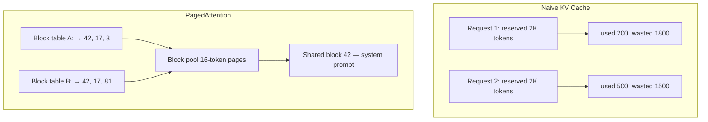
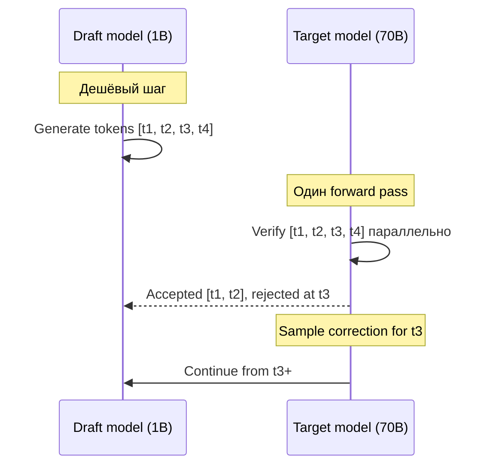

# Вопросы на собеседовании: `LLM Inference Optimization`

**Inference optimization** — выжать максимум `tokens/sec` и минимум `latency` из дорогих GPU. Стек 2026: `vLLM`/`SGLang`/`TensorRT-LLM`, `PagedAttention` + `continuous batching`, `speculative decoding`, `FP8`/`INT4` quantization (`AWQ`, `GPTQ`), `FlashAttention v3`, `prefix caching`. Цена ошибки — `×10` к bill за GPU.

**Дата:** 2026-05-23

## Полезные ссылки

### Официальная документация и авторитетные источники

- [vLLM Documentation](https://docs.vllm.ai/) — основной inference-сервер
- [PagedAttention paper (Kwon et al., 2023)](https://arxiv.org/abs/2309.06180) — основа vLLM
- [FlashAttention paper (Dao et al., 2022)](https://arxiv.org/abs/2205.14135) — v1
- [FlashAttention-2 (Dao, 2023)](https://arxiv.org/abs/2307.08691)
- [FlashAttention-3 (2024)](https://arxiv.org/abs/2407.08608) — H100 FP8
- [AWQ paper (Lin et al., 2023)](https://arxiv.org/abs/2306.00978) — activation-aware квантизация
- [GPTQ paper (Frantar et al., 2022)](https://arxiv.org/abs/2210.17323)
- [Speculative Decoding (Leviathan et al., 2023)](https://arxiv.org/abs/2211.17192)
- [EAGLE paper (Li et al., 2024)](https://arxiv.org/abs/2401.15077) — улучшенная draft-модель
- [Anthropic Prompt Caching](https://docs.anthropic.com/en/docs/build-with-claude/prompt-caching)
- [OpenAI Prompt Caching](https://platform.openai.com/docs/guides/prompt-caching)
- [NVIDIA TensorRT-LLM](https://github.com/NVIDIA/TensorRT-LLM)
- [SGLang RadixAttention](https://lmsys.org/blog/2024-01-17-sglang/)
- [Hugging Face TGI](https://huggingface.co/docs/text-generation-inference/)

## Содержание

- [Полезные ссылки](#полезные-ссылки)
- [See also](#see-also)

**Метрики и autoregressive nature**
- [Q1. (!) Какие метрики важны для LLM inference?](#q1--какие-метрики-важны-для-llm-inference)
- [Q2. (!) Почему LLM inference медленный? Autoregressive nature.](#q2--почему-llm-inference-медленный-autoregressive-nature)
- [Q3. Prefill vs decode stage — в чём разница?](#q3-prefill-vs-decode-stage--в-чём-разница)
- [Q4. Memory-bound vs compute-bound — что лимитирует decode?](#q4-memory-bound-vs-compute-bound--что-лимитирует-decode)

**KV Cache и PagedAttention**
- [Q5. (!) Что такое KV cache и зачем он нужен?](#q5--что-такое-kv-cache-и-зачем-он-нужен)
- [Q6. (!) Как посчитать размер KV cache?](#q6--как-посчитать-размер-kv-cache)
- [Q7. (!) PagedAttention — что это и почему ×24 throughput?](#q7--pagedattention--что-это-и-почему-24-throughput)
- [Q8. KV cache fragmentation — что это?](#q8-kv-cache-fragmentation--что-это)

**Continuous batching**
- [Q9. (!) Static batching vs continuous batching?](#q9--static-batching-vs-continuous-batching)
- [Q10. Iteration-level scheduling — как работает?](#q10-iteration-level-scheduling--как-работает)
- [Q11. Chunked prefill — зачем смешивать prefill и decode?](#q11-chunked-prefill--зачем-смешивать-prefill-и-decode)

**Speculative decoding**
- [Q12. (!) Speculative decoding — суть алгоритма?](#q12--speculative-decoding--суть-алгоритма)
- [Q13. EAGLE и Medusa heads — чем отличаются от классики?](#q13-eagle-и-medusa-heads--чем-отличаются-от-классики)
- [Q14. Когда speculative decoding НЕ помогает?](#q14-когда-speculative-decoding-не-помогает)

**Quantization (FP8/INT4/GPTQ/AWQ)**
- [Q15. (!) FP16/BF16/FP8/INT8/INT4 — таблица форматов?](#q15--fp16bf16fp8int8int4--таблица-форматов)
- [Q16. (!) GPTQ — как работает post-training quantization?](#q16--gptq--как-работает-post-training-quantization)
- [Q17. (!) AWQ — чем отличается от GPTQ?](#q17--awq--чем-отличается-от-gptq)
- [Q18. FP8 на H100 — почему it's a big deal?](#q18-fp8-на-h100--почему-its-a-big-deal)
- [Q19. Weight-only vs activation quantization?](#q19-weight-only-vs-activation-quantization)
- [Q20. GGUF и llama.cpp — для CPU/edge?](#q20-gguf-и-llamacpp--для-cpuedge)

**FlashAttention и Prefix caching**
- [Q21. (!) FlashAttention — почему 2-3× speedup?](#q21--flashattention--почему-2-3-speedup)
- [Q22. (!) Prefix caching / Automatic Prefix Caching (APC)?](#q22--prefix-caching--automatic-prefix-caching-apc)
- [Q23. (!) Anthropic Prompt Caching API — как использовать?](#q23--anthropic-prompt-caching-api--как-использовать)
- [Q24. OpenAI Prompt Caching — чем отличается?](#q24-openai-prompt-caching--чем-отличается)

**Inference servers**
- [Q25. (!) vLLM vs TensorRT-LLM vs TGI vs SGLang — сравнение?](#q25--vllm-vs-tensorrt-llm-vs-tgi-vs-sglang--сравнение)
- [Q26. vLLM config tuning — какие флаги важны?](#q26-vllm-config-tuning--какие-флаги-важны)
- [Q27. llama.cpp, Ollama, MLX — для local/edge?](#q27-llamacpp-ollama-mlx--для-localedge)

**Distributed serving (TP/PP/MoE)**
- [Q28. (!) Tensor Parallelism vs Pipeline Parallelism?](#q28--tensor-parallelism-vs-pipeline-parallelism)
- [Q29. MoE serving — почему Mixtral/DeepSeek сложнее?](#q29-moe-serving--почему-mixtraldeepseek-сложнее)
- [Q30. Multi-LoRA serving (LoRAX, Punica)?](#q30-multi-lora-serving-lorax-punica)
- [Q31. Disaggregated inference (prefill/decode split)?](#q31-disaggregated-inference-prefilldecode-split)

**Cost optimization**
- [Q32. (!) GPU выбор: A100 vs H100 vs H200 vs MI300X?](#q32--gpu-выбор-a100-vs-h100-vs-h200-vs-mi300x)
- [Q33. (!) Cost per 1M tokens — API vs self-host?](#q33--cost-per-1m-tokens--api-vs-self-host)
- [Q34. Batch API (OpenAI/Anthropic) — когда использовать?](#q34-batch-api-openaianthropic--когда-использовать)
- [Q35. (!) Model routing — cheap для simple, expensive для hard?](#q35--model-routing--cheap-для-simple-expensive-для-hard)
- [Q36. Streaming SSE — снижает ли реальную latency?](#q36-streaming-sse--снижает-ли-реальную-latency)


## Q1. (!) Какие метрики важны для LLM inference?

Не одна `latency`, а целая семья:

| Метрика | Что измеряет | Цель |
|---------|--------------|------|
| `TTFT` (Time To First Token) | Задержка до первого токена | <500ms для UX |
| `TPOT` (Time Per Output Token) | Среднее время на следующий токен | <50ms (=20 tok/sec) |
| `Throughput` | `tokens/sec` суммарно по всем requests | Максимизировать |
| `End-to-end latency` | TTFT + TPOT × N | Зависит от длины ответа |
| `Cost` | `$/1M tokens` | Минимизировать при SLA |
| `Goodput` | Доля requests, уложившихся в SLA | >99% |

**Trade-off:** максимизируешь throughput → растёт `TTFT` (большой batch ждёт prefill). Continuous batching смягчает, но не убирает.

**Production-дашборды** должны показывать `p50/p95/p99` отдельно для prefill (`TTFT`) и decode (`TPOT`).


## Q2. (!) Почему LLM inference медленный? Autoregressive nature.

LLM генерирует **по одному токену за раз**:

```
P(token_i | token_1, ..., token_{i-1})
```

Для каждого токена — **полный forward pass** через все слои модели.

**Llama-70B на H100:** ~50 tokens/sec для single request. Ответ 500 токенов = 10 секунд.

**Что нельзя:** распараллелить генерацию токенов внутри одного response — следующий зависит от предыдущего. Можно только параллелить **разные requests** (batching) или **угадывать токены вперёд** (speculative decoding).

**Bottleneck:** на decode-стадии — `memory bandwidth`, не compute. Каждый токен читает все веса модели из HBM. Для Llama-70B FP16 = 140 GB. На H100 (3.35 TB/s HBM) — лимит ~24 tokens/sec для одного запроса при идеальной утилизации.


## Q3. Prefill vs decode stage — в чём разница?

Два радикально разных режима:

**Prefill (обработка промпта):**
- Все токены prompt'а обрабатываются **параллельно**
- `compute-bound` — GPU занят матричными умножениями
- Один проход, генерирует первый output-токен + полный KV cache
- Время ≈ линейно от длины prompt

**Decode (авторегрессионная генерация):**
- Один токен за раз
- `memory-bound` — нужно прочитать все веса для одного токена
- GPU недогружен (compute простаивает), bandwidth насыщён
- Время ≈ линейно от числа output-токенов

**Следствие:** оптимизации разные. Prefill — `FlashAttention`, `chunked prefill`. Decode — `continuous batching` (объединить много decode-шагов), `speculative decoding`, KV cache.


## Q4. Memory-bound vs compute-bound — что лимитирует decode?

**Arithmetic intensity** = FLOPs / bytes. Сравни с `peak_FLOPS / peak_bandwidth` GPU.

**H100 ridge point:** ~290 FLOPs/byte (для BF16). Ниже — `memory-bound`, выше — `compute-bound`.

**Decode batch=1:** ~1-2 FLOPs/byte → жёстко `memory-bound`. GPU compute idle ~90%.

**Что помогает:**
- **Большой batch** — амортизирует чтение весов по N requests. Batch=32 → 32 FLOPs/byte.
- **Quantization** — INT4 уменьшает байты весов в 4 раза.
- **Speculative decoding** — больше токенов за один проход весов.
- **FlashAttention** — меньше чтений из HBM.

**Prefill batch=1, long prompt:** уже `compute-bound`, оптимизации другие.


## Q5. (!) Что такое KV cache и зачем он нужен?

Каждый attention слой считает `Attention(Q, K, V)`. При генерации токена `t`:
- `Q_t` — новый query от токена `t`
- `K_1..K_t`, `V_1..V_t` — keys/values **всех предыдущих токенов**

Без cache: пересчёт `K`, `V` для всех `t` токенов на каждом шаге → `O(n²)` по длине последовательности.

**С KV cache:**
- На шаге `t` считаем только `K_t`, `V_t`, остальные читаем из cache
- Сложность одного шага → `O(n)`
- Trade-off: память растёт линейно с длиной context

**Цена:** для Llama-70B 2K context на FP16 — **~1 GB на один request**. 100 concurrent requests = 100 GB только под KV cache.


## Q6. (!) Как посчитать размер KV cache?

```
kv_cache_bytes = 2 × n_layers × n_kv_heads × head_dim × seq_len × bytes_per_element
```

`2` — отдельно K и V. `bytes_per_element`: FP16=2, FP8=1, INT4=0.5.

**Примеры:**

| Model | Layers | KV heads × dim | Seq 2K (FP16) | Seq 32K (FP16) |
|-------|--------|----------------|---------------|----------------|
| Llama-3-8B | 32 | 8 × 128 | ~256 MB | ~4 GB |
| Llama-3-70B (GQA) | 80 | 8 × 128 | ~640 MB | ~10 GB |
| Llama-3-405B | 126 | 8 × 128 | ~1 GB | ~16 GB |
| Mistral-7B | 32 | 8 × 128 | ~256 MB | ~4 GB |

**GQA (Grouped Query Attention)** в Llama-3/70B радикально сокращает KV cache (8 KV heads вместо 64 Q heads — ×8 экономии vs MHA).

**Long context (128K+)** требует либо много памяти, либо KV quantization (`--kv-cache-dtype fp8`), либо PagedAttention для эффективного использования.


## Q7. (!) PagedAttention — что это и почему ×24 throughput?

**PagedAttention** (Kwon et al., SOSP 2023) — основа vLLM. Идея вдохновлена **страничной виртуальной памятью ОС**.

**Проблема классики:** непрерывный KV cache требует резервировать `max_seq_len` под каждый request заранее. Реально использует, скажем, 30% → 70% памяти впустую.

**Идея:** KV cache хранится в **блоках** (pages) фиксированного размера (обычно 16 токенов). Логическая последовательность → таблица указателей на блоки.

```
Request A (50 tokens): blocks [42, 17, 3, ...]
Request B (50 tokens): blocks [42, 17, 81, ...]  # shared prefix!
```

**Преимущества:**
1. **Нет фрагментации** — все блоки одинаковые
2. **Общие блоки** — beam search, parallel sampling, prefix caching
3. **Эффективность памяти** — упаковка >95% (против ~30% у наивного подхода)
4. **Больший batch** → 2-4× throughput с той же памяти

**Результат из paper:** до **×24 throughput** против HuggingFace transformers (без батчинга). Против TGI — обычно 1.5-2×.




## Q8. KV cache fragmentation — что это?

**Внутренняя фрагментация (internal)** — request зарезервировал место под max_seq_len, а использует меньше. Остаток нельзя отдать другому request.

**Внешняя фрагментация (external)** — между активными requests дыры разного размера, ни одному новому не влезть, хотя суммарно памяти хватает.

**Мир до PagedAttention:**
- HuggingFace transformers: ~20-40% полезного использования KV cache
- Наивный батчинг: padding до максимальной длины батча

**После PagedAttention:**
- Внутренняя: <4% (последний неполный блок)
- Внешняя: 0 (все блоки одинаковые)
- Итог: **эффективность памяти >95%**

**Эффект:** на той же GPU можно держать в 2-3× больше одновременных requests → выше throughput.


## Q9. (!) Static batching vs continuous batching?

```mermaid
gantt
    title Static vs Continuous Batching
    dateFormat X
    axisFormat %s

    section Static
    Req A 50 tok        :0, 5
    Req B 200 tok       :0, 20
    Req C 30 tok (wait) :0, 20
    Req D (queue)       :20, 5

    section Continuous
    Req A 50 tok        :0, 5
    Req B 200 tok       :0, 20
    Req C 30 tok        :0, 3
    Req D                :3, 8
    Req E                :5, 10
```



**Static batching:** собираем batch из N requests, ждём пока **все** закончат, потом следующий batch.
- Короткие requests ждут самый длинный
- GPU недогружен после первых завершений
- Высокая `TTFT` для новых requests

**Continuous batching** (iteration-level scheduling, Yu et al. 2022 — Orca):
- На каждой итерации (= один decode step) можно добавить новый request
- Завершённый request освобождает slot **сразу**
- Все активные requests декодируют параллельно

**Прирост:** 5-10× throughput против static при том же GPU. По умолчанию в vLLM, TGI, TensorRT-LLM, SGLang.


## Q10. Iteration-level scheduling — как работает?

Каждую **итерацию** (≈один decode step, ~30-50ms):

1. **Scheduler** смотрит свободные KV-блоки
2. Решает: добавить новые requests из очереди (если хватает KV) или нет
3. Решает: какие активные requests продолжить
4. **Если KV cache переполняется** — **preemption** (вытеснение):
   - `swap` — выгрузить часть на CPU RAM
   - `recompute` — выкинуть KV, при возобновлении пересчитать prefill

**Параметры (knobs) в vLLM:**
- `--max-num-seqs` — максимум одновременных sequences (по умолчанию 256)
- `--max-num-batched-tokens` — лимит на batch (обычно 8192-32768)
- `--scheduling-policy` — `fcfs` (FIFO) или `priority`

**Побочный эффект:** TTFT нового request зависит от длины prefill. Длинный prompt (32K) блокирует decode остальных на сотни ms → решение `chunked prefill`.


## Q11. Chunked prefill — зачем смешивать prefill и decode?

**Проблема:** длинный prompt (32K токенов) на prefill занимает GPU на 500ms-1s. В это время все decode-requests стоят → всплеск `TPOT`.

**Chunked prefill** (vLLM 0.4+, SGLang):
- Бить prefill на куски по `N` токенов (например, 512)
- В каждом batch — смесь prefill-chunk + decode-токенов активных requests
- GPU занят полезной работой, decode не блокируется

```
Batch N:    [decode_A, decode_B, prefill_C_chunk_1]
Batch N+1:  [decode_A, decode_B, prefill_C_chunk_2]
Batch N+2:  [decode_A, decode_B, decode_C]  # prefill finished
```

**Включить в vLLM:** `--enable-chunked-prefill` (с 0.5+ включено по умолчанию для long context).

**Профит:** P99 `TPOT` падает в 3-5×, throughput почти не страдает.


## Q12. (!) Speculative decoding — суть алгоритма?

**Идея** (Leviathan et al., 2023): угадать N токенов **маленькой** моделью, а **большая** модель проверит их **за один проход**.



**Алгоритм:**
1. Draft-модель генерирует `k` токенов (быстро)
2. Target-модель делает **один forward pass** на эти `k` токенов параллельно — получает свои распределения вероятностей
3. **Rejection sampling**: токен `i` принят, если `target_prob[i] ≥ draft_prob[i]`, иначе отклоняем и пересэмплируем из target
4. Все принятые токены идут в ответ, после отклонения снова стартуем с draft

**Ускорение:** 2-3× при `acceptance rate ~70%`. Гарантирует **идентичное** распределение target (математически эквивалентно).

**Кандидаты в draft:**
- Llama-3-8B → Llama-3-70B (разница ×8)
- Llama-3-1B → Llama-3-405B
- `n-gram` draft (вообще без модели, для code/structured)


## Q13. EAGLE и Medusa heads — чем отличаются от классики?

**Medusa** (Cai et al., 2024) — добавить **несколько decoding-голов (heads)** прямо в target-модель:
- N дополнительных голов предсказывают токены t+1, t+2, ..., t+N параллельно
- Tree-based верификация — пробует много кандидатов
- Ускорение 2-3× без отдельной draft-модели
- Требует fine-tuning самого target

**EAGLE** (Li et al., 2024) — улучшенный draft на уровне фичей (feature level):
- Draft предсказывает не токены, а **features** предпоследнего слоя target
- Acceptance rate выше → ускорение 3-4×
- EAGLE-2/3 (2024-2025) — адаптивное draft-дерево

**Lookahead decoding** — n-gram-кэш из предыдущей генерации, без модели.

**В vLLM 2025:** нативные `--speculative-model`, `--num-speculative-tokens`. EAGLE — через `eagle-config`.


## Q14. Когда speculative decoding НЕ помогает?

**Замедляет или не даёт выигрыша:**

1. **Высокий batch** — большая модель уже compute-bound, спекуляция добавляет overhead draft-модели
2. **Низкий acceptance rate** (<30%) — draft слишком тупой или задача сложная (творческие тексты, длинный reasoning)
3. **Несовпадение семейств** — draft не из той же семьи (Mistral-draft для Llama-target)
4. **Очень короткие ответы** — overhead не амортизируется
5. **Reasoning-модели** (`o1`, `Claude Sonnet thinking`) с длинными CoT — draft часто промахивается на шагах рассуждений

**Где работает отлично:**
- Генерация кода (предсказуемые паттерны)
- Перевод (детерминированный)
- Структурированный вывод (JSON, схемы)
- Чат с batch=1, критичный к latency

**Rule of thumb:** проверять на своём workload — ускорение сильно зависит от данных.


## Q15. (!) FP16/BF16/FP8/INT8/INT4 — таблица форматов?

| Format | Bits | Диапазон/точность | Hardware | Применение |
|--------|------|-----------------|----------|----------|
| `FP32` | 32 | Полная | Любой | Legacy training |
| `FP16` | 16 | ±65K, 3 десятичных | V100+ | Обучение/inference |
| `BF16` | 16 | ±3e38, 2 десятичных | A100+, TPU | Обучение (стабильно) |
| `FP8 E4M3` | 8 | ±448, веса | H100+, MI300 | Веса, forward pass |
| `FP8 E5M2` | 8 | ±57K, градиенты | H100+ | Backward pass |
| `INT8` | 8 | -128..127 | Все GPU | Inference, ниже точность |
| `INT4` | 4 | -8..7 | A100+ (через CUTLASS) | GPTQ/AWQ inference |
| `NF4` | 4 | NormalFloat | QLoRA | Fine-tuning |
| `2-bit` | 2 | research | Кастомные kernels | Edge, экспериментально |
| `1.58-bit` | log2(3) | -1/0/+1 | BitNet (research) | На будущее |

**Память для Llama-3-70B:**
- FP16: 140 GB → 2× H100 80GB
- INT8: 70 GB → 1× H100 80GB
- INT4 (AWQ): 35 GB → 1× A100 40GB или RTX 4090×2

**Качество:** FP16→INT8 — обычно падение <1% на бенчмарках. FP16→INT4 — падение 1-3% (зависит от метода).


## Q16. (!) GPTQ — как работает post-training quantization?

**GPTQ** (Frantar et al., 2022) — квантизация **обученной** модели слой за слоем, **без переобучения**.

**Алгоритм:**
1. Берём калибровочный датасет (128-1024 примеров)
2. Для каждого linear-слоя:
   - Считаем Hessian `H = 2 × X^T X` (матрицу важности весов)
   - Квантуем веса колонка за колонкой
   - **Компенсация ошибки** — после квантизации колонки `i` размазываем ошибку на оставшиеся колонки (через `H^-1`)
3. Минимизирует `||W × X - W_quant × X||²`

**Параметры:**
- `bits=4`, `group_size=128` — обычная настройка
- `desc_act=True` — порядок колонок по важности (улучшает качество)

**Падение качества:** Llama-2-70B → INT4 GPTQ: <1% на MMLU.

**Использование:**

```bash
# vLLM serves GPTQ-quantized models
python -m vllm.entrypoints.openai.api_server \
  --model TheBloke/Llama-2-70B-GPTQ \
  --quantization gptq
```

**Готовые модели:** `TheBloke/*-GPTQ` на HuggingFace (тысячи).


## Q17. (!) AWQ — чем отличается от GPTQ?

**AWQ** (Activation-aware Weight Quantization, Lin et al., 2023) — авторы заметили: **0.1-1% весов важны непропорционально сильно**.

**Идея:** не все веса равны. Веса, через которые проходят большие активации, **критичнее**. Их нужно сохранить с большей точностью.

**Алгоритм:**
1. На калибровочных данных считаем `|X|` per-channel (величину активаций)
2. Находим `salient` каналы (топ-1%)
3. **Масштабируем** salient-веса вверх перед квантизацией, а активации — обратно вниз:
   ```
   y = (W / s) × (s × x)   # math equivalent
   ```
4. Это сохраняет salient-веса с большей точностью

**По сравнению с GPTQ:**
- Лучше perplexity, особенно на instruction-tuned моделях
- Калибровка быстрее (нет Hessian)
- Лучше обобщается на out-of-domain
- Дружелюбнее к железу (нет странных перестановок групп)

**В vLLM:**

```bash
python -m vllm.entrypoints.openai.api_server \
  --model casperhansen/llama-3-70b-instruct-awq \
  --quantization awq
```

В **2025** AWQ — **выбор по умолчанию** для INT4-квантизации.


## Q18. FP8 на H100 — почему it's a big deal?

**H100** добавил нативные **FP8 Tensor Cores** — 2× compute throughput против FP16 и вдвое меньше памяти.

**Форматы:**
- `E4M3`: 4 бита экспоненты + 3 мантиссы, диапазон ±448. Для **весов** и forward-активаций.
- `E5M2`: 5 бит экспоненты + 2 мантиссы, диапазон ±57K. Для **градиентов** (обучение).

**Per-tensor / per-row scaling:** масштабный коэффициент, чтобы избежать переполнения (overflow).

**Выгоды для inference:**
- **Throughput** ×1.5-2× против FP16
- **KV cache** в FP8 → вдвое больший batch
- **Падение качества** очень маленькое (<0.5%) при правильной калибровке

**В vLLM 2025:**

```bash
python -m vllm.entrypoints.openai.api_server \
  --model neuralmagic/Meta-Llama-3-70B-Instruct-FP8 \
  --quantization fp8 \
  --kv-cache-dtype fp8
```

**Где работает:** H100, H200, B100/B200, MI300X (своя реализация). Не работает на A100 (нет FP8-ядер — будет эмуляция).


## Q19. Weight-only vs activation quantization?

**Weight-only (W4A16):**
- Веса в INT4/INT8, активации остаются FP16
- Перед matmul веса деквантуются в FP16 на лету
- Большинство методов: GPTQ, AWQ, GGUF Q4_K_M
- Простой, минимальное падение качества
- Не использует INT-тензорные ядра напрямую

**Weight + Activation (W8A8 / W4A8):**
- Квантуем и веса, и активации
- Используем INT8 Tensor Cores → 2× compute
- Сложнее, больше падение качества (особенно из-за выбросов/outliers в активациях)
- Примеры: `SmoothQuant`, `OmniQuant`

**FP8 W8A8:** компромисс через H100, без проблем с выбросами (диапазон FP8 шире INT8).

**Практика 2025:**
- Decode `memory-bound` → **выигрывает weight-only** (грузит меньше данных)
- Prefill `compute-bound` для long context → W8A8 FP8 даёт ускорение вычислений
- Гибрид: `--quantization awq` (W4A16) + `--kv-cache-dtype fp8` — лучшее из обоих миров


## Q20. GGUF и llama.cpp — для CPU/edge?

**GGUF** (GPT-Generated Unified Format) — формат `llama.cpp`. Квантизации:

| Type | Bits | Размер Llama-3-8B | Применение |
|------|------|-----------------|-----|
| `Q8_0` | 8 | 8.5 GB | Сервер, максимум качества |
| `Q6_K` | 6.5 | 6.6 GB | Сбалансированно |
| `Q5_K_M` | 5.7 | 5.7 GB | Рекомендуется для ноутбука |
| `Q4_K_M` | 4.8 | 4.9 GB | Дефолтный sweet spot |
| `Q3_K_M` | 3.9 | 4.0 GB | Edge, мало RAM |
| `Q2_K` | 2.6 | 3.2 GB | Телефоны, сильная деградация |

**Особенность:** **смешанная точность (mixed precision)** — важные слои держат больше бит (например, `K`/`V` attention в Q6, FFN в Q4).

**Где использовать:**
- **CPU inference** (AVX2, AVX-512)
- **Apple Silicon** через Metal (M1-M4)
- **Мобильные** (Android через JNI, iOS)
- **Edge-устройства** (Jetson, RPi 5)

**Обёртки:** `Ollama`, `LM Studio`, `Jan` — удобный UI поверх `llama.cpp`.

**Не для production GPU serving** — там vLLM/TensorRT в разы быстрее.


## Q21. (!) FlashAttention — почему 2-3× speedup?

**Обычный attention:**
```
S = Q @ K^T          # write N×N matrix to HBM
P = softmax(S)       # read N×N, write N×N
O = P @ V            # read N×N
```

Каждый шаг — round-trip через HBM (медленная память). Для seq_len=8K → ~16 GB трафика.

**FlashAttention** (Dao et al., 2022):
- **Tiling** — разбить Q/K/V на блоки, помещающиеся в SRAM (~100 KB)
- Вычислять softmax инкрементально (`online softmax`)
- **Пересчёт (recomputation)** в backward вместо хранения
- Никогда не материализуем полную матрицу `N×N`

**Результат:**
- ускорение по wall-clock ×2-3
- экономия памяти ×5-20 → длиннее context (32K, 128K, 1M)
- IO-aware алгоритм — оптимизирует трафик HBM↔SRAM

**Версии:**
- **v1** (2022) — A100
- **v2** (2023) — лучше parallelism по seq_len
- **v3** (2024) — H100, FP8, asynchronous warp specialization, +1.5-2× против v2

**Где:** встроено в vLLM, TGI, TensorRT-LLM, PyTorch SDPA (`torch.nn.functional.scaled_dot_product_attention`).


## Q22. (!) Prefix caching / Automatic Prefix Caching (APC)?

**Сценарий:** RAG, агенты, многораундовый чат — все requests делят общий **system prompt + примеры + retrieved docs**. Без кэша prefill повторяется каждый раз.

**Prefix caching:**
- Хэшируем токены префикса
- Кэшируем KV-блоки для уже виденных префиксов
- Новый request с тем же префиксом переиспользует KV, prefill идёт **только для нового suffix**

**vLLM:**

```bash
python -m vllm.entrypoints.openai.api_server \
  --model meta-llama/Llama-3-70B-Instruct \
  --enable-prefix-caching
```

**Кэширование идёт на уровне блоков PagedAttention** — гранулярность 16 токенов. Хэш блока — это содержимое + хэш предыдущего → детерминированно.

**SGLang RadixAttention:**
- Trie (radix tree) из всех закэшированных префиксов
- Эффективный поиск самого длинного общего префикса
- Поддерживает ветвление (parallel sampling)

**Прирост:** для RAG с 4K общего контекста — **3-10× throughput**, TTFT падает в 5-50×.


## Q23. (!) Anthropic Prompt Caching API — как использовать?

**Anthropic Prompt Caching** (GA 2024-2025) — кэширование на стороне сервера, **TTL 5 минут** (можно расширить до 1h за дополнительную плату).

```python
response = client.messages.create(
    model="claude-sonnet-4-5",
    max_tokens=1024,
    system=[
        {
            "type": "text",
            "text": "You are an expert in cardiology...",
            "cache_control": {"type": "ephemeral"}  # cache this!
        },
        {
            "type": "text",
            "text": "Patient history: [50K tokens]",
            "cache_control": {"type": "ephemeral"}  # cache this too
        }
    ],
    messages=[{"role": "user", "content": "Diagnose..."}]
)
```

**Цены:**
- **Запись в кэш (cache write)**: +25% к стандартной цене input (разово)
- **Чтение из кэша (cache read)**: −90% от цены input (огромная экономия)
- **Минимум для кэширования**: 1024 токена (для Haiku — 2048)

**Точка окупаемости:** уже при **2-3 переиспользованиях** — экономишь.

**Сценарии:**
- Многоступенчатые агенты (большой system prompt)
- RAG с большим контекстом документов
- Долгие диалоги (кэшируем историю)
- Document Q&A (кэшируем документ один раз)

**Кэшируется:** до 4 точек разрыва (cache breakpoints). Каждая — своя гранулярность (нельзя ломать порядок).


## Q24. OpenAI Prompt Caching — чем отличается?

**OpenAI Prompt Caching** (Oct 2024) — **автоматический**, без изменений API.

**Особенности:**
- Поиск в кэше по совпадению префикса (как RadixAttention)
- **−50%** на закэшированные input-токены (против −90% у Anthropic)
- TTL **5-10 минут** (≤ 1 час в непиковое время)
- Минимум для кэширования: **1024 токена**
- **Никаких изменений API** — просто структурируй prompt: статичный префикс → динамический suffix
- Поддерживается на `gpt-4o`, `gpt-4o-mini`, серии `o1`

**По сравнению с Anthropic:**

| Параметр | OpenAI | Anthropic |
|---------|--------|-----------|
| Изменение API | Нет (авто) | Да (`cache_control`) |
| Стоимость записи в кэш | 0 | +25% |
| Скидка на чтение из кэша | -50% | -90% |
| TTL | 5-10 мин | 5 мин (или 1h за надбавку) |
| Гранулярность | Авто-совпадение | Явные breakpoints (до 4) |
| Минимум токенов | 1024 | 1024 (2048 для Haiku) |

**Замечание про vendor lock-in:** при self-host через vLLM `--enable-prefix-caching` получаешь **на 100% бесплатно**, без лимитов TTL.


## Q25. (!) vLLM vs TensorRT-LLM vs TGI vs SGLang — сравнение?

| Сервер | Происхождение | Сильные стороны | Слабые стороны | Применение |
|--------|--------|----------|----------|----------|
| **vLLM** | UC Berkeley OSS | PagedAttention, простой запуск, широкая поддержка моделей, prefix caching | Чуть медленнее TRT-LLM | Дефолт 2025 |
| **TensorRT-LLM** | NVIDIA | Самый быстрый (kernel fusion, кастомные ops), лучший FP8 | Сложная сборка, только NVIDIA, медленные итерации | Максимум perf в prod |
| **TGI** | Hugging Face | Production-ready, ядро на Rust, экосистема | Догоняет по фичам | Workflow вокруг HF Hub |
| **SGLang** | LMSYS | RadixAttention-префикс, структурированный вывод, быстрейший для чата | Новее, меньше моделей | Агенты, сложные приложения |
| **llama.cpp** | OSS | CPU/edge/Apple Silicon, GGUF | Медленнее на масштабе | Локально, embedded |
| **MLX** | Apple | Unified memory, M-серия | Только Apple | Разработка на Mac |

**Бенчмарк 2025 (Llama-3-70B, H100, throughput):**
- TensorRT-LLM: ~2200 tok/s
- vLLM (последний): ~1900 tok/s
- SGLang: ~2000 tok/s (с попаданиями в prefix-кэш — выше)
- TGI: ~1500 tok/s

**Как выбрать:**
- Не уверен → **vLLM**
- Максимум perf на H100 → **TensorRT-LLM**
- Активный prefix sharing (агенты) → **SGLang**
- Экосистема HF → **TGI**


## Q26. vLLM config tuning — какие флаги важны?

```bash
python -m vllm.entrypoints.openai.api_server \
  --model meta-llama/Llama-3-70B-Instruct \
  --tensor-parallel-size 2 \
  --max-model-len 32768 \
  --gpu-memory-utilization 0.92 \
  --max-num-seqs 256 \
  --max-num-batched-tokens 16384 \
  --enable-prefix-caching \
  --enable-chunked-prefill \
  --quantization fp8 \
  --kv-cache-dtype fp8 \
  --speculative-model meta-llama/Llama-3-8B \
  --num-speculative-tokens 5 \
  --port 8000
```

**Главные параметры:**

| Флаг | Что делает | Подсказка по тюнингу |
|------|------------|-------------|
| `--tensor-parallel-size` | Разбивает веса по N GPU | = число GPU в ноде |
| `--max-model-len` | Максимальное окно контекста | Ограничивает KV |
| `--gpu-memory-utilization` | Доля VRAM под KV | 0.85-0.95 |
| `--max-num-seqs` | Одновременные requests | 128-512 |
| `--max-num-batched-tokens` | Бюджет токенов на batch | 4K-32K |
| `--enable-prefix-caching` | Включить APC | Всегда включать при общем префиксе |
| `--enable-chunked-prefill` | Смешивать prefill+decode | Включать для long context |
| `--quantization` | `awq`/`gptq`/`fp8`/`bitsandbytes` | По модели |
| `--kv-cache-dtype` | `auto`/`fp8` | FP8 на H100 — 2× batch |
| `--speculative-model` | Draft-модель | Если acceptance >50% |
| `--swap-space` | CPU swap в GB | 4-16 для preemption |


## Q27. llama.cpp, Ollama, MLX — для local/edge?

**llama.cpp:**
- inference-движок на C/C++ от Georgi Gerganov
- CPU (AVX2/AVX-512), CUDA, Metal, Vulkan, ROCm
- Формат GGUF
- Квантизации 2-8 бит
- Серверный режим: `./server -m model.gguf --port 8080` (совместим с OpenAI)

**Ollama** (Go-обёртка над llama.cpp):
```bash
ollama run llama3:70b           # auto-download, run, REPL
ollama serve                    # HTTP API at :11434
ollama pull deepseek-r1:32b
```
- Автоуправление моделями, простой `Modelfile`
- API совместим с клиентами OpenAI
- Дефолт для локальной разработки в 2025

**MLX** (Apple):
- Нативный фреймворк для Apple Silicon (unified memory)
- Библиотека MLX-LM для LLM
- На M3 Max 128GB можно запустить Llama-3-70B FP16
- `mlx_lm.server` — HTTP API

**Когда что:**
- Локально на Mac → **MLX** (быстрее llama.cpp на M-серии)
- Локально на Linux/Win → **Ollama** (проще)
- Edge/embedded → **llama.cpp** напрямую
- Production GPU → **vLLM**, не эти варианты


## Q28. (!) Tensor Parallelism vs Pipeline Parallelism?

Когда модель не влезает в одну GPU.

**Tensor Parallelism (TP):**
- Разбиваем **внутри каждого слоя** по размерности
- Attention heads: разные heads на разных GPU
- FFN: разбиение по hidden dim
- Latency не растёт (параллельные вычисления)
- Требует **быстрый interconnect** (NVLink, не PCIe)
- Коммуникация на каждом слое (`all-reduce`)

**Pipeline Parallelism (PP):**
- Разбиваем **по слоям**: GPU 0 — слои 0-19, GPU 1 — 20-39, ...
- Передача активаций между GPU
- Меньше коммуникации
- Работает по PCIe / RDMA
- **Pipeline bubble** — конвейер нужно «прогреть»
- Latency растёт линейно с числом стадий

**Sequence Parallelism / Context Parallelism:** для очень длинного контекста (1M+) — разбиение по seq-размерности.

**Практика vLLM:**
```bash
--tensor-parallel-size 4        # 4 GPU в одном node через NVLink
--pipeline-parallel-size 2      # 2 nodes по 4 GPU = 8 GPU total
```

**Rule of thumb:**
- В одной машине с NVLink — TP
- Между нодами — PP (или комбо TP+PP)
- Сверхдлинный контекст — добавить SP/CP


## Q29. MoE serving — почему Mixtral/DeepSeek сложнее?

**Mixture of Experts:** разреженная активация. Слой имеет `M` экспертов, router выбирает `K` (обычно K=2) на токен.

**Mixtral 8x7B:** 8 экспертов × 7B параметров на FFN, активны 2 → эффективный compute как у 12.9B, но веса 47B надо хранить.

**DeepSeek-V3:** всего 671B, активны 37B. 256 маршрутизируемых экспертов + 1 общий, top-9 на токен.

**Сложности serving:**
1. **Память** — нужно держать **всех** экспертов (вес большой), а активна только часть
2. **Overhead маршрутизации** — каждый токен может уйти к разным экспертам → нет нормального батчинга по экспертам
3. **Дисбаланс нагрузки** — популярные эксперты перегружены, остальные простаивают
4. **Expert parallelism** — разбиение экспертов по GPU, но коммуникация **all-to-all**
5. **Кэширование** — KV cache не зависит от router, но решения маршрутизации — это дополнительные данные

**Инструменты:**
- vLLM поддерживает Mixtral/DeepSeek с `--expert-parallel-size`
- SGLang оптимизирован под DeepSeek (LMSYS делает совместно)
- DeepSpeed-MoE — академический baseline

**Реальность по TPS:** активные параметры занижают настоящую стоимость — нужна большая VRAM под веса всех экспертов.


## Q30. Multi-LoRA serving (LoRAX, Punica)?

**Сценарий:** SaaS с fine-tuning на каждого арендатора. 1000 клиентов = 1000 дообученных моделей. Нельзя держать 1000 копий базы.

**Решение:** **базовая модель + LoRA-адаптеры**. Адаптер — пара матриц `A (r × d)` и `B (d × r)`, где `r=8-64` (rank). Маленький (~10-100 MB), а база 14-140 GB.

**Multi-LoRA inference:**
- Одна базовая модель в памяти
- Сотни LoRA-адаптеров подгружаются по требованию (hot cache)
- В одном batch разные requests могут использовать разные адаптеры
- Специальные kernels (`bgmv`, `sgmv`) выполняют per-request LoRA в одном batched matmul

**Инструменты:**
- **LoRAX** (Predibase) — production-serving multi-LoRA
- **Punica** — академический, основа для batched LoRA-kernels
- **vLLM** — `--enable-lora --max-loras 16 --max-lora-rank 64`, динамически грузит адаптеры

```bash
python -m vllm.entrypoints.openai.api_server \
  --model meta-llama/Llama-3-8B \
  --enable-lora \
  --max-loras 32 \
  --lora-modules customer_a=/loras/cust_a customer_b=/loras/cust_b
```

В request: `"model": "customer_a"` — vLLM применит нужный адаптер.


## Q31. Disaggregated inference (prefill/decode split)?

**Проблема:** prefill (compute-bound, нужен FLOPS) и decode (memory-bound, нужен bandwidth) имеют **разные оптимальные конфиги**. Совмещение на одной GPU = компромисс.

**Disaggregated serving (разделённый):**
- **Prefill-инстансы** — GPU с большим compute (H100), оптимизированы под throughput prefill
- **Decode-инстансы** — GPU с большим bandwidth (H200/MI300X), оптимизированы под decode-батчинг
- Между ними — передача KV cache (NVLink, RDMA)

**Системы:**
- **DistServe** (2024) — академический прототип
- **Mooncake** (Moonshot AI) — production для Kimi
- **TensorRT-LLM** — есть поддержка разделения
- **vLLM** — disaggregated в экспериментальном статусе, в roadmap

**Профит:**
- TTFT и TPOT тюнятся независимо
- 1.5-2× throughput при том же числе GPU
- Лучше SLA goodput

**Минусы:** сложность, overhead на передачу KV, требует жирный interconnect.


## Q32. (!) GPU выбор: A100 vs H100 vs H200 vs MI300X?

| GPU | VRAM | HBM BW | FP16 TFLOPs | FP8 TFLOPs | Год | Применение |
|-----|------|--------|-------------|------------|------|-----|
| **A100 80GB** | 80 GB HBM2e | 2 TB/s | 312 | – | 2020 | Рабочая лошадка, без FP8 |
| **H100 80GB** | 80 GB HBM3 | 3.35 TB/s | 1979 | 3958 | 2022 | Дефолт 2024-25 |
| **H100 NVL 94GB** | 94 GB | 3.9 TB/s | 1979 | 3958 | 2023 | Вариант под LLM |
| **H200** | 141 GB HBM3e | 4.8 TB/s | 1979 | 3958 | 2024 | Long context, KV |
| **B100** | 192 GB HBM3e | 8 TB/s | ~3500 | 7000 | 2024 | Blackwell |
| **B200** | 192 GB HBM3e | 8 TB/s | ~4500 | 9000 | 2024-25 | Топовый уровень |
| **AMD MI300X** | 192 GB HBM3 | 5.3 TB/s | 1300 | 2600 | 2024 | Альтернатива NVIDIA, ROCm |
| **RTX 4090** | 24 GB GDDR6X | 1 TB/s | 165 | 330 | 2022 | Хобби, одна 7-13B |

**Выбор:**
- **Llama-3-8B FP16:** A100 / 4090 / даже Mac M-серии
- **Llama-3-70B INT4:** 1× A100 80GB или 1× 4090×2
- **Llama-3-70B FP16:** 2× H100 / 1× H200 / 1× MI300X
- **Llama-3-405B FP8:** 8× H100 / 4× B200 / 4× MI300X
- **Long context 1M:** H200/B200 ради HBM, либо распределённо

**TPU/Inferentia:** дешевле в Google Cloud / AWS соответственно, но другой toolchain (JAX/XLA / Neuron SDK).


## Q33. (!) Cost per 1M tokens — API vs self-host?

**Цены API (ориентир Q2 2026):**

| Модель | Input / 1M | Output / 1M | Cached input |
|-------|-----------|-------------|--------------|
| `claude-sonnet-4-5` | $3 | $15 | $0.30 |
| `claude-haiku-4-5` | $1 | $5 | $0.10 |
| `gpt-4o` | $2.50 | $10 | $1.25 |
| `gpt-4o-mini` | $0.15 | $0.60 | $0.075 |
| `o1` | $15 | $60 | $7.50 |
| `deepseek-v3` (API) | $0.27 | $1.10 | $0.07 |
| `gemini-2.5-pro` | $1.25 | $10 | – |

**Self-host Llama-3-70B на 1× H100 (AWS p5.48xlarge ~$98/час за GPU):**
- Throughput vLLM FP8: ~2000 tokens/sec суммарно (output)
- За час: 2000 × 3600 = 7.2M токенов
- **$98 / 7.2M = $13.6 / 1M output-токенов**

При утилизации 50% → $27 / 1M. Доминирует output.

**Точка окупаемости:**
- API дешевле примерно до **100M токенов/мес**
- Self-host экономнее при **>500M токенов/мес** при постоянной нагрузке
- Compliance / privacy / data residency могут перевесить цену

**Стек оптимизаций:**
1. **Prompt caching** → -50% … -90% на input (огромный выигрыш для RAG)
2. **Batch API** → -50% на не-realtime (поддерживают Anthropic, OpenAI)
3. **Маршрутизация моделей** → дешёвая модель на 80% запросов
4. **Квантизация при self-host** → INT4 вмещает 70B на одной 80GB GPU


## Q34. Batch API (OpenAI/Anthropic) — когда использовать?

**Batch API:**
- Отправляешь job (JSONL-файл с requests), получаешь результат в течение **24 часов**
- **−50% от обычной цены** input/output
- Не для realtime — для фоновых задач

**Когда подходит:**
- Эмбеддинг большого корпуса
- Разметка / категоризация данных
- Генерация синтетических данных
- Периодическая генерация отчётов
- Обработка документов (за ночь)

**Когда НЕ подходит:**
- Realtime-чат, обращённый к пользователю
- Жёсткий SLA по дедлайну
- Итеративные эксперименты (задержка в 24h)

**OpenAI Batch:**
```python
batch = client.batches.create(
    input_file_id=file.id,
    endpoint="/v1/chat/completions",
    completion_window="24h"
)
```

**Anthropic Message Batches:**
```python
batch = client.messages.batches.create(requests=[...])
```

**Эквивалент при self-host:** своя очередь + vLLM offline mode (`LLM.generate(...)` на массив) — без скидки 50%, но и без лимитов API.


## Q35. (!) Model routing — cheap для simple, expensive для hard?

**Идея:** не каждому запросу нужен GPT-4o. ~70% типичного трафика — простые задачи (классификация, простой Q&A, резюме для RAG), которые решит `gpt-4o-mini` или `Haiku` в 10× дешевле.

**Стратегии маршрутизации:**

1. **На правилах (rule-based)** — по домену/intent. «summarize → дешёвая», «code review → сильная»
2. **На классификаторе** — маленькая модель классифицирует сложность:
   - `RouteLLM` (LMSYS) — open-source router
   - `Martian` (коммерческий)
3. **Каскад** — сначала дешёвая, эскалация при низкой уверенности
4. **Multi-armed bandit** — онлайн A/B-обучение

**Пример RouteLLM:**
```python
from routellm.controller import Controller

router = Controller(
    routers=["mf"],  # matrix factorization router
    strong_model="gpt-4o",
    weak_model="gpt-4o-mini"
)
response = router.completion(messages=[...], model="router-mf-0.116")
```

**Реальные результаты:** 50-80% запросов уходят в слабую модель, падение качества <5% при правильной калибровке порога. **Экономия: 3-7×**.


## Q36. Streaming SSE — снижает ли реальную latency?

**Streaming** (Server-Sent Events): сервер шлёт каждый токен сразу, как только тот сгенерирован, клиент отображает его постепенно.

**Не снижает** end-to-end (полный ответ всё ещё `TTFT + N × TPOT`), но **резко снижает воспринимаемую latency**:
- Без streaming: пользователь видит **полный ответ через 10s** для ответа в 500 токенов
- Со streaming: первый токен через **500ms**, остальные текут → ощущение мгновенности

**Реализация:**

```python
# Server (FastAPI + vLLM)
@app.post("/chat")
async def chat(request: Request):
    return StreamingResponse(
        generate_stream(request),
        media_type="text/event-stream"
    )

# OpenAI client
stream = client.chat.completions.create(
    model="gpt-4o",
    messages=[...],
    stream=True
)
for chunk in stream:
    print(chunk.choices[0].delta.content or "", end="")
```

**Формат SSE:**
```
data: {"choices": [{"delta": {"content": "Hello"}}]}

data: {"choices": [{"delta": {"content": " world"}}]}

data: [DONE]
```

**Подводные камни:**
- Буферизация HTTP/2 — отключить заголовком `X-Accel-Buffering: no` на nginx
- `gzip`-middleware ломает SSE — исключить
- Reverse proxy (CloudFront, Cloudflare) — нужен flush
- Считай **TTFT отдельно** от total — это главная UX-метрика для чата

---

## See also

- [Model Serving](model-serving-interview.md) — общий обзор serving stack
- [LLM Basics](llm-basics-interview.md) — что такое attention, transformer
- [MLOps](mlops-interview.md) — operations контекст
- [Fine-tuning LLM](fine-tuning-llm-interview.md) — откуда берутся кастомные веса
- [Reasoning Models](reasoning-models-interview.md) — o1/R1 specific inference
- [LLM Integration Patterns](llm-integration-patterns-interview.md) — caching на app уровне
- [RAG](rag-interview.md) — где prefix caching критичен
- [AI Agents](ai-agents-interview.md) — multi-turn = shared prefix
- [Network Performance](../performance/network-performance-interview.md) — SSE, HTTP/2, gRPC
- [Scalability Patterns](../architecture/scalability-patterns-interview.md) — auto-scaling, queue
- [Latency Numbers](../architecture/latency-numbers-interview.md) — GPU HBM vs DRAM vs SSD
- [Memory Management](../performance/memory-management-interview.md) — KV cache как memory pool
- [Kubernetes](../devops/kubernetes-interview.md) — GPU node pools, resource limits
