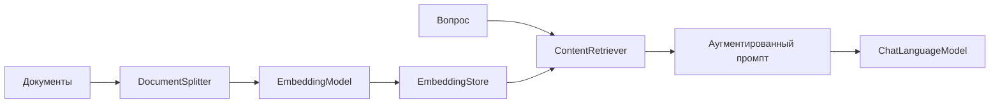

# Вопросы на собеседовании: `LangChain4j`

`LangChain4j` — это Java-библиотека для построения приложений на больших языковых моделях (`LLM`). Она даёт единый API поверх разных провайдеров (`OpenAI`, `Ollama`, `Anthropic`, `Azure`, `Google` и др.), декларативные `AI Services`, память диалога, вызов инструментов и готовый `RAG`-пайплайн.

`LangChain4j` — это «третий путь» для AI на JVM наряду со `Spring AI`: если `Spring AI` глубоко завязан на экосистему `Spring`, то `LangChain4j` фреймворк-нейтрален и одинаково хорошо работает в `Spring Boot`, `Quarkus`, `Micronaut` или вообще без фреймворка.

Дата последнего обновления: 2026-06-24

## Полезные ссылки

### Официальная документация

- [LangChain4j Documentation](https://docs.langchain4j.dev/) — официальная документация
- [LangChain4j GitHub](https://github.com/langchain4j/langchain4j) — исходники и примеры
- [Introduction to LangChain (Baeldung)](https://www.baeldung.com/java-langchain-basics) — вводный гайд
- [AI Chatbot with LangChain4j and MongoDB Atlas (Baeldung)](https://www.baeldung.com/java-langchain-mongodb) — RAG-чатбот
- [Quarkus LangChain4j](https://docs.quarkiverse.io/quarkus-langchain4j/dev/) — интеграция с Quarkus

## Содержание

- [Полезные ссылки](#полезные-ссылки)
- [See also](#see-also)

**Обзор**
- [Q1. (!) Что такое LangChain4j и какие задачи он решает?](#q1--что-такое-langchain4j-и-какие-задачи-он-решает)
- [Q2. (!) Чем LangChain4j отличается от Spring AI? Когда выбирать каждый?](#q2--чем-langchain4j-отличается-от-spring-ai-когда-выбирать-каждый)

**Низкоуровневый API: модели**
- [Q3. (!) Что такое ChatLanguageModel и StreamingChatLanguageModel?](#q3--что-такое-chatlanguagemodel-и-streamingchatlanguagemodel)
- [Q4. Как LangChain4j абстрагирует разных провайдеров?](#q4-как-langchain4j-абстрагирует-разных-провайдеров)

**Высокоуровневый API: AI Services**
- [Q5. (!) Что такое AI Services и аннотации @SystemMessage/@UserMessage?](#q5--что-такое-ai-services-и-аннотации-systemmessageusermessage)
- [Q6. Как работают prompt-шаблоны и переменные @V?](#q6-как-работают-prompt-шаблоны-и-переменные-v)
- [Q7. (!) Как получить структурированный вывод (POJO) из LLM?](#q7--как-получить-структурированный-вывод-pojo-из-llm)

**Память диалога**
- [Q8. (!) Как устроена ChatMemory и чем отличаются её реализации?](#q8--как-устроена-chatmemory-и-чем-отличаются-её-реализации)
- [Q9. Как изолировать память между пользователями?](#q9-как-изолировать-память-между-пользователями)

**Инструменты и function calling**
- [Q10. (!) Как работает вызов инструментов через @Tool?](#q10--как-работает-вызов-инструментов-через-tool)

**RAG**
- [Q11. (!) Из каких компонентов состоит RAG-пайплайн в LangChain4j?](#q11--из-каких-компонентов-состоит-rag-пайплайн-в-langchain4j)
- [Q12. Как загружать и разбивать документы?](#q12-как-загружать-и-разбивать-документы)
- [Q13. Что такое EmbeddingStore и EmbeddingStoreIngestor?](#q13-что-такое-embeddingstore-и-embeddingstoreingestor)
- [Q14. (!) Что такое ContentRetriever и продвинутый RAG?](#q14--что-такое-contentretriever-и-продвинутый-rag)

**Интеграция и продакшн**
- [Q15. Как LangChain4j интегрируется со Spring Boot и Quarkus?](#q15-как-langchain4j-интегрируется-со-spring-boot-и-quarkus)
- [Q16. Как реализовать стриминг ответов?](#q16-как-реализовать-стриминг-ответов)
- [Q17. (!) Как тестировать и наблюдать за LangChain4j-приложениями?](#q17--как-тестировать-и-наблюдать-за-langchain4j-приложениями)
- [Q18. Что такое guardrails и как их применять?](#q18-что-такое-guardrails-и-как-их-применять)

## Q1. (!) Что такое LangChain4j и какие задачи он решает?

`LangChain4j` — Java-библиотека для разработки приложений поверх `LLM`. Она появилась в 2023 году как порт идей Python-библиотеки `LangChain` на JVM, но с собственным, идиоматичным для Java дизайном.

Библиотека закрывает типовые задачи AI-приложения:

- **Унифицированный доступ к моделям** — один интерфейс для `OpenAI`, `Ollama`, `Anthropic`, `Azure OpenAI`, `Google Vertex`, `Hugging Face` и десятков других провайдеров.
- **Декларативные AI Services** — интерфейс на Java, который под капотом превращается в вызовы `LLM` (аналог `Feign`/`Spring Data` для моделей).
- **Память диалога** — хранение истории сообщений между запросами.
- **Инструменты (tools / function calling)** — модель может вызывать ваши Java-методы.
- **RAG** — готовые компоненты для загрузки документов, эмбеддингов, векторного поиска и аугментации промпта.
- **Structured output** — извлечение типизированных Java-объектов из ответа модели.

```java
// Низкоуровневый вызов модели
ChatLanguageModel model = OpenAiChatModel.builder()
    .apiKey(System.getenv("OPENAI_API_KEY"))
    .modelName("gpt-4o-mini")
    .build();

String answer = model.chat("Объясни, что такое идемпотентность за одно предложение");
```

**Итог:** `LangChain4j` — это «батарейки в комплекте» для AI на Java: от одного вызова модели до полноценного RAG-чатбота с памятью и инструментами.

## Q2. (!) Чем LangChain4j отличается от Spring AI? Когда выбирать каждый?

Оба решают одну задачу — интеграция `LLM` в Java-приложение, — но по-разному расставляют акценты.

| Критерий | `LangChain4j` | `Spring AI` |
|----------|---------------|-------------|
| Привязка к фреймворку | Нейтрален (Spring, Quarkus, Micronaut, без фреймворка) | Глубоко в экосистеме `Spring` |
| Высокоуровневый API | `AI Services` (декларативные интерфейсы) | `ChatClient` (fluent builder) + advisors |
| Стиль конфигурации | Builder'ы вручную или стартеры | Spring Boot auto-configuration, `application.yml` |
| Зрелость экосистемы | Очень много провайдеров и интеграций | Тесная интеграция с `Spring` (Security, Observability, Boot) |
| Поддержка | Сообщество | VMware/Broadcom (команда Spring) |

**Когда `LangChain4j`:**

- Не-Spring стек (`Quarkus`, `Micronaut`) или вообще без фреймворка.
- Нужен конкретный провайдер/интеграция, которой пока нет в `Spring AI`.
- Нравится декларативный стиль `AI Services`.

**Когда `Spring AI`:**

- Приложение уже на `Spring Boot` — авто-конфигурация, единый стиль с остальным кодом.
- Нужна тесная интеграция с `Spring Security`, `Micrometer Observation`, `Spring Boot Actuator`.

**Итог:** выбор не про «лучше/хуже», а про стек. На чистом `Spring Boot` берите `Spring AI`; на `Quarkus`/нейтральном стеке — `LangChain4j`. API-концепции (память, инструменты, RAG) у них очень похожи.

## Q3. (!) Что такое ChatLanguageModel и StreamingChatLanguageModel?

Это два базовых низкоуровневых интерфейса для общения с моделью.

- **`ChatLanguageModel`** — синхронный вызов: отправили сообщения, дождались полного ответа.
- **`StreamingChatLanguageModel`** — потоковый вызов: токены приходят по мере генерации через callback.

```java
ChatLanguageModel model = OpenAiChatModel.builder()
    .apiKey(key)
    .modelName("gpt-4o-mini")
    .temperature(0.7)
    .build();

// Полноценный запрос с системным и пользовательским сообщением
ChatResponse response = model.chat(ChatRequest.builder()
    .messages(
        SystemMessage.from("Ты — лаконичный технический ассистент."),
        UserMessage.from("Что такое CAP-теорема?"))
    .build());

System.out.println(response.aiMessage().text());
System.out.println(response.tokenUsage()); // расход токенов
```

Стриминг (см. Q16) полезен для UX чатов — пользователь видит ответ по мере печати.

**Итог:** `ChatLanguageModel` — фундамент. Высокоуровневый `AI Services` (Q5) строится поверх него, но в простых случаях можно работать с моделью напрямую.

## Q4. Как LangChain4j абстрагирует разных провайдеров?

Каждый провайдер — это отдельный модуль (`langchain4j-open-ai`, `langchain4j-ollama`, `langchain4j-anthropic` и т.д.), реализующий общий интерфейс `ChatLanguageModel`. Код приложения зависит только от интерфейса, а конкретная модель подставляется через builder.

```java
// OpenAI
ChatLanguageModel openai = OpenAiChatModel.builder()
    .apiKey(key).modelName("gpt-4o-mini").build();

// Локальная Ollama — тот же интерфейс
ChatLanguageModel ollama = OllamaChatModel.builder()
    .baseUrl("http://localhost:11434").modelName("llama3.1").build();
```

Это даёт переносимость: для тестов берёте дешёвую/локальную модель, в проде — мощную, не меняя бизнес-логику. На практике стоит помнить, что промпты и поведение моделей различаются — полностью прозрачной замены не бывает.

**Итог:** провайдер — деталь конфигурации, а не архитектуры. Меняется один builder, остальной код не трогается.

## Q5. (!) Что такое AI Services и аннотации @SystemMessage/@UserMessage?

`AI Services` — высокоуровневый, декларативный API: вы описываете Java-интерфейс, а `LangChain4j` генерирует реализацию, которая собирает промпт, зовёт модель и парсит ответ. Идея та же, что у `Spring Data` или `Feign`: интерфейс вместо ручного кода.

```java
interface Assistant {
    @SystemMessage("Ты — вежливый ассистент службы поддержки.")
    String chat(String userMessage);
}

Assistant assistant = AiServices.create(Assistant.class, model);
String reply = assistant.chat("Где мой заказ?");
```

- **`@SystemMessage`** — системная инструкция (роль, тон, ограничения).
- **`@UserMessage`** — шаблон пользовательского сообщения (если нужно обернуть аргументы).

`AI Services` автоматически подключают память, инструменты и RAG, если их передать в builder:

```java
Assistant assistant = AiServices.builder(Assistant.class)
    .chatLanguageModel(model)
    .chatMemory(MessageWindowChatMemory.withMaxMessages(10))
    .tools(new OrderTools())
    .contentRetriever(retriever)
    .build();
```

**Итог:** `AI Services` убирают boilerplate. В 90% приложений работают именно с ними, а не с `ChatLanguageModel` напрямую.

## Q6. Как работают prompt-шаблоны и переменные @V?

Когда метод принимает несколько аргументов, их подставляют в шаблон через `{{имя}}` и аннотацию `@V`.

```java
interface Translator {
    @SystemMessage("Ты — профессиональный переводчик.")
    @UserMessage("Переведи на {{language}}: {{text}}")
    String translate(@V("text") String text, @V("language") String language);
}
```

Для отдельного использования есть класс `PromptTemplate`:

```java
PromptTemplate template = PromptTemplate.from("Расскажи факт про {{topic}}");
Prompt prompt = template.apply(Map.of("topic", "Kafka"));
String fact = model.chat(prompt.text());
```

**Итог:** шаблоны отделяют структуру промпта от данных — это и читаемее, и безопаснее, чем конкатенация строк.

## Q7. (!) Как получить структурированный вывод (POJO) из LLM?

`AI Services` умеют возвращать не строку, а типизированный Java-объект, `enum`, `List` или булево. `LangChain4j` сам добавляет в промпт описание схемы (а с поддерживаемыми моделями — использует нативный structured output / JSON Schema) и парсит ответ.

```java
record Sentiment(String label, double confidence, List<String> keywords) {}

interface Analyzer {
    @UserMessage("Проанализируй тональность отзыва: {{it}}")
    Sentiment analyze(String review);
}

Analyzer analyzer = AiServices.create(Analyzer.class, model);
Sentiment s = analyzer.analyze("Доставка быстрая, но упаковка помятая");
// Sentiment[label=mixed, confidence=0.7, keywords=[доставка, упаковка]]
```

Для классификации удобно возвращать `enum`:

```java
enum Priority { LOW, MEDIUM, HIGH, CRITICAL }

interface Triage {
    @UserMessage("Оцени критичность тикета: {{it}}")
    Priority assess(String ticket);
}
```

**Итог:** structured output превращает «текст из модели» в типобезопасные данные — без ручного парсинга JSON и регулярок.

## Q8. (!) Как устроена ChatMemory и чем отличаются её реализации?

`LLM` без состояния — каждый вызов независим. Чтобы модель «помнила» диалог, историю сообщений хранят и подкладывают в каждый запрос. За это отвечает `ChatMemory`.

Две основные реализации:

| Реализация | Стратегия вытеснения | Когда |
|------------|----------------------|-------|
| `MessageWindowChatMemory` | хранит последние N сообщений | просто и предсказуемо |
| `TokenWindowChatMemory` | хранит сообщения в пределах N токенов | точный контроль расхода контекста |

```java
// По количеству сообщений
ChatMemory memory = MessageWindowChatMemory.withMaxMessages(10);

// По количеству токенов (нужен Tokenizer)
ChatMemory memory = TokenWindowChatMemory.withMaxTokens(2000, tokenizer);
```

Системное сообщение при вытеснении сохраняется — выкидываются самые старые пользовательские/ответные сообщения. По умолчанию память живёт в памяти процесса (`InMemoryChatMemoryStore`), но через `ChatMemoryStore` её можно вынести в Redis, БД и т.д.

**Итог:** `TokenWindowChatMemory` точнее контролирует стоимость и не упирается в лимит контекста; `MessageWindowChatMemory` проще для прототипов.

## Q9. Как изолировать память между пользователями?

Один экземпляр `AI Service` обслуживает многих пользователей, поэтому одна общая `ChatMemory` приведёт к утечке чужих диалогов. Решение — `@MemoryId` + `ChatMemoryProvider`: для каждого идентификатора создаётся своя память.

```java
interface Assistant {
    String chat(@MemoryId String userId, @UserMessage String message);
}

Assistant assistant = AiServices.builder(Assistant.class)
    .chatLanguageModel(model)
    .chatMemoryProvider(userId ->
        MessageWindowChatMemory.withMaxMessages(20))
    .build();

assistant.chat("alice", "Привет, меня зовут Алиса");
assistant.chat("bob", "Как меня зовут?"); // не знает про Алису — память изолирована
```

**Итог:** в многопользовательском приложении ВСЕГДА используйте `@MemoryId`, иначе диалоги перемешаются — классический баг продакшн-чатботов.

## Q10. (!) Как работает вызов инструментов через @Tool?

Инструменты (function calling) позволяют модели вызывать ваши Java-методы — например, получить данные из БД или дернуть внешний API. Метод помечается `@Tool`, а `LangChain4j` передаёт его описание модели и оркестрирует вызов.

```java
class OrderTools {
    @Tool("Возвращает статус заказа по его номеру")
    String orderStatus(@P("номер заказа") String orderId) {
        return orderRepository.findStatus(orderId);
    }
}

Assistant assistant = AiServices.builder(Assistant.class)
    .chatLanguageModel(model)
    .tools(new OrderTools())
    .build();

assistant.chat("Где мой заказ 12345?");
// Модель решает вызвать orderStatus("12345"), получает результат и формулирует ответ
```

Цикл: модель возвращает запрос на вызов инструмента → `LangChain4j` исполняет Java-метод → результат уходит обратно в модель → та формирует финальный ответ. Всё это происходит автоматически внутри одного вызова `AI Service`.

**Итог:** `@Tool` превращает `LLM` из «генератора текста» в агента, способного действовать. Описание (`@Tool`, `@P`) — это и есть «документация для модели», поэтому пишите его осмысленно.

## Q11. (!) Из каких компонентов состоит RAG-пайплайн в LangChain4j?

`RAG` (Retrieval-Augmented Generation) добавляет в промпт релевантные фрагменты ваших данных, чтобы модель отвечала по фактам, а не по «памяти». В `LangChain4j` пайплайн собирается из чётких компонентов.



Два этапа:

1. **Индексация (offline):** документы → разбиение на фрагменты → эмбеддинги → запись в `EmbeddingStore`.
2. **Запрос (online):** вопрос → эмбеддинг → поиск похожих фрагментов (`ContentRetriever`) → подстановка в промпт → ответ модели.

**Итог:** RAG в `LangChain4j` — это не «магия», а явная цепочка компонентов, каждый из которых можно заменить и настроить.

## Q12. Как загружать и разбивать документы?

Документы читают через `DocumentLoader` (есть для файлов, URL, S3, Azure Blob и др.) и парсеры (`apache-tika`, `pdf`). Затем `DocumentSplitter` режет их на фрагменты нужного размера с перекрытием.

```java
Document doc = FileSystemDocumentLoader.loadDocument(path, new ApachePdfBoxDocumentParser());

DocumentSplitter splitter = DocumentSplitters.recursive(
    300,   // максимум токенов во фрагменте
    30);   // перекрытие между соседними фрагментами
List<TextSegment> segments = splitter.split(doc);
```

Перекрытие (`overlap`) важно: оно не даёт «разрезать» мысль на границе фрагментов, из-за чего поиск терял бы контекст.

**Итог:** размер фрагмента — это компромисс: мелкие точнее ищутся, но теряют контекст; крупные сохраняют контекст, но «размывают» релевантность. Типичный старт — 200–500 токенов с перекрытием 10–20%.

## Q13. Что такое EmbeddingStore и EmbeddingStoreIngestor?

- **`EmbeddingStore`** — векторное хранилище. Реализаций десятки: `pgvector`, `Chroma`, `Milvus`, `Pinecone`, `Elasticsearch`, `Redis`, а также `InMemoryEmbeddingStore` для тестов.
- **`EmbeddingStoreIngestor`** — высокоуровневый помощник, который связывает разбиение, эмбеддинг и запись в одну операцию.

```java
EmbeddingModel embeddingModel = OpenAiEmbeddingModel.builder().apiKey(key).build();
EmbeddingStore<TextSegment> store = new InMemoryEmbeddingStore<>();

EmbeddingStoreIngestor ingestor = EmbeddingStoreIngestor.builder()
    .documentSplitter(DocumentSplitters.recursive(300, 30))
    .embeddingModel(embeddingModel)
    .embeddingStore(store)
    .build();

ingestor.ingest(doc); // разбил, посчитал эмбеддинги, записал
```

**Итог:** `EmbeddingStoreIngestor` убирает рутину индексации. Для теста берите `InMemoryEmbeddingStore`, для прода — `pgvector` (если уже есть `PostgreSQL`) или специализированную векторную БД.

## Q14. (!) Что такое ContentRetriever и продвинутый RAG?

- **`ContentRetriever`** — абстракция «по вопросу верни релевантные фрагменты». Базовая реализация `EmbeddingStoreContentRetriever` ищет по векторной близости.
- **`RetrievalAugmentor`** — более мощный механизм для продвинутого RAG: переформулировка запроса (`query transformation`), маршрутизация по нескольким источникам (`query routing`), переранжирование и агрегация (`content aggregation`).

```java
ContentRetriever retriever = EmbeddingStoreContentRetriever.builder()
    .embeddingStore(store)
    .embeddingModel(embeddingModel)
    .maxResults(3)
    .minScore(0.6)   // отсечь нерелевантное
    .build();

Assistant assistant = AiServices.builder(Assistant.class)
    .chatLanguageModel(model)
    .contentRetriever(retriever)
    .build();
```

`minScore` критичен: без порога в промпт попадает «мусор», и модель галлюцинирует на нерелевантном контексте.

**Итог:** для простого RAG достаточно `EmbeddingStoreContentRetriever`; для качества на больших корпусах подключают `RetrievalAugmentor` с переформулировкой запроса и переранжированием.

## Q15. Как LangChain4j интегрируется со Spring Boot и Quarkus?

Помимо ручной сборки builder'ами, есть стартеры с авто-конфигурацией.

**Spring Boot** (`langchain4j-spring-boot-starter`): модели и `AI Services` конфигурируются через `application.yml` и поднимаются как бины. Интерфейс с `@AiService` становится обычным `@Autowired`-бином.

```yaml
langchain4j:
  open-ai:
    chat-model:
      api-key: ${OPENAI_API_KEY}
      model-name: gpt-4o-mini
```

**Quarkus** (`quarkus-langchain4j`): глубокая интеграция со сборкой Quarkus — `@RegisterAiService`, dev-режим, observability, build-time оптимизации и нативная компиляция через GraalVM.

**Итог:** на `Spring Boot`/`Quarkus` берите стартер — конфигурация и DI «из коробки». На нейтральном стеке собирайте всё builder'ами.

## Q16. Как реализовать стриминг ответов?

Стриминг отдаёт токены по мере генерации — для чатов это сильно улучшает воспринимаемую скорость. В `AI Services` метод объявляют с типом `TokenStream` (или возвращают reactive-тип `Flux` в reactive-стеке).

```java
interface Assistant {
    TokenStream chat(String message);
}

TokenStream stream = assistant.chat("Объясни event sourcing");
stream.onPartialResponse(token -> System.out.print(token))
      .onCompleteResponse(response -> log.info("Готово: {}", response.tokenUsage()))
      .onError(Throwable::printStackTrace)
      .start();
```

Для низкоуровневого API используется `StreamingChatLanguageModel` с `StreamingChatResponseHandler`.

**Итог:** стриминг улучшает UX, но усложняет обработку ошибок и подсчёт токенов — токены известны только в `onCompleteResponse`.

## Q17. (!) Как тестировать и наблюдать за LangChain4j-приложениями?

**Тестирование.** Бизнес-логику изолируют от модели: интерфейс `ChatLanguageModel` легко замокать (`Mockito`) или подменить детерминированной заглушкой. Для интеграционных тестов берут локальную `Ollama` (часто через `Testcontainers`) или `InMemoryEmbeddingStore` для RAG.

```java
ChatLanguageModel model = mock(ChatLanguageModel.class);
when(model.chat(anyString())).thenReturn("замоканный ответ");
```

**Наблюдаемость.** `LangChain4j` поддерживает `ChatModelListener` — перехват запросов/ответов/ошибок для логирования метрик (латентность, расход токенов, частота ошибок). В Quarkus есть встроенная интеграция с `Micrometer`/`OpenTelemetry`.

```java
ChatModelListener listener = new ChatModelListener() {
    public void onResponse(ChatModelResponseContext ctx) {
        meterRegistry.counter("llm.tokens", "model", modelName)
            .increment(ctx.chatResponse().tokenUsage().totalTokenCount());
    }
};
```

**Итог:** мокайте `ChatLanguageModel` для unit-тестов и логируйте через `ChatModelListener` в проде — токены и латентность `LLM` нужно мониторить так же, как и любой внешний вызов.

## Q18. Что такое guardrails и как их применять?

Guardrails — проверки и преобразования вокруг вызова модели, защищающие от плохого ввода и небезопасного вывода.

- **Input guardrails** — валидация запроса до отправки в модель: фильтрация prompt injection, PII, запрещённых тем.
- **Output guardrails** — проверка ответа: формат, безопасность, отсутствие галлюцинаций; при провале можно повторить запрос.

В `quarkus-langchain4j` guardrails встроены как аннотируемые классы (`InputGuardrail`/`OutputGuardrail`); в ядре `LangChain4j` похожую логику реализуют через `ChatModelListener`, кастомные ретриверы или обёртки над `AI Service`.

```java
class JsonOutputGuardrail implements OutputGuardrail {
    public OutputGuardrailResult validate(AiMessage message) {
        return isValidJson(message.text())
            ? success()
            : reprompt("Ответ должен быть валидным JSON", "Исправь формат");
    }
}
```

**Итог:** guardrails — обязательный слой для продакшн-AI: модель недетерминирована, и без проверок ввода/вывода вы рано или поздно получите инцидент (утечка PII, инъекция, кривой формат).

---

## See also

- [Spring AI](../frameworks/spring/spring-ai-interview.md) — AI-фреймворк для экосистемы Spring (главная альтернатива)
- [RAG](rag-interview.md) — Retrieval-Augmented Generation: концепции и паттерны
- [Function Calling](function-calling-interview.md) — вызов инструментов моделью
- [Embeddings](embeddings-interview.md) — векторные представления текста
- [Vector Databases](vector-databases-interview.md) — векторные хранилища для RAG
- [MCP](mcp-interview.md) — Model Context Protocol для подключения инструментов
- [LLM Integration Patterns](llm-integration-patterns-interview.md) — паттерны интеграции LLM
- [Prompt Engineering](prompt-engineering-interview.md) — проектирование промптов
- [AI Application Architecture](ai-application-architecture-interview.md) — архитектура AI-приложений
