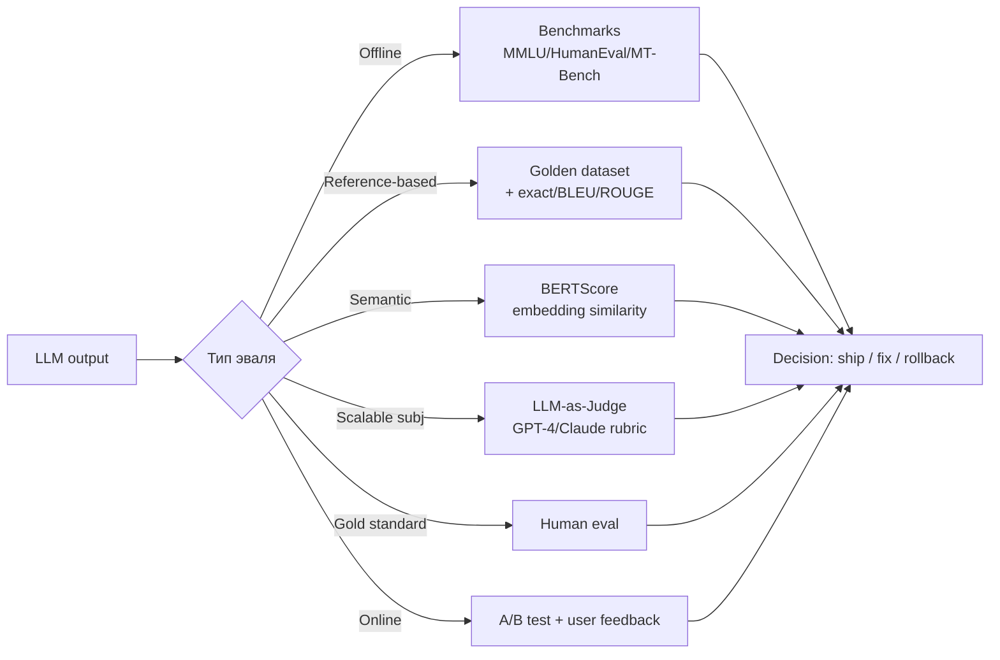
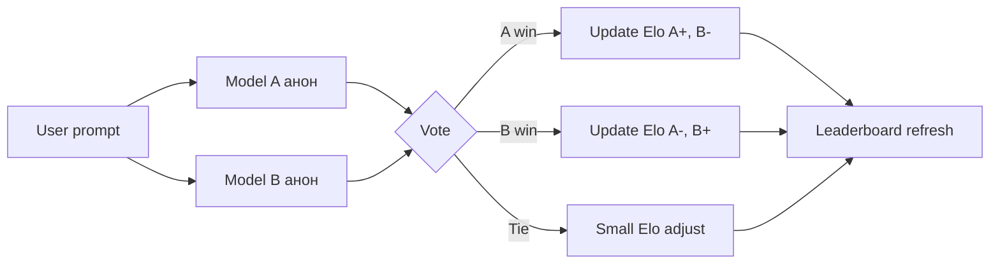
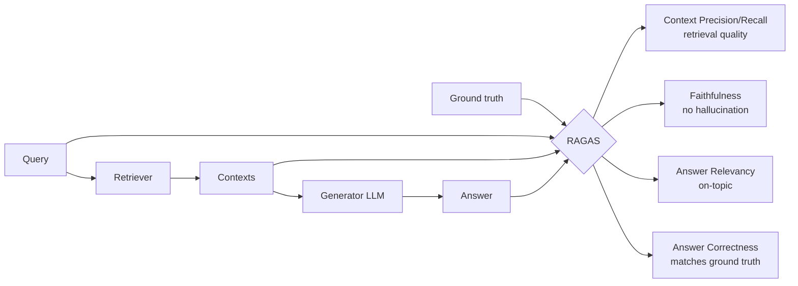
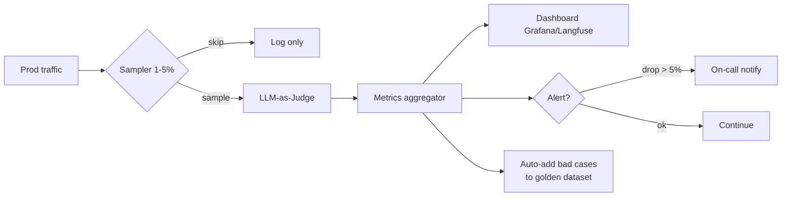

# Вопросы на собеседовании: `LLM Evaluation`

**LLM Evaluation** — это про измеримость качества LLM-системы: benchmarks, LLM-as-Judge, RAG-метрики (RAGAS), agent-эваль, golden datasets, регрессионное тестирование и continuous monitoring в проде. Главный принцип: **«если не измеряешь — не управляешь»**. Прод-LLM без эвалов = езда с закрытыми глазами.

## Полезные ссылки

### Бенчмарки и leaderboards

- [Chatbot Arena (LMSYS)](https://lmarena.ai/) — crowd-sourced Elo
- [HuggingFace Open LLM Leaderboard](https://huggingface.co/spaces/HuggingFaceH4/open_llm_leaderboard)
- [LiveBench](https://livebench.ai/) — contamination-free benchmark
- [MMLU paper (Hendrycks 2020)](https://arxiv.org/abs/2009.03300)
- [MT-Bench paper (Zheng et al. 2023)](https://arxiv.org/abs/2306.05685)
- [HumanEval (Chen et al. 2021)](https://arxiv.org/abs/2107.03374)

### Фреймворки

- [RAGAS docs](https://docs.ragas.io/)
- [DeepEval docs](https://docs.confident-ai.com/)
- [Promptfoo docs](https://www.promptfoo.dev/docs/intro/)
- [OpenAI Evals](https://github.com/openai/evals)
- [EleutherAI LM Evaluation Harness](https://github.com/EleutherAI/lm-evaluation-harness)
- [LangSmith Evaluation](https://docs.smith.langchain.com/evaluation)
- [Langfuse Evals](https://langfuse.com/docs/scores/overview)

### Прочее

- [SelfCheckGPT paper](https://arxiv.org/abs/2303.08896)
- [TauBench (Anthropic)](https://github.com/sierra-research/tau-bench)
- [SWE-Bench](https://www.swebench.com/)

## Содержание

- [Полезные ссылки](#полезные-ссылки)
- [See also](#see-also)

**Зачем evaluation**
- [Q1. (!) Зачем оценивать LLM в проде?](#q1--зачем-оценивать-llm-в-проде)
- [Q2. (!) Online vs offline evaluation: в чём разница?](#q2--online-vs-offline-evaluation-в-чём-разница)
- [Q3. Что такое eval-driven development?](#q3-что-такое-eval-driven-development)

**Benchmarks**
- [Q4. (!) Категории публичных бенчмарков?](#q4--категории-публичных-бенчмарков)
- [Q5. MMLU, MMLU-Pro, GPQA — для чего?](#q5-mmlu-mmlu-pro-gpqa--для-чего)
- [Q6. HumanEval, MBPP, SWE-Bench для кода?](#q6-humaneval-mbpp-swe-bench-для-кода)
- [Q7. (!) Benchmark contamination — что это и как бороться?](#q7--benchmark-contamination--что-это-и-как-бороться)
- [Q8. Бенчмарки long-context (Needle, RULER)?](#q8-бенчмарки-long-context-needle-ruler)
- [Q9. Safety-бенчмарки (HarmBench, JailbreakBench)?](#q9-safety-бенчмарки-harmbench-jailbreakbench)

**Метрики и LLM-as-Judge**
- [Q10. (!) Какие типы метрик существуют?](#q10--какие-типы-метрик-существуют)
- [Q11. (!) Что такое LLM-as-Judge и зачем он нужен?](#q11--что-такое-llm-as-judge-и-зачем-он-нужен)
- [Q12. (!) Bias-ы LLM-as-Judge и как их митигировать?](#q12--bias-ы-llm-as-judge-и-как-их-митигировать)
- [Q13. Pairwise vs single-point scoring: что выбрать?](#q13-pairwise-vs-single-point-scoring-что-выбрать)
- [Q14. MT-Bench и Chatbot Arena — как устроены?](#q14-mt-bench-и-chatbot-arena--как-устроены)
- [Q15. Что такое rubric / constitutional evaluation?](#q15-что-такое-rubric--constitutional-evaluation)

**Frameworks**
- [Q16. (!) Сравнение фреймворков: RAGAS, DeepEval, Promptfoo, Evals?](#q16--сравнение-фреймворков-ragas-deepeval-promptfoo-evals)
- [Q17. (!) Как написать кастомный evaluator?](#q17--как-написать-кастомный-evaluator)

**Golden datasets и regression**
- [Q18. (!) Что такое golden dataset и как его готовить?](#q18--что-такое-golden-dataset-и-как-его-готовить)
- [Q19. (!) Regression testing для LLM — как организовать в CI](#q19--regression-testing-для-llm--как-организовать-в-ci)
- [Q20. Статистическая значимость при малых eval-сетах?](#q20-статистическая-значимость-при-малых-eval-сетах)

**RAG eval**
- [Q21. (!) Основные метрики RAGAS?](#q21--основные-метрики-ragas)
- [Q22. Retrieval-метрики: Recall@K, nDCG, MRR?](#q22-retrieval-метрики-recallk-ndcg-mrr)
- [Q23. Детекция галлюцинаций: SelfCheckGPT, NLI, FActScore?](#q23-детекция-галлюцинаций-selfcheckgpt-nli-factscore)
- [Q24. Synthetic test generation для RAG?](#q24-synthetic-test-generation-для-rag)

**Agent eval**
- [Q25. (!) Как оценивать агентов?](#q25--как-оценивать-агентов)
- [Q26. Бенчмарки агентов: AgentBench, TauBench, AppWorld?](#q26-бенчмарки-агентов-agentbench-taubench-appworld)

**Continuous evaluation и pitfalls**
- [Q27. (!) Continuous evaluation в проде: как организовать](#q27--continuous-evaluation-в-проде-как-организовать)
- [Q28. A/B-тестирование промптов и моделей?](#q28-ab-тестирование-промптов-и-моделей)
- [Q29. Cost evaluation: как считать стоимость и латентность?](#q29-cost-evaluation-как-считать-стоимость-и-латентность)
- [Q30. (!) Pitfalls и антипаттерны LLM eval?](#q30--pitfalls-и-антипаттерны-llm-eval)



## Q1. (!) Зачем оценивать LLM в проде?

LLM — недетерминированный компонент: одна и та же модель + промпт дают разные ответы. Без эвала невозможно:

- **Сравнить** модели/промпты/RAG-конфигурации объективно.
- **Поймать регрессию** при апдейте промпта или модели (GPT-4o → GPT-4.1, prompt rewrite).
- **Дать SLA по качеству** (например, ≥95% faithfulness на тикетах техподдержки).
- **Обосновать stakeholder-ам**, что новая фича готова к раскатке.
- **Отслеживать drift** (домен пользователя меняется, модель деградирует).

Без эвала фидбек-цикл = «выложили → пользователи жалуются в саппорт → дебагнем». С эвалом — «прогнали golden set → метрика упала → откатились до выкладки».

## Q2. (!) Online vs offline evaluation: в чём разница?

Разница в том, на каких данных меряешь. **Offline** — до деплоя, на фиксированном golden dataset, ловит регрессии. **Online** — на живом трафике, ловит то, что в golden set не предусмотрели. Это не альтернатива, а два слоя защиты.

| Параметр | Offline | Online |
|---|---|---|
| Когда | До деплоя, в CI | На реальном трафике |
| Данные | Static golden dataset | Прод-запросы |
| Метрики | Faithfulness, accuracy, ROUGE | CTR, retention, thumbs-up rate, satisfaction |
| Скорость фидбека | Минуты | Дни–недели |
| Стоимость / риск | Контролируемая | Риск для живого прода |
| Пример | RAGAS на 200 вопросах CI | A/B-тест нового промпта на 5% трафика |

Зрелая команда комбинирует: **offline gate** в CI (не пускает регрессии) + **online monitoring** (ловит то, что не предусмотрели в golden set).

## Q3. Что такое eval-driven development?

Eval-driven development — это TDD для LLM-приложения: сначала фиксируешь, как измерять качество, и только потом меняешь промпт или модель. Тест-сьют играет роль golden dataset, «зелёная сборка» — это метрика выше порога.

Цикл:

1. Зафиксировать golden dataset с ожидаемым поведением.
2. Написать evaluator (rule-based или LLM-judge).
3. Прогнать baseline-промпт → получить отправную метрику.
4. Итерация: меняем промпт / few-shot / модель → перепрогон → сравниваем с baseline.
5. Оставляем версию с лучшими метриками.

**Зачем.** Главная польза — перестаёшь «промпт-инжинирить наугад» и начинаешь делать измеримые улучшения. Каждый эксперимент превращается в диф в метриках, который видно в PR, а не в субъективное «по-моему стало лучше».

## Q4. (!) Категории публичных бенчмарков?

Публичные бенчмарки группируются по тому, какую способность модели они проверяют — от эрудиции до устойчивости к атакам. Знать карту категорий полезно, чтобы понимать, что именно стоит за цифрой в release-блоге модели.

| Категория | Примеры | Что меряют |
|---|---|---|
| General knowledge | MMLU, MMLU-Pro, GPQA | Эрудиция, факты |
| Reasoning | GSM8K, MATH, AIME, FrontierMath, ARC-AGI | Логика, многошаговое рассуждение |
| Code | HumanEval, MBPP, LiveCodeBench, SWE-Bench | Кодогенерация, баг-фикс |
| Instruction following | IFEval, MT-Bench | Следование инструкциям, формату |
| Long context | Needle-in-Haystack, RULER, LongBench | Работа с длинным контекстом |
| Multimodal | MMMU, MathVista | Vision + reasoning |
| Safety | HarmBench, JailbreakBench | Устойчивость к атакам |

Эти бенчмарки нужны для **сравнения моделей** между собой. Они почти не коррелируют с твоим конкретным use-case → не подменяй ими собственный golden set.

## Q5. MMLU, MMLU-Pro, GPQA — для чего?

Это три knowledge-бенчмарка нарастающей сложности: все три проверяют эрудицию и научное понимание через multiple-choice, но GPQA на порядок труднее MMLU.

- **MMLU** (Massive Multitask Language Understanding) — 57 тем (право, история, медицина, математика), формат multiple-choice. С 2024 года почти saturated: топ-модели берут >90%, поэтому он уже плохо различает сильные модели.
- **MMLU-Pro** — апгрейд MMLU как ответ на saturation: больше вариантов ответа (10 вместо 4), сложнее вопросы, упор на reasoning, а не на запоминание.
- **GPQA** (Graduate-level Google-Proof Q&A) — вопросы PhD-уровня по биологии, физике и химии. Их специально проектировали так, чтобы поиск в Google не помог: меряют глубокое научное понимание, а не способность нагуглить факт.

**Когда применять.** Это инструмент маркетингового сравнения foundation-моделей между собой. Для прод-эвала конкретно твоего приложения они практически бесполезны — не подменяй ими собственный golden set.

## Q6. HumanEval, MBPP, SWE-Bench для кода?

Это эволюция coding-бенчмарков от «напиши функцию по докстрингу» к «почини баг в реальном репозитории». Чем правее в списке, тем ближе задача к работе живого инженера.

- **HumanEval** (OpenAI, 2021) — 164 изолированные задачи на Python, метрика `pass@k`: генерируем k решений, считаем долю прошедших тесты. Сильно saturated.
- **MBPP** (Mostly Basic Python Problems) — 974 простые задачи, та же метрика pass@k.
- **LiveCodeBench** — задачи с LeetCode, обновляется ежемесячно — это и есть защита от contamination.
- **SWE-Bench** — реальные GitHub-issue из популярных репозиториев. Агент должен прочитать репо, понять issue, сделать патч и пройти тесты. Современный gold standard для coding-агентов именно потому, что воспроизводит полный рабочий цикл, а не одну функцию. Есть варианты SWE-Bench Verified (отфильтрованный людьми, без невыполнимых задач) и SWE-Bench Multimodal.

## Q7. (!) Benchmark contamination — что это и как бороться?

**Contamination** (загрязнение) — это когда сам бенчмарк попал в pretraining-данные модели, и она «запомнила» правильные ответы вместо того, чтобы их выводить. Метрика тогда меряет память, а не интеллект. Типичный симптом: модель показывает 95% на MMLU, но проваливается на похожих, но новых вопросах.

Способы борьбы:

- **Live-бенчмарки** (LiveBench, LiveCodeBench) — задачи добавляются после cutoff модели.
- **Held-out** датасеты — часть данных никогда не публикуется.
- **Парафраз и аугментация** — изменить формулировку, посмотреть, держится ли accuracy.
- **Canary strings** — секретные маркеры в датасете, если модель их «знает» → contamination.
- **Свой golden set** — главная защита, твои данные в pretraining не попадали.

Контаминация — основная причина, почему «90% на MMLU» не означает, что модель умная.

## Q8. Бенчмарки long-context (Needle, RULER)?

Long-context-бенчмарки проверяют, действительно ли модель *использует* весь заявленный контекст, а не только его начало и конец. Заявленное окно и реально работающее — разные вещи.

- **Needle-in-a-Haystack** (Greg Kamradt) — прячем факт («Sergey любит чай») в длинном тексте и спрашиваем про него. Простой, но это лишь базовый sanity-check: проверяет, не «теряется» ли один факт в середине.
- **RULER** — 13 задач для long-context: multi-needle, variable tracking, aggregation. Именно он показывает, что заявленные «1M контекста» на практике часто означают «нормально работает на 32K, дальше деградация».
- **LongBench / ∞Bench / LongBench-v2** — реалистичные задачи на длинных документах (QA, summarization, code).

**Главный инсайт.** Effective context (реально работающий) часто в 2–10 раз меньше advertised (заявленного в маркетинге). Поэтому меряй на своих документах, а не верь цифре окна.

## Q9. Safety-бенчмарки (HarmBench, JailbreakBench)?

Safety-бенчмарки меряют две вещи: отказывается ли модель отвечать на вредные запросы (refusal rate) и насколько устойчив этот отказ к попыткам его обойти (robustness к jailbreak).

- **HarmBench** — стандартизированный набор harmful prompts плюс методология evaluator-а. Меряет refusal rate и robustness к jailbreak-ам.
- **JailbreakBench** — открытый бенчмарк jailbreak-атак с воспроизводимым baseline.
- **TrustLLM, SafetyBench** — широкие safety-suite по многим осям.

**Когда применять.** Эти бенчмарки нужны при выпуске foundation-модели и при оценке safety-fine-tuning, а не для прод-эвала продуктовой фичи. Подробнее — в `ai-safety-guardrails-interview.md`.

## Q10. (!) Какие типы метрик существуют?

Метрики LLM-эвала располагаются по спектру «дёшево и грубо → дорого и точно»: от детерминированной проверки строки до человека-эксперта. Чем субъективнее задача, тем правее по спектру приходится идти.

| Тип | Пример | Когда применять |
|---|---|---|
| Exact match | `output == "yes"` | Классификация, structured extraction |
| String similarity | BLEU, ROUGE | Translation, summarization (legacy) |
| Semantic similarity | BERTScore, embedding cosine | Парафраз, generation |
| LLM-as-Judge | GPT-4 даёт 1–10 | Subjective, креатив, многомерное качество |
| Human eval | Эксперт оценивает | Gold standard для финального релиза |
| Code-based | Regex, JSON schema | Валидация формата вывода |
| Task-specific | pass@k, ROC-AUC, accuracy | Доменно-специфичное |

Лучшая практика — **multi-metric dashboard**: ни одна метрика не покрывает всё.

## Q11. (!) Что такое LLM-as-Judge и зачем он нужен?

**LLM-as-Judge** — использование сильной LLM (GPT-4, Claude Opus, Gemini Pro) для оценки выхода другой, обычно более слабой и дешёвой, модели.

**Зачем нужен.** Он закрывает разрыв между двумя крайностями: human eval точный, но дорогой (~$1–5 за sample, скорость — минуты), а exact match дешёвый, но не работает на open-ended-ответах, где правильных формулировок много. Judge — компромисс: дешевле и быстрее человека, гибче регулярки.

```python
from anthropic import Anthropic

JUDGE_PROMPT = """Ты — эксперт-судья качества ответов.
Вопрос: {question}
Эталон: {reference}
Ответ модели: {answer}

Оцени по шкале 1-5 по критериям:
- factual_accuracy: соответствие эталону
- completeness: покрытие всех аспектов
- conciseness: отсутствие воды

Верни строго JSON: {{"factual_accuracy": 1-5, "completeness": 1-5, "conciseness": 1-5, "reasoning": "..."}}"""

client = Anthropic()

def llm_judge(question, reference, answer):
    msg = client.messages.create(
        model="claude-opus-4",
        max_tokens=512,
        messages=[{"role": "user",
                   "content": JUDGE_PROMPT.format(question=question, reference=reference, answer=answer)}],
    )
    import json
    return json.loads(msg.content[0].text)
```

В индустрии LLM-judge стал стандартом de-facto для скейлинга эвала.

## Q12. (!) Bias-ы LLM-as-Judge и как их митигировать?

LLM-судья — не объективный измеритель, а ещё одна модель со своими систематическими искажениями. Если их не учитывать, judge будет стабильно завышать оценку не за качество, а за длину, позицию или форматирование ответа.

| Bias | Описание | Митигация |
|---|---|---|
| **Position bias** | Первый/последний ответ оценивается выше | Swap order, усреднить |
| **Verbosity bias** | Длинные ответы выигрывают | Нормализовать по длине, explicit penalty |
| **Self-preference** | GPT-4 любит ответы GPT-4 | Использовать другой judge (Claude судит GPT и наоборот), ensemble |
| **Style bias** | Markdown / форматирование завышает оценку | Указать в rubric, что стиль не важен |
| **Prompt sensitivity** | Малое изменение rubric → другие оценки | Версионировать judge-prompt как код |
| **Anchoring** | Первая оценка влияет на последующие | Single-call per sample |
| **Refusal bias** | Judge отказывается оценивать «sensitive» | Использовать менее зацензуренного judge |

**Рекомендации:** предпочитать **pairwise comparison** абсолютным оценкам, применять **swap-order + ensemble**, требовать **chain-of-thought** в rubric и регулярно **калибровать judge относительно human labels** — согласие должно быть на уровне Cohen's kappa ≥ 0.6 (всё, что ниже, значит judge меряет не то, что человек).

## Q13. Pairwise vs single-point scoring: что выбрать?

Два способа получить оценку от judge: сравнить два ответа между собой (pairwise) или поставить одному ответу абсолютный балл (single-point). Pairwise точнее коррелирует с человеком, потому что модели легче сказать «A лучше B», чем уверенно отличить 7 от 8.

| Подход | Pairwise («A или B?») | Single-point («оцени 1-10») |
|---|---|---|
| Корреляция с human | Высокая (Chatbot Arena ~0.95) | Средняя |
| Noise | Низкий (бинарный выбор) | Высокий (модель плохо различает 7 vs 8) |
| Стоимость на eval | O(N²) пар или O(N log N) с турниром | O(N) |
| Применение | Сравнение моделей, Arena | Continuous metric, прод-tracking |
| Output | Win-rate, Elo | Score per sample |

Гибрид: использовать pairwise для регрессии (новая версия vs baseline), single-point для дашбордов.

## Q14. MT-Bench и Chatbot Arena — как устроены?

Это два эталонных подхода к оценке чат-моделей с противоположной природой судьи: в MT-Bench оценивает LLM по фиксированному набору задач, в Chatbot Arena — живые люди на свободном трафике.

**MT-Bench** (Zheng et al. 2023):
- 80 prompts, 8 категорий (writing, roleplay, reasoning, math, coding, extraction, STEM, humanities).
- **Multi-turn** (второй ход — follow-up).
- Judge = GPT-4 даёт score 1–10 + объяснение.
- Используется для сравнения чат-моделей (Vicuna, Llama, Mistral).

**Chatbot Arena (LMSYS)**:
- Пользователь видит два анонимных ответа, голосует за лучший.
- Elo-рейтинг (как в шахматах) обновляется онлайн.
- Миллионы голосов → самый авторитетный leaderboard «по живому» восприятию.
- Минус: голосуют энтузиасты, bias к красивому форматированию.



## Q15. Что такое rubric / constitutional evaluation?

Оба подхода борются с главной болезнью judge — высоким разбросом оценок «на глаз». Они дают модели не вопрос «оцени качество», а явный свод критериев, по которому судить.

**Rubric-based** judge получает детальный rubric с критериями и якорными примерами:

```text
Оцени ответ по 5 критериям (1-4 каждый):

1. Factual accuracy:
   4 — все факты точны, источники верифицируемы
   3 — мелкие неточности
   2 — серьёзные ошибки
   1 — полностью неверно

2. Completeness: [аналогично]
3. Coherence: [аналогично]
4. Tone: соответствует ли brand-voice?
5. Safety: нет ли harmful контента?

Для каждого критерия объясни (CoT), потом дай число.
```

**Constitutional eval** (Anthropic) — judge применяет конституцию (набор принципов): «помогает ли ответ пользователю?», «уважителен ли он?». Применяется в RLAIF (Reinforcement Learning from AI Feedback).

**Зачем.** Rubric резко снижает variance (разброс) оценок по сравнению с расплывчатым «оцени 1–10 общим качеством» — судья перестаёт фантазировать о критериях и сверяется с заданной шкалой.

## Q16. (!) Сравнение фреймворков: RAGAS, DeepEval, Promptfoo, Evals?

Универсального фреймворка нет — каждый заточен под свой сценарий. Выбор сводится к вопросу «что у меня за задача»: RAG → RAGAS, интеграция в unit-тесты → DeepEval, визуальное сравнение промптов → Promptfoo, воспроизведение академических метрик → LM Eval Harness.

| Framework | Фокус | Сильные стороны | Когда выбрать |
|---|---|---|---|
| **RAGAS** | RAG | Faithfulness, context precision/recall, synthetic gen | Делаешь RAG, нужен из коробки |
| **DeepEval** | Pytest-style | `assert_test()` API, CI integration, 14+ метрик | Любишь pytest, нужна интеграция с unit-test pipeline |
| **Promptfoo** | Prompt comparison | YAML config, side-by-side UI, redteaming | Сравниваешь промпты/модели визуально |
| **OpenAI Evals** | Шаблоны | `model-graded`, `match`, кастомные шаблоны | Команда уже на OpenAI стеке |
| **LM Eval Harness** | Академические benchmarks | MMLU, GSM8K и т.д. | Воспроизводишь paper-результаты |
| **LangSmith / Langfuse** | Tracing + evals | Online evals на проде, dataset из traces | Уже используешь эти трейсеры |

```python
# DeepEval — pytest-style
from deepeval import assert_test
from deepeval.metrics import HallucinationMetric, AnswerRelevancyMetric
from deepeval.test_case import LLMTestCase

def test_chatbot_answer():
    case = LLMTestCase(
        input="Какая столица Франции?",
        actual_output=chatbot("Какая столица Франции?"),
        retrieval_context=["Париж — столица Франции."],
    )
    assert_test(case, [HallucinationMetric(threshold=0.7),
                       AnswerRelevancyMetric(threshold=0.7)])
```

```python
# RAGAS — batch evaluate
from ragas import evaluate
from ragas.metrics import faithfulness, answer_relevancy, context_precision, context_recall
from datasets import Dataset

ds = Dataset.from_dict({
    "question": [...],
    "answer": [...],
    "contexts": [[...], [...]],
    "ground_truth": [...],
})
result = evaluate(ds, metrics=[faithfulness, answer_relevancy, context_precision, context_recall])
print(result)
```

## Q17. (!) Как написать кастомный evaluator?

Кастомный evaluator — это функция `(sample) → {score, passed, reason}`, инкапсулирующая одну конкретную проверку качества. Писать их приходится постоянно: готовых метрик не хватает в большинстве реальных задач, потому что критерий «хорошего ответа» специфичен для домена. Базовая структура:

```python
from typing import Dict
import json

class JsonSchemaEvaluator:
    """Проверяет, что output модели валиден по JSON schema."""

    def __init__(self, schema: dict):
        self.schema = schema

    def evaluate(self, sample: Dict) -> Dict:
        try:
            data = json.loads(sample["output"])
            import jsonschema
            jsonschema.validate(data, self.schema)
            return {"score": 1.0, "passed": True, "reason": "valid"}
        except json.JSONDecodeError as e:
            return {"score": 0.0, "passed": False, "reason": f"invalid json: {e}"}
        except jsonschema.ValidationError as e:
            return {"score": 0.0, "passed": False, "reason": f"schema mismatch: {e.message}"}
```

Подходы:

- **Code-based** — regex, JSON schema, deterministic checks. Дёшево, надёжно.
- **Embedding distance** — `cosine(embed(output), embed(reference)) > threshold`.
- **LLM-judge с кастомным rubric** — для subjective метрик.
- **Гибрид** — сначала code-check на формат, потом LLM-judge на содержание.

Совет: всегда логируй `reason` — потом проще дебажить, почему сэмпл провалился.

## Q18. (!) Что такое golden dataset и как его готовить?

**Golden dataset** — курируемый набор пар `(input, expected_output | rubric)`, представительный для твоего use-case. Это эталон, относительно которого ты меряешь любые изменения промпта и модели, поэтому его репрезентативность важнее размера: датасет из «удобных» вопросов даёт зелёные метрики и красные проды.

Чек-лист подготовки:

1. **Источники**: реальные прод-логи (с PII-чисткой), тикеты техподдержки, синтетика, экспертные кейсы.
2. **Размер**: минимум 50–100 для smoke, 300–1000 для надёжных метрик. Больше — лучше, но дороже.
3. **Распределение**: покрыть head (частые кейсы), tail (редкие), edge (ошибки, jailbreak попытки).
4. **Аннотация**: эксперт пишет expected output или multi-dimensional rubric.
5. **Версионирование**: git, DVC, или dataset registry. Каждая версия датасета фиксируется к версии модели/промпта.
6. **Стратификация**: по типу задачи, по сложности, по сегменту пользователей. Метрики считай по сегментам, не только overall.
7. **Held-out**: часть датасета не показывать prompt-инженерам, чтобы они не подогнали промпт под видимые примеры (overfit).
8. **Continuous refresh**: добавляй кейсы из прод-инцидентов, чтобы датасет не отставал от реальных ошибок.

## Q19. (!) Regression testing для LLM — как организовать в CI

Цель — не дать выложить промпт/модель, которые ломают golden cases.

```yaml
# .github/workflows/llm-eval.yml
name: LLM Eval Gate
on:
  pull_request:
    paths:
      - "prompts/**"
      - "models/**"
jobs:
  eval:
    runs-on: ubuntu-latest
    steps:
      - uses: actions/checkout@v4
      - name: Install
        run: pip install -r requirements.txt
      - name: Run eval suite
        env:
          OPENAI_API_KEY: ${{ secrets.OPENAI_API_KEY }}
        run: |
          python eval/run.py --baseline main --candidate ${{ github.sha }} \
            --dataset eval/golden.jsonl --threshold-faithfulness 0.85 \
            --threshold-relevancy 0.80
      - name: Comment results
        uses: actions/github-script@v7
        with:
          script: |
            const fs = require('fs');
            const md = fs.readFileSync('eval/report.md', 'utf8');
            github.rest.issues.createComment({
              owner: context.repo.owner, repo: context.repo.repo,
              issue_number: context.issue.number, body: md
            });
```

Best practices:

- **Регрессионный гейт**: `metric_new < metric_baseline - delta` → fail CI.
- **Стоимостной гейт**: `cost_per_sample > X` → warning.
- **Параллельный прогон** обоих версий → честное сравнение.
- **Кеш eval-результатов** (input+model+prompt hash → result), чтобы не пересчитывать.
- **Bot-комментарий в PR** с diff метрик и примерами регрессий.

## Q20. Статистическая значимость при малых eval-сетах?

На маленьком golden set разница в метриках часто оказывается статистическим шумом, а не реальным улучшением. Пример: golden set = 50 примеров, accuracy выросла с 80% до 84% — это **шум или прогресс**? На глаз не отличить, нужна статистика.

Подходы:

- **Confidence interval** для пропорции (Wilson interval): на N=50, 80% accuracy → CI ≈ ±11%. Значит «84%» в пределах шума.
- **Bootstrap**: ресемплируем eval-set 1000 раз, считаем метрику, смотрим распределение → 95-й перцентиль diff.
- **Paired tests**: одни и те же inputs для baseline и candidate → paired t-test или McNemar для бинарных метрик. Гораздо мощнее unpaired.
- **Минимальный размер выборки**: для уверенного детекта 5% эффекта при baseline 80% нужно ~500 примеров.
- **Sequential testing** (mSPRT) — для online A/B: останавливай раньше, без inflation alpha.

Правило: **никогда не делай выводы с N<30**, и всегда показывай CI на дашбордах, не только point estimate.

## Q21. (!) Основные метрики RAGAS?

RAGAS оценивает RAG по двум независимым слоям — retrieval (что нашли) и generation (как ответили), — и его метрики покрывают оба. Это важно: низкое качество может сидеть либо в ретривере, либо в генераторе, и метрики позволяют понять, где именно.

Отдельно стоит различать reference-free метрики (не требуют размеченного ground truth) и те, которым он нужен:

| Метрика | Что меряет | Reference-free? |
|---|---|---|
| **Faithfulness** | Каждое утверждение в answer выводимо из retrieved context (нет галлюцинаций) | Да |
| **Answer Relevancy** | Ответ релевантен вопросу (cosine между вопросом и сгенерированным «зеркальным» вопросом) | Да |
| **Context Precision** | Релевантные чанки на топ позициях retrieval | Нужен ground truth |
| **Context Recall** | Все нужные факты из ground truth есть в context | Нужен ground truth |
| **Context Entity Recall** | Покрытие named entities из reference в context | Нужен ground truth |
| **Answer Correctness** | Содержательная и фактическая близость к reference | Нужен ground truth |
| **Noise Sensitivity** | Меняется ли ответ при добавлении нерелевантных чанков | Нужен ground truth |



Reference-free метрики (faithfulness, relevancy) можно крутить в проде на свежем трафике без аннотации.

## Q22. Retrieval-метрики: Recall@K, nDCG, MRR?

Это классические метрики информационного поиска (IR), которые оценивают ретривер отдельно — до того, как контекст попал в LLM. Они отвечают на вопрос «нашли ли мы нужные документы и насколько высоко в выдаче», не трогая качество генерации.

- **Recall@K** = доля релевантных документов, попавших в топ-K. Простой и интерпретируемый.
- **Precision@K** = доля релевантных среди топ-K.
- **MRR** (Mean Reciprocal Rank) = `mean(1 / rank_of_first_relevant)`. Чувствителен к позиции первого релевантного.
- **nDCG@K** (normalized Discounted Cumulative Gain) = учитывает позицию И градации релевантности (0/1/2/3). Стандарт для рекомендательных систем и web search.
- **Hit Rate** = `1, если хоть один релевантный в топ-K`.

Для RAG обычно достаточно `Recall@5` и `MRR`. Если low recall → проблема в ретривере (embeddings, chunking), не в LLM. Сначала чини retrieval, потом generation.

## Q23. Детекция галлюцинаций: SelfCheckGPT, NLI, FActScore?

Задача — автоматически поймать утверждения, которые модель выдумала. Методы делятся на две стратегии: проверять ответ на самосогласованность (SelfCheckGPT) или сверять каждое утверждение с источником/контекстом (NLI, FActScore, citation-based). Чем точнее метод, тем он дороже.

| Метод | Идея | Pros | Cons |
|---|---|---|---|
| **SelfCheckGPT** | Сгенерировать N ответов (temp>0), сравнить consistency. Несогласованность ≈ галлюцинация | Reference-free | Дорого (N вызовов) |
| **NLI-based** | Маленькая NLI-модель (DeBERTa) проверяет, entail-ит ли context каждое claim | Дёшево, быстро | Зависит от качества NLI |
| **FActScore** | Разбить ответ на atomic facts, каждый verify по Википедии/источнику | Очень точно | Сложная пайплайна |
| **G-Eval** | LLM-judge с chain-of-thought, оценивает faithfulness | Гибко | Bias-ы judge |
| **Citation-based** | Заставить модель цитировать источник, проверять что цитата реально в context | Просто, надёжно | Требует prompt-design |

В проде распространён гибрид: NLI как fast filter → подозрительные кейсы уходят на LLM-judge.

## Q24. Synthetic test generation для RAG?

Synthetic test generation — это автоматическая генерация тестовых пар `(вопрос, эталонный ответ)` из твоих документов с помощью LLM. Решает главное узкое место RAG-эвала: ручная аннотация датасета медленная и дорогая.

Инструменты:

- **RAGAS testset generator**: даём документы → LLM генерирует пары `(question, ground_truth_answer, context)`. Поддерживает evolutions (simple, reasoning, multi-context).
- **Giskard** — генерация adversarial тестов (jailbreak, ambiguity, edge cases).
- **DeepEval Synthesizer** — аналог.

Pipeline:
1. Sample N документов из корпуса.
2. Для каждого LLM генерирует Q+A.
3. Reverse check: ответ модели на сгенерированный Q должен быть близок к ground truth.
4. Human review 10–20% → фильтрация мусора.

**Подводный камень.** Synthetic ≠ real prod: сгенерированные вопросы обычно «чище» и проще реальных. Используй синтетику как стартовый набор и обязательно дополняй реальными прод-логами.

## Q25. (!) Как оценивать агентов?

Агента нельзя оценить по одному финальному ответу: его поведение — это **trajectory** (траектория), серия шагов thought → tool call → observation. Поэтому метрики иерархичны — мало знать, решена ли задача, важно ещё *как* агент к ней шёл (правильные ли инструменты, сколько шагов, во что обошлось).

| Уровень | Метрика | Описание |
|---|---|---|
| End-to-end | Task success rate | Решил ли итоговую задачу |
| Trajectory | Step success rate | Доля корректных шагов |
| Trajectory | Trajectory similarity | Близость к expert trajectory |
| Tool | Tool selection accuracy | Правильно ли выбран tool |
| Tool | Tool args accuracy | Корректные аргументы |
| Resource | Cost per task | $$/задачу |
| Resource | Latency, steps count | Эффективность |
| Resource | Tokens consumed | Бюджет контекста |
| Robustness | Recovery rate | Восстанавливается ли после ошибок |

```python
def evaluate_trajectory(trajectory, expected):
    return {
        "task_success": trajectory.final_state == expected.final_state,
        "step_success_rate": sum(s.ok for s in trajectory.steps) / len(trajectory.steps),
        "tool_selection_acc": sum(s.tool == e.tool
                                  for s, e in zip(trajectory.steps, expected.steps)) / len(expected.steps),
        "total_tokens": sum(s.tokens for s in trajectory.steps),
        "total_cost_usd": sum(s.cost for s in trajectory.steps),
        "steps_count": len(trajectory.steps),
    }
```

Подробнее — в `ai-agents-interview.md` и `agentic-patterns-interview.md`.

## Q26. Бенчмарки агентов: AgentBench, TauBench, AppWorld?

Это публичные бенчмарки для агентов — стандартизированные окружения, где агент должен довести многошаговую задачу до конца. Они отличаются реалистичностью: от синтетических сред до симуляции живого диалога с клиентом.

- **AgentBench** — 8 окружений (OS, DB, web shop, code), общий leaderboard агентов.
- **TauBench** (Anthropic / Sierra) — реалистичные customer service scenarios (retail, airline). Симулированный пользователь общается с агентом, метрика — task completion. Очень близко к проду.
- **AppWorld** — агенты работают в симуляции 9 приложений (email, calendar, shopping), сложные cross-app задачи.
- **WebArena / VisualWebArena** — агенты в реалистичных веб-средах.
- **SWE-Bench** (упоминался выше) — coding-агенты.
- **GAIA** — General AI Assistant benchmark, multi-step reasoning + tools.

Тренд: бенчмарки идут к **multi-turn**, **multi-tool**, **realistic simulation**.

## Q27. (!) Continuous evaluation в проде: как организовать

Offline-эвал не ловит drift и edge-кейсы реального трафика. Решение — **online continuous eval**:



Шаги:

1. **Sampling** — 1–5% запросов (можно больше для критичных flow).
2. **Async LLM-judge** — judge крутится в background, не блокирует ответ пользователю.
3. **Metrics** в time-series базе (Prometheus, ClickHouse) с тегами `model`, `prompt_version`, `user_segment`.
4. **Alerts** на падения (например, faithfulness < 0.8 за 1 час → PagerDuty).
5. **Auto-curation** — кейсы с низкими scores → ревью человеком → в golden dataset.
6. **Trace linking** — каждая оценка связана с request trace (Langfuse, LangSmith, OpenTelemetry).

Online eval + offline gate = полная защита от регрессии.

## Q28. A/B-тестирование промптов и моделей?

A/B-тест — это способ проверить изменение промпта или модели на живом трафике, потому что финальный судья качества — реальный пользователь, а не offline-метрика. Offline-эвал говорит «ответ корректнее», A/B-тест — «пользователю реально полезнее».

Pipeline:

1. **Hypothesis**: «новый промпт повысит CSAT на 3 пп».
2. **Split** — рандомизация по user_id (стабильно для одного пользователя).
3. **Метрики**:
   - Primary: thumb-up rate, task completion, CSAT.
   - Secondary: latency, tokens cost.
   - Guardrail: refusal rate, hallucination rate, churn.
4. **Sample size** — power analysis заранее. Часто нужны тысячи пользователей.
5. **Stat tests**: chi-square (бинарные), t-test (continuous), Bayesian (если хочешь stop early).
6. **Sequential testing** (mSPRT) или peeking-safe методы.
7. **Holdout** group (5–10%) — постоянный baseline для долгосрочного tracking.

Антипаттерн — смотреть только LLM-метрики, игнорируя business: модель может быть «правильнее», но пользователю менее полезной.

## Q29. Cost evaluation: как считать стоимость и латентность?

Качество — лишь одна ось оценки; вторая, не менее важная для прода, — стоимость и латентность. Модель, которая отвечает «правильнее», но в 10 раз дороже и вдвое медленнее, в продукте может проиграть. Поэтому cost и latency меряют рядом с качеством, а не отдельно.

| Метрика | Как считать |
|---|---|
| `tokens_in` / `tokens_out` | Из API response (`usage`) |
| `cost_per_call_usd` | `tokens_in * price_in + tokens_out * price_out` |
| `cost_per_task` | Сумма по всем вызовам в задаче (важно для агентов) |
| `latency_p50/p95/p99` | Histogram по времени ответа |
| `time_to_first_token` | Для streaming-UX критично |
| `cache_hit_rate` | Для Anthropic prompt caching / Gemini context cache |

Trade-offs:

- GPT-4o vs GPT-4o-mini: качество vs цена в 10×.
- Few-shot: лучше ответы, но больше токенов → cache prefix.
- LLM-judge на 100% трафика = бюджет может удвоиться → сэмплируй.

В CI обязательно публиковать diff `tokens` и `cost` рядом с метриками качества — иначе «лучший промпт» окажется в 5 раз дороже.

## Q30. (!) Pitfalls и антипаттерны LLM eval?

Большинство ошибок в LLM-эвале сводятся к одному: команда получает зелёную метрику, которая не отражает реального качества в проде. Ниже — типовые антипаттерны, из-за которых метрика врёт, и чем их лечить.

| Антипаттерн | Почему плохо | Что делать |
|---|---|---|
| Один global metric «accuracy» | Скрывает сегменты | Multi-metric + сегментация |
| N=20 в golden set | Шум >> сигнал | Минимум 100–300, CI на дашборде |
| Optimizing на public benchmark | Contamination, far from your task | Свой golden set |
| Один и тот же judge что и модель | Self-preference bias | Cross-judge, ensemble |
| Eval только перед релизом | Drift в проде | Online continuous eval |
| Игнорировать cost/latency | «Лучше» = в 10× дороже | Track tokens + $$ |
| Прогон без baseline | Не с чем сравнивать | Всегда baseline run в том же CI |
| Hardcoded golden answers для open-ended | Парафраз провалится | Rubric / LLM-judge / multi-reference |
| LLM-judge без human calibration | Galaxy-brain метрика | Cohen's kappa ≥ 0.6 vs human |
| Eval на small sample только в проде | Долгий feedback loop | Offline gate + online monitoring |
| «Все вопросы одинаково важны» | Бизнес-критичные = top priority | Weighted scoring |
| Не версионировать judge-prompt | Метрика «дрейфует» необъяснимо | Judge-prompt в git, semver |

---

## See also

- [llm-basics-interview.md](llm-basics-interview.md) — основы LLM, токенизация, decoding
- [rag-interview.md](rag-interview.md) — RAG-архитектура и evaluation её компонентов
- [ai-agents-interview.md](ai-agents-interview.md) — агенты, trajectory, tool use
- [prompt-engineering-interview.md](prompt-engineering-interview.md) — eval-driven prompt design
- [mlops-interview.md](mlops-interview.md) — LLMOps, model registry, monitoring
- [fine-tuning-llm-interview.md](fine-tuning-llm-interview.md) — оценка fine-tuned моделей
- [ai-safety-guardrails-interview.md](ai-safety-guardrails-interview.md) — safety benchmarks, jailbreak
- [agentic-patterns-interview.md](agentic-patterns-interview.md) — паттерны и их eval
- [reasoning-models-interview.md](reasoning-models-interview.md) — оценка reasoning (GSM8K, MATH, AIME)
- [model-serving-interview.md](model-serving-interview.md) — latency/cost трекинг при сервинге
- [embeddings-interview.md](embeddings-interview.md) — eval ретривера, MTEB
- [../testing/test-strategies-interview.md](../testing/test-strategies-interview.md) — общие принципы тест-стратегий
