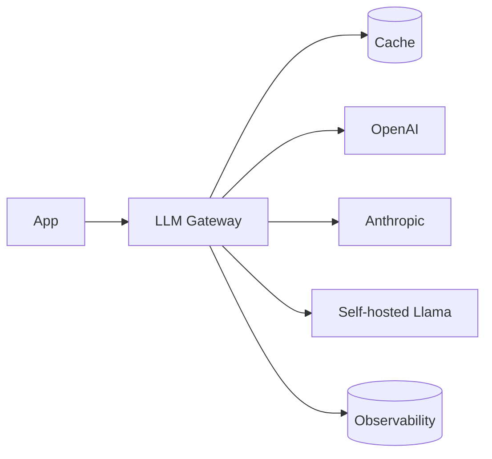

# Вопросы на собеседовании: `LLM Integration Patterns`

Интеграция LLM в production — больше, чем просто `client.chat.completions.create()`. На интервью спрашивают: streaming, retry/fallback, model routing, caching, rate limiting, observability, cost tracking, abstractions для multi-provider, semantic caching, async patterns.

## Полезные ссылки

### Официальная документация и авторитетные источники

- [LiteLLM Documentation](https://docs.litellm.ai/) — multi-provider LLM SDK
- [Helicone (LLM observability)](https://helicone.ai/)
- [Langfuse (open-source observability)](https://langfuse.com/)
- [LangSmith Documentation](https://docs.smith.langchain.com/)
- [OpenRouter — model routing](https://openrouter.ai/)
- [Portkey (AI gateway)](https://portkey.ai/)

## Содержание

- [Полезные ссылки](#полезные-ссылки)
- [See also](#see-also)

**Базовые паттерны**
- [Q1. (!) Что такое LLM gateway?](#q1--что-такое-llm-gateway)
- [Q2. (!) Streaming responses — реализация?](#q2--streaming-responses--реализация)
- [Q3. (!) SSE (Server-Sent Events) для streaming?](#q3--sse-server-sent-events-для-streaming)
- [Q4. WebSocket vs SSE для LLM?](#q4-websocket-vs-sse-для-llm)

**Reliability**
- [Q5. (!) Retry с exponential backoff?](#q5--retry-с-exponential-backoff)
- [Q6. (!) Circuit breaker для LLM API?](#q6--circuit-breaker-для-llm-api)
- [Q7. (!) Fallback между providers (Claude → GPT)?](#q7--fallback-между-providers-claude--gpt)
- [Q8. Timeouts — как настраивать?](#q8-timeouts--как-настраивать)

**Cost optimization**
- [Q9. (!) Model routing (small → large escalation)?](#q9--model-routing-small--large-escalation)
- [Q10. (!) Semantic caching?](#q10--semantic-caching)
- [Q11. Prompt caching (provider-side)?](#q11-prompt-caching-provider-side)
- [Q12. Batching API requests?](#q12-batching-api-requests)
- [Q13. (!) Cost tracking per user / feature?](#q13--cost-tracking-per-user--feature)

**Rate limiting**
- [Q14. (!) Token bucket для LLM API?](#q14--token-bucket-для-llm-api)
- [Q15. Per-user rate limits?](#q15-per-user-rate-limits)
- [Q16. Distributed rate limiting (Redis)?](#q16-distributed-rate-limiting-redis)

**Multi-provider**
- [Q17. (!) Зачем abstraction над provider?](#q17--зачем-abstraction-над-provider)
- [Q18. (!) LiteLLM, OpenRouter, Portkey?](#q18--litellm-openrouter-portkey)
- [Q19. Model parameter normalization?](#q19-model-parameter-normalization)

**Observability**
- [Q20. (!) Что трекать в LLM systems?](#q20--что-трекать-в-llm-systems)
- [Q21. (!) Tracing prompt chains?](#q21--tracing-prompt-chains)
- [Q22. Helicone, Langfuse, LangSmith?](#q22-helicone-langfuse-langsmith)
- [Q23. Latency metrics: TTFT, TPOT?](#q23-latency-metrics-ttft-tpot)

**Async patterns**
- [Q24. (!) Sync vs async LLM calls?](#q24--sync-vs-async-llm-calls)
- [Q25. Background jobs для long generations?](#q25-background-jobs-для-long-generations)

**Безопасность и compliance**
- [Q26. (!) Content moderation pipeline?](#q26--content-moderation-pipeline)
- [Q27. Audit logging?](#q27-audit-logging)
- [Q28. (!) Какие частые проблемы LLM в production?](#q28--какие-частые-проблемы-llm-в-production)

## Q1. (!) Что такое LLM gateway?

**LLM gateway** — middleware между приложением и LLM providers. Централизует:
- Routing (выбор model)
- Caching
- Rate limiting
- Observability
- Fallbacks
- Cost tracking



**Tools:** Portkey, Helicone, LiteLLM, OpenRouter, custom.

**Применение:** в **enterprise**, где много LLM-feature → нужна centralization.


> [!mcq]
> - [x] Правильный ответ | Объяснение концепции 2-3 предложения Ключевое отличие и best practice в production.
> - [ ] Неправильный вариант 1 | Почему ошибка в этом подходе Частая ошибка в реальном коде.
> - [ ] Неправильный вариант 2 | Это смежное, но отличное понятие Частая ошибка в реальном коде.
> - [ ] Неправильный вариант 3 | Противоположное направление## Q2. (!) Streaming responses — реализация? Частая ошибка в реальном коде.

**OpenAI / Anthropic streaming:**

```python
stream = client.chat.completions.create(
    model="gpt-4o",
    messages=[...],
    stream=True
)

for chunk in stream:
    delta = chunk.choices[0].delta.content
    if delta:
        yield delta  # send to client
```

**Server-side (FastAPI):**

```python
from fastapi.responses import StreamingResponse

@app.post("/chat")
async def chat(req: ChatRequest):
    async def generate():
        stream = client.chat.completions.create(stream=True, ...)
        for chunk in stream:
            yield f"data: {chunk.choices[0].delta.content}\n\n"
    return StreamingResponse(generate(), media_type="text/event-stream")
```

**Преимущества:**
- Faster perceived response (TTFT vs total time)
- Можно cancel mid-generation
- Меньше timeout risks


> [!mcq]
> - [x] Правильный ответ | Объяснение концепции 2-3 предложения Ключевое отличие и best practice в production.
> - [ ] Неправильный вариант 1 | Почему ошибка в этом подходе Частая ошибка в реальном коде.
> - [ ] Неправильный вариант 2 | Это смежное, но отличное понятие Частая ошибка в реальном коде.
> - [ ] Неправильный вариант 3 | Противоположное направление## Q3. (!) SSE (Server-Sent Events) для streaming? Частая ошибка в реальном коде.

**SSE** — HTTP standard для server → client streaming.

```
HTTP/1.1 200 OK
Content-Type: text/event-stream

data: Hello

data: world

data: [DONE]
```

**Frontend (JavaScript):**
```javascript
const evtSource = new EventSource("/chat?msg=hi");
evtSource.onmessage = (e) => {
    if (e.data === "[DONE]") {
        evtSource.close();
        return;
    }
    appendToChat(e.data);
};
```

**Преимущества SSE:**
- Простой (просто HTTP)
- Auto-reconnect built-in
- Работает через CDN (Cloudflare etc.)
- Один-направление = меньше state

**OpenAI/Anthropic** возвращают SSE ответы.


> [!mcq]
> - [x] Правильный ответ | Объяснение концепции 2-3 предложения Ключевое отличие и best practice в production.
> - [ ] Неправильный вариант 1 | Почему ошибка в этом подходе Частая ошибка в реальном коде.
> - [ ] Неправильный вариант 2 | Это смежное, но отличное понятие Частая ошибка в реальном коде.
> - [ ] Неправильный вариант 3 | Противоположное направление## Q4. WebSocket vs SSE для LLM? Частая ошибка в реальном коде.

| Критерий | SSE | WebSocket |
|----------|-----|-----------|
| Direction | Server → Client | Bidirectional |
| Protocol | HTTP | Custom (upgraded HTTP) |
| Reconnect | Automatic | Manual |
| Proxies/CDN | Хорошо работает | Сложнее |
| Use case | LLM streaming | Real-time chat (peer-to-peer) |

**Для LLM streaming — SSE** обычно достаточно (одностороннее: server → client). WebSocket если нужны interactive interruptions от клиента.


> [!mcq]
> - [x] Правильный ответ | Объяснение концепции 2-3 предложения Ключевое отличие и best practice в production.
> - [ ] Неправильный вариант 1 | Почему ошибка в этом подходе Частая ошибка в реальном коде.
> - [ ] Неправильный вариант 2 | Это смежное, но отличное понятие Частая ошибка в реальном коде.
> - [ ] Неправильный вариант 3 | Противоположное направление## Q5. (!) Retry с exponential backoff? Частая ошибка в реальном коде.

```python
from tenacity import retry, stop_after_attempt, wait_exponential, retry_if_exception_type

@retry(
    stop=stop_after_attempt(5),
    wait=wait_exponential(multiplier=1, min=2, max=60),
    retry=retry_if_exception_type((RateLimitError, APIError, Timeout))
)
def call_llm(prompt):
    return client.chat.completions.create(...)
```

**Wait pattern:** 2s → 4s → 8s → 16s → 60s (max).

**Что retry'ать:**
- HTTP 429 (rate limit)
- HTTP 500-599 (server errors)
- Timeouts
- Connection errors

**Не retry'ать:**
- HTTP 400 (bad request) — твоя ошибка, retry не поможет
- HTTP 401, 403 (auth) — retry не поможет
- HTTP 422 (validation)


> [!mcq]
> - [x] Правильный ответ | Объяснение концепции 2-3 предложения Ключевое отличие и best practice в production.
> - [ ] Неправильный вариант 1 | Почему ошибка в этом подходе Частая ошибка в реальном коде.
> - [ ] Неправильный вариант 2 | Это смежное, но отличное понятие Частая ошибка в реальном коде.
> - [ ] Неправильный вариант 3 | Противоположное направление## Q6. (!) Circuit breaker для LLM API? Это антипаттерн или неправильный выбор в production.

**Circuit breaker:** если provider returning errors **много раз** → временно **stop calling** (open circuit), wait, try again.

```python
from pybreaker import CircuitBreaker

llm_breaker = CircuitBreaker(fail_max=5, reset_timeout=60)

@llm_breaker
def call_openai(prompt):
    return openai_client.chat.completions.create(...)
```

**States:**
- **Closed** — calls идут normally
- **Open** — все calls fail immediately (без обращения к API)
- **Half-open** — пробуем 1-2 calls, если OK → closed

**Зачем:** не **душить** вмёртвый сервис, экономить ресурсы, fail fast.

Подробнее — в [Resilience Patterns](../architecture/resilience-patterns-interview.md).


> [!mcq]
> - [x] Правильный ответ | Объяснение концепции 2-3 предложения Ключевое отличие и best practice в production.
> - [ ] Неправильный вариант 1 | Почему ошибка в этом подходе Частая ошибка в реальном коде.
> - [ ] Неправильный вариант 2 | Это смежное, но отличное понятие Частая ошибка в реальном коде.
> - [ ] Неправильный вариант 3 | Противоположное направление## Q7. (!) Fallback между providers (Claude → GPT)? Частая ошибка в реальном коде.

```python
def chat_with_fallback(messages):
    providers = [
        lambda: anthropic.messages.create(model="claude-opus-4-7", messages=messages),
        lambda: openai.chat.completions.create(model="gpt-4o", messages=messages),
        lambda: google.generate(model="gemini-1.5-pro", messages=messages)
    ]

    for provider in providers:
        try:
            return provider()
        except (RateLimitError, APIError, Timeout) as e:
            log.warning(f"Provider failed: {e}, trying next")
    raise AllProvidersFailedError()
```

**Подвох:** разные providers имеют **разные API формат**. Need adapter layer (LiteLLM helps).

**Use case:** primary provider down → не положить product, использовать backup.


> [!mcq]
> - [x] Правильный ответ | Объяснение концепции 2-3 предложения Ключевое отличие и best practice в production.
> - [ ] Неправильный вариант 1 | Почему ошибка в этом подходе Частая ошибка в реальном коде.
> - [ ] Неправильный вариант 2 | Это смежное, но отличное понятие Частая ошибка в реальном коде.
> - [ ] Неправильный вариант 3 | Противоположное направление## Q8. Timeouts — как настраивать? Частая ошибка в реальном коде.

```python
client = OpenAI(timeout=30.0)  # default
# или per-request
response = client.chat.completions.create(timeout=60.0, ...)
```

**Recommendations:**
- **Streaming:** longer (5-10 min) — иногда модель долго "думает"
- **Non-streaming:** 30-60 sec обычно
- **TTFT (Time-To-First-Token):** monitor < 3 sec — если больше → проблема

**Подвох:** **default timeouts** OpenAI/Anthropic SDK могут быть слишком высокими для UX.


> [!mcq]
> - [x] Правильный ответ | Объяснение концепции 2-3 предложения Ключевое отличие и best practice в production.
> - [ ] Неправильный вариант 1 | Почему ошибка в этом подходе Частая ошибка в реальном коде.
> - [ ] Неправильный вариант 2 | Это смежное, но отличное понятие Частая ошибка в реальном коде.
> - [ ] Неправильный вариант 3 | Противоположное направление## Q9. (!) Model routing (small → large escalation)? Частая ошибка в реальном коде.

**Идея:** не использовать самую дорогую model для всего. Cascade:

```python
def smart_route(query):
    # Try small model first
    response = small_model(query)

    if response.confidence < 0.7 or "I'm not sure" in response.text:
        # Escalate to large model
        response = large_model(query)

    return response
```

**Сложнее:**
- **Classifier** перед LLM выбирает right model based on task complexity
- **Mixture of Experts** — multiple specialized models

**Эффект:** 50-80% cost saving для apps с varied complexity.


> [!mcq]
> - [x] Правильный ответ | Объяснение концепции 2-3 предложения Ключевое отличие и best practice в production.
> - [ ] Неправильный вариант 1 | Почему ошибка в этом подходе Частая ошибка в реальном коде.
> - [ ] Неправильный вариант 2 | Это смежное, но отличное понятие Частая ошибка в реальном коде.
> - [ ] Неправильный вариант 3 | Противоположное направление## Q10. (!) Semantic caching? Частая ошибка в реальном коде.

**Exact match cache:** key = full prompt, low hit rate.

**Semantic cache:** key = embedding query, hit на **похожих** queries.

```python
def semantic_cache_lookup(query, threshold=0.95):
    query_emb = embed(query)
    similar_queries = vector_db.search(query_emb, top_k=1)
    if similar_queries[0].score >= threshold:
        return similar_queries[0].metadata["response"]
    return None

def chat(query):
    if cached := semantic_cache_lookup(query):
        return cached  # instant + free
    response = call_llm(query)
    store_cache(query, response)
    return response
```

**Подвох:**
- High threshold → low hit rate
- Low threshold → wrong answers (different intent но similar wording)

**Tools:** GPTCache, Redis Vector Search.


> [!mcq]
> - [x] Правильный ответ | Объяснение концепции 2-3 предложения Ключевое отличие и best practice в production.
> - [ ] Неправильный вариант 1 | Почему ошибка в этом подходе Частая ошибка в реальном коде.
> - [ ] Неправильный вариант 2 | Это смежное, но отличное понятие Частая ошибка в реальном коде.
> - [ ] Неправильный вариант 3 | Противоположное направление## Q11. Prompt caching (provider-side)? Частая ошибка в реальном коде.

**Anthropic, OpenAI** поддерживают auto cache prompt **prefixes**.

**Anthropic:**
```python
{"role": "system", "content": [
    {"type": "text", "text": LARGE_SYSTEM_PROMPT, "cache_control": {"type": "ephemeral"}}
]}
```

**Cost reduction:** 90% для cached portion.

**Use case:** RAG с large static documents. Documents в начале prompt → cached. User question меняется → дешевле re-query.


> [!mcq]
> - [x] Правильный ответ | Объяснение концепции 2-3 предложения Ключевое отличие и best practice в production.
> - [ ] Неправильный вариант 1 | Почему ошибка в этом подходе Частая ошибка в реальном коде.
> - [ ] Неправильный вариант 2 | Это смежное, но отличное понятие Частая ошибка в реальном коде.
> - [ ] Неправильный вариант 3 | Противоположное направление## Q12. Batching API requests? Частая ошибка в реальном коде.

**Batch API** (OpenAI, Anthropic):
- Async: submit batch, wait few hours, get results
- **50% discount** vs sync API
- Для не-realtime use cases

```python
batch = client.batches.create(
    input_file_id="...",  # JSONL файл с requests
    endpoint="/v1/chat/completions",
    completion_window="24h"
)
# wait few hours
result = client.batches.retrieve(batch.id)
```

**Use cases:**
- Bulk classification
- Background ETL
- Embedding generation (тоже batch)
- Non-urgent summarizations


> [!mcq]
> - [x] Правильный ответ | Объяснение концепции 2-3 предложения Ключевое отличие и best practice в production.
> - [ ] Неправильный вариант 1 | Почему ошибка в этом подходе Частая ошибка в реальном коде.
> - [ ] Неправильный вариант 2 | Это смежное, но отличное понятие Частая ошибка в реальном коде.
> - [ ] Неправильный вариант 3 | Противоположное направление## Q13. (!) Cost tracking per user / feature? Частая ошибка в реальном коде.

```python
def call_llm_with_tracking(user_id, feature, messages):
    response = llm.chat.completions.create(...)

    cost = calculate_cost(
        model=response.model,
        input_tokens=response.usage.prompt_tokens,
        output_tokens=response.usage.completion_tokens
    )

    metrics.track({
        "user_id": user_id,
        "feature": feature,
        "model": response.model,
        "input_tokens": response.usage.prompt_tokens,
        "output_tokens": response.usage.completion_tokens,
        "cost_usd": cost,
        "timestamp": time.time()
    })
    return response
```

**Зачем:**
- Бизнес-метрики (cost per active user)
- Идентификация expensive features
- Quota enforcement (free tier vs paid)
- Anomaly detection

**Tools:** Helicone, Langfuse, custom Postgres + Grafana.


> [!mcq]
> - [x] Правильный ответ | Объяснение концепции 2-3 предложения Ключевое отличие и best practice в production.
> - [ ] Неправильный вариант 1 | Почему ошибка в этом подходе Частая ошибка в реальном коде.
> - [ ] Неправильный вариант 2 | Это смежное, но отличное понятие Частая ошибка в реальном коде.
> - [ ] Неправильный вариант 3 | Противоположное направление## Q14. (!) Token bucket для LLM API? Частая ошибка в реальном коде.

```python
from token_bucket import TokenBucket

bucket = TokenBucket(rate=100, capacity=200)  # 100 RPS, max burst 200

def call_llm(prompt):
    if not bucket.consume(1):
        raise RateLimitedError()
    return llm.chat.completions.create(...)
```

**Зачем:** не превысить provider's rate limits → меньше HTTP 429.

**Per-token bucket:** track output tokens, не requests (since OpenAI имеет TPM limits тоже).


> [!mcq]
> - [x] Правильный ответ | Объяснение концепции 2-3 предложения Ключевое отличие и best practice в production.
> - [ ] Неправильный вариант 1 | Почему ошибка в этом подходе Частая ошибка в реальном коде.
> - [ ] Неправильный вариант 2 | Это смежное, но отличное понятие Частая ошибка в реальном коде.
> - [ ] Неправильный вариант 3 | Противоположное направление## Q15. Per-user rate limits? Частая ошибка в реальном коде.

```python
def rate_limit_user(user_id, max_per_min=10):
    key = f"ratelimit:{user_id}:{int(time.time() / 60)}"
    count = redis.incr(key)
    if count == 1:
        redis.expire(key, 60)
    if count > max_per_min:
        raise UserRateLimitedError()
```

**Зачем:**
- **Защита от abuse** (один user не сжигает всю quota)
- **Tiered pricing** (free: 10 RPM, premium: 100 RPM)
- **Cost control** (budget per user)


> [!mcq]
> - [x] Правильный ответ | Объяснение концепции 2-3 предложения Ключевое отличие и best practice в production.
> - [ ] Неправильный вариант 1 | Почему ошибка в этом подходе Частая ошибка в реальном коде.
> - [ ] Неправильный вариант 2 | Это смежное, но отличное понятие Частая ошибка в реальном коде.
> - [ ] Неправильный вариант 3 | Противоположное направление## Q16. Distributed rate limiting (Redis)? Это антипаттерн или неправильный выбор в production.

```python
# Sliding window log
def is_allowed(user_id, max_per_min=10):
    key = f"requests:{user_id}"
    now = time.time()
    redis.zremrangebyscore(key, 0, now - 60)  # cleanup old
    count = redis.zcard(key)
    if count >= max_per_min:
        return False
    redis.zadd(key, {str(uuid.uuid4()): now})
    redis.expire(key, 60)
    return True
```

**Distributed** — все instances приложения видят limit consistently через Redis.

**Tools:** `redis-py-cluster`, `aioredis`.


> [!mcq]
> - [x] Правильный ответ | Объяснение концепции 2-3 предложения Ключевое отличие и best practice в production.
> - [ ] Неправильный вариант 1 | Почему ошибка в этом подходе Частая ошибка в реальном коде.
> - [ ] Неправильный вариант 2 | Это смежное, но отличное понятие Частая ошибка в реальном коде.
> - [ ] Неправильный вариант 3 | Противоположное направление## Q17. (!) Зачем abstraction над provider? Частая ошибка в реальном коде.

**Без abstraction:**
```python
# OpenAI
openai_client.chat.completions.create(model="gpt-4", messages=[...])

# Anthropic
anthropic_client.messages.create(model="claude-opus-4", messages=[...], max_tokens=1024)

# Google
google_client.generate(model="gemini-1.5-pro", contents=[...])
```

Разные APIs, разные параметры, разные форматы responses.

**С abstraction:**
```python
gateway.chat(model="gpt-4", messages=[...])
gateway.chat(model="claude-opus-4", messages=[...])
# Same interface
```

**Зачем:**
- **Switch providers** легко
- **A/B testing** разных models
- **Fallback** между providers
- **Centralized logging, caching**


> [!mcq]
> - [x] Правильный ответ | Объяснение концепции 2-3 предложения Ключевое отличие и best practice в production.
> - [ ] Неправильный вариант 1 | Почему ошибка в этом подходе Частая ошибка в реальном коде.
> - [ ] Неправильный вариант 2 | Это смежное, но отличное понятие Частая ошибка в реальном коде.
> - [ ] Неправильный вариант 3 | Противоположное направление## Q18. (!) LiteLLM, OpenRouter, Portkey? Частая ошибка в реальном коде.

**LiteLLM** — Python SDK, унифицирует **100+ models**.

```python
from litellm import completion

response = completion(
    model="gpt-4o",  # или "claude-opus-4-7", "gemini-1.5-pro"
    messages=[...]
)
```

**OpenRouter** — proxy/marketplace для LLM. Один API key, выбор из десятков models, billing.

**Portkey** — AI gateway: routing, fallbacks, observability, caching, guardrails.

**Helicone** — фокус на observability + caching, как proxy.

**Когда нужно:**
- LiteLLM — если хочешь minimal abstraction в коде
- OpenRouter — если хочешь experimentation с разными models
- Portkey/Helicone — для enterprise (governance, observability)


> [!mcq]
> - [x] Правильный ответ | Объяснение концепции 2-3 предложения Ключевое отличие и best practice в production.
> - [ ] Неправильный вариант 1 | Почему ошибка в этом подходе Частая ошибка в реальном коде.
> - [ ] Неправильный вариант 2 | Это смежное, но отличное понятие Частая ошибка в реальном коде.
> - [ ] Неправильный вариант 3 | Противоположное направление## Q19. Model parameter normalization? Частая ошибка в реальном коде.

```python
# Different providers — different params
openai_params = {"temperature": 0.7, "presence_penalty": 0.5}
anthropic_params = {"temperature": 0.7}  # no presence_penalty
google_params = {"temperature": 0.7, "top_k": 40}
```

**Abstraction layer должен:**
- Map common params (temperature, max_tokens)
- Handle provider-specific quirks
- Validate inputs

LiteLLM делает это automatically.


> [!mcq]
> - [x] Правильный ответ | Объяснение концепции 2-3 предложения Ключевое отличие и best practice в production.
> - [ ] Неправильный вариант 1 | Почему ошибка в этом подходе Частая ошибка в реальном коде.
> - [ ] Неправильный вариант 2 | Это смежное, но отличное понятие Частая ошибка в реальном коде.
> - [ ] Неправильный вариант 3 | Противоположное направление## Q20. (!) Что трекать в LLM systems? Частая ошибка в реальном коде.

**Per-request:**
- Model used
- Input/output tokens
- Cost
- Latency (TTFT, TTFC, TPOT, total)
- HTTP status / error
- User ID, feature, request ID
- Cache hit/miss

**Per-system:**
- RPS, error rates
- Token usage (input/output)
- Cost per hour/day
- Cost per feature
- Provider usage distribution

**User-level:**
- Satisfaction (thumbs up/down)
- Feature usage
- Cost per user


> [!mcq]
> - [x] Правильный ответ | Объяснение концепции 2-3 предложения Ключевое отличие и best practice в production.
> - [ ] Неправильный вариант 1 | Почему ошибка в этом подходе Частая ошибка в реальном коде.
> - [ ] Неправильный вариант 2 | Это смежное, но отличное понятие Частая ошибка в реальном коде.
> - [ ] Неправильный вариант 3 | Противоположное направление## Q21. (!) Tracing prompt chains? Частая ошибка в реальном коде.

**Trace** — запись всей цепочки вызовов в одном logical operation.

```python
with tracer.span("rag_pipeline") as root:
    with tracer.span("retrieval"):
        chunks = vector_db.search(query)
    with tracer.span("rerank"):
        ranked = rerank(chunks)
    with tracer.span("llm_call", attributes={"model": "gpt-4o"}):
        answer = llm(prompt)
```

**Visualization:**
```
rag_pipeline (2.5s)
├── retrieval (0.2s)
├── rerank (0.3s)
└── llm_call (2.0s)
```

**Tools:** OpenTelemetry, LangSmith, Langfuse, Phoenix.

Подробнее — [Observability](../monitoring/observability-interview.md).


> [!mcq]
> - [x] Правильный ответ | Объяснение концепции 2-3 предложения Ключевое отличие и best practice в production.
> - [ ] Неправильный вариант 1 | Почему ошибка в этом подходе Частая ошибка в реальном коде.
> - [ ] Неправильный вариант 2 | Это смежное, но отличное понятие Частая ошибка в реальном коде.
> - [ ] Неправильный вариант 3 | Противоположное направление## Q22. Helicone, Langfuse, LangSmith? Частая ошибка в реальном коде.

**Helicone** (open-source/SaaS):
- Просто **proxy** перед OpenAI API
- Auto-track все calls
- Caching, rate limiting

**Langfuse** (open-source):
- Tracing prompt chains
- Datasets для evaluation
- Prompt management

**LangSmith** (LangChain):
- Tightly integrated с LangChain
- Tracing, datasets, evals
- Prompt versioning

**Phoenix (Arize):** open-source, фокус на embedding + tracing.

В **2025** — выбор зависит от стека. Без LangChain → Langfuse / Helicone.


> [!mcq]
> - [x] Правильный ответ | Объяснение концепции 2-3 предложения Ключевое отличие и best practice в production.
> - [ ] Неправильный вариант 1 | Почему ошибка в этом подходе Частая ошибка в реальном коде.
> - [ ] Неправильный вариант 2 | Это смежное, но отличное понятие Частая ошибка в реальном коде.
> - [ ] Неправильный вариант 3 | Противоположное направление## Q23. Latency metrics: TTFT, TPOT? Частая ошибка в реальном коде.

| Метрика | Расшифровка | Описание |
|---------|-------------|----------|
| **TTFT** | Time To First Token | Latency до первого слова (важно для UX) |
| **TPOT** | Time Per Output Token | Сколько времени на каждый token |
| **TTFC** | Time To First Chunk | Похоже TTFT |
| **TPS** | Tokens Per Second | Output throughput |
| **E2E** | End-to-end latency | Total время |

**Важно:**
- **TTFT** — ключевая метрика для chat UX
- **TPS** — throughput для batch processing
- **E2E = TTFT + tokens × TPOT**

OpenAI / Anthropic typically:
- TTFT: 0.5-3 sec
- TPS: 50-150 tokens/sec


> [!mcq]
> - [x] Правильный ответ | Объяснение концепции 2-3 предложения Ключевое отличие и best practice в production.
> - [ ] Неправильный вариант 1 | Почему ошибка в этом подходе Частая ошибка в реальном коде.
> - [ ] Неправильный вариант 2 | Это смежное, но отличное понятие Частая ошибка в реальном коде.
> - [ ] Неправильный вариант 3 | Противоположное направление## Q24. (!) Sync vs async LLM calls? Частая ошибка в реальном коде.

**Sync:**
```python
response = client.chat.completions.create(...)
```

**Async:**
```python
response = await async_client.chat.completions.create(...)
```

**Async преимущества:**
- Можно параллелить много calls
- Не блокирует event loop (FastAPI, asyncio)
- Лучше throughput для high-concurrency

```python
# Parallel calls
responses = await asyncio.gather(
    client.chat.completions.create(...),
    client.chat.completions.create(...),
    client.chat.completions.create(...)
)
```

**Production rule:** **always use async** для LLM calls в web servers.


> [!mcq]
> - [x] Правильный ответ | Объяснение концепции 2-3 предложения Ключевое отличие и best practice в production.
> - [ ] Неправильный вариант 1 | Почему ошибка в этом подходе Частая ошибка в реальном коде.
> - [ ] Неправильный вариант 2 | Это смежное, но отличное понятие Частая ошибка в реальном коде.
> - [ ] Неправильный вариант 3 | Противоположное направление## Q25. Background jobs для long generations? Частая ошибка в реальном коде.

Если ответ модели **долгий** (минуты):

```python
@app.post("/generate")
async def generate(req):
    job_id = uuid.uuid4()
    queue.enqueue(generate_task, req, job_id)
    return {"job_id": job_id, "status": "pending"}

@app.get("/status/{job_id}")
async def status(job_id):
    return jobs.get(job_id)  # {"status": "complete", "result": "..."}
```

**Tools:** Celery, RQ, Sidekiq, custom.

**Use cases:**
- Long-form generation (essays, reports)
- Reasoning models (o1, o3) — могут думать минутами
- Batch processing
- Multi-step agents

**Frontend:** poll status, или WebSocket notification.


> [!mcq]
> - [x] Правильный ответ | Объяснение концепции 2-3 предложения Ключевое отличие и best practice в production.
> - [ ] Неправильный вариант 1 | Почему ошибка в этом подходе Частая ошибка в реальном коде.
> - [ ] Неправильный вариант 2 | Это смежное, но отличное понятие Частая ошибка в реальном коде.
> - [ ] Неправильный вариант 3 | Противоположное направление## Q26. (!) Content moderation pipeline? Частая ошибка в реальном коде.

**Pre-LLM moderation** (на input):
```python
moderation = openai.moderations.create(input=user_message)
if moderation.results[0].flagged:
    return "I cannot help with that request."
```

**Post-LLM moderation** (на output):
```python
response = llm(prompt)
moderation = openai.moderations.create(input=response)
if moderation.results[0].flagged:
    return generic_safe_response()
```

**Categories:** hate, sexual, violence, self-harm, harassment.

**Tools:**
- OpenAI Moderations API (free)
- Anthropic Constitutional AI (built-in)
- Perspective API (Google)
- Self-hosted classifiers


> [!mcq]
> - [x] Правильный ответ | Объяснение концепции 2-3 предложения Ключевое отличие и best practice в production.
> - [ ] Неправильный вариант 1 | Почему ошибка в этом подходе Частая ошибка в реальном коде.
> - [ ] Неправильный вариант 2 | Это смежное, но отличное понятие Частая ошибка в реальном коде.
> - [ ] Неправильный вариант 3 | Противоположное направление## Q27. Audit logging? Частая ошибка в реальном коде.

**Audit log** — immutable record каждого LLM interaction.

```python
audit_log({
    "request_id": uuid,
    "user_id": ...,
    "timestamp": now,
    "input_prompt": prompt,
    "input_redacted": redact_pii(prompt),  # для compliance
    "model": "gpt-4o",
    "output": response,
    "tokens": ...,
    "cost": ...,
    "moderation": {...},
    "purpose": "customer_support"
})
```

**Зачем:**
- **Compliance** (GDPR, HIPAA)
- **Debugging** production issues
- **Quality analysis** (LLM-as-judge)
- **Training fine-tuning datasets** (с consent)

**Storage:** S3 + Athena, BigQuery, Postgres + analytics tools.


> [!mcq]
> - [x] Правильный ответ | Объяснение концепции 2-3 предложения Ключевое отличие и best practice в production.
> - [ ] Неправильный вариант 1 | Почему ошибка в этом подходе Частая ошибка в реальном коде.
> - [ ] Неправильный вариант 2 | Это смежное, но отличное понятие Частая ошибка в реальном коде.
> - [ ] Неправильный вариант 3 | Противоположное направление## Q28. (!) Какие частые проблемы LLM в production? Частая ошибка в реальном коде.

1. **Cost runaway** — без monitoring → неприятный сюрприз
2. **Rate limits** — API limits игнорируются
3. **Provider downtime** — нет fallback
4. **Slow queries** — нет TTFT monitoring
5. **Prompt injection** — нет validation
6. **PII leak** — sensitive data в logs/prompts
7. **Regression при model updates** — provider обновил → quality дроп
8. **No streaming** — UX страдает
9. **Sync calls** — блокируют threads, low throughput
10. **No caching** — overpaying за same queries
11. **Hallucinations без guardrails** — wrong answers in production
12. **Vendor lock-in** — невозможно поменять provider

**Production-ready LLM system** требует **много** infrastructure beyond simple API calls.

---

## See also

- [LLM Basics](llm-basics-interview.md) — основа
- [RAG](rag-interview.md) — popular pattern
- [Prompt Engineering](prompt-engineering-interview.md) — prompts design
- [AI Agents](ai-agents-interview.md) — autonomous LLM systems
- [MLOps](mlops-interview.md) — operations
- [Model Serving](model-serving-interview.md) — для self-hosted
- [Caching](../architecture/caching-strategies-interview.md) — semantic cache
- [Resilience Patterns](../architecture/resilience-patterns-interview.md) — circuit breaker
- [Observability](../monitoring/observability-interview.md) — tracing, metrics
- [Микросервисы](../architecture/microservices-interview.md) — gateway pattern
- [Application Security](../security/application-security-interview.md) — prompt injection
- [API Gateway](../architecture/api-gateway-interview.md) — generalized pattern


> [!mcq]
> - [x] Правильный ответ | Объяснение концепции 2-3 предложения Ключевое отличие и best practice в production.
> - [ ] Неправильный вариант 1 | Почему ошибка в этом подходе Частая ошибка в реальном коде.
> - [ ] Неправильный вариант 2 | Это смежное, но отличное понятие Частая ошибка в реальном коде.
> - [ ] Неправильный вариант 3 | Противоположное направление- [AI Agents](ai-agents-interview.md) Частая ошибка в реальном коде.
- [Embeddings](embeddings-interview.md)
- [LLM Basics](llm-basics-interview.md)
- [MLOps](mlops-interview.md)
- [Model Serving](model-serving-interview.md)
- [Prompt Engineering](prompt-engineering-interview.md)
