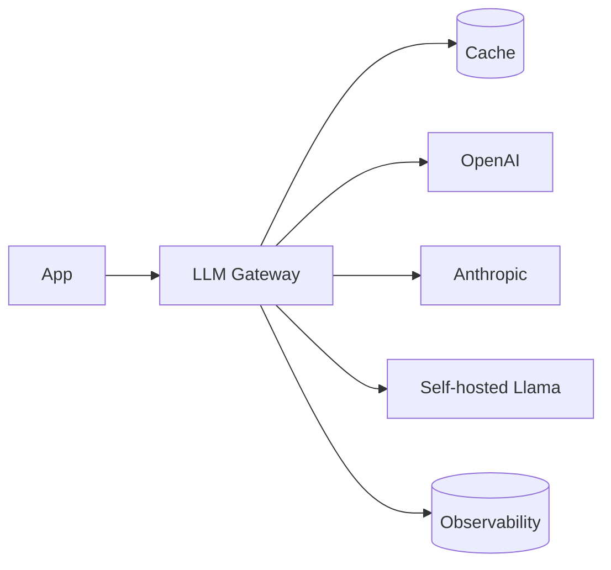

# Вопросы на собеседовании: `LLM Integration Patterns`

Интеграция LLM в production — больше, чем просто `client.chat.completions.create()`. На интервью спрашивают: streaming, retry/fallback, model routing, caching, rate limiting, observability, cost tracking, abstractions для multi-provider, semantic caching, async patterns.

## Полезные ссылки

### Официальная документация и авторитетные источники

- [LiteLLM Documentation](https://docs.litellm.ai/) — multi-provider LLM SDK
- [Helicone (LLM observability)](https://helicone.ai/)
- [Langfuse (open-source observability)](https://langfuse.com/)
- [LangSmith Documentation](https://docs.smith.langchain.com/)
- [OpenRouter — model routing](https://openrouter.ai/)
- [Portkey (AI gateway)](https://portkey.ai/)

## Содержание

- [Полезные ссылки](#полезные-ссылки)
- [See also](#see-also)

**Базовые паттерны**
- [Q1. (!) Что такое LLM gateway?](#q1--что-такое-llm-gateway)
- [Q2. (!) Streaming responses — реализация?](#q2--streaming-responses--реализация)
- [Q3. (!) SSE (Server-Sent Events) для streaming?](#q3--sse-server-sent-events-для-streaming)
- [Q4. WebSocket vs SSE для LLM?](#q4-websocket-vs-sse-для-llm)

**Reliability**
- [Q5. (!) Retry с exponential backoff?](#q5--retry-с-exponential-backoff)
- [Q6. (!) Circuit breaker для LLM API?](#q6--circuit-breaker-для-llm-api)
- [Q7. (!) Fallback между providers (Claude → GPT)?](#q7--fallback-между-providers-claude--gpt)
- [Q8. Timeouts — как настраивать?](#q8-timeouts--как-настраивать)

**Cost optimization**
- [Q9. (!) Model routing (small → large escalation)?](#q9--model-routing-small--large-escalation)
- [Q10. (!) Semantic caching?](#q10--semantic-caching)
- [Q11. Prompt caching (provider-side)?](#q11-prompt-caching-provider-side)
- [Q12. Batching API requests?](#q12-batching-api-requests)
- [Q13. (!) Cost tracking per user / feature?](#q13--cost-tracking-per-user--feature)

**Rate limiting**
- [Q14. (!) Token bucket для LLM API?](#q14--token-bucket-для-llm-api)
- [Q15. Per-user rate limits?](#q15-per-user-rate-limits)
- [Q16. Distributed rate limiting (Redis)?](#q16-distributed-rate-limiting-redis)

**Multi-provider**
- [Q17. (!) Зачем abstraction над provider?](#q17--зачем-abstraction-над-provider)
- [Q18. (!) LiteLLM, OpenRouter, Portkey?](#q18--litellm-openrouter-portkey)
- [Q19. Model parameter normalization?](#q19-model-parameter-normalization)

**Observability**
- [Q20. (!) Что трекать в LLM systems?](#q20--что-трекать-в-llm-systems)
- [Q21. (!) Tracing prompt chains?](#q21--tracing-prompt-chains)
- [Q22. Helicone, Langfuse, LangSmith?](#q22-helicone-langfuse-langsmith)
- [Q23. Latency metrics: TTFT, TPOT?](#q23-latency-metrics-ttft-tpot)

**Async patterns**
- [Q24. (!) Sync vs async LLM calls?](#q24--sync-vs-async-llm-calls)
- [Q25. Background jobs для long generations?](#q25-background-jobs-для-long-generations)

**Безопасность и compliance**
- [Q26. (!) Content moderation pipeline?](#q26--content-moderation-pipeline)
- [Q27. Audit logging?](#q27-audit-logging)
- [Q28. (!) Какие частые проблемы LLM в production?](#q28--какие-частые-проблемы-llm-в-production)

## Q1. (!) Что такое LLM gateway?

**LLM gateway** — middleware между приложением и LLM providers. Централизует:
- Routing (выбор model)
- Caching
- Rate limiting
- Observability
- Fallbacks
- Cost tracking



**Tools:** Portkey, Helicone, LiteLLM, OpenRouter, custom.

**Применение:** в **enterprise**, где много LLM-feature → нужна centralization.


> [!mcq]
> - [ ] Библиотека для парсинга LLM ответов в structured JSON формат | ❌ ПОСЛЕДСТВИЕ: без единой точки входа нет centralized rate limiting и observability — каждая feature реализует это по-своему
> - [ ] Паттерн кэширования LLM ответов на уровне Redis в приложении | ❌ ПОСЛЕДСТВИЕ: без routing и fallback логики каждый сервис хардкодит provider — смена провайдера требует изменений везде
> - [x] Middleware между приложением и LLM providers, централизующий routing, caching, rate limiting, observability и fallback | ✓ ПРИМЕНЯТЬ: в enterprise с 2+ LLM features 📋 ПРАВИЛО: gateway = единая точка контроля всех LLM вызовов 🔗 См. Q17
> - [ ] Инструмент fine-tuning LLM моделей под конкретный домен | ❌ ПОСЛЕДСТВИЕ: fine-tuning не решает проблему vendor lock-in и operational overhead при работе с несколькими providers

## Q2. (!) Streaming responses — реализация?

**OpenAI / Anthropic streaming:**

```python
stream = client.chat.completions.create(
    model="gpt-4o",
    messages=[...],
    stream=True
)

for chunk in stream:
    delta = chunk.choices[0].delta.content
    if delta:
        yield delta  # send to client
```

**Server-side (FastAPI):**

```python
from fastapi.responses import StreamingResponse

@app.post("/chat")
async def chat(req: ChatRequest):
    async def generate():
        stream = client.chat.completions.create(stream=True, ...)
        for chunk in stream:
            yield f"data: {chunk.choices[0].delta.content}\n\n"
    return StreamingResponse(generate(), media_type="text/event-stream")
```

**Преимущества:**
- Faster perceived response (TTFT vs total time)
- Можно cancel mid-generation
- Меньше timeout risks


> [!mcq]
> - [ ] Получить весь ответ синхронно и затем отправить клиенту одним блоком | ❌ ПОСЛЕДСТВИЕ: при 5-секундной генерации пользователь видит blank screen всё это время — TTFT = полное время генерации
> - [x] Установить `stream=True`, итерировать по chunks и yield каждый delta через SSE | ✓ ПРИМЕНЯТЬ: всегда для chat UI 📋 ПРАВИЛО: streaming → TTFT = время до первого токена, не полное время 🔗 См. Q3
> - [ ] Использовать WebSocket для двустороннего обмена streaming данными | ❌ ПОСЛЕДСТВИЕ: WebSocket сложнее в инфраструктуре (proxy, CDN не поддерживают) — SSE проще для одностороннего streaming
> - [ ] Запустить генерацию в background thread и polling статуса | ❌ ПОСЛЕДСТВИЕ: polling создаёт лишние HTTP запросы и задержку — нет настоящего real-time streaming

## Q3. (!) SSE (Server-Sent Events) для streaming?

**SSE** — HTTP standard для server → client streaming.

```
HTTP/1.1 200 OK
Content-Type: text/event-stream

data: Hello

data: world

data: [DONE]
```

**Frontend (JavaScript):**
```javascript
const evtSource = new EventSource("/chat?msg=hi");
evtSource.onmessage = (e) => {
    if (e.data === "[DONE]") {
        evtSource.close();
        return;
    }
    appendToChat(e.data);
};
```

**Преимущества SSE:**
- Простой (просто HTTP)
- Auto-reconnect built-in
- Работает через CDN (Cloudflare etc.)
- Один-направление = меньше state

**OpenAI/Anthropic** возвращают SSE ответы.


> [!mcq]
> - [ ] Бинарный протокол поверх TCP для низколатентной bidirectional передачи данных | ❌ ПОСЛЕДСТВИЕ: бинарный протокол не является стандартным HTTP — не проходит через Cloudflare CDN без специальной настройки
> - [ ] WebSocket с text/plain Content-Type для single-direction streaming | ❌ ПОСЛЕДСТВИЕ: WebSocket требует upgrade handshake и не имеет auto-reconnect — инфраструктура (nginx, CDN) часто блокирует или не кэширует
> - [ ] HTTP chunked transfer encoding без фиксированного формата сообщений | ❌ ПОСЛЕДСТВИЕ: без стандартного `data:` формата клиент не знает границы сообщений — нет поддержки `EventSource` API и auto-reconnect
> - [x] Стандарт HTTP text/event-stream для server→client стриминга с auto-reconnect и CDN-поддержкой | ✓ ПРИМЕНЯТЬ: для LLM token streaming 📋 ПРАВИЛО: SSE = просто HTTP, работает везде, auto-reconnect встроен 🔗 См. Q2

## Q4. WebSocket vs SSE для LLM?

| Критерий | SSE | WebSocket |
|----------|-----|-----------|
| Direction | Server → Client | Bidirectional |
| Protocol | HTTP | Custom (upgraded HTTP) |
| Reconnect | Automatic | Manual |
| Proxies/CDN | Хорошо работает | Сложнее |
| Use case | LLM streaming | Real-time chat (peer-to-peer) |

**Для LLM streaming — SSE** обычно достаточно (одностороннее: server → client). WebSocket если нужны interactive interruptions от клиента.


> [!mcq]
> - [ ] WebSocket всегда предпочтительнее для LLM streaming из-за более низкой latency | ❌ ПОСЛЕДСТВИЕ: WebSocket не имеет auto-reconnect — разрыв соединения требует ручного восстановления; CDN (Cloudflare) не кэширует WebSocket трафик
> - [x] SSE достаточно для LLM streaming (server→client); WebSocket нужен только при interactive прерываниях от клиента | ✓ ПРИМЕНЯТЬ: SSE для стандартного LLM chat 📋 ПРАВИЛО: одностороннее → SSE, bidirectional → WebSocket 🔗 См. Q3
> - [ ] gRPC bidirectional streaming оптимален для LLM из-за Protocol Buffers сжатия | ❌ ПОСЛЕДСТВИЕ: gRPC не поддерживается в браузерах без grpc-web прокси — усложняет frontend интеграцию без реального выигрыша для LLM streaming
> - [ ] Long-polling с 30-секундными запросами эффективнее SSE для LLM responses | ❌ ПОСЛЕДСТВИЕ: long-polling создаёт задержку между токенами — пользователь видит текст пачками, а не потоком

## Q5. (!) Retry с exponential backoff?

```python
from tenacity import retry, stop_after_attempt, wait_exponential, retry_if_exception_type

@retry(
    stop=stop_after_attempt(5),
    wait=wait_exponential(multiplier=1, min=2, max=60),
    retry=retry_if_exception_type((RateLimitError, APIError, Timeout))
)
def call_llm(prompt):
    return client.chat.completions.create(...)
```

**Wait pattern:** 2s → 4s → 8s → 16s → 60s (max).

**Что retry'ать:**
- HTTP 429 (rate limit)
- HTTP 500-599 (server errors)
- Timeouts
- Connection errors

**Не retry'ать:**
- HTTP 400 (bad request) — твоя ошибка, retry не поможет
- HTTP 401, 403 (auth) — retry не поможет
- HTTP 422 (validation)


> [!mcq]
> - [ ] Retry всех HTTP ошибок включая 400, 401, 422 с фиксированным интервалом 1 секунда | ❌ ПОСЛЕДСТВИЕ: retry 400/401 никогда не исправит ошибку клиента — получишь 5 бесполезных запросов с фиксированным интервалом → thundering herd при отказе provider
> - [ ] Retry только HTTP 429 с линейным backoff 5 секунд между попытками | ❌ ПОСЛЕДСТВИЕ: линейный backoff не даёт provider времени восстановиться — при массовом 429 все клиенты одновременно повторяют → ещё больше 429
> - [ ] Немедленно поднимать исключение без retry при любой ошибке LLM API | ❌ ПОСЛЕДСТВИЕ: временные 500/503 и rate limits (429) от OpenAI/Anthropic поддаются retry — без них availability системы падает до 95% вместо 99.9%
> - [x] Retry 429, 500-599, timeouts с exponential backoff (2s→4s→8s→max 60s); не retry'ать 400, 401, 422 | ✓ ПРИМЕНЯТЬ: всегда для LLM API calls 📋 ПРАВИЛО: retry только transient ошибки, exponential backoff предотвращает thundering herd 🔗 См. Q6

## Q6. (!) Circuit breaker для LLM API?

**Circuit breaker:** если provider returning errors **много раз** → временно **stop calling** (open circuit), wait, try again.

```python
from pybreaker import CircuitBreaker

llm_breaker = CircuitBreaker(fail_max=5, reset_timeout=60)

@llm_breaker
def call_openai(prompt):
    return openai_client.chat.completions.create(...)
```

**States:**
- **Closed** — calls идут normally
- **Open** — все calls fail immediately (без обращения к API)
- **Half-open** — пробуем 1-2 calls, если OK → closed

**Зачем:** не **душить** вмёртвый сервис, экономить ресурсы, fail fast.

Подробнее — в [Resilience Patterns](../architecture/resilience-patterns-interview.md).


> [!mcq]
> - [ ] Retry бесконечно пока provider не ответит, блокируя поток выполнения | ❌ ПОСЛЕДСТВИЕ: при даунтайме OpenAI все threads заняты ожиданием → thread pool exhaustion → приложение полностью неотзывчиво
> - [x] Автомат состояний CLOSED→OPEN→HALF-OPEN: при N ошибках подряд открыть circuit, fail fast без обращения к API | ✓ ПРИМЕНЯТЬ: для LLM provider вызовов 📋 ПРАВИЛО: circuit breaker = fail fast при повторяющихся сбоях, не душить упавший сервис 🔗 См. Q7
> - [ ] Логировать все ошибки и продолжать вызывать provider игнорируя паттерн отказов | ❌ ПОСЛЕДСТВИЕ: каждый запрос ждёт timeout (30-60s) вместо мгновенного fallback — latency деградирует для всех пользователей
> - [ ] Переключаться на другой provider при первой же ошибке без состояния | ❌ ПОСЛЕДСТВИЕ: одиночные transient ошибки вызывают ненужный fallback — нет различия между временным сбоем и реальным даунтаймом

## Q7. (!) Fallback между providers (Claude → GPT)?

```python
def chat_with_fallback(messages):
    providers = [
        lambda: anthropic.messages.create(model="claude-opus-4-7", messages=messages),
        lambda: openai.chat.completions.create(model="gpt-4o", messages=messages),
        lambda: google.generate(model="gemini-1.5-pro", messages=messages)
    ]

    for provider in providers:
        try:
            return provider()
        except (RateLimitError, APIError, Timeout) as e:
            log.warning(f"Provider failed: {e}, trying next")
    raise AllProvidersFailedError()
```

**Подвох:** разные providers имеют **разные API формат**. Need adapter layer (LiteLLM helps).

**Use case:** primary provider down → не положить product, использовать backup.


> [!mcq]
> - [ ] Случайно выбирать provider для каждого запроса без учёта их статуса | ❌ ПОСЛЕДСТВИЕ: запросы попадают на упавший provider — нет улучшения availability, только случайные 50% ошибок
> - [ ] Переключиться на fallback provider при любом исключении включая 400 validation ошибки | ❌ ПОСЛЕДСТВИЕ: 400 Bad Request означает баг в промпте — fallback к другому provider вернёт то же 400 или некорректный ответ вместо исправления запроса
> - [ ] Вызывать все providers параллельно и брать первый ответ | ❌ ПОСЛЕДСТВИЕ: параллельные вызовы 3 провайдеров в 3 раза увеличивают стоимость каждого запроса — latency улучшение минимально при правильном primary
> - [x] Последовательно пробовать providers при RateLimitError/APIError/Timeout через adapter layer с единым интерфейсом | ✓ ПРИМЕНЯТЬ: для high-availability LLM систем 📋 ПРАВИЛО: fallback chain + adapter layer (LiteLLM) → vendor-agnostic код 🔗 См. Q18

## Q8. Timeouts — как настраивать?

```python
client = OpenAI(timeout=30.0)  # default
# или per-request
response = client.chat.completions.create(timeout=60.0, ...)
```

**Recommendations:**
- **Streaming:** longer (5-10 min) — иногда модель долго "думает"
- **Non-streaming:** 30-60 sec обычно
- **TTFT (Time-To-First-Token):** monitor < 3 sec — если больше → проблема

**Подвох:** **default timeouts** OpenAI/Anthropic SDK могут быть слишком высокими для UX.


> [!mcq]
> - [x] Non-streaming: 30-60 сек; streaming: 5-10 мин; отдельно мониторить TTFT < 3 сек | ✓ ПРИМЕНЯТЬ: при настройке LLM клиента 📋 ПРАВИЛО: streaming timeout = время всей генерации, non-streaming = время полного ответа 🔗 См. Q23
> - [ ] Единый таймаут 5 секунд для всех LLM вызовов включая streaming | ❌ ПОСЛЕДСТВИЕ: reasoning модели (o1, claude) могут генерировать 60+ секунд — таймаут 5s прерывает легитимные запросы
> - [ ] Отключить таймауты полностью чтобы не прерывать длинные генерации | ❌ ПОСЛЕДСТВИЕ: зависший провайдер держит connection бесконечно → thread pool exhaustion → новые запросы не обрабатываются
> - [ ] Использовать дефолтный таймаут SDK (600 сек) для всех запросов | ❌ ПОСЛЕДСТВИЕ: при медленном провайдере пользователь ждёт 10 минут без ответа — TTFT мониторинга нет, UX деградирует незаметно

## Q9. (!) Model routing (small → large escalation)?

**Идея:** не использовать самую дорогую model для всего. Cascade:

```python
def smart_route(query):
    # Try small model first
    response = small_model(query)

    if response.confidence < 0.7 or "I'm not sure" in response.text:
        # Escalate to large model
        response = large_model(query)

    return response
```

**Сложнее:**
- **Classifier** перед LLM выбирает right model based on task complexity
- **Mixture of Experts** — multiple specialized models

**Эффект:** 50-80% cost saving для apps с varied complexity.


> [!mcq]
> - [ ] Всегда использовать самую мощную модель для всех запросов | ❌ ПОСЛЕДСТВИЕ: GPT-4o стоит ~$0.01/1K output tokens — простые FAQ запросы в 20x дороже чем GPT-3.5-turbo; cost runaway при масштабировании
> - [ ] Всегда использовать самую дешёвую модель для снижения затрат | ❌ ПОСЛЕДСТВИЕ: gpt-3.5-turbo не справляется с complex reasoning задачами — quality degradation, hallucinations в ответах на сложные вопросы
> - [x] Попробовать маленькую модель первой, эскалировать к большой при низкой уверенности или сложности | ✓ ПРИМЕНЯТЬ: 50-80% запросов простые 📋 ПРАВИЛО: cascade routing → small first, large only when needed 🔗 См. Q1
> - [ ] Routing на основе только длины prompt без учёта сложности задачи | ❌ ПОСЛЕДСТВИЕ: длина не коррелирует со сложностью — короткий вопрос по математике сложнее длинного FAQ, routing будет ошибочным

## Q10. (!) Semantic caching?

**Exact match cache:** key = full prompt, low hit rate.

**Semantic cache:** key = embedding query, hit на **похожих** queries.

```python
def semantic_cache_lookup(query, threshold=0.95):
    query_emb = embed(query)
    similar_queries = vector_db.search(query_emb, top_k=1)
    if similar_queries[0].score >= threshold:
        return similar_queries[0].metadata["response"]
    return None

def chat(query):
    if cached := semantic_cache_lookup(query):
        return cached  # instant + free
    response = call_llm(query)
    store_cache(query, response)
    return response
```

**Подвох:**
- High threshold → low hit rate
- Low threshold → wrong answers (different intent но similar wording)

**Tools:** GPTCache, Redis Vector Search.


> [!mcq]
> - [ ] Кэшировать по хэшу полного prompt строки (exact match) | ❌ ПОСЛЕДСТВИЕ: "Как работает Docker?" и "Объясни Docker" — разные хэши → 0% cache hit rate на семантически идентичных вопросах
> - [x] Embed query → искать в vector DB похожие запросы → при cosine similarity ≥ 0.95 вернуть кэш | ✓ ПРИМЕНЯТЬ: для FAQ/knowledge-base типов запросов 📋 ПРАВИЛО: semantic cache = embeddings + threshold, высокий threshold → точность, низкий → coverage 🔗 См. Q11
> - [ ] Кэшировать только первые N символов запроса как ключ | ❌ ПОСЛЕДСТВИЕ: "Docker swarm" и "Docker networking" имеют одинаковый prefix "Docker" → cache pollution, неправильные ответы
> - [ ] Устанавливать порог similarity 0.50 для максимального cache hit rate | ❌ ПОСЛЕДСТВИЕ: при threshold 0.50 "Как настроить Redis?" и "Как работает PostgreSQL?" могут совпасть → неверный кэшированный ответ

## Q11. Prompt caching (provider-side)?

**Anthropic, OpenAI** поддерживают auto cache prompt **prefixes**.

**Anthropic:**
```python
{"role": "system", "content": [
    {"type": "text", "text": LARGE_SYSTEM_PROMPT, "cache_control": {"type": "ephemeral"}}
]}
```

**Cost reduction:** 90% для cached portion.

**Use case:** RAG с large static documents. Documents в начале prompt → cached. User question меняется → дешевле re-query.


> [!mcq]
> - [ ] Кэшировать динамическую часть prompt (user query) на стороне клиента | ❌ ПОСЛЕДСТВИЕ: user queries уникальны — cache hit rate ~0%; статический system prompt не кэшируется → платим полную стоимость каждый раз
> - [ ] Добавить cache_control ко всему prompt включая user message | ❌ ПОСЛЕДСТВИЕ: Anthropic кэширует только prefix до изменяемой части — cache_control на user message игнорируется, деньги на ветер
> - [x] Пометить статический system prompt / документы через `cache_control: ephemeral` — 90% скидка на cached tokens | ✓ ПРИМЕНЯТЬ: при RAG с большими статическими документами 📋 ПРАВИЛО: кэшируй стабильный prefix, меняется только query в конце 🔗 См. Q10
> - [ ] Использовать HTTP ETag заголовки для кэширования prompt на CDN уровне | ❌ ПОСЛЕДСТВИЕ: LLM API не поддерживает CDN кэширование — каждый запрос уникален для inference engine, ETag не применим

## Q12. Batching API requests?

**Batch API** (OpenAI, Anthropic):
- Async: submit batch, wait few hours, get results
- **50% discount** vs sync API
- Для не-realtime use cases

```python
batch = client.batches.create(
    input_file_id="...",  # JSONL файл с requests
    endpoint="/v1/chat/completions",
    completion_window="24h"
)
# wait few hours
result = client.batches.retrieve(batch.id)
```

**Use cases:**
- Bulk classification
- Background ETL
- Embedding generation (тоже batch)
- Non-urgent summarizations


> [!mcq]
> - [ ] Собирать запросы в буфер и слать sync пачками каждые 100ms для снижения latency | ❌ ПОСЛЕДСТВИЕ: sync batching увеличивает latency для первых запросов в буфере — не получаем 50% скидку Batch API, которая только для async
> - [x] Async Batch API: отправить JSONL файл, получить результаты через несколько часов со скидкой 50% | ✓ ПРИМЕНЯТЬ: для bulk classification, ETL, non-realtime tasks 📋 ПРАВИЛО: Batch API = асинхронно + дёшево, не для realtime 🔗 См. Q13
> - [ ] Параллельно слать синхронные запросы через asyncio.gather для удвоения throughput | ❌ ПОСЛЕДСТВИЕ: async parallel sync calls не дают 50% скидку Batch API — просто быстрее исчерпываем rate limits
> - [ ] Применять Batch API для real-time chat с пользователями ради экономии | ❌ ПОСЛЕДСТВИЕ: Batch API возвращает результаты через часы — chat пользователь не может ждать несколько часов ответа

## Q13. (!) Cost tracking per user / feature?

```python
def call_llm_with_tracking(user_id, feature, messages):
    response = llm.chat.completions.create(...)

    cost = calculate_cost(
        model=response.model,
        input_tokens=response.usage.prompt_tokens,
        output_tokens=response.usage.completion_tokens
    )

    metrics.track({
        "user_id": user_id,
        "feature": feature,
        "model": response.model,
        "input_tokens": response.usage.prompt_tokens,
        "output_tokens": response.usage.completion_tokens,
        "cost_usd": cost,
        "timestamp": time.time()
    })
    return response
```

**Зачем:**
- Бизнес-метрики (cost per active user)
- Идентификация expensive features
- Quota enforcement (free tier vs paid)
- Anomaly detection

**Tools:** Helicone, Langfuse, custom Postgres + Grafana.


> [!mcq]
> - [ ] Трекать только общий счёт API без разбивки по user_id и feature | ❌ ПОСЛЕДСТВИЕ: при неожиданном росте стоимости невозможно определить какой user или feature стал причиной — нет базы для quota enforcement
> - [ ] Считать стоимость по времени вызова API без учёта token usage | ❌ ПОСЛЕДСТВИЕ: LLM billing идёт по токенам, а не по времени — стоимость по времени будет неточной; длинные ответы занижены, короткие завышены
> - [x] Записывать input_tokens, output_tokens, модель, user_id, feature и рассчитанный cost_usd на каждый запрос | ✓ ПРИМЕНЯТЬ: во всех production LLM системах 📋 ПРАВИЛО: track per-request cost = основа для billing, quota и аномалий 🔗 См. Q20
> - [ ] Агрегировать стоимость только раз в сутки через batch запрос к provider API | ❌ ПОСЛЕДСТВИЕ: daily aggregation не позволяет реагировать на anomalies в реальном времени — cost runaway обнаружится только на следующий день

## Q14. (!) Token bucket для LLM API?

```python
from token_bucket import TokenBucket

bucket = TokenBucket(rate=100, capacity=200)  # 100 RPS, max burst 200

def call_llm(prompt):
    if not bucket.consume(1):
        raise RateLimitedError()
    return llm.chat.completions.create(...)
```

**Зачем:** не превысить provider's rate limits → меньше HTTP 429.

**Per-token bucket:** track output tokens, не requests (since OpenAI имеет TPM limits тоже).


> [!mcq]
> - [ ] Отправлять все запросы без ограничений и обрабатывать 429 через retry | ❌ ПОСЛЕДСТВИЕ: без pre-emptive limiting все параллельные запросы упираются в 429 одновременно → exponential backoff storm, throughput падает
> - [x] Token bucket с rate=100 RPS, capacity=200 (burst): при исчерпании bucket сразу возвращать RateLimitedError | ✓ ПРИМЕНЯТЬ: перед каждым LLM вызовом 📋 ПРАВИЛО: token bucket = pre-emptive limit, предотвращает 429 от провайдера 🔗 См. Q15
> - [ ] Fixed window counter: считать запросы в 1-минутном окне и блокировать при превышении | ❌ ПОСЛЕДСТВИЕ: fixed window позволяет двойной burst на границе окон — N запросов в конце одного + N в начале следующего → rate limit от OpenAI
> - [ ] Throttle через sleep(1/rate) перед каждым запросом без учёта burst | ❌ ПОСЛЕДСТВИЕ: sleep throttling блокирует event loop в async приложениях — throughput ограничен даже при низкой нагрузке

## Q15. Per-user rate limits?

```python
def rate_limit_user(user_id, max_per_min=10):
    key = f"ratelimit:{user_id}:{int(time.time() / 60)}"
    count = redis.incr(key)
    if count == 1:
        redis.expire(key, 60)
    if count > max_per_min:
        raise UserRateLimitedError()
```

**Зачем:**
- **Защита от abuse** (один user не сжигает всю quota)
- **Tiered pricing** (free: 10 RPM, premium: 100 RPM)
- **Cost control** (budget per user)


> [!mcq]
> - [ ] Глобальный лимит на всё приложение без разбивки по пользователям | ❌ ПОСЛЕДСТВИЕ: один abuse user может исчерпать всю global quota → все остальные пользователи получают RateLimitedError
> - [x] Redis INCR с TTL на ключ `ratelimit:{user_id}:{minute}` — превышение N запросов за минуту → HTTP 429 | ✓ ПРИМЕНЯТЬ: для multi-tenant LLM API 📋 ПРАВИЛО: per-user limit в Redis = защита от abuse + tiered pricing 🔗 См. Q16
> - [ ] In-memory counter в каждом instance приложения без синхронизации | ❌ ПОСЛЕДСТВИЕ: при 3 instances пользователь делает 3×limit запросов — каждый instance видит только свой счётчик, нет консистентного лимита
> - [ ] Rate limit по IP адресу вместо user_id | ❌ ПОСЛЕДСТВИЕ: shared IP (офисная сеть, VPN) — один пользователь блокирует всех коллег; злоумышленник меняет IP через proxy

## Q16. Distributed rate limiting (Redis)?

```python
# Sliding window log
def is_allowed(user_id, max_per_min=10):
    key = f"requests:{user_id}"
    now = time.time()
    redis.zremrangebyscore(key, 0, now - 60)  # cleanup old
    count = redis.zcard(key)
    if count >= max_per_min:
        return False
    redis.zadd(key, {str(uuid.uuid4()): now})
    redis.expire(key, 60)
    return True
```

**Distributed** — все instances приложения видят limit consistently через Redis.

**Tools:** `redis-py-cluster`, `aioredis`.


> [!mcq]
> - [ ] In-memory HashMap в каждом pod без синхронизации через Redis | ❌ ПОСЛЕДСТВИЕ: при 5 pods пользователь может сделать 5×limit запросов — Kubernetes horizontal scaling полностью обходит rate limit
> - [ ] Sticky sessions чтобы каждый пользователь попадал на один pod | ❌ ПОСЛЕДСТВИЕ: sticky sessions нарушают load balancing — один pod перегружен, остальные простаивают; pod restart теряет все счётчики
> - [x] Sliding window через Redis sorted set: удалять старые, считать актуальные, все instances видят консистентный limit | ✓ ПРИМЕНЯТЬ: при Kubernetes горизонтальном масштабировании 📋 ПРАВИЛО: distributed rate limit = Redis как единый источник истины 🔗 См. Q15
> - [ ] Использовать Lua скрипты в Redis только для атомарности без sliding window | ❌ ПОСЛЕДСТВИЕ: fixed window без sliding позволяет burst на границах окон — 10 запросов в 00:59 + 10 в 01:00 = 20 за 2 секунды

## Q17. (!) Зачем abstraction над provider?

**Без abstraction:**
```python
# OpenAI
openai_client.chat.completions.create(model="gpt-4", messages=[...])

# Anthropic
anthropic_client.messages.create(model="claude-opus-4", messages=[...], max_tokens=1024)

# Google
google_client.generate(model="gemini-1.5-pro", contents=[...])
```

Разные APIs, разные параметры, разные форматы responses.

**С abstraction:**
```python
gateway.chat(model="gpt-4", messages=[...])
gateway.chat(model="claude-opus-4", messages=[...])
# Same interface
```

**Зачем:**
- **Switch providers** легко
- **A/B testing** разных models
- **Fallback** между providers
- **Centralized logging, caching**


> [!mcq]
> - [ ] Напрямую вызывать OpenAI SDK везде в коде — стандарт стал де-факто | ❌ ПОСЛЕДСТВИЕ: при смене на Anthropic или локальную модель нужно менять вызовы во всём коде — vendor lock-in делает migration крайне дорогостоящим
> - [ ] Создавать wrapper только для цели retry логики | ❌ ПОСЛЕДСТВИЕ: узкий wrapper только для retry не позволяет централизовать fallback, caching, A/B testing — дублирование кода в каждом сервисе
> - [ ] Использовать HTTP gateway (nginx) как единственный уровень абстракции | ❌ ПОСЛЕДСТВИЕ: nginx не понимает семантику LLM — нет intelligent routing по сложности запроса, нет semantic caching, нет token counting
> - [x] Unified interface через adapter pattern: один метод `gateway.chat()` работает с OpenAI, Anthropic, Google — легкий switch и A/B testing | ✓ ПРИМЕНЯТЬ: при 2+ LLM providers 📋 ПРАВИЛО: abstraction = decoupling от vendor API 🔗 См. Q18

## Q18. (!) LiteLLM, OpenRouter, Portkey?

**LiteLLM** — Python SDK, унифицирует **100+ models**.

```python
from litellm import completion

response = completion(
    model="gpt-4o",  # или "claude-opus-4-7", "gemini-1.5-pro"
    messages=[...]
)
```

**OpenRouter** — proxy/marketplace для LLM. Один API key, выбор из десятков models, billing.

**Portkey** — AI gateway: routing, fallbacks, observability, caching, guardrails.

**Helicone** — фокус на observability + caching, как proxy.

**Когда нужно:**
- LiteLLM — если хочешь minimal abstraction в коде
- OpenRouter — если хочешь experimentation с разными models
- Portkey/Helicone — для enterprise (governance, observability)


> [!mcq]
> - [x] LiteLLM = Python SDK для 100+ моделей; OpenRouter = proxy-marketplace; Portkey/Helicone = enterprise gateway с observability | ✓ ПРИМЕНЯТЬ: LiteLLM для кода, OpenRouter для экспериментов, Portkey для enterprise 📋 ПРАВИЛО: выбор зависит от уровня абстракции 🔗 См. Q17
> - [ ] LiteLLM — только для fine-tuning, OpenRouter — только для OpenAI моделей | ❌ ПОСЛЕДСТВИЕ: неверное понимание инструментов ведёт к переизобретению abstraction layer — LiteLLM унифицирует 100+ моделей, не только OpenAI
> - [ ] Helicone и LangSmith — идентичные инструменты, оба для prompt versioning | ❌ ПОСЛЕДСТВИЕ: путаница в инструментах: Helicone = observability proxy, LangSmith = tightly coupled с LangChain; выбор не того инструмента → переделка
> - [ ] Portkey заменяет необходимость в retry и circuit breaker логике в приложении | ❌ ПОСЛЕДСТВИЕ: зависимость от Portkey для всей resilience логики — при недоступности Portkey приложение падает полностью; resilience должна быть layered

## Q19. Model parameter normalization?

```python
# Different providers — different params
openai_params = {"temperature": 0.7, "presence_penalty": 0.5}
anthropic_params = {"temperature": 0.7}  # no presence_penalty
google_params = {"temperature": 0.7, "top_k": 40}
```

**Abstraction layer должен:**
- Map common params (temperature, max_tokens)
- Handle provider-specific quirks
- Validate inputs

LiteLLM делает это automatically.


> [!mcq]
> - [ ] Передавать все параметры всем providers и игнорировать ValidationError | ❌ ПОСЛЕДСТВИЕ: Anthropic не поддерживает `presence_penalty` — API вернёт 400; игнорирование ошибок скрывает misconfiguration
> - [x] Abstraction layer маппит common параметры (temperature, max_tokens), игнорирует provider-specific, LiteLLM делает это автоматически | ✓ ПРИМЕНЯТЬ: при работе с несколькими providers 📋 ПРАВИЛО: нормализация = единый интерфейс, не vendor-specific params 🔗 См. Q17
> - [ ] Поддерживать отдельные конфиг-файлы для каждого провайдера в каждом сервисе | ❌ ПОСЛЕДСТВИЕ: при добавлении нового provider нужно обновлять конфиги во всех сервисах — O(services×providers) изменений
> - [ ] Использовать только параметры поддерживаемые всеми провайдерами (только temperature) | ❌ ПОСЛЕДСТВИЕ: ограничение до общего подмножества теряет возможности — например, max_tokens обязателен у Anthropic, top_p важен для качества

## Q20. (!) Что трекать в LLM systems?

**Per-request:**
- Model used
- Input/output tokens
- Cost
- Latency (TTFT, TTFC, TPOT, total)
- HTTP status / error
- User ID, feature, request ID
- Cache hit/miss

**Per-system:**
- RPS, error rates
- Token usage (input/output)
- Cost per hour/day
- Cost per feature
- Provider usage distribution

**User-level:**
- Satisfaction (thumbs up/down)
- Feature usage
- Cost per user


> [!mcq]
> - [ ] Трекать только HTTP статус код и total latency без token metrics | ❌ ПОСЛЕДСТВИЕ: без token counts нет основы для cost tracking — неожиданный рост расходов невозможно атрибутировать к feature или user
> - [ ] Логировать только ошибки (4xx, 5xx) без успешных запросов | ❌ ПОСЛЕДСТВИЕ: без метрик успешных запросов нет baseline для TTFT, cost trends, cache hit rate — аномалии не видны на фоне нормы
> - [ ] Трекать только business метрики (conversion, engagement) без LLM-специфичных | ❌ ПОСЛЕДСТВИЕ: при деградации качества LLM ответов нет сигнала — TTFT рост, token cost spike обнаружатся только через падение business метрик с задержкой
> - [x] Per-request: model, tokens, cost, TTFT, user_id, feature, cache hit/miss; per-system: RPS, error rate, cost/day/feature | ✓ ПРИМЕНЯТЬ: во всех production LLM системах 📋 ПРАВИЛО: полный observability stack = быстрое обнаружение cost и quality проблем 🔗 См. Q21

## Q21. (!) Tracing prompt chains?

**Trace** — запись всей цепочки вызовов в одном logical operation.

```python
with tracer.span("rag_pipeline") as root:
    with tracer.span("retrieval"):
        chunks = vector_db.search(query)
    with tracer.span("rerank"):
        ranked = rerank(chunks)
    with tracer.span("llm_call", attributes={"model": "gpt-4o"}):
        answer = llm(prompt)
```

**Visualization:**
```
rag_pipeline (2.5s)
├── retrieval (0.2s)
├── rerank (0.3s)
└── llm_call (2.0s)
```

**Tools:** OpenTelemetry, LangSmith, Langfuse, Phoenix.

Подробнее — [Observability](../monitoring/observability-interview.md).


> [!mcq]
> - [ ] Логировать каждый шаг pipeline в отдельные log строки без correlation ID | ❌ ПОСЛЕДСТВИЕ: без общего trace_id невозможно связать retrieval + rerank + llm_call для одного запроса — debugging требует ручной корреляции временных меток
> - [x] OpenTelemetry spans с parent-child иерархией: root span для pipeline, child spans для каждого шага с latency и атрибутами | ✓ ПРИМЕНЯТЬ: для RAG и multi-step LLM pipelines 📋 ПРАВИЛО: trace = единый timeline всей цепочки для debugging 🔗 См. Q22
> - [ ] Трекать только финальный LLM вызов без промежуточных шагов retrieval и rerank | ❌ ПОСЛЕДСТВИЕ: при медленном ответе неизвестно bottleneck — retrieval 2s или LLM 2s; оптимизировать нечего без детального breakdown
> - [ ] Синхронно записывать трейсы в БД внутри каждого шага pipeline | ❌ ПОСЛЕДСТВИЕ: синхронная запись трейсов добавляет latency к каждому шагу — observability ухудшает производительность, нужен async export

## Q22. Helicone, Langfuse, LangSmith?

**Helicone** (open-source/SaaS):
- Просто **proxy** перед OpenAI API
- Auto-track все calls
- Caching, rate limiting

**Langfuse** (open-source):
- Tracing prompt chains
- Datasets для evaluation
- Prompt management

**LangSmith** (LangChain):
- Tightly integrated с LangChain
- Tracing, datasets, evals
- Prompt versioning

**Phoenix (Arize):** open-source, фокус на embedding + tracing.

В **2025** — выбор зависит от стека. Без LangChain → Langfuse / Helicone.


> [!mcq]
> - [ ] LangSmith лучший выбор для любого LLM стека независимо от фреймворка | ❌ ПОСЛЕДСТВИЕ: LangSmith тесно связан с LangChain — для custom или non-LangChain кода требует значительного boilerplate, Langfuse проще
> - [x] Helicone = proxy для auto-трекинга; Langfuse = OSS tracing + datasets; LangSmith = для LangChain стека; Phoenix = embedding + tracing | ✓ ПРИМЕНЯТЬ: без LangChain → Langfuse/Helicone 📋 ПРАВИЛО: выбор по стеку и требованиям к governance 🔗 См. Q21
> - [ ] Все инструменты взаимозаменяемы и предоставляют идентичный функционал | ❌ ПОСЛЕДСТВИЕ: Helicone фокус на proxy+caching, Langfuse на datasets+evals, Phoenix на embeddings — выбор не того инструмента → переделка integrations
> - [ ] Достаточно стандартного Python logging без специализированных LLM observability tools | ❌ ПОСЛЕДСТВИЕ: plain logging не даёт cost breakdown по feature, TTFT метрики, cache hit rate, evaluation datasets — production LLM требует специализированный инструментарий

## Q23. Latency metrics: TTFT, TPOT?

| Метрика | Расшифровка | Описание |
|---------|-------------|----------|
| **TTFT** | Time To First Token | Latency до первого слова (важно для UX) |
| **TPOT** | Time Per Output Token | Сколько времени на каждый token |
| **TTFC** | Time To First Chunk | Похоже TTFT |
| **TPS** | Tokens Per Second | Output throughput |
| **E2E** | End-to-end latency | Total время |

**Важно:**
- **TTFT** — ключевая метрика для chat UX
- **TPS** — throughput для batch processing
- **E2E = TTFT + tokens × TPOT**

OpenAI / Anthropic typically:
- TTFT: 0.5-3 sec
- TPS: 50-150 tokens/sec


> [!mcq]
> - [ ] Измерять только E2E latency для оценки производительности LLM | ❌ ПОСЛЕДСТВИЕ: E2E включает и TTFT и generation time — нельзя отличить медленный start от медленной генерации; при streaming UX определяет TTFT, а не E2E
> - [ ] TTFT и TPOT одинаково важны и должны быть ≤ 1 сек каждая | ❌ ПОСЛЕДСТВИЕ: TPOT ~7ms/token при 150 TPS — требование ≤ 1 сек на токен нереалистично; TPOT нормируется как tokens/sec, не секунды/токен
> - [ ] Для chat UX оптимизировать только TPS (tokens per second) | ❌ ПОСЛЕДСТВИЕ: высокий TPS (100 TPS) при TTFT 10 секунд — пользователь видит blank screen 10 секунд перед началом текста; TTFT критичнее для perceived responsiveness
> - [x] TTFT — ключевая UX метрика (< 3 сек), TPOT — throughput; E2E = TTFT + tokens × TPOT | ✓ ПРИМЕНЯТЬ: алерт при TTFT > 3 сек 📋 ПРАВИЛО: optimize for TTFT first → perceived responsiveness 🔗 См. Q8

## Q24. (!) Sync vs async LLM calls?

**Sync:**
```python
response = client.chat.completions.create(...)
```

**Async:**
```python
response = await async_client.chat.completions.create(...)
```

**Async преимущества:**
- Можно параллелить много calls
- Не блокирует event loop (FastAPI, asyncio)
- Лучше throughput для high-concurrency

```python
# Parallel calls
responses = await asyncio.gather(
    client.chat.completions.create(...),
    client.chat.completions.create(...),
    client.chat.completions.create(...)
)
```

**Production rule:** **always use async** для LLM calls в web servers.


> [!mcq]
> - [ ] Sync LLM calls достаточны для production FastAPI сервиса | ❌ ПОСЛЕДСТВИЕ: sync call блокирует event loop на 2-30 секунд — при 10 concurrent пользователях FastAPI перестаёт отвечать на новые запросы
> - [x] Async LLM calls с `await` в FastAPI: не блокирует event loop, asyncio.gather для параллельных вызовов | ✓ ПРИМЕНЯТЬ: всегда в async web servers 📋 ПРАВИЛО: LLM latency 2-30с × sync = thread pool exhaustion 🔗 См. Q25
> - [ ] Thread pool с sync calls — 50 workers достаточно для любой нагрузки | ❌ ПОСЛЕДСТВИЕ: при LLM latency 5s, 50 threads × 5s = 250 concurrent запросов максимум; async без thread pool обрабатывает тысячи
> - [ ] Использовать multiprocessing вместо asyncio для LLM calls | ❌ ПОСЛЕДСТВИЕ: multiprocessing создаёт separate process per request — overhead форка процесса (100ms+) и memory overhead несовместимы с высокочастотными LLM вызовами

## Q25. Background jobs для long generations?

Если ответ модели **долгий** (минуты):

```python
@app.post("/generate")
async def generate(req):
    job_id = uuid.uuid4()
    queue.enqueue(generate_task, req, job_id)
    return {"job_id": job_id, "status": "pending"}

@app.get("/status/{job_id}")
async def status(job_id):
    return jobs.get(job_id)  # {"status": "complete", "result": "..."}
```

**Tools:** Celery, RQ, Sidekiq, custom.

**Use cases:**
- Long-form generation (essays, reports)
- Reasoning models (o1, o3) — могут думать минутами
- Multi-step agents


> [!mcq]
> - [ ] Держать HTTP connection открытым на всё время генерации (несколько минут) | ❌ ПОСЛЕДСТВИЕ: HTTP timeout на nginx/load balancer обычно 60-300 сек; reasoning модели думают минутами → 504 Gateway Timeout до завершения генерации
> - [x] Enqueue задачу, вернуть job_id немедленно, клиент polling статус endpoint | ✓ ПРИМЕНЯТЬ: для reasoning моделей (o1, o3) и long-form generation 📋 ПРАВИЛО: long operations → async job pattern, не sync HTTP 🔗 См. Q24
> - [ ] Использовать streaming SSE для всех долгих генераций без queue | ❌ ПОСЛЕДСТВИЕ: SSE держит connection открытым всё время — при многочасовой генерации теряем connection при любом network event; нет retry semantics
> - [ ] Блокировать HTTP запрос в отдельном thread до завершения генерации | ❌ ПОСЛЕДСТВИЕ: thread занят на весь период генерации (минуты) — thread pool exhaustion при нескольких concurrent long-running jobs

## Q26. (!) Content moderation pipeline?

**Pre-LLM moderation** (на input):
```python
moderation = openai.moderations.create(input=user_message)
if moderation.results[0].flagged:
    return "I cannot help with that request."
```

**Post-LLM moderation** (на output):
```python
response = llm(prompt)
moderation = openai.moderations.create(input=response)
if moderation.results[0].flagged:
    return generic_safe_response()
```

**Categories:** hate, sexual, violence, self-harm, harassment.

**Tools:**
- OpenAI Moderations API (free)
- Anthropic Constitutional AI (built-in)
- Perspective API (Google)
- Self-hosted classifiers


> [!mcq]
> - [ ] Модерировать только output LLM без проверки input пользователя | ❌ ПОСЛЕДСТВИЕ: prompt injection и jailbreak проходят в LLM — модель генерирует вредоносный контент, который затем обнаруживается уже постфактум
> - [ ] Полагаться только на встроенные safety guardrails LLM провайдера | ❌ ПОСЛЕДСТВИЕ: встроенные guardrails не дают audit log и customizable категории — для HIPAA/EU AI Act нужен собственный moderation pipeline с logging
> - [x] Pre-LLM moderation (input) + post-LLM moderation (output) через OpenAI Moderations API или Perspective API | ✓ ПРИМЕНЯТЬ: для user-facing LLM продуктов 📋 ПРАВИЛО: двойной барьер: до и после LLM 🔗 См. Q27
> - [ ] Фильтровать по keyword blacklist вместо ML-based moderation | ❌ ПОСЛЕДСТВИЕ: keyword filter не понимает контекст — "kill the process" блокируется, обходы через замену букв ("k!ll") проходят

## Q27. Audit logging?

**Audit log** — immutable record каждого LLM interaction.

```python
audit_log({
    "request_id": uuid,
    "user_id": ...,
    "timestamp": now,
    "input_prompt": prompt,
    "input_redacted": redact_pii(prompt),  # для compliance
    "model": "gpt-4o",
    "output": response,
    "tokens": ...,
    "cost": ...,
    "moderation": {...},
    "purpose": "customer_support"
})
```

**Зачем:**
- **Compliance** (GDPR, HIPAA)
- **Debugging** production issues
- **Quality analysis** (LLM-as-judge)
- **Training fine-tuning datasets** (с consent)

**Storage:** S3 + Athena, BigQuery, Postgres + analytics tools.


> [!mcq]
> - [ ] Не логировать промпты пользователей из соображений privacy | ❌ ПОСЛЕДСТВИЕ: при GDPR аудите или debugging production issue нет записи что именно запрашивалось — нельзя воспроизвести баг или ответить на compliance запрос
> - [ ] Хранить сырые промпты с PII данными в application логах без redaction | ❌ ПОСЛЕДСТВИЕ: application logs с именами, email, медицинскими данными нарушают GDPR Article 32 — хранение без шифрования и redaction → regulatory fine
> - [x] Immutable log с request_id, user_id, redacted_input, model, tokens, cost, moderation; хранить в S3/BigQuery | ✓ ПРИМЕНЯТЬ: для GDPR/HIPAA compliance 📋 ПРАВИЛО: audit log = полный trail + redacted PII + purpose 🔗 См. Q26
> - [ ] Агрегированные статистики без raw запросов достаточны для compliance | ❌ ПОСЛЕДСТВИЕ: GDPR right-to-erasure требует знать какие именно данные пользователя обрабатывались — агрегаты не позволяют выполнить deletion request

## Q28. (!) Какие частые проблемы LLM в production?

1. **Cost runaway** — без monitoring → неприятный сюрприз
2. **Rate limits** — API limits игнорируются
3. **Provider downtime** — нет fallback
4. **Slow queries** — нет TTFT monitoring
5. **Prompt injection** — нет validation
6. **PII leak** — sensitive data в logs/prompts
7. **Regression при model updates** — provider обновил → quality дроп
8. **No streaming** — UX страдает
9. **Sync calls** — блокируют threads, low throughput
10. **No caching** — overpaying за same queries
11. **Hallucinations без guardrails** — wrong answers in production
12. **Vendor lock-in** — невозможно поменять provider

**Production-ready LLM system** требует **много** infrastructure beyond simple API calls.


> [!mcq]
> - [ ] Основная проблема LLM в production — низкое качество ответов модели | ❌ ПОСЛЕДСТВИЕ: фокус только на model quality пропускает infrastructure проблемы — cost runaway, provider downtime без fallback, rate limits убивают availability раньше чем quality
> - [ ] Достаточно простого client.chat.completions.create() с обработкой исключений | ❌ ПОСЛЕДСТВИЕ: без retry, circuit breaker, fallback, rate limiting, monitoring — production LLM сервис ненадёжен: provider downtime = полный outage, cost неконтролируемы
> - [x] Ключевые проблемы: cost runaway, нет rate limiting, нет fallback, sync вместо async, нет streaming, vendor lock-in | ✓ ПРИМЕНЯТЬ: checklist при проектировании production LLM системы 📋 ПРАВИЛО: production LLM = API calls + gateway, retry, circuit breaker, async, monitoring 🔗 См. Q1
> - [ ] Главная проблема — высокая latency LLM, всё остальное второстепенно | ❌ ПОСЛЕДСТВИЕ: latency оптимизируется через streaming и model routing, но без cost tracking и fallback система ненадёжна и дорога — cost и reliability критичнее latency

---

## See also

- [LLM Basics](llm-basics-interview.md) — основа
- [RAG](rag-interview.md) — popular pattern
- [Prompt Engineering](prompt-engineering-interview.md) — prompts design
- [AI Agents](ai-agents-interview.md) — autonomous LLM systems
- [MLOps](mlops-interview.md) — operations
- [Model Serving](model-serving-interview.md) — для self-hosted
- [Caching](../architecture/caching-strategies-interview.md) — semantic cache
- [Resilience Patterns](../architecture/resilience-patterns-interview.md) — circuit breaker
- [Observability](../monitoring/observability-interview.md) — tracing, metrics
- [Микросервисы](../architecture/microservices-interview.md) — gateway pattern
- [Application Security](../security/application-security-interview.md) — prompt injection
- [API Gateway](../architecture/api-gateway-interview.md) — generalized pattern
