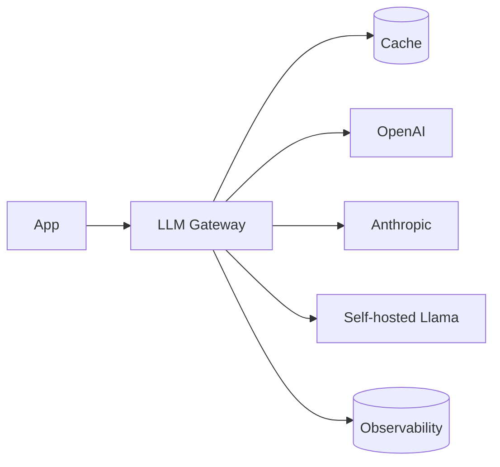

# Вопросы на собеседовании: `LLM Integration Patterns`

Интеграция LLM в production — это больше, чем просто `client.chat.completions.create()`. На собеседовании спрашивают про streaming, retry/fallback, маршрутизацию моделей, кэширование, rate limiting, наблюдаемость, учёт затрат, абстракции над несколькими провайдерами, семантическое кэширование и асинхронные паттерны.

## Полезные ссылки

### Официальная документация и авторитетные источники

- [LiteLLM Documentation](https://docs.litellm.ai/) — multi-provider LLM SDK
- [Helicone (LLM observability)](https://helicone.ai/)
- [Langfuse (open-source observability)](https://langfuse.com/)
- [LangSmith Documentation](https://docs.smith.langchain.com/)
- [OpenRouter — model routing](https://openrouter.ai/)
- [Portkey (AI gateway)](https://portkey.ai/)

## Содержание

- [Полезные ссылки](#полезные-ссылки)
- [See also](#see-also)

**Базовые паттерны**
- [Q1. (!) Что такое LLM gateway?](#q1--что-такое-llm-gateway)
- [Q2. (!) Streaming responses — реализация?](#q2--streaming-responses--реализация)
- [Q3. (!) SSE (Server-Sent Events) для streaming?](#q3--sse-server-sent-events-для-streaming)
- [Q4. WebSocket vs SSE для LLM?](#q4-websocket-vs-sse-для-llm)

**Reliability**
- [Q5. (!) Retry с exponential backoff?](#q5--retry-с-exponential-backoff)
- [Q6. (!) Circuit breaker для LLM API?](#q6--circuit-breaker-для-llm-api)
- [Q7. (!) Fallback между providers (Claude → GPT)?](#q7--fallback-между-providers-claude--gpt)
- [Q8. Timeouts — как настраивать?](#q8-timeouts--как-настраивать)

**Cost optimization**
- [Q9. (!) Model routing (small → large escalation)?](#q9--model-routing-small--large-escalation)
- [Q10. (!) Semantic caching?](#q10--semantic-caching)
- [Q11. Prompt caching (provider-side)?](#q11-prompt-caching-provider-side)
- [Q12. Batching API requests?](#q12-batching-api-requests)
- [Q13. (!) Cost tracking per user / feature?](#q13--cost-tracking-per-user--feature)

**Rate limiting**
- [Q14. (!) Token bucket для LLM API?](#q14--token-bucket-для-llm-api)
- [Q15. Per-user rate limits?](#q15-per-user-rate-limits)
- [Q16. Distributed rate limiting (Redis)?](#q16-distributed-rate-limiting-redis)

**Multi-provider**
- [Q17. (!) Зачем abstraction над provider?](#q17--зачем-abstraction-над-provider)
- [Q18. (!) LiteLLM, OpenRouter, Portkey?](#q18--litellm-openrouter-portkey)
- [Q19. Model parameter normalization?](#q19-model-parameter-normalization)

**Observability**
- [Q20. (!) Что трекать в LLM systems?](#q20--что-трекать-в-llm-systems)
- [Q21. (!) Tracing prompt chains?](#q21--tracing-prompt-chains)
- [Q22. Helicone, Langfuse, LangSmith?](#q22-helicone-langfuse-langsmith)
- [Q23. Latency metrics: TTFT, TPOT?](#q23-latency-metrics-ttft-tpot)

**Async patterns**
- [Q24. (!) Sync vs async LLM calls?](#q24--sync-vs-async-llm-calls)
- [Q25. Background jobs для long generations?](#q25-background-jobs-для-long-generations)

**Безопасность и compliance**
- [Q26. (!) Content moderation pipeline?](#q26--content-moderation-pipeline)
- [Q27. Audit logging?](#q27-audit-logging)
- [Q28. (!) Какие частые проблемы LLM в production?](#q28--какие-частые-проблемы-llm-в-production)

## Q1. (!) Что такое LLM gateway?

**LLM gateway** — это middleware между приложением и LLM-провайдерами. Централизует:
- Маршрутизацию (выбор модели)
- Кэширование
- Rate limiting
- Наблюдаемость
- Fallback-и
- Учёт затрат



**Инструменты:** Portkey, Helicone, LiteLLM, OpenRouter, собственное решение.

**Применение:** в **enterprise**, где много LLM-фич → нужна централизация.


## Q2. (!) Streaming responses — реализация?

**OpenAI / Anthropic streaming:**

```python
stream = client.chat.completions.create(
    model="gpt-4o",
    messages=[...],
    stream=True
)

for chunk in stream:
    delta = chunk.choices[0].delta.content
    if delta:
        yield delta  # send to client
```

**Server-side (FastAPI):**

```python
from fastapi.responses import StreamingResponse

@app.post("/chat")
async def chat(req: ChatRequest):
    async def generate():
        stream = client.chat.completions.create(stream=True, ...)
        for chunk in stream:
            yield f"data: {chunk.choices[0].delta.content}\n\n"
    return StreamingResponse(generate(), media_type="text/event-stream")
```

**Преимущества:**
- Ответ ощущается быстрее (TTFT против общего времени)
- Можно отменить генерацию на середине
- Меньше рисков по таймаутам


## Q3. (!) SSE (Server-Sent Events) для streaming?

**SSE** — это HTTP-стандарт для стриминга server → client.

```
HTTP/1.1 200 OK
Content-Type: text/event-stream

data: Hello

data: world

data: [DONE]
```

**Frontend (JavaScript):**
```javascript
const evtSource = new EventSource("/chat?msg=hi");
evtSource.onmessage = (e) => {
    if (e.data === "[DONE]") {
        evtSource.close();
        return;
    }
    appendToChat(e.data);
};
```

**Преимущества SSE:**
- Простой (это просто HTTP)
- Автоматический reconnect из коробки
- Работает через CDN (Cloudflare и т.п.)
- Однонаправленность = меньше состояния

**OpenAI/Anthropic** возвращают ответы в формате SSE.


## Q4. WebSocket vs SSE для LLM?

| Критерий | SSE | WebSocket |
|----------|-----|-----------|
| Направление | Server → Client | Двунаправленный |
| Протокол | HTTP | Свой (апгрейд HTTP) |
| Reconnect | Автоматический | Вручную |
| Прокси/CDN | Хорошо работает | Сложнее |
| Сценарий | LLM-стриминг | Чат в реальном времени (peer-to-peer) |

**Для LLM-стриминга обычно достаточно SSE** (одностороннее: server → client). WebSocket — если нужны интерактивные прерывания от клиента.


## Q5. (!) Retry с exponential backoff?

```python
from tenacity import retry, stop_after_attempt, wait_exponential, retry_if_exception_type

@retry(
    stop=stop_after_attempt(5),
    wait=wait_exponential(multiplier=1, min=2, max=60),
    retry=retry_if_exception_type((RateLimitError, APIError, Timeout))
)
def call_llm(prompt):
    return client.chat.completions.create(...)
```

**Схема ожидания:** 2s → 4s → 8s → 16s → 60s (max).

**Что ретраить:**
- HTTP 429 (rate limit)
- HTTP 500-599 (ошибки сервера)
- Таймауты
- Ошибки соединения

**Что не ретраить:**
- HTTP 400 (bad request) — это твоя ошибка, retry не поможет
- HTTP 401, 403 (авторизация) — retry не поможет
- HTTP 422 (валидация)


## Q6. (!) Circuit breaker для LLM API?

**Circuit breaker:** если провайдер возвращает ошибки **много раз подряд** → временно **перестаём его вызывать** (открываем цепь), ждём, пробуем снова.

```python
from pybreaker import CircuitBreaker

llm_breaker = CircuitBreaker(fail_max=5, reset_timeout=60)

@llm_breaker
def call_openai(prompt):
    return openai_client.chat.completions.create(...)
```

**Состояния:**
- **Closed** — вызовы идут как обычно
- **Open** — все вызовы падают сразу (без обращения к API)
- **Half-open** — пробуем 1-2 вызова, если ОК → переходим в closed

**Зачем:** не **долбить** мёртвый сервис, экономить ресурсы, падать быстро (fail fast).

Подробнее — в [Resilience Patterns](../architecture/resilience-patterns-interview.md).


## Q7. (!) Fallback между providers (Claude → GPT)?

```python
def chat_with_fallback(messages):
    providers = [
        lambda: anthropic.messages.create(model="claude-opus-4-7", messages=messages),
        lambda: openai.chat.completions.create(model="gpt-4o", messages=messages),
        lambda: google.generate(model="gemini-1.5-pro", messages=messages)
    ]

    for provider in providers:
        try:
            return provider()
        except (RateLimitError, APIError, Timeout) as e:
            log.warning(f"Provider failed: {e}, trying next")
    raise AllProvidersFailedError()
```

**Подвох:** у разных провайдеров **разный формат API**. Нужен слой-адаптер (тут помогает LiteLLM).

**Сценарий:** основной провайдер недоступен → не уронить продукт, переключиться на резервный.


## Q8. Timeouts — как настраивать?

```python
client = OpenAI(timeout=30.0)  # default
# или per-request
response = client.chat.completions.create(timeout=60.0, ...)
```

**Рекомендации:**
- **Стриминг:** больше (5-10 мин) — иногда модель долго «думает»
- **Без стриминга:** обычно 30-60 сек
- **TTFT (Time-To-First-Token):** держать < 3 сек — если больше → проблема

**Подвох:** **дефолтные таймауты** SDK OpenAI/Anthropic могут быть слишком большими для UX.


## Q9. (!) Model routing (small → large escalation)?

**Идея:** не использовать самую дорогую модель для всего. Каскад:

```python
def smart_route(query):
    # Try small model first
    response = small_model(query)

    if response.confidence < 0.7 or "I'm not sure" in response.text:
        # Escalate to large model
        response = large_model(query)

    return response
```

**Сложнее:**
- **Classifier** перед LLM выбирает подходящую модель по сложности задачи
- **Mixture of Experts** — несколько специализированных моделей

**Эффект:** экономия 50-80% затрат для приложений с разной сложностью запросов.


## Q10. (!) Semantic caching?

**Кэш по точному совпадению:** ключ = полный prompt, низкий hit rate.

**Семантический кэш:** ключ = embedding запроса, попадание на **похожих** запросах.

```python
def semantic_cache_lookup(query, threshold=0.95):
    query_emb = embed(query)
    similar_queries = vector_db.search(query_emb, top_k=1)
    if similar_queries[0].score >= threshold:
        return similar_queries[0].metadata["response"]
    return None

def chat(query):
    if cached := semantic_cache_lookup(query):
        return cached  # instant + free
    response = call_llm(query)
    store_cache(query, response)
    return response
```

**Подвох:**
- Высокий порог → низкий hit rate
- Низкий порог → неверные ответы (другое намерение, но похожая формулировка)

**Инструменты:** GPTCache, Redis Vector Search.


## Q11. Prompt caching (provider-side)?

**Anthropic, OpenAI** поддерживают автоматическое кэширование **префиксов** промпта.

**Anthropic:**
```python
{"role": "system", "content": [
    {"type": "text", "text": LARGE_SYSTEM_PROMPT, "cache_control": {"type": "ephemeral"}}
]}
```

**Снижение затрат:** 90% на закэшированной части.

**Сценарий:** RAG с большими статичными документами. Документы в начале промпта → кэшируются. Вопрос пользователя меняется → повторный запрос дешевле.


## Q12. Batching API requests?

**Batch API** (OpenAI, Anthropic):
- Асинхронно: отправляешь батч, ждёшь несколько часов, забираешь результаты
- **Скидка 50%** по сравнению с синхронным API
- Для сценариев, не требующих realtime

```python
batch = client.batches.create(
    input_file_id="...",  # JSONL файл с requests
    endpoint="/v1/chat/completions",
    completion_window="24h"
)
# wait few hours
result = client.batches.retrieve(batch.id)
```

**Сценарии:**
- Массовая классификация
- Фоновый ETL
- Генерация embedding-ов (тоже батчем)
- Несрочная суммаризация


## Q13. (!) Cost tracking per user / feature?

```python
def call_llm_with_tracking(user_id, feature, messages):
    response = llm.chat.completions.create(...)

    cost = calculate_cost(
        model=response.model,
        input_tokens=response.usage.prompt_tokens,
        output_tokens=response.usage.completion_tokens
    )

    metrics.track({
        "user_id": user_id,
        "feature": feature,
        "model": response.model,
        "input_tokens": response.usage.prompt_tokens,
        "output_tokens": response.usage.completion_tokens,
        "cost_usd": cost,
        "timestamp": time.time()
    })
    return response
```

**Зачем:**
- Бизнес-метрики (затраты на активного пользователя)
- Выявление дорогих фич
- Контроль квот (free tier против платного)
- Детектирование аномалий

**Инструменты:** Helicone, Langfuse, собственное решение на Postgres + Grafana.


## Q14. (!) Token bucket для LLM API?

```python
from token_bucket import TokenBucket

bucket = TokenBucket(rate=100, capacity=200)  # 100 RPS, max burst 200

def call_llm(prompt):
    if not bucket.consume(1):
        raise RateLimitedError()
    return llm.chat.completions.create(...)
```

**Зачем:** не превышать rate limits провайдера → меньше HTTP 429.

**Bucket по токенам:** учитывать output-токены, а не запросы (поскольку у OpenAI есть и лимиты TPM).


## Q15. Per-user rate limits?

```python
def rate_limit_user(user_id, max_per_min=10):
    key = f"ratelimit:{user_id}:{int(time.time() / 60)}"
    count = redis.incr(key)
    if count == 1:
        redis.expire(key, 60)
    if count > max_per_min:
        raise UserRateLimitedError()
```

**Зачем:**
- **Защита от злоупотреблений** (один пользователь не сжигает всю квоту)
- **Тарифные уровни** (free: 10 RPM, premium: 100 RPM)
- **Контроль затрат** (бюджет на пользователя)


## Q16. Distributed rate limiting (Redis)?

```python
# Sliding window log
def is_allowed(user_id, max_per_min=10):
    key = f"requests:{user_id}"
    now = time.time()
    redis.zremrangebyscore(key, 0, now - 60)  # cleanup old
    count = redis.zcard(key)
    if count >= max_per_min:
        return False
    redis.zadd(key, {str(uuid.uuid4()): now})
    redis.expire(key, 60)
    return True
```

**Распределённый** — все инстансы приложения согласованно видят лимит через Redis.

**Инструменты:** `redis-py-cluster`, `aioredis`.


## Q17. (!) Зачем abstraction над provider?

**Без абстракции:**
```python
# OpenAI
openai_client.chat.completions.create(model="gpt-4", messages=[...])

# Anthropic
anthropic_client.messages.create(model="claude-opus-4", messages=[...], max_tokens=1024)

# Google
google_client.generate(model="gemini-1.5-pro", contents=[...])
```

Разные API, разные параметры, разные форматы ответов.

**С абстракцией:**
```python
gateway.chat(model="gpt-4", messages=[...])
gateway.chat(model="claude-opus-4", messages=[...])
# Same interface
```

**Зачем:**
- **Легко менять провайдеров**
- **A/B-тестирование** разных моделей
- **Fallback** между провайдерами
- **Централизованные логирование и кэширование**


## Q18. (!) LiteLLM, OpenRouter, Portkey?

**LiteLLM** — Python SDK, унифицирует **100+ моделей**.

```python
from litellm import completion

response = completion(
    model="gpt-4o",  # или "claude-opus-4-7", "gemini-1.5-pro"
    messages=[...]
)
```

**OpenRouter** — прокси/маркетплейс для LLM. Один API-ключ, выбор из десятков моделей, биллинг.

**Portkey** — AI gateway: маршрутизация, fallback-и, наблюдаемость, кэширование, guardrails.

**Helicone** — фокус на наблюдаемости и кэшировании, работает как прокси.

**Когда что нужно:**
- LiteLLM — если хочешь минимальную абстракцию прямо в коде
- OpenRouter — если хочешь экспериментировать с разными моделями
- Portkey/Helicone — для enterprise (governance, наблюдаемость)


## Q19. Model parameter normalization?

```python
# Different providers — different params
openai_params = {"temperature": 0.7, "presence_penalty": 0.5}
anthropic_params = {"temperature": 0.7}  # no presence_penalty
google_params = {"temperature": 0.7, "top_k": 40}
```

**Слой абстракции должен:**
- Маппить общие параметры (temperature, max_tokens)
- Обрабатывать особенности конкретных провайдеров
- Валидировать входные данные

LiteLLM делает это автоматически.


## Q20. (!) Что трекать в LLM systems?

**По каждому запросу:**
- Какая модель использована
- Input/output-токены
- Стоимость
- Latency (TTFT, TTFC, TPOT, total)
- HTTP-статус / ошибка
- User ID, фича, request ID
- Попадание/промах кэша

**По системе в целом:**
- RPS, доля ошибок
- Расход токенов (input/output)
- Затраты в час/сутки
- Затраты на фичу
- Распределение использования по провайдерам

**На уровне пользователя:**
- Удовлетворённость (лайк/дизлайк)
- Использование фич
- Затраты на пользователя


## Q21. (!) Tracing prompt chains?

**Trace** — это запись всей цепочки вызовов в рамках одной логической операции.

```python
with tracer.span("rag_pipeline") as root:
    with tracer.span("retrieval"):
        chunks = vector_db.search(query)
    with tracer.span("rerank"):
        ranked = rerank(chunks)
    with tracer.span("llm_call", attributes={"model": "gpt-4o"}):
        answer = llm(prompt)
```

**Визуализация:**
```
rag_pipeline (2.5s)
├── retrieval (0.2s)
├── rerank (0.3s)
└── llm_call (2.0s)
```

**Инструменты:** OpenTelemetry, LangSmith, Langfuse, Phoenix.

Подробнее — [Observability](../monitoring/observability-interview.md).


## Q22. Helicone, Langfuse, LangSmith?

**Helicone** (open-source/SaaS):
- Просто **прокси** перед OpenAI API
- Автоматически трекает все вызовы
- Кэширование, rate limiting

**Langfuse** (open-source):
- Трассировка цепочек промптов
- Датасеты для оценки
- Управление промптами

**LangSmith** (LangChain):
- Тесно интегрирован с LangChain
- Трассировка, датасеты, оценки
- Версионирование промптов

**Phoenix (Arize):** open-source, фокус на embedding-ах и трассировке.

В **2025** выбор зависит от стека. Без LangChain → Langfuse / Helicone.


## Q23. Latency metrics: TTFT, TPOT?

| Метрика | Расшифровка | Описание |
|---------|-------------|----------|
| **TTFT** | Time To First Token | Задержка до первого слова (важно для UX) |
| **TPOT** | Time Per Output Token | Сколько времени уходит на каждый токен |
| **TTFC** | Time To First Chunk | Похоже на TTFT |
| **TPS** | Tokens Per Second | Пропускная способность по выводу |
| **E2E** | End-to-end latency | Общее время |

**Важно:**
- **TTFT** — ключевая метрика для UX чата
- **TPS** — пропускная способность для пакетной обработки
- **E2E = TTFT + tokens × TPOT**

У OpenAI / Anthropic обычно:
- TTFT: 0.5-3 сек
- TPS: 50-150 токенов/сек


## Q24. (!) Sync vs async LLM calls?

**Sync:**
```python
response = client.chat.completions.create(...)
```

**Async:**
```python
response = await async_client.chat.completions.create(...)
```

**Преимущества async:**
- Можно параллелить много вызовов
- Не блокирует event loop (FastAPI, asyncio)
- Лучше пропускная способность при высокой конкурентности

```python
# Parallel calls
responses = await asyncio.gather(
    client.chat.completions.create(...),
    client.chat.completions.create(...),
    client.chat.completions.create(...)
)
```

**Правило для production:** в веб-серверах для LLM-вызовов **всегда использовать async**.


## Q25. Background jobs для long generations?

Если ответ модели генерируется **долго** (минутами):

```python
@app.post("/generate")
async def generate(req):
    job_id = uuid.uuid4()
    queue.enqueue(generate_task, req, job_id)
    return {"job_id": job_id, "status": "pending"}

@app.get("/status/{job_id}")
async def status(job_id):
    return jobs.get(job_id)  # {"status": "complete", "result": "..."}
```

**Инструменты:** Celery, RQ, Sidekiq, собственное решение.

**Сценарии:**
- Генерация длинных текстов (эссе, отчёты)
- Reasoning-модели (o1, o3) — могут думать минутами
- Многошаговые агенты


## Q26. (!) Content moderation pipeline?

**Модерация до LLM** (на входе):
```python
moderation = openai.moderations.create(input=user_message)
if moderation.results[0].flagged:
    return "I cannot help with that request."
```

**Модерация после LLM** (на выходе):
```python
response = llm(prompt)
moderation = openai.moderations.create(input=response)
if moderation.results[0].flagged:
    return generic_safe_response()
```

**Категории:** ненависть, сексуальный контент, насилие, self-harm, харассмент.

**Инструменты:**
- OpenAI Moderations API (бесплатно)
- Anthropic Constitutional AI (встроено)
- Perspective API (Google)
- Свои self-hosted классификаторы


## Q27. Audit logging?

**Audit log** — это неизменяемая запись каждого взаимодействия с LLM.

```python
audit_log({
    "request_id": uuid,
    "user_id": ...,
    "timestamp": now,
    "input_prompt": prompt,
    "input_redacted": redact_pii(prompt),  # для compliance
    "model": "gpt-4o",
    "output": response,
    "tokens": ...,
    "cost": ...,
    "moderation": {...},
    "purpose": "customer_support"
})
```

**Зачем:**
- **Compliance** (GDPR, HIPAA)
- **Отладка** проблем в production
- **Анализ качества** (LLM-as-judge)
- **Сбор датасетов для fine-tuning** (с согласия пользователя)

**Хранение:** S3 + Athena, BigQuery, Postgres + аналитические инструменты.


## Q28. (!) Какие частые проблемы LLM в production?

1. **Неконтролируемый рост затрат** — без мониторинга → неприятный сюрприз
2. **Rate limits** — лимиты API игнорируются
3. **Недоступность провайдера** — нет fallback
4. **Медленные запросы** — нет мониторинга TTFT
5. **Prompt injection** — нет валидации
6. **Утечка PII** — чувствительные данные в логах/промптах
7. **Регрессия при обновлении модели** — провайдер обновил → просадка качества
8. **Нет стриминга** — UX страдает
9. **Синхронные вызовы** — блокируют потоки, низкая пропускная способность
10. **Нет кэширования** — переплата за одинаковые запросы
11. **Галлюцинации без guardrails** — неверные ответы в production
12. **Vendor lock-in** — невозможно сменить провайдера

**Production-ready LLM-система** требует **много** инфраструктуры сверх простых вызовов API.


---

## See also

- [LLM Basics](llm-basics-interview.md) — основа
- [RAG](rag-interview.md) — popular pattern
- [Prompt Engineering](prompt-engineering-interview.md) — prompts design
- [AI Agents](ai-agents-interview.md) — autonomous LLM systems
- [MLOps](mlops-interview.md) — operations
- [Model Serving](model-serving-interview.md) — для self-hosted
- [Caching](../architecture/caching-strategies-interview.md) — semantic cache
- [Resilience Patterns](../architecture/resilience-patterns-interview.md) — circuit breaker
- [Observability](../monitoring/observability-interview.md) — tracing, metrics
- [Микросервисы](../architecture/microservices-interview.md) — gateway pattern
- [Application Security](../security/application-security-interview.md) — prompt injection
- [API Gateway](../architecture/api-gateway-interview.md) — generalized pattern
