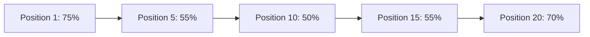
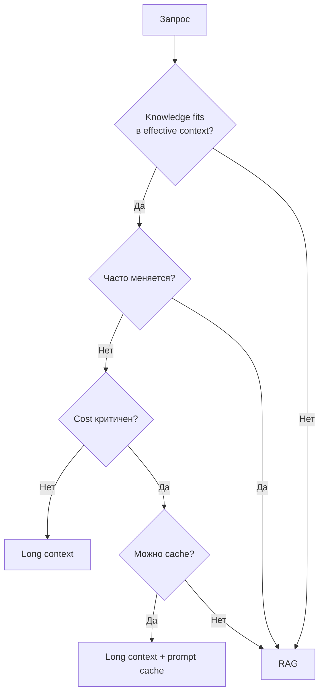
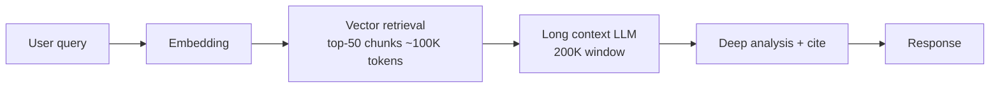
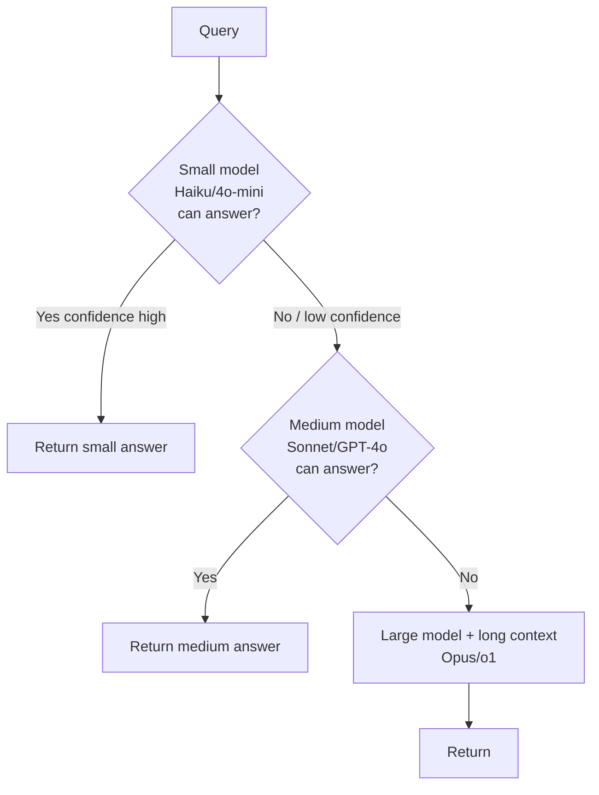
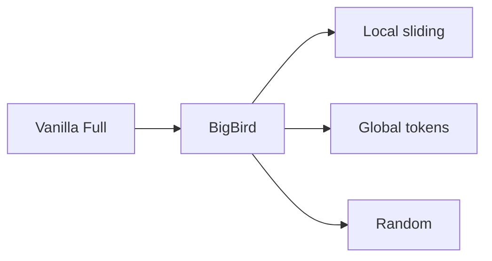
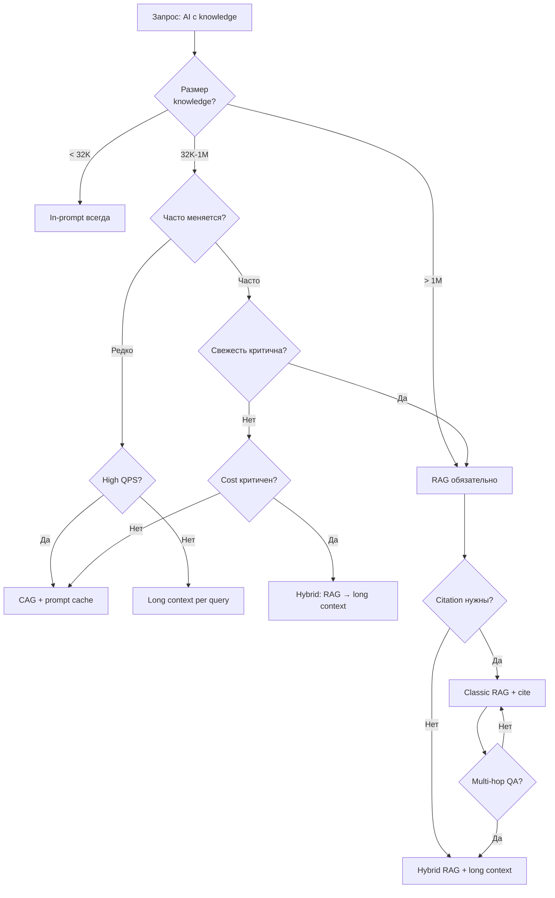

# Вопросы на собеседовании: `Long Context vs RAG`

**Long Context LLMs** (Gemini 1.5 Pro 2M, Claude 3 200K, GPT-4 Turbo 128K, Llama 4 10M) сделали возможным заталкивать в prompt целые документы, кодовые базы, видео. Это породило вечный спор: **«RAG умер»** или **«long context не масштабируется по cost/latency»**. Ответ — оба правы в своих кейсах. Шпаргалка про trade-offs, decision criteria, hybrid-паттерны, и подводные камни (`Lost in the Middle`, `effective vs claimed context`, prefill latency).

## Полезные ссылки

### Архитектурные работы (context extension)

- [Longformer: The Long-Document Transformer (Beltagy et al., 2020)](https://arxiv.org/abs/2004.05150)
- [Big Bird: Transformers for Longer Sequences (Zaheer et al., 2020)](https://arxiv.org/abs/2007.14062)
- [YaRN: Efficient Context Window Extension (Peng et al., 2023)](https://arxiv.org/abs/2309.00071)
- [Ring Attention (Liu et al., 2023)](https://arxiv.org/abs/2310.01889)
- [StreamingLLM: Attention Sinks (Xiao et al., 2023)](https://arxiv.org/abs/2309.17453)
- [ALiBi: Position Encoding (Press et al., 2021)](https://arxiv.org/abs/2108.12409)

### Проблемы и benchmarks

- [Lost in the Middle (Liu et al., 2023)](https://arxiv.org/abs/2307.03172)
- [RULER: What's the Real Context Size? (Hsieh et al., 2024)](https://arxiv.org/abs/2404.06654)
- [LongBench](https://github.com/THUDM/LongBench)
- [Needle in a Haystack (gkamradt)](https://github.com/gkamradt/LLMTest_NeedleInAHaystack)

### Caching и compression

- [Anthropic Prompt Caching](https://docs.anthropic.com/en/docs/build-with-claude/prompt-caching)
- [OpenAI Prompt Caching](https://platform.openai.com/docs/guides/prompt-caching)
- [GPTCache (semantic cache)](https://github.com/zilliztech/GPTCache)
- [LLMLingua: Prompt Compression](https://arxiv.org/abs/2310.05736)
- [CAG: Cache-Augmented Generation (Chan et al., 2024)](https://arxiv.org/abs/2412.15605)

### Provider docs

- [Gemini 1.5 Pro (2M context)](https://blog.google/technology/ai/google-gemini-next-generation-model-february-2024/)
- [Claude 3 (200K context)](https://www.anthropic.com/news/claude-3-family)

## Содержание

- [Полезные ссылки](#полезные-ссылки)
- [See also](#see-also)

**Эволюция context windows**
- [Q1. (!) Эволюция context windows: GPT-3.5 4K → Llama 4 10M?](#q1--эволюция-context-windows-gpt-35-4k--llama-4-10m)
- [Q2. (!) Зачем потребовался long context?](#q2--зачем-потребовался-long-context)
- [Q3. Архитектурные изменения для long context: что меняли?](#q3-архитектурные-изменения-для-long-context-что-меняли)
- [Q4. Как расширяют окно через YaRN / RoPE scaling / position interpolation?](#q4-как-расширяют-окно-через-yarn--rope-scaling--position-interpolation)

**Lost in the Middle и benchmarks**
- [Q5. (!) Что такое Lost in the Middle?](#q5--что-такое-lost-in-the-middle)
- [Q6. Needle-in-a-Haystack — как тестируют long context?](#q6-needle-in-a-haystack--как-тестируют-long-context)
- [Q7. (!) Effective context vs claimed context — в чём разница?](#q7--effective-context-vs-claimed-context--в-чём-разница)
- [Q8. RULER и LongBench — что меряют?](#q8-ruler-и-longbench--что-меряют)

**Long Context vs RAG — выбор**
- [Q9. (!) Когда выбрать long context, а когда RAG?](#q9--когда-выбрать-long-context-а-когда-rag)
- [Q10. (!) RAG умер с приходом 2M-context Gemini?](#q10--rag-умер-с-приходом-2m-context-gemini)
- [Q11. Citation / attribution — какой подход даёт лучше?](#q11-citation--attribution--какой-подход-даёт-лучше)
- [Q12. ACL filtering (row-level security) в RAG vs long context?](#q12-acl-filtering-row-level-security-в-rag-vs-long-context)

**Cost и latency**
- [Q13. (!) Cost arithmetic: посчитать GPT-4o 128K vs RAG?](#q13--cost-arithmetic-посчитать-gpt-4o-128k-vs-rag)
- [Q14. (!) Latency: prefill scales linearly — что это значит?](#q14--latency-prefill-scales-linearly--что-это-значит)
- [Q15. TTFT (time-to-first-token) для long context?](#q15-ttft-time-to-first-token-для-long-context)

**Caching**
- [Q16. (!) Prompt Caching — как это спасает long context?](#q16--prompt-caching--как-это-спасает-long-context)
- [Q17. Anthropic vs OpenAI prompt caching: отличия?](#q17-anthropic-vs-openai-prompt-caching-отличия)
- [Q18. (!) Semantic Caching — что это и когда применять?](#q18--semantic-caching--что-это-и-когда-применять)
- [Q19. Threshold tuning для semantic cache?](#q19-threshold-tuning-для-semantic-cache)
- [Q20. Что такое CAG (Cache-Augmented Generation)?](#q20-что-такое-cag-cache-augmented-generation)

**Hybrid patterns**
- [Q21. (!) Гибрид: RAG → анализ через long context?](#q21--гибрид-rag--анализ-через-long-context)
- [Q22. Как работает каскад (cascading): от малой модели к большой?](#q22-как-работает-каскад-cascading-от-малой-модели-к-большой)
- [Q23. Code agents (Cursor/Cody): как комбинируют?](#q23-code-agents-cursorcody-как-комбинируют)

**Architecture deep-dive**
- [Q24. Как устроен sparse attention (BigBird/Longformer)?](#q24-как-устроен-sparse-attention-bigbirdlongformer)
- [Q25. Ring Attention — как работает?](#q25-ring-attention--как-работает)
- [Q26. Как работают sliding window и StreamingLLM (attention sinks)?](#q26-как-работают-sliding-window-и-streamingllm-attention-sinks)

**Compression и multimodal**
- [Q27. LLMLingua и prompt compression?](#q27-llmlingua-и-prompt-compression)
- [Q28. Multimodal long context: видео и аудио в Gemini?](#q28-multimodal-long-context-видео-и-аудио-в-gemini)
- [Q29. (!) Decision tree: как выбирать архитектуру?](#q29--decision-tree-как-выбирать-архитектуру)
- [Q30. Real-world примеры (Cursor, Notion AI, Copilot Workspace)?](#q30-real-world-примеры-cursor-notion-ai-copilot-workspace)

---

## Q1. (!) Эволюция context windows: GPT-3.5 4K → Llama 4 10M?

За 3 года context windows выросли примерно в **2500×** — с 4K у GPT-3.5 до заявленных 10M у Llama 4. Это не просто «больше токенов»: каждый крупный скачок упирался в квадратичную сложность attention и требовал отдельных архитектурных решений (RoPE scaling, sparse attention, выгрузка KV-cache).

| Год | Модель | Claimed context | Effective (RULER) | Особенности |
|---|---|---|---|---|
| 2022 | GPT-3.5 (text-davinci-003) | 4K | ~4K | Обычный (vanilla) attention |
| 2023 Q1 | GPT-4 | 8K / 32K | ~8K / ~24K | Sparse attention в версии на 32K |
| 2023 Q3 | Claude 2 | 100K | ~70K | Первый массовый 100K+ |
| 2023 Q4 | GPT-4 Turbo | 128K | ~64K | Расширение в духе YaRN |
| 2024 Q1 | Claude 3 (Opus/Sonnet) | 200K | ~150K | Готов к проду |
| 2024 Q1 | Gemini 1.5 Pro | 1M (preview 10M) | ~700K | Ring Attention + MoE |
| 2024 Q3 | Llama 3.1 | 128K | ~32K | YaRN-расширение от базы 8K |
| 2024 Q4 | Gemini 1.5 Pro (GA) | 2M | ~1.5M | Нативно мультимодальный |
| 2025 Q2 | Llama 4 (заявлено) | 10M | TBD | Long-RoPE + sparse |
| 2025 Q4 | DeepSeek-V3 | 128K | ~100K | MLA (Multi-head Latent Attention) |

**Ключевой инсайт:** claimed ≠ effective. Цифра в маркетинге — это лишь максимум, который примет API; реальное качество держится на меньшей длине. Llama-3.1 8B при заявленных 128K уверенно работает примерно до ~32K, дальше точность падает (по RULER). Поэтому при выборе модели смотрите на колонку effective, а не на claimed.

## Q2. (!) Зачем потребовался long context?

Длинное окно нужно там, где задача требует видеть **весь объём информации сразу**, а не отдельные куски. Короткое окно (4-8K) заставляло резать вход на фрагменты и терять связи между ними. Конкретные сценарии, которые при коротком окне невозможны или работают плохо:

1. **Анализ длинных документов** — юридический контракт (200 страниц), научная статья, спецификация API.
2. **Codebase analysis** — целый репозиторий (Cursor, Copilot Workspace) в одном prompt.
3. **Multi-document QA** — сравнение 20 документов с cross-references.
4. **Few-shot с большими examples** — 100+ обучающих примеров in-context.
5. **Long conversations** — multi-turn с историей на тысячи сообщений.
6. **Video understanding** — 1 час видео ≈ 1M tokens (Gemini).
7. **Genomics, financial reports** — длинные структурированные данные.

Общий знаменатель этих кейсов — нужна **глобальная картина**: факт из 5-й страницы связать с фактом из 180-й, увидеть зависимости через весь репозиторий, удержать длинную историю диалога.

**Альтернатива через RAG:** разбить на чанки → retrieval → подать только top-K. Дёшево и быстро, но именно глобальный контекст при этом теряется — модель видит лишь вырванные фрагменты (см. Q9).

## Q3. Архитектурные изменения для long context: что меняли?

Корень проблемы — квадратичная сложность attention: обычный self-attention имеет **O(n²)** по памяти и вычислениям, потому что каждый токен сравнивается с каждым. Для 1M токенов это ~10¹² операций — физически невозможно на одной GPU. Все решения атакуют либо саму сложность, либо переносят границу позиций, либо распределяют нагрузку. Основные подходы:

1. **Sparse attention** (Longformer, BigBird) — каждый токен смотрит (attend) только на `O(n)` соседей плюс несколько глобальных токенов, а не на все. Сложность падает до `O(n)`.
2. **Sliding window** (Mistral, Mixtral) — attention внутри окна 4K, контекст переносится через слои.
3. **Ring Attention** (Liu, 2023) — распределённый attention по нескольким GPU, обмен данными перекрывается с вычислениями. Применён в Gemini 1.5.
4. **Position interpolation / YaRN / NTK** — расширяют предобученный RoPE на большее окно без переобучения.
5. **ALiBi** (Press, 2021) — линейный bias вместо позиционных эмбеддингов, экстраполяция до 10× длины обучения.
6. **MLA (Multi-head Latent Attention)** — в DeepSeek-V3, сжимает KV-cache в латентное пространство.
7. **Сжатие / выгрузка KV-cache** — выгрузка кэша на CPU/диск для длинных контекстов.

Грубо подходы делятся на три семейства: **уменьшить вычисления** (1-2, 6), **переместить позиции** (4-5), **распределить по железу** (3, 7). Frontier-модели обычно комбинируют несколько: например, Gemini 1.5 — это Ring Attention поверх MoE.

```mermaid
graph LR
    A[Vanilla O(n²)] --> B[Sparse O(n)]
    A --> C[Sliding Window]
    A --> D[Ring Attention]
    A --> E[Position scaling]
    E --> F[YaRN]
    E --> G[NTK-aware]
    E --> H[ALiBi]
```

## Q4. Как расширяют окно через YaRN / RoPE scaling / position interpolation?

Это семейство приёмов, которые **растягивают предобученное окно модели на бóльшую длину без обучения с нуля** — за счёт перенастройки позиционных кодов RoPE.

**Проблема:** модель обучена на контексте 4K с позиционными эмбеддингами RoPE. Если подать 32K — позиционные коды попадают за пределы того диапазона, который модель видела при обучении (экстраполяция), и качество резко падает.

Три основных способа решить это, от простого к лучшему:

**Position Interpolation (Chen, 2023):** «сжать» позиции внутрь диапазона обучения. Чтобы расширить 4K → 32K, делим индекс позиции на 8 — модель видит «знакомые» значения. Требует короткого дообучения.

**NTK-aware scaling:** вместо линейного сжатия масштабирует базовую частоту RoPE. Сохраняет высокочастотные компоненты (важны для коротких зависимостей) и работает zero-shot, без дообучения.

**YaRN (Yet another RoPE extensioN):** комбинирует NTK + масштабирование attention + температуру. Текущий SOTA для расширения контекста: даёт лучшее качество на длинном при минимальном дообучении.

| Метод | Нужно ли дообучение | Качество на коротком | Качество на длинном |
|---|---|---|---|
| Без масштабирования | — | Норм | Ломается после 1.2× |
| Linear PI | 1B токенов | Слегка хуже | Норм |
| NTK-aware | 0 (zero-shot) | Норм | Норм |
| YaRN | 400M токенов | Норм | Лучшее |
| ALiBi | Предобучен | Норм | Хорошая экстраполяция |

```python
# RoPE с YaRN scaling (упрощенно)
def yarn_rope_freqs(dim, base=10000, scale=4.0, alpha=1, beta=32):
    # NTK-aware: scale base
    base = base * (scale ** (dim / (dim - 2)))
    freqs = 1.0 / (base ** (torch.arange(0, dim, 2) / dim))
    # Attention scaling
    attn_scale = 0.1 * math.log(scale) + 1.0
    return freqs, attn_scale
```

## Q5. (!) Что такое Lost in the Middle?

**Lost in the Middle** (Liu et al., 2023) — эффект, при котором модель лучше извлекает информацию из **начала и конца** промпта и хуже всего — из середины. Если построить точность как функцию от позиции нужного факта, получится U-образная кривая: высоко по краям, провал посередине.

Практический вывод: даже если факт **физически влез** в окно, это не гарантирует, что модель его «увидит» — позиция внутри окна важна.

**Эксперимент:** 20 документов, ответ спрятан в одном из них. Двигаем релевантный документ по позициям от 1 до 20 и замеряем точность (accuracy):



**Причины:**

1. **Распределение обучающих данных** — данные на instruction-following обычно короткие, инструкция в начале.
2. **Attention bias** — ранние токены получают больше внимания из-за causal mask и attention sinks.
3. **RoPE/затухание по позиции** — старые позиции затухают.

**Способы смягчить** (все сводятся к одному: положить важное туда, куда модель смотрит):

1. **Важное — в начало или конец** промпта, особенно сам запрос пользователя.
2. **Re-ranking** — перед подачей в LLM кладём самые релевантные документы в начало/конец.
3. **Повторение** — продублировать запрос после контекста: `<context>...</context>\n\nReminder: question is: ...`
4. **Структурированный промпт** — секции XML/markdown с явными заголовками, чтобы модели было легче навигировать.
5. **Map-reduce** — обработать чанки по отдельности, затем агрегировать (так середина никогда не «теряется»).

Эта проблема **сильнее бьёт по RAG**, чем по анализу через long context: в RAG порядок чанков задаёт retrieval, и релевантный документ легко оказывается в провальной середине. Поэтому re-ranking по позиции для RAG особенно важен.

## Q6. Needle-in-a-Haystack — как тестируют long context?

**Needle-in-Haystack (NIH)** — самый известный синтетический тест на длинный контекст (от gkamradt). Суть: проверить, найдёт ли модель один спрятанный факт в большом объёме нерелевантного текста.

Берём длинный текст (книга, эссе) — это «стог сена», вставляем в него «иголку» — постороннее предложение (`The best thing to do in San Francisco is eat a sandwich at Dolores Park on a sunny day.`) — и просим ответить «что делать в San Francisco?». Меняя позицию иголки и длину текста, строят heatmap «нашёл / не нашёл».

**Варианты теста:**

- **Single needle** — одна иголка в `n` позициях × `m` длинах контекста → heatmap.
- **Multi-needle** — несколько иголок, нужно собрать все.
- **Needle-in-needlestack** — иголка похожа на распределение шумовых предложений.

**Результаты (2024):**

| Модель | Single needle 100K | Multi-needle 100K | 1M |
|---|---|---|---|
| GPT-4 Turbo 128K | 95% | 60% | — |
| Claude 3 Opus 200K | 99% | 80% | — |
| Gemini 1.5 Pro 1M | 99% | 75% | 99% (1M, single) |
| Llama 3.1 70B 128K | 70% | 30% | — |

**Критика NIH:** слишком простой. Реальные задачи требуют рассуждения сразу по нескольким местам в документе, а не по одной иголке. Поэтому появились **RULER, LongBench, ZeroSCROLLS**.

## Q7. (!) Effective context vs claimed context — в чём разница?

Это разрыв между тем, что модель **принимает**, и тем, на чём она **реально работает хорошо**.

- **Claimed context** (заявленный) — максимальное число токенов, которое не отвергнет API. Маркетинговая цифра.
- **Effective context** (фактический) — длина, на которой качество ещё держится по строгим бенчмаркам (RULER / LongBench, обычно порог 85% accuracy).

Gap между ними доходит до 4× — то есть из заявленных 128K реально полезны лишь ~32K:

| Модель | Claimed | Effective (RULER 85+ score) | Gap |
|---|---|---|---|
| GPT-4 Turbo | 128K | 64K | 2× |
| GPT-4o | 128K | 64K | 2× |
| Claude 3 Opus | 200K | 150K | 1.3× |
| Claude 3.5 Sonnet | 200K | 96K | 2× |
| Gemini 1.5 Pro | 1M | ~700K | 1.4× |
| Llama 3.1 70B | 128K | 64K | 2× |
| Llama 3.1 8B | 128K | 32K | 4× |
| Mistral Large 2 | 128K | 32K | 4× |

**Практические выводы:**

- За пределами effective первым деградирует не простой retrieval (одна иголка), а **сложные задачи**: multi-hop, агрегация, in-context learning.
- **Эмпирическое правило для прода:** закладывать примерно **половину claimed**, остальное держать как запас прочности.
- Для критичных задач тестируйте на **своих** данных — одного NIH мало, он слишком лёгкий (см. Q6).

## Q8. RULER и LongBench — что меряют?

Оба — бенчмарки для long context, но дополняющие друг друга: **RULER синтетический** (чистый замер способностей), **LongBench на реальных задачах** (ближе к проду). Связка даёт и контролируемую картину деградации по длине, и проверку на «живых» данных.

**RULER** (NVIDIA, 2024) — синтетический бенчмарк, 13 задач:

1. **Retrieval** (single/multi-needle).
2. **Multi-hop tracing** (отслеживание переменных).
3. **Aggregation** (частые/распространённые слова).
4. **QA** (squad, hotpotqa в длинном контексте).

Метрика — accuracy для каждой длины (4K, 8K, 16K, ..., 1M). Порог 85% = «модель работает». См. таблицу в Q7.

**LongBench** (THUDM) — реальные задачи в 6 категориях:

1. Single-doc QA (NarrativeQA).
2. Multi-doc QA (HotpotQA).
3. Суммаризация.
4. Few-shot learning.
5. Синтетические (PassageRetrieval).
6. Автодополнение кода.

**∞Bench / LongBench v2** — расширены до 1M+ токенов.

**ZeroSCROLLS** — zero-shot бенчмарк на длинных документах (Books, Government Reports).

## Q9. (!) Когда выбрать long context, а когда RAG?

**Главный водораздел:** влезает ли знание в effective context **и** нужна ли глобальная картина — тогда long context. Если корпус огромен, часто меняется, требует citation/ACL или низкой latency — RAG. Развёрнуто по сценариям:

**Long context (выбирать когда):**

- Однократный анализ всего документа (`Прочти этот PDF и ответь на вопросы`).
- Анализ кодовой базы (нужно глобальное понимание).
- Few-shot с большими примерами (100+ примеров для задачи).
- Multi-hop reasoning по документу (нужно связать факты из разных секций).
- Документ умещается в effective context и используется редко.
- Стоимость не критична (разовый batch-джоб).

**RAG (выбирать когда):**

- База знаний часто обновляется (новые статьи каждый день).
- Огромный корпус (10M+ токенов, не влезает даже в Gemini 2M).
- Чувствительность к стоимости (высокий QPS).
- Критичны citation / attribution (показать, какие документы использовались).
- Фильтрация по ACL (разные пользователи видят разные документы).
- Multi-tenant (изолированные базы знаний).
- Критична latency (RAG ~200ms против long context ~30s).



## Q10. (!) RAG умер с приходом 2M-context Gemini?

**Короткий ответ:** нет, но границы сдвинулись.

**Что long context отъел у RAG:**

- Анализ одного документа до 1.5M токенов (книга, контракт, юр. дело).
- Анализ кода в репозиториях < 500K LOC.
- Сессии с долгой историей.

**Что RAG сохраняет за собой:**

1. **Стоимость** — 5K токенов RAG против 1M токенов long context = **в 200× дешевле**.
2. **Latency** — retrieval 50-200ms против prefill 1M токенов 30-60s.
3. **Масштаб** — корпус уровня всего интернета, википедии, корпоративных wiki за 10 лет.
4. **Свежесть** — новые документы доступны за секунды, без переиндексации модели.
5. **Citation** — `[1]`, `[2]` со ссылками на конкретные чанки.
6. **ACL** — фильтр на уровне retrieval (Postgres RLS, метаданные в vector DB).
7. **Аудит** — какие документы попали в контекст при каждом запросе.

**Текущий мейнстрим (2025-2026):** гибрид. Retrieval сужает область поиска до релевантных 100K-500K → long context для глубокого рассуждения.

## Q11. Citation / attribution — какой подход даёт лучше?

**Короткий ответ:** RAG даёт citation «из коробки» (источник = чанк, который и так извлекли), long context — только при явной разметке. Но при хорошей структуре документа long context может быть даже точнее.

**RAG — citation естественны:**

- Каждый извлечённый чанк уже имеет `doc_id`, `chunk_id`. В промпте просим: `Cite sources as [1], [2].`
- Легко **валидировать**: для каждого `[N]` проверить, что N-й чанк действительно содержит факт.
- Точность ~80-90% — модель иногда галлюцинирует ссылку на не тот чанк.

**Long context — citation сложнее:**

- Модель должна указать, **где именно в 200K-документе** находится факт, — это труднее, чем сослаться на отдельный чанк.
- Подход: размечать документ структурой `<section id="3.2">...</section>` и просить ссылаться на ID секций.
- Anthropic Citations API (2024) — нативная поддержка: модель возвращает символьные смещения (character offsets) в исходном тексте.
- При правильной разметке точность получается **выше**, чем у RAG, потому что нет потери информации на этапе разбиения на чанки.

```python
# Anthropic Citations
response = client.messages.create(
    model="claude-3-5-sonnet-20241022",
    max_tokens=1024,
    messages=[{
        "role": "user",
        "content": [{
            "type": "document",
            "source": {"type": "text", "media_type": "text/plain", "data": long_doc},
            "title": "Annual Report 2024",
            "citations": {"enabled": True}
        }, {
            "type": "text",
            "text": "What was revenue growth?"
        }]
    }]
)
# Ответ содержит cited text + character offsets
```

## Q12. ACL filtering (row-level security) в RAG vs long context?

**Суть:** RAG фильтрует по правам **до** генерации (на этапе retrieval), и это надёжно. Long context отдаёт модели весь документ сразу, поэтому «показать только разрешённое» внутри одного промпта невозможно — приходится фильтровать снаружи.

**RAG — тривиально:** метаданные в vector DB + фильтр на этапе retrieval. Пользователь физически не получает запрещённые чанки.

```python
# Pinecone / Weaviate
results = vector_db.query(
    vector=query_embedding,
    top_k=10,
    filter={"team": user.team, "classification": {"$lte": user.clearance}}
)
```

**Long context — проблема.** Модель видит весь промпт целиком; вырезать из него «невидимые пользователю» куски на лету нельзя.

**Варианты для long context + ACL** (по сути все они возвращают часть логики RAG):

1. **Pre-filter** — собрать только разрешённые документы → подать в контекст (по сути получается квази-RAG).
2. **Per-user prompt cache** — кэш зависит от пользователя (часто экономически нецелесообразно).
3. **System prompt с правилами** — `Не отвечай на вопросы о docs с classification > L2` (ненадёжно, обходится prompt injection).
4. **Post-filter ответа** — LLM генерирует, потом классификатор фильтрует.

**Вердикт:** при сложном ACL — RAG. Если всё просто и «весь knowledge доступен пользователю» — работает long context.

## Q13. (!) Cost arithmetic: посчитать GPT-4o 128K vs RAG?

Главная мысль, к которой ведёт весь расчёт: **long context платит за каждый запрос полную цену всего документа, RAG — только за извлечённые чанки.** Поэтому без кэширования разрыв огромный, а prompt caching его сильно сокращает. Считаем на конкретных цифрах.

Прайс (2026, input tokens):

| Модель | $/1M input | $/1M cached | $/1M output |
|---|---|---|---|
| GPT-4o | $2.50 | $1.25 | $10.00 |
| GPT-4o mini | $0.15 | $0.075 | $0.60 |
| Claude 3.5 Sonnet | $3.00 | $0.30 (cache hit) | $15.00 |
| Claude 3 Haiku | $0.25 | $0.03 | $1.25 |
| Gemini 1.5 Pro | $1.25 (<128K), $2.50 (>128K) | $0.3125 | $5.00 |
| DeepSeek-V3 | $0.27 | $0.07 | $1.10 |

**Сценарий:** QA-бот на 100-страничном PDF (~120K токенов), 1000 запросов/день.

**Long context (GPT-4o, без кэша):**

- 120K input × $2.50/M = $0.30 за запрос
- 500 output × $10/M = $0.005
- **Итого: $305/день, $9150/месяц**

**Long context (Claude 3.5 Sonnet, с prompt cache):**

- Первый запрос: 120K × $3.00/M = $0.36 (запись в кэш: × 1.25 = $0.45)
- Cache hits: 120K × $0.30/M = $0.036
- 999 кэшированных × $0.036 = $35.96 + $0.45 = $36.41 input
- 1000 × 500 × $15/M = $7.50 output
- **Итого: $43.91/день, $1317/месяц** (в 7× дешевле)

**RAG (GPT-4o):**

- Retrieval: 10 чанков × 500 токенов = 5K контекста
- 1000 × 5K × $2.50/M = $12.50 input
- 1000 × 500 × $10/M = $5.00 output
- Эмбеддинг запроса: 1000 × 50 × $0.13/M = $0.0065
- **Итого: $17.50/день, $525/месяц** (в 17× дешевле long context без кэша, в 2.5× дешевле — с кэшем)

**Вывод:** prompt caching радикально меняет уравнение. Без кэша RAG в **17 раз** дешевле, с кэшем — только в **2.5 раза**.

## Q14. (!) Latency: prefill scales linearly — что это значит?

«Prefill scales linearly» значит: **время до первого токена растёт пропорционально длине промпта.** Чем больше документ в контексте, тем дольше пользователь ждёт начала ответа — и это происходит ещё до генерации хоть одного слова.

**Два этапа inference:**

1. **Prefill** — обработка всего входного промпта и заполнение KV-cache. Стоит `O(n)` по числу входных токенов: длиннее промпт — дольше prefill.
2. **Decode** — генерация по одному токену с чтением KV-cache. Каждый шаг дешёвый и почти не зависит от длины ответа.

**TTFT (Time To First Token)** ≈ время prefill. Именно оно растёт линейно с длиной промпта — отсюда и название эффекта.

| Context | TTFT GPT-4o | TTFT Claude 3.5 | TTFT Gemini 1.5 Pro |
|---|---|---|---|
| 5K | ~200ms | ~300ms | ~400ms |
| 32K | ~1.5s | ~2s | ~3s |
| 128K | ~6s | ~10s | ~12s |
| 200K | — | ~15s | ~20s |
| 1M | — | — | ~60-90s |

**TTFT для RAG:** retrieval (50-200ms) + prefill 5K (~300ms) = **~500ms**.

**Следствия:**

- Чат в реальном времени (< 1s TTFT) → RAG или короткий контекст.
- Фоновый batch (можно подождать) → long context подходит.
- Streaming UI частично скрывает prefill (но первый токен всё равно медленный).

## Q15. TTFT (time-to-first-token) для long context?

TTFT — ключевая метрика UX для long context: именно паузу до первого токена пользователь воспринимает как «тормоза». После него streaming маскирует остальную latency, поэтому борьба идёт в первую очередь за TTFT. Рычаги делятся на две группы — что делает провайдер и что можете сделать вы.

**Оптимизации на стороне провайдеров:**

1. **Prefill chunking** — параллельная обработка кусков prefill на нескольких GPU.
2. **Speculative decoding** — draft-модель генерирует кандидатов, большая модель их верифицирует.
3. **Prompt caching** — пропускает prefill для кэшированного префикса.
4. **Context distillation** — заранее «сжать» документ в более короткое представление.
5. **Continuous batching** — vLLM/TensorRT-LLM, шарят вычисления между запросами.

**Что можно сделать на стороне приложения:**

1. **Cache hit** — обеспечить стабильность префикса (system prompt + документ + переменная часть).
2. **Streaming SSE** — UI начинает рендерить первые токены мгновенно.
3. **Оптимистичный UI** — показать спиннер «Reading 100K tokens...».
4. **Pre-warm** — заранее отправить запрос для важных пользовательских сессий.
5. **Модели поменьше** для интерактивных шагов, большие — только когда нужно глубокое рассуждение.

## Q16. (!) Prompt Caching — как это спасает long context?

**Идея:** если начало промпта (system prompt + большой документ) повторяется от запроса к запросу, провайдер один раз считает для него KV-cache и переиспользует. Главная боль long context — дорогой и медленный prefill всего документа на **каждый** запрос; кэш убирает повторный prefill. При cache hit стоимость кэшированной части падает до ~0.1×, а latency — до ~0.2×.

**Anthropic prompt caching (2024):**

- Помечается `cache_control: {"type": "ephemeral"}`.
- TTL = 5 минут (обновляется при каждом hit).
- Запись в кэш: 1.25× от обычной стоимости input.
- Чтение из кэша: 0.1× (скидка 90%).
- Минимум 1024 токена для кэша (для Sonnet).

```python
response = client.messages.create(
    model="claude-3-5-sonnet-20241022",
    system=[
        {"type": "text", "text": "You are helpful."},
        {
            "type": "text",
            "text": LARGE_DOCUMENT,  # 100K tokens
            "cache_control": {"type": "ephemeral"}
        }
    ],
    messages=[{"role": "user", "content": user_question}]
)
# Первый запрос: full price + 25% (write)
# Последующие в 5 мин: 10% от price (read)
```

**OpenAI prompt caching (2024):**

- **Автоматическое** — нет параметра в API.
- TTL = 5-10 минут (при простое), до 1 часа в off-peak.
- Скидка 50% на кэшированные токены.
- Работает только для промптов ≥ 1024 токена, кэшируется блоками по 128.
- Префикс должен быть стабилен (с самого начала).

**Gemini Context Caching:**

- Явный API, TTL настраивается (по умолчанию 1 час).
- Стоимость хранения: $1/M токенов в час.
- Стоимость при использовании: 0.25× от обычной.
- Минимум 32K токенов.

## Q17. Anthropic vs OpenAI prompt caching: отличия?

Главное различие — **модель управления и экономика**: Anthropic явный (`cache_control`), глубокая скидка на чтение, но платная запись; OpenAI автоматический и с бесплатной записью, но скидка скромнее; Gemini — отдельный API с платой за хранение. Детали:

| Аспект | Anthropic | OpenAI | Gemini |
|---|---|---|---|
| API | Явный (`cache_control`) | Автоматический | Явный (Cached Content) |
| Скидка на чтение | 90% | 50% | 75% |
| Стоимость записи | +25% от обычной | 0% (бесплатно) | Хранение $1/M/час |
| TTL | 5 мин (обновляется при hit) | 5-60 мин | Настраивается (по умолчанию 1ч) |
| Мин. размер | 1024 токена | 1024 токена | 32K токенов |
| Breakpoints | До 4 явных | Авто в начале | По длине |
| Поддержка tools | Да (кэшируется) | Да | Да |
| Поддержка изображений | Да | Да | Да |

**Когда что лучше:**

- **Anthropic** — для частых повторяющихся вызовов (чат с длинным документом, agent loops). Скидка 90% перекрывает штраф за запись уже за 3-4 hits.
- **OpenAI** — для непредсказуемых паттернов (бесплатная запись, разумная скидка).
- **Gemini** — для batch-джобов с большим контекстом, который используется часами.

**Точка окупаемости Anthropic:** запись 1.25×, чтение 0.1×. Чтобы окупиться: `1.25 + 0.1×N < 1×(N+1)` → `N > 0.27`. То есть выгодно уже после первого hit.

## Q18. (!) Semantic Caching — что это и когда применять?

**Semantic Caching** — кэш на уровне приложения, ключ = эмбеддинг запроса. При новом запросе ищем `cosine_similarity(new_query_emb, cached_queries_emb) > threshold`. Если есть hit — возвращаем кэшированный ответ без вызова LLM.

**Отличие от prompt caching** (это разные уровни кэширования):

- Prompt cache: одинаковый **префикс** → дешевле inference, но LLM всё равно вызывается.
- Semantic cache: **похожий вопрос** → вызов LLM **полностью пропускается**, ответ берётся из кэша.

**Архитектура:**

```python
# GPTCache / Redis Vector Search
import gptcache
from gptcache.embedding import OpenAI
from gptcache.similarity_evaluation import OnnxModelEvaluation

cache = gptcache.Cache()
cache.init(
    embedding_func=OpenAI().to_embeddings,
    data_manager=manager,
    similarity_evaluation=OnnxModelEvaluation(),
    config={"similarity_threshold": 0.95}
)

def ask(query):
    cached = cache.get(query)
    if cached and cached.similarity > 0.95:
        return cached.response
    response = llm.complete(query)
    cache.put(query, response)
    return response
```

**Когда применять:**

- Высокий трафик с повторяющимися интентами (`какие у вас часы работы?`, `как мне вернуть товар?`).
- FAQ службы поддержки.
- Поиск по документации.

**Когда НЕ применять:**

- Персонализированные ответы (cache hit отдаст ответ, предназначавшийся другому пользователю).
- Чувствительные ко времени (`какая сегодня цена?`).
- Stateful-диалоги (кэш не учитывает историю).
- Long-tail запросы (низкий hit rate, чистый overhead).

**Hit rate в проде:** 10-40% для FAQ-формата, 1-5% для генеративных задач. Считай экономию: `hit_rate × cost_per_call − cache_infra_cost`.

## Q19. Threshold tuning для semantic cache?

Порог cosine-сходства — главный и самый чувствительный гиперпараметр semantic cache. Это компромисс между точностью и долей попаданий:

- слишком **низкий** (0.7) → ложные срабатывания: отдаём ответ, заготовленный под другой вопрос;
- слишком **высокий** (0.99) → почти нет hits, кэш бесполезен, остаётся только overhead.

Задача — найти порог, где hit rate уже ощутим, а ложных срабатываний почти нет.

**Как подбирать:**

1. Собрать размеченные пары `(q1, q2, same_intent: bool)`.
2. Для каждой пары посчитать `cosine_similarity(emb(q1), emb(q2))`.
3. Построить ROC-кривую: precision при заданном threshold против recall.
4. Выбрать threshold под целевую precision (например, 95%).

**Типичные значения для OpenAI text-embedding-3-large:**

- 0.95+ — почти идентичные перефразировки.
- 0.90-0.95 — тот же интент, другая формулировка.
- 0.85-0.90 — близкие, но разные интенты.
- < 0.85 — разные вопросы.

**Правила для прода:**

1. Начать с 0.95, мониторить ложные срабатывания.
2. Пер-доменные threshold: для `pricing` строже (0.98), для `general info` свободнее (0.90).
3. **Валидатор** — после semantic cache hit запустить дешёвую модель (Haiku/4o-mini) с вопросом «отвечает ли cached_response на user_query?». Стоит копейки, отсекает ложные срабатывания.
4. **Адаптивный режим** — отслеживать обратную связь пользователей (thumbs down) и поднимать threshold для кластера запросов.

## Q20. Что такое CAG (Cache-Augmented Generation)?

**CAG** (Cache-Augmented Generation, Chan et al., 2024) — альтернатива RAG для небольших и средних баз знаний. Идея простая: вместо того чтобы извлекать чанки на каждый запрос (RAG), **загрузить ВСЮ базу знаний в KV-cache один раз** и дальше переиспользовать её через prompt caching. По сути это long context + prompt caching, поднятые до уровня архитектурного паттерна и противопоставленные RAG.

**Алгоритм:**

1. Собрать базу знаний ≤ effective context (например, 128K токенов документации).
2. Запустить prefill один раз: `[KB] + [query placeholder]`. KV-cache сохранён.
3. На каждый запрос: использовать кэшированный KV-cache + только новый запрос (prefill 5K токенов вместо 128K).
4. Когда KB обновляется — инвалидировать кэш и перестроить.

**Преимущества:**

- Нет ошибок retrieval (вся KB в контексте).
- Нет артефактов от разбиения на чанки.
- Latency после первого запроса — небольшая.
- Стоимость: с cache hit ~10× дешевле обычного long context.

**Недостатки:**

- KB должна влезать в effective context (128K-1M).
- Обновление KB = полная переиндексация (обновление кэша).
- Lost in the middle всё равно проявляется.

**Когда применять:** стабильные базы знаний 50K-500K токенов, например product docs, API reference, внутренние политики. Для часто меняющихся или гигантских KB — оставайся на RAG.

## Q21. (!) Гибрид: RAG → анализ через long context?

Самый популярный продовый паттерн в 2026: **сначала retrieval сужает корпус до релевантного куска, затем long context глубоко анализирует этот кусок.** Гибрид берёт от RAG масштаб и дешевизну, а от long context — широкий контекст и multi-hop reasoning.

**Конвейер:**



**Почему работает:**

- RAG сужает область поиска с миллиардов токенов до миллионов → до сотен тысяч.
- Long context даёт **много контекста** (50 чанков вместо 5 в классическом RAG) и **multi-hop reasoning**.
- Не теряем по стоимости (top-50 чанков × 2K = 100K токенов вместо целого корпуса).

**Сравнение с классическим RAG:**

- Классический: top-5 чанков × 2K = 10K контекста.
- Гибрид: top-50 чанков × 2K = 100K контекста.
- Качество агрегации/multi-hop существенно выше.
- Стоимость: в 10× выше классического, но в 5× дешевле полного long context.

**Anthropic Contextual Retrieval** (2024) — улучшенный гибрид: каждый чанк обогащается контекстом уровня документа перед эмбеддингом. Снижает ошибки retrieval на 35-49%.

```python
def hybrid_qa(query):
    # 1. Wide retrieval
    chunks = vector_db.search(query, top_k=50)
    
    # 2. Re-rank
    reranked = cohere_rerank(query, chunks, top_k=30)
    
    # 3. Pack into long context with structure
    context = "\n\n".join(f"<doc id='{c.id}'>{c.text}</doc>" for c in reranked)
    
    # 4. Long context analysis with prompt cache
    response = claude.messages.create(
        model="claude-3-5-sonnet",
        system=[{"type": "text", "text": context, "cache_control": {"type": "ephemeral"}}],
        messages=[{"role": "user", "content": query}]
    )
    return response
```

## Q22. Как работает каскад (cascading): от малой модели к большой?

**Cascading** — конвейер из моделей разного размера, где запрос идёт от дешёвой к дорогой и эскалируется только при необходимости. Смысл: большинство запросов простые, и за них незачем платить как за самую мощную модель — пусть их закрывает маленькая, а тяжёлую (с long context) включаем лишь для сложных случаев.

**Паттерн:**



**Логика «может ли ответить»:**

- Самооценка: модель возвращает confidence score.
- Эвристики: длина запроса, наличие ключевых слов, классификация интента.
- Модель-валидатор — отдельная модель оценивает сложность.

**Экономия:**

- 70% запросов решает маленькая модель ($0.15/M).
- 25% — средняя ($2.50/M).
- 5% — большая + long context ($15/M).
- Взвешенное среднее ~$1.5/M вместо $10/M (в 6× дешевле).

**Подводные камни:**

- **Двойная оплата эскалаций** — за сложный запрос платим и за маленькую модель, и за большую. Если эскалаций много, выгода от каскада тает.
- **Ненадёжная самооценка** — маленькая модель не всегда понимает, что не справилась, и уверенно отдаёт неверный ответ вместо эскалации. Поэтому критерий «может ли ответить» лучше не доверять только ей.

## Q23. Code agents (Cursor/Cody): как комбинируют?

Code-агенты — самый продвинутый гибридный сценарий: репозиторий слишком велик для одного окна, поэтому они **точечно извлекают нужные файлы (retrieval) и подают их в long context**. Особенность по сравнению с обычным RAG — retrieval не только по эмбеддингам, но и по структуре кода (AST, символы, ссылки), что точнее для программ. Как это устроено у конкретных продуктов:

**Cursor (2024-2026):**

- Retrieval на основе AST (парсинг tree-sitter, индексация по символам).
- Поиск по эмбеддингам чанков файлов.
- Long context (Claude 3.5 Sonnet 200K) для composer mode.
- Prompt caching: стабильный system prompt + открытые файлы + недавние правки.

**Sourcegraph Cody:**

- Retrieval на основе поиска (zoekt для поиска по коду).
- Разрешение символов (по типу LSP).
- Long context для рефакторинга по нескольким файлам.
- Кэш: prompt-кэш на уровне репозитория.

**Copilot Workspace:**

- Загрузка всего репозитория (для небольших/средних проектов).
- Конвейер spec → plan → implementation.
- Long context для каждого шага.

**GitHub Copilot Chat:**

- Локальный контекст: открытые файлы + позиция курсора.
- Поиск по workspace для cross-file.
- Эмбеддинги для большого репозитория.

**Aider:**

- `git ls-files` + repomap (сжатый AST).
- Отправляет в LLM только релевантные файлы.
- Architect mode: один LLM для плана, другой — для правок.

**Общий паттерн:**

1. Разрешение символов (definition/references) — быстрый точный retrieval.
2. Поиск по эмбеддингам для неструктурированных запросов.
3. Long context для composer (правки по нескольким файлам).
4. Prompt caching для повторяющегося контекста.

## Q24. Как устроен sparse attention (BigBird/Longformer)?

**Sparse attention** — способ убрать квадратичную сложность, ограничив, на какие токены каждый токен может смотреть. Вместо «каждый с каждым» — только локальные соседи плюс несколько особых токенов.

**Обычный (dense) attention:** каждый токен смотрит на все `n` токенов → O(n²).

**Sparse attention** ограничивает паттерн внимания тремя типами связей:

1. **Local (sliding window)** — токен смотрит только на `w` соседей. O(n·w).
2. **Global tokens** — несколько специальных токенов смотрят на все остальные (и наоборот). O(n·g) для глобальных.
3. **Random** — случайные пары для attention (теорема BigBird: random + local + global = универсальный аппроксиматор).

**Longformer (Beltagy, 2020):** local + global. Применяется для документов до 32K.

**BigBird (Zaheer, 2020):** local + global + random. Теоретически доказана эквивалентность полному attention.



**Современный статус (2026):** sparse attention был популярен в 2020-2022. С приходом FlashAttention + ring attention + position scaling доминирующим в frontier-моделях стал dense attention с эффективными вычислениями. Sparse используется в специализированных архитектурах (Mistral Mixtral, локальные модели).

## Q25. Ring Attention — как работает?

**Ring Attention** (Liu et al., 2023) — способ посчитать полный (dense) attention на сверхдлинном контексте, **распределив его по нескольким GPU** так, что ни одной из них не нужно держать всю последовательность. Именно это позволяет Gemini 1.5 работать с 1M-2M токенов.

**Идея:** разбить последовательность на `K` чанков и разложить по `K` GPU. Каждая GPU считает attention своего чанка против всех остальных, а KV-блоки передаются между GPU по кольцу (P1 → P2 → ... → PK → P1). Ключевой трюк — **передача KV перекрывается с вычислениями** через асинхронные send/recv: пока считается текущий блок, следующий уже летит по сети, и обмен почти не стоит времени.

**Псевдокод:**

```python
# Каждый GPU держит chunk Q_i, K_i, V_i
def ring_attention_step(Q_i, K_local, V_local, num_steps):
    out = zeros_like(Q_i)
    for step in range(num_steps):
        # Compute attention с текущим KV (свой + полученный)
        out += attention(Q_i, K_local, V_local)
        # Send K_local, V_local дальше по ring
        # Receive new K, V от предыдущего GPU
        K_local, V_local = ring_exchange(K_local, V_local)
    return out
```

**Эффект:**

- Память: O(n²/K) на GPU (вместо O(n²)).
- Вычисления: O(n²/K) на GPU.
- Обмен данными: амортизированно стремится к нулю при правильном перекрытии (overlap).

**Результат:** 32 GPU позволяют обрабатывать контексты, недостижимые на одной GPU. Gemini использует это для 1M-2M.

## Q26. Как работают sliding window и StreamingLLM (attention sinks)?

Связка приёмов для **бесконечных потоков** (стримов), где контекст не помещается в окно и старые токены приходится вытеснять. Sliding window держит фиксированное окно, а StreamingLLM решает, какие именно старые токены нельзя выбрасывать.

**Sliding Window Attention (SWA)** — токен смотрит только на окно из `w` предшествующих токенов. Mistral 7B использует SWA с w=4096. Контекст может быть больше `w` за счёт слоёв: рецептивное поле растёт как layer × w.

**Проблема SWA при streaming:** если контекст больше `w`, начало вылетает. Пробовали выкидывать старые KV — модель перестаёт работать (perplexity взрывается).

**StreamingLLM (Xiao, 2023)** обнаружили **attention sinks** — первые 4 токена (особенно `<BOS>`) получают аномально много внимания, даже если семантически бесполезны. Это «сток» для весов attention, которые иначе размазались бы.

**Решение:** при вытеснении KV (eviction) оставлять **attention sinks + последние `w-4` токенов**. Модель работает на бесконечных стримах без переобучения.

```python
def streaming_kv_cache(kv, max_size=4096, sinks=4):
    if len(kv) > max_size:
        # Сохраняем первые `sinks` + последние `max_size - sinks`
        keep_first = kv[:sinks]
        keep_last = kv[-(max_size - sinks):]
        kv = concat(keep_first, keep_last)
    return kv
```

**Применение:** бесконечные чат-сессии, потоковый анализ логов, транскрипция в реальном времени.

## Q27. LLMLingua и prompt compression?

**LLMLingua** (Microsoft, 2023) — сжимает промпт в 2-20× с минимальной потерей качества. Использует маленькую LM (LLaMA-7B), чтобы определить, какие токены можно выбросить.

**Алгоритм** (двухуровневое прореживание):

1. **Грубый этап (coarse-grained):** budget controller делит промпт на части (инструкция, примеры, вопрос) и распределяет бюджет токенов по их важности.
2. **Тонкий этап (fine-grained):** маленькая LM оценивает perplexity каждого токена — насколько он предсказуем из контекста. Низкая perplexity = токен и так очевиден (стоп-слова, вода) → его удаление почти не теряет информации. Высокая perplexity = токен несёт смысл → оставляем.
3. Выбрасываем токены с низкой perplexity, оставляя информативный «скелет» промпта.

**Результаты:**

- Сжатие 5× при сохранении 90%+ accuracy.
- До 20× для длинных промптов (на некоторых задачах).
- Эффект снежного кома по latency: меньше prefill для большой модели → ускорение end-to-end.

**LongLLMLingua** — версия для long context (32K-128K), сжатие с учётом задачи (task-aware).

```python
from llmlingua import PromptCompressor

compressor = PromptCompressor("microsoft/llmlingua-2-xlm-roberta-large-meetingbank")

result = compressor.compress_prompt(
    long_document,
    instruction="Summarize the financial highlights",
    rate=0.33,  # сжать до 33%
)
# result['compressed_prompt'] — текст в 3× короче
```

**Альтернативы:**

- **Суммаризация** (на уровне предложений или всего документа).
- **Selective context** (на основе релевантности запросу).
- **AutoCompressors** — модели, обученные сжимать контекст в soft prompts.

## Q28. Multimodal long context: видео и аудио в Gemini?

**Gemini 1.5 Pro** — первая массовая модель с нативным мультимодальным long context.

**Бюджет токенов (примерный):**

- 1 кадр видео (1 секунда @ 1 fps) ≈ 256-1024 токенов (у Gemini ~258/кадр) → 1 минута ≈ ~15K токенов.
- 1 час видео ≈ ~1M токенов (на пределе контекста).
- 1 час аудио ≈ ~100-115K токенов (~32 ток/с; в 1M контекста помещается ~11 часов аудио).
- 1 страница PDF ≈ 250-500 токенов (текст) + 1024 токена (изображение).

**Сценарии использования:**

- **Video QA** — `что произошло на 23-й минуте?`.
- **Анализ аудио** — длинная встреча → конспект с таймкодами.
- **PDF с диаграммами** — анализ финансовых отчётов с графиками.
- **Кодовая база + скриншоты UI** — отладка UI-бага вместе с кодом.

**Подводные камни:**

- **Цена.** Мультимодальные токены в разы дороже текстовых — фактически в 5-10× выше; час видео в контексте бьёт по бюджету сильнее, чем кажется по числу токенов.
- **Качество.** Effective context для видео/аудио часто заметно меньше claimed — деградация на длинном наступает раньше, чем для текста.
- **Latency.** Длинное видео + длинный вопрос → высокая задержка (30s+ TTFT), интерактивный режим почти невозможен.

```python
import google.generativeai as genai

genai.configure(api_key=API_KEY)

# Upload video file
video_file = genai.upload_file("hour_long_meeting.mp4")
# Wait for processing
while video_file.state.name == "PROCESSING":
    time.sleep(5)
    video_file = genai.get_file(video_file.name)

model = genai.GenerativeModel("gemini-1.5-pro")
response = model.generate_content([
    video_file,
    "Найди все моменты, где обсуждаются deadlines, с timestamps"
])
```

## Q29. (!) Decision tree: как выбирать архитектуру?

Выбор архитектуры определяют четыре фактора в таком порядке: **размер knowledge → частота обновления → требования к свежести/citation → стоимость и QPS.** Дерево ниже прогоняет запрос через них и приводит к конкретному паттерну (in-prompt, CAG, long context, RAG или гибрид).



**Cheat-sheet:**

| Сценарий | Архитектура |
|---|---|
| Чат-бот на 100 страницах документации | CAG (Claude prompt cache) |
| Wiki компании (Confluence, 1GB) | Классический RAG |
| Юр. анализ 200-страничного контракта | Long context (Claude/Gemini) |
| Code-агент в репозитории | Гибрид (AST + эмбеддинги + long context) |
| FAQ службы поддержки | RAG + semantic cache |
| Video Q&A (1 час) | Мультимодальный long context (Gemini) |
| Персональный ассистент с данными пользователя | RAG (пер-пользовательский индекс) + ACL |
| Few-shot из 100 примеров | Long context (Sonnet/4o с кэшем) |
| Чат в реальном времени | RAG (низкая latency) |
| Batch-аналитика по 10K документов | Long context (Gemini batch API) |

## Q30. Real-world примеры (Cursor, Notion AI, Copilot Workspace)?

Выбор архитектуры у реальных продуктов диктуется их корпусом и требованиями. Удобно читать список через одну линзу: **чем больше и приватнее корпус — тем сильнее перевес в сторону RAG; чем уже и документ-центричнее задача — тем больше long context.**

**Cursor:**

- Архитектура: AST + retrieval по эмбеддингам + Claude 3.5 Sonnet 200K.
- Composer mode: подаёт связанные файлы + контекст вокруг курсора.
- Prompt caching на открытых файлах.
- Оптимизация стоимости: маленькая модель для автодополнения, большая — для composer.

**Notion AI:**

- RAG по рабочему пространству пользователя.
- ACL через row-level security в Postgres.
- Пер-пользовательский векторный индекс.
- Не использует long context — сотни тысяч документов не влезут.

**GitHub Copilot Workspace:**

- Long context на весь репозиторий (для небольших/средних проектов, < 200K LOC).
- Конвейер из 4 этапов: spec → plan → implementation → test.
- Каждый этап = отдельный вызов LLM со структурированным промптом.

**Perplexity:**

- Retrieval через веб-поиск (RAG по интернету).
- Inline-цитаты.
- Не использует long context — интернет > 2M токенов.

**Harvey (legal AI):**

- Гибрид: retrieval по судебной практике (миллионы документов) + long context для анализа отдельного дела.
- Long context Claude/GPT-4 для ревью контрактов.

**Glean (корпоративный поиск):**

- RAG по корпоративным источникам (Slack, GDrive, Confluence, Jira).
- Критически важен пер-пользовательский ACL.
- Не использует long context — корпус уровня терабайтов.

**Anthropic Projects:**

- Паттерн в духе CAG: пользователь загружает документы → они кэшируются → несколько чатов.
- Prompt caching под капотом.

**Общий тренд 2026:** гибридные паттерны почти везде. Чистый long context — только для документ-центричных задач. Чистый RAG — только для огромных корпусов со строгими требованиями к свежести/ACL.

---

## See also

- [RAG (Retrieval-Augmented Generation) interview](rag-interview.md)
- [LLM Basics interview](llm-basics-interview.md)
- [Vector Databases interview](vector-databases-interview.md)
- [Embeddings interview](embeddings-interview.md)
- [Prompt Engineering interview](prompt-engineering-interview.md)
- [Inference Optimization interview](inference-optimization-interview.md)
- [LLM Evaluation interview](llm-evaluation-interview.md)
- [AI Agents interview](ai-agents-interview.md)
- [Caching Strategies interview](../architecture/caching-strategies-interview.md)
- [Latency Numbers interview](../architecture/latency-numbers-interview.md)
