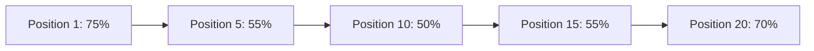
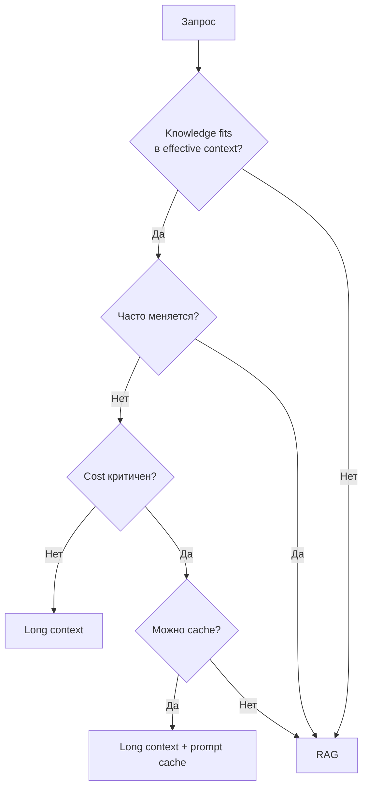
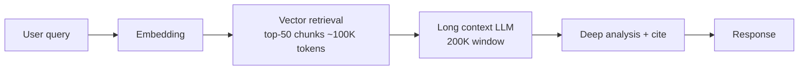
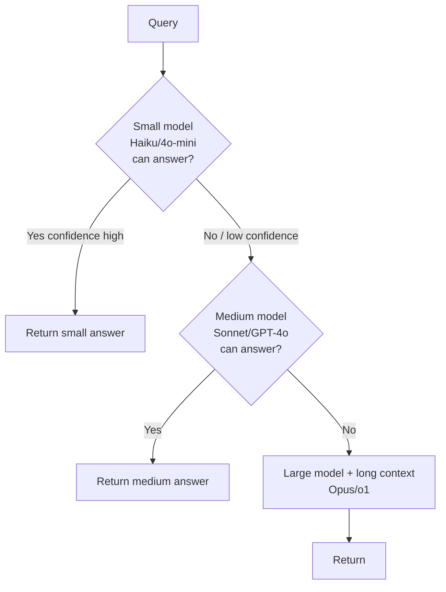
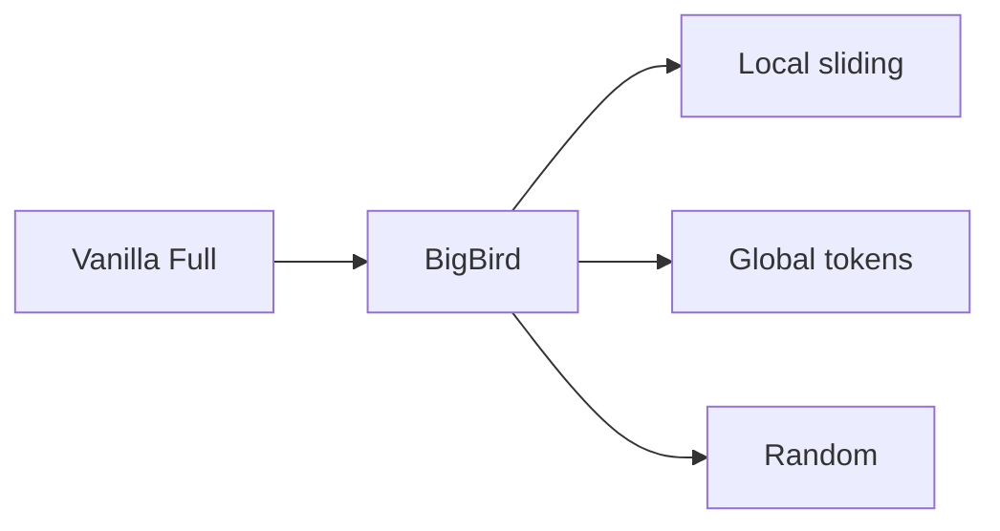
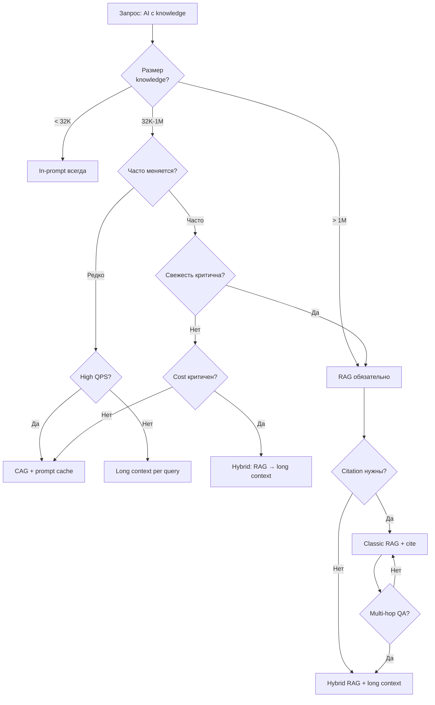

# Вопросы на собеседовании: `Long Context vs RAG`

**Long Context LLMs** (Gemini 1.5 Pro 2M, Claude 3 200K, GPT-4 Turbo 128K, Llama 4 10M) сделали возможным заталкивать в prompt целые документы, кодовые базы, видео. Это породило вечный спор: **«RAG умер»** или **«long context не масштабируется по cost/latency»**. Ответ — оба правы в своих кейсах. Шпаргалка про trade-offs, decision criteria, hybrid-паттерны, и подводные камни (`Lost in the Middle`, `effective vs claimed context`, prefill latency).

## Полезные ссылки

### Архитектурные работы (context extension)

- [Longformer: The Long-Document Transformer (Beltagy et al., 2020)](https://arxiv.org/abs/2004.05150)
- [Big Bird: Transformers for Longer Sequences (Zaheer et al., 2020)](https://arxiv.org/abs/2007.14062)
- [YaRN: Efficient Context Window Extension (Peng et al., 2023)](https://arxiv.org/abs/2309.00071)
- [Ring Attention (Liu et al., 2023)](https://arxiv.org/abs/2310.01889)
- [StreamingLLM: Attention Sinks (Xiao et al., 2023)](https://arxiv.org/abs/2309.17453)
- [ALiBi: Position Encoding (Press et al., 2021)](https://arxiv.org/abs/2108.12409)

### Проблемы и benchmarks

- [Lost in the Middle (Liu et al., 2023)](https://arxiv.org/abs/2307.03172)
- [RULER: What's the Real Context Size? (Hsieh et al., 2024)](https://arxiv.org/abs/2404.06654)
- [LongBench](https://github.com/THUDM/LongBench)
- [Needle in a Haystack (gkamradt)](https://github.com/gkamradt/LLMTest_NeedleInAHaystack)

### Caching и compression

- [Anthropic Prompt Caching](https://docs.anthropic.com/en/docs/build-with-claude/prompt-caching)
- [OpenAI Prompt Caching](https://platform.openai.com/docs/guides/prompt-caching)
- [GPTCache (semantic cache)](https://github.com/zilliztech/GPTCache)
- [LLMLingua: Prompt Compression](https://arxiv.org/abs/2310.05736)
- [CAG: Cache-Augmented Generation (Chan et al., 2024)](https://arxiv.org/abs/2412.15605)

### Provider docs

- [Gemini 1.5 Pro (2M context)](https://blog.google/technology/ai/google-gemini-next-generation-model-february-2024/)
- [Claude 3 (200K context)](https://www.anthropic.com/news/claude-3-family)

## Содержание

- [Полезные ссылки](#полезные-ссылки)
- [See also](#see-also)

**Эволюция context windows**
- [Q1. (!) Эволюция context windows: GPT-3.5 4K → Llama 4 10M?](#q1--эволюция-context-windows-gpt-35-4k--llama-4-10m)
- [Q2. (!) Зачем потребовался long context?](#q2--зачем-потребовался-long-context)
- [Q3. Архитектурные изменения для long context: что меняли?](#q3-архитектурные-изменения-для-long-context-что-меняли)
- [Q4. YaRN / RoPE scaling / position interpolation?](#q4-yarn--rope-scaling--position-interpolation)

**Lost in the Middle и benchmarks**
- [Q5. (!) Что такое Lost in the Middle?](#q5--что-такое-lost-in-the-middle)
- [Q6. Needle-in-a-Haystack — как тестируют long context?](#q6-needle-in-a-haystack--как-тестируют-long-context)
- [Q7. (!) Effective context vs claimed context — в чём разница?](#q7--effective-context-vs-claimed-context--в-чём-разница)
- [Q8. RULER и LongBench — что меряют?](#q8-ruler-и-longbench--что-меряют)

**Long Context vs RAG — выбор**
- [Q9. (!) Когда выбрать long context, а когда RAG?](#q9--когда-выбрать-long-context-а-когда-rag)
- [Q10. (!) RAG умер с приходом 2M-context Gemini?](#q10--rag-умер-с-приходом-2m-context-gemini)
- [Q11. Citation / attribution — какой подход даёт лучше?](#q11-citation--attribution--какой-подход-даёт-лучше)
- [Q12. ACL filtering (row-level security) в RAG vs long context?](#q12-acl-filtering-row-level-security-в-rag-vs-long-context)

**Cost и latency**
- [Q13. (!) Cost arithmetic: посчитать GPT-4o 128K vs RAG?](#q13--cost-arithmetic-посчитать-gpt-4o-128k-vs-rag)
- [Q14. (!) Latency: prefill scales linearly — что это значит?](#q14--latency-prefill-scales-linearly--что-это-значит)
- [Q15. TTFT (time-to-first-token) для long context?](#q15-ttft-time-to-first-token-для-long-context)

**Caching**
- [Q16. (!) Prompt Caching — как это спасает long context?](#q16--prompt-caching--как-это-спасает-long-context)
- [Q17. Anthropic vs OpenAI prompt caching: отличия?](#q17-anthropic-vs-openai-prompt-caching-отличия)
- [Q18. (!) Semantic Caching — что это и когда применять?](#q18--semantic-caching--что-это-и-когда-применять)
- [Q19. Threshold tuning для semantic cache?](#q19-threshold-tuning-для-semantic-cache)
- [Q20. CAG (Cache-Augmented Generation)?](#q20-cag-cache-augmented-generation)

**Hybrid patterns**
- [Q21. (!) Hybrid: RAG → long context analysis?](#q21--hybrid-rag--long-context-analysis)
- [Q22. Cascading: small → large model?](#q22-cascading-small--large-model)
- [Q23. Code agents (Cursor/Cody): как комбинируют?](#q23-code-agents-cursorcody-как-комбинируют)

**Architecture deep-dive**
- [Q24. Sparse attention (BigBird/Longformer)?](#q24-sparse-attention-bigbirdlongformer)
- [Q25. Ring Attention — как работает?](#q25-ring-attention--как-работает)
- [Q26. Sliding window + StreamingLLM (attention sinks)?](#q26-sliding-window--streamingllm-attention-sinks)

**Compression и multimodal**
- [Q27. LLMLingua и prompt compression?](#q27-llmlingua-и-prompt-compression)
- [Q28. Multimodal long context: видео и аудио в Gemini?](#q28-multimodal-long-context-видео-и-аудио-в-gemini)
- [Q29. (!) Decision tree: как выбирать архитектуру?](#q29--decision-tree-как-выбирать-архитектуру)
- [Q30. Real-world примеры (Cursor, Notion AI, Copilot Workspace)?](#q30-real-world-примеры-cursor-notion-ai-copilot-workspace)

---

## Q1. (!) Эволюция context windows: GPT-3.5 4K → Llama 4 10M?

За 3 года context windows выросли в **2500×**. Это не просто «больше токенов» — каждый скачок требовал архитектурных изменений (RoPE scaling, sparse attention, KV-cache offloading).

| Год | Модель | Claimed context | Effective (RULER) | Особенности |
|---|---|---|---|---|
| 2022 | GPT-3.5 (text-davinci-003) | 4K | ~4K | Vanilla attention |
| 2023 Q1 | GPT-4 | 8K / 32K | ~8K / ~24K | Sparse attention в 32K |
| 2023 Q3 | Claude 2 | 100K | ~70K | First mass-market 100K+ |
| 2023 Q4 | GPT-4 Turbo | 128K | ~64K | YaRN-подобный extension |
| 2024 Q1 | Claude 3 (Opus/Sonnet) | 200K | ~150K | Production-grade |
| 2024 Q1 | Gemini 1.5 Pro | 1M (preview 10M) | ~700K | Ring Attention + MoE |
| 2024 Q3 | Llama 3.1 | 128K | ~32K | YaRN extension от 8K base |
| 2024 Q4 | Gemini 1.5 Pro (GA) | 2M | ~1.5M | Multimodal native |
| 2025 Q2 | Llama 4 (заявлено) | 10M | TBD | Long-RoPE + sparse |
| 2025 Q4 | DeepSeek-V3 | 128K | ~100K | MLA (Multi-head Latent Attention) |

**Ключевой инсайт:** claimed ≠ effective. Llama-3.1 8B при заявленных 128K реально хорошо работает до ~32K — дальше деградация (RULER score).

## Q2. (!) Зачем потребовался long context?

Use-cases, которые невозможны (или плохи) при коротком окне:

1. **Анализ длинных документов** — юридический контракт (200 страниц), научная статья, спецификация API.
2. **Codebase analysis** — целый репозиторий (Cursor, Copilot Workspace) в одном prompt.
3. **Multi-document QA** — сравнение 20 документов с cross-references.
4. **Few-shot с большими examples** — 100+ обучающих примеров in-context.
5. **Long conversations** — multi-turn с историей на тысячи сообщений.
6. **Video understanding** — 1 час видео ≈ 1M tokens (Gemini).
7. **Genomics, financial reports** — длинные структурированные данные.

**Альтернатива через RAG:** chunking → retrieval → top-K. Работает, но теряет global context (см. Q9).

## Q3. Архитектурные изменения для long context: что меняли?

Vanilla attention имеет сложность **O(n²)** по памяти и compute. Для 1M tokens это 10¹² операций — невозможно. Решения:

1. **Sparse attention** (Longformer, BigBird) — каждый token attend только к `O(n)` соседям + некоторым global tokens. Сложность `O(n)`.
2. **Sliding window** (Mistral, Mixtral) — attention внутри окна 4K, переносит контекст через слои.
3. **Ring Attention** (Liu, 2023) — distributed attention через несколько GPU, communication overlaps с compute. Использовано в Gemini 1.5.
4. **Position interpolation / YaRN / NTK** — extend pretrained RoPE на больший window без переобучения.
5. **ALiBi** (Press, 2021) — linear bias вместо positional embeddings, extrapolation до 10× train length.
6. **MLA (Multi-head Latent Attention)** — DeepSeek-V3, сжимает KV-cache в латентное пространство.
7. **KV-cache compression / offloading** — выгрузка cache на CPU/disk для длинных контекстов.

```mermaid
graph LR
    A[Vanilla O(n²)] --> B[Sparse O(n)]
    A --> C[Sliding Window]
    A --> D[Ring Attention]
    A --> E[Position scaling]
    E --> F[YaRN]
    E --> G[NTK-aware]
    E --> H[ALiBi]
```

## Q4. YaRN / RoPE scaling / position interpolation?

**Проблема:** модель обучена на context 4K с RoPE positional embeddings. Если подать 32K — позиционные коды экстраполируются за пределы training distribution → деградация.

**Position Interpolation (Chen, 2023):** «сжать» позиции до train range. Если хотим extend 4K → 32K, делим position index на 8. Требует короткого fine-tuning.

**NTK-aware scaling:** не линейное сжатие, а scale base частоты RoPE. Сохраняет high-frequency components → лучше для коротких dependencies.

**YaRN (Yet another RoPE extensioN):** комбинация NTK + attention scaling + temperature. SOTA для context extension, работает с минимальным fine-tuning.

| Метод | Fine-tune нужен | Качество на коротком | Качество на длинном |
|---|---|---|---|
| No scaling | — | OK | Сломано после 1.2× |
| Linear PI | 1B tokens | Слегка хуже | OK |
| NTK-aware | 0 (zero-shot) | OK | OK |
| YaRN | 400M tokens | OK | Лучшее |
| ALiBi | Pretrained | OK | Хорошая extrapolation |

```python
# RoPE с YaRN scaling (упрощенно)
def yarn_rope_freqs(dim, base=10000, scale=4.0, alpha=1, beta=32):
    # NTK-aware: scale base
    base = base * (scale ** (dim / (dim - 2)))
    freqs = 1.0 / (base ** (torch.arange(0, dim, 2) / dim))
    # Attention scaling
    attn_scale = 0.1 * math.log(scale) + 1.0
    return freqs, attn_scale
```

## Q5. (!) Что такое Lost in the Middle?

**Lost in the Middle** (Liu et al., 2023) — модели лучше извлекают информацию из **начала и конца** prompt, и хуже из середины. U-shape кривая accuracy.

**Эксперимент:** 20 документов, в одном из них ответ. Меняем позицию релевантного документа от 1 до 20. Accuracy:



**Причины:**

1. **Training distribution** — instruction-following данные обычно короткие, instruction в начале.
2. **Attention bias** — early tokens получают больше attention через causal mask + sinks.
3. **RoPE/positional decay** — старые позиции decay.

**Митигации:**

1. **Важное в начало или конец** prompt — особенно user query.
2. **Re-ranking** — перед подачей в LLM, релевантные документы кладём в начало/конец.
3. **Повторение** — продублировать query после контекста: `<context>...</context>\n\nReminder: question is: ...`
4. **Structured prompt** — XML/markdown секции с явными заголовками.
5. **Map-reduce** — обработать chunks отдельно, потом aggregate.

Эта проблема **сильнее в RAG**, чем в long-context analysis, потому что RAG-документы часто плохо упорядочены.

## Q6. Needle-in-a-Haystack — как тестируют long context?

**Needle-in-Haystack (NIH)** — synthetic тест от gkamradt. Берём длинный текст (книга, эссе), вставляем «иголку» — нерелевантное предложение (`The best thing to do in San Francisco is eat a sandwich at Dolores Park on a sunny day.`). Просим модель ответить «что делать в San Francisco?».

**Варианты теста:**

- **Single needle** — одна иголка в `n` позициях × `m` длинах контекста → heatmap.
- **Multi-needle** — несколько иголок, нужно собрать все.
- **Needle-in-needlestack** — иголка похожа на распределение шумовых предложений.

**Результаты (2024):**

| Модель | Single needle 100K | Multi-needle 100K | 1M |
|---|---|---|---|
| GPT-4 Turbo 128K | 95% | 60% | — |
| Claude 3 Opus 200K | 99% | 80% | — |
| Gemini 1.5 Pro 1M | 99% | 75% | 99% (1M single) |
| Llama 3.1 70B 128K | 70% | 30% | — |

**Критика NIH:** слишком простой. Реальные задачи требуют reasoning через несколько мест в документе, а не одну иголку. Поэтому появились **RULER, LongBench, ZeroSCROLLS**.

## Q7. (!) Effective context vs claimed context — в чём разница?

**Claimed context** — максимальное число tokens, которое API принимает.

**Effective context** — длина, на которой модель **реально качественно работает** (по RULER / LongBench).

| Модель | Claimed | Effective (RULER 85+ score) | Gap |
|---|---|---|---|
| GPT-4 Turbo | 128K | 64K | 2× |
| GPT-4o | 128K | 64K | 2× |
| Claude 3 Opus | 200K | 150K | 1.3× |
| Claude 3.5 Sonnet | 200K | 96K | 2× |
| Gemini 1.5 Pro | 1M | ~700K | 1.4× |
| Llama 3.1 70B | 128K | 64K | 2× |
| Llama 3.1 8B | 128K | 32K | 4× |
| Mistral Large 2 | 128K | 32K | 4× |

**Что это значит:**

- При длине > effective падает accuracy на multi-hop, aggregation, in-context learning.
- Production правило: использовать **половину claimed**, остальное — safety buffer.
- Для критичных задач — тестировать на своих данных, NIH недостаточен.

## Q8. RULER и LongBench — что меряют?

**RULER** (NVIDIA, 2024) — synthetic benchmark, 13 задач:

1. **Retrieval** (single/multi-needle).
2. **Multi-hop tracing** (variable tracking).
3. **Aggregation** (common/frequent words).
4. **QA** (squad, hotpotqa в длинном контексте).

Метрика — accuracy для каждой длины (4K, 8K, 16K, ..., 1M). Threshold 85% = «модель работает». См. таблицу в Q7.

**LongBench** (THUDM) — реальные задачи на 6 категорий:

1. Single-doc QA (NarrativeQA).
2. Multi-doc QA (HotpotQA).
3. Summarization.
4. Few-shot learning.
5. Synthetic (PassageRetrieval).
6. Code completion.

**∞Bench / LongBench v2** — extended до 1M+ tokens.

**ZeroSCROLLS** — zero-shot benchmark на длинных документах (Books, Government Reports).

## Q9. (!) Когда выбрать long context, а когда RAG?

**Long context (выбрать когда):**

- Однократный анализ всего документа (`Прочти этот PDF и ответь на вопросы`).
- Codebase analysis (требуется global understanding).
- Few-shot с большими examples (100+ примеров для задачи).
- Multi-hop reasoning через документ (нужно связать факты в разных секциях).
- Документ умещается в effective context и используется редко.
- Cost не критичен (one-off batch job).

**RAG (выбрать когда):**

- Knowledge base часто обновляется (новые статьи каждый день).
- Огромный corpus (10M+ tokens, не лезет даже в Gemini 2M).
- Cost-sensitive (high QPS).
- Citation / attribution критичен (показать какие документы использовались).
- ACL filtering (разные пользователи видят разные документы).
- Multi-tenant (изолированные knowledge bases).
- Latency критичен (RAG ~200ms vs long context ~30s).



## Q10. (!) RAG умер с приходом 2M-context Gemini?

**Короткий ответ:** нет, но границы сдвинулись.

**Что long context съел у RAG:**

- Анализ одного документа до 1.5M tokens (книга, контракт, юр. дело).
- Code analysis репозиториев < 500K LOC.
- Сессии с долгой историей.

**Что RAG сохраняет:**

1. **Cost** — 5K tokens RAG vs 1M tokens long context = **200× дешевле**.
2. **Latency** — RAG retrieval 50-200ms vs prefill 1M tokens 30-60s.
3. **Scale** — corpus уровня всего internet, википедии, корпоративных wiki за 10 лет.
4. **Freshness** — новые документы доступны через секунды, без переиндексации модели.
5. **Citation** — `[1]`, `[2]` со ссылками на конкретные chunks.
6. **ACL** — фильтр на уровне retrieval (Postgres RLS, vector DB metadata).
7. **Audit** — какие документы попали в context при каждом запросе.

**Текущий мейнстрим (2025-2026):** hybrid. Retrieval сужает scope до relevant 100K-500K → long context для глубокого reasoning.

## Q11. Citation / attribution — какой подход даёт лучше?

**RAG:**

- Естественно: каждый chunk имеет `doc_id`, `chunk_id`. Промпт: `Cite sources as [1], [2].`
- Можно валидировать: для каждого `[N]` проверить, что N-й chunk реально содержит факт.
- Точность ~80-90% (модель иногда галлюцинирует cite).

**Long context:**

- Сложнее: модель должна указать, **где в 200K-документе** факт.
- Подход: давать структуру `<section id="3.2">...</section>` и просить cite section IDs.
- Anthropic Citations API (2024) — нативная поддержка, модель возвращает character offsets.
- Точность выше при правильной разметке.

```python
# Anthropic Citations
response = client.messages.create(
    model="claude-3-5-sonnet-20241022",
    max_tokens=1024,
    messages=[{
        "role": "user",
        "content": [{
            "type": "document",
            "source": {"type": "text", "media_type": "text/plain", "data": long_doc},
            "title": "Annual Report 2024",
            "citations": {"enabled": True}
        }, {
            "type": "text",
            "text": "What was revenue growth?"
        }]
    }]
)
# Ответ содержит cited text + character offsets
```

## Q12. ACL filtering (row-level security) в RAG vs long context?

**RAG:** тривиально. Метаданные на vector DB + filter в retrieval.

```python
# Pinecone / Weaviate
results = vector_db.query(
    vector=query_embedding,
    top_k=10,
    filter={"team": user.team, "classification": {"$lte": user.clearance}}
)
```

**Long context:** проблема. Нельзя «выдать только видимые user куски» из одного prompt.

**Варианты для long context + ACL:**

1. **Pre-filter** — собрать только разрешённые документы → подать в context (становится квази-RAG).
2. **Per-user prompt cache** — кэш зависит от user (часто экономически нецелесообразно).
3. **System prompt с правилами** — `Не отвечай на вопросы о docs с classification > L2` (ненадёжно, prompt injection обходит).
4. **Post-filter ответа** — LLM генерирует, потом классификатор фильтрует.

**Вердикт:** при сложном ACL — RAG. При plain «весь knowledge доступен пользователю» — long context работает.

## Q13. (!) Cost arithmetic: посчитать GPT-4o 128K vs RAG?

Прайс (2026, input tokens):

| Модель | $/1M input | $/1M cached | $/1M output |
|---|---|---|---|
| GPT-4o | $2.50 | $1.25 | $10.00 |
| GPT-4o mini | $0.15 | $0.075 | $0.60 |
| Claude 3.5 Sonnet | $3.00 | $0.30 (cache hit) | $15.00 |
| Claude 3 Haiku | $0.25 | $0.03 | $1.25 |
| Gemini 1.5 Pro | $1.25 (<128K), $2.50 (>128K) | $0.3125 | $5.00 |
| DeepSeek-V3 | $0.27 | $0.07 | $1.10 |

**Сценарий:** QA bot на 100-страничном PDF (~120K tokens), 1000 запросов/день.

**Long context (GPT-4o, без cache):**

- 120K input × $2.50/M = $0.30 per req
- 500 output × $10/M = $0.005
- **Total: $305/день, $9150/месяц**

**Long context (Claude 3.5 Sonnet, с prompt cache):**

- Первый запрос: 120K × $3.00/M = $0.36 (запись в cache: × 1.25 = $0.45)
- Cache hits: 120K × $0.30/M = $0.036
- 999 cached × $0.036 = $35.96 + $0.45 = $36.41 input
- 1000 × 500 × $15/M = $7.50 output
- **Total: $43.91/день, $1317/месяц** (7× дешевле)

**RAG (GPT-4o):**

- Retrieval: 10 chunks × 500 tokens = 5K context
- 1000 × 5K × $2.50/M = $12.50 input
- 1000 × 500 × $10/M = $5.00 output
- Embedding query: 1000 × 50 × $0.13/M = $0.0065
- **Total: $17.50/день, $525/месяц** (17× дешевле long context без cache, 2.5× дешевле с cache)

**Вывод:** prompt caching радикально меняет уравнение. Без cache RAG в **17 раз** дешевле, с cache — только в **2.5 раза**.

## Q14. (!) Latency: prefill scales linearly — что это значит?

**Inference этапы:**

1. **Prefill** — обработка input prompt, заполнение KV-cache. Compute = `O(n)` по tokens (на одной GPU).
2. **Decode** — генерация по 1 token, чтение KV-cache. Compute на token = `O(n)` но это `O(1)` на каждый decode step.

**TTFT (Time To First Token)** = prefill latency. Растёт линейно с длиной prompt.

| Context | TTFT GPT-4o | TTFT Claude 3.5 | TTFT Gemini 1.5 Pro |
|---|---|---|---|
| 5K | ~200ms | ~300ms | ~400ms |
| 32K | ~1.5s | ~2s | ~3s |
| 128K | ~6s | ~10s | ~12s |
| 200K | — | ~15s | ~20s |
| 1M | — | — | ~60-90s |

**RAG TTFT:** retrieval (50-200ms) + prefill 5K (~300ms) = **~500ms**.

**Импликации:**

- Real-time chat (< 1s TTFT) → RAG или small context.
- Background batch (можно ждать) → long context OK.
- Streaming UI частично скрывает prefill (но первый token всё равно медленный).

## Q15. TTFT (time-to-first-token) для long context?

TTFT — критичная метрика UX. Пользователь чувствует задержку до первого токена, после — streaming маскирует latency.

**Оптимизации провайдеров:**

1. **Prefill chunking** — параллельная обработка кусков prefill на нескольких GPU.
2. **Speculative decoding** — draft model генерирует кандидатов, large model верифицирует.
3. **Prompt caching** — пропускает prefill для cached prefix.
4. **Context distillation** — заранее «сжать» документ в shorter representation.
5. **Continuous batching** — vLLM/TensorRT-LLM, шарить compute между запросами.

**Что можно сделать на стороне приложения:**

1. **Cache hit** — обеспечить prefix stability (system prompt + документ + переменная часть).
2. **Streaming SSE** — UI начинает рендерить первые tokens мгновенно.
3. **Optimistic UI** — показать «Reading 100K tokens...» спиннер.
4. **Pre-warm** — заранее отправить запрос для важных user sessions.
5. **Smaller models** для интерактивных шагов, large только когда нужно глубокое reasoning.

## Q16. (!) Prompt Caching — как это спасает long context?

**Идея:** если первая часть prompt (system prompt + большой документ) одинакова между запросами, провайдер кэширует KV-cache на стороне inference. Cache hit → cost × 0.1, latency × 0.2.

**Anthropic prompt caching (2024):**

- Маркируется `cache_control: {"type": "ephemeral"}`.
- TTL = 5 минут (refresh при каждом hit).
- Запись в cache: 1.25× от обычного input cost.
- Чтение из cache: 0.1× (90% off).
- Минимум 1024 tokens для cache (для Sonnet).

```python
response = client.messages.create(
    model="claude-3-5-sonnet-20241022",
    system=[
        {"type": "text", "text": "You are helpful."},
        {
            "type": "text",
            "text": LARGE_DOCUMENT,  # 100K tokens
            "cache_control": {"type": "ephemeral"}
        }
    ],
    messages=[{"role": "user", "content": user_question}]
)
# Первый запрос: full price + 25% (write)
# Последующие в 5 мин: 10% от price (read)
```

**OpenAI prompt caching (2024):**

- **Автоматическое** — нет API параметра.
- TTL = 5-10 минут (idle), до 1 часа в off-peak.
- Скидка 50% на cached tokens.
- Работает только для prompts ≥ 1024 tokens, кэшируется в blocks по 128.
- Префикс должен быть стабилен (от начала).

**Gemini Context Caching:**

- Explicit API, TTL configurable (default 1 час).
- Cost storage: $1/M tokens/hour.
- Cost при использовании: 0.25× от обычного.
- Минимум 32K tokens.

## Q17. Anthropic vs OpenAI prompt caching: отличия?

| Аспект | Anthropic | OpenAI | Gemini |
|---|---|---|---|
| API | Explicit (`cache_control`) | Автоматический | Explicit (Cached Content) |
| Скидка на read | 90% | 50% | 75% |
| Запись стоит | +25% от обычного | 0% (бесплатно) | Storage $1/M/hour |
| TTL | 5 мин (refresh on hit) | 5-60 мин | Configurable (default 1h) |
| Min size | 1024 tokens | 1024 tokens | 32K tokens |
| Breakpoints | До 4 явных | Auto в начале | По длине |
| Поддержка tools | Да (cached) | Да | Да |
| Поддержка images | Да | Да | Да |

**Когда что лучше:**

- **Anthropic** — для high-frequency repeated calls (chat с длинным документом, agent loops). 90% discount компенсирует write penalty за 3-4 hits.
- **OpenAI** — для unpredictable patterns (бесплатная запись, разумная скидка).
- **Gemini** — для batch jobs с большим контекстом, который используется часы.

**Break-even Anthropic:** запись 1.25×, read 0.1×. Чтобы окупиться: `1.25 + 0.1×N < 1×(N+1)` → `N > 0.27`. Уже после первого hit выгодно.

## Q18. (!) Semantic Caching — что это и когда применять?

**Semantic Caching** — кэш на уровне приложения, key = embedding запроса. При новом запросе ищем `cosine_similarity(new_query_emb, cached_queries_emb) > threshold`. Если есть hit — возвращаем cached response без LLM call.

**Отличие от prompt caching:**

- Prompt cache: одинаковый prefix → cheaper inference.
- Semantic cache: **похожий вопрос** → пропустить LLM call **полностью**.

**Архитектура:**

```python
# GPTCache / Redis Vector Search
import gptcache
from gptcache.embedding import OpenAI
from gptcache.similarity_evaluation import OnnxModelEvaluation

cache = gptcache.Cache()
cache.init(
    embedding_func=OpenAI().to_embeddings,
    data_manager=manager,
    similarity_evaluation=OnnxModelEvaluation(),
    config={"similarity_threshold": 0.95}
)

def ask(query):
    cached = cache.get(query)
    if cached and cached.similarity > 0.95:
        return cached.response
    response = llm.complete(query)
    cache.put(query, response)
    return response
```

**Когда применять:**

- High traffic с повторяющимися intents (`какие у вас часы работы?`, `как мне вернуть товар?`).
- Customer support FAQs.
- Documentation search.

**Когда НЕ применять:**

- Personalized ответы (cache hit отдаст ответ для другого user).
- Time-sensitive (`какая сегодня цена?`).
- Stateful conversations (cache не учитывает историю).
- Long-tail запросы (low hit rate, чистый overhead).

**Hit rate в production:** 10-40% для FAQ-style, 1-5% для генеративных задач. Считай экономию: `hit_rate × cost_per_call − cache_infra_cost`.

## Q19. Threshold tuning для semantic cache?

Threshold — главный hyperparameter. Слишком низкий (0.7) → false hits (отдаём не тот ответ). Слишком высокий (0.99) → почти нет hits (cache бесполезен).

**Подбор:**

1. Собрать labeled pairs `(q1, q2, same_intent: bool)`.
2. Для каждой пары посчитать `cosine_similarity(emb(q1), emb(q2))`.
3. Построить ROC curve: precision @ threshold vs recall.
4. Выбрать threshold для целевой precision (например, 95%).

**Типичные значения для OpenAI text-embedding-3-large:**

- 0.95+ — почти identical paraphrases.
- 0.90-0.95 — same intent, разная формулировка.
- 0.85-0.90 — related but different intent.
- < 0.85 — разные вопросы.

**Production rules:**

1. Начать с 0.95, мониторить ложные срабатывания.
2. Per-domain thresholds: для `pricing` строже (0.98), для `general info` свободнее (0.90).
3. **Validator** — после semantic cache hit запустить дешёвую модель (Haiku/4o-mini) с вопросом «отвечает ли cached_response на user_query?». Стоит копейки, отсекает false hits.
4. **Adaptive** — отслеживать user feedback (thumbs down) и поднимать threshold для cluster запросов.

## Q20. CAG (Cache-Augmented Generation)?

**CAG** (Cache-Augmented Generation, Chan et al., 2024) — альтернатива RAG для small-to-medium knowledge bases. Идея: вместо retrieval каждый запрос — **загрузить ВСЁ knowledge в KV-cache один раз**, дальше использовать prompt caching.

**Алгоритм:**

1. Собрать knowledge base ≤ effective context (например, 128K tokens documentation).
2. Запустить prefill один раз: `[KB] + [query placeholder]`. KV-cache сохранён.
3. На каждый запрос: использовать cached KV-cache + только новый query (5K tokens prefill вместо 128K).
4. Когда KB обновляется — invalidate cache, перестроить.

**Преимущества:**

- Нет retrieval errors (вся KB в context).
- Нет chunking artifacts.
- Latency после первого запроса = небольшая.
- Cost: с prompt cache hit ~10× дешевле обычного long context.

**Недостатки:**

- KB должна влезать в effective context (128K-1M).
- Обновление KB = полная переиндексация (refresh cache).
- Lost in the middle всё равно работает.

**Когда применять:** stable knowledge bases 50K-500K tokens, например product docs, API reference, internal policies. Для часто меняющихся или гигантских KB — оставайся на RAG.

## Q21. (!) Hybrid: RAG → long context analysis?

Самый популярный production-паттерн в 2026.

**Pipeline:**



**Почему работает:**

- RAG фильтрует scope от миллиардов до миллионов tokens → до сотен тысяч.
- Long context даёт **много контекста** (50 chunks вместо 5 в classic RAG) и **multi-hop reasoning**.
- Не теряем cost-сторону (top-50 чанков × 2K = 100K tokens вместо целого corpus).

**Vs classic RAG:**

- Classic: top-5 chunks × 2K = 10K context.
- Hybrid: top-50 chunks × 2K = 100K context.
- Качество aggregation/multi-hop сильно выше.
- Cost: 10× выше classic, но 5× дешевле full long context.

**Anthropic Contextual Retrieval** (2024) — улучшенный hybrid: каждый chunk обогащается document-level context перед embedding. Снижает retrieval errors на 35-49%.

```python
def hybrid_qa(query):
    # 1. Wide retrieval
    chunks = vector_db.search(query, top_k=50)
    
    # 2. Re-rank
    reranked = cohere_rerank(query, chunks, top_k=30)
    
    # 3. Pack into long context with structure
    context = "\n\n".join(f"<doc id='{c.id}'>{c.text}</doc>" for c in reranked)
    
    # 4. Long context analysis with prompt cache
    response = claude.messages.create(
        model="claude-3-5-sonnet",
        system=[{"type": "text", "text": context, "cache_control": {"type": "ephemeral"}}],
        messages=[{"role": "user", "content": query}]
    )
    return response
```

## Q22. Cascading: small → large model?

**Cascading** — pipeline нескольких моделей разного размера. Каждый шаг отсеивает запросы, которые **могут решиться дёшево**.

**Pattern:**



**Логика «can answer»:**

- Self-evaluation: модель возвращает confidence score.
- Heuristics: длина query, наличие keywords, intent classification.
- Validator model — отдельная модель проверяет complexity.

**Экономия:**

- 70% запросов решаются small ($0.15/M).
- 25% — medium ($2.50/M).
- 5% — large + long context ($15/M).
- Weighted average ~$1.5/M вместо $10/M (6× дешевле).

**Риски:** двойная стоимость для escalated запросов (small + large). Self-evaluation ненадёжен — small модель не всегда понимает, что не справилась.

## Q23. Code agents (Cursor/Cody): как комбинируют?

Code agents — самый продвинутый hybrid use case.

**Cursor (2024-2026):**

- AST-based retrieval (tree-sitter parse, indexed by symbols).
- Embedding search по file chunks.
- Long context (Claude 3.5 Sonnet 200K) для composer mode.
- Prompt caching: stable system prompt + open files + recent edits.

**Sourcegraph Cody:**

- Search-based retrieval (zoekt for code search).
- Symbol resolution (LSP-like).
- Long context для multi-file refactor.
- Cache: repo-level prompt cache.

**Copilot Workspace:**

- Full repo upload (для small/medium projects).
- Spec → plan → implementation pipeline.
- Long context для каждого шага.

**GitHub Copilot Chat:**

- Local context: open files + cursor position.
- Workspace search для cross-file.
- Embeddings для большой repo.

**Aider:**

- `git ls-files` + repomap (compressed AST).
- Send only relevant files to LLM.
- Architect mode: один LLM для plan, другой для edit.

**Общий паттерн:**

1. Symbol resolution (definition/references) — быстрый precise retrieval.
2. Embedding search для unstructured queries.
3. Long context для composer (multi-file edits).
4. Prompt caching для repeated context.

## Q24. Sparse attention (BigBird/Longformer)?

**Vanilla attention:** каждый token attend ко всем `n` tokens → O(n²).

**Sparse attention** ограничивает attention pattern:

1. **Local (sliding window)** — token attend только к `w` соседям. O(n·w).
2. **Global tokens** — несколько special tokens attend ко всем (и наоборот). O(n·g) для global.
3. **Random** — random attention пары (BigBird theorem: random + local + global = universal approximator).

**Longformer (Beltagy, 2020):** local + global. Применяется для documents до 32K.

**BigBird (Zaheer, 2020):** local + global + random. Theoretically доказана эквивалентность full attention.



**Современный статус (2026):** sparse attention популярна была в 2020-2022. С приходом FlashAttention + ring attention + position scaling — dense attention с эффективным compute стал доминирующим в frontier models. Sparse используется в специализированных архитектурах (Mistral Mixtral, локальные модели).

## Q25. Ring Attention — как работает?

**Ring Attention** (Liu et al., 2023) — distributed attention для сверхдлинных контекстов. Использован в Gemini 1.5 для 1M-2M.

**Идея:** разбить sequence на `K` chunks, разместить на `K` GPU. Каждая GPU считает attention для своего chunk против всех остальных. Передача KV между GPU организована как ring (P1 → P2 → ... → PK → P1), и **передача KV перекрывается с compute** через async send/recv.

**Pseudocode:**

```python
# Каждый GPU держит chunk Q_i, K_i, V_i
def ring_attention_step(Q_i, K_local, V_local, num_steps):
    out = zeros_like(Q_i)
    for step in range(num_steps):
        # Compute attention с текущим KV (свой + полученный)
        out += attention(Q_i, K_local, V_local)
        # Send K_local, V_local дальше по ring
        # Receive new K, V от предыдущего GPU
        K_local, V_local = ring_exchange(K_local, V_local)
    return out
```

**Эффект:**

- Memory: O(n²/K) на GPU (вместо O(n²)).
- Compute: O(n²/K) на GPU.
- Communication: amortized to zero при правильном overlap.

**Результат:** 32 GPU позволяют обрабатывать contexts, недостижимые на одной GPU. Gemini использует это для 1M-2M.

## Q26. Sliding window + StreamingLLM (attention sinks)?

**Sliding Window Attention (SWA)** — token attend только к окну `w` predecessor tokens. Mistral 7B использует SWA с w=4096. Contexts могут быть > w через слои (рецептивное поле растёт layer × w).

**Проблема SWA при streaming:** если context > w, начало вылетает. Пробовали выкидывать старые KV — модель перестаёт работать (perplexity взрывается).

**StreamingLLM (Xiao, 2023)** обнаружили **attention sinks** — первые 4 tokens (особенно `<BOS>`) получают аномально много attention, даже если семантически бесполезны. Это «сток» для attention весов, которые иначе размазались бы.

**Решение:** при KV-eviction оставлять **attention sinks + последние `w-4` tokens**. Модель работает на бесконечных streams без перетренировки.

```python
def streaming_kv_cache(kv, max_size=4096, sinks=4):
    if len(kv) > max_size:
        # Сохраняем первые `sinks` + последние `max_size - sinks`
        keep_first = kv[:sinks]
        keep_last = kv[-(max_size - sinks):]
        kv = concat(keep_first, keep_last)
    return kv
```

**Применение:** infinite chat sessions, log analysis streams, real-time transcription.

## Q27. LLMLingua и prompt compression?

**LLMLingua** (Microsoft, 2023) — compress prompt в 2-20× с минимальной потерей качества. Использует small LM (LLaMA-7B) для определения, какие токены можно выбросить.

**Алгоритм:**

1. **Coarse-grained:** budget controller разделяет prompt на части (instruction, demonstrations, question), выделяет budget по важности.
2. **Fine-grained:** small LM считает perplexity каждого token. Высокая perplexity = важный (информативный). Низкая = можно удалить.
3. Удаляем low-perplexity tokens (часто stop words, redundant phrasing).

**Результаты:**

- 5× compression при retention 90%+ accuracy.
- 20× для длинных prompts (некоторые задачи).
- Latency snowball: меньше prefill для large model → ускорение конца-в-конец.

**LongLLMLingua** — версия для long context (32K-128K), task-aware compression.

```python
from llmlingua import PromptCompressor

compressor = PromptCompressor("microsoft/llmlingua-2-xlm-roberta-large-meetingbank")

result = compressor.compress_prompt(
    long_document,
    instruction="Summarize the financial highlights",
    rate=0.33,  # сжать до 33%
)
# result['compressed_prompt'] — текст в 3× короче
```

**Альтернативы:**

- **Summarization** (sentence-level или document-level).
- **Selective context** (на основе query релевантности).
- **AutoCompressors** — модели обучены сжимать context в soft prompts.

## Q28. Multimodal long context: видео и аудио в Gemini?

**Gemini 1.5 Pro** — первая mainstream модель с native multimodal long context.

**Tokens budget (примерные):**

- 1 минута видео @ 1 fps ≈ 256-1024 tokens.
- 1 час видео ≈ 1M tokens (на пределе context).
- 1 час аудио ≈ ~500K tokens.
- 1 страница PDF ≈ 250-500 tokens (text) + 1024 tokens (image).

**Use cases:**

- **Video QA** — `что произошло на 23-й минуте?`.
- **Audio analysis** — длинная встреча → summary с timestamps.
- **PDF с диаграммами** — анализ финансовых отчётов с графиками.
- **Codebase + UI screenshots** — debug UI bug с кодом.

**Trade-offs:**

- Multimodal токены **в разы дороже** text (фактический cost 5-10× выше).
- Effective context для multimodal часто меньше claimed.
- Long video с long question → high latency (30s+ TTFT).

```python
import google.generativeai as genai

genai.configure(api_key=API_KEY)

# Upload video file
video_file = genai.upload_file("hour_long_meeting.mp4")
# Wait for processing
while video_file.state.name == "PROCESSING":
    time.sleep(5)
    video_file = genai.get_file(video_file.name)

model = genai.GenerativeModel("gemini-1.5-pro")
response = model.generate_content([
    video_file,
    "Найди все моменты, где обсуждаются deadlines, с timestamps"
])
```

## Q29. (!) Decision tree: как выбирать архитектуру?



**Cheat-sheet:**

| Сценарий | Архитектура |
|---|---|
| Chatbot на 100 страницах docs | CAG (Claude prompt cache) |
| Wiki компании (Confluence, 1GB) | Classic RAG |
| Юр. анализ 200-страничного контракта | Long context (Claude/Gemini) |
| Code agent в репозитории | Hybrid (AST + embedding + long context) |
| Customer support FAQ | RAG + semantic cache |
| Video Q&A (1 час) | Long context multimodal (Gemini) |
| Personalized assistant с user data | RAG (per-user index) + ACL |
| Few-shot 100 examples | Long context (Sonnet/4o с cache) |
| Real-time chat | RAG (low latency) |
| Batch analytics на 10K docs | Long context (Gemini batch API) |

## Q30. Real-world примеры (Cursor, Notion AI, Copilot Workspace)?

**Cursor:**

- Architecture: AST + embedding retrieval + Claude 3.5 Sonnet 200K.
- Composer mode: feeds related files + cursor context.
- Prompt caching на open files.
- Cost optimization: small model для autocomplete, large для composer.

**Notion AI:**

- RAG по user workspace.
- ACL via Postgres row-level security.
- Per-user vector index.
- Не использует long context — сотни тысяч docs не влезут.

**GitHub Copilot Workspace:**

- Long context full repo (для small/medium projects, < 200K LOC).
- 4-stage pipeline: spec → plan → implementation → test.
- Каждый stage = отдельный LLM call с структурированным prompt.

**Perplexity:**

- Web search retrieval (RAG over internet).
- Inline citations.
- Не использует long context — internet > 2M tokens.

**Harvey (legal AI):**

- Hybrid: case law retrieval (millions of docs) + long context для analysis отдельного case.
- Long context Claude/GPT-4 для contract review.

**Glean (enterprise search):**

- RAG по корпоративным источникам (Slack, GDrive, Confluence, Jira).
- Per-user ACL crucial.
- Не использует long context — TB-level corpus.

**Anthropic Projects:**

- CAG-подобный pattern: user uploads docs → cached → multiple chats.
- Prompt caching под капотом.

**Общий тренд 2026:** hybrid патерны почти везде. Pure long context — только для документ-центричных задач. Pure RAG — только для огромных corpora с строгими требованиями к freshness/ACL.

---

## See also

- [RAG (Retrieval-Augmented Generation) interview](rag-interview.md)
- [LLM Basics interview](llm-basics-interview.md)
- [Vector Databases interview](vector-databases-interview.md)
- [Embeddings interview](embeddings-interview.md)
- [Prompt Engineering interview](prompt-engineering-interview.md)
- [Inference Optimization interview](inference-optimization-interview.md)
- [LLM Evaluation interview](llm-evaluation-interview.md)
- [AI Agents interview](ai-agents-interview.md)
- [Caching Strategies interview](../architecture/caching-strategies-interview.md)
- [Latency Numbers interview](../architecture/latency-numbers-interview.md)
