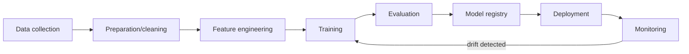
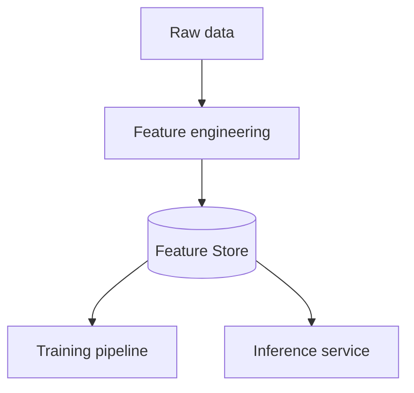

# Вопросы на собеседовании: `MLOps`

**MLOps** — DevOps для ML: experiment tracking, model versioning, deployment, monitoring, retraining. Критично для production ML/AI. С 2024 — **LLMOps** как подвид (специфично для LLM apps). Стек: MLflow, Weights & Biases, Feast, Kubeflow, Seldon, BentoML.

## Полезные ссылки

### Официальная документация и авторитетные источники

- [MLflow Documentation](https://mlflow.org/docs/latest/index.html)
- [Weights & Biases Documentation](https://docs.wandb.ai/)
- [Feast Documentation](https://docs.feast.dev/)
- [Tecton Documentation](https://docs.tecton.ai/)
- [Kubeflow Documentation](https://www.kubeflow.org/docs/)
- [BentoML Documentation](https://docs.bentoml.com/)
- [MLOps Community](https://mlops.community/)
- [Made With ML](https://madewithml.com/)

## Содержание

- [Полезные ссылки](#полезные-ссылки)
- [See also](#see-also)

**Базовые понятия**
- [Q1. (!) Что такое MLOps?](#q1--что-такое-mlops)
- [Q2. (!) ML lifecycle?](#q2--ml-lifecycle)
- [Q3. (!) DevOps vs MLOps — отличия?](#q3--devops-vs-mlops--отличия)

**Experiment tracking**
- [Q4. (!) Что такое experiment tracking?](#q4--что-такое-experiment-tracking)
- [Q5. (!) MLflow — основной инструмент?](#q5--mlflow--основной-инструмент)
- [Q6. Weights & Biases (W&B)?](#q6-weights--biases-wb)

**Data и features**
- [Q7. (!) Что такое feature store?](#q7--что-такое-feature-store)
- [Q8. (!) Online vs offline features?](#q8--online-vs-offline-features)
- [Q9. Feast vs Tecton?](#q9-feast-vs-tecton)
- [Q10. Training-serving skew?](#q10-training-serving-skew)

**Model registry**
- [Q11. (!) Model registry — для чего?](#q11--model-registry--для-чего)
- [Q12. Model versioning — стратегии?](#q12-model-versioning--стратегии)

**Deployment**
- [Q13. (!) Batch vs online inference?](#q13--batch-vs-online-inference)
- [Q14. (!) A/B testing моделей?](#q14--ab-testing-моделей)
- [Q15. Shadow deployment?](#q15-shadow-deployment)
- [Q16. Canary deployment?](#q16-canary-deployment)

**Monitoring**
- [Q17. (!) Что мониторить в production ML?](#q17--что-мониторить-в-production-ml)
- [Q18. (!) Data drift?](#q18--data-drift)
- [Q19. (!) Concept drift?](#q19--concept-drift)
- [Q20. Tools для monitoring (Evidently, Arize, WhyLabs)?](#q20-tools-для-monitoring-evidently-arize-whylabs)

**CI/CD для ML**
- [Q21. (!) Что такое CI/CD для ML?](#q21--что-такое-cicd-для-ml)
- [Q22. Continuous Training?](#q22-continuous-training)

**LLMOps**
- [Q23. (!) Что такое LLMOps?](#q23--что-такое-llmops)
- [Q24. Отличия LLMOps от классического MLOps?](#q24-отличия-llmops-от-классического-mlops)
- [Q25. (!) Prompt versioning?](#q25--prompt-versioning)
- [Q26. LLM evaluation в production?](#q26-llm-evaluation-в-production)

**Production maturity**
- [Q27. (!) Уровни MLOps maturity?](#q27--уровни-mlops-maturity)
- [Q28. Какие частые проблемы в MLOps?](#q28-какие-частые-проблемы-в-mlops)

## Q1. (!) Что такое MLOps?

**MLOps (Machine Learning Operations)** — practices для **lifecycle management** ML/AI систем в production:
- Versioning (data, code, models)
- Experiment tracking
- Reproducibility
- Deployment automation
- Monitoring (drift, performance)
- Retraining
- Governance, compliance

**Цель:** ML системы как **reliable software**, не как одноразовые artifacts.

**Discipline появилась** с осознанием, что 80% ML моделей **никогда не доходят до production** или быстро deteriorate.


> [!mcq] Что такое MLOps как дисциплина?
>
> - [x] A. Practices для lifecycle management ML/AI систем: versioning данных + кода + моделей, experiment tracking, deployment automation, drift monitoring, retraining и governance.
>
>     **Развёрнутое объяснение.** MLOps возник, когда индустрия осознала: ~80% ML моделей никогда не попадают в production или быстро деградируют. Это не tooling, а набор практик: версионируем код (git), данные (DVC, lakeFS), модели (model registry), отслеживаем эксперименты (MLflow, W&B), деплоим через CI/CD, мониторим в проде (Evidently, Arize), переобучаем при drift. Цель — ML система как reliable software, а не одноразовый ноутбук.
>
>     **Пример.** Команда фрод-детекции в банке: данные транзакций — в DVC с hash-привязкой к training run; XGBoost модель регистрируется в MLflow с тегом `staging → production`; Airflow DAG ежедневно проверяет PSI по фичам и автоматически триггерит retrain если PSI > 0.2.
>
>     **Когда применять.** Любая ML система, которая критична для бизнеса и дольше пары недель в проде. Netflix, Uber (Michelangelo), DoorDash, Spotify публиковали свои MLOps платформы. Без MLOps — модель работает, пока команда вручную следит; с уходом инженера деградирует молча.
>
>     **Подводные камни.** MLOps не решает проблему плохих данных — мусор на входе всё равно даст мусор на выходе. Слишком ранняя инвестиция в Level 2 maturity для одной модели — overengineering; начинать стоит с tracking + registry (Level 1) и расширять по мере роста.
>
>     **Связанные вопросы.** [[mlops-interview#Q2]] ML lifecycle; [[mlops-interview#Q3]] DevOps vs MLOps; [[mlops-interview#Q27]] уровни maturity.
>
> - [ ] B. Набор инструментов для ускорения обучения моделей на GPU кластерах через distributed training и mixed precision.
>
>     **Что на самом деле.** Distributed training (Horovod, DeepSpeed, FSDP) — это часть ML engineering, но не MLOps. MLOps покрывает весь lifecycle: от данных до monitoring в проде, training speed — лишь один аспект.
>
>     **Откуда путаница.** В резюме часто смешивают «ML infrastructure» и «MLOps»; обучение на GPU кластере — самая видимая и дорогая часть, поэтому ассоциируется с операционной зрелостью.
>
>     **Если бы это было правдой.** Команда вкладывалась бы только в скорость training, а модель в проде деградировала бы из-за data drift без обнаружения — silent accuracy decay, business KPI падает на 15% за квартал.
>
>     **Как было бы правильно.** Расширить определение: MLOps = lifecycle от данных до retrain, а GPU training — частный случай ускорения шага training внутри pipeline.
>
> - [ ] C. CI/CD pipeline для автоматического деплоя Jupyter notebooks в production через nbconvert и Papermill.
>
>     **Что на самом деле.** Notebooks в production — антипаттерн: нет dependency management, ноутбук с глобальным состоянием не reproducible, нет model versioning. MLOps требует переноса логики в модули + pipeline (Airflow, Kubeflow, Metaflow).
>
>     **Откуда путаница.** Data scientists работают в notebooks, и кажется логичным «просто задеплоить тетрадь». Netflix Metaflow и Papermill действительно умеют запускать ноутбуки as scripts, но это лишь execution layer.
>
>     **Если бы это было правдой.** Random seed в одной ячейке выставился, в другой — забыли; результат training воспроизвести невозможно через месяц; production breaks при обновлении pandas.
>
>     **Как было бы правильно.** Сказать: MLOps — это lifecycle management ML систем, включая packaging кода (не сырых ноутбуков), versioning, deployment, monitoring.
>
> - [ ] D. Методология для выбора оптимального алгоритма машинного обучения под бизнес-задачу (AutoML, model selection).
>
>     **Что на самом деле.** Выбор алгоритма — это model selection, шаг внутри training. MLOps начинается там, где заканчивается выбор модели: версионирование, деплой, мониторинг, переобучение.
>
>     **Откуда путаница.** Курсы по ML фокусируются на «выбрать RandomForest или XGBoost» — это самая видимая для junior часть, а ops-обвязка кажется «потом разберёмся».
>
>     **Если бы это было правдой.** Команда полгода выбирает лучший алгоритм, ставит в прод вручную через scp, не мониторит drift; через 3 месяца accuracy упала с 0.92 до 0.71 — никто не заметил, пока business не пожаловался.
>
>     **Как было бы правильно.** Признать: выбор алгоритма — один шаг из 9 (data → features → train → eval → registry → deploy → monitor → retrain), а MLOps оркестрирует все шаги.

## Q2. (!) ML lifecycle?



**Stages:**
1. **Data collection** — sources, ETL
2. **Data preparation** — cleaning, validation
3. **Feature engineering** — transformation, encoding
4. **Training** — model fit
5. **Evaluation** — metrics на test set
6. **Model registry** — версионирование
7. **Deployment** — в production
8. **Monitoring** — drift, performance
9. **Retraining** — на новых данных

MLOps овсенирует автоматизацию каждого этапа.


> [!mcq] Что такое ML lifecycle?
>
> - [ ] A. Линейный процесс: data → train → deploy; после деплоя модель работает стабильно и не требует периодического внимания.
>
>     **Что на самом деле.** ML модели в отличие от обычного software деградируют со временем из-за data drift и concept drift. Lifecycle обязательно содержит feedback loop monitoring → retrain — без него модель тихо теряет accuracy.
>
>     **Откуда путаница.** Аналогия с обычным software, где собранный сервис работает стабильно годами. ML добавляет нестационарность данных, и старая ментальная модель «build once, run forever» перестаёт работать.
>
>     **Если бы это было правдой.** Spam-классификатор, обученный в 2022 году, ловил бы спам 2026 года так же эффективно — но спамеры эволюционируют, и accuracy просядет с 95% до 60% за год без обнаружения.
>
>     **Как было бы правильно.** Добавить шаги monitor → retrain и замкнуть цикл: drift triggered retrain возвращает pipeline к шагу features/train.
>
> - [x] B. Циклический процесс: data collection → preparation → feature engineering → training → evaluation → registry → deployment → monitoring → retraining при detected drift.
>
>     **Развёрнутое объяснение.** Каждый шаг автоматизируется в зрелом MLOps: data — Airflow/dbt; features — Feast/Tecton; training — Kubeflow Pipelines или Metaflow; registry — MLflow; deployment — Seldon/BentoML/KServe; monitoring — Evidently/Arize. Ключевая особенность — feedback loop: monitoring обнаруживает drift и триггерит retrain. Этим ML lifecycle отличается от linear DevOps pipeline.
>
>     **Пример.** Recommendation engine в e-commerce: nightly ETL загружает события → Feast пересчитывает фичи (CTR за 7/30 дней) → Kubeflow тренирует кандидатный LightGBM → MLflow регистрирует версию → A/B test через Seldon → если CTR улучшился на 2% и p99 < 50ms, продвигается в Production; Evidently мониторит PSI каждый час.
>
>     **Когда применять.** При проектировании любой production ML системы — визуализируйте lifecycle как loop с triggered transitions. Это помогает заранее заложить feature store, registry и drift detection вместо «потом приделаем».
>
>     **Подводные камни.** Цикл не должен быть слишком быстрым: ежечасный retrain на свежих данных может ловить шум и деградировать. Validation gate (новая модель лучше старой) обязателен. Также важна data freshness — retrain на stale features даёт illusion of improvement.
>
>     **Связанные вопросы.** [[mlops-interview#Q17]] что мониторить; [[mlops-interview#Q19]] concept drift; [[mlops-interview#Q22]] continuous training.
>
> - [ ] C. Цикл из трёх шагов: collect data → train → evaluate; deployment и monitoring находятся вне ML lifecycle и относятся к DevOps.
>
>     **Что на самом деле.** Deployment и monitoring — неотъемлемая часть ML lifecycle. Без deployment нет production value; без monitoring невозможно обнаружить data drift и concept drift.
>
>     **Откуда путаница.** Академическая литература часто заканчивается на evaluation (paper opубликовали — задача решена). В индустрии деплой и поддержка занимают 80% усилий.
>
>     **Если бы это было правдой.** Команда тренирует модель, считает F1 на тестовой выборке, пишет статью — но в проде модель никогда не используется или используется без обновлений; ROI инвестиции в ML = 0.
>
>     **Как было бы правильно.** Расширить lifecycle: после evaluation идут registry → deployment → monitoring → retraining, и каждый шаг — обязательная часть.
>
> - [ ] D. Итеративный процесс только в фазе feature engineering и training; после deployment модель неизменна до явного переобучения по запросу бизнеса.
>
>     **Что на самом деле.** Итерации идут и после деплоя — drift detection и continuous training обеспечивают автоматическую адаптацию без ручного триггера от бизнеса. Бизнес часто замечает деградацию поздно.
>
>     **Откуда путаница.** Команды без MLOps tooling действительно итерируют только до деплоя, а после — ждут пока бизнес пожалуется. Это Level 0 maturity и работает плохо.
>
>     **Если бы это было правдой.** Модель кредитного скоринга, обученная до пандемии, продолжала бы выдавать кредиты по докризисным паттернам в 2020 — рост дефолтов на месяцы опережал бы реакцию команды.
>
>     **Как было бы правильно.** Замкнуть итерационный loop через monitoring и triggered retraining — итерация после деплоя автоматическая, а не по запросу.

## Q3. (!) DevOps vs MLOps — отличия?

| Критерий | DevOps | MLOps |
|----------|--------|-------|
| Артефакт | Код | Код + данные + model |
| Versioning | Git | Git + DVC + Model Registry |
| Testing | Unit, integration | Data validation, model perf |
| Reproducibility | Деpендencies + код | + data snapshot + random seed |
| Monitoring | App health, errors | + drift, accuracy decay |
| Deploy | Single artifact | Model + features + preprocessing |
| Retraining | — | Periodic / triggered |
| Lifecycle | Linear | Cyclic (retrain) |

**Ключевая разница:** ML модели **deteriorate** со временем (data меняется). DevOps app **стабильно** работает пока его не сломают.


> [!mcq] Чем MLOps отличается от классического DevOps?
>
> - [x] A. MLOps расширяет DevOps: артефакт = код + данные + модель, добавляются versioning данных и моделей, data validation, drift monitoring и cyclic retraining.
>
>     **Развёрнутое объяснение.** В DevOps артефакт — код (один git-репозиторий versioned). В MLOps артефактов три: код (git), данные (DVC, lakeFS, Delta Lake), модель (MLflow Registry). Testing в DevOps — unit/integration; в MLOps добавляются data validation (Great Expectations, TFX Data Validation) и model performance tests. Monitoring расширяется на drift и accuracy decay. Lifecycle становится циклическим (retrain), а не линейным.
>
>     **Пример.** Команда внедряет ML в Spring-проект: gitlab-ci.yml уже есть для backend; для ML добавляют DVC remote на S3 для данных, MLflow на отдельном инстансе, Great Expectations suite для входных данных, Evidently для прода и Airflow DAG для weekly retrain — поверх существующего DevOps стека.
>
>     **Когда применять.** При внедрении ML в engineering-организацию с устоявшимся DevOps. Не создавать параллельную ML-инфраструктуру с нуля — расширять существующую: те же CI runners, тот же Kubernetes, тот же observability стек.
>
>     **Подводные камни.** ML-команда и DevOps-команда часто говорят на разных языках — нужен ML platform engineer как мост. Стандартные DevOps практики (immutable infrastructure) могут конфликтовать с ML паттернами (mutable model artifacts в registry).
>
>     **Связанные вопросы.** [[mlops-interview#Q1]] что такое MLOps; [[mlops-interview#Q21]] CI/CD для ML; [[mlops-interview#Q22]] continuous training.
>
> - [ ] B. DevOps и MLOps полностью идентичны: оба про CI/CD и deployment automation, только в MLOps деплоится `.pkl` файл вместо `.jar`.
>
>     **Что на самом деле.** Различие глубже: данные и модели требуют отдельного versioning; модель деградирует со временем без изменения кода; нужны data validation и drift monitoring. Сводить всё к «деплою другого артефакта» — упрощение, ломающее production ML.
>
>     **Откуда путаница.** Аналогия «как Docker image, только для моделей» удобна для junior, и инструменты вроде BentoML действительно упаковывают модель как сервис. Но lifecycle принципиально другой.
>
>     **Если бы это было правдой.** Команда применяла бы стандартный DevOps к ML: model.pkl задеплоен, мониторится только uptime; через 6 месяцев CTR на recommender просел на 8%, никто не понимает почему (drift не мониторился).
>
>     **Как было бы правильно.** Признать, что MLOps добавляет специфичные практики: data versioning, drift monitoring, cyclic retraining поверх классического DevOps.
>
> - [ ] C. MLOps — упрощённое подмножество DevOps, фокусируется только на деплое моделей и не нуждается в полноценном CI/CD.
>
>     **Что на самом деле.** MLOps сложнее DevOps, не проще. Помимо всего DevOps стека добавляются дополнительные concerns: drift detection, experiment tracking, continuous training, feature stores. Подход «упрощённое подмножество» приводит к Level 0 maturity.
>
>     **Откуда путаница.** Маркетинг managed ML платформ (SageMaker, Vertex AI) обещает «деплой в один клик», создавая впечатление, что всё проще. На деле эти платформы внутри — полный DevOps стек плюс ML-specific обвязка.
>
>     **Если бы это было правдой.** Команды бы пропускали CI шаги (data validation, model tests), и production-инциденты вроде «модель отдаёт NaN на 1% запросов» обнаруживались бы пользователями, а не CI.
>
>     **Как было бы правильно.** Перевернуть утверждение: MLOps — это надмножество DevOps практик с дополнительными требованиями к данным и моделям.
>
> - [ ] D. DevOps уже включает MLOps как частный случай — стандартных DevOps практик достаточно для любых production ML систем.
>
>     **Что на самом деле.** Стандартный DevOps не содержит инструментов для drift detection, experiment tracking с reproducibility и cyclic retraining. Без специализированных инструментов (MLflow, Feast, Evidently) production ML нежизнеспособен.
>
>     **Откуда путаница.** Большие enterprise-команды любят утверждать «у нас уже есть DevOps платформа, ML туда впишется». Действительно вписывается, но требует расширения, а не «как есть».
>
>     **Если бы это было правдой.** Не существовало бы отдельных инструментов MLflow, Feast, Evidently, и Databricks/Vertex AI не строили бы ML-specific платформы — но они существуют и стоят миллиарды, что доказывает обратное.
>
>     **Как было бы правильно.** Сказать: DevOps — фундамент, MLOps расширяет его специализированными практиками и инструментами для ML lifecycle.

## Q4. (!) Что такое experiment tracking?

Каждый ML training run = experiment с **разными hyperparameters, data, model architectures**. Tracking сохраняет:

- **Parameters** (learning rate, batch size, ...)
- **Metrics** (accuracy, F1, loss curves)
- **Artifacts** (model weights, plots)
- **Code version** (git commit)
- **Data version** (DVC, hash)
- **Environment** (Python deps, GPU type)

**Зачем:**
- **Reproducibility** — repeat experiment когда нужно
- **Comparison** — какой run лучший?
- **Collaboration** — share results с командой
- **Audit** — что использовали для production model?


> [!mcq] Что такое experiment tracking в ML?
>
> - [ ] A. Мониторинг model latency, throughput и error rate в production — фиксация SLA метрик задеплоенной модели.
>
>     **Что на самом деле.** Это production monitoring (см. Q17), а не experiment tracking. Experiment tracking — это запись параметров и метрик training runs до деплоя. Latency/throughput в проде мониторят Prometheus + Grafana или APM, а не MLflow.
>
>     **Откуда путаница.** Оба термина содержат «tracking» и оба используют логирование метрик. Граница неочевидна для тех, кто не работал на обоих концах lifecycle.
>
>     **Если бы это было правдой.** Команда логирует p99 latency через MLflow, но не записывает hyperparameters; через месяц лучший результат esearch на GridSearch воспроизвести невозможно — нет ни learning rate, ни random seed.
>
>     **Как было бы правильно.** Разделить: experiment tracking — про training runs (params, metrics, artifacts); production monitoring — про задеплоенную модель (latency, drift, errors).
>
> - [ ] B. Логирование всех SQL запросов к feature store и таблицам во время обучения для audit compliance.
>
>     **Что на самом деле.** Query logging — это data engineering aspect, не experiment tracking. Tracking фиксирует input/output training run: hyperparameters, metrics curves, artifacts, code и data versions. SQL логи сами по себе бесполезны без привязки к runs.
>
>     **Откуда путаница.** Compliance команды требуют логирования всех data accesses, и кажется что это «версионирование данных». Реальное data versioning — это hash датасета (DVC), а не лог запросов.
>
>     **Если бы это было правдой.** Через месяц команда хочет воспроизвести лучший F1=0.94 run — есть гигабайты SQL логов, но нет ни learning rate, ни batch size, ни random seed; reproducibility невозможна.
>
>     **Как было бы правильно.** Логировать на уровне experiment: parameters + metrics + artifacts + code git commit + data version (DVC hash), а не сырые SQL запросы.
>
> - [ ] C. Автоматическое сохранение Jupyter notebooks с кодом каждой попытки обучения в git с timestamp в имени файла.
>
>     **Что на самом деле.** Сохранение ноутбуков не решает задачу — нет structured metrics для сравнения runs, нет UI для visualization, нет model artifacts. Это git-overload без аналитики.
>
>     **Откуда путаница.** Data scientists работают в ноутбуках и кажется естественным «коммитить каждую попытку». MLflow и W&B возникли именно потому что коммитить ноутбуки оказалось недостаточно.
>
>     **Если бы это было правдой.** Репозиторий с 500 ноутбуками `experiment_2026-05-19-14-30.ipynb` — найти лучший F1 score можно только открывая каждый по очереди; comparison между runs невозможна без отдельного инструмента.
>
>     **Как было бы правильно.** Использовать experiment tracker (MLflow, W&B), который логирует структурированные params/metrics и предоставляет UI для сравнения runs.
>
> - [x] D. Запись на каждый training run: parameters (lr, batch size), metrics (accuracy, loss curves), artifacts (model weights, plots), git commit, data version и environment для reproducibility и comparison.
>
>     **Развёрнутое объяснение.** Каждый ML training run — это эксперимент с уникальной комбинацией hyperparameters, data, architecture. Tracker сохраняет всё, что нужно для (1) воспроизведения — git commit + data hash + random seed + env; (2) сравнения — metrics в structured form для UI; (3) аудита — какой run попал в production. Без tracking команда теряет историю и не может объяснить откуда production модель.
>
>     **Пример.** Team тренирует BERT для классификации тикетов: каждый `mlflow.start_run()` логирует `lr=2e-5, batch_size=32, dropout=0.1`, метрики `val_f1=0.87`, артефакт `model.pt`, тег `git_commit=abc123` и `dvc_data=def456`. Через 3 месяца audit спрашивает «откуда эта модель?» — открыли MLflow UI, нашли run, восстановили env через `mlflow run`.
>
>     **Когда применять.** На каждый training run без исключений — даже для quick experiments. MLflow можно подключить тремя строками `import mlflow; mlflow.set_experiment(...); mlflow.autolog()`. Это базовый Level 1 maturity.
>
>     **Подводные камни.** Не логировать sensitive data (PII в artifacts). Не злоупотреблять — артефакт > 1GB в каждом run забьёт storage; крупные веса лучше в S3 с reference в tracker. Random seed без фиксации environment (Python/CUDA версия) не даёт полной reproducibility.
>
>     **Связанные вопросы.** [[mlops-interview#Q5]] MLflow; [[mlops-interview#Q6]] Weights & Biases; [[mlops-interview#Q11]] model registry.

## Q5. (!) MLflow — основной инструмент?

**MLflow** (open-source, Databricks) — самый популярный для experiment tracking + model registry.

```python
import mlflow

with mlflow.start_run():
    mlflow.log_param("lr", 0.01)
    mlflow.log_metric("accuracy", 0.95)
    mlflow.log_artifact("model.pkl")
    mlflow.sklearn.log_model(model, "model")

# UI на http://localhost:5000
```

**Components:**
- **Tracking** — experiments, runs, metrics
- **Model Registry** — versioned models, stages (Staging/Production)
- **Projects** — packaged ML code
- **Models** — formats для deployment (Spark, Sagemaker, ...)

**Self-hosted** или managed (Databricks).


> [!mcq] Что такое MLflow и какие у него компоненты?
>
> - [ ] A. MLflow — это исключительно инструмент для деплоя моделей на Kubernetes через MLServer и KServe, без tracking функционала.
>
>     **Что на самом деле.** Core функционал MLflow — это tracking (params, metrics, artifacts) и model registry; deployment — лишь один из компонентов (`mlflow.models`). MLServer/KServe — отдельные проекты, MLflow может с ними интегрироваться, но не сводится к деплою.
>
>     **Откуда путаница.** Databricks активно продвигает end-to-end платформу включая serving, и в маркетинге деплой часто на первом плане. Базовый OSS MLflow сильнее именно в tracking.
>
>     **Если бы это было правдой.** Команда задеплоила бы модель через MLflow на K8s, но не имела бы experiment history — через 2 месяца невозможно ответить «какие hyperparameters дали production model?».
>
>     **Как было бы правильно.** Описать MLflow как платформу с 4 компонентами: Tracking, Model Registry, Projects, Models — где deployment лишь один use case.
>
> - [ ] B. MLflow — это аналог Jupyter Notebooks для интерактивной разработки ML моделей в браузере.
>
>     **Что на самом деле.** Jupyter — IDE для разработки, MLflow — операционный инструмент lifecycle. У них разные цели: ноутбуки для exploration, MLflow для production-grade tracking + registry. Они дополняют друг друга, а не заменяют.
>
>     **Откуда путаница.** MLflow имеет web UI на 5000 порту, и для новичка он может выглядеть как «ещё одна тетрадка». На деле это dashboard для просмотра логов experiments.
>
>     **Если бы это было правдой.** Data scientist открывал бы MLflow UI чтобы написать train код — но там нет cell editor; пользователь застревает, потому что инструмент создан для другой цели.
>
>     **Как было бы правильно.** Сказать: MLflow — операционная платформа для tracking experiments и lifecycle моделей; Jupyter — IDE для разработки. Используются вместе.
>
> - [x] C. MLflow — open-source платформа от Databricks с 4 компонентами: Tracking (params/metrics/artifacts), Model Registry (stages None→Staging→Production→Archived), Projects (упаковка кода) и Models (formats для деплоя).
>
>     **Развёрнутое объяснение.** Tracking фиксирует training runs с params/metrics/artifacts; UI на `:5000` показывает comparison. Model Registry — versioned models с lifecycle stages и approval workflow. Projects — формат `MLproject` для reproducible runs (Conda/Docker env). Models — flavors (`mlflow.sklearn`, `mlflow.pytorch`, `mlflow.transformers`, `pyfunc`) для деплоя в разные среды. Поддерживает self-hosted (Docker compose + PostgreSQL + S3) или managed (Databricks).
>
>     **Пример.** Команда фрод-детекции: `with mlflow.start_run(): mlflow.log_param("lr", 0.01); mlflow.log_metric("auc", 0.94); mlflow.sklearn.log_model(model, "model")` — затем через UI отбирают best run и `client.transition_model_version_stage("fraud_detector", 3, "Production")` продвигает в прод; inference сервис подгружает `models:/fraud_detector/Production`.
>
>     **Когда применять.** Self-hosted enterprise со своей инфраструктурой; команды, желающие избежать vendor lock-in; интеграция в существующий стек (Airflow, Kubernetes, Databricks). Default выбор для большинства non-cloud-native ML команд.
>
>     **Подводные камни.** Default backend store — SQLite, не масштабируется; для team используйте PostgreSQL + S3 artifact store. UI single-tenant без RBAC до версии 2.x — в multi-team используйте reverse proxy с auth. Registry tags вместо stages в 2.9+ — новый рекомендуемый подход.
>
>     **Связанные вопросы.** [[mlops-interview#Q4]] experiment tracking; [[mlops-interview#Q6]] W&B сравнение; [[mlops-interview#Q11]] model registry.
>
> - [ ] D. MLflow поддерживает только scikit-learn модели через `mlflow.sklearn`; для PyTorch и TensorFlow используются отдельные инструменты.
>
>     **Что на самом деле.** MLflow имеет flavors для всех major frameworks: `mlflow.pytorch`, `mlflow.tensorflow`, `mlflow.xgboost`, `mlflow.lightgbm`, `mlflow.spark`, `mlflow.transformers`, `mlflow.onnx`, и универсальный `mlflow.pyfunc` для custom моделей.
>
>     **Откуда путаница.** Первые tutorials MLflow часто на sklearn (как самом простом), и junior может прийти к выводу что это ограничение.
>
>     **Если бы это было правдой.** Команды на PyTorch/TF не могли бы использовать MLflow и индустрия разделилась бы на «MLflow для sklearn» и «другое для DL» — но в реальности Hugging Face, OpenAI и DL-команды активно используют MLflow.
>
>     **Как было бы правильно.** MLflow framework-agnostic через flavors + pyfunc; поддерживает sklearn, PyTorch, TensorFlow, XGBoost, Spark ML, transformers, ONNX и custom code.

## Q6. Weights & Biases (W&B)?

**Weights & Biases** — proprietary SaaS, focus на **experiment tracking**.

```python
import wandb

wandb.init(project="my-project", config={"lr": 0.01})
for epoch in range(10):
    loss = train_step()
    wandb.log({"loss": loss, "epoch": epoch})
```

**Преимущества над MLflow:**
- Отличный UI
- Богатые visualizations
- Sweeps (hyperparameter tuning)
- Reports / collaboration
- Artifacts с lineage

**Минусы:**
- Не open-source (есть free tier)
- Vendor lock-in

В **academia / research** — W&B доминирует. В **enterprise** — MLflow часто чуть популярнее (open-source + Databricks).


> [!mcq] Чем Weights & Biases (W&B) отличается от MLflow?
>
> - [ ] A. W&B — open-source альтернатива MLflow без vendor lock-in и платных тарифов, разрабатываемый сообществом под Apache 2.0.
>
>     **Что на самом деле.** W&B — proprietary SaaS от Weights & Biases Inc. (free tier для академии и personal, платные тарифы для team и enterprise). Полноценного open-source ядра нет; есть SDK с открытым кодом, но backend — closed.
>
>     **Откуда путаница.** W&B SDK на GitHub доступен публично, и поверхностно это похоже на open-source. Но backend сервер, где живут experiments, — closed proprietary.
>
>     **Если бы это было правдой.** Команда выбрала бы W&B рассчитывая на self-hosted без затрат — через год обнаружила бы счёт на $50k для enterprise tier; миграция в MLflow стоит ещё месяцы.
>
>     **Как было бы правильно.** Описать W&B как SaaS с free tier для индивидов/academia и paid plans для team/enterprise; MLflow — open-source с self-hosted опцией.
>
> - [ ] B. W&B и MLflow идентичны по функционалу — выбор зависит только от личных предпочтений UI.
>
>     **Что на самом деле.** Функционально различаются: W&B имеет Sweeps (Bayesian/grid/random hyperparameter search встроен в платформу), Reports (shareable research documents), Artifacts с full lineage. MLflow имеет открытый код и stages-based registry. UI у W&B действительно более polished.
>
>     **Откуда путаница.** Оба инструмента покрывают tracking + visualization, и для базовых use cases ощущения одинаковые. Различия проявляются при scaling и advanced workflows.
>
>     **Если бы это было правдой.** Research команды одинаково ровно выбирали бы оба инструмента, но на практике в академии W&B доминирует именно из-за Sweeps и Reports.
>
>     **Как было бы правильно.** Признать функциональные различия: W&B — Sweeps + Reports + premium UX; MLflow — open-source + stages + registry workflow.
>
> - [ ] C. W&B подходит только для computer vision задач благодаря image visualizations; MLflow — только для NLP и tabular.
>
>     **Что на самом деле.** Оба инструмента domain-agnostic. W&B действительно силён в visualizing images/video/audio (media panels), но используется во всех ML областях: NLP, RL, tabular, RecSys. MLflow также universal.
>
>     **Откуда путаница.** Marketing W&B активно использует CV use cases (Tesla, OpenAI публиковали примеры) — кажется, что это специализация.
>
>     **Если бы это было правдой.** Tabular ML команды не могли бы использовать W&B — но Coca-Cola и крупные банки используют его для tabular ML моделей.
>
>     **Как было бы правильно.** Оба инструмента domain-agnostic; W&B имеет более богатые media panels, MLflow более фокусирован на tabular/structured logging.
>
> - [x] D. W&B — proprietary SaaS с богатым UI, advanced visualizations, Sweeps (bayesian hyperparameter tuning) и Reports для collaboration; доминирует в research/academia; MLflow — open-source с self-hosted опцией, чаще в enterprise.
>
>     **Развёрнутое объяснение.** W&B запускается одной строкой `wandb.init(project="my-project")` и далее `wandb.log({"loss": loss})` — нет нужды в backend setup. UI визуально превосходит MLflow: интерактивные плоты, parallel coordinates для hyperparameter analysis, media panels для images/audio. Sweeps — встроенный hyperparameter search (Bayesian, grid, random) с одним YAML config. Reports — shareable analytics documents для команды/паблика. Free tier для академии и individual, paid team/enterprise. MLflow open-source требует self-hosting но без lock-in.
>
>     **Пример.** Research-команда в университете изучает LLM fine-tuning: `wandb.init(project="bert-finetune"); wandb.log({"train_loss": l, "val_f1": f})` — UI показывает кривые в realtime, Sweeps запускает 50 runs с разными lr/batch_size через Bayesian optimization, Reports публикуется в paper appendix.
>
>     **Когда применять.** Academia и research-команды (Stanford, OpenAI, HuggingFace используют W&B); ML стартапы без infra-команды для self-hosted; команды где важны Sweeps и Reports collaboration. Enterprise self-hosted без vendor lock-in → MLflow или Aim.
>
>     **Подводные камни.** Free tier ограничен на private projects (sharing — paid). Vendor lock-in: миграция в MLflow требует переписывания `wandb.log` → `mlflow.log_metric`. Compliance-sensitive data нельзя отправлять в W&B Cloud — есть On-Prem deployment, но дорогой.
>
>     **Связанные вопросы.** [[mlops-interview#Q4]] experiment tracking; [[mlops-interview#Q5]] MLflow; [[mlops-interview#Q11]] model registry.

## Q7. (!) Что такое feature store?

**Feature store** — централизованное хранилище **features** для ML.



**Решает проблемы:**
- **Training-serving skew** — same feature definitions для training и inference
- **Reuse** — несколько моделей используют те же features
- **Discoverability** — каталог features
- **Monitoring** — feature drift detection

**Tools:** Feast (open-source), Tecton (managed), Hopsworks, Vertex AI Feature Store, SageMaker Feature Store.


> [!mcq] Что такое feature store и какую проблему он решает?
>
> - [ ] A. Database для хранения training datasets в parquet формате с partitioning по дате и компрессией Snappy.
>
>     **Что на самом деле.** Это data lake / data warehouse, не feature store. Feature store не просто хранит данные, а предоставляет (1) feature definitions как код, (2) consistent computation для train и serve, (3) point-in-time lookups, (4) online store с low-latency.
>
>     **Откуда путаница.** Parquet + S3 + partitioning — стандартный паттерн в data engineering, и кажется что «положили туда фичи — вот вам feature store». На деле скользкий путь к training-serving skew.
>
>     **Если бы это было правдой.** Команда хранит фичи в S3 parquet, training читает через Spark, inference сервис на Python пересчитывает аналогично — но slightly differently (другая SQL group by), и модель в проде показывает на 5% хуже offline.
>
>     **Как было бы правильно.** Расширить определение: feature store = data layer + feature definitions + online store + point-in-time correctness, а не просто parquet файлы.
>
> - [x] B. Централизованное хранилище feature definitions с offline store для training (S3/BigQuery, seconds latency) и online store для inference (Redis/DynamoDB, < 100ms), устраняет training-serving skew через единое определение фич.
>
>     **Развёрнутое объяснение.** Feature store решает 4 ключевые проблемы. (1) Training-serving skew — одна и та же transformation для train и serve. (2) Reuse — несколько моделей берут готовые фичи без переоткрытия. (3) Discoverability — каталог фич с описанием и owner. (4) Point-in-time correctness — фичи на момент события (без data leakage). Архитектурно: offline store для batch training (S3 + parquet или BigQuery), online store для realtime inference (Redis, DynamoDB, Cassandra, < 100ms), и feature service для serving.
>
>     **Пример.** Recommendation в Uber Eats: feature `user_orders_7d_count` определён один раз в Feast как `count(orders WHERE user_id=X AND date >= now()-7d)`; training pipeline берёт historical values через point-in-time join, ranking service подгружает текущее значение из online store за 20ms.
>
>     **Когда применять.** Несколько моделей делят фичи (DoorDash: ETA + recommendation + fraud используют common user/restaurant фичи); требуется online inference < 100ms; нужна governance/discovery (>50 features в команде). Для одной модели с batch inference — overengineering.
>
>     **Подводные камни.** Online store eventual consistency с offline — есть latency между batch update и доступностью online. Стоимость Redis/DynamoDB значительная при высоком throughput. Feast требует Spark/SQL skills для transformations; Tecton дешевле в setup, но дороже в подписке.
>
>     **Связанные вопросы.** [[mlops-interview#Q8]] online vs offline features; [[mlops-interview#Q9]] Feast vs Tecton; [[mlops-interview#Q10]] training-serving skew.
>
> - [ ] C. Message broker для streaming feature events между сервисами на базе Kafka с дополнительным schema validation.
>
>     **Что на самом деле.** Feature store ≠ streaming broker. Kafka — транспорт; feature store — слой хранения и serving фич с гарантиями consistency. Они могут работать вместе (Kafka streaming → feature store), но это разные роли.
>
>     **Откуда путаница.** Streaming feature pipelines (Flink, Kafka Streams) часто упоминают вместе с feature stores, и architecturally они стоят рядом.
>
>     **Если бы это было правдой.** Команда использовала бы только Kafka без feature store: каждый consumer пересчитывал бы фичи самостоятельно → training-serving skew + дублирование работы между training и inference сервисами.
>
>     **Как было бы правильно.** Сказать: feature store — storage + serving layer для фич с центральными definitions; Kafka — транспорт для streaming features в feature store.
>
> - [ ] D. AutoML-инструмент для автоматического feature engineering: генерация полиномиальных, encoding и interaction фич из raw данных.
>
>     **Что на самом деле.** Feature store не создаёт фичи — это задача feature engineering pipeline (Spark, pandas, dbt). Feature store хранит результаты feature engineering и serving их consistently для train и serve.
>
>     **Откуда путаница.** Featuretools и DataRobot делают automated feature engineering и используют слово «feature» — кажется похожим, но это другая концепция (generation vs storage).
>
>     **Если бы это было правдой.** Команда подключила бы Feast и ждала генерации фич — но Feast не генерирует, он хранит уже определённые в SQL/Python definitions. Disappointment + неверный выбор инструмента.
>
>     **Как было бы правильно.** Разделить ответственности: feature engineering (Spark/dbt/AutoML) генерирует фичи; feature store хранит и обслуживает их consistently.

## Q8. (!) Online vs offline features?

**Offline features** — для training:
- Большой volume, batch computation
- Сложные aggregations (сумма за 30 дней, ...)
- Storage: S3, BigQuery, Hive
- Read latency: seconds

**Online features** — для realtime inference:
- Read latency < 100ms
- Storage: Redis, DynamoDB, Cassandra
- Pre-computed offline → loaded online

**Feature store** управляет **синхронизацией** offline ↔ online (often через scheduled jobs).


> [!mcq] Чем различаются online и offline features в feature store?
>
> - [x] A. Offline features (S3/BigQuery/Hive, seconds latency, batch aggregations за 30+ дней) для training; online features (Redis/DynamoDB/Cassandra, < 100ms) для realtime inference; feature store синхронизирует их через scheduled materialization.
>
>     **Развёрнутое объяснение.** Offline и online — это два storage tiers одной и той же фичи. Offline хранит full history для training (millions of rows за месяцы), online хранит latest snapshot для inference (single row per entity, hot). Materialization — это процесс копирования latest values из offline в online (cron job или streaming). Feature definition один, storage два. Latency: offline — секунды (S3 scan + Spark), online — миллисекунды (Redis GET).
>
>     **Пример.** Фрод-детекция в Stripe: feature `user_avg_amount_30d` определена раз в Feast. Offline: nightly Spark job считает за 30 дней по всем юзерам и пишет в parquet (для training новых моделей). Online: каждый час берёт latest value и пишет в Redis с TTL=1h. Inference сервис: `feature_store.get_online_features(["user_avg_amount_30d"], entity_rows=[{"user_id": 123}])` → 15ms.
>
>     **Когда применять.** Realtime ML с SLA < 100ms (recommendation, fraud, ranking, search). Если inference batch (nightly) — online store не нужен, читаете offline напрямую. Hybrid: некоторые быстрые фичи онлайн, медленные агрегаты — оффлайн.
>
>     **Подводные камни.** Materialization frequency — trade-off между свежестью и стоимостью; hourly = $$, weekly = stale. Streaming фичи (count за последний час) требуют отдельного pipeline (Flink, Kafka Streams) — не покрыты batch materialization. TTL в online store обязателен, иначе данные устаревают молча.
>
>     **Связанные вопросы.** [[mlops-interview#Q7]] feature store; [[mlops-interview#Q10]] training-serving skew; [[mlops-interview#Q13]] batch vs online inference.
>
> - [ ] B. Online features вычисляются на лету при каждом inference запросе из raw данных в OLTP database через сложные SQL queries.
>
>     **Что на самом деле.** On-the-fly computation сложных agg (sum/avg за 30 дней) на каждый request не масштабируется: SQL с window functions занимает секунды, нагружает OLTP базу. Правильный подход — pre-compute → online store как key-value.
>
>     **Откуда путаница.** Концептуально «онлайн» звучит как «компьютимся в реалтайме». На деле online означает «доступны для realtime serving», а computation — асинхронная (pre-computed).
>
>     **Если бы это было правдой.** Recommendation сервис при каждом запросе выполнял бы SQL с 30-day window aggregation → p99 latency 2 секунды → conversion rate упала на 8% (Amazon studies: +100ms = -1% revenue).
>
>     **Как было бы правильно.** Описать architecture: feature engineering (batch или streaming) → online store (key-value) → inference сервис делает быстрый lookup по entity key.
>
> - [ ] C. Offline и online features — одна и та же физическая база; различие только в scheduling запросов (batch vs interactive).
>
>     **Что на самом деле.** Различие принципиально архитектурное: storage технология (S3 vs Redis), data format (parquet vs key-value), access pattern (scan vs point lookup), latency budget (seconds vs ms). Это две разные базы с разными гарантиями.
>
>     **Откуда путаница.** Vertex AI Feature Store и SageMaker Feature Store с маркетингом «unified API» создают впечатление одного хранилища — но под капотом два slot'а.
>
>     **Если бы это было правдой.** Команда использовала бы S3 для inference и упёрлась бы в latency 5-10s на single feature lookup — SLA сорван, fallback на cached values по дефолту.
>
>     **Как было бы правильно.** Признать два storage tiers с разными tech stacks и trade-offs, объединённых одним feature definition.
>
> - [ ] D. Online features всегда вычисляются исключительно в streaming pipeline (Kafka + Flink), batch features запрещены для online использования.
>
>     **Что на самом деле.** Streaming — один из паттернов, не единственный. Pre-computed batch features в Redis online store — самый распространённый подход (cheaper, simpler). Streaming нужен только для true real-time agg (count за последние 5 минут).
>
>     **Откуда путаница.** Tecton и Uber Michelangelo активно продвигают streaming features как differentiator, и кажется, что это единственный «правильный» путь к online.
>
>     **Если бы это было правдой.** Каждая команда начинающая с feature store должна была бы сразу строить Flink/Kafka pipeline — операционно сложно, дорого. На деле большинство начинают с batch + Redis и довольны.
>
>     **Как было бы правильно.** Сказать: online store наполняется либо batch materialization (для slow features), либо streaming (для realtime aggs) — оба паттерна валидны.

## Q9. Feast vs Tecton?

| Critterion | Feast | Tecton |
|-----------|-------|--------|
| License | Open-source | Proprietary |
| Hosting | Self-host | Managed SaaS |
| Online store | Redis, DynamoDB | Built-in |
| Streaming features | Limited | Yes (Spark, Flink) |
| Cost | Free + infra | $$$ |
| Maturity | Growing | Production-grade |

**Feast** — для startups / smaller teams.
**Tecton** — для enterprise (founded by ex-Uber Michelangelo team).


> [!mcq] Чем Feast отличается от Tecton как feature store?
>
> - [x] A. Feast — open-source (Apache 2.0), self-hosted, основная функция — offline + online store с базовой streaming поддержкой; Tecton — managed enterprise SaaS с production-grade streaming features (Spark/Flink), основан экс-командой Uber Michelangelo.
>
>     **Развёрнутое объяснение.** Feast — minimal open-source feature store: pluggable offline stores (BigQuery, Redshift, Snowflake, file), online stores (Redis, DynamoDB, Postgres), feature definitions в Python. Streaming через push API или ограниченный Kafka source. Self-hosting означает: вы deploying на K8s, поддерживаете upgrades. Tecton — полноценный managed SaaS с встроенными Spark Streaming/Flink для on-the-fly aggregations, automatic backfills, point-in-time correctness, GUI для feature exploration. Цена Tecton — $100k+/год для enterprise.
>
>     **Пример.** Стартап с ML-командой 3 человека: Feast self-hosted на одном K8s namespace, Redis для online, BigQuery для offline, feature definitions в git — стоимость $500/мес на инфру. Enterprise банк со 100+ ML моделями и realtime fraud: Tecton SaaS с streaming aggregations за 1/5/30 минут, SLA от vendor — стоимость $300k/год, но без team по поддержке.
>
>     **Когда применять.** Feast → стартапы, mid-size компании с инженерной командой, privacy-sensitive (данные не уходят в чужое облако). Tecton → enterprise с complex streaming requirements, готовые платить за managed offering и built-in monitoring/governance.
>
>     **Подводные камни.** Feast operational overhead растёт с feature volume — нужны DevOps для поддержки. Tecton lock-in: миграция данных и pipeline definitions обратно в OSS занимает месяцы. Альтернативы: Hopsworks (open-source с UI), Vertex AI Feature Store (GCP-native), SageMaker Feature Store (AWS-native).
>
>     **Связанные вопросы.** [[mlops-interview#Q7]] feature store; [[mlops-interview#Q8]] online vs offline; [[mlops-interview#Q10]] training-serving skew.
>
> - [ ] B. Feast и Tecton идентичны по функционалу — выбор зависит только от corporate procurement policy.
>
>     **Что на самом деле.** Различия существенны: Tecton имеет production-grade streaming features через Spark/Flink, Feast — только базовый push API. Tecton SaaS включает managed infra, Feast требует self-hosting. UI и governance в Tecton богаче.
>
>     **Откуда путаница.** На high-level diagrams оба показывают «offline + online store» — выглядит одинаково. Различия в operational maturity и streaming capabilities.
>
>     **Если бы это было правдой.** Стартап случайно выбрал бы Tecton по «procurement preference» и платил бы $300k/год за функционал, который покрывает Feast за $5k/год self-hosted.
>
>     **Как было бы правильно.** Сравнить по критериям: streaming support, hosting model, цена, ecosystem integrations — и сделать обоснованный выбор.
>
> - [ ] C. Tecton лучше для startup из-за managed infrastructure — startup экономит на DevOps, может фокусироваться на core product.
>
>     **Что на самом деле.** Tecton — enterprise pricing ($100k+/год); startup с ограниченным runway не может позволить такие затраты на инфру. Self-hosted Feast на K8s стоит порядок $1-5k/мес на small infra.
>
>     **Откуда путаница.** Логика «managed = меньше работы» верна, но в Tecton цена несоразмерна объёмам startup. Это enterprise pricing.
>
>     **Если бы это было правдой.** Series A стартапы массово выбирали бы Tecton — но в реальности большинство выбирают Feast или вообще обходятся без feature store до growth stage.
>
>     **Как было бы правильно.** Tecton — выбор enterprise (Goldman Sachs, Block, Coinbase); startups → Feast self-hosted или вообще без feature store.
>
> - [ ] D. Feast поддерживает только batch features через nightly Airflow jobs; Tecton — только streaming features через Flink без batch capability.
>
>     **Что на самом деле.** Feast поддерживает batch и ограниченное streaming (push API, Kafka source). Tecton поддерживает batch, streaming и hybrid features в одном framework. Разделение «один только batch, другой только stream» некорректно.
>
>     **Откуда путаница.** Marketing Tecton подчёркивает streaming как differentiator, а Feast tutorial обычно начинаются с batch — отсюда mental association.
>
>     **Если бы это было правдой.** Команда выбрала бы Tecton полагая что батч там не поддерживается, и нужен дополнительный инструмент для batch features — лишний complexity.
>
>     **Как было бы правильно.** Оба поддерживают batch + streaming; различие в зрелости streaming pipeline (Tecton глубже) и operational model (managed vs self-hosted).

## Q10. Training-serving skew?

**Training-serving skew** — features в training computed по-разному vs в production inference.

**Пример:**
- Training: `avg_purchase_30d` посчитано из исторических данных
- Inference: реальный `avg_purchase_30d` другой (другая SQL query, fresh data, different time window)

**Эффект:** model работает **отлично на test**, **плохо на production**.

**Решение:**
- **Feature store** — single definition
- **Training data extraction точно как inference**
- **Monitoring** — track distribution differences


> [!mcq] Что такое training-serving skew?
>
> - [ ] A. Разница в accuracy между train и test set, вызванная переобучением модели (overfitting) на training данные.
>
>     **Что на самом деле.** Это overfitting — другая проблема. Training-serving skew — расхождение между computation фич в training pipeline и в production inference, даже когда сама модель не переобучена. Симптом другой: хорошо на offline test, плохо в проде.
>
>     **Откуда путаница.** Оба термина содержат «train» и оба про разницу в performance. Junior часто диагностирует skew как overfitting и применяет регуляризацию, что не помогает.
>
>     **Если бы это было правдой.** Команда добавила бы L2 regularization при skew → no improvement; неделями копаются в hyperparameters, пока кто-то не обнаружит разную SQL в pipeline и сервисе.
>
>     **Как было бы правильно.** Overfitting — gap train↔test (внутри offline); skew — gap offline↔production (между средами). Разные диагностики и решения.
>
> - [ ] B. Проблема, которая решается исключительно увеличением размера training dataset до 10x текущего объёма.
>
>     **Что на самом деле.** Skew возникает из-за inconsistency в feature computation, не из-за объёма данных. Большой dataset с inconsistent features даёт skew того же масштаба. Решение — единый источник feature definitions (feature store).
>
>     **Откуда путаница.** «Больше данных решает всё» — популярная мантра ML community, и кажется универсальной.
>
>     **Если бы это было правдой.** Команда копировала бы terabytes данных в надежде уменьшить skew → счёт за S3 вырос, производительность модели не изменилась.
>
>     **Как было бы правильно.** Решать skew устранением root cause — inconsistency в computation, через feature store или shared transformation library.
>
> - [ ] C. Training-serving skew исчезает сам после нескольких недель работы модели в проде по мере накопления feedback и model adaptation.
>
>     **Что на самом деле.** Skew — статическая проблема: разные feature definitions не устраняются временем. Модель не «учится» в проде без явного retraining. Skew остаётся постоянным до фикса root cause.
>
>     **Откуда путаница.** Online learning (incremental training on production data) существует, но это редкий и сложный паттерн. Большинство production моделей не учатся в реалтайме.
>
>     **Если бы это было правдой.** Команда ждала бы «адаптации» месяцами → бизнес жалуется на постоянные wrong predictions → выясняется что модель никогда не обновлялась.
>
>     **Как было бы правильно.** Skew не исчезает сам — нужен фикс: feature store, разделяемые transformations, или переписать inference сервис под training feature definitions.
>
> - [x] D. Расхождение между вычислением features в training pipeline и в production inference (разные SQL queries, time windows, transformations) — модель отлично работает offline на test set, но плохо в production.
>
>     **Развёрнутое объяснение.** Классический сценарий: data scientist пишет training notebook где `avg_purchase_30d = SUM(amount)/30 FROM orders WHERE date >= NOW() - INTERVAL '30 days'`. Backend engineer переписывает в Java для inference сервиса, но использует `now - 30*86400` и считает по transactions table вместо orders. Та же фича по имени, но разные значения. Модель обучилась на одних paterns, в проде видит другие — degradation 5-15% точности.
>
>     **Пример.** Lyft диагностировал skew в ETA модели: feature `historical_speed_in_area` в training считалась по completed trips за час, в проде — по active trips за 15 минут. Predictions расходились на 2 минуты в peak hours, пока команда не унифицировала через feature store.
>
>     **Когда применять.** Диагностируйте skew при симптомах: offline metrics хорошие (F1 = 0.92), production metrics плохие (real CTR не растёт), feature distributions в training vs production различаются (KS test, PSI). Решение — единая feature definition через feature store, или shared library transformations импортированная в обе среды.
>
>     **Подводные камни.** Feature store не панацея — внутри store могут быть разные view (raw vs aggregated). Версионирование feature definitions обязательно: если изменили SQL, training pipeline пересчитал, а inference читает старую версию — новый skew. Point-in-time correctness нужна для training: фича на момент события, не «сейчас».
>
>     **Связанные вопросы.** [[mlops-interview#Q7]] feature store как решение; [[mlops-interview#Q8]] online vs offline; [[mlops-interview#Q18]] data drift.

## Q11. (!) Model registry — для чего?

**Model registry** — БД моделей с версионированием, stages, metadata.

```python
mlflow.register_model("runs:/abc123/model", "fraud_detector")
client.transition_model_version_stage(
    name="fraud_detector",
    version=3,
    stage="Production"
)
```

**Stages:**
- **None** — just registered
- **Staging** — тестируется
- **Production** — used by inference service
- **Archived** — old version

**Зачем:**
- **Lineage** — откуда взялась модель (data, code)
- **Promotion** — staging → production через approval
- **Rollback** — quickly revert к previous version
- **Multiple models in production** (A/B testing)

**Tools:** MLflow Registry, W&B Artifacts, SageMaker Model Registry, Vertex AI Models.


> [!mcq] Для чего нужен model registry?
>
> - [ ] A. Хранилище training данных с версионированием по дате создания и compression Snappy для оптимизации storage.
>
>     **Что на самом деле.** Это data versioning (DVC, lakeFS), а не model registry. Model registry хранит trained models — model weights + metadata о training run + stages. Данные и модели — разные артефакты, требуют разных инструментов.
>
>     **Откуда путаница.** В data engineering команды часто строят первое — data versioning — и думают «то же самое, только для моделей». Концептуально близко, но различия в API и semantics существенны.
>
>     **Если бы это было правдой.** Команда хранила бы parquet файлы с моделями, но не имела бы stages, lineage, или approval workflow — production деплой через scp, rollback через ручной поиск.
>
>     **Как было бы правильно.** Разделить: data versioning (DVC) для данных; model registry (MLflow, SageMaker) для обученных моделей с stages и lineage.
>
> - [x] B. Централизованная БД с версионированием моделей, stages (None → Staging → Production → Archived), lineage (откуда модель — какой code commit + data version + training run) и approval workflow перед промоушеном в Production.
>
>     **Развёрнутое объяснение.** Model registry решает 4 проблемы. (1) Lineage — для каждой модели в проде ответить «какие code + data + hyperparameters её породили». (2) Stages — формальный lifecycle с approval gate: None (только зарегистрирована) → Staging (на тестах) → Production (живой трафик) → Archived. (3) Rollback — `transition_model_version_stage(version=2, stage="Production")` мгновенно. (4) Multi-model — несколько моделей в проде одновременно (A/B testing, canary). Технически — БД (PostgreSQL обычно) + S3 для artifacts + REST API.
>
>     **Пример.** Команда recommendation в e-commerce: data scientist делает `mlflow.register_model(run_id, "recommender")`, версия 7 переходит в Staging автоматически после prep deploy; QA проверяет на staging trafic, approver промоутит в Production через UI или API; old version 6 → Archived; rollback через transition_model_version_stage за 30 секунд при regression.
>
>     **Когда применять.** Для всех production ML моделей (любой проект > 1 человек). Тип: MLflow Registry (self-hosted), SageMaker Model Registry (AWS), Vertex AI Model Registry (GCP), W&B Models (proprietary). Замена git-based versioning после первых 2-3 моделей.
>
>     **Подводные камни.** Stages были deprecated в MLflow 2.9+ в пользу tags (более гибкий model promotion). Approval workflow — это процесс, не feature; инструмент только enforce, нужны team agreements. Storage для model artifacts растёт быстро — настройте retention policy (Archived > 6 месяцев удалять).
>
>     **Связанные вопросы.** [[mlops-interview#Q5]] MLflow; [[mlops-interview#Q12]] model versioning стратегии; [[mlops-interview#Q14]] A/B testing моделей.
>
> - [ ] C. Git репозиторий для хранения model weights как бинарных файлов через Git LFS с tagging на каждый release.
>
>     **Что на самом деле.** Git LFS плохо масштабируется для model weights (GB+ файлы). Нет concept of stages, нет metadata о training run (params, metrics), нет approval workflow, нет одного клика rollback. Git LFS — это quick hack, не registry.
>
>     **Откуда путаница.** «Git для всего» — привычная парадигма, и кажется естественным хранить там и модели. Для small models (< 100MB) даже работает, но не масштабируется.
>
>     **Если бы это было правдой.** Большие модели (LLM 10GB+) ломали бы clone, push выполнялся бы 30+ минут, нет аналитики «какая модель в проде». Промоушен в production — ручной checkout + scp.
>
>     **Как было бы правильно.** Использовать dedicated model registry с object storage (S3) для weights и метаданными в БД; git только для кода.
>
> - [ ] D. Система для полностью автоматического деплоя лучшей модели по метрикам без какого-либо человеческого контроля.
>
>     **Что на самом деле.** Auto-deploy без approval — анти-паттерн для production-critical моделей. Stages в registry именно для human-in-the-loop промоушен. Auto-deploy опционально для retraining + если новая модель статистически значимо лучше + если business risk низкий.
>
>     **Откуда путаница.** Continuous Training (CT) обещает «автоматический pipeline», и кажется что approval отменяется.
>
>     **Если бы это было правдой.** Модель с overfit на bad new data автоматически деплоится в прод (новая metrics выше на test) → CTR падает на 15% за день, миллионы пользователей видят bad recommendations, rollback ручной через panic.
>
>     **Как было бы правильно.** Auto-promote в Staging — да; auto-promote в Production — только для low-risk моделей с validation gate; для critical — manual approval.

## Q12. Model versioning — стратегии?

**Approaches:**

1. **Semantic versioning** (`1.2.3`) — major/minor/patch
2. **Git commit hash** — модель привязана к code version
3. **Date-based** (`2025-04-19`) — для часто-обновляемых
4. **Auto-incremented** (`v1`, `v2`, ...) — MLflow default

**Best practice:** combine — `model_v3_abc123_20250419`.


> [!mcq] Какая стратегия versioning моделей наиболее robust для production?
>
> - [x] A. Комбинированная схема: auto-increment version + git commit hash + дата (`v3_abc123_20260519`) — полная трассируемость от модели к code и data, плюс human-readable timeline.
>
>     **Развёрнутое объяснение.** Каждая часть имени несёт смысл. `v3` — auto-increment в registry, простая ordering. `abc123` — git commit hash training кода для reproducibility (можно checkout и запустить заново). Дата `20260519` — when trained, для human-readable timeline и retention policy. Дополнительно тегируется DVC data hash отдельным attribute. Эта схема даёт answer на «откуда эта модель» одним именем + позволяет rollback по auto-increment и audit по git history.
>
>     **Пример.** В MLflow Registry модель регистрируется как `recommender` с auto version=7; в tags пишутся `git_commit=abc123`, `dvc_data=def456`, `train_date=2026-05-19`. В UI видно полный lineage; rollback на v6 через `transition_model_version_stage`; reproduce v7 через `git checkout abc123 && dvc checkout && python train.py`.
>
>     **Когда применять.** Любая production ML система с retraining. Особенно critical в regulated industries (banking, healthcare) где audit trail обязателен. Combined схема — golden standard в Uber, Lyft, DoorDash.
>
>     **Подводные камни.** Длинные имена в логах и dashboards неудобны — рекомендуется alias-ы (`recommender:production` всегда указывает на latest). Если git history переписана (force push, squash), commit hash может стать invalid — храните полный git log в registry. DVC data hash меняется даже при cosmetic правках — нормализуйте partition до hashing.
>
>     **Связанные вопросы.** [[mlops-interview#Q11]] model registry; [[mlops-interview#Q4]] experiment tracking lineage; [[mlops-interview#Q22]] continuous training.
>
> - [ ] B. Хранить только последнюю версию модели, предыдущие удалять для экономии storage и упрощения navigation.
>
>     **Что на самом деле.** Без истории версий невозможен rollback при regressions, нет audit trail для compliance, нельзя сравнить с предыдущей production моделью. Storage для models — обычно $50-500 на TB/мес в S3, экономия не оправдывает риски.
>
>     **Откуда путаница.** Storage оптимизация — частая тема в data engineering; команды без compliance background не видят value в model history.
>
>     **Если бы это было правдой.** При regression в проде команда не может откатить — старая модель удалена; восстановление требует retrain (часы-дни простоя). Audit от регулятора — provide model lineage для production decision — невозможно.
>
>     **Как было бы правильно.** Хранить минимум последние 5-10 production versions; archive старше года в cheaper storage tier; никогда не удалять без compliance retention review.
>
> - [ ] C. Использовать только semantic versioning (major.minor.patch как 2.1.3) — стандартная практика software development.
>
>     **Что на самом деле.** Semantic versioning подходит для software API contracts (breaking changes), но не несёт информации о training data, code commit, или дате. Модель v2.1.3 не позволяет ответить «какой git commit + какие данные» без дополнительного lookup.
>
>     **Откуда путаница.** Software engineering background — semver привычка; кажется естественным применить к моделям.
>
>     **Если бы это было правдой.** Команда увидела бы v2.1.3 в production и не знала бы какой dataset использовался — нужно идти в отдельный tracker и искать через дату train. Reproducibility затруднена.
>
>     **Как было бы правильно.** Использовать semver для model API contracts (input schema), а для самой модели — combined схему с git/data hash.
>
> - [ ] D. Называть модели по F1 score: `model_0.95`, `model_0.96` — самые важные метрики прямо в имени.
>
>     **Что на самом деле.** Metrics в имени устаревают при пересчёте на новых данных — модель `model_0.95` сегодня может показать 0.85 на новом test set. Два разных run с одинаковым F1 неразличимы. Нет связи с кодом и данными.
>
>     **Откуда путаница.** Желание сразу видеть «лучшую» модель по метрике приводит к идее закодировать metric в имени.
>
>     **Если бы это было правдой.** В registry 50 моделей `model_0.95`, `model_0.96`, `model_0.92` — найти ту что в проде в марте 2026 года невозможно; rollback через дату создания (если её сохранили).
>
>     **Как было бы правильно.** Имя модели — стабильный identifier с lineage; metrics хранятся в tags/properties registry и могут обновляться при пересчёте.

## Q13. (!) Batch vs online inference?

| Критерий | Batch | Online |
|----------|-------|--------|
| Trigger | Scheduled (daily/hourly) | Per request |
| Latency | Минуты-часы | < 100ms |
| Throughput | Очень высокий | Зависит от load |
| Use case | Recommendations precompute, churn scoring | Fraud detection, search, chatbot |
| Infrastructure | Spark, Airflow | API service (FastAPI, Triton) |
| Cost | Низкий per prediction | Выше (always running) |

**Hybrid:** некоторые predictions precomputed batch + cached → fast online lookup.


> [!mcq] Чем batch inference отличается от online inference и когда что применять?
>
> - [ ] A. Online inference всегда лучше batch, потому что real-time response выше ценится бизнесом и пользователями.
>
>     **Что на самом деле.** Batch в 10-100x дешевле для bulk predictions. Churn scoring для 10M пользователей nightly batch на Spark = $50; то же online через API = $5000/день. Realtime нужен только когда predictions персистированы (fraud, ranking).
>
>     **Откуда путаница.** «Realtime» звучит современнее и продаётся как differentiator. Бизнес-ценность зависит от use case: nightly churn report можно делать batch, реакцию на транзакцию — нет.
>
>     **Если бы это было правдой.** Команды строили бы online inference для всего — счета за GPU/CPU взлетели бы в 10x, ROI на ML обнулилось.
>
>     **Как было бы правильно.** Выбирать по требованиям: realtime SLA → online, bulk scoring → batch, hybrid (precompute + cache) — для частых одинаковых запросов.
>
> - [x] B. Batch inference — scheduled (daily/hourly), Spark/Airflow, minutes-hours latency, очень высокий throughput, низкая стоимость (churn scoring, precompute recommendations); online inference — per-request, < 100ms latency, FastAPI/Triton, выше стоимость (fraud detection, search, chatbot).
>
>     **Развёрнутое объяснение.** Batch — predictions считаются заранее для known entities (все users, все items) и хранятся в БД/cache; cron job раз в день/час. Throughput миллионы predictions/час, latency для бизнеса = время между batch run-ами. Online — predictions считаются в момент запроса; FastAPI/Flask + ONNX/Triton/TensorRT для серверов; SLA p99 < 100ms типично, выше — пользователи замечают. Hybrid — popular pattern: precompute топ-1000 recommendations для каждого user в Redis, online сервис делает быстрый lookup + light reranking.
>
>     **Пример.** Netflix recommendations: nightly Spark job предрассчитывает топ-100 фильмов для каждого active user (~200M пользователей) → load в Cassandra. Когда юзер открывает app, frontend дёргает recommendations service за < 50ms — лёгкий reranking на personalization signals (текущий час, недавние views). Это hybrid: precompute heavy lifting, online — light final touches.
>
>     **Когда применять.** Online для true real-time: fraud при транзакции, search query, chatbot response, dynamic pricing. Batch для bulk scoring: nightly churn, weekly customer segmentation, monthly LTV. Hybrid для high-traffic personalization где predictions предсказуемы (recommendations).
>
>     **Подводные камни.** Batch staleness — predictions устарели к моменту использования (recommendations 24 часа давности). Online cost — каждая prediction стоит CPU/GPU time; sizing capacity на peak load. Hybrid требует invalidation logic для precomputed cache когда модель обновляется. Cold start для новых entities в batch — не было в last run, нет predictions.
>
>     **Связанные вопросы.** [[mlops-interview#Q8]] online vs offline features; [[mlops-interview#Q14]] A/B testing; [[mlops-interview#Q17]] monitoring.
>
> - [ ] C. Batch inference подходит для fraud detection в real-time через ускоренный Spark Streaming с micro-batches по 100ms.
>
>     **Что на самом деле.** Spark Streaming micro-batches типично 1-10 секунд, не 100ms. Fraud detection требует < 100ms ответа прямо в момент авторизации транзакции — batch (любой) не успевает. Нужен online inference через FastAPI/Triton/ML server.
>
>     **Откуда путаница.** Spark Streaming маркетит как «real-time», и кажется что micro-batches могут заменить online API.
>
>     **Если бы это было правдой.** Visa/Mastercard использовали бы Spark Streaming для fraud — но в реальности они применяют online ML с p99 < 50ms через FPGA/custom hardware.
>
>     **Как было бы правильно.** Fraud detection — classic online use case; batch инвалидируется по latency requirement.
>
> - [ ] D. Batch inference нельзя применять для рекомендательных систем — recommendations требуют только online inference.
>
>     **Что на самом деле.** Precomputed batch recommendations + Redis lookup — стандартный паттерн у Netflix, Amazon, Spotify. Персонализация не требует online inference для каждого пользователя; user preferences меняются медленно.
>
>     **Откуда путаница.** Real-time personalization — модный термин, и кажется обязательным для recommendations.
>
>     **Если бы это было правдой.** Netflix не мог бы рекомендовать 200M пользователям при peak load 200k req/sec на online inference — счёт за GPU был бы в миллионы $/мес. На деле они precompute nightly + cache в Cassandra.
>
>     **Как было бы правильно.** Recommendations — типичный hybrid: batch precompute + online lightweight reranking, или чистый batch для коротких сессий.

## Q14. (!) A/B testing моделей?

**A/B testing:** % traffic → model A, % → model B, compare metrics.

```python
def predict(user_id, features):
    model_choice = "B" if hash(user_id) % 100 < 10 else "A"  # 10% B
    if model_choice == "B":
        prediction = model_b.predict(features)
    else:
        prediction = model_a.predict(features)
    log_prediction(user_id, model_choice, prediction)
    return prediction
```

**Метрики для сравнения:**
- **Online metrics** — CTR, conversion rate, revenue
- **Latency, error rate**
- **User satisfaction**

**Сложнее, чем кажется:** статистическая значимость, novelty effects, holdout groups.


> [!mcq] Как правильно проводить A/B testing моделей в production?
>
> - [ ] A. Деплоить новую модель сразу на 100% трафика и откатывать при проблемах — экономия на сложности routing logic.
>
>     **Что на самом деле.** 100% трафик на новую модель без baseline делает невозможным отличить регрессию модели от внешних факторов (сезонность, marketing campaign, prod incident). При плохой модели 100% пользователей пострадали до rollback.
>
>     **Откуда путаница.** «Если что — откатимся» — popular antipattern для quick wins; кажется simpler чем split-trafic infrastructure.
>
>     **Если бы это было правдой.** Knight Capital 2012 — $440M потери за 45 минут при deploy bad code на 100% traffic; ML аналог: модель v7 с bias на новый rules задеплоена на 100% → бизнес metrics просел на 12% за час, паника, rollback через 2 часа когда обнаружили.
>
>     **Как было бы правильно.** Постепенно увеличивать share (1% → 5% → 25%) с сравнением метрик контрольной и экспериментальной групп.
>
> - [ ] B. Сравнивать модели только по offline metrics (accuracy на test set) — статистически правильно и не требует риска продакшена.
>
>     **Что на самом деле.** Offline accuracy не коррелирует с online business metrics. Модель с accuracy 98% может снизить conversion rate из-за изменения user behavior, distribution shift, или плохого alignment с business goals.
>
>     **Откуда путаница.** Academic ML культура — оценка по test set; индустриальная reality часто игнорируется при выборе модели.
>
>     **Если бы это было правдой.** Команда выбрала бы модель с лучшим F1 score на test и задеплоила бы в прод → CTR упал на 5%, продажи на 3%, через quarter обнаружили: offline test set не отражал production distribution.
>
>     **Как было бы правильно.** Offline metrics — necessary но not sufficient; финальная проверка через A/B test с business metrics.
>
> - [ ] C. Случайно перераспределять пользователей между моделями при каждом запросе — максимальное randomization для unbiased comparison.
>
>     **Что на самом деле.** Per-request randomization ломает A/B test: один пользователь получает разные модели на разных запросах → no consistency, novelty effect, невозможно измерить user-level impact (retention, LTV).
>
>     **Откуда путаница.** «Random — значит без bias» — наивное применение из experiment design без учёта user experience.
>
>     **Если бы это было правдой.** Recommendation modal показывал бы юзеру разные top-10 на разных tabs → пользователь confused, кликабельность падает не из-за модели, а из-за inconsistency.
>
>     **Как было бы правильно.** Детерминистическая sticky assignment по user_id: один user всегда видит одну модель в течение эксперимента.
>
> - [x] D. Разделить traffic детерминистически по user_id (например `hash(user_id) % 100 < 10` → 10% к model B), логировать predictions и группы, сравнивать online business metrics (CTR, conversion, revenue) до достижения статистической значимости.
>
>     **Развёрнутое объяснение.** Sticky assignment по user_id обеспечивает consistency: пользователь видит одну модель throughout эксперимента — можно измерять user-level impact (retention, LTV). Логируется bucket assignment для последующего analysis. Метрики: primary — business KPI (CTR, conversion, revenue per user); secondary — guardrails (latency, error rate, user complaints). Статистическая значимость через frequentist (p-value < 0.05) или Bayesian тесты; учитывайте multiple comparisons, novelty effect, holdout groups.
>
>     **Пример.** Booking.com A/B test ranking model: 10% пользователей в B (новая модель), 90% в A. Sticky assignment: `hash(user_id) % 100 < 10`. Метрики за 2 недели: B показал conversion +1.2% (p=0.03), no degradation на latency и cancellation rate → промоушен в Production. Если бы p-value был 0.15 — продолжили бы эксперимент до значимости или отказались от модели.
>
>     **Когда применять.** Для оценки новой production модели перед full rollout; comparison двух алгоритмов на одну задачу; tuning hyperparameters в проде. Sample size зависит от effect size — обычно нужно 1-2 недели для conversion metrics при средне traffic.
>
>     **Подводные камни.** Novelty effect — пользователи реагируют на новизну, эффект пропадает через 2-4 недели; учитывайте при analysis. Multiple comparisons — не тестировать 20 метрик и хвалиться лучшей (false discovery). Network effects (recommendation modal viral) ломают independence assumption. Power analysis перед start: сколько samples нужно для detect 1% improvement.
>
>     **Связанные вопросы.** [[mlops-interview#Q15]] shadow deployment; [[mlops-interview#Q16]] canary deployment; [[mlops-interview#Q17]] monitoring metrics.

## Q15. Shadow deployment?

**Shadow:** new model **видит production traffic**, но **predictions не используются**. Сравниваем с production model offline.

```python
def predict(features):
    prediction = production_model.predict(features)
    # Shadow — predict but don't use
    shadow_prediction = new_model.predict(features)
    log_comparison(prediction, shadow_prediction)
    return prediction  # production prediction
```

**Зачем:** проверить new model на real traffic без risk. Перед actual A/B test.


> [!mcq] Что такое shadow deployment для ML моделей?
>
> - [x] A. Новая модель получает production запросы и считает predictions, но они не используются для пользователя — только логируются для сравнения с production моделью; пользователь всегда получает predictions production модели.
>
>     **Развёрнутое объяснение.** Shadow — это zero-risk validation на real traffic. Architecture: inference сервис вызывает обе модели (производственную и shadow); пользователю возвращает result production; shadow predictions логирует в БД для offline analysis. Сравниваем agreement rate, distribution predictions, latency, errors на real data. Если shadow стабилен и predictions adequate — promote в A/B test. Преимущество над offline test: real distribution + edge cases, которых нет в test set.
>
>     **Пример.** Spotify deploy new ranking model: shadow gets все production search queries за 2 недели, logs predictions parallel. Анализ: 87% agreement с production (изменения в ranking acceptable), latency p99 = 80ms (OK для prod), нет crashes на edge cases (empty results, non-English queries). После shadow — A/B test на 5%.
>
>     **Когда применять.** Перед любым A/B test для production-critical моделей; при крупных architecture changes (sklearn → PyTorch); при изменении feature pipeline. Особенно для high-stakes domains (fraud, healthcare, financial trading) где даже 1% bad predictions может стоить дорого.
>
>     **Подводные камни.** Удвоение compute cost — каждый запрос обрабатывается дважды; для GPU моделей значительная статья расхода. Async shadow (после ответа пользователю) дёшевле, но не тестирует sync latency. Сравнение predictions требует metrics: для классификации — agreement, KL divergence; для regression — MAE/RMSE между моделями.
>
>     **Связанные вопросы.** [[mlops-interview#Q14]] A/B testing; [[mlops-interview#Q16]] canary deployment; [[mlops-interview#Q17]] monitoring.
>
> - [ ] B. Shadow deployment — это синоним canary deployment на 1% трафика с автоматическим rollback при error spikes.
>
>     **Что на самом деле.** Critical difference: canary использует predictions новой модели для реальных пользователей (1% получают новые results), shadow — нет (все юзеры всегда получают production predictions). Risk profile разный: canary имеет user impact, shadow — нет.
>
>     **Откуда путаница.** Оба паттерна про gradual rollout новой модели и используют real production traffic.
>
>     **Если бы это было правдой.** Команда планировала бы shadow как «безопасный canary» → 1% пользователей получают untested predictions → bad model → real user impact (negative reviews, refunds), хотя думали что это zero-risk.
>
>     **Как было бы правильно.** Различать: shadow — log only, zero user impact; canary — small % user impact с gradual increase.
>
> - [ ] C. Использовать только offline evaluation на held-out dataset вместо shadow — статистически корректнее и не требует production resources.
>
>     **Что на самом деле.** Offline dataset не отражает production edge cases (specific user behaviors, distribution shifts, rare queries). Shadow на real traffic выявляет issues до риска для пользователей: NaN predictions на специфическом input, latency spikes на large payloads, memory leaks под realistic load.
>
>     **Откуда путаница.** «Тестов на test set достаточно» — academic mindset; not enough для production reliability.
>
>     **Если бы это было правдой.** Команда деплоила бы модель прошедшую offline test → в проде модель крашится на queries с emoji (не было в test set), 0.5% пользователей получают 500 errors, обнаружено через support tickets.
>
>     **Как было бы правильно.** Layered validation: offline test (для baseline metrics) → shadow (real traffic patterns) → A/B test (business impact).
>
> - [ ] D. Shadow deployment увеличивает latency ответа пользователю в 2 раза — поэтому используется только в low-traffic systems.
>
>     **Что на самом деле.** При правильной имплементации shadow не увеличивает user-facing latency: async pattern — shadow inference запускается параллельно или после ответа пользователю (background job). Compute cost растёт, но latency остаётся ровно SLA production модели.
>
>     **Откуда путаница.** Naive sync shadow реализация действительно может удвоить latency, но это не canonical pattern.
>
>     **Если бы это было правдой.** Никто не использовал бы shadow для high-traffic systems — но в реальности Netflix, Spotify, Uber active применяют для new ranking models.
>
>     **Как было бы правильно.** Описать async shadow: запрос → production model → response → background job дёргает shadow и логирует; latency не страдает.

## Q16. Canary deployment?

Postepenно увеличиваем % traffic на new model:

```
Day 1: 1% to new model
Day 2: 5%
Day 3: 25%
Day 4: 50%
Day 5: 100%
```

При detecting issues (error rate, drift) — rollback.

Аналог DevOps canary deployment, но с ML metrics.


> [!mcq] Что такое canary deployment для ML моделей?
>
> - [ ] A. Деплоить сразу 50% трафика на новую модель для быстрой валидации с минимальной задержкой rollout.
>
>     **Что на самом деле.** Canary начинается с 1-5% именно чтобы ограничить blast radius. 50% сразу — это half-rollout, при regression 50% пользователей получают degraded experience до обнаружения и rollback.
>
>     **Откуда путаница.** Желание «быстрее» при rollout новых features; канарейка как метафора понимается шире, чем technical practice.
>
>     **Если бы это было правдой.** Новая модель v8 с bug на edge cases задеплоена на 50% → 5M пользователей видят wrong recommendations за час до обнаружения → revenue loss, social media backlash.
>
>     **Как было бы правильно.** Начинать с 1-5% (small population для detection), постепенно увеличивать до 100% при positive metrics.
>
> - [ ] B. Canary deployment — это синоним A/B теста с фиксированным 50/50 разделением традиционно использующимся для UI experiments.
>
>     **Что на самом деле.** A/B тест и canary — разные цели. A/B — comparison двух моделей с равным разделением для статистической значимости. Canary — safe rollout одной новой модели через gradual increase. A/B запускается на недели; canary — на дни.
>
>     **Откуда путаница.** Оба паттерна используют traffic splitting и monitoring; technical implementation overlaps.
>
>     **Если бы это было правдой.** Команда применяла бы canary как 50/50 split на 2 недели → если новая модель плохая, 50% пользователей пострадали за все 2 недели; canary должен быстро rollback при detect issues.
>
>     **Как было бы правильно.** Различать цели: A/B = measure difference; canary = safe rollout с возможностью abort.
>
> - [x] C. Постепенное увеличение % трафика (1% → 5% → 25% → 50% → 100% за 1-5 дней) с мониторингом ML метрик (accuracy, latency, error rate, drift) и автоматическим rollback при regressions.
>
>     **Развёрнутое объяснение.** Canary — gradual rollout с automated safety gates. Architecture: feature flag (Unleash, LaunchDarkly) или istio/Envoy routing rule контролирует % traffic. Каждый шаг (1% → 5% → 25%) держится 1-24 часа с monitoring SLO: latency p99 < threshold, error rate < 1%, business metrics не просели. При violation — auto-rollback. Различие с A/B: canary об safety, A/B об comparison.
>
>     **Пример.** GitLab deploy new ML-based suggestion model: day 1 — 1% traffic, p99 latency 95ms (OK, < 100ms SLO); day 2 — 5%, error rate 0.3% (OK); day 3 — 25%, business metric (acceptance rate) +0.8% (OK); day 4 — 100%. Если бы на 25% обнаружили error rate 5% — auto-rollback на 0%, alert команде.
>
>     **Когда применять.** Production model updates с low risk tolerance — fintech, healthcare, large user base. Особенно после shadow (validation) и/или A/B (comparison) для финального rollout. Хорошо сочетается с feature flags для granular control.
>
>     **Подводные камни.** Slow rollout (5 дней) задерживает business value — для low-risk моделей быстрее. Auto-rollback нуждается в well-defined SLO; шумные метрики приводят к false positives. Если canary slice не representative (только power users) — metrics обманчивы; используйте sticky assignment по user_id.
>
>     **Связанные вопросы.** [[mlops-interview#Q14]] A/B testing; [[mlops-interview#Q15]] shadow deployment; [[mlops-interview#Q17]] monitoring SLO.
>
> - [ ] D. Canary в ML не нужен, достаточно shadow deployment перед полным rollout — shadow покрывает все production risks.
>
>     **Что на самом деле.** Shadow проверяет predictions без user impact, но не проверяет user behavior changes (CTR, conversion, retention) — они видны только при реальном использовании predictions пользователем. Canary добавляет business impact validation.
>
>     **Откуда путаница.** Shadow выглядит «безопаснее» (zero risk), и команды думают «зачем canary, если shadow уже зелёный».
>
>     **Если бы это было правдой.** Команда прошла shadow successfully → deploy на 100% → CTR упал на 8% (пользователи не кликают на новые recommendations); shadow это бы не обнаружил, потому что shadow predictions не показывались юзерам.
>
>     **Как было бы правильно.** Layered: shadow (technical validation) → canary (business validation на small slice) → full rollout.

## Q17. (!) Что мониторить в production ML?

**Operational:**
- Latency (p50, p99)
- Throughput, RPS
- Error rate
- CPU/memory/GPU utilization

**ML-specific:**
- **Predictions distribution** — drift?
- **Input features distribution** — drift?
- **Model accuracy** (если есть ground truth)
- **Feature importance** — изменилось ли?
- **Prediction confidence** distribution
- **Business metrics** — conversion, revenue impact

**Alerts:**
- Latency > 200ms
- Error rate > 1%
- Drift score > threshold
- Accuracy drop > 5%


> [!mcq] Что обязательно мониторить в production ML системе?
>
> - [ ] A. Только operational метрики: CPU, memory, latency, error rate — стандартный production monitoring как для обычного microservice.
>
>     **Что на самом деле.** Infrastructure может работать нормально, но model accuracy деградирует из-за data drift — без ML-specific metrics тихая деградация незаметна неделями. CPU = 30%, latency p99 = 80ms — всё «зелёное» в Grafana, а accuracy упала с 92% до 78%.
>
>     **Откуда путаница.** DevOps команды переносят стандартный monitoring (RED metrics, USE metrics) на ML без adaptation; ML-specific monitoring требует отдельных tools (Evidently, Arize).
>
>     **Если бы это было правдой.** Recommendation model деградирует тихо за 2 месяца → CTR падает на 12% → product manager замечает в business dashboards → reactive incident → выясняется data drift, model был не перетренирован.
>
>     **Как было бы правильно.** Operational + ML-specific monitoring — оба обязательны для production ML.
>
> - [ ] B. Достаточно мониторить accuracy на offline test set раз в квартал — quarterly review цикл достаточный для большинства моделей.
>
>     **Что на самом деле.** Offline accuracy не отражает production performance при data drift. Quarterly цикл пропускает постепенную деградацию, которая за 3 месяца становится критической. Drift может ускориться внезапно (COVID, market changes, seasonal shift).
>
>     **Откуда путаница.** Quarterly business reviews — стандартный enterprise cycle; кажется естественным применить к моделям.
>
>     **Если бы это было правдой.** Fraud detection модель деградирует за 3 месяца → quarterly review обнаруживает accuracy 73% (vs 91% baseline) → ретроспективно $5M ущерба от прошедших fraud transactions, которые модель уже не ловит.
>
>     **Как было бы правильно.** Continuous monitoring + alerts на real-time metrics (predictions distribution daily); offline accuracy raster по labeled samples weekly.
>
> - [ ] C. Мониторить только business метрики (conversion rate, revenue, user satisfaction) — они единственные действительно важны для бизнеса.
>
>     **Что на самом деле.** Business метрики — lagging indicators; ML degradation видна в predictions distribution и accuracy за недели до business impact. Поздняя диагностика = бо́льшие потери. ML monitoring должен ловить причину до симптома.
>
>     **Откуда путаница.** Product mindset «business metrics — main KPI» верен для продукта, но для технического monitoring нужны earlier signals.
>
>     **Если бы это было правдой.** Recommendation model деградирует → 3 недели до видимого падения CTR → потеряно $300k revenue → диагностика ещё неделю → fix → $400k total loss; с predictions monitoring fix через 2 дня после drift detected.
>
>     **Как было бы правильно.** Multi-layer monitoring: leading indicators (predictions distribution, drift) + lagging indicators (business metrics) — оба важны на разных уровнях.
>
> - [x] D. Operational (latency p50/p99, throughput RPS, error rate, CPU/memory/GPU) + ML-specific (predictions distribution drift, input features drift, accuracy decay при наличии ground truth, feature importance shift, prediction confidence distribution) + business metrics (conversion, revenue).
>
>     **Развёрнутое объяснение.** ML monitoring — multi-layer. Layer 1 operational (RED + USE): latency, errors, RPS, resource usage — стандарт DevOps. Layer 2 ML-specific: predictions distribution (KS test между training и production), input drift (PSI per feature), accuracy на labeled samples (если есть ground truth — обычно delayed), feature importance shift (SHAP values changed). Layer 3 business: conversion, revenue, user satisfaction. Alerts: latency > SLO, error rate > 1%, PSI > 0.2, accuracy drop > 5%, business KPI ниже baseline.
>
>     **Пример.** DoorDash production ML monitoring stack: Prometheus + Grafana для operational (p99 latency < 50ms, error rate < 0.5%); Evidently AI для drift detection (PSI каждые 6 часов, alert при > 0.2); offline weekly job pulls labeled feedback (delivered успешно?) и считает accuracy; PagerDuty alerts при threshold violations с runbook «check drift first, then retrain».
>
>     **Когда применять.** Все production ML системы. Tier 1 (critical, like fraud) — все 3 layers с alerts < 1 hour reaction time. Tier 2 (important, like recommendations) — daily review + weekly alerts. Tier 3 (experimental) — weekly review достаточно.
>
>     **Подводные камни.** Alert fatigue — слишком много alerts приводит к ignoring; настройте severity levels и runbooks. Ground truth labels часто delayed (fraud — known через days/weeks); используйте proxy signals (confidence distribution) для realtime. Drift не всегда означает problem — некоторый drift expected (seasonality); baseline должен учитывать historical patterns.
>
>     **Связанные вопросы.** [[mlops-interview#Q18]] data drift; [[mlops-interview#Q19]] concept drift; [[mlops-interview#Q20]] monitoring tools.

## Q18. (!) Data drift?

**Data drift** — distribution of **input features** меняется со временем.

```
Training time: avg user_age = 35
Production:    avg user_age = 28 (younger users)
```

**Виды:**
- **Covariate shift** — distribution X меняется, P(Y|X) тот же
- **Label shift** — P(Y) меняется
- **Concept drift** — P(Y|X) меняется (см. Q19)

**Detection:**
- **KL divergence** между training и production distributions
- **PSI (Population Stability Index)**
- **KS test** для numeric features
- **Chi-square** для categorical

**Tools:** Evidently AI, NannyML, Arize, WhyLabs.


> [!mcq] Что такое data drift и как его обнаруживают?
>
> - [ ] A. Data drift — это когда training dataset содержит ошибки разметки (label noise), которые накапливаются и снижают качество модели.
>
>     **Что на самом деле.** Labeling errors — это проблема data quality (label noise), а не data drift. Data drift — изменение distribution input features в production vs training. Это разные проблемы с разными решениями: data quality → cleaning + relabeling; drift → retraining на новых данных.
>
>     **Откуда путаница.** Оба термина связаны с «проблемы с данными» и могут проявляться как accuracy drop.
>
>     **Если бы это было правдой.** Команда диагностирует drift как labeling issue → запускает expensive relabeling project → проблема не решена (input distribution всё равно изменилась) → выясняется реальная причина через месяц.
>
>     **Как было бы правильно.** Разделить: data quality (labeling, missing values, outliers — fixed in pipeline); drift (distribution shift — fixed by retraining).
>
> - [ ] B. Data drift возникает только при смене hardware (CPU → GPU, x86 → ARM) где запускается inference из-за numerical precision differences.
>
>     **Что на самом деле.** Hardware изменение может вызвать small numerical differences (float precision), но это не data drift. Реальный drift вызван изменением поведения пользователей, сезонностью, изменением бизнес-процессов, новыми регулирующими ограничениями.
>
>     **Откуда путаница.** ML deployment community обсуждает GPU vs CPU numerical equivalence, и кажется что hardware switch это «drift».
>
>     **Если бы это было правдой.** Команда мигрировала бы с x86 на ARM (Graviton) и ожидала drift → ничего особенного не произошло; реальный drift через 6 месяцев из-за new market launch не диагностирован.
>
>     **Как было бы правильно.** Data drift — изменение input distribution из-за external factors (users, season, business), не hardware.
>
> - [x] C. Data drift — смещение distribution входных features в production vs training: covariate shift (X distribution меняется, conditional распределение Y по X тот же), label shift (P(Y) меняется), concept drift (conditional распределение Y по X меняется); detection: KS test для numeric, Chi-square для categorical, PSI (Population Stability Index), KL divergence.
>
>     **Развёрнутое объяснение.** Типы drift. Covariate shift — features меняются: средний user_age был 35, стал 28; relationship X→Y unchanged. Label shift — output distribution меняется: класс «fraud» был 1%, стал 3%. Concept drift — relationship меняется: те же features → разный label (см. Q19). Detection методы. PSI: bin предыдущих и текущих values, считаем `sum((p - q) * ln(p/q))`; PSI < 0.1 stable, 0.1-0.2 moderate, > 0.2 alert. KS test для continuous (p-value < 0.05 = significant shift). KL divergence для general distribution comparison. Tools: Evidently, NannyML, Arize.
>
>     **Пример.** Lyft мониторит drift на ETA модели: 12 features включая `current_traffic`, `hour_of_day`, `weather`. Daily Evidently job: PSI for each feature vs training baseline. На неделе после крупного road construction project — `current_traffic` PSI = 0.35 (drift detected) → alert команде → analysis показывает permanent change → retrain pipeline triggered.
>
>     **Когда применять.** Все production ML с time-dependent features (user behavior, market, sensor data). Alerts через monitoring tools при PSI > 0.2; weekly review дashboards. Особенно critical для рекомендательных систем (preferences shift), fraud (techniques evolve), forecasting (regime changes).
>
>     **Подводные камни.** Не весь drift означает problem — seasonal patterns ожидаемы; baseline должен учитывать seasonality. PSI thresholds зависят от feature: numeric stable feature 0.2 — alert; volatile feature — нет. Drift detection sensitivity vs specificity trade-off; threshold tuning required. Sample size impact: PSI noisy на маленьких bins, особенно для tail distributions.
>
>     **Связанные вопросы.** [[mlops-interview#Q17]] что мониторить; [[mlops-interview#Q19]] concept drift; [[mlops-interview#Q20]] monitoring tools.
>
> - [ ] D. Data drift можно полностью предотвратить правильной нормализацией features (Z-score, MinMax scaling) на этапе preprocessing.
>
>     **Что на самом деле.** Нормализация — preprocessing шаг для устранения different scales между features, не защита от drift. Пользователи и реальный мир меняются независимо от масштаба features; нормализованная feature тоже может drift.
>
>     **Откуда путаница.** Normalization solves «different scales» problem и junior может думать что это решает любые distribution issues.
>
>     **Если бы это было правдой.** Достаточно было бы нормализовать данные при training → drift никогда не происходил бы; но реальные production ML системы имеют drift несмотря на normalization.
>
>     **Как было бы правильно.** Drift — fundamental проблема изменения реального мира; решается через monitoring + retraining, не preprocessing.

## Q19. (!) Concept drift?

**Concept drift** — relationship X → Y меняется. Та же features → разный label.

**Пример:** spam detection — спам evolves, successfu tactics changes.

**Виды:**
- **Sudden** — резкое (COVID hit, prices changed)
- **Gradual** — постепенное (consumer preferences)
- **Recurring** — seasonal (зимой ↔ летом)

**Detection:** model accuracy decay (если есть ground truth labels).

**Mitigation:** **continuous retraining** на новых данных.


> [!mcq] Что такое concept drift и чем он отличается от data drift?
>
> - [ ] A. Concept drift — то же самое что data drift, просто терминологическая разница между авторами; решения идентичны.
>
>     **Что на самом деле.** Concept drift и data drift — разные типы distribution shift. Data drift — P(X) меняется (input distribution). Concept drift — P(Y|X) меняется (relationship X→Y). Решения тоже разные: data drift иногда решается feature engineering или feature store; concept drift требует retraining с новыми labeled данными.
>
>     **Откуда путаница.** Оба относятся к «distribution shift» в production; junior часто использует термины взаимозаменяемо.
>
>     **Если бы это было правдой.** Команда применяла бы feature store как универсальное решение от «drift» → concept drift не исправляется, потому что меняется ground truth relationship, а не input.
>
>     **Как было бы правильно.** Разделить терминологию: data drift = P(X) shift; concept drift = P(Y|X) shift; разные диагностики и решения.
>
> - [x] B. Concept drift — изменение relationship X → Y: те же входные признаки → другой правильный ответ; типы: sudden (резкое — COVID, market crash), gradual (постепенное — consumer preferences), recurring (seasonal — winter ↔ summer); detection через accuracy decay на labeled samples, решение — continuous retraining.
>
>     **Развёрнутое объяснение.** Concept drift — фундаментальная проблема non-stationary worlds. Spam detection: спамеры эволюционируют tactics → те же word features → новые tactics escape модель. Fraud: новые схемы. Medical: новые патогены (COVID-19 features ≠ flu). Financial: regime change (низкие ставки → высокие). Типы. Sudden — резкий event (lockdown). Gradual — slow shift over months. Recurring — seasonal (зимняя одежда vs летняя). Detection — нельзя только по input features (они могут не меняться); нужны ground truth labels для accuracy tracking. Решение — retraining на свежих labeled данных, иногда weighted (recent больше).
>
>     **Пример.** Spotify рекомендации: 2020 lockdown — sudden concept drift, listening patterns изменились с commute (energetic morning) на work-from-home (focus всё время). Те же user features → разная optimal recommendation. Model accuracy упала с 0.84 на 0.71 за 2 недели; retrain pipeline triggered, новая модель адаптировалась за 2 недели.
>
>     **Когда применять.** Мониторить accuracy decay на labeled samples — основной signal concept drift. Setup continuous training pipeline triggered by accuracy threshold. Особенно critical в: fraud detection (techniques evolve), recommender systems (preferences shift), forecasting (regime changes).
>
>     **Подводные камни.** Ground truth labels часто delayed (fraud confirmed через недели; click feedback быстрее но noisy). Recurring drift не должен триггерить full retrain — лучше seasonal models или features encoding seasonality. Sudden drift (COVID) требует emergency response, не scheduled retrain. Concept drift может быть hidden если accuracy измеряется только на удобных samples.
>
>     **Связанные вопросы.** [[mlops-interview#Q18]] data drift; [[mlops-interview#Q17]] accuracy monitoring; [[mlops-interview#Q22]] continuous training.
>
> - [ ] C. Concept drift обнаруживается исключительно по изменению distribution input features (тот же KS test, PSI как для data drift).
>
>     **Что на самом деле.** Input features при concept drift могут оставаться стабильными — меняется только P(Y|X). Обнаружение требует ground truth labels или proxy (user feedback, downstream outcomes), не только входные данные.
>
>     **Откуда путаница.** Drift detection tools (Evidently) часто комбинируют input drift и accuracy decay; новички видят dashboard и считают, что «drift = input shift».
>
>     **Если бы это было правдой.** Команда мониторит только PSI на features → они стабильны → «модель здорова» → реально concept drift, accuracy упала, бизнес теряет деньги.
>
>     **Как было бы правильно.** Multi-signal monitoring: input drift (PSI) + accuracy decay (labeled samples) + business metrics (downstream outcomes).
>
> - [ ] D. Concept drift — проблема только в NLP задачах с языковой эволюцией; в tabular ML не возникает.
>
>     **Что на самом деле.** Concept drift — domain-agnostic: fraud detection (новые схемы), medical (новые патогены), financial (изменение рынка), industrial (machine wear changes). Tabular ML страдает от concept drift не меньше NLP.
>
>     **Откуда путаница.** NLP активно обсуждает «language drift» (sentiment evolves, slang changes), и кажется специфичной NLP проблемой.
>
>     **Если бы это было правдой.** Tabular fraud detection считалась бы immune от concept drift — но это причина $1B+ ущерба ежегодно от evolving fraud schemes.
>
>     **Как было бы правильно.** Concept drift возможен в любой ML системе, где реальный мир non-stationary; NLP — частный случай.

## Q20. Tools для monitoring (Evidently, Arize, WhyLabs)?

**Evidently AI** (open-source):
- Data drift, target drift
- Reports, dashboards
- Easy integration

**Arize AI** (SaaS):
- ML observability
- Drift, performance, fairness
- LLM observability tools

**WhyLabs** (SaaS):
- Open-source whylogs library
- Statistical profiling
- Anomaly detection

**Custom:** Prometheus metrics + Grafana dashboards для simple cases.


> [!mcq] Чем различаются Evidently, Arize и WhyLabs для ML monitoring?
>
> - [x] A. Evidently — open-source self-hosted (Python library + dashboard, tabular ML focus); Arize — SaaS с богатой ML observability и LLM поддержкой; WhyLabs — SaaS с open-source whylogs library для statistical profiling; для простых случаев — custom Prometheus + Grafana.
>
>     **Развёрнутое объяснение.** Evidently AI — open-source (Apache 2.0): Python library, генерирует HTML reports или интегрируется с Grafana; основа — drift detection (PSI, KS, Wasserstein) и data quality. Self-hosted means полный контроль данных. Arize AI — proprietary SaaS: расширенный stack для ML observability (drift, performance, fairness, embedding analysis) + Phoenix (open-source notebook tool) + первоклассная LLM observability (traces, evaluation, prompt analytics). WhyLabs — proprietary SaaS с открытым whylogs library для statistical profiling; agentless monitoring без отправки raw data в cloud. Custom Prometheus+Grafana — DIY подход для small teams: PSI считается в custom exporters; работает для baseline cases без advanced features.
>
>     **Пример.** Privacy-sensitive ML в healthcare: команда выбирает Evidently — self-hosted на K8s, raw данные не покидают cluster, drift reports генерируются weekly job. Enterprise с LLM-powered chatbot: выбирают Arize — managed LLM tracing, prompt versioning, hallucination detection, no need to build infra. Startup с tabular ML: WhyLabs free tier + whylogs для quick monitoring без deploy infrastructure.
>
>     **Когда применять.** Evidently — privacy-sensitive, on-prem, open-source preference, tabular ML, Python ecosystem. Arize — enterprise LLM + advanced features (embedding drift, fairness), готовность платить за managed. WhyLabs — quick start, no DevOps, statistical profiling. Custom — single ML model, small team, integration with existing Prometheus stack.
>
>     **Подводные камни.** Evidently dashboard limited compared to SaaS solutions; для team collaboration нужны дополнительные tools (Grafana). Arize cost — enterprise pricing ($50k+/год). WhyLabs free tier limited на запросы/month; full features paid. Custom Prometheus stack требует ML engineer time на писать exporters и dashboards — не free, скрытая стоимость в инженерах.
>
>     **Связанные вопросы.** [[mlops-interview#Q17]] что мониторить; [[mlops-interview#Q18]] data drift; [[mlops-interview#Q26]] LLM evaluation.
>
> - [ ] B. Все три инструмента идентичны по функционалу; выбор зависит только от subscription budget и corporate preferences.
>
>     **Что на самом деле.** Различия существенны: Evidently — open-source (no recurring cost); Arize — proprietary SaaS с advanced LLM features; WhyLabs — proprietary SaaS с whylogs profiling. Лучше для privacy-sensitive данных (нельзя в cloud) — только Evidently.
>
>     **Откуда путаница.** На high-level marketing pages все три обещают «ML observability» — звучит одинаково.
>
>     **Если бы это было правдой.** Healthcare компания выбрала бы Arize по «случайной» preference → compliance violation (HIPAA data leaves perimeter) → штраф и audit.
>
>     **Как было бы правильно.** Comparing на конкретных criteria: hosting model, license, advanced features (LLM support), cost — обоснованный выбор.
>
> - [ ] C. Grafana+Prometheus полностью заменяют специализированные ML monitoring инструменты для всех use cases.
>
>     **Что на самом деле.** Prometheus не имеет встроенных statistical tests для drift detection (KS, PSI, Wasserstein) — нужно писать custom exporters. Evidently/Arize делают это out-of-the-box plus имеют ML-specific dashboards (embedding visualization, fairness metrics).
>
>     **Откуда путаница.** DevOps team имеет Grafana+Prometheus и думает «у нас уже есть monitoring stack».
>
>     **Если бы это было правдой.** Команда builds custom drift exporters → занимает 2-3 месяца engineering time → есть basic PSI, нет embedding analysis, нет LLM tracing → переходят на Evidently.
>
>     **Как было бы правильно.** Prometheus+Grafana покрывают operational metrics; для ML-specific (drift, embedding, fairness) — специализированные tools или intensive custom development.
>
> - [ ] D. Эти инструменты только для LLM мониторинга, не для classical ML; для tabular ML нужно использовать Splunk или ELK.
>
>     **Что на самом деле.** Evidently именно создан для classical ML (tabular data drift) и наиболее силён в этом домене. Arize начал с classical ML и позже добавил LLM support. WhyLabs тоже universal. Splunk/ELK — log management, не ML monitoring.
>
>     **Откуда путаница.** LLM hype 2023-2024 ассоциировал ML monitoring tools с LLM use cases в маркетинге.
>
>     **Если бы это было правдой.** Tabular ML команды не имели бы dedicated monitoring tools → используют generic logging → drift detection невозможна.
>
>     **Как было бы правильно.** Evidently, Arize, WhyLabs — designed для ML monitoring всех типов (tabular, LLM, embedding); Splunk/ELK — для logs, не ML metrics.

## Q21. (!) Что такое CI/CD для ML?

**CI (Continuous Integration):**
- Тесты на каждый PR
- Data validation tests
- Model unit tests (no NaNs, predictions in range)
- Integration tests

**CD (Continuous Deployment):**
- Auto deploy после merge
- Canary deployment
- Auto rollback при regressions

**Также:**
- **CT (Continuous Training)** — auto retrain на новых data
- **CM (Continuous Monitoring)** — постоянный watch performance

```yaml
# Пример CI/CD для ML pipeline
stages:
  - data_validation
  - feature_engineering
  - train
  - eval
  - register_model
  - deploy_canary
  - monitor
```


> [!mcq] Что такое CI/CD для ML и чем оно отличается от классического CI/CD?
>
> - [ ] A. CI/CD для ML — то же самое что в software: lint + unit tests + build + deploy; никаких ML-specific шагов не нужно.
>
>     **Что на самом деле.** Стандартный software CI не включает data validation (schema checks, distribution checks) и model performance tests (accuracy regression, prediction range checks). ML-specific failures (NaN predictions, accuracy regression на test set, distribution skew) не обнаруживаются standard CI tools.
>
>     **Откуда путаница.** Team adopts ML без расширения CI/CD; работающий software CI кажется достаточным.
>
>     **Если бы это было правдой.** PR merge с broken feature pipeline → CI passed (code compiles) → deploy → model returns NaN на 10% predictions → users see 500 errors → reactive incident.
>
>     **Как было бы правильно.** Расширить CI: + data validation (Great Expectations, TFX Data Validation), + model tests (predictions in expected range, no NaN), + performance regression tests.
>
> - [ ] B. CD для ML означает автоматический деплой любой модели с accuracy > 0.8 без сравнения с production baseline.
>
>     **Что на самом деле.** Absolute accuracy threshold недостаточен. Новая модель должна быть лучше или хотя бы equivalent текущей production; 0.8 модель < production 0.85 — это регрессия, нельзя деплоить.
>
>     **Откуда путаница.** Hard threshold проще implement чем comparison logic; junior выбирает простое.
>
>     **Если бы это было правдой.** Auto-pipeline деплоит новую модель с accuracy 0.81 (passes 0.8 threshold) → production был 0.87 → 6% degradation → CTR падает → reactive rollback после business complains.
>
>     **Как было бы правильно.** Validation gate: новая модель должна beat production по primary metric + не regress по secondary metrics (latency, fairness).
>
> - [x] C. Расширенный CI/CD для ML: CI = data validation + model unit tests + integration tests + performance regression checks; CD = canary deploy + auto rollback на metrics violations; плюс CT (continuous training — retrain triggered by drift/schedule) и CM (continuous monitoring — drift detection и accuracy decay в проде).
>
>     **Развёрнутое объяснение.** ML CI/CD — software CI/CD расширенный 4 ways. (1) Data validation — schema (Great Expectations), distribution (PSI vs baseline), data quality (missing, outliers). (2) Model tests — unit (predictions in range, output dtype), integration (full pipeline end-to-end), performance (accuracy not below threshold, latency within SLA). (3) Comparison vs production — A/B test или canary deploy with auto-rollback. (4) CT + CM — beyond CD, добавляются retraining (trigger on drift/schedule) и monitoring (production observability). Реально pipeline в Airflow или Kubeflow с stages: validate → train → eval → register → deploy_canary → monitor.
>
>     **Пример.** DoorDash CI/CD для recommendation model: GitHub PR triggers GitLab CI → run Great Expectations on training data (passes) → train new model in Kubeflow → evaluate vs production (test passes new model F1=0.86 > prod 0.84) → register in MLflow → Argo deploys canary 5% → Prometheus monitors p99 latency и CTR за 2 дня → if metrics OK, promote 25% → 100%; rollback automatic при error rate > 1%.
>
>     **Когда применять.** Production ML systems с frequent updates (weekly+). Особенно critical для high-traffic systems где manual deploy не масштабируется. Tools: GitHub Actions/GitLab CI + Airflow/Kubeflow/Metaflow + MLflow + Argo CD/Seldon.
>
>     **Подводные камни.** ML CI/CD занимает больше времени (training этапы — часы); используйте caching artifacts. Data validation на large datasets дорогая — sample. Test coverage сложнее: невозможно покрыть все production edge cases; используйте shadow deployment как final test gate. Cost: full retraining + canary deploy на каждый PR — expensive; используйте scheduled retraining + on-demand для critical changes.
>
>     **Связанные вопросы.** [[mlops-interview#Q22]] continuous training; [[mlops-interview#Q15]] shadow deployment; [[mlops-interview#Q16]] canary deployment.
>
> - [ ] D. Continuous Training (CT) — это то же самое что Continuous Deployment (CD), просто другая аббревиатура для одного процесса.
>
>     **Что на самом деле.** CT и CD — разные процессы. CT = автоматическое retraining модели при triggers (drift detected, schedule, new data); CD = автоматический deploy уже trained модели. Pipeline: CT trains → registry → CD deploys. Они работают вместе, но не one and the same.
>
>     **Откуда путаница.** Acronyms — сокращения, easy to confuse; CI/CD/CT/CM выглядят серией.
>
>     **Если бы это было правдой.** Team настроила бы один pipeline для «CT/CD» → нет clear separation между training и deployment → broken retraining ломает deployment, training failures блокируют hot fixes.
>
>     **Как было бы правильно.** Разделить: CT = training pipeline (data → model artifact); CD = deployment pipeline (artifact → production); они sequentially связаны но independent.

## Q22. Continuous Training?

**CT (Continuous Training):** автоматическая retrain pipeline на:
- **Schedule** (each week)
- **Drift detection trigger**
- **Performance degradation**
- **New data availability**

```python
# Airflow DAG
@dag(schedule_interval="@weekly")
def retrain_pipeline():
    new_data = extract_new_data()
    trained_model = train(new_data)
    metrics = evaluate(trained_model, holdout)
    if metrics["accuracy"] > production_metrics["accuracy"]:
        register_and_deploy(trained_model)
    else:
        notify_team("Model didn't improve")
```

**Подвох:** retraining может **ухудшить** model (bad new data, label drift). Auto-deploy только если metrics improve.


> [!mcq] Что такое Continuous Training (CT) и как правильно его реализовать?
>
> - [ ] A. Continuous Training — это online learning: модель обучается на всех новых production данных в realtime без остановки, как stream processing.
>
>     **Что на самом деле.** Online learning без validation gate — рискованный антипаттерн. Плохие данные (label noise, mislabeled, adversarial) немедленно деградируют модель в production. CT в большинстве случаев — это scheduled или triggered batch retraining, не truly online.
>
>     **Откуда путаница.** «Continuous» звучит как realtime; online learning literature тоже использует похожие термины.
>
>     **Если бы это было правдой.** Spam classifier learns на realtime → adversary посылает crafted samples → модель учится считать спам легитимным → real spam проходит через фильтр.
>
>     **Как было бы правильно.** CT — batch retraining triggered by events (schedule, drift, degradation); online learning — отдельная сложная техника с защитами от bad data.
>
> - [ ] B. Retrain по schedule (weekly) без проверки метрик перед деплоем — automation должна быть полной, без human-in-the-loop.
>
>     **Что на самом деле.** Новые данные могут быть хуже (label noise, skewed distribution, missing labels). Scheduled retrain без validation gate может задеплоить worse модель. Gate — обязательная safety mechanism.
>
>     **Откуда путаница.** «Full automation» — buzzword; команда хочет «no manual intervention», игнорируя need for safety checks.
>
>     **Если бы это было правдой.** Weekly retrain на bad week of data (упал label quality из-за labeling vendor issue) → новая модель -3% accuracy → auto deploy → 7 дней до next retrain в production with regression.
>
>     **Как было бы правильно.** Auto-trigger retrain, auto-train, но manual или metric-based gate before deploy.
>
> - [ ] C. CT заменяет необходимость в experiment tracking — каждый автоматический run считается «production grade» и tracking не нужен.
>
>     **Что на самом деле.** CT не отменяет tracking — нужно логировать каждый CT run для audit trail. Без tracking невозможно расследовать unexpected accuracy drop после автоматического retrain. Tracking особенно важен в auto-mode.
>
>     **Откуда путаница.** Automation = «inputs in, outputs out», и кажется что tracking — manual practice.
>
>     **Если бы это было правдой.** CT pipeline тренирует модели automatically → через месяц обнаружили regression → нет tracking какие data + params использовались → impossible reproduce или fix.
>
>     **Как было бы правильно.** CT + tracking всегда вместе — каждый automatic run логируется в MLflow с full lineage.
>
> - [x] D. Автоматический retrain triggered by events (schedule weekly, drift detection PSI > 0.2, accuracy degradation > 5%), full experiment tracking каждого run, validation gate: deploy только если новая модель statistically лучше production по primary metric и не regress на secondary metrics; всё логируется в MLflow для audit trail.
>
>     **Развёрнутое объяснение.** CT — automated training pipeline с safeguards. Triggers: (1) schedule (weekly, monthly); (2) drift detected (Evidently alert); (3) accuracy degradation на labeled samples; (4) significant new labeled data available. Pipeline: extract latest data → validate (Great Expectations) → train → evaluate vs production → tracking everything (MLflow) → validation gate (statistical significance + secondary metrics) → if pass, promote через CD pipeline → if fail, alert team. Validation gate critical: not all new models are improvements.
>
>     **Пример.** Stripe fraud detection CT pipeline (Airflow DAG): nightly schedule + on-demand trigger. Pulls последние 30 дней transactions → Great Expectations validates schema + outliers → XGBoost retrained с new data + recent → evaluated against current production on holdout (precision/recall, false positive rate). Если новая модель precision > prod + recall similar — auto-promote to Staging; manual approval для Production. MLflow tracks every run; team sees lineage когда расследовать.
>
>     **Когда применять.** Production ML с changing data distributions: fraud, recommendation, forecasting, ranking. Schedule frequency зависит от drift rate (daily для fast-moving, weekly для slow). Особенно critical для combat concept drift где модель должна adapt to evolving reality.
>
>     **Подводные камни.** Validation gate may be too strict — никогда не deploy improvements; tune thresholds with team. Trigger storm — multiple triggers fire одновременно (drift + schedule), queue management needed. Cost: each retrain costs $ (compute) + time (delays bug fixes); balance frequency. Labeled data delays — для feedback-based metrics (fraud confirmed после weeks) — используйте proxies.
>
>     **Связанные вопросы.** [[mlops-interview#Q19]] concept drift как trigger; [[mlops-interview#Q21]] CI/CD для ML; [[mlops-interview#Q4]] experiment tracking.

## Q23. (!) Что такое LLMOps?

**LLMOps** — MLOps **для LLM приложений**. Подкласс с своей спецификой.

**Особенности vs classical MLOps:**
- Не обучаем модели (используем third-party APIs или fine-tuned)
- Главный artifact = **prompts** (версионируется как код)
- Evaluation сложнее (no clear ground truth)
- Cost monitoring critical (per-token pricing)
- Latency и streaming
- Hallucination detection

**Стек LLMOps:**
- **Prompt management** (LangSmith, Langfuse, PromptLayer)
- **Tracing** (OpenTelemetry, LangSmith)
- **Cost tracking** (Helicone, Portkey)
- **Evaluation** (Ragas, TruLens, custom)
- **Safety** (Moderation API, custom guards)


> [!mcq] Что такое LLMOps и чем он отличается от классического MLOps?
>
> - [x] A. LLMOps — MLOps специализированный для LLM приложений: главный artifact = prompt (версионируется как код), cost-per-token monitoring (обязательный), evaluation без чёткого ground truth (LLM-as-judge, human eval), hallucination и safety detection, prompt injection защита.
>
>     **Развёрнутое объяснение.** LLMOps появился как specialized подкласс MLOps в 2023 году с массовым adoption LLM. Ключевые отличия. (1) Часто не тренируем модели — используем third-party APIs (OpenAI, Anthropic) или fine-tuned base models. (2) Главный artifact — prompts, версионируются как код. (3) Evaluation сложнее — нет чёткого ground truth для генеративных задач, используются LLM-as-judge + human eval. (4) Cost monitoring critical — per-token pricing делает abuse и misuse дорогими. (5) Latency + streaming — отдельная UX challenge. (6) Safety — hallucination detection, toxic output, prompt injection. Стек LLMOps: prompt management (LangSmith, Langfuse), tracing (OpenTelemetry), cost tracking (Helicone, Portkey), evaluation (Ragas, TruLens), safety (Moderation API).
>
>     **Пример.** Stripe customer support chatbot на GPT-4: prompts хранятся в Langfuse с versioning v1, v2, v3; каждый request трэйсится через OpenTelemetry → Langfuse; cost monitoring per user через Helicone (alert если daily spend > $1000); evaluation — 1% sampled responses оцениваются GPT-4 judge на helpfulness + faithfulness; safety guard — Moderation API filters output на toxic content.
>
>     **Когда применять.** Любое production LLM приложение: chatbot, RAG, content generation, code assistant. Особенно critical когда (1) пользователи external (cost abuse risk), (2) compliance/safety important (healthcare, financial), (3) frequent prompt iteration (A/B tests).
>
>     **Подводные камни.** Vendor lock-in на LLM API — provider может deprecate model или повысить цены; multi-provider abstraction рекомендуется. Hallucination detection несовершенна — false negatives неизбежны; layered defense (RAG + verification + human review для critical). Prompt injection — attackers crafty; defense in depth (input validation, output filtering, prompt isolation).
>
>     **Связанные вопросы.** [[mlops-interview#Q24]] LLMOps vs classical MLOps; [[mlops-interview#Q25]] prompt versioning; [[mlops-interview#Q26]] LLM evaluation.
>
> - [ ] B. LLMOps полностью идентичен классическому MLOps, только с LLM вместо sklearn — все практики одинаковые, разница только в модели.
>
>     **Что на самом деле.** Классический MLOps не имеет prompt versioning, token cost tracking и hallucination detection. Применение классического MLOps к LLM без adaptation теряет ключевые operational concerns: cost runaway, prompt regressions, hallucinations в проде.
>
>     **Откуда путаница.** «Это же ещё одна ML модель» — упрощение, скрывающее operational differences.
>
>     **Если бы это было правдой.** Команда применяет классический MLOps к LLM → нет prompt versioning → frontend разработчик коммитит «лучший» prompt → регрессия в quality → нет инструмента откатить.
>
>     **Как было бы правильно.** Расширить MLOps стек LLM-specific tools и practices: prompt registry, cost monitoring, LLM evaluation.
>
> - [ ] C. LLMOps применим только к fine-tuned моделям; API-based решения (OpenAI, Anthropic) не нуждаются в LLMOps.
>
>     **Что на самом деле.** Большинство LLMOps практик (prompt versioning, cost tracking, evaluation, safety) applicable к API-based моделям. Исключение API-based систем оставляет их без governance — production без observability.
>
>     **Откуда путаница.** «Ops = self-hosting» — old DevOps mindset; modern Ops включает managed services с monitoring layer.
>
>     **Если бы это было правдой.** Компании на OpenAI API не имели бы операционных tools → bill за GPT-4 каждый месяц $50k без understanding why → impossible to optimize.
>
>     **Как было бы правильно.** LLMOps applicable к обоим: API-based (prompt + cost focus) и self-hosted (+ training, fine-tuning).
>
> - [ ] D. LLMOps не требует experiment tracking, так как промпты не «обучаются» в традиционном смысле машинного обучения.
>
>     **Что на самом деле.** Prompt A/B testing — эксперименты над промптами. Без versioning и tracking невозможно откатить prompt regression и нет audit trail откуда specific prompt в проде. Experiment tracking для LLM — это prompt versioning + evaluation metrics tracking.
>
>     **Откуда путаница.** «Tracking = training metrics» — narrow interpretation; tracking в LLMOps — это про prompt iterations и evaluation results.
>
>     **Если бы это было правдой.** Команда iterates на prompts без tracking → через месяц production prompt deteriorated (кто-то сделал «улучшение»), нет way to find который change broke things.
>
>     **Как было бы правильно.** LLMOps experiment tracking фокусируется на prompts: versions, evaluation metrics, A/B test results — analogous к model tracking в classical ML.

## Q24. Отличия LLMOps от классического MLOps?

| Аспект | Classical MLOps | LLMOps |
|--------|----------------|--------|
| Main artifact | Trained model | Prompts + LLM API |
| Training | Hours-days | Часто нет (use API) |
| Versioning | Model weights | Prompts + model version |
| Evaluation | Accuracy, F1 | Faithfulness, helpfulness (subjective) |
| Drift | Data drift | Prompt regressions, model updates |
| Deployment | Model server | Update prompt template |
| Cost | Compute (GPU) | API per-token |
| Monitoring | Predictions, latency | + token usage, cost, hallucinations |
| Security | Data privacy | + Prompt injection |


> [!mcq] Какие конкретные отличия LLMOps от classical MLOps?
>
> - [ ] A. Главное отличие LLMOps — это использование GPU кластеров вместо CPU для training моделей.
>
>     **Что на самом деле.** API-based LLM (OpenAI, Anthropic, Google) не требуют собственных GPU — выставляется invoice за tokens. Self-hosted LLM нужен GPU, но это нюанс hosting, не главное operational отличие LLMOps от MLOps.
>
>     **Откуда путаница.** LLM training требует GPU, и кажется что это determining factor LLMOps как дисциплины.
>
>     **Если бы это было правдой.** Команда на OpenAI API не нуждалась бы в LLMOps (no GPU) → но prompt regressions, cost runaway и hallucinations всё равно проблемы.
>
>     **Как было бы правильно.** Hardware (GPU vs CPU) — implementation detail; главные отличия LLMOps — prompt versioning, cost monitoring, evaluation challenges.
>
> - [x] B. LLMOps отличается по 5+ measures от classical MLOps: главный artifact = prompt (не model weights); evaluation субъективна (нет ground truth, faithfulness/helpfulness); drift = prompt regressions при model updates провайдера; cost = per-token API (не fixed compute); безопасность включает prompt injection защиту; deployment = update prompt template (без model rebuild).
>
>     **Развёрнутое объяснение.** Конкретные различия. (1) Main artifact: classical = trained model weights; LLM = prompts + LLM API connection. (2) Training: classical — часы/дни на GPU; LLM — часто нет training (API) или fine-tuning редкий. (3) Versioning: classical — model versions; LLM — prompt versions + model API version. (4) Evaluation: classical — accuracy/F1/AUC с ground truth; LLM — faithfulness, helpfulness, safety (subjective, LLM-as-judge). (5) Drift: classical — data drift, concept drift; LLM — prompt regressions при провайдер обновляет model (GPT-4 → GPT-4o). (6) Deployment: classical — model server update; LLM — update prompt template. (7) Cost: classical — compute (predictable); LLM — per-token API (variable, can runaway). (8) Monitoring: classical — predictions, latency; LLM добавляет token usage, cost, hallucinations. (9) Security: classical — data privacy; LLM добавляет prompt injection, jailbreaks.
>
>     **Пример.** Команда мигрирует с classical sentiment classifier (sklearn) на GPT-4 для customer support: было — train sklearn model, deploy на K8s, monitor accuracy; стало — write prompt template, version в Langfuse, monitor cost-per-conversation в Helicone, eval responses через GPT-4 judge, защита от prompt injection через input validation, alert на model deprecation (GPT-4 → GPT-4o migration).
>
>     **Когда применять.** При переходе от classical ML на LLM-based решения; при планировании production LLM системы; при выборе LLMOps tooling stack. Все 9 differences нужно учитывать в дизайне.
>
>     **Подводные камни.** Provider model updates breaking changes — Anthropic Claude 3 → Claude 3.5 may change behavior subtly; regression tests на golden dataset обязательны. Cost monitoring lag — invoice через месяц, alerts должны быть на realtime token usage. Prompt injection защита — defense in depth, не single solution.
>
>     **Связанные вопросы.** [[mlops-interview#Q23]] что такое LLMOps; [[mlops-interview#Q25]] prompt versioning; [[mlops-interview#Q26]] LLM evaluation.
>
> - [ ] C. В LLMOps нет понятия drift, потому что LLM модели не деградируют со временем — они statically determined.
>
>     **Что на самом деле.** Провайдеры обновляют модели (GPT-4 → GPT-4o → GPT-4o-mini) что вызывает prompt regressions; behavior меняется при model updates без явного предупреждения. Это LLM-specific тип drift.
>
>     **Откуда путаница.** «LLM — fixed black box» — упрощение; реально model behind API эволюционирует.
>
>     **Если бы это было правдой.** Команда написала prompt 6 месяцев назад → провайдер обновил модель → ответы изменились → quality regression обнаружена пользователями.
>
>     **Как было бы правильно.** Concept drift в LLM: model updates провайдера, prompt regressions, evolving user expectations.
>
> - [ ] D. Evaluation в LLMOps значительно проще classical MLOps, потому что LLM сам может оценивать свои ответы через self-reflection.
>
>     **Что на самом деле.** Self-evaluation LLM подвержена sycophancy (соглашается с user/itself), hallucinations при оценке, biases. Надёжная evaluation требует layered approach: human labeling (gold standard), reference datasets, отдельная judge-model, automated metrics (ROUGE, BLEU для some tasks).
>
>     **Откуда путаница.** LLM-as-judge — реальная техника и часто работает на 80% случаев; team думает «это всё что нужно».
>
>     **Если бы это было правдой.** Production LLM systems только использовали бы self-eval → quality scores высокие → реальные пользователи жалуются на качество → reactive scramble.
>
>     **Как было бы правильно.** Layered evaluation: automated metrics + LLM judges + sampled human review; самооценка alone недостаточна.

## Q25. (!) Prompt versioning?

```python
# Prompt registry (LangSmith, Langfuse, custom DB)
prompt_v3 = """
You are a customer support agent...
Answer in Russian only.
Be polite.

Question: {question}
"""

# Use specific version
prompt = registry.get("customer_support", version="v3")
response = llm(prompt.format(question=question))
```

**Зачем:**
- **Track changes** — какая version использовалась когда?
- **A/B testing** — сравнить v3 vs v4
- **Rollback** — old version если new сломалось
- **Audit** — compliance

Prompts = код. Version в Git или dedicated tools.


> [!mcq] Как правильно реализовать prompt versioning в production LLM системе?
>
> - [ ] A. Хранить промпты хардкодом в исходном коде без отдельного versioning — простота и transparency.
>
>     **Что на самом деле.** Изменение промпта = изменение кода = deployment cycle (часы). Нет быстрого rollback при prompt regression. Нет A/B testing разных версий без code deploy. Promptengineers не могут iterate без developer involvement.
>
>     **Откуда путаница.** Hardcoding — simplest approach, и для early prototyping нормально; на production scale ломается.
>
>     **Если бы это было правдой.** Каждая prompt iteration = PR + code review + deploy → iteration cycle 1-2 дня → команда iterates 10x slower чем competitors с dedicated prompt management.
>
>     **Как было бы правильно.** Использовать prompt registry (Langfuse, LangSmith, PromptLayer) или dedicated DB; prompts deploy independently от кода.
>
> - [ ] B. Хранить промпты в ENV variables как configuration — стандартный подход 12-factor app.
>
>     **Что на самом деле.** ENV variables не имеют history и audit trail (поменяли — старое потеряно). Нет встроенного A/B testing. Сложно откатить к предыдущей версии при ошибке. Multi-line prompts в ENV — operational pain.
>
>     **Откуда путаница.** 12-factor app principle для конфигурации; кажется natural применить к prompts.
>
>     **Если бы это было правдой.** Prompt update через `kubectl set env` → no history → невозможно ответить «какой prompt был активен в 2026-04-15 когда incident» → audit failure.
>
>     **Как было бы правильно.** Prompt registry с versioning + history, не просто ENV variables.
>
> - [x] C. Prompt registry с semantic versioning (v1, v2, v3 или v1.0/v1.1/v2.0): tracking изменений, A/B testing версий через traffic split, rollback одним switch, audit trail (кто/когда/что менял), evaluation results per version; prompts = код, хранятся в Git или dedicated tools (LangSmith, Langfuse, PromptLayer).
>
>     **Развёрнутое объяснение.** Prompt registry — центральное хранилище prompts с lifecycle management. Architecture: prompts как records в DB с UUID + version; API возвращает prompt по name + version (или alias `production`). Features: A/B testing — traffic split между версиями через registry config; rollback — переключение alias `production` на старую version за секунду; audit trail — кто менял, когда, diff между versions; integration с evaluation — каждая version имеет attached eval scores. Tools: LangSmith (LangChain ecosystem), Langfuse (open-source), PromptLayer (commercial), custom (Postgres + simple API).
>
>     **Пример.** Notion AI prompt management через LangSmith: `prompts.pull("summarize", version="v3")` в код → registry возвращает prompt template; команда iterates на v4 в UI → A/B test 10% traffic → если CTR на summary +1.5%, переключают alias `production` на v4; если regression — rollback в один клик. Audit trail показывает, что Alice 2026-05-19 сделала v4.
>
>     **Когда применять.** Все production LLM приложения с iterating prompts. Особенно critical для team где prompts iterate non-developers (PM, content team). Tier 1 (high traffic, customer-facing) — dedicated registry; Tier 2 (internal tools) — Git-based может быть достаточно.
>
>     **Подводные камни.** Versioning granularity trade-off: too fine (v1.0.1, v1.0.2) — version sprawl; too coarse (только major versions) — потеря history. Prompt evaluation lag — eval results доступны спустя hours/days после deploy, rollback decisions может быть delayed. Sensitive prompts (containing secrets, business logic) — храните в private registry с access controls.
>
>     **Связанные вопросы.** [[mlops-interview#Q23]] LLMOps; [[mlops-interview#Q24]] vs classical MLOps; [[mlops-interview#Q26]] LLM evaluation.
>
> - [ ] D. Prompt versioning не нужен, если модель не меняется — promptcs работают одинаково с фиксированной моделью.
>
>     **Что на самом деле.** Промпты меняются независимо от модели — новые требования, улучшения качества, найденные edge cases, изменения в UI. Без versioning нет возможности откатить prompt regression (даже когда модель не менялась).
>
>     **Откуда путаница.** Логика «model = source of truth» — но prompt тоже source of truth для behavior.
>
>     **Если бы это было правдой.** Команда iterates prompts без versioning → новый prompt v5 deployed → quality просел → нет способа узнать что было в v4 и rollback.
>
>     **Как было бы правильно.** Versioning prompts независимо от модели — каждое изменение prompts требует rollback capability.

## Q26. LLM evaluation в production?

**Метрики:**

1. **User feedback** — thumbs up/down
2. **Task completion** — пользователь решил problem?
3. **LLM-as-judge** — другая LLM оценивает quality (rubric)
4. **Faithfulness (для RAG)** — все ли facts в answer от retrieved docs?
5. **Latency, cost** per request
6. **Refusal rate** — как часто модель отказывает?
7. **Safety** — toxic outputs detected?

**Continuous eval:**
- Sample 1% productions запросов в **golden dataset**
- Evaluate weekly against benchmarks
- Alert if regressions

**Tools:** Phoenix Arize, Langfuse, Helicone, custom.


> [!mcq] Как правильно делать LLM evaluation в production?
>
> - [ ] A. Достаточно измерять accuracy на static benchmark dataset раз в месяц — quarterly review подходит для большинства LLM применений.
>
>     **Что на самом деле.** Static benchmark не отражает production distribution. При model update провайдера качество меняется немедленно (GPT-4 → GPT-4o behavior changes) — monthly evaluation пропустит регрессию на 4 weeks. Continuous evaluation нужен для production LLM.
>
>     **Откуда путаница.** Academic benchmarks (HELM, MMLU) running quarterly — кажется применимо к production.
>
>     **Если бы это было правдой.** OpenAI выкатывает GPT-4o → tone responses изменился → users complain → 3 weeks до next monthly eval → потерянная reputation.
>
>     **Как было бы правильно.** Continuous evaluation (daily/weekly sampled) + alert на regressions; benchmarks дополнительно к continuous, не вместо.
>
> - [x] B. Multi-signal continuous evaluation: user feedback (thumbs up/down, task completion), LLM-as-judge для quality (faithfulness для RAG, helpfulness, format), refusal rate (как часто модель отказывает), safety detection (toxic outputs), operational (latency, cost per request); continuous: sample 1% production traffic в golden dataset, weekly benchmark vs golden, alert на regressions.
>
>     **Развёрнутое объяснение.** LLM evaluation — multi-signal проблема без single ground truth. Signals. (1) User feedback — most reliable но sparse (1-5% users respond); thumbs up/down, ratings. (2) Task completion — пользователь achieve goal (closed support ticket, completed purchase)? (3) LLM-as-judge — другая LLM оценивает quality по rubric (85% correlation с human judgement when prompt designed well). (4) Faithfulness (RAG) — все ли facts in answer supported by retrieved docs? (5) Refusal rate — рост означает possible miscalibration safety filters. (6) Safety — Moderation API + custom guards. (7) Latency, cost. Continuous strategy: sample 1% traffic в golden dataset, weekly evaluate против benchmarks, alerts если regression > X%.
>
>     **Пример.** Anthropic Claude integration в Notion AI: monitoring stack — user thumbs up/down logged в Langfuse; sampled 1% responses (10k/день) автоматически оценены через GPT-4o judge на helpfulness scale 1-5; faithfulness для RAG queries (citations match context?); Moderation API filters toxic responses; weekly aggregate report — quality score 4.2/5 stable, refusal rate 3% stable, cost $0.012/request. Alert если quality drops below 4.0 → investigation.
>
>     **Когда применять.** Production LLM applications с user interaction. Tier 1 (customer-facing, high stakes) — все signals daily; Tier 2 (internal tools) — user feedback + weekly LLM-as-judge.
>
>     **Подводные камни.** LLM-as-judge bias — judge same model даёт inflated scores; используйте different model или multiple judges. Sampling representativeness — 1% sample может miss rare but important cases (high-value enterprise users). Cost evaluation — LLM-as-judge сам стоит ($, latency); budget allocate. Human review still gold — schedule weekly human eval on top of automated.
>
>     **Связанные вопросы.** [[mlops-interview#Q23]] LLMOps; [[mlops-interview#Q25]] prompt versioning; [[mlops-interview#Q17]] что мониторить.
>
> - [ ] C. LLM evaluation невозможна без человеческой разметки каждого ответа production traffic.
>
>     **Что на самом деле.** Human labeling всего трафика expensive (>$1/sample) и slow (days latency). LLM-as-judge с правильным rubric даёт ~85% correlation с human judgement, scales к millions requests; supplement with sampled human review для critical cases.
>
>     **Откуда путаница.** Academic evaluation standards требуют human labels; кажется единственный «right» способ.
>
>     **Если бы это было правдой.** Команда вкладывала бы $1M/year в human labeling team или вообще не делала evaluation → expensive or нет visibility.
>
>     **Как было бы правильно.** Layered: automated (LLM-as-judge + metrics) на 99% + human review на 1% (critical samples, edge cases).
>
> - [ ] D. Мониторить только latency и cost — функциональность LLM не деградирует, нет смысла измерять content quality.
>
>     **Что на самом деле.** Provider model updates могут изменить tone, formatting, accuracy ответов без изменения latency и token cost — quality regression незаметна без content-based evaluation. Cost stable не означает что users happy.
>
>     **Откуда путаница.** Operational metrics — easier to measure; content quality — subjective и сложнее.
>
>     **Если бы это было правдой.** Команда мониторит только cost+latency → user complaints на forum → внутреннее investigation → выясняется provider обновил модель, ответы стали хуже → reactive fix через 2 weeks of pain.
>
>     **Как было бы правильно.** Content quality monitoring — обязательная часть LLM observability; cost+latency дополняют, не заменяют.

## Q27. (!) Уровни MLOps maturity?

**Google ML maturity model:**

**Level 0 — Manual:**
- Manual training, manual deployment
- One-off models
- No tracking

**Level 1 — ML pipeline automation:**
- Automated training pipeline
- Continuous training based on triggers
- Model registry

**Level 2 — Full automation:**
- Automated CI/CD
- Continuous monitoring
- Automated retraining + deploy
- Feature store
- Drift detection

**Большинство компаний — Level 0-1**. Level 2 — крупные tech companies (Uber, Netflix, FAANG).

В **2025** большинство стартапов — Level 1 для critical ML, Level 0 для experiments.


> [!mcq] Что такое MLOps maturity levels по Google?
>
> - [ ] A. Level 2 (full automation с feature store + CI/CD + drift detection) — необходимый минимум для любой production ML системы; Level 0-1 не дотягивают до production.
>
>     **Что на самом деле.** Level 2 требует feature store, drift detection, automated CI/CD — significant overhead для small team с одной моделью. Begin with Level 1 (tracking + registry + scheduled retraining), iterate в Level 2 когда scale требует. Большинство компаний на L0-L1 successful.
>
>     **Откуда путаница.** Maturity model framing «higher = better» внушает что Level 2 = goal для всех.
>
>     **Если бы это было правдой.** Каждый стартап с 1 ML моделью должен был бы вкладывать $500k в Tecton + Kubeflow + Evidently → ROI отрицательный → не build ML вообще.
>
>     **Как было бы правильно.** Maturity level подбирается по scale и risk; Level 1 достаточен для большинства; Level 2 при high traffic или multiple models.
>
> - [ ] B. Level 0 (manual deployment, no tracking) достаточен для production, если model accuracy > 90% на test set — high accuracy compensates за operational gaps.
>
>     **Что на самом деле.** Level 0 = manual deploy без tracking → нет rollback при регрессии, нет мониторинга drift, нет audit trail. Accuracy 90% деградирует до 70% без обнаружения за месяцы. Operational gaps не compensate-ся by initial accuracy.
>
>     **Откуда путаница.** «Точная модель = good ML system» — narrow view; production reliability требует ops.
>
>     **Если бы это было правдой.** Команда с Level 0 + 95% accuracy модель → через 6 месяцев data drift → accuracy 73% silent → business KPI просел; reactive incident.
>
>     **Как было бы правильно.** Level 1 минимум для production: tracking + registry + monitoring; Level 0 — только для experimentation.
>
> - [ ] C. Уровни maturity определяются только размером ML команды: маленькая команда = Level 0, большая = Level 2.
>
>     **Что на самом деле.** Maturity определяется процессами и инструментами, не размером команды. Один человек с MLflow + GitHub Actions + Evidently может быть на Level 1. Большая команда без processes остаётся на Level 0 (chaos с many people).
>
>     **Откуда путаница.** Корреляция «more people = more processes» часто наблюдается, но не causation.
>
>     **Если бы это было правдой.** Team of 50 ML engineers automatically считалась бы Level 2 — но без feature store, registry, drift detection это всё ещё Level 0.
>
>     **Как было бы правильно.** Maturity — функция processes (tracking, validation gates) + tools (registry, monitoring), не headcount.
>
> - [x] D. Google MLOps maturity model: Level 0 (manual training + manual deployment, no tracking, one-off models); Level 1 (automated training pipeline + continuous training + model registry); Level 2 (full automated CI/CD + continuous monitoring + automated retraining/deploy + feature store + drift detection). Большинство компаний на L0-L1; Level 2 — крупные tech (Uber, Netflix, FAANG).
>
>     **Развёрнутое объяснение.** Three levels of maturity. Level 0 — DevOps but not MLOps: training в notebooks, manual deploy через scripts, no monitoring, one-off models. Workflow: experiment → trained model → manual handoff → ops deploys. Level 1 — ML pipeline automation: source code-based pipelines (не ноутбуки) для training, automated triggers (schedule, new data), feature store или metadata management, continuous training pipeline, model registry. Level 2 — full automation: CI for source + data + components, CD for pipelines + models, automated monitoring + alerting + rollback, feature store integrated, drift detection, automated retraining cycle. Migration path: identify gaps → invest в highest-value next step.
>
>     **Пример.** Стартап с 1 ML моделью typical journey: Month 1 (Level 0) — Jupyter + scp deploy + grep logs; Month 3 (Level 1) — добавили MLflow tracking + registry + GitHub Actions weekly retrain; Month 12 (towards Level 2) — добавили Evidently for drift monitoring + Argo Workflows для automated retraining; Year 3 (Level 2) — Feast feature store, Kubeflow Pipelines, Seldon for canary deployments.
>
>     **Когда применять.** Self-assessment: на каком уровне команда сейчас? Roadmap: следующий уровень — какие investments. Hiring: разные skills для разных levels. В 2025 most startups Level 1 для critical ML, Level 0 для experiments; mature tech orgs Level 2 для high-traffic systems.
>
>     **Подводные камни.** Pushing too fast в Level 2 без foundation Level 1 — broken automation worse than manual. Cargo-culting: copying Uber/Netflix без своего scale rationale. Maturity не linear: можете быть L1 в одном aspect (registry) и L0 в другом (monitoring) — balanced progress лучше.
>
>     **Связанные вопросы.** [[mlops-interview#Q21]] CI/CD для ML; [[mlops-interview#Q22]] continuous training; [[mlops-interview#Q28]] частые проблемы MLOps.

## Q28. Какие частые проблемы в MLOps?

1. **Reproducibility** — могу repeat experiment? (часто нет)
2. **Training-serving skew** — different feature definitions
3. **Data drift не обнаружен** — model deteriorates silently
4. **Manual deployment** — slow, error-prone
5. **No model lineage** — откуда эта модель в production?
6. **Hard rollback** — difficult to switch back
7. **Cost runaway** — много models running, никто не tracks costs
8. **Stale data** — features computed месяцы назад
9. **Tech debt** — Jupyter notebooks в production
10. **ML team isolated** — нет integration с product engineering

**MLOps maturity** — это journey, не destination. Постоянное improvement.


> [!mcq] Какие типичные проблемы возникают в MLOps?
>
> - [x] A. Типичные проблемы: нет reproducibility экспериментов, training-serving skew, тихий data/concept drift без обнаружения, manual deployment slow и error-prone, нет model lineage (откуда модель в проде?), сложный rollback, cost runaway, stale data, Jupyter notebooks в production, ML team изолирована от product engineering.
>
>     **Развёрнутое объяснение.** Большинство ML failures — operational, не algorithmic. Detailed list. (1) Reproducibility — можешь повторить experiment? Часто нет (нет seed, нет data version). (2) Training-serving skew — different feature definitions. (3) Silent drift — model deteriorates без обнаружения. (4) Manual deployment — scp вместо CI/CD. (5) No lineage — какая data + code породили эту модель? (6) Hard rollback — невозможно switch back если новая модель плохая. (7) Cost runaway — много моделей running, никто не tracks. (8) Stale data — features computed месяцы назад. (9) Tech debt — Jupyter в проде. (10) Team isolation — ML отделён от product engineering, мало feedback loop.
>
>     **Пример.** Audit при interview: спрашиваем «как откатить production модель на 24 hours назад?» — если ответ «нужно retrain» — есть проблема с lineage и registry. «Когда последний раз retrained?» — если «не помню» — нет CT. «Что мониторит ваш ML сервис?» — если только CPU/memory — нет ML-specific monitoring. Большинство ML проектов имеют 5+ проблем из этого списка.
>
>     **Когда применять.** Как checklist при MLOps audit или maturity assessment. Также для self-evaluation: которые из 10 проблем актуальны для нашей команды? Roadmap для improvements: address top-3 highest-impact issues first.
>
>     **Подводные камни.** Решение всех проблем одновременно — overwhelming; prioritize по impact (largest first). MLOps maturity — journey не destination; постоянное iterating. Tool adoption alone не решает — нужны team practices и processes (например, registry без discipline staging workflow остаётся chaos).
>
>     **Связанные вопросы.** [[mlops-interview#Q27]] maturity levels; [[mlops-interview#Q10]] training-serving skew; [[mlops-interview#Q19]] concept drift.
>
> - [ ] B. Главная проблема MLOps — это выбор правильного ML фреймворка: PyTorch vs TensorFlow vs JAX определяет успех всей системы.
>
>     **Что на самом деле.** Выбор фреймворка — technical question с relatively low long-term impact (можно мигрировать). Реальные production проблемы — training-serving skew, silent drift, отсутствие lineage — framework-agnostic. Они возникают на любом фреймворке без правильных processes.
>
>     **Откуда путаница.** ML communities активно обсуждают frameworks как identity (Team PyTorch vs Team TF) — кажется, что это main concern.
>
>     **Если бы это было правдой.** Команда тратит quarter на framework migration с TF на PyTorch → ML problems (reproducibility, drift) остаются → проект не успешен.
>
>     **Как было бы правильно.** Framework — implementation detail; primary MLOps problems — process и tooling (tracking, registry, monitoring) независимо от framework.
>
> - [ ] C. Все ML проблемы решаются переходом на AutoML — automatic feature engineering, model selection, hyperparameter tuning заменяют ручную работу полностью.
>
>     **Что на самом деле.** AutoML не устраняет deployment, monitoring, reproducibility проблемы — они infrastructural, не связаны с выбором алгоритма. AutoML тренирует модель быстрее, но deployment в prod, drift detection, lineage tracking всё ещё требуются.
>
>     **Откуда путаница.** Маркетинг AutoML обещает «no ML experts needed»; кажется что это всеобщее решение.
>
>     **Если бы это было правдой.** Команда мигрирует на AutoML → automated model selection → но train-serving skew всё ещё ломает прод, drift не мониторится, rollback невозможен → проблемы те же.
>
>     **Как было бы правильно.** AutoML — useful productivity tool для shorter model dev cycle; ortogonal к ops concerns.
>
> - [ ] D. MLOps проблемы возникают только в крупных компаниях с большим ML стеком; стартапы с 1-2 моделями не страдают от них.
>
>     **Что на самом деле.** Стартап с одной sklearn моделью также страдает от reproducibility (notebook scientist уволился — модель не воспроизводима), training-serving skew (data scientist + backend engineer пишут feature pipeline по-разному), drift (модель деградировала за полгода никто не заметил). Scale не определяет presence проблем.
>
>     **Откуда путаница.** Visible scale problems (cost runaway, 100+ models) явно associated с large companies; subtle problems в стартапах менее видимы.
>
>     **Если бы это было правдой.** Стартапы могли бы запускать ML без operational concerns → но на деле reproducibility и skew bite их регулярно, просто less catastrophic чем в large orgs.
>
>     **Как было бы правильно.** MLOps problems universal — varying только в magnitude и blast radius; startup также benefits от Level 1 practices (tracking, registry).

---

## See also

- [LLM Basics](llm-basics-interview.md) — основа для LLMOps
- [LLM Integration Patterns](llm-integration-patterns-interview.md) — production patterns
- [Model Serving](model-serving-interview.md) — deployment
- [RAG](rag-interview.md) — operationalization RAG
- [AI Agents](ai-agents-interview.md) — operations
- [Airflow](../data-engineering/apache-airflow-interview.md) — orchestration ML pipelines
- [Spark](../data-engineering/apache-spark-interview.md) — для feature engineering
- [Data Warehousing](../data-engineering/data-warehousing-interview.md) — feature storage
- [Observability](../monitoring/observability-interview.md) — monitoring
- [Pipeline Design](../cicd/pipeline-design-interview.md) — CI/CD
- [Микросервисы](../architecture/microservices-interview.md) — где models live
- [Git](../devops/git-interview.md) — version control
