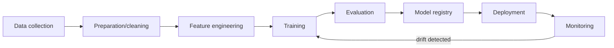
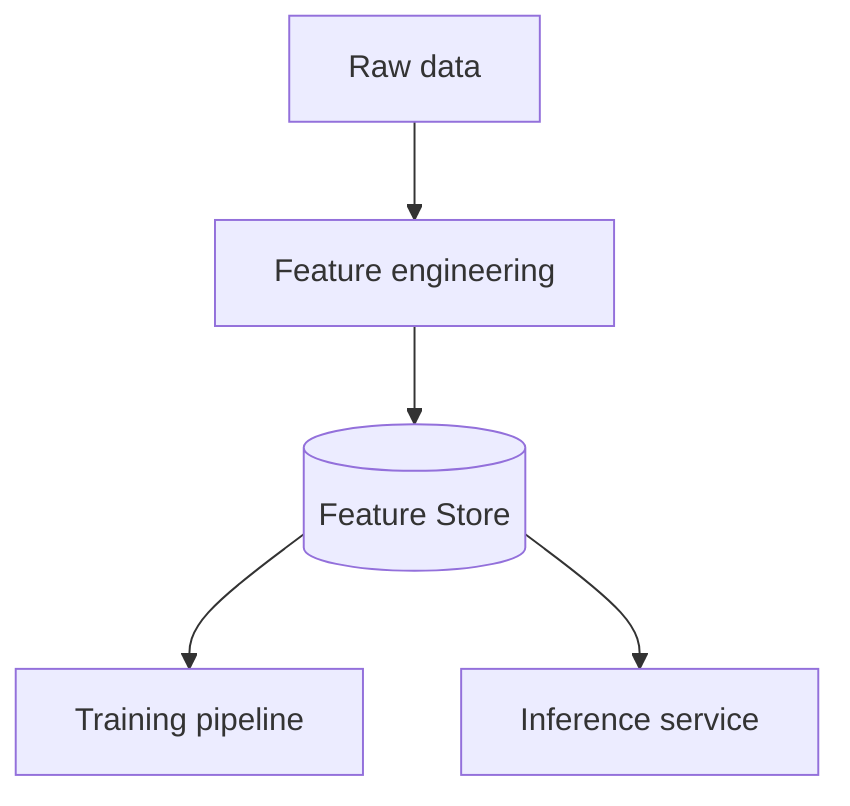

# Вопросы на собеседовании: `MLOps`

**MLOps** — DevOps для ML: experiment tracking, model versioning, deployment, monitoring, retraining. Критично для production ML/AI. С 2024 — **LLMOps** как подвид (специфично для LLM apps). Стек: MLflow, Weights & Biases, Feast, Kubeflow, Seldon, BentoML.

## Полезные ссылки

### Официальная документация и авторитетные источники

- [MLflow Documentation](https://mlflow.org/docs/latest/index.html)
- [Weights & Biases Documentation](https://docs.wandb.ai/)
- [Feast Documentation](https://docs.feast.dev/)
- [Tecton Documentation](https://docs.tecton.ai/)
- [Kubeflow Documentation](https://www.kubeflow.org/docs/)
- [BentoML Documentation](https://docs.bentoml.com/)
- [MLOps Community](https://mlops.community/)
- [Made With ML](https://madewithml.com/)

## Содержание

- [Полезные ссылки](#полезные-ссылки)
- [See also](#see-also)

**Базовые понятия**
- [Q1. (!) Что такое MLOps?](#q1--что-такое-mlops)
- [Q2. (!) ML lifecycle?](#q2--ml-lifecycle)
- [Q3. (!) DevOps vs MLOps — отличия?](#q3--devops-vs-mlops--отличия)

**Experiment tracking**
- [Q4. (!) Что такое experiment tracking?](#q4--что-такое-experiment-tracking)
- [Q5. (!) MLflow — основной инструмент?](#q5--mlflow--основной-инструмент)
- [Q6. Weights & Biases (W&B)?](#q6-weights--biases-wb)

**Data и features**
- [Q7. (!) Что такое feature store?](#q7--что-такое-feature-store)
- [Q8. (!) Online vs offline features?](#q8--online-vs-offline-features)
- [Q9. Feast vs Tecton?](#q9-feast-vs-tecton)
- [Q10. Training-serving skew?](#q10-training-serving-skew)

**Model registry**
- [Q11. (!) Model registry — для чего?](#q11--model-registry--для-чего)
- [Q12. Model versioning — стратегии?](#q12-model-versioning--стратегии)

**Deployment**
- [Q13. (!) Batch vs online inference?](#q13--batch-vs-online-inference)
- [Q14. (!) A/B testing моделей?](#q14--ab-testing-моделей)
- [Q15. Shadow deployment?](#q15-shadow-deployment)
- [Q16. Canary deployment?](#q16-canary-deployment)

**Monitoring**
- [Q17. (!) Что мониторить в production ML?](#q17--что-мониторить-в-production-ml)
- [Q18. (!) Data drift?](#q18--data-drift)
- [Q19. (!) Concept drift?](#q19--concept-drift)
- [Q20. Tools для monitoring (Evidently, Arize, WhyLabs)?](#q20-tools-для-monitoring-evidently-arize-whylabs)

**CI/CD для ML**
- [Q21. (!) Что такое CI/CD для ML?](#q21--что-такое-cicd-для-ml)
- [Q22. Continuous Training?](#q22-continuous-training)

**LLMOps**
- [Q23. (!) Что такое LLMOps?](#q23--что-такое-llmops)
- [Q24. Отличия LLMOps от классического MLOps?](#q24-отличия-llmops-от-классического-mlops)
- [Q25. (!) Prompt versioning?](#q25--prompt-versioning)
- [Q26. LLM evaluation в production?](#q26-llm-evaluation-в-production)

**Production maturity**
- [Q27. (!) Уровни MLOps maturity?](#q27--уровни-mlops-maturity)
- [Q28. Какие частые проблемы в MLOps?](#q28-какие-частые-проблемы-в-mlops)

## Q1. (!) Что такое MLOps?

**MLOps (Machine Learning Operations)** — практики **управления жизненным циклом** ML/AI-систем в production:
- Версионирование (данные, код, модели)
- Трекинг экспериментов (experiment tracking)
- Воспроизводимость
- Автоматизация деплоя
- Мониторинг (drift, производительность)
- Переобучение (retraining)
- Governance, соответствие требованиям (compliance)

**Цель:** ML-системы как **надёжное ПО**, а не как одноразовые артефакты.

**Дисциплина появилась** с осознанием того, что 80% ML-моделей **никогда не доходят до production** или быстро деградируют.


## Q2. (!) ML lifecycle?



**Этапы:**
1. **Data collection** — источники, ETL
2. **Data preparation** — очистка, валидация
3. **Feature engineering** — преобразование, кодирование
4. **Training** — обучение модели
5. **Evaluation** — метрики на test set
6. **Model registry** — версионирование
7. **Deployment** — выкат в production
8. **Monitoring** — drift, производительность
9. **Retraining** — на новых данных

MLOps оркестрирует автоматизацию каждого этапа.


## Q3. (!) DevOps vs MLOps — отличия?

| Критерий | DevOps | MLOps |
|----------|--------|-------|
| Артефакт | Код | Код + данные + модель |
| Версионирование | Git | Git + DVC + Model Registry |
| Тестирование | Unit, integration | Валидация данных, метрики модели |
| Воспроизводимость | Зависимости + код | + снапшот данных + random seed |
| Мониторинг | Здоровье приложения, ошибки | + drift, деградация accuracy |
| Деплой | Один артефакт | Модель + features + препроцессинг |
| Переобучение | — | Периодическое / по триггеру |
| Жизненный цикл | Линейный | Циклический (retrain) |

**Ключевая разница:** ML-модели **деградируют** со временем (данные меняются). DevOps-приложение работает **стабильно**, пока его не сломают.


## Q4. (!) Что такое experiment tracking?

Каждый прогон обучения (training run) = эксперимент с **разными гиперпараметрами, данными, архитектурами модели**. Трекинг сохраняет:

- **Параметры** (learning rate, batch size, ...)
- **Метрики** (accuracy, F1, кривые loss)
- **Артефакты** (веса модели, графики)
- **Версию кода** (git commit)
- **Версию данных** (DVC, hash)
- **Окружение** (Python-зависимости, тип GPU)

**Зачем:**
- **Воспроизводимость** — повторить эксперимент при необходимости
- **Сравнение** — какой прогон лучший?
- **Совместная работа** — поделиться результатами с командой
- **Аудит** — что использовали для production-модели?


## Q5. (!) MLflow — основной инструмент?

**MLflow** (open-source, Databricks) — самый популярный инструмент для experiment tracking + model registry.

```python
import mlflow

with mlflow.start_run():
    mlflow.log_param("lr", 0.01)
    mlflow.log_metric("accuracy", 0.95)
    mlflow.log_artifact("model.pkl")
    mlflow.sklearn.log_model(model, "model")

# UI на http://localhost:5000
```

**Компоненты:**
- **Tracking** — эксперименты, прогоны, метрики
- **Model Registry** — версионированные модели, стадии (Staging/Production)
- **Projects** — упакованный ML-код
- **Models** — форматы для деплоя (Spark, Sagemaker, ...)

**Self-hosted** или managed (Databricks).


## Q6. Weights & Biases (W&B)?

**Weights & Biases** — проприетарный SaaS с фокусом на **experiment tracking**.

```python
import wandb

wandb.init(project="my-project", config={"lr": 0.01})
for epoch in range(10):
    loss = train_step()
    wandb.log({"loss": loss, "epoch": epoch})
```

**Преимущества над MLflow:**
- Отличный UI
- Богатые визуализации
- Sweeps (подбор гиперпараметров)
- Reports / совместная работа
- Artifacts с lineage

**Минусы:**
- Не open-source (есть free tier)
- Vendor lock-in

В **академии / research** — W&B доминирует. В **enterprise** — MLflow часто чуть популярнее (open-source + Databricks).


## Q7. (!) Что такое feature store?

**Feature store** — централизованное хранилище **features** (признаков) для ML.



**Решает проблемы:**
- **Training-serving skew** — единые определения features для training и inference
- **Переиспользование** — несколько моделей используют одни и те же features
- **Обнаруживаемость** — каталог features
- **Мониторинг** — обнаружение дрейфа features (feature drift)

**Инструменты:** Feast (open-source), Tecton (managed), Hopsworks, Vertex AI Feature Store, SageMaker Feature Store.


## Q8. (!) Online vs offline features?

**Offline features** — для training:
- Большой объём, batch-вычисления
- Сложные агрегации (сумма за 30 дней, ...)
- Хранилище: S3, BigQuery, Hive
- Задержка чтения: секунды

**Online features** — для realtime inference:
- Задержка чтения < 100ms
- Хранилище: Redis, DynamoDB, Cassandra
- Предрасчёт offline → загрузка в online-хранилище

**Feature store** управляет **синхронизацией** offline ↔ online (часто через запланированные jobs).


## Q9. Feast vs Tecton?

| Критерий | Feast | Tecton |
|-----------|-------|--------|
| Лицензия | Open-source | Проприетарная |
| Хостинг | Self-host | Managed SaaS |
| Online store | Redis, DynamoDB | Встроенный |
| Streaming features | Ограниченно | Да (Spark, Flink) |
| Стоимость | Бесплатно + инфра | $$$ |
| Зрелость | Растёт | Production-grade |

**Feast** — для стартапов / небольших команд.
**Tecton** — для enterprise (основана командой ex-Uber Michelangelo).


## Q10. Training-serving skew?

**Training-serving skew** — features при обучении вычисляются иначе, чем при production-inference.

**Пример:**
- Training: `avg_purchase_30d` посчитано из исторических данных
- Inference: реальный `avg_purchase_30d` другой (другой SQL-запрос, свежие данные, другое временное окно)

**Эффект:** модель работает **отлично на test** и **плохо на production**.

**Решение:**
- **Feature store** — единое определение
- **Извлечение тренировочных данных точно так же, как при inference**
- **Мониторинг** — отслеживать различия в распределениях


## Q11. (!) Model registry — для чего?

**Model registry** — БД моделей с версионированием, стадиями (stages) и метаданными.

```python
mlflow.register_model("runs:/abc123/model", "fraud_detector")
client.transition_model_version_stage(
    name="fraud_detector",
    version=3,
    stage="Production"
)
```

**Стадии (stages):**
- **None** — только что зарегистрирована
- **Staging** — тестируется
- **Production** — используется inference-сервисом
- **Archived** — старая версия

**Зачем:**
- **Lineage** — откуда взялась модель (данные, код)
- **Promotion** — staging → production через approval
- **Rollback** — быстрый откат к предыдущей версии
- **Несколько моделей в production** (A/B-тестирование)

**Инструменты:** MLflow Registry, W&B Artifacts, SageMaker Model Registry, Vertex AI Models.


## Q12. Model versioning — стратегии?

**Подходы:**

1. **Семантическое версионирование** (`1.2.3`) — major/minor/patch
2. **Git commit hash** — модель привязана к версии кода
3. **По дате** (`2025-04-19`) — для часто обновляемых
4. **Авто-инкремент** (`v1`, `v2`, ...) — дефолт в MLflow

**Best practice:** комбинировать — `model_v3_abc123_20250419`.


## Q13. (!) Batch vs online inference?

| Критерий | Batch | Online |
|----------|-------|--------|
| Триггер | По расписанию (раз в день/час) | На каждый запрос |
| Задержка | Минуты-часы | < 100ms |
| Пропускная способность | Очень высокая | Зависит от нагрузки |
| Сценарий | Предрасчёт рекомендаций, churn scoring | Fraud detection, поиск, чатбот |
| Инфраструктура | Spark, Airflow | API-сервис (FastAPI, Triton) |
| Стоимость | Низкая на одно предсказание | Выше (постоянно работает) |

**Гибрид:** часть предсказаний рассчитывается заранее (batch) и кэшируется → быстрый online-lookup.


## Q14. (!) A/B testing моделей?

**A/B-тестирование:** % трафика → модель A, % → модель B, сравниваем метрики.

```python
def predict(user_id, features):
    model_choice = "B" if hash(user_id) % 100 < 10 else "A"  # 10% B
    if model_choice == "B":
        prediction = model_b.predict(features)
    else:
        prediction = model_a.predict(features)
    log_prediction(user_id, model_choice, prediction)
    return prediction
```

**Метрики для сравнения:**
- **Онлайн-метрики** — CTR, conversion rate, выручка
- **Latency, error rate**
- **Удовлетворённость пользователей**

**Сложнее, чем кажется:** статистическая значимость, novelty-эффекты, holdout-группы.


## Q15. Shadow deployment?

**Shadow:** новая модель **видит production-трафик**, но её **предсказания не используются**. Сравниваем с production-моделью offline.

```python
def predict(features):
    prediction = production_model.predict(features)
    # Shadow — predict but don't use
    shadow_prediction = new_model.predict(features)
    log_comparison(prediction, shadow_prediction)
    return prediction  # production prediction
```

**Зачем:** проверить новую модель на реальном трафике без риска. Перед настоящим A/B-тестом.


## Q16. Canary deployment?

Постепенно увеличиваем % трафика на новую модель:

```
Day 1: 1% to new model
Day 2: 5%
Day 3: 25%
Day 4: 50%
Day 5: 100%
```

При обнаружении проблем (error rate, drift) — откат (rollback).

Аналог DevOps canary deployment, но с ML-метриками.


## Q17. (!) Что мониторить в production ML?

**Операционное:**
- Latency (p50, p99)
- Throughput, RPS
- Error rate
- Утилизация CPU/memory/GPU

**Специфичное для ML:**
- **Распределение предсказаний** — есть ли drift?
- **Распределение входных features** — есть ли drift?
- **Accuracy модели** (если есть ground truth)
- **Feature importance** — изменилась ли?
- **Распределение уверенности предсказаний** (prediction confidence)
- **Бизнес-метрики** — конверсия, влияние на выручку

**Алерты:**
- Latency > 200ms
- Error rate > 1%
- Drift score > порога
- Падение accuracy > 5%


## Q18. (!) Data drift?

**Data drift** — распределение **входных features** меняется со временем.

```
Training time: avg user_age = 35
Production:    avg user_age = 28 (younger users)
```

**Виды:**
- **Covariate shift** — распределение X меняется, P(Y|X) тот же
- **Label shift** — меняется P(Y)
- **Concept drift** — меняется P(Y|X) (см. Q19)

**Обнаружение:**
- **KL divergence** между распределениями training и production
- **PSI (Population Stability Index)**
- **KS-тест** для числовых features
- **Chi-square** для категориальных

**Инструменты:** Evidently AI, NannyML, Arize, WhyLabs.


## Q19. (!) Concept drift?

**Concept drift** — связь X → Y меняется. Те же features → другой label.

**Пример:** обнаружение спама — спам эволюционирует, успешные тактики меняются.

**Виды:**
- **Sudden** — резкий (грянул COVID, изменились цены)
- **Gradual** — постепенный (предпочтения потребителей)
- **Recurring** — сезонный (зимой ↔ летом)

**Обнаружение:** деградация accuracy модели (если есть ground-truth-метки).

**Смягчение:** **непрерывное переобучение** (continuous retraining) на новых данных.


## Q20. Tools для monitoring (Evidently, Arize, WhyLabs)?

**Evidently AI** (open-source):
- Data drift, target drift
- Отчёты, дашборды
- Простая интеграция

**Arize AI** (SaaS):
- ML observability
- Drift, производительность, fairness
- Инструменты LLM observability

**WhyLabs** (SaaS):
- Open-source-библиотека whylogs
- Статистическое профилирование
- Обнаружение аномалий

**Своё решение:** метрики Prometheus + дашборды Grafana для простых случаев.


## Q21. (!) Что такое CI/CD для ML?

**CI (Continuous Integration):**
- Тесты на каждый PR
- Тесты валидации данных
- Unit-тесты модели (нет NaN, предсказания в допустимом диапазоне)
- Интеграционные тесты

**CD (Continuous Deployment):**
- Авто-деплой после merge
- Canary deployment
- Авто-откат при регрессиях

**Также:**
- **CT (Continuous Training)** — авто-переобучение на новых данных
- **CM (Continuous Monitoring)** — постоянное наблюдение за производительностью

```yaml
# Пример CI/CD для ML pipeline
stages:
  - data_validation
  - feature_engineering
  - train
  - eval
  - register_model
  - deploy_canary
  - monitor
```


## Q22. Continuous Training?

**CT (Continuous Training):** автоматический pipeline переобучения по:
- **Расписанию** (каждую неделю)
- **Триггеру обнаружения drift**
- **Деградации производительности**
- **Появлению новых данных**

```python
# Airflow DAG
@dag(schedule_interval="@weekly")
def retrain_pipeline():
    new_data = extract_new_data()
    trained_model = train(new_data)
    metrics = evaluate(trained_model, holdout)
    if metrics["accuracy"] > production_metrics["accuracy"]:
        register_and_deploy(trained_model)
    else:
        notify_team("Model didn't improve")
```

**Подвох:** переобучение может **ухудшить** модель (плохие новые данные, label drift). Авто-деплой только если метрики улучшаются.


## Q23. (!) Что такое LLMOps?

**LLMOps** — MLOps **для LLM-приложений**. Подкласс со своей спецификой.

**Особенности vs классический MLOps:**
- Не обучаем модели (используем сторонние API или fine-tuned)
- Главный артефакт = **промпты** (версионируются как код)
- Оценка (evaluation) сложнее (нет чёткого ground truth)
- Критичен мониторинг стоимости (оплата за токены)
- Latency и streaming
- Обнаружение галлюцинаций

**Стек LLMOps:**
- **Управление промптами** (LangSmith, Langfuse, PromptLayer)
- **Трассировка** (OpenTelemetry, LangSmith)
- **Учёт затрат** (Helicone, Portkey)
- **Оценка** (Ragas, TruLens, своё решение)
- **Безопасность** (Moderation API, кастомные guard-ы)


## Q24. Отличия LLMOps от классического MLOps?

| Аспект | Классический MLOps | LLMOps |
|--------|----------------|--------|
| Главный артефакт | Обученная модель | Промпты + LLM API |
| Обучение | Часы-дни | Часто отсутствует (используем API) |
| Версионирование | Веса модели | Промпты + версия модели |
| Оценка | Accuracy, F1 | Faithfulness, helpfulness (субъективно) |
| Дрейф | Data drift | Регрессии промптов, обновления модели |
| Деплой | Сервер модели | Обновление шаблона промпта |
| Стоимость | Вычисления (GPU) | API, оплата за токены |
| Мониторинг | Предсказания, latency | + расход токенов, стоимость, галлюцинации |
| Безопасность | Приватность данных | + Prompt injection |


## Q25. (!) Prompt versioning?

```python
# Prompt registry (LangSmith, Langfuse, custom DB)
prompt_v3 = """
You are a customer support agent...
Answer in Russian only.
Be polite.

Question: {question}
"""

# Use specific version
prompt = registry.get("customer_support", version="v3")
response = llm(prompt.format(question=question))
```

**Зачем:**
- **Отслеживание изменений** — какая версия и когда использовалась?
- **A/B-тестирование** — сравнить v3 vs v4
- **Rollback** — старая версия, если новая сломалась
- **Аудит** — compliance

Промпты = код. Версионировать в Git или в специализированных инструментах.


## Q26. LLM evaluation в production?

**Метрики:**

1. **Обратная связь пользователей** — thumbs up/down
2. **Завершение задачи** — пользователь решил проблему?
3. **LLM-as-judge** — другая LLM оценивает качество по rubric
4. **Faithfulness (для RAG)** — все ли факты в ответе взяты из retrieved-документов?
5. **Latency, стоимость** на запрос
6. **Refusal rate** — как часто модель отказывает?
7. **Безопасность** — обнаружены ли токсичные ответы?

**Непрерывная оценка:**
- Сэмплировать 1% production-запросов в **golden dataset**
- Еженедельно прогонять оценку против бенчмарков
- Алертить при регрессиях

**Инструменты:** Phoenix Arize, Langfuse, Helicone, своё решение.


## Q27. (!) Уровни MLOps maturity?

**Модель зрелости Google ML:**

**Level 0 — Ручной:**
- Ручное обучение, ручной деплой
- Разовые модели
- Нет трекинга

**Level 1 — Автоматизация ML-пайплайна:**
- Автоматизированный pipeline обучения
- Непрерывное обучение по триггерам
- Model registry

**Level 2 — Полная автоматизация:**
- Автоматизированный CI/CD
- Непрерывный мониторинг
- Автоматическое переобучение + деплой
- Feature store
- Обнаружение drift

**Большинство компаний — Level 0-1**. Level 2 — крупные tech-компании (Uber, Netflix, FAANG).

В **2025** большинство стартапов — Level 1 для критичного ML, Level 0 для экспериментов.


## Q28. Какие частые проблемы в MLOps?

1. **Воспроизводимость** — могу ли повторить эксперимент? (часто нет)
2. **Training-serving skew** — разные определения features
3. **Data drift не обнаружен** — модель деградирует незаметно
4. **Ручной деплой** — медленно, чревато ошибками
5. **Нет model lineage** — откуда взялась эта модель в production?
6. **Сложный rollback** — трудно откатиться назад
7. **Расходы вне контроля** — запущено много моделей, никто не следит за затратами
8. **Устаревшие данные** — features посчитаны месяцы назад
9. **Технический долг** — Jupyter-ноутбуки в production
10. **ML-команда изолирована** — нет интеграции с product engineering

**Зрелость MLOps** — это путь, а не пункт назначения. Постоянное улучшение.


---

## See also

- [LLM Basics](llm-basics-interview.md) — основа для LLMOps
- [LLM Integration Patterns](llm-integration-patterns-interview.md) — production patterns
- [Model Serving](model-serving-interview.md) — deployment
- [RAG](rag-interview.md) — operationalization RAG
- [AI Agents](ai-agents-interview.md) — operations
- [Airflow](../data-engineering/apache-airflow-interview.md) — orchestration ML pipelines
- [Spark](../data-engineering/apache-spark-interview.md) — для feature engineering
- [Data Warehousing](../data-engineering/data-warehousing-interview.md) — feature storage
- [Observability](../monitoring/observability-interview.md) — monitoring
- [Pipeline Design](../cicd/pipeline-design-interview.md) — CI/CD
- [Микросервисы](../architecture/microservices-interview.md) — где models live
- [Git](../devops/git-interview.md) — version control
