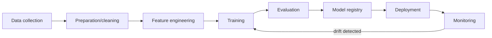
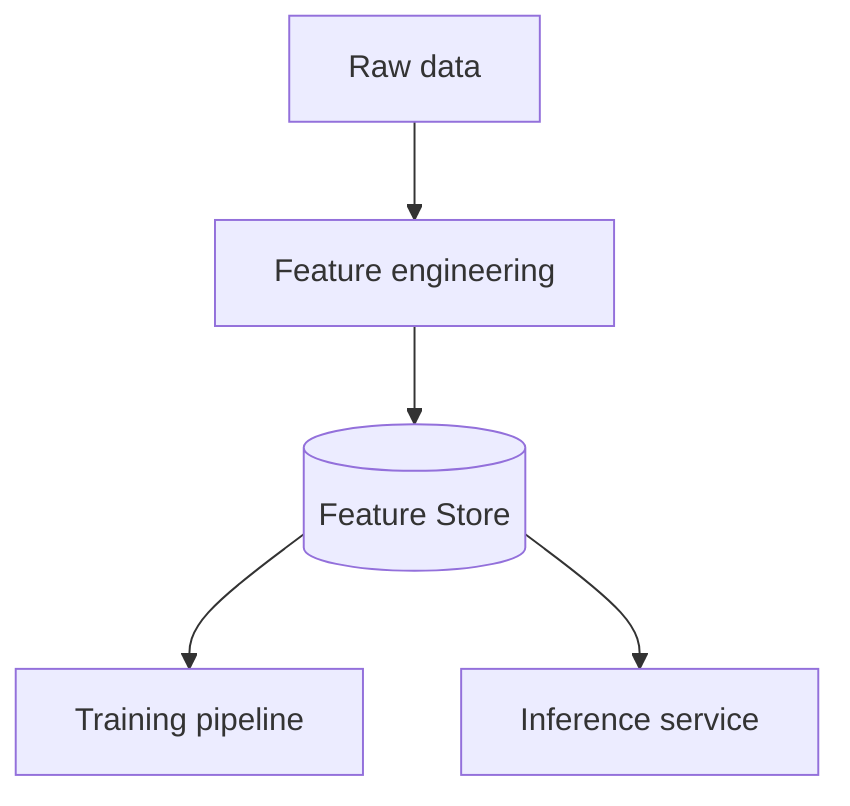

# Вопросы на собеседовании: `MLOps`

**MLOps** — DevOps для ML: experiment tracking, model versioning, deployment, monitoring, retraining. Критично для production ML/AI. С 2024 — **LLMOps** как подвид (специфично для LLM apps). Стек: MLflow, Weights & Biases, Feast, Kubeflow, Seldon, BentoML.

## Полезные ссылки

### Официальная документация и авторитетные источники

- [MLflow Documentation](https://mlflow.org/docs/latest/index.html)
- [Weights & Biases Documentation](https://docs.wandb.ai/)
- [Feast Documentation](https://docs.feast.dev/)
- [Tecton Documentation](https://docs.tecton.ai/)
- [Kubeflow Documentation](https://www.kubeflow.org/docs/)
- [BentoML Documentation](https://docs.bentoml.com/)
- [MLOps Community](https://mlops.community/)
- [Made With ML](https://madewithml.com/)

## Содержание

- [Полезные ссылки](#полезные-ссылки)
- [See also](#see-also)

**Базовые понятия**
- [Q1. (!) Что такое MLOps?](#q1--что-такое-mlops)
- [Q2. (!) ML lifecycle?](#q2--ml-lifecycle)
- [Q3. (!) DevOps vs MLOps — отличия?](#q3--devops-vs-mlops--отличия)

**Experiment tracking**
- [Q4. (!) Что такое experiment tracking?](#q4--что-такое-experiment-tracking)
- [Q5. (!) MLflow — основной инструмент?](#q5--mlflow--основной-инструмент)
- [Q6. Weights & Biases (W&B)?](#q6-weights--biases-wb)

**Data и features**
- [Q7. (!) Что такое feature store?](#q7--что-такое-feature-store)
- [Q8. (!) Online vs offline features?](#q8--online-vs-offline-features)
- [Q9. Feast vs Tecton?](#q9-feast-vs-tecton)
- [Q10. Training-serving skew?](#q10-training-serving-skew)

**Model registry**
- [Q11. (!) Model registry — для чего?](#q11--model-registry--для-чего)
- [Q12. Model versioning — стратегии?](#q12-model-versioning--стратегии)

**Deployment**
- [Q13. (!) Batch vs online inference?](#q13--batch-vs-online-inference)
- [Q14. (!) A/B testing моделей?](#q14--ab-testing-моделей)
- [Q15. Shadow deployment?](#q15-shadow-deployment)
- [Q16. Canary deployment?](#q16-canary-deployment)

**Monitoring**
- [Q17. (!) Что мониторить в production ML?](#q17--что-мониторить-в-production-ml)
- [Q18. (!) Data drift?](#q18--data-drift)
- [Q19. (!) Concept drift?](#q19--concept-drift)
- [Q20. Tools для monitoring (Evidently, Arize, WhyLabs)?](#q20-tools-для-monitoring-evidently-arize-whylabs)

**CI/CD для ML**
- [Q21. (!) Что такое CI/CD для ML?](#q21--что-такое-cicd-для-ml)
- [Q22. Continuous Training?](#q22-continuous-training)

**LLMOps**
- [Q23. (!) Что такое LLMOps?](#q23--что-такое-llmops)
- [Q24. Отличия LLMOps от классического MLOps?](#q24-отличия-llmops-от-классического-mlops)
- [Q25. (!) Prompt versioning?](#q25--prompt-versioning)
- [Q26. LLM evaluation в production?](#q26-llm-evaluation-в-production)

**Production maturity**
- [Q27. (!) Уровни MLOps maturity?](#q27--уровни-mlops-maturity)
- [Q28. Какие частые проблемы в MLOps?](#q28-какие-частые-проблемы-в-mlops)

## Q1. (!) Что такое MLOps?

**MLOps (Machine Learning Operations)** — practices для **lifecycle management** ML/AI систем в production:
- Versioning (data, code, models)
- Experiment tracking
- Reproducibility
- Deployment automation
- Monitoring (drift, performance)
- Retraining
- Governance, compliance

**Цель:** ML системы как **reliable software**, не как одноразовые artifacts.

**Discipline появилась** с осознанием, что 80% ML моделей **никогда не доходят до production** или быстро deteriorate.


> [!mcq]
> - [ ] Набор инструментов для ускорения обучения моделей на GPU кластерах | ❌ ПОСЛЕДСТВИЕ: фокус только на training speed игнорирует deployment, monitoring и retraining — модель деградирует в production без обнаружения
> - [x] Practices для lifecycle management ML систем: versioning data+code+model, experiment tracking, deployment automation, monitoring drift, retraining | ✓ ПРИМЕНЯТЬ: для любой ML системы в production 📋 ПРАВИЛО: MLOps = надёжное ПО, не одноразовый эксперимент 🔗 См. Q2
> - [ ] CI/CD pipeline для автоматического деплоя Jupyter notebooks | ❌ ПОСЛЕДСТВИЕ: деплой raw notebooks — источник воспроизводимости проблем, нет dependency management, нет model versioning
> - [ ] Методология для выбора алгоритмов машинного обучения под задачу | ❌ ПОСЛЕДСТВИЕ: выбор алгоритма — только один шаг lifecycle; без MLOps модель не воспроизводима, не мониторится и не переобучается при drift

## Q2. (!) ML lifecycle?



**Stages:**
1. **Data collection** — sources, ETL
2. **Data preparation** — cleaning, validation
3. **Feature engineering** — transformation, encoding
4. **Training** — model fit
5. **Evaluation** — metrics на test set
6. **Model registry** — версионирование
7. **Deployment** — в production
8. **Monitoring** — drift, performance
9. **Retraining** — на новых данных

MLOps овсенирует автоматизацию каждого этапа.


> [!mcq]
> - [ ] Линейный процесс: data → train → deploy; после деплоя модель не требует внимания | ❌ ПОСЛЕДСТВИЕ: без monitoring шага модель деградирует с data drift; без retraining → silent accuracy decay — пользователи получают wrong predictions без предупреждения
> - [ ] Цикл из трёх шагов: collect data → train → evaluate; deployment вне ML lifecycle | ❌ ПОСЛЕДСТВИЕ: deployment — часть lifecycle; без него нет production value; без monitoring после деплоя нет обнаружения concept drift
> - [ ] Итеративный процесс только в фазе feature engineering и training | ❌ ПОСЛЕДСТВИЕ: мониторинг и retraining — критичные feedback loops; без них модель переобучается на stale data и не адаптируется к изменениям real world
> - [x] Циклический процесс: data → features → train → eval → registry → deploy → monitor → retrain (при drift) | ✓ ПРИМЕНЯТЬ: visualize как continuous loop 📋 ПРАВИЛО: ML lifecycle = цикл, не линия; monitoring → retrain — обязательный feedback loop 🔗 См. Q17

## Q3. (!) DevOps vs MLOps — отличия?

| Критерий | DevOps | MLOps |
|----------|--------|-------|
| Артефакт | Код | Код + данные + model |
| Versioning | Git | Git + DVC + Model Registry |
| Testing | Unit, integration | Data validation, model perf |
| Reproducibility | Деpендencies + код | + data snapshot + random seed |
| Monitoring | App health, errors | + drift, accuracy decay |
| Deploy | Single artifact | Model + features + preprocessing |
| Retraining | — | Periodic / triggered |
| Lifecycle | Linear | Cyclic (retrain) |

**Ключевая разница:** ML модели **deteriorate** со временем (data меняется). DevOps app **стабильно** работает пока его не сломают.


> [!mcq]
> - [ ] DevOps и MLOps идентичны: оба про CI/CD и deployment automation | ❌ ПОСЛЕДСТВИЕ: применение стандартного DevOps к ML без drift monitoring → модель деградирует незаметно; нет versioning data → нет reproducibility экспериментов
> - [x] MLOps расширяет DevOps: добавляет versioning данных + модели, data validation, drift monitoring, cyclic retraining | ✓ ПРИМЕНЯТЬ: при внедрении ML в engineering организацию 📋 ПРАВИЛО: ML артефакт = код + данные + модель → каждый требует versioning 🔗 См. Q21
> - [ ] MLOps — более простое подмножество DevOps, фокусируется только на деплое | ❌ ПОСЛЕДСТВИЕ: MLOps сложнее DevOps из-за нестационарных данных — model accuracy decay требует continuous training, которого в DevOps нет
> - [ ] DevOps включает MLOps как частный случай: стандартных практик достаточно | ❌ ПОСЛЕДСТВИЕ: standard DevOps не имеет инструментов для data drift detection, experiment tracking с reproducibility и cyclic retraining — без этого production ML нежизнеспособен

## Q4. (!) Что такое experiment tracking?

Каждый ML training run = experiment с **разными hyperparameters, data, model architectures**. Tracking сохраняет:

- **Parameters** (learning rate, batch size, ...)
- **Metrics** (accuracy, F1, loss curves)
- **Artifacts** (model weights, plots)
- **Code version** (git commit)
- **Data version** (DVC, hash)
- **Environment** (Python deps, GPU type)

**Зачем:**
- **Reproducibility** — repeat experiment когда нужно
- **Comparison** — какой run лучший?
- **Collaboration** — share results с командой
- **Audit** — что использовали для production model?


> [!mcq]
> - [ ] Мониторинг model latency и throughput в production | ❌ ПОСЛЕДСТВИЕ: production мониторинг — это monitoring (Q17), не experiment tracking; смешение понятий → нет инструмента для воспроизведения результатов training экспериментов
> - [ ] Логирование всех SQL запросов к feature store во время обучения | ❌ ПОСЛЕДСТВИЕ: SQL логирование не фиксирует hyperparameters, metrics curves и random seed — нет возможности воспроизвести лучший run через месяц
> - [x] Запись параметров, метрик, артефактов, git commit и data version каждого training run для воспроизводимости и сравнения | ✓ ПРИМЕНЯТЬ: на каждый training run 📋 ПРАВИЛО: experiment tracking = reproducibility + comparison; без него нельзя объяснить откуда production модель 🔗 См. Q5
> - [ ] Версионирование только финальной production модели без промежуточных экспериментов | ❌ ПОСЛЕДСТВИЕ: без tracking всех runs нельзя вернуться к лучшему промежуточному результату; нет audit trail откуда production модель

## Q5. (!) MLflow — основной инструмент?

**MLflow** (open-source, Databricks) — самый популярный для experiment tracking + model registry.

```python
import mlflow

with mlflow.start_run():
    mlflow.log_param("lr", 0.01)
    mlflow.log_metric("accuracy", 0.95)
    mlflow.log_artifact("model.pkl")
    mlflow.sklearn.log_model(model, "model")

# UI на http://localhost:5000
```

**Components:**
- **Tracking** — experiments, runs, metrics
- **Model Registry** — versioned models, stages (Staging/Production)
- **Projects** — packaged ML code
- **Models** — formats для deployment (Spark, Sagemaker, ...)

**Self-hosted** или managed (Databricks).


> [!mcq]
> - [ ] MLflow — только для деплоя моделей на Kubernetes, не для tracking | ❌ ПОСЛЕДСТВИЕ: непонимание инструмента — MLflow tracking + registry это core; без tracking теряем experiment history и reproducibility
> - [x] MLflow — open-source платформа: tracking (params, metrics, artifacts) + model registry (stages: None→Staging→Production) + Projects + Models | ✓ ПРИМЕНЯТЬ: для self-hosted experiment tracking и model lifecycle 📋 ПРАВИЛО: MLflow = единая платформа от эксперимента до production 🔗 См. Q11
> - [ ] MLflow — аналог Jupyter Notebooks для интерактивного ML разработки | ❌ ПОСЛЕДСТВИЕ: Jupyter — инструмент разработки; MLflow — операционный инструмент lifecycle; путаница ведёт к notebook-в-production антипаттерну
> - [ ] MLflow поддерживает только scikit-learn модели через mlflow.sklearn | ❌ ПОСЛЕДСТВИЕ: MLflow поддерживает PyTorch, TensorFlow, XGBoost, Spark ML и custom flavors — ограничение неверное, выбор инструмента на основе этого предположения неправильный

## Q6. Weights & Biases (W&B)?

**Weights & Biases** — proprietary SaaS, focus на **experiment tracking**.

```python
import wandb

wandb.init(project="my-project", config={"lr": 0.01})
for epoch in range(10):
    loss = train_step()
    wandb.log({"loss": loss, "epoch": epoch})
```

**Преимущества над MLflow:**
- Отличный UI
- Богатые visualizations
- Sweeps (hyperparameter tuning)
- Reports / collaboration
- Artifacts с lineage

**Минусы:**
- Не open-source (есть free tier)
- Vendor lock-in

В **academia / research** — W&B доминирует. В **enterprise** — MLflow часто чуть популярнее (open-source + Databricks).


> [!mcq]
> - [ ] W&B — open-source альтернатива MLflow без vendor lock-in | ❌ ПОСЛЕДСТВИЕ: W&B proprietary SaaS — есть vendor lock-in и платные тарифы для enterprise; ошибочный выбор на основе неверного предположения
> - [x] W&B — SaaS с богатым UI, visualizations и Sweeps (hyperparameter tuning); лучше для research; MLflow — open-source, лучше для enterprise | ✓ ПРИМЕНЯТЬ: academia/research → W&B; enterprise self-hosted → MLflow 📋 ПРАВИЛО: W&B = опыт + vendor lock-in; MLflow = open-source + Databricks 🔗 См. Q5
> - [ ] W&B и MLflow идентичны по функционалу — выбор не имеет значения | ❌ ПОСЛЕДСТВИЕ: W&B имеет Sweeps (bayesian hyperparameter search) и богатые collaboration features, которых нет в базовом MLflow — важно для исследовательских команд
> - [ ] W&B подходит только для computer vision, MLflow — для NLP | ❌ ПОСЛЕДСТВИЕ: оба инструмента domain-agnostic; выбор по domain не обоснован — W&B используется во всех ML областях

## Q7. (!) Что такое feature store?

**Feature store** — централизованное хранилище **features** для ML.



**Решает проблемы:**
- **Training-serving skew** — same feature definitions для training и inference
- **Reuse** — несколько моделей используют те же features
- **Discoverability** — каталог features
- **Monitoring** — feature drift detection

**Tools:** Feast (open-source), Tecton (managed), Hopsworks, Vertex AI Feature Store, SageMaker Feature Store.


> [!mcq]
> - [ ] Database для хранения training datasets в parquet формате | ❌ ПОСЛЕДСТВИЕ: хранилище datasets не решает training-serving skew — inference сервис всё равно вычисляет features по-другому → silent model performance degradation
> - [ ] Message broker для streaming feature events между сервисами | ❌ ПОСЛЕДСТВИЕ: feature store ≠ streaming broker; без centralized feature definitions и point-in-time lookups нет гарантии одинакового feature computation в train и serve
> - [x] Централизованное хранилище feature definitions с offline store (для training) и online store (< 100ms для inference), устраняет training-serving skew | ✓ ПРИМЕНЯТЬ: при нескольких моделях или online inference 📋 ПРАВИЛО: feature store = единое определение feature для train и serve 🔗 См. Q8
> - [ ] Инструмент для автоматического feature engineering через AutoML | ❌ ПОСЛЕДСТВИЕ: AutoML — другая концепция; feature store не создаёт features, а хранит и обслуживает уже сконструированные с гарантией consistency

## Q8. (!) Online vs offline features?

**Offline features** — для training:
- Большой volume, batch computation
- Сложные aggregations (сумма за 30 дней, ...)
- Storage: S3, BigQuery, Hive
- Read latency: seconds

**Online features** — для realtime inference:
- Read latency < 100ms
- Storage: Redis, DynamoDB, Cassandra
- Pre-computed offline → loaded online

**Feature store** управляет **синхронизацией** offline ↔ online (often через scheduled jobs).


> [!mcq]
> - [ ] Online features вычисляются на лету при каждом inference запросе из raw данных | ❌ ПОСЛЕДСТВИЕ: вычисление агрегаций за 30 дней на лету при каждом запросе → latency > 1 сек для inference; не масштабируется при высоком трафике
> - [x] Offline (S3/BigQuery, seconds latency) для training; online (Redis/DynamoDB, < 100ms) для realtime inference; feature store синхронизирует их | ✓ ПРИМЕНЯТЬ: при realtime ML inference 📋 ПРАВИЛО: pre-compute offline → load online = fast inference без skew 🔗 См. Q10
> - [ ] Offline и online features — одно и то же; различие только в scheduling | ❌ ПОСЛЕДСТВИЕ: latency требования принципиально разные: S3 lookup = секунды, Redis lookup = миллисекунды; использование wrong store → inference SLA нарушен
> - [ ] Online features всегда вычисляются в streaming pipeline (Kafka + Flink) | ❌ ПОСЛЕДСТВИЕ: streaming — один из подходов, не единственный; pre-computed batch features в Redis дешевле и проще для большинства случаев

## Q9. Feast vs Tecton?

| Critterion | Feast | Tecton |
|-----------|-------|--------|
| License | Open-source | Proprietary |
| Hosting | Self-host | Managed SaaS |
| Online store | Redis, DynamoDB | Built-in |
| Streaming features | Limited | Yes (Spark, Flink) |
| Cost | Free + infra | $$$ |
| Maturity | Growing | Production-grade |

**Feast** — для startups / smaller teams.
**Tecton** — для enterprise (founded by ex-Uber Michelangelo team).


> [!mcq]
> - [ ] Feast и Tecton идентичны, выбор не имеет значения | ❌ ПОСЛЕДСТВИЕ: Tecton поддерживает streaming features через Spark/Flink — для realtime features это критично; Feast имеет ограниченный streaming support
> - [ ] Tecton лучше для startup из-за managed инфраструктуры | ❌ ПОСЛЕДСТВИЕ: Tecton — дорогой enterprise SaaS; startup с ограниченным бюджетом вынужден тратить значительные средства на feature store вместо core product
> - [x] Feast — open-source для startups; Tecton — managed enterprise SaaS с streaming (Spark/Flink), основан Uber Michelangelo командой | ✓ ПРИМЕНЯТЬ: startups → Feast; enterprise с streaming requirements → Tecton 📋 ПРАВИЛО: open-source = гибкость + самостоятельная поддержка; SaaS = надёжность + стоимость 🔗 См. Q7
> - [ ] Feast поддерживает только batch features; Tecton — только streaming | ❌ ПОСЛЕДСТВИЕ: Feast поддерживает и batch и ограниченный streaming; неверное разграничение ведёт к неправильному выбору инструмента

## Q10. Training-serving skew?

**Training-serving skew** — features в training computed по-разному vs в production inference.

**Пример:**
- Training: `avg_purchase_30d` посчитано из исторических данных
- Inference: реальный `avg_purchase_30d` другой (другая SQL query, fresh data, different time window)

**Эффект:** model работает **отлично на test**, **плохо на production**.

**Решение:**
- **Feature store** — single definition
- **Training data extraction точно как inference**
- **Monitoring** — track distribution differences


> [!mcq]
> - [ ] Training-serving skew — разница в accuracy между train и test set (overfitting) | ❌ ПОСЛЕДСТВИЕ: overfitting и training-serving skew — разные проблемы; неверная диагностика → неправильное решение (регуляризация вместо feature store)
> - [ ] Проблема решается только увеличением размера training dataset | ❌ ПОСЛЕДСТВИЕ: skew возникает из-за разных feature definitions, а не размера данных — больше данных с неправильными features не устраняет skew
> - [x] Расхождение между вычислением features в training и в production inference (разные SQL, time windows) → model отлично работает offline, плохо в production | ✓ ПРИМЕНЯТЬ: диагностировать при хорошем offline metric и плохом production 📋 ПРАВИЛО: единая feature definition через feature store = единственное решение 🔗 См. Q7
> - [ ] Training-serving skew исчезает сам после нескольких недель работы модели | ❌ ПОСЛЕДСТВИЕ: skew не самоустраняется — без изменения feature computation разница остаётся постоянной; модель продолжает давать wrong predictions

## Q11. (!) Model registry — для чего?

**Model registry** — БД моделей с версионированием, stages, metadata.

```python
mlflow.register_model("runs:/abc123/model", "fraud_detector")
client.transition_model_version_stage(
    name="fraud_detector",
    version=3,
    stage="Production"
)
```

**Stages:**
- **None** — just registered
- **Staging** — тестируется
- **Production** — used by inference service
- **Archived** — old version

**Зачем:**
- **Lineage** — откуда взялась модель (data, code)
- **Promotion** — staging → production через approval
- **Rollback** — quickly revert к previous version
- **Multiple models in production** (A/B testing)

**Tools:** MLflow Registry, W&B Artifacts, SageMaker Model Registry, Vertex AI Models.


> [!mcq]
> - [ ] Хранилище training данных с versioning по дате создания | ❌ ПОСЛЕДСТВИЕ: данные и модели — разные артефакты; без отдельного model registry нет lineage (какой код + данные → эта модель) и нет механизма staging → production promotion
> - [ ] Git репозиторий для хранения model weights как бинарных файлов | ❌ ПОСЛЕДСТВИЕ: Git LFS плохо масштабируется для model weights (GB+); нет concept of stages, нет metadata о training run, нет одного клика rollback
> - [x] Централизованная БД с версионированием моделей, stages (None→Staging→Production→Archived), lineage и механизмом одобрения перед production | ✓ ПРИМЕНЯТЬ: для всех production ML моделей 📋 ПРАВИЛО: registry = traceability + governance для ML моделей 🔗 См. Q12
> - [ ] Система для автоматического деплоя лучшей модели без человеческого контроля | ❌ ПОСЛЕДСТВИЕ: auto-deploy без staging approval — риск деплоя модели с незаметными regressions; human-in-the-loop для production transition обязателен

## Q12. Model versioning — стратегии?

**Approaches:**

1. **Semantic versioning** (`1.2.3`) — major/minor/patch
2. **Git commit hash** — модель привязана к code version
3. **Date-based** (`2025-04-19`) — для часто-обновляемых
4. **Auto-incremented** (`v1`, `v2`, ...) — MLflow default

**Best practice:** combine — `model_v3_abc123_20250419`.


> [!mcq]
> - [ ] Хранить только последнюю версию модели, предыдущие удалять | ❌ ПОСЛЕДСТВИЕ: без истории версий нет возможности rollback при регрессии; нет audit trail для compliance; нельзя сравнить с предыдущей production моделью
> - [x] Комбинированная схема: auto-increment version + git commit hash + дата (`v3_abc123_20250419`) — полная трассируемость | ✓ ПРИМЕНЯТЬ: для production ML моделей 📋 ПРАВИЛО: version = кто + что + когда → reproducibility и rollback 🔗 См. Q11
> - [ ] Только semantic versioning (major.minor.patch) как в software development | ❌ ПОСЛЕДСТВИЕ: semantic versioning не несёт информации о training data и git commit — нельзя воспроизвести модель v2.1.3 без дополнительного lookup
> - [ ] Называть модели по F1 score (например model_0.95) | ❌ ПОСЛЕДСТВИЕ: metrics в названии устаревают при пересчёте на новых данных; нет связи с кодом и данными; два запуска с одинаковым F1 неразличимы

## Q13. (!) Batch vs online inference?

| Критерий | Batch | Online |
|----------|-------|--------|
| Trigger | Scheduled (daily/hourly) | Per request |
| Latency | Минуты-часы | < 100ms |
| Throughput | Очень высокий | Зависит от load |
| Use case | Recommendations precompute, churn scoring | Fraud detection, search, chatbot |
| Infrastructure | Spark, Airflow | API service (FastAPI, Triton) |
| Cost | Низкий per prediction | Выше (always running) |

**Hybrid:** некоторые predictions precomputed batch + cached → fast online lookup.


> [!mcq]
> - [ ] Online inference всегда лучше batch — real-time выше ценится бизнесом | ❌ ПОСЛЕДСТВИЕ: batch inference в 10-100x дешевле для bulk predictions; churn scoring для 10M пользователей — online было бы дорого и не нужно в realtime
> - [ ] Batch inference подходит для fraud detection в real-time | ❌ ПОСЛЕДСТВИЕ: fraud detection требует < 100ms ответа прямо в момент транзакции; batch (минуты-часы) позволяет мошеннической транзакции пройти
> - [x] Batch (scheduled, minutes-hours, Spark) для precomputed predictions; online (per-request, < 100ms, API) для realtime; hybrid — precompute + cache | ✓ ПРИМЕНЯТЬ: по требованиям latency и стоимости 📋 ПРАВИЛО: realtime SLA → online; bulk scoring → batch 🔗 См. Q8
> - [ ] Batch inference нельзя применять для рекомендательных систем | ❌ ПОСЛЕДСТВИЕ: precomputed batch recommendations + Redis lookup — стандартный паттерн у Netflix, Amazon; персонализация не требует online inference для каждого пользователя

## Q14. (!) A/B testing моделей?

**A/B testing:** % traffic → model A, % → model B, compare metrics.

```python
def predict(user_id, features):
    model_choice = "B" if hash(user_id) % 100 < 10 else "A"  # 10% B
    if model_choice == "B":
        prediction = model_b.predict(features)
    else:
        prediction = model_a.predict(features)
    log_prediction(user_id, model_choice, prediction)
    return prediction
```

**Метрики для сравнения:**
- **Online metrics** — CTR, conversion rate, revenue
- **Latency, error rate**
- **User satisfaction**

**Сложнее, чем кажется:** статистическая значимость, novelty effects, holdout groups.


> [!mcq]
> - [ ] Деплоить новую модель сразу на 100% трафика и откатывать при проблемах | ❌ ПОСЛЕДСТВИЕ: 100% трафик на новую модель без baseline → невозможно отличить регрессию от внешних факторов; при плохой модели 100% пользователей пострадали до rollback
> - [ ] Сравнивать модели только по offline метрикам (accuracy на test set) | ❌ ПОСЛЕДСТВИЕ: offline accuracy не коррелирует с online business metrics; модель с accuracy 98% может снизить conversion rate — только live A/B покажет реальный impact
> - [x] Разделить трафик по user_id (детерминированно): 10% → model B, логировать predictions, сравнивать online metrics до статистической значимости | ✓ ПРИМЕНЯТЬ: для оценки новой production модели 📋 ПРАВИЛО: A/B test = контролируемый эксперимент в production с business metrics 🔗 См. Q15
> - [ ] Случайно перераспределять пользователей между моделями при каждом запросе | ❌ ПОСЛЕДСТВИЕ: один пользователь получает разные модели на разных запросах → novelty effect, нет consistency, невозможно мерить user-level impact

## Q15. Shadow deployment?

**Shadow:** new model **видит production traffic**, но **predictions не используются**. Сравниваем с production model offline.

```python
def predict(features):
    prediction = production_model.predict(features)
    # Shadow — predict but don't use
    shadow_prediction = new_model.predict(features)
    log_comparison(prediction, shadow_prediction)
    return prediction  # production prediction
```

**Зачем:** проверить new model на real traffic без risk. Перед actual A/B test.


> [!mcq]
> - [ ] Shadow deployment — это canary deployment на 1% трафика | ❌ ПОСЛЕДСТВИЕ: canary использует predictions новой модели для реальных пользователей; shadow — нет; path аварии разный
> - [ ] Использовать только offline evaluation на held-out dataset вместо shadow | ❌ ПОСЛЕДСТВИЕ: offline dataset не отражает production edge cases и data distribution shifts; shadow на real traffic выявляет производительность до риска для пользователей
> - [x] Новая модель получает production запросы, но её predictions не используются — только логируются для сравнения с production моделью | ✓ ПРИМЕНЯТЬ: перед A/B тестом для zero-risk validation 📋 ПРАВИЛО: shadow = реальный трафик без реального risk 🔗 См. Q14
> - [ ] Shadow deployment увеличивает latency ответа пользователю вдвое | ❌ ПОСЛЕДСТВИЕ: shadow inference выполняется параллельно/асинхронно или после ответа пользователю — latency пользователя не растёт при правильной имплементации

## Q16. Canary deployment?

Postepenно увеличиваем % traffic на new model:

```
Day 1: 1% to new model
Day 2: 5%
Day 3: 25%
Day 4: 50%
Day 5: 100%
```

При detecting issues (error rate, drift) — rollback.

Аналог DevOps canary deployment, но с ML metrics.


> [!mcq]
> - [ ] Деплоить сразу 50% трафика на новую модель для быстрой валидации | ❌ ПОСЛЕДСТВИЕ: при проблеме с новой моделью 50% пользователей получают degraded experience — canary начинается с 1-5% именно чтобы ограничить blast radius
> - [x] Постепенное увеличение % трафика (1%→5%→25%→50%→100%) с мониторингом ML метрик и автоматическим rollback при regressions | ✓ ПРИМЕНЯТЬ: для production model updates 📋 ПРАВИЛО: canary = ограниченный blast radius + early detection 🔗 См. Q14
> - [ ] Canary deployment — это A/B тест с фиксированным 50/50 разделением | ❌ ПОСЛЕДСТВИЕ: A/B тест — сравнение с равным разделением; canary — постепенное смещение к новой версии; цели разные: A/B = comparison, canary = safe rollout
> - [ ] Canary в ML не нужен, достаточно shadow deployment перед полным rollout | ❌ ПОСЛЕДСТВИЕ: shadow проверяет predictions без user impact — но не проверяет user behavior changes (CTR, conversion) которые видны только при реальном использовании predictions

## Q17. (!) Что мониторить в production ML?

**Operational:**
- Latency (p50, p99)
- Throughput, RPS
- Error rate
- CPU/memory/GPU utilization

**ML-specific:**
- **Predictions distribution** — drift?
- **Input features distribution** — drift?
- **Model accuracy** (если есть ground truth)
- **Feature importance** — изменилось ли?
- **Prediction confidence** distribution
- **Business metrics** — conversion, revenue impact

**Alerts:**
- Latency > 200ms
- Error rate > 1%
- Drift score > threshold
- Accuracy drop > 5%


> [!mcq]
> - [ ] Мониторить только operational метрики: CPU, memory, error rate | ❌ ПОСЛЕДСТВИЕ: infrastructure работает нормально, но model accuracy деградирует из-за data drift — без ML-specific metrics тихая деградация незаметна неделями
> - [x] Operational (latency, errors, CPU) + ML-specific (predictions distribution, input drift, accuracy decay, feature importance shift) | ✓ ПРИМЕНЯТЬ: для всех production ML сервисов 📋 ПРАВИЛО: ML monitoring = infra metrics + model health metrics, оба обязательны 🔗 См. Q18
> - [ ] Достаточно мониторить accuracy на offline test set раз в квартал | ❌ ПОСЛЕДСТВИЕ: offline accuracy не отражает production performance при data drift; quarterly цикл пропускает постепенную деградацию, которая за 3 месяца становится критической
> - [ ] Мониторить только business метрики (conversion rate, revenue) | ❌ ПОСЛЕДСТВИЕ: business метрики lagging indicators — ML degradation видна в predictions distribution и accuracy за недели до business impact; поздняя диагностика = бо́льшие потери

## Q18. (!) Data drift?

**Data drift** — distribution of **input features** меняется со временем.

```
Training time: avg user_age = 35
Production:    avg user_age = 28 (younger users)
```

**Виды:**
- **Covariate shift** — distribution X меняется, P(Y|X) тот же
- **Label shift** — P(Y) меняется
- **Concept drift** — P(Y|X) меняется (см. Q19)

**Detection:**
- **KL divergence** между training и production distributions
- **PSI (Population Stability Index)**
- **KS test** для numeric features
- **Chi-square** для categorical

**Tools:** Evidently AI, NannyML, Arize, WhyLabs.


> [!mcq]
> - [ ] Data drift — это когда training dataset содержит ошибки разметки | ❌ ПОСЛЕДСТВИЕ: labeling errors — проблема data quality, не drift; диагностика drift как labeling issue ведёт к ненужной relabeling вместо retraining на новых данных
> - [x] Смещение distribution входных features в production vs training; типы: covariate shift (X меняется), label shift (P(Y)), concept drift (P(Y|X)); detection: KS test, PSI, KL divergence | ✓ ПРИМЕНЯТЬ: алерт при PSI > 0.2 📋 ПРАВИЛО: data drift = input меняется → модель видит "незнакомые" данные 🔗 См. Q19
> - [ ] Data drift возникает только при смене hardware где запускается inference | ❌ ПОСЛЕДСТВИЕ: hardware изменение не меняет data distribution; реальный drift вызван изменением поведения пользователей, сезонностью, изменением бизнес-процессов
> - [ ] Data drift можно полностью предотвратить правильной нормализацией features | ❌ ПОСЛЕДСТВИЕ: нормализация — preprocessing шаг, не защита от drift; пользователи и мир меняются независимо от масштаба features

## Q19. (!) Concept drift?

**Concept drift** — relationship X → Y меняется. Та же features → разный label.

**Пример:** spam detection — спам evolves, successfu tactics changes.

**Виды:**
- **Sudden** — резкое (COVID hit, prices changed)
- **Gradual** — постепенное (consumer preferences)
- **Recurring** — seasonal (зимой ↔ летом)

**Detection:** model accuracy decay (если есть ground truth labels).

**Mitigation:** **continuous retraining** на новых данных.


> [!mcq]
> - [ ] Concept drift — то же самое что data drift, одна и та же проблема | ❌ ПОСЛЕДСТВИЕ: путаница в типах drift ведёт к неправильному решению: data drift решается feature store; concept drift требует retraining с новыми labeled данными
> - [ ] Concept drift обнаруживается по изменению distribution input features | ❌ ПОСЛЕДСТВИЕ: input features при concept drift могут оставаться стабильными — меняется только P(Y|X); обнаружение требует ground truth labels, не только входные данные
> - [x] Изменение отношения X→Y: те же входные признаки → другой правильный ответ (поведение спамеров эволюционирует); типы: sudden, gradual, recurring | ✓ ПРИМЕНЯТЬ: мониторить accuracy decay на labeled samples 📋 ПРАВИЛО: concept drift = retraining на новых данных, не ребалансировка features 🔗 См. Q22
> - [ ] Concept drift проблема только в NLP задачах с языковой эволюцией | ❌ ПОСЛЕДСТВИЕ: concept drift в fraud detection (новые схемы), медицине (новые патогены), финансах (изменение рынка) — domain-agnostic проблема

## Q20. Tools для monitoring (Evidently, Arize, WhyLabs)?

**Evidently AI** (open-source):
- Data drift, target drift
- Reports, dashboards
- Easy integration

**Arize AI** (SaaS):
- ML observability
- Drift, performance, fairness
- LLM observability tools

**WhyLabs** (SaaS):
- Open-source whylogs library
- Statistical profiling
- Anomaly detection

**Custom:** Prometheus metrics + Grafana dashboards для simple cases.


> [!mcq]
> - [ ] Все три инструмента идентичны; выбор не имеет значения | ❌ ПОСЛЕДСТВИЕ: Evidently open-source и self-hosted; Arize/WhyLabs SaaS с vendor lock-in и ценой; Evidently лучше для privacy-sensitive данных, нельзя отправлять в cloud
> - [x] Evidently — open-source, self-hosted; Arize — SaaS с LLM observability; WhyLabs — SaaS с whylogs library; custom Prometheus+Grafana для простых случаев | ✓ ПРИМЕНЯТЬ: privacy-sensitive → Evidently; enterprise LLM → Arize 📋 ПРАВИЛО: open-source = контроль данных; SaaS = богатый функционал 🔗 См. Q17
> - [ ] Grafana+Prometheus полностью заменяют специализированные ML monitoring инструменты | ❌ ПОСЛЕДСТВИЕ: Prometheus не имеет встроенных statistical tests для drift detection (KS, PSI) — нужно писать custom exporters; Evidently делает это out-of-the-box
> - [ ] Эти инструменты только для LLM мониторинга, не для classical ML | ❌ ПОСЛЕДСТВИЕ: Evidently создан именно для classical ML (tabular data drift); Arize позже добавил LLM поддержку — обратное утверждение неверно

## Q21. (!) Что такое CI/CD для ML?

**CI (Continuous Integration):**
- Тесты на каждый PR
- Data validation tests
- Model unit tests (no NaNs, predictions in range)
- Integration tests

**CD (Continuous Deployment):**
- Auto deploy после merge
- Canary deployment
- Auto rollback при regressions

**Также:**
- **CT (Continuous Training)** — auto retrain на новых data
- **CM (Continuous Monitoring)** — постоянный watch performance

```yaml
# Пример CI/CD для ML pipeline
stages:
  - data_validation
  - feature_engineering
  - train
  - eval
  - register_model
  - deploy_canary
  - monitor
```


> [!mcq]
> - [ ] CI/CD для ML — то же самое что в software: lint + unit tests + deploy | ❌ ПОСЛЕДСТВИЕ: стандартный software CI не включает data validation и model performance tests — ML специфичные failures (NaN predictions, accuracy regression) не обнаруживаются
> - [x] Расширенный CI/CD: CI = data validation + model unit tests; CD = canary deploy + auto rollback; плюс CT (continuous training) и CM (continuous monitoring) | ✓ ПРИМЕНЯТЬ: при автоматизации ML pipeline 📋 ПРАВИЛО: ML CI/CD = software CI/CD + data + model качество 🔗 См. Q22
> - [ ] CD для ML означает автоматический деплой любой модели с accuracy > 0.8 | ❌ ПОСЛЕДСТВИЕ: threshold на absolute accuracy недостаточен — новая модель должна быть лучше текущей production; 0.8 < production 0.85 → регрессия
> - [ ] Continuous Training — это то же самое что Continuous Deployment | ❌ ПОСЛЕДСТВИЕ: CT = автоматическое переобучение при drift; CD = деплой уже обученной модели; смешение понятий → неверно выстроенный pipeline

## Q22. Continuous Training?

**CT (Continuous Training):** автоматическая retrain pipeline на:
- **Schedule** (each week)
- **Drift detection trigger**
- **Performance degradation**
- **New data availability**

```python
# Airflow DAG
@dag(schedule_interval="@weekly")
def retrain_pipeline():
    new_data = extract_new_data()
    trained_model = train(new_data)
    metrics = evaluate(trained_model, holdout)
    if metrics["accuracy"] > production_metrics["accuracy"]:
        register_and_deploy(trained_model)
    else:
        notify_team("Model didn't improve")
```

**Подвох:** retraining может **ухудшить** model (bad new data, label drift). Auto-deploy только если metrics improve.


> [!mcq]
> - [ ] Continuous Training — это обучение модели на всех новых данных без остановки | ❌ ПОСЛЕДСТВИЕ: online learning без validation gate → плохие данные (noise, mislabeled) немедленно деградируют модель в production
> - [ ] Retrain по schedule без проверки метрик перед деплоем | ❌ ПОСЛЕДСТВИЕ: новые данные могут быть хуже (label noise, skewed distribution) → scheduled retrain без gate может задеплоить худшую модель
> - [x] Автоматический retrain по триггеру (schedule/drift/degradation), deploy только если новая модель превышает production метрики | ✓ ПРИМЕНЯТЬ: для combat concept drift 📋 ПРАВИЛО: retrain + validation gate → только улучшение идёт в production 🔗 См. Q19
> - [ ] CT заменяет необходимость в experiment tracking — каждый run автоматически лучший | ❌ ПОСЛЕДСТВИЕ: CT не отменяет tracking — нужно логировать каждый CT run для audit trail; без tracking нельзя расследовать unexpected accuracy drop после автоматического retrain

## Q23. (!) Что такое LLMOps?

**LLMOps** — MLOps **для LLM приложений**. Подкласс с своей спецификой.

**Особенности vs classical MLOps:**
- Не обучаем модели (используем third-party APIs или fine-tuned)
- Главный artifact = **prompts** (версионируется как код)
- Evaluation сложнее (no clear ground truth)
- Cost monitoring critical (per-token pricing)
- Latency и streaming
- Hallucination detection

**Стек LLMOps:**
- **Prompt management** (LangSmith, Langfuse, PromptLayer)
- **Tracing** (OpenTelemetry, LangSmith)
- **Cost tracking** (Helicone, Portkey)
- **Evaluation** (Ragas, TruLens, custom)
- **Safety** (Moderation API, custom guards)


> [!mcq]
> - [ ] LLMOps полностью идентичен классическому MLOps, только с LLM вместо sklearn | ❌ ПОСЛЕДСТВИЕ: классический MLOps не имеет prompt versioning, token cost tracking и hallucination detection — применение без адаптации теряет ключевые operational concerns
> - [x] MLOps специализированный для LLM: prompt versioning как артефакт, cost-per-token monitoring, evaluation без чёткого ground truth, hallucination detection | ✓ ПРИМЕНЯТЬ: при operation LLM приложений в production 📋 ПРАВИЛО: в LLMOps prompt = model; cost monitoring = обязателен 🔗 См. Q24
> - [ ] LLMOps применим только к fine-tuned моделям, не к API-based | ❌ ПОСЛЕДСТВИЕ: большинство LLMOps практик (prompt versioning, cost tracking, evaluation) применимы к API-based моделям; исключение API-based систем оставляет их без governance
> - [ ] LLMOps не требует experiment tracking так как промпты не "обучаются" | ❌ ПОСЛЕДСТВИЕ: prompt A/B testing — эксперименты над промптами; без versioning и tracking нельзя откатить промпт-регрессию и нет audit trail

## Q24. Отличия LLMOps от классического MLOps?

| Аспект | Classical MLOps | LLMOps |
|--------|----------------|--------|
| Main artifact | Trained model | Prompts + LLM API |
| Training | Hours-days | Часто нет (use API) |
| Versioning | Model weights | Prompts + model version |
| Evaluation | Accuracy, F1 | Faithfulness, helpfulness (subjective) |
| Drift | Data drift | Prompt regressions, model updates |
| Deployment | Model server | Update prompt template |
| Cost | Compute (GPU) | API per-token |
| Monitoring | Predictions, latency | + token usage, cost, hallucinations |
| Security | Data privacy | + Prompt injection |


> [!mcq]
> - [ ] Главное отличие LLMOps — это использование GPU кластеров вместо CPU | ❌ ПОСЛЕДСТВИЕ: API-based LLM не требуют собственных GPU — выставляется invoice за tokens; hardware management не является отличием
> - [x] LLMOps: главный артефакт = промпт (не weights); evaluation субъективна; drift = prompt regressions; cost = per-token API; безопасность включает prompt injection | ✓ ПРИМЕНЯТЬ: при переходе от classical ML к LLM системам 📋 ПРАВИЛО: LLMOps = все традиционные concerns + prompt-specific concerns 🔗 См. Q25
> - [ ] В LLMOps нет понятия drift — LLM модели не деградируют | ❌ ПОСЛЕДСТВИЕ: провайдеры обновляют модели (GPT-4 → GPT-4o) что вызывает prompt regressions; поведение меняется при model updates без предупреждения
> - [ ] Evaluation в LLMOps проще так как LLM сам оценивает свои ответы | ❌ ПОСЛЕДСТВИЕ: self-evaluation LLM подвержена sycophancy и hallucinations; надёжная evaluation требует human labeling, reference datasets или отдельную judge-модель

## Q25. (!) Prompt versioning?

```python
# Prompt registry (LangSmith, Langfuse, custom DB)
prompt_v3 = """
You are a customer support agent...
Answer in Russian only.
Be polite.

Question: {question}
"""

# Use specific version
prompt = registry.get("customer_support", version="v3")
response = llm(prompt.format(question=question))
```

**Зачем:**
- **Track changes** — какая version использовалась когда?
- **A/B testing** — сравнить v3 vs v4
- **Rollback** — old version если new сломалось
- **Audit** — compliance

Prompts = код. Version в Git или dedicated tools.


> [!mcq]
> - [ ] Хранить промпты хардкодом в исходном коде без отдельного versioning | ❌ ПОСЛЕДСТВИЕ: изменение промпта = изменение кода → deployment; нет быстрого rollback при prompt regression; нет A/B testing разных версий без code deploy
> - [ ] Хранить промпты в ENV variables как конфигурацию | ❌ ПОСЛЕДСТВИЕ: ENV variables не имеют history и audit trail; нет встроенного A/B testing; сложно откатить к предыдущей версии при ошибке
> - [x] Prompt registry с versioning (v1, v2, v3...) — tracking изменений, A/B testing версий, rollback, audit trail; prompts = код, Git или dedicated tools | ✓ ПРИМЕНЯТЬ: для всех production LLM приложений 📋 ПРАВИЛО: prompts версионируются как код, не как конфигурация 🔗 См. Q26
> - [ ] Prompt versioning не нужен если модель не меняется | ❌ ПОСЛЕДСТВИЕ: промпты меняются независимо от модели — новые требования, улучшения качества; без versioning нет возможности откатить промпт-регрессию

## Q26. LLM evaluation в production?

**Метрики:**

1. **User feedback** — thumbs up/down
2. **Task completion** — пользователь решил problem?
3. **LLM-as-judge** — другая LLM оценивает quality (rubric)
4. **Faithfulness (для RAG)** — все ли facts в answer от retrieved docs?
5. **Latency, cost** per request
6. **Refusal rate** — как часто модель отказывает?
7. **Safety** — toxic outputs detected?

**Continuous eval:**
- Sample 1% productions запросов в **golden dataset**
- Evaluate weekly against benchmarks
- Alert if regressions

**Tools:** Phoenix Arize, Langfuse, Helicone, custom.


> [!mcq]
> - [ ] Достаточно измерять accuracy на static benchmark dataset раз в месяц | ❌ ПОСЛЕДСТВИЕ: static benchmark не отражает production distribution; при model update провайдера качество меняется немедленно — monthly evaluation не замечает регрессию
> - [ ] LLM evaluation невозможна без человеческой разметки каждого ответа | ❌ ПОСЛЕДСТВИЕ: human labeling всего трафика дорого и медленно; LLM-as-judge с правильным rubric дает ~85% correlation с human judgement, масштабируется
> - [x] User feedback + LLM-as-judge (для RAG: faithfulness) + refusal rate + safety + latency/cost; continuous: sample 1% в golden dataset + weekly benchmark | ✓ ПРИМЕНЯТЬ: для production LLM мониторинга 📋 ПРАВИЛО: LLM eval = multi-signal, не один metric 🔗 См. Q23
> - [ ] Мониторить только latency и cost — функциональность LLM не деградирует | ❌ ПОСЛЕДСТВИЕ: provider model updates могут изменить tone, formatting и accuracy ответов без изменения latency — quality regression незаметна без content-based evaluation

## Q27. (!) Уровни MLOps maturity?

**Google ML maturity model:**

**Level 0 — Manual:**
- Manual training, manual deployment
- One-off models
- No tracking

**Level 1 — ML pipeline automation:**
- Automated training pipeline
- Continuous training based on triggers
- Model registry

**Level 2 — Full automation:**
- Automated CI/CD
- Continuous monitoring
- Automated retraining + deploy
- Feature store
- Drift detection

**Большинство компаний — Level 0-1**. Level 2 — крупные tech companies (Uber, Netflix, FAANG).

В **2025** большинство стартапов — Level 1 для critical ML, Level 0 для experiments.


> [!mcq]
> - [ ] Level 2 (full automation) — необходимый минимум для любой production ML системы | ❌ ПОСЛЕДСТВИЕ: Level 2 требует feature store, drift detection, automated CI/CD — overhead для small team с одной моделью; begin with Level 1, iterate
> - [ ] Level 0 достаточен для production если accuracy выше 90% | ❌ ПОСЛЕДСТВИЕ: Level 0 = ручной деплой без tracking — нет rollback при регрессии, нет мониторинга drift; accuracy 90% деградирует до 70% без обнаружения
> - [x] Level 0 (manual), Level 1 (automated pipeline + CT + registry), Level 2 (full CI/CD + monitoring + feature store); большинство компаний L0-L1 | ✓ ПРИМЕНЯТЬ: оценивать текущий уровень и итерировать 📋 ПРАВИЛО: maturity journey: начни с L1 (tracking + registry), добавляй automation постепенно 🔗 См. Q21
> - [ ] Уровни maturity определяются только размером ML команды | ❌ ПОСЛЕДСТВИЕ: maturity определяется процессами и инструментами, а не размером команды — один человек с MLflow + CI/CD может быть на Level 1

## Q28. Какие частые проблемы в MLOps?

1. **Reproducibility** — могу repeat experiment? (часто нет)
2. **Training-serving skew** — different feature definitions
3. **Data drift не обнаружен** — model deteriorates silently
4. **Manual deployment** — slow, error-prone
5. **No model lineage** — откуда эта модель в production?
6. **Hard rollback** — difficult to switch back
7. **Cost runaway** — много models running, никто не tracks costs
8. **Stale data** — features computed месяцы назад
9. **Tech debt** — Jupyter notebooks в production
10. **ML team isolated** — нет integration с product engineering

**MLOps maturity** — это journey, не destination. Постоянное improvement.


> [!mcq]
> - [ ] Главная проблема MLOps — это выбор правильного ML фреймворка (PyTorch vs TensorFlow) | ❌ ПОСЛЕДСТВИЕ: выбор фреймворка — технический вопрос; реальные production проблемы: training-serving skew, silent drift, отсутствие lineage — фреймворк-независимые
> - [ ] Все проблемы решаются переходом на AutoML без ручной разработки | ❌ ПОСЛЕДСТВИЕ: AutoML не устраняет deployment, monitoring и reproducibility проблемы — они инфраструктурные, не связаны с выбором алгоритма
> - [x] Типичные проблемы: нет reproducibility, training-serving skew, тихий drift, manual deployment, нет lineage, Jupyter notebooks в prod, ML команда изолирована от product | ✓ ПРИМЕНЯТЬ: checklist при MLOps аудите 📋 ПРАВИЛО: большинство ML failures — operational, не algorithmic 🔗 См. Q27
> - [ ] MLOps проблемы возникают только в крупных компаниях с большим ML стеком | ❌ ПОСЛЕДСТВИЕ: стартап с одной sklearn моделью также страдает от reproducibility и training-serving skew; масштаб не определяет наличие проблем

---

## See also

- [LLM Basics](llm-basics-interview.md) — основа для LLMOps
- [LLM Integration Patterns](llm-integration-patterns-interview.md) — production patterns
- [Model Serving](model-serving-interview.md) — deployment
- [RAG](rag-interview.md) — operationalization RAG
- [AI Agents](ai-agents-interview.md) — operations
- [Airflow](../data-engineering/apache-airflow-interview.md) — orchestration ML pipelines
- [Spark](../data-engineering/apache-spark-interview.md) — для feature engineering
- [Data Warehousing](../data-engineering/data-warehousing-interview.md) — feature storage
- [Observability](../monitoring/observability-interview.md) — monitoring
- [Pipeline Design](../cicd/pipeline-design-interview.md) — CI/CD
- [Микросервисы](../architecture/microservices-interview.md) — где models live
- [Git](../devops/git-interview.md) — version control
