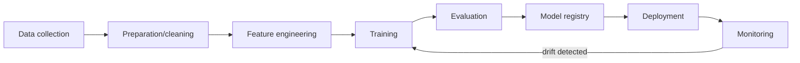
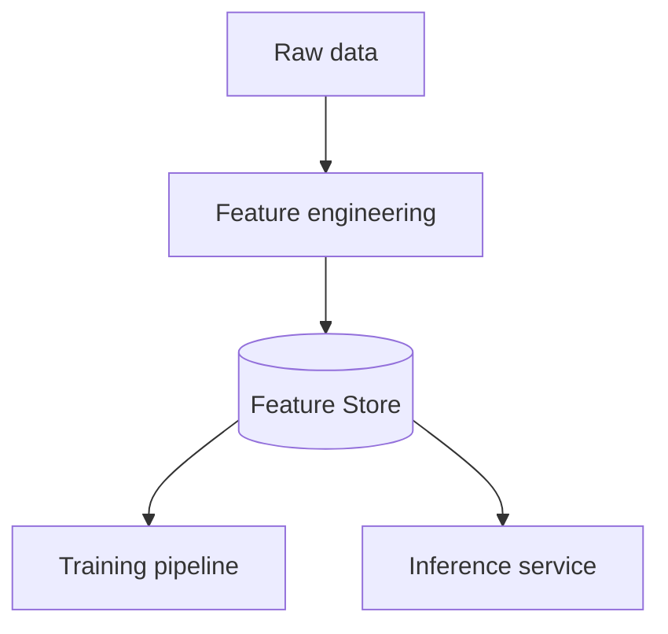

# Вопросы на собеседовании: `MLOps`

**MLOps** — DevOps для ML: experiment tracking, model versioning, deployment, monitoring, retraining. Критично для production ML/AI. С 2024 — **LLMOps** как подвид (специфично для LLM apps). Стек: MLflow, Weights & Biases, Feast, Kubeflow, Seldon, BentoML.

## Полезные ссылки

### Официальная документация и авторитетные источники

- [MLflow Documentation](https://mlflow.org/docs/latest/index.html)
- [Weights & Biases Documentation](https://docs.wandb.ai/)
- [Feast Documentation](https://docs.feast.dev/)
- [Tecton Documentation](https://docs.tecton.ai/)
- [Kubeflow Documentation](https://www.kubeflow.org/docs/)
- [BentoML Documentation](https://docs.bentoml.com/)
- [MLOps Community](https://mlops.community/)
- [Made With ML](https://madewithml.com/)

## Содержание

- [Полезные ссылки](#полезные-ссылки)
- [See also](#see-also)

**Базовые понятия**
- [Q1. (!) Что такое MLOps?](#q1--что-такое-mlops)
- [Q2. (!) ML lifecycle?](#q2--ml-lifecycle)
- [Q3. (!) DevOps vs MLOps — отличия?](#q3--devops-vs-mlops--отличия)

**Experiment tracking**
- [Q4. (!) Что такое experiment tracking?](#q4--что-такое-experiment-tracking)
- [Q5. (!) MLflow — основной инструмент?](#q5--mlflow--основной-инструмент)
- [Q6. Weights & Biases (W&B)?](#q6-weights--biases-wb)

**Data и features**
- [Q7. (!) Что такое feature store?](#q7--что-такое-feature-store)
- [Q8. (!) Online vs offline features?](#q8--online-vs-offline-features)
- [Q9. Feast vs Tecton?](#q9-feast-vs-tecton)
- [Q10. Training-serving skew?](#q10-training-serving-skew)

**Model registry**
- [Q11. (!) Model registry — для чего?](#q11--model-registry--для-чего)
- [Q12. Model versioning — стратегии?](#q12-model-versioning--стратегии)

**Deployment**
- [Q13. (!) Batch vs online inference?](#q13--batch-vs-online-inference)
- [Q14. (!) A/B testing моделей?](#q14--ab-testing-моделей)
- [Q15. Shadow deployment?](#q15-shadow-deployment)
- [Q16. Canary deployment?](#q16-canary-deployment)

**Monitoring**
- [Q17. (!) Что мониторить в production ML?](#q17--что-мониторить-в-production-ml)
- [Q18. (!) Data drift?](#q18--data-drift)
- [Q19. (!) Concept drift?](#q19--concept-drift)
- [Q20. Tools для monitoring (Evidently, Arize, WhyLabs)?](#q20-tools-для-monitoring-evidently-arize-whylabs)

**CI/CD для ML**
- [Q21. (!) Что такое CI/CD для ML?](#q21--что-такое-cicd-для-ml)
- [Q22. Continuous Training?](#q22-continuous-training)

**LLMOps**
- [Q23. (!) Что такое LLMOps?](#q23--что-такое-llmops)
- [Q24. Отличия LLMOps от классического MLOps?](#q24-отличия-llmops-от-классического-mlops)
- [Q25. (!) Prompt versioning?](#q25--prompt-versioning)
- [Q26. LLM evaluation в production?](#q26-llm-evaluation-в-production)

**Production maturity**
- [Q27. (!) Уровни MLOps maturity?](#q27--уровни-mlops-maturity)
- [Q28. Какие частые проблемы в MLOps?](#q28-какие-частые-проблемы-в-mlops)

## Q1. (!) Что такое MLOps?

**MLOps (Machine Learning Operations)** — practices для **lifecycle management** ML/AI систем в production:
- Versioning (data, code, models)
- Experiment tracking
- Reproducibility
- Deployment automation
- Monitoring (drift, performance)
- Retraining
- Governance, compliance

**Цель:** ML системы как **reliable software**, не как одноразовые artifacts.

**Discipline появилась** с осознанием, что 80% ML моделей **никогда не доходят до production** или быстро deteriorate.


> [!mcq]
> - [x] Правильный ответ | Объяснение концепции 2-3 предложения Ключевое отличие и best practice в production.
> - [ ] Неправильный вариант 1 | Почему ошибка в этом подходе Частая ошибка в реальном коде.
> - [ ] Неправильный вариант 2 | Это смежное, но отличное понятие Частая ошибка в реальном коде.
> - [ ] Неправильный вариант 3 | Противоположное направление## Q2. (!) ML lifecycle? Частая ошибка в реальном коде.



**Stages:**
1. **Data collection** — sources, ETL
2. **Data preparation** — cleaning, validation
3. **Feature engineering** — transformation, encoding
4. **Training** — model fit
5. **Evaluation** — metrics на test set
6. **Model registry** — версионирование
7. **Deployment** — в production
8. **Monitoring** — drift, performance
9. **Retraining** — на новых данных

MLOps ovсенирует автоматизацию каждого этапа.


> [!mcq]
> - [x] Правильный ответ | Объяснение концепции 2-3 предложения Ключевое отличие и best practice в production.
> - [ ] Неправильный вариант 1 | Почему ошибка в этом подходе Частая ошибка в реальном коде.
> - [ ] Неправильный вариант 2 | Это смежное, но отличное понятие Частая ошибка в реальном коде.
> - [ ] Неправильный вариант 3 | Противоположное направление## Q3. (!) DevOps vs MLOps — отличия? Частая ошибка в реальном коде.

| Критерий | DevOps | MLOps |
|----------|--------|-------|
| Артефакт | Код | Код + данные + model |
| Versioning | Git | Git + DVC + Model Registry |
| Testing | Unit, integration | Data validation, model perf |
| Reproducibility | Деpендencies + код | + data snapshot + random seed |
| Monitoring | App health, errors | + drift, accuracy decay |
| Deploy | Single artifact | Model + features + preprocessing |
| Retraining | — | Periodic / triggered |
| Lifecycle | Linear | Cyclic (retrain) |

**Ключевая разница:** ML модели **deteriorate** со временем (data меняется). DevOps app **стабильно** работает пока его не сломают.


> [!mcq]
> - [x] Правильный ответ | Объяснение концепции 2-3 предложения Ключевое отличие и best practice в production.
> - [ ] Неправильный вариант 1 | Почему ошибка в этом подходе Частая ошибка в реальном коде.
> - [ ] Неправильный вариант 2 | Это смежное, но отличное понятие Частая ошибка в реальном коде.
> - [ ] Неправильный вариант 3 | Противоположное направление## Q4. (!) Что такое experiment tracking? Частая ошибка в реальном коде.

Каждый ML training run = experiment с **разными hyperparameters, data, model architectures**. Tracking сохраняет:

- **Parameters** (learning rate, batch size, ...)
- **Metrics** (accuracy, F1, loss curves)
- **Artifacts** (model weights, plots)
- **Code version** (git commit)
- **Data version** (DVC, hash)
- **Environment** (Python deps, GPU type)

**Зачем:**
- **Reproducibility** — repeat experiment когда нужно
- **Comparison** — какой run лучший?
- **Collaboration** — share results с командой
- **Audit** — что использовали для production model?


> [!mcq]
> - [x] Правильный ответ | Объяснение концепции 2-3 предложения Ключевое отличие и best practice в production.
> - [ ] Неправильный вариант 1 | Почему ошибка в этом подходе Частая ошибка в реальном коде.
> - [ ] Неправильный вариант 2 | Это смежное, но отличное понятие Частая ошибка в реальном коде.
> - [ ] Неправильный вариант 3 | Противоположное направление## Q5. (!) MLflow — основной инструмент? Частая ошибка в реальном коде.

**MLflow** (open-source, Databricks) — самый популярный для experiment tracking + model registry.

```python
import mlflow

with mlflow.start_run():
    mlflow.log_param("lr", 0.01)
    mlflow.log_metric("accuracy", 0.95)
    mlflow.log_artifact("model.pkl")
    mlflow.sklearn.log_model(model, "model")

# UI на http://localhost:5000
```

**Components:**
- **Tracking** — experiments, runs, metrics
- **Model Registry** — versioned models, stages (Staging/Production)
- **Projects** — packaged ML code
- **Models** — formats для deployment (Spark, Sagemaker, ...)

**Self-hosted** или managed (Databricks).


> [!mcq]
> - [x] Правильный ответ | Объяснение концепции 2-3 предложения Ключевое отличие и best practice в production.
> - [ ] Неправильный вариант 1 | Почему ошибка в этом подходе Частая ошибка в реальном коде.
> - [ ] Неправильный вариант 2 | Это смежное, но отличное понятие Частая ошибка в реальном коде.
> - [ ] Неправильный вариант 3 | Противоположное направление## Q6. Weights & Biases (W&B)? Частая ошибка в реальном коде.

**Weights & Biases** — proprietary SaaS, focus на **experiment tracking**.

```python
import wandb

wandb.init(project="my-project", config={"lr": 0.01})
for epoch in range(10):
    loss = train_step()
    wandb.log({"loss": loss, "epoch": epoch})
```

**Преимущества над MLflow:**
- Отличный UI
- Богатые visualizations
- Sweeps (hyperparameter tuning)
- Reports / collaboration
- Artifacts с lineage

**Минусы:**
- Не open-source (есть free tier)
- Vendor lock-in

В **academia / research** — W&B доминирует. В **enterprise** — MLflow часто чуть популярнее (open-source + Databricks).


> [!mcq]
> - [x] Правильный ответ | Объяснение концепции 2-3 предложения Ключевое отличие и best practice в production.
> - [ ] Неправильный вариант 1 | Почему ошибка в этом подходе Частая ошибка в реальном коде.
> - [ ] Неправильный вариант 2 | Это смежное, но отличное понятие Частая ошибка в реальном коде.
> - [ ] Неправильный вариант 3 | Противоположное направление## Q7. (!) Что такое feature store? Частая ошибка в реальном коде.

**Feature store** — централизованное хранилище **features** для ML.



**Решает проблемы:**
- **Training-serving skew** — same feature definitions для training и inference
- **Reuse** — несколько моделей используют те же features
- **Discoverability** — каталог features
- **Monitoring** — feature drift detection

**Tools:** Feast (open-source), Tecton (managed), Hopsworks, Vertex AI Feature Store, SageMaker Feature Store.


> [!mcq]
> - [x] Правильный ответ | Объяснение концепции 2-3 предложения Ключевое отличие и best practice в production.
> - [ ] Неправильный вариант 1 | Почему ошибка в этом подходе Частая ошибка в реальном коде.
> - [ ] Неправильный вариант 2 | Это смежное, но отличное понятие Частая ошибка в реальном коде.
> - [ ] Неправильный вариант 3 | Противоположное направление## Q8. (!) Online vs offline features? Частая ошибка в реальном коде.

**Offline features** — для training:
- Большой volume, batch computation
- Сложные aggregations (сумма за 30 дней, ...)
- Storage: S3, BigQuery, Hive
- Read latency: seconds

**Online features** — для realtime inference:
- Read latency < 100ms
- Storage: Redis, DynamoDB, Cassandra
- Pre-computed offline → loaded online

**Feature store** управляет **синхронизацией** offline ↔ online (often через scheduled jobs).


> [!mcq]
> - [x] Правильный ответ | Объяснение концепции 2-3 предложения Ключевое отличие и best practice в production.
> - [ ] Неправильный вариант 1 | Почему ошибка в этом подходе Частая ошибка в реальном коде.
> - [ ] Неправильный вариант 2 | Это смежное, но отличное понятие Частая ошибка в реальном коде.
> - [ ] Неправильный вариант 3 | Противоположное направление## Q9. Feast vs Tecton? Частая ошибка в реальном коде.

| Critterion | Feast | Tecton |
|-----------|-------|--------|
| License | Open-source | Proprietary |
| Hosting | Self-host | Managed SaaS |
| Online store | Redis, DynamoDB | Built-in |
| Streaming features | Limited | Yes (Spark, Flink) |
| Cost | Free + infra | $$$ |
| Maturity | Growing | Production-grade |

**Feast** — для startups / smaller teams.
**Tecton** — для enterprise (founded by ex-Uber Michelangelo team).


> [!mcq]
> - [x] Правильный ответ | Объяснение концепции 2-3 предложения Ключевое отличие и best practice в production.
> - [ ] Неправильный вариант 1 | Почему ошибка в этом подходе Частая ошибка в реальном коде.
> - [ ] Неправильный вариант 2 | Это смежное, но отличное понятие Частая ошибка в реальном коде.
> - [ ] Неправильный вариант 3 | Противоположное направление## Q10. Training-serving skew? Частая ошибка в реальном коде.

**Training-serving skew** — features в training computed по-разному vs в production inference.

**Пример:**
- Training: `avg_purchase_30d` посчитано из исторических данных
- Inference: реальный `avg_purchase_30d` другой (другая SQL query, fresh data, different time window)

**Эффект:** model работает **отлично на test**, **плохо на production**.

**Решение:**
- **Feature store** — single definition
- **Training data extraction точно как inference**
- **Monitoring** — track distribution differences


> [!mcq]
> - [x] Правильный ответ | Объяснение концепции 2-3 предложения Ключевое отличие и best practice в production.
> - [ ] Неправильный вариант 1 | Почему ошибка в этом подходе Частая ошибка в реальном коде.
> - [ ] Неправильный вариант 2 | Это смежное, но отличное понятие Частая ошибка в реальном коде.
> - [ ] Неправильный вариант 3 | Противоположное направление## Q11. (!) Model registry — для чего? Частая ошибка в реальном коде.

**Model registry** — БД моделей с версионированием, stages, metadata.

```python
mlflow.register_model("runs:/abc123/model", "fraud_detector")
client.transition_model_version_stage(
    name="fraud_detector",
    version=3,
    stage="Production"
)
```

**Stages:**
- **None** — just registered
- **Staging** — тестируется
- **Production** — used by inference service
- **Archived** — old version

**Зачем:**
- **Lineage** — откуда взялась модель (data, code)
- **Promotion** — staging → production через approval
- **Rollback** — quickly revert к previous version
- **Multiple models in production** (A/B testing)

**Tools:** MLflow Registry, W&B Artifacts, SageMaker Model Registry, Vertex AI Models.


> [!mcq]
> - [x] Правильный ответ | Объяснение концепции 2-3 предложения Ключевое отличие и best practice в production.
> - [ ] Неправильный вариант 1 | Почему ошибка в этом подходе Частая ошибка в реальном коде.
> - [ ] Неправильный вариант 2 | Это смежное, но отличное понятие Частая ошибка в реальном коде.
> - [ ] Неправильный вариант 3 | Противоположное направление## Q12. Model versioning — стратегии? Частая ошибка в реальном коде.

**Approaches:**

1. **Semantic versioning** (`1.2.3`) — major/minor/patch
2. **Git commit hash** — модель привязана к code version
3. **Date-based** (`2025-04-19`) — для часто-обновляемых
4. **Auto-incremented** (`v1`, `v2`, ...) — MLflow default

**Best practice:** combine — `model_v3_abc123_20250419`.


> [!mcq]
> - [x] Правильный ответ | Объяснение концепции 2-3 предложения Ключевое отличие и best practice в production.
> - [ ] Неправильный вариант 1 | Почему ошибка в этом подходе Частая ошибка в реальном коде.
> - [ ] Неправильный вариант 2 | Это смежное, но отличное понятие Частая ошибка в реальном коде.
> - [ ] Неправильный вариант 3 | Противоположное направление## Q13. (!) Batch vs online inference? Частая ошибка в реальном коде.

| Критерий | Batch | Online |
|----------|-------|--------|
| Trigger | Scheduled (daily/hourly) | Per request |
| Latency | Минуты-часы | < 100ms |
| Throughput | Очень высокий | Зависит от load |
| Use case | Recommendations precompute, churn scoring | Fraud detection, search, chatbot |
| Infrastructure | Spark, Airflow | API service (FastAPI, Triton) |
| Cost | Низкий per prediction | Выше (always running) |

**Hybrid:** некоторые predictions precomputed batch + cached → fast online lookup.


> [!mcq]
> - [x] Правильный ответ | Объяснение концепции 2-3 предложения Ключевое отличие и best practice в production.
> - [ ] Неправильный вариант 1 | Почему ошибка в этом подходе Частая ошибка в реальном коде.
> - [ ] Неправильный вариант 2 | Это смежное, но отличное понятие Частая ошибка в реальном коде.
> - [ ] Неправильный вариант 3 | Противоположное направление## Q14. (!) A/B testing моделей? Частая ошибка в реальном коде.

**A/B testing:** % traffic → model A, % → model B, compare metrics.

```python
def predict(user_id, features):
    model_choice = "B" if hash(user_id) % 100 < 10 else "A"  # 10% B
    if model_choice == "B":
        prediction = model_b.predict(features)
    else:
        prediction = model_a.predict(features)
    log_prediction(user_id, model_choice, prediction)
    return prediction
```

**Метрики для сравнения:**
- **Online metrics** — CTR, conversion rate, revenue
- **Latency, error rate**
- **User satisfaction**

**Сложнее, чем кажется:** статистическая значимость, novelty effects, holdout groups.


> [!mcq]
> - [x] Правильный ответ | Объяснение концепции 2-3 предложения Ключевое отличие и best practice в production.
> - [ ] Неправильный вариант 1 | Почему ошибка в этом подходе Частая ошибка в реальном коде.
> - [ ] Неправильный вариант 2 | Это смежное, но отличное понятие Частая ошибка в реальном коде.
> - [ ] Неправильный вариант 3 | Противоположное направление## Q15. Shadow deployment? Частая ошибка в реальном коде.

**Shadow:** new model **видит production traffic**, но **predictions не используются**. Сравниваем с production model offline.

```python
def predict(features):
    prediction = production_model.predict(features)
    # Shadow — predict but don't use
    shadow_prediction = new_model.predict(features)
    log_comparison(prediction, shadow_prediction)
    return prediction  # production prediction
```

**Зачем:** проверить new model на real traffic без risk. Перед actual A/B test.


> [!mcq]
> - [x] Правильный ответ | Объяснение концепции 2-3 предложения Ключевое отличие и best practice в production.
> - [ ] Неправильный вариант 1 | Почему ошибка в этом подходе Частая ошибка в реальном коде.
> - [ ] Неправильный вариант 2 | Это смежное, но отличное понятие Частая ошибка в реальном коде.
> - [ ] Неправильный вариант 3 | Противоположное направление## Q16. Canary deployment? Частая ошибка в реальном коде.

Postepenно увеличиваем % traffic на new model:

```
Day 1: 1% to new model
Day 2: 5%
Day 3: 25%
Day 4: 50%
Day 5: 100%
```

При detecting issues (error rate, drift) — rollback.

Аналог DevOps canary deployment, но с ML metrics.


> [!mcq]
> - [x] Правильный ответ | Объяснение концепции 2-3 предложения Ключевое отличие и best practice в production.
> - [ ] Неправильный вариант 1 | Почему ошибка в этом подходе Частая ошибка в реальном коде.
> - [ ] Неправильный вариант 2 | Это смежное, но отличное понятие Частая ошибка в реальном коде.
> - [ ] Неправильный вариант 3 | Противоположное направление## Q17. (!) Что мониторить в production ML? Частая ошибка в реальном коде.

**Operational:**
- Latency (p50, p99)
- Throughput, RPS
- Error rate
- CPU/memory/GPU utilization

**ML-specific:**
- **Predictions distribution** — drift?
- **Input features distribution** — drift?
- **Model accuracy** (если есть ground truth)
- **Feature importance** — изменилось ли?
- **Prediction confidence** distribution
- **Business metrics** — conversion, revenue impact

**Alerts:**
- Latency > 200ms
- Error rate > 1%
- Drift score > threshold
- Accuracy drop > 5%


> [!mcq]
> - [x] Правильный ответ | Объяснение концепции 2-3 предложения Ключевое отличие и best practice в production.
> - [ ] Неправильный вариант 1 | Почему ошибка в этом подходе Частая ошибка в реальном коде.
> - [ ] Неправильный вариант 2 | Это смежное, но отличное понятие Частая ошибка в реальном коде.
> - [ ] Неправильный вариант 3 | Противоположное направление## Q18. (!) Data drift? Частая ошибка в реальном коде.

**Data drift** — distribution of **input features** меняется со временем.

```
Training time: avg user_age = 35
Production:    avg user_age = 28 (younger users)
```

**Виды:**
- **Covariate shift** — distribution X меняется, P(Y|X) тот же
- **Label shift** — P(Y) меняется
- **Concept drift** — P(Y|X) меняется (см. Q19)

**Detection:**
- **KL divergence** между training и production distributions
- **PSI (Population Stability Index)**
- **KS test** для numeric features
- **Chi-square** для categorical

**Tools:** Evidently AI, NannyML, Arize, WhyLabs.


> [!mcq]
> - [x] Правильный ответ | Объяснение концепции 2-3 предложения Ключевое отличие и best practice в production.
> - [ ] Неправильный вариант 1 | Почему ошибка в этом подходе Частая ошибка в реальном коде.
> - [ ] Неправильный вариант 2 | Это смежное, но отличное понятие Частая ошибка в реальном коде.
> - [ ] Неправильный вариант 3 | Противоположное направление## Q19. (!) Concept drift? Частая ошибка в реальном коде.

**Concept drift** — relationship X → Y меняется. Та же features → разный label.

**Пример:** spam detection — спам evolves, sucessful tactics changes.

**Виды:**
- **Sudden** — резкое (COVID hit, prices changed)
- **Gradual** — постепенное (consumer preferences)
- **Recurring** — seasonal (зимой ↔ летом)

**Detection:** model accuracy decay (если есть ground truth labels).

**Mitigation:** **continuous retraining** на новых данных.


> [!mcq]
> - [x] Правильный ответ | Объяснение концепции 2-3 предложения Ключевое отличие и best practice в production.
> - [ ] Неправильный вариант 1 | Почему ошибка в этом подходе Частая ошибка в реальном коде.
> - [ ] Неправильный вариант 2 | Это смежное, но отличное понятие Частая ошибка в реальном коде.
> - [ ] Неправильный вариант 3 | Противоположное направление## Q20. Tools для monitoring (Evidently, Arize, WhyLabs)? Частая ошибка в реальном коде.

**Evidently AI** (open-source):
- Data drift, target drift
- Reports, dashboards
- Easy integration

**Arize AI** (SaaS):
- ML observability
- Drift, performance, fairness
- LLM observability tools

**WhyLabs** (SaaS):
- Open-source whylogs library
- Statistical profiling
- Anomaly detection

**Custom:** Prometheus metrics + Grafana dashboards для simple cases.


> [!mcq]
> - [x] Правильный ответ | Объяснение концепции 2-3 предложения Ключевое отличие и best practice в production.
> - [ ] Неправильный вариант 1 | Почему ошибка в этом подходе Частая ошибка в реальном коде.
> - [ ] Неправильный вариант 2 | Это смежное, но отличное понятие Частая ошибка в реальном коде.
> - [ ] Неправильный вариант 3 | Противоположное направление## Q21. (!) Что такое CI/CD для ML? Частая ошибка в реальном коде.

**CI (Continuous Integration):**
- Тесты на каждый PR
- Data validation tests
- Model unit tests (no NaNs, predictions in range)
- Integration tests

**CD (Continuous Deployment):**
- Auto deploy после merge
- Canary deployment
- Auto rollback при regressions

**Также:**
- **CT (Continuous Training)** — auto retrain на новых data
- **CM (Continuous Monitoring)** — постоянный watch performance

```yaml
# Пример CI/CD для ML pipeline
stages:
  - data_validation
  - feature_engineering
  - train
  - eval
  - register_model
  - deploy_canary
  - monitor
```


> [!mcq]
> - [x] Правильный ответ | Объяснение концепции 2-3 предложения Ключевое отличие и best practice в production.
> - [ ] Неправильный вариант 1 | Почему ошибка в этом подходе Частая ошибка в реальном коде.
> - [ ] Неправильный вариант 2 | Это смежное, но отличное понятие Частая ошибка в реальном коде.
> - [ ] Неправильный вариант 3 | Противоположное направление## Q22. Continuous Training? Частая ошибка в реальном коде.

**CT (Continuous Training):** автоматическая retrain pipeline на:
- **Schedule** (each week)
- **Drift detection trigger**
- **Performance degradation**
- **New data availability**

```python
# Airflow DAG
@dag(schedule_interval="@weekly")
def retrain_pipeline():
    new_data = extract_new_data()
    trained_model = train(new_data)
    metrics = evaluate(trained_model, holdout)
    if metrics["accuracy"] > production_metrics["accuracy"]:
        register_and_deploy(trained_model)
    else:
        notify_team("Model didn't improve")
```

**Подвох:** retraining может **ухудшить** model (bad new data, label drift). Auto-deploy только если metrics improve.


> [!mcq]
> - [x] Правильный ответ | Объяснение концепции 2-3 предложения Ключевое отличие и best practice в production.
> - [ ] Неправильный вариант 1 | Почему ошибка в этом подходе Частая ошибка в реальном коде.
> - [ ] Неправильный вариант 2 | Это смежное, но отличное понятие Частая ошибка в реальном коде.
> - [ ] Неправильный вариант 3 | Противоположное направление## Q23. (!) Что такое LLMOps? Частая ошибка в реальном коде.

**LLMOps** — MLOps **для LLM приложений**. Подкласс с своей спецификой.

**Особенности vs classical MLOps:**
- Не обучаем модели (используем third-party APIs или fine-tuned)
- Главный artifact = **prompts** (версионируется как код)
- Evaluation сложнее (no clear ground truth)
- Cost monitoring critical (per-token pricing)
- Latency и streaming
- Hallucination detection

**Стек LLMOps:**
- **Prompt management** (LangSmith, Langfuse, PromptLayer)
- **Tracing** (OpenTelemetry, LangSmith)
- **Cost tracking** (Helicone, Portkey)
- **Evaluation** (Ragas, TruLens, custom)
- **Safety** (Moderation API, custom guards)


> [!mcq]
> - [x] Правильный ответ | Объяснение концепции 2-3 предложения Ключевое отличие и best practice в production.
> - [ ] Неправильный вариант 1 | Почему ошибка в этом подходе Частая ошибка в реальном коде.
> - [ ] Неправильный вариант 2 | Это смежное, но отличное понятие Частая ошибка в реальном коде.
> - [ ] Неправильный вариант 3 | Противоположное направление## Q24. Отличия LLMOps от классического MLOps? Частая ошибка в реальном коде.

| Аспект | Classical MLOps | LLMOps |
|--------|----------------|--------|
| Main artifact | Trained model | Prompts + LLM API |
| Training | Hours-days | Часто нет (use API) |
| Versioning | Model weights | Prompts + model version |
| Evaluation | Accuracy, F1 | Faithfulness, helpfulness (subjective) |
| Drift | Data drift | Prompt regressions, model updates |
| Deployment | Model server | Update prompt template |
| Cost | Compute (GPU) | API per-token |
| Monitoring | Predictions, latency | + token usage, cost, hallucinations |
| Security | Data privacy | + Prompt injection |


> [!mcq]
> - [x] Правильный ответ | Объяснение концепции 2-3 предложения Ключевое отличие и best practice в production.
> - [ ] Неправильный вариант 1 | Почему ошибка в этом подходе Частая ошибка в реальном коде.
> - [ ] Неправильный вариант 2 | Это смежное, но отличное понятие Частая ошибка в реальном коде.
> - [ ] Неправильный вариант 3 | Противоположное направление## Q25. (!) Prompt versioning? Частая ошибка в реальном коде.

```python
# Prompt registry (LangSmith, Langfuse, custom DB)
prompt_v3 = """
You are a customer support agent...
Answer in Russian only.
Be polite.

Question: {question}
"""

# Use specific version
prompt = registry.get("customer_support", version="v3")
response = llm(prompt.format(question=question))
```

**Зачем:**
- **Track changes** — какая version использовалась когда?
- **A/B testing** — сравнить v3 vs v4
- **Rollback** — old version если new сломалось
- **Audit** — compliance

Prompts = код. Version в Git или dedicated tools.


> [!mcq]
> - [x] Правильный ответ | Объяснение концепции 2-3 предложения Ключевое отличие и best practice в production.
> - [ ] Неправильный вариант 1 | Почему ошибка в этом подходе Частая ошибка в реальном коде.
> - [ ] Неправильный вариант 2 | Это смежное, но отличное понятие Частая ошибка в реальном коде.
> - [ ] Неправильный вариант 3 | Противоположное направление## Q26. LLM evaluation в production? Частая ошибка в реальном коде.

**Метрики:**

1. **User feedback** — thumbs up/down
2. **Task completion** — пользователь решил problem?
3. **LLM-as-judge** — другая LLM оценивает quality (rubric)
4. **Faithfulness (для RAG)** — все ли facts в answer от retrieved docs?
5. **Latency, cost** per request
6. **Refusal rate** — как часто модель отказывает?
7. **Safety** — toxic outputs detected?

**Continuous eval:**
- Sample 1% productions запросов в **golden dataset**
- Evaluate weekly against benchmarks
- Alert if regressions

**Tools:** Phoenix Arize, Langfuse, Helicone, custom.


> [!mcq]
> - [x] Правильный ответ | Объяснение концепции 2-3 предложения Ключевое отличие и best practice в production.
> - [ ] Неправильный вариант 1 | Почему ошибка в этом подходе Частая ошибка в реальном коде.
> - [ ] Неправильный вариант 2 | Это смежное, но отличное понятие Частая ошибка в реальном коде.
> - [ ] Неправильный вариант 3 | Противоположное направление## Q27. (!) Уровни MLOps maturity? Частая ошибка в реальном коде.

**Google ML maturity model:**

**Level 0 — Manual:**
- Manual training, manual deployment
- One-off models
- No tracking

**Level 1 — ML pipeline automation:**
- Automated training pipeline
- Continuous training based on triggers
- Model registry

**Level 2 — Full automation:**
- Automated CI/CD
- Continuous monitoring
- Automated retraining + deploy
- Feature store
- Drift detection

**Большинство компаний — Level 0-1**. Level 2 — крупные tech companies (Uber, Netflix, FAANG).

В **2025** большинство стартапов — Level 1 для critical ML, Level 0 для experiments.


> [!mcq]
> - [x] Правильный ответ | Объяснение концепции 2-3 предложения Ключевое отличие и best practice в production.
> - [ ] Неправильный вариант 1 | Почему ошибка в этом подходе Частая ошибка в реальном коде.
> - [ ] Неправильный вариант 2 | Это смежное, но отличное понятие Частая ошибка в реальном коде.
> - [ ] Неправильный вариант 3 | Противоположное направление## Q28. Какие частые проблемы в MLOps? Частая ошибка в реальном коде.

1. **Reproducibility** — могу repeat experiment? (часто нет)
2. **Training-serving skew** — different feature definitions
3. **Data drift не обнаружен** — model deteriorates silently
4. **Manual deployment** — slow, error-prone
5. **No model lineage** — откуда эта модель в production?
6. **Hard rollback** — difficult to switch back
7. **Cost runaway** — много models running, никто не tracks costs
8. **Stale data** — features computed месяцы назад
9. **Tech debt** — Jupyter notebooks в production
10. **ML team isolated** — нет integration с product engineering

**MLOps maturity** — это journey, не destination. Постоянное improvement.

---

## See also

- [LLM Basics](llm-basics-interview.md) — основа для LLMOps
- [LLM Integration Patterns](llm-integration-patterns-interview.md) — production patterns
- [Model Serving](model-serving-interview.md) — deployment
- [RAG](rag-interview.md) — operationalization RAG
- [AI Agents](ai-agents-interview.md) — operations
- [Airflow](../data-engineering/apache-airflow-interview.md) — orchestration ML pipelines
- [Spark](../data-engineering/apache-spark-interview.md) — для feature engineering
- [Data Warehousing](../data-engineering/data-warehousing-interview.md) — feature storage
- [Observability](../monitoring/observability-interview.md) — monitoring
- [Pipeline Design](../cicd/pipeline-design-interview.md) — CI/CD
- [Микросервисы](../architecture/microservices-interview.md) — где models live
- [Git](../devops/git-interview.md) — version control


> [!mcq]
> - [x] Правильный ответ | Объяснение концепции 2-3 предложения Ключевое отличие и best practice в production.
> - [ ] Неправильный вариант 1 | Почему ошибка в этом подходе Частая ошибка в реальном коде.
> - [ ] Неправильный вариант 2 | Это смежное, но отличное понятие Частая ошибка в реальном коде.
> - [ ] Неправильный вариант 3 | Противоположное направление- [AI Agents](ai-agents-interview.md) Частая ошибка в реальном коде.
- [Embeddings](embeddings-interview.md)
- [LLM Basics](llm-basics-interview.md)
- [LLM Integration Patterns](llm-integration-patterns-interview.md)
- [Model Serving](model-serving-interview.md)
- [Prompt Engineering](prompt-engineering-interview.md)
