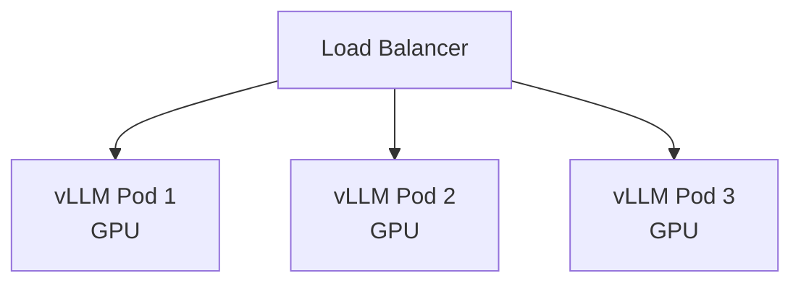

# Вопросы на собеседовании: `Model Serving`

**Model serving** — развёртывание ML/LLM-моделей в production. Когда **API не подходит** (приватность, масштаб, стоимость) — нужно **разворачивать у себя** (self-host). Стек: **vLLM**, **TGI**, **Triton**, **TorchServe**, **BentoML**, **Ollama**. Главные оптимизации: **continuous batching**, **quantization**, **KV cache**, **GPU sharing**.

## Полезные ссылки

### Официальная документация и авторитетные источники

- [vLLM Documentation](https://docs.vllm.ai/)
- [Hugging Face TGI](https://huggingface.co/docs/text-generation-inference/)
- [NVIDIA Triton Inference Server](https://docs.nvidia.com/deeplearning/triton-inference-server/)
- [BentoML Documentation](https://docs.bentoml.com/)
- [TensorRT-LLM](https://github.com/NVIDIA/TensorRT-LLM)
- [Ollama](https://ollama.com/)
- [llama.cpp](https://github.com/ggerganov/llama.cpp)

## Содержание

- [Полезные ссылки](#полезные-ссылки)
- [See also](#see-also)

**Базовые понятия**
- [Q1. (!) Что такое model serving?](#q1--что-такое-model-serving)
- [Q2. (!) Когда self-host vs API?](#q2--когда-self-host-vs-api)
- [Q3. (!) GPU vs CPU inference?](#q3--gpu-vs-cpu-inference)
- [Q4. Latency vs throughput trade-offs?](#q4-latency-vs-throughput-trade-offs)

**Tools для классических моделей**
- [Q5. (!) TorchServe?](#q5--torchserve)
- [Q6. TensorFlow Serving?](#q6-tensorflow-serving)
- [Q7. (!) NVIDIA Triton Inference Server?](#q7--nvidia-triton-inference-server)
- [Q8. (!) BentoML?](#q8--bentoml)

**Tools для LLM**
- [Q9. (!) vLLM — главный для LLM serving?](#q9--vllm--главный-для-llm-serving)
- [Q10. (!) Hugging Face TGI?](#q10--hugging-face-tgi)
- [Q11. TensorRT-LLM (NVIDIA)?](#q11-tensorrt-llm-nvidia)
- [Q12. Ollama — local LLMs?](#q12-ollama--local-llms)
- [Q13. llama.cpp — CPU inference?](#q13-llamacpp--cpu-inference)

**Optimizations для LLM**
- [Q14. (!) Continuous batching (PagedAttention)?](#q14--continuous-batching-pagedattention)
- [Q15. (!) KV cache?](#q15--kv-cache)
- [Q16. (!) Quantization (FP16, INT8, INT4, GPTQ, AWQ)?](#q16--quantization-fp16-int8-int4-gptq-awq)
- [Q17. Speculative decoding?](#q17-speculative-decoding)
- [Q18. Tensor parallelism, pipeline parallelism?](#q18-tensor-parallelism-pipeline-parallelism)

**Scaling**
- [Q19. (!) Horizontal scaling LLM serving?](#q19--horizontal-scaling-llm-serving)
- [Q20. GPU sharing (MIG, MPS)?](#q20-gpu-sharing-mig-mps)
- [Q21. Auto-scaling на queue depth?](#q21-auto-scaling-на-queue-depth)

**API patterns**
- [Q22. (!) OpenAI-compatible API?](#q22--openai-compatible-api)
- [Q23. Streaming responses?](#q23-streaming-responses)

**Cost optimization**
- [Q24. (!) Какой GPU выбрать (A100, H100, RTX 4090, ...)?](#q24--какой-gpu-выбрать-a100-h100-rtx-4090-)
- [Q25. (!) On-prem vs cloud GPU?](#q25--on-prem-vs-cloud-gpu)
- [Q26. Spot instances для inference?](#q26-spot-instances-для-inference)

**Production**
- [Q27. (!) Какие частые проблемы в model serving?](#q27--какие-частые-проблемы-в-model-serving)
- [Q28. (!) Когда выбрать какой serving stack?](#q28--когда-выбрать-какой-serving-stack)

## Q1. (!) Что такое model serving?

**Model serving** — процесс предоставления ML/LLM-моделей через API для inference (вывода/предсказания).

**Компоненты:**
1. **Загрузка модели** — загрузить веса в RAM/GPU
2. **Обработка запросов** — принять входные данные (HTTP/gRPC)
3. **Inference** — выполнить предсказание
4. **Ответ** — вернуть предсказание

**Подходы:**
- **Embedded** — модель внутри приложения (Python `model.predict()`)
- **Sidecar** — модель в отдельном процессе на той же машине
- **Microservice** — отдельный API-сервис
- **Managed** — Sagemaker, Vertex AI

**Серьёзный production:** выделенные inference-серверы (vLLM, Triton).


## Q2. (!) Когда self-host vs API?

**API (OpenAI, Anthropic):**
- ✓ Быстрый старт
- ✓ State-of-the-art модели
- ✓ Никакой инфраструктуры
- ✗ Оплата за токен
- ✗ Данные покидают вашу среду
- ✗ Rate limits, привязка к вендору

**Self-host (свой хостинг):**
- ✓ Приватность (PII, соответствие требованиям)
- ✓ Дешевле на масштабе (>10M токенов/месяц)
- ✓ Кастомизация (fine-tuning)
- ✓ Нет привязки к вендору
- ✗ GPU-инфраструктура
- ✗ Накладные расходы на MLOps
- ✗ Часто хуже по качеству (открытые модели)

**Точка окупаемости:** обычно self-host окупается **от 10M–100M токенов/месяц**.


## Q3. (!) GPU vs CPU inference?

| Критерий | GPU | CPU |
|----------|-----|-----|
| Скорость (LLM) | в 10–100 раз быстрее | Медленно (но возможно с llama.cpp) |
| Стоимость | $$$ | $ |
| Память | Ограничена (24–80 ГБ на GPU) | До терабайтов RAM |
| Latency | Низкая | Высокая |
| Embedding-модели | Нормально на CPU (небольшие) | Нормально |
| Простая классификация | CPU достаточно | Нормально |

**По умолчанию:** LLM > 7B параметров — нужен GPU. < 1B — CPU справится.


## Q4. Latency vs throughput trade-offs?

**Оптимизация под latency:**
- Маленький batch size (часто batch=1)
- Одиночный запрос обрабатывается быстро
- GPU загружен не полностью

**Оптимизация под throughput:**
- Большой batch size
- Много параллельных запросов
- Выше утилизация GPU
- Выше latency на отдельный запрос

**Continuous batching** (vLLM) — лучшее из обоих миров: динамический батчинг без штрафа по latency.


## Q5. (!) TorchServe?

**TorchServe** — официальный inference-сервер для PyTorch.

```python
# Define handler
class MyHandler:
    def initialize(self, ctx): ...
    def preprocess(self, data): ...
    def inference(self, model_input): ...
    def postprocess(self, inference_output): ...

# Serve
torchserve --start --model-store . --models my_model=my_model.mar
```

**Подходит для:**
- Классических PyTorch-моделей
- Кастомного препроцессинга на Python
- Нескольких версий модели

**Не для LLM** (нет оптимизаций в стиле vLLM).


## Q6. TensorFlow Serving?

**TF Serving** — для моделей TensorFlow / Keras.

```bash
docker run -p 8501:8501 \
  -v /path/to/model:/models/my_model \
  -e MODEL_NAME=my_model \
  tensorflow/serving
```

**Особенности:**
- Production-grade (Google использует внутри себя)
- gRPC + REST API
- Горячая замена модели без рестарта
- Версионирование моделей

В **2025** — TF теряет долю в пользу PyTorch, но TF Serving остаётся в legacy-системах.


## Q7. (!) NVIDIA Triton Inference Server?

**Triton** (NVIDIA) — универсальный inference-сервер.

**Особенности:**
- **Multi-framework** — PyTorch, TensorFlow, ONNX, TensorRT, OpenVINO, vLLM (через TensorRT-LLM)
- **Dynamic batching** — автоматический
- **Model ensembles** — конвейер из нескольких моделей
- **Multi-GPU** планирование
- **gRPC + HTTP**

```python
# Model repository structure
model_repository/
  my_model/
    config.pbtxt
    1/
      model.onnx
```

```protobuf
# config.pbtxt
name: "my_model"
platform: "onnxruntime_onnx"
max_batch_size: 32
input [{ name: "input", data_type: TYPE_FP32, dims: [3, 224, 224] }]
output [{ name: "output", data_type: TYPE_FP32, dims: [1000] }]
```

В **production ML** — самый популярный сервер общего назначения.


## Q8. (!) BentoML?

**BentoML** — Python-first фреймворк для serving.

```python
import bentoml

@bentoml.service
class MyModel:
    def __init__(self):
        self.model = load_model()

    @bentoml.api
    def predict(self, input: str) -> dict:
        return self.model.predict(input)
```

```bash
bentoml serve service.py:MyModel
bentoml build  # build container
bentoml deploy  # to BentoCloud / K8s
```

**Особенности:**
- Pythonic, просто в использовании
- Автогенерация REST + gRPC
- Контейнеризация
- Yatai / BentoCloud для развёртывания

Подходит для **классического ML + кастомного кода**, не оптимизирован под LLM (но поддерживает интеграцию с vLLM).


## Q9. (!) vLLM — главный для LLM serving?

**vLLM** (UC Berkeley) — самое популярное решение для LLM serving в **2024–2025**.

```python
from vllm import LLM, SamplingParams

llm = LLM(model="meta-llama/Llama-3-8B-Instruct")
outputs = llm.generate(["Hello"], SamplingParams(temperature=0.7))
```

**Или OpenAI-совместимый API:**

```bash
python -m vllm.entrypoints.openai.api_server \
  --model meta-llama/Llama-3-8B-Instruct \
  --port 8000
```

**Ключевые оптимизации:**
- **PagedAttention** — эффективное управление KV cache
- **Continuous batching** — добавление запросов на лету
- **Tensor parallelism**
- **Поддержка quantization** (AWQ, GPTQ, FP8)
- **Prefix caching**

**Throughput:** в 5–20 раз выше, чем у наивного HuggingFace.

В **2025** — выбор по умолчанию для self-hosted LLM.


## Q10. (!) Hugging Face TGI?

**Text Generation Inference (TGI)** — конкурент vLLM от Hugging Face.


```bash
docker run --gpus all -p 8080:80 \
  ghcr.io/huggingface/text-generation-inference:latest \
  --model-id meta-llama/Llama-3-8B-Instruct
```

**Особенности:**
- OpenAI-совместимый API
- Continuous batching
- Quantization (bitsandbytes, GPTQ, AWQ)
- Tensor parallelism
- Production-ready (Hugging Face Inference Endpoints)

**Против vLLM:** очень похожи. TGI чуть проще в настройке, vLLM чуть быстрее. Выбор — по предпочтению.


## Q11. TensorRT-LLM (NVIDIA)?

**TensorRT-LLM** — оптимизированный LLM-inference от NVIDIA. Использует TensorRT под капотом.

**Особенности:**
- Самый высокий throughput на NVIDIA GPU
- Кастомные kernels (FP8, FA-2 и т.д.)
- Интеграция с Triton

**Минусы:**
- Сложнее в настройке
- Только NVIDIA
- Модель нужно компилировать под каждую архитектуру GPU

**Когда:** критична максимальная производительность и есть экспертиза.


## Q12. Ollama — local LLMs?

**Ollama** — простейший способ запустить LLM локально.

```bash
ollama pull llama3
ollama run llama3
```

**Особенности:**
- Установка одной командой
- Кроссплатформенность (Mac, Linux, Windows)
- OpenAI-совместимый API на `http://localhost:11434`
- Использует **llama.cpp** под капотом
- Библиотека моделей (Llama, Mistral, Qwen, ...)

**Сценарии использования:**
- Локальная разработка
- POC, чувствительные к приватности
- Edge-развёртывания

**Не для production-масштаба** — один инстанс, не оптимизирован под многопользовательскую нагрузку.


## Q13. llama.cpp — CPU inference?

**llama.cpp** — реализация на C++ для запуска LLM **на CPU** (с опциональным GPU-ускорением).

```bash
./llama-cli -m models/llama-3-8b.gguf -p "Hello"
```

**Особенности:**
- Inference на CPU работает (медленно, но работает)
- Формат GGUF (квантованные модели)
- Низкое потребление памяти (4-bit, 5-bit, 8-bit)
- Быстро на Apple Silicon (Metal)
- Используется Ollama, LM Studio

**Уровни квантизации:**
- `Q4_K_M` — 4-bit, сбалансированное качество
- `Q8_0` — 8-bit, качество близко к оригиналу
- `Q2_K` — 2-bit, самый быстрый, самое низкое качество

В **2025** — llama.cpp позволяет запустить **модель на 70B на MacBook** (с квантизацией).


## Q14. (!) Continuous batching (PagedAttention)?

**Наивный батчинг:** ждём, пока batch заполнится → обрабатываем. Latency страдает.

**Continuous batching (vLLM):**
- Последовательности (sequences) разной длины обрабатываются вместе
- Готовые последовательности «выходят» из batch, новые добавляются
- **GPU всегда занят**

```
Time 1: batch = [seq1 (token 1), seq2 (token 1), seq3 (token 1)]
Time 2: seq1 finished. batch = [seq4 (token 1), seq2 (token 2), seq3 (token 2)]
Time 3: ...
```

**PagedAttention** — техника vLLM для управления памятью. KV cache хранится **постранично** (как виртуальная память в ОС), а не непрерывным блоком.

**Эффект:** в 5–10 раз выше throughput по сравнению с наивным батчингом.


## Q15. (!) KV cache?

**KV cache** — при генерации токена N мы переиспользуем вычисления всех предыдущих токенов (через **K**ey/**V**alue из attention).

```
Generate token 1: process tokens 0
Generate token 2: process tokens 0, 1 (но 0 уже cached)
Generate token 3: process tokens 0, 1, 2 (но 0, 1 cached)
```

**Память:** KV cache растёт с длиной последовательности. Для длинных контекстов он может быть **больше, чем веса модели**.

**Оптимизации:**
- **PagedAttention** (vLLM) — эффективное использование памяти
- **Квантизация KV cache** (FP8)
- **GQA (Grouped Query Attention)** — меньше KV-голов
- **MQA (Multi-Query Attention)** — одна KV-голова

В **2025** современные модели (Llama 3, GPT-4) используют GQA для экономии памяти.


## Q16. (!) Quantization (FP16, INT8, INT4, GPTQ, AWQ)?

| Формат | Биты | Память | Качество |
|--------|------|--------|----------|
| FP32 | 32 | 1x (база) | Лучшее |
| FP16 / BF16 | 16 | 0.5x | Минимальная потеря |
| INT8 | 8 | 0.25x | Заметная потеря |
| INT4 | 4 | 0.125x | Существенная потеря (но пригодно) |

**Современные методы квантизации:**
- **GPTQ** — post-training квантизация, 4-bit
- **AWQ (Activation-aware Weight Quantization)** — лучше, чем GPTQ
- **FP8** — для NVIDIA H100+ (нативная поддержка FP8)
- **BitsAndBytes** — библиотека Hugging Face

**Эффект:** модель на 70B в FP16 = **140 ГБ**. В INT4 = **35 ГБ** → помещается в одну A100/H100.

**Компромисс:** падение качества на ~1–3% обычно приемлемо.


## Q17. Speculative decoding?

**Speculative decoding** — маленькая модель **предсказывает** N токенов, большая модель **проверяет** их одним forward pass.

```
Small model: "The cat sat on the [mat, dog, sofa, ...]"
Big model: verify these candidates → accept "The cat sat on the mat", reject rest
```

**Эффект:** ускорение в 2–3 раза без потери качества (поскольку большая модель всё равно валидирует результат).

**Реализация:** поддерживается в vLLM, TGI, TensorRT-LLM.


## Q18. Tensor parallelism, pipeline parallelism?

**Tensor parallelism (TP):** разбить **слои** между GPU (внутри слоя).
```
GPU 1: half of attention heads
GPU 2: other half
```

**Pipeline parallelism (PP):** разбить **слои** между GPU (последовательно).
```
GPU 1: layers 1-10
GPU 2: layers 11-20
```

**Когда нужно:** модель **не помещается** в одну GPU.

```bash
# vLLM с TP=4 (4 GPUs)
python -m vllm.entrypoints.openai.api_server \
  --model meta-llama/Llama-3-70B \
  --tensor-parallel-size 4
```

**70B в FP16 = 140 ГБ** → TP=2 на H100 с 80 ГБ (70 ГБ на GPU).


## Q19. (!) Horizontal scaling LLM serving?



**Развёртывание в K8s:**
- Каждый pod — vLLM/TGI с одной или несколькими GPU
- Балансировка нагрузки round-robin / least-connection
- Автомасштабирование по глубине очереди (queue depth)

**Подвох:** GPU-поды **дорогие** (даже простаивая). Холодный старт медленный (загрузка модели в GPU = минуты). Автомасштабировать осторожно.


## Q20. GPU sharing (MIG, MPS)?

**MIG (Multi-Instance GPU)** — NVIDIA A100 и H100 можно разделить на меньшие «виртуальные GPU».

```
A100 (80GB) → 7× MIG (10GB each)
```

Каждый MIG = изолированный GPU для inference.

**MPS (Multi-Process Service)** — несколько процессов делят один GPU.

**Когда нужно:** маленькие модели (< 10 ГБ) — расточительно занимать целый A100. MIG позволяет разместить 7 моделей на одной GPU.


## Q21. Auto-scaling на queue depth?

```yaml
# K8s HPA
metrics:
  - type: External
    external:
      metric:
        name: queue_depth
      target:
        type: AverageValue
        averageValue: 10
```

**Триггер:** если в очереди > 10 запросов → добавить pod.

**Подвох:** холодный старт GPU-пода = 1–3 минуты (загрузка весов). Реактивное масштабирование не успевает за всплесками (spikes).

**Решения:**
- **Прогрев (pre-warm)** подов — всегда держать запасной
- **Предиктивное масштабирование** — заранее по выявленному паттерну
- **Меньшие модели** на пике, эскалация к крупным моделям по необходимости


## Q22. (!) OpenAI-compatible API?

vLLM, TGI, Ollama и другие — все имеют **OpenAI-совместимый API**.

```python
from openai import OpenAI

client = OpenAI(
    base_url="http://my-vllm:8000/v1",
    api_key="dummy"  # vLLM не требует auth по default
)

response = client.chat.completions.create(
    model="meta-llama/Llama-3-8B",
    messages=[{"role": "user", "content": "Hello"}]
)
```

**Зачем:** **drop-in замена** OpenAI. Используем тот же код, меняем только `base_url`.

**Путь миграции:** начать с OpenAI → переключиться на self-hosted vLLM, когда масштаб станет достаточным.


## Q23. Streaming responses?

```python
stream = client.chat.completions.create(
    model="...",
    messages=[...],
    stream=True
)

for chunk in stream:
    print(chunk.choices[0].delta.content, end="")
```

vLLM и TGI поддерживают стриминг через SSE (Server-Sent Events).

**Критично для UX** — пользователь не ждёт 30 секунд молча.


## Q24. (!) Какой GPU выбрать (A100, H100, RTX 4090, ...)?

**Для LLM-inference:**

| GPU | Память | Стоимость | Лучше всего для |
|-----|--------|-----------|-----------------|
| **H100** (80 ГБ) | 80 ГБ HBM3 | ~$30K | Production, лучшая производительность |
| **A100** (40/80 ГБ) | 40–80 ГБ | ~$15–20K | Рабочая лошадка |
| **L40s** (48 ГБ) | 48 ГБ | ~$8–10K | Бюджетный production |
| **RTX 4090** (24 ГБ) | 24 ГБ | ~$2K | Разработка, небольшие модели |
| **RTX A6000** (48 ГБ) | 48 ГБ | ~$5K | Разработка с моделями покрупнее |
| **MacBook M-серии** | unified memory | $$ | Локальная разработка (Apple Silicon) |

**Облако:**
- **AWS p4d/p5** — A100/H100
- **GCP A3** — H100
- **Azure ND H100v5**
- **CoreWeave, Lambda Labs** — дешевле

**Для модели на 7B:** RTX 4090 годится
**Для модели на 70B:** A100/H100 (с квантизацией)
**Для модели на 405B:** мульти-GPU кластер из H100


## Q25. (!) On-prem vs cloud GPU?

**Облако:**
- ✓ Нет затрат на старте
- ✓ Автомасштабирование
- ✓ Несколько регионов
- ✗ **Очень дорого** на масштабе ($3–10/час за A100)
- ✗ Проблемы с доступностью мощностей (H100 в дефиците)

**On-prem (на своём железе):**
- ✗ Затраты на старте ($30K+ за H100)
- ✗ Датацентр, питание, охлаждение
- ✗ Сложность MLOps
- ✓ **Дешевле на масштабе** (окупаемость 3–12 месяцев)
- ✓ Полный контроль

**Гибрид:** on-prem как базовая нагрузка + облако для всплесков.

**Точка окупаемости:** при утилизации 24/7 → on-prem окупается за 6–12 месяцев.


## Q26. Spot instances для inference?

**Spot/Preemptible** — дёшево, но могут быть **отключены** в любой момент (предупреждение за 2 минуты).

**Для inference:**
- ✓ На 50–90% дешевле
- ✗ Холодный старт = потеря состояния, запросы падают
- ✗ Не для критичного realtime

**Когда подходит:**
- **Batch inference** — перезапуск батча при прерывании
- **Генерация эмбеддингов** — идемпотентна
- **Фоновая обработка**
- **Окружения dev/staging**

**Не подходит для:** realtime с пользователями, где критична надёжность.


## Q27. (!) Какие частые проблемы в model serving?

1. **OOM** — модель слишком велика для GPU. Квантизация или мульти-GPU.
2. **Медленный холодный старт** — загрузка весов = минуты. Прогревать заранее.
3. **Очередь запросов** — автомасштабирование медленное → backpressure.
4. **Недозагрузка GPU** — наивный батчинг, одиночные запросы.
5. **Пропускная способность сети** — большие запросы/ответы (с большим контекстом).
6. **Сложности версионирования** — обновить модель без простоя (downtime).
7. **Неконтролируемый рост затрат** — GPU дорогие, простой = потерянные деньги.
8. **Регресс качества** — после квантизации качество падает.
9. **Отличия в поведении** по сравнению с API (мелкие различия в обработке промптов).
10. **Отсутствие мониторинга** — непонятно, что происходит.


## Q28. (!) Когда выбрать какой serving stack?

**Дерево решений:**

```
LLM serving в production?
├── Open-source LLM, max throughput?
│   → vLLM (default 2025)
├── Hugging Face ecosystem, want managed?
│   → TGI или HF Inference Endpoints
├── NVIDIA, want max perf?
│   → TensorRT-LLM + Triton
├── Local dev / edge?
│   → Ollama (under the hood llama.cpp)
└── Multi-framework, classical ML?
    → Triton (general-purpose)

Classical ML?
├── PyTorch?
│   → TorchServe или BentoML
├── TensorFlow?
│   → TF Serving
└── Multi-framework?
    → Triton

Custom code, easy deploy?
└── BentoML или FastAPI + Pydantic
```

**Выбор по умолчанию в 2025 для LLM:** **vLLM** для production, **Ollama** для локальной разработки.

---

## See also

- [LLM Basics](llm-basics-interview.md) — что serve'им
- [MLOps](mlops-interview.md) — operations контекст
- [LLM Integration Patterns](llm-integration-patterns-interview.md) — интеграция
- [AI Agents](ai-agents-interview.md) — где models используются
- [RAG](rag-interview.md) — application
- [Embeddings](embeddings-interview.md) — embedding model serving
- [Микросервисы](../architecture/microservices-interview.md) — model = microservice
- [Kubernetes](../devops/kubernetes-interview.md) — deployment
- [Docker](../devops/docker-interview.md) — containers для serving
- [Performance Testing](../performance/performance-testing-interview.md) — latency/throughput tests
- [Scalability](../architecture/scalability-patterns-interview.md) — horizontal scaling
- [Memory Management](../performance/memory-management-interview.md) — KV cache, GPU memory
- [[gpu-сloud-interview|GPU Cloud]] — где запустить (если будем добавлять)
