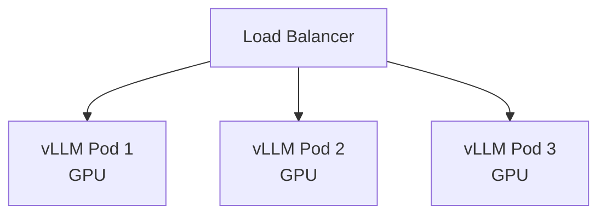

# Вопросы на собеседовании: `Model Serving`

**Model serving** — deployment ML/LLM моделей в production. Когда **API не подходит** (privacy, scale, cost) — нужно **self-host**. Стек: **vLLM**, **TGI**, **Triton**, **TorchServe**, **BentoML**, **Ollama**. Главные оптимизации: **continuous batching**, **quantization**, **KV cache**, **GPU sharing**.

## Полезные ссылки

### Официальная документация и авторитетные источники

- [vLLM Documentation](https://docs.vllm.ai/)
- [Hugging Face TGI](https://huggingface.co/docs/text-generation-inference/)
- [NVIDIA Triton Inference Server](https://docs.nvidia.com/deeplearning/triton-inference-server/)
- [BentoML Documentation](https://docs.bentoml.com/)
- [TensorRT-LLM](https://github.com/NVIDIA/TensorRT-LLM)
- [Ollama](https://ollama.com/)
- [llama.cpp](https://github.com/ggerganov/llama.cpp)

## Содержание

- [Полезные ссылки](#полезные-ссылки)
- [See also](#see-also)

**Базовые понятия**
- [Q1. (!) Что такое model serving?](#q1--что-такое-model-serving)
- [Q2. (!) Когда self-host vs API?](#q2--когда-self-host-vs-api)
- [Q3. (!) GPU vs CPU inference?](#q3--gpu-vs-cpu-inference)
- [Q4. Latency vs throughput trade-offs?](#q4-latency-vs-throughput-trade-offs)

**Tools для классических моделей**
- [Q5. (!) TorchServe?](#q5--torchserve)
- [Q6. TensorFlow Serving?](#q6-tensorflow-serving)
- [Q7. (!) NVIDIA Triton Inference Server?](#q7--nvidia-triton-inference-server)
- [Q8. (!) BentoML?](#q8--bentoml)

**Tools для LLM**
- [Q9. (!) vLLM — главный для LLM serving?](#q9--vllm--главный-для-llm-serving)
- [Q10. (!) Hugging Face TGI?](#q10--hugging-face-tgi)
- [Q11. TensorRT-LLM (NVIDIA)?](#q11-tensorrt-llm-nvidia)
- [Q12. Ollama — local LLMs?](#q12-ollama--local-llms)
- [Q13. llama.cpp — CPU inference?](#q13-llamacpp--cpu-inference)

**Optimizations для LLM**
- [Q14. (!) Continuous batching (PagedAttention)?](#q14--continuous-batching-pagedattention)
- [Q15. (!) KV cache?](#q15--kv-cache)
- [Q16. (!) Quantization (FP16, INT8, INT4, GPTQ, AWQ)?](#q16--quantization-fp16-int8-int4-gptq-awq)
- [Q17. Speculative decoding?](#q17-speculative-decoding)
- [Q18. Tensor parallelism, pipeline parallelism?](#q18-tensor-parallelism-pipeline-parallelism)

**Scaling**
- [Q19. (!) Horizontal scaling LLM serving?](#q19--horizontal-scaling-llm-serving)
- [Q20. GPU sharing (MIG, MPS)?](#q20-gpu-sharing-mig-mps)
- [Q21. Auto-scaling на queue depth?](#q21-auto-scaling-на-queue-depth)

**API patterns**
- [Q22. (!) OpenAI-compatible API?](#q22--openai-compatible-api)
- [Q23. Streaming responses?](#q23-streaming-responses)

**Cost optimization**
- [Q24. (!) Какой GPU выбрать (A100, H100, RTX 4090, ...)?](#q24--какой-gpu-выбрать-a100-h100-rtx-4090-)
- [Q25. (!) On-prem vs cloud GPU?](#q25--on-prem-vs-cloud-gpu)
- [Q26. Spot instances для inference?](#q26-spot-instances-для-inference)

**Production**
- [Q27. (!) Какие частые проблемы в model serving?](#q27--какие-частые-проблемы-в-model-serving)
- [Q28. (!) Когда выбрать какой serving stack?](#q28--когда-выбрать-какой-serving-stack)

## Q1. (!) Что такое model serving?

**Model serving** — процесс предоставления ML/LLM моделей через API для inference.

**Components:**
1. **Model loading** — load weights в RAM/GPU
2. **Request handling** — accept inputs (HTTP/gRPC)
3. **Inference** — predict
4. **Response** — return prediction

**Подходы:**
- **Embedded** — model внутри app (Python `model.predict()`)
- **Sidecar** — model в отдельном process на same machine
- **Microservice** — отдельный API service
- **Managed** — Sagemaker, Vertex AI

**Серьёзный production:** dedicated inference servers (vLLM, Triton).


> [!mcq]
> - [ ] Model serving = просто `model.predict()` в Python | ❌ ПОСЛЕДСТВИЕ: нет batching, GPU sharing, deployment patterns — не масштабируется.
> - [x] Inference server (vLLM/Triton/BentoML) с HTTP/gRPC API, model loading, batching, monitoring | ✓ ПРИМЕНЯТЬ: production ML 📋 ПРАВИЛО: «serving = больше чем predict()» 🔗 См. Q2
> - [ ] Достаточно завернуть модель в Flask app | ❌ ПОСЛЕДСТВИЕ: нет dynamic batching, плохая утилизация GPU.
> - [ ] Embedded model в каждом инстансе — лучшая практика для LLM | ❌ ПОСЛЕДСТВИЕ: LLM весит десятки GB, дублирование разорит по RAM/GPU.

## Q2. (!) Когда self-host vs API?

**API (OpenAI, Anthropic):**
- ✓ Quick start
- ✓ State-of-the-art models
- ✓ No infrastructure
- ✗ Per-token cost
- ✗ Data leaves your environment
- ✗ Rate limits, vendor lock-in

**Self-host:**
- ✓ Privacy (PII, compliance)
- ✓ Cheaper at scale (>10M tokens/month)
- ✓ Customization (fine-tuning)
- ✓ No vendor lock-in
- ✗ GPU infrastructure
- ✗ MLOps overhead
- ✗ Often хуже quality (open models)

**Break-even:** обычно self-host окупается **от 10M-100M tokens/month**.


> [!mcq]
> - [x] Self-host окупается от 10-100M tokens/month + privacy/PII compliance; API — quick start, SOTA, no infra | ✓ ПРИМЕНЯТЬ: enterprise scale 📋 ПРАВИЛО: «считай break-even tokens/month» 🔗 См. Q3
> - [ ] Self-host всегда дешевле API при любых объёмах | ❌ ПОСЛЕДСТВИЕ: на малых объёмах GPU стоит больше API-вызовов.
> - [ ] API всегда лучше — open models деградируют | ❌ ПОСЛЕДСТВИЕ: для chat/coding Llama/Qwen 2026 близки к GPT-4.
> - [ ] Self-host не имеет vendor lock-in проблем | ❌ ПОСЛЕДСТВИЕ: HuggingFace/CUDA/NVIDIA-stack — тоже зависимости.

## Q3. (!) GPU vs CPU inference?

| Критерий | GPU | CPU |
|----------|-----|-----|
| Speed (LLM) | 10-100x быстрее | Slow (но possible с llama.cpp) |
| Cost | $$$ | $ |
| Memory | Limited (24-80GB per GPU) | Up to TBs RAM |
| Latency | Низкая | Высокая |
| Embedding models | OK на CPU (small) | OK |
| Small classification | CPU достаточно | OK |

**Default:** LLM > 7B параметров — нужен GPU. < 1B — CPU OK.


> [!mcq]
> - [ ] GPU всегда быстрее CPU для любого ML | ❌ ПОСЛЕДСТВИЕ: для small classification/embeddings CPU достаточен, GPU неэффективен.
> - [x] LLM >7B → GPU (10-100x), <1B и classical ML → CPU OK; embeddings — CPU работает; учитывай GPU memory (24-80GB) | ✓ ПРИМЕНЯТЬ: подбор инстанса под модель 📋 ПРАВИЛО: «GPU memory = bottleneck для LLM» 🔗 См. Q4
> - [ ] Можно загрузить 70B модель в одну RTX 4090 (24GB) | ❌ ПОСЛЕДСТВИЕ: не помещается даже в INT4 без offload.
> - [ ] CPU нельзя использовать для LLM в принципе | ❌ ПОСЛЕДСТВИЕ: ложно — llama.cpp работает на CPU для quantized моделей.

## Q4. Latency vs throughput trade-offs?

**Latency-optimized:**
- Маленький batch size (часто batch=1)
- Single request быстро
- GPU не fully utilized

**Throughput-optimized:**
- Большой batch size
- Много concurrent requests
- Higher GPU utilization
- Higher per-request latency

**Continuous batching** (vLLM) — лучшее обоих миров: dynamic batching без latency penalty.


> [!mcq]
> - [ ] Latency = throughput, можно оптимизировать одно через другое | ❌ ПОСЛЕДСТВИЕ: путаница метрик — обычно trade-off.
> - [x] Latency-opt: batch=1, GPU underutilized; throughput-opt: big batch, higher per-request latency; continuous batching (vLLM) — оба | ✓ ПРИМЕНЯТЬ: SLA-driven design 📋 ПРАВИЛО: «выбирай метрику под use-case» 🔗 См. Q5
> - [ ] Большой batch всегда снижает latency | ❌ ПОСЛЕДСТВИЕ: ложно — увеличивает per-request latency, снижает per-batch.
> - [ ] Continuous batching не работает на vLLM | ❌ ПОСЛЕДСТВИЕ: vLLM — флагман continuous batching через PagedAttention.

## Q5. (!) TorchServe?

**TorchServe** — официальный inference server для PyTorch.

```python
# Define handler
class MyHandler:
    def initialize(self, ctx): ...
    def preprocess(self, data): ...
    def inference(self, model_input): ...
    def postprocess(self, inference_output): ...

# Serve
torchserve --start --model-store . --models my_model=my_model.mar
```

**Подходит для:**
- Classical PyTorch models
- Custom Python preprocessing
- Multiple model versions

**Не для LLM** (нет vLLM-style optimizations).


> [!mcq]
> - [x] TorchServe — официальный inference server для PyTorch с handler API (initialize/preprocess/inference/postprocess); не для LLM | ✓ ПРИМЕНЯТЬ: classical PyTorch (ResNet, BERT) 📋 ПРАВИЛО: «TorchServe для классики, vLLM для LLM» 🔗 См. Q6
> - [ ] TorchServe оптимизирован для LLM, заменяет vLLM | ❌ ПОСЛЕДСТВИЕ: нет continuous batching, PagedAttention.
> - [ ] TorchServe умеет сервить TensorFlow модели | ❌ ПОСЛЕДСТВИЕ: ложно — только PyTorch (для TF используется TF Serving).
> - [ ] TorchServe не поддерживает custom preprocessing | ❌ ПОСЛЕДСТВИЕ: ложно — handler API специально для custom Python кода.

## Q6. TensorFlow Serving?

**TF Serving** — для TensorFlow / Keras моделей.

```bash
docker run -p 8501:8501 \
  -v /path/to/model:/models/my_model \
  -e MODEL_NAME=my_model \
  tensorflow/serving
```

**Особенности:**
- Production-grade (Google использует internally)
- gRPC + REST API
- Hot-swap модель без рестарта
- Model versioning

В **2025** — TF теряет долю в favor PyTorch, но TF Serving остаётся в legacy systems.


> [!mcq]
> - [x] TF Serving — production-grade для TensorFlow/Keras, gRPC+REST, hot-swap моделей, versioning; теряет долю в favor PyTorch | ✓ ПРИМЕНЯТЬ: legacy TF systems 📋 ПРАВИЛО: «TF Serving для TF only» 🔗 См. Q7
> - [ ] TF Serving подходит и для PyTorch моделей | ❌ ПОСЛЕДСТВИЕ: ложно — для PyTorch нужен TorchServe или ONNX export.
> - [ ] Hot-swap моделей в TF Serving требует рестарт | ❌ ПОСЛЕДСТВИЕ: ложно — это ключевая фича.
> - [ ] TF Serving не поддерживает gRPC | ❌ ПОСЛЕДСТВИЕ: ложно — gRPC + REST оба нативны.

## Q7. (!) NVIDIA Triton Inference Server?

**Triton** (NVIDIA) — universal inference server.

**Особенности:**
- **Multi-framework** — PyTorch, TensorFlow, ONNX, TensorRT, OpenVINO, vLLM (через TensorRT-LLM)
- **Dynamic batching** — automatic
- **Model ensembles** — pipeline моделей
- **Multi-GPU** scheduling
- **gRPC + HTTP**

```python
# Model repository structure
model_repository/
  my_model/
    config.pbtxt
    1/
      model.onnx
```

```protobuf
# config.pbtxt
name: "my_model"
platform: "onnxruntime_onnx"
max_batch_size: 32
input [{ name: "input", data_type: TYPE_FP32, dims: [3, 224, 224] }]
output [{ name: "output", data_type: TYPE_FP32, dims: [1000] }]
```

В **production ML** — самый популярный general-purpose server.


> [!mcq]
> - [x] Universal multi-framework (PyTorch/TF/ONNX/TensorRT/vLLM), dynamic batching, model ensembles, multi-GPU, gRPC+HTTP — production ML default | ✓ ПРИМЕНЯТЬ: heterogeneous model zoo 📋 ПРАВИЛО: «Triton — швейцарский нож» 🔗 См. Q8
> - [ ] Triton поддерживает только TensorRT | ❌ ПОСЛЕДСТВИЕ: ложно — multi-framework это его суть.
> - [ ] Triton не умеет dynamic batching | ❌ ПОСЛЕДСТВИЕ: ложно — это ключевая фича.
> - [ ] Triton работает только на AMD GPU | ❌ ПОСЛЕДСТВИЕ: ложно — NVIDIA-flagship, AMD только через ROCm fork.

## Q8. (!) BentoML?

**BentoML** — Python-first framework для serving.

```python
import bentoml

@bentoml.service
class MyModel:
    def __init__(self):
        self.model = load_model()

    @bentoml.api
    def predict(self, input: str) -> dict:
        return self.model.predict(input)
```

```bash
bentoml serve service.py:MyModel
bentoml build  # build container
bentoml deploy  # to BentoCloud / K8s
```

**Особенности:**
- Pythonic, easy
- Auto-generated REST + gRPC
- Containerization
- Yatai / BentoCloud для deployment

Подходит для **classical ML + custom code**, не optimized для LLM (но поддерживает vLLM integration).


> [!mcq]
> - [x] Python-first decorator API (@bentoml.service/@bentoml.api), build → container → deploy (BentoCloud/K8s); удобно для classical ML | ✓ ПРИМЕНЯТЬ: ML с custom Python кодом 📋 ПРАВИЛО: «BentoML = ML + DevX» 🔗 См. Q9
> - [ ] BentoML заменяет vLLM для LLM serving | ❌ ПОСЛЕДСТВИЕ: BentoML — обёртка, не специализированный LLM stack.
> - [ ] BentoML не поддерживает GPU | ❌ ПОСЛЕДСТВИЕ: ложно — full GPU support через runner system.
> - [ ] BentoML работает только с TensorFlow | ❌ ПОСЛЕДСТВИЕ: framework-agnostic.

## Q9. (!) vLLM — главный для LLM serving?

**vLLM** (UC Berkeley) — самый популярный LLM serving в **2024-2025**.

```python
from vllm import LLM, SamplingParams

llm = LLM(model="meta-llama/Llama-3-8B-Instruct")
outputs = llm.generate(["Hello"], SamplingParams(temperature=0.7))
```

**Или OpenAI-compatible API:**

```bash
python -m vllm.entrypoints.openai.api_server \
  --model meta-llama/Llama-3-8B-Instruct \
  --port 8000
```

**Ключевые оптимизации:**
- **PagedAttention** — efficient KV cache management
- **Continuous batching** — добавление requests on-the-fly
- **Tensor parallelism**
- **Quantization support** (AWQ, GPTQ, FP8)
- **Prefix caching**

**Throughput:** 5-20x vs naive HuggingFace.

В **2025** — default choice для self-hosted LLM.


> [!mcq]
> - [x] vLLM (UC Berkeley): PagedAttention + continuous batching + AWQ/GPTQ/FP8 + OpenAI-compatible API, 5-20x throughput vs naive HF | ✓ ПРИМЕНЯТЬ: self-hosted LLM default 2024-2025 📋 ПРАВИЛО: «vLLM = production LLM serving» 🔗 См. Q10
> - [ ] vLLM работает только в Jupyter notebooks | ❌ ПОСЛЕДСТВИЕ: ложно — OpenAI-compatible API server для production.
> - [ ] vLLM не поддерживает quantization | ❌ ПОСЛЕДСТВИЕ: ложно — AWQ/GPTQ/FP8 встроены.
> - [ ] vLLM = просто PyTorch с tqdm bar | ❌ ПОСЛЕДСТВИЕ: упускаем PagedAttention и continuous batching — главные оптимизации.

## Q10. (!) Hugging Face TGI?

**Text Generation Inference (TGI)** — конкурент vLLM от Hugging Face.

```bash
docker run --gpus all -p 8080:80 \
  ghcr.io/huggingface/text-generation-inference:latest \
  --model-id meta-llama/Llama-3-8B-Instruct
```

**Особенности:**
- OpenAI-compatible API
- Continuous batching
- Quantization (bitsandbytes, GPTQ, AWQ)
- Tensor parallelism
- Production-ready (Hugging Face Inference Endpoints)

**vs vLLM:** очень похожи. TGI чуть проще к setup, vLLM чуть быстрее. Выбор по предпочтению.


> [!mcq]
> - [x] TGI — конкурент vLLM от Hugging Face: OpenAI API, continuous batching, quantization, tensor parallelism; почти эквивалент vLLM, проще setup | ✓ ПРИМЕНЯТЬ: HuggingFace стек 📋 ПРАВИЛО: «TGI ≈ vLLM, выбирай по вкусу» 🔗 См. Q11
> - [ ] TGI заменяет TorchServe и TF Serving | ❌ ПОСЛЕДСТВИЕ: TGI только для LLM генерации, не для классики.
> - [ ] TGI требует Hugging Face подписку | ❌ ПОСЛЕДСТВИЕ: ложно — open-source.
> - [ ] TGI не поддерживает quantization | ❌ ПОСЛЕДСТВИЕ: ложно — bitsandbytes, GPTQ, AWQ поддержаны.

## Q11. TensorRT-LLM (NVIDIA)?

**TensorRT-LLM** — NVIDIA optimized LLM inference. Использует TensorRT под капотом.

**Особенности:**
- Самая высокая throughput на NVIDIA GPUs
- Custom kernels (FP8, FA-2, etc.)
- Integration с Triton

**Минусы:**
- Сложнее setup
- Только NVIDIA
- Compile model для каждой GPU architecture

**Когда:** maximum performance critical, есть expertise.


> [!mcq]
> - [x] TensorRT-LLM (NVIDIA) — наивысшая throughput на NVIDIA через FP8/FA-2 custom kernels, Triton integration; сложный setup, vendor lock-in | ✓ ПРИМЕНЯТЬ: max performance + есть expertise 📋 ПРАВИЛО: «TensorRT-LLM = squeeze every drop» 🔗 См. Q12
> - [ ] TensorRT-LLM работает на AMD MI300 | ❌ ПОСЛЕДСТВИЕ: ложно — только NVIDIA.
> - [ ] TensorRT-LLM не требует compile для каждой GPU arch | ❌ ПОСЛЕДСТВИЕ: ложно — нужен rebuild для H100/A100/L4.
> - [ ] TensorRT-LLM медленнее vLLM | ❌ ПОСЛЕДСТВИЕ: ложно — на NVIDIA даёт +20-50% throughput.

## Q12. Ollama — local LLMs?

**Ollama** — простейший способ запустить LLM локально.

```bash
ollama pull llama3
ollama run llama3
```

**Особенности:**
- One command install
- Cross-platform (Mac, Linux, Windows)
- OpenAI-compatible API on `http://localhost:11434`
- Использует **llama.cpp** под капотом
- Library models (Llama, Mistral, Qwen, ...)

**Use cases:**
- Local development
- Privacy-sensitive POCs
- Edge deployments

**Не для production scale** — single-instance, not optimized for multi-user.


> [!mcq]
> - [x] Ollama: one-command install (`ollama run llama3`), cross-platform, OpenAI-compatible API на :11434, под капотом llama.cpp; не для production scale | ✓ ПРИМЕНЯТЬ: local dev, POC, edge 📋 ПРАВИЛО: «Ollama = developer experience» 🔗 См. Q13
> - [ ] Ollama масштабируется на тысячи RPS | ❌ ПОСЛЕДСТВИЕ: ложно — single-instance, нужен vLLM/TGI для scale.
> - [ ] Ollama требует NVIDIA GPU | ❌ ПОСЛЕДСТВИЕ: ложно — работает на Apple Silicon (Metal), CPU.
> - [ ] Ollama не имеет OpenAI-compatible API | ❌ ПОСЛЕДСТВИЕ: ложно — это его основное преимущество для интеграции.

## Q13. llama.cpp — CPU inference?

**llama.cpp** — C++ implementation для running LLM **на CPU** (с GPU acceleration optional).

```bash
./llama-cli -m models/llama-3-8b.gguf -p "Hello"
```

**Особенности:**
- CPU inference works (slow but works)
- GGUF format (quantized models)
- Low memory (4-bit, 5-bit, 8-bit)
- Fast on Apple Silicon (Metal)
- Used by Ollama, LM Studio

**Quantization levels:**
- `Q4_K_M` — 4-bit, balanced quality
- `Q8_0` — 8-bit, near-original quality
- `Q2_K` — 2-bit, fastest, lowest quality

В **2025** — llama.cpp позволяет запустить **70B model на MacBook** (с quantization).


> [!mcq]
> - [x] llama.cpp — C++ GGUF runtime, CPU+GPU (Metal/CUDA), Q4_K_M/Q8_0 quantization, позволяет 70B на MacBook | ✓ ПРИМЕНЯТЬ: edge, Apple Silicon 📋 ПРАВИЛО: «GGUF + quantization = edge LLM» 🔗 См. Q14
> - [ ] llama.cpp поддерживает только Python | ❌ ПОСЛЕДСТВИЕ: ложно — это C++ библиотека (Python bindings есть).
> - [ ] GGUF = такой же формат как ONNX | ❌ ПОСЛЕДСТВИЕ: путаница — GGUF специфичен для llama.cpp и его quantization.
> - [ ] Q4_K_M даёт качество эквивалентное FP16 | ❌ ПОСЛЕДСТВИЕ: ложно — 4-bit теряет качество, Q8_0 ближе к FP16.

## Q14. (!) Continuous batching (PagedAttention)?

**Naive batching:** wait for batch to fill up → process. Latency страдает.

**Continuous batching (vLLM):**
- Sequences разной длины обрабатываются вместе
- Готовые sequences "выходят" из batch, новые добавляются
- **GPU всегда занят**

```
Time 1: batch = [seq1 (token 1), seq2 (token 1), seq3 (token 1)]
Time 2: seq1 finished. batch = [seq4 (token 1), seq2 (token 2), seq3 (token 2)]
Time 3: ...
```

**PagedAttention** — техника от vLLM для memory management. KV cache **в страницах** (как virtual memory в OS), не contiguous.

**Эффект:** 5-10x throughput vs naive batching.


> [!mcq]
> - [ ] Continuous batching = просто статический batch=32 | ❌ ПОСЛЕДСТВИЕ: упускаем суть — динамическое добавление/выход sequences.
> - [x] Sequences разной длины обрабатываются вместе, готовые выходят, новые добавляются on-the-fly; PagedAttention хранит KV cache в страницах (как VM); 5-10x throughput | ✓ ПРИМЕНЯТЬ: production LLM serving 📋 ПРАВИЛО: «GPU всегда занят» 🔗 См. Q15
> - [ ] PagedAttention — это новый attention mechanism | ❌ ПОСЛЕДСТВИЕ: путаница — это memory management, не другой attention.
> - [ ] Continuous batching снижает throughput | ❌ ПОСЛЕДСТВИЕ: ложно — увеличивает throughput в 5-10x.

## Q15. (!) KV cache?

**KV cache** — для генерации token N, мы reuse computations всех previous tokens (через **K**ey/**V**alue из attention).

```
Generate token 1: process tokens 0
Generate token 2: process tokens 0, 1 (но 0 уже cached)
Generate token 3: process tokens 0, 1, 2 (но 0, 1 cached)
```

**Memory:** KV cache растёт с длиной sequence. Для long contexts может быть **больше model weights**.

**Optimization:**
- **PagedAttention** (vLLM) — efficient memory
- **Quantization KV cache** (FP8)
- **GQA (Grouped Query Attention)** — меньше KV heads
- **MQA (Multi-Query Attention)** — single KV head

В **2025** modern models (Llama 3, GPT-4) использовать GQA для memory savings.


> [!mcq]
> - [x] KV cache хранит K/V matrices из attention для prev tokens (reuse при генерации); растёт с sequence length, может быть больше weights; GQA/MQA/FP8 quantization снижают | ✓ ПРИМЕНЯТЬ: long-context inference 📋 ПРАВИЛО: «KV cache = memory bottleneck» 🔗 См. Q16
> - [ ] KV cache хранит входной prompt в txt-файле | ❌ ПОСЛЕДСТВИЕ: путаница — это GPU memory структура.
> - [ ] KV cache не зависит от sequence length | ❌ ПОСЛЕДСТВИЕ: ложно — растёт линейно.
> - [ ] GQA увеличивает KV cache | ❌ ПОСЛЕДСТВИЕ: ложно — GQA уменьшает, делит heads на группы.

## Q16. (!) Quantization (FP16, INT8, INT4, GPTQ, AWQ)?

| Format | Bits | Memory | Quality |
|--------|------|--------|---------|
| FP32 | 32 | 1x baseline | Best |
| FP16 / BF16 | 16 | 0.5x | Минимальная потеря |
| INT8 | 8 | 0.25x | Заметная потеря |
| INT4 | 4 | 0.125x | Существенная потеря (но usable) |

**Modern quantization methods:**
- **GPTQ** — post-training quantization, 4-bit
- **AWQ (Activation-aware Weight Quantization)** — лучше чем GPTQ
- **FP8** — для NVIDIA H100+ (native FP8 support)
- **BitsAndBytes** — Hugging Face library

**Эффект:** 70B model в FP16 = **140 GB**. В INT4 = **35 GB** → fits в одну A100/H100.

**Trade-off:** quality drop ~1-3% обычно приемлем.


> [!mcq]
> - [x] FP16/BF16 — минимум потерь, INT8 заметно, INT4 — существенно (но usable); GPTQ/AWQ/FP8/BnB — методы; 70B FP16=140GB, INT4=35GB | ✓ ПРИМЕНЯТЬ: fit big model in single GPU 📋 ПРАВИЛО: «AWQ > GPTQ по качеству» 🔗 См. Q17
> - [ ] Quantization всегда улучшает quality | ❌ ПОСЛЕДСТВИЕ: ложно — есть quality drop 1-3% и больше.
> - [ ] INT4 даёт идентичное FP32 качество | ❌ ПОСЛЕДСТВИЕ: ложно — существенная потеря, особенно на reasoning.
> - [ ] AWQ — это формат файла модели | ❌ ПОСЛЕДСТВИЕ: путаница — это метод activation-aware quantization.

## Q17. Speculative decoding?

**Speculative decoding** — small model **предсказывает** N tokens, big model **проверяет** их одним forward pass.

```
Small model: "The cat sat on the [mat, dog, sofa, ...]"
Big model: verify these candidates → accept "The cat sat on the mat", reject rest
```

**Эффект:** 2-3x speedup без потери quality (since big model still validates).

**Реализация:** vLLM, TGI, TensorRT-LLM поддерживают.


> [!mcq]
> - [x] Small "draft" model предсказывает N tokens → big model верифицирует одним forward pass; 2-3x speedup без quality loss | ✓ ПРИМЕНЯТЬ: latency-sensitive workloads 📋 ПРАВИЛО: «draft + verify» 🔗 См. Q18
> - [ ] Speculative decoding ухудшает качество ответов | ❌ ПОСЛЕДСТВИЕ: ложно — big model валидирует, итоговый output идентичен.
> - [ ] Можно делать без draft model | ❌ ПОСЛЕДСТВИЕ: суть в маленькой draft модели, которая делает быстрые предсказания.
> - [ ] Speculative decoding замедляет inference | ❌ ПОСЛЕДСТВИЕ: ложно — 2-3x ускорение.

## Q18. Tensor parallelism, pipeline parallelism?

**Tensor parallelism (TP):** разбить **layers** между GPUs.
```
GPU 1: half of attention heads
GPU 2: other half
```

**Pipeline parallelism (PP):** разбить **layers** между GPUs (sequential).
```
GPU 1: layers 1-10
GPU 2: layers 11-20
```

**Когда нужно:** model **не помещается** в одну GPU.

```bash
# vLLM с TP=4 (4 GPUs)
python -m vllm.entrypoints.openai.api_server \
  --model meta-llama/Llama-3-70B \
  --tensor-parallel-size 4
```

**70B FP16 = 140GB** → TP=2 на 80GB H100 (70GB per GPU).


> [!mcq]
> - [x] TP — разбить attention heads/слой между GPU (parallel); PP — слои sequentially между GPU; нужно когда модель не помещается в одну GPU | ✓ ПРИМЕНЯТЬ: 70B+ на multi-GPU 📋 ПРАВИЛО: «TP внутри слоя, PP между слоями» 🔗 См. Q19
> - [ ] TP и PP — синонимы | ❌ ПОСЛЕДСТВИЕ: путаница архитектур, неверный setup vLLM.
> - [ ] Tensor parallelism не работает в vLLM | ❌ ПОСЛЕДСТВИЕ: ложно — `--tensor-parallel-size` это базовая опция.
> - [ ] PP даёт лучший throughput чем TP | ❌ ПОСЛЕДСТВИЕ: для inference TP обычно быстрее, PP больше для training.

## Q19. (!) Horizontal scaling LLM serving?



**K8s deployment:**
- Каждый pod — vLLM/TGI с одной/несколькими GPU
- Round-robin / least-connection load balancing
- Auto-scaling на queue depth

**Подвох:** GPU pods **дорогие** (даже idle). Cold start медленный (load model в GPU = минуты). Auto-scale осторожно.


> [!mcq]
> - [x] LB → N vLLM/TGI pods (each w/ GPU), round-robin/least-conn; cold start медленный (минуты), GPU pods дорогие; auto-scale осторожно с pre-warm | ✓ ПРИМЕНЯТЬ: K8s LLM deployment 📋 ПРАВИЛО: «GPU pods ≠ stateless web pods» 🔗 См. Q20
> - [ ] Cold start LLM pod — миллисекунды | ❌ ПОСЛЕДСТВИЕ: ложно — load 70B model в GPU = 1-3 минуты.
> - [ ] Auto-scaling LLM работает как для обычных микросервисов | ❌ ПОСЛЕДСТВИЕ: spike в трафике обгоняет cold-start, нужны pre-warm pods.
> - [ ] GPU pods могут быть idle бесплатно | ❌ ПОСЛЕДСТВИЕ: GPU оплачивается даже при простое.

## Q20. GPU sharing (MIG, MPS)?

**MIG (Multi-Instance GPU)** — NVIDIA A100, H100 могут быть разделены на меньшие "виртуальные GPU".

```
A100 (80GB) → 7× MIG (10GB each)
```

Каждый MIG = изолированный GPU для inference.

**MPS (Multi-Process Service)** — несколько processes share один GPU.

**Когда нужно:** маленькие models (< 10GB) — wasteful использовать full A100. MIG позволяет 7 моделей на одной GPU.


> [!mcq]
> - [x] MIG (A100/H100) — изолированные виртуальные GPU (7×10GB на 80GB); MPS — несколько processes share GPU; для маленьких моделей экономия 7x | ✓ ПРИМЕНЯТЬ: множество маленьких моделей 📋 ПРАВИЛО: «MIG для изоляции, MPS для shared» 🔗 См. Q21
> - [ ] MIG работает на RTX 4090 | ❌ ПОСЛЕДСТВИЕ: ложно — только A100/H100 datacenter GPUs.
> - [ ] MIG и MPS — синонимы | ❌ ПОСЛЕДСТВИЕ: MIG hardware isolation, MPS software process sharing.
> - [ ] GPU нельзя разделить между приложениями | ❌ ПОСЛЕДСТВИЕ: ложно — MIG/MPS специально для этого.

## Q21. Auto-scaling на queue depth?

```yaml
# K8s HPA
metrics:
  - type: External
    external:
      metric:
        name: queue_depth
      target:
        type: AverageValue
        averageValue: 10
```

**Триггер:** если queue > 10 requests → add pod.

**Подвох:** GPU pod cold start = 1-3 минуты (load weights). Реактивное scaling не успевает за spikes.

**Solutions:**
- **Pre-warm** pods (always have spare)
- **Predictive scaling** (заранее по pattern)
- **Smaller models** в spike, escalate to large models по нужде


> [!mcq]
> - [x] HPA на queue_depth + pre-warm pods + predictive scaling, реактивный auto-scale не успевает за spikes (cold start 1-3 мин) | ✓ ПРИМЕНЯТЬ: bursty LLM workloads 📋 ПРАВИЛО: «GPU нельзя scale-on-demand как CPU» 🔗 См. Q22
> - [ ] HPA на CPU% работает для LLM так же как для микросервисов | ❌ ПОСЛЕДСТВИЕ: GPU bottleneck, CPU метрики обманывают.
> - [ ] Auto-scale должен срабатывать только когда все pods 100% busy | ❌ ПОСЛЕДСТВИЕ: spike приходит, новые pods не успевают, латенси разлетается.
> - [ ] Pre-warm pods — это waste of resources | ❌ ПОСЛЕДСТВИЕ: на самом деле обязательны для production SLA.

## Q22. (!) OpenAI-compatible API?

vLLM, TGI, Ollama, и другие — все имеют **OpenAI-compatible API**.

```python
from openai import OpenAI

client = OpenAI(
    base_url="http://my-vllm:8000/v1",
    api_key="dummy"  # vLLM не требует auth по default
)

response = client.chat.completions.create(
    model="meta-llama/Llama-3-8B",
    messages=[{"role": "user", "content": "Hello"}]
)
```

**Зачем:** **drop-in replacement** для OpenAI. Используем same code, swap base_url.

**Migration path:** start с OpenAI → switch to self-hosted vLLM когда scale достаточно.


> [!mcq]
> - [x] vLLM/TGI/Ollama имеют OpenAI-compatible API — drop-in replacement: меняем `base_url`, остальной код OpenAI SDK работает | ✓ ПРИМЕНЯТЬ: migration path API → self-hosted 📋 ПРАВИЛО: «один SDK, разные backends» 🔗 См. Q23
> - [ ] Self-hosted vLLM требует переписать весь клиентский код | ❌ ПОСЛЕДСТВИЕ: ложно — API совместим.
> - [ ] OpenAI-compatible API эмулирует только chat completions | ❌ ПОСЛЕДСТВИЕ: ложно — также completions, embeddings, streaming.
> - [ ] API совместимость замедляет inference | ❌ ПОСЛЕДСТВИЕ: ложно — это просто формат, на throughput не влияет.

## Q23. Streaming responses?

```python
stream = client.chat.completions.create(
    model="...",
    messages=[...],
    stream=True
)

for chunk in stream:
    print(chunk.choices[0].delta.content, end="")
```

vLLM, TGI поддерживают streaming через SSE (Server-Sent Events).

**Critical для UX** — пользователь не ждёт 30 секунд молча.


> [!mcq]
> - [x] SSE (Server-Sent Events) `stream=True`, chunks `delta.content`; vLLM/TGI поддерживают; critical для UX (без 30s ожидания) | ✓ ПРИМЕНЯТЬ: chatbots, real-time UI 📋 ПРАВИЛО: «без streaming — плохой UX» 🔗 См. Q24
> - [ ] Streaming работает только через WebSocket | ❌ ПОСЛЕДСТВИЕ: ложно — стандарт SSE.
> - [ ] Streaming замедляет генерацию | ❌ ПОСЛЕДСТВИЕ: ложно — генерация та же, но first-token-time улучшается для UX.
> - [ ] Streaming несовместим с OpenAI API | ❌ ПОСЛЕДСТВИЕ: ложно — это feature OpenAI API.

## Q24. (!) Какой GPU выбрать (A100, H100, RTX 4090, ...)?

**For LLM inference:**

| GPU | Memory | Cost | Best for |
|-----|--------|------|----------|
| **H100** (80GB) | 80GB HBM3 | ~$30K | Production, best perf |
| **A100** (40/80GB) | 40-80GB | ~$15-20K | Workhorse |
| **L40s** (48GB) | 48GB | ~$8-10K | Budget production |
| **RTX 4090** (24GB) | 24GB | ~$2K | Dev, small models |
| **RTX A6000** (48GB) | 48GB | ~$5K | Dev with bigger models |
| **MacBook M-series** | unified | $$ | Local dev (Apple Silicon) |

**Cloud:**
- **AWS p4d/p5** — A100/H100
- **GCP A3** — H100
- **Azure ND H100v5**
- **CoreWeave, Lambda Labs** — cheaper

**For 7B model:** RTX 4090 OK
**For 70B model:** A100/H100 (с quantization)
**For 405B model:** Multi-GPU H100 cluster


> [!mcq]
> - [x] H100/A100 — production (80GB HBM), L40s — budget production, RTX 4090 — dev/small, M-series Mac — local dev; key — GPU memory под model size+KV cache | ✓ ПРИМЕНЯТЬ: подбор GPU под модель 📋 ПРАВИЛО: «memory сначала, throughput потом» 🔗 См. Q25
> - [ ] RTX 4090 (24GB) подходит для 70B FP16 модели | ❌ ПОСЛЕДСТВИЕ: ложно — не помещается (нужно 140GB).
> - [ ] H100 быстрее A100 в 100 раз | ❌ ПОСЛЕДСТВИЕ: реальный gap ≈2-3x на LLM, не 100x.
> - [ ] Cloud GPU всегда доступны без waiting list | ❌ ПОСЛЕДСТВИЕ: H100 capacity ограничен, AWS/GCP queues.

## Q25. (!) On-prem vs cloud GPU?

**Cloud:**
- ✓ No upfront cost
- ✓ Auto-scaling
- ✓ Multiple regions
- ✗ **Очень дорого** at scale ($3-10/hour per A100)
- ✗ Capacity issues (H100 ограничен)

**On-prem:**
- ✗ Upfront cost ($30K+ per H100)
- ✗ Datacenter, power, cooling
- ✗ MLOps complexity
- ✓ **Cheaper at scale** (3-12 month payback)
- ✓ Full control

**Hybrid:** on-prem baseline + cloud для spikes.

**Break-even:** 24/7 utilization → on-prem окупается за 6-12 месяцев.


> [!mcq]
> - [x] Cloud — no upfront, auto-scale, $3-10/hr A100; on-prem — $30K H100, payback 6-12 мес при 24/7; hybrid baseline+spike | ✓ ПРИМЕНЯТЬ: считай utilization% 📋 ПРАВИЛО: «24/7 → on-prem; bursty → cloud» 🔗 См. Q26
> - [ ] Cloud всегда дешевле on-prem | ❌ ПОСЛЕДСТВИЕ: на 24/7 utilization cloud дороже в разы.
> - [ ] On-prem не имеет hidden costs | ❌ ПОСЛЕДСТВИЕ: power/cooling/datacenter/MLOps team — существенные расходы.
> - [ ] H100 в облаке доступен мгновенно в любом регионе | ❌ ПОСЛЕДСТВИЕ: ложно — capacity issues, waiting lists.

## Q26. Spot instances для inference?

**Spot/Preemptible** — cheap, но могут быть **прекращены** в любой момент (2-min warning).

**Для inference:**
- ✓ 50-90% cheaper
- ✗ Cold start = lose state, requests fail
- ✗ Не для critical realtime

**When OK:**
- **Batch inference** — restart batch если interrupted
- **Embeddings generation** — idempotent
- **Background processing**
- **Dev/staging environments**

**Not OK для:** user-facing realtime, where reliability critical.


> [!mcq]
> - [x] Spot 50-90% cheaper, но 2-min warning interrupt; OK для batch/embeddings/background/dev; NOT для user-facing realtime | ✓ ПРИМЕНЯТЬ: batch inference 📋 ПРАВИЛО: «idempotent → spot; realtime → on-demand» 🔗 См. Q27
> - [ ] Spot подходит для real-time chatbot в production | ❌ ПОСЛЕДСТВИЕ: прерывание = сессия теряется, плохой UX.
> - [ ] Spot экономия только 10-20% | ❌ ПОСЛЕДСТВИЕ: ложно — реально 50-90% (AWS spot).
> - [ ] Spot prevents auto-scaling | ❌ ПОСЛЕДСТВИЕ: ложно — может scale, просто не гарантирует availability.

## Q27. (!) Какие частые проблемы в model serving?

1. **OOM** — model слишком big для GPU. Quantize или multi-GPU.
2. **Slow cold start** — load weights = минуты. Pre-warm.
3. **Request queueing** — auto-scale slow → backpressure.
4. **GPU underutilization** — naive batching, single requests.
5. **Network bandwidth** — large requests/responses (с large context).
6. **Versioning challenges** — обновить model без downtime.
7. **Cost runaway** — GPU expensive, idle = money lost.
8. **Quality regressions** — после quantization quality drops.
9. **Different behavior** vs API (slight differences in prompt processing).
10. **Lack of monitoring** — не понятно что происходит.


> [!mcq]
> - [x] OOM, slow cold start, request queueing, GPU underutilization, version rollout без downtime, cost runaway, quality regression после quantization, monitoring blind spots | ✓ ПРИМЕНЯТЬ: чек-лист production readiness 📋 ПРАВИЛО: «10 проблем — проверь все» 🔗 См. Q28
> - [ ] Главная проблема model serving — отсутствие OpenAI API | ❌ ПОСЛЕДСТВИЕ: упускаем реальные проблемы (OOM, cold start).
> - [ ] GPU underutilization невозможен | ❌ ПОСЛЕДСТВИЕ: naive batching = GPU простаивает 80% времени.
> - [ ] Quantization никогда не снижает quality | ❌ ПОСЛЕДСТВИЕ: ложно — INT4 даёт ощутимый drop, нужно мерить.

## Q28. (!) Когда выбрать какой serving stack?

**Decision tree:**

```
LLM serving в production?
├── Open-source LLM, max throughput?
│   → vLLM (default 2025)
├── Hugging Face ecosystem, want managed?
│   → TGI или HF Inference Endpoints
├── NVIDIA, want max perf?
│   → TensorRT-LLM + Triton
├── Local dev / edge?
│   → Ollama (under the hood llama.cpp)
└── Multi-framework, classical ML?
    → Triton (general-purpose)

Classical ML?
├── PyTorch?
│   → TorchServe или BentoML
├── TensorFlow?
│   → TF Serving
└── Multi-framework?
    → Triton

Custom code, easy deploy?
└── BentoML или FastAPI + Pydantic
```

**Default 2025 для LLM:** **vLLM** для production, **Ollama** для local dev.

> [!mcq]
>
> **Вопрос:** Команде нужно поднять high-throughput LLM-serving (Llama 3 70B) для нагрузки 10K req/min с приоритетом на cost-efficiency. Какой framework выбирать в 2025?
>
> ---
>
> #### A) FastAPI + Hugging Face `transformers` `model.generate()` напрямую — это просто и достаточно — ❌ Неверно
>
> **Что на самом деле:** «vanilla» `transformers.generate()` — это **research API**, не production. Он не делает continuous batching: GPU обслуживает запросы строго по одному, каждый ждёт завершения предыдущего. На Llama 3 70B при 30 tokens/sec один запрос занимает 3-10 секунд → 10K req/min невозможно без 100+ GPU.
>
> **Откуда путаница:** «FastAPI + HF» — стандартный туториал. На малых моделях (BERT, sentence-transformers) этого хватает. Для LLM с auto-regressive generation нужен specialized serving.
>
> **Если бы это было правдой:** Hugging Face не разработал бы Text Generation Inference (TGI). vLLM не существовал бы как отдельный проект с 30K+ GitHub stars. Реальные production deployment'ы LLM (OpenAI, Anthropic) используют custom inference engines, не vanilla `generate()`.
>
> ---
>
> #### B) **vLLM** — он использует PagedAttention + continuous batching, что даёт 2-24× throughput vs vanilla HF — ✓ Верно
>
> **Развёрнутое объяснение:**
>
> **vLLM** (UC Berkeley, 2023) — open-source inference engine для LLM, де-факто стандарт 2025 для open-source models. Ключевые оптимизации:
>
> 1. **PagedAttention** — KV cache хранится в страницах фиксированного размера (как Linux virtual memory). Это решает internal fragmentation: до vLLM ~60-80% GPU memory тратилось впустую на padding до max context, vLLM использует ~95% эффективно.
> 2. **Continuous batching** — новые запросы добавляются в текущий batch сразу при освобождении слотов. Vanilla HF — static batching (ждёт пока ВСЕ запросы в batch завершатся). vLLM — dynamic, что даёт высокий throughput при variable-length запросах.
> 3. **OpenAI-compatible API** — endpoint `/v1/chat/completions` совместим с OpenAI SDK, легко мигрировать клиентов.
>
> Throughput vs HF Transformers (Llama 2 7B, A100 80GB):
> - HF: ~15 req/sec
> - vLLM: ~330 req/sec (22× ускорение)
>
> Для 10K req/min (167 req/sec) на Llama 3 70B нужен 1-2 H100 80GB с tensor parallelism. Стоимость cloud: ~$5-10/час vs $50-100/час на 8 GPU с vanilla HF.
>
> **Пример (Docker):**
> ```bash
> docker run --runtime nvidia --gpus all \
>   -v ~/.cache/huggingface:/root/.cache/huggingface \
>   -p 8000:8000 \
>   --ipc=host \
>   vllm/vllm-openai:latest \
>   --model meta-llama/Llama-3-70B-Instruct \
>   --tensor-parallel-size 2 \
>   --max-num-batched-tokens 4096
>
> # Клиент — OpenAI-compatible:
> curl http://localhost:8000/v1/chat/completions \
>   -H "Content-Type: application/json" \
>   -d '{
>     "model": "meta-llama/Llama-3-70B-Instruct",
>     "messages": [{"role": "user", "content": "Привет!"}]
>   }'
> ```
>
> **Когда применять:**
> - **Production LLM serving** для open-source моделей (Llama, Mistral, Qwen, DeepSeek, Gemma) — vLLM это default 2025.
> - **Self-hosted alternative для OpenAI/Anthropic** — vLLM serve'ит совместимый API, можно переключить клиентов через `OPENAI_API_BASE`.
> - **Internal AI platforms** в крупных компаниях (Yandex, Сбер, Wolt) — vLLM на собственных GPU кластерах для compliance/cost.
> - **Batch inference jobs** — vLLM efficient для offline scoring датасетов на больших моделях.
>
> **Подводные камни:**
> - **`--max-num-batched-tokens`** — критичен для memory tuning. Слишком высокий — OOM, слишком низкий — недогруз GPU. Начинать с 2K-4K и benchmark'ить.
> - **Tensor parallelism** через `--tensor-parallel-size N` требует N GPU с NVLink/InfiniBand. На обычных PCIe это медленнее single GPU.
> - **Quantization** (AWQ, GPTQ, FP8) поддерживаются через `--quantization awq` — критично для cost на 70B+ моделях.
> - **Streaming responses** — `stream: true` в request, vLLM возвращает SSE с token-by-token. Латентность TTFT (time to first token) ~100-300ms, vs Anthropic Claude ~500ms.
> - **Не для classical ML** — для XGBoost, sklearn, CV моделей лучше Triton или TorchServe.
>
> **Связанные вопросы:** [[Q1]] — общая архитектура inference server; [[Q3]] — batch processing strategies; [[Q5]] — KV cache механика; [[Q12]] — TGI как альтернатива от Hugging Face; [[Q15]] — Triton для multi-framework.
>
> ---
>
> #### C) **TensorRT-LLM + Triton Inference Server** — он самый быстрый из всех — ❌ Неверно (для general case)
>
> **Что на самом деле:** TensorRT-LLM действительно даёт лучшую performance на NVIDIA GPU (на 10-30% быстрее vLLM на отдельных моделях), но цена — **сложность развёртывания**. Требует:
> - Manual model conversion в TRT engine (специфично для GPU architecture — A100 ≠ H100, нужно re-compile)
> - Knowledge of TRT internals для optimization (FP8, INT4, tensor parallelism)
> - Triton's complex config files для serving
> - Привязка к NVIDIA ecosystem (нет CPU fallback)
>
> Для команды без NVIDIA-specialist'а развёртывание — недели работы, в то время как vLLM поднимается за час.
>
> **Откуда путаница:** «самое быстрое» != «лучший выбор». На single-GPU benchmark'ах TRT-LLM лидер, но для team без deep NVIDIA expertise — overhead не окупается. NVIDIA активно пушит свой стек, поэтому статьи преувеличивают перформанс.
>
> **Если бы это было правдой:** все production LLM-deployment'ы использовали бы TRT-LLM. Реально доминирует vLLM (UC Berkeley, vendor-neutral), потому что простота + 80% performance TRT-LLM > 100% performance + большая сложность.
>
> ---
>
> #### D) **Ollama** — он самый простой и production-ready — ❌ Неверно
>
> **Что на самом деле:** **Ollama** — отличная утилита для **local development и evaluation**, но не для production: построен поверх llama.cpp (CPU/GPU inference на одной машине), нет distributed inference, throughput для concurrent requests низкий (~5-20 req/sec для 7B model). На 10K req/min нужно 20-50 Ollama инстансов с балансировкой — операционный кошмар.
>
> **Откуда путаница:** Ollama прост для onboarding («ollama run llama3» работает за минуту). Простота настройки часто путается с production-readiness.
>
> **Если бы это было правдой:** Yandex/Сбер использовали бы Ollama для production. На самом деле они держат custom-builds vLLM или собственные inference engines на GPU clusters. Ollama — для localhost demo и small teams (<100 RPS).

---

## See also

- [LLM Basics](llm-basics-interview.md) — что serve'им
- [MLOps](mlops-interview.md) — operations контекст
- [LLM Integration Patterns](llm-integration-patterns-interview.md) — интеграция
- [AI Agents](ai-agents-interview.md) — где models используются
- [RAG](rag-interview.md) — application
- [Embeddings](embeddings-interview.md) — embedding model serving
- [Микросервисы](../architecture/microservices-interview.md) — model = microservice
- [Kubernetes](../devops/kubernetes-interview.md) — deployment
- [Docker](../devops/docker-interview.md) — containers для serving
- [Performance Testing](../performance/performance-testing-interview.md) — latency/throughput tests
- [Scalability](../architecture/scalability-patterns-interview.md) — horizontal scaling
- [Memory Management](../performance/memory-management-interview.md) — KV cache, GPU memory
- [[gpu-сloud-interview|GPU Cloud]] — где запустить (если будем добавлять)
