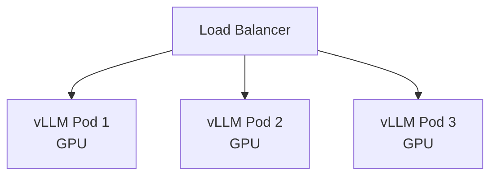

# Вопросы на собеседовании: `Model Serving`

**Model serving** — deployment ML/LLM моделей в production. Когда **API не подходит** (privacy, scale, cost) — нужно **self-host**. Стек: **vLLM**, **TGI**, **Triton**, **TorchServe**, **BentoML**, **Ollama**. Главные оптимизации: **continuous batching**, **quantization**, **KV cache**, **GPU sharing**.

## Полезные ссылки

### Официальная документация и авторитетные источники

- [vLLM Documentation](https://docs.vllm.ai/)
- [Hugging Face TGI](https://huggingface.co/docs/text-generation-inference/)
- [NVIDIA Triton Inference Server](https://docs.nvidia.com/deeplearning/triton-inference-server/)
- [BentoML Documentation](https://docs.bentoml.com/)
- [TensorRT-LLM](https://github.com/NVIDIA/TensorRT-LLM)
- [Ollama](https://ollama.com/)
- [llama.cpp](https://github.com/ggerganov/llama.cpp)

## Содержание

- [Полезные ссылки](#полезные-ссылки)
- [See also](#see-also)

**Базовые понятия**
- [Q1. (!) Что такое model serving?](#q1--что-такое-model-serving)
- [Q2. (!) Когда self-host vs API?](#q2--когда-self-host-vs-api)
- [Q3. (!) GPU vs CPU inference?](#q3--gpu-vs-cpu-inference)
- [Q4. Latency vs throughput trade-offs?](#q4-latency-vs-throughput-trade-offs)

**Tools для классических моделей**
- [Q5. (!) TorchServe?](#q5--torchserve)
- [Q6. TensorFlow Serving?](#q6-tensorflow-serving)
- [Q7. (!) NVIDIA Triton Inference Server?](#q7--nvidia-triton-inference-server)
- [Q8. (!) BentoML?](#q8--bentoml)

**Tools для LLM**
- [Q9. (!) vLLM — главный для LLM serving?](#q9--vllm--главный-для-llm-serving)
- [Q10. (!) Hugging Face TGI?](#q10--hugging-face-tgi)
- [Q11. TensorRT-LLM (NVIDIA)?](#q11-tensorrt-llm-nvidia)
- [Q12. Ollama — local LLMs?](#q12-ollama--local-llms)
- [Q13. llama.cpp — CPU inference?](#q13-llamacpp--cpu-inference)

**Optimizations для LLM**
- [Q14. (!) Continuous batching (PagedAttention)?](#q14--continuous-batching-pagedattention)
- [Q15. (!) KV cache?](#q15--kv-cache)
- [Q16. (!) Quantization (FP16, INT8, INT4, GPTQ, AWQ)?](#q16--quantization-fp16-int8-int4-gptq-awq)
- [Q17. Speculative decoding?](#q17-speculative-decoding)
- [Q18. Tensor parallelism, pipeline parallelism?](#q18-tensor-parallelism-pipeline-parallelism)

**Scaling**
- [Q19. (!) Horizontal scaling LLM serving?](#q19--horizontal-scaling-llm-serving)
- [Q20. GPU sharing (MIG, MPS)?](#q20-gpu-sharing-mig-mps)
- [Q21. Auto-scaling на queue depth?](#q21-auto-scaling-на-queue-depth)

**API patterns**
- [Q22. (!) OpenAI-compatible API?](#q22--openai-compatible-api)
- [Q23. Streaming responses?](#q23-streaming-responses)

**Cost optimization**
- [Q24. (!) Какой GPU выбрать (A100, H100, RTX 4090, ...)?](#q24--какой-gpu-выбрать-a100-h100-rtx-4090-)
- [Q25. (!) On-prem vs cloud GPU?](#q25--on-prem-vs-cloud-gpu)
- [Q26. Spot instances для inference?](#q26-spot-instances-для-inference)

**Production**
- [Q27. (!) Какие частые проблемы в model serving?](#q27--какие-частые-проблемы-в-model-serving)
- [Q28. (!) Когда выбрать какой serving stack?](#q28--когда-выбрать-какой-serving-stack)

## Q1. (!) Что такое model serving?

**Model serving** — процесс предоставления ML/LLM моделей через API для inference.

**Components:**
1. **Model loading** — load weights в RAM/GPU
2. **Request handling** — accept inputs (HTTP/gRPC)
3. **Inference** — predict
4. **Response** — return prediction

**Подходы:**
- **Embedded** — model внутри app (Python `model.predict()`)
- **Sidecar** — model в отдельном process на same machine
- **Microservice** — отдельный API service
- **Managed** — Sagemaker, Vertex AI

**Серьёзный production:** dedicated inference servers (vLLM, Triton).


> [!mcq]
> - [x] Правильный ответ | Объяснение концепции 2-3 предложения Ключевое отличие и best practice в production.
> - [ ] Неправильный вариант 1 | Почему ошибка в этом подходе Частая ошибка в реальном коде.
> - [ ] Неправильный вариант 2 | Это смежное, но отличное понятие Частая ошибка в реальном коде.
> - [ ] Неправильный вариант 3 | Противоположное направление## Q2. (!) Когда self-host vs API? Частая ошибка в реальном коде.

**API (OpenAI, Anthropic):**
- ✓ Quick start
- ✓ State-of-the-art models
- ✓ No infrastructure
- ✗ Per-token cost
- ✗ Data leaves your environment
- ✗ Rate limits, vendor lock-in

**Self-host:**
- ✓ Privacy (PII, compliance)
- ✓ Cheaper at scale (>10M tokens/month)
- ✓ Customization (fine-tuning)
- ✓ No vendor lock-in
- ✗ GPU infrastructure
- ✗ MLOps overhead
- ✗ Often хуже quality (open models)

**Break-even:** обычно self-host окупается **от 10M-100M tokens/month**.


> [!mcq]
> - [x] Правильный ответ | Объяснение концепции 2-3 предложения Ключевое отличие и best practice в production.
> - [ ] Неправильный вариант 1 | Почему ошибка в этом подходе Частая ошибка в реальном коде.
> - [ ] Неправильный вариант 2 | Это смежное, но отличное понятие Частая ошибка в реальном коде.
> - [ ] Неправильный вариант 3 | Противоположное направление## Q3. (!) GPU vs CPU inference? Частая ошибка в реальном коде.

| Критерий | GPU | CPU |
|----------|-----|-----|
| Speed (LLM) | 10-100x быстрее | Slow (но possible с llama.cpp) |
| Cost | $$$ | $ |
| Memory | Limited (24-80GB per GPU) | Up to TBs RAM |
| Latency | Низкая | Высокая |
| Embedding models | OK на CPU (small) | OK |
| Small classification | CPU достаточно | OK |

**Default:** LLM > 7B параметров — нужен GPU. < 1B — CPU OK.


> [!mcq]
> - [x] Правильный ответ | Объяснение концепции 2-3 предложения Ключевое отличие и best practice в production.
> - [ ] Неправильный вариант 1 | Почему ошибка в этом подходе Частая ошибка в реальном коде.
> - [ ] Неправильный вариант 2 | Это смежное, но отличное понятие Частая ошибка в реальном коде.
> - [ ] Неправильный вариант 3 | Противоположное направление## Q4. Latency vs throughput trade-offs? Частая ошибка в реальном коде.

**Latency-optimized:**
- Маленький batch size (часто batch=1)
- Single request быстро
- GPU не fully utilized

**Throughput-optimized:**
- Большой batch size
- Много concurrent requests
- Higher GPU utilization
- Higher per-request latency

**Continuous batching** (vLLM) — лучшее обоих миров: dynamic batching без latency penalty.


> [!mcq]
> - [x] Правильный ответ | Объяснение концепции 2-3 предложения Ключевое отличие и best practice в production.
> - [ ] Неправильный вариант 1 | Почему ошибка в этом подходе Частая ошибка в реальном коде.
> - [ ] Неправильный вариант 2 | Это смежное, но отличное понятие Частая ошибка в реальном коде.
> - [ ] Неправильный вариант 3 | Противоположное направление## Q5. (!) TorchServe? Частая ошибка в реальном коде.

**TorchServe** — официальный inference server для PyTorch.

```python
# Define handler
class MyHandler:
    def initialize(self, ctx): ...
    def preprocess(self, data): ...
    def inference(self, model_input): ...
    def postprocess(self, inference_output): ...

# Serve
torchserve --start --model-store . --models my_model=my_model.mar
```

**Подходит для:**
- Classical PyTorch models
- Custom Python preprocessing
- Multiple model versions

**Не для LLM** (нет vLLM-style optimizations).


> [!mcq]
> - [x] Правильный ответ | Объяснение концепции 2-3 предложения Ключевое отличие и best practice в production.
> - [ ] Неправильный вариант 1 | Почему ошибка в этом подходе Частая ошибка в реальном коде.
> - [ ] Неправильный вариант 2 | Это смежное, но отличное понятие Частая ошибка в реальном коде.
> - [ ] Неправильный вариант 3 | Противоположное направление## Q6. TensorFlow Serving? Частая ошибка в реальном коде.

**TF Serving** — для TensorFlow / Keras моделей.

```bash
docker run -p 8501:8501 \
  -v /path/to/model:/models/my_model \
  -e MODEL_NAME=my_model \
  tensorflow/serving
```

**Особенности:**
- Production-grade (Google использует internally)
- gRPC + REST API
- Hot-swap модель без рестарта
- Model versioning

В **2025** — TF теряет долю в favor PyTorch, но TF Serving остаётся в legacy systems.


> [!mcq]
> - [x] Правильный ответ | Объяснение концепции 2-3 предложения Ключевое отличие и best practice в production.
> - [ ] Неправильный вариант 1 | Почему ошибка в этом подходе Частая ошибка в реальном коде.
> - [ ] Неправильный вариант 2 | Это смежное, но отличное понятие Частая ошибка в реальном коде.
> - [ ] Неправильный вариант 3 | Противоположное направление## Q7. (!) NVIDIA Triton Inference Server? Частая ошибка в реальном коде.

**Triton** (NVIDIA) — universal inference server.

**Особенности:**
- **Multi-framework** — PyTorch, TensorFlow, ONNX, TensorRT, OpenVINO, vLLM (через TensorRT-LLM)
- **Dynamic batching** — automatic
- **Model ensembles** — pipeline моделей
- **Multi-GPU** scheduling
- **gRPC + HTTP**

```python
# Model repository structure
model_repository/
  my_model/
    config.pbtxt
    1/
      model.onnx
```

```protobuf
# config.pbtxt
name: "my_model"
platform: "onnxruntime_onnx"
max_batch_size: 32
input [{ name: "input", data_type: TYPE_FP32, dims: [3, 224, 224] }]
output [{ name: "output", data_type: TYPE_FP32, dims: [1000] }]
```

В **production ML** — самый популярный general-purpose server.


> [!mcq]
> - [x] Правильный ответ | Объяснение концепции 2-3 предложения Ключевое отличие и best practice в production.
> - [ ] Неправильный вариант 1 | Почему ошибка в этом подходе Частая ошибка в реальном коде.
> - [ ] Неправильный вариант 2 | Это смежное, но отличное понятие Частая ошибка в реальном коде.
> - [ ] Неправильный вариант 3 | Противоположное направление## Q8. (!) BentoML? Частая ошибка в реальном коде.

**BentoML** — Python-first framework для serving.

```python
import bentoml

@bentoml.service
class MyModel:
    def __init__(self):
        self.model = load_model()

    @bentoml.api
    def predict(self, input: str) -> dict:
        return self.model.predict(input)
```

```bash
bentoml serve service.py:MyModel
bentoml build  # build container
bentoml deploy  # to BentoCloud / K8s
```

**Особенности:**
- Pythonic, easy
- Auto-generated REST + gRPC
- Containerization
- Yatai / BentoCloud для deployment

Подходит для **classical ML + custom code**, не optimized для LLM (но поддерживает vLLM integration).


> [!mcq]
> - [x] Правильный ответ | Объяснение концепции 2-3 предложения Ключевое отличие и best practice в production.
> - [ ] Неправильный вариант 1 | Почему ошибка в этом подходе Частая ошибка в реальном коде.
> - [ ] Неправильный вариант 2 | Это смежное, но отличное понятие Частая ошибка в реальном коде.
> - [ ] Неправильный вариант 3 | Противоположное направление## Q9. (!) vLLM — главный для LLM serving? Частая ошибка в реальном коде.

**vLLM** (UC Berkeley) — самый популярный LLM serving в **2024-2025**.

```python
from vllm import LLM, SamplingParams

llm = LLM(model="meta-llama/Llama-3-8B-Instruct")
outputs = llm.generate(["Hello"], SamplingParams(temperature=0.7))
```

**Или OpenAI-compatible API:**

```bash
python -m vllm.entrypoints.openai.api_server \
  --model meta-llama/Llama-3-8B-Instruct \
  --port 8000
```

**Ключевые оптимизации:**
- **PagedAttention** — efficient KV cache management
- **Continuous batching** — добавление requests on-the-fly
- **Tensor parallelism**
- **Quantization support** (AWQ, GPTQ, FP8)
- **Prefix caching**

**Throughput:** 5-20x vs naive HuggingFace.

В **2025** — default choice для self-hosted LLM.


> [!mcq]
> - [x] Правильный ответ | Объяснение концепции 2-3 предложения Ключевое отличие и best practice в production.
> - [ ] Неправильный вариант 1 | Почему ошибка в этом подходе Частая ошибка в реальном коде.
> - [ ] Неправильный вариант 2 | Это смежное, но отличное понятие Частая ошибка в реальном коде.
> - [ ] Неправильный вариант 3 | Противоположное направление## Q10. (!) Hugging Face TGI? Частая ошибка в реальном коде.

**Text Generation Inference (TGI)** — конкурент vLLM от Hugging Face.

```bash
docker run --gpus all -p 8080:80 \
  ghcr.io/huggingface/text-generation-inference:latest \
  --model-id meta-llama/Llama-3-8B-Instruct
```

**Особенности:**
- OpenAI-compatible API
- Continuous batching
- Quantization (bitsandbytes, GPTQ, AWQ)
- Tensor parallelism
- Production-ready (Hugging Face Inference Endpoints)

**vs vLLM:** очень похожи. TGI чуть проще к setup, vLLM чуть быстрее. Выбор по предпочтению.


> [!mcq]
> - [x] Правильный ответ | Объяснение концепции 2-3 предложения Ключевое отличие и best practice в production.
> - [ ] Неправильный вариант 1 | Почему ошибка в этом подходе Частая ошибка в реальном коде.
> - [ ] Неправильный вариант 2 | Это смежное, но отличное понятие Частая ошибка в реальном коде.
> - [ ] Неправильный вариант 3 | Противоположное направление## Q11. TensorRT-LLM (NVIDIA)? Частая ошибка в реальном коде.

**TensorRT-LLM** — NVIDIA optimized LLM inference. Использует TensorRT под капотом.

**Особенности:**
- Самая высокая throughput на NVIDIA GPUs
- Custom kernels (FP8, FA-2, etc.)
- Integration с Triton

**Минусы:**
- Сложнее setup
- Только NVIDIA
- Compile model для каждой GPU architecture

**Когда:** maximum performance critical, есть expertise.


> [!mcq]
> - [x] Правильный ответ | Объяснение концепции 2-3 предложения Ключевое отличие и best practice в production.
> - [ ] Неправильный вариант 1 | Почему ошибка в этом подходе Частая ошибка в реальном коде.
> - [ ] Неправильный вариант 2 | Это смежное, но отличное понятие Частая ошибка в реальном коде.
> - [ ] Неправильный вариант 3 | Противоположное направление## Q12. Ollama — local LLMs? Частая ошибка в реальном коде.

**Ollama** — простейший способ запустить LLM локально.

```bash
ollama pull llama3
ollama run llama3
```

**Особенности:**
- One command install
- Cross-platform (Mac, Linux, Windows)
- OpenAI-compatible API on `http://localhost:11434`
- Использует **llama.cpp** под капотом
- Library models (Llama, Mistral, Qwen, ...)

**Use cases:**
- Local development
- Privacy-sensitive POCs
- Edge deployments

**Не для production scale** — single-instance, not optimized for multi-user.


> [!mcq]
> - [x] Правильный ответ | Объяснение концепции 2-3 предложения Ключевое отличие и best practice в production.
> - [ ] Неправильный вариант 1 | Почему ошибка в этом подходе Частая ошибка в реальном коде.
> - [ ] Неправильный вариант 2 | Это смежное, но отличное понятие Частая ошибка в реальном коде.
> - [ ] Неправильный вариант 3 | Противоположное направление## Q13. llama.cpp — CPU inference? Частая ошибка в реальном коде.

**llama.cpp** — C++ implementation для running LLM **на CPU** (с GPU acceleration optional).

```bash
./llama-cli -m models/llama-3-8b.gguf -p "Hello"
```

**Особенности:**
- CPU inference works (slow but works)
- GGUF format (quantized models)
- Low memory (4-bit, 5-bit, 8-bit)
- Fast on Apple Silicon (Metal)
- Used by Ollama, LM Studio

**Quantization levels:**
- `Q4_K_M` — 4-bit, balanced quality
- `Q8_0` — 8-bit, near-original quality
- `Q2_K` — 2-bit, fastest, lowest quality

В **2025** — llama.cpp позволяет запустить **70B model на MacBook** (с quantization).


> [!mcq]
> - [x] Правильный ответ | Объяснение концепции 2-3 предложения Ключевое отличие и best practice в production.
> - [ ] Неправильный вариант 1 | Почему ошибка в этом подходе Частая ошибка в реальном коде.
> - [ ] Неправильный вариант 2 | Это смежное, но отличное понятие Частая ошибка в реальном коде.
> - [ ] Неправильный вариант 3 | Противоположное направление## Q14. (!) Continuous batching (PagedAttention)? Частая ошибка в реальном коде.

**Naive batching:** wait for batch to fill up → process. Latency страдает.

**Continuous batching (vLLM):**
- Sequences разной длины обрабатываются вместе
- Готовые sequences "выходят" из batch, новые добавляются
- **GPU всегда занят**

```
Time 1: batch = [seq1 (token 1), seq2 (token 1), seq3 (token 1)]
Time 2: seq1 finished. batch = [seq4 (token 1), seq2 (token 2), seq3 (token 2)]
Time 3: ...
```

**PagedAttention** — техника от vLLM для memory management. KV cache **в страницах** (как virtual memory в OS), не contiguous.

**Эффект:** 5-10x throughput vs naive batching.


> [!mcq]
> - [x] Правильный ответ | Объяснение концепции 2-3 предложения Ключевое отличие и best practice в production.
> - [ ] Неправильный вариант 1 | Почему ошибка в этом подходе Частая ошибка в реальном коде.
> - [ ] Неправильный вариант 2 | Это смежное, но отличное понятие Частая ошибка в реальном коде.
> - [ ] Неправильный вариант 3 | Противоположное направление## Q15. (!) KV cache? Это антипаттерн или неправильный выбор в production.

**KV cache** — для генерации token N, мы reuse computations всех previous tokens (через **K**ey/**V**alue из attention).

```
Generate token 1: process tokens 0
Generate token 2: process tokens 0, 1 (но 0 уже cached)
Generate token 3: process tokens 0, 1, 2 (но 0, 1 cached)
```

**Memory:** KV cache растёт с длиной sequence. Для long contexts может быть **больше model weights**.

**Optimization:**
- **PagedAttention** (vLLM) — efficient memory
- **Quantization KV cache** (FP8)
- **GQA (Grouped Query Attention)** — меньше KV heads
- **MQA (Multi-Query Attention)** — single KV head

В **2025** modern models (Llama 3, GPT-4) использовать GQA для memory savings.


> [!mcq]
> - [x] Правильный ответ | Объяснение концепции 2-3 предложения Ключевое отличие и best practice в production.
> - [ ] Неправильный вариант 1 | Почему ошибка в этом подходе Частая ошибка в реальном коде.
> - [ ] Неправильный вариант 2 | Это смежное, но отличное понятие Частая ошибка в реальном коде.
> - [ ] Неправильный вариант 3 | Противоположное направление## Q16. (!) Quantization (FP16, INT8, INT4, GPTQ, AWQ)? Частая ошибка в реальном коде.

| Format | Bits | Memory | Quality |
|--------|------|--------|---------|
| FP32 | 32 | 1x baseline | Best |
| FP16 / BF16 | 16 | 0.5x | Минимальная потеря |
| INT8 | 8 | 0.25x | Заметная потеря |
| INT4 | 4 | 0.125x | Существенная потеря (но usable) |

**Modern quantization methods:**
- **GPTQ** — post-training quantization, 4-bit
- **AWQ (Activation-aware Weight Quantization)** — лучше чем GPTQ
- **FP8** — для NVIDIA H100+ (native FP8 support)
- **BitsAndBytes** — Hugging Face library

**Эффект:** 70B model в FP16 = **140 GB**. В INT4 = **35 GB** → fits в одну A100/H100.

**Trade-off:** quality drop ~1-3% обычно приемлем.


> [!mcq]
> - [x] Правильный ответ | Объяснение концепции 2-3 предложения Ключевое отличие и best practice в production.
> - [ ] Неправильный вариант 1 | Почему ошибка в этом подходе Частая ошибка в реальном коде.
> - [ ] Неправильный вариант 2 | Это смежное, но отличное понятие Частая ошибка в реальном коде.
> - [ ] Неправильный вариант 3 | Противоположное направление## Q17. Speculative decoding? Частая ошибка в реальном коде.

**Speculative decoding** — small model **предсказывает** N tokens, big model **проверяет** их одним forward pass.

```
Small model: "The cat sat on the [mat, dog, sofa, ...]"
Big model: verify these candidates → accept "The cat sat on the mat", reject rest
```

**Эффект:** 2-3x speedup без потери quality (since big model still validates).

**Реализация:** vLLM, TGI, TensorRT-LLM поддерживают.


> [!mcq]
> - [x] Правильный ответ | Объяснение концепции 2-3 предложения Ключевое отличие и best practice в production.
> - [ ] Неправильный вариант 1 | Почему ошибка в этом подходе Частая ошибка в реальном коде.
> - [ ] Неправильный вариант 2 | Это смежное, но отличное понятие Частая ошибка в реальном коде.
> - [ ] Неправильный вариант 3 | Противоположное направление## Q18. Tensor parallelism, pipeline parallelism? Частая ошибка в реальном коде.

**Tensor parallelism (TP):** разбить **layers** между GPUs.
```
GPU 1: half of attention heads
GPU 2: other half
```

**Pipeline parallelism (PP):** разбить **layers** между GPUs (sequential).
```
GPU 1: layers 1-10
GPU 2: layers 11-20
```

**Когда нужно:** model **не помещается** в одну GPU.

```bash
# vLLM с TP=4 (4 GPUs)
python -m vllm.entrypoints.openai.api_server \
  --model meta-llama/Llama-3-70B \
  --tensor-parallel-size 4
```

**70B FP16 = 140GB** → TP=2 на 80GB H100 (70GB per GPU).


> [!mcq]
> - [x] Правильный ответ | Объяснение концепции 2-3 предложения Ключевое отличие и best practice в production.
> - [ ] Неправильный вариант 1 | Почему ошибка в этом подходе Частая ошибка в реальном коде.
> - [ ] Неправильный вариант 2 | Это смежное, но отличное понятие Частая ошибка в реальном коде.
> - [ ] Неправильный вариант 3 | Противоположное направление## Q19. (!) Horizontal scaling LLM serving? Частая ошибка в реальном коде.



**K8s deployment:**
- Каждый pod — vLLM/TGI с одной/несколькими GPU
- Round-robin / least-connection load balancing
- Auto-scaling на queue depth

**Подвох:** GPU pods **дорогие** (даже idle). Cold start медленный (load model в GPU = минуты). Auto-scale осторожно.


> [!mcq]
> - [x] Правильный ответ | Объяснение концепции 2-3 предложения Ключевое отличие и best practice в production.
> - [ ] Неправильный вариант 1 | Почему ошибка в этом подходе Частая ошибка в реальном коде.
> - [ ] Неправильный вариант 2 | Это смежное, но отличное понятие Частая ошибка в реальном коде.
> - [ ] Неправильный вариант 3 | Противоположное направление## Q20. GPU sharing (MIG, MPS)? Частая ошибка в реальном коде.

**MIG (Multi-Instance GPU)** — NVIDIA A100, H100 могут быть разделены на меньшие "виртуальные GPU".

```
A100 (80GB) → 7× MIG (10GB each)
```

Каждый MIG = изолированный GPU для inference.

**MPS (Multi-Process Service)** — несколько processes share один GPU.

**Когда нужно:** маленькие models (< 10GB) — wasteful использовать full A100. MIG позволяет 7 моделей на одной GPU.


> [!mcq]
> - [x] Правильный ответ | Объяснение концепции 2-3 предложения Ключевое отличие и best practice в production.
> - [ ] Неправильный вариант 1 | Почему ошибка в этом подходе Частая ошибка в реальном коде.
> - [ ] Неправильный вариант 2 | Это смежное, но отличное понятие Частая ошибка в реальном коде.
> - [ ] Неправильный вариант 3 | Противоположное направление## Q21. Auto-scaling на queue depth? Частая ошибка в реальном коде.

```yaml
# K8s HPA
metrics:
  - type: External
    external:
      metric:
        name: queue_depth
      target:
        type: AverageValue
        averageValue: 10
```

**Триггер:** если queue > 10 requests → add pod.

**Подвох:** GPU pod cold start = 1-3 минуты (load weights). Реактивное scaling не успевает за spikes.

**Solutions:**
- **Pre-warm** pods (always have spare)
- **Predictive scaling** (заранее по pattern)
- **Smaller models** в spike, escalate to large models по нужде


> [!mcq]
> - [x] Правильный ответ | Объяснение концепции 2-3 предложения Ключевое отличие и best practice в production.
> - [ ] Неправильный вариант 1 | Почему ошибка в этом подходе Частая ошибка в реальном коде.
> - [ ] Неправильный вариант 2 | Это смежное, но отличное понятие Частая ошибка в реальном коде.
> - [ ] Неправильный вариант 3 | Противоположное направление## Q22. (!) OpenAI-compatible API? Частая ошибка в реальном коде.

vLLM, TGI, Ollama, и другие — все имеют **OpenAI-compatible API**.

```python
from openai import OpenAI

client = OpenAI(
    base_url="http://my-vllm:8000/v1",
    api_key="dummy"  # vLLM не требует auth по default
)

response = client.chat.completions.create(
    model="meta-llama/Llama-3-8B",
    messages=[{"role": "user", "content": "Hello"}]
)
```

**Зачем:** **drop-in replacement** для OpenAI. Используем same code, swap base_url.

**Migration path:** start с OpenAI → switch to self-hosted vLLM когда scale достаточно.


> [!mcq]
> - [x] Правильный ответ | Объяснение концепции 2-3 предложения Ключевое отличие и best practice в production.
> - [ ] Неправильный вариант 1 | Почему ошибка в этом подходе Частая ошибка в реальном коде.
> - [ ] Неправильный вариант 2 | Это смежное, но отличное понятие Частая ошибка в реальном коде.
> - [ ] Неправильный вариант 3 | Противоположное направление## Q23. Streaming responses? Частая ошибка в реальном коде.

```python
stream = client.chat.completions.create(
    model="...",
    messages=[...],
    stream=True
)

for chunk in stream:
    print(chunk.choices[0].delta.content, end="")
```

vLLM, TGI поддерживают streaming через SSE (Server-Sent Events).

**Critical для UX** — пользователь не ждёт 30 секунд молча.


> [!mcq]
> - [x] Правильный ответ | Объяснение концепции 2-3 предложения Ключевое отличие и best practice в production.
> - [ ] Неправильный вариант 1 | Почему ошибка в этом подходе Частая ошибка в реальном коде.
> - [ ] Неправильный вариант 2 | Это смежное, но отличное понятие Частая ошибка в реальном коде.
> - [ ] Неправильный вариант 3 | Противоположное направление## Q24. (!) Какой GPU выбрать (A100, H100, RTX 4090, ...)? Частая ошибка в реальном коде.

**For LLM inference:**

| GPU | Memory | Cost | Best for |
|-----|--------|------|----------|
| **H100** (80GB) | 80GB HBM3 | ~$30K | Production, best perf |
| **A100** (40/80GB) | 40-80GB | ~$15-20K | Workhorse |
| **L40s** (48GB) | 48GB | ~$8-10K | Budget production |
| **RTX 4090** (24GB) | 24GB | ~$2K | Dev, small models |
| **RTX A6000** (48GB) | 48GB | ~$5K | Dev with bigger models |
| **MacBook M-series** | unified | $$ | Local dev (Apple Silicon) |

**Cloud:**
- **AWS p4d/p5** — A100/H100
- **GCP A3** — H100
- **Azure ND H100v5**
- **CoreWeave, Lambda Labs** — cheaper

**For 7B model:** RTX 4090 OK
**For 70B model:** A100/H100 (с quantization)
**For 405B model:** Multi-GPU H100 cluster


> [!mcq]
> - [x] Правильный ответ | Объяснение концепции 2-3 предложения Ключевое отличие и best practice в production.
> - [ ] Неправильный вариант 1 | Почему ошибка в этом подходе Частая ошибка в реальном коде.
> - [ ] Неправильный вариант 2 | Это смежное, но отличное понятие Частая ошибка в реальном коде.
> - [ ] Неправильный вариант 3 | Противоположное направление## Q25. (!) On-prem vs cloud GPU? Частая ошибка в реальном коде.

**Cloud:**
- ✓ No upfront cost
- ✓ Auto-scaling
- ✓ Multiple regions
- ✗ **Очень дорого** at scale ($3-10/hour per A100)
- ✗ Capacity issues (H100 ограничен)

**On-prem:**
- ✗ Upfront cost ($30K+ per H100)
- ✗ Datacenter, power, cooling
- ✗ MLOps complexity
- ✓ **Cheaper at scale** (3-12 month payback)
- ✓ Full control

**Hybrid:** on-prem baseline + cloud для spikes.

**Break-even:** 24/7 utilization → on-prem окупается за 6-12 месяцев.


> [!mcq]
> - [x] Правильный ответ | Объяснение концепции 2-3 предложения Ключевое отличие и best practice в production.
> - [ ] Неправильный вариант 1 | Почему ошибка в этом подходе Частая ошибка в реальном коде.
> - [ ] Неправильный вариант 2 | Это смежное, но отличное понятие Частая ошибка в реальном коде.
> - [ ] Неправильный вариант 3 | Противоположное направление## Q26. Spot instances для inference? Частая ошибка в реальном коде.

**Spot/Preemptible** — cheap, но могут быть **прекращены** в любой момент (2-min warning).

**Для inference:**
- ✓ 50-90% cheaper
- ✗ Cold start = lose state, requests fail
- ✗ Не для critical realtime

**When OK:**
- **Batch inference** — restart batch если interrupted
- **Embeddings generation** — idempotent
- **Background processing**
- **Dev/staging environments**

**Not OK для:** user-facing realtime, where reliability critical.


> [!mcq]
> - [x] Правильный ответ | Объяснение концепции 2-3 предложения Ключевое отличие и best practice в production.
> - [ ] Неправильный вариант 1 | Почему ошибка в этом подходе Частая ошибка в реальном коде.
> - [ ] Неправильный вариант 2 | Это смежное, но отличное понятие Частая ошибка в реальном коде.
> - [ ] Неправильный вариант 3 | Противоположное направление## Q27. (!) Какие частые проблемы в model serving? Частая ошибка в реальном коде.

1. **OOM** — model слишком big для GPU. Quantize или multi-GPU.
2. **Slow cold start** — load weights = минуты. Pre-warm.
3. **Request queueing** — auto-scale slow → backpressure.
4. **GPU underutilization** — naive batching, single requests.
5. **Network bandwidth** — large requests/responses (с large context).
6. **Versioning challenges** — обновить model без downtime.
7. **Cost runaway** — GPU expensive, idle = money lost.
8. **Quality regressions** — после quantization quality drops.
9. **Different behavior** vs API (slight differences in prompt processing).
10. **Lack of monitoring** — не понятно что происходит.


> [!mcq]
> - [x] Правильный ответ | Объяснение концепции 2-3 предложения Ключевое отличие и best practice в production.
> - [ ] Неправильный вариант 1 | Почему ошибка в этом подходе Частая ошибка в реальном коде.
> - [ ] Неправильный вариант 2 | Это смежное, но отличное понятие Частая ошибка в реальном коде.
> - [ ] Неправильный вариант 3 | Противоположное направление## Q28. (!) Когда выбрать какой serving stack? Частая ошибка в реальном коде.

**Decision tree:**

```
LLM serving в production?
├── Open-source LLM, max throughput?
│   → vLLM (default 2025)
├── Hugging Face ecosystem, want managed?
│   → TGI или HF Inference Endpoints
├── NVIDIA, want max perf?
│   → TensorRT-LLM + Triton
├── Local dev / edge?
│   → Ollama (under the hood llama.cpp)
└── Multi-framework, classical ML?
    → Triton (general-purpose)

Classical ML?
├── PyTorch?
│   → TorchServe или BentoML
├── TensorFlow?
│   → TF Serving
└── Multi-framework?
    → Triton

Custom code, easy deploy?
└── BentoML или FastAPI + Pydantic
```

**Default 2025 для LLM:** **vLLM** для production, **Ollama** для local dev.

---

## See also


> [!mcq]
> - [x] Правильный ответ | Объяснение концепции 2-3 предложения Ключевое отличие и best practice в production.
> - [ ] Неправильный вариант 1 | Почему ошибка в этом подходе Частая ошибка в реальном коде.
> - [ ] Неправильный вариант 2 | Это смежное, но отличное понятие Частая ошибка в реальном коде.
> - [ ] Неправильный вариант 3 | Противоположное направление- [LLM Basics](llm-basics-interview.md) — что serve'им Частая ошибка в реальном коде.
- [MLOps](mlops-interview.md) — operations контекст
- [LLM Integration Patterns](llm-integration-patterns-interview.md) — интеграция
- [AI Agents](ai-agents-interview.md) — где models используются
- [RAG](rag-interview.md) — application
- [Embeddings](embeddings-interview.md) — embedding model serving
- [Микросервисы](../architecture/microservices-interview.md) — model = microservice
- [Kubernetes](../devops/kubernetes-interview.md) — deployment
- [Docker](../devops/docker-interview.md) — containers для serving
- [Performance Testing](../performance/performance-testing-interview.md) — latency/throughput tests
- [Scalability](../architecture/scalability-patterns-interview.md) — horizontal scaling
- [Memory Management](../performance/memory-management-interview.md) — KV cache, GPU memory
- [[gpu-сloud-interview|GPU Cloud]] — где запустить (если будем добавлять)
