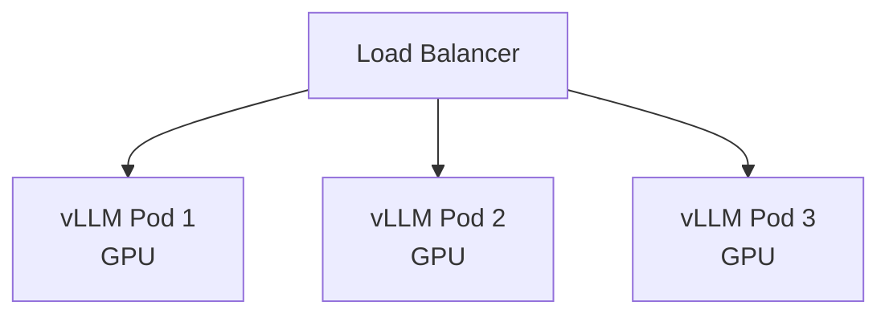

# Вопросы на собеседовании: `Model Serving`

**Model serving** — deployment ML/LLM моделей в production. Когда **API не подходит** (privacy, scale, cost) — нужно **self-host**. Стек: **vLLM**, **TGI**, **Triton**, **TorchServe**, **BentoML**, **Ollama**. Главные оптимизации: **continuous batching**, **quantization**, **KV cache**, **GPU sharing**.

## Полезные ссылки

### Официальная документация и авторитетные источники

- [vLLM Documentation](https://docs.vllm.ai/)
- [Hugging Face TGI](https://huggingface.co/docs/text-generation-inference/)
- [NVIDIA Triton Inference Server](https://docs.nvidia.com/deeplearning/triton-inference-server/)
- [BentoML Documentation](https://docs.bentoml.com/)
- [TensorRT-LLM](https://github.com/NVIDIA/TensorRT-LLM)
- [Ollama](https://ollama.com/)
- [llama.cpp](https://github.com/ggerganov/llama.cpp)

## Содержание

- [Полезные ссылки](#полезные-ссылки)
- [See also](#see-also)

**Базовые понятия**
- [Q1. (!) Что такое model serving?](#q1--что-такое-model-serving)
- [Q2. (!) Когда self-host vs API?](#q2--когда-self-host-vs-api)
- [Q3. (!) GPU vs CPU inference?](#q3--gpu-vs-cpu-inference)
- [Q4. Latency vs throughput trade-offs?](#q4-latency-vs-throughput-trade-offs)

**Tools для классических моделей**
- [Q5. (!) TorchServe?](#q5--torchserve)
- [Q6. TensorFlow Serving?](#q6-tensorflow-serving)
- [Q7. (!) NVIDIA Triton Inference Server?](#q7--nvidia-triton-inference-server)
- [Q8. (!) BentoML?](#q8--bentoml)

**Tools для LLM**
- [Q9. (!) vLLM — главный для LLM serving?](#q9--vllm--главный-для-llm-serving)
- [Q10. (!) Hugging Face TGI?](#q10--hugging-face-tgi)
- [Q11. TensorRT-LLM (NVIDIA)?](#q11-tensorrt-llm-nvidia)
- [Q12. Ollama — local LLMs?](#q12-ollama--local-llms)
- [Q13. llama.cpp — CPU inference?](#q13-llamacpp--cpu-inference)

**Optimizations для LLM**
- [Q14. (!) Continuous batching (PagedAttention)?](#q14--continuous-batching-pagedattention)
- [Q15. (!) KV cache?](#q15--kv-cache)
- [Q16. (!) Quantization (FP16, INT8, INT4, GPTQ, AWQ)?](#q16--quantization-fp16-int8-int4-gptq-awq)
- [Q17. Speculative decoding?](#q17-speculative-decoding)
- [Q18. Tensor parallelism, pipeline parallelism?](#q18-tensor-parallelism-pipeline-parallelism)

**Scaling**
- [Q19. (!) Horizontal scaling LLM serving?](#q19--horizontal-scaling-llm-serving)
- [Q20. GPU sharing (MIG, MPS)?](#q20-gpu-sharing-mig-mps)
- [Q21. Auto-scaling на queue depth?](#q21-auto-scaling-на-queue-depth)

**API patterns**
- [Q22. (!) OpenAI-compatible API?](#q22--openai-compatible-api)
- [Q23. Streaming responses?](#q23-streaming-responses)

**Cost optimization**
- [Q24. (!) Какой GPU выбрать (A100, H100, RTX 4090, ...)?](#q24--какой-gpu-выбрать-a100-h100-rtx-4090-)
- [Q25. (!) On-prem vs cloud GPU?](#q25--on-prem-vs-cloud-gpu)
- [Q26. Spot instances для inference?](#q26-spot-instances-для-inference)

**Production**
- [Q27. (!) Какие частые проблемы в model serving?](#q27--какие-частые-проблемы-в-model-serving)
- [Q28. (!) Когда выбрать какой serving stack?](#q28--когда-выбрать-какой-serving-stack)

## Q1. (!) Что такое model serving?

**Model serving** — процесс предоставления ML/LLM моделей через API для inference.

**Components:**
1. **Model loading** — load weights в RAM/GPU
2. **Request handling** — accept inputs (HTTP/gRPC)
3. **Inference** — predict
4. **Response** — return prediction

**Подходы:**
- **Embedded** — model внутри app (Python `model.predict()`)
- **Sidecar** — model в отдельном process на same machine
- **Microservice** — отдельный API service
- **Managed** — Sagemaker, Vertex AI

**Серьёзный production:** dedicated inference servers (vLLM, Triton).


> [!mcq] Что такое model serving в production-смысле, а не как demo на ноутбуке?
>
> - [ ] A. Model serving — это вызов `model.predict()` из Python-скрипта или Jupyter notebook, который запускается по cron.
>
>     **Что на самом деле.** Production model serving — это отдельный HTTP/gRPC-сервис с lifecycle модели (load/unload/version), dynamic batching, метриками p50/p95/p99, health checks, autoscaling. `model.predict()` — это лишь inference call внутри handler, а не serving stack.
>
>     **Откуда путаница.** В туториалах по ML Boot Camp и Kaggle stage заканчивается именно на `predict()`. Граница между research и production не показана, поэтому начинающие считают, что «обернуть в FastAPI» = serving.
>
>     **Если бы это было правдой.** На 100 RPS такая система давала бы latency p99 5-10 секунд: каждый запрос монопольно занимает GPU, нет batching, OOM при concurrent calls, простой при load model weights.
>
>     **Как было бы правильно.** Использовать inference server (TorchServe, Triton, vLLM), который владеет жизненным циклом модели и оптимизирует утилизацию железа.
>
> - [x] B. Model serving — это inference server (vLLM, Triton, TorchServe, BentoML) с HTTP/gRPC API, который управляет загрузкой весов, dynamic batching, версиями моделей и метриками.
>
>     **Развёрнутое объяснение.** Полноценный serving stack отделяет загрузку весов от обработки запросов, держит модель в GPU/RAM как warm state, агрегирует входящие requests в batches (continuous или dynamic), экспонирует REST/gRPC API, отдаёт метрики Prometheus, поддерживает rolling-обновление модели без потери in-flight requests. Это другой класс системы, чем `predict()` в скрипте.
>
>     **Пример.** Команда serve'ит Llama 3 70B через vLLM: один pod с 2× H100 (tensor-parallel), `--max-num-batched-tokens 4096`, OpenAI-compatible API на `:8000/v1/chat/completions`, метрики `vllm:num_requests_running` и `vllm:time_to_first_token_seconds` в Grafana, HPA по `vllm:num_requests_waiting`.
>
>     **Когда применять.** Production inference при concurrent traffic ≥ 10 RPS, требованиях к SLA (p95 ≤ N мс), нескольких версиях моделей в air-gapped среде, A/B-тестах, canary rollout. Любой serious self-hosted LLM или классическая ML с realtime SLA.
>
>     **Подводные камни.** Сам serving server не решает проблему cold start (load 70B модели = 1-3 минуты), не убирает GPU memory pressure (KV cache растёт линейно), требует отдельной инфраструктуры для Kubernetes operator / GPU scheduling / image registry с весами.
>
>     **Связанные вопросы.** [[model-serving-interview#Q2]] self-host vs API trade-offs; [[model-serving-interview#Q7]] Triton как универсальный server; [[model-serving-interview#Q9]] vLLM как LLM-default.
>
> - [ ] C. Достаточно завернуть модель в Flask app с одним `@app.route("/predict")` endpoint — это и есть production serving.
>
>     **Что на самом деле.** Flask + sync handler даёт single-threaded WSGI с одним worker per request: нет batching, GPU простаивает между requests, при concurrent traffic ставится очередь на уровне gunicorn. Это рабочий MVP, но не production serving.
>
>     **Откуда путаница.** Flask — классика «hello world» MLE-туториалов 2017-2020 годов. С тех пор inference servers (Triton, vLLM) специально решают то, чего Flask не делает: dynamic batching, KV cache management, multi-model loading.
>
>     **Если бы это было правдой.** Netflix, OpenAI, Hugging Face не разрабатывали бы свои serving stack'и. Throughput LLM на vLLM был бы такой же, как на Flask — а на Llama 2 7B разница 22× (15 req/sec vs 330 req/sec на A100).
>
>     **Как было бы правильно.** Flask допустим для маленькой sklearn-модели с < 1 RPS, для всего серьёзного — Triton / TorchServe / vLLM с правильным runtime.
>
> - [ ] D. Embedded-модель в каждом инстансе приложения — best practice для LLM, потому что снижает network latency и упрощает deployment.
>
>     **Что на самом деле.** Embedded подход (загрузить веса прямо в JVM/Python process) работает только для маленьких моделей (≤ 100 МБ): sklearn classifier, маленький transformer для re-ranking. Для LLM 7B+ модель весит 14-140 ГБ и должна жить в отдельном GPU-pod'е, иначе при N инстансов = N×140 ГБ GPU memory.
>
>     **Откуда путаница.** Embedded хорошо знаком из микросервисной разработки: каждый pod самодостаточен, нет cross-service network hop. Эта интуиция плохо переносится на LLM — модель слишком тяжёлая, чтобы дублировать.
>
>     **Если бы это было правдой.** Скейлинг web-tier'а с 5 до 50 pod'ов потребовал бы +45 GPU H100 (~$1.35M железа или $50K/час cloud), что экономически нереально.
>
>     **Как было бы правильно.** Web-tier остаётся stateless и легко масштабируется, инференс выносится в отдельные GPU-pod'ы (vLLM/Triton), web-tier ходит к ним через internal HTTP/gRPC.

## Q2. (!) Когда self-host vs API?

**API (OpenAI, Anthropic):**
- ✓ Quick start
- ✓ State-of-the-art models
- ✓ No infrastructure
- ✗ Per-token cost
- ✗ Data leaves your environment
- ✗ Rate limits, vendor lock-in

**Self-host:**
- ✓ Privacy (PII, compliance)
- ✓ Cheaper at scale (>10M tokens/month)
- ✓ Customization (fine-tuning)
- ✓ No vendor lock-in
- ✗ GPU infrastructure
- ✗ MLOps overhead
- ✗ Often хуже quality (open models)

**Break-even:** обычно self-host окупается **от 10M-100M tokens/month**.


> [!mcq] Когда команде имеет смысл self-host LLM вместо использования OpenAI/Anthropic API?
>
> - [x] A. Self-host окупается примерно от 10-100M tokens/month и в случаях privacy/compliance (PII, банковские данные, медицина); API остаётся лучшим выбором для quick start, SOTA-моделей и команды без MLOps-экспертизы.
>
>     **Развёрнутое объяснение.** Break-even по деньгам считается как: `GPU rental cost + ops overhead` против `provider tokens × price`. На A100 80GB cloud ($3-4/час, ~$2.5K/мес) можно прогнать ~30-50M output tokens/мес. На Llama 3 70B AWQ — это эквивалент ~$300-1000/мес затрат на GPT-4o API. Privacy/compliance аргументы (data residency, HIPAA, банковская тайна) часто перевешивают экономику и форсируют self-host даже при низких объёмах.
>
>     **Пример.** Российский банк serve'ит Llama 3 70B AWQ на 4× A100 on-prem для обработки клиентских обращений: ~50M tokens/день, данные не покидают периметр, $40K железа окупается за 4 месяца при сравнении с OpenAI API; альтернатива (API) запрещена политикой ИБ.
>
>     **Когда применять.** Объём ≥ 10M tokens/мес стабильный + PII/compliance ограничения, либо нужна fine-tuned модель на собственных данных, либо low-latency требования (< 200ms TTFT в собственном регионе), либо air-gapped среда.
>
>     **Подводные камни.** Open-models (Llama, Qwen, DeepSeek) часто отстают от frontier на reasoning/multimodal задачах на 6-12 месяцев. MLOps-затраты (on-call, monitoring, security patches CUDA) обычно недооценивают: 1-2 FTE на команду. Capacity-планирование сложнее, чем «дать API больше денег».
>
>     **Связанные вопросы.** [[model-serving-interview#Q3]] GPU vs CPU выбор; [[model-serving-interview#Q24]] выбор GPU под модель; [[model-serving-interview#Q25]] on-prem vs cloud GPU.
>
> - [ ] B. Self-host всегда дешевле API при любых объёмах, даже при 100K tokens/месяц.
>
>     **Что на самом деле.** На малых объёмах (< 1M tokens/мес) self-host жёстко проигрывает: A100 cloud ~$2.5K/мес даже при 1% утилизации, в то время как GPT-4o-mini обработает 1M tokens за ~$0.6. Break-even начинается с 10-100M tokens/мес.
>
>     **Откуда путаница.** В блог-статьях про «cost of inference» часто берётся peak workload и idealistic GPU utilization 100%, что в реальности недостижимо при bursty traffic.
>
>     **Если бы это было правдой.** Startup'ы с 10K MAU тратили бы тысячи долларов на GPU вместо $50/мес на OpenAI API и быстро бы разорились. На самом деле большинство early-stage AI-продуктов начинают с API.
>
>     **Как было бы правильно.** Зафиксировать tokens/мес и стоимость GPU, посчитать break-even — обычно это 10M+ tokens/мес.
>
> - [ ] C. API всегда лучше self-host, потому что open-source модели катастрофически деградируют по сравнению с GPT-4 и Claude.
>
>     **Что на самом деле.** На chat и coding задачах Llama 3.1 405B и Qwen 2.5 в 2025 году близки к GPT-4o, иногда обходят на specific domains (русский язык — YandexGPT, китайский — Qwen). На reasoning frontier-задачах (математика, multimodal) gap пока остаётся, но не «катастрофический».
>
>     **Откуда путаница.** Бенчмарки 2023 года (Llama 2 vs GPT-4) показывали огромный разрыв; устаревшие оценки переносят на 2025 без обновления.
>
>     **Если бы это было правдой.** Meta, Mistral, Alibaba, DeepSeek не открывали бы веса — нет коммерческого смысла. На самом деле они активно конкурируют с closed-source и держатся в топах chatbot arena.
>
>     **Как было бы правильно.** Сравнивать конкретную open-модель с конкретной задачей на свежих бенчмарках (LMSYS Arena, MMLU-Pro 2025); для большинства бизнес-кейсов open-models достаточны.
>
> - [ ] D. Self-host полностью устраняет vendor lock-in — нет никаких зависимостей от внешних поставщиков.
>
>     **Что на самом деле.** Self-host меняет one lock-in (OpenAI) на другой: NVIDIA CUDA ecosystem, Hugging Face hub для весов, специфичная версия PyTorch/vLLM. Переезд с CUDA на AMD ROCm — это месяцы работы, с HF на собственное хранилище — отдельный проект.
>
>     **Откуда путаница.** Термин «vendor lock-in» обычно применяют только к SaaS-провайдерам, упуская инфраструктурные зависимости.
>
>     **Если бы это было правдой.** Можно было бы свободно мигрировать с NVIDIA на AMD без переписывания stack'а. Реальность: до 2025 года 95% production LLM-deployment'ов работают только на CUDA.
>
>     **Как было бы правильно.** Признать, что self-host даёт независимость от LLM API провайдера, но создаёт зависимость от GPU vendor и open-source stack'а — это другая, но не нулевая, цена.

## Q3. (!) GPU vs CPU inference?

| Критерий | GPU | CPU |
|----------|-----|-----|
| Speed (LLM) | 10-100x быстрее | Slow (но possible с llama.cpp) |
| Cost | $$$ | $ |
| Memory | Limited (24-80GB per GPU) | Up to TBs RAM |
| Latency | Низкая | Высокая |
| Embedding models | OK на CPU (small) | OK |
| Small classification | CPU достаточно | OK |

**Default:** LLM > 7B параметров — нужен GPU. < 1B — CPU OK.


> [!mcq] Как правильно выбрать между GPU и CPU для serving конкретной модели?
>
> - [ ] A. GPU всегда быстрее CPU для любого ML inference, поэтому всё нужно serve'ить на GPU.
>
>     **Что на самом деле.** Для маленьких classification (логистическая регрессия, маленькие XGBoost), sentence-transformers embeddings, маленьких NER-моделей CPU работает в пределах SLA (1-5 ms latency) и стоит на порядок дешевле. GPU даёт выигрыш только когда модель достаточно велика, чтобы parallel matmul'ы окупали PCIe-overhead на загрузку входа.
>
>     **Откуда путаница.** «GPU для ML» — расхожая фраза из эры deep learning training, где это абсолютно верно. Для inference маленьких моделей правило не работает.
>
>     **Если бы это было правдой.** Vespa, Solr, sklearn в production не использовались бы — но они работают на CPU и обслуживают миллиарды запросов в день. Embedding-сервисы Yandex/Wolt часто крутятся на CPU.
>
>     **Как было бы правильно.** Выбирать акселератор по размеру модели и latency-требованиям, а не по принципу «ML = GPU».
>
> - [ ] B. CPU нельзя использовать для LLM в принципе — это технически невозможно.
>
>     **Что на самом деле.** llama.cpp с GGUF-квантизацией (Q4_K_M, Q5_K_M) запускает Llama 3 8B на CPU c throughput 5-15 tokens/sec, что приемлемо для local-dev, edge-deployment, on-device inference на ноутбуках. Apple Silicon с Metal делает это ещё быстрее.
>
>     **Откуда путаница.** Большие облачные LLM (GPT-4) действительно крутятся на GPU/TPU, и от этого делается обобщение «LLM = GPU only».
>
>     **Если бы это было правдой.** Ollama, LM Studio, llama.cpp не существовали бы — они построены именно вокруг CPU/Metal inference. Apple не пушил бы on-device LLM в iOS 18.
>
>     **Как было бы правильно.** CPU допустим для LLM при low-throughput сценариях (1-2 concurrent users) и quantized моделях; для serious serving с десятками RPS нужен GPU.
>
> - [x] C. Правило: LLM ≥ 7B параметров на production traffic → GPU (10-100× быстрее CPU), модели < 1B и classical ML → CPU обычно достаточен; embeddings отлично работают на CPU; ключевой constraint — GPU memory (24-80 ГБ).
>
>     **Развёрнутое объяснение.** GPU выигрывает за счёт massive parallel matmul'ов и high-bandwidth memory (HBM3 даёт ~3 ТБ/с против ~50 ГБ/с DDR5). Это окупается, когда матричные операции составляют > 80% времени inference, что верно для трансформеров. Для маленьких моделей PCIe overhead и kernel launch latency перекрывают выгоду. Ключевой бюджет для LLM — GPU VRAM: 7B FP16 = 14 ГБ, 70B FP16 = 140 ГБ, плюс KV cache 1-10 ГБ.
>
>     **Пример.** Команда serve'ит две модели: BERT-base (110M params, NER на CPU 8 vCPU, ~10ms latency, $50/мес на c6i.2xlarge) и Llama 3 8B (chat assistant на 1× A10G 24 ГБ, ~30 tokens/sec на запрос, $500/мес на g5.xlarge). Обе на GPU было бы недозагрузкой за $1000/мес; обе на CPU — Llama выдавала бы 1-3 tokens/sec, неприемлемо.
>
>     **Когда применять.** При выборе compute для нового сервиса: считаем размер модели и target throughput, проверяем помещается ли в GPU memory (вместе с KV cache), оцениваем latency budget. Embeddings (`all-MiniLM-L6-v2`, `e5-small`) — на CPU; chat LLM — на GPU.
>
>     **Подводные камни.** Apple Silicon (M2/M3) с Metal — между CPU и discrete GPU по производительности, не вписывается в классическую дихотомию. AMD MI300 догоняет H100, но CUDA-софт требует портирования на ROCm. CPU NUMA-эффекты могут давать 2× разницу между «правильной» и «неправильной» pinning стратегиями.
>
>     **Связанные вопросы.** [[model-serving-interview#Q16]] quantization для fit в GPU memory; [[model-serving-interview#Q24]] выбор конкретного GPU; [[model-serving-interview#Q13]] llama.cpp для CPU inference.
>
> - [ ] D. Можно спокойно загрузить 70B модель в одну RTX 4090 (24 ГБ VRAM), потому что современные оптимизации делают модели «маленькими».
>
>     **Что на самом деле.** 70B FP16 = 140 ГБ, INT8 = 70 ГБ, INT4 = 35 ГБ — даже самая агрессивная квантизация не помещается в 24 ГБ. Максимум для 4090 — 13-14B INT4 или 7-8B FP16 с минимальным KV cache.
>
>     **Откуда путаница.** Заголовки «70B на ноутбуке» в HN/Reddit часто умалчивают, что речь о CPU offload через llama.cpp с throughput 0.5-2 tokens/sec — это работает, но не на GPU only.
>
>     **Если бы это было правдой.** Никто бы не покупал H100 за $30K, все бы держали кластеры RTX 4090. Реально провайдеры (Together, Anyscale) для 70B используют 2× H100 80 ГБ или 4× A100.
>
>     **Как было бы правильно.** Для 70B нужно либо multi-GPU с tensor parallelism (2× H100 80 ГБ), либо агрессивная квантизация + CPU offload через llama.cpp с потерей throughput.

## Q4. Latency vs throughput trade-offs?

**Latency-optimized:**
- Маленький batch size (часто batch=1)
- Single request быстро
- GPU не fully utilized

**Throughput-optimized:**
- Большой batch size
- Много concurrent requests
- Higher GPU utilization
- Higher per-request latency

**Continuous batching** (vLLM) — лучшее обоих миров: dynamic batching без latency penalty.


> [!mcq] Какое утверждение корректно описывает trade-off между latency и throughput в LLM serving?
>
> - [ ] A. Latency и throughput — это синонимы: оптимизация одной метрики автоматически улучшает другую.
>
>     **Что на самом деле.** Latency — время одного запроса (TTFT, p95), throughput — суммарное число tokens/sec на серверe. Они часто конфликтуют: batch=32 даёт высокий throughput, но per-request latency растёт; batch=1 даёт минимальную latency, но GPU простаивает 80% времени.
>
>     **Откуда путаница.** В web-сервисах для маленьких stateless запросов улучшение latency и throughput часто скоррелировано (быстрее обработали — больше успели). В GPU inference batching ломает эту корреляцию.
>
>     **Если бы это было правдой.** Не нужны были бы две метрики, в API-спецификациях не было бы отдельных параметров `max_num_batched_tokens` и `max_num_seqs`. Реально оба знака настраиваются отдельно в vLLM/TGI.
>
>     **Как было бы правильно.** Latency и throughput — разные метрики с trade-off; balance подбирается под SLA конкретного сервиса.
>
> - [ ] B. Чем больше batch size — тем ниже latency каждого отдельного запроса.
>
>     **Что на самом деле.** Большой batch уменьшает latency на token среди batch'а, но увеличивает per-request latency: запросы ждут, пока соберётся batch, плюс forward pass на большом batch длиннее, чем на batch=1.
>
>     **Откуда путаница.** Метафора «оптом дешевле» переносится с web-batch'инга на GPU; правда лишь частично — throughput растёт, но за счёт latency.
>
>     **Если бы это было правдой.** Можно было бы поставить batch=256 и получить минимальную latency. Реально benchmarks vLLM на A100 показывают: batch=1 даёт TTFT 100ms, batch=256 — TTFT 800-1500ms.
>
>     **Как было бы правильно.** Маленький batch минимизирует latency одного запроса, большой — увеличивает throughput кластера; оптимум подбирается под SLA.
>
> - [ ] C. Continuous batching недоступна на vLLM, поэтому vLLM не годится для production.
>
>     **Что на самом деле.** vLLM — флагманская реализация continuous batching через PagedAttention; это её главная фишка с 2023 года. Авторы vLLM (UC Berkeley) опубликовали оригинальную статью про PagedAttention, и эта техника позже стала отраслевым стандартом.
>
>     **Откуда путаница.** Иногда путают «static batching» (старый naive подход в HF Transformers) с continuous batching и приписывают первое всем serving stack'ам.
>
>     **Если бы это было правдой.** vLLM не имел бы 30K+ GitHub stars, NVIDIA не интегрировала бы поддержку vLLM в Triton. На самом деле vLLM — golden standard для open-source LLM serving в 2024-2025.
>
>     **Как было бы правильно.** Continuous batching — это сильнейшая фича vLLM, ровно поэтому он стал индустриальным стандартом.
>
> - [x] D. Latency-optimized режим — маленький batch (часто 1), GPU underutilized, низкая TTFT; throughput-optimized — большой batch, высокая per-request latency; continuous batching (vLLM, TGI) даёт оба преимущества за счёт on-the-fly входа новых запросов в batch.
>
>     **Развёрнутое объяснение.** Классические серверы выбирали один режим: или latency (batch=1, минимум очереди), или throughput (большой batch, ждём, пока соберётся). Continuous batching ломает эту дихотомию: GPU всегда полна работой, потому что готовые sequences «выходят» из batch'а сразу, и на их место входят новые. PagedAttention в vLLM делает это memory-efficient: KV cache хранится постранично, sequences разной длины не блокируют друг друга. Результат: throughput 5-20× по сравнению с naive HF при сопоставимом TTFT.
>
>     **Пример.** Chat-сервис с SLA p95 TTFT ≤ 500ms и target 200 concurrent users: vLLM с `--max-num-seqs 64 --max-num-batched-tokens 4096` даёт TTFT ~200ms и throughput ~150 tokens/sec на A100 для Llama 3 8B. Naive HF с batch=8 на той же карте дал бы TTFT 800ms+ при том же throughput.
>
>     **Когда применять.** Любое serious LLM serving: chatbots, copilot, agents, embedding bulk-jobs. Continuous batching — default в vLLM, TGI, TensorRT-LLM (через `--inflight-batching`). Для классических non-autoregressive моделей (BERT, CV) обычное dynamic batching в Triton достаточно.
>
>     **Подводные камни.** `max_num_batched_tokens` нужно тюнить под GPU memory: слишком высокий → OOM при peak, слишком низкий → недогруз; начинать с 2K-4K. На длинных контекстах (32K+ tokens) KV cache растёт быстро и continuous batching упирается в memory; стратегия — chunked prefill + paged kv. Latency p99 может скакать, если queue scheduling не fair.
>
>     **Связанные вопросы.** [[model-serving-interview#Q14]] PagedAttention механика; [[model-serving-interview#Q15]] KV cache; [[model-serving-interview#Q9]] vLLM как реализация.

## Q5. (!) TorchServe?

**TorchServe** — официальный inference server для PyTorch.

```python
# Define handler
class MyHandler:
    def initialize(self, ctx): ...
    def preprocess(self, data): ...
    def inference(self, model_input): ...
    def postprocess(self, inference_output): ...

# Serve
torchserve --start --model-store . --models my_model=my_model.mar
```

**Подходит для:**
- Classical PyTorch models
- Custom Python preprocessing
- Multiple model versions

**Не для LLM** (нет vLLM-style optimizations).


> [!mcq] Какая роль TorchServe в современном ML-стеке и для каких задач он подходит?
>
> - [x] A. TorchServe — официальный inference server для PyTorch (PyTorch Foundation + AWS), даёт handler API (initialize / preprocess / inference / postprocess), versioning, REST+gRPC; для LLM используется редко, так как нет continuous batching и PagedAttention.
>
>     **Развёрнутое объяснение.** TorchServe ориентирован на классические PyTorch-модели: ResNet, BERT, sentence-transformers, custom networks. Handler API даёт точку расширения для preprocessing (resize изображения, tokenization) и postprocessing (softmax, top-K). Поддерживает MAR-архивы (Model ARchive) — упакованный код + веса. Multi-model loading, версионирование, A/B traffic split на уровне server. Production-tested в AWS SageMaker, который под капотом часто использует именно TorchServe.
>
>     **Пример.** Команда serve'ит fine-tuned BERT для classification (5 классов) через TorchServe: handler делает tokenization через HF tokenizer, inference на GPU, softmax + threshold в postprocess; `torch-model-archiver --model-name sentiment --version 1.0 --serialized-file model.pt --handler handler.py` создаёт MAR, deploy на K8s pod с T4 GPU, ~80 ms p95.
>
>     **Когда применять.** Classical PyTorch модели (CV: ResNet/EfficientNet, NLP: BERT/RoBERTa, embeddings: sentence-transformers); сценарии с custom Python preprocessing; команды, которые уже в PyTorch-экосистеме; AWS SageMaker (нативная интеграция).
>
>     **Подводные камни.** На LLM проигрывает vLLM/TGI на порядок (нет continuous batching, статическое batching); workers в TorchServe — отдельные Python processes, что даёт GIL-изоляцию, но требует дублирования весов в RAM каждого worker'а. Default batching — naive (`batch_size` + `max_batch_delay`).
>
>     **Связанные вопросы.** [[model-serving-interview#Q6]] TF Serving для TensorFlow; [[model-serving-interview#Q7]] Triton как универсал; [[model-serving-interview#Q9]] vLLM для LLM.
>
> - [ ] B. TorchServe оптимизирован для LLM-serving и заменяет vLLM в production.
>
>     **Что на самом деле.** TorchServe не имеет PagedAttention, continuous batching реализован базово, нет AWQ/GPTQ нативной поддержки. На Llama 3 8B vLLM выдаёт 5-10× throughput по сравнению с TorchServe.
>
>     **Откуда путаница.** TorchServe — «официальный» PyTorch server, а Llama 3 — PyTorch-модель; кажется логичным использовать связку. Но vLLM/TGI специально оптимизированы под autoregressive generation, чего нет в TorchServe.
>
>     **Если бы это было правдой.** Hugging Face и UC Berkeley не разрабатывали бы TGI и vLLM, а ставили бы свои оптимизации поверх TorchServe. Реально TGI и vLLM — отдельные runtime, написанные с нуля для LLM.
>
>     **Как было бы правильно.** Для LLM используем vLLM/TGI/TensorRT-LLM; TorchServe — для классических PyTorch моделей.
>
> - [ ] C. TorchServe умеет serve'ить TensorFlow модели через автоматическую конверсию весов.
>
>     **Что на самом деле.** TorchServe работает только с PyTorch-моделями (TorchScript / `.pt` / `.mar`). Для TensorFlow есть TensorFlow Serving, для cross-framework нужен ONNX (через TorchServe-ONNX-handler) или Triton.
>
>     **Откуда путаница.** Имя «Serve» обобщённое; начинающие думают, что один tool сервит всё подряд.
>
>     **Если бы это было правдой.** Google и AWS не разделяли бы TorchServe и TF Serving — было бы один продукт. Реально это две отдельные codebase'ы.
>
>     **Как было бы правильно.** TorchServe = PyTorch only; для мульти-framework — Triton (`pytorch`, `tensorflow`, `onnxruntime`, `vllm` backends в одном сервере).
>
> - [ ] D. TorchServe не поддерживает custom preprocessing — обработка входа должна быть на клиенте.
>
>     **Что на самом деле.** Custom handler — это центральная часть TorchServe; именно для preprocessing (image resize, tokenization, normalization) и postprocessing (softmax, threshold, top-K) handler API и создан. Можно подключить любые Python-зависимости через `requirements.txt` в MAR-архиве.
>
>     **Откуда путаница.** В Triton preprocessing часто выносится в Ensemble (Python backend для preprocess + model backend для inference); это переносят на TorchServe и считают, что у него такой возможности нет.
>
>     **Если бы это было правдой.** Каждый клиент TorchServe тянул бы 500 МБ HF tokenizer + 300 МБ PIL для image preprocessing — это противоречит идее inference server'а.
>
>     **Как было бы правильно.** Handler API в TorchServe — стандартное место для preprocessing/postprocessing; всё это бежит на сервере, клиент шлёт сырой input.

## Q6. TensorFlow Serving?

**TF Serving** — для TensorFlow / Keras моделей.

```bash
docker run -p 8501:8501 \
  -v /path/to/model:/models/my_model \
  -e MODEL_NAME=my_model \
  tensorflow/serving
```

**Особенности:**
- Production-grade (Google использует internally)
- gRPC + REST API
- Hot-swap модель без рестарта
- Model versioning

В **2025** — TF теряет долю в favor PyTorch, но TF Serving остаётся в legacy systems.


> [!mcq] Каков статус TensorFlow Serving в 2025 году и для чего его сейчас выбирают?
>
> - [ ] A. TF Serving — modern multi-framework inference server, который сейчас активно вытесняет vLLM и Triton.
>
>     **Что на самом деле.** TF Serving работает только с TensorFlow/Keras SavedModel и нацелен на classical inference (CV, NLP до LLM-эры). Multi-framework — это про Triton; для LLM — vLLM/TGI. TF Serving никого не вытесняет, наоборот, теряет долю с миграцией ML-команд на PyTorch.
>
>     **Откуда путаница.** Сильный бренд Google и долгая история (с 2016) создают впечатление актуальности. Но Google внутренне сместился на JAX + собственные TPU serving stack'и.
>
>     **Если бы это было правдой.** vLLM и Triton не имели бы стабильного growth; реально оба растут, в то время как TF Serving stagnates.
>
>     **Как было бы правильно.** TF Serving — нишевый инструмент для legacy TensorFlow моделей; для нового зелёного поля выбирают Triton или vLLM.
>
> - [x] B. TF Serving — production-grade inference server для TensorFlow/Keras SavedModel, поддерживает gRPC + REST, hot-swap моделей без рестарта, версионирование, A/B test; используется в основном для поддержки legacy TensorFlow систем, доля сокращается в пользу PyTorch.
>
>     **Развёрнутое объяснение.** TF Serving — старейший production serving (открыт Google в 2016), оптимизирован под TensorFlow graph execution. Версионирование model directory: `models/my_model/1/`, `models/my_model/2/` — server автоматически подхватывает новую версию и hot-swap без downtime. gRPC API более производителен, чем REST, и используется внутри Google. Поддерживает model warmup (предзагрузка popular inputs для cache).
>
>     **Пример.** Команда сервит TensorFlow ResNet-50 для image classification: `docker run -p 8501:8501 -v $(pwd)/models:/models -e MODEL_NAME=resnet tensorflow/serving`; обновление модели — просто положить веса в `models/resnet/2/`, server увидит и переключит трафик без рестарта; gRPC дать ~5 ms latency на T4 GPU vs REST ~12 ms.
>
>     **Когда применять.** Legacy TensorFlow модели (миграция на PyTorch не запланирована); compliance-сценарии, где требуется long-term support конкретной TF-версии; Google Cloud TPU serving (нативная интеграция через TF Serving + TPU); классический CV в production.
>
>     **Подводные камни.** Не работает с PyTorch (нужен TorchScript→ONNX→TF конвертер, который часто ломается). LLM не поддерживается (нет continuous batching). После TF 2.x перестал быть универсальным — JAX-модели требуют ручной конверсии. Поддержка от Google decreasing, новые фичи приходят редко.
>
>     **Связанные вопросы.** [[model-serving-interview#Q5]] TorchServe-аналог для PyTorch; [[model-serving-interview#Q7]] Triton как universal-альтернатива; [[model-serving-interview#Q28]] выбор stack'а под framework.
>
> - [ ] C. TF Serving подходит и для PyTorch-моделей напрямую — достаточно скопировать `.pt`-файл в model directory.
>
>     **Что на самом деле.** TF Serving читает только TensorFlow SavedModel формат (`.pb` + variables). PyTorch модели нужно сначала экспортировать в ONNX и потом в TF SavedModel — это многоступенчатая конверсия, которая часто теряет custom операторы.
>
>     **Откуда путаница.** В универсальных описаниях «serving server» границы фреймворков размываются.
>
>     **Если бы это было правдой.** TorchServe не существовал бы как отдельный продукт. Реально PyTorch Foundation создала TorchServe именно потому, что TF Serving не подходит для PyTorch экосистемы.
>
>     **Как было бы правильно.** Для PyTorch — TorchServe или Triton (`pytorch_libtorch` backend); для TensorFlow — TF Serving или Triton (`tensorflow_savedmodel` backend).
>
> - [ ] D. Hot-swap моделей в TF Serving требует ручного рестарта сервера и сбрасывает все in-flight requests.
>
>     **Что на самом деле.** Hot-swap без рестарта — это flagship-фича TF Serving с 2017 года: `--model_config_file_poll_wait_seconds=60` опрашивает model registry, при появлении новой версии загружает её, переключает трафик и удаляет старую. In-flight requests завершаются на старой версии, новые идут на новую.
>
>     **Откуда путаница.** В простых serving-стэках (Flask + load_model в startup) действительно нужен рестарт для обновления. Это переносят на TF Serving.
>
>     **Если бы это было правдой.** Каждое обновление модели в Google AdWords (миллион запросов в секунду) приводило бы к 5-минутному downtime. Реально TF Serving делает rolling-обновление невидимым для пользователя.
>
>     **Как было бы правильно.** Hot-swap без рестарта — основная фича; для production-сетапа просто включить model polling.

## Q7. (!) NVIDIA Triton Inference Server?

**Triton** (NVIDIA) — universal inference server.

**Особенности:**
- **Multi-framework** — PyTorch, TensorFlow, ONNX, TensorRT, OpenVINO, vLLM (через TensorRT-LLM)
- **Dynamic batching** — automatic
- **Model ensembles** — pipeline моделей
- **Multi-GPU** scheduling
- **gRPC + HTTP**

```python
# Model repository structure
model_repository/
  my_model/
    config.pbtxt
    1/
      model.onnx
```

```protobuf
# config.pbtxt
name: "my_model"
platform: "onnxruntime_onnx"
max_batch_size: 32
input [{ name: "input", data_type: TYPE_FP32, dims: [3, 224, 224] }]
output [{ name: "output", data_type: TYPE_FP32, dims: [1000] }]
```

В **production ML** — самый популярный general-purpose server.


> [!mcq] За счёт чего NVIDIA Triton Inference Server считается «швейцарским ножом» production ML?
>
> - [ ] A. Triton поддерживает только TensorRT-engine — это сужает его до NVIDIA Tensor-core оптимизаций.
>
>     **Что на самом деле.** Triton — multi-framework: PyTorch (libtorch), TensorFlow (savedmodel), ONNX Runtime, TensorRT, OpenVINO, Python backend, vLLM (через TRT-LLM или vLLM-backend), кастомные backends на C++. TensorRT — только один из бэкендов.
>
>     **Откуда путаница.** Triton разработан NVIDIA, и часто кажется, что он завязан на NVIDIA-only stack. На самом деле это general-purpose server, в котором TensorRT — это про максимальную производительность, но не единственный путь.
>
>     **Если бы это было правдой.** AWS, Microsoft Azure не делали бы Triton-based managed serving для не-NVIDIA моделей. Реально SageMaker MultiModel и Azure ML используют Triton именно как multi-framework hub.
>
>     **Как было бы правильно.** Triton — multi-framework hub, TensorRT — один из бэкендов для max-perf на NVIDIA.
>
> - [ ] B. Triton не умеет dynamic batching: батчинг настраивается только на клиенте.
>
>     **Что на самом деле.** Dynamic batching — флагманская фича Triton: `dynamic_batching { max_queue_delay_microseconds: 100, preferred_batch_size: [4,8,16] }` в `config.pbtxt`. Server собирает входящие requests в batch на лету, оптимизируя GPU utilization без участия клиента.
>
>     **Откуда путаница.** В TorchServe batching через `BaseHandler.handle()` тоже базовый, и часть этой ограниченности переносят на Triton.
>
>     **Если бы это было правдой.** Без dynamic batching Triton не давал бы преимуществ перед naive serving — но он лидер production performance на classical ML.
>
>     **Как было бы правильно.** Dynamic batching в Triton настраивается на серверной стороне через `config.pbtxt`; клиент шлёт single requests, batching прозрачен.
>
> - [x] C. Triton — универсальный inference server с поддержкой multi-framework (PyTorch / TF / ONNX / TensorRT / OpenVINO / vLLM), automatic dynamic batching, model ensembles, multi-GPU scheduling, gRPC и HTTP — фактический default для production ML с гетерогенным model zoo.
>
>     **Развёрнутое объяснение.** Triton решает проблему «N моделей разных фреймворков → N разных serving сервисов» через единый rollout: один Triton-инстанс хостит ResNet ONNX, BERT TF SavedModel, custom Python preprocessing, LLM на TRT-LLM, всё через одну API surface. Model ensemble позволяет связать preprocessing → inference → postprocessing в DAG, который выполняется внутри сервера без сетевых hops. Multi-GPU scheduling балансирует instances между картами. Sampling rate, metrics (Prometheus), versioning, A/B test — всё из коробки.
>
>     **Пример.** Команда serve'ит pipeline: image input → Python backend для preprocessing (resize, normalize) → ResNet-50 TensorRT для feature extraction → BERT TF SavedModel для caption generation → Python backend для postprocessing; всё через один Triton pod на 2× T4 GPU; ensemble декларируется в `config.pbtxt` как DAG, инференс — один HTTP call.
>
>     **Когда применять.** Heterogeneous model zoo (несколько фреймворков на одной команде); NVIDIA GPU infrastructure (где TRT и TRT-LLM дают max perf); production ML platforms (Yandex DataSphere, AWS SageMaker, Azure ML — часто на Triton под капотом); сложные multi-stage pipelines с ensembles.
>
>     **Подводные камни.** `config.pbtxt` достаточно verbose и легко ломается (typo в input shapes → silent failure). Для LLM в Triton рекомендуется TensorRT-LLM backend, что вводит NVIDIA vendor lock-in. Cold start модели в Triton медленнее vLLM (загрузка через model_repository, не lazy). Не работает на AMD ROCm officially.
>
>     **Связанные вопросы.** [[model-serving-interview#Q5]] TorchServe для PyTorch; [[model-serving-interview#Q11]] TensorRT-LLM как Triton-backend; [[model-serving-interview#Q28]] выбор serving stack по сценарию.
>
> - [ ] D. Triton работает только на AMD GPU — NVIDIA выпускает его именно как продукт для конкурентов.
>
>     **Что на самом деле.** Triton — NVIDIA продукт, flagship для inference на NVIDIA GPU (CUDA, TensorRT, NVLink). AMD ROCm-поддержка есть только в community-fork (Triton-AMD), не в основной ветке.
>
>     **Откуда путаница.** Имя «Triton» в ML-экосистеме перегружено: есть ещё OpenAI Triton (язык для kernel programming) и Inference Server, что путает контекст.
>
>     **Если бы это было правдой.** NVIDIA не вкладывала бы $30M+/год в Triton Inference Server для конкурирующей платформы. Реально это часть NVIDIA NGC / NIM экосистемы.
>
>     **Как было бы правильно.** Triton — NVIDIA-flagship для NVIDIA GPU; для AMD есть отдельные runtime (ROCm + vLLM-AMD).

## Q8. (!) BentoML?

**BentoML** — Python-first framework для serving.

```python
import bentoml

@bentoml.service
class MyModel:
    def __init__(self):
        self.model = load_model()

    @bentoml.api
    def predict(self, input: str) -> dict:
        return self.model.predict(input)
```

```bash
bentoml serve service.py:MyModel
bentoml build  # build container
bentoml deploy  # to BentoCloud / K8s
```

**Особенности:**
- Pythonic, easy
- Auto-generated REST + gRPC
- Containerization
- Yatai / BentoCloud для deployment

Подходит для **classical ML + custom code**, не optimized для LLM (но поддерживает vLLM integration).


> [!mcq] Какова ниша BentoML в ML-serving экосистеме?
>
> - [ ] A. BentoML — это специализированный LLM inference engine, который заменяет vLLM в production deployment'ах Llama и Mistral.
>
>     **Что на самом деле.** BentoML — Python-first framework для упаковки и деплоя ML-сервисов, не специализированный LLM engine. Для LLM serving BentoML обычно интегрируется с vLLM (через `vllm` runner) — то есть BentoML обёртка, а vLLM делает реальный inference.
>
>     **Откуда путаница.** В блогах BentoML позиционируется как «universal serving», и читатели проецируют это на LLM-домен.
>
>     **Если бы это было правдой.** Авторы Llama 3 production deployment'ов писали бы про BentoML как core engine; реально пишут про vLLM/TGI, а BentoML — как convenience-обёртка для DevX.
>
>     **Как было бы правильно.** BentoML отлично пакует и деплоит сервисы вокруг vLLM, но сам по себе LLM-оптимизаций не привносит.
>
> - [ ] B. BentoML не поддерживает GPU вообще — это CPU-only framework для маленьких моделей.
>
>     **Что на самом деле.** BentoML имеет полную GPU-поддержку через Runner system: `@bentoml.Runnable(SUPPORTED_RESOURCES=("nvidia.com/gpu",))`, можно конфигурировать `gpu_required: 1` в bentofile.yaml, runtime деплоит на GPU-pod в Kubernetes.
>
>     **Откуда путаница.** BentoML — Python-first, и впечатление, что он подходит только для лёгких задач. Это неверно: production-deployment'ы CV/NLP моделей на GPU — основной use case.
>
>     **Если бы это было правдой.** BentoCloud не имел бы GPU-инстансов в pricing. Реально BentoCloud предлагает A10G / A100 / H100 поды.
>
>     **Как было бы правильно.** BentoML работает с GPU через runners; декларация ресурсов в bentofile.yaml.
>
> - [ ] C. BentoML работает только с TensorFlow и не поддерживает PyTorch / sklearn / XGBoost.
>
>     **Что на самом деле.** BentoML framework-agnostic: есть встроенные интеграции с PyTorch, TensorFlow, sklearn, XGBoost, Hugging Face, ONNX, vLLM, fastai. Внутри `@bentoml.service` можно использовать любую Python-библиотеку.
>
>     **Откуда путаница.** Иногда BentoML противопоставляют TF Serving (как «TF only») и по аналогии приписывают то же ограничение.
>
>     **Если бы это было правдой.** BentoML не имел бы 6K+ GitHub stars и community — PyTorch разработчики (большинство ML-инженеров) не использовали бы tool «только для TF».
>
>     **Как было бы правильно.** BentoML — framework-agnostic; декларируем модель любого framework и сервим через единый API.
>
> - [x] D. BentoML — Python-first framework с decorator API (`@bentoml.service` / `@bentoml.api`), который абстрагирует упаковку модели в container и деплой (BentoCloud / Kubernetes / SageMaker); удобен для classical ML, custom code и быстрого MLE DevX.
>
>     **Развёрнутое объяснение.** BentoML решает проблему «у меня модель, мне нужен production сервис с минимумом boilerplate». Декоратор `@bentoml.api` превращает Python-функцию в HTTP endpoint, `bentoml build` пакует код + веса + dependencies в Docker image, `bentoml deploy` выкатывает на BentoCloud (managed) или Kubernetes (через operator). Runner system позволяет инкапсулировать тяжёлые модели в отдельные processes/pods, а легкий API gateway маршрутизирует. Поддерживает batching, GPU resources, OpenAPI spec auto-generation.
>
>     **Пример.** Команда сервит fraud-detection XGBoost модель + sklearn preprocessing: `@bentoml.service class FraudDetector` с runner для XGBoost; `bentoml build` собирает образ; `bentoml deploy` — BentoCloud auto-генерирует Kubernetes manifests, HPA, ingress; ~200 строк кода против ~2000 на ручной Flask + Docker + Helm setup.
>
>     **Когда применять.** Classical ML pipelines с custom Python preprocessing; команды без DevOps-экспертизы (BentoML делает рутину); быстрый MVP/prototype в production; multi-model сервисы (несколько моделей в одной Bento). Для LLM — связка BentoML + vLLM runner.
>
>     **Подводные камни.** BentoCloud — vendor-managed, бесплатный tier ограничен. Без BentoCloud K8s-deployment требует своего operator или ручной Helm. Производительность сама по себе не лучше Triton/vLLM — выигрыш в DevX, не в throughput. Обновления BentoML иногда ломают backward compatibility в bentofile.yaml.
>
>     **Связанные вопросы.** [[model-serving-interview#Q5]] TorchServe для PyTorch; [[model-serving-interview#Q7]] Triton для multi-framework; [[model-serving-interview#Q9]] vLLM как LLM engine под BentoML обёрткой.

## Q9. (!) vLLM — главный для LLM serving?

**vLLM** (UC Berkeley) — самый популярный LLM serving в **2024-2025**.

```python
from vllm import LLM, SamplingParams

llm = LLM(model="meta-llama/Llama-3-8B-Instruct")
outputs = llm.generate(["Hello"], SamplingParams(temperature=0.7))
```

**Или OpenAI-compatible API:**

```bash
python -m vllm.entrypoints.openai.api_server \
  --model meta-llama/Llama-3-8B-Instruct \
  --port 8000
```

**Ключевые оптимизации:**
- **PagedAttention** — efficient KV cache management
- **Continuous batching** — добавление requests on-the-fly
- **Tensor parallelism**
- **Quantization support** (AWQ, GPTQ, FP8)
- **Prefix caching**

**Throughput:** 5-20x vs naive HuggingFace.

В **2025** — default choice для self-hosted LLM.


> [!mcq] Почему vLLM стал отраслевым стандартом для self-hosted LLM serving в 2024-2025?
>
> - [x] A. vLLM (UC Berkeley, открыт 2023) даёт PagedAttention + continuous batching + AWQ/GPTQ/FP8 quantization + OpenAI-compatible API, что даёт 5-20× throughput по сравнению с naive Hugging Face Transformers.
>
>     **Развёрнутое объяснение.** PagedAttention хранит KV cache постранично (как virtual memory в OS) — устраняет до 60-80% memory fragmentation, типичной для naive serving. Continuous batching позволяет новым запросам входить в активный batch на каждом decoding step — GPU всегда полна работой. Quantization (AWQ, GPTQ, FP8) интегрирована из коробки. OpenAI-compatible endpoint `/v1/chat/completions` делает drop-in replacement: тот же openai-python SDK, поменялся только `base_url`.
>
>     **Пример.** Команда serve'ит Llama 3 70B AWQ для chat-assistant: `vllm/vllm-openai:latest --model meta-llama/Llama-3-70B-Instruct-AWQ --tensor-parallel-size 2 --max-num-batched-tokens 4096` на 2× H100 80 ГБ, throughput ~300-400 tokens/sec aggregate, TTFT ~200-300 ms, OpenAI SDK работает с `OPENAI_BASE_URL=http://vllm:8000/v1`.
>
>     **Когда применять.** Self-hosted production serving open-source LLM (Llama, Mistral, Qwen, DeepSeek, Gemma); migration path с OpenAI/Anthropic API; internal AI platforms в крупных компаниях (Yandex, Сбер, Wolt — стэк на vLLM); batch inference для offline scoring.
>
>     **Подводные камни.** `--max-num-batched-tokens` нужно тюнить под GPU memory (слишком высокий → OOM, низкий → недогруз; начинать с 2K-4K). Tensor parallelism требует NVLink/InfiniBand для эффективности — на PCIe медленнее single-GPU. Quantization не «бесплатна»: AWQ теряет ~1-3% на reasoning benchmarks. Cold start большой модели — 1-3 минуты загрузки весов в GPU.
>
>     **Связанные вопросы.** [[model-serving-interview#Q10]] TGI как ближайший конкурент; [[model-serving-interview#Q14]] PagedAttention механика; [[model-serving-interview#Q22]] OpenAI-compatible API.
>
> - [ ] B. vLLM работает только в Jupyter notebooks как research-инструмент, для production не используется.
>
>     **Что на самом деле.** vLLM имеет production-grade OpenAI-compatible API server: `python -m vllm.entrypoints.openai.api_server` или Docker `vllm/vllm-openai`; используется в production Anyscale, Together AI, Mistral La Plateforme, российскими AI-платформами.
>
>     **Откуда путаница.** vLLM начинался как research-проект UC Berkeley (paper SOSP 2023), и образ «академический tool» оставался первые месяцы.
>
>     **Если бы это было правдой.** Together AI не serve'ил бы Llama 3 405B production через vLLM. Реально Together AI и Anyscale построили коммерческий бизнес поверх vLLM.
>
>     **Как было бы правильно.** vLLM — production-grade server с Docker-image, Kubernetes-готовый, OpenAI API.
>
> - [ ] C. vLLM не поддерживает quantization, поэтому большие модели требуют FP16 веса полностью.
>
>     **Что на самом деле.** vLLM поддерживает AWQ, GPTQ, FP8 (на H100+), bitsandbytes (через `--quantization`); это критическая фича для cost-effective serving (70B FP16=140 ГБ → AWQ=35 ГБ, помещается в один H100).
>
>     **Откуда путаница.** В ранних версиях vLLM (2023) quantization была ограничена, и эта информация осталась в устаревших туториалах.
>
>     **Если бы это было правдой.** vLLM не подходил бы для serve'инга 70B+ моделей без 4× GPU, что нивелировало бы его cost advantage. Реально 70B AWQ на 1-2 H100 — типичный production setup.
>
>     **Как было бы правильно.** vLLM имеет встроенную quantization поддержку (AWQ/GPTQ/FP8); это ключевой инструмент для cost optimization.
>
> - [ ] D. vLLM — это просто HuggingFace Transformers с progress bar и nothing else, никаких архитектурных отличий.
>
>     **Что на самом деле.** vLLM написан с нуля с собственным C++/CUDA kernel для PagedAttention, custom scheduler для continuous batching, оптимизированной memory management. Это отдельный runtime, не обёртка над HF.
>
>     **Откуда путаница.** vLLM использует HF tokenizers и модели формата HF (compatibility), что создаёт впечатление «обёртка».
>
>     **Если бы это было правдой.** Throughput vLLM был бы равен HF, а не 5-20× выше. Бенчмарки на A100 Llama 2 7B: HF ~15 req/sec, vLLM ~330 req/sec.
>
>     **Как было бы правильно.** vLLM — самостоятельный inference engine с собственным CUDA kernel и scheduler; HF compatibility — только на уровне модели и tokenizer'а.

## Q10. (!) Hugging Face TGI?

**Text Generation Inference (TGI)** — конкурент vLLM от Hugging Face.

```bash
docker run --gpus all -p 8080:80 \
  ghcr.io/huggingface/text-generation-inference:latest \
  --model-id meta-llama/Llama-3-8B-Instruct
```

**Особенности:**
- OpenAI-compatible API
- Continuous batching
- Quantization (bitsandbytes, GPTQ, AWQ)
- Tensor parallelism
- Production-ready (Hugging Face Inference Endpoints)

**vs vLLM:** очень похожи. TGI чуть проще к setup, vLLM чуть быстрее. Выбор по предпочтению.


> [!mcq] Что отличает Hugging Face TGI от vLLM, когда стоит выбирать TGI?
>
> - [ ] A. TGI заменяет TorchServe и TF Serving, став универсальным сервером для классической ML и LLM.
>
>     **Что на самом деле.** TGI (Text Generation Inference) специализирован именно под autoregressive text generation (LLM): chat, completion, streaming. Для classification, embeddings, CV, regression TGI не подходит — это работа TorchServe/Triton.
>
>     **Откуда путаница.** Hugging Face — universal hub для всех моделей, и кажется, что их serving solution тоже universal. На самом деле HF предлагает разные tools под разные задачи: `text-generation-inference` для LLM, `text-embeddings-inference` для embeddings, прямо в SageMaker — HF DLC контейнеры разных типов.
>
>     **Если бы это было правдой.** Hugging Face не разрабатывал бы отдельный `text-embeddings-inference`, всё было бы в TGI. Реально это два разных проекта.
>
>     **Как было бы правильно.** TGI — для LLM generation, TEI — для embeddings, для classical ML — TorchServe/Triton.
>
> - [x] B. TGI — основной конкурент vLLM от Hugging Face: OpenAI-compatible API, continuous batching, quantization (bitsandbytes / GPTQ / AWQ / EETQ), tensor parallelism; performance близок к vLLM, setup проще для команд уже в HF-экосистеме, используется на Inference Endpoints (HF managed serving).
>
>     **Развёрнутое объяснение.** TGI разработан Hugging Face специально для production text generation. Rust-based router + Python inference processes, что даёт высокую throughput и низкий overhead. Continuous batching через Inflight batching, оптимизированные attention kernels (Flash Attention 2), tensor parallelism через `NVIDIA NCCL`. На большинстве моделей throughput в пределах 10-20% от vLLM. Главная сила — tight integration с HF Hub (модели грузятся напрямую) и production deployment через HF Inference Endpoints (managed) или Docker container локально.
>
>     **Пример.** Команда уже в HF-экосистеме (transformers + datasets + hub) serve'ит Llama 3 8B Instruct: `docker run --gpus all -p 8080:80 ghcr.io/huggingface/text-generation-inference:latest --model-id meta-llama/Llama-3-8B-Instruct --quantize bitsandbytes-nf4`; ~200-250 tokens/sec на A10G, OpenAI-compatible API на `:8080/v1`.
>
>     **Когда применять.** Команды уже глубоко в HF-стеке (HF Hub, transformers, accelerate); Hugging Face Inference Endpoints (managed serving); сценарии, где tight integration с HF tokenizer / model card / safetensors важна; production LLM serving альтернатива vLLM.
>
>     **Подводные камни.** Lisence для TGI с версии 1.0 стала более ограничительной (HF Hugging Face Inference Endpoints Restriction License) — нужно перечитать для коммерческого self-host. Performance на edge cases (длинный контекст, специфичные модели типа DeepSeek-V3) иногда хуже vLLM. Меньше community-вкладов, чем у vLLM.
>
>     **Связанные вопросы.** [[model-serving-interview#Q9]] vLLM как конкурент; [[model-serving-interview#Q22]] OpenAI-compatible API; [[model-serving-interview#Q28]] выбор stack по сценарию.
>
> - [ ] C. TGI требует платную Hugging Face подписку для запуска — это не open-source.
>
>     **Что на самом деле.** TGI распространяется под лицензией HFOIL (HF Open Inference License) до 1.4, с 2.0 — Apache 2.0 (с некоторыми ограничениями на cloud-resell). Можно запустить локально и в production бесплатно. HF Inference Endpoints — это платный managed-сервис поверх TGI, но сам TGI бесплатен.
>
>     **Откуда путаница.** HF имеет коммерческий сервис «Inference Endpoints», который часто путают с tool TGI.
>
>     **Если бы это было правдой.** TGI не было бы Docker-image в открытом доступе на ghcr.io. Реально образ публичный, скачивается миллионы раз.
>
>     **Как было бы правильно.** TGI open-source (с нюансами лицензии), для self-host бесплатен; коммерческий managed сервис — отдельный продукт HF.
>
> - [ ] D. TGI не поддерживает quantization, поэтому 70B модели нельзя serve'ить на одной H100.
>
>     **Что на самом деле.** TGI поддерживает bitsandbytes (NF4, INT8), GPTQ, AWQ, EETQ; флаг `--quantize bitsandbytes-nf4` или `--quantize awq`. На H100 80 ГБ можно serve'ить Llama 3 70B AWQ (35 ГБ весов + KV cache).
>
>     **Откуда путаница.** Иногда смешивают возможности TGI с возможностями HF Transformers (которые тоже поддерживают bitsandbytes), считая, что TGI унаследовал только базовые фичи.
>
>     **Если бы это было правдой.** TGI не мог бы конкурировать с vLLM на cost-effective deployment. Реально TGI quantization-поддержка часто на уровне vLLM или впереди (EETQ — TGI-специфичная).
>
>     **Как было бы правильно.** TGI имеет богатую quantization поддержку; это must-have фича для cost-effective LLM serving.

## Q11. TensorRT-LLM (NVIDIA)?

**TensorRT-LLM** — NVIDIA optimized LLM inference. Использует TensorRT под капотом.

**Особенности:**
- Самая высокая throughput на NVIDIA GPUs
- Custom kernels (FP8, FA-2, etc.)
- Integration с Triton

**Минусы:**
- Сложнее setup
- Только NVIDIA
- Compile model для каждой GPU architecture

**Когда:** maximum performance critical, есть expertise.


> [!mcq] Когда оправдано использовать TensorRT-LLM вместо vLLM, несмотря на сложность setup?
>
> - [ ] A. TensorRT-LLM работает на AMD MI300X и Intel Gaudi так же эффективно, как на NVIDIA H100.
>
>     **Что на самом деле.** TensorRT-LLM — NVIDIA proprietary stack, работает только на NVIDIA GPU (Volta+). На AMD используется ROCm + vLLM-AMD fork; на Intel Gaudi — собственный Habana SynapseAI.
>
>     **Откуда путаница.** Иногда «TensorRT» путают с TensorFlow Lite или ONNX Runtime (которые cross-vendor), приписывая универсальность.
>
>     **Если бы это было правдой.** NVIDIA не имела бы конкурентного преимущества — но реально CUDA + TensorRT-LLM это часть NVIDIA moat. AMD ROCm пока в догоняющих.
>
>     **Как было бы правильно.** TensorRT-LLM — NVIDIA-only; для AMD/Intel — другие стэки.
>
> - [ ] B. TensorRT-LLM compile'ит модель один раз и engine работает на любом NVIDIA GPU без перекомпиляции.
>
>     **Что на самом деле.** TensorRT engine compile'ится под конкретную GPU architecture (sm_80 для A100, sm_90 для H100, sm_89 для L40s) — переход между ними требует rebuild. Это значит CI/CD pipeline должен collect разные engine для разных GPU, что усложняет deployment.
>
>     **Откуда путаница.** В мире JIT-компиляции (Java, .NET) bytecode часто portable между архитектурами. TensorRT — AOT-компиляция, и engine привязан к GPU SM-версии.
>
>     **Если бы это было правдой.** Не было бы предупреждений в TRT-LLM docs «engine must be rebuilt for each GPU architecture». Это first-class concern в TRT-LLM deployment guide.
>
>     **Как было бы правильно.** При переходе с A100 на H100 нужен rebuild TRT engine; это часть operational cost'а TRT-LLM.
>
> - [x] C. TensorRT-LLM (NVIDIA) даёт максимальный throughput на NVIDIA GPU через FP8/INT4 custom kernels, Flash Attention 2/3, Triton-integration; цена — сложный setup (per-GPU compile, длинный build, NVIDIA-only), оправдан при max-performance критичности и наличии NVIDIA-expertise в команде.
>
>     **Развёрнутое объяснение.** TensorRT-LLM построен поверх TensorRT (deep learning inference optimizer) и добавляет LLM-специфичные оптимизации: in-flight batching, FP8 на H100, INT4 AWQ kernel, custom attention kernels, NVLink-aware tensor parallelism. На NVIDIA H100 даёт +20-50% throughput по сравнению с vLLM на одной модели. Интегрируется в Triton Inference Server через `tensorrtllm_backend`. Цена: build engine занимает 10-30 минут на модель, требует rebuild на смене GPU/quantization, конфиг verbose. NVIDIA NIM (commercial) — упакованные TRT-LLM engines для популярных моделей.
>
>     **Пример.** Inference platform serve'ит Llama 3 70B FP8 на H100 80 ГБ кластере: TRT-LLM build engine с `--use_fp8 --tp_size 2`, deploy через Triton с `tensorrtllm_backend`, throughput ~400-500 tokens/sec aggregate (на 20% выше vLLM при том же оборудовании); затраченные 2 недели MLEng-времени окупаются за месяц при 24/7 нагрузке.
>
>     **Когда применять.** Max-perf критичен (>$100K/мес GPU cost — даже 10% оптимизация это $10K/мес); команда с NVIDIA-expertise (CUDA, TensorRT); H100 / B100 fleet (где FP8 даёт большой gain); managed enterprise через NVIDIA NIM (where simplicity sacrificed for performance).
>
>     **Подводные камни.** Build pipeline — отдельная работа: per-GPU engines в registry, версионирование engines, rollback если новый engine медленнее старого. Vendor lock-in: с TRT-LLM практически невозможно переехать на AMD. Debug медленнее vLLM (Python трейсы менее доступны). Не все модели поддержаны из коробки — кастомные архитектуры требуют написания TRT-конвертера.
>
>     **Связанные вопросы.** [[model-serving-interview#Q9]] vLLM как доступная альтернатива; [[model-serving-interview#Q7]] Triton как host для TRT-LLM engines; [[model-serving-interview#Q16]] FP8 quantization.
>
> - [ ] D. TensorRT-LLM медленнее vLLM на любых сценариях, поэтому смысла использовать его нет.
>
>     **Что на самом деле.** На NVIDIA H100/B100 TRT-LLM обычно на 20-50% быстрее vLLM на FP8 моделях за счёт custom kernels и H100-specific оптимизаций. На A100 разница меньше (~10%).
>
>     **Откуда путаница.** Иногда сравнивают «old TRT-LLM» с «new vLLM» (2024 versions), где gap минимален; на свежих версиях разрыв обратно — TRT-LLM лидер.
>
>     **Если бы это было правдой.** NVIDIA NIM (managed serving) не использовал бы TRT-LLM как backbone — но он использует именно его.
>
>     **Как было бы правильно.** TRT-LLM быстрее vLLM на NVIDIA H100+ при правильном setup; за это платится сложностью.

## Q12. Ollama — local LLMs?

**Ollama** — простейший способ запустить LLM локально.

```bash
ollama pull llama3
ollama run llama3
```

**Особенности:**
- One command install
- Cross-platform (Mac, Linux, Windows)
- OpenAI-compatible API on `http://localhost:11434`
- Использует **llama.cpp** под капотом
- Library models (Llama, Mistral, Qwen, ...)

**Use cases:**
- Local development
- Privacy-sensitive POCs
- Edge deployments

**Не для production scale** — single-instance, not optimized for multi-user.


> [!mcq] Какова реальная ниша Ollama, и где её не стоит использовать?
>
> - [ ] A. Ollama легко масштабируется на тысячи RPS в production, заменяя vLLM для крупных deployment'ов.
>
>     **Что на самом деле.** Ollama — single-instance runtime для local-machine: один процесс, один пользователь, без continuous batching, throughput ~5-20 req/sec на 7B моделях. Для тысяч RPS нужно 50-200 Ollama инстансов с балансировкой — операционно нереально, а economically — bloat.
>
>     **Откуда путаница.** OpenAI-compatible API в Ollama создаёт впечатление, что это «как OpenAI, только локально», и переносится представление о scale.
>
>     **Если бы это было правдой.** OpenAI / Anthropic строили бы свой stack на Ollama. Реально они держат custom inference engines, а production-self-host клиенты выбирают vLLM/TGI.
>
>     **Как было бы правильно.** Ollama для dev/local; для production scale — vLLM/TGI на GPU кластере.
>
> - [ ] B. Ollama требует NVIDIA GPU и не работает без неё — на ноутбуке без дискретной GPU запустить нельзя.
>
>     **Что на самом деле.** Ollama под капотом — llama.cpp с поддержкой CPU, Metal (Apple Silicon), CUDA, ROCm. На MacBook M1/M2/M3 работает через Metal с хорошей производительностью; на Linux без GPU — на CPU с GGUF квантизацией.
>
>     **Откуда путаница.** «LLM = GPU» обобщение переносится на Ollama; реально это runtime, ориентированный на гетерогенное железо.
>
>     **Если бы это было правдой.** Apple не показывал бы Ollama в своих keynote-демо на M3. Реально Ollama — flagship local-LLM на Apple Silicon.
>
>     **Как было бы правильно.** Ollama работает на CPU / Metal / CUDA / ROCm — кросс-платформенный.
>
> - [ ] C. Ollama не имеет OpenAI-compatible API и интегрировать его с openai-python SDK нельзя.
>
>     **Что на самом деле.** Ollama с версии 0.1.14 имеет endpoint `:11434/v1/chat/completions`, совместимый с OpenAI; openai-python SDK работает с `base_url="http://localhost:11434/v1"`. Это одно из ключевых преимуществ Ollama для интеграции с готовыми клиентами.
>
>     **Откуда путаница.** Native Ollama API (`/api/generate`) был раньше, и в старых туториалах показывают только его, упуская позже добавленный OpenAI-compatible слой.
>
>     **Если бы это было правдой.** Continue.dev / Aider / другие dev-tools не работали бы с Ollama out-of-the-box. Реально это plug-and-play.
>
>     **Как было бы правильно.** Ollama имеет полную OpenAI-compatible API; это снимает интеграционные барьеры.
>
> - [x] D. Ollama — runtime для local development и edge deployment'ов: one-command install (`ollama run llama3`), cross-platform (macOS / Linux / Windows), OpenAI-compatible API на `:11434`, под капотом llama.cpp с GGUF; не предназначена для production scale (single-instance, нет continuous batching).
>
>     **Развёрнутое объяснение.** Ollama решает «как просто запустить LLM на своей машине»: автоматически качает quantized модели из своего реестра, управляет жизненным циклом model server, держит OpenAI-compatible HTTP API. Под капотом — llama.cpp, что даёт CPU+Metal+CUDA+ROCm поддержку. Library моделей — Llama, Mistral, Qwen, DeepSeek, Phi, Gemma, всё уже в GGUF формате с пресетами квантизации. Идеальна для local dev (Cursor, Continue, Aider используют Ollama), быстрого POC, on-device inference.
>
>     **Пример.** Разработчик локально тестирует RAG-приложение: `ollama pull qwen2.5:14b-instruct-q5_K_M`, `ollama serve`, в Python-коде `client = OpenAI(base_url="http://localhost:11434/v1", api_key="dummy")`, всё работает; на MacBook M3 Max — ~30-40 tokens/sec, никаких API costs, всё локально.
>
>     **Когда применять.** Local development (быстро попробовать модель без cloud); privacy-sensitive POC (данные не покидают ноутбук); edge deployment (single user per machine, IoT/embedded с GPU); evaluation моделей перед production deployment; dev tools (code assistants, summarizers) на dev-машине.
>
>     **Подводные камни.** Throughput для concurrent users низкий — не использовать как backend для multi-user сервиса. Memory management менее эффективен, чем vLLM на одинаковых моделях. Auto-update модели в registry может неожиданно потянуть гигабайты. Reproducibility среды страдает: версия модели = тег, который может быть пересобран.
>
>     **Связанные вопросы.** [[model-serving-interview#Q13]] llama.cpp под капотом; [[model-serving-interview#Q9]] vLLM для production scale; [[model-serving-interview#Q28]] выбор stack под сценарий.

## Q13. llama.cpp — CPU inference?

**llama.cpp** — C++ implementation для running LLM **на CPU** (с GPU acceleration optional).

```bash
./llama-cli -m models/llama-3-8b.gguf -p "Hello"
```

**Особенности:**
- CPU inference works (slow but works)
- GGUF format (quantized models)
- Low memory (4-bit, 5-bit, 8-bit)
- Fast on Apple Silicon (Metal)
- Used by Ollama, LM Studio

**Quantization levels:**
- `Q4_K_M` — 4-bit, balanced quality
- `Q8_0` — 8-bit, near-original quality
- `Q2_K` — 2-bit, fastest, lowest quality

В **2025** — llama.cpp позволяет запустить **70B model на MacBook** (с quantization).


> [!mcq] Какое утверждение корректно описывает llama.cpp и его роль в LLM-экосистеме?
>
> - [x] A. llama.cpp — C++ inference runtime для LLM с поддержкой CPU и GPU (Metal/CUDA/Vulkan), работает с GGUF-форматом (quantized weights), поддерживает Q2_K…Q8_0 уровни квантизации, позволяет запустить 70B модель на MacBook с 64+ ГБ unified memory.
>
>     **Развёрнутое объяснение.** llama.cpp написан Georgi Gerganov, изначально как порт Llama на CPU; со временем вырос в универсальный LLM runtime. GGUF — собственный формат: tensor metadata + quantized weights в одном файле, mmap-friendly. Поддерживает диапазон quantization уровней (Q2_K — самый компактный с ощутимой деградацией, Q4_K_M — sweet spot quality/size, Q8_0 — близко к FP16). На Apple Silicon использует Metal Performance Shaders, на NVIDIA — CUDA, на AMD — Vulkan/ROCm, на CPU — оптимизированные AVX/NEON kernels. Используется внутри Ollama, LM Studio, Jan.ai.
>
>     **Пример.** Разработчик локально запускает Llama 3 70B Q4_K_M (~40 ГБ) на MacBook M3 Max 64 ГБ unified memory: `./llama-cli -m llama-3-70b-instruct-q4_k_m.gguf -p "Объясни PagedAttention" -n 256`, throughput ~5-10 tokens/sec, никаких API costs, всё на устройстве.
>
>     **Когда применять.** Local development без cloud GPU; edge deployment (Raspberry Pi 5, Jetson, embedded); on-device assistants (mobile, desktop apps); reproducible offline benchmarks; обучение LLM-инфры в учебных целях; основа для Ollama / LM Studio / Jan.ai (которые поверх llama.cpp обёрнуты).
>
>     **Подводные камни.** Производительность ниже vLLM на NVIDIA H100 — llama.cpp оптимизирован под CPU и Metal в первую очередь. Continuous batching ограниченный (есть, но менее зрелый). Не все модели поддержаны сразу (DeepSeek-V3, новые архитектуры — задержка 1-2 недели). GGUF не совместим с другими runtime — нужно конвертировать обратно для миграции.
>
>     **Связанные вопросы.** [[model-serving-interview#Q12]] Ollama как обёртка; [[model-serving-interview#Q16]] quantization методы; [[model-serving-interview#Q3]] CPU inference для LLM.
>
> - [ ] B. llama.cpp поддерживает только Python — это Python-библиотека, а C++ название историческое.
>
>     **Что на самом деле.** llama.cpp — C++ codebase (отсюда `.cpp` в имени), Python bindings (llama-cpp-python) — отдельный wrapper. Основная сборка — нативный binary `llama-cli` / `llama-server`.
>
>     **Откуда путаница.** Python bindings очень популярны (llama-cpp-python для LangChain интеграции), и образ Python-first проекта закрепляется.
>
>     **Если бы это было правдой.** Ollama не использовал бы llama.cpp как backend — Ollama написан на Go и сложно интегрировать Python. Реально Ollama linkует llama.cpp как C-library.
>
>     **Как было бы правильно.** llama.cpp — C++ библиотека с Python/Go/Rust bindings; основная распространяемая форма — нативный binary.
>
> - [ ] C. GGUF — это просто переименованный ONNX, технически идентичный формат.
>
>     **Что на самом деле.** GGUF — собственный формат llama.cpp: блочная quantization, metadata о tensor types, mmap-friendly layout, специфичные quant types (Q4_K_M, Q5_K_S, IQ2_XXS). ONNX — XML-based открытый формат с другой философией (FP16/FP32 веса + compute graph). Конверсия GGUF↔ONNX нетривиальна и теряет quantization-специфичные оптимизации.
>
>     **Откуда путаница.** Оба — «универсальные форматы для inference», и поверхностно кажутся аналогичными.
>
>     **Если бы это было правдой.** llama.cpp читал бы ONNX напрямую. Реально нужен отдельный `convert.py` для конверсии HF → GGUF.
>
>     **Как было бы правильно.** GGUF специфичен для llama.cpp, оптимизирован под его quantization-схемы; ONNX — другой формат с другим целевым use case.
>
> - [ ] D. Q4_K_M квантизация даёт качество, идентичное FP16, без любой потери на reasoning-задачах.
>
>     **Что на самом деле.** Q4_K_M (4-bit с medium block) теряет ~2-5% качества на reasoning benchmarks (MMLU, GSM8K) по сравнению с FP16, иногда больше на сложных моделях. Q8_0 (8-bit) ближе к FP16 (<1% loss). Это документировано в llama.cpp release notes и многих evaluation постах.
>
>     **Откуда путаница.** На простых задачах (chitchat, summarization) разница не заметна, и пользователи делают вывод об «идентичности».
>
>     **Если бы это было правдой.** Все продакшн-deployment'ы перешли бы на Q4_K_M. Реально для критичных бизнес-задач (RAG-retrieval, code generation) выбирают Q5_K_M или Q8_0.
>
>     **Как было бы правильно.** Q4_K_M — sweet spot quality/size; на сложных задачах нужно мерить, иногда выбрать Q5_K_M или Q8_0.

## Q14. (!) Continuous batching (PagedAttention)?

**Naive batching:** wait for batch to fill up → process. Latency страдает.

**Continuous batching (vLLM):**
- Sequences разной длины обрабатываются вместе
- Готовые sequences "выходят" из batch, новые добавляются
- **GPU всегда занят**

```
Time 1: batch = [seq1 (token 1), seq2 (token 1), seq3 (token 1)]
Time 2: seq1 finished. batch = [seq4 (token 1), seq2 (token 2), seq3 (token 2)]
Time 3: ...
```

**PagedAttention** — техника от vLLM для memory management. KV cache **в страницах** (как virtual memory в OS), не contiguous.

**Эффект:** 5-10x throughput vs naive batching.


> [!mcq] В чём суть continuous batching и PagedAttention в vLLM и почему это даёт 5-10× throughput?
>
> - [ ] A. Continuous batching — это просто статический batch=32 на серверной стороне, без динамики.
>
>     **Что на самом деле.** Continuous batching — динамический механизм: на каждом decoding step batch перекомпилируется, готовые sequences (с EOS-токеном или max_tokens) уходят, новые запросы из очереди входят в batch. Это противоположность статическому batching, где batch фиксируется до конца обработки.
>
>     **Откуда путаница.** Параметр `--max-num-seqs` в vLLM выглядит как «batch size», и упускается, что внутри происходит динамическая перетасовка.
>
>     **Если бы это было правдой.** Throughput vLLM был бы только за счёт batching без преимущества над naive HF при variable-length запросах. Реально на variable-length traffic vLLM даёт 10-20× HF.
>
>     **Как было бы правильно.** Continuous batching ≠ static batching; разница в том, что sequences входят/выходят на лету, GPU всегда занят.
>
> - [x] B. Continuous batching обрабатывает sequences разной длины в одном batch одновременно, готовые «выходят», новые добавляются на следующем decoding step; PagedAttention хранит KV cache в фиксированных блоках по 16 токенов (как virtual memory в OS), что устраняет fragmentation; вместе дают 5-10× throughput по сравнению с naive batching.
>
>     **Развёрнутое объяснение.** Naive (static) batching ждёт, пока все sequences в batch'е закончатся; самая длинная блокирует остальных, GPU простаивает. Continuous batching на каждом decoding step перекомпилирует batch: завершившиеся sequences освобождают слот, новые занимают; throughput держится близко к peak GPU utilization. PagedAttention решает memory-проблему: KV cache в naive подходе требует contiguous block из max_seq_len размера, что даёт 60-80% wastage; vLLM хранит KV cache в страницах фиксированного размера (обычно 16 токенов), как pages в OS virtual memory, и собирает их через page table. Это позволяет sequences разной длины эффективно делить GPU memory.
>
>     **Пример.** Сервис обрабатывает microbatch из 32 запросов: длины 50, 200, 1000, 10000 tokens; naive batching — все 32 ждут самый длинный (10K tokens, ~5 сек), GPU занят на 30%; vLLM с continuous batching — короткие 50/200/1000-token запросы возвращаются за 0.1/0.5/2 сек, новые подменяют их в batch, GPU занят на 90%+, итоговый throughput в 3-5× выше.
>
>     **Когда применять.** Любое production LLM serving с variable-length traffic (чат, copilot, search, RAG); chat-сервисы, где пользовательские запросы и ответы существенно разной длины; high-concurrency endpoint'ы. Это default в vLLM, TGI, TensorRT-LLM (inflight batching).
>
>     **Подводные камни.** Tail latency p99 чувствительна к scheduling fairness — длинный запрос может «застрять» в batch'е на много steps. Memory pressure: при peak `max_num_batched_tokens` × `block_size` страниц должен помещаться в KV cache region. Prefill стадия (обработка длинного prompt'а) может блокировать decode для других sequences — лечится chunked prefill.
>
>     **Связанные вопросы.** [[model-serving-interview#Q15]] KV cache механика; [[model-serving-interview#Q9]] vLLM как реализация; [[model-serving-interview#Q4]] latency vs throughput.
>
> - [ ] C. PagedAttention — это новый attention mechanism, заменяющий Multi-Head Attention и Grouped Query Attention.
>
>     **Что на самом деле.** PagedAttention — это **memory management** техника, не другой attention. Сам attention остаётся тем же (MHA, MQA, GQA), но KV cache, к которому attention обращается, хранится в страничной структуре с page table.
>
>     **Откуда путаница.** Название «PagedAttention» содержит слово «Attention», что наводит на мысль о новом attention варианте; на самом деле речь про paging KV cache, а не про новый алгоритм внимания.
>
>     **Если бы это было правдой.** Llama 3, GPT-4, Claude использовали бы PagedAttention в своих архитектурах. Реально архитектура моделей не меняется — меняется runtime memory manager в vLLM.
>
>     **Как было бы правильно.** PagedAttention — это технология memory management для KV cache; attention computation тот же.
>
> - [ ] D. Continuous batching снижает throughput, поэтому в production его лучше отключать через `--disable-continuous-batching`.
>
>     **Что на самом деле.** Continuous batching увеличивает throughput в 5-10× на variable-length traffic; в vLLM нет флага для его отключения — это core механизм, без которого vLLM теряет смысл.
>
>     **Откуда путаница.** Иногда путают «continuous batching снижает single-request latency на short prompt» (это бывает, latency p50 может быть на 10-30% выше) с «снижает throughput».
>
>     **Если бы это было правдой.** Никто бы не выбирал vLLM, ведь его USP — это именно continuous batching. Реально vLLM — стандарт production LLM serving.
>
>     **Как было бы правильно.** Continuous batching повышает throughput и aggregate utilization; ценой может быть небольшая прибавка к single-request latency в edge cases.

## Q15. (!) KV cache?

**KV cache** — для генерации token N, мы reuse computations всех previous tokens (через **K**ey/**V**alue из attention).

```
Generate token 1: process tokens 0
Generate token 2: process tokens 0, 1 (но 0 уже cached)
Generate token 3: process tokens 0, 1, 2 (но 0, 1 cached)
```

**Memory:** KV cache растёт с длиной sequence. Для long contexts может быть **больше model weights**.

**Optimization:**
- **PagedAttention** (vLLM) — efficient memory
- **Quantization KV cache** (FP8)
- **GQA (Grouped Query Attention)** — меньше KV heads
- **MQA (Multi-Query Attention)** — single KV head

В **2025** modern models (Llama 3, GPT-4) использовать GQA для memory savings.


> [!mcq] Какое утверждение корректно описывает KV cache, его рост и способы оптимизации?
>
> - [ ] A. KV cache хранит исходный prompt пользователя в виде текстового файла на диске для последующего reuse.
>
>     **Что на самом деле.** KV cache — это GPU memory структура: матрицы Key (K) и Value (V) из attention-механизма для всех previously processed tokens. При генерации token N модель reuse'ит K/V для tokens 0..N-1, не пересчитывает их с нуля. Это in-memory структура, не файл.
>
>     **Откуда путаница.** Слово «cache» в общем IT-словаре чаще ассоциируется с disk-кэшами (browser cache, CDN cache).
>
>     **Если бы это было правдой.** Latency LLM inference была бы в десятки раз выше — disk I/O намного медленнее GPU memory. Реально KV cache живёт в HBM3 GPU memory с пропускной способностью 3 ТБ/сек.
>
>     **Как было бы правильно.** KV cache — это GPU-resident структура с K/V матрицами из attention; никакого диска.
>
> - [ ] B. KV cache не зависит от sequence length — это статическая структура фиксированного размера.
>
>     **Что на самом деле.** KV cache растёт линейно с sequence length: `2 × num_layers × num_kv_heads × head_dim × seq_len × dtype_size`. Для Llama 3 8B при context 4K — ~2 ГБ KV cache на одну sequence; при context 128K — ~64 ГБ (превышает single GPU memory).
>
>     **Откуда путаница.** Иногда термин «cache» подразумевает фиксированный buffer (как в L1/L2 CPU cache).
>
>     **Если бы это было правдой.** Long-context inference (128K, 1M) не имел бы memory ограничений. Реально long-context — главная memory bottleneck в LLM serving, и стратегии (chunked prefill, KV cache quantization) специально про неё.
>
>     **Как было бы правильно.** KV cache растёт линейно с длиной sequence, для long-context может превышать веса модели.
>
> - [x] C. KV cache хранит K и V матрицы из attention для всех previously processed tokens, чтобы не пересчитывать их на каждом step генерации; растёт линейно с sequence length и может быть больше, чем веса модели на long contexts; оптимизируется через GQA/MQA (меньше KV heads), FP8/INT4 quantization KV cache, PagedAttention (efficient memory layout).
>
>     **Развёрнутое объяснение.** При генерации token N attention требует Q (для текущего token'а) × K (для всех 0..N-1 tokens) и weighted V (тоже для всех 0..N-1). K и V для prior tokens не меняются, поэтому их кэшируют. Размер: `2 × L × H_kv × D × N × bytes_per_param` (L — layers, H_kv — KV heads, D — head dim, N — sequence length). Для Llama 3 70B FP16, context 32K: ~32 ГБ KV cache на одну sequence — это сравнимо с весами Llama 3 8B (16 ГБ). Оптимизации: GQA (Grouped Query Attention) — 8 KV heads вместо 64 query heads, 8× экономия; MQA (Multi-Query) — 1 KV head, 64× экономия; FP8 KV cache quantization — 2× экономия; PagedAttention в vLLM — устраняет fragmentation.
>
>     **Пример.** Команда serve'ит Llama 3 70B AWQ на 2× H100 80 ГБ с context 32K: веса ~35 ГБ (AWQ), KV cache на одну sequence ~8 ГБ (Llama 3 использует GQA с 8 KV heads). При batch 8 concurrent sequences — KV cache ~64 ГБ, общая GPU memory нагрузка ~99 ГБ на 2 H100 → впритык, нужен FP8 KV cache или меньший max_num_seqs.
>
>     **Когда применять.** Long-context inference (32K+, 128K+, 1M+ tokens) — обязательно понимать KV cache growth; capacity planning под GPU memory; выбор модели с GQA/MQA для дешёвого long-context (Llama 3 vs ранние модели с full MHA); включение FP8 KV cache при memory pressure.
>
>     **Подводные камни.** KV cache quantization до INT4 ухудшает quality на long contexts (внимание становится менее точным); MQA даёт больше шума на reasoning, чем GQA — модели тренируют под конкретный variant. PagedAttention требует runtime поддержки (vLLM, TensorRT-LLM) — naive HF Transformers её не имеет.
>
>     **Связанные вопросы.** [[model-serving-interview#Q14]] PagedAttention для KV cache; [[model-serving-interview#Q16]] quantization методов (включая KV cache); [[model-serving-interview#Q18]] tensor parallelism для разделения KV cache.
>
> - [ ] D. GQA (Grouped Query Attention) увеличивает размер KV cache, делая модели медленнее.
>
>     **Что на самом деле.** GQA уменьшает KV cache: вместо `H` heads на K и V, использует `H/G` групп (G — число query heads на одну группу). Llama 3 8B: 32 query heads, 8 KV heads — 4× экономия KV cache по сравнению с full MHA. Это критическая оптимизация для long-context inference.
>
>     **Откуда путаница.** Иногда «Grouped» интерпретируется как «дополнительные группы данных», что наводит на мысль об увеличении.
>
>     **Если бы это было правдой.** Llama 3, Mistral, Qwen 2 не использовали бы GQA, оставались бы на full MHA. Реально все modern open-models с long-context используют GQA или MQA для memory efficiency.
>
>     **Как было бы правильно.** GQA уменьшает KV cache в G раз (где G — group size); это стандартная оптимизация для long-context inference в современных LLM.

## Q16. (!) Quantization (FP16, INT8, INT4, GPTQ, AWQ)?

| Format | Bits | Memory | Quality |
|--------|------|--------|---------|
| FP32 | 32 | 1x baseline | Best |
| FP16 / BF16 | 16 | 0.5x | Минимальная потеря |
| INT8 | 8 | 0.25x | Заметная потеря |
| INT4 | 4 | 0.125x | Существенная потеря (но usable) |

**Modern quantization methods:**
- **GPTQ** — post-training quantization, 4-bit
- **AWQ (Activation-aware Weight Quantization)** — лучше чем GPTQ
- **FP8** — для NVIDIA H100+ (native FP8 support)
- **BitsAndBytes** — Hugging Face library

**Эффект:** 70B model в FP16 = **140 GB**. В INT4 = **35 GB** → fits в одну A100/H100.

**Trade-off:** quality drop ~1-3% обычно приемлем.


> [!mcq] Как корректно выбирать quantization уровень и метод для LLM serving?
>
> - [ ] A. Quantization всегда улучшает quality модели — снижение точности активирует «sharper» representations.
>
>     **Что на самом деле.** Quantization снижает quality на 0.5-5% (на reasoning benchmarks) в зависимости от уровня; FP16 минимум потерь, INT4 — заметные потери. Это trade-off precision vs memory, не magic improvement.
>
>     **Откуда путаница.** Иногда наблюдают, что quantized модель «работает лучше» на простой задаче — это случайная вариация, не закономерное улучшение.
>
>     **Если бы это было правдой.** Все frontier LLM (GPT-4, Claude) запускались бы в INT4 для лучшего качества; реально OpenAI/Anthropic держат большие модели в высокой precision (предположительно BF16 или специализированные форматы).
>
>     **Как было бы правильно.** Quantization — это compression с quality loss; выбирается под constraint (GPU memory, latency, cost).
>
> - [ ] B. INT4 quantization даёт качество, идентичное FP32, без любой потери на любых benchmarks.
>
>     **Что на самом деле.** INT4 (AWQ, GPTQ) теряет 1-3% на простых benchmarks (MMLU, HellaSwag) и 3-7% на reasoning (GSM8K, MATH). На code generation потери могут быть ещё больше. Это документировано в paper'ах AWQ/GPTQ и многих evaluation постах.
>
>     **Откуда путаница.** На простых chat-задачах INT4 субъективно «не хуже», и это обобщают на все benchmarks.
>
>     **Если бы это было правдой.** Никто бы не serve'ил модели в FP16 — все были бы на INT4. Реально для критичных задач (RAG, code, reasoning) часто выбирают FP8 или FP16 ради качества.
>
>     **Как было бы правильно.** INT4 теряет качество, особенно на reasoning; стоит мерить на task-specific benchmarks перед production.
>
> - [ ] C. AWQ — это формат файла модели типа `.safetensors` или `.gguf`, а не метод квантизации.
>
>     **Что на самом деле.** AWQ (Activation-aware Weight Quantization) — это метод квантизации (paper MIT, 2023), который смотрит на distribution активаций и сохраняет более важные веса в higher precision. Файлы AWQ-квантизованных моделей обычно хранятся в `.safetensors` формате с AWQ-specific metadata.
>
>     **Откуда путаница.** В HF Hub теги вроде «AWQ» в названии модели создают впечатление формата файла.
>
>     **Если бы это было правдой.** Не было бы paper «AWQ: Activation-aware Weight Quantization for LLM Compression» с описанием алгоритма. Реально AWQ — конкретный алгоритм, можно его применить и сохранить результат в любой формат.
>
>     **Как было бы правильно.** AWQ — метод квантизации; файлы хранятся в стандартных контейнерах (safetensors / GGUF / TRT engine) с метаданными о применённом методе.
>
> - [x] D. Quantization-выбор: FP16/BF16 — минимум потерь и базовый production уровень; INT8 — заметная потеря, обычно через bitsandbytes; INT4 — существенная потеря (но usable) через GPTQ/AWQ; FP8 — на H100+ нативно; пример экономии: 70B FP16 = 140 ГБ, AWQ INT4 ≈ 35 ГБ (помещается в один H100 80 ГБ).
>
>     **Развёрнутое объяснение.** Quantization снижает precision весов и/или активаций для уменьшения memory footprint и часто ускорения inference. FP16/BF16 — фактический baseline для LLM serving (FP32 редко используется). INT8 даёт 2× экономии, INT4 — 4×. Методы: GPTQ (post-training, layer-by-layer), AWQ (activation-aware, обычно лучше GPTQ на 0.5-1%), BitsAndBytes (HF-стандарт, nf4 / int8), FP8 (H100/B100 hardware-native, баланс quality/perf), EETQ (TGI-specific). Trade-off: 1-3% quality loss на простых benchmarks, больше на reasoning.
>
>     **Пример.** Команда хочет serve'ить Llama 3 70B на одной H100 80 ГБ: FP16 (140 ГБ) не помещается, FP8 (70 ГБ) — впритык без KV cache, AWQ INT4 (~35 ГБ) — комфортно с context 32K и batch 4-8; quality на бизнес-задачах (RAG-генерация) ~98% от FP16, экономия ~75% GPU стоимости.
>
>     **Когда применять.** Fit большой модели в одну GPU (70B в H100 80 ГБ через AWQ); снижение cost при сохранении приемлемого quality; serving на edge / consumer GPU (RTX 4090 24 ГБ); H100/B100 deployment'ы (FP8 — sweet spot).
>
>     **Подводные камни.** Quality drop зависит от задачи: на chitchat не заметен, на math/code/reasoning может быть существенным — обязательно мерить на task-specific evals. INT4 на длинных reasoning chains часто ломает chain-of-thought. KV cache quantization (FP8 / INT4) — отдельная стратегия, её confusing с weight quantization. Calibration dataset для GPTQ/AWQ влияет на quality — выбирать репрезентативный для production traffic.
>
>     **Связанные вопросы.** [[model-serving-interview#Q15]] KV cache quantization; [[model-serving-interview#Q9]] vLLM с AWQ/GPTQ; [[model-serving-interview#Q24]] подбор GPU под model size после quantization.

## Q17. Speculative decoding?

**Speculative decoding** — small model **предсказывает** N tokens, big model **проверяет** их одним forward pass.

```
Small model: "The cat sat on the [mat, dog, sofa, ...]"
Big model: verify these candidates → accept "The cat sat on the mat", reject rest
```

**Эффект:** 2-3x speedup без потери quality (since big model still validates).

**Реализация:** vLLM, TGI, TensorRT-LLM поддерживают.


> [!mcq] Как работает speculative decoding и что он даёт в LLM serving?
>
> - [x] A. Speculative decoding: маленькая «draft» модель предсказывает N tokens вперёд, большая «target» модель верифицирует их одним forward pass; принятые tokens принимаются, отвергнутые перегенерируются target-моделью; итоговый output идентичен чистой target-модели, но 2-3× быстрее.
>
>     **Развёрнутое объяснение.** Идея: дешёвая draft model (например, Llama 3 1B) бежит быстро и угадывает несколько tokens вперёд; target model (Llama 3 70B) за один forward pass на длине prompt+draft проверяет все draft tokens сразу. Statistically принятые tokens идентичны тому, что target сгенерировала бы сама — это математически доказано (rejection sampling). На задачах с predictable выводом (code generation, structured output) acceptance rate высокий (60-80%), что даёт ~2-3× speedup. Реализовано в vLLM, TGI, TensorRT-LLM, llama.cpp.
>
>     **Пример.** Сервис чата serve'ит Llama 3 70B как target, Llama 3 8B как draft model: на code-generation задачах draft model угадывает 4-6 tokens вперёд с acceptance ~70%; latency on first token остаётся та же, на subsequent tokens ускорение ~2.5×; включается в vLLM через `--speculative-model meta-llama/Llama-3-8B-Instruct --num-speculative-tokens 5`.
>
>     **Когда применять.** Latency-критичные сценарии (interactive chat, code completion); workloads, где draft и target модели в одном семействе (Llama 3 1B + 70B); structured-output задачи с высоким acceptance rate. Особенно полезен на больших target моделях (70B+), где single forward expensive.
>
>     **Подводные камни.** На творческих/openended задачах (poetry, brainstorming) acceptance rate низкий — speculative decoding даёт меньше выигрыша или даже замедляет. Memory overhead — обе модели в GPU memory; для 70B + 8B target это +5 ГБ накладных. Tuning `num_speculative_tokens` — компромисс: больше — выше потенциальный gain, но при rejection всё перегенерируется.
>
>     **Связанные вопросы.** [[model-serving-interview#Q18]] tensor parallelism как другой подход к speedup; [[model-serving-interview#Q14]] continuous batching; [[model-serving-interview#Q4]] latency vs throughput.
>
> - [ ] B. Speculative decoding ухудшает quality ответов, потому что draft model вносит ошибки в вывод.
>
>     **Что на самом деле.** Speculative decoding математически identical чистому target-output: rejection sampling гарантирует, что принимаются только tokens с правильным распределением. Если draft предложил неверный token — target его отвергает и перегенерирует.
>
>     **Откуда путаница.** Слово «speculative» наводит на мысль о «приблизительности».
>
>     **Если бы это было правдой.** Speculative decoding не была бы default в vLLM/TGI на code-generation. Реально все major serving stack'и поддерживают его именно потому, что quality identical.
>
>     **Как было бы правильно.** Speculative decoding сохраняет distribution target-модели; quality не страдает, выигрывается latency.
>
> - [ ] C. Speculative decoding можно делать без draft model — это просто кешированный output target-модели.
>
>     **Что на самом деле.** Speculative decoding обязательно требует draft модель (или другой механизм быстрого предсказания вроде Medusa, lookahead decoding). Без draft нет «спекуляции» — target генерирует token-by-token.
>
>     **Откуда путаница.** Иногда speculative decoding путают с prefix caching (где prompt prefix кэшируется в KV cache) — но это разные оптимизации.
>
>     **Если бы это было правдой.** Реализация была бы тривиальной — просто включил флаг. Реально нужно явно указать draft model или альтернативный mechanism (`--use-medusa`).
>
>     **Как было бы правильно.** Speculative decoding нуждается в draft модели или эквивалентном предсказателе (Medusa heads, lookahead).
>
> - [ ] D. Speculative decoding замедляет inference в 2-3 раза по сравнению с обычной генерацией.
>
>     **Что на самом деле.** При правильно подобранной draft модели и acceptance rate ≥ 50% speculative decoding ускоряет inference в 1.5-3×. На низком acceptance rate выигрыш минимален или ноль, но не замедляет (в худшем случае один лишний draft forward без acceptance — overhead малый).
>
>     **Откуда путаница.** Иногда смешивают теоретическую формулировку «нужно сделать draft + verify» с гипотезой, что это «больше работы».
>
>     **Если бы это было правдой.** Никто бы не включал speculative decoding. Реально это рекомендованная оптимизация в production guides vLLM/TGI.
>
>     **Как было бы правильно.** Speculative decoding ускоряет inference в 1.5-3× при подходящих задачах; в худшем случае нейтрален, не замедляет.

## Q18. Tensor parallelism, pipeline parallelism?

**Tensor parallelism (TP):** разбить **layers** между GPUs.
```
GPU 1: half of attention heads
GPU 2: other half
```

**Pipeline parallelism (PP):** разбить **layers** между GPUs (sequential).
```
GPU 1: layers 1-10
GPU 2: layers 11-20
```

**Когда нужно:** model **не помещается** в одну GPU.

```bash
# vLLM с TP=4 (4 GPUs)
python -m vllm.entrypoints.openai.api_server \
  --model meta-llama/Llama-3-70B \
  --tensor-parallel-size 4
```

**70B FP16 = 140GB** → TP=2 на 80GB H100 (70GB per GPU).


> [!mcq] Чем отличаются tensor parallelism и pipeline parallelism в LLM serving и когда что использовать?
>
> - [ ] A. Tensor parallelism (TP) и pipeline parallelism (PP) — это синонимы, обозначающие одно и то же распределение слоёв между GPU.
>
>     **Что на самом деле.** TP и PP — разные стратегии: TP разбивает каждый слой (attention heads, MLP) между GPU, которые работают параллельно над одним forward step. PP разбивает модель на последовательные группы слоёв (stage 1, 2, 3) и обрабатывает разные batches на разных stages в pipeline manner.
>
>     **Откуда путаница.** Оба — формы distributed training/inference, и упрощают до «разбить модель на несколько GPU».
>
>     **Если бы это было правдой.** Megatron-LM, DeepSpeed, vLLM не имели бы отдельных параметров для TP и PP. Реально это разные флаги: `--tensor-parallel-size` и `--pipeline-parallel-size`.
>
>     **Как было бы правильно.** TP — параллелизм внутри слоя (attention/MLP heads разделены); PP — параллелизм между слоями (stages в pipeline).
>
> - [x] B. Tensor parallelism разбивает attention heads / MLP внутри слоя между GPU (parallel execution на каждый forward step через AllReduce); pipeline parallelism разбивает слои на sequential stages между GPU (microbatching между stages); оба применяются, когда модель не помещается в одну GPU, TP обычно быстрее для inference, PP проще на дешёвых интерконнектах.
>
>     **Развёрнутое объяснение.** Tensor parallelism (TP): на каждом attention layer multi-head attention делится — например, 64 heads на 4 GPU → каждая GPU считает 16 heads параллельно; в конце AllReduce собирает выходы. Аналогично для MLP. Требует fast interconnect (NVLink, InfiniBand) — на PCIe AllReduce доминирует latency. Pipeline parallelism (PP): слои 0-19 на GPU 1, 20-39 на GPU 2, 40-59 на GPU 3; pipeline через microbatching (как assembly line) для утилизации stages. PP толерантен к медленным interconnect'ам (только point-to-point pass между stages), но имеет «bubbles» в pipeline на старте/конце inference. Для inference TP обычно выбор #1 (равномерная нагрузка, low latency), PP — для training больших моделей.
>
>     **Пример.** Команда serve'ит Llama 3 70B FP16 (140 ГБ) на 2× H100 80 ГБ с NVLink: `vllm serve meta-llama/Llama-3-70B-Instruct --tensor-parallel-size 2` — каждая H100 держит ~70 ГБ весов и половину attention heads на каждом слое; AllReduce через NVLink ~5 ГБ/сек effective overhead; throughput ~300 tokens/sec aggregate.
>
>     **Когда применять.** TP — основной выбор для inference, когда модель не помещается в одну GPU и есть fast interconnect (NVLink/InfiniBand); 70B+ модели на multi-GPU node. PP — крупные модели (175B+) на multi-node кластере, где TP не масштабируется через slow interconnect между нодами; иногда комбинируется (TP внутри node, PP между nodes).
>
>     **Подводные камни.** TP `--tensor-parallel-size N` требует N делителем number of attention heads (Llama 3 70B имеет 64 heads, делится на 1/2/4/8, но не на 3). На PCIe TP может быть медленнее single-GPU из-за AllReduce overhead. PP создаёт pipeline bubbles на старте; для inference со streaming они особенно болезненны. Combine TP+PP сложно настраивать и debug'ить.
>
>     **Связанные вопросы.** [[model-serving-interview#Q19]] horizontal scaling pods; [[model-serving-interview#Q24]] выбор multi-GPU GPU; [[model-serving-interview#Q9]] vLLM TP setup.
>
> - [ ] C. Tensor parallelism не работает в vLLM — для multi-GPU нужно использовать только TGI или TensorRT-LLM.
>
>     **Что на самом деле.** vLLM имеет first-class TP поддержку через `--tensor-parallel-size N` (с версии 0.1.0); это базовая фича для всех 70B+ deployment'ов на vLLM. Работает на NVLink-connected GPU (NCCL backend).
>
>     **Откуда путаница.** Pipeline parallelism в vLLM появился позже TP, и иногда обе фичи смешивают.
>
>     **Если бы это было правдой.** Никто не смог бы запустить Llama 3 70B FP16 на multi-GPU через vLLM. Реально это типичный production setup.
>
>     **Как было бы правильно.** vLLM поддерживает TP с самого начала; `--tensor-parallel-size` — стандартный флаг.
>
> - [ ] D. Pipeline parallelism всегда даёт лучший throughput, чем tensor parallelism, для inference.
>
>     **Что на самом деле.** Для inference TP обычно лучше PP: PP создаёт pipeline bubbles на старте/конце inference (особенно болезненно для streaming, где batches маленькие). PP полезен для training (где можно amortize bubble через большие microbatches) или для serving на slow interconnect.
>
>     **Откуда путаница.** В training literature (Megatron papers) PP часто хвалится за scalability; это переносят на inference без оглядки на разницу контекста.
>
>     **Если бы это было правдой.** vLLM/TGI рекомендовали бы PP по default. Реально документация говорит: «for inference, prefer TP if you have fast interconnect; use PP only for multi-node scaling».
>
>     **Как было бы правильно.** Для inference TP обычно быстрее PP; PP выгоден на slow interconnect или для multi-node кластеров.

## Q19. (!) Horizontal scaling LLM serving?



**K8s deployment:**
- Каждый pod — vLLM/TGI с одной/несколькими GPU
- Round-robin / least-connection load balancing
- Auto-scaling на queue depth

**Подвох:** GPU pods **дорогие** (даже idle). Cold start медленный (load model в GPU = минуты). Auto-scale осторожно.


> [!mcq] Чем horizontal scaling LLM serving отличается от обычных stateless web сервисов?
>
> - [ ] A. Cold start LLM pod измеряется в миллисекундах, как старт обычного Spring Boot приложения.
>
>     **Что на самом деле.** Cold start LLM pod включает: pull Docker image с весами (10-150 ГБ), копирование весов с локального SSD в GPU memory (зависит от PCIe — для 70B FP16 это 30-90 секунд), инициализация runtime (CUDA context, KV cache allocation). Итого 1-5 минут для production-size моделей.
>
>     **Откуда путаница.** Опыт с stateless web service'ами (старт за 5-30 секунд) переносится на LLM. Веса модели — это фундаментальная разница.
>
>     **Если бы это было правдой.** Можно было бы scale LLM как обычные web pods — реактивно по CPU/RPS. Реально на spike автоскейл не успевает: пока новый pod грузится, latency p99 разлетается.
>
>     **Как было бы правильно.** LLM pod cold start — минуты, не миллисекунды; нужна предусмотрительная стратегия (pre-warm, predictive scaling).
>
> - [ ] B. Auto-scaling LLM работает идентично stateless микросервисам через HPA на CPU% — никаких особенностей нет.
>
>     **Что на самом деле.** HPA на CPU не работает для LLM: bottleneck — GPU memory и compute, CPU обычно простаивает на 50-80% даже под нагрузкой. Нужны custom метрики (queue_depth, GPU utilization, vllm:num_requests_waiting), и реактивный HPA не успевает за cold start.
>
>     **Откуда путаница.** В Kubernetes-туториалах HPA on CPU — default; начинающие применяют ту же логику к LLM.
>
>     **Если бы это было правдой.** Все LLM-сервисы скейлились бы по CPU. Реально production deployment'ы используют HPA на `vllm:num_requests_waiting` или `kafka:queue_depth`.
>
>     **Как было бы правильно.** Для LLM нужны GPU-specific метрики и pre-warm стратегия; CPU-based HPA бесполезен.
>
> - [x] C. Horizontal scaling LLM — load balancer (NGINX / Envoy / K8s Service) → N vLLM/TGI pods, каждый с одной или несколькими GPU, balancing round-robin или least-connection; cold start медленный (1-3 минуты на load весов), GPU pods дорогие даже idle, auto-scale осторожно с pre-warm replicas и predictive scaling.
>
>     **Развёрнутое объяснение.** В отличие от stateless web pods (cold start секунды, любой instance может обработать любой request), LLM pods имеют тяжёлый model state в GPU memory. Cold start включает pull image, load весов с диска в GPU — для 70B FP16 это 1-3 минуты. Auto-scale на event-driven метрики (queue_depth, num_requests_waiting в vLLM) работает, но не достаточно — нужно держать pre-warm spare capacity, чтобы spike не обогнал cold start. Distributed inference добавляет сложность: GPU pod часто sticky к specific node (NUMA affinity, NVLink topology), что усложняет K8s scheduling.
>
>     **Пример.** Команда serve'ит chat-сервис на 4 vLLM pods × 1× A10G каждый, K8s Service round-robin перед ними, HPA на `vllm:num_requests_waiting > 5` per pod; min replicas 2 (pre-warm), max 8; predictive scaling по cron на peak hours (9:00-21:00 MSK) поднимает baseline до 4 заранее.
>
>     **Когда применять.** Любое production LLM deployment с concurrent traffic ≥ 10 RPS; chat сервисы с peak/off-peak patterns; multi-region deployment'ы (LLM pods близко к пользователям); platforms с multiple моделями (router → разные backend pods).
>
>     **Подводные камни.** Sticky sessions: некоторые оптимизации (prefix caching в vLLM) лучше работают, когда клиент попадает в тот же pod — round-robin может терять prefix cache hit rate. NUMA-affinity: GPU привязан к specific CPU socket, неправильный pod placement даёт 30%+ penalty. Multi-region replication весов модели в registry — отдельная инфраструктура (Harbor, JFrog) для образов 50-150 ГБ.
>
>     **Связанные вопросы.** [[model-serving-interview#Q20]] GPU sharing для лучшей утилизации; [[model-serving-interview#Q21]] auto-scaling стратегии; [[model-serving-interview#Q26]] spot instances для inference.
>
> - [ ] D. GPU pods могут быть idle бесплатно — облако списывает деньги только за активную обработку запросов.
>
>     **Что на самом деле.** GPU тарифицируется поминутно/посекундно вне зависимости от utilization. A100 на AWS p4d.24xlarge — ~$32/час за инстанс независимо, обрабатывает он 0 или 1000 RPS. Это центральная проблема LLM economics: GPU дорогие, idle = деньги впустую.
>
>     **Откуда путаница.** Опыт с serverless (Lambda, Cloud Run), где платишь только за выполнение запросов, переносится на GPU.
>
>     **Если бы это было правдой.** Можно было бы держать 100 idle GPU pods «на всякий случай». Реально мы балансируем pre-warm capacity со стоимостью простоя.
>
>     **Как было бы правильно.** GPU pods тарифицируются за время существования; idle = full стоимость, поэтому нужна правильная стратегия pre-warm vs scaling.

## Q20. GPU sharing (MIG, MPS)?

**MIG (Multi-Instance GPU)** — NVIDIA A100, H100 могут быть разделены на меньшие "виртуальные GPU".

```
A100 (80GB) → 7× MIG (10GB each)
```

Каждый MIG = изолированный GPU для inference.

**MPS (Multi-Process Service)** — несколько processes share один GPU.

**Когда нужно:** маленькие models (< 10GB) — wasteful использовать full A100. MIG позволяет 7 моделей на одной GPU.


> [!mcq] Как корректно использовать MIG и MPS для разделения GPU между несколькими моделями?
>
> - [ ] A. MIG работает на consumer GPU вроде RTX 4090, поэтому это доступная технология для small startup'ов.
>
>     **Что на самом деле.** MIG (Multi-Instance GPU) — фича только datacenter GPU: A100 (40/80 ГБ), H100, H200, B200. Consumer GPU (RTX 4090, RTX 5090) не имеют MIG-поддержки на hardware уровне.
>
>     **Откуда путаница.** Маркетинговые материалы NVIDIA фокусируются на A100/H100, но не всегда явно подчёркивают отсутствие MIG в gaming GPU.
>
>     **Если бы это было правдой.** Small startup'ы могли бы строить GPU-cluster на RTX 4090 с MIG. Реально для MIG обязателен A100/H100 на ~$15-30K каждая.
>
>     **Как было бы правильно.** MIG — datacenter-only фича; для consumer GPU единственный путь шеринга — MPS (process-level) или time-sharing.
>
> - [ ] B. MIG и MPS — это синонимы, два названия для одной технологии разделения GPU.
>
>     **Что на самом деле.** MIG (Multi-Instance GPU) — hardware-isolation: GPU физически разделяется на изолированные slices с независимыми SMs, L2 cache, memory bandwidth; failure в одном MIG не влияет на другие. MPS (Multi-Process Service) — software process sharing: один CUDA context, несколько client processes делят compute time через scheduler.
>
>     **Откуда путаница.** Оба про «разделить GPU между нагрузками», но различия фундаментальные на architectural уровне.
>
>     **Если бы это было правдой.** NVIDIA не разрабатывал бы две отдельные технологии с разными требованиями к hardware.
>
>     **Как было бы правильно.** MIG — hardware isolation на A100/H100; MPS — software process sharing на любом NVIDIA GPU.
>
> - [ ] C. GPU нельзя разделить между приложениями ни на каком уровне — это фундаментальная архитектурная ограниченность.
>
>     **Что на самом деле.** GPU можно делить тремя способами: MIG (hardware isolation на A100+), MPS (software process sharing), Kubernetes time-sharing (CUDA streams). Каждый подходит для разных сценариев.
>
>     **Откуда путаница.** В ранние эпохи CUDA (до 2017) GPU был exclusive resource per process; эта картина устарела.
>
>     **Если бы это было правдой.** NVIDIA не вкладывала бы в MIG и MPS. Реально это часть enterprise GPU strategy.
>
>     **Как было бы правильно.** GPU можно делить через MIG / MPS / time-sharing; выбор стратегии — под нагрузку.
>
> - [x] D. MIG (Multi-Instance GPU) на A100/H100 — hardware isolation: 80 ГБ A100 → до 7× MIG (10 ГБ каждая), каждый MIG изолирован (compute, memory, bandwidth); MPS (Multi-Process Service) — software sharing одного GPU между несколькими processes через единый CUDA context; для множества маленьких моделей MIG даёт экономию до 7×.
>
>     **Развёрнутое объяснение.** MIG партиционирует GPU на architectural уровне: H100 80 ГБ можно разрезать на 1× full, 2× 40 ГБ, 3× 20 ГБ, 7× 10 ГБ; каждый partition — отдельный CUDA device (`/dev/nvidia*`), independent SMs, L2 cache, HBM bandwidth, защищён от noisy neighbors. Конфигурация через `nvidia-smi mig`. K8s NVIDIA device plugin аллоцирует MIG как отдельные ресурсы. MPS — proxy daemon, который принимает CUDA calls от нескольких processes и переотправляет в один shared CUDA context; нет isolation, но низкий overhead для co-located workloads. MIG идеален для multi-tenant (изоляция SLA), MPS — для batch jobs одной команды.
>
>     **Пример.** ML-платформа в банке держит 10 разных моделей (fraud detection, OCR, NER, embeddings), каждая ≤ 10 ГБ; вместо 10 отдельных A10G ($4-5K каждая = $50K), используют 2× A100 80 ГБ MIG-нарезанных на 7×10 ГБ каждая → 14 MIG partitions для 10 моделей + резерв, общая стоимость ~$30K, экономия ~40%; каждая модель в своём MIG — изолированная latency SLA.
>
>     **Когда применять.** Multi-tenant inference (разные команды/клиенты на одном GPU кластере); множество маленьких моделей (embeddings, classifiers, мелкие LLM ≤ 7B); platforms с heterogeneous workload (хочется fair sharing); сценарии compliance, где нужна изоляция данных между моделями.
>
>     **Подводные камни.** MIG требует hardware reconfiguration (нужны NVIDIA admin privileges); смена нарезки = reboot GPU. MPS не даёт fault isolation — crash одного process может убить весь GPU context. K8s scheduling MIG-aware требует специфичных device plugin'ов (nvidia-device-plugin v0.13+). Не все workloads хорошо работают на маленьких MIG slices — LLM ≥ 13B не помещается в 10 ГБ partition.
>
>     **Связанные вопросы.** [[model-serving-interview#Q19]] horizontal scaling LLM pods; [[model-serving-interview#Q24]] выбор GPU; [[model-serving-interview#Q25]] on-prem vs cloud GPU.

## Q21. Auto-scaling на queue depth?

```yaml
# K8s HPA
metrics:
  - type: External
    external:
      metric:
        name: queue_depth
      target:
        type: AverageValue
        averageValue: 10
```

**Триггер:** если queue > 10 requests → add pod.

**Подвох:** GPU pod cold start = 1-3 минуты (load weights). Реактивное scaling не успевает за spikes.

**Solutions:**
- **Pre-warm** pods (always have spare)
- **Predictive scaling** (заранее по pattern)
- **Smaller models** в spike, escalate to large models по нужде


> [!mcq] Какая стратегия auto-scaling правильна для bursty LLM-нагрузок?
>
> - [x] A. Auto-scaling LLM строится на трёх компонентах: HPA / KEDA на queue depth (или `vllm:num_requests_waiting`) + pre-warm pods (min replicas ≥ 1-2 для baseline + spare) + predictive scaling по historical pattern; чисто реактивный HPA не успевает за spikes из-за cold start 1-3 минуты.
>
>     **Развёрнутое объяснение.** LLM auto-scaling требует учитывать cold start time (1-3 минуты на загрузку весов 70B). Реактивный HPA, который ждёт «pod 80% loaded → start new», не успевает: pod загружается 2 минуты, за это время очередь растёт, p99 разлетается. Production-стратегия: KEDA или Prometheus Adapter с custom метриками (vLLM exposes `num_requests_running`, `num_requests_waiting`, `gpu_cache_usage_perc`); pre-warm baseline pods (min replicas ≥ 1, держит SLA в off-peak); predictive scaling по cron или ML-предсказанию (anticipate peak hours до их начала). Hybrid: small CPU-based fallback model на edge — если LLM pods переполнены, edge serve'ит downgrade-вариант.
>
>     **Пример.** Команда serve'ит LLM chat: KEDA HPA на `vllm:num_requests_waiting > 5 per pod`, min replicas 2 (always-warm), max 10; cronjob ставит min=4 в 8:30 MSK (перед 9:00 peak); алёрт PagerDuty на `num_requests_waiting > 30` (значит spike обогнал scale-up). Метрики p99 latency держатся под 1.5s даже на 5× spikes.
>
>     **Когда применять.** Production LLM serving с peak/off-peak паттерном; chat-сервисы, copilot, summarization API; любые сценарии с variable demand. Особенно критично для bursty traffic (RAG-batch, агенты).
>
>     **Подводные камни.** Pre-warm pods — затраты на GPU даже в off-peak (нужно мерить cost vs SLA penalty). Predictive scaling требует исторических данных (минимум 2-4 недели) — для новых сервисов невозможно сразу. Spot-instance pods нельзя надёжно pre-warm — могут быть прерваны. KEDA + Prometheus adapter в K8s требует отдельной настройки и поддержки.
>
>     **Связанные вопросы.** [[model-serving-interview#Q19]] horizontal scaling fundamentals; [[model-serving-interview#Q20]] GPU sharing для denser pre-warm; [[model-serving-interview#Q26]] spot для batch off-peak.
>
> - [ ] B. HPA на CPU% работает для LLM serving так же, как для обычных Spring Boot микросервисов — никаких специальных метрик не нужно.
>
>     **Что на самом деле.** LLM bottleneck — GPU compute и memory, CPU обычно простаивает на 30-70% даже при пиковой нагрузке. HPA на CPU 80% не сработает — pod кажется недогруженным, хотя GPU забита и очередь растёт.
>
>     **Откуда путаница.** Default HPA template в K8s использует CPU; начинающие применяют его без раздумий.
>
>     **Если бы это было правдой.** Любая spike в LLM трафике била бы по latency, не вызывая scale-up. Реально production deployment'ы используют GPU/queue метрики.
>
>     **Как было бы правильно.** HPA на custom метрики (queue_depth, GPU utilization, num_requests_waiting) — обязательно для LLM.
>
> - [ ] C. Auto-scaling должен срабатывать только когда все существующие pods на 100% busy — это оптимально по cost.
>
>     **Что на самом деле.** При threshold 100% busy spike в трафике гарантированно обгоняет cold start: пока новый pod грузится 2 минуты, очередь набирает 100+ запросов, latency разлетается. Правильный threshold — 70-80%, чтобы дать запас на cold start.
>
>     **Откуда путаница.** Cost-optimization мышление: «не плати за idle». Это работает для stateless web, где cold start секунды, но не для LLM.
>
>     **Если бы это было правдой.** Все production LLM deployment'ы регулярно ломали бы SLA. Реально threshold ставят 60-75% с pre-warm spare.
>
>     **Как было бы правильно.** Auto-scale срабатывает при ~70% utilization с pre-warm spare; threshold подбирается под cold start time и acceptable SLA penalty.
>
> - [ ] D. Pre-warm pods — это всегда waste of resources, их следует убрать ради экономии.
>
>     **Что на самом деле.** Pre-warm pods — обязательная стратегия для production LLM SLA: они принимают traffic в первые минуты spike'а, пока новые pods грузятся. Без pre-warm spike → p99 latency разлетается до 5-30 секунд → пользователи уходят.
>
>     **Откуда путаница.** Cost мышление: «pod не делает работу = не платить». Но real cost — это потерянные пользователи и SLA penalties.
>
>     **Если бы это было правдой.** Yandex/Сбер запускали бы LLM-сервисы с min replicas = 0. Реально все production deployment'ы держат pre-warm baseline.
>
>     **Как было бы правильно.** Pre-warm pods — обязательный элемент для SLA; cost optimization — через MIG/spot для off-peak baseline, а не отказ от pre-warm.

## Q22. (!) OpenAI-compatible API?

vLLM, TGI, Ollama, и другие — все имеют **OpenAI-compatible API**.

```python
from openai import OpenAI

client = OpenAI(
    base_url="http://my-vllm:8000/v1",
    api_key="dummy"  # vLLM не требует auth по default
)

response = client.chat.completions.create(
    model="meta-llama/Llama-3-8B",
    messages=[{"role": "user", "content": "Hello"}]
)
```

**Зачем:** **drop-in replacement** для OpenAI. Используем same code, swap base_url.

**Migration path:** start с OpenAI → switch to self-hosted vLLM когда scale достаточно.


> [!mcq] Почему OpenAI-compatible API стал de-facto стандартом для self-hosted LLM serving?
>
> - [ ] A. Self-hosted vLLM требует полностью переписать клиентский код, отказавшись от OpenAI SDK.
>
>     **Что на самом деле.** vLLM exposes endpoint `/v1/chat/completions` совместимый с OpenAI API; openai-python SDK работает, нужно только поменять `base_url="http://vllm:8000/v1"` и любой fake API key. Никакой переписки логики не требуется.
>
>     **Откуда путаница.** При первой self-host миграции команды боятся, что «всё новое» — но за последний год OpenAI-compat стал стандартом.
>
>     **Если бы это было правдой.** Migration с OpenAI на self-host занимала бы месяцы. Реально — несколько часов на переключение `OPENAI_BASE_URL`.
>
>     **Как было бы правильно.** Migration через OpenAI-compatible API — просто смена base_url; код клиента не меняется.
>
> - [x] B. OpenAI-compatible API позволяет vLLM, TGI, Ollama, LiteLLM и другим self-hosted решениям быть drop-in replacement для OpenAI/Anthropic: клиент использует openai-python SDK, меняется только `base_url`; это даёт migration path и mix-and-match (один клиент → разные backend модели).
>
>     **Развёрнутое объяснение.** OpenAI Chat Completions API стал индустриальным стандартом по умолчанию: SDK на всех языках (Python, JS, Go, Java), интеграции в фреймворках (LangChain, LlamaIndex, Vercel AI), tooling (LiteLLM как router). vLLM, TGI, Ollama, llama.cpp server, BentoML — все реализуют этот API. Это даёт три ключевые возможности: (1) migration path: начать с OpenAI API, при scale переключить на self-host без изменения кода; (2) routing: LiteLLM или Portkey распределяют запросы между провайдерами по cost/quality/latency; (3) A/B testing: сравнить OpenAI vs Llama 3 70B на одних и тех же запросах через одинаковый интерфейс.
>
>     **Пример.** Команда мигрирует чат-бот с GPT-4o на self-hosted Llama 3 70B: в Python код был `client = OpenAI(api_key=os.getenv("OPENAI_API_KEY"))`, меняют на `client = OpenAI(base_url="http://vllm.internal:8000/v1", api_key="dummy")`; LangChain pipeline тот же; A/B на 10% трафика сравнивают quality — миграция занимает часы, а не недели.
>
>     **Когда применять.** Любая self-host LLM миграция; multi-provider routing (LiteLLM проксирует OpenAI + Anthropic + self-host vLLM); A/B testing между моделями; будущее-proof клиентский код (поддержка нового провайдера через `base_url`).
>
>     **Подводные камни.** Не все endpoints совместимы: streaming через SSE — да, но advanced features (function calling, structured output) реализованы по-разному — нужно проверять. Rate limit semantics отличаются (OpenAI tier-based vs vLLM concurrent-limit). Token counting на self-host бесплатен — но придётся реализовать billing самим, если нужно.
>
>     **Связанные вопросы.** [[model-serving-interview#Q23]] streaming через SSE; [[model-serving-interview#Q9]] vLLM API server; [[model-serving-interview#Q12]] Ollama compatibility.
>
> - [ ] C. OpenAI-compatible API эмулирует только chat completions endpoint, остальные (embeddings, completions, streaming, tool use) не поддерживаются.
>
>     **Что на самом деле.** vLLM/TGI поддерживают `/v1/chat/completions`, `/v1/completions` (legacy), `/v1/embeddings`, streaming через `stream=true` (SSE), tool calling (vLLM 0.5+). Это полный набор core endpoints.
>
>     **Откуда путаница.** Tool calling и structured output появились позже; в старых туториалах фокус только на chat.
>
>     **Если бы это было правдой.** Migration пришлось бы делить — chat через self-host, embeddings через OpenAI. Реально оба endpoints доступны.
>
>     **Как было бы правильно.** OpenAI-compatible API покрывает chat, completions, embeddings, streaming, tool calling — все core фичи.
>
> - [ ] D. API-совместимость замедляет inference на 30-50% из-за overhead формат-конверсии.
>
>     **Что на самом деле.** OpenAI-compatible API — это просто JSON schema поверх HTTP; overhead serialization измеряется в микросекундах, на throughput LLM (генерация tokens занимает миллисекунды-секунды) не влияет.
>
>     **Откуда путаница.** Иногда API-абстракции в других доменах (REST поверх gRPC) дают penalty; это переносят на LLM.
>
>     **Если бы это было правдой.** Никто не использовал бы OpenAI-compat API в production. Реально это стандарт production deployment'ов.
>
>     **Как было бы правильно.** API-формат overhead ничтожен по сравнению с inference cost; никакого замедления.

## Q23. Streaming responses?

```python
stream = client.chat.completions.create(
    model="...",
    messages=[...],
    stream=True
)

for chunk in stream:
    print(chunk.choices[0].delta.content, end="")
```

vLLM, TGI поддерживают streaming через SSE (Server-Sent Events).

**Critical для UX** — пользователь не ждёт 30 секунд молча.


> [!mcq] Как реализуется streaming responses в LLM serving и зачем он нужен?
>
> - [ ] A. Streaming работает только через WebSocket — никаких других транспортов LLM не поддерживают.
>
>     **Что на самом деле.** Стандартный механизм streaming в OpenAI API и реализациях (vLLM, TGI, Ollama) — Server-Sent Events (SSE) поверх HTTP. WebSocket для LLM используется редко, в основном для bidirectional real-time (voice, agent stream input).
>
>     **Откуда путаница.** В web-разработке для real-time часто думают сначала о WebSocket. Но для одностороннего push (server → client) SSE проще и адекватен.
>
>     **Если бы это было правдой.** OpenAI SDK не имел бы простого `stream=True` параметра — нужно было бы открывать WebSocket. Реально SSE прозрачен.
>
>     **Как было бы правильно.** Streaming через SSE — стандарт; WebSocket — для bidirectional сценариев (voice).
>
> - [ ] B. Streaming замедляет генерацию tokens из-за overhead на каждый chunk.
>
>     **Что на самом деле.** Streaming не меняет скорость генерации tokens; меняет лишь способ доставки клиенту (батч в конце vs poток chunks). На latency p99 разница незаметна — SSE overhead 100 μs на chunk на ~50 ms inter-token time.
>
>     **Откуда путаница.** Иногда streaming путают со spec-decoding или другими оптимизациями, которые действительно меняют generation speed.
>
>     **Если бы это было правдой.** Production-чат не включали бы streaming. Реально streaming — обязательная feature всех LLM API.
>
>     **Как было бы правильно.** Streaming меняет UX (быстрый first-token), но не throughput; overhead ничтожен.
>
> - [x] C. Streaming реализуется через Server-Sent Events (SSE): клиент шлёт запрос с `stream=true`, сервер возвращает chunks `data: {"choices":[{"delta":{"content":"..."}}]}` по мере генерации tokens, завершается `data: [DONE]`; vLLM, TGI, Ollama поддерживают; критичен для UX, чтобы не заставлять пользователя ждать 5-30 секунд молча.
>
>     **Развёрнутое объяснение.** SSE — однонаправленный поток событий поверх HTTP с `Content-Type: text/event-stream`. Каждое сообщение — строка `data: <json>\n\n`. Клиент использует EventSource API (JS) или AsyncIterator в OpenAI SDK. Time-To-First-Token (TTFT) — ключевая UX-метрика: для chat-сервиса хорошо 200-500 ms, критично < 1 секунды. С streaming пользователь видит первые слова через ~300 ms, без него — после полного завершения ~5-30 секунд. Также streaming позволяет client cancellation (закрытие SSE connection прерывает генерацию на сервере — vLLM, TGI обрабатывают это для экономии GPU).
>
>     **Пример.** Chat-приложение использует OpenAI SDK: `stream = client.chat.completions.create(model="llama-3", messages=[...], stream=True)`, в цикле `for chunk in stream: print(chunk.choices[0].delta.content, end="")`; на сервере vLLM SSE отдаёт ~30 tokens/sec, первый chunk через 300 ms, общее время 10 секунд — пользователь видит response уже через секунду.
>
>     **Когда применять.** Любой interactive LLM-сервис (chat, copilot, search assistant); RAG-выходы с цитатами (поток позволяет показывать ответ + источники по мере готовности); code generation в IDE (Cursor, Continue показывают код по мере прихода); голосовые ассистенты (TTS-стриминг параллельно с LLM-стримингом).
>
>     **Подводные камни.** Reverse proxy (NGINX) по default буферизует HTTP-ответы, что ломает streaming — нужно `proxy_buffering off` для streaming routes. CDN (CloudFront) иногда не поддерживают SSE без специальной конфигурации. Token-by-token counting и rate limiting сложнее реализовать на streaming (нужно подсчитывать в момент завершения). При ошибке во время streaming клиент уже получил частичный ответ — нужны explicit `[ERROR]` события.
>
>     **Связанные вопросы.** [[model-serving-interview#Q22]] OpenAI-compatible API; [[model-serving-interview#Q4]] latency метрики; [[model-serving-interview#Q9]] vLLM streaming поддержка.
>
> - [ ] D. Streaming несовместим с OpenAI API — это собственная фича OpenAI, которую self-host не может повторить.
>
>     **Что на самом деле.** Streaming с самого начала — часть OpenAI API спецификации: `stream=true` в request body, SSE-формат ответа. vLLM, TGI, Ollama реализуют его идентично, что делает их drop-in replacement и для streaming use cases.
>
>     **Откуда путаница.** Иногда «advanced features OpenAI» (assistants API, vision) действительно сложно повторить; это переносят на streaming.
>
>     **Если бы это было правдой.** Self-host LLM не годились бы для chat-приложений. Реально streaming работает идентично через OpenAI-compat API.
>
>     **Как было бы правильно.** Streaming — стандартная часть OpenAI API, полностью поддерживается self-hosted serverами.

## Q24. (!) Какой GPU выбрать (A100, H100, RTX 4090, ...)?

**For LLM inference:**

| GPU | Memory | Cost | Best for |
|-----|--------|------|----------|
| **H100** (80GB) | 80GB HBM3 | ~$30K | Production, best perf |
| **A100** (40/80GB) | 40-80GB | ~$15-20K | Workhorse |
| **L40s** (48GB) | 48GB | ~$8-10K | Budget production |
| **RTX 4090** (24GB) | 24GB | ~$2K | Dev, small models |
| **RTX A6000** (48GB) | 48GB | ~$5K | Dev with bigger models |
| **MacBook M-series** | unified | $$ | Local dev (Apple Silicon) |

**Cloud:**
- **AWS p4d/p5** — A100/H100
- **GCP A3** — H100
- **Azure ND H100v5**
- **CoreWeave, Lambda Labs** — cheaper

**For 7B model:** RTX 4090 OK
**For 70B model:** A100/H100 (с quantization)
**For 405B model:** Multi-GPU H100 cluster


> [!mcq] Как правильно выбирать GPU под конкретную LLM модель и нагрузку?
>
> - [ ] A. RTX 4090 (24 ГБ VRAM) идеально подходит для serve'инга Llama 3 70B FP16 в production.
>
>     **Что на самом деле.** Llama 3 70B FP16 весит ~140 ГБ; даже с агрессивной квантизацией (AWQ INT4 ~35 ГБ) не помещается в 24 ГБ. Максимум для 4090 — модели 7-13B в FP16, или 30B в INT4.
>
>     **Откуда путаница.** Заголовки «70B на потребительских GPU» в HN/Reddit часто умалчивают, что речь о llama.cpp CPU offload (1-2 tokens/sec).
>
>     **Если бы это было правдой.** Никто не покупал бы H100 за $30K. Реально для 70B production нужны 1-2× H100 80 ГБ или 2-4× A100.
>
>     **Как было бы правильно.** 70B требует datacenter GPU с ≥ 80 ГБ или multi-GPU; consumer GPU — только до 13B FP16 или 30B INT4.
>
> - [ ] B. H100 быстрее A100 в 100 раз на любых LLM-моделях.
>
>     **Что на самом деле.** Реальная разница H100 vs A100 на LLM inference — 2-3× для FP16 (за счёт HBM3 и улучшенных Tensor Cores) и до 6× с FP8 (H100 поддерживает нативно, A100 — нет). Не 100×.
>
>     **Откуда путаница.** Иногда NVIDIA marketing показывает peak FLOPS разницу (которая больше), но для LLM bottleneck — memory bandwidth, не peak compute.
>
>     **Если бы это было правдой.** A100 был бы deprecated и снят с продаж сразу после релиза H100. Реально A100 широко используется в production.
>
>     **Как было бы правильно.** H100 быстрее A100 в 2-3× для FP16, до 6× для FP8; price-performance иногда лучше у A100.
>
> - [ ] C. Cloud GPU (H100, A100) всегда доступны без waiting list в любом regionе и количестве.
>
>     **Что на самом деле.** Capacity H100 ограничен в AWS, GCP, Azure до 2025-2026: waiting lists на p5/A3/ND H100v5 инстансы могут быть недели или месяцы. Региональная availability сильно отличается (us-east-1 проще, чем eu-central-1). RU/CN облака имеют свою специфику ограничений.
>
>     **Откуда путаница.** Reserved-instances на готовые типы (T4, V100) доступны мгновенно; flagship GPU — нет.
>
>     **Если бы это было правдой.** Не было бы CoreWeave, Lambda Labs, Together AI — специализированных GPU cloud-провайдеров. Реально они занимают нишу «H100 в наличии сейчас».
>
>     **Как было бы правильно.** Для H100 capacity-планирование критично; reserve через committed use или искать у secondary providers (CoreWeave, Lambda).
>
> - [x] D. Выбор GPU: H100 / B100 (80-192 ГБ HBM3) — production max-perf; A100 (40/80 ГБ) — workhorse; L40s (48 ГБ) — budget production; RTX A6000 (48 ГБ) — dev с большими моделями; RTX 4090 (24 ГБ) — dev/small (≤ 13B); Apple M-series — local dev (Apple Silicon); ключевой constraint — GPU memory должна вмещать веса модели + KV cache на target concurrent batch.
>
>     **Развёрнутое объяснение.** Алгоритм выбора: (1) считаем размер модели после quantization (Llama 3 70B AWQ ≈ 35 ГБ, FP16 ≈ 140 ГБ); (2) считаем KV cache на target context length × max concurrent sequences (Llama 3 70B на 32K context, 8 sequences ≈ 64 ГБ); (3) выбираем GPU так, чтобы вес + KV cache + overhead помещались. Production-tier GPU: H100 80 ГБ (~$30K покупка / $3-5/час cloud) или 2× H100 для 70B FP16 с TP=2; A100 80 ГБ — дешевле, выбор для большинства open-source production (~$15-20K). L40s — без NVLink, но 48 ГБ VRAM и ~$8-10K делают его sweet spot для inference моделей до 13B. RTX 4090 24 ГБ — dev и edge для 7-13B.
>
>     **Пример.** Команда выбирает GPU под Llama 3 70B AWQ + context 8K + batch 4: 35 ГБ веса + ~16 ГБ KV cache (8K × 4 seq × 0.5 ГБ/seq при GQA) = ~51 ГБ → не помещается в A100 40 ГБ, помещается в H100 80 ГБ или A100 80 ГБ; для cost-effectivness выбирают A100 80 ГБ (~$15K железа vs $30K H100).
>
>     **Когда применять.** Capacity planning для нового сервиса; оценка ТЭО self-host vs cloud GPU; выбор cloud instance type (g5/g6 vs p4d/p5 на AWS); подбор dev-hardware для команды (RTX A6000 для серьёзной разработки vs MacBook M3 Max для лёгкой).
>
>     **Подводные камни.** PCIe vs NVLink: multi-GPU без NVLink даёт AllReduce overhead 30-50% на TP — нужно проверять topology через `nvidia-smi topo -m`. Cooling и power: H100 потребляет ~700W и требует datacenter-grade охлаждения, для on-prem deployment'а — отдельный проект. Cloud H100 capacity непредсказуем: рекомендуется иметь fallback регион или secondary provider.
>
>     **Связанные вопросы.** [[model-serving-interview#Q3]] GPU vs CPU; [[model-serving-interview#Q16]] quantization для fit в GPU; [[model-serving-interview#Q25]] on-prem vs cloud trade-off.

## Q25. (!) On-prem vs cloud GPU?

**Cloud:**
- ✓ No upfront cost
- ✓ Auto-scaling
- ✓ Multiple regions
- ✗ **Очень дорого** at scale ($3-10/hour per A100)
- ✗ Capacity issues (H100 ограничен)

**On-prem:**
- ✗ Upfront cost ($30K+ per H100)
- ✗ Datacenter, power, cooling
- ✗ MLOps complexity
- ✓ **Cheaper at scale** (3-12 month payback)
- ✓ Full control

**Hybrid:** on-prem baseline + cloud для spikes.

**Break-even:** 24/7 utilization → on-prem окупается за 6-12 месяцев.


> [!mcq] Когда on-prem GPU выгоднее cloud GPU и какие скрытые издержки учитывать?
>
> - [x] A. Cloud (AWS p4d / GCP A3 / Azure ND): нет upfront cost, auto-scale, multi-region, но $3-10/час за A100, capacity issues с H100; on-prem — $30K+ за H100 + датацентр / power / cooling, окупается при 24/7 утилизации за 6-12 месяцев; hybrid (on-prem baseline + cloud spike) часто оптимальный выбор для больших организаций.
>
>     **Развёрнутое объяснение.** Экономика: cloud A100 80 ГБ ≈ $4/час = $35K/год (24/7 утилизация); покупка той же A100 ≈ $15K + ~$3K/год электричество и amortized DC = $24K/год для 3-летнего lifecycle. При 24/7 утилизации on-prem окупается за 4-6 месяцев. При 30% утилизации (bursty traffic) — наоборот, cloud дешевле, потому что не платишь за idle. Hybrid стратегия: on-prem baseline для steady traffic + cloud для peak'ов через autoscale. Российский контекст: cloud H100 практически недоступен после санкций, on-prem или альтернативные провайдеры (Selectel, Yandex Cloud GPU) — единственный путь.
>
>     **Пример.** Yandex serve'ит YandexGPT 4 на on-prem A100/H100 кластере: utilization 60-80% 24/7, экономия ~$200K/мес vs cloud-эквивалент, плюс data residency для российских клиентов; для spike'ов используют overflow в Yandex Cloud GPU (Cloud-as-a-Service).
>
>     **Когда применять.** Steady 24/7 traffic с предсказуемым ростом (LLM platform в крупной компании); compliance/data residency требования; long-term economics при объёмах $50K+/мес на GPU; локации с санкциями на cloud H100 (Россия 2025-2026).
>
>     **Подводные камни.** On-prem hidden costs: power (H100 700W × 8760 ч = 6 МВт-ч/год × $0.05 = $300/год электричества per GPU), cooling (×0.5-1.0 multiplier на power), datacenter rent ($1000-3000/U/год), MLOps team (1-2 FTE на small fleet), hardware refresh каждые 3-4 года. Cloud hidden costs: data transfer out (egress) $0.05-0.09/ГБ — может быть существенным при больших ответах, reserved instance commitments lock-in на 1-3 года.
>
>     **Связанные вопросы.** [[model-serving-interview#Q2]] self-host vs API; [[model-serving-interview#Q24]] выбор конкретного GPU; [[model-serving-interview#Q26]] spot для cost-reduction.
>
> - [ ] B. Cloud GPU всегда дешевле on-prem при любой утилизации — это аксиома.
>
>     **Что на самом деле.** При 24/7 утилизации cloud дороже в 2-3× за 3-летний горизонт. Aксиома работает только для bursty / low-utilization workload'ов.
>
>     **Откуда путаница.** Маркетинг cloud-провайдеров фокусируется на «no upfront», создавая впечатление, что cloud всегда дешевле.
>
>     **Если бы это было правдой.** Netflix, Tesla, Meta не строили бы собственные GPU кластеры. Реально все они держат datacenter GPU для предсказуемой нагрузки.
>
>     **Как было бы правильно.** Cloud дешевле при низкой утилизации; on-prem — при 24/7 utilization.
>
> - [ ] C. On-prem deployment не имеет hidden costs — заплатил за GPU и пользуешься бесплатно.
>
>     **Что на самом деле.** Hidden costs on-prem существенные: electricity ($300-500/год per H100), cooling, datacenter space ($1000-3000/U/год), networking, security, MLOps team, hardware refresh каждые 3-4 года, остаточная стоимость почти 0 при resale.
>
>     **Откуда путаница.** При покупке GPU upfront cost виден, runtime затраты amortize'ятся и не видны в P&L.
>
>     **Если бы это было правдой.** Все startup'ы покупали бы GPU. Реально cost of ownership делает on-prem доступным только для серьёзных операций.
>
>     **Как было бы правильно.** On-prem TCO (Total Cost of Ownership) включает power / cooling / DC / team / refresh; считать всё, не только purchase price.
>
> - [ ] D. H100 в облаке доступен мгновенно в любом регионе мира в нужном количестве.
>
>     **Что на самом деле.** H100 capacity ограничен в 2024-2025: AWS p5 имеет waiting list, GCP A3 reservations на месяцы вперёд, Azure ND H100v5 ограничен по регионам. RU облака не имеют доступа к H100 из-за санкций. Specialized providers (CoreWeave, Lambda) имеют capacity, но цены выше.
>
>     **Откуда путаница.** Опыт с обычными EC2 instances (доступны мгновенно) переносится на H100.
>
>     **Если бы это было правдой.** Цены на H100 были бы низкими (как T4). Реально H100 — premium с premium pricing.
>
>     **Как было бы правильно.** H100 capacity-планирование требует reservations и backup regions; available cloud capacity непредсказуем.

## Q26. Spot instances для inference?

**Spot/Preemptible** — cheap, но могут быть **прекращены** в любой момент (2-min warning).

**Для inference:**
- ✓ 50-90% cheaper
- ✗ Cold start = lose state, requests fail
- ✗ Не для critical realtime

**When OK:**
- **Batch inference** — restart batch если interrupted
- **Embeddings generation** — idempotent
- **Background processing**
- **Dev/staging environments**

**Not OK для:** user-facing realtime, where reliability critical.


> [!mcq] Когда использование spot/preemptible instances для inference оправдано, а когда — нет?
>
> - [ ] A. Spot instances идеально подходят для real-time chatbot в production: экономия с лихвой компенсирует random reboots.
>
>     **Что на самом деле.** Spot instances могут быть прекращены в любой момент (AWS — 2-min warning, GCP — 30 секунд) — это убивает user-facing realtime SLA. В середине стримящегося ответа пользователь получит broken connection, repeat запроса = ещё одно ожидание cold start.
>
>     **Откуда путаница.** «Cheap GPU» — заманчивая идея для cost-conscious команд, и они переоценивают свою способность handle interruptions.
>
>     **Если бы это было правдой.** OpenAI / Anthropic держали бы spot для прода. Реально все realtime serving на on-demand или reserved.
>
>     **Как было бы правильно.** Spot для real-time chat не подходит; user-facing требует on-demand или reserved.
>
> - [x] B. Spot instances — это discounted GPU (50-90% дешевле on-demand), которые могут быть прекращены провайдером с короткого warning (AWS 2 минуты, GCP 30 сек); подходят для batch inference, embeddings generation, background processing, dev/staging; не подходят для user-facing realtime serving.
>
>     **Развёрнутое объяснение.** Spot — это «излишки» capacity провайдера, продаваемые с большой скидкой; когда нужны он-demand клиентам, spot terminate'ятся. Для idempotent workload'ов (batch inference 1M документов, embeddings generation, dataset annotation, regression evals) interruption — это просто переход к следующему доступному pod, прогресс checkpointed. Для realtime serving interrupt = плохой UX (clicked button → 2 minute wait → ошибка). AWS Spot Instances для G4dn / P3 могут давать 70-90% discount; GCP Preemptible — около 70%; Azure Spot — 60-90%. Многие специализированные провайдеры (Vast.ai, CoreWeave) тоже предлагают spot-like discount tier.
>
>     **Пример.** Команда генерирует embeddings для 100M документов через sentence-transformers на A10G spot ($0.20/час vs on-demand $1.00/час): 10 параллельных spot workers, checkpoint каждые 10K документов, если spot terminate'ится — другой worker подхватывает с последнего checkpoint; total cost $2K вместо $10K, время ~3 дня вместо 1.
>
>     **Когда применять.** Batch inference (offline document processing, embedding generation, classification бэклога); regression evaluation на datasets перед production deployment; CI/CD GPU workers (lints, ML tests); dev/staging environment (developers tolerate interruptions); training jobs с frequent checkpoints.
>
>     **Подводные камни.** Capacity volatility: в peak demand часы spot capacity может вообще исчезнуть в нужном регионе. Checkpoint frequency vs cost: слишком частые checkpoints → I/O overhead, слишком редкие → теряется работа при interrupt. K8s spot scheduling требует Karpenter / cluster-autoscaler с spot-aware политикой. Замена дороже: после spot interrupt cold start новой ноды занимает время — суммарная скорость batch'а медленнее, чем on-demand.
>
>     **Связанные вопросы.** [[model-serving-interview#Q25]] cloud vs on-prem экономика; [[model-serving-interview#Q21]] auto-scaling для bursty workload; [[model-serving-interview#Q19]] cold start LLM pods.
>
> - [ ] C. Spot economy — только 10-20% по сравнению с on-demand; ради такой экономии не стоит ввязываться.
>
>     **Что на самом деле.** AWS Spot скидки на GPU инстансы регулярно 50-90% (зависит от региона и типа). G4dn.xlarge spot ~$0.16/час vs on-demand $0.526/час — 70% скидка. Это существенный экономический эффект для batch.
>
>     **Откуда путаница.** Возможно, путают spot с reserved instance discount (1-3 года commit за 30-50% скидку).
>
>     **Если бы это было правдой.** Никто не использовал бы spot из-за маленькой выгоды и operational complexity. Реально spot — основной механизм cost-reduction для batch workloads.
>
>     **Как было бы правильно.** Spot даёт 50-90% экономии в зависимости от instance type и региона; стоит ввязываться для idempotent workload'ов.
>
> - [ ] D. Spot instances запрещают auto-scaling — нельзя комбинировать с HPA.
>
>     **Что на самом деле.** Spot и auto-scaling прекрасно комбинируются. Karpenter или cluster-autoscaler с node pool'ами разных типов (on-demand baseline + spot для scale-out) — стандартный pattern. Просто scale-out может «отказать» при отсутствии spot capacity — нужна fallback на on-demand.
>
>     **Откуда путаница.** Иногда смешивают «не гарантируется capacity» (это правда) с «нельзя auto-scale» (неправда).
>
>     **Если бы это было правдой.** AWS Karpenter / GCP Spot VMs auto-scaling group не существовали бы. Реально они flagship features.
>
>     **Как было бы правильно.** Spot + auto-scaling работают; нужна осторожность с fallback на on-demand при capacity miss.

## Q27. (!) Какие частые проблемы в model serving?

1. **OOM** — model слишком big для GPU. Quantize или multi-GPU.
2. **Slow cold start** — load weights = минуты. Pre-warm.
3. **Request queueing** — auto-scale slow → backpressure.
4. **GPU underutilization** — naive batching, single requests.
5. **Network bandwidth** — large requests/responses (с large context).
6. **Versioning challenges** — обновить model без downtime.
7. **Cost runaway** — GPU expensive, idle = money lost.
8. **Quality regressions** — после quantization quality drops.
9. **Different behavior** vs API (slight differences in prompt processing).
10. **Lack of monitoring** — не понятно что происходит.


> [!mcq] Какие реальные production-проблемы возникают в model serving чаще всего?
>
> - [ ] A. Главная проблема model serving — отсутствие OpenAI-compatible API; всё остальное вторично.
>
>     **Что на самом деле.** OpenAI-compatible API — это уже стандартный фичекомплект всех современных serving stack'ов (vLLM, TGI, Ollama). Реальные production-проблемы лежат глубже: OOM, cold start, version rollout, cost runaway, monitoring.
>
>     **Откуда путаница.** Новичков, впервые мигрирующих с OpenAI на self-host, удивляет, что API работает «не точно так же» в edge cases (tool calling, structured output) — и это становится приоритетной болью.
>
>     **Если бы это было правдой.** Production-incident'ы в LLM-сервисах в первую очередь были бы про «не подключается openai SDK». Реально 90% incident'ов — OOM, latency spike, model regression.
>
>     **Как было бы правильно.** OpenAI compat решена; реальные проблемы — operational и quality stability.
>
> - [ ] B. GPU underutilization невозможна в принципе — современный hardware всегда работает на 100%.
>
>     **Что на самом деле.** Naive batching, single-request handling, отсутствие continuous batching приводят к GPU utilization 20-40%. Это типичная проблема при переходе с HF Transformers на правильный inference server. На production требуется monitoring GPU utilization через DCGM exporter / Prometheus.
>
>     **Откуда путаница.** Если посмотреть на `nvidia-smi` в момент инференса, можно увидеть 100% — это momentary GPU compute usage. Sustained utilization (что реально важно) часто ниже.
>
>     **Если бы это было правдой.** Бенчмарки vLLM vs HF не показывали бы 20× разницу. Реально разница именно за счёт лучшей GPU utilization.
>
>     **Как было бы правильно.** GPU underutilization — реальная проблема; лечится переходом на правильный serving stack и тюнингом batching.
>
> - [x] C. Частые production-проблемы model serving: OOM (модель + KV cache не помещается под peak load), slow cold start (1-3 минуты на load 70B), request queueing при auto-scale (cold start обгоняет scale), GPU underutilization из-за naive batching, rolling rollout без downtime, cost runaway (GPU idle = деньги), quality regression после quantization, behavioral drift vs original API, monitoring blind spots (token-level метрики).
>
>     **Развёрнутое объяснение.** Эти 8-10 проблем — это checklist production readiness LLM serving. OOM — typically при peak (long context + batch size up); лечится `--max-num-batched-tokens` тюнингом, KV cache quantization, или upgrade GPU. Cold start медленный — лечится pre-warm pods и cached image weights в node-local registry. Quality regression после quantization — нужны task-specific evals перед production rollout. Cost runaway — мониторинг GPU utilization и idle hours, MIG для denser sharing. Behavioral drift (vs OpenAI API) — A/B на 1% трафика и diff между outputs. Monitoring blind spots — token-level метрики (TTFT, time-per-output-token, prompt/completion lengths) экспортятся vLLM в Prometheus.
>
>     **Пример.** Команда задеплоила Llama 3 70B AWQ на vLLM в production. За первый месяц: OOM при peak (long-context требует пересмотра max-num-batched-tokens), cold start медленный (добавили pre-warm 2 replicas), quality regression на code-generation (заменили AWQ → FP8 на новых H100), monitoring blind spot (без TTFT-алёрта пользователи жаловались, что «иногда долго думает»). Каждая проблема — отдельный fix sprint.
>
>     **Когда применять.** Production-readiness review перед launch; quarterly health-check существующих serving deployment'ов; incident postmortems для root-cause анализа; обучение junior MLE / SRE в команде.
>
>     **Подводные камни.** Список не исчерпывающий — есть и другие специфичные проблемы (token-counting accuracy, prompt injection защита, model-license compliance). Auto-detection problem hard — большинство этих проблем проявляются только под нагрузкой или с edge inputs, не на dev/staging.
>
>     **Связанные вопросы.** [[model-serving-interview#Q19]] cold start specifics; [[model-serving-interview#Q21]] auto-scaling решения; [[model-serving-interview#Q16]] quantization quality trade-off.
>
> - [ ] D. Quantization никогда не снижает quality модели — это lossless compression.
>
>     **Что на самом деле.** Quantization — lossy compression: AWQ INT4 теряет 1-3% на простых benchmarks, до 7% на reasoning. На production задачах (code-generation, RAG-extraction) regression может быть болезненным. Необходимо мерить task-specific quality перед rollout.
>
>     **Откуда путаница.** «Compression» иногда означает lossless (gzip, zstd); LLM quantization этот образ не выдерживает.
>
>     **Если бы это было правдой.** Никто не выбирал бы FP16/FP8 над INT4. Реально для критичных задач часто оставляют higher precision.
>
>     **Как было бы правильно.** Quantization — lossy; quality drop зависит от метода и задачи; нужны task-specific evals.

## Q28. (!) Когда выбрать какой serving stack?

**Decision tree:**

```
LLM serving в production?
├── Open-source LLM, max throughput?
│   → vLLM (default 2025)
├── Hugging Face ecosystem, want managed?
│   → TGI или HF Inference Endpoints
├── NVIDIA, want max perf?
│   → TensorRT-LLM + Triton
├── Local dev / edge?
│   → Ollama (under the hood llama.cpp)
└── Multi-framework, classical ML?
    → Triton (general-purpose)

Classical ML?
├── PyTorch?
│   → TorchServe или BentoML
├── TensorFlow?
│   → TF Serving
└── Multi-framework?
    → Triton

Custom code, easy deploy?
└── BentoML или FastAPI + Pydantic
```

**Default 2025 для LLM:** **vLLM** для production, **Ollama** для local dev.

> [!mcq] Команде нужно serve'ить Llama 3 70B на 10K req/min с приоритетом на cost-efficiency: какой serving stack выбрать в 2025?
>
> - [ ] A. FastAPI + Hugging Face `transformers.generate()` напрямую — простой и достаточный production-стек.
>
>     **Что на самом деле.** `transformers.generate()` — research API, не production: нет continuous batching, GPU обслуживает запросы по одному, throughput на Llama 3 70B ~15 req/sec на A100. Для 10K req/min (167 req/sec) понадобится 12-15 GPU вместо 1-2 на vLLM.
>
>     **Откуда путаница.** «FastAPI + HF» — стандартный туториал для маленьких моделей (BERT, sentence-transformers); для LLM этого катастрофически мало.
>
>     **Если бы это было правдой.** Hugging Face не разрабатывал бы TGI, vLLM не существовал бы. Реально обе технологии созданы именно потому, что vanilla `generate()` не годится для production.
>
>     **Как было бы правильно.** Для LLM production нужен специализированный engine (vLLM, TGI, TensorRT-LLM); vanilla `generate()` — только для prototype.
>
> - [ ] B. TensorRT-LLM + Triton Inference Server — universally самый быстрый, всегда выбираем его для max-throughput.
>
>     **Что на самом деле.** TensorRT-LLM действительно даёт +20-50% throughput над vLLM на NVIDIA H100, но цена — сложность развёртывания: manual model conversion в TRT engine (per-GPU-architecture compile, A100 ≠ H100), knowledge TRT internals, verbose Triton config, vendor lock-in. Для команды без NVIDIA-specialist'а это недели работы вместо часа на vLLM.
>
>     **Откуда путаница.** «Самое быстрое» != «лучший выбор для команды». Бенчмарки часто игнорируют operational cost развёртывания и поддержки.
>
>     **Если бы это было правдой.** Все production-deployment'ы LLM были бы на TRT-LLM. Реально vLLM доминирует — простота + 80% performance > 100% performance + сложность для большинства команд.
>
>     **Как было бы правильно.** TRT-LLM выбирают только при max-perf критичности и наличии NVIDIA-expertise; в общем случае vLLM эффективнее по ТЭО.
>
> - [ ] C. Ollama — самый простой и production-ready, идеально для 10K req/min на 70B модели.
>
>     **Что на самом деле.** Ollama построена поверх llama.cpp для single-machine local-dev сценариев; throughput на 70B модели ~5-20 req/sec в лучшем случае. Для 10K req/min понадобится 50+ Ollama-инстансов с балансировкой — operational кошмар без continuous batching и pre-warm стратегии.
>
>     **Откуда путаница.** Onboarding в Ollama занимает минуту (`ollama run llama3` — и работает); простота установки путается с production-readiness.
>
>     **Если бы это было правдой.** Yandex / Сбер / Anthropic использовали бы Ollama. Реально все они держат vLLM (или собственные engines) на GPU кластерах для production.
>
>     **Как было бы правильно.** Ollama — для local dev / POC; для production scale — vLLM/TGI/TRT-LLM.
>
> - [x] D. vLLM в Docker с tensor parallelism и AWQ квантизацией — стандартный выбор 2025 для open-source LLM в production: PagedAttention + continuous batching дают 22× throughput vs vanilla HF на Llama 2 7B, на Llama 3 70B AWQ нужны 1-2× H100 80 ГБ против 12-15× с naive HF; OpenAI-compatible API упрощает migration клиентов.
>
>     **Развёрнутое объяснение.** vLLM (UC Berkeley, открыт 2023) — open-source inference engine, де-факто стандарт 2025 для open-source моделей. Три ключевые оптимизации: (1) PagedAttention хранит KV cache в страницах фиксированного размера — устраняет fragmentation, использует ~95% GPU memory эффективно; (2) Continuous batching — новые запросы входят в batch на каждом decoding step, GPU всегда занят; (3) OpenAI-compatible API на `/v1/chat/completions` — drop-in замена для OpenAI SDK. На Llama 2 7B A100 80 ГБ vLLM даёт ~330 req/sec против ~15 у HF (22× ускорение). Для 10K req/min на Llama 3 70B AWQ — 1-2× H100 80 ГБ с TP=2, cloud cost ~$5-10/час против $50-100/час на 8 GPU с vanilla HF.
>
>     **Пример.** Команда serve'ит chat assistant: `docker run --runtime nvidia --gpus all -v ~/.cache/huggingface:/root/.cache/huggingface -p 8000:8000 --ipc=host vllm/vllm-openai:latest --model meta-llama/Llama-3-70B-Instruct-AWQ --tensor-parallel-size 2 --max-num-batched-tokens 4096`; client использует `OpenAI(base_url="http://vllm:8000/v1", api_key="dummy")`, никаких изменений в логике; throughput ~300-400 tokens/sec aggregate на 2× H100.
>
>     **Когда применять.** Production self-hosted LLM serving (Llama, Mistral, Qwen, DeepSeek, Gemma); migration с OpenAI/Anthropic API на self-host; internal AI-platforms в крупных компаниях (Yandex, Сбер, Wolt); batch inference offline scoring; любой serving с throughput > 100 req/sec.
>
>     **Подводные камни.** `--max-num-batched-tokens` критично тюнить под GPU memory (слишком высокий → OOM, низкий → недогруз; baseline 2K-4K). Tensor parallelism через `--tensor-parallel-size N` требует NVLink/InfiniBand; на PCIe медленнее single GPU. Quantization (AWQ/GPTQ/FP8) обязательна для 70B+ на одной H100. Не для classical ML — для XGBoost / sklearn / CV нужен Triton или TorchServe.
>
>     **Связанные вопросы.** [[model-serving-interview#Q9]] vLLM детали; [[model-serving-interview#Q14]] PagedAttention; [[model-serving-interview#Q22]] OpenAI-compatible API; [[model-serving-interview#Q10]] TGI как альтернатива.

---

## See also

- [LLM Basics](llm-basics-interview.md) — что serve'им
- [MLOps](mlops-interview.md) — operations контекст
- [LLM Integration Patterns](llm-integration-patterns-interview.md) — интеграция
- [AI Agents](ai-agents-interview.md) — где models используются
- [RAG](rag-interview.md) — application
- [Embeddings](embeddings-interview.md) — embedding model serving
- [Микросервисы](../architecture/microservices-interview.md) — model = microservice
- [Kubernetes](../devops/kubernetes-interview.md) — deployment
- [Docker](../devops/docker-interview.md) — containers для serving
- [Performance Testing](../performance/performance-testing-interview.md) — latency/throughput tests
- [Scalability](../architecture/scalability-patterns-interview.md) — horizontal scaling
- [Memory Management](../performance/memory-management-interview.md) — KV cache, GPU memory
- [[gpu-сloud-interview|GPU Cloud]] — где запустить (если будем добавлять)
