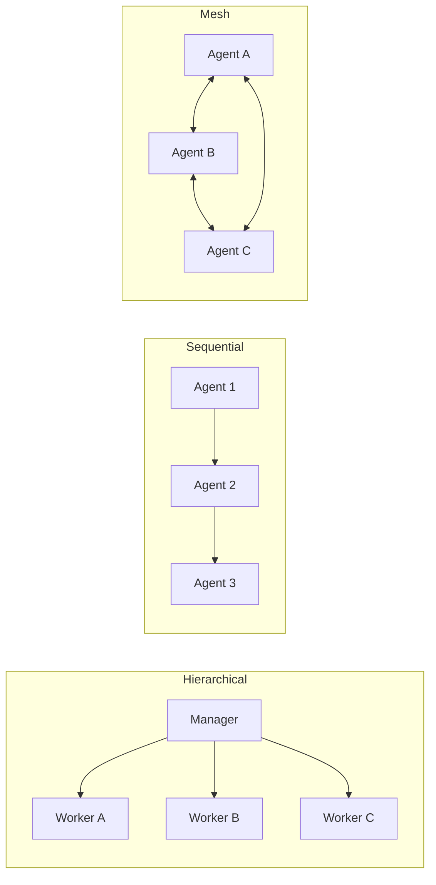
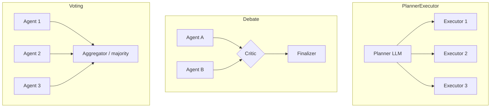
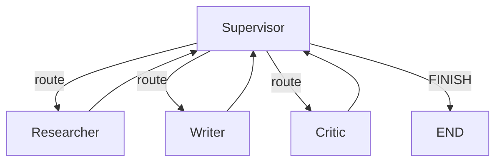

# Вопросы на собеседовании: `Multi-Agent Orchestration`

> Дата: 2026-05-23. Multi-agent системы координируют несколько LLM-агентов с разными ролями — фреймворки, шаблоны коммуникации, state management, anti-patterns и производственная эксплуатация.

## Полезные ссылки

- [CrewAI Documentation](https://docs.crewai.com/) — role-based multi-agent фреймворк.
- [AutoGen (Microsoft)](https://microsoft.github.io/autogen/) — conversation-driven агенты, group chat, code execution.
- [LangGraph (LangChain)](https://langchain-ai.github.io/langgraph/) — stateful graph orchestration с циклами и human-in-loop.
- [OpenAI Swarm](https://github.com/openai/swarm) — экспериментальный handoff-фреймворк.
- [Anthropic — Building Effective Agents](https://www.anthropic.com/research/building-effective-agents) — манифест «simple первый, frameworks позже».
- [Microsoft Magentic-One](https://www.microsoft.com/en-us/research/articles/magentic-one-a-generalist-multi-agent-system-for-solving-complex-tasks/) — generalist multi-agent от Microsoft Research.

## Содержание

- Основы и архитектуры (Q1–Q6)
- Frameworks: CrewAI / AutoGen / LangGraph / Swarm (Q7–Q14)
- Communication и State (Q15–Q18)
- Coordination patterns (Q19–Q22)
- Observability и cost (Q23–Q25)
- Production и anti-patterns (Q26–Q30)

---

## Q1. Что такое multi-agent система на базе LLM и чем она отличается от single-agent?

Multi-agent система — несколько LLM-агентов с **разными ролями**, **разными промптами**, **разными tools**, которые **кооперируются** для решения задачи. Каждый агент работает в собственном контексте, обменивается сообщениями с другими и принимает решения о next step самостоятельно.

Single-agent — один LLM в цикле ReAct/планировщик, который сам владеет всеми tools и context.

Ключевые отличия:

- **Specialisation** — каждому агенту даётся узкая роль («researcher», «writer», «critic»), что улучшает качество vs generalist.
- **Изоляция контекста** — у каждого свой scratchpad, не забивается лишним.
- **Параллелизм** — независимые subtasks могут идти параллельно.
- **Сложность** — больше LLM calls, больше latency, дороже, сложнее debug.

Multi-agent — это **distributed system на LLM**: появляются проблемы координации, failure handling, observability, идемпотентности — те же, что в обычных микросервисах.

## Q2. Когда single-agent достаточно, а когда реально нужен multi-agent? (!)

Эвристика по Anthropic «Building Effective Agents»: **начинай с самого простого**, добавляй сложность только когда метрика требует.

Single-agent достаточно, если:

- Задача укладывается в **один well-defined промпт** и набор tools.
- Контекст не превышает window и не мешает рассуждению.
- Нет естественной декомпозиции на параллельные subtasks.
- Latency и cost критичны (single-agent дешевле в 3–10×).

Multi-agent оправдан, если:

- Задача состоит из **разнородных этапов** с разными expertise (research + write + critique + code).
- Нужны **разные tools/permissions** у разных «работников» (sandbox python — у одного, file write — у другого).
- Есть **параллельные ветки** (10 источников исследуются одновременно).
- Нужен **adversarial/debate-паттерн** (writer vs critic, генератор vs reviewer).
- Контекст единого агента переполняется, и хочется разнести в изолированные context windows.

Если вопрос «single или multi» вызывает сомнение — почти всегда ответ single-agent с хорошими tools. Multi-agent — последнее средство, не первое.

## Q3. Какие основные архитектуры multi-agent систем существуют? (!)



- **Hierarchical / Manager-Worker** — manager-агент декомпозирует задачу и делегирует sub-agents, аккумулирует результаты. Default-режим CrewAI (`Process.hierarchical`).
- **Sequential / Pipeline** — output одного агента подаётся на вход следующему. Простой, предсказуемый. CrewAI `Process.sequential`.
- **Hub-and-Spoke / Star** — центральный coordinator общается с каждым «лучом», но лучи не знают друг о друге. Удобно для роутинга.
- **Network / Mesh / Peer-to-peer** — агенты общаются напрямую (group chat в AutoGen). Гибко, но непредсказуемо.
- **Multi-level hierarchical** — manager → team leads → workers. Для больших задач с подкомандами.

Выбор: чем выше структурированность и предсказуемость — тем лучше hierarchical/sequential. Mesh оставляют для исследовательских/творческих задач.

## Q4. Что такое «agentic workflow» vs «agent» по терминологии Anthropic? (!)

Различие из поста «Building Effective Agents» — критично для интервью.

- **Workflow** — LLM используется как **компонент в orchestrated коде**: control flow жёстко прописан разработчиком (prompt chaining, routing, parallelization, orchestrator-workers, evaluator-optimizer). LLM решает локально, маршрут — детерминированный.
- **Agent** — LLM **сам управляет потоком выполнения**: решает, какой tool вызвать, когда остановиться, когда повторить. Control flow зависит от модели в runtime.

Trade-off:

- Workflow — **предсказуемый**, легче тестировать, дешевле, easier to reason about. Подходит для 80% production-задач.
- Agent — **гибкий**, обрабатывает open-ended запросы, но непредсказуемо, дороже, сложнее observability.

Anthropic рекомендация: «agents для задач, где flexibility и model-driven decisions реально нужны». Иначе — workflow.

## Q5. Перечислите типовые «building blocks» из Anthropic-патернов orchestration.

Anthropic выделяет 5 паттернов от простого к сложному (всё это workflows, не agents):

- **Prompt chaining** — последовательность LLM-вызовов, output → input.
- **Routing** — классификатор отправляет запрос в один из специализированных промптов.
- **Parallelization** — sectioning (разбить задачу на независимые куски) или voting (N raw calls → ensemble).
- **Orchestrator-Workers** — central LLM динамически декомпозирует и делегирует worker-LLMs, потом синтезирует. Похоже на hierarchical multi-agent.
- **Evaluator-Optimizer** — один LLM генерирует, другой оценивает, цикл до критерия. Аналог reflexion / actor-critic.

Multi-agent frameworks (CrewAI, AutoGen, LangGraph) — это **обобщения** этих паттернов, но обычно один из них покрывает 90% реальных задач без специальной библиотеки.

## Q6. Что выбрать: hierarchical, sequential или mesh для типовых задач? (!)

Грубая декомпозиция:

| Тип задачи | Архитектура |
|------------|-------------|
| Конвейер (analyse → summarise → translate) | **Sequential** |
| Декомпозиция большого reasearch-запроса | **Hierarchical** (manager + N workers) |
| Роутинг по специализациям (юрист/финансы/тех) | **Hub-and-spoke** / routing |
| Дебаты, brainstorming, peer-review | **Mesh / group chat** |
| Software development simulation (PM → dev → QA → ops) | **Multi-level hierarchical** |
| Voting/ensemble (N independent → majority) | **Parallel + aggregator** |

Главное правило: чем понятнее граф взаимодействий, тем меньше LLM-overhead на координацию. Mesh с 5+ агентами почти всегда — overengineering.

## Q7. CrewAI — основные концепции и когда подходит. (!)

CrewAI — Python-фреймворк с фокусом на **role-playing**. Базовые сущности:

- **`Agent`** — `role`, `goal`, `backstory`, `tools`, `llm`. Backstory критично для качества: модель играет роль.
- **`Task`** — описание + `expected_output` + `agent` (или назначается manager-ом).
- **`Crew`** — оркестратор: список agents + tasks + `process` (`sequential` или `hierarchical`).
- **`Process.hierarchical`** — Crew автоматически назначает manager-агента, который делегирует.

```python
from crewai import Agent, Task, Crew, Process

researcher = Agent(
    role="Senior Research Analyst",
    goal="Найти актуальную информацию по теме {topic}",
    backstory="Эксперт по AI/ML с 10 годами стажа, любит факты и ссылки.",
    tools=[search_tool],
    llm=llm,
)

writer = Agent(
    role="Tech Content Writer",
    goal="Написать читаемую статью на основе данных от researcher",
    backstory="Пишет о технологиях для разработчиков, не любит buzzwords.",
    llm=llm,
)

research_task = Task(
    description="Собрать ключевые источники по {topic}",
    expected_output="Bullet-list из 5 фактов с ссылками",
    agent=researcher,
)
write_task = Task(
    description="Написать статью на 800 слов",
    expected_output="Markdown-статья",
    agent=writer,
    context=[research_task],
)

crew = Crew(
    agents=[researcher, writer],
    tasks=[research_task, write_task],
    process=Process.sequential,
)
result = crew.kickoff(inputs={"topic": "Multi-agent orchestration"})
```

Подходит для: контент-производства, исследовательских конвейеров, демо/прототипов с понятными ролями. Минусы: меньше контроля над state machine, чем у LangGraph.

## Q8. AutoGen (Microsoft) — что это и какие сценарии? (!)

AutoGen — фреймворк от Microsoft, фокус на **conversation-driven** агентах. Ключевые сущности:

- **`AssistantAgent`** — LLM, играющий роль.
- **`UserProxyAgent`** — псевдо-юзер: умеет вызывать tools, выполнять код (в Docker-sandbox), запрашивать human input.
- **`GroupChat`** + **`GroupChatManager`** — несколько агентов в одной conversation, manager решает, кто говорит следующим.

```python
import autogen

config_list = [{"model": "gpt-4o", "api_key": "..."}]

assistant = autogen.AssistantAgent(
    name="coder",
    system_message="Ты пишешь Python-код для решения задач.",
    llm_config={"config_list": config_list},
)
reviewer = autogen.AssistantAgent(
    name="reviewer",
    system_message="Ты ревьюишь код на корректность и стиль.",
    llm_config={"config_list": config_list},
)
user_proxy = autogen.UserProxyAgent(
    name="user_proxy",
    human_input_mode="NEVER",
    code_execution_config={"work_dir": "sandbox", "use_docker": True},
)

groupchat = autogen.GroupChat(
    agents=[user_proxy, assistant, reviewer],
    messages=[],
    max_round=8,
)
manager = autogen.GroupChatManager(groupchat=groupchat, llm_config={"config_list": config_list})
user_proxy.initiate_chat(manager, message="Напиши и протестируй функцию fibonacci(n).")
```

Сильные стороны: code execution из коробки (sandbox), естественные диалоги, AutoGen Studio для no-code-сборки. Минусы: group chat склонен к длинным «болтливым» сессиям, нужно жёстко лимитировать `max_round`.

## Q9. LangGraph — чем отличается от CrewAI/AutoGen и зачем StateGraph? (!)

LangGraph — расширение LangChain, моделирует агента как **stateful directed graph с циклами**.

Концепции:

- **State** — typed dict (часто `TypedDict`), общий контейнер, который пробрасывается между nodes.
- **Node** — функция (LLM call, tool call, кастомная логика), принимает state и возвращает update.
- **Edge** — направленный переход. **Conditional edges** позволяют ветвление по содержимому state.
- **Cycles** — в отличие от DAG-фреймворков, разрешены циклы (для ReAct-loop, retry, reflection).
- **Checkpointer** — сохраняет state в БД (sqlite/postgres), позволяет pause/resume + human-in-loop.

```python
from langgraph.graph import StateGraph, END
from typing import TypedDict, Annotated
import operator

class State(TypedDict):
    messages: Annotated[list, operator.add]
    next_agent: str

def supervisor(state: State):
    decision = llm_route(state["messages"])  # вернёт "researcher" | "writer" | "FINISH"
    return {"next_agent": decision}

def researcher(state: State):
    out = llm_research(state["messages"])
    return {"messages": [out]}

def writer(state: State):
    out = llm_write(state["messages"])
    return {"messages": [out]}

graph = StateGraph(State)
graph.add_node("supervisor", supervisor)
graph.add_node("researcher", researcher)
graph.add_node("writer", writer)
graph.set_entry_point("supervisor")
graph.add_conditional_edges(
    "supervisor",
    lambda s: s["next_agent"],
    {"researcher": "researcher", "writer": "writer", "FINISH": END},
)
graph.add_edge("researcher", "supervisor")
graph.add_edge("writer", "supervisor")

app = graph.compile(checkpointer=memory_saver)
```

Когда выбрать LangGraph:

- Нужен **полный контроль над state machine** и циклами.
- **Human-in-the-loop** с pause/resume через checkpointer.
- **Supervisor pattern** с динамическим роутингом.
- Интеграция с экосистемой LangChain (LangSmith tracing, retrievers).

## Q10. OpenAI Swarm — что это, для чего, насколько production-ready?

Swarm — экспериментальный educational-фреймворк от OpenAI (2024). Главная идея — **handoff paradigm**: агент передаёт control другому агенту через специальный function call, который возвращает `Agent` объект.

```python
from swarm import Swarm, Agent

client = Swarm()

def transfer_to_billing():
    return billing_agent

triage = Agent(
    name="Triage",
    instructions="Если вопрос про оплату — передай billing-агенту.",
    functions=[transfer_to_billing],
)
billing_agent = Agent(
    name="Billing",
    instructions="Ты отвечаешь на вопросы по биллингу.",
)

response = client.run(agent=triage, messages=[{"role": "user", "content": "Где мой счёт?"}])
```

Особенности:

- Минимализм — всего ~500 строк кода.
- Без состояния между вызовами (stateless), persistence — задача разработчика.
- **Explicitly not production-ready** — OpenAI прямо предупреждает: educational only.
- Преемник для production — **OpenAI Agents SDK** (выпущен в 2025).

На интервью важно: Swarm полезен для понимания идеи handoff, но для продакшена выбирают AutoGen, LangGraph или Anthropic-style code.

## Q11. Anthropic подход «agents-as-tools» и почему он часто лучше фреймворков. (!)

Anthropic в «Building Effective Agents» аргументирует: специальные multi-agent frameworks часто **избыточны**. Большинство задач решается обычным кодом + tools + одним хорошим LLM.

Паттерн «**orchestrator-workers**» в чистом виде:

```python
def run_orchestrator(query: str):
    plan = llm.call(orchestrator_prompt, query)  # JSON со списком subtasks
    results = []
    for subtask in plan["subtasks"]:
        worker_result = llm.call(worker_prompt, subtask)
        results.append(worker_result)
    final = llm.call(synthesizer_prompt, query, results)
    return final
```

Это и есть «multi-agent», только без фреймворка: каждый LLM-вызов с другим промптом — это уже «другой агент». Tools передаются обычными function-schemas.

Преимущества подхода:

- Прозрачный control flow — обычный Python.
- Нет vendor lock-in на framework abstractions.
- Легко добавить retry/circuit-breaker/observability — стандартные библиотеки.
- Easier code review, debug, тестирование.

Когда фреймворк всё-таки нужен: long-running stateful conversations (LangGraph checkpointer), сложные group chats (AutoGen), role-heavy production (CrewAI). Иначе — обычный код.

## Q12. Сравните CrewAI, AutoGen, LangGraph, Swarm.

| Критерий | CrewAI | AutoGen | LangGraph | Swarm |
|----------|--------|---------|-----------|-------|
| Парадигма | Role-playing + tasks | Conversation / group chat | Stateful graph | Handoff function calls |
| Control flow | Sequential / hierarchical | Manager-driven turn-taking | Explicit graph + cycles | Agent returns next agent |
| State management | Внутри Crew | Conversation history | Typed StateGraph + checkpoint | Stateless |
| Human-in-the-loop | Базовый | Через `UserProxyAgent` | First-class via checkpointer | Нет |
| Code execution | Через tools | Встроенный Docker sandbox | Через tools | Через tools |
| Production-ready | Да (быстро растёт) | Да (Microsoft prod-use) | Да (LangChain-эко) | Нет (educational) |
| Observability | Базовая + интеграции | AgentOps, AutoGen Bench | LangSmith first-class | Нет |
| Learning curve | Низкая | Средняя | Высокая | Очень низкая |
| Лучший use case | Контент / research crews | Coding/debate agents | Сложные stateful workflows | Прототипы / обучение |

Эмпирически в продакшене: **LangGraph** для stateful systems, **CrewAI** для role-heavy задач, **AutoGen** где нужен code-exec sandbox, **Swarm** не выбирают (берут OpenAI Agents SDK).

## Q13. Что такое OpenAI Agents SDK и где он в этой картине?

OpenAI Agents SDK (2025) — официальный production-преемник Swarm. Принципиальные отличия:

- Built-in **tracing** и observability.
- **Guardrails** — input/output валидация перед/после tools.
- **Handoffs** остаются как ключевая идея, но более структурированы.
- Поддержка **structured output** через Pydantic.
- Production-grade error handling и retries.

Концептуально это «Swarm, выросший до prod», и прямой конкурент LangGraph по нише «оркестрация LLM-агентов с tools». В интервью полезно упомянуть как современный стандарт от OpenAI.

## Q14. Microsoft Magentic-One — что это и зачем?

Magentic-One — generalist multi-agent система от Microsoft Research (2024). Архитектура:

- **Orchestrator** — central agent, ведёт *Task Ledger* (план) и *Progress Ledger* (статус).
- **WebSurfer** — управляет браузером.
- **FileSurfer** — файлы и документы.
- **Coder** — пишет код.
- **ComputerTerminal** — запускает код в sandbox.

Особенность: фиксированный набор специализированных агентов + динамический оркестратор. Хороший пример «hierarchical с manager, ведущим plan/progress state» — паттерн пригоден и для своих систем.

## Q15. Какие коммуникационные паттерны между агентами существуют? (!)

- **Direct function call (handoff)** — agent A вызывает agent B как функцию, ждёт результат. Самый простой и предсказуемый. Используется в Swarm, OpenAI Agents SDK.
- **Message passing** — агенты обмениваются сообщениями через очередь/буфер. AutoGen GroupChat именно так работает.
- **Shared memory / blackboard** — общий state (StateGraph LangGraph), куда все пишут и читают. Хорошо для совместного контекста, плохо для изоляции.
- **Broadcast** — сообщение видно всем агентам сразу (group chat).
- **Pub-sub / topic-based** — агент подписан на тип событий (редко в LLM-системах, чаще в backend-микросервисах).
- **Request-response через ledger/queue** — orchestrator кладёт задачу, worker забирает и пишет результат (Magentic-One Task Ledger).

Trade-off: handoff даёт control, message passing — flexibility, shared memory — простоту, но создаёт coupling.

## Q16. Как организовать state в multi-agent системе?

Три уровня:

- **Shared state** — общий объект (StateGraph в LangGraph, Crew context в CrewAI). Все агенты видят и обновляют. Плюс: synchronized view. Минус: context bloat, race conditions.
- **Per-agent state** — у каждого свой scratchpad / history. Плюс: изоляция, чище контекст. Минус: нужен явный механизм синка.
- **Conversation history** — может быть shared (group chat) или separate (каждый видит свою ветку).

Практика:

- LangGraph: `Annotated[list, operator.add]` для accumulating fields (messages), обычные поля overwriting.
- CrewAI: `context=[previous_task]` пробрасывает output.
- Persistence: checkpointer LangGraph → SQLite/Postgres, или собственный механизм через MCP, БД, Redis.

Главное — явно решить, **что shared, что private**, и не давать агентам видеть лишнего (приватность/контекст-гигиена).

## Q17. Типы памяти для multi-agent систем.

- **Short-term (working memory)** — текущая conversation / scratchpad. Хранится в state.
- **Long-term episodic** — прошлые задачи и решения, лежат в **vector DB** (pgvector, Pinecone, Qdrant), достаются по semantic search.
- **Long-term semantic** — стабильные факты, knowledge graph или structured DB.
- **Procedural** — выученные «навыки» (для self-improving agents типа Voyager). Редко в продакшене из-за стабильности.
- **Shared org memory** — общий «корпоративный мозг» нескольких crew, доступ через MCP-сервер или общий retriever.

Антипаттерн: запихнуть всю history в системный промпт — упирается в context window и стоимость. Используют **summarisation** + **vector recall**.

## Q18. Как организовать handoff между агентами безопасно?

Handoff — момент, когда один агент передаёт control другому. Риски: потеря контекста, infinite handoff loop, неподходящий receiver.

Best practices:

- **Explicit handoff schema** — agent возвращает `{"handoff_to": "billing", "context": {...}}`, валидируется JSON-schema.
- **Allowed transitions** — белый список, кому конкретный агент может передать (state machine).
- **Bounded handoff depth** — счётчик, максимум N передач, иначе fail/escalate.
- **Context summarization on handoff** — не пересылать всю history, только нужный summary + key facts.
- **Idempotent receivers** — на случай повторной передачи (retry).
- **Audit log** — каждый handoff с trace_id, source, target, reason.

В OpenAI Agents SDK и Swarm handoff — first-class concept; в CrewAI/LangGraph моделируется через manager или conditional edges.

## Q19. Coordination paterns: planner-executor, debate, voting — когда какой? (!)



- **Planner-Executor** — один агент строит план, другие выполняют шаги. Подходит для well-decomposable задач (research, codegen). Часто комбинируется с reasoning model (o1/Claude Opus) как planner и cheaper моделью (Haiku/Mini) как executor.
- **Debate / Critique (actor-critic, reflexion)** — generator пишет, critic ругает, цикл до сходимости. Улучшает качество на reasoning-heavy задачах, но дорого. Используется в evaluator-optimizer паттерне Anthropic.
- **Voting / Ensemble** — N независимых агентов решают, majority побеждает. Снижает variance на subjective задачах, дорого в N раз.
- **Specialist consultation** — generalist роутит к specialists (юрист / финансы / медицина). Hub-and-spoke.
- **Collaborative refinement** — каждый агент дополняет общий artefact (blackboard).

## Q20. Multi-agent + reasoning models — как комбинировать? (!)

Reasoning models (o1, o3, DeepSeek R1, Claude Sonnet с extended thinking) — дорогие, но качественные для планирования и сложного reasoning. Cheaper models (gpt-4o-mini, Haiku, Gemini Flash) — быстрые и дешёвые на bulk-операциях.

Эффективные комбинации:

- **Reasoning as Planner** — o1/R1 декомпозирует и валидирует план, Haiku/4o-mini исполняет шаги. Снижает cost в 5–10× при сохранении качества плана.
- **Reasoning as Critic** — большинство шагов делают cheap models, finalize/quality-check — reasoning model.
- **Escalation** — cheap агент пробует решить, при низкой confidence escalate на reasoning model.

Антипаттерн: reasoning model на каждом шаге loop — латентность 30+ секунд per call, $$$ счёт.

Сheap-as-router тоже работает: маленькая модель решает «дёшево достаточно или escalate», большая активируется при сложности.

## Q21. Error handling и failure isolation в multi-agent. (!)

Multi-agent наследует все проблемы distributed systems:

- **Failure isolation** — падение одного агента не должно валить всю систему. Каждый вызов в try/catch, fallback стратегия.
- **Per-agent retry** — exponential backoff на 429/5xx LLM API, на JSON parse errors.
- **Circuit breaker** — если агент стабильно падает, временно отключить.
- **Timeout per agent** — общий global timeout на task + per-step.
- **Bounded iterations** — `max_rounds`, `max_steps` обязательно. Без них — infinite loops.
- **Dead-letter / human escalation** — задачи, которые не удалось решить, уходят в очередь для человека.
- **Idempotency keys** — повторный вызов с тем же `task_id` не дублирует работу (особенно важно для tools с side effects: payments, emails, DB writes).
- **Compensation / saga** — если многошаговая операция падает посередине, откатить уже сделанное.

CrewAI и AutoGen дают базовые retries, но production-grade reliability — на разработчике.

## Q22. Что такое orchestrator-workers паттерн и как его сделать самому?

Orchestrator-workers — каноничный hierarchical-паттерн от Anthropic:

1. Orchestrator LLM получает задачу, динамически декомпозирует на subtasks.
2. Каждый subtask отправляется worker-LLM (часто параллельно).
3. Orchestrator (или отдельный synthesizer) агрегирует результаты в финальный ответ.

```python
import asyncio

async def orchestrator_workers(query: str):
    plan = await llm.call(
        prompt=ORCHESTRATOR_PROMPT,
        user=query,
        schema=PlanSchema,  # subtasks: [{id, description, worker_type}]
    )

    async def run_worker(subtask):
        prompt = WORKER_PROMPTS[subtask["worker_type"]]
        return await llm.call(prompt=prompt, user=subtask["description"])

    results = await asyncio.gather(*[run_worker(t) for t in plan["subtasks"]])
    final = await llm.call(
        prompt=SYNTHESIZER_PROMPT,
        user={"query": query, "results": results},
    )
    return final
```

Это уже multi-agent — три разных промпта = три «агента». Без всякого фреймворка. На таком фундаменте строят 80% «multi-agent» production-систем.

## Q23. Observability в multi-agent — что трассировать? (!)

Без observability multi-agent — чёрный ящик. Минимум:

- **Distributed tracing** — span на каждый LLM call + tool call, с trace_id, parent_span_id. Совместимо с OpenTelemetry.
- **Per-agent metrics** — input tokens, output tokens, latency, error rate, cost.
- **Cross-agent message log** — кто кому что отправил, в каком state.
- **Conversation tree** — visualisation handoffs и dependencies (LangSmith, Langfuse, AgentOps дают из коробки).
- **Tool call audit** — какой агент позвал какой tool с какими аргументами, что вернулось.
- **Task completion metrics** — success rate end-to-end + per-stage.
- **Cost aggregation** — суммарный $ за конкретную user-task, разбивка по моделям.

Инструменты: **LangSmith** (LangChain/LangGraph), **Langfuse** (open-source, любой фреймворк), **AgentOps** (multi-framework), **Arize Phoenix** (open-source observability), **Helicone** (LLM gateway с трейсингом).

## Q24. Cost и latency multi-agent vs single-agent.

Реалистичные оценки:

- Multi-agent делает в **3–10× больше LLM-вызовов**, чем single-agent на эквивалентной задаче. Прямой пропорциональный рост cost.
- **Parallel agents** снижают **wall-clock latency**, но не cost (та же сумма вызовов).
- **Sequential** агентов — растёт и latency, и cost.
- **Reasoning models** в loop умножают cost ещё в 5–20× (long thinking traces).

Стратегии оптимизации:

- Cheaper models для bulk-операций, reasoning model только для critical decisions.
- **Prompt caching** — Anthropic prompt caching, OpenAI prompt caching экономят 50–90% на повторных system prompts.
- **Bounded iterations** — `max_rounds` жёсткий.
- **Early termination** — критик подтверждает «good enough», loop останавливается.
- **Cost budget per task** — гарду в коде: суммарно ≤ $X на task, иначе fail/escalate.
- Кэширование результатов tools (особенно search, retrieval).

В B2C продуктах одна multi-agent-task может стоить $0.10–$5 — это много. В B2B/enterprise часто приемлемо.

## Q25. Как evaluate multi-agent систему?

Метрики:

- **End-to-end task completion rate** — основная: процент задач, где финальный output корректен по golden dataset.
- **Per-agent quality** — оценка каждого агента изолированно через unit-test-like prompts.
- **Trace-level metrics** — длина conversation, кол-во handoffs, кол-во retries, кол-во tool calls.
- **Cost per successful task** — суммарный $ на успешный исход (показатель эффективности).
- **Latency P50/P95/P99** end-to-end.
- **Failure mode taxonomy** — категоризация: timeout, JSON error, wrong tool, infinite loop, hallucination, factual error.
- **Human review subset** — 5–10% задач уходят на ручной аудит.

Frameworks: **LangSmith evals**, **AutoGen Bench**, **Phoenix evals**, **Inspect AI** (UK AISI), кастомные harness с pytest.

## Q26. Production-ready чек-лист для multi-agent системы. (!)

Прежде чем выкатывать:

- **Bounded iterations** на все loops (`max_rounds`, `max_handoffs`, `max_tool_calls`).
- **Cost budget guard** — hard limit на задачу, soft warning на 50%.
- **Timeout per agent + global timeout**.
- **Идемпотентные tools** — tools с side effects принимают `idempotency_key`.
- **Retry с exponential backoff** на 429/5xx LLM API.
- **Structured logging + tracing** (OpenTelemetry / LangSmith / Langfuse).
- **Eval suite на golden dataset** — катиться можно только если pass-rate не упал.
- **Feature flags / canary** для нового агента или промпта.
- **Human-in-the-loop escalation** для критичных решений (платежи, удаления, юридические).
- **Sandbox для code execution** — Docker/gVisor/Firecracker, NEVER eval() в проде.
- **PII/secrets redaction** в логах LLM calls.
- **Rate limiting** между агентами (особенно если они в loop).
- **Versioning промптов** + A/B testing.
- **Graceful degradation** — если premium-модель недоступна, fallback на cheaper.
- **Dead-letter queue** для неуспешных задач + alerting.

## Q27. Топ anti-patterns в multi-agent. (!)

- **«Слишком много агентов»** — 5+ ролей с overlapping responsibilities. Координационный overhead убивает выгоду. Часто single-agent с tools работает лучше.
- **Vague role descriptions** — `goal: "помогать пользователю"` бесполезно. Goals должны быть концретные, измеримые.
- **Infinite handoff loop** — A → B → A → B без termination condition. Лечится bounded iterations + state machine.
- **Single LLM call could have solved it** — overengineering: вместо одного хорошего промпта собрали Crew из 4 агентов.
- **Shared mutable state без locks** — race conditions на параллельных агентах.
- **Полный history в context каждого агента** — токены, latency, confusion. Передавать только нужный summary.
- **No observability** — «работает или нет — узнаем от пользователя». В multi-agent это смертельно: невозможно debug.
- **Manager как bottleneck** — manager-LLM на каждом шаге, всё через него — последовательно и дорого.
- **Hardcoded LLM model в каждом агенте** — нет возможности переключать или fallback.
- **Tool sprawl** — даём каждому агенту все 50 tools «на всякий случай». Конфьюзит, дорого, неконтролируемо. Per-agent allowlist.
- **No JSON-schema на outputs** — парсинг ad-hoc, ломается. Использовать structured output / function calling.

## Q28. Что такое supervisor pattern в LangGraph?

Supervisor — специальный node, который выступает router-ом:

1. Получает текущий state.
2. Решает (через LLM или код), какому worker передать управление, либо вернуть `END`.
3. После worker control возвращается в supervisor.



Преимущества:

- Централизованный control flow, легко отлаживать.
- Supervisor может быть rule-based (cheap), не обязательно LLM.
- Workers могут вызываться повторно (Critic несколько раз).
- Каждый worker имеет свой узкий tool-set.

Это LangGraph-аналог CrewAI `Process.hierarchical` или Magentic-One Orchestrator.

## Q29. Real-world примеры multi-agent систем — что почитать. (!)

- **GPT-Researcher** — research crew, делает deep research по запросу: planner + N parallel researchers + writer.
- **ChatDev** — симуляция software dev команды: CEO/CTO/Programmer/Reviewer/Tester. Иллюстрирует waterfall в multi-agent.
- **MetaGPT** — SDLC simulation, более structured чем ChatDev, с SOPs (standard operating procedures).
- **BabyAGI / AutoGPT** — task decomposition + execution loop. Исторически важные, в проде не используются.
- **Magentic-One (Microsoft)** — generalist агент с фиксированными specialists.
- **Devin / OpenDevin** — autonomous software engineer (multi-agent под капотом).
- **Anthropic Claude Computer Use** — single-agent, но с computer-use tool; контраст-пример: вместо multi-agent — один сильный агент + мощный tool.

Главный вывод из обзора: «прорывных» multi-agent продакшен-систем мало. Большинство prod-кейсов — workflows + 1–2 specialised LLM calls, не «многоагентные оркестры».

## Q30. Что такое «agents-as-tools» паттерн и когда он лучше handoff?

«Agents-as-tools»: один primary agent имеет «вспомогательных» агентов как обычные tools. Когда primary решает позвать `search_specialist(query)` — под капотом это другой LLM-агент, но primary не теряет control flow.

Сравнение с handoff:

| | Handoff | Agents-as-tools |
|--|---------|-----------------|
| Кто owns control | Receiver | Original (caller) |
| Возврат control | Только если receiver сам передаст | Автоматически после tool return |
| Сложность | Выше (state machine) | Простая (обычный function call) |
| Контекст | Передаётся receiver-у | Только через args/return |
| Лучше для | Длинные «переключения роли» | Узкие consultative задачи |

Anthropic в большинстве примеров рекомендует **agents-as-tools** — это проще и безопаснее: primary agent остаётся «in charge», вспомогательные агенты — это инструменты с собственными внутренними промптами и моделями.

```python
def search_specialist(query: str) -> str:
    """Глубокий research по узкой теме."""
    return llm.call(prompt=SPECIALIST_PROMPT, user=query)

tools = [search_specialist, other_tools...]
primary_agent_loop(query, tools)  # primary видит specialist как обычный tool
```

Это сейчас доминирующий «multi-agent» паттерн в практике — без фреймворка, без handoffs, понятный и тестируемый.

---

## See also

- [AI Agents](./ai-agents-interview.md)
- [Model Context Protocol (MCP)](./mcp-interview.md)
- [Function Calling](./function-calling-interview.md)
- [LLM Integration Patterns](./llm-integration-patterns-interview.md)
- [Reasoning Models](./reasoning-models-interview.md)
- [Prompt Engineering](./prompt-engineering-interview.md)
- [System Design Interview](../system-design/system-design-interview.md)
- [Distributed Systems](../architecture/distributed-systems-interview.md)
