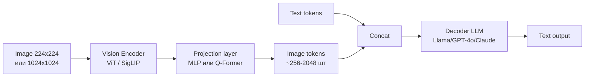
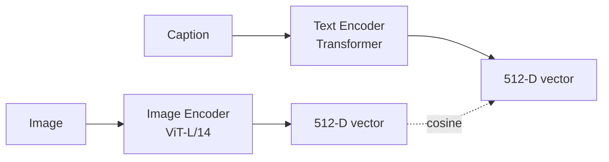
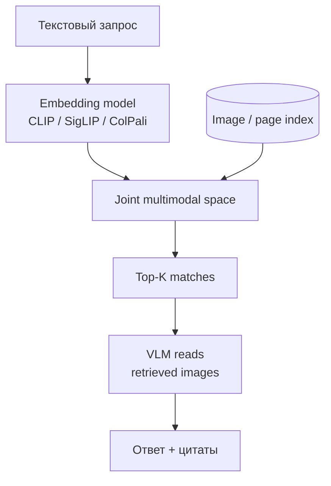
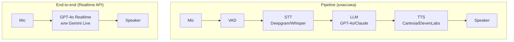
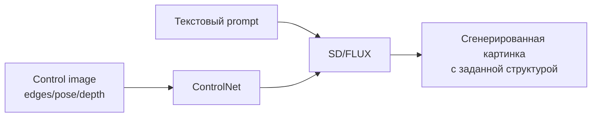
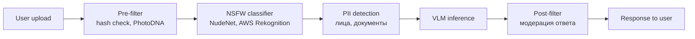
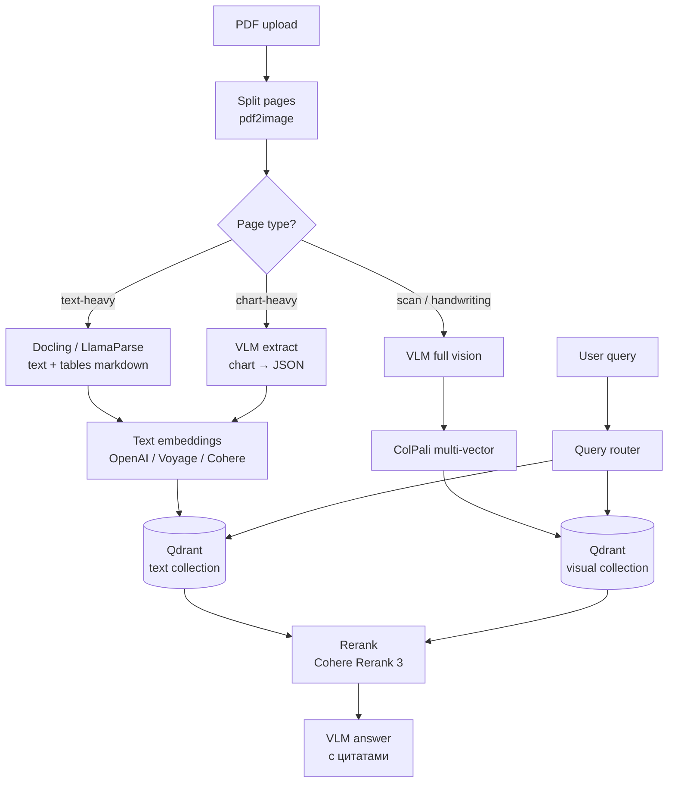

# Вопросы на собеседовании: `Multimodal AI`

**Multimodal AI** — модели, понимающие и/или генерирующие более одной модальности: текст, изображения, аудио, видео. В 2024-2026 фокус сместился с unimodal LLM на универсальные модели (`GPT-4o`, `Gemini 2.5 Pro`, `Claude 4`), которые в едином трансформере принимают text+image+audio и отвечают tokens, голосом или картинкой. Параллельно выросли voice-агенты с sub-second latency (`OpenAI Realtime API`, `LiveKit Agents`) и multimodal RAG поверх PDF и сканов.

На собеседовании спрашивают: как устроен VLM, во что обходится одна картинка по токенам, чем end-to-end voice отличается от STT→LLM→TTS pipeline, как делать multimodal RAG без OCR (ColPali), какие есть антипаттерны и как не платить лишнего за `high-res` режим.

**Дата актуализации:** 2026-05-25

## Полезные ссылки

### Vision-Language Models

- [OpenAI Vision guide](https://platform.openai.com/docs/guides/vision) — GPT-4o vision API, image tokens
- [Anthropic Vision docs](https://docs.anthropic.com/en/docs/build-with-claude/vision) — Claude vision, base64/url, PDF native
- [Gemini Multimodal](https://ai.google.dev/gemini-api/docs/vision) — image/video/audio input
- [CLIP paper (OpenAI, 2021)](https://arxiv.org/abs/2103.00020) — contrastive image-text
- [BLIP-2 paper](https://arxiv.org/abs/2301.12597) — Q-Former bridge
- [SigLIP paper (Google, 2023)](https://arxiv.org/abs/2303.15343) — sigmoid loss CLIP
- [LLaVA](https://llava-vl.github.io/) — open-source VLM blueprint

### Audio / Voice

- [OpenAI Whisper](https://github.com/openai/whisper) — open-source STT
- [OpenAI Realtime API](https://platform.openai.com/docs/guides/realtime) — end-to-end voice, GPT-4o
- [Gemini Live API](https://ai.google.dev/gemini-api/docs/live) — bidirectional streaming
- [LiveKit Agents](https://docs.livekit.io/agents/) — voice-agent framework
- [Deepgram Nova-3](https://deepgram.com/) — production STT
- [ElevenLabs](https://elevenlabs.io/) — TTS, voice cloning
- [Cartesia Sonic](https://cartesia.ai/) — low-latency streaming TTS

### Image generation

- [DALL-E 3 API](https://platform.openai.com/docs/guides/images) — OpenAI image gen
- [Imagen 3](https://deepmind.google/technologies/imagen-3/) — Google
- [FLUX.1 (Black Forest Labs)](https://blackforestlabs.ai/) — open-weights SOTA
- [Stable Diffusion 3.5](https://stability.ai/stable-image) — open-source family
- [Recraft v3](https://www.recraft.ai/) — vector + photoreal
- [ControlNet paper](https://arxiv.org/abs/2302.05543) — conditional control

### Benchmarks

- [MMMU](https://mmmu-benchmark.github.io/) — multimodal college reasoning
- [MathVista](https://mathvista.github.io/) — math + visual
- [ChartQA](https://github.com/vis-nlp/ChartQA) — chart understanding
- [DocVQA](https://www.docvqa.org/) — document QA

### Multimodal RAG / Documents

- [ColPali paper](https://arxiv.org/abs/2407.01449) — ColBERT-style retrieval over PDF pages
- [Anthropic PDF support](https://docs.anthropic.com/en/docs/build-with-claude/pdf-support) — native PDF
- [LlamaParse](https://docs.llamaindex.ai/en/stable/llama_cloud/llama_parse/) — structured PDF parse
- [Docling (IBM)](https://github.com/DS4SD/docling) — layout-aware extraction

## Содержание

- [Эволюция и архитектура VLM](#эволюция-и-архитектура-vlm) — Q1, Q2, Q3, Q4, Q5
- [Vision tasks (OCR/charts/PDF)](#vision-tasks-ocrchartspdf) — Q6, Q7, Q8, Q9, Q10
- [Multimodal embeddings и RAG](#multimodal-embeddings-и-rag) — Q11, Q12, Q13
- [Audio (STT/TTS) и voice agents](#audio-sttts-и-voice-agents) — Q14, Q15, Q16, Q17, Q18, Q19
- [Video understanding](#video-understanding) — Q20, Q21
- [Image generation и editing](#image-generation-и-editing) — Q22, Q23, Q24
- [Evaluation и hallucinations](#evaluation-и-hallucinations) — Q25, Q26, Q27
- [Cost / Production patterns](#cost--production-patterns) — Q28, Q29, Q30, Q31

---

## Эволюция и архитектура VLM

## Q1. Как эволюционировали multimodal-модели от CLIP (2021) до GPT-4o (2024-2026)? (!)

| Год | Модель / событие | Что нового |
|-----|------------------|------------|
| 2021 | **CLIP** (OpenAI) | Contrastive обучение image+text в общем embedding пространстве. Породил zero-shot классификацию по тексту |
| 2022 | **BLIP** (Salesforce) | Image captioning + VQA, unified encoder-decoder |
| 2023 янв | **BLIP-2** | `Q-Former` — лёгкий мост между frozen vision encoder и frozen LLM |
| 2023 март | **GPT-4V** | Первая mainstream production-VLM, vision как режим chat |
| 2023 апр | **LLaVA** | Open-source recipe: CLIP-ViT + projection + Vicuna |
| 2024 фев | **Gemini 1.5 Pro** | Native multimodal с 1M+ context, video/audio input |
| 2024 май | **GPT-4o** | Omni: text+image+audio в одной модели, audio-out, ~320 ms voice latency |
| 2024 июнь | **Claude 3.5 Sonnet vision** | SOTA на DocVQA/ChartQA |
| 2024 окт | **OpenAI Realtime API** | Speech-to-speech без STT/TTS промежутка |
| 2025 | **Gemini 2.5 Pro**, **Claude 4 multimodal** | Vision + reasoning + 1M context default |
| 2026 | **GPT-Image-1**, реалтайм видео-генерация | Tool-native image gen, sora-style видео |

**Ключевой сдвиг:** от «vision-encoder бок-о-бок с LLM» (CLIP, BLIP-2) к **native multimodal трансформеру**, где картинка/аудио — это просто другие токены в едином потоке.

---

## Q2. Как устроена архитектура современной VLM? (!)

Типичная VLM состоит из трёх частей:



**1. Image encoder.** Чаще всего `Vision Transformer` (ViT) или `SigLIP`. Картинка нарезается на патчи 14×14 или 16×16 пикселей, каждый патч превращается в embedding. На выход — последовательность векторов (`[CLS] + patches`).

**2. Projection layer.** Embedding-векторы ViT и input embeddings LLM лежат в **разных пространствах** (разные размерности, разное распределение). Projection — MLP (LLaVA) или `Q-Former` (BLIP-2) — приводит vision-токены к размерности LLM.

**3. LLM-декодер.** Принимает последовательность `[image_tokens, text_tokens]` и генерирует ответ автрорегрессивно. Никаких архитектурных изменений у трансформера — он не «знает», что часть токенов из картинки.

**Native multimodal** (GPT-4o, Gemini 2.5) — отличие в том, что **обучение** идёт сразу на mixed-modality потоке: text + image + audio токены чередуются с самого pre-training, а не как fine-tune поверх готовой LLM.

---

## Q3. Что такое image tokens и сколько их стоит у OpenAI / Anthropic / Google? (!)

**Image tokens** — это представление картинки в виде последовательности embedding-векторов, которые модель считает за свои входные токены и тарифицирует.

**OpenAI (GPT-4o, GPT-4.1):**

- `detail: "low"` — фиксировано **85 токенов** за изображение, ресайз до 512×512.
- `detail: "high"` — картинка нарезается на тайлы 512×512. Каждый тайл = **170 токенов**, плюс 85 base. Итого: `85 + 170 × N_tiles`.
- Пример: 2048×1024 → 4 тайла → `85 + 4·170 = 765 токенов`.

**Anthropic (Claude 3.5/4):**

- Формула: `(width × height) / 750` токенов.
- Пример: изображение 1.15 MP (1092×1092) → **~1568 токенов**.
- Лимит: до 8000×8000 px, не более 100 изображений в одном запросе.

**Google Gemini:**

- Картинка ≤ 384×384 px = **258 токенов**.
- Больше — нарезается тайлами 768×768, каждый тайл = 258 токенов.
- Видео: **263 tokens/sec** аудио + image tokens на кадры.

**Практическое следствие:** одна фотография в hi-res — это эквивалент 1000-2000 текстовых токенов. Для batch-обработки 10 000 PDF-страниц это **серьёзные деньги** — выбирайте `low-res` по умолчанию и `high-res` точечно.

---

## Q4. Чем `low-res` отличается от `high-res` и когда какой выбирать?

```python
# OpenAI: явный выбор detail
client.chat.completions.create(
    model="gpt-4o",
    messages=[{
        "role": "user",
        "content": [
            {"type": "text", "text": "Что на картинке?"},
            {
                "type": "image_url",
                "image_url": {
                    "url": "https://...",
                    "detail": "low",   # 85 tokens, ресайз 512x512
                    # "detail": "high",  # 85 + 170*N tiles
                }
            }
        ]
    }]
)
```

**Когда `low-res` (по умолчанию):**

- Распознать общий смысл («кошка на диване», «график вверх»).
- Триаж: «стоит ли вызывать high-res?».
- Большой батч с дешёвой классификацией.

**Когда `high-res`:**

- OCR мелкого текста (счета, чеки, паспорта).
- Чтение таблиц и графиков с подписями.
- Document QA по PDF с многоколоночным макетом.
- Идентификация мелких деталей (бренд, серийный номер, дефекты).

**Антипаттерн:** включать `high-res` для всех картинок «на всякий случай» — даёт ×10 стоимости без выигрыша качества на простых задачах.

---

## Q5. Multi-image prompting — как правильно передавать несколько картинок?

VLM с длинным контекстом (Claude, Gemini) принимают **до 20-100 изображений** в одном запросе. Это раскрывает паттерны:

- **Few-shot vision** — показать 3 «правильных» картинки и 3 «неправильных», спросить про новую.
- **Сравнение версий** — «найди отличия между A и B».
- **Временная развёртка** — кадры из видео в порядке съёмки.
- **Multi-page document** — каждая страница как отдельное изображение.

```python
# Anthropic multi-image
import base64
import anthropic

def img(path):
    with open(path, "rb") as f:
        return {
            "type": "image",
            "source": {
                "type": "base64",
                "media_type": "image/jpeg",
                "data": base64.standard_b64encode(f.read()).decode(),
            },
        }

client = anthropic.Anthropic()
resp = client.messages.create(
    model="claude-sonnet-4",
    max_tokens=1024,
    messages=[{
        "role": "user",
        "content": [
            {"type": "text", "text": "Картинка 1 — оригинал. Картинка 2 — после правок. Что изменилось?"},
            img("v1.jpg"),
            img("v2.jpg"),
        ],
    }],
)
```

**Best practices:**

- Подписывайте изображения текстом (`Image 1:`, `Image 2:`) — модель лучше связывает их с инструкциями.
- При больших батчах используйте `cache_control` (Anthropic) — vision-токены кешируются, экономия 90% на повторяющихся изображениях.
- Не смешивайте слишком разные задачи в одном запросе — модель может «забыть» инструкцию для первой картинки к десятой.

---

## Vision tasks (OCR/charts/PDF)

## Q6. Когда выбирать VLM вместо классического OCR (Tesseract, Azure Form Recognizer)? (!)

| Критерий | VLM (GPT-4o / Claude) | Dedicated OCR (Tesseract, Azure FR) |
|----------|----------------------|-------------------------------------|
| Точность на чистом печатном тексте | 95-99% | 99%+ |
| Точность на рукописном тексте | 90-97% | 60-80% |
| Понимание контекста («сумма счёта», «итого») | Да | Нет, нужен post-processing |
| Извлечение по schema (JSON) | Прямо в prompt | Отдельный pipeline |
| Стоимость 1 страницы | $0.005-0.02 | $0.001-0.005 |
| Скорость | 2-10 sec | 100-500 ms |
| Языки | Все 100+ из коробки | Нужны языковые пакеты |
| Layout-aware (таблицы, multi-column) | Из коробки | Только специализированные (Azure FR, Docling) |

**Когда VLM:**

- Сложные документы со смешанным контентом (текст + таблицы + графики).
- Понимание семантики, а не только текст («какова сумма НДС?»).
- Низкий volume, важно качество.
- Рукописные пометки, чеки разного формата, медицинские бланки.

**Когда dedicated OCR:**

- Массовая обработка миллионов страниц однотипных документов.
- Latency-критичные системы (turnstile, real-time scan).
- Регуляторные требования с детерминированным результатом.

**Гибридный подход (производственный):** OCR → текст в prompt + сама картинка как verifier. VLM подтверждает или исправляет результат OCR, экономя токены против чистого vision-режима.

---

## Q7. Как правильно делать структурированный extract из таблицы на изображении? (!)

Worst-case prompt: «извлеки таблицу». Получите Markdown-таблицу разного формата от запроса к запросу.

**Рекомендуемый подход — schema-first:**

```python
import json
from openai import OpenAI

schema = {
    "name": "extract_invoice_table",
    "schema": {
        "type": "object",
        "properties": {
            "items": {
                "type": "array",
                "items": {
                    "type": "object",
                    "properties": {
                        "sku": {"type": "string"},
                        "name": {"type": "string"},
                        "qty": {"type": "integer"},
                        "unit_price": {"type": "number"},
                        "total": {"type": "number"},
                    },
                    "required": ["sku", "name", "qty", "unit_price", "total"],
                    "additionalProperties": False,
                },
            },
            "subtotal": {"type": "number"},
            "vat": {"type": "number"},
            "total": {"type": "number"},
        },
        "required": ["items", "subtotal", "vat", "total"],
        "additionalProperties": False,
    },
    "strict": True,
}

client = OpenAI()
resp = client.chat.completions.create(
    model="gpt-4o",
    messages=[{
        "role": "user",
        "content": [
            {"type": "text", "text": "Извлеки таблицу позиций со счёта. Если ячейка не читаема — null."},
            {"type": "image_url", "image_url": {"url": "https://.../invoice.jpg", "detail": "high"}},
        ],
    }],
    response_format={"type": "json_schema", "json_schema": schema},
)
data = json.loads(resp.choices[0].message.content)
```

**Дополнительные приёмы:**

1. **Дай шаблон.** Покажи в prompt пример уже извлечённой таблицы — модель скопирует структуру.
2. **Двухэтапное извлечение.** Сначала «опиши структуру таблицы» (сколько колонок, заголовки), потом «извлеки по этой структуре».
3. **Validator pass.** Прогоняй результат через простые правила: `sum(items.total) ≈ subtotal`, `subtotal + vat ≈ total`. Если расходится — re-extract с подсказкой об ошибке.
4. **High-res обязательно** — на low-res мелкие числа сливаются.

---

## Q8. Как извлекать данные из графиков и диаграмм? Что такое ChartQA?

**ChartQA** — benchmark на понимание графиков (bar, line, pie) и вычисление ответов по визуальным данным («какой год показал максимум?», «во сколько раз A больше B?»).

VLM 2024-2026 (GPT-4o, Claude 3.5+, Gemini 2.5) достигают 70-85% на ChartQA, но **частые ошибки**:

- Перепутаны легенда и оси.
- Считают приблизительные значения как точные.
- Не учитывают масштаб (log vs linear).
- Игнорируют annotation/подписи мелким шрифтом.

**Структурированный prompt для chart extraction:**

```
Ты получишь график. Выполни шаги:
1. Определи тип графика (bar/line/pie/scatter).
2. Перечисли оси с единицами измерения.
3. Перечисли все серии данных (из легенды).
4. Для каждой серии извлеки точки в JSON: [{x, y}, ...].
5. Отметь точки, прочитанные точно, и точки, оценённые приблизительно.
6. Только потом ответь на вопрос пользователя.

Ответ строго в JSON по схеме: {...}
```

**Анти-паттерн:** спросить «какой максимум на графике?» сразу — модель угадает. Сначала экстракт, потом вопрос по уже структурированным данным.

**Tool-augmented подход:** VLM → JSON данных → Python (через function calling) считает ответ. Так делают `OpenAI Code Interpreter` и `Claude tool use` для аналитики.

---

## Q9. Как обрабатывать PDF — native VLM vs OCR-pipeline? (!)

Три подхода с разными trade-offs:

**1. Native VLM PDF (Anthropic, Gemini).**

```python
# Anthropic — PDF принимается напрямую
client.messages.create(
    model="claude-sonnet-4",
    max_tokens=2048,
    messages=[{
        "role": "user",
        "content": [
            {"type": "document",
             "source": {"type": "base64", "media_type": "application/pdf",
                        "data": base64_pdf}},
            {"type": "text", "text": "Суммируй ключевые пункты договора."},
        ],
    }],
)
```

Модель сама рендерит страницы, видит макет, читает текст и пометки. Минимум кода. Дорого на больших PDF (каждая страница ≈ vision-токены).

**2. Vision-LLM на отрендеренных страницах.** PDF → `pdf2image` → изображения → отправка как multi-image. Контроль над разрешением. Можно отбрасывать пустые страницы.

**3. OCR + layout (Docling, LlamaParse, AWS Textract).** PDF → структурированный markdown/json (текст, таблицы, формулы) → отдаём как **текст** в LLM. Самый дешёвый, но теряет картинки/диаграммы.

**Decision tree:**

| Сценарий | Выбор |
|----------|-------|
| Сложные scanned PDF (старые документы) | Vision-LLM, high-res |
| Текстовый PDF (договор, отчёт) | OCR + layout (Docling) → LLM на тексте |
| PDF с инфографикой и диаграммами | Hybrid: layout-парсер + vision на страницах с диаграммами |
| Native digital PDF без сканов | `pdfplumber` / `pypdf` — текст напрямую, без LLM |

**Антипаттерн:** «закинуть весь 500-страничный PDF в Claude/Gemini и спросить, что там». 500 страниц ≈ 800k токенов, что и в окно влезает не всегда, и стоит как 1000 chat-запросов.

---

## Q10. Visual Question Answering (VQA) и object detection через VLM — что умеют?

**VQA (Visual Question Answering)** — открытые вопросы по картинке: «сколько людей в кадре?», «какого цвета её куртка?», «опасна ли дорога для пешехода?».

VLM в 2025-2026 закрывают classic VQA benchmarks почти на уровне человека. Но **детектирование** (bounding boxes) — слабое место.

**Object detection через VLM** работает в двух режимах:

1. **Verbal localization.** «Опиши, где собака на картинке (верх/низ/лево/право)». Грубо, но работает без специальной разметки.
2. **Координаты как текст.** Современные модели (Claude 3.5+, Gemini 2.5) поддерживают вывод нормализованных координат:

```
Вернёшь JSON: [{"label": "dog", "bbox_2d": [x1, y1, x2, y2]}, ...]
Координаты в диапазоне 0-1000 (нормализованы по ширине/высоте).
```

**Точность bbox от VLM** обычно хуже специализированных детекторов (YOLO, Grounding DINO). Если нужны точные боксы для production CV — используйте dedicated модель, а VLM оставьте для семантики и классификации сцены.

**Open-vocabulary detection** — там, где VLM выигрывает: «найди все логотипы конкурентов» без обучения детектора под каждый логотип.

---

## Multimodal embeddings и RAG

## Q11. Что такое multimodal embeddings и как работает CLIP? (!)

**Multimodal embeddings** — векторное представление, где **текст и изображение лежат в одном пространстве**. То есть `embedding("фото кошки")` и `embedding("a cat")` близки по cosine similarity.

**CLIP (Contrastive Language-Image Pre-training, OpenAI 2021):**

- Два энкодера: text encoder (Transformer) и image encoder (ViT).
- Обучение на 400M пар image-caption из интернета.
- Цель: для пары `(image, text)` из одного примера — высокий cosine; для пары из разных примеров — низкий.



**Что это даёт:**

- **Zero-shot classification.** Без обучения классификатора: для каждого класса возьми текст, embed его, считай cosine с embedding картинки. Лучший cosine — предсказанный класс.
- **Text-to-image search.** Введи запрос текстом → найди подходящие картинки в базе.
- **Image-to-image search.** По embedding одной картинки найди похожие.

**Преемники CLIP в 2024-2026:**

- **SigLIP** (Google) — sigmoid loss вместо softmax, лучше масштабируется.
- **EVA-CLIP** — improved data + scaling, SOTA на retrieval.
- **Jina CLIP v2** — multilingual, open weights.
- **ImageBind** (Meta) — 6 модальностей в одном пространстве (image, text, audio, depth, IMU, thermal).

---

## Q12. Multimodal RAG — как индексировать картинки и PDF? (!)

**Три паттерна** multimodal RAG:

**Pattern 1: Caption-then-text.**

1. Прогон каждой картинки через VLM («опиши подробно»).
2. Индексация **caption-ов** как текста (text embeddings).
3. На retrieval — обычный text-to-text поиск, возвращаем оригинал картинки.

Плюсы: дёшево на retrieval. Минусы: качество поиска ограничено качеством caption-ов.

**Pattern 2: Joint embedding (CLIP-style).**

1. Индексируем image embeddings (CLIP/SigLIP).
2. Запрос текстом → text encoder → cosine search в image-индексе.
3. Возвращаем картинки + при желании их подписи.

Плюсы: натуральный cross-modal поиск. Минусы: ограничено качеством CLIP-encoder (плохо с длинными запросами).

**Pattern 3: ColPali (для PDF).**

1. Каждая страница PDF рендерится в картинку.
2. ColPali (визуальный ColBERT) даёт **multi-vector embedding** для страницы — по embedding на каждый патч.
3. Late-interaction retrieval: max-sim между токенами запроса и патчами страницы.
4. Возвращаем целые страницы → VLM их читает.

Плюсы: не нужен OCR, layout сохраняется. Минусы: больше storage (multi-vector), требует поддержки multi-vector retrieval (`Qdrant`, `Vespa`).



**Production tip:** в проде часто гибрид — текст экстрактится layout-парсером (Docling), картинки/таблицы индексируются через CLIP/ColPali, всё лежит в общем `Qdrant`-collection с filtering по типу.

---

## Q13. Когда выбирать ColPali, а когда обычный CLIP retrieval?

**ColPali** — late-interaction retrieval над страницами PDF, специально обученный на DocVQA-подобных задачах.

| Аспект | Обычный CLIP | ColPali |
|--------|--------------|---------|
| Объект индексации | Картинка целиком | Страница PDF (рендер) |
| Embedding | Single vector (1024-D) | Multi-vector, на каждый патч |
| Storage | ~4 KB на документ | ~100-500 KB на страницу |
| Retrieval | Cosine sim | MaxSim (ColBERT-style) |
| Качество на текстовых PDF | Слабое | SOTA |
| Качество на чистых картинках | Хорошее | Не оптимизировано |

**ColPali:**

- Сложные PDF: научные статьи, отчёты, мануалы.
- Когда OCR-pipeline ломается на формулах, мелком тексте, multi-column.
- Латентность retrieval не критична.

**Обычный CLIP / SigLIP:**

- Большие image-каталоги (товары, фото, медиа).
- Cross-modal поиск без сильной зависимости от текста на картинке.
- Нужен low-latency single-vector retrieval.

---

## Audio (STT/TTS) и voice agents

## Q14. Какие есть Speech-to-Text решения в 2026? (!)

| Решение | Тип | Сильные стороны | Слабые стороны |
|---------|-----|-----------------|----------------|
| **OpenAI Whisper large-v3** | Open-weights | 99 языков, отличная noise robustness, $0 на own GPU | Не realtime out-of-box, hallucinates на silence |
| **OpenAI Whisper API** | Managed | Простая интеграция | Только batch, не stream |
| **Deepgram Nova-3** | Managed | Streaming с latency 200-300 ms, diarization | English-first, дороже Whisper |
| **AssemblyAI Universal-2** | Managed | Speaker diarization, summarization, sentiment | Latency повыше |
| **Google Speech-to-Text v2** | Managed | Многоязычность, telephony optimized | Старее на benchmark |
| **AWS Transcribe** | Managed | Интеграция в AWS, medical/legal модели | Слабее на акцентах |
| **NVIDIA Parakeet** | Open-weights | SOTA WER на English, NeMo | English-only |

**WER (Word Error Rate)** — основная метрика. Whisper large-v3 даёт **5-10% WER** на чистом аудио и **15-25%** на шумном/телефоне.

**Production checklist для STT:**

- VAD (Voice Activity Detection) перед STT — экономия 30-50% стоимости (не транскрибируем тишину).
- Streaming для voice-агентов (Deepgram, Cartesia) — не дожидаемся конца фразы.
- Diarization (кто говорит) — отдельная задача, не все провайдеры одинаково хороши.
- Post-processing: punctuation restoration, профильные словари (медицина, юриспруденция).

---

## Q15. TTS-провайдеры — как выбирать? (!)

| Провайдер | Latency (time-to-first-byte) | Качество | Особенности |
|-----------|-------------------------------|----------|-------------|
| **OpenAI TTS** (`tts-1`, `tts-1-hd`) | ~500 ms | Хорошее | 6 голосов, дёшево |
| **ElevenLabs** | 300-800 ms | SOTA, эмоции | Voice cloning, 30+ языков |
| **Cartesia Sonic** | **~40 ms** | Очень хорошее | Streaming-first, для realtime агентов |
| **Play.ht v3** | 200-500 ms | Хорошее | Voice cloning |
| **Google Cloud TTS** | ~300 ms | Хорошее | 380+ голосов, WaveNet |
| **OpenAI Realtime audio** | inline в LLM | Очень хорошее | Не TTS как сервис, а часть e2e voice |

**Latency budget для voice-агента:**

- Целевой round-trip ≤ 1 sec, идеально ≤ 500 ms.
- Из них TTS должен укладываться в 100-300 ms TTFB (time to first byte).
- Streaming TTS обязателен — выдаём первое слово, пока модель ещё дописывает ответ.

**Voice cloning** — отдельная категория: ElevenLabs, Play.ht позволяют клонировать голос с 30 секунд аудио. Юридический и этический риск — нужно согласие.

---

## Q16. Voice agent pipeline (STT → LLM → TTS) vs end-to-end Realtime API — в чём разница? (!)

Два архитектурных подхода к голосовым агентам:



**Pipeline (STT → LLM → TTS):**

- Latency: 1-3 sec round-trip, с оптимизациями до 800 ms.
- Компоненты можно менять (другой STT, другой LLM).
- LLM не «слышит» интонацию, не понимает паузы и эмоции — только текст.
- Барье-in (перебивание) сложно реализовать корректно.
- Зрелая стэка: `LiveKit Agents`, `Vapi`, `Retell AI`, `Bland AI` оборачивают этот pipeline.

**End-to-end Realtime (GPT-4o Realtime API, Gemini Live):**

- Latency: 200-500 ms, ощущается как живой разговор.
- Модель **слышит сырое аудио** и **отвечает аудио** — понимает эмоции, акценты, паузы.
- Нативный barge-in (модель замолкает при перебивании).
- Привязка к одному вендору (OpenAI / Google).
- Дороже за минуту, чем pipeline на дешёвых STT/TTS.

**Когда что выбирать:**

| Сценарий | Pipeline | Realtime |
|----------|----------|----------|
| IVR / callcenter с известными сценариями | + | |
| Companion-агент с эмоциональной речью | | + |
| Многоязычность с редкими языками | + (выбор STT) | ограничено |
| Минимальная latency, естественность | | + |
| Бюджетные ограничения | + | |
| Custom voice cloning | + (ElevenLabs) | ограничено |

---

## Q17. Как устроен OpenAI Realtime API — WebSocket и audio chunks?

`OpenAI Realtime API` работает поверх **WebSocket** с двусторонним стримингом аудио в формате `pcm16` или `g711`.

```python
import asyncio, json, websockets, base64

async def realtime_voice():
    url = "wss://api.openai.com/v1/realtime?model=gpt-4o-realtime-preview"
    headers = {
        "Authorization": "Bearer " + API_KEY,
        "OpenAI-Beta": "realtime=v1",
    }
    async with websockets.connect(url, extra_headers=headers) as ws:
        # 1. Настроить сессию (модель, голос, инструкции)
        await ws.send(json.dumps({
            "type": "session.update",
            "session": {
                "voice": "alloy",
                "instructions": "Ты — голосовой помощник. Отвечай коротко.",
                "input_audio_format": "pcm16",
                "output_audio_format": "pcm16",
                "turn_detection": {"type": "server_vad"},
            }
        }))

        # 2. Стримим mic-audio чанками по 20-100 ms
        async def send_audio():
            while chunk := await read_mic_chunk():
                await ws.send(json.dumps({
                    "type": "input_audio_buffer.append",
                    "audio": base64.b64encode(chunk).decode(),
                }))

        # 3. Получаем audio-ответ + транскрипт
        async def receive_events():
            async for msg in ws:
                event = json.loads(msg)
                if event["type"] == "response.audio.delta":
                    play_audio(base64.b64decode(event["delta"]))
                elif event["type"] == "response.audio_transcript.done":
                    print("Bot said:", event["transcript"])

        await asyncio.gather(send_audio(), receive_events())
```

**Ключевые события:**

- `session.update` — настройка голоса, instructions, VAD.
- `input_audio_buffer.append` — добавить чанк аудио (base64 pcm16).
- `response.audio.delta` — частичный audio-ответ модели.
- `response.audio_transcript.delta/done` — параллельный текстовый транскрипт.
- `response.function_call_arguments.done` — function calling прямо из voice-сессии.

**VAD режимы:**

- `server_vad` — сервер сам решает, когда фраза закончилась.
- `none` — клиент шлёт `commit` вручную (для push-to-talk).

---

## Q18. Voice agent frameworks 2026 — LiveKit, Vapi, Retell — что выбирать?

Все они оборачивают `STT → LLM → TTS` (или Realtime) и добавляют telephony + browser SDK.

| Framework | Тип | Сильные стороны | Когда выбирать |
|-----------|-----|-----------------|----------------|
| **LiveKit Agents** | Open-source + cloud | WebRTC-стек, low-level контроль, plugins для всех STT/TTS, поддержка Realtime API | Custom-агенты, контроль качества аудио, self-host |
| **Vapi** | Managed | Быстрый старт, telephony из коробки, готовые UI | Прототипы и MVP, callcenter |
| **Retell AI** | Managed | Twilio integration, hot transfer to human, structured outputs | Enterprise callcenter |
| **Bland AI** | Managed | Custom voices, dispatch frameworks | Outbound sales-обзвон |
| **Daily.co Bots** | Managed | WebRTC, video + voice | Видео-конференции с агентом |

**Архитектура LiveKit Agent (упрощённо):**

```python
from livekit.agents import AgentSession
from livekit.plugins import openai, deepgram, cartesia, silero

async def entrypoint(ctx):
    session = AgentSession(
        vad=silero.VAD.load(),
        stt=deepgram.STT(model="nova-3"),
        llm=openai.LLM(model="gpt-4o"),
        tts=cartesia.TTS(voice="..."),
    )
    await session.start(ctx.room, agent=MyAgent())
```

Каждый компонент сменяемый. Switch на Realtime — заменить `llm=` на `openai.realtime.RealtimeModel()`, STT/TTS уйдут.

---

## Q19. Как корректно обрабатывать barge-in (перебивание собеседника)?

**Barge-in** — пользователь перебивает агента в середине его реплики. Без корректной обработки агент «глухой» и продолжает говорить — UX рушится.

**Pipeline (классика):**

1. VAD на mic-стриме всегда активен, даже когда играет TTS.
2. При детектировании речи (~150 ms активности) — **немедленно остановить TTS playback**.
3. Отменить inflight LLM-запрос (cancel HTTP request).
4. Очистить TTS-буфер.
5. Начать новый цикл STT → LLM → TTS.

**Echo cancellation обязателен** — иначе VAD триггерится на голос самого агента. Используйте AEC из WebRTC (LiveKit делает это за вас).

**Realtime API:** barge-in нативно — событие `input_audio_buffer.speech_started` приходит как только пользователь начал говорить, модель сама обрезает свой output.

**Антипаттерн:** «дать агенту договорить, а потом обработать». Пользователь хочет, чтобы его слышали сейчас, а не через 2 секунды.

**Tuning:**

- VAD threshold — слишком чувствительный = false barge-in на кашле/смехе.
- Min speech duration — 100-200 ms помогает отсечь шумы.
- Confidence margin — игнорировать VAD на 200 ms после старта TTS (модель «слышит сама себя»).

---

## Video understanding

## Q20. Как VLM понимают видео — frame sampling vs native video? (!)

**Два подхода:**

**1. Frame extraction (GPT-4o, Claude vision).**

```python
# Извлекаем кадры с равномерным шагом
import cv2

def extract_frames(video_path, n_frames=10):
    cap = cv2.VideoCapture(video_path)
    total = int(cap.get(cv2.CAP_PROP_FRAME_COUNT))
    step = max(total // n_frames, 1)
    frames = []
    for i in range(0, total, step):
        cap.set(cv2.CAP_PROP_POS_FRAMES, i)
        ok, frame = cap.read()
        if ok:
            frames.append(frame)
    cap.release()
    return frames[:n_frames]

# Отправляем как multi-image
```

Плюсы: работает с любой VLM. Минусы: теряем динамику и аудио, нужно угадать частоту.

**2. Native video input (Gemini 1.5/2.5 Pro, GPT-4o video mode).**

Модель принимает видеофайл целиком (до 1 часа у Gemini). Внутри:

- Кадры сэмплируются **~1 fps** (Gemini), всего около 250 кадров на 4-минутное видео.
- Аудио-дорожка обрабатывается параллельно (для Gemini — 263 tokens/sec).
- Модель понимает временные отношения («сначала А, потом Б»).

```python
# Gemini multimodal с видео
import google.generativeai as genai

video_file = genai.upload_file("clip.mp4")
model = genai.GenerativeModel("gemini-2.5-pro")
resp = model.generate_content([
    video_file,
    "Опиши, что произошло, и в какой момент."
])
```

**Когда native video:**

- Длинное видео, важна динамика.
- Аудио-дорожка несёт смысл (диалог, музыкальный анализ).
- Нужны временные метки в ответе.

**Когда frame extraction:**

- Короткие клипы.
- Нужен provider, не поддерживающий видео нативно.
- Хочется контролировать, какие именно кадры идут (например, только сцены смены кадра).

**Стоимость:** 1 минута 1080p видео в Gemini ≈ 17 000 токенов (vision + audio), что эквивалентно 30-40 страницам текста.

---

## Q21. Какие задачи на видео хорошо решают современные VLM?

**Работает хорошо:**

- Описание содержания («что делает человек на видео»).
- Поиск моментов по описанию («когда появляется красная машина»).
- Action recognition (бег, езда, разговор).
- Транскрипция с тайм-кодами.
- Summarization лекций и митингов.
- Compliance review (видео с камер — нарушения).

**Работает плохо:**

- Точный counting (сколько раз мяч ударился об пол).
- Очень короткие события (<1 сек) — могут попасть между сэмплированными кадрами.
- Распознавание лиц по имени (модели отказываются по safety reasons).
- Долгосрочные временные зависимости (>30 мин) — даже Gemini 1M context рискует «забыть» начало.

**Production-pattern для длинного видео:**

1. **Chunking** — нарезать на 5-10 минутные куски.
2. **Map** — каждый кусок → summary + ключевые моменты.
3. **Reduce** — собрать общую картину из summaries.
4. **Re-query** — при необходимости пройтись по конкретному куску с детальным вопросом.

---

## Image generation и editing

## Q22. Сравнение image-генераторов 2026 — DALL-E 3, Imagen, FLUX, SD3.5, Midjourney. (!)

| Модель | Тип | Сильные стороны | Слабые стороны |
|--------|-----|-----------------|----------------|
| **DALL-E 3** | API (OpenAI) | Хорошо понимает длинный prompt, безопасно | Закрытая, средний фотореализм |
| **GPT-Image-1** | API (OpenAI) | Native в GPT-4o, контроль через chat, transparent edit | Дороже, медленнее |
| **Imagen 3** | API (Google) | Лидер на photorealism benchmarks, text-rendering | Только через GCP |
| **FLUX.1 [pro/dev/schnell]** | Open + API | SOTA open-weights, отличный text, быстро | Pro закрыт, dev для non-commercial |
| **Stable Diffusion 3.5** | Open weights | Полный контроль, LoRA/ControlNet ecosystem | Качество немного ниже FLUX/Imagen |
| **Midjourney v7** | Managed (Discord/Web) | Эстетика, художественный стиль | Нет API долгое время, контроль слабый |
| **Ideogram 2.0** | API + Web | Лучший text rendering | Менее фотореалистично |
| **Recraft v3** | API | Vector + raster, brand style | Узкоспециализированный |

**Метрики качества:**

- **Prompt adherence** — насколько результат соответствует тексту (FLUX, GPT-Image-1).
- **Photorealism** — фотографичность (Imagen, FLUX pro).
- **Text rendering** — корректность текста на картинке (Ideogram, FLUX, Recraft).
- **Aesthetic** — субъективная красота (Midjourney).
- **Speed** — FLUX schnell, SDXL Turbo (≤1 sec).
- **Cost per image** — open-source бесплатно при наличии GPU.

---

## Q23. Image editing — inpainting, outpainting, ControlNet, IP-Adapter — что это? (!)

**Inpainting** — изменить часть существующей картинки. Передаём оригинал + маску (где менять) + prompt («замени собаку на кошку»).

**Outpainting** — расширить картинку за её пределы. Маска покрывает «новые» области.

**ControlNet** — добавочный модуль к Stable Diffusion / FLUX, принимающий **дополнительный сигнал** для управления композицией:

- **Canny edges** — повторить контуры.
- **Pose (OpenPose)** — задать позу человека.
- **Depth map** — задать пространственную глубину.
- **Segmentation mask** — задать положение объектов.



**LoRA (Low-Rank Adaptation)** — лёгкий fine-tune для конкретного стиля, персонажа, бренда. 5-50 MB вместо полной модели. Можно комбинировать несколько LoRA.

**IP-Adapter** — генерация с **референс-картинкой стиля** (вместо текста). «Сгенерируй портрет в стиле этой картины».

**Comfy-style production:** обычно цепочка ControlNet + IP-Adapter + LoRA + inpainting в одном workflow (ComfyUI, InvokeAI).

---

## Q24. Когда лучше использовать closed API (DALL-E/Imagen), а когда self-hosted (SD/FLUX)?

| Критерий | Closed API | Self-hosted (SD/FLUX) |
|----------|-----------|----------------------|
| Time-to-first-image | минуты | дни setup |
| Стоимость на 10k картинок | $400-800 | $20-50 (GPU rental) |
| Контроль композиции | Низкий (только prompt) | Полный (ControlNet, LoRA) |
| Кастомные стили / персонажи | Только через prompt | LoRA, fine-tune |
| Compliance (NSFW, copyright) | Встроено | Сам |
| Latency p99 | 5-15 sec | 1-5 sec (на A100) |
| Brand safety | Гарантировано | Сам |

**Decision rules:**

- **API**: маркетинговые баннеры, low volume, brand safety критична.
- **Self-hosted**: продуктовый рендеринг каталога, кастомные стили, NSFW (legal jurisdictions), high volume.
- **Hybrid**: иконки/обложки через API + caталог через FLUX schnell на own GPUs.

---

## Evaluation и hallucinations

## Q25. Как оценивать VLM? Какие есть multimodal-benchmarks? (!)

| Benchmark | Что измеряет | SOTA 2026 |
|-----------|--------------|-----------|
| **MMMU** | Multimodal University-level reasoning across disciplines | ~75-80% (Gemini 2.5, Claude 4) |
| **MathVista** | Math + visual reasoning | ~70-75% |
| **ChartQA** | Графики, диаграммы | ~85-90% |
| **DocVQA** | Документы (счета, формы) | ~95%+ |
| **AI2D** | Diagram QA (учебные диаграммы) | ~90%+ |
| **VQAv2** | General visual QA | ~85%+ |
| **TextVQA** | Чтение текста на картинке | ~85%+ |
| **MMBench** | Comprehensive (perception + reasoning) | ~85% |
| **Video-MME** | Long-form video understanding | Gemini 2.5 лидер |
| **MMVet** | Open-ended multimodal | ~75% |

**Production eval (за пределами benchmarks):**

- **Golden dataset** под вашу задачу: 50-200 картинок с известными ground truth.
- **LLM-as-judge** (Claude / GPT-4o судит выходы VLM по rubric).
- **Цена/качество кривая**: meas Quality vs $/request, выбрать оптимальную модель.
- **Human eval** для критичных задач: медицина, юриспруденция.

---

## Q26. Что такое multimodal hallucinations и как с ними бороться? (!)

**Multimodal hallucination** — модель «видит» или утверждает то, чего на картинке нет:

- **Object hallucination** — придумывает несуществующие объекты («на столе ноутбук» — а его нет).
- **Attribute hallucination** — неверный цвет, размер, материал.
- **OCR hallucination** — додумывает текст, который не виден или нечитаем.
- **Counting hallucination** — «4 человека» там, где 3 или 5.

**Причины:**

1. **Prior bias.** Модель видит «офис» → ожидает ноутбук → подставляет.
2. **Low resolution.** Мелкий текст не разбирается → модель додумывает по контексту.
3. **Caption bias из training data.** Captions в обучении часто описывают то, что **обычно** в подобных сценах.

**Mitigations:**

- **Lower temperature** (0-0.2) — меньше «креатива».
- **Chain-of-thought**: «Перечисли видимые объекты, потом отвечай на вопрос».
- **Verifier pass** — вторая модель проверяет первую: «Этот объект действительно на картинке?».
- **OCR pre-pass** — для текста используем dedicated OCR, скармливаем модели уже распознанный текст вместо угадывания.
- **High-res mode** для деталей.
- **Negative prompting** — «Если объект не виден, ответь null».
- **Structured output** с required field `confidence` — модель сама помечает неуверенные пункты.

**Замер hallucination rate:** golden dataset с известными «отсутствующими» объектами → процент случаев, когда модель их «увидела».

---

## Q27. Image safety — какие проблемы и как защищаться?

**Категории safety-проблем:**

1. **NSFW (Not Safe For Work)** — порнография, насилие. Risk: репутация, регуляторы.
2. **CSAM** — контент с детьми. Risk: уголовная ответственность. Все провайдеры обязаны проверять (PhotoDNA, ML-классификаторы).
3. **Deepfakes** — генерация лиц публичных людей.
4. **IP infringement** — копирайт-контент (логотипы, персонажи).
5. **Personal data** — лица, номера машин, документы.

**Многоуровневая защита:**



**Tooling:**

- **NSFW classifiers**: NudeNet (open), AWS Rekognition Moderation, GCP Vision SafeSearch, Azure Content Safety.
- **CSAM hash matching**: PhotoDNA (Microsoft), обязательно для UGC-платформ.
- **Face blurring**: открытые модели (`face_recognition` + OpenCV) для приватности.
- **Watermarking**: C2PA — стандарт криптографического provenance для AI-сгенерированных картинок (поддерживают OpenAI, Adobe, Microsoft).
- **Audit logs**: сохранять hash картинки + classifier scores + user_id для последующего расследования.

**Анти-паттерн:** полагаться только на VLM «откажет ли модель отвечать». VLM можно обмануть. Нужен независимый classifier.

---

## Cost / Production patterns

## Q28. Как оптимизировать стоимость vision-обработки? (!)

**Стратегии (по убыванию эффекта):**

1. **Low-res по умолчанию, high-res по триггеру.** Триаж дешёвой моделью → high-res на сложных кейсах. Экономия ×3-10.
2. **Кэширование vision-токенов.** Anthropic prompt caching: повторяющиеся изображения (например, корпоративный шаблон в углу страницы) кешируются — 90% экономии.
3. **Pre-OCR-фильтр.** Сначала дешёвый Tesseract — если текста нет / есть нужное → не шлём в VLM.
4. **Batch API.** OpenAI/Anthropic batch endpoints (offline, 24h SLA) — 50% скидка.
5. **Resize до минимально достаточного.** 4K фото может быть избыточным; ресайз до 1024 px по большей стороне даёт ту же информацию за меньшие токены.
6. **Smaller models for triage.** GPT-4o-mini, Claude Haiku, Gemini Flash для простых задач — в 10-20× дешевле флагмана.
7. **Async pipelines.** Не ждать ответа в HTTP — складывать задачу в очередь.

**Расчёт budget:**

```
Стоимость 1 страницы PDF = (image_tokens * input_rate) + (avg_output_tokens * output_rate)

GPT-4o, high-res, 1024x1024 страница:
  ~765 input tokens * $2.5/M + 300 output tokens * $10/M
  ≈ $0.002 + $0.003 = ~$0.005 за страницу

10 000 страниц/день = $50/день = $1500/мес
```

---

## Q29. Latency vision-инференса и стриминг — что важно для UX?

**Latency vision vs text:**

- Vision inference в 2-5× медленнее чисто текстового на тех же моделях.
- Причина: добавочные image-токены увеличивают input context + некоторые операции на encoder.
- Time-to-first-token: 1-3 sec на flagship-моделях с high-res картинкой.

**Стриминг ответа** обязателен:

```python
# OpenAI streaming с vision
stream = client.chat.completions.create(
    model="gpt-4o",
    messages=[{"role": "user", "content": [
        {"type": "text", "text": "Опиши"},
        {"type": "image_url", "image_url": {"url": "..."}},
    ]}],
    stream=True,
)
for chunk in stream:
    if delta := chunk.choices[0].delta.content:
        print(delta, end="", flush=True)
```

**UX hacks:**

- **Skeleton output**: «Анализирую изображение…» сразу, пока ждём первый токен.
- **Progressive rendering**: показывать частичный ответ, пока модель ещё пишет.
- **Prefetch на upload**: как только пользователь загрузил картинку, сразу делать pre-pass (caption + ocr) — к моменту вопроса данные уже есть.
- **Edge caching** для популярных картинок (товары в каталоге) — сохранять результаты по hash изображения.

---

## Q30. Multimodal RAG flow для PDF в production — как собирать?



**Ключевые принципы:**

1. **Не одна модель на всё.** Routing по типу страницы экономит и улучшает.
2. **Гибридный индекс.** Text для текстовых вопросов, visual (ColPali) для «где была эта таблица».
3. **Rerank обязателен.** Multimodal retrieval даёт более шумные top-K, чем text-only.
4. **Цитаты с координатами.** Возвращайте номер страницы + bbox — пользователь должен видеть источник.
5. **Eval golden set** с известными ответами + связанными страницами.

---

## Q31. Антипаттерны multimodal AI — на что обращают внимание ревьюеры? (!)

**1. «Сложить весь PDF в один prompt без триажа».** 500 страниц = $5-10 за запрос. Решение: routing + map-reduce.

**2. `detail: "high"` для всех картинок.** Цена ×10 без выигрыша на простых случаях. Решение: low-res по умолчанию, high-res по триггеру.

**3. Использовать VLM как OCR для миллионов однотипных документов.** Tesseract / Azure FR дешевле и быстрее. VLM — для семантики.

**4. Не учитывать aspect ratio.** Картинки 16:1 (длинные скриншоты) при ресайзе теряют детали. Решение: бить на тайлы 1:1 вручную.

**5. Отсутствие alt-text для accessibility.** Если приложение генерирует картинки, обязательно генерируйте текстовое описание для screen readers.

**6. Voice-агент без barge-in.** Звучит как старая IVR — UX рушится.

**7. Pipeline voice без VAD.** Шлёте в STT непрерывный поток → платите за тишину и шумы.

**8. Хранить картинки в исходном разрешении в RAG.** Storage и retrieval становятся дорогими. Решение: thumbnails 256-512 px для retrieval, полный размер lazy-load для финального ответа.

**9. Игнорировать hallucinations в OCR.** Модель может «добавить» цифры в число. Решение: cross-check с layout-парсером, value validation.

**10. Не сохранять prompts + изображения в трейсах.** Без observability невозможно расследовать «почему модель ошиблась».

**11. Cloning голос без согласия.** Юридический и репутационный риск. Нужно явное письменное согласие владельца голоса.

**12. Полагаться только на VLM safety.** VLM можно обмануть jailbreak-ами. Нужен независимый NSFW/PII classifier на входе и выходе.

---

## See also

- [LLM Basics](llm-basics-interview.md) — базовые понятия LLM, токены, context window
- [Embeddings](embeddings-interview.md) — text/image embeddings, joint spaces, CLIP/SigLIP
- [RAG](rag-interview.md) — retrieval-augmented generation, multimodal RAG, ColPali
- [AI Agents](ai-agents-interview.md) — агентские паттерны и voice-агенты
- [Function Calling](function-calling-interview.md) — tools в multimodal context
- [Model Serving](model-serving-interview.md) — деплой vision-моделей и TTS/STT
- [Inference Optimization](inference-optimization-interview.md) — оптимизация latency для vision и audio
- [AI Observability](ai-observability-interview.md) — tracing multimodal pipelines
- [System Design](../system-design/system-design-interview.md) — архитектура больших мультимодальных систем
