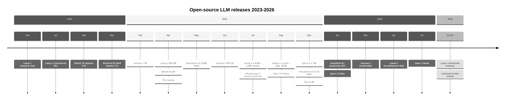
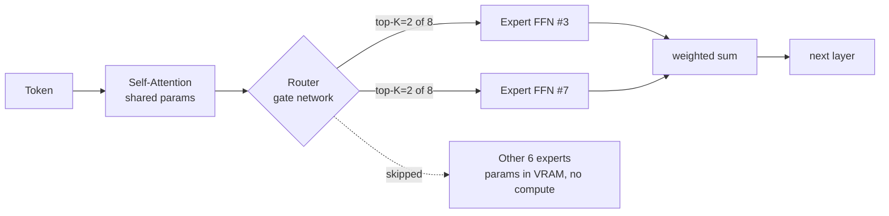
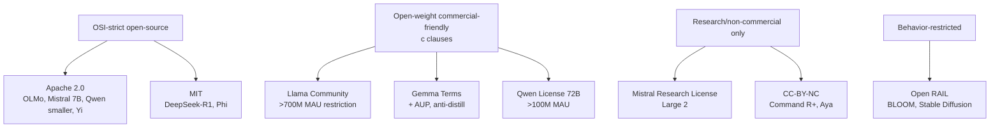
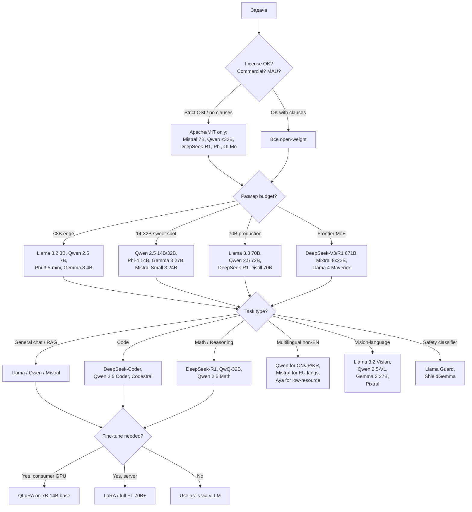

# Вопросы на собеседовании: `Open-Source LLM Ecosystem 2025-2026`

С 2023 года индустрия LLM раскололась на два лагеря: **закрытые frontier-модели** (GPT-4o, Claude, Gemini) и **open-weight ecosystem** — Llama, Mistral, Qwen, DeepSeek, Gemma, Phi. К 2026 разрыв в качестве на популярных бенчмарках почти стёрся: `DeepSeek-V3` соревнуется с `GPT-4o`, `Llama 3.3 70B` догоняет `405B`, а `Qwen 2.5` стал стандартом для self-host в Азии.

На интервью спрашивают: чем `open-source` отличается от `open-weight`, что такое `MoE` и почему `total params ≠ active params`, как читать `Llama Community License`, когда self-host дешевле API, и какие подводные камни у дообучения этих моделей.

## Полезные ссылки

### Официальная документация и авторитетные источники

- [Llama 3 Paper (Meta)](https://ai.meta.com/research/publications/the-llama-3-herd-of-models/) — 92-страничный технический отчёт
- [Mistral AI Models Documentation](https://docs.mistral.ai/getting-started/models/) — официальные карточки моделей
- [DeepSeek-V3 Paper (arXiv)](https://arxiv.org/abs/2412.19437) — 671B MoE, заявленная стоимость обучения $5.5M
- [DeepSeek-R1 Paper](https://arxiv.org/abs/2501.12948) — reasoning через GRPO
- [Qwen 2.5 Technical Report](https://arxiv.org/abs/2412.15115) — флагманское семейство Alibaba
- [Gemma 3 Technical Report](https://ai.google.dev/gemma) — открытые веса Google
- [Phi-4 Technical Report (Microsoft)](https://arxiv.org/abs/2412.08905) — упор на качество данных
- [HuggingFace Open LLM Leaderboard](https://huggingface.co/spaces/HuggingFaceH4/open_llm_leaderboard) — стандартный хаб бенчмарков
- [LMSYS Chatbot Arena](https://chat.lmsys.org/) — ранжирование по предпочтениям людей
- [Llama 3 Community License (текст)](https://www.llama.com/llama3/license/) — пункт про 700M DAU

## Содержание

- [Полезные ссылки](#полезные-ссылки)
- [See also](#see-also)

**Базовые понятия**

- [Q1. В чём разница между `open-source`, `open-weight` и `open-source-friendly` моделью?](#q1-в-чём-разница-между-open-source-open-weight-и-open-source-friendly-моделью)
- [Q2. Почему `Llama` и `Gemma` называют open-weight, а не open-source?](#q2-почему-llama-и-gemma-называют-open-weight-а-не-open-source)
- [Q3. Что такое `model card` и почему он обязателен на HuggingFace? `!`](#q3-что-такое-model-card-и-почему-он-обязателен-на-huggingface-)

**Llama family (Meta)**

- [Q4. Какие версии `Llama` существуют и чем они отличаются по архитектуре и лицензии? `!`](#q4-какие-версии-llama-существуют-и-чем-они-отличаются-по-архитектуре-и-лицензии-)
- [Q5. Что особенного в `Llama 3.3 70B` vs `Llama 3.1 405B`?](#q5-что-особенного-в-llama-33-70b-vs-llama-31-405b)
- [Q6. Что изменилось в `Llama 4` (Scout, Maverick, Behemoth)? `!`](#q6-что-изменилось-в-llama-4-scout-maverick-behemoth-)
- [Q7. Что означает clause «700M monthly active users» в Llama Community License?](#q7-что-означает-clause-700m-monthly-active-users-в-llama-community-license)

**Mistral / Mixtral**

- [Q8. Чем `Mistral 7B` отличался от `Llama 2 7B` на момент выхода?](#q8-чем-mistral-7b-отличался-от-llama-2-7b-на-момент-выхода)
- [Q9. Как устроен `Mixtral 8x7B` — почему это не 56B параметров? `!`](#q9-как-устроен-mixtral-8x7b--почему-это-не-56b-параметров-)
- [Q10. Какие модели Mistral остались Apache 2.0, а какие ушли под коммерческую лицензию?](#q10-какие-модели-mistral-остались-apache-20-а-какие-ушли-под-коммерческую-лицензию)

**Qwen family (Alibaba)**

- [Q11. Какие размеры и варианты есть в семействе `Qwen 2.5`? `!`](#q11-какие-размеры-и-варианты-есть-в-семействе-qwen-25-)
- [Q12. Что такое `QwQ-32B` и как он связан с reasoning?](#q12-что-такое-qwq-32b-и-как-он-связан-с-reasoning)
- [Q13. В чём лицензионная особенность `Qwen 72B`?](#q13-в-чём-лицензионная-особенность-qwen-72b)

**DeepSeek family**

- [Q14. Что такое `DeepSeek-V3` и почему его training cost ($5.5M) шокировал индустрию? `!`](#q14-что-такое-deepseek-v3-и-почему-его-training-cost-55m-шокировал-индустрию-)
- [Q15. Чем `DeepSeek-R1` отличается от `DeepSeek-V3`?](#q15-чем-deepseek-r1-отличается-от-deepseek-v3)
- [Q16. Что такое `DeepSeek-R1-Distill` и почему дистиллированный 70B доступнее R1?](#q16-что-такое-deepseek-r1-distill-и-почему-дистиллированный-70b-доступнее-r1)

**Gemma / Phi**

- [Q17. Что входит в семейство `Gemma 3` от Google? `!`](#q17-что-входит-в-семейство-gemma-3-от-google-)
- [Q18. Что такое `PaliGemma`, `CodeGemma`, `ShieldGemma`?](#q18-что-такое-paligemma-codegemma-shieldgemma)
- [Q19. Чем отличается `Phi-4` от `Phi-3.5-MoE`?](#q19-чем-отличается-phi-4-от-phi-35-moe)

**Другие open-weight модели**

- [Q20. Что такое `OLMo` и почему его называют «fully open»? `!`](#q20-что-такое-olmo-и-почему-его-называют-fully-open-)
- [Q21. Какие ещё open-weight семейства стоит знать (Yi, DBRX, Command R+, Granite)?](#q21-какие-ещё-open-weight-семейства-стоит-знать-yi-dbrx-command-r-granite)

**MoE economics**

- [Q22. Почему в MoE-моделях `total params` важен для VRAM, а `active params` — для compute? `!`](#q22-почему-в-moe-моделях-total-params-важен-для-vram-а-active-params--для-compute-)
- [Q23. Что такое `routing overhead` в MoE и почему MoE не всегда дешевле dense?](#q23-что-такое-routing-overhead-в-moe-и-почему-moe-не-всегда-дешевле-dense)

**Self-host vs API trade-offs**

- [Q24. Когда self-host open-source выгоднее API? Когда — наоборот? `!`](#q24-когда-self-host-open-source-выгоднее-api-когда--наоборот-)
- [Q25. Какой production-стек для self-host open-source LLM на vLLM/TensorRT-LLM?](#q25-какой-production-стек-для-self-host-open-source-llm-на-vllmtensorrt-llm)
- [Q26. Что такое `GGUF`, `AWQ`, `GPTQ` и почему их выкладывает community, а не авторы?](#q26-что-такое-gguf-awq-gptq-и-почему-их-выкладывает-community-а-не-авторы)

**Licensing deep dive**

- [Q27. Сравни `Apache 2.0`, `MIT`, `Llama Community`, `Gemma Terms`, `Mistral Research License`. `!`](#q27-сравни-apache-20-mit-llama-community-gemma-terms-mistral-research-license-)
- [Q28. Что такое `Open RAIL License` и где применяется?](#q28-что-такое-open-rail-license-и-где-применяется)
- [Q29. Какие риски security при загрузке моделей с HuggingFace? `!`](#q29-какие-риски-security-при-загрузке-моделей-с-huggingface-)

**Fine-tuning, benchmarks, outlook**

- [Q30. Какие open-source модели реально fine-tune-нуть на consumer GPU (4090 24GB)?](#q30-какие-open-source-модели-реально-fine-tune-нуть-на-consumer-gpu-4090-24gb)
- [Q31. Какие подводные камни при оценке open-source моделей по бенчмаркам?](#q31-какие-подводные-камни-при-оценке-open-source-моделей-по-бенчмаркам)
- [Q32. Decision tree: как выбрать open-source модель под задачу? `!`](#q32-decision-tree-как-выбрать-open-source-модель-под-задачу-)
- [Q33. Какие code-specific open-source модели есть и какая под что?](#q33-какие-code-specific-open-source-модели-есть-и-какая-под-что)
- [Q34. Outlook 2026: где open-source догоняет frontier, а где отстаёт?](#q34-outlook-2026-где-open-source-догоняет-frontier-а-где-отстаёт)

## Timeline open-source LLM releases 2023-2026



---

## Q1. В чём разница между `open-source`, `open-weight` и `open-source-friendly` моделью?

**Open-source LLM** = модель, у которой открыто **всё**: веса, код обучения, данные, training recipe. Под Apache 2.0 / MIT. Пример: `OLMo`, `BLOOM`. Можно полностью воспроизвести.

**Open-weight LLM** = открыты только **веса** и (обычно) inference-код. Данные, training-код, recipe — закрыты или частично описаны в paper. Веса можно скачать, дообучить, развернуть. Примеры: `Llama 3`, `Mistral`, `Qwen`, `Gemma`, `DeepSeek`. Это **большинство** того, что в индустрии называют «open-source», но строго это open-weight.

**Open-source-friendly** = закрытая модель с либеральным API (открытый SDK, без vendor lock-in на формат), но веса недоступны. Пример: некоторые закрытые модели с детальной документацией. К open-source это **не относится**, термин маркетинговый.

```text
                    весА    КОД ОБУЧЕНИЯ   ДАННЫЕ   recipe
Open-source         OPEN    OPEN           OPEN     OPEN     OLMo, BLOOM
Open-weight         OPEN    closed         closed   partial  Llama, Mistral
Open-source-friendly closed closed         closed   doc'd    Anthropic API
```

Практический смысл: с **open-weight** можно развернуть у себя, дообучить, проверить модель экспертно (forensic-анализ). С **open-source** можно ещё и воспроизвести pre-training (нужны вычисления на $1M-$60M).

## Q2. Почему `Llama` и `Gemma` называют open-weight, а не open-source?

1. **Веса доступны под лицензией**, но это не одобренная OSI open-source лицензия.
2. **Обучающие данные закрыты**: Meta опубликовала состав корпуса для Llama 3 только в общих терминах («15T токенов, web crawl + код + математика»), без самого датасета.
3. **Код обучения частично закрыт**: высокоуровневые описания в paper, но не готовый repo для воспроизведения.
4. **Лицензия ограничивает использование**: для Llama — пункт про 700M DAU и acceptable use policy; для Gemma — `Gemma Terms of Use` запрещают ряд сценариев использования.

OSI (Open Source Initiative) в 2024 опубликовал `OSAID` (Open Source AI Definition), под которое `Llama` и `Gemma` **не подпадают**, а `OLMo` подпадает. Поэтому корректный термин — **open-weight**. На интервью важно различать: «open-source-like» допустимо в неформальной речи, но в юридическом / compliance-разговоре — нет.

## Q3. Что такое `model card` и почему он обязателен на HuggingFace? `!`

`Model card` — структурированное описание модели в `README.md` репозитория HuggingFace. Включает: назначение (intended use), сводку по обучающим данным, результаты оценки, ограничения, лицензию, цитирование. Введён paper «Model Cards for Model Reporting» (Mitchell et al., 2018), стал индустриальным стандартом.

Зачем обязательно:
- **Ясность лицензии** — без явной лицензии модель нельзя законно использовать в продакшене.
- **Воспроизводимость** — пользователь должен знать, на чём обучали.
- **Раскрытие bias / safety** — известные failure modes.
- **Compliance** (EU AI Act, NIST AI RMF) — требуют документацию.

HuggingFace с 2024 в Spaces и enterprise-тарифах **блокирует** загрузку моделей без model card. На интервью спрашивают про model card в контексте AI governance и закупок (procurement) (см. `ai-compliance-governance-interview.md`).

Пример минимального model card:

```markdown
---
license: apache-2.0
language: en
tags: [llama, instruct]
base_model: meta-llama/Llama-3.1-8B
---
# Model name
## Intended use
Chat assistant for general-purpose Q&A...
## Training data
Fine-tuned on 50k samples of OASST...
## Evaluation
MMLU: 65.2 | HumanEval: 42.1
## Limitations
- Hallucinates on factual questions.
- English-primary, weak on Russian.
```

## Q4. Какие версии `Llama` существуют и чем они отличаются по архитектуре и лицензии? `!`

| Версия | Дата | Размеры | Context | Лицензия | Особенности |
|---|---|---|---|---|---|
| `Llama 1` | фев 2023 | 7B / 13B / 33B / 65B | 2K | только research | Утечка на 4chan запустила экосистему |
| `Llama 2` | июл 2023 | 7B / 13B / 70B | 4K | Llama 2 Community (коммерция OK с ограничением >700M DAU) | RLHF, chat-вариант |
| `Code Llama` | авг 2023 | 7B/13B/34B/70B | 16K-100K | лицензия Llama 2 | На основе Llama 2 + код |
| `Llama 3` | апр 2024 | 8B / 70B | 8K | Llama 3 Community License | 15T токенов обучения, GQA |
| `Llama 3.1` | июл 2024 | 8B / 70B / 405B | 128K | Llama 3.1 Community | Длинный контекст, мультиязычность |
| `Llama 3.2` | сен 2024 | 1B / 3B / 11B / 90B | 128K | Llama 3.2 (vision ограничен в ЕС) | Мультимодальные (11B/90B) + edge (1B/3B) |
| `Llama 3.3` | дек 2024 | 70B (только текст) | 128K | Llama 3.3 Community | По качеству ≈ 3.1 405B |
| `Llama 4` | апр 2025 | Scout 17Bx16 MoE / Maverick 17Bx128 MoE / Behemoth (в обучении) | 10M+ | Llama 4 Community | Архитектура sparse MoE |

Архитектурно: все Llama 2/3/4 — decoder-only Transformer, позиционное кодирование `RoPE`, `RMSNorm`, `SwiGLU`. Llama 3 ввёл `Grouped Query Attention` (GQA) для всех размеров (раньше только 70B). Llama 4 — первый Llama на MoE.

## Q5. Что особенного в `Llama 3.3 70B` vs `Llama 3.1 405B`?

`Llama 3.3 70B` (дек 2024) — релиз только в instruct-варианте, **те же 70B параметров**, что у Llama 3.1 70B, но **качество ближе к 405B** на reasoning / math-бенчмарках. Достигнуто за счёт:

- Лучшего `post-training` (улучшенный RLHF / DPO recipe).
- Большего объёма высококачественных SFT-данных.
- Tool use и мультиязычность вышли заметно сильнее.

Практический вывод: **70B-модели сейчас покрывают большинство production-сценариев**, 405B нужна только когда критична точность «последней мили» на сложных задачах. Inference 70B разумно крутится на 2× H100 в `fp8`, а 405B требует 8× H100 даже в `fp8`. Стоимость inference 405B примерно в 5-6× выше при не радикально лучшем качестве — поэтому 3.3 70B стал популярным выбором по умолчанию.

```text
                     MMLU  HumanEval  GPQA  Cost/1M tokens (self-host estimate)
Llama 3.1 70B        82.0  80.5       46.7  ~$0.30
Llama 3.3 70B        86.0  88.4       50.5  ~$0.30
Llama 3.1 405B       88.6  89.0       50.7  ~$1.50-2.00
```

## Q6. Что изменилось в `Llama 4` (Scout, Maverick, Behemoth)? `!`

`Llama 4` (апрель 2025) — первое поколение Meta на **sparse MoE** (Mixture of Experts) с нативной мультимодальностью (текст + изображения).

| Модель | Архитектура | Active params | Total params | Контекст | Сценарий |
|---|---|---|---|---|---|
| `Llama 4 Scout` | 16 экспертов × 17B | 17B | 109B | 10M токенов (заявлено) | Один H100, длинный контекст |
| `Llama 4 Maverick` | 128 экспертов × 17B | 17B | 400B | 1M+ | Production на нескольких GPU |
| `Llama 4 Behemoth` | ~16 экспертов × 288B | 288B | ~2T | — | Обучение (frontier) |

Ключевые изменения относительно Llama 3:
- **MoE везде**: dense-версии Llama закончились. Маршрутизация на уровне токена через обучаемый gate.
- **Нативная мультимодальность**: текст + изображения в одной модели, encoder с early fusion.
- **Огромный контекст**: у Scout заявлено 10M токенов (через `interleaved RoPE` + специальное pre-training на длинных документах).
- **Active = 17B**: при total 109B-400B вычисления на inference как у dense-модели 17B, но `VRAM` нужен под все веса.

Лицензия — Llama 4 Community License (тот же пункт про 700M DAU + дополнительные ограничения для ЕС из-за Digital Markets Act).

## Q7. Что означает clause «700M monthly active users» в Llama Community License?

Llama Community License по умолчанию **разрешает коммерческое использование**, но с одним ограничением: если ваше приложение или продукт прямо или через аффилированных лиц имеет **более 700 миллионов monthly active users** (DAU/MAU зависит от версии лицензии — для Llama 3 это **MAU на дату релиза модели**), то для коммерческого использования Llama **требуется отдельная лицензия от Meta**.

Практический смысл:
- 700M+ MAU — это уровень **Apple, Google, Microsoft, Amazon, ByteDance, Tencent**. Прямые конкуренты Meta.
- Для 99.99% компаний этот пункт нерелевантен.
- Это «отравленная пилюля» (poison pill): не даёт `BigTech` бесплатно собирать AI-продукты на труде Meta.

Дополнительно у лицензии Llama есть `Acceptable Use Policy`: запрещены военное применение, CSAM, незаконное насилие, слежка без правовых оснований и т.п. Это **не open-source** по OSI, потому что ограничения на использование нарушают принцип свободы использования (freedom-of-use).

## Q8. Чем `Mistral 7B` отличался от `Llama 2 7B` на момент выхода?

`Mistral 7B` (сент 2023) обогнал `Llama 2 13B` на большинстве бенчмарков, будучи в 2× меньше. Ключевые отличия:

| Аспект | Mistral 7B | Llama 2 7B |
|---|---|---|
| Attention | `Sliding Window Attention` (окно 4K) + `GQA` | Full attention + MHA |
| Лицензия | Apache 2.0 (полностью permissive) | Llama 2 Community (с пунктом про 700M) |
| Контекст | 8K (расширяется через SWA) | 4K |
| Токенизатор | Собственный BPE | Токенизатор Llama |
| Обучающие данные | Не раскрыты | 2T токенов |

`Sliding Window Attention` ограничивает attention локальным окном (4096 токенов), снижая память и вычисления до `O(n × w)` вместо `O(n²)`. Для длинного контекста это экономичное приближение.

`GQA` (Grouped Query Attention) — несколько query-голов делят одну пару key/value, уменьшая KV-cache. У `Llama 2` это было только в 70B-варианте; Mistral сделал во всех.

Apache 2.0 у Mistral 7B стал **критичным фактором распространения**: можно использовать в коммерции без оговорок, форкать, продавать, встраивать в продукт. Это превратило Mistral 7B в стандартный baseline для community fine-tunes.

## Q9. Как устроен `Mixtral 8x7B` — почему это не 56B параметров? `!`

`Mixtral 8x7B` (дек 2023) — sparse MoE, **47B total / 12.9B active**. Название «8x7B» — маркетинговое, не математическое.

Архитектура: каждый Transformer-блок имеет 8 параллельных `FFN` (feed-forward) экспертов вместо одного. На каждый токен router выбирает top-2 эксперта (`top-k=2`), и их выходы взвешенно суммируются.

```text
Token → Attention → Router (8 experts) → top-2 → FFN_3 + FFN_7 → output
                                                  ↑ выбор зависит от токена
```

Почему 47B, а не 56B:
- Слой `Attention` — общий (не реплицируется на 8 экспертов).
- Реплицируются только **FFN-веса** (≈80% параметров блока).
- Итого 8× FFN + 1× attention + эмбеддинги = ~47B, не 56B.

Почему активны 12.9B:
- На каждый токен — только 2 из 8 экспертов (`top-2`).
- 2/8 = 25% от FFN, плюс полный attention.
- Вычисления на токен ≈ эквивалент dense-модели 12.9B.

Следствие: `Mixtral 8x7B` по качеству конкурирует с `Llama 2 70B`, но **inference в 4-6× дешевле** (вычисления как у 13B). VRAM при этом нужен под все 47B (≈90GB в fp16, ~24GB в 4-bit GGUF).

## Q10. Какие модели Mistral остались Apache 2.0, а какие ушли под коммерческую лицензию?

С 2024 Mistral разделил линейку на **open** и **commercial**:

| Модель | Лицензия | Назначение |
|---|---|---|
| `Mistral 7B v0.1/v0.2/v0.3` | Apache 2.0 | Открытый baseline |
| `Mixtral 8x7B` | Apache 2.0 | Открытая MoE |
| `Mixtral 8x22B` (141B/39B active) | Apache 2.0 | Более крупная открытая MoE |
| `Mistral 7B Instruct` | Apache 2.0 | Чат |
| `Mistral NeMo 12B` (с NVIDIA) | Apache 2.0 | Мультиязычная |
| `Mistral Small 3` (2025) | Apache 2.0 | 24B dense, низкая задержка |
| `Codestral` | Mistral Non-Production License (MNPL) | Код, только research/внутреннее использование |
| `Mistral Large 2` | Mistral Research License | Research / некоммерческое |
| `Pixtral 12B` | Apache 2.0 | Мультимодальная (vision-text) |
| `Pixtral Large` | Mistral Research License | Frontier-vision |

Бизнес-логика Mistral: **small/medium** под Apache 2.0 → распространение в сообществе. **Frontier (Large)** под research-лицензией → монетизация через API/enterprise.

`Mistral Research License`: можно использовать для исследований, внутренней оценки, академических публикаций. **Нельзя** использовать в коммерческом продукте или предоставлять как сервис. Для коммерции нужна enterprise-лицензия от Mistral.

## Q11. Какие размеры и варианты есть в семействе `Qwen 2.5`? `!`

`Qwen 2.5` (сент 2024) от Alibaba — наиболее **полная по размерному ряду** open-weight семья. Все варианты с контекстом 128K (через scaling `YARN`).

| Размер | Базовая лицензия | Назначение |
|---|---|---|
| `Qwen 2.5 0.5B` | Apache 2.0 | Edge, mobile |
| `Qwen 2.5 1.5B` | Apache 2.0 | Edge |
| `Qwen 2.5 3B` | Qwen Research License | Edge, встраиваемые системы |
| `Qwen 2.5 7B` | Apache 2.0 | Массовый сегмент |
| `Qwen 2.5 14B` | Apache 2.0 | Средний сегмент |
| `Qwen 2.5 32B` | Apache 2.0 | Высокое качество |
| `Qwen 2.5 72B` | Qwen License (не Apache) | Флагманская dense |

Специализированные варианты (все на базе Qwen 2.5):
- `Qwen 2.5 Math` (1.5B/7B/72B) — математический reasoning.
- `Qwen 2.5 Coder` (0.5B → 32B) — автодополнение кода / чат, конкурент `DeepSeek-Coder`.
- `Qwen 2.5 VL` — vision-language.
- `QwQ-32B` — reasoning-модель (chain-of-thought, обучена через RL).
- `Qwen 2.5-Max` (янв 2025) — frontier-MoE через API (веса не выложены).

`Qwen 3` (2025) — следующее поколение с нативными reasoning-режимами (`thinking` / `non-thinking`, переключаемыми на каждый запрос).

Особенность Qwen: **отлично работает с китайским и азиатскими языками**, лучше Llama на контенте CN/JP/KR. Слабее на восточноевропейских языках.

## Q12. Что такое `QwQ-32B` и как он связан с reasoning?

`QwQ-32B` (Qwen with Questions, нояб 2024) — **reasoning-модель** от Alibaba, конкурент `o1-preview` и `DeepSeek-R1`. 32B dense-параметров, базовая модель — `Qwen 2.5-32B`, дообученная через RL с reward-сигналом за корректные chain-of-thought.

Особенности:
- Генерирует длинные блоки `<thinking>` перед финальным ответом (до 8-16K токенов CoT).
- На `MATH` достигает 90.6%, на `GPQA Diamond` — 65.2% (близко к o1-mini).
- Лицензия — Apache 2.0 (в отличие от Qwen 72B).
- Inference дорогой: длинные CoT → в 5-10× больше токенов, чем у dense-ответов.

`QwQ-32B-Preview` — первая публичная открытая reasoning-модель уровня o1. После неё вышла `DeepSeek-R1` (671B MoE), которая обошла QwQ на большинстве задач, но `QwQ-32B` всё ещё актуальна, если нужна reasoning-модель, **умещающаяся на один H100 80GB**.

Связь с reasoning-парадигмой: подтверждение, что `test-time compute scaling` (см. `reasoning-models-interview.md`) **воспроизводим в open-source** без секретного know-how OpenAI — нужны RL и хороший reward.

## Q13. В чём лицензионная особенность `Qwen 72B`?

`Qwen 72B` (как версия 1.5, так и 2.5 в размере 72B) выпущен **не под Apache 2.0**, а под **Qwen License** (раньше Tongyi Qianwen License). Ключевое:

- **Коммерческое использование разрешено**, но если у вашего продукта **>100 миллионов MAU**, требуется отдельная лицензия от Alibaba.
- **Не запрещены** конкуренция с Alibaba Cloud или fine-tunes.
- **Запрещено** использовать output Qwen для обучения других LLM (формально — anti-distillation clause).
- Есть `acceptable use policy` (без военного применения, без незаконного и т.п.).

Меньшие варианты (0.5B, 1.5B, 7B, 14B, 32B) — под **Apache 2.0**. Идея та же, что у Meta: монетизация только через пункты, защищающие от прямых конкурентов масштаба BigTech.

## Q14. Что такое `DeepSeek-V3` и почему его training cost ($5.5M) шокировал индустрию? `!`

`DeepSeek-V3` (дек 2024) — 671B MoE (37B active), лицензия MIT-подобная (`DeepSeek License v1`, по сути MIT). Paper заявляет стоимость обучения **$5.576M** при условиях:

- 14.8T токенов pretraining.
- 2.788M H800-часов (H800 — китайская версия H100 с урезанным NVLink из-за экспортных ограничений).
- $2/час за H800 → ~$5.5M.

Почему это шокировало индустрию:
- `Llama 3.1 405B` стоила ~$60M по разным оценкам.
- `GPT-4` — оценка $100M+.
- DeepSeek сделал модель **уровня GPT-4o** за **в 10× меньше**.

Что они сделали:
- **MLA** (Multi-head Latent Attention) — низкоранговое сжатие KV-cache.
- **DeepSeekMoE** с **256 routed-экспертами + 1 shared** на блок, маршрутизация top-8.
- **Auxiliary-loss-free load balancing** — балансировка нагрузки без штрафа за дисбаланс экспертов.
- **FP8-обучение** на большинстве операций (сэкономили вычисления).
- **Multi-Token Prediction** (`MTP`) — предсказание сразу нескольких следующих токенов как вспомогательная цель (auxiliary objective).
- Тщательно проинженеренный пайплайн обучения под H800 (компенсация слабого interconnect).

Оговорка: $5.5M — это **только финальный прогон обучения**, без учёта исследований, неудачных экспериментов, зарплат, инфраструктуры. Реальные суммарные затраты (sunk cost) команды DeepSeek кратно выше, но **инкрементальная стоимость финального прогона** действительно скромная.

## Q15. Чем `DeepSeek-R1` отличается от `DeepSeek-V3`?

`DeepSeek-R1` (янв 2025) — **reasoning-версия** на той же базе, что V3 (671B MoE / 37B active), но дообученная через `GRPO` (Group Relative Policy Optimization).

```text
DeepSeek-V3-Base (pretraining)
       ├── SFT / DPO → DeepSeek-V3 (chat)
       └── RL via GRPO → DeepSeek-R1-Zero → SFT → RL → DeepSeek-R1
```

Ключевые различия:

| Аспект | DeepSeek-V3 | DeepSeek-R1 |
|---|---|---|
| Назначение | Общий чат | Reasoning (математика, код, наука) |
| CoT | Короткий, по запросу | Длинный по умолчанию (через `<think>`) |
| Лицензия | DeepSeek License (MIT-подобная) | MIT (явно) |
| Стиль ответа | Прямой ответ | Chain-of-thought → ответ |
| Стоимость API | ~$0.27/1M input | ~$0.55/1M input + дорогие thinking-токены |
| GPQA Diamond | 59.1% | 71.5% |
| AIME 2024 | 39.2% | 79.8% |

`DeepSeek-R1-Zero` — экспериментальная версия, обученная **только через RL без SFT**. Показала спонтанно возникший (emergent) CoT, но страдала от читаемости (смешение языков, скачки в логике). `R1` уже с SFT-«полировкой».

Главный вклад в open-source: **первая open-weight reasoning-модель уровня o1-preview**, под MIT, воспроизводимая. После R1 ВСЕ серьёзные лаборатории выкатили открытые reasoning-варианты.

## Q16. Что такое `DeepSeek-R1-Distill` и почему дистиллированный 70B доступнее R1?

Оригинал `DeepSeek-R1` = 671B MoE, требует ~700GB VRAM (минимум 8× H100 80GB), под bf16. Это **недоступно** для большинства команд.

Решение — **дистилляция**: команда DeepSeek сгенерировала ~800k длинных CoT-ответов от R1 на разных задачах и **дообучила** на них маленькие базовые модели (Llama, Qwen) методом SFT:

| Дистиллированная модель | Базовая | Размер | Сравнима с |
|---|---|---|---|
| `DeepSeek-R1-Distill-Qwen-1.5B` | Qwen 2.5 1.5B | 1.5B dense | — |
| `DeepSeek-R1-Distill-Qwen-7B` | Qwen 2.5 Math 7B | 7B dense | o1-mini на математике |
| `DeepSeek-R1-Distill-Llama-8B` | Llama 3.1 8B | 8B dense | — |
| `DeepSeek-R1-Distill-Qwen-14B` | Qwen 2.5 14B | 14B dense | — |
| `DeepSeek-R1-Distill-Qwen-32B` | Qwen 2.5 32B | 32B dense | o1-mini |
| `DeepSeek-R1-Distill-Llama-70B` | Llama 3.3 70B | 70B dense | ≈ GPT-4o на ряде задач |

Лицензия дистиллятов **наследуется от базовой модели**: Qwen-дистилляты — Apache 2.0, Llama-дистилляты — Llama Community License. Поэтому Llama-70B дистиллят для коммерческого продукта подчиняется пункту Llama (700M MAU).

Дистиллированная 70B умещается на 2× A100 80GB или 1× H100 в `fp8`, что **на порядок** доступнее оригинала R1. Компромисс по качеству: дистиллят теряет ~10-20% на сложных задачах относительно полной R1, но добавляет CoT-возможность к существующей базовой модели.

## Q17. Что входит в семейство `Gemma 3` от Google? `!`

`Gemma 3` (март 2025) — третья итерация open-weight семьи Google. Лицензия — `Gemma Terms of Use` (коммерция разрешена, но с ограничениями).

| Модель | Параметры | Мультимодальность | Контекст | Примечание |
|---|---|---|---|---|
| `Gemma 3 1B` | 1B | Только текст | 32K | Edge / mobile |
| `Gemma 3 4B` | 4B | Vision + текст | 128K | Массовый сегмент |
| `Gemma 3 12B` | 12B | Vision + текст | 128K | Средний сегмент |
| `Gemma 3 27B` | 27B | Vision + текст | 128K | Флагман |

Особенности:
- Нативная мультимодальность от 4B и выше (vision encoder + text decoder).
- Контекст 128K во всех размерах, кроме 1B.
- Vision encoder `SigLIP`, текстовая архитектура `Gemma` (адаптация Gemini).
- 140+ языков из коробки.
- Pre-trained и instruction-tuned варианты.

Gemma 2 (июнь 2024, 9B / 27B) — только текст, на тот момент была сильнее Llama 3 8B / Qwen 2 7B. Gemma 3 — модернизация с мультимодальностью и бо́льшим контекстом.

`Gemma Terms of Use`: коммерция разрешена, но запрещено использовать output для обучения других LLM (anti-distillation), запрещён ряд сценариев (обман, слежка, вредоносное ПО и т.д.). Это **более ограничительная** лицензия, чем Apache 2.0.

## Q18. Что такое `PaliGemma`, `CodeGemma`, `ShieldGemma`?

Сателлиты Gemma под специфические задачи, все под `Gemma Terms of Use`:

- **`PaliGemma`** (2024, обновлён до PaliGemma 2 в 2025) — vision-language модель, база SigLIP + Gemma. Размеры: 3B / 10B / 28B. Используется для описания изображений (captioning), OCR, VQA. До Gemma 3 это был отдельный путь для vision; теперь нативная мультимодальность Gemma 3 сделала PaliGemma более нишевой.
- **`CodeGemma`** (2024) — fine-tune под код. Размеры 2B / 7B. Заточен под автодополнение кода и infilling (`FIM` — fill in the middle).
- **`RecurrentGemma`** (2024) — экспериментальная архитектура на базе `Griffin` (линейная рекуррентность вместо attention). Лучше на длинном контексте при малой памяти, но проигрывает обычной Gemma по качеству.
- **`ShieldGemma`** (2024) — **safety-классификатор** на базе Gemma. Принимает prompt+response, относит к категориям вреда (hate, harassment, sexual, dangerous). Используется как guardrail для других моделей. Аналог `Llama Guard`. Размеры 2B / 9B / 27B.
- **`DataGemma`** — fine-tune для взаимодействия с Google Data Commons.

ShieldGemma особенно актуальна в production: ставится как pre/post-фильтр перед основной LLM, см. `ai-safety-guardrails-interview.md`.

## Q19. Чем отличается `Phi-4` от `Phi-3.5-MoE`?

Семейство Microsoft Phi — серия маленьких моделей с фокусом на **качество данных**, а не размер. Все под лицензией MIT.

| Модель | Размер | Архитектура | Дата | Сильные стороны |
|---|---|---|---|---|
| `Phi-3 mini` | 3.8B | Dense | апр 2024 | Edge, on-device |
| `Phi-3 small` | 7B | Dense | 2024 | Массовый сегмент |
| `Phi-3 medium` | 14B | Dense | 2024 | Средний сегмент |
| `Phi-3.5-mini` | 3.8B | Dense | авг 2024 | Обновлённое обучение |
| `Phi-3.5-MoE` | 42B / 6.6B active | MoE 16×3.8B | авг 2024 | Высокое качество / низкие вычисления |
| `Phi-3.5 vision` | 4.2B | Мультимодальная | авг 2024 | Vision-text |
| `Phi-4` | 14B | Dense | дек 2024 | Фокус на reasoning, MIT |
| `Phi-4-mini` | 3.8B | Dense | 2025 | Компактная |
| `Phi-4 multimodal` | ~5.6B | Мультимодальная | 2025 | Аудио + vision + текст |

Различия `Phi-4` (14B dense) и `Phi-3.5-MoE` (42B/6.6B):
- `Phi-4` сфокусирован на **качестве reasoning** (бенчмарки по математике и науке).
- `Phi-3.5-MoE` сфокусирован на **эффективности при масштабе**: total 42B даёт качество ~Mixtral 8x7B, вычисления как у 6.6B.
- Phi-4 умещается на 1× H100 80GB в bf16; Phi-3.5-MoE требует ~85GB VRAM (под все веса), но вычисления дешевле.
- Phi-4 на `GPQA Diamond` — 56.1%, обходит даже Llama 3.1 70B (хотя в 5× меньше).

Философия Phi: **синтетические данные «качества учебника» + отфильтрованный веб** + хорошая reasoning-разметка. Это альтернатива принципу «больше параметров = лучше», доказательство того, что качество данных важнее.

## Q20. Что такое `OLMo` и почему его называют «fully open»? `!`

`OLMo` (Open Language Model, Allen Institute for AI) — **единственная серия моделей**, которая реально соответствует строгому определению open-source (`OSAID`).

Что открыто:
1. **Веса** — все чекпоинты на HuggingFace.
2. **Код обучения** — repo `OLMo` на GitHub с полным пайплайном.
3. **Обучающие данные** — датасет `Dolma` (3T токенов) опубликован.
4. **Рецепты** — конфигурации, гиперпараметры, расписания learning rate.
5. **Промежуточные чекпоинты** — каждые ~500 шагов, для интерпретируемости.
6. **Логи WandB** — полная телеметрия обучения.
7. **Набор для оценки** — `OLMES`, `Paloma`.
8. **Лицензия** — Apache 2.0 на всё.

Размеры: `OLMo 1B / 7B`, `OLMo 2 7B / 13B`, `OLMo 2 32B` (2025).

Сценарии использования:
- **Академия**: воспроизводимые исследования динамики pretraining.
- **Compliance**: для регулируемых отраслей, требующих полного audit trail (EU AI Act `Article 53`).
- **Образование**: первая и единственная LLM, которую можно реально изучить от начала до конца.

Качество ниже, чем у Llama / Qwen / DeepSeek (бюджет AI2 кратно меньше, чем у Meta), но это **принципиальный компромисс**, а не баг. OLMo решает другую задачу — **прозрачность**.

Похожие проекты: `Pythia` (EleutherAI, 2023) — старее, меньше, в основном для исследований интерпретируемости. `BLOOM` (BigScience, 2022, 176B) — полностью открытая, но устарела.

## Q21. Какие ещё open-weight семейства стоит знать (Yi, DBRX, Command R+, Granite)?

| Семейство | От кого | Размеры | Лицензия | Особенность |
|---|---|---|---|---|
| `Yi` | 01.AI (Kai-Fu Lee) | 6B / 9B / 34B / Yi-1.5 / Yi-VL | Apache 2.0 | Сильная мультиязычность, был популярен в 2024 как 34B sweet spot |
| `DBRX` | Databricks | 132B / 36B active MoE | Databricks Open Model License | 16 экспертов × 11B, фокус на enterprise |
| `Command R+` | Cohere | 104B dense | CC-BY-NC-4.0 (некоммерческие веса), коммерческий API | Заточен под RAG, tool use |
| `Command R 7B/35B` | Cohere | 7B / 35B | CC-BY-NC-4.0 | Поменьше, фокус на RAG |
| `Granite` | IBM | 3B / 8B / 20B / 34B + MoE 1B/3B | Apache 2.0 | Enterprise-уровень, фокус на коде |
| `Granite Vision` | IBM | 3.4B / 8B | Apache 2.0 | Document AI |
| `Aya` | Cohere for AI | 8B / 23B / 35B | CC-BY-NC-4.0 | 23+ языка, фокус на мультиязычности |
| `Falcon` | TII (ОАЭ) | 7B / 40B / 180B / Falcon 3 | Apache 2.0 / TII Falcon LLM License | Был первой открытой 180B в 2023, сейчас уступил |
| `Snowflake Arctic` | Snowflake | 480B / 17B active MoE | Apache 2.0 | Enterprise SQL/код |
| `Reka` | Reka AI | Reka Flash, Core | Собственная коммерческая | Мультимодальная, не полностью открыта |
| `Nemotron` | NVIDIA | 70B (производная Llama 3.1) | NVIDIA Open Model License | Llama 3.1 70B + обновлённый RLHF от NVIDIA |

Из них в production чаще всего: `Yi-34B` (legacy), `DBRX` (нативные стеки Databricks), `Granite` (клиенты IBM), `Command R+` (фокус на RAG). `Falcon` сейчас в основном legacy — его вытеснили Qwen / Llama / Mistral.

## Q22. Почему в MoE-моделях `total params` важен для VRAM, а `active params` — для compute? `!`

`MoE` (Mixture of Experts) разбивает FFN-слой на N экспертов, и router выбирает top-K на токен. Это даёт **разделение масштаба и вычислений**.

Пример: `DeepSeek-V3` — 671B total, 37B active.

**VRAM (память)**:
- Все 671B параметров **должны быть в памяти** во время inference, потому что для каждого токена router выбирает **разные** эксперты — нельзя выгрузить «неиспользуемые».
- В bf16: 671B × 2 байта = **~1.3 TB VRAM**.
- В fp8: ~700 GB.
- В 4-bit: ~340 GB.
- Это минимум для inference, плюс KV-cache, активации.
- → нужен серверный multi-GPU (8× H100 или больше).

**Вычисления (FLOPs)**:
- Прямой проход (forward pass) на каждый токен использует только **active params** = 37B.
- FLOPs ≈ как у dense-модели 37B.
- → **задержка / стоимость inference ≈ dense 37B**, не 671B.

Следствие — экономика MoE:
| Метрика | Dense 70B | MoE 671B/37B active |
|---|---|---|
| VRAM | ~140 GB | ~1300 GB |
| FLOPs/токен | эквив. 70B | эквив. 37B |
| Качество | Baseline | ≫ baseline |
| Throughput при достаточном VRAM | средний | высокий |

MoE окупается, когда: (а) есть VRAM под total params; (б) хочется качество выше dense + дешёвый inference. Не окупается на consumer GPU (лимит VRAM).



## Q23. Что такое `routing overhead` в MoE и почему MoE не всегда дешевле dense?

`Routing overhead` — дополнительные затраты в MoE, не сводящиеся к FLOPs самих FFN:

1. **Вычисления gate-сети**: на каждый токен router считает softmax по N экспертам — это `O(d × N)` FLOPs. При N=256 (DeepSeek) это не пренебрежимо мало.
2. **All-to-all-коммуникация**: при распределённом inference (`expert parallelism`) токены маршрутизируются между GPU/узлами. На больших батчах это становится bottleneck сильнее, чем сами FFN.
3. **Балансировка нагрузки**: если router отправляет 90% токенов в один эксперт — этот GPU перегружен, остальные простаивают. Нужны вспомогательные лоссы (auxiliary losses) — или подход auxiliary-loss-free, как у DeepSeek-V3 — на этапе обучения, а на inference — capacity factor / token dropping.
4. **Размер KV-cache**: такой же, как у dense-эквивалента по active params.
5. **Пропускная способность памяти**: все эксперты должны быть в HBM; чтение их весов из global memory может стать bottleneck при низкой arithmetic intensity.

Почему MoE может оказаться **не дешевле dense**:
- При **малых размерах батча** all-to-all доминирует в задержке.
- При **inference на одного пользователя** routing overhead не амортизируется.
- На **consumer GPU** total params не помещается, приходится прибегать к swapping → дико медленно.
- При **строгом latency SLA** dense с прогнозируемой задержкой предпочтительнее MoE с джиттером.

Эмпирически: MoE хорош для **высокопроизводительного батчевого inference** на серверных GPU с быстрым interconnect (`NVLink`/`InfiniBand`). На edge / одном GPU dense часто проще и быстрее.

## Q24. Когда self-host open-source выгоднее API? Когда — наоборот? `!`

Self-host = развёртывание модели на собственной/арендованной инфраструктуре (vLLM + H100 / A100). API = вызов провайдера (OpenAI / Anthropic / DeepSeek / Together / Fireworks).

| Критерий | Self-host выгоднее | API выгоднее |
|---|---|---|
| **Объём** | >5-10M токенов/день стабильно | Низкий или скачкообразный |
| **Задержка** | Нужен стабильный sub-100ms | Приемлемо 200-1000ms |
| **Приватность данных** | Чувствительные (медицина, финансы, PII) | Публичные/внутренние данные |
| **Кастомизация** | Своя дообученная версия, кастомные промпты | Стандартные модели |
| **Compliance** | EU AI Act, требование on-prem | Облако допустимо |
| **Планка качества** | Достаточно open-source модели | Нужна GPT-4o / Claude / o3 |
| **Ресурсы команды** | Есть MLOps-команда | Нет ML-инженеров |
| **Предсказуемость затрат** | Фиксированная месячная ёмкость | Допустима оплата по факту |
| **География** | Нужен локальный хостинг (Россия, Китай) | Глобальный API допустим |

Грубая математика для `Llama 3.3 70B`:
- API через Together/Fireworks: ~$0.60/1M input, $0.60/1M output → $1.20 за 1M токенов суммарно.
- Self-host на 1× H100 80GB ($2-3/час on-demand): пропускная способность ~3000 ток/с = 10.8M ток/час.
- Стоимость: $2.5 / 10.8M = **$0.23 за 1M токенов**.
- Точка безубыточности: ~30% утилизации = ~3.2M ток/час стабильно = ~77M ток/день.

Если у вас <77M ток/день стабильно, **API дешевле**. Если >77M или важны другие критерии (приватность, задержка) — self-host.

Особый случай — **DeepSeek API**: $0.07-0.27/1M input. **Дешевле self-host для большинства**, потому что DeepSeek субсидирует API из стратегических соображений (геополитическое позиционирование, доля рынка). Минус — данные уходят в Китай.

## Q25. Какой production-стек для self-host open-source LLM на vLLM/TensorRT-LLM?

Типичный production-стек self-host:

```text
┌─────────────────────────────────────────────────┐
│  Client (App / Agent / Pipeline)                │
└────────────────────┬────────────────────────────┘
                     │ OpenAI-compatible HTTP
                     ▼
┌─────────────────────────────────────────────────┐
│  API Gateway (Kong / Envoy)                     │
│   - Rate limit / quota                          │
│   - Auth (API key)                              │
│   - Multi-tenant routing                        │
└────────────────────┬────────────────────────────┘
                     │
                     ▼
┌─────────────────────────────────────────────────┐
│  Inference Serving Layer                        │
│   vLLM (PagedAttention) или                     │
│   TensorRT-LLM / SGLang / TGI                   │
│   - Continuous batching                         │
│   - KV cache management                         │
│   - Speculative decoding                        │
└────────────────────┬────────────────────────────┘
                     │ NCCL / TP / PP
                     ▼
┌─────────────────────────────────────────────────┐
│  GPU Cluster (H100 / A100 / MI300)              │
│   - Tensor parallelism                          │
│   - Optional pipeline parallelism               │
└────────────────────┬────────────────────────────┘
                     │
                     ▼
┌─────────────────────────────────────────────────┐
│  Storage: HuggingFace weights, quantized GGUF/AWQ│
│   - S3 / GCS / local NVMe                       │
│   - safetensors format (preferred)              │
└─────────────────────────────────────────────────┘

Cross-cutting:
   - Observability: Prometheus + Grafana + Langfuse / Arize
   - Orchestration: Kubernetes + KServe / BentoML / Ray Serve
   - CI/CD: model promotion via Argo Workflows
   - Safety: Llama Guard / ShieldGemma as pre/post filter
```

Ключевые компоненты:
- **`vLLM`** — самый популярный inference-движок: PagedAttention, continuous batching, OpenAI-совместимый API. Open-source.
- **`TensorRT-LLM`** — только под NVIDIA, выше throughput за счёт kernel fusion и скомпилированных движков, сложнее в эксплуатации.
- **`SGLang`** — конкурент vLLM с фокусом на структурированную генерацию и prefix caching.
- **`KServe`/`BentoML`** — оркестрация моделей в Kubernetes, A/B-тесты, canary-деплои.
- **`safetensors`** — формат HuggingFace на замену `.bin/.pt` (нет pickle, безопасная загрузка, быстрее mmap).

Связано с `model-serving-interview.md` и `inference-optimization-interview.md`.

## Q26. Что такое `GGUF`, `AWQ`, `GPTQ` и почему их выкладывает community, а не авторы?

Это форматы **post-training quantization** — снижение точности весов с fp16/bf16 до 4-bit / 8-bit для сокращения VRAM и ускорения inference.

| Формат | Используется в | Разрядность | Назначение |
|---|---|---|---|
| `GGUF` | `llama.cpp`, `Ollama`, `LM Studio` | 2 / 3 / 4 / 5 / 6 / 8 bit + K-quants | CPU/edge inference, простая загрузка |
| `AWQ` | vLLM, TGI, HF Transformers | 4-bit (типично) | GPU inference, sweet spot качество/скорость |
| `GPTQ` | vLLM, ExLlama, AutoGPTQ | 3-4 bit | GPU, более старый, чем AWQ |
| `EXL2` | ExLlamaV2 | переменная по слоям | GPU, очень тонкая настройка |
| `bitsandbytes` (NF4/INT8) | HF Transformers | 4 / 8 bit | Быстрая квантизация «на лету» |
| `safetensors` (fp16/bf16) | Все | 16-bit | Базовый формат HF |

Почему сообщество, а не авторы:
- **Meta / Google / Mistral / Qwen** официально выкладывают на HF только fp16/bf16 safetensors.
- Квантизация — это **сжатие с потерями**, требует калибровки на репрезентативном датасете, и **результат зависит от целевого железа** (CPU vs GPU, разные архитектуры).
- Контрибьюторы сообщества (`TheBloke`, `bartowski`, `lmstudio-community`, `unsloth`) делают калибровку под популярные форматы и выкладывают на HF.
- Авторы избегают бремени поддержки: «эта 4-bit версия плохо работает» — это проблема community-форка.

Компромисс по качеству:
- 8-bit: <1% потери качества относительно fp16.
- 4-bit (AWQ / GPTQ-act-order): 1-3% потерь.
- 3-bit и ниже: заметная деградация, особенно на reasoning.

Практический совет: **читайте README quant-репозитория** — там обычно тест perplexity и субъективные заметки о качестве. Не все 4-bit одинаковы.

## Q27. Сравни `Apache 2.0`, `MIT`, `Llama Community`, `Gemma Terms`, `Mistral Research License`. `!`

| Лицензия | Тип | Коммерция | Изменение | Распространение | Ограничения на использование | Anti-distillation |
|---|---|---|---|---|---|---|
| `Apache 2.0` | Одобрена OSI | Да | Да | Да | Нет | Нет |
| `MIT` | Одобрена OSI | Да | Да | Да | Нет | Нет |
| `Llama Community` (3 / 3.1 / 3.2 / 3.3 / 4) | Собственная | Да, кроме >700M MAU | Да | Да, с уведомлением | AUP | Нет (но маркировка output) |
| `Gemma Terms of Use` | Собственная | Да | Да | Да | Gemma AUP | Да (нельзя обучать на output) |
| `Mistral Research License` | Собственная | Нет | Да, для research | Да, для research | Только некоммерческое | — |
| `Qwen License` (72B) | Собственная | Да, кроме >100M MAU | Да | Да | AUP | Неявно |
| `DeepSeek License` | MIT-подобная | Да | Да | Да | Минимальная AUP | Нет (V3); R1 — чистый MIT |
| `Open RAIL` | С ограничением поведения | Да | Да | Да | Конкретные виды поведения | Варьируется |
| `CC-BY-NC-4.0` | Creative Commons | Нет | Да, для NC | Да, для NC | Только некоммерческое | Неявно |



Практический юридический разбор:
- **Самое безопасное для коммерции**: Apache 2.0 / MIT (Mistral 7B, OLMo, Qwen ≤32B, DeepSeek-R1, Phi).
- **Допустимо с привычкой проверять**: Llama / Gemma — внимательно со сценарием использования, MAU и раскрытием output.
- **Дисквалификация для production B2C**: Mistral Research License, CC-BY-NC.
- **Всегда читать AUP** (Acceptable Use Policy) — даже под Apache.

## Q28. Что такое `Open RAIL License` и где применяется?

`Open RAIL` (Responsible AI License, от BigScience / Hugging Face, 2022) — лицензия для AI-артефактов, которая разрешает свободное использование, **но запрещает конкретные виды поведения**, перечисленные в `Attachment A`.

Структура:
- Permissive-разрешение: использование, изменение, распространение, коммерция — разрешены.
- **Поведенческие ограничения**: список запрещённых сценариев (клевета, оружие, эксплуатация, медицинская мисдиагностика без контроля и т.п.).
- Привязка к использованию, а не к исходникам: ограничения следуют за моделью, а не только за source-кодом.

Варианты:
- `OpenRAIL-M` — для моделей (models).
- `OpenRAIL-S` — для исходного кода (source code).
- `OpenRAIL-D` — для данных (data).

Где применяется:
- `BLOOM` (BigScience, 176B, 2022) — первая крупная LLM под Open RAIL.
- `Stable Diffusion` v1, v2 (CreativeML Open RAIL-M).
- `IDEFICS` (мультимодальная от HF).

Статус в 2026: **стандартом не стала** для LLM верхнего эшелона. Meta, Google, Mistral, Qwen, DeepSeek предпочитают собственные лицензии либо чистый Apache 2.0/MIT. Open RAIL осталась в нише генерации изображений (экосистема Stable Diffusion) и старых LLM (BLOOM).

OSI считает Open RAIL **не open-source**, потому что ограничения на использование нарушают свободу использования (как и у Llama / Gemma).

## Q29. Какие риски security при загрузке моделей с HuggingFace? `!`

Скачивание весов модели — это **загрузка недоверенного кода**, если формат поддерживает исполнение. Основные риски:

1. **Десериализация pickle** (`.bin`, `.pt`):
   - PyTorch `torch.save` использует Python pickle.
   - Pickle позволяет **выполнение произвольного кода** при `load`.
   - Вредоносный файл модели может запустить shell-команды при `torch.load(...)`.
   - HF в 2023 ввели `pickle scanner` (бейдж `safetensors-friendly`), но не все модели мигрированы.
   - **Защита**: используйте формат `.safetensors`. HF Transformers по умолчанию предпочитает safetensors, если есть оба варианта.

2. **Вредоносный код при `trust_remote_code=True`**:
   - Модели с нестандартной архитектурой требуют `trust_remote_code=True`.
   - Это выполняет `modeling_<arch>.py` из репозитория.
   - Может содержать вредоносное ПО, эксфильтрацию данных, бэкдоры.
   - **Защита**: используйте только проверенных авторов (`meta-llama`, `mistralai`, `Qwen`, `google`, `microsoft`, `deepseek-ai`); проверяйте код перед загрузкой; запускайте в изолированном контейнере.

3. **Модели с бэкдором** (research-уровень):
   - Веса могут быть отравлены: на специфическом trigger-промте модель ведёт себя вредоносно (sleeper agent).
   - Невозможно обнаружить без black-box-тестирования.
   - **Защита**: red-team-тестирование, не доверяйте малоизвестным авторам.

4. **Инъекция кода через токенизатор**:
   - `tokenizer.json` обычно безопасен, но `tokenizer_config.py` или Python-код кастомного токенизатора может содержать вредоносный код.

5. **Атаки на цепочку поставок (supply-chain)**:
   - Атакующий захватывает HF-аккаунт популярного автора и заливает троянизированные веса.
   - **Защита**: фиксируйте конкретный commit / revision hash, проверяйте PGP-подписи, если они есть.

Практический workflow:
- Только `safetensors`, не `.bin`.
- `trust_remote_code=False` по умолчанию, явно включать только для проверенных авторов.
- Запуск в песочнице при экспериментах (Docker без сети, без монтирования host-каталогов).
- Зеркалируйте веса в свой artifact registry с фиксацией хешей (hash-pinning).

## Q30. Какие open-source модели реально fine-tune-нуть на consumer GPU (4090 24GB)?

`RTX 4090` с 24GB VRAM позволяет дообучать через **LoRA / QLoRA** модели следующих масштабов:

| Размер базовой модели | QLoRA (4-bit база) | LoRA (fp16 база) | Полный fine-tune |
|---|---|---|---|
| 1B-3B | тривиально | OK | OK (с gradient checkpointing) |
| 7B-8B | OK (комфортно) | OK (на грани, gradient checkpoint, batch=1-2) | Нет |
| 13B-14B | OK с подгонкой | впритык | Нет |
| 27B-34B | OK с offload | Нет | Нет |
| 70B | Нет (нужно ≥48GB или 2× 4090) | Нет | Нет |

`QLoRA` (Quantized LoRA): базовая модель в **4-bit** (через bitsandbytes NF4), обучаемые LoRA-адаптеры в fp16 поверх. VRAM в 4× меньше, чем при полном fp16-дообучении.

Практичные кандидаты на дообучение на 4090:
- `Llama 3.1 8B` (QLoRA, 4-bit) — комфортно.
- `Qwen 2.5 7B / 14B` (QLoRA).
- `Mistral 7B v0.3` (QLoRA / LoRA).
- `Gemma 2 9B` (QLoRA).
- `Phi-3 medium 14B` (QLoRA, впритык).
- `Qwen 2.5 32B` (QLoRA с CPU offload, медленно).

Что **не** влезет: 70B, MoE с total >40B, любые fp16 ≥ 20B.

Стек: `unsloth` (экономичные ядра) / `axolotl` / `LLaMA-Factory` поверх PyTorch. Время обучения для 7B QLoRA на 50k примерах — 6-12 часов на 4090.

Связано с `fine-tuning-llm-interview.md` (LoRA/QLoRA подробно).

## Q31. Какие подводные камни при оценке open-source моделей по бенчмаркам?

1. **Загрязнение данных (contamination)** — тестовые наборы утекли в обучающие данные. Особенно типично для `MMLU`, `GSM8K`. Модель «знает ответы», а не рассуждает. У open-source это особенно болезненно: корпуса данных публичны, и фильтрация неидеальна.

2. **Cherry-picking бенчмарков** — авторы выбирают, на каких бенчмарках показывать результат. Модель может быть SOTA на `MATH`, но средней на `MMLU` — в paper покажут только MATH.

3. **Разный промптинг / few-shot-настройка** — `MMLU` в zero-shot против 5-shot CoT даёт разницу 5-15%. Сравнения часто получаются apples-to-oranges (несопоставимые).

4. **Заявленное против воспроизводимого** — официальный paper заявляет 90% на бенчмарке, при попытке воспроизвести получают 85%. Причины: тонкости сэмплинга (temperature, top-p), формат промпта, evaluation harness.

5. **Локальный bias** — китайские модели (Qwen, DeepSeek) показывают высокие цифры на бенчмарках с китайским языком/контентом. На западных бенчмарках цифры могут падать.

6. **Насыщение бенчмарка** — `MMLU` на 90% означает, что 10% «ошибок» — это уже ошибки в самом бенчмарке, а не модели. Дальнейшие улучшения шумные.

7. **Bias в сторону single-turn** — большинство бенчмарков однотерновые. Многотерновый диалог / agentic-петли не покрыты.

8. **Chatbot Arena Elo** — субъективные сравнения по предпочтениям людей. Зависит от типов промптов в пуле (программисты vs креативные авторы vs обычные пользователи).

Лучшие практики:
- **Живые бенчмарки**: `LiveCodeBench`, `LiveBench` (обновляются ежемесячно, загрязнение минимально).
- **Кастомная внутренняя оценка** — на задачах вашего домена. Самое надёжное.
- **Оценка людьми** на слепом A/B (подход LMSYS Arena).
- Несколько референсных бенчмарков вместо одного.

## Q32. Decision tree: как выбрать open-source модель под задачу? `!`



Алгоритм:
1. **Лицензия** — сразу отсекает запрещённые комбинации.
2. **Бюджет по размеру** — по доступному железу и целевой задержке.
3. **Тип задачи** — выбирает семейство с лучшими специализациями.
4. **Нужен ли fine-tune?** — определяет дополнительные требования (LoRA / QLoRA / полный).

## Q33. Какие code-specific open-source модели есть и какая под что?

| Модель | Размеры | Лицензия | Sweet spot |
|---|---|---|---|
| `DeepSeek-Coder V2` | 16B / 236B MoE / 21B active | DeepSeek License | Сильный код, FIM, многоязычный |
| `Qwen 2.5 Coder` | 0.5B / 1.5B / 3B / 7B / 14B / 32B | Apache 2.0 (≤14B) | Полный размерный ряд, обходит Codestral |
| `Codestral` (Mistral) | 22B | MNPL (non-prod) | Заточен на однопроходную генерацию кода |
| `Codestral Mamba` | 7B | Apache 2.0 | Код с длинным контекстом (256K), архитектура state-space |
| `Code Llama` | 7B / 13B / 34B / 70B | лицензия Llama 2 | Legacy, заменён производными Llama 3 |
| `StarCoder 2` | 3B / 7B / 15B | BigCode OpenRAIL-M | Автодополнение кода, FIM |
| `WizardCoder` | 7B / 15B / 34B | производная Llama 2 | Instruction-tuned код |
| `Phind-CodeLlama` | 34B | лицензия Llama 2 | Фокус на Q&A по коду |
| `Granite Code` | 3B / 8B / 20B / 34B | Apache 2.0 | IBM enterprise, 116 языков |
| `OpenCoder` | 1.5B / 8B | Apache 2.0 (полная прозрачность) | Воспроизводимая code-LLM |

Сценарии:
- **Автодополнение кода в IDE (FIM)**: `Qwen 2.5 Coder 7B`, `StarCoder 2 7B`, `DeepSeek-Coder 6.7B`. Маленькие, быстрые, с поддержкой fill-in-middle.
- **Чат / объяснение / рефакторинг**: `Qwen 2.5 Coder 32B`, `DeepSeek-Coder V2 16B`. Качественнее, но медленнее.
- **Frontier-reasoning по коду**: `DeepSeek-V3` (общая MoE), `DeepSeek-R1-Distill-Qwen-32B` (reasoning + код).
- **Навигация по длинному контексту**: `Codestral Mamba` (контекст 256K), `Qwen 2.5 Coder 32B` (128K).
- **Enterprise-compliance**: `Granite Code` (Apache 2.0, enterprise-поддержка IBM).

Сравнение с frontier: `Claude Sonnet 4.5 Coder`, `GPT-4o Code` всё ещё впереди на сложных задачах (рефакторинг по нескольким файлам, agentic-кодинг), но open-source закрыл разрыв на однопроходных задачах (HumanEval, MBPP).

## Q34. Outlook 2026: где open-source догоняет frontier, а где отстаёт?

**Где open-source уже близок к паритету или впереди в нишах**:
- **Общий Q&A / чат** (`MMLU`, `Arena Elo`): `Llama 3.3 70B`, `Qwen 2.5 72B`, `DeepSeek-V3` соревнуются с `GPT-4o` / `Claude Sonnet`.
- **Математический reasoning**: `DeepSeek-R1`, `QwQ-32B` — близко к `o1`.
- **Код (однопроходный)**: `Qwen 2.5 Coder 32B`, `DeepSeek-Coder V2` ≈ GPT-4o.
- **Мультиязычность вне английского**: Qwen для CN, Mistral для языков ЕС — конкурентоспособно.
- **On-device / edge**: `Llama 3.2 1B/3B`, `Phi-3.5-mini`, `Gemma 3 4B` — закрытые frontier-модели здесь не играют (нет деплоя).

**Где frontier (закрытые) сохраняют преимущество**:
- **Reasoning верхнего эшелона** (`o3`, `o4`): сложные многошаговые научные / математические задачи всё ещё за OpenAI.
- **Высококачественная нативная мультимодальность**: аудио GPT-4o, видео Gemini 2, vision Claude. Open-source закрывает изображения, но аудио/видео отстают.
- **Agentic / задачи с длинным горизонтом**: Claude Sonnet 4.5 / o3 превосходят на трейсах в 100 шагов, цепочках tool use.
- **Frontier-обработка контекста**: 1M+ контекст качественно — Gemini, Claude. Open-source формально декларирует 10M (Llama 4 Scout), но качество деградирует.
- **Устойчивость safety / alignment**: закрытые лаборатории много инвестируют в red-teaming и устойчивость к jailbreak.

**Геополитический контекст**:
- **Восхождение китайского open-source**: DeepSeek, Qwen, Yi — стратегически выкладываются как противовес экспортным ограничениям США. По сути «open-source как мягкая сила».
- **Закрытый frontier США**: OpenAI, Anthropic, Google не выкладывают frontier-веса, конкурируют через качество API.
- **Европа**: Mistral пытается занять среднюю позицию (открытая база + коммерческий frontier), но capex несопоставим с гигантами США/Китая.

**Что вероятно к концу 2026**:
- Open-source reasoning уровня `o3` (DeepSeek-R2?).
- Open-source с нативной мультимодальностью по аудио (после Llama 4.x).
- Open-source с production-качеством контекста 1M.
- Стандартизация open-source-экосистемы (HF + vLLM + Llama Stack).
- Регуляторное давление в ЕС / Калифорнии на frontier-safety; open-source-экосистему частично освобождают (`Article 53` EU AI Act освобождает open-source при общих условиях).

Практический вывод: **в 2026 для большинства production-сценариев open-source достаточно**. Frontier зарезервирован для (а) reasoning-критичных задач, (б) передового agentic-применения, (в) случаев, когда не хочется поддерживать собственный ML-стек.

---

## See also

- [llm-basics-interview.md](llm-basics-interview.md) — основы LLM, токенизация, attention, transformer
- [fine-tuning-llm-interview.md](fine-tuning-llm-interview.md) — LoRA, QLoRA, full fine-tune, instruction tuning
- [inference-optimization-interview.md](inference-optimization-interview.md) — vLLM, TensorRT-LLM, quantization, KV-cache
- [model-serving-interview.md](model-serving-interview.md) — KServe, BentoML, production serving stacks
- [reasoning-models-interview.md](reasoning-models-interview.md) — o1/o3/R1, test-time compute, GRPO
- [ai-safety-guardrails-interview.md](ai-safety-guardrails-interview.md) — Llama Guard, ShieldGemma, NeMo Guardrails
- [ai-compliance-governance-interview.md](ai-compliance-governance-interview.md) — EU AI Act, model cards, audit
- [multimodal-ai-interview.md](multimodal-ai-interview.md) — vision-language, PaliGemma, Pixtral, Qwen-VL
- [llm-evaluation-interview.md](llm-evaluation-interview.md) — benchmarks, contamination, eval pitfalls
- [prompt-engineering-interview.md](prompt-engineering-interview.md) — prompt formats, chat templates
- [rag-interview.md](rag-interview.md) — Command R+, RAG-focused models
