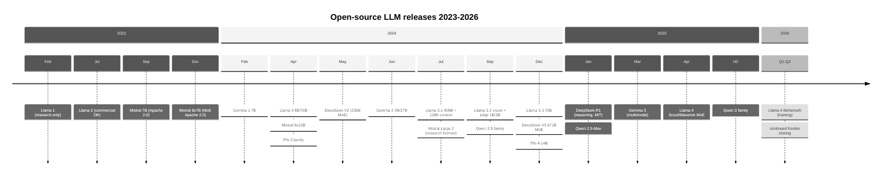
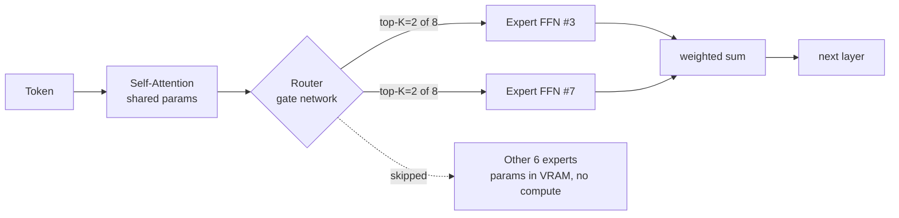
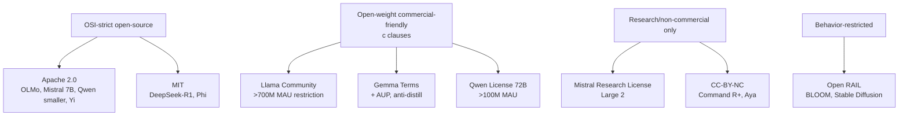
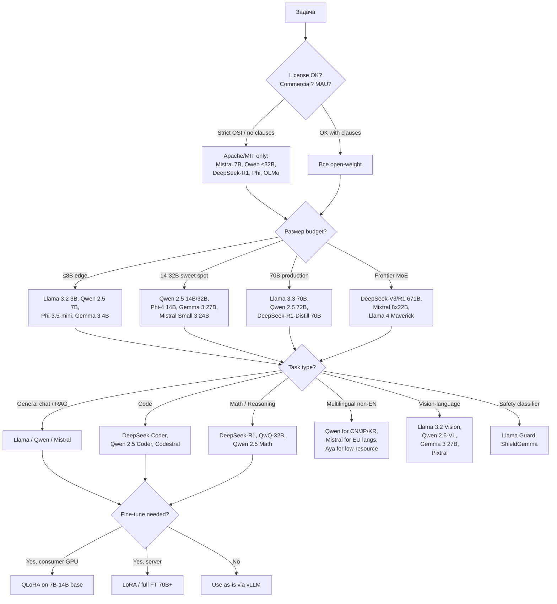

# Вопросы на собеседовании: `Open-Source LLM Ecosystem 2025-2026`

С 2023 года индустрия LLM раскололась на два лагеря: **закрытые frontier-модели** (GPT-4o, Claude, Gemini) и **open-weight ecosystem** — Llama, Mistral, Qwen, DeepSeek, Gemma, Phi. К 2026 разрыв в качестве на популярных бенчмарках почти стёрся: `DeepSeek-V3` соревнуется с `GPT-4o`, `Llama 3.3 70B` догоняет `405B`, а `Qwen 2.5` стал стандартом для self-host в Азии.

На интервью спрашивают: чем `open-source` отличается от `open-weight`, что такое `MoE` и почему `total params ≠ active params`, как читать `Llama Community License`, когда self-host дешевле API, и какие подводные камни у дообучения этих моделей.

## Полезные ссылки

### Официальная документация и авторитетные источники

- [Llama 3 Paper (Meta)](https://ai.meta.com/research/publications/the-llama-3-herd-of-models/) — 92-страничный технический отчёт
- [Mistral AI Models Documentation](https://docs.mistral.ai/getting-started/models/) — официальные карточки
- [DeepSeek-V3 Paper (arXiv)](https://arxiv.org/abs/2412.19437) — 671B MoE, $5.5M training claim
- [DeepSeek-R1 Paper](https://arxiv.org/abs/2501.12948) — reasoning через GRPO
- [Qwen 2.5 Technical Report](https://arxiv.org/abs/2412.15115) — Alibaba flagship family
- [Gemma 3 Technical Report](https://ai.google.dev/gemma) — Google open weights
- [Phi-4 Technical Report (Microsoft)](https://arxiv.org/abs/2412.08905) — focus на quality data
- [HuggingFace Open LLM Leaderboard](https://huggingface.co/spaces/HuggingFaceH4/open_llm_leaderboard) — standard benchmark hub
- [LMSYS Chatbot Arena](https://chat.lmsys.org/) — human preference ranking
- [Llama 3 Community License (текст)](https://www.llama.com/llama3/license/) — 700M DAU clause

## Содержание

- [Полезные ссылки](#полезные-ссылки)
- [See also](#see-also)

**Базовые понятия**

- [Q1. В чём разница между `open-source`, `open-weight` и `open-source-friendly` моделью?](#q1-в-чём-разница-между-open-source-open-weight-и-open-source-friendly-моделью)
- [Q2. Почему `Llama` и `Gemma` называют open-weight, а не open-source?](#q2-почему-llama-и-gemma-называют-open-weight-а-не-open-source)
- [Q3. Что такое `model card` и почему он обязателен на HuggingFace? `!`](#q3-что-такое-model-card-и-почему-он-обязателен-на-huggingface-)

**Llama family (Meta)**

- [Q4. Какие версии `Llama` существуют и чем они отличаются по архитектуре и лицензии? `!`](#q4-какие-версии-llama-существуют-и-чем-они-отличаются-по-архитектуре-и-лицензии-)
- [Q5. Что особенного в `Llama 3.3 70B` vs `Llama 3.1 405B`?](#q5-что-особенного-в-llama-33-70b-vs-llama-31-405b)
- [Q6. Что изменилось в `Llama 4` (Scout, Maverick, Behemoth)? `!`](#q6-что-изменилось-в-llama-4-scout-maverick-behemoth-)
- [Q7. Что означает clause «700M monthly active users» в Llama Community License?](#q7-что-означает-clause-700m-monthly-active-users-в-llama-community-license)

**Mistral / Mixtral**

- [Q8. Чем `Mistral 7B` отличался от `Llama 2 7B` на момент выхода?](#q8-чем-mistral-7b-отличался-от-llama-2-7b-на-момент-выхода)
- [Q9. Как устроен `Mixtral 8x7B` — почему это не 56B параметров? `!`](#q9-как-устроен-mixtral-8x7b--почему-это-не-56b-параметров-)
- [Q10. Какие модели Mistral остались Apache 2.0, а какие ушли под коммерческую лицензию?](#q10-какие-модели-mistral-остались-apache-20-а-какие-ушли-под-коммерческую-лицензию)

**Qwen family (Alibaba)**

- [Q11. Какие размеры и варианты есть в семействе `Qwen 2.5`? `!`](#q11-какие-размеры-и-варианты-есть-в-семействе-qwen-25-)
- [Q12. Что такое `QwQ-32B` и как он связан с reasoning?](#q12-что-такое-qwq-32b-и-как-он-связан-с-reasoning)
- [Q13. В чём лицензионная особенность `Qwen 72B`?](#q13-в-чём-лицензионная-особенность-qwen-72b)

**DeepSeek family**

- [Q14. Что такое `DeepSeek-V3` и почему его training cost ($5.5M) шокировал индустрию? `!`](#q14-что-такое-deepseek-v3-и-почему-его-training-cost-55m-шокировал-индустрию-)
- [Q15. Чем `DeepSeek-R1` отличается от `DeepSeek-V3`?](#q15-чем-deepseek-r1-отличается-от-deepseek-v3)
- [Q16. Что такое `DeepSeek-R1-Distill` и почему дистиллированный 70B доступнее R1?](#q16-что-такое-deepseek-r1-distill-и-почему-дистиллированный-70b-доступнее-r1)

**Gemma / Phi**

- [Q17. Что входит в семейство `Gemma 3` от Google? `!`](#q17-что-входит-в-семейство-gemma-3-от-google-)
- [Q18. Что такое `PaliGemma`, `CodeGemma`, `ShieldGemma`?](#q18-что-такое-paligemma-codegemma-shieldgemma)
- [Q19. Чем отличается `Phi-4` от `Phi-3.5-MoE`?](#q19-чем-отличается-phi-4-от-phi-35-moe)

**Другие open-weight модели**

- [Q20. Что такое `OLMo` и почему его называют «fully open»? `!`](#q20-что-такое-olmo-и-почему-его-называют-fully-open-)
- [Q21. Какие ещё open-weight семейства стоит знать (Yi, DBRX, Command R+, Granite)?](#q21-какие-ещё-open-weight-семейства-стоит-знать-yi-dbrx-command-r-granite)

**MoE economics**

- [Q22. Почему в MoE-моделях `total params` важен для VRAM, а `active params` — для compute? `!`](#q22-почему-в-moe-моделях-total-params-важен-для-vram-а-active-params--для-compute-)
- [Q23. Что такое `routing overhead` в MoE и почему MoE не всегда дешевле dense?](#q23-что-такое-routing-overhead-в-moe-и-почему-moe-не-всегда-дешевле-dense)

**Self-host vs API trade-offs**

- [Q24. Когда self-host open-source выгоднее API? Когда — наоборот? `!`](#q24-когда-self-host-open-source-выгоднее-api-когда--наоборот-)
- [Q25. Какой production-стек для self-host open-source LLM на vLLM/TensorRT-LLM?](#q25-какой-production-стек-для-self-host-open-source-llm-на-vllmtensorrt-llm)
- [Q26. Что такое `GGUF`, `AWQ`, `GPTQ` и почему их выкладывает community, а не авторы?](#q26-что-такое-gguf-awq-gptq-и-почему-их-выкладывает-community-а-не-авторы)

**Licensing deep dive**

- [Q27. Сравни `Apache 2.0`, `MIT`, `Llama Community`, `Gemma Terms`, `Mistral Research License`. `!`](#q27-сравни-apache-20-mit-llama-community-gemma-terms-mistral-research-license-)
- [Q28. Что такое `Open RAIL License` и где применяется?](#q28-что-такое-open-rail-license-и-где-применяется)
- [Q29. Какие риски security при загрузке моделей с HuggingFace? `!`](#q29-какие-риски-security-при-загрузке-моделей-с-huggingface-)

**Fine-tuning, benchmarks, outlook**

- [Q30. Какие open-source модели реально fine-tune-нуть на consumer GPU (4090 24GB)?](#q30-какие-open-source-модели-реально-fine-tune-нуть-на-consumer-gpu-4090-24gb)
- [Q31. Какие подводные камни при оценке open-source моделей по бенчмаркам?](#q31-какие-подводные-камни-при-оценке-open-source-моделей-по-бенчмаркам)
- [Q32. Decision tree: как выбрать open-source модель под задачу? `!`](#q32-decision-tree-как-выбрать-open-source-модель-под-задачу-)
- [Q33. Какие code-specific open-source модели есть и какая под что?](#q33-какие-code-specific-open-source-модели-есть-и-какая-под-что)
- [Q34. Outlook 2026: где open-source догоняет frontier, а где отстаёт?](#q34-outlook-2026-где-open-source-догоняет-frontier-а-где-отстаёт)

## Timeline open-source LLM releases 2023-2026



---

## Q1. В чём разница между `open-source`, `open-weight` и `open-source-friendly` моделью?

**Open-source LLM** = модель, у которой открыто **всё**: веса, код обучения, данные, training recipe. Под Apache 2.0 / MIT. Пример: `OLMo`, `BLOOM`. Можно полностью воспроизвести.

**Open-weight LLM** = открыты только **веса** и (обычно) inference-код. Данные, training-код, recipe — закрыты или частично описаны в paper. Веса можно скачать, fine-tune-нуть, развернуть. Примеры: `Llama 3`, `Mistral`, `Qwen`, `Gemma`, `DeepSeek`. Это **большинство** того, что в индустрии называют «open-source», но строго это open-weight.

**Open-source-friendly** = closed model с liberal API (open SDK, без vendor lock-in на формат), но веса недоступны. Пример: некоторые closed models с детальной документацией. К open-source это **не относится**, термин маркетинговый.

```text
                    весА    КОД ОБУЧЕНИЯ   ДАННЫЕ   recipe
Open-source         OPEN    OPEN           OPEN     OPEN     OLMo, BLOOM
Open-weight         OPEN    closed         closed   partial  Llama, Mistral
Open-source-friendly closed closed         closed   doc'd    Anthropic API
```

Практический смысл: c **open-weight** можно self-host, fine-tune, проверить модель forensically. С **open-source** можно ещё и воспроизвести pre-training (нужен compute на $1M-$60M).

## Q2. Почему `Llama` и `Gemma` называют open-weight, а не open-source?

1. **Веса доступны под лицензией**, но это не OSI-approved open-source лицензия.
2. **Training данные закрыты**: Meta опубликовала состав корпуса для Llama 3 только в общих терминах («15T tokens, web crawl + code + math»), без датасета.
3. **Training код частично закрыт**: высокоуровневые описания в paper, но не готовый repo для воспроизведения.
4. **Лицензия ограничивает использование**: для Llama — clause про 700M DAU и acceptable use policy; для Gemma — `Gemma Terms of Use` запрещают ряд use cases.

OSI (Open Source Initiative) в 2024 опубликовал `OSAID` (Open Source AI Definition), под которое `Llama` и `Gemma` **не подпадают**, а `OLMo` подпадает. Поэтому корректный термин — **open-weight**. На интервью важно различать: «open-source-like» допустимо в неформальной речи, но в legal / compliance discussion — нет.

## Q3. Что такое `model card` и почему он обязателен на HuggingFace? `!`

`Model card` — структурированное описание модели в `README.md` репозитория HuggingFace. Включает: intended use, training data summary, evaluation results, limitations, license, citation. Введён paper «Model Cards for Model Reporting» (Mitchell et al., 2018), стал индустриальным стандартом.

Зачем обязательно:
- **License clarity** — без явной лицензии модель нельзя законно использовать в продакшене.
- **Reproducibility** — пользователь должен знать, на чём обучали.
- **Bias / safety disclosure** — известные failure modes.
- **Compliance** (EU AI Act, NIST AI RMF) — требуют документацию.

HuggingFace с 2024 в Spaces и enterprise tiers **блокирует** загрузку моделей без model card. На интервью спрашивают про model card в контексте AI governance и procurement (см. `ai-compliance-governance-interview.md`).

Пример минимального model card:

```markdown
---
license: apache-2.0
language: en
tags: [llama, instruct]
base_model: meta-llama/Llama-3.1-8B
---
# Model name
## Intended use
Chat assistant for general-purpose Q&A...
## Training data
Fine-tuned on 50k samples of OASST...
## Evaluation
MMLU: 65.2 | HumanEval: 42.1
## Limitations
- Hallucinates on factual questions.
- English-primary, weak on Russian.
```

## Q4. Какие версии `Llama` существуют и чем они отличаются по архитектуре и лицензии? `!`

| Версия | Дата | Размеры | Context | Лицензия | Особенности |
|---|---|---|---|---|---|
| `Llama 1` | Feb 2023 | 7B / 13B / 33B / 65B | 2K | Research only | Утечка на 4chan стартовала ecosystem |
| `Llama 2` | Jul 2023 | 7B / 13B / 70B | 4K | Llama 2 Community (commercial OK >700M DAU restriction) | RLHF, chat variant |
| `Code Llama` | Aug 2023 | 7B/13B/34B/70B | 16K-100K | Llama 2 license | На основе Llama 2 + code |
| `Llama 3` | Apr 2024 | 8B / 70B | 8K | Llama 3 Community License | 15T tokens training, GQA |
| `Llama 3.1` | Jul 2024 | 8B / 70B / 405B | 128K | Llama 3.1 Community | Long-context, multilingual |
| `Llama 3.2` | Sep 2024 | 1B / 3B / 11B / 90B | 128K | Llama 3.2 (vision EU-restricted) | Multimodal (11B/90B) + edge (1B/3B) |
| `Llama 3.3` | Dec 2024 | 70B (text only) | 128K | Llama 3.3 Community | По качеству ≈ 3.1 405B |
| `Llama 4` | Apr 2025 | Scout 17Bx16 MoE / Maverick 17Bx128 MoE / Behemoth (training) | 10M+ | Llama 4 Community | Sparse MoE архитектура |

Архитектурно: все Llama 2/3/4 — decoder-only Transformer, `RoPE` positional, `RMSNorm`, `SwiGLU`. Llama 3 ввёл `Grouped Query Attention` (GQA) для всех размеров (раньше только 70B). Llama 4 — первый Llama на MoE.

## Q5. Что особенного в `Llama 3.3 70B` vs `Llama 3.1 405B`?

`Llama 3.3 70B` (Dec 2024) — instruct-only release, **те же 70B параметров** что Llama 3.1 70B, но **качество ближе к 405B** на reasoning / math бенчмарках. Достигнуто через:

- Лучший `post-training` (improved RLHF / DPO recipe).
- Больше high-quality SFT-данных.
- Tool use и multilingual вышли заметно сильнее.

Практический вывод: **70B `densest` сейчас покрывает большинство production use cases**, 405B нужен только когда критична last-mile точность на сложных задачах. Inference 70B reasonable на 2× H100 в `fp8`, 405B требует 8× H100 даже в `fp8`. Стоимость inference 405B примерно 5-6× выше при не радикально лучшем качестве — поэтому 3.3 70B стал популярным defacto-выбором.

```text
                     MMLU  HumanEval  GPQA  Cost/1M tokens (self-host estimate)
Llama 3.1 70B        82.0  80.5       46.7  ~$0.30
Llama 3.3 70B        86.0  88.4       50.5  ~$0.30
Llama 3.1 405B       88.6  89.0       50.7  ~$1.50-2.00
```

## Q6. Что изменилось в `Llama 4` (Scout, Maverick, Behemoth)? `!`

`Llama 4` (April 2025) — первое поколение Meta на **sparse MoE** (Mixture of Experts) с native multimodality (text + image).

| Модель | Архитектура | Active params | Total params | Context | Use case |
|---|---|---|---|---|---|
| `Llama 4 Scout` | 16 experts × 17B | 17B | 109B | 10M tokens (заявленный) | Single H100, long-context |
| `Llama 4 Maverick` | 128 experts × 17B | 17B | 400B | 1M+ | Production multi-GPU |
| `Llama 4 Behemoth` | ~16 experts × 288B | 288B | ~2T | — | Training (frontier) |

Ключевые изменения от Llama 3:
- **MoE везде**: dense Llama закончился. Routing на token-level через learned gate.
- **Native multimodal**: text + image в одной модели, early fusion encoder.
- **Огромный context**: Scout заявлен на 10M токенов (через `interleaved RoPE` + специальное pre-training на long docs).
- **Active = 17B**: при total 109B-400B inference compute как у 17B dense, но `VRAM` нужен для всех весов.

Лицензия — Llama 4 Community License (тот же 700M DAU clause + дополнительные ограничения на EU из-за Digital Markets Act).

## Q7. Что означает clause «700M monthly active users» в Llama Community License?

Llama Community License содержит **commercial-use OK by default**, но с одним ограничением: если ваше приложение или продукт прямо или через аффилиатов имеет **более 700 миллионов monthly active users** (DAU/MAU зависит от версии лицензии — для Llama 3 это **MAU на дату релиза модели**), то для коммерческого использования Llama **требуется отдельная лицензия от Meta**.

Практический смысл:
- 700M+ MAU — это уровень **Apple, Google, Microsoft, Amazon, ByteDance, Tencent**. Прямые конкуренты Meta.
- Для 99.99% компаний clause не релевантен.
- Это «poison pill»: не даёт `BigTech` бесплатно собирать AI-продукты на работе Meta.

Дополнительно у Llama license есть `Acceptable Use Policy`: запрещены military use, CSAM, illegal violence, surveillance без legal basis, etc. Это **не open-source** по OSI, потому что use restrictions нарушают freedom-of-use principle.

## Q8. Чем `Mistral 7B` отличался от `Llama 2 7B` на момент выхода?

`Mistral 7B` (Sept 2023) обогнал `Llama 2 13B` на большинстве бенчмарков, будучи в 2× меньше. Ключевые отличия:

| Аспект | Mistral 7B | Llama 2 7B |
|---|---|---|
| Attention | `Sliding Window Attention` (4K window) + `GQA` | Full attention + MHA |
| Лицензия | Apache 2.0 (полностью permissive) | Llama 2 Community (с 700M clause) |
| Context | 8K (с SWA расширяется) | 4K |
| Tokenizer | Custom BPE | Llama tokenizer |
| Training data | Не раскрыто | 2T tokens |

`Sliding Window Attention` ограничивает attention локальным окном (4096 токенов), снижая память и вычисления до `O(n × w)` вместо `O(n²)`. Для long-context это economical приближение.

`GQA` (Grouped Query Attention) — несколько query-голов делят одну key/value пару, уменьшая KV-cache. Это `Llama 2` имел только в 70B варианте; Mistral сделал во всех.

Apache 2.0 у Mistral 7B стал **критичным фактором adoption**: можно использовать commercially без оговорок, fork-нуть, продавать, embed в продукт. Это превратило Mistral 7B в стандартный baseline для community fine-tunes.

## Q9. Как устроен `Mixtral 8x7B` — почему это не 56B параметров? `!`

`Mixtral 8x7B` (Dec 2023) — sparse MoE, **47B total / 12.9B active**. Название «8x7B» — маркетинговое, не математическое.

Архитектура: каждый Transformer-блок имеет 8 параллельных `FFN` (feed-forward) экспертов вместо одного. На каждый токен router выбирает top-2 эксперта (`top-k=2`), и их выходы взвешенно суммируются.

```text
Token → Attention → Router (8 experts) → top-2 → FFN_3 + FFN_7 → output
                                                  ↑ выбор зависит от токена
```

Почему 47B, а не 56B:
- `Attention` слой — общий (не реплицируется на 8 экспертов).
- Только **FFN-веса** реплицируются (≈80% параметров блока).
- Итого 8× FFN + 1× attention + embeddings = ~47B, не 56B.

Почему 12.9B активны:
- На каждый токен — только 2 из 8 экспертов (`top-2`).
- 2/8 = 25% от FFN, плюс полный attention.
- Compute на токен ≈ 12.9B dense эквивалент.

Следствие: `Mixtral 8x7B` по качеству конкурирует с `Llama 2 70B`, но **inference в 4-6× дешевле** (compute как 13B). VRAM при этом нужен под все 47B (≈90GB в fp16, ~24GB в 4-bit GGUF).

## Q10. Какие модели Mistral остались Apache 2.0, а какие ушли под коммерческую лицензию?

С 2024 Mistral разделил линейку на **open** и **commercial**:

| Модель | Лицензия | Назначение |
|---|---|---|
| `Mistral 7B v0.1/v0.2/v0.3` | Apache 2.0 | Open baseline |
| `Mixtral 8x7B` | Apache 2.0 | MoE open |
| `Mixtral 8x22B` (141B/39B active) | Apache 2.0 | Bigger MoE open |
| `Mistral 7B Instruct` | Apache 2.0 | Chat |
| `Mistral NeMo 12B` (с NVIDIA) | Apache 2.0 | Multilingual |
| `Mistral Small 3` (2025) | Apache 2.0 | 24B dense, low-latency |
| `Codestral` | Mistral Non-Production License (MNPL) | Code, research/internal only |
| `Mistral Large 2` | Mistral Research License | Research/non-commercial |
| `Pixtral 12B` | Apache 2.0 | Multimodal vision-text |
| `Pixtral Large` | Mistral Research License | Frontier vision |

Бизнес-логика Mistral: **small/medium** под Apache 2.0 → community adoption. **Frontier (Large)** под research license → монетизация через API/enterprise.

`Mistral Research License`: можно использовать для research, internal evaluation, academic publication. **Нельзя** использовать в коммерческом продукте или предоставлять как сервис. Для commercial — нужна enterprise-лицензия от Mistral.

## Q11. Какие размеры и варианты есть в семействе `Qwen 2.5`? `!`

`Qwen 2.5` (Sept 2024) от Alibaba — наиболее **полная по размерному ряду** open-weight семья. Все варианты с 128K context (через `YARN` scaling).

| Размер | Base license | Назначение |
|---|---|---|
| `Qwen 2.5 0.5B` | Apache 2.0 | Edge, mobile |
| `Qwen 2.5 1.5B` | Apache 2.0 | Edge |
| `Qwen 2.5 3B` | Qwen Research License | Edge, embedded |
| `Qwen 2.5 7B` | Apache 2.0 | Mainstream |
| `Qwen 2.5 14B` | Apache 2.0 | Mid-tier |
| `Qwen 2.5 32B` | Apache 2.0 | High quality |
| `Qwen 2.5 72B` | Qwen License (не Apache) | Flagship dense |

Специализированные варианты (все на base Qwen 2.5):
- `Qwen 2.5 Math` (1.5B/7B/72B) — math reasoning.
- `Qwen 2.5 Coder` (0.5B → 32B) — code completion / chat, конкурент `DeepSeek-Coder`.
- `Qwen 2.5 VL` — vision-language.
- `QwQ-32B` — reasoning model (chain-of-thought trained via RL).
- `Qwen 2.5-Max` (Jan 2025) — frontier MoE через API (веса не релизнуты).

`Qwen 3` (2025) — следующее поколение с native reasoning modes (`thinking` / `non-thinking` switchable per request).

Особенность Qwen: **отлично работает с китайским и азиатскими языками**, лучше Llama для CN/JP/KR контента. Слабее на восточноевропейских языках.

## Q12. Что такое `QwQ-32B` и как он связан с reasoning?

`QwQ-32B` (Qwen with Questions, нояб 2024) — **reasoning model** от Alibaba, конкурент `o1-preview` и `DeepSeek-R1`. 32B dense параметров, base — `Qwen 2.5-32B`, дообученная через RL с reward-сигналом за корректные chain-of-thought.

Особенности:
- Генерирует длинные `<thinking>` блоки перед финальным ответом (до 8-16K токенов CoT).
- На `MATH` достигает 90.6%, на `GPQA Diamond` — 65.2% (близко к o1-mini).
- Лицензия — Apache 2.0 (в отличие от Qwen 72B).
- Inference дорогой: длинные CoT → 5-10× больше токенов, чем dense ответы.

`QwQ-32B-Preview` — первый public open reasoning model уровня o1. После него вышел `DeepSeek-R1` (671B MoE), который обошёл QwQ на большинстве задач, но `QwQ-32B` всё ещё актуален, если нужна reasoning-модель **умещающаяся на один H100 80GB**.

Связь с reasoning paradigm: подтверждение, что `test-time compute scaling` (см. `reasoning-models-interview.md`) **воспроизводим в open-source** без секретного OpenAI know-how — нужны RL и хороший reward.

## Q13. В чём лицензионная особенность `Qwen 72B`?

`Qwen 72B` (как 1.5 и 2.5 версия 72B) выпущен **не под Apache 2.0**, а под **Qwen License** (раньше Tongyi Qianwen License). Ключевое:

- **Commercial use OK**, но если у вашего продукта **>100 миллионов MAU**, требуется отдельная лицензия от Alibaba.
- **Не запрещены** конкуренция с Alibaba Cloud или fine-tunes.
- **Запрещено** использовать output Qwen для тренировки других LLM (anti-distillation clause, формально).
- Есть `acceptable use policy` (no military, no illegal, etc).

Меньшие варианты (0.5B, 1.5B, 7B, 14B, 32B) под **Apache 2.0**. Идея та же что у Meta: монетизация только через clauses, защищающие от прямых конкурентов масштаба BigTech.

## Q14. Что такое `DeepSeek-V3` и почему его training cost ($5.5M) шокировал индустрию? `!`

`DeepSeek-V3` (Dec 2024) — 671B MoE (37B active), MIT-like license (`DeepSeek License v1`, по сути MIT). Paper заявляет training cost **$5.576M** при условиях:

- 14.8T tokens pretraining.
- 2.788M H800-часов (H800 — китайская версия H100 с урезанным NVLink из-за export controls).
- $2/час за H800 → ~$5.5M.

Почему это shocked индустрию:
- `Llama 3.1 405B` стоил ~$60M по разным оценкам.
- `GPT-4` — оценка $100M+.
- DeepSeek сделал модель **на уровне GPT-4o** за **в 10× меньше**.

Что они сделали:
- **MLA** (Multi-head Latent Attention) — низкоранговая компрессия KV-cache.
- **DeepSeekMoE** с **256 routed experts + 1 shared** на блок, top-8 routing.
- **Auxiliary-loss-free load balancing** — без штрафа за дисбаланс экспертов.
- **FP8 training** на большинстве операций (сэкономили compute).
- **Multi-Token Prediction** (`MTP`) — предсказание сразу нескольких следующих токенов как auxiliary objective.
- Highly engineered training pipeline для H800 (compensation за слабый interconnect).

Caveat: $5.5M — это **только final training run**, без учёта research, неудачных экспериментов, salaries, infra. Реальный sunk cost команды DeepSeek кратно выше, но **incremental cost final model train** действительно скромный.

## Q15. Чем `DeepSeek-R1` отличается от `DeepSeek-V3`?

`DeepSeek-R1` (Jan 2025) — **reasoning version** на той же базе что V3 (671B MoE / 37B active), но дообученная через `GRPO` (Group Relative Policy Optimization).

```text
DeepSeek-V3-Base (pretraining)
       ├── SFT / DPO → DeepSeek-V3 (chat)
       └── RL via GRPO → DeepSeek-R1-Zero → SFT → RL → DeepSeek-R1
```

Ключевые различия:

| Аспект | DeepSeek-V3 | DeepSeek-R1 |
|---|---|---|
| Назначение | General chat | Reasoning (math, code, science) |
| CoT | Короткий, по запросу | Длинный по умолчанию (через `<think>`) |
| Лицензия | DeepSeek License (MIT-like) | MIT (явно) |
| Output style | Direct answer | Chain-of-thought → answer |
| Стоимость API | ~$0.27/1M input | ~$0.55/1M input + дорогие thinking-токены |
| GPQA Diamond | 59.1% | 71.5% |
| AIME 2024 | 39.2% | 79.8% |

`DeepSeek-R1-Zero` — экспериментальная версия, обученная **только через RL без SFT**. Показала emergent CoT, но страдала readability (mixed languages, скачки в логике). `R1` уже с SFT-«полировкой».

Главная вклад в open-source: **первая open-weight reasoning model уровня o1-preview**, под MIT, реплицируемая. После R1 ВСЕ серьёзные labs выкатили open reasoning варианты.

## Q16. Что такое `DeepSeek-R1-Distill` и почему дистиллированный 70B доступнее R1?

`DeepSeek-R1` оригинал = 671B MoE, требует ~700GB VRAM (8× H100 80GB как минимум), нагрузка под bf16. Это **не доступно** для большинства команд.

Решение — **distillation**: команда DeepSeek сгенерировала ~800k длинных CoT-ответов от R1 на разных задачах, и **дообучила** на этом маленькие base-модели (Llama, Qwen) методом SFT:

| Distilled model | Base | Размер | Сравнимо с |
|---|---|---|---|
| `DeepSeek-R1-Distill-Qwen-1.5B` | Qwen 2.5 1.5B | 1.5B dense | — |
| `DeepSeek-R1-Distill-Qwen-7B` | Qwen 2.5 Math 7B | 7B dense | o1-mini на math |
| `DeepSeek-R1-Distill-Llama-8B` | Llama 3.1 8B | 8B dense | — |
| `DeepSeek-R1-Distill-Qwen-14B` | Qwen 2.5 14B | 14B dense | — |
| `DeepSeek-R1-Distill-Qwen-32B` | Qwen 2.5 32B | 32B dense | o1-mini |
| `DeepSeek-R1-Distill-Llama-70B` | Llama 3.3 70B | 70B dense | ≈ GPT-4o на ряде задач |

Лицензия дистиллятов **наследуется от base**: Qwen-distill — Apache 2.0, Llama-distill — Llama Community License. Поэтому Llama-70B distill для коммерческого продукта подчиняется Llama clause (700M MAU). 

Distilled 70B fits на 2× A100 80GB или 1× H100 в `fp8`, что **на порядок** доступнее оригинала R1. Quality trade-off: distill теряет ~10-20% на сложных задачах vs full R1, но добавляет CoT-возможность к существующей base-модели.

## Q17. Что входит в семейство `Gemma 3` от Google? `!`

`Gemma 3` (March 2025) — третья итерация Google open-weight семьи. Лицензия — `Gemma Terms of Use` (commercial OK, но с restrictions).

| Модель | Параметры | Multimodal | Context | Примечание |
|---|---|---|---|---|
| `Gemma 3 1B` | 1B | Text only | 32K | Edge / mobile |
| `Gemma 3 4B` | 4B | Vision + text | 128K | Mainstream |
| `Gemma 3 12B` | 12B | Vision + text | 128K | Mid-tier |
| `Gemma 3 27B` | 27B | Vision + text | 128K | Flagship |

Особенности:
- Native multimodal от 4B и выше (vision encoder + text decoder).
- 128K context во всех размерах кроме 1B.
- `SigLIP` vision encoder, `Gemma` text architecture (адаптация Gemini).
- 140+ языков из коробки.
- Pre-trained и instruction-tuned варианты.

Gemma 2 (June 2024, 9B / 27B) — text-only, был сильнее Llama 3 8B / Qwen 2 7B на тот момент. Gemma 3 — модернизация с multimodality и большей контекстностью.

`Gemma Terms of Use`: коммерция OK, но запрещено использовать output для тренировки других LLM (anti-distillation), запрещены ряд use cases (deception, surveillance, malware и т.д.). Это **более ограничительная** лицензия, чем Apache 2.0.

## Q18. Что такое `PaliGemma`, `CodeGemma`, `ShieldGemma`?

Сателлиты Gemma под специфические задачи, все под `Gemma Terms of Use`:

- **`PaliGemma`** (2024, обновлён в PaliGemma 2 в 2025) — vision-language model, base SigLIP + Gemma. Размеры: 3B / 10B / 28B. Используется для image captioning, OCR, VQA. До Gemma 3 это был отдельный path для vision; теперь Gemma 3 native multimodal сделал PaliGemma более нишевым.
- **`CodeGemma`** (2024) — code-specialized fine-tune. Размеры 2B / 7B. Заточен под code completion и infilling (`FIM` — fill in the middle).
- **`RecurrentGemma`** (2024) — экспериментальная архитектура на базе `Griffin` (linear recurrence вместо attention). Лучше на long-context при low memory, но проигрывает обычной Gemma на качестве.
- **`ShieldGemma`** (2024) — **safety classifier** на базе Gemma. Принимает prompt+response, классифицирует на категории harm (hate, harassment, sexual, dangerous). Используется как guardrail для других моделей. Аналог `Llama Guard`. Размеры 2B / 9B / 27B.
- **`DataGemma`** — fine-tune для interfacing с Google Data Commons.

ShieldGemma — особо актуален в production: ставится как pre/post filter перед main LLM, см. `ai-safety-guardrails-interview.md`.

## Q19. Чем отличается `Phi-4` от `Phi-3.5-MoE`?

Microsoft Phi family — серия small models с фокусом на **качество данных**, а не размер. Все под MIT License.

| Модель | Размер | Архитектура | Дата | Сильные стороны |
|---|---|---|---|---|
| `Phi-3 mini` | 3.8B | Dense | Apr 2024 | Edge, on-device |
| `Phi-3 small` | 7B | Dense | 2024 | Mainstream |
| `Phi-3 medium` | 14B | Dense | 2024 | Mid-tier |
| `Phi-3.5-mini` | 3.8B | Dense | Aug 2024 | Updated training |
| `Phi-3.5-MoE` | 42B / 6.6B active | MoE 16×3.8B | Aug 2024 | High quality / low compute |
| `Phi-3.5 vision` | 4.2B | Multimodal | Aug 2024 | Vision-text |
| `Phi-4` | 14B | Dense | Dec 2024 | Reasoning-focused, MIT |
| `Phi-4-mini` | 3.8B | Dense | 2025 | Compact |
| `Phi-4 multimodal` | ~5.6B | Multimodal | 2025 | Audio + vision + text |

Различия `Phi-4` (14B dense) vs `Phi-3.5-MoE` (42B/6.6B):
- `Phi-4` фокусирован на **reasoning quality** (math, science benchmarks).
- `Phi-3.5-MoE` фокусирован на **efficiency at scale**: total 42B даёт качество ~Mixtral 8x7B, compute как 6.6B.
- Phi-4 умещается на 1× H100 80GB в bf16; Phi-3.5-MoE требует ~85GB VRAM (для всех весов), compute дешевле.
- Phi-4 на `GPQA Diamond` — 56.1%, обходит даже Llama 3.1 70B (хотя в 5× меньше).

Философия Phi: **«textbook quality» synthetic data + filtered web** + хорошее reasoning supervision. Это альтернатива «больше параметров = лучше», доказательство что data quality важнее.

## Q20. Что такое `OLMo` и почему его называют «fully open»? `!`

`OLMo` (Open Language Model, Allen Institute for AI) — **единственная серия моделей**, которая реально соответствует строгому open-source определению (`OSAID`).

Что открыто:
1. **Weights** — все checkpoints в HuggingFace.
2. **Training code** — `OLMo` repo на GitHub с полным pipeline.
3. **Training data** — `Dolma` dataset (3T tokens) опубликован.
4. **Recipes** — конфигурации, гиперпараметры, learning rate schedules.
5. **Intermediate checkpoints** — каждые ~500 steps, для интерпретируемости.
6. **WandB logs** — full training telemetry.
7. **Evaluation suite** — `OLMES`, `Paloma`.
8. **License** — Apache 2.0 на всё.

Размеры: `OLMo 1B / 7B`, `OLMo 2 7B / 13B`, `OLMo 2 32B` (2025).

Use case:
- **Academia**: воспроизводимые исследования pretraining-динамики.
- **Compliance**: для регулируемых индустрий, требующих полный audit trail (EU AI Act `Article 53`).
- **Education**: первый и единственный LLM, который можно реально изучать end-to-end.

Качество ниже, чем у Llama / Qwen / DeepSeek (бюджет AI2 кратно меньше Meta), но это **principal trade-off**, а не bug. OLMo решает другую проблему — **transparency**.

Похожие проекты: `Pythia` (EleutherAI, 2023) — старее, меньше, в основном для interpretability research. `BLOOM` (BigScience, 2022, 176B) — fully open, но устарел.

## Q21. Какие ещё open-weight семейства стоит знать (Yi, DBRX, Command R+, Granite)?

| Семейство | От | Размеры | Лицензия | Особенность |
|---|---|---|---|---|
| `Yi` | 01.AI (Kai-Fu Lee) | 6B / 9B / 34B / Yi-1.5 / Yi-VL | Apache 2.0 | Сильные multilingual, был популярен в 2024 как 34B sweet spot |
| `DBRX` | Databricks | 132B / 36B active MoE | Databricks Open Model License | 16 experts × 11B, фокус на enterprise |
| `Command R+` | Cohere | 104B dense | CC-BY-NC-4.0 (non-commercial weights), commercial API | Заточен под RAG, tool use |
| `Command R 7B/35B` | Cohere | 7B / 35B | CC-BY-NC-4.0 | Smaller RAG-focused |
| `Granite` | IBM | 3B / 8B / 20B / 34B + MoE 1B/3B | Apache 2.0 | Enterprise-grade, code-focused |
| `Granite Vision` | IBM | 3.4B / 8B | Apache 2.0 | Document AI |
| `Aya` | Cohere for AI | 8B / 23B / 35B | CC-BY-NC-4.0 | 23+ языков, multilingual focus |
| `Falcon` | TII (UAE) | 7B / 40B / 180B / Falcon 3 | Apache 2.0 / TII Falcon LLM License | Был первым 180B open в 2023, сейчас уступил |
| `Snowflake Arctic` | Snowflake | 480B / 17B active MoE | Apache 2.0 | Enterprise SQL/code |
| `Reka` | Reka AI | Reka Flash, Core | Custom commercial | Multimodal, не fully open |
| `Nemotron` | NVIDIA | 70B (Llama 3.1 derivative) | NVIDIA Open Model License | Llama 3.1 70B + RLHF refresh от NVIDIA |

Из них в production чаще всего: `Yi-34B` (legacy), `DBRX` (Databricks-нативные стэки), `Granite` (IBM customers), `Command R+` (RAG-focused). `Falcon` сейчас в основном legacy — Qwen / Llama / Mistral вытеснили.

## Q22. Почему в MoE-моделях `total params` важен для VRAM, а `active params` — для compute? `!`

`MoE` (Mixture of Experts) разделяет FFN-слой на N экспертов, и router выбирает top-K на токен. Это даёт **разделение масштаба и compute**.

Пример: `DeepSeek-V3` — 671B total, 37B active.

**VRAM (память)**:
- Все 671B параметров **должны быть в памяти** во время inference, потому что для каждого токена router выбирает **разные** эксперты — нельзя выгрузить «неиспользуемых».
- В bf16: 671B × 2 байта = **~1.3 TB VRAM**.
- В fp8: ~700 GB.
- В 4-bit: ~340 GB.
- Это минимум для inference, плюс KV-cache, активации.
- → нужен серверный multi-GPU (8× H100 или больше).

**Compute (FLOPs)**:
- Forward pass на каждый токен использует только **active params** = 37B.
- FLOPs ≈ как у 37B dense модели.
- → **inference latency / cost ≈ 37B dense**, не 671B.

Следствие — экономика MoE:
| Метрика | Dense 70B | MoE 671B/37B active |
|---|---|---|
| VRAM | ~140 GB | ~1300 GB |
| FLOPs/token | 70B equiv | 37B equiv |
| Quality | Baseline | ≫ baseline |
| Throughput при достаточном VRAM | medium | high |

MoE окупается когда: (а) есть VRAM на total params; (б) хочется качество выше dense + дешёвый inference. Не окупается на consumer GPU (VRAM лимит).



## Q23. Что такое `routing overhead` в MoE и почему MoE не всегда дешевле dense?

`Routing overhead` — дополнительные затраты в MoE, не сводящиеся к FLOPs FFN:

1. **Gate network compute**: на каждый токен router считает softmax по N экспертам — это `O(d × N)` FLOPs. При N=256 (DeepSeek) это не пренебрежимо.
2. **All-to-all communication**: в распределённом inference (`expert parallelism`) токены маршрутизируются между GPU/узлами. На больших batch это становится bottleneck сильнее самих FFN.
3. **Load balancing**: если router посылает 90% токенов в один эксперт — этот GPU нагружен, остальные простаивают. Нужны auxiliary losses (или auxiliary-loss-free, как DeepSeek-V3) на этапе training, а на inference — capacity factor / token dropping.
4. **KV-cache size**: тот же что у dense эквивалента по active params.
5. **Memory bandwidth**: все эксперты должны быть в HBM; чтение их весов из global memory может стать bottleneck при низком arithmetic intensity.

Почему MoE может оказаться **не дешевле dense**:
- При **малых batch sizes** all-to-all dominate latency.
- При **single-user inference** routing overhead не амортизируется.
- На **consumer GPU** не помещается total params, приходится swapping → дико медленно.
- При **strict latency SLA**, dense с прогнозируемой latency предпочтительнее MoE с jitter.

Эмпирически: MoE хорош для **high-throughput batched inference** на server-grade GPU с быстрым interconnect (`NVLink`/`InfiniBand`). На edge / single GPU — dense часто проще и быстрее.

## Q24. Когда self-host open-source выгоднее API? Когда — наоборот? `!`

Self-host = развёртывание модели на собственной/арендованной инфраструктуре (vLLM + H100 / A100). API = call provider (OpenAI / Anthropic / DeepSeek / Together / Fireworks).

| Критерий | Self-host выгоднее | API выгоднее |
|---|---|---|
| **Volume** | >5-10M токенов/день стабильно | Низкий или скачкообразный |
| **Latency** | Нужен sub-100ms steady-state | OK с 200-1000ms |
| **Data privacy** | Sensitive (медицина, финансы, PII) | Public/internal data |
| **Customization** | Своя fine-tuned версия, custom prompts | Стандартные модели |
| **Compliance** | EU AI Act, on-prem mandate | Cloud-OK |
| **Quality bar** | Open-source модель достаточна | Нужен GPT-4o / Claude / o3 |
| **Team capacity** | Есть MLOps команда | Нет ML-инженеров |
| **Cost predictability** | Fixed monthly capacity | Pay-per-use OK |
| **Geographic** | Need local hosting (Russia, China) | Global API OK |

Грубая математика для `Llama 3.3 70B`:
- API через Together/Fireworks: ~$0.60/1M input, $0.60/1M output → $1.20/1M total tokens.
- Self-host на 1× H100 80GB ($2-3/час on-demand): throughput ~3000 tok/s = 10.8M tok/час.
- Cost: $2.5 / 10.8M = **$0.23/1M tokens**.
- Break-even: ~30% utilization = ~3.2M tok/час steady = ~77M tok/day.

Если у вас <77M tok/day стабильно, **API дешевле**. Если >77M или нужны другие критерии (privacy, latency) — self-host.

Особый случай — **DeepSeek API**: $0.07-0.27/1M input. **Дешевле self-host для большинства**, потому что DeepSeek subsidizes API из стратегических соображений (geopolitical positioning, market share). Минус — data leaves в Китай.

## Q25. Какой production-стек для self-host open-source LLM на vLLM/TensorRT-LLM?

Типичный production-стек self-host:

```text
┌─────────────────────────────────────────────────┐
│  Client (App / Agent / Pipeline)                │
└────────────────────┬────────────────────────────┘
                     │ OpenAI-compatible HTTP
                     ▼
┌─────────────────────────────────────────────────┐
│  API Gateway (Kong / Envoy)                     │
│   - Rate limit / quota                          │
│   - Auth (API key)                              │
│   - Multi-tenant routing                        │
└────────────────────┬────────────────────────────┘
                     │
                     ▼
┌─────────────────────────────────────────────────┐
│  Inference Serving Layer                        │
│   vLLM (PagedAttention) или                     │
│   TensorRT-LLM / SGLang / TGI                   │
│   - Continuous batching                         │
│   - KV cache management                         │
│   - Speculative decoding                        │
└────────────────────┬────────────────────────────┘
                     │ NCCL / TP / PP
                     ▼
┌─────────────────────────────────────────────────┐
│  GPU Cluster (H100 / A100 / MI300)              │
│   - Tensor parallelism                          │
│   - Optional pipeline parallelism               │
└────────────────────┬────────────────────────────┘
                     │
                     ▼
┌─────────────────────────────────────────────────┐
│  Storage: HuggingFace weights, quantized GGUF/AWQ│
│   - S3 / GCS / local NVMe                       │
│   - safetensors format (preferred)              │
└─────────────────────────────────────────────────┘

Cross-cutting:
   - Observability: Prometheus + Grafana + Langfuse / Arize
   - Orchestration: Kubernetes + KServe / BentoML / Ray Serve
   - CI/CD: model promotion via Argo Workflows
   - Safety: Llama Guard / ShieldGemma as pre/post filter
```

Ключевые компоненты:
- **`vLLM`** — самый популярный inference engine, PagedAttention, continuous batching, OpenAI-compatible API. Open-source.
- **`TensorRT-LLM`** — NVIDIA-only, выше throughput через kernel fusion и compiled engines, сложнее в эксплуатации.
- **`SGLang`** — конкурент vLLM с focus на structured generation, prefix caching.
- **`KServe`/`BentoML`** — оркестрация моделей в Kubernetes, A/B-тесты, canary.
- **`safetensors`** — формат HuggingFace замена `.bin/.pt` (нет pickle, secure load, faster mmap).

Связано с `model-serving-interview.md` и `inference-optimization-interview.md`.

## Q26. Что такое `GGUF`, `AWQ`, `GPTQ` и почему их выкладывает community, а не авторы?

Это форматы **post-training quantization** — уменьшение точности весов с fp16/bf16 до 4-bit / 8-bit для сокращения VRAM и ускорения inference.

| Формат | Используется в | Bit-widths | Назначение |
|---|---|---|---|
| `GGUF` | `llama.cpp`, `Ollama`, `LM Studio` | 2 / 3 / 4 / 5 / 6 / 8 bit + K-quants | CPU/edge inference, простая загрузка |
| `AWQ` | vLLM, TGI, HF Transformers | 4-bit (типично) | GPU inference, sweet spot quality/speed |
| `GPTQ` | vLLM, ExLlama, AutoGPTQ | 3-4 bit | GPU, более старый, чем AWQ |
| `EXL2` | ExLlamaV2 | variable per-layer | GPU, очень тонкая настройка |
| `bitsandbytes` (NF4/INT8) | HF Transformers | 4 / 8 bit | Быстрая on-the-fly quantization |
| `safetensors` (fp16/bf16) | Все | 16-bit | Базовый формат HF |

Почему community, а не авторы:
- **Meta / Google / Mistral / Qwen** официально релизят только fp16/bf16 safetensors на HF.
- Quantization — это **lossy compression**, требует калибровки на repr. dataset, и **результат зависит от целевого hardware** (CPU vs GPU, разные архитектуры).
- Community contributors (`TheBloke`, `bartowski`, `lmstudio-community`, `unsloth`) делают калибровку под популярные форматы и выкладывают на HF.
- Авторы избегают support burden: «эта 4-bit версия плохо работает» — community fork problem.

Quality trade-off:
- 8-bit: <1% quality loss vs fp16.
- 4-bit (AWQ / GPTQ-act-order): 1-3% loss.
- 3-bit и ниже: заметная деградация, особенно на reasoning.

Practical tip: **читайте README quant-репозитория** — там обычно perplexity test и subjective quality notes. Не все 4-bit одинаковы.

## Q27. Сравни `Apache 2.0`, `MIT`, `Llama Community`, `Gemma Terms`, `Mistral Research License`. `!`

| Лицензия | Тип | Commercial use | Modification | Distribution | Use restrictions | Anti-distillation |
|---|---|---|---|---|---|---|
| `Apache 2.0` | OSI-approved | OK | OK | OK | None | None |
| `MIT` | OSI-approved | OK | OK | OK | None | None |
| `Llama Community` (3 / 3.1 / 3.2 / 3.3 / 4) | Custom | OK кроме >700M MAU | OK | OK с notice | AUP | Нет (но output marking) |
| `Gemma Terms of Use` | Custom | OK | OK | OK | Gemma AUP | Yes (no train on output) |
| `Mistral Research License` | Custom | NO | OK для research | OK для research | Non-commercial only | N/A |
| `Qwen License` (72B) | Custom | OK кроме >100M MAU | OK | OK | AUP | Implicit |
| `DeepSeek License` | MIT-like | OK | OK | OK | Minimal AUP | None (V3); R1 — pure MIT |
| `Open RAIL` | Behavior-restricted | OK | OK | OK | Specific behaviors | Varies |
| `CC-BY-NC-4.0` | Creative Commons | NO | OK для NC | OK для NC | Non-commercial | Implicit |



Practical legal triage:
- **Самое безопасное для коммерции**: Apache 2.0 / MIT (Mistral 7B, OLMo, Qwen ≤32B, DeepSeek-R1, Phi).
- **OK с привычкой проверять**: Llama / Gemma — внимательно с use case, MAU, и output-disclosure.
- **Дисквалификация для production B2C**: Mistral Research License, CC-BY-NC.
- **Всегда читать AUP** (Acceptable Use Policy) — даже под Apache.

## Q28. Что такое `Open RAIL License` и где применяется?

`Open RAIL` (Responsible AI License, from BigScience / Hugging Face, 2022) — лицензия для AI artifacts, которая разрешает свободное использование, **но запрещает специфические behaviors**, перечисленные в `Attachment A`.

Структура:
- Permissive grant: использование, modification, distribution, commerce — OK.
- **Behavioral restrictions**: список запрещённых use cases (defamation, weapons, exploitation, medical misdiagnosis without supervision, etc.).
- Use-based vs source-restricted: restrictions follow the model, не только source.

Варианты:
- `OpenRAIL-M` — для models.
- `OpenRAIL-S` — для source code.
- `OpenRAIL-D` — for data.

Где применяется:
- `BLOOM` (BigScience, 176B, 2022) — первый крупный LLM под Open RAIL.
- `Stable Diffusion` v1, v2 (CreativeML Open RAIL-M).
- `IDEFICS` (HF multimodal).

Status в 2026: **не стал стандартом** для top-tier LLM. Meta, Google, Mistral, Qwen, DeepSeek предпочитают свои custom licenses либо чистый Apache 2.0/MIT. Open RAIL остался в нише generative image (Stable Diffusion ecosystem) и старых LLM (BLOOM).

OSI считает Open RAIL **не open-source**, потому что use restrictions нарушают freedom-of-use (как и Llama / Gemma).

## Q29. Какие риски security при загрузке моделей с HuggingFace? `!`

Скачивание model weights — это **загрузка untrusted кода**, если формат поддерживает execution. Основные риски:

1. **Pickle deserialization** (`.bin`, `.pt`):
   - PyTorch `torch.save` использует Python pickle.
   - Pickle позволяет **arbitrary code execution** при `load`.
   - Malicious model файл может запустить shell commands при `torch.load(...)`.
   - HF в 2023 ввели `pickle scanner` (`safetensors-friendly` badge), но не все модели мигрированы.
   - **Mitigation**: используйте `.safetensors` формат. HF Transformers по умолчанию предпочитает safetensors если оба есть.

2. **Malicious code в `trust_remote_code=True`**:
   - Модели с custom architecture требуют `trust_remote_code=True`.
   - Это выполняет `modeling_<arch>.py` из репозитория.
   - Может содержать malware, exfiltration, backdoors.
   - **Mitigation**: используйте только проверенных авторов (`meta-llama`, `mistralai`, `Qwen`, `google`, `microsoft`, `deepseek-ai`); audit код перед load; запускайте в isolated container.

3. **Backdoored models** (research level):
   - Веса могут быть отравлены: на специфическом trigger-промте модель ведёт себя malicious (sleeper agent).
   - Невозможно обнаружить без black-box testing.
   - **Mitigation**: red-team test, не доверяйте малоизвестным authors.

4. **Tokenizer code injection**:
   - `tokenizer.json` обычно safe, но `tokenizer_config.py` или custom tokenizer Python может содержать код.

5. **Supply-chain хайджаки**:
   - Атакующий захватывает HF account популярного автора, заливает trojanized weights.
   - **Mitigation**: pin specific commit / revision hash, проверяйте PGP подписи если есть.

Practical workflow:
- Только `safetensors`, не `.bin`.
- `trust_remote_code=False` по умолчанию, явно включать только для verified авторов.
- Sandbox-исполнение при экспериментах (Docker без network, без host mounts).
- Mirror weights в свой artifact registry с hash-pinning.

## Q30. Какие open-source модели реально fine-tune-нуть на consumer GPU (4090 24GB)?

`RTX 4090` 24GB VRAM позволяет fine-tune через **LoRA / QLoRA** следующих масштабов:

| Размер base | QLoRA (4-bit base) | LoRA (fp16 base) | Full fine-tune |
|---|---|---|---|
| 1B-3B | trivial | OK | OK (с gradient checkpointing) |
| 7B-8B | OK (комфортно) | OK (на грани, gradient checkpoint, batch=1-2) | NO |
| 13B-14B | OK с adjustments | tight | NO |
| 27B-34B | OK с offload | NO | NO |
| 70B | NO (нужно ≥48GB или 2× 4090) | NO | NO |

`QLoRA` (Quantized LoRA): base model в **4-bit** (через bitsandbytes NF4), trainable LoRA adapters в fp16 поверх. VRAM в 4× меньше чем full fp16 fine-tune.

Practical fine-tune candidates на 4090:
- `Llama 3.1 8B` (QLoRA, 4-bit) — comfortable.
- `Qwen 2.5 7B / 14B` (QLoRA).
- `Mistral 7B v0.3` (QLoRA / LoRA).
- `Gemma 2 9B` (QLoRA).
- `Phi-3 medium 14B` (QLoRA, tight).
- `Qwen 2.5 32B` (QLoRA с CPU offload, медленно).

Что **не** влезет: 70B, MoE total >40B, любые fp16 ≥ 20B.

Стек: `unsloth` (oxygen-efficient kernels) / `axolotl` / `LLaMA-Factory` поверх PyTorch. Training time для 7B QLoRA на 50k samples — 6-12 часов на 4090.

Связано с `fine-tuning-llm-interview.md` (LoRA/QLoRA глубоко).

## Q31. Какие подводные камни при оценке open-source моделей по бенчмаркам?

1. **Contamination** — test sets утекли в pretraining данные. Особенно типично для `MMLU`, `GSM8K`. Модель «знает ответы», не reasoning. У open-source это особо болезненно: data corpora публичны, и фильтрация неидеальная.

2. **Cherry-picking benchmarks** — авторы выбирают, на каких bench показывать. Может быть SOTA на `MATH`, но средне на `MMLU` — paper покажет только MATH.

3. **Different prompting / few-shot setup** — `MMLU` с zero-shot vs 5-shot CoT даёт разницу 5-15%. Сравнения часто apples-to-oranges.

4. **Reported vs reproducible** — официальный paper заявляет 90% на benchmark, при попытке воспроизвести получают 85%. Причины: тонкости sampling (temperature, top-p), prompt format, evaluation harness.

5. **Locale bias** — китайские модели (Qwen, DeepSeek) показывают высокие numbers на бенчмарках с китайским языком/контентом. На западных бенчмарках цифры могут падать.

6. **Benchmark saturation** — `MMLU` на 90% означает, что 10% ошибок — это уже ошибки в самом benchmark, а не модели. Дальнейшие улучшения шумные.

7. **Single-turn bias** — большинство бенчмарков single-turn. Многотерн dialogue / agentic loops не покрыты.

8. **Chatbot Arena Elo** — субъективные human-preference сравнения. Зависит от типов промтов в pool (программисты vs creative writers vs casual users).

Better practices:
- **Live benchmarks**: `LiveCodeBench`, `LiveBench` (обновляются ежемесячно, contamination минимум).
- **Custom internal eval** — на задачах вашего домена. Самое надёжное.
- **Human eval** на blind A/B (LMSYS Arena подход).
- Несколько reference benchmarks вместо одного.

## Q32. Decision tree: как выбрать open-source модель под задачу? `!`



Алгоритм:
1. **License** — отсекает запрещённые комбинации сразу.
2. **Size budget** — по доступному hardware и latency target.
3. **Task type** — выбирает family с лучшими специализациями.
4. **Fine-tune?** — определяет дополнительные требования (LoRA / QLoRA / full).

## Q33. Какие code-specific open-source модели есть и какая под что?

| Модель | Размеры | Лицензия | Sweet spot |
|---|---|---|---|
| `DeepSeek-Coder V2` | 16B / 236B MoE / 21B active | DeepSeek License | Strong code, FIM, многоязычный |
| `Qwen 2.5 Coder` | 0.5B / 1.5B / 3B / 7B / 14B / 32B | Apache 2.0 (≤14B) | Полный размерный ряд, обходит Codestral |
| `Codestral` (Mistral) | 22B | MNPL (non-prod) | Завис на single-pass code |
| `Codestral Mamba` | 7B | Apache 2.0 | Long context code (256K), state-space arch |
| `Code Llama` | 7B / 13B / 34B / 70B | Llama 2 license | Legacy, заменён Llama 3 derivatives |
| `StarCoder 2` | 3B / 7B / 15B | BigCode OpenRAIL-M | Code completion, FIM |
| `WizardCoder` | 7B / 15B / 34B | Llama 2 derivative | Instruction-tuned code |
| `Phind-CodeLlama` | 34B | Llama 2 license | Code Q&A focus |
| `Granite Code` | 3B / 8B / 20B / 34B | Apache 2.0 | IBM enterprise, 116 языков |
| `OpenCoder` | 1.5B / 8B | Apache 2.0 (full transparency) | Reproducible code LLM |

Сценарии:
- **Code completion в IDE (FIM)**: `Qwen 2.5 Coder 7B`, `StarCoder 2 7B`, `DeepSeek-Coder 6.7B`. Малые, быстрые, fill-in-middle support.
- **Chat / explain / refactor**: `Qwen 2.5 Coder 32B`, `DeepSeek-Coder V2 16B`. Качественнее, но медленнее.
- **Frontier code reasoning**: `DeepSeek-V3` (general MoE), `DeepSeek-R1-Distill-Qwen-32B` (reasoning + code).
- **Long-context navigation crops**: `Codestral Mamba` (256K context), `Qwen 2.5 Coder 32B` (128K).
- **Enterprise compliance**: `Granite Code` (Apache 2.0, IBM enterprise support).

Сравнение с frontier: `Claude Sonnet 4.5 Coder`, `GPT-4o Code` всё ещё впереди по сложным задачам (multi-file refactor, agentic coding), но open-source закрыл разрыв на single-pass tasks (HumanEval, MBPP).

## Q34. Outlook 2026: где open-source догоняет frontier, а где отстаёт?

**Где open-source уже close-to-parity или впереди в нишах**:
- **General Q&A / chat** (`MMLU`, `Arena Elo`): `Llama 3.3 70B`, `Qwen 2.5 72B`, `DeepSeek-V3` соревнуются с `GPT-4o` / `Claude Sonnet`.
- **Math reasoning**: `DeepSeek-R1`, `QwQ-32B` — близко к `o1`.
- **Code (single-pass)**: `Qwen 2.5 Coder 32B`, `DeepSeek-Coder V2` ≈ GPT-4o.
- **Multilingual non-EN**: Qwen для CN, Mistral для EU langs — competitively.
- **On-device / edge**: `Llama 3.2 1B/3B`, `Phi-3.5-mini`, `Gemma 3 4B` — frontier closed models здесь не играют (нет deploy).

**Где frontier (closed) сохраняет преимущество**:
- **Top-tier reasoning** (`o3`, `o4`): сложные multi-step научные / математические задачи всё ещё за OpenAI.
- **Native multimodality на high quality**: GPT-4o audio, Gemini 2 video, Claude vision. Open-source закрывает image, но audio/video — отстают.
- **Agentic / long-horizon tasks**: Claude Sonnet 4.5 / o3 superior на 100-step traces, tool use chains.
- **Frontier context handling**: 1M+ context качественно — Gemini, Claude. Open-source формально декларирует 10M (Llama 4 Scout), но quality degrades.
- **Safety / alignment robustness**: closed labs инвестируют heavily в red-teaming, jailbreak resistance.

**Геополитический контекст**:
- **China open-source ascendance**: DeepSeek, Qwen, Yi — стратегически релизятся как противовес US export controls. Effectively «open-source as soft power».
- **US closed-frontier**: OpenAI, Anthropic, Google не релизят frontier weights, конкурируют через API quality.
- **Europe**: Mistral пытается среднюю позицию (open-base + commercial frontier), но capex несопоставим с US/CN giants.

**Что вероятно к концу 2026**:
- Open-source `o3`-уровня reasoning (DeepSeek-R2?).
- Open-source native multimodal audio (после Llama 4.x).
- Open-source 1M context production quality.
- Стандартизация open-source ecosystem (HF + vLLM + Llama Stack).
- Регуляторное давление в ЕС / Калифорнии на frontier safety; open-source ecosystem частично освобождают (`Article 53` EU AI Act освобождает open-source для общих условий).

Practical takeaway: **в 2026 для большинства production use cases — open-source достаточно**. Frontier зарезервирован для (а) reasoning-критичных задач, (б) cutting-edge agentic, (в) когда не хочется maintenance ML-стека.

---

## See also

- [llm-basics-interview.md](llm-basics-interview.md) — основы LLM, токенизация, attention, transformer
- [fine-tuning-llm-interview.md](fine-tuning-llm-interview.md) — LoRA, QLoRA, full fine-tune, instruction tuning
- [inference-optimization-interview.md](inference-optimization-interview.md) — vLLM, TensorRT-LLM, quantization, KV-cache
- [model-serving-interview.md](model-serving-interview.md) — KServe, BentoML, production serving stacks
- [reasoning-models-interview.md](reasoning-models-interview.md) — o1/o3/R1, test-time compute, GRPO
- [ai-safety-guardrails-interview.md](ai-safety-guardrails-interview.md) — Llama Guard, ShieldGemma, NeMo Guardrails
- [ai-compliance-governance-interview.md](ai-compliance-governance-interview.md) — EU AI Act, model cards, audit
- [multimodal-ai-interview.md](multimodal-ai-interview.md) — vision-language, PaliGemma, Pixtral, Qwen-VL
- [llm-evaluation-interview.md](llm-evaluation-interview.md) — benchmarks, contamination, eval pitfalls
- [prompt-engineering-interview.md](prompt-engineering-interview.md) — prompt formats, chat templates
- [rag-interview.md](rag-interview.md) — Command R+, RAG-focused models
