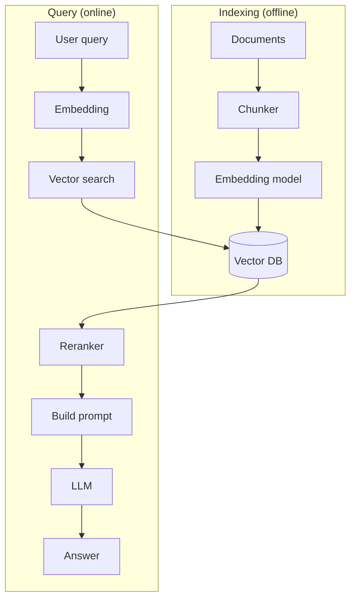

# Вопросы на собеседовании: `RAG (Retrieval-Augmented Generation)`

**RAG** — паттерн, при котором LLM **получает релевантные документы** в context перед генерацией ответа. Главный способ дать модели **специфичные знания** (документация компании, knowledge base) без fine-tuning. Стек: chunking → embeddings → vector DB → retrieval → reranking → LLM. Появился в 2020, стал mainstream в 2023.

## Полезные ссылки

### Официальная документация и авторитетные источники

- [RAG paper (Lewis et al., 2020)](https://arxiv.org/abs/2005.11401)
- [LangChain RAG Documentation](https://python.langchain.com/docs/use_cases/question_answering/)
- [LlamaIndex RAG Guide](https://docs.llamaindex.ai/en/stable/optimizing/production_rag/)
- [Anthropic Contextual Retrieval](https://www.anthropic.com/news/contextual-retrieval)
- [Cohere RAG Guide](https://docs.cohere.com/docs/retrieval-augmented-generation-rag)
- [HyDE Paper](https://arxiv.org/abs/2212.10496)
- [Self-RAG Paper](https://arxiv.org/abs/2310.11511)

## Содержание

- [Полезные ссылки](#полезные-ссылки)
- [See also](#see-also)

**Базовые понятия**
- [Q1. (!) Что такое RAG?](#q1--что-такое-rag)
- [Q2. (!) Зачем RAG если можно просто давать всё в context?](#q2--зачем-rag-если-можно-просто-давать-всё-в-context)
- [Q3. (!) Чем RAG отличается от fine-tuning?](#q3--чем-rag-отличается-от-fine-tuning)
- [Q4. Архитектура RAG системы?](#q4-архитектура-rag-системы)

**Indexing pipeline**
- [Q5. (!) Loading документов?](#q5--loading-документов)
- [Q6. (!) Chunking — что это и как делать?](#q6--chunking--что-это-и-как-делать)
- [Q7. (!) Размер chunk — как выбрать?](#q7--размер-chunk--как-выбрать)
- [Q8. Overlap между chunks?](#q8-overlap-между-chunks)
- [Q9. (!) Metadata в chunks?](#q9--metadata-в-chunks)
- [Q10. Embeddings — генерация для chunks?](#q10-embeddings--генерация-для-chunks)

**Retrieval**
- [Q11. (!) Vector search (similarity search)?](#q11--vector-search-similarity-search)
- [Q12. (!) k (число retrieved docs) — как выбрать?](#q12--k-число-retrieved-docs--как-выбрать)
- [Q13. (!) Hybrid search (vector + keyword)?](#q13--hybrid-search-vector--keyword)
- [Q14. (!) Reranking — что и зачем?](#q14--reranking--что-и-зачем)
- [Q15. Filters / metadata-based search?](#q15-filters--metadata-based-search)

**Generation**
- [Q16. (!) Prompt template для RAG?](#q16--prompt-template-для-rag)
- [Q17. Citations / sources — как делать?](#q17-citations--sources--как-делать)
- [Q18. Что делать, если retrieval не нашёл ничего?](#q18-что-делать-если-retrieval-не-нашёл-ничего)

**Продвинутые паттерны**
- [Q19. (!) Query rewriting / expansion?](#q19--query-rewriting--expansion)
- [Q20. (!) HyDE (Hypothetical Document Embeddings)?](#q20--hyde-hypothetical-document-embeddings)
- [Q21. Self-RAG — динамическое решение нужен ли retrieval?](#q21-self-rag--динамическое-решение-нужен-ли-retrieval)
- [Q22. Multi-query retrieval?](#q22-multi-query-retrieval)
- [Q23. (!) Contextual Retrieval (Anthropic)?](#q23--contextual-retrieval-anthropic)
- [Q24. (!) GraphRAG?](#q24--graphrag)
- [Q25. Agentic RAG?](#q25-agentic-rag)

**Evaluation**
- [Q26. (!) Как тестировать RAG систему?](#q26--как-тестировать-rag-систему)
- [Q27. (!) Метрики (precision, recall, faithfulness, answer relevance)?](#q27--метрики-precision-recall-faithfulness-answer-relevance)
- [Q28. RAGAS, TruLens?](#q28-ragas-trulens)

**Production**
- [Q29. (!) Какие подводные камни RAG в production?](#q29--какие-подводные-камни-rag-в-production)
- [Q30. Какой стек выбрать (LangChain, LlamaIndex, custom)?](#q30-какой-стек-выбрать-langchain-llamaindex-custom)

## Q1. (!) Что такое RAG?

**RAG (Retrieval-Augmented Generation)** — паттерн, при котором перед вызовом LLM:
1. **Retrieve** — извлекаем релевантные документы из knowledge base
2. **Augment** — дополняем prompt этими документами
3. **Generate** — генерируем ответ на основе документов и вопроса

```
User: "Какая политика по отпускам в нашей компании?"
  ↓
Retrieve: vector search в HR documents → top-3 chunks
  ↓
Prompt LLM: "Documents: [chunks]. Question: ... Answer based on documents."
  ↓
Response: "Согласно документу X (стр. 5), сотрудники могут..."
```

**Зачем:**
- Дать LLM **актуальные и приватные** данные
- Уменьшить hallucinations
- Citations (откуда взят ответ)
- Без переобучения модели


## Q2. (!) Зачем RAG если можно просто давать всё в context?

**Проблемы "все в context":**

1. **Context limit** — даже 1M tokens не хватает на TBs документов
2. **Cost** — больше tokens = дороже
3. **Latency** — большой context медленнее обрабатывается
4. **"Lost in the middle"** — модели хуже находят информацию в середине context
5. **Отсутствие фильтрации** — модель видит много нерелевантного

**RAG решает:** даёт **только релевантные** chunks (3-10 штук), вместо всего корпуса.


## Q3. (!) Чем RAG отличается от fine-tuning?

| Критерий | RAG | Fine-tuning |
|----------|-----|-------------|
| Что меняет | Контент в prompt | Параметры модели |
| Свежесть данных | В реальном времени (обновил vector DB) | Заморожена (нужен retrain) |
| Стоимость | На каждый запрос (vector search + LLM) | Разовое обучение + дешевле inference |
| Сложность setup | Средняя | Высокая |
| Источники цитирования | Легко (есть chunks) | Нет (модель "знает") |
| Privacy | Локальные документы не уходят в OpenAI | Аналогично |
| Смена модели | Легко поменять (RAG работает с любой LLM) | Привязан к конкретной модели |

**Best practice:** для большинства задач — **RAG**. Fine-tuning — для **стиля** (как писать) и **специальных навыков** (классификация). Часто **комбинируют** оба.


## Q4. Архитектура RAG системы?



**Компоненты:**
1. **Chunker** — разбивает документы
2. **Embedder** — текст → вектор
3. **Vector DB** — хранит embeddings
4. **Retriever** — находит top-k похожих
5. **Reranker** (опционально) — точная ранжировка
6. **Prompt builder** — формирует prompt
7. **LLM** — генерирует ответ


## Q5. (!) Loading документов?

**Источники данных:**
- PDF, Word, Markdown, HTML
- Confluence, Notion, Google Docs
- История в Slack, Discord
- Репозитории GitHub
- Таблицы БД, структурированные данные
- Аудио (через транскрипцию) → текст

**Инструменты:**
- **Unstructured** — парсер множества форматов
- **PyMuPDF, pdfplumber** — для PDF
- **BeautifulSoup, trafilatura** — для HTML
- **Docling** (IBM) — современный многоформатный парсер

**Подвох:** парсеры по-разному обрабатывают таблицы, картинки, сноски. Качество парсинга критически важно для RAG.


## Q6. (!) Chunking — что это и как делать?

**Chunking** — разбивка документов на маленькие куски (chunks) для индексации.

**Стратегии:**

1. **Fixed-size** — N токенов / N символов
2. **Recursive** — разбивка по иерархии разделителей ("\n\n", "\n", ". ", " ")
3. **Semantic chunking** — по смысловым границам (через embedding similarity)
4. **Markdown-aware** — по секциям и заголовкам
5. **Code-aware** — по функциям и классам
6. **Sentence-based** — по предложениям

```python
# LangChain RecursiveCharacterTextSplitter
splitter = RecursiveCharacterTextSplitter(
    chunk_size=1000,
    chunk_overlap=200,
    separators=["\n\n", "\n", ". ", " ", ""]
)
chunks = splitter.split_text(document)
```

**Важно:** хороший chunking — половина успеха RAG.


## Q7. (!) Размер chunk — как выбрать?

**Компромисс:**
- **Маленькие** chunks (200-500 токенов) — точный retrieval, но мало контекста
- **Большие** chunks (1000-2000 токенов) — больше контекста, но менее точно

**Рекомендации:**
- **Q&A по конкретным фактам:** 200-500 токенов
- **Длинные ответы / synthesis:** 800-1500 токенов
- **Код:** по границам функций/классов
- **Таблицы / структурированные данные:** держать таблицу целиком

**Экспериментируй** — единого размера на все случаи нет. Тестируй с **golden dataset**.


## Q8. Overlap между chunks?

```
Chunk 1: tokens 0-1000
Chunk 2: tokens 800-1800  (200 token overlap)
Chunk 3: tokens 1600-2600
```

**Зачем:** информация на границах chunks не теряется.

**Размер overlap:** обычно **10-20%** от размера chunk (100-300 токенов).

**Компромисс:** больше overlap = больше места в хранилище и дороже.


## Q9. (!) Metadata в chunks?

```python
chunk = {
    "text": "...",
    "embedding": [0.12, -0.45, ...],
    "metadata": {
        "source": "policy_2025.pdf",
        "page": 5,
        "section": "Vacation Policy",
        "date": "2025-01-15",
        "department": "HR",
        "language": "en"
    }
}
```

**Зачем metadata:**
- **Filtering** — "только HR-документы" / "за 2025 год"
- **Citations** — вернуть источник в ответе
- **Multi-tenancy** — фильтр по `tenant_id`
- **Hybrid search** — комбинировать vector + metadata-фильтры

Vector DB поддерживают metadata-фильтры: Pinecone, Weaviate, Qdrant.


## Q10. Embeddings — генерация для chunks?

```python
from openai import OpenAI
client = OpenAI()

# OpenAI embeddings
response = client.embeddings.create(
    model="text-embedding-3-large",
    input=chunk_text
)
vector = response.data[0].embedding  # 3072-dim вектор

# Сохраняем в vector DB вместе с metadata
```

**Модели embeddings:**
- **OpenAI** `text-embedding-3-large` (3072d), `text-embedding-3-small` (1536d)
- **Cohere** embed-english-v3 (1024d)
- **Voyage AI** (специализированы под RAG)
- **Open-source:** sentence-transformers (`all-MiniLM-L6-v2`, `bge-large`)

Подробнее — в [Embeddings](embeddings-interview.md).


## Q11. (!) Vector search (similarity search)?

```python
# 1. Embed query
query_emb = embedder.embed("Сколько дней отпуска?")

# 2. Search в vector DB
results = vector_db.search(
    vector=query_emb,
    top_k=5,
    filter={"department": "HR"}
)

# 3. Получаем top-5 chunks с similarity scores
for result in results:
    print(result.text, result.score)
```

**Метрики similarity:**
- **Cosine similarity** — самая частая (нечувствительна к длине вектора)
- **Dot product** — быстрее (если вектора нормализованы — равносильно cosine)
- **Euclidean distance** — реже используется

**Под капотом** — ANN-алгоритмы (Approximate Nearest Neighbor): HNSW, IVF, ScaNN. Подробнее — [Vector Databases](vector-databases-interview.md).


## Q12. (!) k (число retrieved docs) — как выбрать?

**Компромисс:**
- **Маленькое k** (3-5) — быстро, мало контекста, рискуем потерять релевантное
- **Большое k** (10-20) — больше шанса найти, дороже, эффект "lost in the middle"

**Best practice:**
- Базовая RAG: **k=5**
- С reranking: **извлекаем k=20-50, реранжируем → top 5**
- С большим контекстом (Claude 200K): **k=15-30**


## Q13. (!) Hybrid search (vector + keyword)?

**Vector search** хорош для семантики. **Keyword search** (BM25) хорош для точных совпадений.

**Гибридная схема:**
1. Vector search → top-50
2. BM25 keyword search → top-50
3. **Reciprocal Rank Fusion (RRF)** или взвешенное слияние

```python
def rrf(rankings, k=60):
    scores = {}
    for ranking in rankings:
        for i, doc in enumerate(ranking):
            scores[doc] = scores.get(doc, 0) + 1 / (k + i)
    return sorted(scores.items(), key=lambda x: -x[1])
```

**Когда нужен hybrid:**
- Технические термины, имена, идентификаторы (BM25 лучше)
- Поиск по коду
- Compliance / legal (точные термины)

Поддерживают: Weaviate, Qdrant, Elasticsearch, Pinecone.


## Q14. (!) Reranking — что и зачем?

**Reranking** — после initial retrieval, **более точная** модель пересматривает порядок.

```
1. Vector search → top-50 candidates (быстро, грубо)
2. Reranker (cross-encoder) → top-5 (медленно, точно)
3. Send top-5 в LLM
```

**Cross-encoder против bi-encoder:**
- **Bi-encoder** (для embeddings): embeddings запроса и документа считаются отдельно, затем — их similarity
- **Cross-encoder** (reranker): берёт пару `(запрос, документ)`, выдаёт единый score — точнее, но медленнее

**Модели:**
- **Cohere Rerank** (managed)
- **Jina Reranker**
- **bge-reranker** (open-source)
- **Voyage Rerank**

**Эффект:** обычно +10-20% к метрикам relevance. **Всегда используй reranker** в production-RAG.


## Q15. Filters / metadata-based search?

```python
results = vector_db.search(
    vector=query_emb,
    top_k=5,
    filter={
        "tenant_id": "acme_corp",
        "date": {"$gte": "2024-01-01"},
        "language": "en"
    }
)
```

**Применения:**
- **Multi-tenancy** — каждый tenant видит только свои данные
- **Permissions** — только разрешённые документы
- **Time-based** — только свежие документы
- **Domain filters** — HR vs Engineering

**Подвох:** жёсткие фильтры могут сильно сузить выбор → пустой результат.


## Q16. (!) Prompt template для RAG?

```
Ты ассистент компании. Ответь на вопрос пользователя на основе предоставленных документов.
Если ответ не найден в документах, скажи "Не нашёл информации в доступных источниках."
Всегда указывай источник в формате [Source: filename, page X].

<documents>
[Doc 1] policy_2025.pdf, p.5: Сотрудники имеют 28 дней оплачиваемого отпуска...
[Doc 2] handbook.pdf, p.12: Дополнительные дни предоставляются...
</documents>

<question>
{user_question}
</question>

Ответ:
```

**Best practices:**
- Чёткие инструкции (не отвечать без источников)
- Явное разделение документов и вопроса (XML-теги / маркеры)
- Запрос на citations
- Инструкция "если не знаю — так и скажи"
- Заданный формат ответа


## Q17. Citations / sources — как делать?

**Подходы:**

1. **Inline citations:** "Согласно [policy_2025.pdf:5], сотрудники..."
2. **Секция References:** "...текст ответа.\n\nSources: [1] policy_2025.pdf, [2] handbook.pdf"
3. **Structured output:** JSON `{"answer": "...", "sources": [{"doc": "...", "page": 5}]}`

**Верификация:** после генерации проверить, что **все факты в ответе** действительно есть в извлечённых документах (через вторичный LLM или string matching).

```python
# Anthropic Claude — нативная поддержка citations
response = client.messages.create(
    model="claude-opus-4-5",
    messages=[{"role": "user", "content": [
        {"type": "document", "source": doc_data, "citations": {"enabled": true}},
        {"type": "text", "text": question}
    ]}]
)
# response.content включает сгенерированные citations
```


## Q18. Что делать, если retrieval не нашёл ничего?

**Сценарии:**
1. **Пустой результат retrieval** (например, не пройден threshold)
2. **Извлечённые документы не содержат ответа** (LLM сам это распознаёт)

**Стратегии:**
- LLM говорит "Не знаю" (инструкция в prompt)
- **Fallback** — общий ответ LLM без RAG (с дисклеймером)
- **Query rewriting** — может, пользователь спросил неудачно?
- **Web search** как fallback (если разрешено)
- **Эскалация** к человеку (для чат-ботов)
- **Вернуть пустой результат** + предложить уточнить

**Не давать ложных уверенных ответов** — это потеря доверия.


## Q19. (!) Query rewriting / expansion?

Иногда запрос пользователя плохо подходит для retrieval.

```
User: "Сколько отпуск?"
Bad для retrieval (мало контекста)

→ LLM rewrite: "Какова продолжительность ежегодного оплачиваемого отпуска для сотрудников?"
→ Лучше для vector search
```

**Multi-query:**

```python
# LLM генерирует 3-5 вариантов query
queries = [
    "Сколько дней отпуска у сотрудников?",
    "Vacation policy duration",
    "Annual leave entitlement"
]
results = []
for q in queries:
    results.extend(vector_db.search(embed(q), top_k=5))
deduplicated = dedupe(results)
```

**Query expansion** — добавить синонимы и связанные термины.


## Q20. (!) HyDE (Hypothetical Document Embeddings)?

**Идея:** вместо того чтобы делать embed запроса — попросить LLM **сгенерировать гипотетический ответ** и сделать embed его.

```
User query: "Какая политика по удалёнке?"
  ↓ LLM generates hypothetical answer
"В компании разрешена удалённая работа. Сотрудники могут работать..."
  ↓ embed hypothetical answer
  ↓ vector search
```

**Зачем:** гипотетический ответ семантически ближе к **актуальным документам**, чем сам запрос (запросы обычно короткие, а документы длинные).

**Компромисс:** один лишний вызов LLM. Но улучшает recall в 10-20% случаев.


## Q21. Self-RAG — динамическое решение нужен ли retrieval?

**Self-RAG** — LLM сама решает, нужен ли retrieval (special tokens).

```
[Retrieve] → trigger retrieval
[No-Retrieve] → ответить из training knowledge
[Relevant] → этот retrieved doc релевантен
[Irrelevant] → пропустить
```

Заменяет always-retrieve подход. Полезно для **открытых вопросов** (когда retrieval может ничего не дать).

Требует **fine-tuned LLM** (специально обученный распознавать эти tokens).


## Q22. Multi-query retrieval?

LLM генерирует **несколько переформулировок** запроса → retrieve по каждой → объединяем.

```python
queries = llm.generate_queries(original_query, n=5)
all_results = []
for q in queries:
    all_results.extend(vector_db.search(embed(q), top_k=5))
final = dedupe_and_rerank(all_results)
```

Повышает **recall** для неоднозначных запросов.


## Q23. (!) Contextual Retrieval (Anthropic)?

**Anthropic Contextual Retrieval** (2024) — улучшение embeddings через **chunk context**.

**Идея:** перед embed каждого chunk — попросить Claude **сгенерировать short context**:

```
Original chunk: "...this transaction was reversed."

Context (Claude generates):
"This is from Q3 2024 financial report, section on customer refunds.
The transaction refers to..."

Combined для embedding:
[Context] + [Original chunk]
```

**Эффект:** доля промахов retrieval (retrieval failure rate) снижается **на 49%** (по измерениям Anthropic).

Стоимость: Claude API для генерации контекста на каждый chunk (можно делать батчем). Но prompt caching делает это дёшево.


## Q24. (!) GraphRAG?

**GraphRAG** (Microsoft, 2024) — RAG поверх **knowledge graph**, не просто vector search.

**Конвейер:**
1. **LLM извлекает сущности и связи** из документов → граф
2. **Кластеризует граф** в communities
3. **LLM генерирует summary** для каждой community
4. При запросе — извлекает релевантные communities + сущности

**Зачем:** для вопросов **глобального уровня** ("в чём основные темы документа?"), где обычный RAG плох (видит только chunks, а не структуру в целом).

**Минус:** дорого строить (много вызовов LLM на extraction).

В **2025** — растущая адопция в enterprise.


## Q25. Agentic RAG?

**Agentic RAG** — LLM как **агент**, который может:
- Решать, когда делать retrieve
- Из каких источников извлекать (несколько vector DB)
- Переформулировать запросы
- Проверять результаты
- Переизвлекать, если нужно

```python
# Псевдо-код
def agentic_rag(query):
    while not satisfied:
        decision = llm.decide_action(query, context)
        if decision == "retrieve":
            chunks = retrieve(query, source=decision.source)
            context.append(chunks)
        elif decision == "rewrite":
            query = llm.rewrite(query, feedback)
        elif decision == "answer":
            return llm.answer(query, context)
```

Подробнее — в [AI Agents](ai-agents-interview.md).


## Q26. (!) Как тестировать RAG систему?

**Golden dataset** — вручную выверенный набор `(question, expected_answer, source_chunks)`:

```json
{
  "question": "Сколько дней отпуска?",
  "expected_answer": "28 дней",
  "expected_sources": ["policy_2025.pdf:5"],
  "topics": ["HR", "vacation"]
}
```

**Тестируем:**
1. **Retrieval** — нашлись ли expected_sources среди извлечённых chunks?
2. **Generation** — содержит ли ответ expected_answer?
3. **Faithfulness** — все ли утверждения в ответе основаны на извлечённых chunks?
4. **Answer relevance** — отвечает ли ответ на вопрос?

**LLM-as-judge** — другая LLM оценивает качество (по rubric).


## Q27. (!) Метрики (precision, recall, faithfulness, answer relevance)?

**Метрики retrieval:**
- **Precision@k** — какая доля извлечённых chunks релевантна?
- **Recall@k** — какая доля релевантных chunks была извлечена?
- **MRR (Mean Reciprocal Rank)** — насколько высоко в списке стоит релевантный?
- **NDCG** — нормированный дисконтированный накопленный выигрыш

**Метрики generation:**
- **Faithfulness** — не выдумала ли модель факты?
- **Answer relevance** — отвечает ли ответ на вопрос?
- **Context utilization** — использовала ли модель извлечённые chunks?
- **Answer correctness** — верный ли факт?


## Q28. RAGAS, TruLens?

**RAGAS** — Python-фреймворк для оценки RAG:

```python
from ragas import evaluate
from ragas.metrics import faithfulness, answer_relevancy, context_precision

result = evaluate(
    dataset,  # questions, answers, contexts
    metrics=[faithfulness, answer_relevancy, context_precision]
)
```

**TruLens** — observability + evaluation для LLM/RAG. Трекинг, дашборды.

**Phoenix (Arize)** — open-source инструмент для observability LLM.

В **production-RAG** — обязательна непрерывная оценка. Без неё не понять, деградирует ли система.


## Q29. (!) Какие подводные камни RAG в production?

1. **Bad chunking** — теряется контекст, рвутся предложения
2. **Embedding model mismatch** — embedding query и документа сделаны разными моделями
3. **Stale data** — vector DB не синхронизирована с источниками
4. **Multi-tenancy leak** — RAG возвращает чужие данные
5. **Hallucinations** — даже с RAG модель может выдумывать
6. **Cost runaway** — каждый запрос = embedding + retrieval + LLM
7. **Slow retrieval** — большая vector DB без индексов
8. **Too many docs in context** — модель путается ("lost in the middle")
9. **Prompt injection** — через документы (инструкции внутри текста)
10. **No evaluation** — не знаем качества, регрессии проходят незамеченными


## Q30. Какой стек выбрать (LangChain, LlamaIndex, custom)?

| Стек | Плюсы | Минусы |
|------|------|------|
| **LangChain** | Богатый набор инструментов, агенты | Сложный API, частые breaking changes |
| **LlamaIndex** | RAG-first, удобный | Меньше инструментов для агентов |
| **Haystack** (Deepset) | Production-ready | Менее популярен |
| **Custom** | Полный контроль, понятно что происходит | Больше кода |

**Best practice 2025:**
- **LlamaIndex** для RAG-heavy систем
- **LangChain** для агентов с инструментами
- **Custom** для production-critical (контроль = надёжность)

Многие переходят на **custom** после того, как наелись боли с LangChain.


---

## See also

- [LLM Basics](llm-basics-interview.md) — основа
- [Vector Databases](vector-databases-interview.md) — storage для embeddings
- [Embeddings](embeddings-interview.md) — основа vector search
- [Prompt Engineering](prompt-engineering-interview.md) — для RAG prompts
- [AI Agents](ai-agents-interview.md) — agentic RAG
- [LLM Integration Patterns](llm-integration-patterns-interview.md) — production
- [MLOps](mlops-interview.md) — operations для RAG
- [Model Serving](model-serving-interview.md) — для embedding models
- [Caching](../architecture/caching-strategies-interview.md) — для embeddings cache
- [Микросервисы](../architecture/microservices-interview.md) — где RAG живёт
- [Elasticsearch](../databases/elasticsearch-interview.md) — для hybrid search
