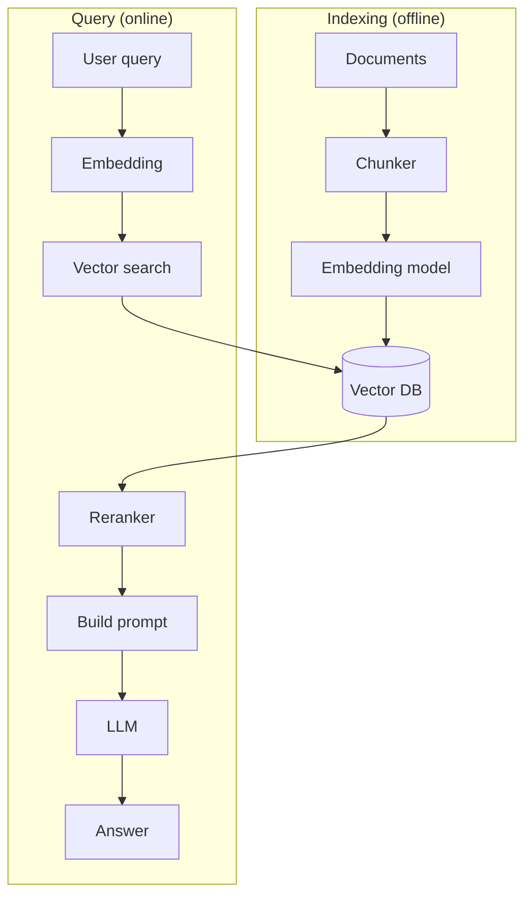

# Вопросы на собеседовании: `RAG (Retrieval-Augmented Generation)`

**RAG** — паттерн, при котором LLM **получает релевантные документы** в context перед генерацией ответа. Главный способ дать модели **специфичные знания** (документация компании, knowledge base) без fine-tuning. Стек: chunking → embeddings → vector DB → retrieval → reranking → LLM. Появился в 2020, стал mainstream в 2023.

## Полезные ссылки

### Официальная документация и авторитетные источники

- [RAG paper (Lewis et al., 2020)](https://arxiv.org/abs/2005.11401)
- [LangChain RAG Documentation](https://python.langchain.com/docs/use_cases/question_answering/)
- [LlamaIndex RAG Guide](https://docs.llamaindex.ai/en/stable/optimizing/production_rag/)
- [Anthropic Contextual Retrieval](https://www.anthropic.com/news/contextual-retrieval)
- [Cohere RAG Guide](https://docs.cohere.com/docs/retrieval-augmented-generation-rag)
- [HyDE Paper](https://arxiv.org/abs/2212.10496)
- [Self-RAG Paper](https://arxiv.org/abs/2310.11511)

## Содержание

- [Полезные ссылки](#полезные-ссылки)
- [See also](#see-also)

**Базовые понятия**
- [Q1. (!) Что такое RAG?](#q1--что-такое-rag)
- [Q2. (!) Зачем RAG если можно просто давать всё в context?](#q2--зачем-rag-если-можно-просто-давать-всё-в-context)
- [Q3. (!) Чем RAG отличается от fine-tuning?](#q3--чем-rag-отличается-от-fine-tuning)
- [Q4. Архитектура RAG системы?](#q4-архитектура-rag-системы)

**Indexing pipeline**
- [Q5. (!) Загрузка документов: источники и парсинг?](#q5--загрузка-документов-источники-и-парсинг)
- [Q6. (!) Chunking — что это и как делать?](#q6--chunking--что-это-и-как-делать)
- [Q7. (!) Размер chunk — как выбрать?](#q7--размер-chunk--как-выбрать)
- [Q8. Зачем нужен overlap между chunks?](#q8-зачем-нужен-overlap-между-chunks)
- [Q9. (!) Metadata в chunks?](#q9--metadata-в-chunks)
- [Q10. Как генерировать embeddings для chunks?](#q10-как-генерировать-embeddings-для-chunks)

**Retrieval**
- [Q11. (!) Как работает vector search (поиск по сходству)?](#q11--как-работает-vector-search-поиск-по-сходству)
- [Q12. (!) Как выбрать k — число извлекаемых документов?](#q12--как-выбрать-k--число-извлекаемых-документов)
- [Q13. (!) Что такое hybrid search (vector + keyword)?](#q13--что-такое-hybrid-search-vector--keyword)
- [Q14. (!) Reranking — что и зачем?](#q14--reranking--что-и-зачем)
- [Q15. Как работает фильтрация по metadata?](#q15-как-работает-фильтрация-по-metadata)

**Generation**
- [Q16. (!) Как устроен prompt template для RAG?](#q16--как-устроен-prompt-template-для-rag)
- [Q17. Как делать citations и ссылки на источники?](#q17-как-делать-citations-и-ссылки-на-источники)
- [Q18. Что делать, если retrieval ничего не нашёл?](#q18-что-делать-если-retrieval-ничего-не-нашёл)

**Продвинутые паттерны**
- [Q19. (!) Что такое query rewriting и expansion?](#q19--что-такое-query-rewriting-и-expansion)
- [Q20. (!) Что такое HyDE (Hypothetical Document Embeddings)?](#q20--что-такое-hyde-hypothetical-document-embeddings)
- [Q21. Self-RAG: как модель сама решает, нужен ли retrieval?](#q21-self-rag-как-модель-сама-решает-нужен-ли-retrieval)
- [Q22. Как работает multi-query retrieval?](#q22-как-работает-multi-query-retrieval)
- [Q23. (!) Что такое Contextual Retrieval от Anthropic?](#q23--что-такое-contextual-retrieval-от-anthropic)
- [Q24. (!) Что такое GraphRAG?](#q24--что-такое-graphrag)
- [Q25. Что такое agentic RAG?](#q25-что-такое-agentic-rag)

**Evaluation**
- [Q26. (!) Как тестировать RAG-систему?](#q26--как-тестировать-rag-систему)
- [Q27. (!) Какие метрики качества у RAG (precision, recall, faithfulness, answer relevance)?](#q27--какие-метрики-качества-у-rag-precision-recall-faithfulness-answer-relevance)
- [Q28. Что за инструменты RAGAS и TruLens?](#q28-что-за-инструменты-ragas-и-trulens)

**Production**
- [Q29. (!) Какие подводные камни у RAG в production?](#q29--какие-подводные-камни-у-rag-в-production)
- [Q30. Какой стек выбрать (LangChain, LlamaIndex, custom)?](#q30-какой-стек-выбрать-langchain-llamaindex-custom)

## Q1. (!) Что такое RAG?

**RAG (Retrieval-Augmented Generation)** — это паттерн, при котором LLM перед ответом подсматривает в вашу базу знаний, а не полагается только на то, что выучила при обучении. Три шага зашиты в само название:

1. **Retrieve** — по вопросу находим релевантные документы в knowledge base
2. **Augment** — подмешиваем эти документы в prompt
3. **Generate** — модель отвечает, опираясь на документы, а не на «память»

Суть в разделении ответственности: **поиск** отвечает за факты, **LLM** — за формулировку ответа. Модель остаётся той же, меняется только то, что лежит у неё перед глазами.

```
User: "Какая политика по отпускам в нашей компании?"
  ↓
Retrieve: vector search в HR documents → top-3 chunks
  ↓
Prompt LLM: "Documents: [chunks]. Question: ... Answer based on documents."
  ↓
Response: "Согласно документу X (стр. 5), сотрудники могут..."
```

**Что это даёт:**
- **Актуальные и приватные** данные — то, чего не было в обучающей выборке (внутренняя документация, свежие новости)
- Меньше hallucinations — модель опирается на текст, а не выдумывает
- **Citations** — видно, откуда взят ответ, и его можно проверить
- Всё это без переобучения модели: обновить знания — значит просто обновить базу


## Q2. (!) Зачем RAG если можно просто давать всё в context?

Короткий ответ: «всё в context» не масштабируется и работает хуже, чем кажется. Даже если корпус физически влезает в окно — это всё равно плохая идея. Почему:

1. **Context limit** — даже 1M tokens не вместит терабайты документов
2. **Стоимость** — платим за каждый token на входе, так что весь корпус в каждом запросе = деньги на ветер
3. **Latency** — чем больше context, тем дольше модель его обрабатывает
4. **«Lost in the middle»** — модель хуже всего замечает информацию в середине длинного context, так что нужный факт может просто «утонуть»
5. **Нет фильтрации** — модель тонет в нерелевантном, и шум сбивает её с ответа

**Как RAG решает:** подаёт в prompt **только релевантные** chunks (3–10 штук) вместо всего корпуса. Меньше токенов, ниже стоимость, и модель видит ровно то, что нужно для ответа.


## Q3. (!) Чем RAG отличается от fine-tuning?

Главное различие одной фразой: **RAG меняет то, что модель видит в запросе, а fine-tuning меняет саму модель**. RAG добавляет знания «снаружи» (через context), fine-tuning «вшивает» их в веса. Отсюда расходятся все остальные свойства.

| Критерий | RAG | Fine-tuning |
|----------|-----|-------------|
| Что меняет | Контент в prompt | Параметры модели |
| Свежесть данных | В реальном времени (обновил vector DB) | Заморожена (нужен retrain) |
| Стоимость | На каждый запрос (vector search + LLM) | Разовое обучение + дешевле inference |
| Сложность setup | Средняя | Высокая |
| Источники цитирования | Легко (есть chunks) | Нет (модель "знает") |
| Privacy | Локальные документы не уходят в OpenAI | Аналогично |
| Смена модели | Легко поменять (RAG работает с любой LLM) | Привязан к конкретной модели |

**Рекомендация:** для большинства задач, где нужны *знания*, — **RAG**. Fine-tuning берут, когда нужно изменить *поведение*: **стиль** (как именно писать) и **навыки** (например, надёжная классификация). Это не «или-или» — часто их **комбинируют**: fine-tuning учит модель формату ответа, RAG подаёт ей актуальные факты.


## Q4. Архитектура RAG системы?



Архитектура делится на две фазы. **Indexing** идёт офлайн, заранее: документы превращаются в искомые embeddings. **Query** идёт онлайн, на каждый запрос: вопрос пользователя проходит тот же путь до вектора и сопоставляется с базой.

**Компоненты:**
1. **Chunker** — режет документы на куски подходящего размера
2. **Embedder** — превращает текст в вектор (та же модель для документов и для запроса — это важно)
3. **Vector DB** — хранит embeddings и быстро ищет похожие
4. **Retriever** — по вектору запроса достаёт top-k ближайших chunks
5. **Reranker** (опционально) — пересортировывает кандидатов точнее, чем поиск
6. **Prompt builder** — собирает найденное и вопрос в один prompt
7. **LLM** — генерирует ответ по этому prompt

Ключевая симметрия: индекс и запрос проходят через **один и тот же** embedder, иначе вектора окажутся в разных «системах координат» и поиск сломается.


## Q5. (!) Загрузка документов: источники и парсинг?

Первый шаг indexing-конвейера — собрать «сырые» документы из разных источников и превратить их в чистый текст. Этот этап незаметен, но критичен: мусор на входе = мусор в ответах.

**Источники данных:**
- PDF, Word, Markdown, HTML
- Confluence, Notion, Google Docs
- История в Slack, Discord
- Репозитории GitHub
- Таблицы БД, структурированные данные
- Аудио (через транскрипцию) → текст

**Инструменты:**
- **Unstructured** — парсер множества форматов
- **PyMuPDF, pdfplumber** — для PDF
- **BeautifulSoup, trafilatura** — для HTML
- **Docling** (IBM) — современный многоформатный парсер

**Подводные камни:** парсеры по-разному справляются с таблицами, картинками, многоколоночной вёрсткой и сносками — на сложном PDF разные библиотеки дадут разный текст. Качество парсинга напрямую определяет потолок качества RAG: если таблица «рассыпалась» при извлечении, никакой reranking её уже не починит.


## Q6. (!) Chunking — что это и как делать?

**Chunking** — разбивка документов на небольшие куски (chunks), которые индексируются и извлекаются по отдельности. Зачем дробить: embedding одного вектора плохо описывает длинный документ (смысл «размывается»), да и в prompt мы хотим подать точный фрагмент, а не страницы вокруг него. Цель — чтобы каждый chunk нёс **одну законченную мысль**.

**Стратегии** (от простых к умным):

1. **Fixed-size** — N токенов / N символов
2. **Recursive** — разбивка по иерархии разделителей ("\n\n", "\n", ". ", " ")
3. **Semantic chunking** — по смысловым границам (через embedding similarity)
4. **Markdown-aware** — по секциям и заголовкам
5. **Code-aware** — по функциям и классам
6. **Sentence-based** — по предложениям

```python
# LangChain RecursiveCharacterTextSplitter
splitter = RecursiveCharacterTextSplitter(
    chunk_size=1000,
    chunk_overlap=200,
    separators=["\n\n", "\n", ". ", " ", ""]
)
chunks = splitter.split_text(document)
```

**Эмпирическое правило:** на практике лучший дефолт — **recursive**: он старается резать по абзацам и предложениям, разрывая «слово посреди мысли» лишь в крайнем случае. Семантический и структурный chunking дают прирост, но требуют возни. Хороший chunking — это буквально половина успеха RAG: на нём чаще теряют качество, чем на выборе модели или vector DB.


## Q7. (!) Размер chunk — как выбрать?

Это компромисс между точностью поиска и полнотой контекста, и крайности плохи с обеих сторон:

- **Маленькие** chunks (200–500 токенов) — embedding «острый», retrieval точно бьёт в нужный факт, но в найденном куске может не хватить окружающего контекста, чтобы LLM поняла ответ
- **Большие** chunks (1000–2000 токенов) — контекста с запасом, но embedding усредняет несколько тем сразу, и поиск становится размытым: chunk «подходит ко всему и ни к чему»

**Рекомендации под задачу:**
- **Q&A по конкретным фактам:** 200–500 токенов — нужен точный фрагмент
- **Длинные ответы / synthesis:** 800–1500 токенов — нужен контекст для рассуждения
- **Код:** резать по границам функций/классов, а не по числу токенов
- **Таблицы / структурированные данные:** держать таблицу целиком, иначе строки оторвутся от заголовков

**Эмпирическое правило:** единого «правильного» размера нет — он зависит от данных и типа вопросов. Подбирайте размер экспериментально, замеряя метрики на **golden dataset**, а не на глаз.


## Q8. Зачем нужен overlap между chunks?

**Overlap** — это когда соседние chunks частично перекрываются: конец одного дублируется в начале следующего.

```
Chunk 1: tokens 0-1000
Chunk 2: tokens 800-1800  (200 token overlap)
Chunk 3: tokens 1600-2600
```

**Зачем:** граница между chunks может разрезать мысль пополам. Без overlap фраза, начавшаяся в конце chunk 1 и завершившаяся в начале chunk 2, не попадёт целиком ни в один chunk — и поиск её не найдёт. Перекрытие гарантирует, что пограничная информация есть хотя бы в одном куске целиком.

**Размер overlap:** обычно **10–20%** от размера chunk (100–300 токенов) — этого хватает, чтобы «склеить» границу.

**Компромисс:** чем больше overlap, тем больше дублирования — растёт объём хранилища и стоимость индексации, а в выдачу могут попадать почти одинаковые chunks. Поэтому не больше, чем нужно для целостности на границах.


## Q9. (!) Metadata в chunks?

```python
chunk = {
    "text": "...",
    "embedding": [0.12, -0.45, ...],
    "metadata": {
        "source": "policy_2025.pdf",
        "page": 5,
        "section": "Vacation Policy",
        "date": "2025-01-15",
        "department": "HR",
        "language": "en"
    }
}
```

К каждому chunk полезно прикрепить metadata — структурированные поля (источник, страница, дата, отдел). Они не участвуют в семантическом поиске напрямую, но дают рычаги, которых нет у голого вектора.

**Зачем metadata:**
- **Фильтрация** — сузить поиск до «только HR-документы» или «только за 2025 год» ещё до семантического сравнения
- **Citations** — вернуть в ответе конкретный источник и страницу
- **Multi-tenancy** — фильтр по `tenant_id`, чтобы клиент не видел чужие данные
- **Hybrid search** — комбинировать векторную близость с жёсткими metadata-условиями

Metadata-фильтры поддерживают основные vector DB: Pinecone, Weaviate, Qdrant.


## Q10. Как генерировать embeddings для chunks?

Каждый chunk прогоняется через embedding-модель и превращается в вектор фиксированной длины — это «семантический отпечаток» текста. Вектор сохраняют в vector DB вместе с самим текстом и metadata.

```python
from openai import OpenAI
client = OpenAI()

# OpenAI embeddings
response = client.embeddings.create(
    model="text-embedding-3-large",
    input=chunk_text
)
vector = response.data[0].embedding  # 3072-dim вектор

# Сохраняем в vector DB вместе с metadata
```

**Модели embeddings** (размерность — в скобках; больше не всегда лучше, но обычно точнее):
- **OpenAI** `text-embedding-3-large` (3072d), `text-embedding-3-small` (1536d) — дешевле и быстрее
- **Cohere** embed-english-v3 (1024d)
- **Voyage AI** — специализированы под RAG, часто лидируют по качеству retrieval
- **Open-source:** sentence-transformers (`all-MiniLM-L6-v2` — лёгкая, `bge-large` — точнее) для self-hosted

**Главное правило:** документы при индексации и запрос при поиске нужно прогонять через **одну и ту же** модель — иначе вектора несравнимы. Подробнее — в [Embeddings](embeddings-interview.md).


## Q11. (!) Как работает vector search (поиск по сходству)?

Запрос пользователя превращают в вектор той же embedding-моделью, а затем ищут в базе вектора, ближе всего расположенные к нему. Близость в этом пространстве = семантическая близость текстов, поэтому «сколько дней отпуска» найдёт chunk про «28 дней оплачиваемого отдыха», даже если ни одно слово не совпало дословно.

```python
# 1. Embed query
query_emb = embedder.embed("Сколько дней отпуска?")

# 2. Search в vector DB
results = vector_db.search(
    vector=query_emb,
    top_k=5,
    filter={"department": "HR"}
)

# 3. Получаем top-5 chunks с similarity scores
for result in results:
    print(result.text, result.score)
```

**Метрики similarity:**
- **Cosine similarity** — самая частая (нечувствительна к длине вектора)
- **Dot product** — быстрее (если вектора нормализованы — равносильно cosine)
- **Euclidean distance** — реже используется

**Под капотом** — ANN-алгоритмы (Approximate Nearest Neighbor): HNSW, IVF, ScaNN. Подробнее — [Vector Databases](vector-databases-interview.md).


## Q12. (!) Как выбрать k — число извлекаемых документов?

`k` — сколько chunks мы достаём из vector DB и кладём в prompt. Это компромисс между полнотой (не упустить ответ) и точностью/ценой:

- **Маленькое k** (3–5) — быстро и дёшево, но если нужный chunk не попал в top-k, ответ потерян
- **Большое k** (10–20) — выше шанс зацепить релевантное, но дороже по токенам и сильнее бьёт «lost in the middle»: нужный факт тонет среди десятка кусков

**Рекомендации:**
- Базовая RAG: **k=5** — хороший дефолт
- С reranking: достаём **k=20–50**, прогоняем через reranker, в prompt отдаём **top-5** — широкий невод, затем точная сортировка
- С большим окном (Claude 200K): можно **k=15–30**, контекста хватит

**Эмпирическое правило:** не задирайте k «на всякий случай» — лишние chunks не помогают, а размывают ответ. Лучше достать много кандидатов и отфильтровать reranker'ом, чем отдать всё подряд в LLM.


## Q13. (!) Что такое hybrid search (vector + keyword)?

**Hybrid search** объединяет два вида поиска, потому что у каждого своя слепая зона. **Vector search** понимает смысл, но мажет на точных строках: артикул `SKU-4471-X`, имя функции или редкий термин могут не совпасть по векторам. **Keyword search** (BM25) наоборот — берёт точные совпадения слов, но не понимает синонимов и перефразировок. Вместе они закрывают слабости друг друга.

**Гибридная схема:**
1. Vector search → top-50 (по смыслу)
2. BM25 keyword search → top-50 (по точным словам)
3. Слить два списка через **Reciprocal Rank Fusion (RRF)** или взвешенную сумму — документы, высокие в обоих списках, поднимаются наверх

```python
def rrf(rankings, k=60):
    scores = {}
    for ranking in rankings:
        for i, doc in enumerate(ranking):
            scores[doc] = scores.get(doc, 0) + 1 / (k + i)
    return sorted(scores.items(), key=lambda x: -x[1])
```

**Сценарии применения** — где особенно важны точные совпадения:
- Технические термины, имена, идентификаторы, артикулы (тут выручает BM25)
- Поиск по коду
- Compliance и legal — где точная формулировка термина критична

Гибридный поиск поддерживают: Weaviate, Qdrant, Elasticsearch, Pinecone.


## Q14. (!) Reranking — что и зачем?

**Reranking** — это второй проход: после первичного retrieval **более точная (но более тяжёлая) модель** пересматривает кандидатов и переставляет их по релевантности. Идея — двухступенчатая воронка: дешёвый векторный поиск быстро отбирает много кандидатов, дорогой reranker аккуратно выбирает из них лучшие.

```
1. Vector search → top-50 candidates (быстро, грубо)
2. Reranker (cross-encoder) → top-5 (медленно, точно)
3. Send top-5 в LLM
```

**Почему reranker точнее — cross-encoder против bi-encoder:**
- **Bi-encoder** (используется для embeddings): вектор запроса и вектор документа считаются **независимо**, заранее, и сравниваются простым similarity. Быстро и масштабируемо, но модель никогда не «видит» запрос и документ вместе.
- **Cross-encoder** (reranker): подаёт пару `(запрос, документ)` в модель **одновременно** и выдаёт единый score. Модель напрямую сопоставляет их слово к слову — отсюда точность. Расплата — нельзя предпосчитать заранее, score нужно считать для каждой пары в рантайме, поэтому это медленно и применимо лишь к небольшому числу кандидатов.

**Модели:**
- **Cohere Rerank** (managed)
- **Jina Reranker**
- **bge-reranker** (open-source)
- **Voyage Rerank**

**Эффект:** обычно +10–20% к метрикам relevance — один из самых дешёвых способов поднять качество. **Рекомендация:** в production-RAG reranker стоит почти всегда, потому что отдаёт в LLM именно лучшие chunks, а не просто «первые попавшиеся под порог».


## Q15. Как работает фильтрация по metadata?

Помимо семантической близости, к поиску можно добавить **жёсткие условия** по metadata-полям: дата, язык, отдел, владелец. Vector DB сначала отсекает документы, не прошедшие фильтр, и ищет ближайшие вектора только среди оставшихся.

```python
results = vector_db.search(
    vector=query_emb,
    top_k=5,
    filter={
        "tenant_id": "acme_corp",
        "date": {"$gte": "2024-01-01"},
        "language": "en"
    }
)
```

**Сценарии применения:**
- **Multi-tenancy** — каждый tenant видит только свои данные (фильтр-страховка от утечки между клиентами)
- **Permissions** — только документы, к которым у пользователя есть доступ
- **Time-based** — только свежие документы, отсечь устаревшее
- **Domain filters** — разделить, например, HR и Engineering

**Подводные камни:** слишком жёсткие фильтры могут отсечь всё подходящее, и вместо ответа вернётся пустой результат. Прежде чем сказать «ничего не нашлось», полезно проверить, не виноваты ли сами фильтры.


## Q16. (!) Как устроен prompt template для RAG?

Промпт связывает воедино найденные документы и вопрос пользователя и задаёт модели жёсткие рамки: отвечать **только** по документам, признаваться в незнании и ссылаться на источник. Без таких рамок RAG-система легко скатывается в обычную генерацию «из головы».

```
Ты ассистент компании. Ответь на вопрос пользователя на основе предоставленных документов.
Если ответ не найден в документах, скажи "Не нашёл информации в доступных источниках."
Всегда указывай источник в формате [Source: filename, page X].

<documents>
[Doc 1] policy_2025.pdf, p.5: Сотрудники имеют 28 дней оплачиваемого отпуска...
[Doc 2] handbook.pdf, p.12: Дополнительные дни предоставляются...
</documents>

<question>
{user_question}
</question>

Ответ:
```

**Рекомендации по составлению промпта:**
- Чёткое требование не отвечать без источников — это главный предохранитель от выдумок
- Явно отделять документы от вопроса (XML-теги или маркеры), чтобы модель не путала, что — данные, а что — задание
- Просить citations — иначе ответ невозможно проверить
- Инструкция «если ответа нет в документах — так и скажи»: лучше честное «не знаю», чем уверенная ложь
- Задавать формат ответа, если он важен дальше по конвейеру


## Q17. Как делать citations и ссылки на источники?

Citations превращают RAG-ответ из «доверься мне» в проверяемый: пользователь видит, на каком документе он основан, и может перепроверить. Это и про доверие, и про отладку — по ссылке сразу понятно, не приплела ли модель факт «от себя».

**Подходы** (от простого к строгому):

1. **Inline citations:** ссылка прямо в тексте — "Согласно [policy_2025.pdf:5], сотрудники..."
2. **Секция References:** ответ, а в конце список источников — "...текст ответа.\n\nSources: [1] policy_2025.pdf, [2] handbook.pdf"
3. **Structured output:** машиночитаемый JSON `{"answer": "...", "sources": [{"doc": "...", "page": 5}]}` — удобно для UI и автопроверок

**Верификация:** после генерации стоит проверить, что **каждый факт в ответе** действительно есть в извлечённых документах (вторичной LLM или сопоставлением строк). Модель может правильно сослаться на документ и при этом исказить его содержание — citation сам по себе не гарантирует точность.

```python
# Anthropic Claude — нативная поддержка citations
response = client.messages.create(
    model="claude-opus-4-5",
    messages=[{"role": "user", "content": [
        {"type": "document", "source": doc_data, "citations": {"enabled": true}},
        {"type": "text", "text": question}
    ]}]
)
# response.content включает сгенерированные citations
```


## Q18. Что делать, если retrieval ничего не нашёл?

Сначала важно различить **два разных провала** — лечатся они по-разному:

1. **Пустой результат retrieval** — поиск не вернул ни одного chunk (например, всё отсеял порог similarity или metadata-фильтр)
2. **Документы нашлись, но ответа в них нет** — это распознаёт уже сама LLM при чтении найденного

**Стратегии (от безопасных к рискованным):**
- LLM честно говорит «не знаю» — это поведение надо задать инструкцией в prompt
- **Query rewriting** — возможно, пользователь сформулировал неудачно; переписать запрос и попробовать снова
- **Эскалация** к человеку — для чат-ботов поддержки честнее, чем гадать
- **Вернуть пустой результат** и предложить уточнить вопрос
- **Web search** как fallback — если внешние источники разрешены
- **Fallback на общий ответ LLM** без RAG — самый рискованный вариант: обязательно с дисклеймером, иначе модель ответит «из головы» под видом данных из базы

**Главное правило:** не выдавать уверенных ложных ответов. Один уверенный, но неверный ответ подрывает доверие ко всей системе сильнее, чем десяток честных «не нашёл».


## Q19. (!) Что такое query rewriting и expansion?

Реальные запросы часто плохо подходят для retrieval: короткие, с опечатками, с местоимениями из предыдущего сообщения. Поскольку поиск работает по сходству, неудачная формулировка не найдёт нужный документ, даже если он есть. Идея — между пользователем и поиском вставить LLM, которая **улучшит запрос** перед retrieval.

```
User: "Сколько отпуск?"
Bad для retrieval (мало контекста)

→ LLM rewrite: "Какова продолжительность ежегодного оплачиваемого отпуска для сотрудников?"
→ Лучше для vector search
```

**Multi-query** — другой приём: вместо одного «лучшего» запроса сгенерировать несколько разных переформулировок и искать по каждой, объединяя результаты. Это страхует от того, что одна формулировка промахнётся мимо нужного chunk.

```python
# LLM генерирует 3-5 вариантов query
queries = [
    "Сколько дней отпуска у сотрудников?",
    "Vacation policy duration",
    "Annual leave entitlement"
]
results = []
for q in queries:
    results.extend(vector_db.search(embed(q), top_k=5))
deduplicated = dedupe(results)
```

**Query expansion** — расширить запрос синонимами и связанными терминами, чтобы зацепить документы, где та же мысль выражена другими словами.


## Q20. (!) Что такое HyDE (Hypothetical Document Embeddings)?

**Идея:** не искать по вектору самого запроса, а сначала попросить LLM **придумать гипотетический ответ** (пусть даже фактически неверный) и искать по его вектору. Звучит парадоксально, но за этим есть логика — см. ниже.

```
User query: "Какая политика по удалёнке?"
  ↓ LLM generates hypothetical answer
"В компании разрешена удалённая работа. Сотрудники могут работать..."
  ↓ embed hypothetical answer
  ↓ vector search
```

**Зачем это работает:** мы ищем ответы-документы, а сравниваем их с *вопросом* — а вопрос и ответ устроены по-разному (вопрос короткий и общий, документ длинный и конкретный). Гипотетический ответ, даже выдуманный, по форме и лексике похож на настоящие документы, поэтому его вектор оказывается **ближе к нужным chunks**, чем вектор голого вопроса. Фактическая правдивость выдумки не важна — важно, что она «звучит как документ».

**Компромисс:** платим одним дополнительным вызовом LLM на каждый запрос (плюс latency). Взамен — заметный прирост recall в части случаев (порядка 10–20%).


## Q21. Self-RAG: как модель сама решает, нужен ли retrieval?

**Self-RAG** даёт LLM управлять собственным retrieval через специальные служебные tokens, которые она генерирует прямо в процессе ответа. Вместо жёсткого «всегда искать» модель сама на ходу решает: тут нужны внешние документы, а тут хватит и обучающих знаний.

```
[Retrieve] → trigger retrieval
[No-Retrieve] → ответить из training knowledge
[Relevant] → этот retrieved doc релевантен
[Irrelevant] → пропустить
```

Это замена прямолинейному «искать на каждый запрос». Особенно полезно для **открытых и болтологических вопросов** («привет», «спасибо»), где retrieval только зашумит ответ ненужными документами.

**Минус:** требует **fine-tuned LLM**, специально обученной генерировать и понимать эти служебные tokens — с обычной моделью «из коробки» Self-RAG не заведётся.


## Q22. Как работает multi-query retrieval?

LLM генерирует **несколько разных переформулировок** одного вопроса, поиск идёт по каждой, а результаты объединяются и дедуплицируются. Смысл — застраховаться от того, что единственная формулировка промахнётся: разные варианты «подсветят» разные релевантные chunks.

```python
queries = llm.generate_queries(original_query, n=5)
all_results = []
for q in queries:
    all_results.extend(vector_db.search(embed(q), top_k=5))
final = dedupe_and_rerank(all_results)
```

Повышает **recall** для неоднозначных запросов. Плата — несколько поисков и лишний вызов LLM на генерацию переформулировок.


## Q23. (!) Что такое Contextual Retrieval от Anthropic?

**Anthropic Contextual Retrieval** (2024) лечит фундаментальную проблему chunking: вырванный из документа chunk теряет контекст. Фраза «эта транзакция была отменена» сама по себе бесполезна для поиска — непонятно, *какая* транзакция, из какого отчёта. Поиск по такому chunk промахивается.

**Идея:** перед тем как делать embed, попросить Claude дописать к каждому chunk **короткий контекст** — что это за фрагмент и откуда он:

```
Original chunk: "...this transaction was reversed."

Context (Claude generates):
"This is from Q3 2024 financial report, section on customer refunds.
The transaction refers to..."

Combined для embedding:
[Context] + [Original chunk]
```

Теперь chunk embedится вместе с этим контекстом, поэтому его вектор «знает», к чему относится фрагмент, и находится в нужных запросах.

**Эффект:** доля промахов retrieval (retrieval failure rate) падает **на 49%** (по измерениям Anthropic) — крупный прирост для одного приёма.

**Компромисс:** нужен вызов Claude на генерацию контекста для каждого chunk при индексации. Но это разовая офлайн-работа, её можно делать батчем, а **prompt caching** (повторное использование общего документа в кэше) делает её недорогой.


## Q24. (!) Что такое GraphRAG?

**GraphRAG** (Microsoft, 2024) — это RAG поверх **knowledge graph** вместо плоского vector search. Обычный RAG видит набор не связанных между собой chunks и не замечает, как они соотносятся друг с другом. GraphRAG сначала выстраивает из документов граф сущностей и связей — и потому понимает структуру корпуса в целом, а не только отдельные куски.

**Конвейер:**
1. **LLM извлекает сущности и связи** из документов и строит из них граф
2. **Граф кластеризуется** в communities — группы тесно связанных сущностей
3. **LLM пишет summary** для каждой community — сжатое описание темы
4. При запросе достаются релевантные communities и сущности, а не разрозненные chunks

**Сценарий применения:** вопросы **глобального уровня** — «в чём основные темы документа?», «как связаны эти отделы?». Здесь обычный RAG бессилен: ответа нет ни в одном отдельном chunk, он размазан по всему корпусу, а GraphRAG как раз агрегирует через summary communities.

**Минус:** дорого строить — извлечение сущностей и связей требует множества вызовов LLM по всему корпусу.

В **2025** — растущее внедрение в enterprise, где как раз много таких «вопросов про целое».


## Q25. Что такое agentic RAG?

**Agentic RAG** превращает RAG из прямой цепочки «искать → ответить» в **цикл с агентом**, который сам управляет процессом. Вместо одного фиксированного retrieval LLM работает как агент: планирует, ищет, оценивает результат и при необходимости повторяет — пока не соберёт достаточно для ответа.

Что умеет такой агент:
- Решать, **нужен ли** retrieve вообще на этом шаге
- Выбирать, **из каких источников** искать (если их несколько — разные vector DB)
- **Переформулировать** запрос, если первый поиск ничего не дал
- **Оценивать** найденное на релевантность
- **Повторять** retrieval, пока контекста не хватит для ответа

```python
# Псевдо-код
def agentic_rag(query):
    while not satisfied:
        decision = llm.decide_action(query, context)
        if decision == "retrieve":
            chunks = retrieve(query, source=decision.source)
            context.append(chunks)
        elif decision == "rewrite":
            query = llm.rewrite(query, feedback)
        elif decision == "answer":
            return llm.answer(query, context)
```

Подробнее — в [AI Agents](ai-agents-interview.md).


## Q26. (!) Как тестировать RAG-систему?

Главная сложность — у RAG два звена, и каждое ломается отдельно: либо поиск не нашёл нужное (виноват retrieval), либо нашёл, но модель ответила плохо (виновата generation). Поэтому их тестируют **раздельно**, иначе непонятно, что чинить. Основа всего — **golden dataset**, вручную выверенный набор `(вопрос, ожидаемый ответ, эталонные chunks)`:

```json
{
  "question": "Сколько дней отпуска?",
  "expected_answer": "28 дней",
  "expected_sources": ["policy_2025.pdf:5"],
  "topics": ["HR", "vacation"]
}
```

**Что проверяем** (первые два — про retrieval и generation по отдельности, остальные — про качество самого ответа):
1. **Retrieval** — попали ли `expected_sources` в число извлечённых chunks? Если нет — проблема в поиске
2. **Generation** — содержит ли ответ `expected_answer`? Если chunks нашлись, а ответа нет — проблема в LLM/промпте
3. **Faithfulness** — все ли утверждения ответа опираются на извлечённые chunks (нет ли выдумок)?
4. **Answer relevance** — отвечает ли ответ именно на заданный вопрос, а не «вокруг»?

**LLM-as-judge:** оценивать ответы вручную дорого, поэтому качество судит другая LLM по заданному rubric — это позволяет прогонять весь golden dataset на каждом изменении.


## Q27. (!) Какие метрики качества у RAG (precision, recall, faithfulness, answer relevance)?

Метрики делятся на две группы — по двум звеньям системы. Retrieval-метрики отвечают на вопрос «нашли ли нужное», generation-метрики — «хорошо ли ответили по найденному».

**Метрики retrieval** (качество поиска):
- **Precision@k** — какая доля из top-k извлечённых chunks реально релевантна (нет ли мусора в выдаче)
- **Recall@k** — какую долю всех релевантных chunks удалось извлечь (не упустили ли нужное). Precision и recall в паре: гнаться можно за обоими, но обычно есть компромисс
- **MRR (Mean Reciprocal Rank)** — насколько высоко в списке стоит первый релевантный документ (важно, ведь верхние chunks модель «читает» внимательнее)
- **NDCG** — нормированный дисконтированный накопленный выигрыш; учитывает и релевантность, и позицию в ранжировании

**Метрики generation** (качество ответа):
- **Faithfulness** — не выдумала ли модель факты сверх того, что есть в chunks (ключевая метрика против hallucinations)
- **Answer relevance** — отвечает ли ответ на сам вопрос
- **Context utilization** — реально ли модель использовала извлечённые chunks, а не проигнорировала их
- **Answer correctness** — верен ли ответ по существу относительно эталона


## Q28. Что за инструменты RAGAS и TruLens?

Это готовые фреймворки, чтобы не писать оценку RAG с нуля: они уже реализуют метрики из Q27 (часто через LLM-as-judge) и встраиваются в CI или мониторинг.

**RAGAS** — Python-фреймворк для оффлайн-оценки RAG на датасете:

```python
from ragas import evaluate
from ragas.metrics import faithfulness, answer_relevancy, context_precision

result = evaluate(
    dataset,  # questions, answers, contexts
    metrics=[faithfulness, answer_relevancy, context_precision]
)
```

**TruLens** — observability плюс evaluation для LLM/RAG: трекинг запусков, метрики, дашборды — смещает фокус с разового прогона на постоянное наблюдение.

**Phoenix (Arize)** — open-source инструмент для observability LLM-приложений.

**Главное правило:** в production-RAG нужна **непрерывная** оценка, а не разовая. Данные обновляются, документы меняются, и система тихо деградирует — без постоянных замеров вы об этом не узнаете, пока не пожалуются пользователи.


## Q29. (!) Какие подводные камни у RAG в production?

Самое опасное здесь — что RAG **продолжает выдавать ответы**, даже когда сломан. Система не падает с ошибкой, а тихо отвечает хуже, поэтому проблемы замечают поздно. Главные грабли:

1. **Плохой chunking** — куски рвут мысль пополам, контекст теряется; чаще всего качество проседает именно тут
2. **Несовпадение embedding-моделей** — запрос и документы прогнаны через разные модели, вектора несравнимы, поиск молча выдаёт мусор
3. **Stale data** — vector DB разъехалась с источниками, ответы устарели
4. **Утечка между tenant'ами** — RAG возвращает чужие данные из-за забытого фильтра (это уже инцидент безопасности)
5. **Hallucinations** — даже с найденными chunks модель может приписать факт, которого в них нет
6. **Неконтролируемая стоимость** — каждый запрос = embedding + retrieval + вызов LLM; на масштабе это бьёт по бюджету
7. **Медленный retrieval** — большая vector DB без нормальных ANN-индексов тормозит весь ответ
8. **Слишком много документов в context** — модель путается, нужный факт тонет («lost in the middle»)
9. **Prompt injection** — во внешнем документе спрятана инструкция, и модель её исполняет; особенно опасно для публичных источников
10. **Нет evaluation** — без метрик не видно ни текущего качества, ни регрессий: деградация проходит незамеченной


## Q30. Какой стек выбрать (LangChain, LlamaIndex, custom)?

Выбор сводится к компромиссу «скорость старта против контроля». Фреймворки дают готовые кубики и быстрый прототип, но прячут детали и навязывают свои абстракции; custom требует больше кода, зато вы понимаете и контролируете каждый шаг.

| Стек | Плюсы | Минусы |
|------|------|------|
| **LangChain** | Богатый набор инструментов, агенты | Сложный API, частые breaking changes |
| **LlamaIndex** | RAG-first, удобный | Меньше инструментов для агентов |
| **Haystack** (Deepset) | Production-ready | Менее популярен |
| **Custom** | Полный контроль, понятно что происходит | Больше кода |

**Рекомендация (2025):**
- **LlamaIndex** — для RAG-heavy систем: он и задумывался вокруг retrieval
- **LangChain** — когда нужны агенты с множеством инструментов
- **Custom** — для production-critical: здесь контроль важнее скорости, а контроль = предсказуемость и надёжность

Характерная траектория: начать на фреймворке ради быстрого прототипа, а затем переписать на **custom**, когда упёрлись в чужие абстракции и непрозрачность — многие проходят этот путь именно с LangChain.


---

## See also

- [LLM Basics](llm-basics-interview.md) — основа
- [Vector Databases](vector-databases-interview.md) — storage для embeddings
- [Embeddings](embeddings-interview.md) — основа vector search
- [Prompt Engineering](prompt-engineering-interview.md) — для RAG prompts
- [AI Agents](ai-agents-interview.md) — agentic RAG
- [LLM Integration Patterns](llm-integration-patterns-interview.md) — production
- [MLOps](mlops-interview.md) — operations для RAG
- [Model Serving](model-serving-interview.md) — для embedding models
- [Caching](../architecture/caching-strategies-interview.md) — для embeddings cache
- [Микросервисы](../architecture/microservices-interview.md) — где RAG живёт
- [Elasticsearch](../databases/elasticsearch-interview.md) — для hybrid search
- [LangChain4j](langchain4j-interview.md) — фреймворк-нейтральная альтернатива Spring AI для LLM на JVM (AI Services, RAG, @Tool).
