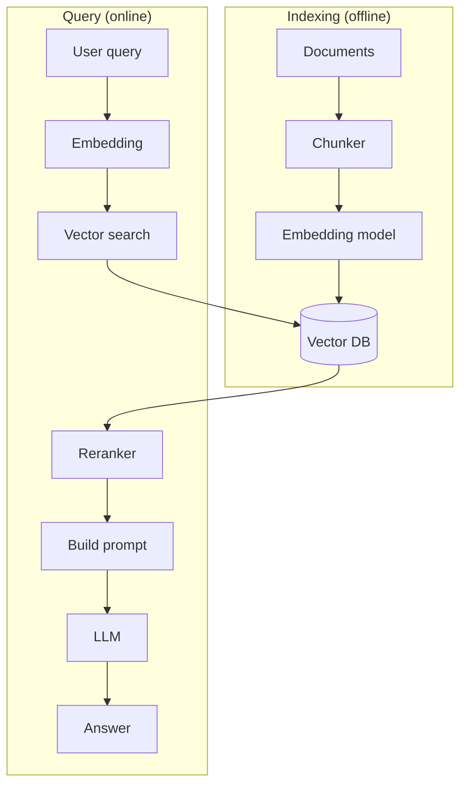

# Вопросы на собеседовании: `RAG (Retrieval-Augmented Generation)`

**RAG** — паттерн, при котором LLM **получает релевантные документы** в context перед генерацией ответа. Главный способ дать модели **специфичные знания** (документация компании, knowledge base) без fine-tuning. Стек: chunking → embeddings → vector DB → retrieval → reranking → LLM. Появился в 2020, стал mainstream в 2023.

## Полезные ссылки

### Официальная документация и авторитетные источники

- [RAG paper (Lewis et al., 2020)](https://arxiv.org/abs/2005.11401)
- [LangChain RAG Documentation](https://python.langchain.com/docs/use_cases/question_answering/)
- [LlamaIndex RAG Guide](https://docs.llamaindex.ai/en/stable/optimizing/production_rag/)
- [Anthropic Contextual Retrieval](https://www.anthropic.com/news/contextual-retrieval)
- [Cohere RAG Guide](https://docs.cohere.com/docs/retrieval-augmented-generation-rag)
- [HyDE Paper](https://arxiv.org/abs/2212.10496)
- [Self-RAG Paper](https://arxiv.org/abs/2310.11511)

## Содержание

- [Полезные ссылки](#полезные-ссылки)
- [See also](#see-also)

**Базовые понятия**
- [Q1. (!) Что такое RAG?](#q1--что-такое-rag)
- [Q2. (!) Зачем RAG если можно просто давать всё в context?](#q2--зачем-rag-если-можно-просто-давать-всё-в-context)
- [Q3. (!) Чем RAG отличается от fine-tuning?](#q3--чем-rag-отличается-от-fine-tuning)
- [Q4. Архитектура RAG системы?](#q4-архитектура-rag-системы)

**Indexing pipeline**
- [Q5. (!) Loading документов?](#q5--loading-документов)
- [Q6. (!) Chunking — что это и как делать?](#q6--chunking--что-это-и-как-делать)
- [Q7. (!) Размер chunk — как выбрать?](#q7--размер-chunk--как-выбрать)
- [Q8. Overlap между chunks?](#q8-overlap-между-chunks)
- [Q9. (!) Metadata в chunks?](#q9--metadata-в-chunks)
- [Q10. Embeddings — генерация для chunks?](#q10-embeddings--генерация-для-chunks)

**Retrieval**
- [Q11. (!) Vector search (similarity search)?](#q11--vector-search-similarity-search)
- [Q12. (!) k (число retrieved docs) — как выбрать?](#q12--k-число-retrieved-docs--как-выбрать)
- [Q13. (!) Hybrid search (vector + keyword)?](#q13--hybrid-search-vector--keyword)
- [Q14. (!) Reranking — что и зачем?](#q14--reranking--что-и-зачем)
- [Q15. Filters / metadata-based search?](#q15-filters--metadata-based-search)

**Generation**
- [Q16. (!) Prompt template для RAG?](#q16--prompt-template-для-rag)
- [Q17. Citations / sources — как делать?](#q17-citations--sources--как-делать)
- [Q18. Что делать, если retrieval не нашёл ничего?](#q18-что-делать-если-retrieval-не-нашёл-ничего)

**Продвинутые паттерны**
- [Q19. (!) Query rewriting / expansion?](#q19--query-rewriting--expansion)
- [Q20. (!) HyDE (Hypothetical Document Embeddings)?](#q20--hyde-hypothetical-document-embeddings)
- [Q21. Self-RAG — динамическое решение нужен ли retrieval?](#q21-self-rag--динамическое-решение-нужен-ли-retrieval)
- [Q22. Multi-query retrieval?](#q22-multi-query-retrieval)
- [Q23. (!) Contextual Retrieval (Anthropic)?](#q23--contextual-retrieval-anthropic)
- [Q24. (!) GraphRAG?](#q24--graphrag)
- [Q25. Agentic RAG?](#q25-agentic-rag)

**Evaluation**
- [Q26. (!) Как тестировать RAG систему?](#q26--как-тестировать-rag-систему)
- [Q27. (!) Метрики (precision, recall, faithfulness, answer relevance)?](#q27--метрики-precision-recall-faithfulness-answer-relevance)
- [Q28. RAGAS, TruLens?](#q28-ragas-trulens)

**Production**
- [Q29. (!) Какие подводные камни RAG в production?](#q29--какие-подводные-камни-rag-в-production)
- [Q30. Какой стек выбрать (LangChain, LlamaIndex, custom)?](#q30-какой-стек-выбрать-langchain-llamaindex-custom)

## Q1. (!) Что такое RAG?

**RAG (Retrieval-Augmented Generation)** — паттерн, при котором перед вызовом LLM:
1. **Retrieve** релевантные документы из knowledge base
2. **Augment** prompt этими документами
3. **Generate** ответ на основе документов + question

```
User: "Какая политика по отпускам в нашей компании?"
  ↓
Retrieve: vector search в HR documents → top-3 chunks
  ↓
Prompt LLM: "Documents: [chunks]. Question: ... Answer based on documents."
  ↓
Response: "Согласно документу X (стр. 5), сотрудники могут..."
```

**Зачем:**
- Дать LLM **актуальные и приватные** данные
- Уменьшить hallucinations
- Citations (откуда взят ответ)
- Без переобучения модели


> [!mcq]
> - [ ] RAG — это fine-tuning модели на корпусе документов компании | ❌ ПОСЛЕДСТВИЕ: путаница RAG vs fine-tuning, выбор дорогого решения там, где достаточно retrieval.
> - [x] Паттерн: перед вызовом LLM делаем retrieve релевантных chunks → augment prompt → generate ответ с цитатами | ✓ ПРИМЕНЯТЬ: внутренняя документация, knowledge base, актуальные данные 📋 ПРАВИЛО: «Retrieve → Augment → Generate» 🔗 См. Q2
> - [ ] RAG означает дать модели весь корпус документов в context window | ❌ ПОСЛЕДСТВИЕ: упирается в context limit, дорого по tokens, lost-in-the-middle.
> - [ ] RAG — это кэширование ответов LLM в Redis для повторных вопросов | ❌ ПОСЛЕДСТВИЕ: путаница с semantic cache, нет работы с приватными данными.

## Q2. (!) Зачем RAG если можно просто давать всё в context?

**Проблемы "все в context":**

1. **Context limit** — даже 1M tokens не хватает на TBs документов
2. **Cost** — больше tokens = дороже
3. **Latency** — большой context медленнее обрабатывается
4. **"Lost in the middle"** — модели хуже находят информацию в середине context
5. **Отсутствие фильтрации** — модель видит много нерелевантного

**RAG решает:** даёт **только релевантные** chunks (3-10 штук), вместо всего корпуса.


> [!mcq]
> - [ ] При 1M tokens context можно положить всю базу — RAG не нужен | ❌ ПОСЛЕДСТВИЕ: TBs документации не влезает, cost растёт линейно, latency страдает.
> - [ ] Если модель достаточно умная, context-фильтрация лишняя | ❌ ПОСЛЕДСТВИЕ: «lost in the middle» — модель пропускает важное в середине большого prompt.
> - [x] Context limit конечен, большой prompt дорог и медленен, «lost in the middle» снижает качество — RAG даёт топ-3..10 релевантных chunks | ✓ ПРИМЕНЯТЬ: при корпусе >100k tokens 📋 ПРАВИЛО: «меньше токенов → точнее ответ» 🔗 См. Q3
> - [ ] RAG нужен только потому что модели не умеют отвечать без шпаргалки | ❌ ПОСЛЕДСТВИЕ: упрощение, игнорирует cost/latency/lost-in-the-middle.

## Q3. (!) Чем RAG отличается от fine-tuning?

| Критерий | RAG | Fine-tuning |
|----------|-----|-------------|
| Что меняет | Контент в prompt | Параметры модели |
| Свежесть данных | Real-time (обновил vector DB) | Frozen (нужно retrain) |
| Cost | Per-query (vector search + LLM) | One-time training + cheaper inference |
| Сложность setup | Средняя | Высокая |
| Источники цитирования | Легко (есть chunks) | Нет (модель "знает") |
| Privacy | Локальные docs не уходят в OpenAI | Аналогично |
| Изменения модели | Легко поменять (RAG works с любой LLM) | Привязан к конкретной модели |

**Best practice:** для большинства задач — **RAG**. Fine-tuning — для **style** (как писать) и **special skills** (классификация). Часто **combine** оба.


> [!mcq]
> - [x] RAG меняет контент в prompt (свежие данные онлайн, citations), fine-tuning меняет веса модели (style, формат) | ✓ ПРИМЕНЯТЬ: RAG для знаний, fine-tuning для стиля 📋 ПРАВИЛО: «знания → RAG, поведение → fine-tune» 🔗 См. Q4
> - [ ] RAG и fine-tuning делают одно и то же, выбор зависит от моды | ❌ ПОСЛЕДСТВИЕ: дорогостоящий retrain там, где достаточно обновить vector DB.
> - [ ] Fine-tuning всегда даёт более актуальные ответы, чем RAG | ❌ ПОСЛЕДСТВИЕ: knowledge cutoff фиксируется на момент обучения, нет real-time updates.
> - [ ] RAG требует переобучения модели при добавлении документов | ❌ ПОСЛЕДСТВИЕ: путаница механизмов, потеря главного преимущества RAG.

## Q4. Архитектура RAG системы?



**Compoenents:**
1. **Chunker** — разбивает документы
2. **Embedder** — text → vector
3. **Vector DB** — хранит embeddings
4. **Retriever** — finds top-k similar
5. **Reranker** (optional) — точная ранжировка
6. **Prompt builder** — формирует prompt
7. **LLM** — генерирует ответ


> [!mcq]
> - [ ] Достаточно одного компонента — vector DB; остальное это «обёртки» | ❌ ПОСЛЕДСТВИЕ: без chunker/embedder/reranker качество retrieval разваливается.
> - [ ] Reranker и retriever — синонимы, можно опустить один | ❌ ПОСЛЕДСТВИЕ: путаница ролей, нет точной ранжировки top-k.
> - [x] Indexing (chunker → embedder → vector DB) + query (embed → retrieve → rerank → prompt → LLM) — 7 компонентов | ✓ ПРИМЕНЯТЬ: production RAG 📋 ПРАВИЛО: «offline indexing, online retrieval» 🔗 См. Q5
> - [ ] LLM сама делает retrieval, vector DB не нужен | ❌ ПОСЛЕДСТВИЕ: confusion — модель не имеет доступа к корпусу без retrieval layer.

## Q5. (!) Loading документов?

**Источники:**
- PDF, Word, Markdown, HTML
- Confluence, Notion, Google Docs
- Slack, Discord history
- GitHub repos
- Database tables, structured data
- Audio (через transcription) → text

**Tools:**
- **Unstructured** — multi-format parser
- **PyMuPDF, pdfplumber** — PDF
- **BeautifulSoup, trafilatura** — HTML
- **Docling** (IBM) — современный multi-format

**Подвох:** парсеры по-разному обрабатывают tables, images, footnotes. Quality of parsing critically важен для RAG.


> [!mcq]
> - [ ] Любой PDF-парсер даёт одинаковое качество, выбор не влияет | ❌ ПОСЛЕДСТВИЕ: tables/footnotes/images теряются — мусор на retrieval, hallucinations.
> - [x] Quality of parsing (Unstructured, Docling, PyMuPDF) critically важно: tables, images, footnotes — частая причина мусора в индексе | ✓ ПРИМЕНЯТЬ: PDF/HTML/Confluence pipelines 📋 ПРАВИЛО: «garbage in → garbage out» 🔗 См. Q6
> - [ ] Достаточно скачивать только plain text, всё остальное лишнее | ❌ ПОСЛЕДСТВИЕ: теряются заголовки, таблицы и структура — падает recall.
> - [ ] Audio/video нельзя индексировать в RAG | ❌ ПОСЛЕДСТВИЕ: упускаем источник; через transcription audio становится полноправным input.

## Q6. (!) Chunking — что это и как делать?

**Chunking** — разбивка документов на маленькие куски (chunks) для индексации.

**Стратегии:**

1. **Fixed-size** — N tokens / N chars
2. **Recursive** — splits по separator hierarchy ("\n\n", "\n", ". ", " ")
3. **Semantic chunking** — по смысловым границам (через embedding similarity)
4. **Markdown-aware** — sections, headers
5. **Code-aware** — functions, classes
6. **Sentence-based** — по предложениям

```python
# LangChain RecursiveCharacterTextSplitter
splitter = RecursiveCharacterTextSplitter(
    chunk_size=1000,
    chunk_overlap=200,
    separators=["\n\n", "\n", ". ", " ", ""]
)
chunks = splitter.split_text(document)
```

**Critical:** хороший chunking — половина успеха RAG.


> [!mcq]
> - [x] Стратегии: fixed-size, recursive (по separator hierarchy), semantic, markdown-aware, code-aware — выбор по типу контента | ✓ ПРИМЕНЯТЬ: docs → recursive, code → code-aware 📋 ПРАВИЛО: «chunk по структуре документа» 🔗 См. Q7
> - [ ] Достаточно резать каждые 1000 символов — chunk-стратегия не важна | ❌ ПОСЛЕДСТВИЕ: разрываются предложения и таблицы, теряется смысл.
> - [ ] Chunking — это deprecated, современные RAG работают на полных документах | ❌ ПОСЛЕДСТВИЕ: vector DB не индексирует мегаобъекты эффективно, retrieval теряет precision.
> - [ ] Лучший chunking — один chunk = весь документ | ❌ ПОСЛЕДСТВИЕ: топ-k возвращает гигантские блоки, prompt раздувается, lost-in-the-middle.

## Q7. (!) Размер chunk — как выбрать?

**Trade-off:**
- **Маленькие** chunks (200-500 tokens) — точный retrieval, но мало context
- **Большие** chunks (1000-2000 tokens) — больше context, но менее precise

**Рекомендации:**
- **Q&A на конкретные facts:** 200-500 tokens
- **Длинные ответы / synthesis:** 800-1500 tokens
- **Code:** function/class boundaries
- **Tables / structured:** keep table whole

**Эксперимент** — нет one-size-fits-all. Тестируй с **golden dataset**.


> [!mcq]
> - [ ] Размер chunk не имеет значения — embedding всё уладит | ❌ ПОСЛЕДСТВИЕ: маленькие → нет context, большие → размытые embeddings, плохой recall.
> - [ ] Чем больше chunk, тем точнее retrieval — всегда брать 4k tokens | ❌ ПОСЛЕДСТВИЕ: вектор «усредняется», теряется precision топика.
> - [x] Trade-off: Q&A на facts → 200-500 tokens, synthesis → 800-1500, code → по function/class; подбирать на golden dataset | ✓ ПРИМЕНЯТЬ: эксперимент с метриками 📋 ПРАВИЛО: «маленький chunk → precision, большой → context» 🔗 См. Q8
> - [ ] Есть универсальный оптимальный размер — 512 tokens для всех задач | ❌ ПОСЛЕДСТВИЕ: игнорирует природу данных и query.

## Q8. Overlap между chunks?

```
Chunk 1: tokens 0-1000
Chunk 2: tokens 800-1800  (200 token overlap)
Chunk 3: tokens 1600-2600
```

**Зачем:** информация на границах chunks не теряется.

**Размер overlap:** обычно **10-20%** от chunk size (100-300 tokens).

**Trade-off:** больше overlap = больше storage, больше cost.


> [!mcq]
> - [ ] Overlap не нужен — chunks независимы | ❌ ПОСЛЕДСТВИЕ: предложение, разорванное между chunks, теряется в retrieval.
> - [ ] Overlap 80-100% — чем больше тем лучше | ❌ ПОСЛЕДСТВИЕ: дубли в storage и в top-k, cost растёт без выигрыша.
> - [ ] Overlap делается случайно, без правил | ❌ ПОСЛЕДСТВИЕ: непредсказуемое качество, тяжело отлаживать.
> - [x] 10-20% от chunk size (100-300 tokens) — чтобы информация на границах не терялась, при этом без избытка | ✓ ПРИМЕНЯТЬ: дефолт 15% 📋 ПРАВИЛО: «overlap = страховка границ» 🔗 См. Q9

## Q9. (!) Metadata в chunks?

```python
chunk = {
    "text": "...",
    "embedding": [0.12, -0.45, ...],
    "metadata": {
        "source": "policy_2025.pdf",
        "page": 5,
        "section": "Vacation Policy",
        "date": "2025-01-15",
        "department": "HR",
        "language": "en"
    }
}
```

**Зачем metadata:**
- **Filtering** — "только HR documents" / "за 2025 год"
- **Citations** — return source в ответе
- **Multi-tenancy** — фильтр по `tenant_id`
- **Hybrid search** — combine vector + metadata filters

Vector DBs поддерживают metadata filters: Pinecone, Weaviate, Qdrant.


> [!mcq]
> - [x] Metadata (source, page, section, date, department, tenant_id) даёт filtering, citations, multi-tenancy и hybrid search | ✓ ПРИМЕНЯТЬ: всегда добавляй source+date 📋 ПРАВИЛО: «без metadata нет citations» 🔗 См. Q10
> - [ ] Metadata не нужны — embedding хранит всю информацию | ❌ ПОСЛЕДСТВИЕ: нельзя фильтровать «только HR/2025», нет цитат в ответе.
> - [ ] Достаточно хранить только текст chunk без полей | ❌ ПОСЛЕДСТВИЕ: невозможно multi-tenancy, в ответе нет ссылок на источник.
> - [ ] Vector DB не поддерживают metadata filters | ❌ ПОСЛЕДСТВИЕ: ложное утверждение — Pinecone/Weaviate/Qdrant поддерживают.

## Q10. Embeddings — генерация для chunks?

```python
from openai import OpenAI
client = OpenAI()

# OpenAI embeddings
response = client.embeddings.create(
    model="text-embedding-3-large",
    input=chunk_text
)
vector = response.data[0].embedding  # 3072-dim вектор

# Сохраняем в vector DB вместе с metadata
```

**Embedding models:**
- **OpenAI** `text-embedding-3-large` (3072d), `text-embedding-3-small` (1536d)
- **Cohere** embed-english-v3 (1024d)
- **Voyage AI** (specialized для RAG)
- **Open-source:** sentence-transformers (`all-MiniLM-L6-v2`, `bge-large`)

Подробнее — в [Embeddings](embeddings-interview.md).


> [!mcq]
> - [ ] Embeddings — это сжатие исходного текста с потерями для экономии storage | ❌ ПОСЛЕДСТВИЕ: путаница с zip/parquet, неверное использование dim-размерности.
> - [ ] Любая embedding-модель подходит для любого языка/домена | ❌ ПОСЛЕДСТВИЕ: английский all-MiniLM на русском корпусе → плохой recall.
> - [x] Embedding-модель (OpenAI text-embedding-3-large, Cohere, Voyage, sentence-transformers) превращает chunk в вектор фиксированной размерности | ✓ ПРИМЕНЯТЬ: подбор модели по языку/домену 📋 ПРАВИЛО: «одна модель для index и query» 🔗 См. Q11
> - [ ] Embeddings должны генерироваться разными моделями для query и для chunks | ❌ ПОСЛЕДСТВИЕ: несовместимые пространства, similarity не работает.

## Q11. (!) Vector search (similarity search)?

```python
# 1. Embed query
query_emb = embedder.embed("Сколько дней отпуска?")

# 2. Search в vector DB
results = vector_db.search(
    vector=query_emb,
    top_k=5,
    filter={"department": "HR"}
)

# 3. Получаем top-5 chunks с similarity scores
for result in results:
    print(result.text, result.score)
```

**Метрики similarity:**
- **Cosine similarity** — самая частая (нечувствительна к magnitude)
- **Dot product** — быстрее (если вектора нормализованы — равно cosine)
- **Euclidean distance** — менее частая

**Под капотом** — ANN (Approximate Nearest Neighbor) algorithms: HNSW, IVF, ScaNN. Подробнее — [Vector Databases](vector-databases-interview.md).


> [!mcq]
> - [ ] Vector search = exact nearest neighbor по полному корпусу | ❌ ПОСЛЕДСТВИЕ: ожидание O(N) корректности, а ANN-индекс возвращает приближение.
> - [x] Vector search использует ANN (HNSW/IVF/ScaNN) + cosine/dot-product поверх embeddings, top-k быстрых приближённых ближайших соседей | ✓ ПРИМЕНЯТЬ: production-уровень latency 📋 ПРАВИЛО: «cosine для нормализованных, dot быстрее» 🔗 См. Q12
> - [ ] Distance metric не влияет на качество — все одинаковы | ❌ ПОСЛЕДСТВИЕ: для модели, обученной на cosine, euclidean даёт мусор.
> - [ ] Vector DB всегда делает full scan, ANN — это маркетинг | ❌ ПОСЛЕДСТВИЕ: ложная картина latency и стоимости.

## Q12. (!) k (число retrieved docs) — как выбрать?

**Trade-off:**
- **Маленькое k** (3-5) — быстро, мало context, рискуем потерять релевантное
- **Большое k** (10-20) — больше шанса найти, больше cost, "lost in the middle"

**Best practice:**
- Базовая RAG: **k=5**
- С reranking: **retrieve k=20-50, rerank → top 5**
- С большим context (Claude 200K): **k=15-30**


> [!mcq]
> - [ ] Брать максимально возможный k=200, чтобы ничего не упустить | ❌ ПОСЛЕДСТВИЕ: prompt раздувается, «lost in the middle», cost x40.
> - [ ] k=1 — самый точный ответ всегда | ❌ ПОСЛЕДСТВИЕ: при одной ошибке retrieval — ответ невозможен.
> - [x] Base RAG k=5; с reranker — retrieve k=20-50 → top-5; с big context — k=15-30 | ✓ ПРИМЕНЯТЬ: подбирать через golden set 📋 ПРАВИЛО: «retrieve много, rerank в top-5» 🔗 См. Q13
> - [ ] k нужно выбирать случайно при каждом запросе | ❌ ПОСЛЕДСТВИЕ: непредсказуемое качество, невозможно отладить.

## Q13. (!) Hybrid search (vector + keyword)?

**Vector search** хорош для семантики. **Keyword search** (BM25) хорош для exact matches.

**Hybrid:**
1. Vector search → top-50
2. BM25 keyword search → top-50
3. **Reciprocal Rank Fusion (RRF)** или weighted merge

```python
def rrf(rankings, k=60):
    scores = {}
    for ranking in rankings:
        for i, doc in enumerate(ranking):
            scores[doc] = scores.get(doc, 0) + 1 / (k + i)
    return sorted(scores.items(), key=lambda x: -x[1])
```

**Когда нужен hybrid:**
- Технические термины, names, IDs (BM25 лучше)
- Code search
- Compliance / legal (точные термины)

Поддерживают: Weaviate, Qdrant, Elasticsearch, Pinecone.


> [!mcq]
> - [x] Hybrid = vector (semantics) + BM25 (keyword) → merge через RRF; помогает для names/IDs/legal/code | ✓ ПРИМЕНЯТЬ: технический корпус, compliance 📋 ПРАВИЛО: «RRF мирит две метрики» 🔗 См. Q14
> - [ ] Vector search всегда лучше BM25, hybrid не нужен | ❌ ПОСЛЕДСТВИЕ: продукт «UUID-1234» теряется — embeddings плохо ловят точные токены.
> - [ ] BM25 устарел и не имеет смысла в 2026 | ❌ ПОСЛЕДСТВИЕ: для exact term-matches BM25 до сих пор бьёт embeddings.
> - [ ] Hybrid означает запустить два LLM-вызова подряд | ❌ ПОСЛЕДСТВИЕ: путаница терминологии, лишняя latency без пользы.

## Q14. (!) Reranking — что и зачем?

**Reranking** — после initial retrieval, **более точная** модель пересматривает порядок.

```
1. Vector search → top-50 candidates (быстро, грубо)
2. Reranker (cross-encoder) → top-5 (медленно, точно)
3. Send top-5 в LLM
```

**Cross-encoder vs bi-encoder:**
- **Bi-encoder** (для embeddings): query и doc embeddings отдельно, потом similarity
- **Cross-encoder** (reranker): берёт `(query, doc)` пару, выдаёт single score — точнее, но медленнее

**Models:**
- **Cohere Rerank** (managed)
- **Jina Reranker**
- **bge-reranker** (open-source)
- **Voyage Rerank**

**Effect:** обычно +10-20% к relevance метрикам. **Always use reranker** в production RAG.


> [!mcq]
> - [ ] Reranker = повторный vector search той же моделью | ❌ ПОСЛЕДСТВИЕ: путаница bi-encoder и cross-encoder, нет прироста relevance.
> - [ ] Reranking бесполезен, embedding достаточно точны | ❌ ПОСЛЕДСТВИЕ: теряем +10-20% relevance, ответы хуже.
> - [x] Cross-encoder reranker (Cohere/Jina/bge-reranker) пересматривает top-50 vector results и выдаёт top-5 точнее | ✓ ПРИМЕНЯТЬ: всегда в production 📋 ПРАВИЛО: «retrieve 50 → rerank 5» 🔗 См. Q15
> - [ ] Reranking увеличивает recall, но не precision | ❌ ПОСЛЕДСТВИЕ: путаница метрик — reranker меняет именно порядок (precision@k).

## Q15. Filters / metadata-based search?

```python
results = vector_db.search(
    vector=query_emb,
    top_k=5,
    filter={
        "tenant_id": "acme_corp",
        "date": {"$gte": "2024-01-01"},
        "language": "en"
    }
)
```

**Применения:**
- **Multi-tenancy** — каждый tenant видит только свои данные
- **Permissions** — только разрешённые docs
- **Time-based** — recent docs
- **Domain filters** — HR vs Engineering

**Подвох:** жёсткие filters могут сильно сузить выбор → no results.


> [!mcq]
> - [ ] Жёсткие filters всегда улучшают качество — добавлять как можно больше | ❌ ПОСЛЕДСТВИЕ: filter-set пустеет, retrieval возвращает 0 docs.
> - [x] Metadata filters (tenant_id, date range, language, department) дают multi-tenancy, permissions и time-based фильтрацию | ✓ ПРИМЕНЯТЬ: SaaS multi-tenant 📋 ПРАВИЛО: «filter ДО vector search» 🔗 См. Q16
> - [ ] Filters обрабатываются после LLM — модель сама фильтрует | ❌ ПОСЛЕДСТВИЕ: лик данных другого tenant, нарушение compliance.
> - [ ] Vector DB не умеют metadata filters — это надо делать в коде | ❌ ПОСЛЕДСТВИЕ: ложно — Pinecone/Qdrant/Weaviate поддерживают.

## Q16. (!) Prompt template для RAG?

```
Ты ассистент компании. Ответь на вопрос пользователя на основе предоставленных документов.
Если ответ не найден в документах, скажи "Не нашёл информации в доступных источниках."
Всегда указывай источник в формате [Source: filename, page X].

<documents>
[Doc 1] policy_2025.pdf, p.5: Сотрудники имеют 28 дней оплачиваемого отпуска...
[Doc 2] handbook.pdf, p.12: Дополнительные дни предоставляются...
</documents>

<question>
{user_question}
</question>

Ответ:
```

**Best practices:**
- Чёткие инструкции (не отвечать без источников)
- Явное разделение docs и question (XML tags / маркеры)
- Запрос на citations
- Instruction "если не знаю — скажи"
- Format ответа


> [!mcq]
> - [ ] Просто склеить chunks с user query в один длинный текст | ❌ ПОСЛЕДСТВИЕ: модель путает инструкции и данные, prompt injection.
> - [x] XML-разделение docs и question + инструкция «не знаю — скажи» + запрос citations + формат | ✓ ПРИМЕНЯТЬ: production RAG prompt 📋 ПРАВИЛО: «инструкции → docs → question → ответ» 🔗 См. Q17
> - [ ] Чем длиннее prompt — тем лучше; помещаем все retrieved 50 docs | ❌ ПОСЛЕДСТВИЕ: lost-in-the-middle, cost x10.
> - [ ] Инструкции в prompt не нужны — модель сама знает что делать | ❌ ПОСЛЕДСТВИЕ: hallucinations без явного «если не знаешь — скажи».

## Q17. Citations / sources — как делать?

**Подходы:**

1. **Inline citations:** "Согласно [policy_2025.pdf:5], сотрудники..."
2. **References секция:** "...текст ответа.\n\nSources: [1] policy_2025.pdf, [2] handbook.pdf"
3. **Structured output:** JSON `{"answer": "...", "sources": [{"doc": "...", "page": 5}]}`

**Verification:** после генерации проверить, что **все факты в ответе** действительно в retrieved docs (через secondary LLM или string matching).

```python
# Anthropic Claude — нативная поддержка citations
response = client.messages.create(
    model="claude-opus-4-5",
    messages=[{"role": "user", "content": [
        {"type": "document", "source": doc_data, "citations": {"enabled": true}},
        {"type": "text", "text": question}
    ]}]
)
# response.content включает сгенерированные citations
```


> [!mcq]
> - [x] Inline / references / structured JSON + verification что факт реально в retrieved docs (Claude citations API) | ✓ ПРИМЕНЯТЬ: legal/medical/finance 📋 ПРАВИЛО: «citation = доказательство» 🔗 См. Q18
> - [ ] LLM сам придумает источники, проверять не нужно | ❌ ПОСЛЕДСТВИЕ: hallucinated citations, юридические риски.
> - [ ] Citations работают только если модель fine-tuned | ❌ ПОСЛЕДСТВИЕ: упускаем нативную поддержку Anthropic citations API.
> - [ ] Достаточно URL в ответе без verification | ❌ ПОСЛЕДСТВИЕ: модель цитирует, но цитата не соответствует тексту chunk.

## Q18. Что делать, если retrieval не нашёл ничего?

**Scenarios:**
1. **Empty retrieval results** (например, threshold не пройден)
2. **Retrieved docs не содержат ответ** (LLM сам распознаёт)

**Стратегии:**
- LLM говорит "Не знаю" (instruction в prompt)
- **Fallback** — общий LLM ответ без RAG (с дисклеймером)
- **Query rewriting** — может user спросил неудачно?
- **Web search** fallback (если разрешено)
- **Escalation** к human (для chatbots)
- **Return empty** + предложить уточнить

**Не давать ложных уверенных ответов** — это потеря trust.


> [!mcq]
> - [ ] Если retrieval пустой — пусть LLM фантазирует из своего training knowledge | ❌ ПОСЛЕДСТВИЕ: hallucinations, потеря trust пользователя.
> - [x] Скажи «не нашёл», предложи переформулировать, query rewrite, fallback на web search или эскалация human | ✓ ПРИМЕНЯТЬ: graceful degradation 📋 ПРАВИЛО: «не знаешь — не выдумывай» 🔗 См. Q19
> - [ ] Всегда возвращать top-1 даже при очень низком similarity score | ❌ ПОСЛЕДСТВИЕ: уверенный неверный ответ на основе нерелевантного chunk.
> - [ ] Падать с 500 ошибкой, чтобы пользователь повторил | ❌ ПОСЛЕДСТВИЕ: ужасный UX, не решает корень проблемы.

## Q19. (!) Query rewriting / expansion?

Иногда query пользователя плохой для retrieval.

```
User: "Сколько отпуск?"
Bad для retrieval (мало контекста)

→ LLM rewrite: "Какова продолжительность ежегодного оплачиваемого отпуска для сотрудников?"
→ Лучше для vector search
```

**Multi-query:**

```python
# LLM генерирует 3-5 вариантов query
queries = [
    "Сколько дней отпуска у сотрудников?",
    "Vacation policy duration",
    "Annual leave entitlement"
]
results = []
for q in queries:
    results.extend(vector_db.search(embed(q), top_k=5))
deduplicated = dedupe(results)
```

**Query expansion** — добавить synonyms, related terms.


> [!mcq]
> - [x] LLM переписывает короткий/неясный query в развёрнутый, или генерирует N reformulations (multi-query) → выше recall | ✓ ПРИМЕНЯТЬ: chatbot с короткими вопросами 📋 ПРАВИЛО: «уточняй query до retrieval» 🔗 См. Q20
> - [ ] Query rewriting вреден — пользователь знает что спрашивает | ❌ ПОСЛЕДСТВИЕ: «сколько отпуск?» не найдёт документ «vacation policy».
> - [ ] Достаточно отправить query в vector search как есть | ❌ ПОСЛЕДСТВИЕ: короткие запросы дают плохое embedding, низкий recall.
> - [ ] Query expansion = добавить случайные слова в запрос | ❌ ПОСЛЕДСТВИЕ: шум в embedding, ещё хуже retrieval.

## Q20. (!) HyDE (Hypothetical Document Embeddings)?

**Идея:** вместо embed query — попросить LLM **сгенерировать hypothetical answer**, и embed его.

```
User query: "Какая политика по удалёнке?"
  ↓ LLM generates hypothetical answer
"В компании разрешена удалённая работа. Сотрудники могут работать..."
  ↓ embed hypothetical answer
  ↓ vector search
```

**Зачем:** hypothetical answer семантически ближе к **актуальным документам**, чем сама query (queries обычно короткие, документы длинные).

**Trade-off:** один extra LLM call. Но улучшает recall в 10-20% случаев.


> [!mcq]
> - [ ] HyDE embeds сам query, как обычно | ❌ ПОСЛЕДСТВИЕ: путаница — это просто vanilla retrieval, не HyDE.
> - [ ] HyDE — это fine-tuning embedding модели | ❌ ПОСЛЕДСТВИЕ: путаница со специализированной embedder, а это inference-time трюк.
> - [x] LLM генерирует hypothetical answer для query, embeds его — семантически ближе к документам, recall +10-20% | ✓ ПРИМЕНЯТЬ: короткие/абстрактные queries 📋 ПРАВИЛО: «embed ответ, а не вопрос» 🔗 См. Q21
> - [ ] HyDE требует переиндексировать корпус | ❌ ПОСЛЕДСТВИЕ: индекс остаётся прежним, меняется только query-side.

## Q21. Self-RAG — динамическое решение нужен ли retrieval?

**Self-RAG** — LLM сама решает, нужен ли retrieval (special tokens).

```
[Retrieve] → trigger retrieval
[No-Retrieve] → ответить из training knowledge
[Relevant] → этот retrieved doc релевантен
[Irrelevant] → пропустить
```

Заменяет always-retrieve подход. Полезно для **открытых вопросов** (когда retrieval может ничего не дать).

Требует **fine-tuned LLM** (специально обученный распознавать эти tokens).


> [!mcq]
> - [ ] Self-RAG = всегда делать retrieval, просто другая обёртка | ❌ ПОСЛЕДСТВИЕ: теряем главную идею — динамический skip.
> - [x] LLM сама решает retrieve/no-retrieve и relevant/irrelevant через special tokens (нужна fine-tuned модель) | ✓ ПРИМЕНЯТЬ: open-domain Q&A 📋 ПРАВИЛО: «retrieve по необходимости» 🔗 См. Q22
> - [ ] Self-RAG работает с любой LLM out-of-the-box | ❌ ПОСЛЕДСТВИЕ: без fine-tuning модель не понимает special tokens.
> - [ ] Self-RAG отключает все citations | ❌ ПОСЛЕДСТВИЕ: ложное утверждение, citations остаются для retrieved-цепочек.

## Q22. Multi-query retrieval?

LLM генерирует **несколько reformulations** query → retrieve по каждой → merge.

```python
queries = llm.generate_queries(original_query, n=5)
all_results = []
for q in queries:
    all_results.extend(vector_db.search(embed(q), top_k=5))
final = dedupe_and_rerank(all_results)
```

Improves **recall** для ambiguous queries.


> [!mcq]
> - [x] LLM генерирует N reformulations original query → retrieve по каждой → dedupe + rerank, повышает recall для ambiguous queries | ✓ ПРИМЕНЯТЬ: chat-Q&A с разными формулировками 📋 ПРАВИЛО: «N запросов > 1 запроса» 🔗 См. Q23
> - [ ] Multi-query = делать тот же query несколько раз | ❌ ПОСЛЕДСТВИЕ: одинаковые результаты, нулевой выигрыш в recall.
> - [ ] Multi-query увеличивает precision, не recall | ❌ ПОСЛЕДСТВИЕ: путаница метрик — он улучшает именно recall.
> - [ ] Multi-query можно делать только в Pinecone | ❌ ПОСЛЕДСТВИЕ: ложное утверждение — это паттерн на уровне приложения.

## Q23. (!) Contextual Retrieval (Anthropic)?

**Anthropic Contextual Retrieval** (2024) — улучшение embeddings через **chunk context**.

**Идея:** перед embed каждого chunk — попросить Claude **сгенерировать short context**:

```
Original chunk: "...this transaction was reversed."

Context (Claude generates):
"This is from Q3 2024 financial report, section on customer refunds.
The transaction refers to..."

Combined для embedding:
[Context] + [Original chunk]
```

**Эффект:** retrieval faliure rate снижается **на 49%** (по measurement Anthropic).

Cost: Claude API для генерации context на каждый chunk (можно делать batch). Но prompt caching делает это дёшево.


> [!mcq]
> - [ ] Embedding одинаковых chunks не зависит от контекста — Contextual Retrieval бесполезен | ❌ ПОСЛЕДСТВИЕ: упускаем 49% retrieval failure rate reduction.
> - [x] Перед embed Claude генерирует короткий context для каждого chunk → склейка [context]+[chunk] → embed; +49% точности (Anthropic) | ✓ ПРИМЕНЯТЬ: финансовые/legal отчёты 📋 ПРАВИЛО: «обогащай chunks контекстом» 🔗 См. Q24
> - [ ] Contextual Retrieval = просто увеличить chunk size | ❌ ПОСЛЕДСТВИЕ: путаница, основная идея — LLM-обогащение каждого chunk.
> - [ ] Contextual Retrieval работает без prompt caching и поэтому неоправданно дорог | ❌ ПОСЛЕДСТВИЕ: prompt caching делает решение дёшевым в batch.

## Q24. (!) GraphRAG?

**GraphRAG** (Microsoft, 2024) — RAG поверх **knowledge graph**, не просто vector search.

**Pipeline:**
1. **LLM extracts entities and relationships** из документов → graph
2. **Cluster graph** в communities
3. **LLM generates summaries** для каждой community
4. При query — retrieve relevant communities + entities

**Зачем:** для вопросов **глобального уровня** ("в чём основные темы документа?"), где обычный RAG плох (видит только chunks, не overall structure).

**Минус:** дорого построить (много LLM calls для extraction).

В **2025** — растущая адопция в enterprise.


> [!mcq]
> - [ ] GraphRAG — это просто vector search в Neo4j | ❌ ПОСЛЕДСТВИЕ: путаница терминов, нет ключевой части — community summaries.
> - [x] LLM извлекает entities + relationships → graph → community clustering → summaries; для global-level вопросов «о чём весь корпус» | ✓ ПРИМЕНЯТЬ: enterprise reports, исследования 📋 ПРАВИЛО: «GraphRAG — для thematic queries» 🔗 См. Q25
> - [ ] GraphRAG всегда дешевле классического RAG | ❌ ПОСЛЕДСТВИЕ: ложно — extraction дорог в инициализации.
> - [ ] GraphRAG заменяет vector search полностью | ❌ ПОСЛЕДСТВИЕ: на практике их комбинируют — chunks + graph.

## Q25. Agentic RAG?

**Agentic RAG** — LLM как **agent**, который может:
- Решать когда retrieve
- Из каких источников retrieve (несколько vector DBs)
- Reformulate queries
- Verify результаты
- Re-retrieve если нужно

```python
# Псевдо-код
def agentic_rag(query):
    while not satisfied:
        decision = llm.decide_action(query, context)
        if decision == "retrieve":
            chunks = retrieve(query, source=decision.source)
            context.append(chunks)
        elif decision == "rewrite":
            query = llm.rewrite(query, feedback)
        elif decision == "answer":
            return llm.answer(query, context)
```

Подробнее — в [AI Agents](ai-agents-interview.md).


> [!mcq]
> - [x] LLM-агент сам решает retrieve/rewrite/answer, выбирает источник, валидирует и re-retrieves в цикле | ✓ ПРИМЕНЯТЬ: сложные multi-hop вопросы 📋 ПРАВИЛО: «retrieve — это tool, а не constant» 🔗 См. Q26
> - [ ] Agentic RAG = одна функция retrieve, вызванная два раза | ❌ ПОСЛЕДСТВИЕ: упрощение — теряется decision-loop.
> - [ ] Agentic RAG медленнее, поэтому никогда не нужен | ❌ ПОСЛЕДСТВИЕ: для multi-hop вопросов даёт ответы, недоступные одношаговому RAG.
> - [ ] Agentic RAG работает только с GPT-4 | ❌ ПОСЛЕДСТВИЕ: ложно — подходит любая модель с tool-calling.

## Q26. (!) Как тестировать RAG систему?

**Golden dataset** — manually curated `(question, expected_answer, source_chunks)`:

```json
{
  "question": "Сколько дней отпуска?",
  "expected_answer": "28 дней",
  "expected_sources": ["policy_2025.pdf:5"],
  "topics": ["HR", "vacation"]
}
```

**Тестируем:**
1. **Retrieval** — нашли ли expected_sources среди retrieved chunks?
2. **Generation** — содержит ли answer expected_answer?
3. **Faithfulness** — все ли утверждения в answer основаны на retrieved chunks?
4. **Answer relevance** — отвечает ли на question?

**LLM-as-judge** — другая LLM оценивает quality (с rubric).


> [!mcq]
> - [ ] Достаточно посмотреть несколько ответов вручную — golden dataset не нужен | ❌ ПОСЛЕДСТВИЕ: regressions проходят незамеченно, нет baseline.
> - [x] Golden dataset (question, expected_answer, expected_sources) + retrieval/generation/faithfulness + LLM-as-judge | ✓ ПРИМЕНЯТЬ: continuous evaluation 📋 ПРАВИЛО: «golden set до production» 🔗 См. Q27
> - [ ] Тесты RAG = unit tests кода retriever | ❌ ПОСЛЕДСТВИЕ: проверяем код, но не качество ответов модели.
> - [ ] Можно тестировать RAG только с реальными пользователями | ❌ ПОСЛЕДСТВИЕ: deploy в проде ловит регрессии слишком поздно.

## Q27. (!) Метрики (precision, recall, faithfulness, answer relevance)?

**Retrieval metrics:**
- **Precision@k** — какая доля retrieved chunks релевантна?
- **Recall@k** — какая доля релевантных chunks была retrieved?
- **MRR (Mean Reciprocal Rank)** — насколько высоко в списке релевантный?
- **NDCG** — discounted cumulative gain

**Generation metrics:**
- **Faithfulness** — не выдумала ли модель факты?
- **Answer relevance** — отвечает ли на question?
- **Context utilization** — использовала ли retrieved chunks?
- **Answer correctness** — правильный ли факт?


> [!mcq]
> - [ ] Достаточно одной метрики «accuracy» для RAG | ❌ ПОСЛЕДСТВИЕ: не отделить плохой retrieval от плохой generation.
> - [ ] Precision и Recall — синонимы | ❌ ПОСЛЕДСТВИЕ: путаница «доля релевантного в ответе» и «доля найденного из всего релевантного».
> - [x] Retrieval: precision@k, recall@k, MRR, NDCG; generation: faithfulness, answer relevance, correctness, context utilization | ✓ ПРИМЕНЯТЬ: разделять метрики ретривера и генератора 📋 ПРАВИЛО: «лечи retriever и LLM отдельно» 🔗 См. Q28
> - [ ] Faithfulness и answer relevance — это одно и то же | ❌ ПОСЛЕДСТВИЕ: faithfulness про hallucinations, relevance про ответ на вопрос.

## Q28. RAGAS, TruLens?

**RAGAS** — Python framework для evaluation RAG:

```python
from ragas import evaluate
from ragas.metrics import faithfulness, answer_relevancy, context_precision

result = evaluate(
    dataset,  # questions, answers, contexts
    metrics=[faithfulness, answer_relevancy, context_precision]
)
```

**TruLens** — observability + evaluation для LLM/RAG. Tracking, dashboards.

**Phoenix (Arize)** — open-source LLM observability.

В **production RAG** — обязательно непрерывная evaluation. Без неё не понять, deteriorate ли система.


> [!mcq]
> - [x] RAGAS (faithfulness, context_precision, answer_relevancy) + TruLens/Phoenix для observability — стандарт continuous eval | ✓ ПРИМЕНЯТЬ: каждый deploy 📋 ПРАВИЛО: «без eval нет продакшна» 🔗 См. Q29
> - [ ] Можно мониторить только latency и cost, без качества | ❌ ПОСЛЕДСТВИЕ: тихая деградация качества при изменении данных.
> - [ ] RAGAS работает только с OpenAI | ❌ ПОСЛЕДСТВИЕ: ложно — поддерживает разных провайдеров.
> - [ ] Production RAG не требует evaluation после deploy | ❌ ПОСЛЕДСТВИЕ: drift в данных и модели приводит к незамеченной регрессии.

## Q29. (!) Какие подводные камни RAG в production?

1. **Bad chunking** — теряется context, splits sentences
2. **Embedding model mismatch** — query embedding vs doc embedding (разные models)
3. **Stale data** — vector DB не synced с источниками
4. **Multi-tenancy leak** — RAG возвращает чужие data
5. **Hallucinations** — даже с RAG модель может выдумывать
6. **Cost runaway** — каждый query = embedding + retrieval + LLM
7. **Slow retrieval** — большая vector DB без индексов
8. **Too many docs in context** — модель путается ("lost in the middle")
9. **Prompt injection** — через документы (instructions внутри)
10. **No evaluation** — не знаем quality, regressions проходят незамеченно


> [!mcq]
> - [ ] Если индекс построен, ничего не сломается — RAG self-healing | ❌ ПОСЛЕДСТВИЕ: stale data, multi-tenancy leak остаются.
> - [x] Bad chunking, embedding mismatch, stale data, multi-tenancy leak, hallucinations, prompt injection через docs, нет evaluation | ✓ ПРИМЕНЯТЬ: чек-лист RAG production-readiness 📋 ПРАВИЛО: «10 подводных камней — проверь все» 🔗 См. Q30
> - [ ] Главный риск RAG — недостаточно мощная LLM | ❌ ПОСЛЕДСТВИЕ: смещает фокус с retrieval/data quality, где обычно главные баги.
> - [ ] Prompt injection невозможен через retrieved документы | ❌ ПОСЛЕДСТВИЕ: ложно — это один из главных AI-security рисков RAG.

## Q30. Какой стек выбрать (LangChain, LlamaIndex, custom)?

| Стек | Pros | Cons |
|------|------|------|
| **LangChain** | Богатые tools, agents | Сложный API, частые breaking changes |
| **LlamaIndex** | RAG-first, удобный | Меньше agents tools |
| **Haystack** (Deepset) | Production-ready | Меньше популярен |
| **Custom** | Полный control, понятно что происходит | Больше кода |

**Best practice 2025:**
- **LlamaIndex** для RAG-heavy систем
- **LangChain** для agents с инструментами
- **Custom** для production-critical (контроль = надёжность)

Многие переходят на **custom** после прохождения через LangChain pain.


> [!mcq]
> - [ ] LangChain — единственный production-ready RAG framework | ❌ ПОСЛЕДСТВИЕ: пропускаем LlamaIndex (RAG-first) и custom стек.
> - [ ] Custom стек всегда быстрее и надёжнее библиотек | ❌ ПОСЛЕДСТВИЕ: переоценка ресурсов команды, отсутствие batteries-included инструментов.
> - [x] LlamaIndex для RAG-heavy, LangChain для agents, custom для production-critical — выбор по приоритетам команды | ✓ ПРИМЕНЯТЬ: enterprise архитектура 📋 ПРАВИЛО: «framework подбирается под кейс» 🔗 См. See also
> - [ ] Haystack — то же, что Pinecone | ❌ ПОСЛЕДСТВИЕ: путаница framework и vector DB.

---

## See also

- [LLM Basics](llm-basics-interview.md) — основа
- [Vector Databases](vector-databases-interview.md) — storage для embeddings
- [Embeddings](embeddings-interview.md) — основа vector search
- [Prompt Engineering](prompt-engineering-interview.md) — для RAG prompts
- [AI Agents](ai-agents-interview.md) — agentic RAG
- [LLM Integration Patterns](llm-integration-patterns-interview.md) — production
- [MLOps](mlops-interview.md) — operations для RAG
- [Model Serving](model-serving-interview.md) — для embedding models
- [Caching](../architecture/caching-strategies-interview.md) — для embeddings cache
- [Микросервисы](../architecture/microservices-interview.md) — где RAG живёт
- [Elasticsearch](../databases/elasticsearch-interview.md) — для hybrid search
