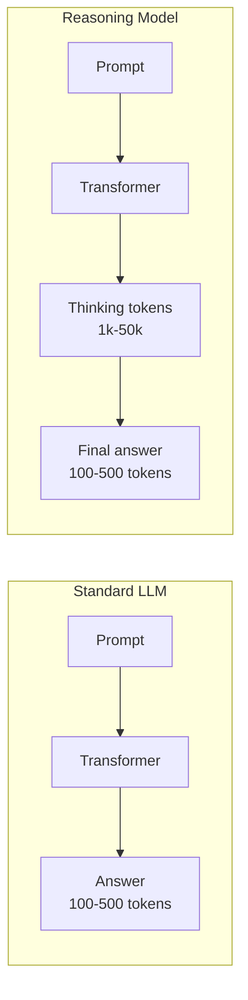
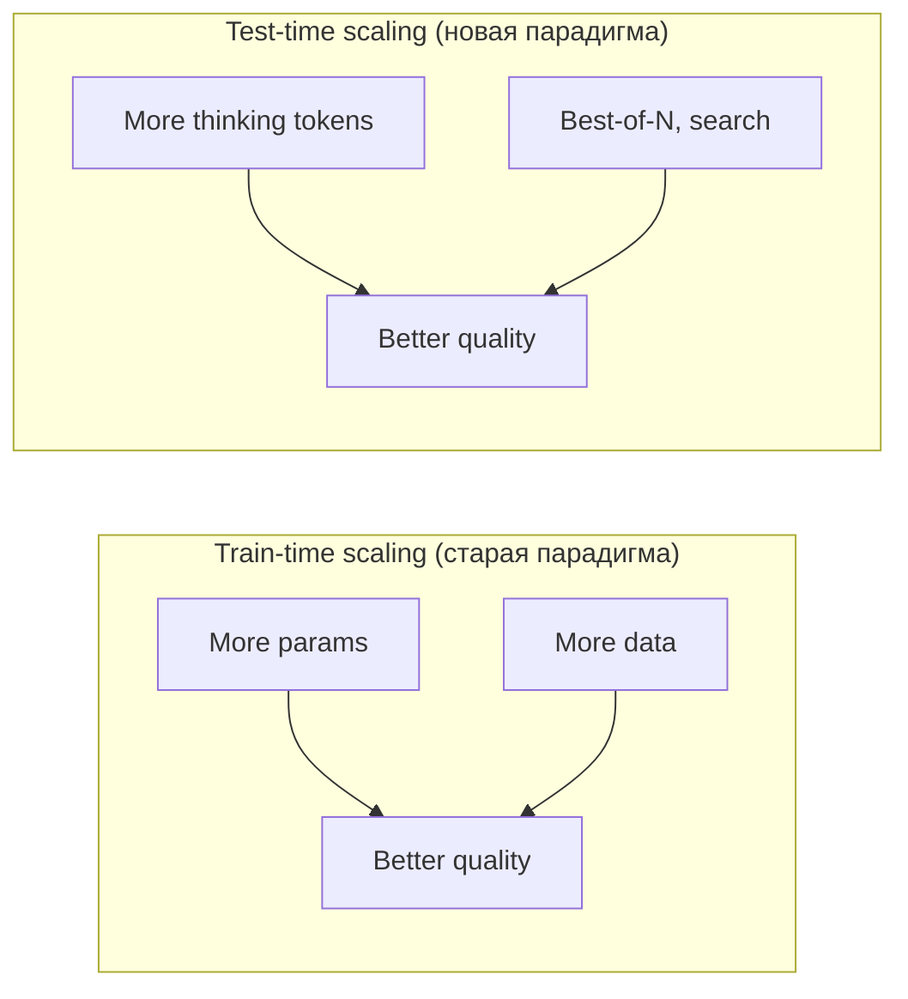

# Вопросы на собеседовании: `Reasoning Models (o1/o3/R1)`

С сентября 2024 индустрия LLM получила новую парадигму — **reasoning models**. Они тратят значительную часть compute не на вывод финального ответа, а на длинный internal `chain-of-thought` (CoT). CoT перестал быть prompt-техникой и стал архитектурным свойством, обученным через RL.

На интервью спрашивают: как это устроено, чем отличается от обычных LLM, когда оправдано платить 5-10× больше за токен, что такое `test-time compute scaling`, что сделал DeepSeek-R1 и при чём здесь `GRPO`.

## Полезные ссылки

### Официальная документация и авторитетные источники

- [OpenAI o1 System Card](https://openai.com/index/openai-o1-system-card/) — официальное описание архитектуры и safety
- [OpenAI Reasoning Guide](https://platform.openai.com/docs/guides/reasoning) — API specifics для o-series
- [DeepSeek-R1 Paper (arXiv)](https://arxiv.org/abs/2501.12948) — R1, R1-Zero, GRPO, distillation
- [Anthropic Extended Thinking Docs](https://docs.anthropic.com/en/docs/build-with-claude/extended-thinking) — Claude thinking budget
- [Gemini Deep Think](https://deepmind.google/technologies/gemini/) — Google Deep Think mode
- [Tree of Thoughts paper](https://arxiv.org/abs/2305.10601) — inference-time reasoning
- [Self-Consistency paper](https://arxiv.org/abs/2203.11171) — majority vote CoT

## Содержание

- [Полезные ссылки](#полезные-ссылки)
- [See also](#see-also)

**Эволюция и архитектура**
- [Q1. (!) Что такое reasoning model и чем отличается от обычной LLM?](#q1--что-такое-reasoning-model-и-чем-отличается-от-обычной-llm)
- [Q2. (!) Эволюция reasoning: от `Let's think step by step` до o1/R1?](#q2--эволюция-reasoning-от-lets-think-step-by-step-до-o1r1)
- [Q3. (!) Что такое test-time compute scaling?](#q3--что-такое-test-time-compute-scaling)
- [Q4. Архитектура reasoning model — это новый transformer?](#q4-архитектура-reasoning-model--это-новый-transformer)
- [Q5. Что такое thinking tokens?](#q5-что-такое-thinking-tokens)

**Training (RL, GRPO, distillation)**
- [Q6. (!) Как обучают reasoning model?](#q6--как-обучают-reasoning-model)
- [Q7. (!) Что такое GRPO и чем отличается от PPO?](#q7--что-такое-grpo-и-чем-отличается-от-ppo)
- [Q8. Synthetic reasoning data — как генерируют?](#q8-synthetic-reasoning-data--как-генерируют)
- [Q9. Reward model в reasoning training?](#q9-reward-model-в-reasoning-training)

**DeepSeek-R1 breakthrough**
- [Q10. (!) Что такого революционного в DeepSeek-R1?](#q10--что-такого-революционного-в-deepseek-r1)
- [Q11. R1-Zero vs R1 — в чём разница?](#q11-r1-zero-vs-r1--в-чём-разница)
- [Q12. (!) R1-Distill — как уместить reasoning в 8B модель?](#q12--r1-distill--как-уместить-reasoning-в-8b-модель)

**API specifics (OpenAI/Anthropic/Gemini/DeepSeek)**
- [Q13. (!) OpenAI o-series API — особенности?](#q13--openai-o-series-api--особенности)
- [Q14. (!) Anthropic extended thinking — как работает?](#q14--anthropic-extended-thinking--как-работает)
- [Q15. DeepSeek-R1 API — `<think>` теги?](#q15-deepseek-r1-api--think-теги)
- [Q16. Hidden vs visible thinking — почему OpenAI скрывает CoT?](#q16-hidden-vs-visible-thinking--почему-openai-скрывает-cot)

**Когда использовать / когда нет**
- [Q17. (!) Когда reasoning model даёт реальное преимущество?](#q17--когда-reasoning-model-даёт-реальное-преимущество)
- [Q18. (!) Когда reasoning model избыточна или вредна?](#q18--когда-reasoning-model-избыточна-или-вредна)
- [Q19. Бенчмарки: где reasoning доминирует, где нет?](#q19-бенчмарки-где-reasoning-доминирует-где-нет)
- [Q20. o3 на ARC-AGI — почему это важно?](#q20-o3-на-arc-agi--почему-это-важно)

**Cost/latency trade-offs**
- [Q21. (!) Сравнение o1 vs o3 vs R1 vs Claude 3.7 thinking по cost/latency?](#q21--сравнение-o1-vs-o3-vs-r1-vs-claude-37-thinking-по-costlatency)
- [Q22. Сколько токенов «съедает» reasoning?](#q22-сколько-токенов-съедает-reasoning)

**Inference-time альтернативы**
- [Q23. (!) Best-of-N, Tree-of-Thoughts, Self-Consistency — заменяют ли reasoning model?](#q23--best-of-n-tree-of-thoughts-self-consistency--заменяют-ли-reasoning-model)

**Production patterns**
- [Q24. (!) Routing: когда отправлять в reasoning model?](#q24--routing-когда-отправлять-в-reasoning-model)
- [Q25. (!) Prompt engineering для reasoning models — что меняется?](#q25--prompt-engineering-для-reasoning-models--что-меняется)
- [Q26. Hallucination и rationalization в reasoning models?](#q26-hallucination-и-rationalization-в-reasoning-models)
- [Q27. Streaming thinking — улучшает UX?](#q27-streaming-thinking--улучшает-ux)
- [Q28. Reasoning + tools/function calling — как работает?](#q28-reasoning--toolsfunction-calling--как-работает)
- [Q29. Open-weight reasoning models — что доступно?](#q29-open-weight-reasoning-models--что-доступно)
- [Q30. (!) Reasoning models и agents — future?](#q30--reasoning-models-и-agents--future)

## Q1. (!) Что такое reasoning model и чем отличается от обычной LLM?

**Reasoning model** — LLM, **обученная** генерировать длинный internal `chain-of-thought` (CoT) перед финальным ответом. CoT здесь — **архитектурное свойство**, а не prompt-трюк.

**Обычная LLM (gpt-4o, Claude Sonnet, Llama):**
- Дашь prompt → сразу пишет ответ.
- Можно попросить `Let's think step by step` — она напишет рассуждение, но это эмерджентное поведение от pre-training/RLHF.
- 1 запрос ≈ 100-500 output tokens.

**Reasoning model (o1, o3, R1, Claude 3.7 thinking):**
- Дашь prompt → внутри генерирует тысячи **thinking tokens** (рассуждение, проверка гипотез, self-correction).
- Только потом — финальный ответ.
- 1 запрос ≈ 1 000-50 000 output tokens (большая часть — thinking).
- Обучена через RL с reward на **корректность финального ответа**, не на стиль.



**Аналогия:** обычная LLM — это студент, который сразу пишет ответ на экзамене; reasoning model — тот, кто исписывает черновик, проверяет себя, потом аккуратно выписывает ответ.

## Q2. (!) Эволюция reasoning: от `Let's think step by step` до o1/R1?

| Год | Событие | Что нового |
|-----|---------|------------|
| 2022 | **Chain-of-Thought prompting** (Wei et al.) | Prompt-trick: `Let's think step by step` → +15-30% на математике для PaLM/GPT-3 |
| 2023 | Tree-of-Thoughts, Self-Consistency | Inference-time techniques: множественные CoT + verifier/voting |
| 2024 сент | **OpenAI o1-preview, o1-mini** | Первая production reasoning model. RL на CoT. Hidden thinking |
| 2024 дек | **OpenAI o1** (GA), **o3-preview** anonced | o3 на ARC-AGI: 75-87% (humans ~85%). FrontierMath: 25% (предыдущие <2%) |
| 2025 янв | **DeepSeek-R1** (open weights!) | Competitive с o1. GRPO. R1-Zero — pure RL без SFT |
| 2025 фев | **Claude 3.7 Sonnet extended thinking** | Visible thinking, configurable budget |
| 2025 март-апр | **Gemini 2.5 Pro Deep Think** | Google reasoning mode |
| 2025 | **QwQ-32B, Llama-3.3-Nemotron-Reasoning** | Open-weight reasoning от Alibaba/Nvidia |

**Ключевой сдвиг:** CoT превратился из **prompt-техники** в **обученное свойство модели**.

## Q3. (!) Что такое test-time compute scaling?

**Test-time compute scaling** — наблюдение: если дать модели **больше токенов на reasoning** (test/inference time), качество растёт **логарифмически линейно** с compute.



**Закон:** `accuracy ≈ a + b · log(compute_at_inference)`.

**Следствия:**
- Можно **обменять** дороже-долгий inference на лучший результат — без переобучения модели.
- На сложных задачах (AIME, FrontierMath) разница между «1k thinking tokens» и «100k» — десятки процентных пунктов.
- Появляется новый knob для оптимизации: `thinking budget`.

**Параллельные стратегии test-time scaling:**
1. **Long CoT** — одна длинная цепочка (o1, R1).
2. **Best-of-N + verifier** — N независимых попыток, выбрать лучшую.
3. **Tree search** (MCTS-like) — explore разные ветки reasoning.

OpenAI и DeepSeek сделали **long CoT** дефолтом через RL.

## Q4. Архитектура reasoning model — это новый transformer?

**Нет, архитектурно это всё ещё стандартный decoder-only transformer**. Отличия — в **обучении** и **inference protocol**:

1. **Pre-training** — обычный (next-token prediction на больших корпусах).
2. **Post-training** — RL на reasoning traces:
   - Reward = корректность финального ответа (математика, код можно verify автоматически).
   - Модель учится **долго думать**, проверять себя, искать ошибки.
3. **Inference** — модель сама решает, когда закончить thinking и начать final answer. Часто маркируется специальными токенами (`<think>...</think>`, `<|thinking|>...<|answer|>`).

**Что НЕ меняется:** attention, FFN, positional embeddings, vocab. Это та же трансформерная архитектура.

**Что меняется в inference:**
- `max_tokens` нужно ставить большим (десятки тысяч).
- Streaming разделяет `thinking` и `answer` content blocks.
- Provider может скрыть thinking от пользователя.

## Q5. Что такое thinking tokens?

**Thinking tokens** — output tokens, генерируемые моделью **до** финального ответа, представляющие internal reasoning.

**Свойства:**
- Учитываются в **billing** (платишь как за обычные output tokens).
- Не показываются в финальном UI ответе (зависит от provider).
- На сложных задачах могут составлять **>95%** total output.

**Пример (Anthropic Claude 3.7 extended thinking):**
```json
{
  "content": [
    {"type": "thinking", "thinking": "Let me analyze... if x=5 then... wait, that gives..."},
    {"type": "text", "text": "The answer is 42."}
  ],
  "usage": {
    "input_tokens": 200,
    "output_tokens": 8500,
    "thinking_tokens": 8200,
    "text_tokens": 300
  }
}
```

**В OpenAI o1** thinking tokens видны только в `usage.completion_tokens_details.reasoning_tokens` и кратком summary в трейсе.

## Q6. (!) Как обучают reasoning model?

**Типичный pipeline (упрощённо):**

1. **Pre-training** — base model (Llama-like, GPT-like).
2. **Cold-start SFT** (для читаемости): fine-tune на небольшом наборе human-curated reasoning examples (формат, язык, структура).
3. **Reasoning RL** — главное:
   - Задачи с **verifiable answers** (math, code, logic puzzles).
   - Reward = `+1` если ответ верный, `-1` если нет (плюс penalty за format violations).
   - Алгоритм: `PPO` или `GRPO` (DeepSeek).
   - Модель **сама обнаруживает**, что длинное reasoning помогает → CoT растёт от десятков до тысяч токенов.
4. **General RLHF** — финальная полировка под human preferences (helpfulness, safety).
5. **Distillation** (опционально) — большая RL-обученная модель учит маленькую через её reasoning traces.

**Emergent behavior** (особенно в R1-Zero): без явных hints модель учится:
- Self-verification (`Wait, let me check...`).
- Backtracking (`Hmm, that's wrong, let me try another approach`).
- Multiple solution attempts.

## Q7. (!) Что такое GRPO и чем отличается от PPO?

**GRPO (Group Relative Policy Optimization)** — RL-алгоритм, представленный в DeepSeek-Math/R1.

**PPO (стандарт RLHF):**
- Требует **value model** (отдельная сеть, ~такого же размера, как policy), которая оценивает expected return.
- Дорого в памяти и compute.

**GRPO:**
- **Не требует value model**.
- Для каждого prompt сэмплирует `G` ответов (группу).
- Reward для ответа `i` нормализуется относительно среднего/std reward в группе:

```
advantage_i = (r_i - mean(r_group)) / std(r_group)
```

- Это даёт **relative** signal без отдельного критика.

**Плюсы GRPO:**
- ~50% memory savings (нет value model).
- Проще тюнить.
- Хорошо работает с verifiable rewards (math, code).

**Минусы:**
- Нужна группа из нескольких rollouts → больше inference.
- На noisy reward может быть нестабильно.

**Аналогия:** PPO учит «насколько хорош этот ответ абсолютно?»; GRPO — «насколько этот ответ лучше других из той же группы?».

## Q8. Synthetic reasoning data — как генерируют?

**Подходы:**

1. **Self-generated CoT** — большая модель решает задачи с CoT, отфильтровываются те, где финальный ответ верный → training set.
2. **Reject sampling** — генерируем N решений на задачу, оставляем только корректные.
3. **Process reward models (PRM)** — модель оценивает **каждый шаг** reasoning (не только финальный ответ), фильтрует traces по step-level correctness.
4. **Distillation from reasoning model** — R1-Distill: брали traces от R1 (671B) и обучали Llama-8B/70B, Qwen-7B/32B на них.

**Источники задач:**
- Existing math datasets (MATH, GSM8K, AIME).
- Competitive programming (Codeforces, LeetCode).
- Scientific reasoning (GPQA).
- Synthetically generated puzzles (Procedural problem generation).

**Масштаб:** для R1 заявлены сотни тысяч reasoning traces. OpenAI цифры не раскрывает.

## Q9. Reward model в reasoning training?

**Два подхода:**

1. **Rule-based / verifier-based reward** (DeepSeek-R1, AlphaProof):
   - Для math: численная проверка ответа.
   - Для code: запустить тесты.
   - Для format: проверить, что есть `<think>` и финальный answer.
   - Дёшево, точно, не gameable.

2. **Learned reward model** (как в RLHF):
   - Отдельная модель предсказывает quality score.
   - Process Reward Model (PRM) — оценивает каждый шаг.
   - Outcome Reward Model (ORM) — оценивает финальный ответ.

**DeepSeek-R1 пошёл по rule-based пути** — это одна из причин успеха. Reward честный, нет reward hacking.

**Минус rule-based:** работает только для задач с verifiable answers (математика, код, формальная логика). Для creative writing, оpen-ended reasoning — нужна learned reward.

## Q10. (!) Что такого революционного в DeepSeek-R1?

**DeepSeek-R1** (январь 2025) — первая **open-weight** reasoning model, competitive с OpenAI o1.

**Прорывы:**

1. **Open weights под MIT-like license** — впервые SOTA reasoning доступен всем.
2. **GRPO** — новый RL-алгоритм, дешевле PPO.
3. **R1-Zero** — pure RL без SFT, emergent reasoning behavior (показали, что SFT cold-start не обязателен).
4. **Distilled smaller models** — R1-Distill-Llama-8B/70B, R1-Distill-Qwen-1.5B/7B/14B/32B. Можно запустить на consumer GPU.
5. **Цена** — API в ~30× дешевле o1, self-host даёт ещё дешевле.
6. **Прозрачность** — paper подробно описывает training pipeline, ablations, failures.

**Архитектура R1:**
- MoE (Mixture of Experts): **671B параметров total**, ~**37B active** на токен.
- Контекст 128k.
- Visible reasoning через `<think>...</think>` tags.

**Влияние:** через 2 месяца после релиза появились десятки fine-tunes и distills, цена reasoning на API рынке упала в разы.

## Q11. R1-Zero vs R1 — в чём разница?

**R1-Zero:**
- **Pure RL** на base DeepSeek-V3, без supervised fine-tuning (SFT).
- Reward: только correctness + format.
- **Emergent reasoning** — модель сама развила длинные CoT, self-verification, backtracking.
- **Проблема:** читаемость плохая — смешивает языки, странное форматирование, иногда чтоoob.

**R1 (production):**
- **Cold-start SFT** на ~1000s curated reasoning examples (хорошая структура, читаемый текст).
- **Затем reasoning RL** (GRPO).
- **Затем rejection sampling + SFT** на собственных correct traces.
- **Финальный RLHF** под helpfulness и safety.
- Результат: качество R1-Zero + читаемость.

**Главный вывод R1-Zero для индустрии:** reasoning capability — **эмерджентное** свойство достаточно большой модели + правильного RL. SFT не обязателен для появления способности (только для UX).

## Q12. (!) R1-Distill — как уместить reasoning в 8B модель?

**Идея distillation:** учим маленькую модель (student) на reasoning traces большой (teacher).

**Pipeline R1-Distill:**
1. Берём R1 (671B) — teacher.
2. Сгенерировали ~800k высококачественных reasoning traces (math, code, logic).
3. SFT (стандартный supervised fine-tuning) на base моделях:
   - Llama-3.1-8B → **R1-Distill-Llama-8B**.
   - Llama-3.3-70B → **R1-Distill-Llama-70B**.
   - Qwen-2.5-1.5B/7B/14B/32B → R1-Distill-Qwen-*.
4. **Без отдельного RL** для distill — только imitation.

**Результаты:**
- R1-Distill-Qwen-32B превосходит o1-mini на многих math benchmarks.
- R1-Distill-Llama-8B запускается на потребительском GPU (24GB VRAM в 4-bit quant).

**Trade-off:**
- Distilled модель ХУЖЕ original R1 (нет полноценного RL).
- Но СИЛЬНО лучше базового Llama-8B на reasoning задачах.
- Хорошее соотношение compute/quality для self-host.

**Почему важно:** sub-10B reasoning models делают возможным **локальный** edge deployment без cloud API.

## Q13. (!) OpenAI o-series API — особенности?

```python
from openai import OpenAI

client = OpenAI()

response = client.chat.completions.create(
    model="o1",  # or o1-mini, o3-mini, o3
    messages=[
        {"role": "user", "content": "Prove that sqrt(2) is irrational."}
    ],
    max_completion_tokens=10000,  # НЕ max_tokens
    reasoning_effort="medium"     # low | medium | high (o3-mini+)
)

print(response.choices[0].message.content)

# Reasoning tokens видны в usage
print(response.usage.completion_tokens_details.reasoning_tokens)
```

**Особенности:**
- `max_completion_tokens` вместо `max_tokens` — включает и thinking, и output.
- **`reasoning_effort`** (o3-mini+): `low/medium/high` — managment thinking budget.
- **`system` message** в o1-preview изначально не поддерживался; теперь поддерживается developer/system role.
- **Streaming** — изначально не было, добавили в 2025.
- **Tools / function calling** — изначально не было, добавили в 2025.
- **Hidden CoT** — пользователь не видит thinking content (только токены в usage и summary).
- **Temperature, top_p** — игнорируются (фиксированные для consistency reasoning).

**Pricing (на момент 2025):**
- `o1` ~ $15/$60 per 1M input/output (vs gpt-4o $2.50/$10).
- `o1-mini` ~ $3/$12.
- `o3-mini` ~ $1.10/$4.40.

## Q14. (!) Anthropic extended thinking — как работает?

```python
import anthropic

client = anthropic.Anthropic()

response = client.messages.create(
    model="claude-opus-4-7",
    max_tokens=20000,
    thinking={
        "type": "enabled",
        "budget_tokens": 10000  # сколько токенов разрешить на thinking
    },
    messages=[
        {"role": "user", "content": "Solve this Sudoku: ..."}
    ]
)

for block in response.content:
    if block.type == "thinking":
        print("THINKING:", block.thinking)
    elif block.type == "text":
        print("ANSWER:", block.text)
```

**Особенности:**
- **`budget_tokens`** — максимум thinking; модель может использовать меньше.
- **`thinking` блоки видны** в ответе (другой подход vs OpenAI).
- **Streaming** работает: получаешь thinking deltas, затем text deltas.
- **Tools поддерживаются** одновременно с thinking.
- **Цена thinking tokens** = цена output tokens (учитываются в billing).
- При multi-turn — **previous thinking** в context не отправляется обратно (нет смысла, модель будет думать заново).

**Когда использовать:**
- Сложные задачи, где нужна цепочка рассуждений.
- Когда хочется audit reasoning (thinking видно).
- В debugging quality issues (видно, где модель ошиблась).

## Q15. DeepSeek-R1 API — `<think>` теги?

```python
from openai import OpenAI

# DeepSeek API совместим с OpenAI SDK
client = OpenAI(
    api_key="...",
    base_url="https://api.deepseek.com"
)

response = client.chat.completions.create(
    model="deepseek-reasoner",  # = R1
    messages=[{"role": "user", "content": "What is 17 * 23?"}]
)

content = response.choices[0].message.content
# Содержит и thinking, и answer
# Структура:
# <think>
# Let me compute 17 * 23. 17 * 20 = 340. 17 * 3 = 51. 340 + 51 = 391.
# </think>
# 17 * 23 = 391
```

**Особенности DeepSeek API:**
- **OpenAI-compatible** endpoints.
- **`<think>...</think>`** теги встроены в text response — нужно парсить.
- В новых версиях SDK добавлено отдельное поле `reasoning_content`:
  ```python
  print(response.choices[0].message.reasoning_content)  # thinking
  print(response.choices[0].message.content)            # final answer
  ```
- **Цена сильно ниже** OpenAI: примерно $0.55/$2.19 per 1M input/output.
- Можно **self-host** — open weights под MIT-like license.

## Q16. Hidden vs visible thinking — почему OpenAI скрывает CoT?

**OpenAI (hidden):**
- Пользователь видит только финальный ответ + summary thinking в traces.
- **Причины** (по официальной позиции):
  1. **Anti-distillation** — если CoT публичный, конкуренты могут training data собрать.
  2. **Safety / alignment** — raw CoT может содержать unaligned reasoning (модель «думает» вслух про harmful content прежде чем отвергнуть).
  3. **UX** — длинный CoT шумит, средний пользователь не хочет видеть 10k токенов размышлений.

**Anthropic (visible):**
- Thinking content возвращается явно.
- **Причины:**
  1. **Transparency** — пользователь может проверить reasoning.
  2. **Debugging** — разработчик видит, где модель ошиблась.
  3. **Trust** — visible reasoning легче доверять.

**DeepSeek (visible через теги):**
- Похожий подход к Anthropic — `<think>` теги видны, можно распарсить.
- Open weights — distillation всё равно возможна.

**Trade-off:** hidden даёт competitive moat и cleaner UX; visible даёт прозрачность и community trust. Индустрия пока разделена.

## Q17. (!) Когда reasoning model даёт реальное преимущество?

| Сценарий | Reasoning model полезен? | Почему |
|----------|--------------------------|--------|
| Математика (олимпиадная) | Сильно (10-50% точности) | Multi-step, требует self-verification |
| Competitive programming | Сильно | Edge cases, planning перед кодом |
| Scientific reasoning (GPQA, физика) | Сильно | Multi-step синтез знаний |
| SWE-Bench (реальные баги) | Сильно (claude 3.7 thinking + o3 — SOTA) | Анализ кода, гипотезы, проверки |
| Planning / agent decomposition | Сильно | Многошаговое планирование |
| Logical puzzles, Sudoku, ARC-AGI | Очень сильно | Где обычная LLM «срывается» в guessing |
| Legal/medical reasoning | Полезно | Нужны цепочки рассуждений |
| Сложные SQL / data analysis | Полезно | Многошаговые joins, edge cases |

**Общий признак:** задача требует **многошагового рассуждения** с возможностью самопроверки и backtracking.

## Q18. (!) Когда reasoning model избыточна или вредна?

| Сценарий | Причина избыточности |
|----------|----------------------|
| Простой Q&A (`Какая столица Франции?`) | Overkill — 10× дороже за тот же ответ |
| Краткие summaries | Reasoning не помогает, добавляет latency |
| Creative writing / fiction | Может «портить flow» излишним анализом стиля |
| Чат small-talk | Латентность 30+ сек убивает UX |
| Real-time UI (autocomplete, suggestions) | Латентность недопустима |
| Простые classification tasks | Обычная маленькая модель справится |
| Translation коротких текстов | Reasoning не нужен |
| Запросы к function calling (single tool call) | Routing к нужному tool не требует CoT |

**Правило большого пальца:** если задача решается обычной LLM за 1-2 секунды с приемлемой точностью — reasoning model не нужна. Если требуется планирование, проверка, multi-step синтез — рассматривать.

## Q19. Бенчмарки: где reasoning доминирует, где нет?

**Где reasoning дают огромный gap:**

| Benchmark | gpt-4o | o1 | o3 | R1 | Прирост |
|-----------|--------|----|----|-----|--------|
| AIME 2024 (math) | ~13% | ~83% | ~96% | ~80% | +60-80% |
| MATH-500 | ~76% | ~94% | ~97% | ~97% | +20% |
| GPQA (PhD-level science) | ~50% | ~78% | ~88% | ~71% | +20-40% |
| Codeforces percentile | ~11% | ~89% | ~99.95% | ~96% | +80+ |
| SWE-Bench Verified | ~33% | ~41% | ~71% | ~49% | +10-40% |
| ARC-AGI | ~5% | ~25% | ~75-87% | ~15% | +70 |
| FrontierMath | <2% | <2% | ~25% | <5% | +20+ |

**Где разница маленькая:**

| Benchmark | gpt-4o | o1 | Разница |
|-----------|--------|----|---------| 
| MMLU (general knowledge) | ~88% | ~92% | +4% |
| TriviaQA | ~92% | ~93% | +1% |
| HellaSwag | ~95% | ~95% | 0 |

**Вывод:** reasoning не помогает там, где задача — **recall фактов**. Помогает там, где нужно **синтезировать** или **выводить**.

## Q20. o3 на ARC-AGI — почему это важно?

**ARC-AGI** (Abstract Reasoning Corpus for AGI, François Chollet, 2019) — бенчмарк, который специально дизайнили **резистентным к memorization**. Задачи — визуальные паттерны (grid → grid), где надо вывести правило из 2-3 примеров и применить к новому inputу.

**До декабря 2024:**
- Humans: ~85%.
- gpt-4o: ~5%.
- Лучшие custom solutions (год работы): ~55%.

**o3 (декабрь 2024):**
- Low compute mode: **75%**.
- High compute mode: **87%** (на ~$3000 compute за задачу).

**Почему это важно:**
1. ARC считался «AGI litmus test» — модели на основе LLM долго на нём топтались.
2. o3 показал, что **test-time compute scaling** + **reasoning RL** способен решать задачи, требующие abstract reasoning.
3. **Ценник** на high-compute mode (~$3k/задача) подсветил, что **дорогое thinking** становится главным компонентом frontier-моделей.

**Контраргументы:**
- ARC-AGI обновляли, на ARC-AGI-2 модели снова в начале пути.
- Стоимость 87% — индикатор, что это **brute-force search**, а не «дешёвый» reasoning.

## Q21. (!) Сравнение o1 vs o3 vs R1 vs Claude 3.7 thinking по cost/latency?

| Модель | Cost (per 1M in/out) | Latency (typical) | Open weights | Visible thinking | Лидирует в |
|--------|----------------------|-------------------|--------------|------------------|------------|
| **OpenAI o1** | $15 / $60 | 10-60 сек | No | No | Math, science |
| **OpenAI o1-mini** | $3 / $12 | 5-20 сек | No | No | Code, фоновое reasoning |
| **OpenAI o3** | ~$15 / $60 (o3 high), варьируется | 20-90 сек | No | No | ARC-AGI, FrontierMath, SWE-Bench |
| **OpenAI o3-mini** | $1.10 / $4.40 | 3-15 сек | No | No | Дешёвое reasoning |
| **DeepSeek-R1** | $0.55 / $2.19 | 10-40 сек | **Yes (MIT)** | **Yes** (`<think>`) | Math/code, OSS |
| **Claude 3.7 Sonnet thinking** | $3 / $15 + thinking | 5-30 сек | No | **Yes** | SWE-Bench, structured reasoning |
| **Gemini 2.5 Pro Deep Think** | $1.25 / $10 (var.) | 10-40 сек | No | Partial | Multi-modal reasoning |
| **QwQ-32B** | self-host | 5-20 сек (GPU) | **Yes** | **Yes** | Edge reasoning |

**Эмпирические выводы:**
- **R1 ~30× дешевле o1** при сопоставимой точности на math/code.
- **o3 — frontier**, но дорогой.
- **Claude 3.7 thinking** — лучший баланс для production (visible, cheap, fast).
- **o1-mini / o3-mini** — sweet spot для massive inference.

## Q22. Сколько токенов «съедает» reasoning?

Зависит от сложности задачи:

| Тип задачи | Thinking tokens (typical) |
|------------|---------------------------|
| Простой вопрос («что такое X») | 100-500 |
| Средняя задача (multi-step math) | 1k-5k |
| Сложная задача (AIME, Codeforces) | 5k-30k |
| ARC-AGI / FrontierMath | 30k-200k+ |

**Практические последствия:**
- При billing: **большая часть стоимости — thinking**, не output.
- При `max_completion_tokens=4000` сложная задача может **обрезаться** до завершения reasoning → плохой ответ. Ставь крупные лимиты (16k-64k).
- При `thinking.budget_tokens` (Anthropic) можно контролировать — компромисс quality vs cost.

**Пример расчёта:**
- 1000 запросов в день, средний reasoning 5k tokens, o1 ($60/1M output).
- Месячная стоимость только thinking: `1000 × 30 × 5000 × $60 / 1_000_000 ≈ $9000`.
- Та же нагрузка на R1: `~$330`.

## Q23. (!) Best-of-N, Tree-of-Thoughts, Self-Consistency — заменяют ли reasoning model?

**Эти inference-time техники** были основными до 2024 года и **до сих пор полезны**, но дают **меньший** прирост, чем dedicated reasoning model.

| Техника | Идея | Прирост vs base LLM | Cost overhead |
|---------|------|---------------------|---------------|
| **Self-Consistency** | N CoT, majority vote финального ответа | +10-15% на math | ×N |
| **Best-of-N + verifier** | N генераций, выбрать лучшую по verifier model | +15-25% | ×N + verifier |
| **Tree-of-Thoughts** | Дерево reasoning, BFS/DFS по веткам | +20-30% на planning | ×N×depth |
| **PRM-guided search** | Process reward model направляет поиск | +25-35% | High |
| **Dedicated reasoning model (o1)** | RL-trained long CoT | +40-80% | Bundled |

**Почему dedicated лучше:**
- Модель **обучена** strategies (self-verification, backtracking) — эффективнее random sampling.
- Один inference call вместо N с координацией.
- Reasoning tokens **дешевле** (одна модель), чем N полных генераций.

**Когда inference-time техники всё ещё актуальны:**
- Если используешь обычную LLM (без reasoning).
- Для self-hosting на старой архитектуре.
- В critical applications, где можно добавить verifier для double-check reasoning model.

## Q24. (!) Routing: когда отправлять в reasoning model?

**Паттерн:** classifier/router решает, какая модель нужна.

```python
def route_query(query: str) -> str:
    # 1. Эвристики
    if len(query) < 30 and is_simple_factual(query):
        return "gpt-4o-mini"  # быстрый ответ
    if any(kw in query.lower() for kw in ["prove", "solve", "calculate", "design"]):
        return "o1"  # явный reasoning task
    # 2. Classifier (маленькая модель)
    complexity = small_classifier(query)  # easy/medium/hard
    return {
        "easy":   "gpt-4o-mini",
        "medium": "gpt-4o",
        "hard":   "o1"
    }[complexity]
```

**Промышленные подходы:**
- **LLM-as-router** — маленькая модель (haiku, gpt-4o-mini) решает.
- **Embedding-based router** — кластеризация семантически похожих запросов.
- **Cost-aware router** — учитывает budget на пользователя.
- **Escalation** — попробовать gpt-4o, если confidence низкий → o1.

**Метрики для оценки routing:**
- Качество ответов на «hard» queries.
- Cost per query (avg).
- Latency p50/p95.
- False positive rate (отправили в reasoning, а не нужно было).

## Q25. (!) Prompt engineering для reasoning models — что меняется?

**Что НЕ нужно делать:**
- `Let's think step by step` — **бесполезно**, модель сама думает.
- Подробные CoT instructions — могут **мешать** обученным стратегиям.
- Few-shot examples с reasoning — обычно не помогают, иногда хуже.

**Что ВАЖНО:**
1. **Чёткая постановка задачи** — input, ожидаемый output format, constraints.
2. **Role / system prompt** — всё ещё работает (`You are a math tutor...`).
3. **Output format** — явно описать (`Respond in JSON: {answer: number, confidence: float}`).
4. **НЕ подсказывать solution path** — модель сама найдёт.
5. **`reasoning_effort`** (o-series) или **`budget_tokens`** (Anthropic) — knob качества.

**Хороший prompt для reasoning model:**

```
You are an expert competitive programmer.

Task: Solve the following problem. Return Python code that passes all test cases.

Constraints:
- n up to 10^6
- Time limit: 2 seconds

Problem: [описание задачи]
```

**Плохой prompt (over-engineered):**

```
Let's think step by step. First, analyze the problem. 
Then, consider edge cases. Then, write pseudocode. 
Then translate to Python. Use the following template...
```

## Q26. Hallucination и rationalization в reasoning models?

**Парадокс:** reasoning model может **рационализировать** неверный ответ длинной правдоподобной цепочкой. Это иногда хуже, чем короткая ошибка обычной LLM — пользователь видит «убедительные рассуждения» и верит.

**Примеры failure modes:**
- **Confirmation bias в CoT** — модель ранний guess затем «подтверждает» дальнейшими шагами.
- **Hallucinated lemmas** — придумывает теоремы / факты, на которые опирается.
- **Goal misgeneralization** — оптимизирует под reward (например, выглядеть уверенно), а не корректность.
- **Sycophancy** — соглашается с user, даже если user не прав.

**Mitigations:**
- **Verifier model** — отдельная LLM проверяет ответ.
- **Self-critique prompt** — отдельный вызов: `Critique your previous answer`.
- **Multiple samples + majority vote** (self-consistency поверх reasoning model).
- **External verification** — для math/code запустить вычисление/тесты.
- **Process reward model** — оценивать каждый шаг (если есть PRM).

**Не верить ответам на критических задачах** без независимой проверки — даже если thinking выглядит убедительным.

## Q27. Streaming thinking — улучшает UX?

**Да**, особенно для длинных reasoning sessions. Без streaming пользователь видит «думает...» 60 секунд и не понимает, жив ли процесс.

**Реализация (Anthropic):**

```python
with client.messages.stream(
    model="claude-opus-4-7",
    thinking={"type": "enabled", "budget_tokens": 10000},
    messages=[...]
) as stream:
    for event in stream:
        if event.type == "content_block_delta":
            if event.delta.type == "thinking_delta":
                print("💭", event.delta.thinking, end="", flush=True)
            elif event.delta.type == "text_delta":
                print(event.delta.text, end="", flush=True)
```

**UI patterns:**
- **Thinking indicator** — «Claude is thinking...» с прогрессом (tokens used / budget).
- **Collapsible thinking section** — показать по запросу.
- **Summary thinking** — LLM сама summarize свой thinking в 1-2 предложения.

**OpenAI o-series:**
- В новых версиях SDK добавлен streaming, но **thinking content не отдаётся** — только summary.

**TTFT vs perceived latency:**
- Total latency: 60 сек.
- TTFT (первый thinking token): 1-2 сек.
- TTFT финального answer: 30-50 сек.
- Streaming thinking → **perceived** latency ≈ TTFT first token.

## Q28. Reasoning + tools/function calling — как работает?

Поначалу o1 **не поддерживал tools**. В 2025 поддержка добавлена.

**Anthropic Claude 3.7 thinking + tools:**

```python
response = client.messages.create(
    model="claude-opus-4-7",
    thinking={"type": "enabled", "budget_tokens": 5000},
    tools=[{"name": "search_web", "input_schema": {...}}],
    messages=[{"role": "user", "content": "Что сейчас в Москве по погоде и +5 дней?"}]
)
# Модель в thinking планирует tool calls, потом возвращает tool_use blocks
```

**Pattern:** модель **в thinking** разрабатывает план (`Мне нужно вызвать search_web, потом проанализировать ответ, потом ещё раз...`), затем **возвращает** tool calls.

**Multi-turn:**
1. User → model (thinking + tool calls).
2. App выполняет tools.
3. Tool results → model.
4. Model thinking again, либо finish, либо ещё tool calls.

**Сравнение с обычным function calling:**
- Reasoning model **глубже планирует** chain of tool calls (multi-step research).
- **Дороже** (thinking tokens).
- Лучше для **complex agent tasks** (research, debugging).
- Overkill для **single tool call** routing.

## Q29. Open-weight reasoning models — что доступно?

| Модель | Параметры | Лицензия | Особенности |
|--------|-----------|----------|-------------|
| **DeepSeek-R1** | 671B MoE / 37B active | MIT-like | Frontier OSS reasoning |
| **R1-Distill-Llama-70B** | 70B | Llama license | Distill, mainstream GPU |
| **R1-Distill-Llama-8B** | 8B | Llama license | Consumer GPU |
| **R1-Distill-Qwen-32B** | 32B | Apache 2.0 | Превосходит o1-mini на math |
| **R1-Distill-Qwen-1.5B** | 1.5B | Apache 2.0 | Edge / mobile |
| **QwQ-32B (Alibaba)** | 32B | Apache 2.0 | Reasoning от Qwen team |
| **Llama-3.3-Nemotron-Reasoning** | 49B | Llama license | Nvidia fine-tune |
| **OpenThinker** | 7B-32B | Apache 2.0 | Open reproduction R1 |

**Self-host options:**
- **vLLM, SGLang, TGI** — production inference.
- **Ollama, LM Studio** — local desktop.
- **Together.ai, Fireworks, DeepInfra** — managed cheaper alternative to closed APIs.

**Trade-offs vs closed reasoning models:**
- + Privacy, customization, no rate limits.
- + Дешевле на больших объёмах.
- − Хуже на frontier benchmarks vs o3.
- − Operational overhead (GPU, ops).

## Q30. (!) Reasoning models и agents — future?

**Reasoning + agents** — основное направление развития 2025-2026:

1. **Long-horizon planning** — reasoning model планирует и executes 10s-100s шагов в agent loop.
2. **Autonomous research** — model сама ищет, читает, синтезирует (OpenAI Deep Research, Claude research mode).
3. **Self-correcting agents** — reasoning позволяет recover after tool errors, не просто crash.
4. **Multi-agent reasoning** — несколько reasoning agents спорят / collaborate (debate frameworks).
5. **Reasoning + memory** — episodic memory + reasoning = continuous learning agent.

**Конкретные продуктовые направления:**
- **SWE-agents** (Devin, Cursor agents) — reasoning о коде + tools (read files, run tests).
- **Computer-use agents** (Claude computer use, OpenAI Operator) — reasoning о UI + screenshot/click tools.
- **Research agents** — multi-step web research с reasoning о sources.
- **Scientific discovery** — reasoning model + lab automation (Coscientist-like).

**Открытые вызовы:**
- **Cost** — agent loop с reasoning может стоить $$$ за одну задачу.
- **Verification** — как verifier long-horizon plans?
- **Safety** — reasoning model + autonomous actions = высокие риски.
- **Memory / context** — reasoning через 1M+ context expensive.

**Tezis:** reasoning models — фундаментальный enabler для агентной парадигмы. Без них агенты ломаются на 3-5 шаге; с ними — выполняют 30-50 шагов осмысленно.

---

## See also

- [LLM Basics](llm-basics-interview.md) — фундамент архитектуры
- [Prompt Engineering](prompt-engineering-interview.md) — CoT prompting, advanced techniques
- [AI Agents](ai-agents-interview.md) — agents on top of reasoning models
- [Function Calling](function-calling-interview.md) — tools + reasoning
- [Model Serving](model-serving-interview.md) — для self-hosted R1 / QwQ
- [MLOps](mlops-interview.md) — operations and deployment
- [LLM Integration Patterns](llm-integration-patterns-interview.md) — routing, fallback, gateway
- [RAG](rag-interview.md) — reasoning + retrieval
- [System Design](../system-design/system-design-interview.md) — architecture for reasoning-heavy systems
- [Latency Numbers](../architecture/latency-numbers-interview.md) — что считать «допустимой» latency для reasoning
