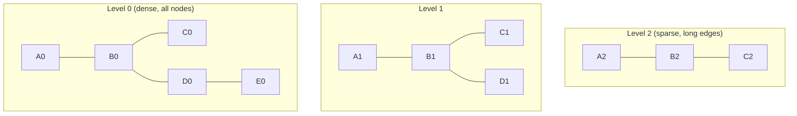

# Вопросы на собеседовании: `Vector Databases`

**Vector databases** — специализированные БД для хранения и быстрого поиска **embeddings** (high-dimensional векторов). Главная операция — **kNN search**: найти k ближайших векторов к query. Используют ANN-алгоритмы (HNSW, IVF). Стек: Pinecone, Weaviate, Qdrant, Milvus, Chroma, pgvector, Elasticsearch.

## Полезные ссылки

### Официальная документация и авторитетные источники

- [Pinecone Documentation](https://docs.pinecone.io/)
- [Weaviate Documentation](https://weaviate.io/developers/weaviate)
- [Qdrant Documentation](https://qdrant.tech/documentation/)
- [Milvus Documentation](https://milvus.io/docs/)
- [pgvector PostgreSQL extension](https://github.com/pgvector/pgvector)
- [HNSW paper](https://arxiv.org/abs/1603.09320)
- [Vector DB benchmarks](https://benchmark.vectorview.ai/)

## Содержание

- [Полезные ссылки](#полезные-ссылки)
- [See also](#see-also)

**Базовые понятия**
- [Q1. (!) Что такое vector database?](#q1--что-такое-vector-database)
- [Q2. (!) Зачем нужна специальная БД для векторов?](#q2--зачем-нужна-специальная-бд-для-векторов)
- [Q3. (!) Что такое embedding и почему они high-dim?](#q3--что-такое-embedding-и-почему-они-high-dim)

**Distance metrics**
- [Q4. (!) Cosine similarity vs Dot product vs Euclidean?](#q4--cosine-similarity-vs-dot-product-vs-euclidean)
- [Q5. Когда какую метрику выбрать?](#q5-когда-какую-метрику-выбрать)

**ANN алгоритмы**
- [Q6. (!) Что такое ANN (Approximate Nearest Neighbor)?](#q6--что-такое-ann-approximate-nearest-neighbor)
- [Q7. (!) HNSW (Hierarchical Navigable Small World)?](#q7--hnsw-hierarchical-navigable-small-world)
- [Q8. IVF (Inverted File Index)?](#q8-ivf-inverted-file-index)
- [Q9. (!) Сравнение HNSW vs IVF?](#q9--сравнение-hnsw-vs-ivf)
- [Q10. Product Quantization (PQ)?](#q10-product-quantization-pq)
- [Q11. ScaNN, FAISS, Annoy?](#q11-scann-faiss-annoy)

**Главные продукты**
- [Q12. (!) Pinecone — managed vector DB?](#q12--pinecone--managed-vector-db)
- [Q13. (!) Weaviate?](#q13--weaviate)
- [Q14. (!) Qdrant?](#q14--qdrant)
- [Q15. Milvus?](#q15-milvus)
- [Q16. (!) pgvector — PostgreSQL extension?](#q16--pgvector--postgresql-extension)
- [Q17. Chroma — embedded option?](#q17-chroma--embedded-option)
- [Q18. Elasticsearch / OpenSearch как vector DB?](#q18-elasticsearch--opensearch-как-vector-db)

**Возможности**
- [Q19. (!) Hybrid search (vector + keyword)?](#q19--hybrid-search-vector--keyword)
- [Q20. (!) Metadata filtering?](#q20--metadata-filtering)
- [Q21. Multi-tenancy?](#q21-multi-tenancy)
- [Q22. Replication, sharding?](#q22-replication-sharding)

**Performance**
- [Q23. (!) Recall vs latency trade-off?](#q23--recall-vs-latency-trade-off)
- [Q24. Quantization для cost reduction?](#q24-quantization-для-cost-reduction)
- [Q25. (!) Сколько векторов обычно?](#q25--сколько-векторов-обычно)

**Production**
- [Q26. (!) Какой vector DB выбрать?](#q26--какой-vector-db-выбрать)
- [Q27. Backup, restore, migrations?](#q27-backup-restore-migrations)
- [Q28. (!) Какие подводные камни в production?](#q28--какие-подводные-камни-в-production)

## Q1. (!) Что такое vector database?

**Vector database** — БД, оптимизированная для:
1. **Хранения** многомерных векторов (обычно 256-3072 dims)
2. **Быстрого kNN-поиска** — найти k ближайших векторов
3. **Фильтрации по метаданным** — фильтровать по условиям (tenant, дата)
4. **Hybrid search** — vector + keyword + metadata

**Применения:**
- **Semantic search** — поиск по смыслу
- **RAG** — retrieval для LLM
- **Рекомендации** — похожие элементы
- **Anomaly detection** — выбросы в векторном пространстве
- **Поиск по изображениям / аудио** — мультимедийный retrieval

## Q2. (!) Зачем нужна специальная БД для векторов?

**Без vector DB:** brute-force kNN — `O(n)` сравнений каждого вектора с запросом.

```
1M векторов × 1024 dims = 4 GB
Brute force search: ~500 ms на CPU (slow)
```

**Vector DB через ANN:** `O(log n)` или близко к этому, **миллисекунды** на поиск.

**Postgres с обычным индексом** для векторов не подходит (b-tree не рассчитан на многомерные данные).

**Vector DB предоставляет:**
- HNSW / IVF индексы
- Quantization
- Распределённое масштабирование
- Hybrid search
- Потоковые обновления (streaming updates)

## Q3. (!) Что такое embedding и почему они high-dim?

**Embedding** — представление текста/изображения в виде вектора чисел.

```
"Hello" → [0.12, -0.45, 0.78, ..., 0.03]  (например, 1536 чисел)
```

**Зачем высокая размерность:**
- Каждое измерение = абстрактный признак ("любовь", "технологии", "грусть", ...)
- Больше измерений = больше признаков = точнее представление
- Но дороже хранение и медленнее поиск

**Компромисс:**
- 384 dims (`all-MiniLM-L6-v2`) — быстро, экономно
- 1024 dims (Cohere) — баланс
- 1536 dims (`text-embedding-3-small`) — стандарт OpenAI
- 3072 dims (`text-embedding-3-large`) — лучшее качество

Подробнее — в [Embeddings](embeddings-interview.md).

## Q4. (!) Cosine similarity vs Dot product vs Euclidean?

**Cosine similarity:**
```
cos(A, B) = (A · B) / (|A| × |B|)
range: [-1, 1] (1 = идентичные)
```
Не зависит от magnitude (длины) векторов.

**Dot product:**
```
A · B = Σ a_i × b_i
range: (−∞, +∞)
```
Зависит и от угла, и от magnitude.

**Euclidean distance (L2):**
```
||A − B|| = sqrt(Σ (a_i − b_i)²)
range: [0, ∞) (0 = идентичные)
```

**Manhattan (L1):** `Σ |a_i − b_i|` — реже используется.

## Q5. Когда какую метрику выбрать?

**Для embedding-моделей:**
- **OpenAI, Cohere, Voyage** — нормализованные → **cosine = dot product** (выбирай dot для скорости)
- **Sentence transformers** — обычно cosine
- **Image embeddings (CLIP)** — cosine

**Best practice:** проверь документацию модели. Если рекомендована cosine — используй cosine.

**Для нормализованных векторов** (`||v|| = 1`) — cosine == dot product. Вычисление dot быстрее (без нормализации).

## Q6. (!) Что такое ANN (Approximate Nearest Neighbor)?

**Exact kNN** — гарантированно найти **истинные** top-k ближайших. `O(n)` без индекса.

**ANN** — найти **приблизительно** top-k в обмен на скорость. Может пропустить пару близких промахов (near-misses).

**Recall:** доля **истинных** top-k среди возвращённых.
- Recall = 0.95 — нашли 95% правильных результатов
- Recall = 1.0 — точный результат (то же, что brute force)

**Компромисс:**
- Высокий recall = точнее, но медленнее
- Низкий recall = быстрее, но больше false negatives

В production ANN с recall **0.9-0.99** приемлем для большинства задач.

## Q7. (!) HNSW (Hierarchical Navigable Small World)?

**HNSW** — самый популярный ANN-алгоритм с **2018+**. Граф на нескольких уровнях.



**Поиск:**
1. Стартуем с верхнего уровня
2. Жадный проход (greedy walk) к ближайшему соседу
3. Спускаемся на уровень ниже
4. Повторяем до уровня 0
5. Лучшие k результатов

**Преимущества:**
- Отличный баланс recall/latency
- Поддерживает **инкрементальные обновления** (insert/delete)
- Работает в памяти (быстро)

**Недостатки:**
- Память: ~1.5-3x размера векторов
- Медленное построение индекса (build)

**Параметры:**
- `M` — связность графа (16-64). Больше = точнее, больше памяти.
- `efConstruction` — качество построения (200-500). Больше = медленнее build.
- `efSearch` — качество поиска. Больше = медленнее поиск, выше recall.

## Q8. IVF (Inverted File Index)?

**IVF** — разбить векторы на **кластеры** (k-means), искать только в ближайших кластерах.

```
1. Pre-build: kmeans → N clusters (centroids)
2. Каждый vector присвоен ближайшему centroid
3. Search: найти top-k closest centroids → искать только в них
```

**Параметры:**
- `nlist` — число кластеров (обычно √N)
- `nprobe` — сколько кластеров обыскивать (1-10% от nlist)

Чем больше `nprobe` — выше recall, медленнее поиск.

**Преимущества:**
- Меньше памяти, чем у HNSW
- Быстрое построение индекса

**Недостатки:**
- Хуже recall при тех же latency, чем у HNSW
- Нужно переобучение (retraining) при сильном data drift

## Q9. (!) Сравнение HNSW vs IVF?

| Критерий | HNSW | IVF |
|----------|------|-----|
| Recall/latency | **Лучше** | Хуже |
| Память | Больше | Меньше |
| Скорость построения | Медленнее | Быстрее |
| Обновления | **Инкрементальные** | Нужен retrain |
| Лучше для | Latency-critical | Бо́льшие датасеты, ограниченная память |

**В 2025** HNSW — **дефолт** в большинстве vector DB (Pinecone, Weaviate, Qdrant, pgvector). IVF используется реже, в сценариях с ограниченной памятью.

## Q10. Product Quantization (PQ)?

**Product Quantization** — сжатие векторов ради экономии памяти.

**Идея:** разделить вектор на **subvectors** и квантовать каждый отдельно.

```
1024-dim vector → 32 chunks по 32 dims → quantize каждый в 8 bits
Result: 32 bytes (vs 4096 bytes original)
128x compression
```

**Компромисс:** ниже recall (сжатие с потерями).

**Комбинации: IVF-PQ** или **HNSW-PQ** — для **очень больших** датасетов (миллиарды векторов).

Используется в **FAISS**, **Milvus**.

## Q11. ScaNN, FAISS, Annoy?

| Библиотека | Создатель | Особенности |
|---------|-----------|-------------|
| **FAISS** | Meta | Самая популярная C++-библиотека. IVF, HNSW, PQ. Не managed-БД. |
| **ScaNN** | Google | Очень быстрая. Используется в YouTube, Search. |
| **Annoy** | Spotify | На деревьях (не граф). Простая, но хуже HNSW. |
| **HNSWlib** | — | Легковесный HNSW на C++ |

**FAISS** часто используется как **встраиваемая** библиотека внутри собственных приложений. Vector DB (Milvus, Vespa) построены поверх FAISS-подобных движков.

## Q12. (!) Pinecone — managed vector DB?

**Pinecone** — самый популярный managed vector DB.

**Особенности:**
- **Полностью управляемый SaaS** (нет варианта self-hosted)
- **Serverless** (с 2023+) — оплата по факту использования (pay-per-use)
- HNSW под капотом
- Фильтрация по метаданным, hybrid search
- Sparse-dense hybrid (с 2024)

```python
import pinecone
pinecone.init(api_key="...")
index = pinecone.Index("my-index")

index.upsert([
    ("id1", [0.1, 0.2, ...], {"category": "tech"}),
    ("id2", [0.3, 0.4, ...], {"category": "sport"})
])

results = index.query(
    vector=[0.1, 0.2, ...],
    top_k=10,
    filter={"category": "tech"}
)
```

**Цена:** дорого при больших объёмах (~$100 за 1M векторов в месяц).

**Когда выбирать:** не хочется заниматься ops, небольшая команда, готовы платить.

## Q13. (!) Weaviate?

**Weaviate** — open-source vector DB, самый богатый по возможностям.

**Особенности:**
- Open-source (Apache 2.0) + managed cloud
- **GraphQL API** + REST + клиенты для Python/JS
- **Модули** для embeddings (text2vec-openai, text2vec-cohere)
- **Hybrid search** (BM25 + vector)
- **Multi-tenancy** из коробки
- **Generative search** — RAG в одной БД

```python
client.collections.create(
    name="Documents",
    vectorizer_config=Configure.Vectorizer.text2vec_openai(),
)

client.collections.get("Documents").data.insert({
    "title": "Hello",
    "content": "World"
})
# Embedding генерируется автоматически

results = collection.query.near_text(
    query="greetings",
    limit=5
)
```

**Когда:** нужно много возможностей и вы готовы развернуть self-hosted.

## Q14. (!) Qdrant?

**Qdrant** — open-source vector DB на **Rust**. Набирает популярность.

**Особенности:**
- **Rust** — быстрый, экономный по памяти
- Open-source + managed cloud
- **Отличная фильтрация по метаданным** (с индексированными полями)
- HNSW, опциональная quantization
- gRPC + REST API
- **Sharding и replication** из коробки

```python
from qdrant_client import QdrantClient
client = QdrantClient("localhost", port=6333)

client.upsert(
    collection_name="docs",
    points=[
        PointStruct(id=1, vector=[0.1, 0.2, ...], payload={"category": "tech"})
    ]
)

results = client.search(
    collection_name="docs",
    query_vector=[0.1, 0.2, ...],
    limit=10,
    query_filter=Filter(must=[FieldCondition(key="category", match=MatchValue(value="tech"))])
)
```

В **2025** — один из топ-3 выбор для production. Особенно популярен в open-source LLM-стеке.

## Q15. Milvus?

**Milvus** — open-source vector DB от Zilliz.

**Особенности:**
- Распределённая архитектура (Kubernetes-native)
- Отлично масштабируется — миллиарды векторов
- Несколько ANN-алгоритмов (HNSW, IVF, ANNOY)
- Строгая согласованность (strong consistency)
- GPU-ускорение

**Применение:** очень большие датасеты, enterprise.

**Минусы:** более сложное развёртывание, чем у Qdrant/Weaviate.

## Q16. (!) pgvector — PostgreSQL extension?

**pgvector** — расширение для PostgreSQL, добавляет тип vector.

```sql
CREATE EXTENSION vector;

CREATE TABLE documents (
    id SERIAL PRIMARY KEY,
    content TEXT,
    embedding vector(1536)
);

-- HNSW index (с pgvector 0.5+)
CREATE INDEX ON documents USING hnsw (embedding vector_cosine_ops);

-- Search
SELECT * FROM documents
ORDER BY embedding <=> '[0.1, 0.2, ...]'::vector
LIMIT 5;
```

**Операторы:**
- `<->` — Euclidean distance
- `<#>` — negative inner product
- `<=>` — cosine distance

**Преимущества:**
- **Не нужна отдельная БД** — всё в Postgres
- Джойны с обычными таблицами
- Транзакции, ACID
- Уже существующая инфраструктура (бэкапы, репликация)

**Минусы:**
- Масштабируется хуже выделенных vector DB (но хватает для < 100M векторов)
- HNSW медленнее, чем в Pinecone/Qdrant (но достаточно)

В **2025** pgvector стал **дефолтом** для стартапов (нет смысла в отдельной БД для < 10M векторов).

## Q17. Chroma — embedded option?

**Chroma** — open-source встраиваемая (embedded) vector DB.

```python
import chromadb
client = chromadb.Client()

collection = client.create_collection("docs")
collection.add(
    documents=["text1", "text2"],
    metadatas=[{"source": "a"}, {"source": "b"}],
    ids=["id1", "id2"]
)

results = collection.query(
    query_texts=["query"],
    n_results=5
)
```

**Когда:** прототипы, локальная разработка, небольшие приложения. Не для production-масштаба.

## Q18. Elasticsearch / OpenSearch как vector DB?

С **Elasticsearch 8+** — нативная поддержка vector search (через HNSW).

```json
PUT /docs
{
  "mappings": {
    "properties": {
      "embedding": {
        "type": "dense_vector",
        "dims": 1536,
        "index": true,
        "similarity": "cosine"
      }
    }
  }
}
```

**Преимущества:**
- **Hybrid search** из коробки (BM25 + vector)
- Масштабирование production-уровня
- Уже знакомый инструмент

**Минусы:**
- HNSW медленнее выделенных vector DB
- Прожорлив к памяти

В **2025** — серьёзный конкурент для **гибридных сценариев** (RAG, где важны и keywords, и семантика).

## Q19. (!) Hybrid search (vector + keyword)?

**Vector search** хорош для семантики. **BM25 keyword** — для точных терминов, имён, ID.

**Объединение (hybrid):**
```python
# Pseudocode
vector_results = vector_db.search(query_emb, top_k=50)
bm25_results = keyword_search(query_text, top_k=50)

# Reciprocal Rank Fusion
combined = rrf([vector_results, bm25_results])
top_10 = combined[:10]
```

**Когда нужен hybrid:**
- Технические термины (`jwt`, `oauth2`)
- Аббревиатуры, имена
- Поиск по коду
- Compliance / юридические тексты

Поддерживают: **Weaviate, Qdrant, Elasticsearch, Pinecone (с 2024)**.

## Q20. (!) Metadata filtering?

```python
results = qdrant.search(
    collection_name="docs",
    query_vector=embedding,
    query_filter=Filter(
        must=[
            FieldCondition(key="tenant_id", match=MatchValue(value="acme")),
            FieldCondition(key="date", range=Range(gte=1234567890))
        ]
    )
)
```

**Подходы к фильтрации:**

1. **Pre-filter** — сначала фильтр, потом vector search по отфильтрованному набору
2. **Post-filter** — vector search → фильтрация результатов
3. **Filter during search** — индексы интегрированы (Qdrant, Pinecone)

**Pre-filter** опасен: если фильтр слишком агрессивный — мало кандидатов, плохой recall.
**Post-filter** опасен: vector search вернёт нерелевантное → фильтровать нечего.

**In-search filter** (Qdrant) — лучший вариант, но требует **индексированных полей**.

## Q21. Multi-tenancy?

**Multi-tenancy** — изоляция данных арендаторов (tenants) в рамках одной инсталляции.

**Подходы:**

1. **Отдельная collection/index на tenant** — `index_acme`, `index_beta`. Просто, но проблемы с масштабированием при тысячах tenants.
2. **Фильтр по tenant_id** — все в одной collection с метаданным `tenant_id`. Вычислительные ресурсы общие.
3. **Нативная multi-tenancy** (Weaviate, Pinecone Serverless) — встроенная изоляция.

**Критично:** убедиться, что данные **не утекают** между tenants. Покрывайте unit-тестами.

## Q22. Replication, sharding?

**Replication** — копии данных для HA и масштабирования чтения.
**Sharding** — разбиение данных между нодами ради масштабирования.

| Vector DB | Replication | Sharding |
|-----------|-------------|----------|
| **Pinecone** | ✓ (managed) | ✓ |
| **Weaviate** | ✓ | ✓ |
| **Qdrant** | ✓ | ✓ |
| **Milvus** | ✓ | ✓ |
| **pgvector** | через PostgreSQL | вручную |

В большинстве production-сценариев — replication ради HA, sharding для **очень больших** датасетов (> 100M векторов).

## Q23. (!) Recall vs latency trade-off?

```
HNSW efSearch:
  efSearch = 10  → recall 0.85, latency 2 ms
  efSearch = 50  → recall 0.95, latency 8 ms
  efSearch = 200 → recall 0.99, latency 30 ms
```

**Зачем это понимать:**
- Для RAG не нужен 100% recall (95%+ хватает)
- Бюджет по latency определяет UX

**Best practice:** A/B-тестировать разные значения `efSearch` на реальных запросах.

## Q24. Quantization для cost reduction?

**Quantization** — сжатие векторов:

| Тип | Сжатие | Влияние на recall |
|------|-------------|---------------|
| **fp32 → fp16** | 2x | Минимальное |
| **fp32 → int8** | 4x | Небольшое |
| **Binary** (1 бит на измерение) | 32x | Заметное (но норм с rerank) |
| **PQ (Product Quantization)** | 4-32x | Зависит от параметров |

**Binary quantization** — байты на вектор почти бесплатны. Используется как **дешёвая первая стадия**, затем top-k переранжируют (rerank) в полной точности.

В **2025** quantization — стандарт для систем с миллионами+ векторов.

## Q25. (!) Сколько векторов обычно?

**Типичные масштабы:**

- **Демо / прототип:** 1K-100K векторов → любая БД
- **Небольшой продукт:** 100K-10M → pgvector, Qdrant cloud
- **Средний:** 10M-100M → Pinecone, Weaviate, Qdrant
- **Большой:** 100M-1B → Milvus, Pinecone enterprise
- **Гипермасштаб:** 1B+ → собственное решение (на FAISS), Milvus

**Оценка хранилища:**
```
10M vectors × 1024 dims × 4 bytes (fp32) = 40 GB
Плюс индекс HNSW: ~1.5x → 60 GB total
```

С quantization — в 4-10 раз меньше.

## Q26. (!) Какой vector DB выбрать?

**Дерево решений:**

```
< 1M vectors, уже Postgres?
  → pgvector

Open-source, готов self-host?
  → Qdrant (modern, fast) или Weaviate (feature-rich)

Managed, не хочется ops?
  → Pinecone (если budget позволяет)

Уже Elasticsearch?
  → Elastic vector search (hybrid search в одной системе)

Очень большой scale (1B+)?
  → Milvus или custom

Local development / prototype?
  → Chroma
```

## Q27. Backup, restore, migrations?

**У vector DB нет** стандартных инструментов backup/restore (как у Postgres).

**Подходы:**
1. **Пересоздать всё (re-embed)** — если есть исходные документы, дешевле просто пересчитать (2-3 часа на 1M векторов)
2. **Экспорт embeddings** — выгрузить все векторы в файл, затем восстановить
3. **Snapshot** (Pinecone, Qdrant) — точка во времени
4. **На основе репликации** — реплика в другом регионе

**Миграции между БД:** обычно через исходные документы (re-embed). Прямого export/import между разными БД нет.

## Q28. (!) Какие подводные камни в production?

1. **Неверная метрика расстояния** — embeddings нормализованы, а используется Euclidean
2. **Несовпадение embedding-моделей** — запрос и документы закодированы разными моделями
3. **Устаревшие embeddings** — модель обновилась, а векторы не пересоздали
4. **Неконтролируемые расходы** — каждый поиск стоит денег (Pinecone serverless)
5. **Индекс не используется** — `EXPLAIN` показывает full scan
6. **Фильтрация после поиска** — recall падает (нужны индексированные метаданные)
7. **Утечка между tenants** — случайно вернули чужие данные
8. **Болезненная переиндексация** — обновление модели = заново закодировать всё
9. **Давление на память** — HNSW в RAM, OOM при больших датасетах
10. **Медленные обновления** — массовые вставки (bulk inserts) могут блокировать поиски

**Всегда тестируйте** на реалистичных объёмах данных до выхода в production.

---

## See also

- [Embeddings](embeddings-interview.md) — что хранится в vector DB
- [RAG](rag-interview.md) — главное применение
- [LLM Basics](llm-basics-interview.md) — context для AI
- [PostgreSQL](../databases/postgresql-interview.md) — pgvector
- [Elasticsearch](../databases/elasticsearch-interview.md) — hybrid search
- [Redis](../databases/redis-interview.md) — Redis Stack vector search
- [Caching](../architecture/caching-strategies-interview.md) — embeddings cache
- [Микросервисы](../architecture/microservices-interview.md) — где vector DB живёт
- [Распределённые системы](../architecture/distributed-systems-interview.md) — sharding, replication
- [MLOps](mlops-interview.md) — embedding model versioning
- [Scalability Patterns](../architecture/scalability-patterns-interview.md) — для больших scales
- [AI Agents](ai-agents-interview.md) — vector DB как memory для агентов
- [LLM Integration Patterns](llm-integration-patterns-interview.md) — паттерны интеграции
- [Model Serving](model-serving-interview.md) — serving embedding-моделей
