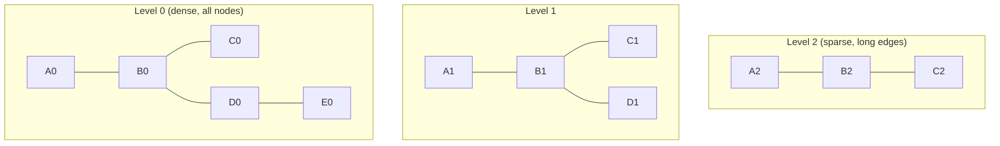

# Вопросы на собеседовании: `Vector Databases`

**Vector databases** — специализированные БД для хранения и быстрого поиска **embeddings** (high-dimensional векторов). Главная операция — **kNN search**: найти k ближайших векторов к query. Используют ANN-алгоритмы (HNSW, IVF). Стек: Pinecone, Weaviate, Qdrant, Milvus, Chroma, pgvector, Elasticsearch.

## Полезные ссылки

### Официальная документация и авторитетные источники

- [Pinecone Documentation](https://docs.pinecone.io/)
- [Weaviate Documentation](https://weaviate.io/developers/weaviate)
- [Qdrant Documentation](https://qdrant.tech/documentation/)
- [Milvus Documentation](https://milvus.io/docs/)
- [pgvector PostgreSQL extension](https://github.com/pgvector/pgvector)
- [HNSW paper](https://arxiv.org/abs/1603.09320)
- [Vector DB benchmarks](https://benchmark.vectorview.ai/)

## Содержание

- [Полезные ссылки](#полезные-ссылки)
- [See also](#see-also)

**Базовые понятия**
- [Q1. (!) Что такое vector database?](#q1--что-такое-vector-database)
- [Q2. (!) Зачем нужна специальная БД для векторов?](#q2--зачем-нужна-специальная-бд-для-векторов)
- [Q3. (!) Что такое embedding и почему он многомерный?](#q3--что-такое-embedding-и-почему-он-многомерный)

**Distance metrics**
- [Q4. (!) Чем различаются cosine similarity, dot product и Euclidean?](#q4--чем-различаются-cosine-similarity-dot-product-и-euclidean)
- [Q5. Когда какую метрику выбрать?](#q5-когда-какую-метрику-выбрать)

**ANN алгоритмы**
- [Q6. (!) Что такое ANN (Approximate Nearest Neighbor)?](#q6--что-такое-ann-approximate-nearest-neighbor)
- [Q7. (!) Как работает HNSW (Hierarchical Navigable Small World)?](#q7--как-работает-hnsw-hierarchical-navigable-small-world)
- [Q8. Как работает IVF (Inverted File Index)?](#q8-как-работает-ivf-inverted-file-index)
- [Q9. (!) Чем HNSW отличается от IVF и что выбрать?](#q9--чем-hnsw-отличается-от-ivf-и-что-выбрать)
- [Q10. Что такое Product Quantization (PQ)?](#q10-что-такое-product-quantization-pq)
- [Q11. Что такое ScaNN, FAISS, Annoy?](#q11-что-такое-scann-faiss-annoy)

**Главные продукты**
- [Q12. (!) Что такое Pinecone?](#q12--что-такое-pinecone)
- [Q13. (!) Что такое Weaviate?](#q13--что-такое-weaviate)
- [Q14. (!) Что такое Qdrant?](#q14--что-такое-qdrant)
- [Q15. Что такое Milvus?](#q15-что-такое-milvus)
- [Q16. (!) Что такое pgvector?](#q16--что-такое-pgvector)
- [Q17. Что такое Chroma?](#q17-что-такое-chroma)
- [Q18. Можно ли использовать Elasticsearch / OpenSearch как vector DB?](#q18-можно-ли-использовать-elasticsearch--opensearch-как-vector-db)

**Возможности**
- [Q19. (!) Что такое hybrid search (vector + keyword)?](#q19--что-такое-hybrid-search-vector--keyword)
- [Q20. (!) Как устроена фильтрация по метаданным?](#q20--как-устроена-фильтрация-по-метаданным)
- [Q21. Как реализовать multi-tenancy?](#q21-как-реализовать-multi-tenancy)
- [Q22. Что такое replication и sharding в vector DB?](#q22-что-такое-replication-и-sharding-в-vector-db)

**Performance**
- [Q23. (!) В чём состоит компромисс между recall и latency?](#q23--в-чём-состоит-компромисс-между-recall-и-latency)
- [Q24. Как quantization снижает стоимость?](#q24-как-quantization-снижает-стоимость)
- [Q25. (!) Сколько векторов обычно хранят и как это влияет на выбор БД?](#q25--сколько-векторов-обычно-хранят-и-как-это-влияет-на-выбор-бд)

**Production**
- [Q26. (!) Какой vector DB выбрать?](#q26--какой-vector-db-выбрать)
- [Q27. Как делать backup, restore и миграции?](#q27-как-делать-backup-restore-и-миграции)
- [Q28. (!) Какие подводные камни в production?](#q28--какие-подводные-камни-в-production)

## Q1. (!) Что такое vector database?

**Vector database** — это БД, заточенная под одну главную операцию: по заданному вектору-запросу быстро найти k самых похожих векторов среди миллионов хранимых. «Похожесть» здесь — близость в многомерном пространстве (по cosine, dot или L2). Обычная реляционная или документная БД такую задачу выполняет за `O(n)` перебором; vector DB делает это за миллисекунды через ANN-индексы.

На чём она специализируется:
1. **Хранение** многомерных векторов (обычно 256-3072 dims).
2. **Быстрый kNN-поиск** — найти k ближайших к запросу за миллисекунды.
3. **Фильтрация по метаданным** — отсекать кандидатов по условиям (tenant, дата, категория).
4. **Hybrid search** — комбинировать векторный поиск с keyword и фильтрами.

**Где применяется:**
- **Semantic search** — поиск по смыслу, а не по точному совпадению слов.
- **RAG** — извлечение релевантного контекста для LLM.
- **Рекомендации** — «похожие товары / статьи / песни».
- **Anomaly detection** — выбросы, далёкие от плотных кластеров в векторном пространстве.
- **Поиск по изображениям и аудио** — мультимедийный retrieval по embedding-у медиа.

## Q2. (!) Зачем нужна специальная БД для векторов?

Коротко: чтобы поиск ближайших соседей не деградировал в полный перебор. Наивный kNN сравнивает запрос с каждым вектором — это `O(n)` и на больших объёмах превращается в сотни миллисекунд на один запрос.

**Без vector DB** (brute force):

```
1M векторов × 1024 dims = 4 GB
Brute force search: ~500 ms на CPU (slow)
```

500 мс на запрос — неприемлемо для интерактивного поиска, и время растёт линейно с объёмом данных.

**Vector DB через ANN** строит индекс (HNSW / IVF), который сужает поиск до небольшого подмножества кандидатов: сложность близка к `O(log n)`, поиск — **миллисекунды**.

Почему не обычный Postgres-индекс: b-tree и хеш-индексы устроены вокруг сравнения и сортировки по одному ключу. Для «близости в 1024-мерном пространстве» такого порядка не существует — стандартный индекс просто неприменим, отсюда и нужен специальный.

**Что даёт vector DB сверх индекса:**
- HNSW / IVF индексы для ANN-поиска.
- Quantization — сжатие векторов ради экономии памяти.
- Распределённое масштабирование (sharding, replication).
- Hybrid search — векторный поиск вместе с keyword.
- Потоковые обновления (streaming updates) без полной переиндексации.

## Q3. (!) Что такое embedding и почему он многомерный?

**Embedding** — это представление текста, изображения или другого объекта в виде вектора чисел, где близость векторов отражает смысловую близость объектов. Модель учится так, что похожие по смыслу тексты получают близкие векторы — именно это и позволяет искать «по смыслу».

```
"Hello" → [0.12, -0.45, 0.78, ..., 0.03]  (например, 1536 чисел)
```

**Почему размерность высокая:** каждое измерение кодирует некий абстрактный признак (условно — «любовь», «технологии», «грусть»). Чем больше измерений, тем больше нюансов смысла модель может уместить в вектор, то есть тем точнее представление. Плата за это — больше памяти на хранение и медленнее поиск, поэтому размерность всегда компромисс.

**Типичные размерности (от экономной к точной):**
- 384 dims (`all-MiniLM-L6-v2`) — быстро и экономно.
- 1024 dims (Cohere) — баланс качества и стоимости.
- 1536 dims (`text-embedding-3-small`) — стандарт OpenAI.
- 3072 dims (`text-embedding-3-large`) — максимальное качество, но дороже всего.

Подробнее — в [Embeddings](embeddings-interview.md).

## Q4. (!) Чем различаются cosine similarity, dot product и Euclidean?

Все три измеряют «похожесть» двух векторов, но смотрят на разные вещи: cosine — только на угол, dot — на угол и длину, Euclidean — на расстояние в пространстве. Главный разделитель между ними — учитывают ли они magnitude (длину) вектора.

**Cosine similarity** — угол между векторами, длина игнорируется:
```
cos(A, B) = (A · B) / (|A| × |B|)
range: [-1, 1] (1 = идентичные)
```
Деление на длины как раз и убирает влияние magnitude — остаётся чистое направление.

**Dot product** — учитывает и угол, и длину:
```
A · B = Σ a_i × b_i
range: (−∞, +∞)
```
Для векторов одинакового направления более длинный даст больший результат — поэтому magnitude влияет на ранжирование.

**Euclidean distance (L2)** — геометрическое расстояние между концами векторов:
```
||A − B|| = sqrt(Σ (a_i − b_i)²)
range: [0, ∞) (0 = идентичные)
```
Чем меньше, тем ближе (в отличие от similarity, где больше = ближе).

**Manhattan (L1):** `Σ |a_i − b_i|` — расстояние «по осям», используется реже.

## Q5. Когда какую метрику выбрать?

Главное правило: метрика должна совпадать с той, на которой обучалась embedding-модель. Если модель учили на cosine, а поиск делать по Euclidean — ранжирование будет искажённым. Поэтому первый шаг — заглянуть в документацию модели.

**Что используют популярные модели:**
- **OpenAI, Cohere, Voyage** — выдают нормализованные векторы → **cosine = dot product** (берите dot, он быстрее).
- **Sentence transformers** — обычно cosine.
- **Image embeddings (CLIP)** — cosine.

**Ключевой нюанс про нормализацию.** Для нормализованных векторов (`||v|| = 1`) cosine и dot product дают одинаковый порядок результатов — длины уже равны 1, делить не на что. Поэтому на нормализованных векторах выбирают dot: он не тратит время на нормализацию и в индексах считается быстрее.

**Рекомендация:** проверьте документацию модели; если рекомендована cosine — используйте cosine (либо dot на заранее нормализованных векторах).

## Q6. (!) Что такое ANN (Approximate Nearest Neighbor)?

**ANN** — это поиск *приблизительно* ближайших соседей: мы сознательно жертвуем гарантией найти точный top-k ради скорости. Идея в том, что для большинства задач (поиск, RAG, рекомендации) пропустить один-два почти-попадания не страшно, зато поиск ускоряется на порядки.

Сравнение с точным вариантом:
- **Exact kNN** — гарантированно находит *истинные* top-k ближайших, но без индекса это `O(n)` (полный перебор).
- **ANN** — находит *почти* те же top-k за миллисекунды, иногда промахиваясь мимо отдельных близких векторов (near-misses).

**Как измеряют качество — recall:** доля *истинных* top-k среди фактически возвращённых.
- Recall = 0.95 — нашли 95% правильных результатов.
- Recall = 1.0 — результат совпадает с точным перебором.

**Компромисс между recall и скоростью:**
- Высокий recall — точнее, но медленнее (индекс обходит больше кандидатов).
- Низкий recall — быстрее, но больше false negatives (пропущенных релевантных).

На практике recall **0.9-0.99** приемлем для большинства задач, и его подкручивают параметрами индекса (например, `efSearch` у HNSW).

## Q7. (!) Как работает HNSW (Hierarchical Navigable Small World)?

**HNSW** — самый популярный ANN-алгоритм (де-факто стандарт с **2018+**). Это многоуровневый граф соседства: каждый вектор — узел, рёбра соединяют его с близкими векторами. Верхние уровни разрежены (немного узлов, длинные «прыжки»), нижний уровень плотный (все векторы). Поиск идёт сверху вниз: на разреженных уровнях быстро добираемся в нужный регион пространства, на плотном — точно дотягиваемся до ближайших. Это похоже на skip-list, но в многомерном пространстве.



**Алгоритм поиска:**
1. Стартуем с верхнего (самого разреженного) уровня.
2. Жадный проход (greedy walk): переходим к соседу, который ближе к запросу.
3. Когда на текущем уровне ближе уже не стать — спускаемся на уровень ниже.
4. Повторяем до уровня 0.
5. На уровне 0 собираем лучшие k результатов.

**Плюсы:**
- Отличный баланс recall/latency — лучший среди распространённых ANN.
- Поддерживает **инкрементальные обновления** (insert/delete без перестройки всего индекса).
- Целиком в памяти — отсюда скорость.

**Минусы:**
- Память: ~1.5-3x размера самих векторов (граф рёбер не бесплатен).
- Медленное построение индекса (build).

**Ключевые параметры (важно понимать, как они влияют):**
- `M` — связность графа, число рёбер на узел (16-64). Больше = выше recall, но больше памяти.
- `efConstruction` — ширина поиска при построении (200-500). Больше = качественнее граф, но медленнее build.
- `efSearch` — ширина поиска при запросе. Это главная «ручка» на проде: больше = выше recall, но медленнее поиск. Её и крутят под нужный latency-бюджет.

## Q8. Как работает IVF (Inverted File Index)?

**IVF** заранее разбивает всё пространство на **кластеры** (через k-means) и при запросе ищет только внутри нескольких ближайших к запросу кластеров, а не по всей базе. Так перебор сужается до небольшой доли векторов.

```
1. Pre-build: kmeans → N clusters (centroids)
2. Каждый vector присвоен ближайшему centroid
3. Search: найти top-k closest centroids → искать только в них
```

**Параметры:**
- `nlist` — число кластеров (обычно √N).
- `nprobe` — сколько кластеров реально обыскивать на запрос (1-10% от nlist).

`nprobe` — главный рычаг recall/latency: больше кластеров обходим → выше recall, но медленнее поиск.

**Плюсы:**
- Меньше памяти, чем у HNSW (нет графа рёбер).
- Быстрое построение индекса.

**Минусы:**
- При равном latency recall ниже, чем у HNSW.
- Кластеры зафиксированы при обучении: при сильном data drift распределение «съезжает» и нужно переобучение (retraining) k-means.

## Q9. (!) Чем HNSW отличается от IVF и что выбрать?

Кратко: HNSW даёт лучший recall на единицу latency и умеет обновляться на лету, но ест память; IVF экономнее по памяти и быстрее строится, но проигрывает в качестве и требует переобучения. Поэтому HNSW — выбор по умолчанию, а IVF берут, когда память в дефиците.

| Критерий | HNSW | IVF |
|----------|------|-----|
| Recall/latency | **Лучше** | Хуже |
| Память | Больше | Меньше |
| Скорость построения | Медленнее | Быстрее |
| Обновления | **Инкрементальные** | Нужен retrain |
| Лучше для | Latency-critical | Бо́льшие датасеты, ограниченная память |

**В 2025** HNSW — **дефолт** в большинстве vector DB (Pinecone, Weaviate, Qdrant, pgvector). IVF используется реже — там, где память ограничена, а небольшая потеря recall допустима.

## Q10. Что такое Product Quantization (PQ)?

**Product Quantization** — это сжатие векторов с потерями ради радикальной экономии памяти. Вместо хранения полного вектора во float хранят компактные коды.

**Идея:** разрезать вектор на короткие **subvectors** и каждый заменить ближайшим центроидом из небольшого кодбука — то есть закодировать одним байтом вместо нескольких float.

```
1024-dim vector → 32 chunks по 32 dims → quantize каждый в 8 bits
Result: 32 bytes (vs 4096 bytes original)
128x compression
```

**Компромисс:** recall падает — расстояния считаются по приближённым кодам, а не по точным векторам.

**На практике** PQ комбинируют с индексом: **IVF-PQ** или **HNSW-PQ** — для **очень больших** датасетов (миллиарды векторов), где полные векторы просто не помещаются в память.

Реализовано в **FAISS** и **Milvus**.

## Q11. Что такое ScaNN, FAISS, Annoy?

Это ANN-библиотеки, а не готовые БД: они дают сам алгоритм поиска, но без сетевого API, persistence, фильтров и репликации. Их либо встраивают в своё приложение, либо на них строят полноценные vector DB.

| Библиотека | Создатель | Особенности |
|---------|-----------|-------------|
| **FAISS** | Meta | Самая популярная C++-библиотека. IVF, HNSW, PQ. Не managed-БД. |
| **ScaNN** | Google | Очень быстрая. Используется в YouTube, Search. |
| **Annoy** | Spotify | На деревьях (не граф). Простая, но хуже HNSW. |
| **HNSWlib** | — | Легковесный HNSW на C++ |

**FAISS** чаще всего используют как **встраиваемую** библиотеку прямо внутри приложения. Поверх FAISS-подобных движков построены и полноценные vector DB (Milvus, Vespa) — они добавляют то, чего у библиотеки нет: API, хранение, шардирование, фильтрацию.

## Q12. (!) Что такое Pinecone?

**Pinecone** — самый популярный managed vector DB. Его суть — полностью убрать ops: вы не разворачиваете и не обслуживаете кластер, а просто пишете и читаете векторы через API.

**Особенности:**
- **Полностью управляемый SaaS** (варианта self-hosted нет принципиально).
- **Serverless** (с 2023+) — оплата по факту использования (pay-per-use), без выделенных нод.
- HNSW под капотом.
- Фильтрация по метаданным, hybrid search.
- Sparse-dense hybrid (с 2024).

```python
import pinecone
pinecone.init(api_key="...")
index = pinecone.Index("my-index")

index.upsert([
    ("id1", [0.1, 0.2, ...], {"category": "tech"}),
    ("id2", [0.3, 0.4, ...], {"category": "sport"})
])

results = index.query(
    vector=[0.1, 0.2, ...],
    top_k=10,
    filter={"category": "tech"}
)
```

**Цена:** заметно растёт на больших объёмах (~$100 за 1M векторов в месяц) — это плата за «никаких ops».

**Когда выбирать:** небольшая команда, нет желания обслуживать инфраструктуру, бюджет позволяет.

## Q13. (!) Что такое Weaviate?

**Weaviate** — open-source vector DB, самый богатый по фичам. Его фишка — встроенная векторизация и RAG прямо внутри БД: можно класть сырой текст, а embeddings и генерацию ответа БД берёт на себя.

**Особенности:**
- Open-source (BSD-3-Clause) + managed cloud.
- **GraphQL API** + REST + клиенты для Python/JS.
- **Модули** для embeddings (text2vec-openai, text2vec-cohere) — векторизация на стороне БД.
- **Hybrid search** (BM25 + vector) из коробки.
- **Multi-tenancy** из коробки.
- **Generative search** — RAG прямо в БД, без отдельного оркестратора.

```python
client.collections.create(
    name="Documents",
    vectorizer_config=Configure.Vectorizer.text2vec_openai(),
)

client.collections.get("Documents").data.insert({
    "title": "Hello",
    "content": "World"
})
# Embedding генерируется автоматически

results = collection.query.near_text(
    query="greetings",
    limit=5
)
```

**Когда:** нужно много возможностей в одной системе и вы готовы развернуть self-hosted.

## Q14. (!) Что такое Qdrant?

**Qdrant** — open-source vector DB на **Rust**, быстро набирающий популярность. Сильная сторона — производительность и фильтрация по метаданным с индексами, что делает его удобным для строгих фильтров (tenant, права доступа).

**Особенности:**
- **Rust** — быстрый и экономный по памяти.
- Open-source + managed cloud.
- **Отличная фильтрация по метаданным** с индексированными полями (быстро даже при жёстких условиях).
- HNSW, опциональная quantization.
- gRPC + REST API.
- **Sharding и replication** из коробки.

```python
from qdrant_client import QdrantClient
client = QdrantClient("localhost", port=6333)

client.upsert(
    collection_name="docs",
    points=[
        PointStruct(id=1, vector=[0.1, 0.2, ...], payload={"category": "tech"})
    ]
)

results = client.search(
    collection_name="docs",
    query_vector=[0.1, 0.2, ...],
    limit=10,
    query_filter=Filter(must=[FieldCondition(key="category", match=MatchValue(value="tech"))])
)
```

В **2025** — один из топ-3 выборов для production, особенно в open-source LLM-стеке.

## Q15. Что такое Milvus?

**Milvus** — open-source vector DB от Zilliz, заточенная под очень большой масштаб. Это распределённая система с разделением хранения и вычислений, рассчитанная на миллиарды векторов.

**Особенности:**
- Распределённая архитектура (Kubernetes-native).
- Отлично масштабируется — до миллиардов векторов.
- Несколько ANN-алгоритмов на выбор (HNSW, IVF, ANNOY).
- Строгая согласованность (strong consistency).
- GPU-ускорение.

**Сценарий применения:** очень большие датасеты, enterprise.

**Минусы:** развёртывание и эксплуатация сложнее, чем у Qdrant/Weaviate (много компонентов в кластере) — за масштаб платят операционной сложностью.

## Q16. (!) Что такое pgvector?

**pgvector** — это расширение PostgreSQL, добавляющее тип `vector` и операторы поиска ближайших соседей прямо в SQL. Главная ценность — не нужна отдельная vector DB: векторы лежат рядом с остальными данными, доступны джойны, транзакции и существующая инфраструктура Postgres.

```sql
CREATE EXTENSION vector;

CREATE TABLE documents (
    id SERIAL PRIMARY KEY,
    content TEXT,
    embedding vector(1536)
);

-- HNSW index (с pgvector 0.5+)
CREATE INDEX ON documents USING hnsw (embedding vector_cosine_ops);

-- Search
SELECT * FROM documents
ORDER BY embedding <=> '[0.1, 0.2, ...]'::vector
LIMIT 5;
```

**Операторы расстояния:**
- `<->` — Euclidean distance
- `<#>` — negative inner product
- `<=>` — cosine distance

**Плюсы:**
- **Не нужна отдельная БД** — всё в Postgres.
- Джойны векторов с обычными таблицами одним запросом.
- Транзакции и ACID — векторы и данные обновляются согласованно.
- Готовая инфраструктура: бэкапы, репликация, мониторинг.

**Минусы:**
- Масштабируется хуже выделенных vector DB (но хватает примерно до < 100M векторов).
- HNSW медленнее, чем в Pinecone/Qdrant (но на типичных объёмах достаточно).

В **2025** pgvector стал **дефолтом** для стартапов: при < 10M векторов отдельная vector DB обычно не оправдана.

## Q17. Что такое Chroma?

**Chroma** — open-source встраиваемая (embedded) vector DB: работает внутри процесса приложения, как SQLite для векторов. Поднимается одной строкой, без отдельного сервера — отсюда её роль для прототипов и локальной разработки.

```python
import chromadb
client = chromadb.Client()

collection = client.create_collection("docs")
collection.add(
    documents=["text1", "text2"],
    metadatas=[{"source": "a"}, {"source": "b"}],
    ids=["id1", "id2"]
)

results = collection.query(
    query_texts=["query"],
    n_results=5
)
```

**Сценарий применения:** прототипы, локальная разработка, небольшие приложения. Не рассчитана на production-масштаб.

## Q18. Можно ли использовать Elasticsearch / OpenSearch как vector DB?

Да: с **Elasticsearch 8+** есть нативный векторный поиск через HNSW (тип `dense_vector`). Главный довод за этот путь — если у вас уже есть ES, вы получаете векторный и keyword-поиск в одной системе, не вводя новый компонент.

```json
PUT /docs
{
  "mappings": {
    "properties": {
      "embedding": {
        "type": "dense_vector",
        "dims": 1536,
        "index": true,
        "similarity": "cosine"
      }
    }
  }
}
```

**Плюсы:**
- **Hybrid search** из коробки (BM25 + vector в одном движке).
- Масштабирование production-уровня (шарды, реплики уже есть).
- Команда уже знает инструмент — не нужно осваивать новый.

**Минусы:**
- HNSW медленнее выделенных vector DB.
- Прожорлив к памяти.

В **2025** — серьёзный конкурент именно для **гибридных сценариев** (RAG, где одинаково важны и точные ключевые слова, и семантика).

## Q19. (!) Что такое hybrid search (vector + keyword)?

**Hybrid search** — это совместный поиск векторным и keyword-методом с последующим слиянием результатов. Зачем: эти два метода закрывают слабости друг друга. Vector search ловит смысл (синонимы, перефразы), но мажет по точным строкам; BM25 (keyword) точно находит конкретные термины, имена и ID, но не понимает смысла. Вместе они дают и семантику, и точность.

**Как объединяют (hybrid):**
```python
# Pseudocode
vector_results = vector_db.search(query_emb, top_k=50)
bm25_results = keyword_search(query_text, top_k=50)

# Reciprocal Rank Fusion
combined = rrf([vector_results, bm25_results])
top_10 = combined[:10]
```

Результаты двух поисков сливают через **Reciprocal Rank Fusion (RRF)** — ранжируют по сумме обратных рангов, что не требует приводить разные шкалы оценок к общей.

**Когда hybrid особенно нужен** (там, где точные строки решают):
- Технические термины (`jwt`, `oauth2`).
- Аббревиатуры, имена собственные.
- Поиск по коду.
- Compliance / юридические тексты.

Поддерживают: **Weaviate, Qdrant, Elasticsearch, Pinecone (с 2024)**.

## Q20. (!) Как устроена фильтрация по метаданным?

**Metadata filtering** — это отбор кандидатов не только по близости вектора, но и по дополнительным полям (tenant, дата, категория). Тонкость в том, *на каком этапе* применяется фильтр — от этого напрямую зависит recall.

```python
results = qdrant.search(
    collection_name="docs",
    query_vector=embedding,
    query_filter=Filter(
        must=[
            FieldCondition(key="tenant_id", match=MatchValue(value="acme")),
            FieldCondition(key="date", range=Range(gte=1234567890))
        ]
    )
)
```

**Три подхода и их компромиссы:**

1. **Pre-filter** — сначала фильтр, потом vector search только по отфильтрованному набору.
2. **Post-filter** — сначала vector search, потом фильтрация результатов.
3. **Filter during search (in-search)** — фильтр и ANN-обход идут вместе, индекс метаданных интегрирован в поиск (Qdrant, Pinecone).

Где подводные камни:
- **Pre-filter** опасен агрессивным фильтром: если под условие подходит мало векторов, ANN-индексу не из чего выбирать — recall падает.
- **Post-filter** опасен обратным: vector search вернёт top-k без учёта фильтра, и после отсева может почти ничего не остаться.
- **In-search filter** обходит обе ловушки, но требует **индексированных полей** — без индекса фильтрация снова деградирует.

## Q21. Как реализовать multi-tenancy?

**Multi-tenancy** — изоляция данных разных арендаторов (tenants) в одной инсталляции так, чтобы один клиент никогда не увидел данные другого. Выбор подхода — это компромисс между простотой изоляции и масштабируемостью.

**Три подхода:**

1. **Отдельная collection/index на tenant** (`index_acme`, `index_beta`) — изоляция жёсткая и простая, но при тысячах tenants растёт число коллекций и накладные расходы; масштабируется плохо.
2. **Фильтр по `tenant_id`** — все векторы в одной коллекции, разделение через метаданное. Ресурсы общие и масштабируется лучше, но изоляция держится только на корректном фильтре.
3. **Нативная multi-tenancy** (Weaviate, Pinecone Serverless) — изоляция встроена в БД, без ручных фильтров.

**Критично:** данные не должны утекать между tenants. Фильтр по `tenant_id` легко забыть в одном из запросов, поэтому изоляцию обязательно покрывают unit-тестами.

## Q22. Что такое replication и sharding в vector DB?

Это два разных способа масштабирования, которые решают разные задачи:
- **Replication** — держим копии одних и тех же данных на нескольких нодах. Даёт отказоустойчивость (HA) и масштабирование чтения (запросы расходятся по репликам).
- **Sharding** — разбиваем данные на части между нодами. Даёт масштабирование объёма: датасет, не влезающий в одну ноду, распределяется по нескольким.

| Vector DB | Replication | Sharding |
|-----------|-------------|----------|
| **Pinecone** | ✓ (managed) | ✓ |
| **Weaviate** | ✓ | ✓ |
| **Qdrant** | ✓ | ✓ |
| **Milvus** | ✓ | ✓ |
| **pgvector** | через PostgreSQL | вручную |

**Эмпирическое правило:** в большинстве production-сценариев replication включают сразу ради HA, а sharding — только для **очень больших** датасетов (> 100M векторов), когда данные перестают помещаться на одну ноду.

## Q23. (!) В чём состоит компромисс между recall и latency?

Суть: точность ANN-поиска и его скорость противоречат друг другу, и регулируются они одной ручкой. У HNSW это `efSearch` — чем шире поиск, тем больше кандидатов обходит индекс, тем выше recall, но тем дольше запрос.

```
HNSW efSearch:
  efSearch = 10  → recall 0.85, latency 2 ms
  efSearch = 50  → recall 0.95, latency 8 ms
  efSearch = 200 → recall 0.99, latency 30 ms
```

Из таблицы видно нелинейность: первые проценты recall дёшевы, а выжать с 0.95 до 0.99 стоит в разы больше latency.

**Почему это важно на практике:**
- Для RAG 100% recall не нужен — 95%+ обычно достаточно, чтобы LLM получила нужный контекст.
- Бюджет по latency диктуется UX: интерактивный поиск не должен ждать десятки миллисекунд на индексе.

**Рекомендация:** не угадывать `efSearch`, а A/B-тестировать его значения на реальных запросах, подбирая точку, где recall уже достаточен, а latency ещё в бюджете.

## Q24. Как quantization снижает стоимость?

**Quantization** уменьшает число бит на компонент вектора, сокращая память (а значит и стоимость) в разы. Чем агрессивнее сжатие, тем больше экономия — и тем заметнее просадка recall. Поэтому метод подбирают под допустимую потерю качества.

| Тип | Сжатие | Влияние на recall |
|------|-------------|---------------|
| **fp32 → fp16** | 2x | Минимальное |
| **fp32 → int8** | 4x | Небольшое |
| **Binary** (1 бит на измерение) | 32x | Заметное (но норм с rerank) |
| **PQ (Product Quantization)** | 4-32x | Зависит от параметров |

**Ключевой приём — двухстадийный поиск.** Сильное сжатие (например, binary) делает вектор почти бесплатным по памяти, поэтому его используют как **дешёвую первую стадию**: грубо отбирают кандидатов на сжатых векторах, а затем найденный top-k **переранжируют (rerank)** на полных, точных векторах. Так удаётся совместить экономию памяти с высоким итоговым качеством.

В **2025** quantization — стандарт для систем с миллионами+ векторов.

## Q25. (!) Сколько векторов обычно хранят и как это влияет на выбор БД?

Объём данных — главный фактор выбора инструмента: для миллиона векторов сгодится pgvector, для миллиарда нужен распределённый Milvus. Ориентиры по масштабам:

- **Демо / прототип:** 1K-100K векторов → подойдёт любая БД.
- **Небольшой продукт:** 100K-10M → pgvector, Qdrant cloud.
- **Средний:** 10M-100M → Pinecone, Weaviate, Qdrant.
- **Большой:** 100M-1B → Milvus, Pinecone enterprise.
- **Гипермасштаб:** 1B+ → собственное решение (на FAISS), Milvus.

**Как прикинуть объём хранилища** (это часто спрашивают):
```
10M vectors × 1024 dims × 4 bytes (fp32) = 40 GB
Плюс индекс HNSW: ~1.5x → 60 GB total
```

То есть надо закладывать не только сами векторы, но и накладные расходы индекса. С quantization итог в 4-10 раз меньше.

## Q26. (!) Какой vector DB выбрать?

Универсального ответа нет — выбор определяется тремя вопросами: какой объём данных, готовы ли вы к self-host или нужен managed, и что у вас уже есть в стеке (Postgres, Elasticsearch). Удобный способ выбрать — пройти по дереву решений.

**Дерево решений:**

```
< 1M vectors, уже Postgres?
  → pgvector

Open-source, готов self-host?
  → Qdrant (modern, fast) или Weaviate (feature-rich)

Managed, не хочется ops?
  → Pinecone (если budget позволяет)

Уже Elasticsearch?
  → Elastic vector search (hybrid search в одной системе)

Очень большой scale (1B+)?
  → Milvus или custom

Local development / prototype?
  → Chroma
```

## Q27. Как делать backup, restore и миграции?

Ключевой нюанс: у vector DB нет зрелых, единообразных инструментов backup/restore, как `pg_dump` у Postgres. Стратегию приходится выбирать под конкретную БД и ситуацию.

**Подходы (от самого простого):**
1. **Пересоздать всё (re-embed)** — если сохранены исходные документы, часто проще пересчитать векторы заново (порядка 2-3 часов на 1M), чем возиться с дампами.
2. **Экспорт embeddings** — выгрузить все векторы в файл и восстановить из него (без повторного прогона embedding-модели).
3. **Snapshot** (Pinecone, Qdrant) — встроенная точка во времени.
4. **На основе репликации** — держать реплику в другом регионе как живой бэкап.

**Миграции между разными БД** делают тем же re-embed из исходных документов: прямого совместимого export/import между разными vector DB, как правило, нет. Поэтому исходные документы стоит хранить отдельно — они и есть настоящий источник правды.

## Q28. (!) Какие подводные камни в production?

Большинство проблем сводится к двум категориям: рассогласование embeddings (модель/метрика) и эксплуатационные ограничения (память, расходы, индексы). Самые частые:

**Корректность поиска:**
1. **Неверная метрика расстояния** — векторы нормализованы, а используется Euclidean; ранжирование искажается.
2. **Несовпадение embedding-моделей** — запрос и документы закодированы разными моделями, векторы несравнимы.
3. **Устаревшие embeddings** — модель обновили, а старые векторы не пересчитали; новые и старые в одном пространстве не живут.
4. **Фильтрация после поиска** — post-filter роняет recall (нужны индексированные метаданные, см. Q20).
5. **Утечка между tenants** — забытый фильтр по `tenant_id`, вернули чужие данные.

**Эксплуатация и стоимость:**
6. **Неконтролируемые расходы** — каждый поиск стоит денег (Pinecone serverless), счёт растёт незаметно.
7. **Индекс не используется** — `EXPLAIN` показывает full scan вместо ANN-индекса.
8. **Болезненная переиндексация** — смена модели означает заново закодировать весь корпус.
9. **Давление на память** — HNSW держит граф в RAM, на больших датасетах легко словить OOM.
10. **Медленные обновления** — массовые вставки (bulk inserts) могут блокировать поисковые запросы.

**Рекомендация:** всегда тестируйте на реалистичных объёмах данных до выхода в production — на маленьком наборе ни память, ни recall, ни latency себя не проявят.

---

## See also

- [Embeddings](embeddings-interview.md) — что хранится в vector DB
- [RAG](rag-interview.md) — главное применение
- [LLM Basics](llm-basics-interview.md) — context для AI
- [PostgreSQL](../databases/postgresql-interview.md) — pgvector
- [Elasticsearch](../databases/elasticsearch-interview.md) — hybrid search
- [Redis](../databases/redis-interview.md) — Redis Stack vector search
- [Caching](../architecture/caching-strategies-interview.md) — embeddings cache
- [Микросервисы](../architecture/microservices-interview.md) — где vector DB живёт
- [Распределённые системы](../architecture/distributed-systems-interview.md) — sharding, replication
- [MLOps](mlops-interview.md) — embedding model versioning
- [Scalability Patterns](../architecture/scalability-patterns-interview.md) — для больших scales
- [AI Agents](ai-agents-interview.md) — vector DB как memory для агентов
- [LLM Integration Patterns](llm-integration-patterns-interview.md) — паттерны интеграции
- [Model Serving](model-serving-interview.md) — serving embedding-моделей
