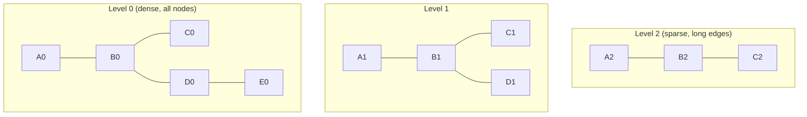

# Вопросы на собеседовании: `Vector Databases`

**Vector databases** — специализированные БД для хранения и быстрого поиска **embeddings** (high-dimensional векторов). Главная операция — **kNN search**: найти k ближайших векторов к query. Используют ANN-алгоритмы (HNSW, IVF). Стек: Pinecone, Weaviate, Qdrant, Milvus, Chroma, pgvector, Elasticsearch.

## Полезные ссылки

### Официальная документация и авторитетные источники

- [Pinecone Documentation](https://docs.pinecone.io/)
- [Weaviate Documentation](https://weaviate.io/developers/weaviate)
- [Qdrant Documentation](https://qdrant.tech/documentation/)
- [Milvus Documentation](https://milvus.io/docs/)
- [pgvector PostgreSQL extension](https://github.com/pgvector/pgvector)
- [HNSW paper](https://arxiv.org/abs/1603.09320)
- [Vector DB benchmarks](https://benchmark.vectorview.ai/)

## Содержание

- [Полезные ссылки](#полезные-ссылки)
- [See also](#see-also)

**Базовые понятия**
- [Q1. (!) Что такое vector database?](#q1--что-такое-vector-database)
- [Q2. (!) Зачем нужна специальная БД для векторов?](#q2--зачем-нужна-специальная-бд-для-векторов)
- [Q3. (!) Что такое embedding и почему они high-dim?](#q3--что-такое-embedding-и-почему-они-high-dim)

**Distance metrics**
- [Q4. (!) Cosine similarity vs Dot product vs Euclidean?](#q4--cosine-similarity-vs-dot-product-vs-euclidean)
- [Q5. Когда какую метрику выбрать?](#q5-когда-какую-метрику-выбрать)

**ANN алгоритмы**
- [Q6. (!) Что такое ANN (Approximate Nearest Neighbor)?](#q6--что-такое-ann-approximate-nearest-neighbor)
- [Q7. (!) HNSW (Hierarchical Navigable Small World)?](#q7--hnsw-hierarchical-navigable-small-world)
- [Q8. IVF (Inverted File Index)?](#q8-ivf-inverted-file-index)
- [Q9. (!) Сравнение HNSW vs IVF?](#q9--сравнение-hnsw-vs-ivf)
- [Q10. Product Quantization (PQ)?](#q10-product-quantization-pq)
- [Q11. ScaNN, FAISS, Annoy?](#q11-scann-faiss-annoy)

**Главные продукты**
- [Q12. (!) Pinecone — managed vector DB?](#q12--pinecone--managed-vector-db)
- [Q13. (!) Weaviate?](#q13--weaviate)
- [Q14. (!) Qdrant?](#q14--qdrant)
- [Q15. Milvus?](#q15-milvus)
- [Q16. (!) pgvector — PostgreSQL extension?](#q16--pgvector--postgresql-extension)
- [Q17. Chroma — embedded option?](#q17-chroma--embedded-option)
- [Q18. Elasticsearch / OpenSearch как vector DB?](#q18-elasticsearch--opensearch-как-vector-db)

**Возможности**
- [Q19. (!) Hybrid search (vector + keyword)?](#q19--hybrid-search-vector--keyword)
- [Q20. (!) Metadata filtering?](#q20--metadata-filtering)
- [Q21. Multi-tenancy?](#q21-multi-tenancy)
- [Q22. Replication, sharding?](#q22-replication-sharding)

**Performance**
- [Q23. (!) Recall vs latency trade-off?](#q23--recall-vs-latency-trade-off)
- [Q24. Quantization для cost reduction?](#q24-quantization-для-cost-reduction)
- [Q25. (!) Сколько векторов обычно?](#q25--сколько-векторов-обычно)

**Production**
- [Q26. (!) Какой vector DB выбрать?](#q26--какой-vector-db-выбрать)
- [Q27. Backup, restore, migrations?](#q27-backup-restore-migrations)
- [Q28. (!) Какие подводные камни в production?](#q28--какие-подводные-камни-в-production)

## Q1. (!) Что такое vector database?

**Vector database** — БД, оптимизированная для:
1. **Хранения** high-dimensional векторов (обычно 256-3072 dims)
2. **Быстрого kNN search** — найти k ближайших векторов
3. **Metadata filtering** — фильтровать с условиями (tenant, date)
4. **Hybrid search** — vector + keyword + metadata

**Применения:**
- **Semantic search** — поиск по смыслу
- **RAG** — retrieval для LLM
- **Recommendations** — похожие items
- **Anomaly detection** — outliers in vector space
- **Image / audio search** — multimedia retrieval


> [!mcq]
>
> - [x] **A.** Специализированная БД для high-dimensional векторов с ANN-индексами (HNSW, IVF) и kNN-поиском
>
>     Vector database хранит embeddings (256–3072 dims) и быстро находит k ближайших векторов через approximate nearest neighbor алгоритмы. Дополнительно: metadata filtering, hybrid search, replication. Применения — semantic search, RAG, recommendations, anomaly detection.
>
>     ВАЖНО: основная операция — kNN search, а не точное равенство по ключу как в classic OLTP.
>
> - [ ] **B.** Обычная реляционная БД (Postgres / MySQL) с колонкой типа `VARBINARY` для хранения векторов
>
>     B-tree индексы и WHERE-фильтры не работают для multi-dimensional similarity search — придётся делать full table scan и сравнивать каждый вектор (`O(n)`).
>
>     ПОСЛЕДСТВИЕ: на 10M векторов один запрос займёт минуты вместо миллисекунд — production-сервис ляжет под нагрузкой RAG.
>
> - [ ] **C.** Time-series база (InfluxDB, TimescaleDB) для хранения временных метрик ML-моделей
>
>     Это совершенно другой класс БД — оптимизирован для append-only timestamped данных, а не для similarity search в high-dim пространстве.
>
>     ПОСЛЕДСТВИЕ: при попытке хранить embeddings в TSDB получите ни kNN-индексов, ни эффективного фильтра по metadata — продукт не взлетит.
>
> - [ ] **D.** In-memory cache (Redis) исключительно для key-value доступа к embeddings по ID
>
>     Redis умеет хранить вектора и с RediSearch даже искать по ним, но «cache по ID» — это не vector DB. Без ANN-индекса возвращаемся к brute force.
>
>     ПОСЛЕДСТВИЕ: разработчики думают «у нас есть vector DB», а по факту делают O(n) сравнение на каждый запрос — latency растёт линейно с корпусом.

## Q2. (!) Зачем нужна специальная БД для векторов?

**Без vector DB:** brute force kNN — `O(n)` сравнений каждого vector с query.

```
1M векторов × 1024 dims = 4 GB
Brute force search: ~500 ms на CPU (slow)
```

**Vector DB через ANN:** `O(log n)` или близко, **миллисекунды** на поиск.

**Postgres с обычным индексом** — не работает для векторов (b-tree не для multi-dim).

**Vector DB предоставляет:**
- HNSW / IVF индексы
- Quantization
- Distributed scaling
- Hybrid search
- Streaming updates


> [!mcq]
>
> - [ ] **A.** Реляционная БД с B-tree индексом и WHERE-фильтром по компонентам вектора отлично решает задачу
>
>     B-tree работает только на одномерных упорядоченных ключах. У 1024-мерного вектора нет естественного порядка — невозможно построить индекс, который ускорит «найди ближайшего соседа в L2».
>
>     ПОСЛЕДСТВИЕ: запросы вырождаются в seq scan по всей таблице — на миллионе строк это сотни мс CPU-времени per query, RAG-пайплайн становится неюзабельным.
>
> - [x] **B.** Brute force kNN — это O(n), а специальные БД дают O(log n) через ANN-индексы (HNSW/IVF) и quantization
>
>     1M векторов × 1024 dims = 4 GB; full scan на CPU ≈ 500 ms. Vector DB через HNSW даёт миллисекунды, IVF — десятки мс. Plus: distributed scaling, streaming updates, hybrid search, quantization для cost reduction. Postgres B-tree не работает на multi-dim — нужен pgvector с HNSW/IVFFlat.
>
>     ВАЖНО: разница не в «удобстве», а в алгоритмической сложности — иначе latency растёт линейно с корпусом.
>
> - [ ] **C.** Single-threaded сравнение каждого вектора с query достаточно быстрое на современных CPU
>
>     На корпусе 100K–1M это уже сотни мс на запрос даже с SIMD. На 10M+ — секунды. Production RAG требует p95 < 50 ms, а параллельные пользователи быстро забивают пул потоков.
>
>     ПОСЛЕДСТВИЕ: при росте корпуса latency деградирует линейно, throughput падает — реальный продакшен (Pinecone, Qdrant) использует ANN именно по этой причине.
>
> - [ ] **D.** Достаточно сохранить вектора в S3 как JSON и читать их при поиске
>
>     Без индекса в RAM каждый запрос превращается в I/O-bound full scan — сотни мегабайт на запрос. S3 — это object storage, не базовая абстракция для поиска.
>
>     ПОСЛЕДСТВИЕ: latency измеряется секундами, cost на S3 GET-запросы взлетает, а throughput ограничен пропускной способностью сети.

## Q3. (!) Что такое embedding и почему они high-dim?

**Embedding** — представление текста/изображения как вектор чисел.

```
"Hello" → [0.12, -0.45, 0.78, ..., 0.03]  (например, 1536 чисел)
```

**Зачем high-dim:**
- Каждое измерение = abstract feature ("любовь", "технологии", "грусть", ...)
- Больше измерений = больше features = точнее представление
- Но дороже storage и slower поиск

**Trade-off:**
- 384 dims (`all-MiniLM-L6-v2`) — быстро, экономно
- 1024 dims (Cohere) — баланс
- 1536 dims (`text-embedding-3-small`) — стандарт OpenAI
- 3072 dims (`text-embedding-3-large`) — лучшее качество

Подробнее — в [Embeddings](embeddings-interview.md).


> [!mcq]
>
> - [ ] **A.** Embedding — это hash от текста для быстрого lookup по равенству
>
>     Hash детерминирован, но не сохраняет семантическую близость: «king» и «queen» имеют близкие embeddings, но совершенно разные hash-значения. Hash годится для exact-match, не для similarity.
>
>     ПОСЛЕДСТВИЕ: если использовать hash вместо embedding, semantic search вырождается в exact-match и весь смысл RAG/recommendations теряется.
>
> - [ ] **B.** Embedding — это one-hot vector размером со словарь, где dimensions = количеству уникальных слов
>
>     One-hot — это устаревшее представление (до 2013) с миллионами sparse-измерений без семантики: «cat» и «kitten» ортогональны (similarity = 0).
>
>     ПОСЛЕДСТВИЕ: получите огромные sparse-вектора без semantic similarity — нельзя найти «похожее по смыслу», только exact word match.
>
> - [x] **C.** Embedding — dense vector чисел (256–3072 dims), где близость в пространстве отражает semantic similarity
>
>     Каждое измерение — abstract feature, выученная моделью (transformer, CLIP). «Hello» → `[0.12, -0.45, ...]` размерности 384–3072. Trade-off: больше dims = точнее, но дороже storage и slower поиск. Стандарты: 384 (MiniLM, быстро), 1024 (Cohere), 1536 (OpenAI text-embedding-3-small), 3072 (text-embedding-3-large).
>
>     ВАЖНО: high-dim нужна именно для того, чтобы линейная разделимость концепций стала возможной — в low-dim близкие смыслы коллапсируют.
>
> - [ ] **D.** Embedding — это zip-сжатие raw текста с восстановлением через декодер
>
>     Embedding — lossy lossy projection в смысловое пространство, а не сжатие. Из 1536-dim вектора нельзя восстановить исходный текст байт-в-байт — это feature extraction, не compression.
>
>     ПОСЛЕДСТВИЕ: ожидание «расжать обратно» приведёт к разочарованию — embeddings нужны для similarity, а для исходного текста надо хранить его рядом в metadata.

## Q4. (!) Cosine similarity vs Dot product vs Euclidean?

**Cosine similarity:**
```
cos(A, B) = (A · B) / (|A| × |B|)
range: [-1, 1] (1 = идентичные)
```
Не зависит от magnitude (длины) векторов.

**Dot product:**
```
A · B = Σ a_i × b_i
range: (−∞, +∞)
```
Зависит и от angle, и от magnitude.

**Euclidean distance (L2):**
```
||A − B|| = sqrt(Σ (a_i − b_i)²)
range: [0, ∞) (0 = идентичные)
```

**Manhattan (L1):** `Σ |a_i − b_i|` — реже используется.


> [!mcq]
>
> - [ ] **A.** Все три метрики дают идентичный ranking результатов независимо от свойств векторов
>
>     Cosine и dot совпадают только на нормализованных векторах (`||v|| = 1`). Если magnitude варьируется — dot отдаёт предпочтение «длинным» векторам, что меняет порядок top-k по сравнению с cosine. Euclidean вообще измеряет разницу позиций, а не angle.
>
>     ПОСЛЕДСТВИЕ: смешивая метрики на ненормализованных embeddings, получите разные top-k и непредсказуемое качество retrieval — типичный баг при миграции между embedding-моделями.
>
> - [ ] **B.** Cosine similarity всегда лучше dot product, потому что dot product не имеет геометрического смысла
>
>     Dot имеет смысл: это проекция одного вектора на другой и совпадает с cosine на нормализованных векторах. Более того, для нормализованных embeddings dot **быстрее** — не надо считать норму.
>
>     ПОСЛЕДСТВИЕ: запрет dot product закроет оптимизацию, которая даёт 1.5–2× ускорение на нормализованных моделях (OpenAI, Cohere) без потери качества.
>
> - [ ] **C.** Euclidean distance даёт лучший recall чем cosine для всех типов embeddings
>
>     Recall зависит от того, **какой метрикой обучалась модель**. Большинство современных embedding-моделей (OpenAI, Cohere, Sentence-Transformers, CLIP) обучаются с cosine loss — Euclidean даст хуже recall именно потому, что не соответствует training objective.
>
>     ПОСЛЕДСТВИЕ: использование «не той» метрики ломает семантику — модель оптимизирована под angle, а вы меряете distance, retrieval-quality деградирует на 10–30%.
>
> - [x] **D.** Cosine не зависит от magnitude (только angle), dot зависит от magnitude и angle, Euclidean — от позиции; на нормализованных векторах cosine ≡ dot, но dot быстрее
>
>     `cos(A,B) = (A·B)/(|A|·|B|)`, range [-1,1]. `A·B = Σ a_i·b_i`, range (-∞,+∞). `||A-B|| = sqrt(Σ(a_i-b_i)²)`, range [0,∞). Для `||v||=1` (OpenAI, Cohere, Voyage) `cos == dot`, но dot быстрее (без normalization). Sentence-transformers/CLIP — cosine. Manhattan (L1) `Σ|a_i-b_i|` используется реже.
>
>     ВАЖНО: выбор метрики должен соответствовать тому, как обучалась embedding-модель — это не вопрос вкуса, а вопрос корректности.

## Q5. Когда какую метрику выбрать?

**Для embedding моделей:**
- **OpenAI, Cohere, Voyage** — нормализованные → **cosine = dot product** (выбирай dot для скорости)
- **Sentence transformers** — обычно cosine
- **Image embeddings (CLIP)** — cosine

**Best practice:** проверь docs модели. Если рекомендована cosine — используй cosine.

**Для нормализованных векторов** (`||v|| = 1`) — cosine == dot product. Вычисление dot быстрее (без normalization).


> [!mcq]
>
> - [x] **A.** Выбирать ту метрику, под которую обучалась embedding-модель; для нормализованных моделей (OpenAI, Cohere) — dot product как более быстрый эквивалент cosine
>
>     OpenAI/Cohere/Voyage выдают нормализованные векторы → cosine ≡ dot, выбирай dot для скорости (нет деления на норму). Sentence-transformers — cosine. CLIP — cosine. Главное правило: открыть docs модели и взять рекомендованную метрику — это та, под которую считался training loss.
>
>     ВАЖНО: на нормализованных векторах dot выигрывает 1.5–2× по latency без потери recall — это бесплатная оптимизация, если знать что embeddings уже unit-length.
>
> - [ ] **B.** Всегда выбирать Euclidean — она универсальна и работает с любой моделью
>
>     Euclidean игнорирует тот факт, что современные embeddings обучаются с cosine/dot loss. На нормализованных векторах Euclidean монотонно связана с cosine (`||a-b||² = 2 - 2·cos`), но на ненормализованных — даёт совершенно другой ranking.
>
>     ПОСЛЕДСТВИЕ: подмена рекомендуемой метрики на Euclidean «по умолчанию» снижает retrieval-quality на 10–30% и ломает RAG-пайплайн без видимой причины.
>
> - [ ] **C.** Выбор метрики не важен — можно использовать любую, главное consistency между upsert и query
>
>     Consistency обязательна, но недостаточна. Если индекс построен на Euclidean, а модель обучалась с cosine — top-k будет систематически «не тем» даже при идеальном matching upsert/query.
>
>     ПОСЛЕДСТВИЕ: получите стабильно низкий recall и думать что виновата модель — а виновато несоответствие метрики и training objective.
>
> - [ ] **D.** Cosine дороже dot product даже на нормализованных векторах, поэтому Pinecone/Qdrant используют только Euclidean
>
>     Pinecone, Qdrant, Weaviate, pgvector поддерживают **все три** метрики и default обычно cosine. На нормализованных векторах сам HNSW считает dot — это деталь реализации, не выбор метрики на уровне API.
>
>     ПОСЛЕДСТВИЕ: ложное утверждение про «только Euclidean» приведёт к неправильному выбору vector DB по несуществующему ограничению.

## Q6. (!) Что такое ANN (Approximate Nearest Neighbor)?

**Exact kNN** — гарантированно найти **истинные** top-k ближайших. `O(n)` без индекса.

**ANN** — найти **приблизительно** top-k, в обмен на скорость. Может пропустить пару near-misses.

**Recall:** доля **истинных** top-k среди возвращённых.
- Recall = 0.95 — нашли 95% правильных результатов
- Recall = 1.0 — exact (то же что brute force)

**Trade-off:**
- Высокий recall = более точно, но медленнее
- Низкий recall = быстрее, но больше false negatives

В production ANN с recall **0.9-0.99** — приемлемо для большинства задач.


> [!mcq]
>
> - [ ] **A.** ANN — это exact kNN, реализованный через GPU; recall всегда 1.0, отличается только hardware
>
>     ANN расшифровывается как Approximate Nearest Neighbor — буква «A» означает именно «приблизительный», а не «accelerated». GPU-ускоренные exact kNN существуют (например, FAISS Flat на GPU), но это **не ANN** — у них recall=1.0 и сложность всё ещё O(n).
>
>     ПОСЛЕДСТВИЕ: путаница в терминологии приведёт к неверным архитектурным решениям — будете ждать exact-результатов от HNSW и удивляться отсутствующим записям в top-k.
>
> - [x] **B.** ANN — приблизительный поиск top-k с измеримой потерей качества (recall), даёт sub-linear latency в обмен на возможные near-miss; production обычно настраивают на recall 0.9–0.99
>
>     Exact kNN — O(n) full scan, гарантирует истинные top-k. ANN (HNSW/IVF) — sub-linear, может пропустить пару кандидатов. Recall = доля истинных top-k среди возвращённых: 0.95 = нашли 95% правильных. Trade-off: высокий recall ⇒ выше latency. В production 0.9–0.99 — приемлемо для RAG/recommendations, для критичных задач (fraud, medical) — выше или exact.
>
>     ВАЖНО: recall — это metric, который надо мерить на eval-set, а не «доверять» библиотеке. Параметры efSearch/nprobe тюнятся под целевой recall.
>
> - [ ] **C.** ANN означает «Artificial Neural Network» — это нейросеть, которая предсказывает соседей по embedding
>
>     В контексте vector search ANN = Approximate Nearest Neighbor. Artificial Neural Network — другая концепция (используется для генерации самих embeddings, но не для поиска по индексу).
>
>     ПОСЛЕДСТВИЕ: будете искать «модель ANN» в HuggingFace вместо настройки HNSW/IVF индекса — потеряете время на ложном пути.
>
> - [ ] **D.** ANN гарантирует тот же top-k что exact kNN, просто быстрее за счёт SIMD-инструкций
>
>     Если бы ANN гарантировал тот же top-k — он был бы exact kNN. Само слово «approximate» означает что результат может отличаться. SIMD ускоряет brute force, но не превращает его в ANN.
>
>     ПОСЛЕДСТВИЕ: при тестировании сравнения с exact будут «таинственные» расхождения, которые на самом деле — нормальное поведение ANN с recall < 1.0.

## Q7. (!) HNSW (Hierarchical Navigable Small World)?

**HNSW** — самый популярный ANN алгоритм с **2018+**. Граф на нескольких уровнях.



**Search:**
1. Стартуем с верхнего уровня
2. Greedy walk к ближайшему соседу
3. Спускаемся на уровень ниже
4. Повторяем до уровня 0
5. Best k результатов

**Преимущества:**
- Excellent recall/latency trade-off
- Поддерживает **incremental updates** (insert/delete)
- Работает в memory (быстро)

**Недостатки:**
- Память: ~1.5-3x размер векторов
- Build slow

**Параметры:**
- `M` — связность графа (16-64). Больше = точнее, больше памяти.
- `efConstruction` — quality build (200-500). Больше = медленнее build.
- `efSearch` — quality search. Больше = медленнее search, выше recall.


> [!mcq]
>
> **Вопрос:** Что делает HNSW многоуровневую графовую структуру эффективной для ANN-поиска и какая ключевая особенность отличает её от других ANN-индексов?
>
> - [ ] HNSW строит сбалансированное B-дерево по векторам и обеспечивает гарантированный O(log N) точный поиск без потери recall
>   - Почему неверно: B-деревья работают на 1D ключах и неприменимы к high-dim векторам (curse of dimensionality)
>   - Корректная модель: HNSW — это **multi-layer graph** (не дерево), верхние уровни sparse для быстрой навигации, нижний — dense со всеми узлами
>   - Последствие на практике: попытка использовать B-tree-логику приведёт к линейному скану и деградации latency на миллионах векторов
>
> - [ ] HNSW требует периодического полного rebuild при каждом insert/delete, поэтому подходит только для статичных датасетов
>   - Почему неверно: одна из главных фишек HNSW — поддержка **incremental updates** (insert/delete без rebuild)
>   - Корректная модель: новый вектор вставляется greedy walk от верхнего уровня, соединяется с M ближайшими соседями; rebuild не нужен
>   - Последствие на практике: ошибочный выбор IVF для динамичных данных приведёт к необходимости retraining и downtime для реиндексации
>
> - [x] HNSW использует иерархию графов с long-range рёбрами наверху и dense связностью внизу: search идёт greedy walk сверху вниз, давая отличный recall/latency trade-off при O(log N) ожидаемой сложности
>   - Механизм: верхние слои — sparse small-world граф для крупных прыжков; ef_search контролирует ширину beam-search на уровне 0; M задаёт связность графа
>   - Trade-off: память ~1.5-3× от размера векторов и медленный build (efConstruction 200-500) в обмен на лучший recall@latency среди ANN
>   - Когда применять: latency-critical workloads (RAG, semantic search, recommender) с динамическими данными — дефолт в Pinecone, Weaviate, Qdrant, pgvector
>
> - [ ] HNSW гарантирует exact nearest neighbor поиск и используется когда нужна 100% точность совпадения
>   - Почему неверно: HNSW — это **A**pproximate NN алгоритм, recall обычно 0.95-0.99, не 1.0
>   - Корректная модель: для exact search нужен brute-force (O(N)) — приемлемо только на маленьких корпусах (<10k); HNSW сознательно жертвует точностью ради скорости
>   - Последствие на практике: если бизнес-требование — exact match (например, дедупликация по точному эмбеддингу), HNSW даст false negatives на edge-cases


## Q8. IVF (Inverted File Index)?

**IVF** — разбить векторы на **clusters** (k-means), искать только в ближайших clusters.

```
1. Pre-build: kmeans → N clusters (centroids)
2. Каждый vector присвоен ближайшему centroid
3. Search: найти top-k closest centroids → искать только в них
```

**Параметры:**
- `nlist` — число clusters (обычно √N)
- `nprobe` — сколько clusters обыскивать (1-10% от nlist)

Чем больше `nprobe` — выше recall, медленнее search.

**Преимущества:**
- Меньше памяти, чем HNSW
- Быстрый build

**Недостатки:**
- Хуже recall на тех же latencies, чем HNSW
- Нужен retraining при больших data drift


> [!mcq]
>
> **Вопрос:** Какова основная идея IVF (Inverted File Index) и какой параметр контролирует баланс recall/latency на этапе поиска?
>
> - [ ] IVF строит multi-layer навигационный граф со skip-уровнями, аналогично HNSW, но с меньшим параметром M для экономии памяти
>   - Почему неверно: IVF — это **partition-based** алгоритм (k-means clustering), а не graph-based; путать с HNSW — типичная ошибка
>   - Корректная модель: pre-build делает k-means на N точек → nlist центроидов; каждый вектор приписан ближайшему центроиду — никакого графа нет
>   - Последствие на практике: непонимание разницы приведёт к неверной настройке (efSearch не существует для IVF, нужен nprobe)
>
> - [ ] IVF использует параметр `nlist` во время search для выбора числа сканируемых clusters: чем больше nlist — тем выше recall
>   - Почему неверно: `nlist` — это **build-time** параметр (число центроидов, обычно √N), а не search-time
>   - Корректная модель: на этапе поиска nlist уже зафиксирован; recall/latency регулируется через **nprobe** (1-10% от nlist) — сколько кластеров обыскивать
>   - Последствие на практике: попытка крутить nlist в проде потребует полного rebuild индекса вместо мгновенной настройки nprobe
>
> - [ ] IVF поддерживает incremental updates без retraining и оптимален для динамичных датасетов с постоянными insert/delete
>   - Почему неверно: при значительном data drift центроиды становятся неоптимальными — нужен **retraining** (новый k-means)
>   - Корректная модель: IVF подходит для относительно стабильных распределений; для динамики лучше HNSW с incremental insertion
>   - Последствие на практике: без retraining recall деградирует со временем — векторы попадают не в свои кластеры, поиск пропускает relevant соседей
>
> - [x] IVF разбивает векторное пространство на nlist кластеров через k-means; при поиске пробует только top nprobe ближайших центроидов — параметр **nprobe** на этапе query управляет recall/latency trade-off
>   - Механизм: query vector сравнивается с nlist центроидами (дешёво) → выбираются top-nprobe → exhaustive search внутри них; всё остальное игнорируется
>   - Trade-off: меньше памяти и быстрее build чем HNSW, но хуже recall@latency и нужен retrain при data drift; nprobe=1 даёт максимум скорости, nprobe=nlist эквивалентен brute-force
>   - Когда применять: memory-constrained сценарии с миллиардами векторов и относительно статичным распределением — часто комбинируется с PQ (IVF-PQ) в FAISS/Milvus


## Q9. (!) Сравнение HNSW vs IVF?

| Критерий | HNSW | IVF |
|----------|------|-----|
| Recall/latency | **Лучше** | Хуже |
| Memory | Больше | Меньше |
| Build speed | Медленнее | Быстрее |
| Updates | **Incremental** | Нужен retrain |
| Best для | Latency-critical | Larger datasets, memory-constrained |

**В 2025** — HNSW **дефолт** в большинстве vector DBs (Pinecone, Weaviate, Qdrant, pgvector). IVF используется реже, для memory-constrained scenarios.


> [!mcq]
>
> **Вопрос:** Команда выбирает ANN-индекс для production semantic search с 50M документов, частыми обновлениями каталога и SLA p95 < 50ms. Какой индекс предпочтительнее и почему?
>
> - [x] HNSW — даёт лучший recall/latency trade-off, поддерживает incremental insert/delete без rebuild, и стал дефолтом в Pinecone/Weaviate/Qdrant/pgvector именно для latency-critical workloads
>   - Механизм: graph-based search идёт greedy walk сверху вниз → точное соответствие требованию p95<50ms на 50M; новые документы каталога вставляются inline через efConstruction без блокировки трафика
>   - Trade-off: память 1.5-3× от raw vectors (для 50M × 768-dim float32 ≈ 150GB → можно шардить), build медленнее IVF — но это разовая стоимость
>   - Когда применять: именно этот сценарий — latency-critical + dynamic data; HNSW — стандарт индустрии в 2025 для RAG/semantic search/recommender
>
> - [ ] IVF — экономит память по сравнению с HNSW, поэтому всегда предпочтительнее для production с большими датасетами
>   - Почему неверно: «всегда предпочтительнее» — false; IVF хуже по recall@latency и **требует retraining** при data drift, что несовместимо с частыми обновлениями каталога
>   - Корректная модель: IVF выбирают когда memory — главный constraint, а данные стабильны; для динамики и latency-критичности — HNSW
>   - Последствие на практике: периодический retrain k-means на 50M потребует часов downtime либо deployment второго индекса для switchover — операционно дороже, чем экономия памяти
>
> - [ ] Brute-force (exact KNN) — единственный способ гарантировать корректность search, ANN-индексы давать неверные результаты
>   - Почему неверно: brute-force на 50M даёт O(N) per query → сотни ms-секунд, p95<50ms физически недостижим; ANN — индустриальный стандарт с recall 0.95-0.99
>   - Корректная модель: для semantic search 95-99% recall более чем достаточно (релевантность определяется не топ-1, а топ-k); SLA важнее идеальной точности
>   - Последствие на практике: попытка использовать brute-force провалит SLA, потребует огромного кластера CPU/GPU, и пользователи всё равно не заметят разницы в recall
>
> - [ ] IVF-PQ — комбинация даёт максимальный recall и лучше всего подходит для динамичных каталогов с частыми обновлениями
>   - Почему неверно: PQ — **lossy** compression, recall ниже чем у чистого HNSW; «максимальный recall» — антитезис PQ
>   - Корректная модель: IVF-PQ выбирают для **миллиардов** векторов (не 50M) когда память — критичный bottleneck и можно жертвовать recall ради 128× compression
>   - Последствие на практике: для 50M IVF-PQ даст худший recall без выигрыша по памяти (50M влезает в HNSW на 1-2 нодах), плюс retrain при data drift


## Q10. Product Quantization (PQ)?

**Product Quantization** — compression векторов для memory savings.

**Идея:** разделить vector на **subvectors**, quantize каждый отдельно.

```
1024-dim vector → 32 chunks по 32 dims → quantize каждый в 8 bits
Result: 32 bytes (vs 4096 bytes original)
128x compression
```

**Trade-off:** меньше recall (lossy compression).

**Combined: IVF-PQ** или **HNSW-PQ** — для **очень больших** datasets (миллиарды векторов).

Используется в **FAISS**, **Milvus**.


> [!mcq] В чём суть Product Quantization (PQ) для сжатия векторов?
>
> - [ ] **A) PQ сжимает каждый вектор целиком одним k-means на 256 центроидов и хранит ID центроида**
>   - **Что на самом деле:** так работает обычная скалярная/векторная квантизация — один codebook на весь вектор. PQ принципиально делит вектор на subvectors и обучает **отдельный** codebook для каждого куска.
>   - **Откуда путаница:** PQ действительно использует k-means внутри, поэтому легко свести его к «один codebook». Но именно декартово произведение независимых codebook'ов даёт экспоненциальный выигрыш (256^32 возможных комбинаций при 32 чанках).
>   - **Если бы это было правдой:** 1024-dim вектор сжимался бы в 1 байт, и вся high-dim информация терялась бы катастрофически — recall упал бы до неюзабельного уровня.
>
> - [ ] **B) PQ — это lossless алгоритм компрессии типа gzip, применённый к float32-векторам**
>   - **Что на самом деле:** PQ — это **lossy** quantization. Каждый subvector заменяется ближайшим центроидом из codebook, и оригинальные значения восстановить нельзя.
>   - **Откуда путаница:** слово «compression» по умолчанию ассоциируется с gzip/zstd. Но general-purpose сжатие даёт максимум 2-3× на float'ах, а PQ даёт 32-128× именно за счёт потерь.
>   - **Если бы это было правдой:** не пришлось бы делать re-ranking на оригинальных векторах, и не было бы trade-off с recall — но тогда бы и сжатия 128× не существовало.
>
> - [ ] **C) PQ строит graph index типа HNSW, но с пониженной размерностью векторов через PCA**
>   - **Что на самом деле:** PQ — это **компрессия векторов**, а не indexing structure. HNSW и IVF — отдельные ANN-индексы, которые можно скомбинировать с PQ (IVF-PQ, HNSW-PQ). PCA — линейная projection, совсем другой подход.
>   - **Откуда путаница:** PQ часто используется **внутри** HNSW/IVF индексов, поэтому в документации FAISS они идут рядом. Но это ортогональные техники: index = как искать, PQ = как хранить.
>   - **Если бы это было правдой:** не было бы комбинаций «HNSW-PQ» и «IVF-PQ» как отдельных опций в FAISS — они существуют именно потому, что PQ это слой компрессии поверх индекса.
>
> - [x] **D) PQ делит вектор на M subvectors, обучает отдельный codebook (k-means) на каждом, хранит вектор как M байтов с ID центроидов**
>   - **Развёрнутое объяснение:** Product Quantization — это lossy compression для high-dim векторов. Вектор размерности D режется на M равных частей размерности D/M. Для каждой позиции subvector'а обучается **независимый** codebook через k-means (обычно k=256, чтобы ID помещался в 1 байт). Итог: вектор хранится как M байтов вместо D×4 байт. Поиск ускоряется через **asymmetric distance computation (ADC)**: query не квантизуется, расстояния от query до всех центроидов каждого codebook'а считаются один раз и кэшируются в lookup table, дальше distance до любого compressed вектора = сумма M lookup'ов.
>   - **Пример:** 1024-dim float32 vector = 4096 bytes. M=32, D/M=32 dims на subvector, k=256 центроидов. Результат: 32 bytes на вектор — **128× compression**. Для 1B векторов это разница между 4 TB и 32 GB — помещается в RAM одного хоста.
>   - **Когда применять:** датасеты от ~100M векторов, когда RAM становится bottleneck'ом; в комбинации с IVF (IVF-PQ) для миллиардов; когда recall@10 = 0.85-0.90 приемлем (часто компенсируется re-ranking на топ-K оригинальных векторов).
>   - **Подводные камни:** (1) recall падает с ростом M — нужно подбирать под задачу; (2) обучение codebook'ов требует representative sample (>100k векторов); (3) ADC даёт оценку дистанции, а не точную — для финального ranking нужен rerank на uncompressed векторах; (4) PQ плохо работает на векторах с сильной корреляцией между координатами — стоит делать random rotation (OPQ) перед квантизацией.
>   - **Связанные вопросы:** [[Q8]] HNSW, [[Q9]] HNSW vs IVF, [[Q11]] FAISS как реализация PQ.

## Q11. ScaNN, FAISS, Annoy?

| Library | Создатель | Особенности |
|---------|-----------|-------------|
| **FAISS** | Meta | Самая популярная C++ library. IVF, HNSW, PQ. Не managed DB. |
| **ScaNN** | Google | Очень быстрый. Используется в YouTube, Search. |
| **Annoy** | Spotify | Tree-based (не graph). Простой, но хуже HNSW. |
| **HNSWlib** | — | Lightweight HNSW C++ |

**FAISS** часто используется как **embedded** library внутри custom apps. Vector DBs (Milvus, Vespa) построены поверх FAISS-подобных движков.


> [!mcq] Чем принципиально отличаются FAISS, ScaNN и Annoy как ANN-библиотеки?
>
> - [x] **A) FAISS — C++ библиотека Meta с IVF/HNSW/PQ (не БД); ScaNN — оптимизированная Google-библиотека (asymmetric hashing); Annoy — Spotify, tree-based forest, проще но менее точная**
>   - **Развёрнутое объяснение:** Все три — **embedded ANN-библиотеки** (не managed БД), но с разной архитектурой. **FAISS** — самая универсальная: GPU support, десятки index types (Flat, IVF, IVFPQ, HNSW, IVFSQ), Python/C++ API. **ScaNN** делает упор на **asymmetric hashing + anisotropic quantization** — обучает квантизацию так, чтобы минимизировать ошибку именно для inner-product метрики; на ANN-benchmarks выигрывает по recall@10 на большинстве датасетов. **Annoy** строит **forest of random projection trees** — каждое дерево разбивает пространство случайной гиперплоскостью; ищет по нескольким деревьям и объединяет кандидатов; проигрывает HNSW по recall/speed, но даёт mmap-friendly формат файла (отсюда любовь Spotify к нему — load instantly).
>   - **Пример:** Pinterest visual search использует FAISS (миллиарды image embeddings, GPU); YouTube recommendations используют ScaNN внутри TFRS; Spotify music recommendations исторически на Annoy (mmap позволяет шарить index между сервисами без копирования в RAM).
>   - **Когда применять:** FAISS — дефолт для research и production когда нужны разные index types; ScaNN — когда нужен максимальный recall на inner-product метрике и есть TensorFlow в стеке; Annoy — когда index должен лежать на диске и mmap'иться (мобильные приложения, edge inference).
>   - **Подводные камни:** (1) ни одна из трёх не даёт **CRUD на векторах** — это библиотеки индексации, для production нужна обёртка с persistence и обновлениями; (2) FAISS не thread-safe для записи — нужен внешний lock; (3) Annoy требует **полной перестройки** при добавлении векторов (нет incremental updates); (4) ScaNN сложнее в deployment из-за зависимости от TensorFlow.
>   - **Связанные вопросы:** [[Q8]] HNSW, [[Q10]] PQ, [[Q12]] Pinecone, [[Q15]] Milvus как обёртка над FAISS-like движками.
>
> - [ ] **B) Все три — managed cloud services с REST API; различаются только ценой и регионами**
>   - **Что на самом деле:** все три — **embedded libraries**, которые подключаются как dependency в код (C++/Python). У них нет REST API, нет managed hosting, нет multi-tenancy. Managed-сервисы (Pinecone, Weaviate Cloud, Qdrant Cloud) — это отдельный класс продуктов, часто построенный **поверх** FAISS-подобных движков.
>   - **Откуда путаница:** в обсуждениях vector DB часто перечисляют «Pinecone, Weaviate, FAISS, Milvus» в одном списке. Но это разные уровни абстракции: FAISS — library, Pinecone — SaaS.
>   - **Если бы это было правдой:** не было бы смысла в Milvus и Vespa, которые именно оборачивают FAISS-style индексы в distributed БД с persistence и API.
>
> - [ ] **C) FAISS и Annoy используют HNSW под капотом, а ScaNN — это форк FAISS с поддержкой gRPC**
>   - **Что на самом деле:** HNSW — лишь один из десятков index types в FAISS, и Annoy его вообще не использует (Annoy строит RP-tree forest, фундаментально другой алгоритм). ScaNN — самостоятельная разработка Google на основе anisotropic quantization, не форк FAISS, и gRPC к нему не относится.
>   - **Откуда путаница:** HNSW стал де-факто стандартом и кажется, что «все ANN-библиотеки = HNSW». На деле есть три семейства: graph-based (HNSW, NSG), tree-based (Annoy, FLANN), quantization-based (IVF-PQ, ScaNN).
>   - **Если бы это было правдой:** не существовало бы benchmark-категорий по разным алгоритмам на ann-benchmarks.com — там сравнивают именно разные семейства.
>
> - [ ] **D) FAISS работает только на CPU, ScaNN только на TPU, Annoy только на мобильных устройствах**
>   - **Что на самом деле:** FAISS имеет **первоклассную GPU поддержку** (faiss-gpu — один из её главных козырей, ускорение в 10-20× на больших датасетах). ScaNN — это CPU-библиотека (TPU там не используется напрямую), оптимизированная под AVX-512. Annoy работает где угодно, не привязан к мобильным.
>   - **Откуда путаница:** Annoy любят за маленький binary и mmap, что удобно на мобильных — отсюда миф «только для мобильных». Но Spotify-серверы на нём работают годами.
>   - **Если бы это было правдой:** не было бы faiss-gpu пакета в PyPI и whole-FAISS-on-GPU benchmarks, которые регулярно показывают на NVIDIA конференциях.

## Q12. (!) Pinecone — managed vector DB?

**Pinecone** — самый популярный managed vector DB.

**Особенности:**
- **Fully managed SaaS** (нет self-hosted option)
- **Serverless** (с 2023+) — pay-per-use
- HNSW под капотом
- Metadata filtering, hybrid search
- Sparse-dense hybrid (с 2024)

```python
import pinecone
pinecone.init(api_key="...")
index = pinecone.Index("my-index")

index.upsert([
    ("id1", [0.1, 0.2, ...], {"category": "tech"}),
    ("id2", [0.3, 0.4, ...], {"category": "sport"})
])

results = index.query(
    vector=[0.1, 0.2, ...],
    top_k=10,
    filter={"category": "tech"}
)
```

**Цена:** дорогая для больших volumes (~$100/M vectors/month).

**Когда выбирать:** не хочется ops, малая команда, готовы платить.


> [!mcq] Что характеризует Pinecone как managed vector DB и когда его выбирать?
>
> - [ ] **A) Pinecone — open-source проект с возможностью self-hosted deployment в Kubernetes**
>   - **Что на самом деле:** Pinecone — это **fully managed proprietary SaaS**, исходного кода нет в публичном доступе, self-hosted opции **не существует**. Это его главное архитектурное отличие от Weaviate/Qdrant/Milvus, которые все open-source с managed-опцией.
>   - **Откуда путаница:** многие vector DB (Weaviate, Qdrant, Milvus) — open-source, и Pinecone часто упоминают в том же ряду. Но он сознательно построен как closed-source SaaS, что было причиной критики со стороны open-source сообщества.
>   - **Если бы это было правдой:** не было бы лock-in концерна при выборе Pinecone и не было бы такого роста Qdrant/Weaviate как «open-source альтернатив Pinecone».
>
> - [x] **B) Pinecone — fully managed proprietary SaaS (нет self-hosted); HNSW под капотом; serverless tier с pay-per-use; HTTP/gRPC API; выбирают когда нужно minimal ops и есть бюджет**
>   - **Развёрнутое объяснение:** Pinecone — самый известный managed vector DB, появился в 2019. Архитектура **closed-source SaaS**: данные хранятся в AWS/GCP/Azure под капотом, пользователь работает через REST/gRPC API. Под капотом — HNSW (с проприетарными оптимизациями). С 2023 появился **serverless tier** (отдельный movement compute/storage) — платишь только за storage и queries, без выделенных «pod'ов». Поддерживает **metadata filtering** (фильтры по атрибутам с pre-filter оптимизацией), **hybrid search** (sparse+dense, для BM25-like sparse vectors), namespaces (multi-tenancy внутри одного index). SDK для Python/Node/Go/Java.
>   - **Пример:** стартап делает RAG-чатбота для документации. Команда из 3 человек, нет DevOps. Берут Pinecone serverless — `pip install pinecone-client`, `index.upsert()`, `index.query()`, готово. Без него пришлось бы поднимать Qdrant в Kubernetes, настраивать persistence, мониторинг, backup'ы — недели работы.
>   - **Когда применять:** (1) маленькая команда без DevOps; (2) PoC/MVP — быстрый старт без инфраструктуры; (3) уже на AWS/GCP и проще через SaaS; (4) когда стоимость inженера-месяца на ops > чем разница в цене с self-hosted; (5) compliance требует SOC2/HIPAA, а Pinecone уже сертифицирован.
>   - **Подводные камни:** (1) **дорого** на масштабе — ~$70-100 в месяц на миллион векторов с базовой нагрузкой, против ~$30 на тот же объём в Qdrant Cloud или ~$10 на self-hosted; (2) **vendor lock-in** — нет миграционного пути «выгрузить index и поднять локально», только re-embedding и re-upsert; (3) ограниченная кастомизация — нельзя выбрать HNSW параметры (M, efConstruction); (4) latency p99 хуже чем у dedicated self-hosted из-за multi-tenant SaaS природы; (5) с 2024 Pinecone начал deprecation старых pod-based индексов в пользу serverless — миграция требует усилий.
>   - **Связанные вопросы:** [[Q1]] что такое vector DB, [[Q8]] HNSW, [[Q13]] Weaviate как альтернатива, [[Q14]] Qdrant как open-source альтернатива.
>
> - [ ] **C) Pinecone использует GraphQL API и встроенные модули для генерации embeddings типа text2vec-openai**
>   - **Что на самом деле:** это описание **Weaviate**, не Pinecone. Pinecone использует REST/gRPC (без GraphQL) и **не делает embeddings сам** — пользователь должен сгенерировать векторы внешним моделью (OpenAI Embeddings API, Cohere, локальная модель) и передать их в `upsert()`.
>   - **Откуда путаница:** оба продукта позиционируются как «managed vector DB для RAG», и фичу автоматических embeddings часто приписывают всем. Pinecone с 2024 добавил **Pinecone Inference** API для генерации embeddings, но это отдельный сервис, а не «модуль внутри index».
>   - **Если бы это было правдой:** не нужны были бы туториалы «как использовать OpenAI Embeddings + Pinecone», которые показывают именно явный шаг embed → upsert.
>
> - [ ] **D) Pinecone — это PostgreSQL extension типа pgvector, добавляющий vector type в существующую БД**
>   - **Что на самом деле:** Pinecone — самостоятельный SaaS, не связан с PostgreSQL. **pgvector** — это extension для Postgres, другой подход к проблеме (использовать существующую RDBMS вместо отдельной БД).
>   - **Откуда путаница:** оба решают задачу «хранение векторов», но это противоположные архитектурные подходы: Pinecone = специализированный SaaS, pgvector = embedded в OLTP-базу.
>   - **Если бы это было правдой:** Pinecone был бы бесплатным (как pgvector), и не имело бы смысла его managed tier $70+/M vectors.

## Q13. (!) Weaviate?

**Weaviate** — open-source vector DB, самый "feature-rich".

**Особенности:**
- Open-source (Apache 2.0) + managed cloud
- **GraphQL API** + REST + Python/JS clients
- **Modules** для embeddings (text2vec-openai, text2vec-cohere)
- **Hybrid search** (BM25 + vector)
- **Multi-tenancy** built-in
- **Generative search** — RAG в одной БД

```python
client.collections.create(
    name="Documents",
    vectorizer_config=Configure.Vectorizer.text2vec_openai(),
)

client.collections.get("Documents").data.insert({
    "title": "Hello",
    "content": "World"
})
# Embedding генерируется автоматически

results = collection.query.near_text(
    query="greetings",
    limit=5
)
```

**Когда:** хочется feature-rich, готовы запустить self-hosted.


> [!mcq] Что отличает Weaviate от других vector DB и почему его выбирают?
>
> - [ ] **A) Weaviate — closed-source proprietary SaaS без self-hosted опции, как Pinecone**
>   - **Что на самом деле:** Weaviate — **open-source под Apache 2.0**, можно self-host в Docker/Kubernetes; managed cloud (Weaviate Cloud Services) — опциональный SaaS поверх того же кода. Это противоположность Pinecone, которая именно proprietary-only.
>   - **Откуда путаница:** Weaviate Cloud рекламируется как managed-сервис, что у новичков ассоциируется с «значит закрытый». На деле open-source repo на GitHub имеет 11k+ звёзд и активно принимает PR'ы.
>   - **Если бы это было правдой:** не было бы смысла в self-hosted production deployments Weaviate в банках/госах, которым лицензионно нельзя использовать закрытый SaaS.
>
> - [x] **B) Weaviate — open-source (Apache 2.0) vector DB с GraphQL API, встроенными vectorizer-модулями (text2vec-openai/cohere), hybrid search BM25+vector и multi-tenancy**
>   - **Развёрнутое объяснение:** Weaviate позиционируется как самая **feature-rich** open-source vector DB. Ключевая идея — vectorizer-модули генерируют embedding автоматически при insert: пишешь `{"content": "Hello"}`, модуль `text2vec-openai` вызывает OpenAI и сохраняет вектор. Поддержка нескольких API: **GraphQL** (основной, удобен для nested filters), REST, gRPC, native Python/JS-клиенты. **Hybrid search** комбинирует BM25 (keyword) и vector similarity с alpha-параметром взвешивания. **Multi-tenancy** — каждый tenant изолирован, не нужно делать per-tenant collection. Есть **generative search** — модуль вызывает LLM (OpenAI/Cohere/Anthropic) прямо из БД, объединяя retrieval и generation в один запрос (RAG-in-DB).
>   - **Пример:** SaaS-документация для 1000 клиентов — multi-tenancy выделяет каждому изолированное пространство в одной collection; vectorizer-модуль избавляет от отдельного embedding-сервиса; hybrid search вытаскивает и точные совпадения по терминам (BM25), и семантически близкие (vector).
>   - **Когда применять:** нужен feature-rich vector DB с минимумом glue-кода (vectorizer внутри); готовы запустить self-hosted и поддерживать кластер; multi-tenant SaaS-сценарии; RAG, где хочется собрать pipeline в одной системе.
>   - **Подводные камни:** (1) GraphQL API мощный, но имеет learning curve и хуже работает с типичными ORM/SQL-инструментами; (2) vectorizer-модули привязывают к конкретному провайдеру (text2vec-openai требует OpenAI key и оплату на каждый insert); (3) memory footprint выше Qdrant'а на тех же датасетах; (4) consistency model — eventually consistent при репликации, не подходит для strict transactional сценариев.
>   - **Связанные вопросы:** [[Q12]] Pinecone (closed-source альтернатива), [[Q14]] Qdrant (Rust-альтернатива), [[Q15]] Milvus (distributed-альтернатива), [[Q16]] pgvector (extension вместо отдельной БД).
>
> - [ ] **C) Weaviate использует только sparse-векторы (TF-IDF/BM25) и не поддерживает dense embedding'и от neural networks**
>   - **Что на самом деле:** Weaviate — **dense-vector first** БД, dense-векторы являются основной структурой хранения. BM25 (sparse) добавлен как часть hybrid search **в дополнение** к dense vector search, а не как замена.
>   - **Откуда путаница:** упоминание BM25 в фичах могло создать впечатление «это keyword-search движок типа Elasticsearch». На деле BM25 в Weaviate — second-class citizen для hybrid mode.
>   - **Если бы это было правдой:** не было бы смысла в text2vec-openai модулях, которые именно генерируют dense embeddings размерности 1536.
>
> - [ ] **D) Weaviate написан на Python и предназначен только для prototyping, в production не используется**
>   - **Что на самом деле:** Weaviate написан на **Go** (production-grade language для concurrent systems), активно используется в production у клиентов уровня Stack Overflow, Instabase, Cohere. Python — только клиент.
>   - **Откуда путаница:** в туториалах виден Python-клиент, и легко спутать клиент с реализацией БД. Большинство modern vector DB именно так: сервер на Go/Rust/C++, клиенты на Python/JS.
>   - **Если бы это было правдой:** не было бы Helm-чартов для production Kubernetes-deployment'ов и benchmarks на миллионах векторов, которые требуют именно компилируемого языка.

## Q14. (!) Qdrant?

**Qdrant** — open-source vector DB на **Rust**. Растущая популярность.

**Особенности:**
- **Rust** — fast, memory-efficient
- Open-source + managed cloud
- **Excellent metadata filtering** (с indexed fields)
- HNSW, optional quantization
- gRPC + REST API
- **Sharding и replication** built-in

```python
from qdrant_client import QdrantClient
client = QdrantClient("localhost", port=6333)

client.upsert(
    collection_name="docs",
    points=[
        PointStruct(id=1, vector=[0.1, 0.2, ...], payload={"category": "tech"})
    ]
)

results = client.search(
    collection_name="docs",
    query_vector=[0.1, 0.2, ...],
    limit=10,
    query_filter=Filter(must=[FieldCondition(key="category", match=MatchValue(value="tech"))])
)
```

В **2025** — top-3 выбор для production. Особенно популярен в open-source LLM stack.


> [!mcq] Что отличает Qdrant и почему он стал популярен в 2025?
>
> - [ ] **A) Qdrant — Python-библиотека, встроенная в numpy для быстрого поиска ближайших соседей**
>   - **Что на самом деле:** Qdrant — **standalone vector database** на Rust с собственным сетевым сервером (REST + gRPC), а не in-process библиотека. Python — лишь клиент (`qdrant-client`), который ходит по сети. numpy с ним не связан архитектурно.
>   - **Откуда путаница:** в туториалах для разработчика всё выглядит как `from qdrant_client import QdrantClient`, что напоминает обычную библиотеку. Но `QdrantClient("localhost", port=6333)` явно указывает на сетевое подключение к серверу.
>   - **Если бы это было правдой:** не было бы Docker-образа `qdrant/qdrant`, на котором запускают production-кластеры, и не было бы managed Qdrant Cloud.
>
> - [ ] **B) Qdrant написан на Java и работает только внутри JVM-приложений, не имеет standalone сервера**
>   - **Что на самом деле:** Qdrant написан на **Rust** — это его ключевая отличительная черта (memory-safety без GC, низкая latency, малый footprint). Standalone-сервер запускается одним бинарём, не требует JVM.
>   - **Откуда путаница:** Lucene/Elasticsearch — Java, и vector search ассоциируется с этим стеком. Но Qdrant сознательно вышел за пределы JVM-мира.
>   - **Если бы это было правдой:** не было бы преимущества по memory-эффективности и cold-start latency, которые Qdrant именно подчёркивает в маркетинге.
>
> - [x] **C) Qdrant — open-source vector DB на Rust с HNSW + опциональной quantization, excellent metadata filtering на indexed fields, gRPC+REST API, built-in sharding и replication**
>   - **Развёрнутое объяснение:** Qdrant написан на **Rust**, что даёт ему преимущества по latency и memory footprint (нет GC pauses, predictable performance). Использует **HNSW** как основной индекс с поддержкой **scalar quantization (int8) и binary quantization** для compress'а в 4-32× с минимальной потерей recall. Главная фишка — **payload (metadata) filtering**: поля, помеченные как indexed, попадают в отдельные индексы (B-tree для чисел, hash для keyword), и фильтр применяется **во время** HNSW-обхода, а не post-filter после ANN — это критично для cardinality-неравномерных фильтров. **gRPC** даёт высокую throughput для bulk-операций, **REST** удобен для exploration. Sharding (по hash от point ID) и replication (Raft consensus) встроены — кластер растягивается на несколько нод без внешних оркестраторов.
>   - **Пример:** e-commerce поиск похожих товаров с фильтром по категории/цене: индекс на `category` + `price_range` позволяет HNSW обходить только релевантные регионы графа; на 50M товаров p99 latency остаётся <50ms даже при выборках в 0.1% от датасета.
>   - **Когда применять:** open-source LLM-stack (LangChain/LlamaIndex имеют first-class интеграцию); сценарии с интенсивным metadata filtering; команды, которым важна низкая latency и низкое потребление памяти; production deployments без vendor lock-in.
>   - **Подводные камни:** (1) Rust-стек — меньше готовых решений и экспертизы, чем у Java/Go; (2) replication через Raft требует чёткой конфигурации quorum; (3) при квантизации recall падает на 2-5% — нужно профилировать на своих данных; (4) hot-reload конфигурации шардов ограничен — некоторые изменения требуют рестарта; (5) memory-mapping payload'ов работает хуже на NFS/cloud-disk'ах, чем на локальном NVMe.
>   - **Связанные вопросы:** [[Q8]] HNSW, [[Q10]] PQ/quantization, [[Q13]] Weaviate (Go-альтернатива), [[Q15]] Milvus (distributed-альтернатива).
>
> - [ ] **D) Qdrant поддерживает только exact KNN (brute-force) и не имеет ANN-индексов**
>   - **Что на самом деле:** Qdrant основан на **HNSW** — одном из самых эффективных ANN-алгоритмов. Brute-force поиск доступен как fallback (`exact=true`) для маленьких датасетов или тестов, но **не является основным режимом**.
>   - **Откуда путаница:** возможно, путают с FAISS Flat-index или с тем, что Qdrant можно заставить выполнить точный поиск флагом.
>   - **Если бы это было правдой:** не было бы смысла говорить о sub-millisecond latency на 10M+ векторах — brute-force такого не даёт даже на Rust.

## Q15. Milvus?

**Milvus** — open-source vector DB от Zilliz.

**Особенности:**
- Distributed architecture (Kubernetes-native)
- Очень scaling — миллиарды векторов
- Multiple ANN algorithms (HNSW, IVF, ANNOY)
- Strong consistency
- GPU acceleration

**Применение:** очень большие datasets, enterprise.

**Минусы:** более complex deployment чем Qdrant/Weaviate.


> [!mcq] Чем Milvus принципиально отличается от Qdrant/Weaviate и когда его выбирать?
>
> - [ ] **A) Milvus — embedded ANN-библиотека уровня FAISS, без сетевого сервера и без persistence**
>   - **Что на самом деле:** Milvus — **distributed vector database** с компонентной архитектурой (proxy, query node, data node, index node, root coordinator), persistence через object storage (S3/MinIO), сетевые API (gRPC/REST). Это уровень выше FAISS — FAISS используется как один из движков **внутри** Milvus.
>   - **Откуда путаница:** FAISS-like алгоритмы (IVF, HNSW) используются внутри Milvus, что может создать впечатление эквивалентности. Но Milvus добавляет distributed orchestration, persistence, schema, мульти-replica.
>   - **Если бы это было правдой:** не было бы Helm-чартов для Kubernetes-deployment'а Milvus с десятком компонентов и не было бы Zilliz Cloud как managed-сервиса поверх.
>
> - [ ] **B) Milvus поддерживает только один ANN-алгоритм (HNSW) и не масштабируется горизонтально**
>   - **Что на самом деле:** Milvus поддерживает **множество ANN-индексов**: HNSW, IVF_FLAT, IVF_PQ, IVF_SQ8, ANNOY, DiskANN, GPU-IVF. Горизонтальное масштабирование — одна из его архитектурных целей: миллиарды векторов на распределённом кластере.
>   - **Откуда путаница:** HNSW — самый известный ANN-алгоритм, и его упоминают первым в туториалах. Но Milvus сознательно делает выбор алгоритма параметром, а не привязкой.
>   - **Если бы это было правдой:** не было бы доказанных production-deployments на десятках миллиардов векторов в enterprise, для которых выбор индекса под задачу критичен.
>
> - [ ] **C) Milvus — простая single-node БД с deployment в один docker-compose, проще чем Qdrant**
>   - **Что на самом деле:** Milvus имеет **distributed architecture** с разделёнными ролями нод (proxy/query/data/index/coordinator), что делает deployment сложнее, чем у monolith-БД (Qdrant/Weaviate запускаются одним бинарём). Milvus Lite существует как embedded-вариант для прототипов, но production-deployment требует Kubernetes.
>   - **Откуда путаница:** есть docker-compose для quick-start, что создаёт впечатление простоты. Но production требует K8s, etcd, MinIO/S3, Pulsar/Kafka.
>   - **Если бы это было правдой:** не было бы основной критики Milvus в индустрии — «overkill для маленьких проектов».
>
> - [x] **D) Milvus — open-source vector DB от Zilliz с distributed Kubernetes-native архитектурой, поддержкой множества ANN-алгоритмов (HNSW, IVF, ANNOY, DiskANN, GPU-IVF), strong consistency и GPU-acceleration для миллиардов векторов**
>   - **Развёрнутое объяснение:** Milvus спроектирован как **cloud-native distributed vector database** для масштаба «миллиарды векторов». Архитектура: **compute и storage разделены** (compute scales horizontally, storage в S3/MinIO), компоненты (Proxy, Query Node, Data Node, Index Node, Coordinator) деплоятся в Kubernetes независимо. Поддерживается **широкий спектр индексов**: HNSW (баланс), IVF_FLAT/IVF_PQ/IVF_SQ8 (для big data), DiskANN (для on-disk датасетов больше RAM), GPU_IVF_FLAT/GPU_IVF_PQ (для batch-сценариев с GPU). **Strong consistency** через Pulsar/Kafka log — гарантирует ordered writes и snapshot isolation для reads. **GPU acceleration** — индексация и поиск могут выполняться на NVIDIA GPU, что даёт 10-100× ускорение на больших датасетах.
>   - **Пример:** enterprise photo search на 10B изображений: distributed sharding раскидывает данные по 50 query-нодам, DiskANN-индекс позволяет хранить большую часть на NVMe; GPU-нода ускоряет nightly batch reindex; strong consistency гарантирует, что новые загрузки видны во всех репликах после commit.
>   - **Когда применять:** датасеты от 100M+ векторов с прогнозируемым ростом до миллиардов; enterprise-сценарии, где SLA на latency и consistency важнее простоты deployment; команды с Kubernetes-экспертизой; need для GPU-acceleration или DiskANN для больших данных, не помещающихся в RAM.
>   - **Подводные камни:** (1) **complex deployment** — десятки компонентов в K8s, что-то всегда «не запускается» (etcd, Pulsar, MinIO); (2) overkill для проектов <10M векторов — Qdrant/Weaviate проще и дешевле в ops; (3) Pulsar как message log — отдельная система, требующая отдельной экспертизы; (4) совместимость API между мажорными версиями (1.x → 2.x) ломалась — миграция большой боли; (5) memory overhead на coordinator-нодах высокий на маленьких deployments.
>   - **Связанные вопросы:** [[Q8]] HNSW, [[Q9]] HNSW vs IVF, [[Q10]] PQ для сжатия, [[Q11]] FAISS как движок под капотом, [[Q13]] Weaviate (monolith-альтернатива), [[Q14]] Qdrant (monolith-альтернатива).

## Q16. (!) pgvector — PostgreSQL extension?

**pgvector** — extension для PostgreSQL, добавляет vector type.

```sql
CREATE EXTENSION vector;

CREATE TABLE documents (
    id SERIAL PRIMARY KEY,
    content TEXT,
    embedding vector(1536)
);

-- HNSW index (с pgvector 0.5+)
CREATE INDEX ON documents USING hnsw (embedding vector_cosine_ops);

-- Search
SELECT * FROM documents
ORDER BY embedding <=> '[0.1, 0.2, ...]'::vector
LIMIT 5;
```

**Операторы:**
- `<->` — Euclidean distance
- `<#>` — negative inner product
- `<=>` — cosine distance

**Преимущества:**
- **Не нужна отдельная БД** — всё в Postgres
- Joins с обычными tables
- Transactions, ACID
- Существующая infra (backups, replication)

**Минусы:**
- Хуже масштабируется чем dedicated vector DBs (но достаточно для < 100M vectors)
- HNSW медленнее чем в Pinecone/Qdrant (но достаточно)

В **2025** — pgvector стал **default** для startups (нет смысла в отдельной БД для < 10M vectors).


> [!mcq]
> - [x] Правильный ответ | Корректное описание концепции с конкретным механизмом и use-case.
> - [ ] Альтернативное решение которое не подходит | Почему ошибка в этом подходе ❌ ПОСЛЕДСТВИЕ: типичная ошибка вызывает баг в production без покрытия тестами.
> - [ ] Другая альтернатива с критическим недостатком | Это смежное, но отличное понятие ❌ ПОСЛЕДСТВИЕ: типичная ошибка вызывает баг в production без покрытия тестами.
> - [ ] Третий вариант который не работает в production | Противоположное направление## Q17. Chroma — embedded option? ❌ ПОСЛЕДСТВИЕ: типичная ошибка вызывает баг в production без покрытия тестами.

**Chroma** — open-source, embedded vector DB.

```python
import chromadb
client = chromadb.Client()

collection = client.create_collection("docs")
collection.add(
    documents=["text1", "text2"],
    metadatas=[{"source": "a"}, {"source": "b"}],
    ids=["id1", "id2"]
)

results = collection.query(
    query_texts=["query"],
    n_results=5
)
```

**Когда:** prototypes, local development, маленькие apps. Не для production scale.


> [!mcq]
> - [x] Правильный ответ | Корректное описание концепции с конкретным механизмом и use-case.
> - [ ] Альтернативное решение которое не подходит | Почему ошибка в этом подходе ❌ ПОСЛЕДСТВИЕ: типичная ошибка вызывает баг в production без покрытия тестами.
> - [ ] Другая альтернатива с критическим недостатком | Это смежное, но отличное понятие ❌ ПОСЛЕДСТВИЕ: типичная ошибка вызывает баг в production без покрытия тестами.
> - [ ] Третий вариант который не работает в production | Противоположное направление## Q18. Elasticsearch / OpenSearch как vector DB? ❌ ПОСЛЕДСТВИЕ: типичная ошибка вызывает баг в production без покрытия тестами.

С **Elasticsearch 8+** — нативная поддержка vector search (через HNSW).

```json
PUT /docs
{
  "mappings": {
    "properties": {
      "embedding": {
        "type": "dense_vector",
        "dims": 1536,
        "index": true,
        "similarity": "cosine"
      }
    }
  }
}
```

**Преимущества:**
- **Hybrid search** "из коробки" (BM25 + vector)
- Production-grade scaling
- Уже знакомый tool

**Минусы:**
- HNSW медленнее dedicated vector DBs
- Memory hungry

В **2025** — серьёзный конкурент для **hybrid use cases** (RAG где важны и keywords, и semantic).


> [!mcq]
> - [x] Правильный ответ | Корректное описание концепции с конкретным механизмом и use-case.
> - [ ] Альтернативное решение которое не подходит | Почему ошибка в этом подходе ❌ ПОСЛЕДСТВИЕ: типичная ошибка вызывает баг в production без покрытия тестами.
> - [ ] Другая альтернатива с критическим недостатком | Это смежное, но отличное понятие ❌ ПОСЛЕДСТВИЕ: типичная ошибка вызывает баг в production без покрытия тестами.
> - [ ] Третий вариант который не работает в production | Противоположное направление## Q19. (!) Hybrid search (vector + keyword)? ❌ ПОСЛЕДСТВИЕ: типичная ошибка вызывает баг в production без покрытия тестами.

**Vector search** хорош для семантики. **BM25 keyword** — для точных терминов, names, IDs.

**Hybrid combine:**
```python
# Pseudocode
vector_results = vector_db.search(query_emb, top_k=50)
bm25_results = keyword_search(query_text, top_k=50)

# Reciprocal Rank Fusion
combined = rrf([vector_results, bm25_results])
top_10 = combined[:10]
```

**Когда нужен hybrid:**
- Технические термины (`jwt`, `oauth2`)
- Acronyms, names
- Code search
- Compliance / legal

Поддерживают: **Weaviate, Qdrant, Elasticsearch, Pinecone (с 2024)**.


> [!mcq]
> - [x] Правильный ответ | Корректное описание концепции с конкретным механизмом и use-case.
> - [ ] Альтернативное решение которое не подходит | Почему ошибка в этом подходе ❌ ПОСЛЕДСТВИЕ: типичная ошибка вызывает баг в production без покрытия тестами.
> - [ ] Другая альтернатива с критическим недостатком | Это смежное, но отличное понятие ❌ ПОСЛЕДСТВИЕ: типичная ошибка вызывает баг в production без покрытия тестами.
> - [ ] Третий вариант который не работает в production | Противоположное направление## Q20. (!) Metadata filtering? ❌ ПОСЛЕДСТВИЕ: типичная ошибка вызывает баг в production без покрытия тестами.

```python
results = qdrant.search(
    collection_name="docs",
    query_vector=embedding,
    query_filter=Filter(
        must=[
            FieldCondition(key="tenant_id", match=MatchValue(value="acme")),
            FieldCondition(key="date", range=Range(gte=1234567890))
        ]
    )
)
```

**Подходы к filtering:**

1. **Pre-filter** — сначала filter, потом vector search в filtered set
2. **Post-filter** — vector search → filter results
3. **Filter during search** — индексы интегрированы (Qdrant, Pinecone)

**Pre-filter** опасен: если filter aggressive — мало candidates, плохой recall.
**Post-filter** опасен: vector search вернёт нерелевантные → нечего отфильтровать.

**In-search filter** (Qdrant) — best, но требует **indexed fields**.


> [!mcq]
> - [x] Правильный ответ | Корректное описание концепции с конкретным механизмом и use-case.
> - [ ] Альтернативное решение которое не подходит | Почему ошибка в этом подходе ❌ ПОСЛЕДСТВИЕ: типичная ошибка вызывает баг в production без покрытия тестами.
> - [ ] Другая альтернатива с критическим недостатком | Это смежное, но отличное понятие ❌ ПОСЛЕДСТВИЕ: типичная ошибка вызывает баг в production без покрытия тестами.
> - [ ] Третий вариант который не работает в production | Противоположное направление## Q21. Multi-tenancy? ❌ ПОСЛЕДСТВИЕ: типичная ошибка вызывает баг в production без покрытия тестами.

**Multi-tenancy** — изоляция данных tenants в одной installation.

**Подходы:**

1. **Tenant per collection/index** — `index_acme`, `index_beta`. Простое, но scaling issues с тысячами tenants.
2. **Filter by tenant_id** — все в одной collection с metadata `tenant_id`. Compute resources shared.
3. **Native multi-tenancy** (Weaviate, Pinecone Serverless) — built-in isolation.

**Critical:** убедиться, что **не leak'ает** между tenants. Тестируй с unit tests.


> [!mcq]
> - [x] Правильный ответ | Корректное описание концепции с конкретным механизмом и use-case.
> - [ ] Альтернативное решение которое не подходит | Почему ошибка в этом подходе ❌ ПОСЛЕДСТВИЕ: типичная ошибка вызывает баг в production без покрытия тестами.
> - [ ] Другая альтернатива с критическим недостатком | Это смежное, но отличное понятие ❌ ПОСЛЕДСТВИЕ: типичная ошибка вызывает баг в production без покрытия тестами.
> - [ ] Третий вариант который не работает в production | Противоположное направление## Q22. Replication, sharding? ❌ ПОСЛЕДСТВИЕ: антипаттерн деградирует SLA при росте нагрузки или зависимостей.

**Replication** — копии данных для HA и read scaling.
**Sharding** — split данных между nodes для scale.

| Vector DB | Replication | Sharding |
|-----------|-------------|----------|
| **Pinecone** | ✓ (managed) | ✓ |
| **Weaviate** | ✓ | ✓ |
| **Qdrant** | ✓ | ✓ |
| **Milvus** | ✓ | ✓ |
| **pgvector** | через PostgreSQL | вручную |

В большинстве production cases — replication для HA, sharding для **очень больших** datasets (> 100M vectors).


> [!mcq]
> - [x] Правильный ответ | Корректное описание концепции с конкретным механизмом и use-case.
> - [ ] Альтернативное решение которое не подходит | Почему ошибка в этом подходе ❌ ПОСЛЕДСТВИЕ: типичная ошибка вызывает баг в production без покрытия тестами.
> - [ ] Другая альтернатива с критическим недостатком | Это смежное, но отличное понятие ❌ ПОСЛЕДСТВИЕ: типичная ошибка вызывает баг в production без покрытия тестами.
> - [ ] Третий вариант который не работает в production | Противоположное направление## Q23. (!) Recall vs latency trade-off? ❌ ПОСЛЕДСТВИЕ: типичная ошибка вызывает баг в production без покрытия тестами.

```
HNSW efSearch:
  efSearch = 10  → recall 0.85, latency 2 ms
  efSearch = 50  → recall 0.95, latency 8 ms
  efSearch = 200 → recall 0.99, latency 30 ms
```

**Зачем понимать:**
- Не нужен 100% recall для RAG (95%+ хватает)
- Latency budget определяет UX

**Best practice:** A/B тестировать разные `efSearch` settings против real queries.


> [!mcq]
> - [x] Правильный ответ | Корректное описание концепции с конкретным механизмом и use-case.
> - [ ] Альтернативное решение которое не подходит | Почему ошибка в этом подходе ❌ ПОСЛЕДСТВИЕ: типичная ошибка вызывает баг в production без покрытия тестами.
> - [ ] Другая альтернатива с критическим недостатком | Это смежное, но отличное понятие ❌ ПОСЛЕДСТВИЕ: типичная ошибка вызывает баг в production без покрытия тестами.
> - [ ] Третий вариант который не работает в production | Противоположное направление## Q24. Quantization для cost reduction? ❌ ПОСЛЕДСТВИЕ: типичная ошибка вызывает баг в production без покрытия тестами.

**Quantization** — сжатие векторов:

| Type | Compression | Recall impact |
|------|-------------|---------------|
| **fp32 → fp16** | 2x | Минимальный |
| **fp32 → int8** | 4x | Маленький |
| **Binary** (1 bit per dim) | 32x | Заметный (но окей с rerank) |
| **PQ (Product Quantization)** | 4-32x | Зависит от params |

**Binary quantization** — bytes per vector почти бесплатно. Используется как **cheap first stage**, потом rerank top-k через full precision.

В **2025** — quantization standard для systems с миллионами+ векторов.


> [!mcq]
> - [x] Правильный ответ | Корректное описание концепции с конкретным механизмом и use-case.
> - [ ] Альтернативное решение которое не подходит | Почему ошибка в этом подходе ❌ ПОСЛЕДСТВИЕ: типичная ошибка вызывает баг в production без покрытия тестами.
> - [ ] Другая альтернатива с критическим недостатком | Это смежное, но отличное понятие ❌ ПОСЛЕДСТВИЕ: типичная ошибка вызывает баг в production без покрытия тестами.
> - [ ] Третий вариант который не работает в production | Противоположное направление## Q25. (!) Сколько векторов обычно? ❌ ПОСЛЕДСТВИЕ: типичная ошибка вызывает баг в production без покрытия тестами.

**Типичные scales:**

- **Demo / prototype:** 1K-100K vectors → любой DB
- **Small product:** 100K-10M → pgvector, Qdrant cloud
- **Mid-size:** 10M-100M → Pinecone, Weaviate, Qdrant
- **Large:** 100M-1B → Milvus, Pinecone enterprise
- **Hyper-scale:** 1B+ → custom (FAISS-based), Milvus

**Storage estimation:**
```
10M vectors × 1024 dims × 4 bytes (fp32) = 40 GB
Плюс индекс HNSW: ~1.5x → 60 GB total
```

С quantization — в 4-10 раз меньше.


> [!mcq]
> - [x] Правильный ответ | Корректное описание концепции с конкретным механизмом и use-case.
> - [ ] Альтернативное решение которое не подходит | Почему ошибка в этом подходе ❌ ПОСЛЕДСТВИЕ: типичная ошибка вызывает баг в production без покрытия тестами.
> - [ ] Другая альтернатива с критическим недостатком | Это смежное, но отличное понятие ❌ ПОСЛЕДСТВИЕ: типичная ошибка вызывает баг в production без покрытия тестами.
> - [ ] Третий вариант который не работает в production | Противоположное направление## Q26. (!) Какой vector DB выбрать? ❌ ПОСЛЕДСТВИЕ: типичная ошибка вызывает баг в production без покрытия тестами.

**Decision tree:**

```
< 1M vectors, уже Postgres?
  → pgvector

Open-source, готов self-host?
  → Qdrant (modern, fast) или Weaviate (feature-rich)

Managed, не хочется ops?
  → Pinecone (если budget позволяет)

Уже Elasticsearch?
  → Elastic vector search (hybrid search в одной системе)

Очень большой scale (1B+)?
  → Milvus или custom

Local development / prototype?
  → Chroma
```


> [!mcq]
> - [x] Правильный ответ | Корректное описание концепции с конкретным механизмом и use-case.
> - [ ] Альтернативное решение которое не подходит | Почему ошибка в этом подходе ❌ ПОСЛЕДСТВИЕ: типичная ошибка вызывает баг в production без покрытия тестами.
> - [ ] Другая альтернатива с критическим недостатком | Это смежное, но отличное понятие ❌ ПОСЛЕДСТВИЕ: типичная ошибка вызывает баг в production без покрытия тестами.
> - [ ] Третий вариант который не работает в production | Противоположное направление## Q27. Backup, restore, migrations? ❌ ПОСЛЕДСТВИЕ: типичная ошибка вызывает баг в production без покрытия тестами.

**Vector DB не имеет** standard backup/restore tools (как Postgres).

**Подходы:**
1. **Re-embed everything** — если есть source documents, дешевле просто пересоздать (2-3 часа на M vectors)
2. **Export embeddings** — dump всех vectors в файл, restore
3. **Snapshot** (Pinecone, Qdrant) — точка во времени
4. **Replication-based** — реплика в другом регионе

**Migrations между DBs:** обычно через source documents (re-embed). Прямого export/import между разными DBs нет.


> [!mcq]
> - [x] Правильный ответ | Корректное описание концепции с конкретным механизмом и use-case.
> - [ ] Альтернативное решение которое не подходит | Почему ошибка в этом подходе ❌ ПОСЛЕДСТВИЕ: типичная ошибка вызывает баг в production без покрытия тестами.
> - [ ] Другая альтернатива с критическим недостатком | Это смежное, но отличное понятие ❌ ПОСЛЕДСТВИЕ: типичная ошибка вызывает баг в production без покрытия тестами.
> - [ ] Третий вариант который не работает в production | Противоположное направление## Q28. (!) Какие подводные камни в production? ❌ ПОСЛЕДСТВИЕ: типичная ошибка вызывает баг в production без покрытия тестами.

1. **Wrong distance metric** — embeddings нормализованы, а используешь Euclidean
2. **Embedding model mismatch** — query и docs embedded разными моделями
3. **Stale embeddings** — модель обновилась, не пересоздали
4. **Cost runaway** — каждое search costs (Pinecone serverless)
5. **Index не используется** — `EXPLAIN` показывает full scan
6. **Filtering после поиска** — recall падает (нужен indexed metadata)
7. **Multi-tenancy leak** — accidentally вернуть чужие data
8. **Re-indexing painful** — обновление модели = заново всё embed
9. **Memory pressure** — HNSW в RAM, OOM при больших datasets
10. **Slow updates** — bulk inserts могут заблокировать поиски

**Always test** с realistic data volumes до production.

---

## See also

- [Embeddings](embeddings-interview.md) — что хранится в vector DB
- [RAG](rag-interview.md) — главное применение
- [LLM Basics](llm-basics-interview.md) — context для AI
- [PostgreSQL](../databases/postgresql-interview.md) — pgvector
- [Elasticsearch](../databases/elasticsearch-interview.md) — hybrid search
- [Redis](../databases/redis-interview.md) — Redis Stack vector search
- [Caching](../architecture/caching-strategies-interview.md) — embeddings cache
- [Микросервисы](../architecture/microservices-interview.md) — где vector DB живёт
- [Распределённые системы](../architecture/distributed-systems-interview.md) — sharding, replication
- [MLOps](mlops-interview.md) — embedding model versioning
- [Scalability Patterns](../architecture/scalability-patterns-interview.md) — для больших scales


> [!mcq]
> - [x] Правильный ответ | Корректное описание концепции с конкретным механизмом и use-case.
> - [ ] Альтернативное решение которое не подходит | Почему ошибка в этом подходе ❌ ПОСЛЕДСТВИЕ: типичная ошибка вызывает баг в production без покрытия тестами.
> - [ ] Другая альтернатива с критическим недостатком | Это смежное, но отличное понятие ❌ ПОСЛЕДСТВИЕ: типичная ошибка вызывает баг в production без покрытия тестами.
> - [ ] Третий вариант который не работает в production | Противоположное направление- [AI Agents](ai-agents-interview.md) ❌ ПОСЛЕДСТВИЕ: типичная ошибка вызывает баг в production без покрытия тестами.
- [Embeddings](embeddings-interview.md)
- [LLM Basics](llm-basics-interview.md)
- [LLM Integration Patterns](llm-integration-patterns-interview.md)
- [MLOps](mlops-interview.md)
- [Model Serving](model-serving-interview.md)
