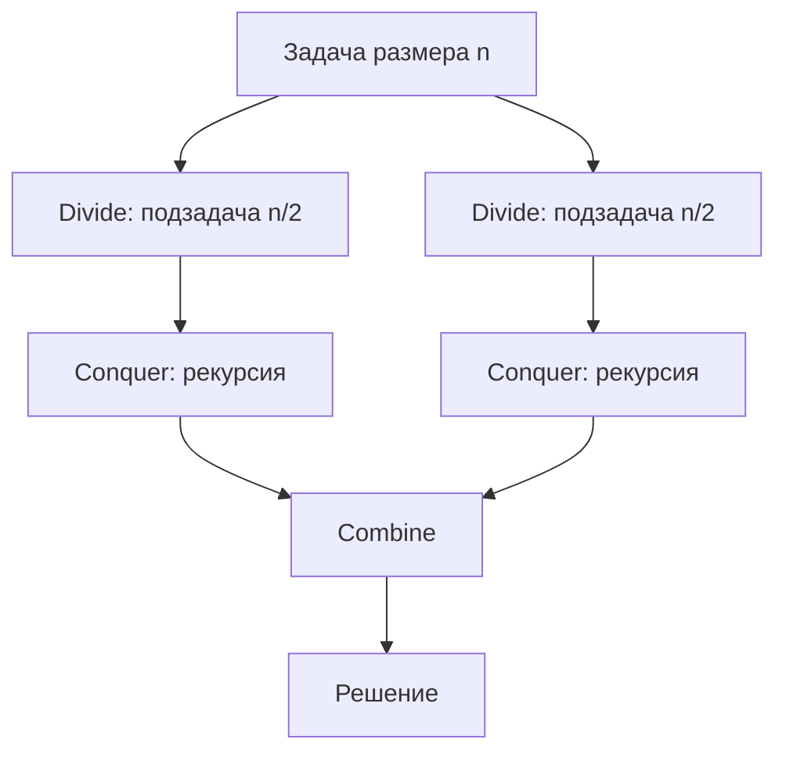

# Вопросы на собеседовании: `Divide and Conquer`

D&C — фундаментальная парадигма: **разделить → решить рекурсивно → объединить**. На ней построены Merge Sort, Quick Sort, Binary Search, FFT, и многие задачи на массивах. Знают master theorem и могут анализировать сложность через дерево рекурсии.

## Полезные ссылки

### Официальная документация и авторитетные источники

- [Divide and Conquer — Baeldung](https://www.baeldung.com/cs/divide-and-conquer-strategy)
- [Master Theorem — Baeldung](https://www.baeldung.com/cs/master-theorem-asymptotic-analysis)
- [Merge Sort — Baeldung](https://www.baeldung.com/java-merge-sort)
- [Quick Sort — Baeldung](https://www.baeldung.com/java-quicksort)
- [Strassen Algorithm — Baeldung](https://www.baeldung.com/cs/strassen-multiplication)
- [FFT Wikipedia](https://en.wikipedia.org/wiki/Fast_Fourier_transform)

## Содержание

- [Полезные ссылки](#полезные-ссылки)
- [See also](#see-also)

**Базовые понятия**
- [Q1. (!) Что такое Divide and Conquer?](#q1--что-такое-divide-and-conquer)
- [Q2. (!) Три шага D&C?](#q2--три-шага-dc)
- [Q3. (!) Чем D&C отличается от DP?](#q3--чем-dc-отличается-от-dp)
- [Q4. Чем D&C отличается от рекурсии в общем?](#q4-чем-dc-отличается-от-рекурсии-в-общем)

**Анализ сложности**
- [Q5. (!) Master Theorem?](#q5--master-theorem)
- [Q6. (!) Как анализировать через дерево рекурсии?](#q6--как-анализировать-через-дерево-рекурсии)
- [Q7. Когда master theorem не применим?](#q7-когда-master-theorem-не-применим)

**Классические алгоритмы**
- [Q8. (!) Merge Sort как D&C?](#q8--merge-sort-как-dc)
- [Q9. (!) Quick Sort как D&C?](#q9--quick-sort-как-dc)
- [Q10. (!) Binary Search как D&C?](#q10--binary-search-как-dc)
- [Q11. (!) Fast Power — возведение в степень за O(log n)?](#q11--fast-power--возведение-в-степень-за-olog-n)

**Числовые алгоритмы**
- [Q12. Karatsuba — быстрое умножение чисел?](#q12-karatsuba--быстрое-умножение-чисел)
- [Q13. (!) Strassen — умножение матриц?](#q13--strassen--умножение-матриц)
- [Q14. FFT — быстрое преобразование Фурье?](#q14-fft--быстрое-преобразование-фурье)

**Геометрия и поиск**
- [Q15. Closest Pair of Points за O(n log n)?](#q15-closest-pair-of-points-за-on-log-n)
- [Q16. (!) Найти максимум массива через D&C?](#q16--найти-максимум-массива-через-dc)
- [Q17. (!) Inversion count в массиве?](#q17--inversion-count-в-массиве)
- [Q18. Maximum Subarray через D&C?](#q18-maximum-subarray-через-dc)

**Деревья**
- [Q19. (!) Высота дерева через D&C?](#q19--высота-дерева-через-dc)
- [Q20. (!) Diameter of Binary Tree?](#q20--diameter-of-binary-tree)
- [Q21. Same Tree, Symmetric Tree?](#q21-same-tree-symmetric-tree)

**Специальные D&C**
- [Q22. (!) Median of Two Sorted Arrays?](#q22--median-of-two-sorted-arrays)
- [Q23. Skyline Problem?](#q23-skyline-problem)
- [Q24. Count of Smaller Numbers After Self?](#q24-count-of-smaller-numbers-after-self)

**Подводные камни**
- [Q25. (!) Когда D&C проигрывает итеративному подходу?](#q25--когда-dc-проигрывает-итеративному-подходу)
- [Q26. Risk of stack overflow?](#q26-risk-of-stack-overflow)
- [Q27. (!) Когда D&C можно распараллелить?](#q27--когда-dc-можно-распараллелить)

## Q1. (!) Что такое Divide and Conquer?

**Divide and Conquer (D&C)** — парадигма решения задач:

1. **Divide:** разбить задачу на подзадачи меньшего размера
2. **Conquer:** рекурсивно решить подзадачи (если они достаточно малы — решить напрямую)
3. **Combine:** объединить решения подзадач в решение исходной

**Примеры:**
- Merge Sort
- Quick Sort
- Binary Search (упрощённый D&C — только одна подзадача)
- Strassen multiplication
- FFT
- Closest Pair of Points

## Q2. (!) Три шага D&C?



**Псевдокод:**

```java
Result solve(Problem p) {
    if (isBaseCase(p)) return solveDirectly(p);

    List<Problem> subproblems = divide(p);
    List<Result> subresults = subproblems.stream()
                                          .map(this::solve)
                                          .toList();
    return combine(subresults);
}
```

## Q3. (!) Чем D&C отличается от DP?

| Критерий | D&C | DP |
|----------|-----|-----|
| Подзадачи перекрываются | **Нет** (или редко) | **Да** |
| Memoization | Не нужно | Обязательно |
| Подход | Top-down рекурсия | Top-down или bottom-up |
| Примеры | Merge Sort, Binary Search | Fibonacci, Knapsack |

**Mерge Sort** — D&C: подзадачи `mergeSort(left)` и `mergeSort(right)` независимы.
**Naive Fibonacci** — D&C, но с перекрытием → нужно DP/мемоизация.

Если переопределить с мемоизацией — D&C превращается в DP.

Подробнее — в [Динамическое программирование](dynamic-programming-interview.md).

## Q4. Чем D&C отличается от рекурсии в общем?

**Рекурсия** — общий механизм: функция вызывает себя.
**D&C** — частный случай рекурсии с **тремя обязательными шагами** (divide, conquer, combine).

```java
// Рекурсия — НЕ D&C (нет divide на меньшие части)
int factorial(int n) {
    if (n <= 1) return 1;
    return n * factorial(n - 1);
}

// D&C
int sumDC(int[] arr, int lo, int hi) {
    if (lo == hi) return arr[lo];
    int mid = lo + (hi - lo) / 2;
    return sumDC(arr, lo, mid) + sumDC(arr, mid + 1, hi); // divide на две части
}
```

D&C обычно даёт лучшие сложности (`O(log n)` или `O(n log n)`), потому что разбивает задачу на **сравнимые по размеру** подзадачи.

## Q5. (!) Master Theorem?

Для рекуррентностей вида `T(n) = a · T(n/b) + f(n)` (где `a ≥ 1`, `b > 1`):

Сравниваем `f(n)` с `n^(log_b a)`:

| Случай | Условие | Результат |
|--------|---------|-----------|
| **1** | `f(n) = O(n^(log_b a − ε))` для некоторого ε > 0 | `T(n) = Θ(n^(log_b a))` |
| **2** | `f(n) = Θ(n^(log_b a))` | `T(n) = Θ(n^(log_b a) · log n)` |
| **3** | `f(n) = Ω(n^(log_b a + ε))` и regularity | `T(n) = Θ(f(n))` |

**Примеры:**

| Рекуррентность | Алгоритм | Решение |
|----------------|----------|---------|
| `T(n) = 2T(n/2) + O(n)` | Merge Sort | `Θ(n log n)` (case 2) |
| `T(n) = T(n/2) + O(1)` | Binary Search | `Θ(log n)` (case 2) |
| `T(n) = 7T(n/2) + O(n²)` | Strassen | `Θ(n^log₂7) ≈ Θ(n^2.81)` (case 1) |
| `T(n) = 4T(n/2) + O(n)` | — | `Θ(n²)` (case 1) |
| `T(n) = 2T(n/2) + O(n²)` | — | `Θ(n²)` (case 3) |

## Q6. (!) Как анализировать через дерево рекурсии?

1. Нарисовать дерево вызовов
2. Подсчитать работу на каждом уровне
3. Сложить по всем уровням

**Пример: `T(n) = 2T(n/2) + n` (Merge Sort)**

```
Уровень 0: 1 узел    × n         = n
Уровень 1: 2 узла    × n/2       = n
Уровень 2: 4 узла    × n/4       = n
...
Уровень k: 2^k узлов × n/2^k     = n

Глубина = log n уровней.
Сумма = n × log n = O(n log n).
```

**Пример: `T(n) = T(n/2) + n`**

```
Уровень 0: n
Уровень 1: n/2
Уровень 2: n/4
...
Сумма = n + n/2 + n/4 + ... = O(n)
```

## Q7. Когда master theorem не применим?

1. **Подзадачи разного размера:** `T(n) = T(n/3) + T(2n/3) + n` — нужно дерево или Akra-Bazzi
2. **Не полиномиальное `f(n)`:** `T(n) = 2T(n/2) + n log n` — между cases 2 и 3
3. **Отрицательное `f(n)`** или странное
4. **Не строго `n/b`** — округления

В таких случаях — рекурсивное дерево или **substitution method**.

## Q8. (!) Merge Sort как D&C?

```java
void mergeSort(int[] arr, int left, int right) {
    if (left >= right) return; // base case

    int mid = left + (right - left) / 2;

    mergeSort(arr, left, mid);      // divide + conquer left
    mergeSort(arr, mid + 1, right); // divide + conquer right
    merge(arr, left, mid, right);   // combine
}

void merge(int[] arr, int left, int mid, int right) {
    int[] tmp = new int[right - left + 1];
    int i = left, j = mid + 1, k = 0;
    while (i <= mid && j <= right) {
        if (arr[i] <= arr[j]) tmp[k++] = arr[i++];
        else                   tmp[k++] = arr[j++];
    }
    while (i <= mid)   tmp[k++] = arr[i++];
    while (j <= right) tmp[k++] = arr[j++];
    System.arraycopy(tmp, 0, arr, left, tmp.length);
}
```

**Recurrence:** `T(n) = 2T(n/2) + O(n)` → `O(n log n)`.

**Combine — самая работа.** В `Quick Sort` наоборот: divide дорогой, combine ничего не делает.

## Q9. (!) Quick Sort как D&C?

```java
void quickSort(int[] arr, int left, int right) {
    if (left >= right) return;

    int pivotIdx = partition(arr, left, right); // divide
    quickSort(arr, left, pivotIdx - 1);          // conquer left
    quickSort(arr, pivotIdx + 1, right);         // conquer right
    // combine — ничего не делаем (in-place)
}
```

**Recurrence (среднее):** `T(n) = 2T(n/2) + O(n)` → `O(n log n)`.
**Худшее:** `T(n) = T(n-1) + O(n)` → `O(n²)`.

Подробнее — в [Sorting](../sorting-searching/sorting-algorithms-interview.md).

## Q10. (!) Binary Search как D&C?

```java
int binarySearch(int[] arr, int target, int lo, int hi) {
    if (lo > hi) return -1; // base
    int mid = lo + (hi - lo) / 2;
    if (arr[mid] == target) return mid;
    if (arr[mid] < target) return binarySearch(arr, target, mid + 1, hi);
    return binarySearch(arr, target, lo, mid - 1);
}
```

Упрощённый D&C: только **одна** подзадача после divide. Combine — тривиально.

**Recurrence:** `T(n) = T(n/2) + O(1)` → `O(log n)`.

Подробнее — в [Searching](../sorting-searching/searching-algorithms-interview.md).

## Q11. (!) Fast Power — возведение в степень за O(log n)?

Идея: `x^n = (x^(n/2))²` при чётном `n`, `x^n = x · x^(n-1)` при нечётном.

```java
double power(double x, int n) {
    if (n == 0) return 1;
    if (n < 0) return 1.0 / power(x, -n);

    if (n % 2 == 0) {
        double half = power(x, n / 2);
        return half * half;
    }
    return x * power(x, n - 1);
}

// Итеративный вариант (binary exponentiation)
double powerIter(double x, int n) {
    long exp = n; // long чтобы обработать Integer.MIN_VALUE
    if (exp < 0) { x = 1.0 / x; exp = -exp; }
    double result = 1;
    while (exp > 0) {
        if ((exp & 1) == 1) result *= x;
        x *= x;
        exp >>= 1;
    }
    return result;
}
```

`O(log n)` вместо наивного `O(n)`.

**Применения:** криптография (RSA), вычисление больших степеней матриц (быстрый Фибоначчи через матричное умножение за `O(log n)`).

## Q12. Karatsuba — быстрое умножение чисел?

Наивное умножение `n`-цифровых чисел — `O(n²)`. **Karatsuba (1960):** `O(n^log₂3) ≈ O(n^1.585)`.

```
x = x1 · 10^(n/2) + x0
y = y1 · 10^(n/2) + y0

x · y = x1·y1 · 10^n + (x1·y0 + x0·y1) · 10^(n/2) + x0·y0

Трюк: считаем три произведения вместо четырёх:
  z2 = x1 · y1
  z0 = x0 · y0
  z1 = (x1 + x0)(y1 + y0) - z2 - z0
```

**Recurrence:** `T(n) = 3T(n/2) + O(n)` → `Θ(n^log₂3)`.

Применяется в **BigInteger.multiply()** для очень больших чисел (`> 80` цифр).

Toom-Cook — обобщение, ещё быстрее. **Schönhage-Strassen** — `O(n log n log log n)` через FFT.

## Q13. (!) Strassen — умножение матриц?

Наивное умножение матриц `n×n` — `O(n³)`. **Strassen (1969):** `O(n^log₂7) ≈ O(n^2.81)`.

Идея: каждая матрица делится на 4 подматрицы `n/2 × n/2`. Strassen вычисляет результат через **7** перемножений (вместо 8), используя умные комбинации:

```
M1 = (A11 + A22)(B11 + B22)
M2 = (A21 + A22)·B11
M3 = A11·(B12 - B22)
M4 = A22·(B21 - B11)
M5 = (A11 + A12)·B22
M6 = (A21 - A11)(B11 + B12)
M7 = (A12 - A22)(B21 + B22)

C11 = M1 + M4 - M5 + M7
C12 = M3 + M5
C21 = M2 + M4
C22 = M1 - M2 + M3 + M6
```

**Recurrence:** `T(n) = 7T(n/2) + O(n²)` → `Θ(n^log₂7)`.

На практике выигрывает только для **очень больших** матриц (`n > 100-1000`) из-за больших констант.

## Q14. FFT — быстрое преобразование Фурье?

**Fast Fourier Transform** — D&C алгоритм для дискретного преобразования Фурье за `O(n log n)` (вместо `O(n²)`).

Идея Cooley-Tukey: разделить вход на чётные и нечётные индексы, рекурсивно вычислить DFT каждой половины, объединить через complex roots of unity.

**Применения:**
- Сигналы (audio/image processing)
- Полиномиальное умножение за `O(n log n)`
- Алгоритм Schönhage-Strassen для умножения чисел
- JPEG compression

Реализация в Java — Apache Commons Math `FastFourierTransformer`.

## Q15. Closest Pair of Points за O(n log n)?

Найти ближайшую пару точек в плоскости. Brute force — `O(n²)`. D&C — `O(n log n)`.

**Алгоритм:**
1. Сортировать точки по `x`
2. Разделить на две половины линией `x = mid`
3. Рекурсивно найти ближайшие пары в каждой половине → `d_left`, `d_right`
4. `d = min(d_left, d_right)`
5. **Merge step:** проверить пары точек в полосе шириной `2d` вокруг линии — каждая точка проверяет максимум 7 соседей по `y`

**Recurrence:** `T(n) = 2T(n/2) + O(n)` → `O(n log n)`.

Применяется в computational geometry, mesh generation.

## Q16. (!) Найти максимум массива через D&C?

```java
int findMax(int[] arr, int lo, int hi) {
    if (lo == hi) return arr[lo];
    int mid = lo + (hi - lo) / 2;
    int leftMax = findMax(arr, lo, mid);
    int rightMax = findMax(arr, mid + 1, hi);
    return Math.max(leftMax, rightMax);
}
```

`O(n)` — то же, что итеративно. Полезно как **учебный пример** D&C, и для **параллелизации** на больших массивах (`Fork/Join` framework).

## Q17. (!) Inversion count в массиве?

**Inversion** — пара `(i, j)`, где `i < j` и `arr[i] > arr[j]`. Количество отражает «несортированность».

```java
long countInversions(int[] arr) {
    return mergeAndCount(arr, 0, arr.length - 1);
}

long mergeAndCount(int[] arr, int lo, int hi) {
    if (lo >= hi) return 0;
    int mid = lo + (hi - lo) / 2;
    long count = mergeAndCount(arr, lo, mid)
               + mergeAndCount(arr, mid + 1, hi)
               + merge(arr, lo, mid, hi);
    return count;
}

long merge(int[] arr, int lo, int mid, int hi) {
    int[] tmp = new int[hi - lo + 1];
    int i = lo, j = mid + 1, k = 0;
    long count = 0;
    while (i <= mid && j <= hi) {
        if (arr[i] <= arr[j]) tmp[k++] = arr[i++];
        else {
            tmp[k++] = arr[j++];
            count += (mid - i + 1); // все оставшиеся слева — инверсии
        }
    }
    while (i <= mid) tmp[k++] = arr[i++];
    while (j <= hi)  tmp[k++] = arr[j++];
    System.arraycopy(tmp, 0, arr, lo, tmp.length);
    return count;
}
```

`O(n log n)`. Brute force — `O(n²)`. Применяется в коллаборативной фильтрации, similarity ranking.

## Q18. Maximum Subarray через D&C?

```java
int maxSubArray(int[] arr) {
    return helper(arr, 0, arr.length - 1);
}

int helper(int[] arr, int lo, int hi) {
    if (lo == hi) return arr[lo];
    int mid = lo + (hi - lo) / 2;
    int leftMax = helper(arr, lo, mid);
    int rightMax = helper(arr, mid + 1, hi);
    int crossMax = maxCrossing(arr, lo, mid, hi);
    return Math.max(crossMax, Math.max(leftMax, rightMax));
}

int maxCrossing(int[] arr, int lo, int mid, int hi) {
    int leftSum = Integer.MIN_VALUE, sum = 0;
    for (int i = mid; i >= lo; i--) {
        sum += arr[i];
        leftSum = Math.max(leftSum, sum);
    }
    int rightSum = Integer.MIN_VALUE; sum = 0;
    for (int i = mid + 1; i <= hi; i++) {
        sum += arr[i];
        rightSum = Math.max(rightSum, sum);
    }
    return leftSum + rightSum;
}
```

`O(n log n)`. **Kadane** даёт `O(n)` и проще — D&C тут учебный.

## Q19. (!) Высота дерева через D&C?

```java
int height(TreeNode root) {
    if (root == null) return 0;
    int leftHeight = height(root.left);
    int rightHeight = height(root.right);
    return 1 + Math.max(leftHeight, rightHeight);
}
```

Чистый D&C: divide на левое и правое поддеревья, conquer рекурсивно, combine через max + 1.

`O(n)`.

## Q20. (!) Diameter of Binary Tree?

```java
class Solution {
    int diameter = 0;

    public int diameterOfBinaryTree(TreeNode root) {
        depth(root);
        return diameter;
    }

    int depth(TreeNode node) {
        if (node == null) return 0;
        int left = depth(node.left);
        int right = depth(node.right);
        diameter = Math.max(diameter, left + right);
        return 1 + Math.max(left, right);
    }
}
```

`O(n)`. На каждом узле комбинируем глубины поддеревьев. Подробнее — в [Деревья](../data-structures/trees-interview.md).

## Q21. Same Tree, Symmetric Tree?

```java
boolean isSameTree(TreeNode p, TreeNode q) {
    if (p == null && q == null) return true;
    if (p == null || q == null) return false;
    return p.val == q.val
        && isSameTree(p.left, q.left)
        && isSameTree(p.right, q.right);
}

boolean isSymmetric(TreeNode root) {
    return root == null || isMirror(root.left, root.right);
}

boolean isMirror(TreeNode a, TreeNode b) {
    if (a == null && b == null) return true;
    if (a == null || b == null) return false;
    return a.val == b.val
        && isMirror(a.left, b.right)
        && isMirror(a.right, b.left);
}
```

Классические D&C на деревьях. `O(n)` обе.

## Q22. (!) Median of Two Sorted Arrays?

Найти медиану двух отсортированных массивов за `O(log(min(m, n)))`. Слияние дало бы `O(m + n)` — но D&C через бинарный поиск по меньшему массиву быстрее.

**Идея:** бинарным поиском подбираем разрез `i` в меньшем массиве `A`; разрез `j` в `B` вычисляется так, чтобы слева от обоих разрезов было ровно `(m + n + 1) / 2` элементов. Корректный разрез — когда `A[i-1] <= B[j]` и `B[j-1] <= A[i]`.

```java
double findMedianSortedArrays(int[] a, int[] b) {
    if (a.length > b.length) return findMedianSortedArrays(b, a); // ищем по меньшему
    int m = a.length, n = b.length, lo = 0, hi = m;
    while (lo <= hi) {
        int i = (lo + hi) / 2;        // разрез в A
        int j = (m + n + 1) / 2 - i;  // разрез в B
        int aLeft  = (i == 0) ? Integer.MIN_VALUE : a[i - 1];
        int aRight = (i == m) ? Integer.MAX_VALUE : a[i];
        int bLeft  = (j == 0) ? Integer.MIN_VALUE : b[j - 1];
        int bRight = (j == n) ? Integer.MAX_VALUE : b[j];
        if (aLeft <= bRight && bLeft <= aRight) {
            if (((m + n) & 1) == 1) return Math.max(aLeft, bLeft);
            return (Math.max(aLeft, bLeft) + Math.min(aRight, bRight)) / 2.0;
        } else if (aLeft > bRight) hi = i - 1; // разрез в A слишком правый
        else                       lo = i + 1; // слишком левый
    }
    throw new IllegalArgumentException("arrays not sorted");
}
```

`O(log(min(m, n)))` — это «binary search on answer» поверх D&C-идеи деления пространства поиска пополам.

## Q23. Skyline Problem?

Дан набор зданий `[left, right, height]`; построить силуэт (skyline) — список «ключевых точек» `[x, height]`, где высота контура меняется. Brute force по координатам — `O(n²)`; D&C даёт `O(n log n)`.

**Алгоритм (как в `Merge Sort`):**
1. **Divide:** разбить здания на две половины.
2. **Conquer:** рекурсивно построить skyline каждой половины.
3. **Combine:** слить два силуэта подобно `merge`, идя слева направо по `x`. На каждой точке текущая высота контура — `max(h_left, h_right)`; ключевую точку добавляем только когда `max` изменился.

```
Combine двух силуэтов:
  два указателя по спискам ключевых точек
  curH = max(текущая высота левого, текущая высота правого)
  если curH != предыдущей выходной высоты → добавить точку [x, curH]
```

**Recurrence:** `T(n) = 2T(n/2) + O(n)` → `O(n log n)`. Альтернатива без D&C — sweep line с приоритетной очередью (тоже `O(n log n)`).

## Q24. Count of Smaller Numbers After Self?

Для каждого `arr[i]` посчитать, сколько элементов справа от него меньше его. Brute force — `O(n²)`. D&C через модифицированный `Merge Sort` — `O(n log n)`, тот же приём, что и в подсчёте инверсий (см. Q17).

**Идея:** сортируем слиянием **индексы** (чтобы не потерять позицию исходного элемента). При слиянии, когда элемент из правой половины «перепрыгивает» элемент левой, все ещё не перенесённые элементы левой половины меньше — значит для них найдены меньшие справа.

```java
int[] counts;        // результат
int[] idx;           // индексы, сортируемые по значению

void mergeCount(int[] a, int lo, int hi) {
    if (lo >= hi) return;
    int mid = lo + (hi - lo) / 2;
    mergeCount(a, lo, mid);
    mergeCount(a, mid + 1, hi);
    int[] tmp = new int[hi - lo + 1];
    int i = lo, j = mid + 1, k = 0, rightSmaller = 0;
    while (i <= mid && j <= hi) {
        if (a[idx[j]] < a[idx[i]]) { rightSmaller++; tmp[k++] = idx[j++]; }
        else { counts[idx[i]] += rightSmaller; tmp[k++] = idx[i++]; }
    }
    while (i <= mid) { counts[idx[i]] += rightSmaller; tmp[k++] = idx[i++]; }
    while (j <= hi)  tmp[k++] = idx[j++];
    System.arraycopy(tmp, 0, idx, lo, tmp.length);
}
```

`O(n log n)`. Тот же шаблон решает «count of range sums» и подобные задачи.

## Q25. (!) Когда D&C проигрывает итеративному подходу?

D&C — не всегда лучший выбор. Накладные расходы на рекурсию и копирование данных иногда перевешивают элегантность.

- **Когда есть линейное решение.** `Maximum Subarray` через D&C — `O(n log n)`, но `Kadane` итеративно даёт `O(n)`. `Найти максимум` через D&C — `O(n)`, как и простой цикл, но с лишними вызовами и глубиной стека.
- **Большие константы.** `Strassen` асимптотически быстрее `O(n³)`, но из-за множества сложений подматриц выигрывает только на матрицах `n > 100–1000`; на малых проигрывает наивному умножению.
- **Overhead вызовов и памяти.** Каждый рекурсивный вызов — кадр стека плюс часто временный буфер (`merge` в `Merge Sort` требует `O(n)` доп. памяти). Итеративная версия экономит и то, и другое.
- **Кэш-локальность.** Рекурсивное разбиение может хуже использовать кэш процессора, чем плотный последовательный проход.

**Вывод:** D&C оправдан, когда даёт лучшую асимптотику (`O(n log n)` против `O(n²)`) или гарантию (worst-case `Merge Sort`). Если линейное/итеративное решение существует — обычно предпочитают его.

## Q26. Risk of stack overflow?

Рекурсивный D&C хранит цепочку незавершённых вызовов на стеке. Глубина рекурсии определяет потребление стека, и при патологических входах это приводит к `StackOverflowError`.

- **Сбалансированный D&C безопасен.** `Merge Sort` и сбалансированный `Quick Sort` имеют глубину `O(log n)` — даже для `n = 10⁹` это порядка 30–60 кадров.
- **Вырожденный случай опасен.** `Quick Sort` с плохим pivot на отсортированном массиве деградирует до глубины `O(n)` → переполнение стека на больших входах. Линейная рекурсия (`factorial(n)`, обход глубокого списка) тоже даёт глубину `O(n)`.

**Как защититься:**
- Рекурсия **в меньшую половину**, а большую обрабатывать циклом (tail-call elimination вручную) — ограничивает глубину `O(log n)`:

```java
void quickSort(int[] a, int lo, int hi) {
    while (lo < hi) {
        int p = partition(a, lo, hi);
        if (p - lo < hi - p) { quickSort(a, lo, p - 1); lo = p + 1; } // рекурсия в меньшую
        else                 { quickSort(a, p + 1, hi); hi = p - 1; }
    }
}
```

- Рандомизация pivot (`median-of-three`) делает глубокую рекурсию маловероятной.
- При очень больших данных — итеративная версия с явным стеком в куче вместо стека вызовов.

## Q27. (!) Когда D&C можно распараллелить?

Главное преимущество D&C для многоядерных систем: **независимые подзадачи можно решать параллельно**. Поскольку в классическом D&C подзадачи не перекрываются (в отличие от DP), между ними нет гонок данных.

**Условия для параллелизации:**
- Подзадачи **независимы** (не делят изменяемое состояние) — выполняются на разных ядрах без синхронизации.
- Работа в подзадаче достаточно велика, чтобы окупить накладные расходы на разветвление; на малых порциях переходят к последовательной обработке (threshold).

**Java Fork/Join framework:**

```java
class MergeSortTask extends RecursiveAction {
    int[] arr; int lo, hi;
    protected void compute() {
        if (hi - lo < THRESHOLD) { sequentialSort(arr, lo, hi); return; }
        int mid = lo + (hi - lo) / 2;
        MergeSortTask left  = new MergeSortTask(arr, lo, mid);
        MergeSortTask right = new MergeSortTask(arr, mid + 1, hi);
        invokeAll(left, right);   // выполняются параллельно
        merge(arr, lo, mid, hi);  // combine — уже последовательно
    }
}
```

Так работают `Arrays.parallelSort()` и `Stream.parallel()`. **Combine-шаг** обычно остаётся последовательным (синхронизация после `join`), поэтому идеального ускорения не достичь — ограничивает закон Амдала. Хорошо параллелятся `Merge Sort`, `Quick Sort`, `findMax`, `maxSubArray`; плохо — `Binary Search` (одна подзадача, нечего распараллеливать).

## See also

- [Алгоритмы (обзор)](../algorithms-interview.md) — карта алгоритмических тем
- [Рекурсия](recursion-interview.md) — D&C — частный случай рекурсии
- [DP](dynamic-programming-interview.md) — перекрывающиеся подзадачи vs независимые в D&C
- [Backtracking](backtracking-interview.md) — другая рекурсивная парадигма
- [Сортировки](../sorting-searching/sorting-algorithms-interview.md) — Merge/Quick Sort — классический D&C
- [Поиск](../sorting-searching/searching-algorithms-interview.md) — бинарный поиск как D&C
- [Деревья](../data-structures/trees-interview.md) — рекурсивные обходы — тот же приём
- [Массивы и строки](../data-structures/arrays-strings-interview.md) — maxSubArray, Median of Two Arrays
- [Анализ сложности](../complexity/complexity-analysis-interview.md) — Master Theorem, recurrence relations
