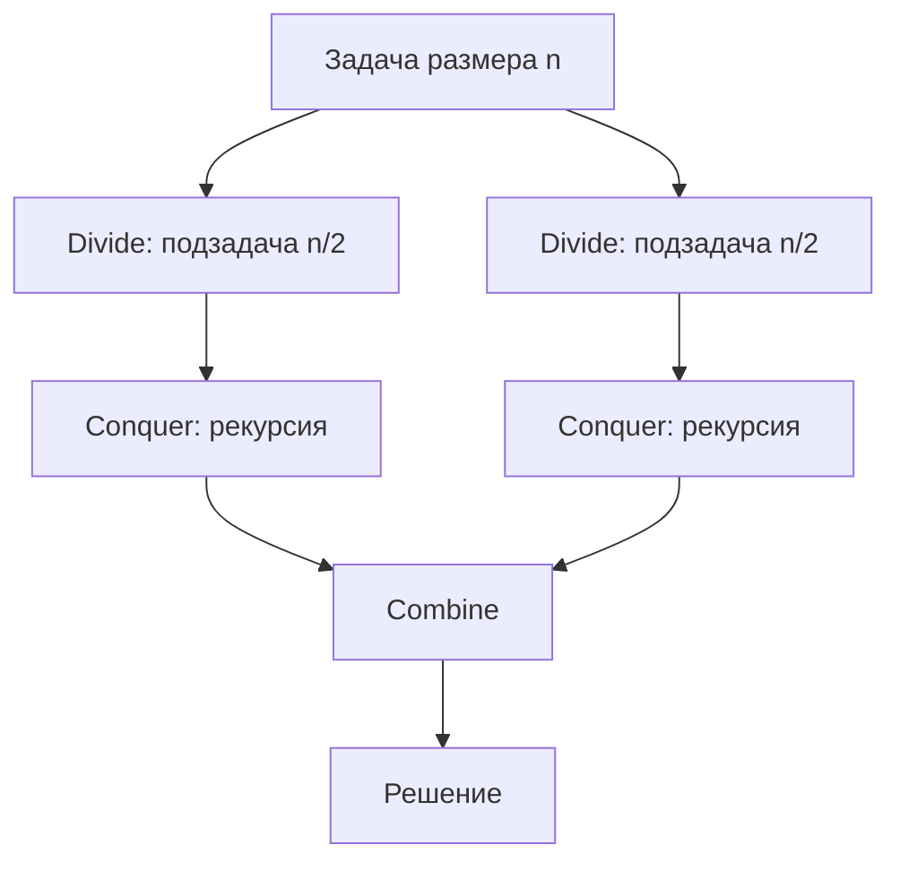

# Вопросы на собеседовании: `Divide and Conquer`

D&C — фундаментальная парадигма: **разделить → решить рекурсивно → объединить**. На ней построены Merge Sort, Quick Sort, Binary Search, FFT и многие задачи на массивах. На собеседовании ждут, что вы знаете master theorem и умеете оценивать сложность через дерево рекурсии.

## Полезные ссылки

### Официальная документация и авторитетные источники

- [Divide and Conquer — Baeldung](https://www.baeldung.com/cs/divide-and-conquer-strategy)
- [Master Theorem — Baeldung](https://www.baeldung.com/cs/master-theorem-asymptotic-analysis)
- [Merge Sort — Baeldung](https://www.baeldung.com/java-merge-sort)
- [Quick Sort — Baeldung](https://www.baeldung.com/java-quicksort)
- [Strassen Algorithm — Baeldung](https://www.baeldung.com/cs/strassen-multiplication)
- [FFT Wikipedia](https://en.wikipedia.org/wiki/Fast_Fourier_transform)

## Содержание

- [Полезные ссылки](#полезные-ссылки)
- [See also](#see-also)

**Базовые понятия**
- [Q1. (!) Что такое Divide and Conquer?](#q1--что-такое-divide-and-conquer)
- [Q2. (!) Три шага D&C?](#q2--три-шага-dc)
- [Q3. (!) Чем D&C отличается от DP?](#q3--чем-dc-отличается-от-dp)
- [Q4. Чем D&C отличается от рекурсии в общем?](#q4-чем-dc-отличается-от-рекурсии-в-общем)

**Анализ сложности**
- [Q5. (!) Что такое Master Theorem?](#q5--что-такое-master-theorem)
- [Q6. (!) Как анализировать через дерево рекурсии?](#q6--как-анализировать-через-дерево-рекурсии)
- [Q7. Когда master theorem не применим?](#q7-когда-master-theorem-не-применим)

**Классические алгоритмы**
- [Q8. (!) Merge Sort как D&C?](#q8--merge-sort-как-dc)
- [Q9. (!) Quick Sort как D&C?](#q9--quick-sort-как-dc)
- [Q10. (!) Binary Search как D&C?](#q10--binary-search-как-dc)
- [Q11. (!) Fast Power — возведение в степень за O(log n)?](#q11--fast-power--возведение-в-степень-за-olog-n)

**Числовые алгоритмы**
- [Q12. Karatsuba — быстрое умножение чисел?](#q12-karatsuba--быстрое-умножение-чисел)
- [Q13. (!) Strassen — умножение матриц?](#q13--strassen--умножение-матриц)
- [Q14. FFT — быстрое преобразование Фурье?](#q14-fft--быстрое-преобразование-фурье)

**Геометрия и поиск**
- [Q15. Closest Pair of Points за O(n log n)?](#q15-closest-pair-of-points-за-on-log-n)
- [Q16. (!) Найти максимум массива через D&C?](#q16--найти-максимум-массива-через-dc)
- [Q17. (!) Inversion count в массиве?](#q17--inversion-count-в-массиве)
- [Q18. Maximum Subarray через D&C?](#q18-maximum-subarray-через-dc)

**Деревья**
- [Q19. (!) Высота дерева через D&C?](#q19--высота-дерева-через-dc)
- [Q20. (!) Как найти диаметр бинарного дерева (Diameter of Binary Tree)?](#q20--как-найти-диаметр-бинарного-дерева-diameter-of-binary-tree)
- [Q21. Как проверить деревья на равенство (Same Tree) и симметричность (Symmetric Tree)?](#q21-как-проверить-деревья-на-равенство-same-tree-и-симметричность-symmetric-tree)

**Специальные D&C**
- [Q22. (!) Как найти медиану двух отсортированных массивов (Median of Two Sorted Arrays)?](#q22--как-найти-медиану-двух-отсортированных-массивов-median-of-two-sorted-arrays)
- [Q23. Как решить задачу о силуэте города (Skyline Problem)?](#q23-как-решить-задачу-о-силуэте-города-skyline-problem)
- [Q24. Как посчитать число меньших элементов справа (Count of Smaller Numbers After Self)?](#q24-как-посчитать-число-меньших-элементов-справа-count-of-smaller-numbers-after-self)

**Подводные камни**
- [Q25. (!) Когда D&C проигрывает итеративному подходу?](#q25--когда-dc-проигрывает-итеративному-подходу)
- [Q26. Чем опасен stack overflow в рекурсивном D&C?](#q26-чем-опасен-stack-overflow-в-рекурсивном-dc)
- [Q27. (!) Когда D&C можно распараллелить?](#q27--когда-dc-можно-распараллелить)

## Q1. (!) Что такое Divide and Conquer?

**Divide and Conquer (D&C)** — это парадигма, в которой задачу разбивают на несколько подзадач **того же типа, но меньшего размера**, решают их рекурсивно и собирают из ответов решение исходной задачи. Ключевая идея: подзадачи независимы, поэтому их можно решать по отдельности.

Три шага:

1. **Divide:** разбить задачу на подзадачи меньшего размера.
2. **Conquer:** рекурсивно решить каждую подзадачу; когда размер становится достаточно мал (базовый случай) — решить напрямую.
3. **Combine:** объединить решения подзадач в решение исходной.

**Почему это даёт ускорение.** Разбиение пополам уменьшает размер вдвое на каждом уровне, поэтому глубина рекурсии — `log n`. Если объединение дешёвое, итоговая сложность падает с `O(n²)` до `O(n log n)` или даже до `O(log n)`.

**Примеры:**
- Merge Sort, Quick Sort — сортировка.
- Binary Search — упрощённый D&C: после разбиения остаётся только одна подзадача.
- Strassen multiplication, Karatsuba — умножение матриц и чисел.
- FFT — преобразование Фурье.
- Closest Pair of Points — ближайшая пара точек на плоскости.

## Q2. (!) Три шага D&C?

Любой D&C-алгоритм укладывается в три шага: **divide** (разбить), **conquer** (рекурсивно решить) и **combine** (собрать ответ). На диаграмме задача размера `n` делится на две подзадачи `n/2`, каждая решается рекурсией, а результаты сливаются в общий ответ.



**Псевдокод:**

```java
Result solve(Problem p) {
    if (isBaseCase(p)) return solveDirectly(p);

    List<Problem> subproblems = divide(p);
    List<Result> subresults = subproblems.stream()
                                          .map(this::solve)
                                          .toList();
    return combine(subresults);
}
```

Здесь видна вся структура: базовый случай решается напрямую, остальное — `divide` → рекурсивный `solve` для каждой подзадачи → `combine`.

## Q3. (!) Чем D&C отличается от DP?

Главное различие — **перекрываются ли подзадачи**. В D&C подзадачи независимы и почти не повторяются, поэтому хранить их решения незачем. В DP одни и те же подзадачи встречаются снова и снова, и чтобы не пересчитывать их, ответы запоминают (memoization). Именно перекрытие подзадач превращает рекурсию из D&C в DP.

| Критерий | D&C | DP |
|----------|-----|-----|
| Подзадачи перекрываются | **Нет** (или редко) | **Да** |
| Memoization | Не нужна | Обязательна |
| Подход | Top-down рекурсия | Top-down или bottom-up |
| Примеры | Merge Sort, Binary Search | Fibonacci, Knapsack |

- **Merge Sort** — это D&C: подзадачи `mergeSort(left)` и `mergeSort(right)` обрабатывают разные половины массива и никак не пересекаются.
- **Наивный Fibonacci** формально тоже D&C, но `fib(n-1)` и `fib(n-2)` многократно пересчитывают одни и те же значения — это и есть перекрытие, из-за которого нужна мемоизация.

**Вывод:** если добавить к D&C-рекурсии мемоизацию перекрывающихся подзадач, она превращается в DP.

Подробнее — в [Динамическое программирование](dynamic-programming-interview.md).

## Q4. Чем D&C отличается от рекурсии в общем?

**Любой D&C рекурсивен, но не любая рекурсия — это D&C.** Рекурсия — это общий механизм: функция вызывает саму себя. D&C — её частный случай, в котором обязательны все три шага: divide (разбить на несколько меньших частей), conquer (решить их рекурсией) и combine (собрать ответ).

Отличительный признак D&C — задача делится на **несколько сравнимых по размеру** подзадач. Если функция лишь «отрезает» по одному элементу (как `factorial`), divide-шага нет — это просто линейная рекурсия, а не D&C.

```java
// Рекурсия — НЕ D&C (нет divide на меньшие части)
int factorial(int n) {
    if (n <= 1) return 1;
    return n * factorial(n - 1);
}

// D&C
int sumDC(int[] arr, int lo, int hi) {
    if (lo == hi) return arr[lo];
    int mid = lo + (hi - lo) / 2;
    return sumDC(arr, lo, mid) + sumDC(arr, mid + 1, hi); // divide на две части
}
```

Именно деление на сравнимые по размеру части даёт D&C лучшие сложности (`O(log n)` или `O(n log n)`): глубина рекурсии получается логарифмической, тогда как линейная рекурсия даёт глубину `O(n)`.

## Q5. (!) Что такое Master Theorem?

**Master Theorem** — это готовая формула для сложности рекуррентностей вида `T(n) = a · T(n/b) + f(n)` (где `a ≥ 1`, `b > 1`): `a` — число подзадач, `n/b` — их размер, `f(n)` — стоимость divide и combine на текущем уровне. Теорема избавляет от ручного разворачивания дерева рекурсии.

**Как пользоваться.** Сравниваем стоимость объединения `f(n)` с «весом листьев дерева» `n^(log_b a)` — тем, кто из двух растёт быстрее, тот и определяет ответ:

| Случай | Условие | Что доминирует | Результат |
|--------|---------|----------------|-----------|
| **1** | `f(n) = O(n^(log_b a − ε))` для некоторого ε > 0 | листья (рекурсия) | `T(n) = Θ(n^(log_b a))` |
| **2** | `f(n) = Θ(n^(log_b a))` | все уровни поровну | `T(n) = Θ(n^(log_b a) · log n)` |
| **3** | `f(n) = Ω(n^(log_b a + ε))` и regularity | корень (объединение) | `T(n) = Θ(f(n))` |

Интуиция: в случае 1 работы больше всего у листьев дерева рекурсии, в случае 3 — у корня, а в случае 2 каждый из `log n` уровней вносит одинаковый вклад, откуда лишний множитель `log n`.

**Примеры:**

| Рекуррентность | Алгоритм | Решение |
|----------------|----------|---------|
| `T(n) = 2T(n/2) + O(n)` | Merge Sort | `Θ(n log n)` (case 2) |
| `T(n) = T(n/2) + O(1)` | Binary Search | `Θ(log n)` (case 2) |
| `T(n) = 7T(n/2) + O(n²)` | Strassen | `Θ(n^log₂7) ≈ Θ(n^2.81)` (case 1) |
| `T(n) = 4T(n/2) + O(n)` | — | `Θ(n²)` (case 1) |
| `T(n) = 2T(n/2) + O(n²)` | — | `Θ(n²)` (case 3) |

## Q6. (!) Как анализировать через дерево рекурсии?

Метод дерева рекурсии — это «ручная» альтернатива Master Theorem: вы раскрываете рекуррентность в дерево вызовов и суммируете работу по всем уровням. Он нагляднее и работает даже там, где master theorem неприменим.

Три шага:

1. Нарисовать дерево вызовов: корень — задача размера `n`, его дети — подзадачи `n/b`, и так до базового случая.
2. Подсчитать работу `f(...)` на каждом уровне (число узлов уровня × работа в одном узле).
3. Сложить вклад всех уровней и оценить сумму.

**Пример: `T(n) = 2T(n/2) + n` (Merge Sort)**

```
Уровень 0: 1 узел    × n         = n
Уровень 1: 2 узла    × n/2       = n
Уровень 2: 4 узла    × n/4       = n
...
Уровень k: 2^k узлов × n/2^k     = n

Глубина = log n уровней.
Сумма = n × log n = O(n log n).
```

Работа на каждом из `log n` уровней одинакова (`n`) — это и есть случай 2 master theorem.

**Пример: `T(n) = T(n/2) + n`** (одна подзадача, дорогой текущий уровень)

```
Уровень 0: n
Уровень 1: n/2
Уровень 2: n/4
...
Сумма = n + n/2 + n/4 + ... = O(n)
```

Здесь работа геометрически убывает, сумма — убывающая геометрическая прогрессия, поэтому всё определяет верхний уровень → `O(n)`.

## Q7. Когда master theorem не применим?

Master Theorem покрывает только «ровные» рекуррентности `a·T(n/b) + f(n)` с полиномиальным `f(n)`. Он не работает, когда:

1. **Подзадачи разного размера:** `T(n) = T(n/3) + T(2n/3) + n` — нет единого `b`, нужен метод дерева или теорема Akra-Bazzi.
2. **`f(n)` не сравнимо полиномиально с `n^(log_b a)`:** `T(n) = 2T(n/2) + n log n` — попадает в «дыру» между случаями 2 и 3 (нет нужного зазора ε).
3. **`f(n)` отрицательна** или ведёт себя нерегулярно (не монотонна).
4. **Размер подзадачи не строго `n/b`** — например, мешают округления `⌈n/b⌉`.

В этих случаях используют рекурсивное дерево или **метод подстановки** (substitution method): угадать ответ и доказать его по индукции.

## Q8. (!) Merge Sort как D&C?

Merge Sort — каноничный D&C: **divide** — делим массив пополам по индексу `mid`, **conquer** — рекурсивно сортируем обе половины, **combine** — сливаем две отсортированные половины в один отсортированный массив за линейный проход.

```java
void mergeSort(int[] arr, int left, int right) {
    if (left >= right) return; // base case

    int mid = left + (right - left) / 2;

    mergeSort(arr, left, mid);      // divide + conquer left
    mergeSort(arr, mid + 1, right); // divide + conquer right
    merge(arr, left, mid, right);   // combine
}

void merge(int[] arr, int left, int mid, int right) {
    int[] tmp = new int[right - left + 1];
    int i = left, j = mid + 1, k = 0;
    while (i <= mid && j <= right) {
        if (arr[i] <= arr[j]) tmp[k++] = arr[i++];
        else                   tmp[k++] = arr[j++];
    }
    while (i <= mid)   tmp[k++] = arr[i++];
    while (j <= right) tmp[k++] = arr[j++];
    System.arraycopy(tmp, 0, arr, left, tmp.length);
}
```

**Рекуррентность:** `T(n) = 2T(n/2) + O(n)` → `O(n log n)`. Линейное слагаемое `O(n)` — это стоимость слияния.

**Где основная работа.** В Merge Sort divide тривиален (просто `mid`), а вся работа — в combine (слияние). В `Quick Sort` наоборот: дорогой divide (partition), а combine не делает ничего. Поэтому Merge Sort даёт стабильный `O(n log n)` в худшем случае, но требует `O(n)` дополнительной памяти под буфер слияния.

## Q9. (!) Quick Sort как D&C?

Quick Sort — D&C с «тяжёлым divide»: на шаге **partition** выбирается опорный элемент (pivot), и массив переставляется так, что слева от pivot всё меньше его, справа — больше. После этого левую и правую части сортируют рекурсией, а combine не нужен — элементы уже на своих местах (сортировка in-place).

```java
void quickSort(int[] arr, int left, int right) {
    if (left >= right) return;

    int pivotIdx = partition(arr, left, right); // divide
    quickSort(arr, left, pivotIdx - 1);          // conquer left
    quickSort(arr, pivotIdx + 1, right);         // conquer right
    // combine — ничего не делаем (in-place)
}
```

**Рекуррентность (средний случай):** при удачном pivot части примерно равны — `T(n) = 2T(n/2) + O(n)` → `O(n log n)`.
**Худший случай:** при плохом pivot (например, на уже отсортированном массиве) одна часть пуста, а вторая размера `n-1` — `T(n) = T(n-1) + O(n)` → `O(n²)`.

**Подводный камень:** именно поэтому на практике pivot рандомизируют или берут median-of-three — чтобы худший случай стал маловероятным.

Подробнее — в [Сортировки](../sorting-searching/sorting-algorithms-interview.md).

## Q10. (!) Binary Search как D&C?

Бинарный поиск — это **вырожденный D&C**: на каждом шаге сравниваем target со средним элементом и продолжаем поиск только в одной половине, отбрасывая вторую целиком. То есть divide есть, но conquer запускает лишь одну подзадачу из двух, а combine не нужен.

```java
int binarySearch(int[] arr, int target, int lo, int hi) {
    if (lo > hi) return -1; // base
    int mid = lo + (hi - lo) / 2;
    if (arr[mid] == target) return mid;
    if (arr[mid] < target) return binarySearch(arr, target, mid + 1, hi);
    return binarySearch(arr, target, lo, mid - 1);
}
```

**Рекуррентность:** `T(n) = T(n/2) + O(1)` → `O(log n)`. Поскольку подзадача одна, а не две, дерево рекурсии вырождается в цепочку глубины `log n` — отсюда логарифмическое время.

Подробнее — в [Поиск](../sorting-searching/searching-algorithms-interview.md).

## Q11. (!) Fast Power — возведение в степень за O(log n)?

Наивно `x^n` считают за `O(n)` умножений. Fast power (быстрое возведение в степень) делает это за `O(log n)`, опираясь на простое тождество: **квадрат степени вдвое меньшей** даёт исходную.

Идея: `x^n = (x^(n/2))²` при чётном `n` и `x^n = x · x^(n-1)` при нечётном. Каждое чётное `n` уменьшает показатель вдвое, поэтому шагов всего `log n`.

```java
double power(double x, int n) {
    if (n == 0) return 1;
    if (n < 0) return 1.0 / power(x, -n);

    if (n % 2 == 0) {
        double half = power(x, n / 2);
        return half * half;
    }
    return x * power(x, n - 1);
}

// Итеративный вариант (binary exponentiation)
double powerIter(double x, int n) {
    long exp = n; // long чтобы обработать Integer.MIN_VALUE
    if (exp < 0) { x = 1.0 / x; exp = -exp; }
    double result = 1;
    while (exp > 0) {
        if ((exp & 1) == 1) result *= x;
        x *= x;
        exp >>= 1;
    }
    return result;
}
```

Обе версии работают за `O(log n)` вместо наивного `O(n)`. Итеративная читает биты показателя: на каждой единице домножает результат на текущую степень `x`, после чего `x` возводится в квадрат. `long exp` нужен, чтобы корректно обработать `Integer.MIN_VALUE` (у него нет положительного двойника в `int`).

**Сценарии применения:** модульное возведение в степень в криптографии (RSA), быстрое возведение матриц в степень — например, вычисление `n`-го числа Фибоначчи за `O(log n)` через матричное умножение.

## Q12. Karatsuba — быстрое умножение чисел?

**Karatsuba (1960)** — D&C-алгоритм умножения больших чисел за `O(n^log₂3) ≈ O(n^1.585)` вместо школьных `O(n²)`. Выигрыш достигается за счёт того, что произведение двух `n`-цифровых чисел считается **тремя** умножениями половинок, а не четырьмя.

```
x = x1 · 10^(n/2) + x0
y = y1 · 10^(n/2) + y0

x · y = x1·y1 · 10^n + (x1·y0 + x0·y1) · 10^(n/2) + x0·y0

Трюк: считаем три произведения вместо четырёх:
  z2 = x1 · y1
  z0 = x0 · y0
  z1 = (x1 + x0)(y1 + y0) - z2 - z0
```

Школьный способ требует четырёх произведений (`x1·y1`, `x1·y0`, `x0·y1`, `x0·y0`). Трюк Karatsuba: средний член `x1·y0 + x0·y1` восстанавливается из уже посчитанных `z2`, `z0` и **одного** дополнительного произведения `(x1+x0)(y1+y0)`. Итого три произведения вместо четырёх.

**Рекуррентность:** `T(n) = 3T(n/2) + O(n)` → `Θ(n^log₂3)`. Именно «3» вместо «4» в коэффициенте `a` и даёт показатель `log₂3 ≈ 1.585`.

В Java применяется в `BigInteger.multiply()` для очень больших чисел (`> 80` цифр); на коротких числах побеждает обычное умножение из-за меньших констант.

**Дальше быстрее:** Toom-Cook — обобщение Karatsuba, а **Schönhage-Strassen** доводит умножение до `O(n log n log log n)` через FFT.

## Q13. (!) Strassen — умножение матриц?

**Strassen (1969)** — D&C-алгоритм умножения матриц за `O(n^log₂7) ≈ O(n^2.81)` вместо наивных `O(n³)`. Это «матричный аналог» идеи Karatsuba: меньше произведений ценой большего числа сложений.

Идея: каждую матрицу `n×n` делят на 4 блока `n/2 × n/2`. Блочное умножение «в лоб» требует 8 перемножений подматриц; Strassen хитрыми комбинациями обходится **7** (`M1…M7`):

```
M1 = (A11 + A22)(B11 + B22)
M2 = (A21 + A22)·B11
M3 = A11·(B12 - B22)
M4 = A22·(B21 - B11)
M5 = (A11 + A12)·B22
M6 = (A21 - A11)(B11 + B12)
M7 = (A12 - A22)(B21 + B22)

C11 = M1 + M4 - M5 + M7
C12 = M3 + M5
C21 = M2 + M4
C22 = M1 - M2 + M3 + M6
```

**Рекуррентность:** `T(n) = 7T(n/2) + O(n²)` → `Θ(n^log₂7)`. Коэффициент `a = 7` (а не 8) и понижает показатель с 3 до `log₂7 ≈ 2.81`.

**Компромисс:** дополнительные сложения подматриц дают большие константы, поэтому Strassen выигрывает только на **очень больших** матрицах (`n > 100–1000`); на малых наивное `O(n³)` быстрее и проще.

## Q14. FFT — быстрое преобразование Фурье?

**Fast Fourier Transform (FFT)** — D&C-алгоритм, вычисляющий дискретное преобразование Фурье (DFT) за `O(n log n)` вместо `O(n²)` у определения «в лоб».

**Как работает (схема Cooley-Tukey):** вход делят на элементы с чётными и нечётными индексами, рекурсивно считают DFT каждой половины, а затем объединяют их через комплексные корни из единицы (roots of unity). Симметрия этих корней позволяет переиспользовать вычисления — именно поэтому combine-шаг линейный, что и даёт рекуррентность `T(n) = 2T(n/2) + O(n)` → `O(n log n)`.

**Сценарии применения:**
- Обработка сигналов (audio/image processing).
- Умножение полиномов за `O(n log n)` (свёртка через спектр).
- Алгоритм Schönhage-Strassen для умножения больших чисел.
- Сжатие JPEG (через родственное DCT).

В Java готовая реализация — `FastFourierTransformer` из Apache Commons Math.

## Q15. Closest Pair of Points за O(n log n)?

Задача: найти ближайшую пару точек на плоскости. Перебор всех пар — `O(n²)`. D&C решает её за `O(n log n)`.

**Алгоритм:**
1. Отсортировать точки по координате `x`.
2. Разделить их вертикальной линией `x = mid` на две половины.
3. Рекурсивно найти ближайшую пару в каждой половине → расстояния `d_left`, `d_right`.
4. Взять `d = min(d_left, d_right)` — лучший ответ, не пересекающий границу.
5. **Шаг объединения:** осталось проверить пары, которые лежат по разные стороны границы. Достаточно рассмотреть точки в полосе шириной `2d` вокруг линии: внутри неё каждой точке хватает проверить максимум 7 соседей по `y` — геометрически больше точек ближе `d` там быть не может.

**Почему combine линейный.** Именно ограничение «не более 7 соседей на точку» делает шаг объединения `O(n)`, а не `O(n²)`. Отсюда **рекуррентность** `T(n) = 2T(n/2) + O(n)` → `O(n log n)`.

**Сценарии применения:** вычислительная геометрия, генерация сеток (mesh generation).

## Q16. (!) Найти максимум массива через D&C?

```java
int findMax(int[] arr, int lo, int hi) {
    if (lo == hi) return arr[lo];
    int mid = lo + (hi - lo) / 2;
    int leftMax = findMax(arr, lo, mid);
    int rightMax = findMax(arr, mid + 1, hi);
    return Math.max(leftMax, rightMax);
}
```

Сложность — `O(n)`, как и у обычного цикла: каждый элемент всё равно просматривается ровно один раз (рекуррентность `T(n) = 2T(n/2) + O(1)` → `O(n)`). Асимптотического выигрыша здесь нет, поэтому ценность приёма в другом:

- **Учебный пример** чистого D&C — divide пополам, conquer рекурсией, combine через `max`.
- **Параллелизация:** независимые половины можно считать на разных ядрах (`Fork/Join` framework), что реально ускоряет обработку очень больших массивов.

## Q17. (!) Inversion count в массиве?

**Инверсия** — пара индексов `(i, j)`, где `i < j`, но `arr[i] > arr[j]` (порядок «перевёрнут»). Число инверсий измеряет, насколько массив далёк от отсортированного: у отсортированного их 0, у обратного — максимум.

Считать их за `O(n log n)` помогает модифицированный Merge Sort: инверсии подсчитываются **попутно при слиянии**. Когда элемент из правой половины оказывается меньше элемента левой, он «перепрыгивает» сразу через все оставшиеся в левой половине элементы — а их `(mid - i + 1)`, и каждый образует с ним инверсию.

```java
long countInversions(int[] arr) {
    return mergeAndCount(arr, 0, arr.length - 1);
}

long mergeAndCount(int[] arr, int lo, int hi) {
    if (lo >= hi) return 0;
    int mid = lo + (hi - lo) / 2;
    long count = mergeAndCount(arr, lo, mid)
               + mergeAndCount(arr, mid + 1, hi)
               + merge(arr, lo, mid, hi);
    return count;
}

long merge(int[] arr, int lo, int mid, int hi) {
    int[] tmp = new int[hi - lo + 1];
    int i = lo, j = mid + 1, k = 0;
    long count = 0;
    while (i <= mid && j <= hi) {
        if (arr[i] <= arr[j]) tmp[k++] = arr[i++];
        else {
            tmp[k++] = arr[j++];
            count += (mid - i + 1); // все оставшиеся слева — инверсии
        }
    }
    while (i <= mid) tmp[k++] = arr[i++];
    while (j <= hi)  tmp[k++] = arr[j++];
    System.arraycopy(tmp, 0, arr, lo, tmp.length);
    return count;
}
```

Итог — `O(n log n)` против `O(n²)` у перебора всех пар. **Сценарии применения:** коллаборативная фильтрация, ранжирование по схожести (similarity ranking) — там, где нужно оценить «расстояние» между двумя порядками элементов.

## Q18. Maximum Subarray через D&C?

Задача — найти подмассив с максимальной суммой. D&C-решение опирается на наблюдение: максимальный подмассив либо целиком в **левой** половине, либо целиком в **правой**, либо **пересекает середину**. Первые два случая считаются рекурсией, а третий — отдельной функцией `maxCrossing`, которая наращивает сумму от `mid` влево и от `mid+1` вправо и берёт лучшие части. Ответ — максимум из трёх.

```java
int maxSubArray(int[] arr) {
    return helper(arr, 0, arr.length - 1);
}

int helper(int[] arr, int lo, int hi) {
    if (lo == hi) return arr[lo];
    int mid = lo + (hi - lo) / 2;
    int leftMax = helper(arr, lo, mid);
    int rightMax = helper(arr, mid + 1, hi);
    int crossMax = maxCrossing(arr, lo, mid, hi);
    return Math.max(crossMax, Math.max(leftMax, rightMax));
}

int maxCrossing(int[] arr, int lo, int mid, int hi) {
    int leftSum = Integer.MIN_VALUE, sum = 0;
    for (int i = mid; i >= lo; i--) {
        sum += arr[i];
        leftSum = Math.max(leftSum, sum);
    }
    int rightSum = Integer.MIN_VALUE; sum = 0;
    for (int i = mid + 1; i <= hi; i++) {
        sum += arr[i];
        rightSum = Math.max(rightSum, sum);
    }
    return leftSum + rightSum;
}
```

**Рекуррентность:** `T(n) = 2T(n/2) + O(n)` → `O(n log n)` (линейный член — стоимость `maxCrossing`). На практике алгоритм **Kadane** решает ту же задачу за `O(n)` одним проходом и проще в коде, поэтому D&C-вариант здесь скорее учебный — он показывает приём «случай, пересекающий середину».

## Q19. (!) Высота дерева через D&C?

```java
int height(TreeNode root) {
    if (root == null) return 0;
    int leftHeight = height(root.left);
    int rightHeight = height(root.right);
    return 1 + Math.max(leftHeight, rightHeight);
}
```

Это эталонный D&C на дереве: **divide** — два поддерева, **conquer** — рекурсивно их высоты, **combine** — `1 + max(левое, правое)` (плюс один уровень за текущий узел). Базовый случай — пустое поддерево высотой 0.

Сложность — `O(n)`: каждый узел посещается ровно один раз.

## Q20. (!) Как найти диаметр бинарного дерева (Diameter of Binary Tree)?

```java
class Solution {
    int diameter = 0;

    public int diameterOfBinaryTree(TreeNode root) {
        depth(root);
        return diameter;
    }

    int depth(TreeNode node) {
        if (node == null) return 0;
        int left = depth(node.left);
        int right = depth(node.right);
        diameter = Math.max(diameter, left + right);
        return 1 + Math.max(left, right);
    }
}
```

**Диаметр** — длина самого длинного пути между двумя узлами (в рёбрах). Ключевая идея: путь, проходящий через узел, равен `left + right` (сумме глубин поддеревьев). Поэтому функция `depth` решает сразу две задачи — возвращает глубину для родителя и попутно обновляет глобальный максимум `diameter`. Это и есть combine: на каждом узле сравниваем `left + right` с лучшим найденным.

Один обход → `O(n)`. Подробнее — в [Деревья](../data-structures/trees-interview.md).

## Q21. Как проверить деревья на равенство (Same Tree) и симметричность (Symmetric Tree)?

```java
boolean isSameTree(TreeNode p, TreeNode q) {
    if (p == null && q == null) return true;
    if (p == null || q == null) return false;
    return p.val == q.val
        && isSameTree(p.left, q.left)
        && isSameTree(p.right, q.right);
}

boolean isSymmetric(TreeNode root) {
    return root == null || isMirror(root.left, root.right);
}

boolean isMirror(TreeNode a, TreeNode b) {
    if (a == null && b == null) return true;
    if (a == null || b == null) return false;
    return a.val == b.val
        && isMirror(a.left, b.right)
        && isMirror(a.right, b.left);
}
```

Обе задачи решаются одинаковым D&C-шаблоном: сравнить значения в текущих узлах и **рекурсивно** проверить пары поддеревьев. Разница лишь в том, какие поддеревья сопоставляются:

- **Same Tree** сравнивает одноимённые поддеревья: `left↔left`, `right↔right`.
- **Symmetric Tree** проверяет зеркальность одного дерева, поэтому сопоставляет крест-накрест: `left↔right`, `right↔left`.

Combine — логическое `&&`: дерево равно/симметрично, только если совпали корни И обе пары поддеревьев. Базовые случаи: два `null` → совпадение, один `null` → нет. Сложность обеих — `O(n)`.

## Q22. (!) Как найти медиану двух отсортированных массивов (Median of Two Sorted Arrays)?

Задача — найти медиану двух отсортированных массивов за `O(log(min(m, n)))`. Простое слияние дало бы `O(m + n)`, но это можно ускорить: вместо слияния делим пространство поиска пополам бинарным поиском — D&C-приём «binary search on answer».

**Идея.** Медиана делит объединение пополам, значит нужно найти такой «разрез», чтобы слева от него было ровно `(m + n + 1) / 2` элементов и все они были не больше элементов справа. Перебираем разрез `i` в **меньшем** массиве `A` бинарным поиском; разрез `j` в `B` тогда задаётся однозначно: `j = (m + n + 1)/2 - i`. Разрез корректен, когда левые части не «налезают» на правые: `A[i-1] <= B[j]` и `B[j-1] <= A[i]`. Если `A[i-1] > B[j]` — разрез в `A` слишком правый (двигаем `hi` влево), иначе слишком левый (двигаем `lo` вправо).

```java
double findMedianSortedArrays(int[] a, int[] b) {
    if (a.length > b.length) return findMedianSortedArrays(b, a); // ищем по меньшему
    int m = a.length, n = b.length, lo = 0, hi = m;
    while (lo <= hi) {
        int i = (lo + hi) / 2;        // разрез в A
        int j = (m + n + 1) / 2 - i;  // разрез в B
        int aLeft  = (i == 0) ? Integer.MIN_VALUE : a[i - 1];
        int aRight = (i == m) ? Integer.MAX_VALUE : a[i];
        int bLeft  = (j == 0) ? Integer.MIN_VALUE : b[j - 1];
        int bRight = (j == n) ? Integer.MAX_VALUE : b[j];
        if (aLeft <= bRight && bLeft <= aRight) {
            if (((m + n) & 1) == 1) return Math.max(aLeft, bLeft);
            return (Math.max(aLeft, bLeft) + Math.min(aRight, bRight)) / 2.0;
        } else if (aLeft > bRight) hi = i - 1; // разрез в A слишком правый
        else                       lo = i + 1; // слишком левый
    }
    throw new IllegalArgumentException("arrays not sorted");
}
```

Поиск идёт по меньшему массиву, поэтому сложность — `O(log(min(m, n)))`. Сторожевые `Integer.MIN_VALUE`/`MAX_VALUE` на краях избавляют от спецслучаев, когда разрез попал в самое начало или конец массива.

## Q23. Как решить задачу о силуэте города (Skyline Problem)?

Дан набор зданий `[left, right, height]`; нужно построить силуэт города (skyline) — список «ключевых точек» `[x, height]`, в которых высота контура меняется. Перебор по всем координатам — `O(n²)`; D&C даёт `O(n log n)`. Структурно задача — близнец Merge Sort: рекурсивно строим два силуэта и сливаем их.

**Алгоритм (как в `Merge Sort`):**
1. **Divide:** разбить здания на две половины.
2. **Conquer:** рекурсивно построить skyline каждой половины.
3. **Combine:** слить два силуэта подобно `merge`, идя слева направо по `x`. На каждой точке текущая высота контура — `max(h_left, h_right)`; ключевую точку добавляем только когда `max` изменился.

```
Combine двух силуэтов:
  два указателя по спискам ключевых точек
  curH = max(текущая высота левого, текущая высота правого)
  если curH != предыдущей выходной высоты → добавить точку [x, curH]
```

**Рекуррентность:** `T(n) = 2T(n/2) + O(n)` → `O(n log n)`. Альтернатива без D&C — sweep line (заметающая прямая) с приоритетной очередью высот, тоже `O(n log n)`.

## Q24. Как посчитать число меньших элементов справа (Count of Smaller Numbers After Self)?

Для каждого `arr[i]` нужно узнать, сколько элементов справа от него меньше его самого. Перебор — `O(n²)`. D&C через модифицированный Merge Sort — `O(n log n)`; это тот же приём, что и в подсчёте инверсий (Q17), только результат накапливается **по каждому элементу**, а не суммарно.

**Идея.** Сортируем слиянием не значения, а **индексы** — иначе после перестановок мы потеряем, какому исходному элементу принадлежит счётчик. Ведём `rightSmaller` — счётчик уже перенесённых элементов из правой половины. Когда из левой половины забираем элемент, все эти правые элементы оказались меньше него и стоят справа — значит прибавляем `rightSmaller` к его результату.

```java
int[] counts;        // результат
int[] idx;           // индексы, сортируемые по значению

void mergeCount(int[] a, int lo, int hi) {
    if (lo >= hi) return;
    int mid = lo + (hi - lo) / 2;
    mergeCount(a, lo, mid);
    mergeCount(a, mid + 1, hi);
    int[] tmp = new int[hi - lo + 1];
    int i = lo, j = mid + 1, k = 0, rightSmaller = 0;
    while (i <= mid && j <= hi) {
        if (a[idx[j]] < a[idx[i]]) { rightSmaller++; tmp[k++] = idx[j++]; }
        else { counts[idx[i]] += rightSmaller; tmp[k++] = idx[i++]; }
    }
    while (i <= mid) { counts[idx[i]] += rightSmaller; tmp[k++] = idx[i++]; }
    while (j <= hi)  tmp[k++] = idx[j++];
    System.arraycopy(tmp, 0, idx, lo, tmp.length);
}
```

Итог — `O(n log n)`. Тот же шаблон «считаем что-то попутно при слиянии» решает родственные задачи: подсчёт инверсий, «count of range sums» и подобные.

## Q25. (!) Когда D&C проигрывает итеративному подходу?

D&C элегантен, но не бесплатен: рекурсия, копирование данных и плохая кэш-локальность иногда перевешивают красоту. Он проигрывает, когда:

- **Есть линейное решение.** `Maximum Subarray` через D&C — `O(n log n)`, а `Kadane` итеративно — `O(n)`. Поиск максимума через D&C — те же `O(n)`, что и цикл, но с лишними вызовами и расходом стека. Если асимптотика одинакова, выигрывает более простой и плоский код.
- **Большие константы.** `Strassen` асимптотически быстрее `O(n³)`, но из-за множества сложений подматриц окупается лишь на `n > 100–1000`; на малых матрицах наивное умножение быстрее.
- **Накладные расходы вызовов и памяти.** Каждый рекурсивный вызов — это кадр стека, а часто и временный буфер (`merge` в Merge Sort требует `O(n)` доп. памяти). Итеративная версия экономит и стек, и кучу.
- **Кэш-локальность.** Рекурсивное разбиение прыгает по памяти и хуже использует кэш процессора, чем плотный последовательный проход.

**Эмпирическое правило:** D&C оправдан, когда даёт лучшую асимптотику (`O(n log n)` вместо `O(n²)`) или гарантию (например, worst-case `O(n log n)` у Merge Sort). Если эквивалентное по сложности линейное/итеративное решение существует — обычно берут его.

## Q26. Чем опасен stack overflow в рекурсивном D&C?

Рекурсивный D&C держит цепочку незавершённых вызовов на стеке вызовов. Потребление стека пропорционально **глубине рекурсии**, и при патологических входах глубина растёт настолько, что JVM бросает `StackOverflowError`. Решает всё именно глубина, а не общее число вызовов.

- **Сбалансированный D&C безопасен.** Merge Sort и сбалансированный Quick Sort имеют глубину `O(log n)` — даже для `n = 10⁹` это всего 30–60 кадров.
- **Вырожденный случай опасен.** Quick Sort с плохим pivot на отсортированном массиве деградирует до глубины `O(n)` → переполнение стека на больших входах. Линейная рекурсия (`factorial(n)`, обход глубокого списка) тоже даёт глубину `O(n)`.

**Как защититься:**
- Рекурсировать **в меньшую половину**, а большую дообрабатывать циклом (ручная tail-call elimination) — это ограничивает глубину `O(log n)` даже при плохом pivot:

```java
void quickSort(int[] a, int lo, int hi) {
    while (lo < hi) {
        int p = partition(a, lo, hi);
        if (p - lo < hi - p) { quickSort(a, lo, p - 1); lo = p + 1; } // рекурсия в меньшую
        else                 { quickSort(a, p + 1, hi); hi = p - 1; }
    }
}
```

- Рандомизировать pivot (`median-of-three`) — глубокая рекурсия становится практически невероятной.
- При очень больших данных — переписать на итеративную версию с **явным стеком в куче** вместо стека вызовов: куча гораздо больше и не вызовет `StackOverflowError`.

## Q27. (!) Когда D&C можно распараллелить?

Главное преимущество D&C на многоядерных системах: **независимые подзадачи решаются параллельно**. В классическом D&C подзадачи не перекрываются (в отличие от DP), поэтому между ними нет общих изменяемых данных — а значит, нет и гонок, нет нужды в синхронизации.

**Условия для параллелизации:**
- Подзадачи **независимы** — не делят изменяемое состояние, поэтому идут на разных ядрах без блокировок.
- Работа в подзадаче достаточно велика, чтобы окупить накладные расходы на разветвление потоков. Поэтому ниже порога (threshold) переходят на последовательную обработку — иначе оверхед fork/join съест выигрыш.

**Java Fork/Join framework:**

```java
class MergeSortTask extends RecursiveAction {
    int[] arr; int lo, hi;
    protected void compute() {
        if (hi - lo < THRESHOLD) { sequentialSort(arr, lo, hi); return; }
        int mid = lo + (hi - lo) / 2;
        MergeSortTask left  = new MergeSortTask(arr, lo, mid);
        MergeSortTask right = new MergeSortTask(arr, mid + 1, hi);
        invokeAll(left, right);   // выполняются параллельно
        merge(arr, lo, mid, hi);  // combine — уже последовательно
    }
}
```

Так устроены `Arrays.parallelSort()` и `Stream.parallel()`. Но **combine-шаг** обычно остаётся последовательным (он выполняется после `join` обеих веток), поэтому идеального N-кратного ускорения не достичь — потолок задаёт закон Амдала: ускоряется только параллельная часть.

**Что хорошо/плохо параллелится:**
- Хорошо — Merge Sort, Quick Sort, `findMax`, `maxSubArray`: две полноценные независимые подзадачи на каждом уровне.
- Плохо — Binary Search: после divide остаётся всего одна подзадача, распараллеливать нечего.

## See also

- [Алгоритмы (обзор)](../algorithms-interview.md) — карта алгоритмических тем
- [Рекурсия](recursion-interview.md) — D&C — частный случай рекурсии
- [DP](dynamic-programming-interview.md) — перекрывающиеся подзадачи vs независимые в D&C
- [Backtracking](backtracking-interview.md) — другая рекурсивная парадигма
- [Сортировки](../sorting-searching/sorting-algorithms-interview.md) — Merge/Quick Sort — классический D&C
- [Поиск](../sorting-searching/searching-algorithms-interview.md) — бинарный поиск как D&C
- [Деревья](../data-structures/trees-interview.md) — рекурсивные обходы — тот же приём
- [Массивы и строки](../data-structures/arrays-strings-interview.md) — maxSubArray, Median of Two Arrays
- [Анализ сложности](../complexity/complexity-analysis-interview.md) — Master Theorem, recurrence relations
