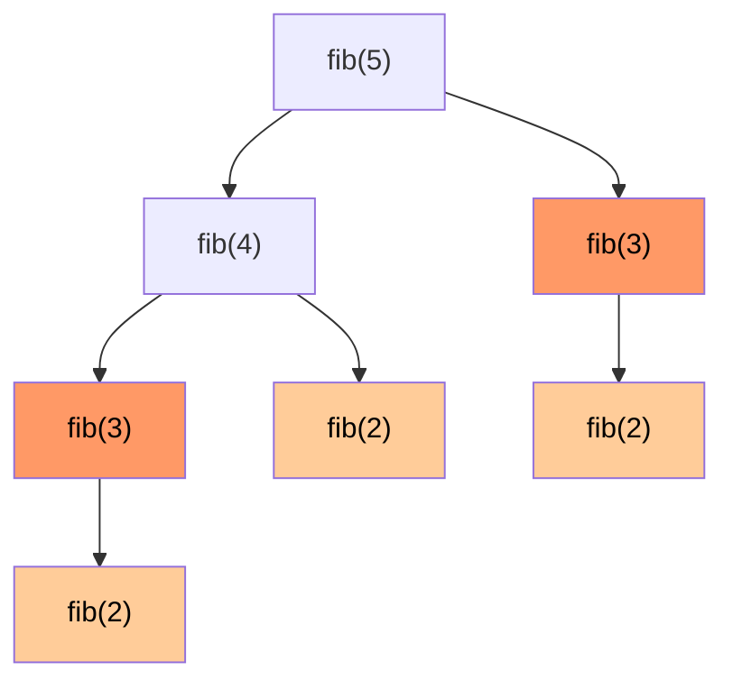

# Вопросы на собеседовании: `Динамическое программирование`

DP — самая «отсеивающая» тема на интервью. Кандидаты часто не видят DP за задачей. Главное — научиться распознавать **оптимальную подструктуру** и **перекрывающиеся подзадачи**, и переходить от brute-force рекурсии → к мемоизации → к табуляции → к оптимизации памяти.

## Полезные ссылки

### Официальная документация и авторитетные источники

- [Dynamic Programming — Baeldung](https://www.baeldung.com/cs/dynamic-programming)
- [Knapsack Problem — Baeldung](https://www.baeldung.com/cs/knapsack-problem)
- [Longest Common Subsequence — Baeldung](https://www.baeldung.com/cs/longest-common-subsequence)
- [Edit Distance — Baeldung](https://www.baeldung.com/cs/edit-distance)
- [Memoization vs Tabulation — Baeldung](https://www.baeldung.com/cs/memoization-vs-tabulation)
- [DP for Beginners — LeetCode Discuss](https://leetcode.com/discuss/general-discussion/458695/dynamic-programming-patterns)

## Содержание

- [Полезные ссылки](#полезные-ссылки)
- [See also](#see-also)

**Базовые понятия**
- [Q1. (!) Что такое DP и когда применяется?](#q1--что-такое-dp-и-когда-применяется)
- [Q2. (!) Что такое оптимальная подструктура?](#q2--что-такое-оптимальная-подструктура)
- [Q3. (!) Что такое перекрывающиеся подзадачи?](#q3--что-такое-перекрывающиеся-подзадачи)
- [Q4. (!) Memoization vs Tabulation?](#q4--memoization-vs-tabulation)

**Базовые DP задачи**
- [Q5. (!) Fibonacci через DP?](#q5--fibonacci-через-dp)
- [Q6. (!) Climbing Stairs?](#q6--climbing-stairs)
- [Q7. House Robber?](#q7-house-robber)
- [Q8. House Robber II — круговой массив?](#q8-house-robber-ii--круговой-массив)
- [Q9. Min Cost Climbing Stairs?](#q9-min-cost-climbing-stairs)

**Knapsack-like задачи**
- [Q10. (!) 0/1 Knapsack?](#q10--01-knapsack)
- [Q11. Unbounded Knapsack?](#q11-unbounded-knapsack)
- [Q12. (!) Coin Change — минимум монет?](#q12--coin-change--минимум-монет)
- [Q13. (!) Coin Change II — число способов?](#q13--coin-change-ii--число-способов)
- [Q14. Partition Equal Subset Sum?](#q14-partition-equal-subset-sum)

**Subsequence задачи**
- [Q15. (!) Longest Common Subsequence (LCS)?](#q15--longest-common-subsequence-lcs)
- [Q16. (!) Longest Increasing Subsequence (LIS)?](#q16--longest-increasing-subsequence-lis)
- [Q17. (!) Edit Distance (Levenshtein)?](#q17--edit-distance-levenshtein)
- [Q18. Longest Palindromic Subsequence?](#q18-longest-palindromic-subsequence)
- [Q19. Distinct Subsequences?](#q19-distinct-subsequences)

**String и Grid DP**
- [Q20. (!) Longest Palindromic Substring через DP?](#q20--longest-palindromic-substring-через-dp)
- [Q21. (!) Unique Paths в матрице?](#q21--unique-paths-в-матрице)
- [Q22. (!) Minimum Path Sum?](#q22--minimum-path-sum)
- [Q23. Word Break?](#q23-word-break)
- [Q24. Maximal Square / Rectangle?](#q24-maximal-square--rectangle)

**Stock задачи**
- [Q25. (!) Best Time to Buy and Sell Stock — серия задач?](#q25--best-time-to-buy-and-sell-stock--серия-задач)

**Интервалы и игры**
- [Q26. Burst Balloons?](#q26-burst-balloons)
- [Q27. Predict the Winner — Game DP?](#q27-predict-the-winner--game-dp)

**State compression и оптимизации**
- [Q28. (!) Как оптимизировать память DP?](#q28--как-оптимизировать-память-dp)
- [Q29. (!) Bitmask DP — TSP за O(n²·2ⁿ)?](#q29--bitmask-dp--tsp-за-on²2ⁿ)
- [Q30. Что такое pseudo-polynomial complexity?](#q30-что-такое-pseudo-polynomial-complexity)

**Distinguishing DP**
- [Q31. (!) Чем DP отличается от Greedy?](#q31--чем-dp-отличается-от-greedy)
- [Q32. (!) Чем DP отличается от Divide and Conquer?](#q32--чем-dp-отличается-от-divide-and-conquer)
- [Q33. (!) Как распознать DP-задачу на интервью?](#q33--как-распознать-dp-задачу-на-интервью)

## Q1. (!) Что такое DP и когда применяется?

**Dynamic Programming** — метод решения задач разбиением на подзадачи **с запоминанием** результатов, чтобы не пересчитывать одно и то же.

**Условия применимости:**
1. **Optimal substructure** — оптимальное решение задачи строится из оптимальных решений подзадач
2. **Overlapping subproblems** — те же подзадачи встречаются много раз в наивной рекурсии

Если есть только optimal substructure (без перекрытий) — Divide and Conquer (Merge Sort). Если перекрытия есть — DP даёт значительное ускорение.


> [!mcq] Какие два условия одновременно должны выполняться, чтобы задача решалась динамическим программированием?
>
> - [x] A. Optimal substructure (оптимум целого собирается из оптимумов подзадач) и overlapping subproblems (одни и те же подзадачи встречаются в наивной рекурсии многократно).
>
>     **Развёрнутое объяснение.** DP применимо строго при двух условиях. Optimal substructure означает, что f(n) выражается через f(k) для k<n при оптимальной игре, и эти подзадачи независимы. Overlapping subproblems отличают DP от Divide-and-Conquer: если бы каждая подзадача встречалась один раз, мемоизация ничего не дала бы и хватало бы обычной рекурсии. Когда оба свойства есть, DP превращает экспоненциальное `O(2^n)` в полиномиальное `O(n)` или `O(n*W)`.
>
>     **Пример.** Fibonacci: `fib(n) = fib(n-1) + fib(n-2)` — оптимальная подструктура тривиальна, а `fib(3)` в дереве вызовов для `fib(6)` встречается 3 раза, `fib(2)` — 5 раз. Мемоизация сводит работу к `O(n)`. Shortest path в DAG (Dijkstra без negative): кратчайший путь `s→t` содержит кратчайшие пути `s→v` для всех промежуточных `v`.
>
>     **Когда применять.** Задачи на «минимум/максимум/число способов», задачи с состоянием небольшой размерности (`dp[i]`, `dp[i][j]`, `dp[i][mask]`), задачи с выбором на каждом шаге (взять/не взять, идти вправо/вниз). Production-системы: editor diff в Git (LCS-based), spell-checker auto-correct (Edit Distance), маршрутизация delivery (TSP через bitmask DP для `n≤22`).
>
>     **Подводные камни.** Не всякая задача с рекурсией — DP: longest simple path в графе с циклами не имеет optimal substructure (части оптимального пути могут пересекать друг друга). При большом state space (`2^n`, `n*W` с `W=10^9`) DP теоретически работает, но практически невозможен — это pseudo-polynomial complexity.
>
>     **Связанные вопросы.** [[dynamic-programming-interview#Q2]] optimal substructure; [[dynamic-programming-interview#Q3]] overlapping subproblems; [[dynamic-programming-interview#Q32]] DP vs Divide-and-Conquer.
>
> - [ ] B. Достаточно только optimal substructure — перекрытия подзадач для DP не обязательны и относятся к Divide-and-Conquer.
>
>     **Что на самом деле.** Без overlapping subproblems кэш бесполезен: каждая подзадача встречается один раз, мемоизация не даёт ускорения, а накладные расходы на HashMap или массив только замедляют. Это ровно случай Merge Sort и Quick Sort — у них optimal substructure есть, но это не DP.
>
>     **Откуда путаница.** Многие учебники определяют DP через optimal substructure первым (это «громкое» свойство), а перекрытия упоминают вторым, и читатель запоминает только первое. К тому же в задачах вроде Fibonacci перекрытия кажутся «и так очевидными».
>
>     **Если бы это было правдой.** Merge Sort пришлось бы называть «DP-алгоритмом», а в Coursera/Sedgewick он стоит в разделе Divide-and-Conquer. Решение `O(n log n)` сортировки слиянием через мемоизацию не дало бы выигрыша — наоборот, дало бы оверхед на хранение всех `O(n log n)` подмассивов.
>
>     **Как было бы правильно.** Перечислить оба условия одновременно: optimal substructure плюс overlapping subproblems — только в их пересечении живёт DP.
>
> - [ ] C. DP применяется тогда и только тогда, когда задача NP-полная и нужно найти приближённое решение за полиномиальное время.
>
>     **Что на самом деле.** DP не связан с классом NP. Это техника: запомнить уже посчитанные подзадачи. Многие DP-задачи решают P-задачи (LCS, Fibonacci), а NP-полные через DP остаются экспоненциальными (TSP — `O(n^2 * 2^n)`, лучше brute-force `O(n!)`, но всё ещё экспоненциально).
>
>     **Откуда путаница.** Bitmask DP часто упоминается рядом с TSP и Subset Sum, и студенты решают, что DP — это «способ решать NP-задачи». На самом деле DP — это просто кэш для рекурсии.
>
>     **Если бы это было правдой.** Knapsack `O(n*W)` считался бы полиномиальным решением NP-полной задачи, что нарушило бы P≠NP (если бы оно было доказано). Реально Knapsack — pseudo-polynomial: время полиномиально в значении W, но экспоненциально в `log W` — числе битов представления.
>
>     **Как было бы правильно.** Описать DP как технику оптимизации рекурсии через кэш, применимую ко всем задачам с optimal substructure и overlapping subproblems — независимо от класса сложности.
>
> - [ ] D. DP работает только для задач, где состояние можно представить одной целочисленной переменной `dp[i]` — двумерные таблицы относятся к табуляции, а не к DP.
>
>     **Что на самом деле.** Размерность state — это деталь реализации, а не определение DP. `dp[i][j]` для LCS/Edit Distance, `dp[i][k][hold]` для Stock-задач, `dp[i][mask]` для bitmask — всё это DP. Tabulation vs Memoization — это два способа реализации DP (bottom-up и top-down), а не разные концепции.
>
>     **Откуда путаница.** Первые примеры DP в учебниках — Fibonacci и Climbing Stairs с одномерным dp. Студенты обобщают «DP = массив `dp[i]`» и не узнают DP в двумерных и многомерных задачах.
>
>     **Если бы это было правдой.** LCS, Edit Distance, Knapsack, Matrix Chain Multiplication — половина классических DP-задач — выпали бы из определения DP. В CLRS и Sedgewick они стоят как канонические примеры именно DP.
>
>     **Как было бы правильно.** Сказать, что state может иметь любую размерность (1D, 2D, bitmask) — главное, чтобы выполнялись optimal substructure и overlapping subproblems.

## Q2. (!) Что такое оптимальная подструктура?

**Оптимальное решение задачи можно построить из оптимальных решений её подзадач.**

**Пример (Shortest path):** если кратчайший путь от A до C проходит через B, то A→B и B→C — тоже кратчайшие. Поэтому Dijkstra/Bellman-Ford работают.

**Контрпример (Longest path):** самый длинный простой путь от A до C может НЕ содержать самый длинный путь от A до B (тот может пересечь C).

**Не все задачи** имеют оптимальную подструктуру — для них DP не подходит.


> [!mcq] Почему задача Longest Simple Path в произвольном графе не имеет optimal substructure и потому не решается DP?
>
> - [ ] A. Потому что граф может содержать циклы, а DP принципиально не работает с циклическими структурами данных — Fibonacci и Knapsack не используют граф.
>
>     **Что на самом деле.** DP отлично работает с циклическими графами, если задача укладывается в state-space без перекрытия путей: Bellman-Ford, Floyd-Warshall — это DP по DAG из (vertex, edge_count). Проблема Longest Simple Path не в циклах, а в требовании «simple» (без повторов вершин), из-за которого подпути могут конфликтовать.
>
>     **Откуда путаница.** Кажется, что «DAG → DP работает», «cycle → DP не работает». На самом деле граница проходит по другому: важно не наличие циклов, а можно ли независимо оптимизировать подзадачи.
>
>     **Если бы это было правдой.** Bellman-Ford не работал бы в графах с отрицательными циклами — но он там работает (детектирует их за `O(VE)`). Floyd-Warshall не справлялся бы с циклами — но это его основной use-case.
>
>     **Как было бы правильно.** Объяснить, что Longest Simple Path не имеет optimal substructure не из-за циклов, а потому, что подпути оптимального пути могут разделять вершины и при склейке нарушать ограничение simple.
>
> - [ ] B. Потому что Longest Simple Path — NP-полная задача, а DP работает только для P-задач.
>
>     **Что на самом деле.** Longest Simple Path действительно NP-hard, но это следствие, а не причина отсутствия optimal substructure. И DP отлично работает с NP-hard задачами: bitmask DP для TSP даёт `O(n^2 * 2^n)`, что лучше brute-force `O(n!)` при `n≤22`.
>
>     **Откуда путаница.** Студенты связывают «нет оптимального DP-решения» с «задача NP-hard». На деле это разные характеристики: NP-hard говорит о сложности, а optimal substructure — о структуре подзадач.
>
>     **Если бы это было правдой.** Subset Sum (NP-полная) не решалась бы через DP — но решается за `O(n*S)`. И обратно: множество P-задач не решается через DP (median by quickselect, sorting).
>
>     **Как было бы правильно.** Связать невозможность DP с тем, что оптимальный путь `A→C` может проходить через вершину, которая входит в оптимальный путь `A→B` — склейка `A→B→C` нарушит требование simple.
>
> - [x] C. Если оптимальный путь `A→C` проходит через вершину `B`, то части `A→B` и `B→C` могут разделять промежуточные вершины — склейка нарушит требование «simple» и решение перестанет быть валидным.
>
>     **Развёрнутое объяснение.** Optimal substructure требует, чтобы оптимум целого собирался из оптимумов независимых подзадач. В Longest Simple Path оптимальный путь `A→C` через `B` означает, что и `A→B`, и `B→C` оптимальны на своих подзадачах. Но если самый длинный simple-путь `A→B` проходит через вершину `v`, и самый длинный simple-путь `B→C` тоже проходит через `v` — склейка пройдёт `v` дважды, нарушив условие simple. Поэтому подзадачи не независимы, и DP неприменим.
>
>     **Пример.** Граф `A-B-C-A` (треугольник) с весами 1. Longest simple-путь `A→C` проходит через `B` (длина 2). Longest simple `A→B` через `C` (длина 2). Если их склеить через общую вершину `B` или `C`, получим повторение — но самостоятельно каждый из них оптимален.
>
>     **Когда применять.** Это объяснение нужно на интервью при вопросе «почему shortest path решается DP, а longest — нет». Применимо к задачам с глобальными ограничениями (no-repeat, unique resource), которые невозможно учесть в локальном state.
>
>     **Подводные камни.** В DAG longest path РЕШАЕТСЯ за `O(V+E)`, потому что без циклов «simple» автоматически гарантировано (одна и та же вершина не появится дважды). В деревьях longest path (diameter) тоже решается DP, потому что между двумя вершинами единственный путь.
>
>     **Связанные вопросы.** [[dynamic-programming-interview#Q1]] условия применимости DP; [[dynamic-programming-interview#Q3]] overlapping subproblems; [[graphs-interview#Q1]] DAG longest path.
>
> - [ ] D. Потому что Longest Simple Path требует floating-point вычислений, а DP работает только с целочисленными состояниями.
>
>     **Что на самом деле.** DP работает с любыми типами значений: float, BigDecimal, строки, объекты — это не ограничение. Например, Floyd-Warshall с double-весами или Edit Distance со строковыми операциями. State (ключ кэша) — целочисленный, но значение в кэше — любое.
>
>     **Откуда путаница.** Большинство учебных примеров DP — на целочисленных задачах (Knapsack, Coin Change, LIS), и студенты думают, что это требование, а не случайность учебника.
>
>     **Если бы это было правдой.** Floyd-Warshall с double-весами не работал бы — а он применяется в навигации, где расстояния задаются float-числами.
>
>     **Как было бы правильно.** Указать, что DP индифферентен к типу значений в подзадачах — главное, чтобы state имел конечное число дискретных значений для индексации кэша.

## Q3. (!) Что такое перекрывающиеся подзадачи?

Подзадачи **повторяются** при наивной рекурсии. Пример — Фибоначчи:

```
fib(5) = fib(4) + fib(3)
fib(4) = fib(3) + fib(2)
fib(3) = fib(2) + fib(1)
       ...
```

`fib(3)` вычисляется 2 раза, `fib(2)` — 3 раза. При больших `n` — экспоненциально много повторов.

**Решение:** запоминать результаты — мемоизация. Это превращает `O(2ⁿ)` в `O(n)`.




> [!mcq] До какого порядка сложности сводит мемоизация наивную рекурсию для Fibonacci и какая фундаментальная причина за этим стоит?
>
> - [ ] A. С `O(2^n)` до `O(n log n)` — мемоизация добавляет logarithmic-кэш, и поэтому константа возрастает.
>
>     **Что на самом деле.** Мемоизация даёт ровно `O(n)`, а не `O(n log n)`. Каждое значение `fib(k)` вычисляется один раз — это `n` вычислений, каждое за `O(1)` (две арифметики + lookup). При использовании HashMap появляется амортизированная `O(1)` на lookup, а массив-кэш даёт строго `O(1)`.
>
>     **Откуда путаница.** Студенты ассоциируют логарифмический множитель с любым хранением (как в Binary Search Tree-кэше), но `HashMap.get` в среднем `O(1)`, а массив `int[]` — гарантированно `O(1)`.
>
>     **Если бы это было правдой.** Стандартный мемоизированный Fibonacci работал бы заметно медленнее, чем итеративный — на практике они работают за одно и то же время с точностью до constant factor.
>
>     **Как было бы правильно.** Указать корректную сложность `O(n)` — `n` уникальных подзадач, каждая за `O(1)` (массив-кэш).
>
> - [ ] B. С `O(2^n)` до `O(n^2)` — мемоизация требует двойной обход дерева подзадач.
>
>     **Что на самом деле.** Дерево обходится один раз: первое вычисление `fib(k)` падает в кэш, повторные обращения сразу возвращают значение. Это даёт `n` вычислений суммарно — `O(n)`, не `O(n^2)`.
>
>     **Откуда путаница.** Студенты иногда смешивают Fibonacci с 2D DP-задачами (LCS, Edit Distance), где состояние `dp[i][j]` действительно даёт `O(n*m)`. У Fibonacci state одномерный — `dp[i]`.
>
>     **Если бы это было правдой.** Для `n=10^6` мемоизированный Fibonacci занимал бы `10^12` операций (часы), а реально работает за миллисекунды.
>
>     **Как было бы правильно.** Сказать `O(n)` для Fibonacci, а `O(n^2)` оставить для задач с 2D state (LCS, Edit Distance).
>
> - [ ] C. С `O(2^n)` до `O(log n)` — мемоизация позволяет вычислять только корневые подзадачи, остальные складываются автоматически.
>
>     **Что на самом деле.** `O(log n)` для Fibonacci достигается не мемоизацией, а другим методом — matrix exponentiation `[[1,1],[1,0]]^n` через fast power. Мемоизация даёт `O(n)`, потому что все `n` подзадач от `fib(1)` до `fib(n)` действительно нужно посчитать.
>
>     **Откуда путаница.** Существование `O(log n)` алгоритма для Fibonacci через матричное возведение в степень или формулу Бине вводит в заблуждение, но это другой подход — не DP с мемоизацией.
>
>     **Если бы это было правдой.** Мемоизированный fib(10^9) считался бы за десятки операций — но он на стеке умрёт StackOverflowError для `n>10^5` (depth recursion).
>
>     **Как было бы правильно.** Различать алгоритмы: мемоизация даёт `O(n)`, matrix exponentiation — `O(log n)`. Это разные техники.
>
> - [x] D. С `O(2^n)` до `O(n)` — каждая из `n` уникальных подзадач `fib(0)..fib(n)` вычисляется ровно один раз благодаря кэшу, повторные обращения возвращают результат за `O(1)`.
>
>     **Развёрнутое объяснение.** Наивный `fib(n) = fib(n-1) + fib(n-2)` строит дерево вызовов размера `Θ(φ^n) ≈ O(2^n)` — каждый узел делает два рекурсивных вызова. Мемоизация хранит уже вычисленные значения в массиве `memo[0..n]`. Первый вызов `fib(k)` идёт по рекурсии и заполняет `memo[k]`; повторные обращения возвращают `memo[k]` за `O(1)`. Уникальных подзадач ровно `n+1` — `fib(0)`, `fib(1)`, ..., `fib(n)` — поэтому суммарно `O(n)` времени, `O(n)` памяти (массив + стек рекурсии).
>
>     **Пример.** При `n=40` наивный делает примерно `2^40 ≈ 10^12` операций (минуты на CPU), мемоизированный — 41 операцию. На production это разница между «функция таймаут» и «функция мгновенно».
>
>     **Когда применять.** Когда уравнение рекурсии содержит ≥2 рекурсивных вызовов с пересечением подзадач: Fibonacci, Climbing Stairs, House Robber, LIS, LCS. На production: ML feature engineering с recursive computation, dependency graph topological order с кэшированием.
>
>     **Подводные камни.** Память на стек рекурсии `O(n)` приводит к `StackOverflowError` при `n>10^4..10^5` в JVM (default stack ~512KB). Решение — tabulation (итеративное заполнение `dp[]`) с `O(1)` стеком, а далее space optimization до `O(1)` памяти.
>
>     **Связанные вопросы.** [[dynamic-programming-interview#Q5]] Fibonacci реализации; [[dynamic-programming-interview#Q4]] Memoization vs Tabulation; [[complexity-analysis-interview#Q1]] big-O анализ.

## Q4. (!) Memoization vs Tabulation?

| Подход | Top-down | Bottom-up |
|--------|----------|-----------|
| **Memoization** | Рекурсия + кеш | — |
| **Tabulation** | — | Итеративно заполняем таблицу |

**Memoization (top-down):**

```java
int[] memo;
int fib(int n) {
    if (n <= 1) return n;
    if (memo[n] != 0) return memo[n];
    return memo[n] = fib(n - 1) + fib(n - 2);
}
```

**Tabulation (bottom-up):**

```java
int fib(int n) {
    if (n <= 1) return n;
    int[] dp = new int[n + 1];
    dp[1] = 1;
    for (int i = 2; i <= n; i++) dp[i] = dp[i - 1] + dp[i - 2];
    return dp[n];
}
```

**Сравнение:**

| Критерий | Memoization | Tabulation |
|----------|-------------|------------|
| Простота | Часто проще (естественная рекурсия) | Требует понимания зависимостей |
| Стек | `O(n)` (риск StackOverflow) | `O(1)` |
| Скорость | Чуть медленнее (overhead вызовов) | Быстрее |
| Считает только нужное | Да | Иногда лишнее |
| Optimization памяти | Сложнее | Естественно |

На интервью: начни с brute-force рекурсии → memoization → tabulation → space optimization.


> [!mcq] В чём ключевое практическое различие между memoization (top-down) и tabulation (bottom-up) для DP, что заставляет выбирать одно или другое?
>
> - [x] A. Memoization рекурсивна и расходует `O(depth)` стека, рискуя StackOverflowError; tabulation итеративна с `O(1)` стека, но обязана вычислять все подзадачи в правильном порядке, даже если часть из них не нужна для ответа.
>
>     **Развёрнутое объяснение.** Memoization — это рекурсия с кэшем: считается только то, что понадобилось для ответа (lazy), но depth recursion даёт `O(n)` или `O(n*m)` фреймов на стеке. В JVM с default `-Xss512k` это означает StackOverflowError на `n≈10^4..10^5`. Tabulation — это итеративное заполнение таблицы в топологическом порядке зависимостей: стек постоянный, но порядок обхода определяется заранее и приходится посчитать все `dp[i][j]`, даже если для ответа достаточно подмножества.
>
>     **Пример.** Edit Distance для строк длины 10000: memoized-версия упадёт StackOverflowError на глубине 20000 на JVM. Tabulation `O(n*m)` пройдёт за секунды. Но на разреженных задачах вроде sparse Knapsack с большой capacity и малым числом достижимых state — memoization экономит работу, потому что не заполняет недостижимые ячейки.
>
>     **Когда применять.** Memoization — на интервью для естественной формулировки и для разреженных state-space. Tabulation — в production, когда нужна предсказуемая память и стек, или когда нужна space optimization до `O(1)`/`O(min)` через rolling array. Production-системы (например, Elasticsearch fuzzy search с Edit Distance) всегда используют tabulation.
>
>     **Подводные камни.** Tabulation требует правильного порядка итераций: для 0/1 Knapsack обратный обход по `w` обязателен, иначе предмет учтётся дважды. Memoization в Java/Kotlin требует учитывать sentinel-значения: `int[] memo` инициализируется нулями, и `fib(0)=0` неотличим от «не посчитано» — нужен `Integer[]` с null или флаг `computed[]`.
>
>     **Связанные вопросы.** [[dynamic-programming-interview#Q5]] Fibonacci реализации; [[dynamic-programming-interview#Q28]] space optimization; [[dynamic-programming-interview#Q3]] overlapping subproblems.
>
> - [ ] B. Memoization всегда быстрее tabulation, потому что не заполняет лишние ячейки таблицы и поэтому всегда предпочтительнее в production.
>
>     **Что на самом деле.** Memoization имеет overhead на вызовы функций и lookup в кэше, что делает её на ~2-3x медленнее tabulation на плотных задачах (LCS, Edit Distance, Knapsack), где всё равно посещаются все ячейки. Production предпочитает tabulation за предсказуемость памяти/стека и возможность space optimization.
>
>     **Откуда путаница.** Intuition «считаем только нужное → быстрее» верна по количеству вычислений, но забывает про constant factor: каждый рекурсивный вызов — это allocation frame, push/pop, HashMap lookup. На плотных DP-задачах этот overhead доминирует.
>
>     **Если бы это было правдой.** Все production-DP-решения (Elasticsearch fuzzy search, Git diff, spell-checkers) были бы рекурсивными — но они итеративные именно из-за стабильности.
>
>     **Как было бы правильно.** Сказать, что memoization быстрее ТОЛЬКО на разреженных state-space (mahy unreachable states), а на плотных tabulation выигрывает за счёт constant factor и кэш-локальности массивов.
>
> - [ ] C. Memoization и tabulation эквивалентны по производительности, памяти и стеку — отличаются только синтаксисом, поэтому выбор чисто стилистический.
>
>     **Что на самом деле.** Различия принципиальные: память на стек (`O(n)` vs `O(1)`), constant factor (рекурсия vs итерация), порядок вычислений (lazy vs eager), возможность space optimization (требует tabulation). Это конкретные production-критерии, не стилистика.
>
>     **Откуда путаница.** Студенческие задачки на `n≤100` действительно работают одинаково — разница незаметна. Это создаёт иллюзию эквивалентности.
>
>     **Если бы это было правдой.** Не было бы смысла переписывать решение из top-down в bottom-up на интервью — но это стандартное требование от senior-кандидатов.
>
>     **Как было бы правильно.** Перечислить конкретные различия (стек, constant factor, lazy/eager, space opt) и сказать, что они влияют на выбор в production.
>
> - [ ] D. Tabulation работает только для линейных DP (одномерный `dp[i]`), а двумерные и многомерные DP можно решать только через memoization.
>
>     **Что на самом деле.** Tabulation отлично работает для любых размерностей state, если можно определить топологический порядок зависимостей. `dp[i][j]` для LCS, `dp[i][k][hold]` для Stocks, `dp[mask][i]` для bitmask TSP — всё это классические tabulation-реализации.
>
>     **Откуда путаница.** Студенты, столкнувшись со сложным порядком обхода (например, по длине интервала для Burst Balloons), сдаются в tabulation и переходят на memoization. Это лень, а не ограничение метода.
>
>     **Если бы это было правдой.** CLRS, Sedgewick, Kleinberg-Tardos — все писали бы LCS и Edit Distance через memoization. Реально они показывают tabulation как канонический способ.
>
>     **Как было бы правильно.** Указать, что tabulation требует понимания топологического порядка обхода (по длине интервала, по битмаске «по числу единиц», по диагоналям), но работает для DP любой размерности.

## Q5. (!) Fibonacci через DP?

```java
// Naive O(2^n)
int fibNaive(int n) {
    if (n <= 1) return n;
    return fibNaive(n - 1) + fibNaive(n - 2);
}

// Memoization O(n) time, O(n) space
int fibMemo(int n, int[] memo) {
    if (n <= 1) return n;
    if (memo[n] != 0) return memo[n];
    return memo[n] = fibMemo(n - 1, memo) + fibMemo(n - 2, memo);
}

// Tabulation O(n) time, O(n) space
int fibTab(int n) {
    if (n <= 1) return n;
    int[] dp = new int[n + 1];
    dp[1] = 1;
    for (int i = 2; i <= n; i++) dp[i] = dp[i - 1] + dp[i - 2];
    return dp[n];
}

// Space-optimized O(n) time, O(1) space
int fibOpt(int n) {
    if (n <= 1) return n;
    int prev2 = 0, prev1 = 1;
    for (int i = 2; i <= n; i++) {
        int curr = prev1 + prev2;
        prev2 = prev1; prev1 = curr;
    }
    return prev1;
}

// Matrix exponentiation O(log n)
// fib(n) = ([1,1],[1,0])^n  применяя fast power
```


> [!mcq] Какая реализация Fibonacci подходит для production-кода, где `n` может достигать `10^6`, и почему?
>
> - [ ] A. Naive recursive `fib(n-1) + fib(n-2)` — она читается легче всего и поэтому проста в поддержке.
>
>     **Что на самом деле.** Naive имеет сложность `O(φ^n) ≈ O(1.618^n)` — для `n=50` это уже `10^10` операций (десятки секунд), для `n=10^6` — это `~10^200000` операций, что не выполнится никогда. Это не годится для production даже для `n=40`.
>
>     **Откуда путаница.** Студенты, которым показали naive первым и сказали «вот так математически естественно», запоминают её как «default». На практике это всегда антипаттерн.
>
>     **Если бы это было правдой.** Production использовал бы naive Fibonacci — и любой запрос с `n=50` приводил бы к p99 latency 30+ секунд. Это бы попало в post-mortem.
>
>     **Как было бы правильно.** В production для `n` до `10^4` использовать iterative space-optimized `O(n)` с двумя переменными; для больших `n` — matrix exponentiation `O(log n)`.
>
> - [ ] B. Memoized recursive с `int[] memo` — оптимально по времени `O(n)` и универсально для любых `n`.
>
>     **Что на самом деле.** Memoized recursive даёт `O(n)` времени, но `O(n)` стека рекурсии. JVM с дефолтным `-Xss512k` падает StackOverflowError примерно на `n=10^4..10^5`. Для `n=10^6` гарантированно крэшнется.
>
>     **Откуда путаница.** На LeetCode тесты обычно `n≤30`, memoized работает. Студенты не сталкиваются с stack overflow, пока не выходят за пределы учебных примеров.
>
>     **Если бы это было правдой.** Сервис вычислений с user input `n` ломался бы на больших значениях с StackOverflowError, что в Spring Boot Actuator выглядело бы как 500-error и попало бы в Capacity One/Knight Capital-подобные incident-постмортемы.
>
>     **Как было бы правильно.** Переписать на итеративный space-optimized с двумя переменными — `O(n)` времени и `O(1)` стека.
>
> - [x] C. Iterative space-optimized с двумя переменными `prev2, prev1` — `O(n)` времени, `O(1)` памяти, `O(1)` стека; для `n=10^6` отрабатывает за миллисекунды без риска StackOverflowError.
>
>     **Развёрнутое объяснение.** Для Fibonacci зависимость `dp[i] = dp[i-1] + dp[i-2]` использует только два предыдущих значения — массив можно заменить двумя переменными. Это даёт `O(1)` памяти и `O(1)` стека (итерация). Для `n=10^6` алгоритм отработает за ~10ms на современном CPU, не требует ни heap-аллокаций, ни рекурсии. Внимание: `fib(93)` уже переполняет `long` — для больших `n` нужен `BigInteger`.
>
>     **Пример.** В сервисе расчёта пенсионных аннуитетов или биржевых деривативов часто встречаются последовательности Фибоначчи (Elliott Wave анализ, Retracement Levels). Iterative-версия гарантирует predictable latency и низкое потребление памяти на любых n.
>
>     **Когда применять.** Когда нужен Fibonacci в production-сервисе с потенциально большими `n`, при ограниченной памяти, в hot-path кода. Также как best-practice демонстрация на интервью — это сразу показывает понимание space optimization.
>
>     **Подводные камни.** Для `n≥93` `long` переполняется — нужен `BigInteger.add()`, что замедляет до `O(n^2)` из-за длинной арифметики. Для очень больших `n` лучше matrix exponentiation `[[1,1],[1,0]]^n` за `O(log n)` умножений длинных чисел, что даёт суммарно `O(M(n) log n)` где `M(n)` — стоимость умножения BigInteger.
>
>     **Связанные вопросы.** [[dynamic-programming-interview#Q4]] memoization vs tabulation; [[dynamic-programming-interview#Q28]] space optimization; [[dynamic-programming-interview#Q6]] Climbing Stairs (тот же recurrence).
>
> - [ ] D. Matrix exponentiation `[[1,1],[1,0]]^n` — единственно правильный production-подход, всегда быстрее любого другого.
>
>     **Что на самом деле.** Matrix exponentiation даёт `O(log n)` умножений матриц 2×2, но constant factor больше, чем у простой итерации. Для small/medium `n` (до `~10^5`) iterative-версия с двумя переменными быстрее. Преимущество matrix exp проявляется только при очень больших `n` с использованием BigInteger.
>
>     **Откуда путаница.** Студенты, узнав про `O(log n)`-трюк, переоценивают его универсальность. На практике для `n<10^5` он медленнее iterative из-за overhead на матричные операции.
>
>     **Если бы это было правдой.** Все production-системы использовали бы matrix exp — на деле большинство применяют iterative с `BigInteger` или fast doubling `F(2k) = F(k)*(2*F(k+1)-F(k))`.
>
>     **Как было бы правильно.** Указать, что выбор зависит от диапазона `n`: для `n<10^4` — iterative `O(n)`, для `n>10^5` с BigInteger — matrix exp или fast doubling `O(log n)`.

## Q6. (!) Climbing Stairs?

`n` ступенек, можно прыгать на 1 или 2. Сколько способов добраться до верха?

```java
int climbStairs(int n) {
    if (n <= 2) return n;
    int prev2 = 1, prev1 = 2;
    for (int i = 3; i <= n; i++) {
        int curr = prev1 + prev2;
        prev2 = prev1; prev1 = curr;
    }
    return prev1;
}
```

**По сути — Фибоначчи.** Если бы можно было прыгать на 1, 2, 3 — `dp[i] = dp[i-1] + dp[i-2] + dp[i-3]`.


> [!mcq] Climbing Stairs с шагами 1 или 2 имеет ту же рекуррентность, что и Fibonacci. Что изменится, если разрешить шаги 1, 2 или 3?
>
> - [ ] A. Сложность вырастет до `O(n^2)` — добавление третьего варианта удваивает число подзадач.
>
>     **Что на самом деле.** Сложность остаётся `O(n)`: каждое `dp[i]` вычисляется за константу из трёх предшественников `dp[i-1] + dp[i-2] + dp[i-3]`. Constant factor чуть больше (три сложения вместо двух), но big-O не меняется.
>
>     **Откуда путаница.** «Больше вариантов → сложнее» — intuition, которая верна для brute-force (3^n вместо 2^n), но неверна для DP с одномерным state.
>
>     **Если бы это было правдой.** `n=10^6` занимал бы `10^12` операций (часы), а реально занимает 10 ms.
>
>     **Как было бы правильно.** Объяснить, что в DP сложность определяется числом state'ов × стоимость перехода. Здесь state'ов `n`, переход `O(1)` — суммарно `O(n)`.
>
> - [ ] B. Recurrence будет `dp[i] = dp[i-1] * dp[i-2] * dp[i-3]` — произведение всех способов добраться до меньших ступенек.
>
>     **Что на самом деле.** Правильная рекуррентность — это сумма, а не произведение: `dp[i] = dp[i-1] + dp[i-2] + dp[i-3]`. Каждое слагаемое — число способов прийти из предыдущей ступеньки, и их множества способов не пересекаются (последний шаг уникален), поэтому используется сумма (правило сложения комбинаций).
>
>     **Откуда путаница.** Студенты путают комбинаторные «или» (сложение независимых способов) и «и» (умножение независимых выборов в композиции). Здесь у нас «или»: способ кончается шагом-1 ИЛИ шагом-2 ИЛИ шагом-3.
>
>     **Если бы это было правдой.** `dp[3] = dp[0] * dp[1] * dp[2] = 1 * 1 * 2 = 2`, реально для шагов 1/2/3 это 4 ({1+1+1}, {1+2}, {2+1}, {3}). Тест бы упал на любом базовом примере.
>
>     **Как было бы правильно.** Записать `dp[i] = dp[i-1] + dp[i-2] + dp[i-3]` — это известная последовательность Tribonacci.
>
> - [x] C. Recurrence становится `dp[i] = dp[i-1] + dp[i-2] + dp[i-3]` (Tribonacci), сложность остаётся `O(n)` времени и `O(1)` памяти при space-optimization до трёх переменных.
>
>     **Развёрнутое объяснение.** Если последний шаг — 1, то осталось добраться до `i-1`; если 2 — до `i-2`; если 3 — до `i-3`. Множества способов не пересекаются (отличаются последним шагом), поэтому суммируются: `dp[i] = dp[i-1] + dp[i-2] + dp[i-3]`. Это Tribonacci-последовательность с базой `dp[0]=1, dp[1]=1, dp[2]=2`. Алгоритмически — то же DP с тремя предшественниками, `O(n)` времени, `O(1)` памяти при использовании трёх переменных.
>
>     **Пример.** В мобильной игре c прыжками на платформы (Doodle Jump, Geometry Dash) число траекторий с разрешёнными шагами `{1,2,3}` считается за `O(n)`. Для `n=20` ответ `121415`, для `n=30` — `53798080`. Tribonacci растёт как `O(η^n)`, где η ≈ 1.839 (Tribonacci constant).
>
>     **Когда применять.** Обобщённый Climbing Stairs с произвольным набором шагов `S = {s1, ..., sk}` — recurrence `dp[i] = sum(dp[i-s] for s in S, s≤i)`, сложность `O(n*|S|)`. Применяется в backend для расчёта числа последовательностей операций, в game design для оценки баланса прыжков.
>
>     **Подводные камни.** Tribonacci растёт быстрее обычного long при `n>~80` — нужен BigInteger или модуль `10^9+7` (стандартный модуль на LeetCode/Codeforces). Если разрешены шаги назад (`-1, +1, +2`) — задача превращается в граф со циклами и теряет «однонаправленность», подход меняется на BFS/Dijkstra.
>
>     **Связанные вопросы.** [[dynamic-programming-interview#Q5]] Fibonacci; [[dynamic-programming-interview#Q9]] Min Cost Climbing Stairs; [[dynamic-programming-interview#Q12]] Coin Change (тот же паттерн «число способов»).
>
> - [ ] D. Задача станет NP-полной — она перестанет иметь полиномиальное решение и потребует bitmask DP за `O(n * 2^n)`.
>
>     **Что на самом деле.** Задача остаётся в P: одномерный state `dp[i]`, переход `O(1)`, суммарно `O(n)`. NP-полнота появляется при глобальных ограничениях (no-repeat, subset sum), которых здесь нет.
>
>     **Откуда путаница.** Студенты, узнав про bitmask DP, начинают видеть NP везде. Bitmask DP применяется для задач с глобальным ограничением (TSP, Subset Sum), а не для последовательностей с локальным выбором.
>
>     **Если бы это было правдой.** Climbing Stairs c шагами {1,2,3} был бы аналогичной сложности TSP — но это базовая DP-задача из первой главы любого учебника.
>
>     **Как было бы правильно.** Указать, что класс задачи не меняется: остаётся `O(n)` DP с одномерным state.

## Q7. House Robber?

Грабитель не может ограбить два соседних дома. Найти максимальную сумму.

```java
int rob(int[] nums) {
    int prev2 = 0, prev1 = 0;
    for (int n : nums) {
        int curr = Math.max(prev1, prev2 + n);
        prev2 = prev1; prev1 = curr;
    }
    return prev1;
}
```

`O(n)` время, `O(1)` память. Recurrence: `dp[i] = max(dp[i-1], dp[i-2] + nums[i])`.


> [!mcq] В классической House Robber `dp[i] = max(dp[i-1], dp[i-2] + nums[i])` — почему сравнение происходит именно с `dp[i-2]`, а не с `dp[i-1] - nums[i-1]`?
>
> - [ ] A. Чтобы избежать отрицательных значений в массиве `dp`, которые могли бы привести к неверному результату при `Math.max`.
>
>     **Что на самом деле.** `dp[i-1] - nums[i-1]` не давало бы отрицательных значений (`dp[i-1] ≥ nums[i-1]` всегда), но оно неверно семантически: это «максимум без последнего дома», что не гарантирует невзятие соседа. `dp[i-2]` чётко означает «лучшее на префиксе `[0..i-2]`», где дом `i-1` гарантированно не входит в продолжение.
>
>     **Откуда путаница.** Студенты пытаются «вывести» `dp[i-2]` через `dp[i-1]`, но это не алгебраическое преобразование, а изменение семантики state.
>
>     **Если бы это было правдой.** Тогда формула `dp[i-1] - nums[i-1]` всегда совпадала бы с `dp[i-2]`, но это не так: `dp[i-1] = max(dp[i-2], dp[i-3] + nums[i-1])`, и при `dp[i-3] + nums[i-1] > dp[i-2]` мы получим `dp[i-1] - nums[i-1] = dp[i-3] ≠ dp[i-2]`.
>
>     **Как было бы правильно.** Сформулировать через семантику state: «`dp[i-2]` — это максимум на префиксе, заканчивающемся не позже `i-2`, что позволяет безопасно добавить `nums[i]`».
>
> - [x] B. `dp[i-2]` гарантирует, что дом `i-1` не входит в оптимальное решение префикса, и поэтому к этой сумме безопасно добавить `nums[i]`; через `dp[i-1] - nums[i-1]` это не выводится, потому что `dp[i-1]` может не включать `nums[i-1]`.
>
>     **Развёрнутое объяснение.** State `dp[i]` означает «максимальная сумма, доступная из домов `[0..i]`». Если мы решаем взять `nums[i]`, то `nums[i-1]` брать нельзя — нужна сумма из префикса `[0..i-2]`, что и есть `dp[i-2]`. Альтернатива «не брать `nums[i]`» даёт `dp[i-1]`. Финальное решение — максимум двух вариантов. Попытка вычислить через `dp[i-1] - nums[i-1]` ломается, потому что мы не знаем, входит ли `nums[i-1]` в `dp[i-1]` — он мог не входить, и тогда вычитание уменьшит сумму впустую.
>
>     **Пример.** `nums = [2, 7, 9, 3, 1]`. `dp = [2, 7, 11, 11, 12]`. Для `dp[4]`: либо `dp[3]=11` (не берём `nums[4]`), либо `dp[2] + nums[4] = 11 + 1 = 12` (берём `nums[4]`, пропускаем `nums[3]`). Максимум — 12. Если бы применили `dp[3] - nums[3] + nums[4] = 11 - 3 + 1 = 9` — мы бы предположили, что `nums[3]` в `dp[3]`, но на самом деле `dp[3]=11=dp[2]` (не брали `nums[3]`), и `dp[3] - nums[3] = 8`, добавив `nums[4]=1`, получим 9 — неверный ответ.
>
>     **Когда применять.** State-based recurrence стандартен для всех DP с «брать/не брать»: 0/1 Knapsack, House Robber, Best Time to Buy and Sell Stock, Subset Sum. Production-сценарий: расчёт максимального набора задач (job scheduling) с конфликтами по времени — выбираем подмножество без пересечений.
>
>     **Подводные камни.** Для пустого массива и `n=1` нужны base cases `dp[0]=0` и `dp[1]=nums[0]`. Удобнее сразу делать space-optimized с двумя переменными `prev1, prev2`, инициализированными нулями — тогда edge cases обрабатываются автоматически.
>
>     **Связанные вопросы.** [[dynamic-programming-interview#Q8]] House Robber II (круг); [[dynamic-programming-interview#Q10]] 0/1 Knapsack (тот же паттерн взять/не взять); [[dynamic-programming-interview#Q14]] Partition Equal Subset Sum.
>
> - [ ] C. Это просто математическая идентичность — `dp[i-2]` и `dp[i-1] - nums[i-1]` дают одинаковый результат, выбор `dp[i-2]` сделан для читаемости.
>
>     **Что на самом деле.** Они не эквивалентны. `dp[i-1]` — это максимум из двух решений, и `nums[i-1]` может не входить в него. Вычитание `nums[i-1]` из `dp[i-1]` в этом случае даёт меньшее значение, чем `dp[i-2]`.
>
>     **Откуда путаница.** При взгляде на массив `nums = [1, 2, 3]` (где соседи всегда меньше следующего), кажется, что `dp[i]` всегда увеличивается и `dp[i-1] - nums[i-1]` совпадает с `dp[i-2]`. На массивах с большим разбросом это ломается.
>
>     **Если бы это было правдой.** Решения с обеими формулами давали бы одинаковый ответ, но на тесте `[2,1,1,2]` правильная формула даёт 4 (`nums[0]+nums[3]`), а альтернативная — 3 (вычтя `nums[2]=1` из `dp[2]=2`).
>
>     **Как было бы правильно.** Признать, что формулы дают разные ответы; использовать `dp[i-2]` именно потому что она семантически корректна.
>
> - [ ] D. Использование `dp[i-2]` нужно для совместимости с space-optimized версией с двумя переменными — без этого нельзя свести к `O(1)` памяти.
>
>     **Что на самом деле.** Space optimization до двух переменных возможна потому, что `dp[i]` зависит только от `dp[i-1]` и `dp[i-2]` — это следствие формулы, а не её причина. Сама же формула выводится из семантики state: «можно ли добавить `nums[i]` после префикса `[0..i-2]`».
>
>     **Откуда путаница.** Студенты, привыкшие к space-optimized версии, путают причину и следствие. Space optimization — это оптимизация над формулой, а не наоборот.
>
>     **Если бы это было правдой.** Перейти к 1D DP было бы невозможно — но это стандартный приём. Также формула House Robber была бы «придумана» для оптимизации памяти, что противоречит истории её вывода.
>
>     **Как было бы правильно.** Сначала вывести семантически правильную recurrence `dp[i] = max(dp[i-1], dp[i-2] + nums[i])`, потом заметить, что нужны только два последних значения, и применить space optimization.

## Q8. House Robber II — круговой массив?

Дома по кругу — первый и последний нельзя оба. Решение: применить House Robber дважды (исключая первый и исключая последний), взять max.

```java
int robCircular(int[] nums) {
    if (nums.length == 1) return nums[0];
    return Math.max(
        robRange(nums, 0, nums.length - 2),
        robRange(nums, 1, nums.length - 1)
    );
}

int robRange(int[] nums, int lo, int hi) {
    int prev2 = 0, prev1 = 0;
    for (int i = lo; i <= hi; i++) {
        int curr = Math.max(prev1, prev2 + nums[i]);
        prev2 = prev1; prev1 = curr;
    }
    return prev1;
}
```


> [!mcq] Почему House Robber II на круговом массиве решается двумя независимыми проходами House Robber I, а не модификацией recurrence?
>
> - [x] A. Циклическая зависимость «первый и последний дом — соседи» делает state нелокальным: в формулу нужно было бы тянуть информацию «брали ли мы дом 0», что взрывает state до 2D. Проще запретить либо первый, либо последний явно — два прохода `O(n)` каждый дают `O(n)`.
>
>     **Развёрнутое объяснение.** В линейной House Robber state `dp[i]` зависит только от `dp[i-1]` и `dp[i-2]` — локально. На круге между `nums[0]` и `nums[n-1]` возникает дополнительная связь, и `dp[n-1]` уже зависит от того, входил ли `nums[0]` в решение — это нелокальная информация. Можно ввести `dp[i][took0]` (2D state), но проще наблюдение: оптимальное решение либо НЕ берёт `nums[0]` (тогда последний дом свободен — задача `nums[1..n-1]`), либо НЕ берёт `nums[n-1]` (задача `nums[0..n-2]`). Оба случая — линейные House Robber. Финальный ответ — максимум.
>
>     **Пример.** `nums = [2, 3, 2]`. Прямой H.R.: 4 (`nums[0]+nums[2]`), но они соседи на круге, нельзя. Раздельные проходы: `nums[0..1] = max(2,3) = 3`, `nums[1..2] = max(3,2) = 3`. Ответ — 3, что верно. `nums = [1, 2, 3, 1]`: `nums[0..2]: max=4`, `nums[1..3]: max=3`, ответ 4.
>
>     **Когда применять.** Любая задача с циклическим ограничением, разрешимая декомпозицией на две «версии без одного элемента». Применяется в scheduling cyclic shifts (нельзя два соседних shift), в circular buffer optimization, в проектировании circular dependencies.
>
>     **Подводные камни.** Edge case `n=1`: нет круга, единственный дом — возвращаем `nums[0]`. Если использовать формулу с двумя проходами без проверки, при `n=1` второй проход даст `nums[0..-1]` (пустой) — ответ 0, что неверно.
>
>     **Связанные вопросы.** [[dynamic-programming-interview#Q7]] House Robber I; [[dynamic-programming-interview#Q26]] Burst Balloons (interval DP с граничными вершинами); [[dynamic-programming-interview#Q1]] optimal substructure.
>
> - [ ] B. Любая задача на круге автоматически становится `O(n^2)` — двух проходов недостаточно, и круг требует полного перебора начальной точки.
>
>     **Что на самом деле.** Достаточно ровно двух проходов `O(n)` каждый, суммарно `O(n)`. Перебор начальной точки превратил бы это в `O(n^2)`, но не нужен: симметрия задачи позволяет фиксировать «выкинутый дом» одним из двух способов.
>
>     **Откуда путаница.** Студенты, увидев слово «круг», вспоминают про circular array problems (sliding window на круге), где иногда удваивают массив для имитации циклического обхода. Здесь это лишнее.
>
>     **Если бы это было правдой.** Для `n=10^5` решение работало бы за `10^10` операций — секунды. Реально работает за миллисекунды.
>
>     **Как было бы правильно.** Сказать, что декомпозиция на два независимых случая (без первого / без последнего) даёт линейную сложность.
>
> - [ ] C. Можно модифицировать recurrence: `dp[i] = max(dp[i-1], dp[i-2] + nums[i])` плюс глобальная проверка `dp[n-1] != include nums[0]`. Один проход достаточно.
>
>     **Что на самом деле.** Глобальная проверка «включили ли мы `nums[0]`» нелокальна — `dp[i]` не хранит эту информацию. Чтобы её сохранить, нужен 2D state `dp[i][took0]`, что эквивалентно двум проходам, но менее читаемо и склонно к багам.
>
>     **Откуда путаница.** Желание решить в один проход — естественное, но в этой задаче оно ведёт к 2D state, что не упрощает решение.
>
>     **Если бы это было правдой.** Двух проходов было бы не нужно, и решения с одним проходом без 2D state существовали бы — но их нет в LeetCode editorial, и они ломаются на edge cases.
>
>     **Как было бы правильно.** Признать, что либо 2D state, либо два прохода — других вариантов нет, и два прохода читаемее.
>
> - [ ] D. House Robber II — это NP-hard из-за циклической структуры, и аппроксимация двумя проходами не гарантирует точный оптимум.
>
>     **Что на самом деле.** House Robber II в P, решается за `O(n)`. Два прохода дают именно точный оптимум, не аппроксимацию — это доказывается через перебор двух непересекающихся случаев (`nums[0]` входит / `nums[n-1]` входит, оба не могут одновременно).
>
>     **Откуда путаница.** Студенты, столкнувшись с циклической структурой и не сразу видя декомпозицию, могут принять её за приближённое решение.
>
>     **Если бы это было правдой.** Существовали бы контрпримеры, где два прохода дают не оптимум — но их нет в LeetCode/CLRS literature.
>
>     **Как было бы правильно.** Доказать корректность: оптимальное решение либо включает `nums[0]` (тогда `nums[n-1]` исключён — это решение второго прохода), либо нет (`nums[0]` исключён — первый проход). Это покрывает все случаи.

## Q9. Min Cost Climbing Stairs?

Каждая ступенька имеет cost. Минимальный cost достичь верха.

```java
int minCostClimbingStairs(int[] cost) {
    int prev2 = 0, prev1 = 0;
    for (int i = 2; i <= cost.length; i++) {
        int curr = Math.min(prev1 + cost[i - 1], prev2 + cost[i - 2]);
        prev2 = prev1; prev1 = curr;
    }
    return prev1;
}
```


> [!mcq] В Min Cost Climbing Stairs формула `dp[i] = min(dp[i-1] + cost[i-1], dp[i-2] + cost[i-2])`. Почему cost берётся с индексом `i-1` (или `i-2`), а не `i`?
>
> - [ ] A. Это смещение нужно для совместимости с 0-индексацией массивов в Java — без него возникнет ArrayIndexOutOfBoundsException.
>
>     **Что на самом деле.** ArrayIndexOutOfBoundsException — это symptom, а не причина выбора формулы. Семантически `dp[i]` означает «минимум cost достичь *позиции* `i`», где позиций `n+1` (от `0` до `n`, верх). `cost[]` имеет длину `n` (только ступеньки). Чтобы попасть в позицию `i`, мы прыгаем С позиции `i-1` (заплатив `cost[i-1]`) или с позиции `i-2` (`cost[i-2]`).
>
>     **Откуда путаница.** Студент сначала пишет формулу, ловит OutOfBounds, потом сдвигает индексы наугад. Правильный путь — определить семантику state и индексы вывести.
>
>     **Если бы это было правдой.** Можно было бы свободно выбирать `cost[i]` vs `cost[i-1]` в зависимости от того, какой массив длиннее — но это даст математически разный результат.
>
>     **Как было бы правильно.** Объяснить через семантику: «оплачивается ступенька, с которой прыгаешь, а не на которую приходишь».
>
> - [ ] B. Это особенность Java-индексации; в Python формула была бы `dp[i] = min(dp[i-1] + cost[i-1], dp[i-2] + cost[i-2])` с другими смещениями.
>
>     **Что на самом деле.** Алгоритм языко-независим. И Java, и Python одинаково индексируют массивы от 0. Формула определяется математикой задачи, а не языком.
>
>     **Откуда путаница.** Студенты, переходящие между языками, иногда винят язык за свои недопонимания семантики.
>
>     **Если бы это было правдой.** Алгоритм Knapsack давал бы разные ответы в Java и Python — но он одинаков.
>
>     **Как было бы правильно.** Подчеркнуть, что DP-формула определяется задачей, а не реализацией.
>
> - [ ] C. `cost[i]` использовать корректнее — это та ступенька, на которую мы попадаем, и её стоимость нужно платить.
>
>     **Что на самом деле.** В классической формулировке (LeetCode 746) платится cost ступеньки, *с которой* прыгаешь, а не *на которую*. Конечная точка (`i=n`, верх) не имеет cost — она вне массива. Если бы платили `cost[i]` за вход, то `cost[n]` тоже пришлось бы платить, но `cost.length=n`.
>
>     **Откуда путаница.** Некоторые задачи (Minimum Path Sum в grid) платят cost за клетку, в которую входим. Студенты обобщают неверно.
>
>     **Если бы это было правдой.** На тесте `cost=[10,15,20]` правильный ответ 15 (прыжок с 1 на верх, заплатив 15), а с `cost[i]` за вход формула выдала бы 35 (10+15+20 = вход на каждую) — это не совпадёт с LeetCode expected output.
>
>     **Как было бы правильно.** Уточнить условие: «pay cost при отправке прыжка», поэтому `cost[i-1]` при прыжке с `i-1` на `i`.
>
> - [x] D. Семантика state: `dp[i]` — минимум cost достичь позиции `i` (верх — позиция `n`). Чтобы попасть в `i`, нужно прыгнуть с позиции `i-1` (заплатив `cost[i-1]`) или `i-2` (`cost[i-2]`). Cost платится за ступеньку, с которой прыгаешь, не за конечную.
>
>     **Развёрнутое объяснение.** Задача LeetCode 746: можно начать с ступеньки 0 или 1, заплатить cost этой ступеньки и прыгнуть на 1 или 2 шага вперёд. Цель — достичь «верха» = позиции `n` (последний индекс массива — `n-1`). Поэтому `dp[i] = min(dp[i-1] + cost[i-1], dp[i-2] + cost[i-2])` для `i ≥ 2`, с базой `dp[0] = dp[1] = 0` (старт бесплатный, платится только при прыжке). Конечный ответ — `dp[n]`. Cost ступеньки `n` не существует, поэтому на финальный прыжок не платим — это объясняет, почему `i` в `dp[i]` идёт до `n`, а `cost` индексируется до `n-1`.
>
>     **Пример.** `cost = [10, 15, 20]`, `n = 3`. `dp[2] = min(dp[1]+15, dp[0]+10) = min(15, 10) = 10`. `dp[3] = min(dp[2]+20, dp[1]+15) = min(30, 15) = 15`. Ответ 15 — прыгаем с ступеньки 1 (заплатив 15) сразу на верх. Это значение совпадает с LeetCode expected.
>
>     **Когда применять.** Базовая DP-задача на интервью — проверяет понимание разницы между state-индексом и cost-индексом. Production-аналог: оптимизация маршрутов с tolls (платой за участок, который проезжаешь), оплата API-вызовов (платится при отправке запроса, не при получении ответа).
>
>     **Подводные камни.** Off-by-one в индексах cost — частая ошибка: `cost[i]` вместо `cost[i-1]` даст неверный ответ. Также важно, что `dp[0]=dp[1]=0` (старт бесплатный), а не `dp[0]=cost[0]` — иначе двойной учёт первой ступеньки.
>
>     **Связанные вопросы.** [[dynamic-programming-interview#Q6]] Climbing Stairs (без cost); [[dynamic-programming-interview#Q22]] Minimum Path Sum (cost при входе в клетку); [[dynamic-programming-interview#Q12]] Coin Change.

## Q10. (!) 0/1 Knapsack?

`n` предметов с весом `w[i]` и ценностью `v[i]`. Максимизировать ценность, не превышая capacity.

```java
int knapsack(int[] weights, int[] values, int capacity) {
    int n = weights.length;
    int[][] dp = new int[n + 1][capacity + 1];

    for (int i = 1; i <= n; i++) {
        for (int w = 0; w <= capacity; w++) {
            dp[i][w] = dp[i - 1][w]; // не берём предмет i
            if (weights[i - 1] <= w) {
                dp[i][w] = Math.max(dp[i][w],
                    dp[i - 1][w - weights[i - 1]] + values[i - 1]); // берём
            }
        }
    }
    return dp[n][capacity];
}
```

`O(n · capacity)` время и память. **Pseudo-polynomial** — экспоненциально по числу битов в capacity.

**Space optimization:** только две строки → `O(capacity)`.


> [!mcq] При space-optimization 0/1 Knapsack из `dp[n+1][W+1]` в `dp[W+1]` итерация по `w` должна идти в обратном порядке (от `W` к `weights[i]`). Что произойдёт при прямом проходе?
>
> - [ ] A. Алгоритм вылетит с IndexOutOfBoundsException, потому что прямой проход обращается к `dp[w - weights[i]]` за пределами массива.
>
>     **Что на самом деле.** Доступ к `dp[w - weights[i]]` всегда валиден при `w ≥ weights[i]` (это условие в цикле). Никакого OutOfBounds не будет — алгоритм отработает корректно по типам, но даст неверный (завышенный) результат.
>
>     **Откуда путаница.** Студенты ищут «технический» симптом ошибки. Реальный bug — семантический: тихая неверность без exception.
>
>     **Если бы это было правдой.** Bug было бы легко поймать в unit-тесте по exception. Реально он проходит тесты с округлёнными значениями и ловится только на edge cases вроде «один предмет, capacity > weight».
>
>     **Как было бы правильно.** Указать, что прямой проход даёт неверный ответ — задача превращается в Unbounded Knapsack, где предмет можно брать многократно.
>
> - [x] B. При прямом проходе `dp[w - weights[i]]` уже содержит обновлённое значение текущей итерации `i` — это эквивалентно тому, что предмет `i` уже взят, и его можно взять снова. Задача неявно превращается в Unbounded Knapsack.
>
>     **Развёрнутое объяснение.** В двумерной версии `dp[i][w] = max(dp[i-1][w], dp[i-1][w-weights[i]] + values[i])` — мы берём предыдущую строку `i-1`, что гарантирует «предмет `i` ещё не взят». При space-opt в 1D массив прямой проход `for w in 0..W` затрёт `dp[w']` для малых `w'` раньше, чем понадобится для большего `w` — и тогда `dp[w - weights[i]]` уже учитывает текущий предмет. Обратный проход `for w in W..weights[i]` гарантирует, что `dp[w - weights[i]]` ещё представляет предыдущую итерацию (`i-1`).
>
>     **Пример.** `weights = [3]`, `values = [4]`, `W = 6`. Прямой проход даёт `dp[3] = 4`, потом `dp[6] = dp[3] + 4 = 8` (два раза взяли предмет 0!). Обратный: `dp[6] = dp[3]+4 = 0+4 = 4`, потом `dp[3] = 4`. Правильный 0/1 ответ — 4, не 8.
>
>     **Когда применять.** Это знание критично при space-opt любого 0/1 Knapsack-like (Partition Equal Subset Sum, Target Sum, Last Stone Weight II). Production: оптимизация loading грузовиков, где каждая посылка уникальна — прямой проход дал бы overbooking.
>
>     **Подводные камни.** Для Unbounded Knapsack как раз нужен прямой проход — там предмет можно брать многократно. То есть direction iteration кодирует saemantику задачи. Coin Change II ставит монеты во внешний цикл и amount внутри в прямом порядке — это unbounded.
>
>     **Связанные вопросы.** [[dynamic-programming-interview#Q11]] Unbounded Knapsack (прямой проход); [[dynamic-programming-interview#Q13]] Coin Change II (порядок циклов); [[dynamic-programming-interview#Q28]] space optimization.
>
> - [ ] C. Алгоритм даст правильный 0/1 Knapsack ответ — направление прохода не влияет на корректность, только на производительность из-за CPU cache locality.
>
>     **Что на самом деле.** Направление прохода в space-opt 1D Knapsack определяет КОРРЕКТНОСТЬ, а не производительность. Прямой проход даёт Unbounded, обратный — 0/1. Это семантическое различие, не оптимизационное.
>
>     **Откуда путаница.** Cache locality — реальная вещь (обратный проход на современных CPU работает чуть медленнее из-за prefetching), но это меньшая забота. Корректность важнее.
>
>     **Если бы это было правдой.** На прямой проход можно было бы заменить произвольно — но тогда любой тестировщик заметил бы баг через 5 минут на простом случае.
>
>     **Как было бы правильно.** Сказать, что прямой проход меняет семантику задачи на Unbounded, и это нужно учитывать.
>
> - [ ] D. Прямой проход даст ровно `dp[W]` правильно для 0/1 Knapsack, но промежуточные значения `dp[w]` для малых `w` будут неверными — что не страшно, если нас интересует только финальный ответ.
>
>     **Что на самом деле.** Финальное `dp[W]` тоже неверно: оно вычисляется через `dp[w - weights[i]]` для смалой `w'`, которые уже «загрязнены» текущим предметом. Цепочка ошибок распространяется до `dp[W]`.
>
>     **Откуда путаница.** Студенты, привыкшие к Suffix Sum или Prefix Sum, где промежуточные значения «технические», переносят интуицию на DP. В DP финальное значение строится из промежуточных, и их корректность критична.
>
>     **Если бы это было правдой.** На тесте `weights=[3], W=6` финальный `dp[6]` был бы 4 (правильный 0/1) даже при прямом проходе, но он 8 (неверный) — что подтверждает: ошибка проникает в финальный ответ.
>
>     **Как было бы правильно.** Запомнить правило: «обратный проход для 0/1, прямой для Unbounded» как guard against subtle bugs.

## Q11. Unbounded Knapsack?

Каждый предмет можно брать **сколько угодно раз**.

```java
int unboundedKnapsack(int[] weights, int[] values, int capacity) {
    int[] dp = new int[capacity + 1];
    for (int w = 1; w <= capacity; w++) {
        for (int i = 0; i < weights.length; i++) {
            if (weights[i] <= w) {
                dp[w] = Math.max(dp[w], dp[w - weights[i]] + values[i]);
            }
        }
    }
    return dp[capacity];
}
```

**Разница с 0/1:** идём по `w` снаружи, по предметам внутри (или 1D массив + правильный порядок). Coin Change II — частный случай.


> [!mcq] В чём принципиальное различие между 0/1 Knapsack и Unbounded Knapsack с точки зрения структуры подзадач и реализации?
>
> - [ ] A. Unbounded Knapsack требует greedy-алгоритма с сортировкой по `values/weights`, а 0/1 — это чистый DP; они не могут использовать одну реализацию.
>
>     **Что на самом деле.** Unbounded Knapsack — тоже DP, не greedy. Greedy на `values/weights` (Fractional Knapsack) работает только если предмет можно разбивать. Для Unbounded с целыми предметами greedy неоптимален (контрпример: Coin Change с `coins=[1,3,4]`, `amount=6`).
>
>     **Откуда путаница.** Greedy и Unbounded оба позволяют «брать предмет много раз», и студенты обобщают, что Unbounded ≡ greedy. Это ошибка.
>
>     **Если бы это было правдой.** Coin Change работал бы greedy для произвольных номиналов — но падает на `[1,3,4]`, `amount=6` (greedy даёт 3 монеты, оптимум 2).
>
>     **Как было бы правильно.** Указать, что и 0/1, и Unbounded — это DP, отличающийся направлением space-opt прохода и/или порядком циклов.
>
> - [x] B. В 0/1 каждое `dp[i][w]` смотрит на `dp[i-1][...]` (предыдущая строка — предмет ещё не взят); в Unbounded — на `dp[i][...]` (та же строка, предмет уже можно использовать). При space-opt это даёт обратный проход для 0/1 и прямой для Unbounded.
>
>     **Развёрнутое объяснение.** Recurrence 0/1: `dp[i][w] = max(dp[i-1][w], dp[i-1][w-weights[i]] + values[i])` — обращаемся к предыдущей строке, то есть к состоянию «без предмета `i`». Recurrence Unbounded: `dp[i][w] = max(dp[i-1][w], dp[i][w-weights[i]] + values[i])` — обращаемся к ТЕКУЩЕЙ строке, где предмет `i` уже доступен. При сжатии до 1D массива: для 0/1 нужно, чтобы `dp[w-weights[i]]` ссылался на ПРЕДЫДУЩУЮ итерацию `i` — для этого обратный проход (правые `w` обновляются раньше левых). Для Unbounded — прямой проход (левые раньше), чтобы `dp[w-weights[i]]` уже содержал учтённый предмет.
>
>     **Пример.** `weights=[2], values=[3], W=5`. 0/1: `dp[5] = 3` (взять один раз). Unbounded: `dp[5] = 6` (взять дважды, `2+2=4≤5`, value `3+3=6`). На прямом проходе 1D: `dp[2]=3 → dp[4]=dp[2]+3=6 → dp[5]=dp[3]+3=3`. Правильный Unbounded ответ — 6.
>
>     **Когда применять.** 0/1 — уникальные предметы (выбор подмножества), Unbounded — повторяемые ресурсы (монеты, items в неограниченном количестве). Production: 0/1 — портфельный анализ инвестиций (одна акция уникальна), Unbounded — Coin Change в банке (купюр любого номинала «бесконечно»), оптимизация SQL CASE-выражений.
>
>     **Подводные камни.** При неправильном порядке циклов в Coin Change II (number of ways) можно случайно посчитать перестановки вместо комбинаций. Монеты во внешнем цикле, amount внутри в прямом порядке — даёт комбинации. amount снаружи, монеты внутри — перестановки.
>
>     **Связанные вопросы.** [[dynamic-programming-interview#Q10]] 0/1 Knapsack; [[dynamic-programming-interview#Q12]] Coin Change minimum; [[dynamic-programming-interview#Q13]] Coin Change II порядок циклов.
>
> - [ ] C. 0/1 — это NP-задача, Unbounded — P-задача; поэтому только Unbounded решается DP за полиномиальное время.
>
>     **Что на самом деле.** Обе задачи NP-hard в общем случае (даже Unbounded — это вариант Subset Sum). Обе решаются псевдо-полиномиальным DP за `O(n*W)`. Граница P vs NP здесь не разделяет 0/1 и Unbounded.
>
>     **Откуда путаница.** Студенты, узнав про NP-hardness Knapsack, не различают подтипы и приписывают только одному из них NP-статус.
>
>     **Если бы это было правдой.** Был бы алгоритм Unbounded Knapsack без зависимости от значения W в сложности — но `O(n*W)` это psуevdo-polynomial, не полностью полиномиальный.
>
>     **Как было бы правильно.** Подчеркнуть, что обе задачи pseudo-polynomial DP, а различие в порядке прохода 1D.
>
> - [ ] D. В Unbounded используется матрица `dp[n][W][k]` с третьим измерением для подсчёта числа использований предмета, а в 0/1 — обычная `dp[n][W]`.
>
>     **Что на самом деле.** Unbounded не требует дополнительного измерения для счёта использований. Каждое `dp[w]` хранит лучший выбор, а информация «сколько раз брали предмет» восстанавливается из backtrace, если нужна. Сложность Unbounded — `O(n*W)`, такая же как 0/1.
>
>     **Откуда путаница.** Студенты, не понимая, как 1D массив справляется с многократным использованием, придумывают дополнительные измерения.
>
>     **Если бы это было правдой.** Сложность Unbounded была бы `O(n * W * max_uses) = O(n * W^2 / weights_min)` — на порядок хуже, чем фактическая.
>
>     **Как было бы правильно.** Объяснить, что многократное использование «прячется» в прямом обходе 1D массива: `dp[w]` накапливает несколько применений одного предмета без явного счётчика.

## Q12. (!) Coin Change — минимум монет?

Дан набор номиналов и сумма. Минимальное число монет для составления.

```java
int coinChange(int[] coins, int amount) {
    int[] dp = new int[amount + 1];
    Arrays.fill(dp, amount + 1); // sentinel "infinity"
    dp[0] = 0;

    for (int i = 1; i <= amount; i++) {
        for (int c : coins) {
            if (c <= i) dp[i] = Math.min(dp[i], dp[i - c] + 1);
        }
    }
    return dp[amount] > amount ? -1 : dp[amount];
}
```

`O(amount · n)` время, `O(amount)` память.

**Подвох:** **жадный алгоритм** работает не всегда. Для `coins = [1, 3, 4]`, `amount = 6`: greedy даст `4 + 1 + 1 = 3`, оптимум `3 + 3 = 2`. DP всегда найдёт оптимум.


> [!mcq] Почему для Coin Change (минимум монет) с произвольными номиналами greedy не работает, а DP всегда даёт оптимум?
>
> - [x] A. Greedy жадно берёт самую крупную монету, не предвидя случаев, когда комбинация мелких даёт меньшее число монет. DP перебирает все варианты `dp[i] = min(dp[i-c] + 1 for c in coins)` и находит глобальный оптимум.
>
>     **Развёрнутое объяснение.** Greedy choice property не выполняется для произвольных номиналов. Например, `coins=[1,3,4]`, `amount=6`: greedy берёт `4`, потом для остатка `2` две монеты `1+1`, итого 3 монеты. Оптимум — `3+3`, две монеты. DP `dp[6] = min(dp[5]+1, dp[3]+1, dp[2]+1) = min(?, 1+1, ?) = 2`. Каноническая монетная система (US: 1/5/10/25) специально спроектирована, чтобы greedy был оптимальным — это математическое свойство, не общее.
>
>     **Пример.** Российские монеты `[1, 2, 5, 10]` — caнonical, greedy работает. Старые французские `[1, 2, 5, 10, 20, 50, 100]` — canonical. Но `[1, 7, 10]` для amount `14`: greedy `10+1+1+1+1=5 монет`, оптимум `7+7=2`. На production это критично для «monetary systems», «билетов» и «упаковки коробок».
>
>     **Когда применять.** Используй DP всегда, когда не уверен в canonical-структуре номиналов. Используй greedy только если математически доказано, что система canonical (есть алгоритм Pearson 2005 для проверки за `O(coins^3)`).
>
>     **Подводные камни.** Сложность DP `O(amount * coins.length)` — pseudo-polynomial. Для `amount=10^9` DP не работает. Тогда нужен Branch-and-Bound или приближение. Также важно вернуть `-1` при unreachable amount: использовать sentinel `amount+1` (a-priori больше любого валидного ответа).
>
>     **Связанные вопросы.** [[dynamic-programming-interview#Q13]] Coin Change II ways; [[dynamic-programming-interview#Q31]] DP vs Greedy; [[dynamic-programming-interview#Q11]] Unbounded Knapsack.
>
> - [ ] B. Greedy дает приближённое решение в пределах константы от оптимума (например, 2-OPT), а DP — точное; на практике greedy всегда быстрее и поэтому предпочтительнее.
>
>     **Что на самом деле.** Greedy для Coin Change не имеет константы приближения — погрешность может быть произвольно большой. На `coins=[1, k, k+1]`, `amount=2k`: greedy = `k+(k+1-1) + 1` = `k+1` монет (или хуже), оптимум 2. Соотношение `(k+1)/2` неограниченно растёт.
>
>     **Откуда путаница.** Некоторые задачи на упаковку (Bin Packing) действительно имеют greedy с гарантированным приближением `O(11/9 OPT)`. Студенты переносят эту интуицию на Coin Change.
>
>     **Если бы это было правдой.** Греди достаточен для billing-систем, не нужно DP — но реальные банки используют точные алгоритмы (DP или canonical-доказанные greedy), потому что выдача «лишней монеты» — это лишний оверхед или ошибка.
>
>     **Как было бы правильно.** Указать, что greedy может ошибаться неограниченно, поэтому DP обязателен для произвольных систем номиналов.
>
> - [ ] C. Greedy работает для всех целочисленных систем номиналов, кроме случаев, где номиналы содержат простые числа — тогда нужен DP.
>
>     **Что на самом деле.** Простота номиналов не критерий. Caнonical = greedy-оптимальный — это математическое свойство, проверяемое по алгоритму Pearson. Например, `[1, 5, 10, 25]` canonical (все простые/составные смешаны), а `[1, 3, 4]` не canonical, хотя содержит лишь 3 (простое).
>
>     **Откуда путаница.** Студенты ищут «простое» правило, но canonical/non-canonical разделение нетривиально.
>
>     **Если бы это было правдой.** `coins=[1, 4, 9]` (только составные сверх 1) должны бы быть greedy-friendly — но для amount `12` greedy даёт `9+1+1+1=4`, оптимум `4+4+4=3`.
>
>     **Как было бы правильно.** Указать, что нет простого синтаксического критерия — нужен alg. Pearson или DP по умолчанию.
>
> - [ ] D. DP для Coin Change — это эвристика, дающая приближённый ответ; точный ответ требует full backtracking за `O(coins^amount)`.
>
>     **Что на самом деле.** DP даёт ТОЧНЫЙ ответ, не приближение. Backtracking за `O(coins^amount)` — это brute-force, который DP оптимизирует через мемоизацию до `O(amount * coins)`. Они дают одно и то же значение.
>
>     **Откуда путаница.** Студенты ассоциируют «полный перебор» с точностью, а DP — с компромиссом. На деле DP — это just оптимизированный перебор, сохраняющий точность.
>
>     **Если бы это было правдой.** Никто не использовал бы DP в production — но DP применяется в bank-side кассах, Bitcoin transaction fee minimization, billing.
>
>     **Как было бы правильно.** Подчеркнуть, что DP — это точное решение через смарт-кэширование, не приближение.

## Q13. (!) Coin Change II — число способов?

Сколько способов составить amount из монет (каждая бесконечно)?

```java
int change(int amount, int[] coins) {
    int[] dp = new int[amount + 1];
    dp[0] = 1; // пустое множество — 1 способ
    for (int c : coins) {
        for (int i = c; i <= amount; i++) dp[i] += dp[i - c];
    }
    return dp[amount];
}
```

**Порядок циклов критичен:** монеты снаружи, amount внутри — иначе посчитаем перестановки вместо комбинаций.


> [!mcq] В Coin Change II (число способов составить amount) порядок циклов критичен. Что произойдёт, если поставить `amount` снаружи, а `coins` внутри?
>
> - [ ] A. Решение замедлится до `O(amount^2 * coins)`, но даст правильный ответ.
>
>     **Что на самом деле.** Сложность остаётся `O(amount * coins)` независимо от порядка циклов, но при `amount` снаружи мы посчитаем перестановки (последовательности), а не комбинации (множества). Это даст ЗАВЫШЕННЫЙ ответ, не правильный.
>
>     **Откуда путаница.** Студенты ищут performance-симптом ошибки, но в DP частая ошибка — семантическая (неверный ответ), а не алгоритмическая (замедление).
>
>     **Если бы это было правдой.** Достаточно было бы написать unit-test на performance, чтобы поймать bug. Реально тесты на корректность ловят его.
>
>     **Как было бы правильно.** Указать, что сложность не меняется, но семантика подсчёта переходит с комбинаций на перестановки.
>
> - [ ] B. Алгоритм даст 0 для любого amount, потому что `dp[i] = 0` без обновления.
>
>     **Что на самом деле.** Алгоритм корректно обновляет `dp[i]`, но интерпретирует каждое использование монеты как «новый шаг» в последовательности. Например, для `coins=[1,2]`, `amount=3`: при amount-снаружи `dp[3] = dp[2] + dp[1] = 2 + 1 + 1 = ... 3` (перестановки 1+1+1, 1+2, 2+1), вместо 2 комбинаций (1+1+1, 1+2).
>
>     **Откуда путаница.** Студенты ожидают, что неверная инициализация приводит к нулям. Здесь инициализация `dp[0]=1` корректна, проблема в порядке.
>
>     **Если бы это было правдой.** Тест на любом тесте легко поймал бы — даже на `coins=[1]` базовый тест выдал бы `dp[amount]=0`. Реально баг тоньше: формулы как будто работают, но считают другое.
>
>     **Как было бы правильно.** Описать конкретное поведение: подсчёт перестановок вместо комбинаций.
>
> - [x] C. Алгоритм посчитает число перестановок (упорядоченных последовательностей монет), а не комбинаций (множеств) — для `coins=[1,2]`, `amount=3` ответ будет 3 (`1+1+1`, `1+2`, `2+1`) вместо 2 (`1+1+1`, `1+2`).
>
>     **Развёрнутое объяснение.** Coin Change II спрашивает «сколько способов» — без учёта порядка. Правильная формула: внешний цикл по монетам, внутренний по amount, prefix-style: `for c in coins: for i in c..amount: dp[i] += dp[i-c]`. Это гарантирует, что каждое подмножество монет учитывается ровно один раз — мы добавляем монету `c` только после того, как зафиксированы выборы предыдущих монет. Если же `amount` снаружи, мы на каждом шаге amount `i` пробуем добавить любую монету — это эквивалентно «какую монету бросили последней» в каждой последовательности, что даёт перестановки.
>
>     **Пример.** `coins=[1,2]`, `amount=4`. Комбинации: `1+1+1+1`, `1+1+2`, `2+2` — 3 способа. Перестановки: `1111`, `112`, `121`, `211`, `22` — 5 способов. На LeetCode 518 expected 3; неправильный порядок даст 5.
>
>     **Когда применять.** Важно при подсчёте «число способов» в любых combinatorial DP: Partition, Subset Sum count, Number of paths in grid. Production: подсчёт уникальных конфигураций товаров в заказе (без учёта порядка), число уникальных рецептов из ингредиентов.
>
>     **Подводные камни.** В Permutation Coin Change (LeetCode 377 — Combination Sum IV, неудачное название) специально нужны перестановки — там amount-снаружи. То есть направление выбора зависит от семантики задачи, и нужно читать условие внимательно.
>
>     **Связанные вопросы.** [[dynamic-programming-interview#Q12]] Coin Change minimum; [[dynamic-programming-interview#Q11]] Unbounded Knapsack; [[dynamic-programming-interview#Q14]] Partition Equal Subset Sum.
>
> - [ ] D. Произойдёт infinite loop из-за того, что `dp[i] += dp[i-c]` обновляет уже изменённое значение.
>
>     **Что на самом деле.** Цикл конечен (от 0 до amount), infinite loop невозможен. Алгоритм терминируется, но даёт другой ответ.
>
>     **Откуда путаница.** Студенты, не понимающие порядок, иногда подозревают «зацикливание» как объяснение странного поведения. Реально программа всегда детерминированно останавливается.
>
>     **Если бы это было правдой.** В debug сразу видно было бы «зависание». Реально юнит-тесты проходят, но выдают неверные числа.
>
>     **Как было бы правильно.** Объяснить, что цикл конечен, проблема в семантике подсчёта.

## Q14. Partition Equal Subset Sum?

Разделить массив на две группы с одинаковой суммой?

```java
boolean canPartition(int[] nums) {
    int sum = Arrays.stream(nums).sum();
    if (sum % 2 != 0) return false;
    int target = sum / 2;

    boolean[] dp = new boolean[target + 1];
    dp[0] = true;
    for (int n : nums) {
        for (int i = target; i >= n; i--) {
            dp[i] = dp[i] || dp[i - n];
        }
    }
    return dp[target];
}
```

Knapsack-like: ищем подмножество с суммой `total/2`. `O(n · sum)`.


> [!mcq] Partition Equal Subset Sum (можно ли разделить массив на две группы с равной суммой) сводится к 0/1 Knapsack. Почему?
>
> - [ ] A. Это разные задачи; Partition требует backtracking за `O(2^n)` и не имеет DP-решения.
>
>     **Что на самом деле.** Partition Equal Subset Sum имеет DP-решение за `O(n * sum/2)` через сведение к Subset Sum. Brute-force `O(2^n)` — это первая интуиция, но не оптимальное решение.
>
>     **Откуда путаница.** Студенты, не видя сходства с Knapsack, считают задачу принципиально новой.
>
>     **Если бы это было правдой.** Для `n=200` brute-force `2^200` — невозможно. Реально LeetCode 416 принимает решение для `n≤200` за миллисекунды.
>
>     **Как было бы правильно.** Показать сведение: проверить, есть ли подмножество с суммой `total/2` — это subset sum, аналог 0/1 Knapsack.
>
> - [x] B. Если массив разделён на две группы с равной суммой, каждая имеет сумму `total/2`. Задача сводится к «существует ли подмножество с суммой `target = total/2`» — это 0/1 Subset Sum (частный случай Knapsack, где value = weight). DP решает за `O(n * target)` через `boolean[]` массив.
>
>     **Развёрнутое объяснение.** Если `total = sum(nums)` нечётный, разделение невозможно (return false сразу). Иначе нужно проверить, существует ли подмножество `S ⊂ nums` с `sum(S) = total/2`. Это классический Subset Sum: `dp[i] = true`, если сумму `i` можно собрать из подмножества `nums`. Recurrence: `dp[i] = dp[i] || dp[i - n]` для каждого `n in nums`, в обратном порядке `i` (как 0/1 Knapsack). Сложность `O(n * total/2)` времени и `O(total/2)` памяти.
>
>     **Пример.** `nums=[1,5,11,5]`, total=22, target=11. `dp[0]=true`. После `n=1`: `dp[1]=true`. После `n=5`: `dp[5]=true, dp[6]=true`. После `n=11`: `dp[11]=true`. Ответ — true (`{1,5,5}` или `{11}` дают 11). На production: split tasks между двумя workers поровну, split inventory между two warehouses.
>
>     **Когда применять.** Любая «split в две группы»-задача: Last Stone Weight II, Target Sum, Minimum Subset Sum Difference. Production: load balancing, fair resource allocation, hash sharding по балансу.
>
>     **Подводные камни.** `total` может быть огромным (если значения большие) — pseudo-polynomial. Для `nums=[10^9, 10^9, ...]` `target=10^9*n/2` не помещается в массив. Решение: scale через GCD или приближение через FPTAS. Также важно сразу return false для нечётного total — иначе DP работает зря.
>
>     **Связанные вопросы.** [[dynamic-programming-interview#Q10]] 0/1 Knapsack; [[dynamic-programming-interview#Q30]] pseudo-polynomial complexity; [[dynamic-programming-interview#Q11]] Unbounded Knapsack contrast.
>
> - [ ] C. Это задача на Greedy с сортировкой массива и поочерёдным добавлением в меньшую кучу — `O(n log n)`.
>
>     **Что на самом деле.** Greedy LPT (Longest Processing Time) даёт приближение `4/3 OPT` (Graham 1969), но не точный ответ. Для точного решения нужен DP. Контрпример: `nums=[1, 5, 11, 5]`, LPT с двумя кучами даёт `{11}, {5,5,1}` — суммы 11 и 11, повезло. На `nums=[3,1,1,2,2,1]`, total=10, target=5: LPT может разойтись.
>
>     **Откуда путаница.** Studенты, привыкшие к Multiway Partitioning через LPT, переносят greedy на exact partition.
>
>     **Если бы это было правдой.** LeetCode 416 принимал бы greedy-решения — но они falsly предполагают разделимость, например для `nums=[1,2,3,5]` total=11 нечётно, LPT может вернуть true.
>
>     **Как было бы правильно.** Для exact partition использовать DP, для approximation — LPT с гарантией `4/3 OPT`.
>
> - [ ] D. Задача всегда возвращает true для массива длины ≥ 2 — любое чётное общее количество можно разделить пополам.
>
>     **Что на самом деле.** Не любое: `nums=[1, 2, 5]`, total=8, target=4 — но `{1,2}=3, {1,2,5}-{2}=4? нет, варианты {1+5=6}, {2+5=7}, {1+2=3}` — нет подмножества с суммой 4. Возвращаем false.
>
>     **Откуда путаница.** Интуиция «если total чётный, можно разделить» — частая ошибка.
>
>     **Если бы это было правдой.** LeetCode 416 был бы тривиальным — но это medium-задача с реальным DP-решением.
>
>     **Как было бы правильно.** Проверять не только чётность total, но и существование подмножества с суммой target через DP.

## Q15. (!) Longest Common Subsequence (LCS)?

Самая длинная подпоследовательность (необязательно непрерывная), общая для двух строк.

```java
int longestCommonSubsequence(String a, String b) {
    int m = a.length(), n = b.length();
    int[][] dp = new int[m + 1][n + 1];

    for (int i = 1; i <= m; i++) {
        for (int j = 1; j <= n; j++) {
            if (a.charAt(i - 1) == b.charAt(j - 1)) {
                dp[i][j] = dp[i - 1][j - 1] + 1;
            } else {
                dp[i][j] = Math.max(dp[i - 1][j], dp[i][j - 1]);
            }
        }
    }
    return dp[m][n];
}
```

`O(m · n)` время и память. Применяется в `diff` утилитах, биоинформатике (ДНК-выравнивание), git merge.


> [!mcq] Какая концепция отличает LCS (Longest Common Subsequence) от Longest Common Substring, и почему DP-рекуррентность для них разная?
>
> - [ ] A. LCS требует непрерывности символов в обеих строках, а Substring допускает разрывы; обе используют одинаковую recurrence.
>
>     **Что на самом деле.** Всё наоборот: Substring требует непрерывности, LCS допускает разрывы. Поэтому recurrence LCS: при несовпадении `dp[i][j] = max(dp[i-1][j], dp[i][j-1])` — пропускаем символ в одной из строк. Recurrence Substring: при несовпадении `dp[i][j] = 0` — серия прерывается.
>
>     **Откуда путаница.** «Subsequence» и «substring» — близкие слова, легко перепутать. Subsequence — разрешены пропуски, substring — нет.
>
>     **Если бы это было правдой.** На входе `"abcdef"` и `"acef"` LCS было бы 0 (нет общей непрерывной подстроки длины ≥ 2), но реально LCS = 4 (`acef`).
>
>     **Как было бы правильно.** Subsequence разрешает пропуски (`acef` ⊂ `abcdef`), Substring не разрешает (`ce` ⊂ `abcdef` непрерывно).
>
> - [ ] B. LCS — это NP-задача, Substring — P-задача; LCS требует ILP-solver, Substring решается DP.
>
>     **Что на самом деле.** Обе — P-задачи, решаемые DP за `O(m*n)`. LCS не требует ILP. Для нескольких строк LCS на k строк становится NP-hard, но на двух строках — полиномиально.
>
>     **Откуда путаница.** LCS на k строк (Multiple Sequence Alignment) действительно NP-hard, и студенты обобщают это на парный случай.
>
>     **Если бы это было правдой.** Git diff и Edit Distance не работали бы быстро — но они работают за миллисекунды для среднего размера файлов.
>
>     **Как было бы правильно.** Различать: 2-LCS — P (DP `O(mn)`), k-LCS — NP-hard для k≥3 (Maier 1978).
>
> - [ ] C. LCS и Substring имеют одинаковую сложность `O(m*n)` и одинаковую recurrence — они отличаются только финальной сборкой ответа.
>
>     **Что на самом деле.** Recurrence разная: LCS при несовпадении использует max соседних, Substring — обнуляет. Это даёт разные `dp[][]` таблицы. Сложность совпадает — `O(m*n)` для обеих — но ответы и значения dp существенно разные.
>
>     **Откуда путаница.** Студенты, не сравнивавшие реализации, считают близкие задачи эквивалентными.
>
>     **Если бы это было правдой.** Любой LCS-код работал бы как Substring и наоборот — на тесте `"abcdef"` / `"acef"`: LCS-код даёт 4, Substring-код даёт 1.
>
>     **Как было бы правильно.** Подчеркнуть разницу в логике несовпадения: LCS — max соседних, Substring — обнуление.
>
> - [x] D. LCS — подпоследовательность с разрешёнными пропусками, поэтому при несовпадении `dp[i][j] = max(dp[i-1][j], dp[i][j-1])` — пропускаем символ в одной строке. Substring требует непрерывности, поэтому при несовпадении `dp[i][j] = 0` и серия начинается заново.
>
>     **Развёрнутое объяснение.** LCS-recurrence: `dp[i][j] = dp[i-1][j-1] + 1` при `a[i-1]==b[j-1]`, иначе `dp[i][j] = max(dp[i-1][j], dp[i][j-1])`. Это означает «лучшая LCS префиксов» — при несовпадении мы пропускаем последний символ в одной из строк. Substring-recurrence: при совпадении `dp[i][j] = dp[i-1][j-1] + 1`, иначе `dp[i][j] = 0` — несовпадение сбрасывает счётчик. Финальный ответ для LCS — `dp[m][n]`, для Substring — `max(dp[i][j])` по всему массиву (потому что max-substring может закончиться в середине).
>
>     **Пример.** `a="ABCBDAB"`, `b="BDCAB"`. LCS = `BCAB` или `BDAB` (длина 4) — общие символы в правильном порядке с пропусками. Substring = `AB` (длина 2) — самая длинная непрерывная общая подстрока. Применения LCS: Git diff (`--patience`), bioinformatics (DNA alignment с возможностью delete/insert). Substring: ML similarity (longest common phrase), code dedup (точная общая последовательность).
>
>     **Когда применять.** LCS — когда важна последовательность с возможностью пропусков (diff utilities, version control merge). Substring — когда нужна точная общая последовательность (plagiarism detection с phrase-matching, suffix-array preprocessing).
>
>     **Подводные камни.** Память `O(m*n)` критична для длинных строк (`m, n ≈ 10^5` даёт `10^10` ячеек — невозможно). Space optimization до `O(min(m,n))`: храним только две строки `dp[]` или одну с rolling overwrite. Для гигантских строк — алгоритм Hunt-Szymanski за `O((m+n) log min(m,n))` или Hirschberg's algorithm `O(mn)` time, `O(min(m,n))` space с возможностью восстановления самой LCS.
>
>     **Связанные вопросы.** [[dynamic-programming-interview#Q17]] Edit Distance (родственный алгоритм); [[dynamic-programming-interview#Q18]] Longest Palindromic Subsequence (LCS с реверсом); [[dynamic-programming-interview#Q20]] Longest Palindromic Substring (substring-вариант).

## Q16. (!) Longest Increasing Subsequence (LIS)?

```java
// O(n²) DP
int lengthOfLIS(int[] nums) {
    int[] dp = new int[nums.length];
    Arrays.fill(dp, 1);
    int max = 1;
    for (int i = 1; i < nums.length; i++) {
        for (int j = 0; j < i; j++) {
            if (nums[j] < nums[i]) {
                dp[i] = Math.max(dp[i], dp[j] + 1);
            }
        }
        max = Math.max(max, dp[i]);
    }
    return max;
}

// O(n log n) — patience sorting + binary search
int lengthOfLISBinary(int[] nums) {
    List<Integer> tails = new ArrayList<>();
    for (int num : nums) {
        int idx = Collections.binarySearch(tails, num);
        if (idx < 0) idx = -(idx + 1);
        if (idx == tails.size()) tails.add(num);
        else tails.set(idx, num);
    }
    return tails.size();
}
```

`tails[i]` — минимальный последний элемент возрастающей подпоследовательности длины `i+1`. Длина `tails` — длина LIS.


> [!mcq] LIS можно решить за `O(n log n)` через массив `tails` и binary search. Что именно хранит `tails[i]` и почему длина массива — это длина LIS?
>
> - [ ] A. `tails[i]` — это i-й по порядку элемент входного массива; длина `tails` — число всех элементов, потому что LIS обязательно содержит все из них.
>
>     **Что на самом деле.** LIS — это подпоследовательность, не вся последовательность. Например, для `[10, 9, 2, 5, 3, 7, 101, 18]` LIS = `[2, 3, 7, 18]` или `[2, 5, 7, 101]` — длина 4, а не 8. `tails` хранит другое: минимальный последний элемент возрастающей подпоследовательности каждой длины.
>
>     **Откуда путаница.** Студенты, не разбираясь в patience sorting, придумывают «массив = вся последовательность», что не имеет смысла.
>
>     **Если бы это было правдой.** Любой массив имел бы LIS = его длина — но `[5, 4, 3]` имеет LIS = 1, не 3.
>
>     **Как было бы правильно.** Объяснить, что `tails[i-1]` — минимальный хвост IS длины `i`.
>
> - [ ] B. `tails` — это сам LIS как подпоследовательность входного массива; длина `tails` = длина LIS по определению.
>
>     **Что на самом деле.** `tails` НЕ совпадает с фактическим LIS. Например, после обработки финальный `tails=[2,3,7,18]` — но в исходном массиве 7 идёт перед 101, не перед 18. То есть `tails` содержит «оптимальные хвосты», не реальную подпоследовательность.
>
>     **Откуда путаница.** В удачном случае (sorted input) `tails` совпадает с LIS, и студенты обобщают.
>
>     **Если бы это было правдой.** Можно было бы просто вернуть `tails` как LIS — но для реконструкции LIS нужен дополнительный механизм (parent-pointers).
>
>     **Как было бы правильно.** Сказать, что `tails` хранит «технические хвосты», и длина `tails` равна длине LIS, но содержимое — это не LIS.
>
> - [ ] C. `tails[i]` — это длина LIS, заканчивающейся на индексе `i`; финальный ответ — `tails[n-1]`.
>
>     **Что на самом деле.** Это описание классического `O(n^2)` DP, а не `O(n log n)` patience sorting. В patience `tails` гораздо короче входа и не имеет соответствия индексу элемента.
>
>     **Откуда путаница.** Студенты смешивают `O(n^2)` DP (где `dp[i]` — длина IS, заканчивающейся в `i`) с patience sorting (где `tails[i]` — это хвосты разной длины).
>
>     **Если бы это было правдой.** Сложность была бы `O(n^2)` (нужно для каждого `i` обходить все предыдущие), а не `O(n log n)`.
>
>     **Как было бы правильно.** Чётко разделять два подхода: `O(n^2)` с `dp[i] = length of IS ending at i`, и `O(n log n)` с `tails[k] = min last element of IS of length k+1`.
>
> - [x] D. `tails[i]` — минимальный возможный последний элемент возрастающей подпоследовательности длины `i+1`. При обработке нового элемента мы либо расширяем (`>` всех в `tails` → append), либо «улучшаем» (binary search → перезапись `tails[idx]` меньшим значением). Длина `tails` == длина LIS, потому что мы поддерживаем по одному «оптимальному хвосту» для каждой возможной длины.
>
>     **Развёрнутое объяснение.** Идея patience sorting: представь карты в стопках. Каждая стопка — это IS; новая карта кладётся на самую левую стопку с верхом ≥ неё (binary search) или начинает новую. `tails[i]` = верх стопки i+1. Инвариант: `tails` отсортирован по возрастанию, длина `tails` = число стопок = длина LIS. Замена `tails[idx]` меньшим значением не уменьшает LIS (есть существующий хвост длины idx+1 ≥ нового), но даёт лучшие шансы для extension в будущем. Корректность: можно показать, что после обработки всех элементов длина `tails` равна максимальной длине IS.
>
>     **Пример.** `nums=[10,9,2,5,3,7,101,18]`. После 10: `tails=[10]`. После 9: replace → `[9]`. После 2: replace → `[2]`. После 5: append → `[2,5]`. После 3: replace `5` → `[2,3]`. После 7: append → `[2,3,7]`. После 101: append → `[2,3,7,101]`. После 18: replace `101` → `[2,3,7,18]`. Длина 4 = LIS.
>
>     **Когда применять.** Когда нужен LIS за `O(n log n)` (для `n=10^5+`): scheduling tasks с deadline constraints, longest progression в финансовых индикаторах, longest non-decreasing run в датасете. Production: query optimization (longest covered prefix of index), version compatibility chains.
>
>     **Подводные камни.** Сам массив `tails` НЕ является LIS — он содержит «лучшие хвосты», но не настоящую подпоследовательность из входа. Для реконструкции LIS нужны дополнительные parent-указатели или второй проход. Также `Collections.binarySearch` в Java возвращает `-(insertion_point+1)` при отсутствии — это нужно обработать через `idx = -(idx + 1)`.
>
>     **Связанные вопросы.** [[dynamic-programming-interview#Q15]] LCS (тоже subsequence); [[dynamic-programming-interview#Q18]] Longest Palindromic Subsequence; [[arrays-strings-interview#Q1]] binary search.

## Q17. (!) Edit Distance (Levenshtein)?

Минимальное число операций (insert/delete/replace) для превращения одной строки в другую.

```java
int minDistance(String word1, String word2) {
    int m = word1.length(), n = word2.length();
    int[][] dp = new int[m + 1][n + 1];

    for (int i = 0; i <= m; i++) dp[i][0] = i;
    for (int j = 0; j <= n; j++) dp[0][j] = j;

    for (int i = 1; i <= m; i++) {
        for (int j = 1; j <= n; j++) {
            if (word1.charAt(i - 1) == word2.charAt(j - 1)) {
                dp[i][j] = dp[i - 1][j - 1];
            } else {
                dp[i][j] = 1 + Math.min(dp[i - 1][j - 1], // replace
                                Math.min(dp[i - 1][j],   // delete
                                         dp[i][j - 1])); // insert
            }
        }
    }
    return dp[m][n];
}
```

`O(m · n)` время и память. Применения: spell checkers, fuzzy search, plagiarism detection, DNA alignment.


> [!mcq] В Edit Distance три операции (insert/delete/replace) формируют recurrence `dp[i][j] = 1 + min(dp[i-1][j-1], dp[i-1][j], dp[i][j-1])` при несовпадении символов. Какая операция соответствует `dp[i-1][j]`?
>
> - [ ] A. `dp[i-1][j]` — это replace символа `word1[i-1]` на `word2[j-1]` с увеличением счётчика на 1.
>
>     **Что на самом деле.** Replace соответствует `dp[i-1][j-1]` — мы заменяем последний символ `word1` на последний `word2`, после чего оба префикса уменьшаются на 1 (отсюда `i-1` и `j-1`). `dp[i-1][j]` — это delete из `word1`.
>
>     **Откуда путаница.** Все три варианта `dp[i-1][j]`, `dp[i][j-1]`, `dp[i-1][j-1]` визуально похожи, и студенты часто меняют их местами без понимания семантики.
>
>     **Если бы это было правдой.** Для `"abc"` → `"abd"` правильный ответ 1 (replace `c` на `d`), а с неверным mapping ответ был бы тоже 1, но через delete + insert — это другая трассировка операций, хотя бы количество совпадает.
>
>     **Как было бы правильно.** Mapping: `dp[i-1][j]` = delete из word1 (длина word1 уменьшается), `dp[i][j-1]` = insert в word1 (длина word1 увеличивается, чтобы дойти до word2), `dp[i-1][j-1]` = replace (оба символа «использованы»).
>
> - [ ] B. `dp[i-1][j]` — это insert в `word1`, что увеличивает длину первой строки на один символ.
>
>     **Что на самом деле.** Insert соответствует `dp[i][j-1]`, не `dp[i-1][j]`. Insert в `word1` означает добавить `word2[j-1]` в конец `word1`, после чего длина `word2` для оставшейся работы уменьшается (`j-1`), а `word1` остаётся прежней (`i`).
>
>     **Откуда путаница.** Студенты делают mental flip между «что добавляем» и «откуда берём» — символ берётся из `word2`, и `j` уменьшается, не `i`.
>
>     **Если бы это было правдой.** На тесте `word1=""`, `word2="abc"` алгоритм считал бы insert как `dp[i-1][j]+1` — но `i=0`, и переход на `dp[-1][j]` — это OutOfBounds или некорректный base case.
>
>     **Как было бы правильно.** Insert = `dp[i][j-1] + 1` (длина `word2` уменьшается на 1).
>
> - [x] C. `dp[i-1][j]` — это delete символа `word1[i-1]`: мы удаляем последний символ из `word1`, переходя к подзадаче `word1[0..i-2]` vs `word2[0..j-1]`. Длина первой строки уменьшается, второй — остаётся.
>
>     **Развёрнутое объяснение.** Each cell `dp[i][j]` = минимум операций превратить `word1[0..i-1]` в `word2[0..j-1]`. Три перехода: (1) replace — заменили `word1[i-1]` на `word2[j-1]`, оба исчезли → `dp[i-1][j-1] + 1`; (2) delete — удалили `word1[i-1]`, нужно ещё превратить `word1[0..i-2]` в `word2[0..j-1]` → `dp[i-1][j] + 1`; (3) insert — добавили `word2[j-1]` в конец `word1`, теперь оба заканчиваются на этот символ, осталось превратить `word1[0..i-1]` в `word2[0..j-2]` → `dp[i][j-1] + 1`. Минимум трёх — `dp[i][j]`.
>
>     **Пример.** `word1="cat"`, `word2="cut"`. `dp[3][3] = dp[2][2] + 1 = 1` (replace `a` на `u`). На каждом шаге мы можем выбрать: удалить букву из cat → `ct`, вставить букву в cat → `caut`, заменить букву → `cut`. Реальное применение: spellcheck в Google Docs использует Edit Distance + lookup в словаре, чтобы предложить «cat» при опечатке «cqt».
>
>     **Когда применять.** Fuzzy matching, spell correction, DNA alignment (где insertion/deletion/substitution мутации), plagiarism detection с tolerance, code refactoring auto-suggestions, Elasticsearch fuzzy queries (с `fuzziness=AUTO`). Большинство IDE auto-complete используют Edit Distance для ranking suggestions.
>
>     **Подводные камни.** Стандартный Edit Distance считает все три операции equally costly (cost=1). В bioinformatics часто разные penalty: insertion часто дороже substitution (gap penalty в Needleman-Wunsch). Для production-сценариев нужна weighted Edit Distance: `dp[i][j] = min(dp[i-1][j] + delCost, dp[i][j-1] + insCost, dp[i-1][j-1] + subCost)`.
>
>     **Связанные вопросы.** [[dynamic-programming-interview#Q15]] LCS (родственный алгоритм); [[dynamic-programming-interview#Q19]] Distinct Subsequences; [[arrays-strings-interview#Q5]] string matching.
>
> - [ ] D. `dp[i-1][j]` — это transposition (swap двух соседних символов), четвёртая операция в Damerau-Levenshtein.
>
>     **Что на самом деле.** Стандартный Levenshtein имеет только три операции (insert/delete/replace), и `dp[i-1][j]` — это delete. Damerau-Levenshtein добавляет четвёртую операцию transposition с recurrence `dp[i-2][j-2] + 1` (две предыдущие позиции в обеих строках), но это другая задача.
>
>     **Откуда путаница.** Студенты, знакомые с Damerau-Levenshtein, могут смешивать их базовые таблицы.
>
>     **Если бы это было правдой.** Levenshtein считал бы `"ab" → "ba"` за 1 (одна transposition), но реальный Levenshtein даёт 2 (replace + replace) или 2 (delete + insert).
>
>     **Как было бы правильно.** Различать Levenshtein (3 операции) и Damerau-Levenshtein (4 операции с transposition); `dp[i-1][j]` в обоих случаях — это delete.

## Q18. Longest Palindromic Subsequence?

```java
int longestPalindromeSubseq(String s) {
    int n = s.length();
    int[][] dp = new int[n][n];
    for (int i = 0; i < n; i++) dp[i][i] = 1;

    for (int len = 2; len <= n; len++) {
        for (int i = 0; i <= n - len; i++) {
            int j = i + len - 1;
            if (s.charAt(i) == s.charAt(j)) {
                dp[i][j] = dp[i + 1][j - 1] + 2;
            } else {
                dp[i][j] = Math.max(dp[i + 1][j], dp[i][j - 1]);
            }
        }
    }
    return dp[0][n - 1];
}
```

`O(n²)`. Эквивалентно LCS строки и её реверса.


> [!mcq] Longest Palindromic Subsequence решается как LCS(s, reverse(s)). Почему этот трюк работает, и какой подвох в реализации?
>
> - [ ] A. Реверс строки совпадает с самой строкой только для палиндромов, поэтому LCS(s, reverse(s)) = длина s; этот алгоритм работает только когда s уже палиндром.
>
>     **Что на самом деле.** LCS(s, reverse(s)) даёт длину LPS для ЛЮБОЙ строки, не только палиндрома. Например, `s="bbbab"`, `reverse(s)="babbb"`, LCS = `"bbbb"` длиной 4 — это LPS. Логика: общая подпоследовательность `s` и `reverse(s)` читается одинаково в обоих направлениях → палиндром.
>
>     **Откуда путаница.** Студенты, не зная про связь LCS и LPS, видят только тривиальный случай.
>
>     **Если бы это было правдой.** Алгоритм был бы бесполезен — но он используется во всех editorial решениях LeetCode 516.
>
>     **Как было бы правильно.** Доказать: любая subsequence-палиндром `s` встречается и в `s`, и в `reverse(s)` (тот же набор символов в зеркальном порядке).
>
> - [x] B. Общая подпоследовательность `s` и `reverse(s)` — это последовательность символов, идентичная в обоих направлениях, то есть палиндром. LCS(s, reverse(s)) = длина LPS(s). Подвох: можно построить ту же formula напрямую через interval DP `dp[i][j]` за `O(n^2)`, что эквивалентно по сложности, но избегает реверса строки.
>
>     **Развёрнутое объяснение.** Любая subsequence `s` соответствует подпоследовательности `reverse(s)` через зеркальное отображение индексов. Палиндром = последовательность, равная своему реверсу. Поэтому LPS(s) = LCS(s, reverse(s)). Альтернативная формулировка через interval DP: `dp[i][j]` = LPS подстроки `s[i..j]`, с переходом `dp[i][j] = dp[i+1][j-1] + 2` если `s[i]==s[j]`, иначе `max(dp[i+1][j], dp[i][j-1])`. Обе версии `O(n^2)` времени и `O(n^2)` памяти; interval DP не требует реверса строки и логически прозрачнее.
>
>     **Пример.** `s="bbbab"`. LPS = `"bbbb"` длиной 4 (палиндром, индексы 0,1,2,4 или 0,1,3,4). Через LCS: `reverse="babbb"`, LCS = `bbbb` (длина 4). Через interval DP: `dp[0][4] = max(dp[1][4], dp[0][3]) = ... = 4`. Production: longest palindrome в DNA-последовательности для поиска hairpin loops, longest «бренд» в строке логов (часто симметричные коды), RNA structure prediction.
>
>     **Когда применять.** Когда нужна subsequence-палиндром (не substring). Применения: spell-check для палиндромных имён, lyrical structure analysis (rhyme patterns), палиндром-aware data compression. Если нужен substring-палиндром — другой алгоритм (Манакера за `O(n)`).
>
>     **Подводные камни.** LCS-подход требует двойной памяти (`s` + `reverse(s)`), interval DP — только `dp[][]`. Для очень длинных строк (`n=10^4+`) `O(n^2) = 10^8` ячеек — пограничный случай по памяти (`400MB` int) — нужна space optimization до `O(n)` (хранить только две строки/столбца). Интересный baseline: LPS — это нижняя граница для длины «дополнения до палиндрома» (palindromic completion), используется в bioinformatics для оценки симметрии.
>
>     **Связанные вопросы.** [[dynamic-programming-interview#Q15]] LCS (базовый алгоритм); [[dynamic-programming-interview#Q20]] Longest Palindromic Substring (другая задача); [[dynamic-programming-interview#Q17]] Edit Distance.
>
> - [ ] C. Это эвристика, дающая приближённый ответ; точный LPS требует `O(2^n)` brute-force.
>
>     **Что на самом деле.** LCS(s, reverse(s)) — это точный алгоритм для LPS, не эвристика. Brute-force `O(2^n)` существует, но DP-сведение даёт точный ответ за `O(n^2)`.
>
>     **Откуда путаница.** Студенты, видя «трюк», подозревают приближение. Но в DP такие сведения — стандартный приём, и они точны.
>
>     **Если бы это было правдой.** LeetCode 516 не принимался бы с DP-решением — но он принимается.
>
>     **Как было бы правильно.** Подчеркнуть точность сведения через биекцию между палиндромами `s` и common subsequences `s` и `reverse(s)`.
>
> - [ ] D. Это трюк работает только для строк длины ≤ 100, для больших строк нужен Манакер за `O(n)`.
>
>     **Что на самом деле.** Манакер за `O(n)` — это для longest palindromic SUBSTRING, не SUBSEQUENCE. Для LPS (subsequence) `O(n^2)` — лучшая известная сложность, и для строк до `10^4` она работает быстро. Ограничение `n≤100` — выдуманное.
>
>     **Откуда путаница.** Студенты путают LPS (subseq) и Longest Palindromic Substring (substr), приписывая Манакера обеим.
>
>     **Если бы это было правдой.** На LeetCode 516 принимались бы только тестовые с `n≤100`, но реально constraint `1 ≤ s.length ≤ 1000`.
>
>     **Как было бы правильно.** Различать subsequence (LPS, `O(n^2)`) и substring (Манакер, `O(n)`); это разные задачи.

## Q19. Distinct Subsequences?

Сколько различных подпоследовательностей `s` равны `t`?

```java
int numDistinct(String s, String t) {
    int m = s.length(), n = t.length();
    int[][] dp = new int[m + 1][n + 1];
    for (int i = 0; i <= m; i++) dp[i][0] = 1; // пустая подпоследовательность

    for (int i = 1; i <= m; i++) {
        for (int j = 1; j <= n; j++) {
            dp[i][j] = dp[i - 1][j];
            if (s.charAt(i - 1) == t.charAt(j - 1)) {
                dp[i][j] += dp[i - 1][j - 1];
            }
        }
    }
    return dp[m][n];
}
```


> [!mcq] В Distinct Subsequences (число подпоследовательностей `s`, равных `t`) recurrence `dp[i][j] = dp[i-1][j]` плюс `dp[i-1][j-1]` если `s[i-1]==t[j-1]`. Что означает первое слагаемое `dp[i-1][j]`?
>
> - [x] A. `dp[i-1][j]` — число способов получить `t[0..j-1]` из `s[0..i-2]`, то есть **не используя** последний символ `s[i-1]`. Это всегда учитывается, потому что мы всегда имеем опцию «пропустить» символ из `s`.
>
>     **Развёрнутое объяснение.** State `dp[i][j]` = число различных подпоследовательностей в `s[0..i-1]`, равных `t[0..j-1]`. Для каждого символа `s[i-1]` есть два решения: (1) НЕ использовать его в подпоследовательности → число способов = `dp[i-1][j]` (восстанавливаем без последнего символа); (2) использовать его, ТОЛЬКО если `s[i-1] == t[j-1]` → число способов = `dp[i-1][j-1]` (оба символа использованы как пара). Сумма даёт `dp[i][j]`. Base: `dp[i][0] = 1` для любого `i` (пустая подпоследовательность — один способ), `dp[0][j] = 0` для `j > 0` (нельзя из пустой `s` получить непустую `t`).
>
>     **Пример.** `s="rabbbit"`, `t="rabbit"`. `dp[7][6] = 3` — три подпоследовательности: `rabbit` (символы 0,1,2,3,5,6), `rabbit` (0,1,2,4,5,6), `rabbit` (0,1,3,4,5,6). Все три используют разные комбинации `b`. Production: подсчёт количества способов «извлечь» подпоследовательность из текста — применяется в pattern matching engines, log line parsing, genome assembly counting.
>
>     **Когда применять.** Когда задача спрашивает «сколько раз `t` встречается как подпоследовательность в `s`». Practical applications: counting occurrences of substring-with-gaps (для biology motif discovery), tools для extraction-aware analytics.
>
>     **Подводные камни.** Числа могут переполнить `int` для длинных строк — нужно `long` или модуль `10^9+7` (как в Codeforces). Также: подпоследовательность — это с сохранением порядка, но с возможными пропусками. Не путать с substring (без пропусков): `s="aaaa", t="aa"` подпоследовательностей `C(4,2)=6`, substring 3.
>
>     **Связанные вопросы.** [[dynamic-programming-interview#Q15]] LCS (родственный алгоритм); [[dynamic-programming-interview#Q17]] Edit Distance; [[dynamic-programming-interview#Q23]] Word Break.
>
> - [ ] B. `dp[i-1][j]` — это число способов получить `t[0..j-1]` из `s[0..i-1]` ИСПОЛЬЗУЯ символ `s[i-1]`; первое слагаемое представляет случай совпадения.
>
>     **Что на самом деле.** Наоборот: `dp[i-1][j]` представляет случай НЕИСПОЛЬЗОВАНИЯ `s[i-1]` (мы отступаем по `s` без отступа по `t`). Использование символа — это `dp[i-1][j-1]`, потому что и `s`, и `t` уменьшаются на 1.
>
>     **Откуда путаница.** Студенты считают, что переход `i-1` означает «используем последний символ» — но это противоположно: `i-1` означает «эту ячейку рассматриваем без последнего символа `s`, опираясь на предыдущую строку».
>
>     **Если бы это было правдой.** Recurrence была бы симметричной: `dp[i][j] = dp[i-1][j-1] + (если совпадение, ещё что-то)`. Реальная асимметрия отражает разное поведение для совпадения/несовпадения.
>
>     **Как было бы правильно.** Mapping: `dp[i-1][j]` = skip `s[i-1]`, `dp[i-1][j-1]` = use `s[i-1]` (только при равенстве).
>
> - [ ] C. `dp[i-1][j]` — это количество всех возможных подпоследовательностей `s[0..i-2]` без оглядки на `t`.
>
>     **Что на самом деле.** `dp[i-1][j]` имеет конкретную семантику — число подпоследовательностей `s[0..i-2]`, равных `t[0..j-1]`. Это специфичная цель, не «все возможные».
>
>     **Откуда путаница.** Студенты, теряя жёсткую связь state с задачей, начинают читать abstrakt.
>
>     **Если бы это было правдой.** Алгоритм был бы независим от `t`, но реально каждая ячейка связана с конкретным префиксом `t`.
>
>     **Как было бы правильно.** State всегда привязан к обоим префиксам: `dp[i][j]` = number of distinct ways `s[0..i-1]` matches `t[0..j-1]`.
>
> - [ ] D. `dp[i-1][j]` — это число вхождений `t[j-1]` в `s[0..i-2]`; это count, не subsequence count.
>
>     **Что на самом деле.** `dp[i-1][j]` — это число подпоследовательностей (multi-character matching), не одиночных вхождений символа. Запутывание count of char и count of subseq.
>
>     **Откуда путаница.** Studенты, не привыкшие к 2D DP, упрощают семантику до одномерной.
>
>     **Если бы это было правдой.** `dp[i][j]` зависел бы только от `t[j-1]`, а не от всего префикса `t[0..j-1]` — но это не так.
>
>     **Как было бы правильно.** Хранить семантику: state — это число способов сопоставить целые префиксы `s[0..i-1]` и `t[0..j-1]`, не одиночные символы.

## Q20. (!) Longest Palindromic Substring через DP?

```java
String longestPalindromeDP(String s) {
    int n = s.length();
    boolean[][] dp = new boolean[n][n];
    int start = 0, maxLen = 1;

    for (int i = 0; i < n; i++) dp[i][i] = true;

    for (int len = 2; len <= n; len++) {
        for (int i = 0; i <= n - len; i++) {
            int j = i + len - 1;
            if (s.charAt(i) == s.charAt(j)) {
                if (len == 2 || dp[i + 1][j - 1]) {
                    dp[i][j] = true;
                    if (len > maxLen) {
                        start = i;
                        maxLen = len;
                    }
                }
            }
        }
    }
    return s.substring(start, start + maxLen);
}
```

`O(n²)` время и память. Альтернатива — expand around center (`O(n²)` без `O(n²)` памяти) или Манакер `O(n)`.


> [!mcq] При DP-решении Longest Palindromic Substring мы перебираем итерации по `len = 2..n`, а не по `i = 0..n`. Почему такой порядок обхода критичен?
>
> - [ ] A. Это произвольный выбор стиля — порядок обхода `i` сначала тоже работает с теми же результатами.
>
>     **Что на самом деле.** Порядок не произвольный: `dp[i][j]` зависит от `dp[i+1][j-1]` (внутренняя подстрока), что соответствует МЕНЬШЕЙ длине. Перебор по длине гарантирует, что меньшие интервалы посчитаны раньше. Перебор по `i` сначала даст обращение к ещё незаполненным ячейкам.
>
>     **Откуда путаница.** Студенты, привыкшие к LCS/Edit Distance с естественным порядком обхода, не видят интервальной структуры.
>
>     **Если бы это было правдой.** Любой порядок обхода работал бы — но он даёт неверные результаты на простейших тестах.
>
>     **Как было бы правильно.** В interval DP всегда перебирать по длине интервала (от меньших к большим), чтобы зависимости были посчитаны заранее.
>
> - [x] B. Зависимость `dp[i][j]` ⟵ `dp[i+1][j-1]` (длина `j-i+1` зависит от длины `j-i-1`) — это interval DP, где меньшие интервалы должны быть посчитаны раньше больших. Перебор по `i` (с `j` фиксированным) обратится к `dp[i+1][...]`, которое ещё не вычислено в текущей итерации.
>
>     **Развёрнутое объяснение.** Recurrence: `dp[i][j] = true`, если `s[i]==s[j] && (j-i<=2 || dp[i+1][j-1])`. Здесь `dp[i+1][j-1]` — внутренняя подстрока длины `j-i-1`. Чтобы заполнить `dp[i][j]` (длина `j-i+1`), нужно сначала заполнить ВСЕ меньшие длины. Топологический порядок зависимостей — по возрастанию длины интервала. Альтернатива — заполнять `dp[i][j]` обратным проходом по `i` от `n-1` до 0 и прямым по `j` от `i` до `n-1`, но это менее интуитивно.
>
>     **Пример.** `s="babad"`. Сначала длины 1: `dp[i][i]=true` (одиночный символ — палиндром). Длина 2: `dp[0][1]=false` (`ba`), `dp[1][2]=true` (`aba`'s inner is `b`, but len 2 directly compares). Длина 3: `dp[0][2]=true` (`bab`, `s[0]==s[2]=b` and `dp[1][1]=true`). Финальный ответ — наибольшая длина с `dp[i][j]=true`.
>
>     **Когда применять.** Interval DP применяется для всех задач, где state зависит от внутренних подзадач: Burst Balloons, Matrix Chain Multiplication, Optimal BST, Palindromic Substring/Subsequence. Production: query optimization (cost of executing range of operations), expression tree balancing.
>
>     **Подводные камни.** Альтернатива — Expand around center за `O(n^2)` time и `O(1)` space (не нужен `dp[][]`). Манакера за `O(n)` — самый быстрый, но сложный в реализации. На интервью обычно достаточно DP или expand-around-center; Манакера спрашивают редко.
>
>     **Связанные вопросы.** [[dynamic-programming-interview#Q18]] Longest Palindromic Subsequence; [[dynamic-programming-interview#Q26]] Burst Balloons (interval DP); [[arrays-strings-interview#Q5]] string matching.
>
> - [ ] C. Перебор по `len` нужен только для оптимизации памяти; перебор по `i` работает за такую же сложность, но требует больше памяти.
>
>     **Что на самом деле.** Сложность одинаковая `O(n^2)` и память одинаковая `O(n^2)` независимо от порядка. Порядок определяет КОРРЕКТНОСТЬ, а не размер таблицы.
>
>     **Откуда путаница.** Студенты ищут performance-оправдание выбору, не семантическое.
>
>     **Если бы это было правдой.** Можно было бы свободно выбирать порядок — но это даёт неверные ответы.
>
>     **Как было бы правильно.** Подчеркнуть, что порядок гарантирует доступ к уже заполненным ячейкам, что обеспечивает корректность.
>
> - [ ] D. Перебор по `len` — это требование Java JIT-компилятора для оптимизации loop unrolling.
>
>     **Что на самом деле.** Порядок обхода — алгоритмическое требование, не оптимизация JIT. Java JIT может оптимизировать любые циклы.
>
>     **Откуда путаница.** Студенты, услышавшие про JIT-оптимизации, привязывают их ко всему.
>
>     **Если бы это было правдой.** В Python или Go тот же алгоритм работал бы с другим порядком — но он одинаков во всех языках.
>
>     **Как было бы правильно.** Порядок определяется математической структурой interval DP, а не runtime-оптимизациями.

## Q21. (!) Unique Paths в матрице?

Robot из (0,0) в (m-1, n-1), может идти только вправо или вниз. Число путей.

```java
int uniquePaths(int m, int n) {
    int[][] dp = new int[m][n];
    for (int i = 0; i < m; i++) dp[i][0] = 1;
    for (int j = 0; j < n; j++) dp[0][j] = 1;

    for (int i = 1; i < m; i++) {
        for (int j = 1; j < n; j++) {
            dp[i][j] = dp[i - 1][j] + dp[i][j - 1];
        }
    }
    return dp[m - 1][n - 1];
}
```

`O(m · n)`. Можно оптимизировать до `O(min(m, n))` памяти.

**Math solution:** `C(m+n-2, m-1)` — биномиальный коэффициент.


> [!mcq] Unique Paths в матрице `m×n` (только right/down) решается DP за `O(m*n)`, но также имеет closed-form `C(m+n-2, m-1)`. Что лучше использовать в production и почему?
>
> - [ ] A. Только DP, потому что closed-form требует BigInteger для биномиальных коэффициентов и работает медленнее.
>
>     **Что на самом деле.** Closed-form `C(m+n-2, m-1)` вычисляется быстрее DP, особенно с правильной формулой `C(n,k) = n*(n-1)*...*(n-k+1) / (k*(k-1)*...*1)`, сложность `O(min(m,n))`. Для small `m,n` (`m+n ≤ 60`) умещается в `long`; для больших — BigInteger, но всё равно быстрее `O(m*n)` DP при `m,n=10^9`.
>
>     **Откуда путаница.** Студенты, привыкшие к DP, считают её универсальной. Combinatorics часто эффективнее.
>
>     **Если бы это было правдой.** Для `m=10, n=10` DP заполнял бы 100 ячеек, closed-form — 10 умножений и делений. Closed-form явно быстрее.
>
>     **Как было бы правильно.** Closed-form `C(m+n-2, m-1)` лучше для production, когда нет obstacles или других усложнений в grid.
>
> - [ ] B. Только closed-form, потому что DP-решение этой задачи неверно из-за integer overflow.
>
>     **Что на самом деле.** DP даёт корректный ответ при использовании `long` (или `BigInteger` для больших). Integer overflow — это deltail, который и closed-form, и DP должны учитывать.
>
>     **Откуда путаница.** Studенты, видя ограничения LeetCode 62 (`m,n ≤ 100`, ответ ≤ 2^31-1), думают, что DP overflow исключён, но забывают про BigInteger для общего случая.
>
>     **Если бы это было правдой.** DP-решения не принимались бы на LeetCode 62 — но они принимаются.
>
>     **Как было бы правильно.** DP с правильным типом — корректен; closed-form — тоже корректен; выбор по другим критериям.
>
> - [x] C. Closed-form для базовой задачи без obstacles, DP — когда есть препятствия (Unique Paths II) или дополнительные ограничения. Closed-form работает за `O(min(m,n))`, не зависит от `m*n`, а DP даёт гибкость для variations.
>
>     **Развёрнутое объяснение.** Без obstacles: задача чисто комбинаторная — нужно `m-1` ходов вниз и `n-1` вправо в любом порядке, что даёт `C(m+n-2, m-1) = (m+n-2)! / ((m-1)!(n-1)!)` путей. Эффективная формула: `C(n,k) = ∏(n-i+1)/i for i=1..k`, сложность `O(k)`. С obstacles, weights, дополнительными правилами (например, есть только определённые типы клеток) — closed-form ломается, и нужно DP. Production-сценарий: маршрутизация в delivery-сервисе по grid без препятствий — closed-form моментально; с препятствиями (закрытые улицы) — DP.
>
>     **Пример.** Для `m=23, n=12` (типичный LeetCode 62 case) closed-form `C(33, 11) = 193536720` за ~10 операций. DP — 276 ячеек. На production-уровне разница в latency ~100 наносекунд vs ~1 микросекунда. Critical для high-frequency запросов в order routing (Uber, DoorDash dispatch optimization).
>
>     **Когда применять.** Closed-form: clean grid без obstacles, нужна минимальная latency. DP: variations (Unique Paths II с obstacles, Unique Paths III где нужно пройти по всем cells, Minimum Path Sum с весами). Знание обоих позволяет выбирать оптимальное под задачу.
>
>     **Подводные камни.** Closed-form для `C(n,k)` через факториалы вызывает overflow для `n+k > 20` даже в `long`. Используй pairwise formula `result *= (n-i+1); result /= i` — это работает в `long` до `n ≈ 60`. Для больших нужен BigInteger. Также: знание combinatorics на интервью бонусом — рекрутер часто оценивает «обоюдное» понимание задачи.
>
>     **Связанные вопросы.** [[dynamic-programming-interview#Q22]] Minimum Path Sum (variation); [[dynamic-programming-interview#Q23]] Word Break; [[backtracking-interview#Q1]] alternative подход.
>
> - [ ] D. DP и closed-form — несопоставимы; closed-form работает только для grid с одной строкой или одним столбцом.
>
>     **Что на самом деле.** Closed-form `C(m+n-2, m-1)` работает для любых `m, n ≥ 1`. Это общая формула, не частный случай.
>
>     **Откуда путаница.** Студенты, не зная combinatorics, считают её ограниченной случаями.
>
>     **Если бы это было правдой.** `m=n=10` не имело бы closed-form ответа, но `C(18, 9) = 48620` — это точный ответ для unique paths в 10×10 grid.
>
>     **Как было бы правильно.** Подчеркнуть универсальность closed-form для grid без obstacles.

## Q22. (!) Minimum Path Sum?

Из верхнего левого в нижний правый угол grid, можно идти вправо или вниз. Минимальная сумма.

```java
int minPathSum(int[][] grid) {
    int m = grid.length, n = grid[0].length;
    for (int i = 0; i < m; i++) {
        for (int j = 0; j < n; j++) {
            if (i == 0 && j == 0) continue;
            if (i == 0)      grid[i][j] += grid[i][j - 1];
            else if (j == 0) grid[i][j] += grid[i - 1][j];
            else             grid[i][j] += Math.min(grid[i - 1][j], grid[i][j - 1]);
        }
    }
    return grid[m - 1][n - 1];
}
```

`O(m · n)` in-place. Если нельзя модифицировать `grid` — отдельный массив.


> [!mcq] Minimum Path Sum часто реализуют in-place, модифицируя сам `grid`. Когда такой подход допустим, а когда нужно избегать?
>
> - [x] A. In-place допустимо, если оригинальный grid не нужен дальше (его данные «потребляются» алгоритмом). Избегать, когда: grid — это shared resource, есть concurrent readers, нужна повторная работа на оригинале, или контракт API требует immutability.
>
>     **Развёрнутое объяснение.** Modifying `grid[i][j] += min(grid[i-1][j], grid[i][j-1])` экономит `O(m*n)` памяти, но имеет side-effect: после вызова grid содержит cumulative sums, не оригинальные values. Это нарушает principle of least surprise. В production-сценариях с shared data structures (Redis cache, in-memory store) modification вызывает race conditions. На интервью in-place демонстрирует понимание space optimization, но всегда уточняй разрешение от интервьюера.
>
>     **Пример.** В Spring Boot REST endpoint, принимающем `int[][] grid` через JSON, модификация безопасна — request scope, грид уничтожается после ответа. В библиотеке matrix utilities (Apache Commons Math), где Matrix immutable — модификация запрещена контрактом. В микросервисе обработки видео грид fps-данных может разделяться между обработчиками — модификация нарушит других.
>
>     **Когда применять.** In-place modification как pattern: parsing buffers, image processing pipelines с явным владением, DP-задачи на интервью при ограниченной памяти. Документируй чётко в комментарии (`// MUTATES input grid`) для будущих maintainers.
>
>     **Подводные камни.** Concurrent access без сихронизации даёт data race. Также: если `grid` приходит из cache (Redis, Memcached), модификация in-place не записывается обратно — следующее чтение получит старые values, что выглядит как stale data. Лучше копировать в локальный массив и работать с ним: `int[][] dp = new int[m][n]; System.arraycopy(...)`. Это `O(m*n)` overhead, но безопасно.
>
>     **Связанные вопросы.** [[dynamic-programming-interview#Q21]] Unique Paths (тот же grid DP); [[dynamic-programming-interview#Q24]] Maximal Square; [[dynamic-programming-interview#Q28]] space optimization.
>
> - [ ] B. In-place всегда быстрее и должно использоваться по умолчанию во всех DP-задачах для лучшей производительности.
>
>     **Что на самом деле.** In-place экономит память, но скорость практически одинакова — оба варианта обходят `O(m*n)` ячеек. Premature optimization этого типа создаёт hidden bugs в multi-threaded коде.
>
>     **Откуда путаница.** Студенты, видя «in-place» в LeetCode editorial, считают это best practice. Реальный production-код часто избегает mutation.
>
>     **Если бы это было правдой.** Java Collections и Guava не имели бы immutable views (Collections.unmodifiableList, ImmutableList) — но они есть и используются повсеместно.
>
>     **Как было бы правильно.** In-place — это компромисс между памятью и safety; используется selectively, не по умолчанию.
>
> - [ ] C. In-place никогда не допустимо в DP — нужно всегда создавать отдельный `dp[][]`, потому что иначе нарушается математическая корректность алгоритма.
>
>     **Что на самом деле.** In-place алгоритмически корректен в Minimum Path Sum: текущая ячейка `grid[i][j]` зависит только от `grid[i-1][j]` (выше) и `grid[i][j-1]` (слева), которые уже посчитаны при row-major обходе. Никаких математических нарушений нет.
>
>     **Откуда путаница.** Некоторые DP-задачи действительно нельзя in-place (0/1 Knapsack из-за зависимости от предыдущей строки в обоих столбцах). Студенты обобщают на все DP.
>
>     **Если бы это было правдой.** LeetCode 64 editorial был бы fundamental wrong — но он принимает in-place решения с positive feedback.
>
>     **Как было бы правильно.** In-place возможно, когда зависимости позволяют. В Minimum Path Sum они позволяют, в 0/1 Knapsack — нет (нужна предыдущая строка).
>
> - [ ] D. In-place допустимо только для grid размера 1×N или N×1; для двумерных grid обязателен отдельный массив.
>
>     **Что на самом деле.** In-place работает для grid любого размера в Minimum Path Sum. Зависимости от верхней и левой соседних ячеек, которые обе уже посчитаны при row-major обходе — независимо от размера.
>
>     **Откуда путаница.** Студенты, видя 2D-grid, ассоциируют его с большим объёмом данных и считают оптимизацию опасной.
>
>     **Если бы это было правдой.** Невозможно было бы in-place реализовать Minimum Path Sum для `m,n>1` — но это стандартная техника в LeetCode editorial.
>
>     **Как было бы правильно.** Размер grid не влияет на корректность in-place; влияют семантические ограничения (shared state, immutability).

## Q23. Word Break?

Можно ли разбить строку на слова из словаря?

```java
boolean wordBreak(String s, List<String> wordDict) {
    Set<String> dict = new HashSet<>(wordDict);
    boolean[] dp = new boolean[s.length() + 1];
    dp[0] = true;

    for (int i = 1; i <= s.length(); i++) {
        for (int j = 0; j < i; j++) {
            if (dp[j] && dict.contains(s.substring(j, i))) {
                dp[i] = true;
                break;
            }
        }
    }
    return dp[s.length()];
}
```

`O(n² · m)`, где `m` — макс. длина слова в словаре. Альтернатива через Trie — экономит подстроки.


> [!mcq] Word Break (можно ли разбить строку на слова из словаря) имеет сложность `O(n^2 * m)` через DP. Что обозначают `n` и `m`, и какая оптимизация снижает сложность?
>
> - [ ] A. `n` — число слов в словаре, `m` — длина строки; оптимизация — sorted словарь и binary search до `O(n log n)`.
>
>     **Что на самом деле.** Обратно: `n` — длина строки `s`, `m` — максимальная длина слова в словаре. Sorted словарь не даёт `O(log n)` поиска substring — для check substring нужно exact match, не порядок. Оптимизация через Trie даёт `O(n^2)` без множителя `m`.
>
>     **Откуда путаница.** Студенты, привыкшие к binary search для arrays/lists, ошибочно переносят его на string lookup.
>
>     **Если бы это было правдой.** Sorted-словарь оптимизация работала бы — но Trie / HashSet — реальные подходы.
>
>     **Как было бы правильно.** `n = s.length()`, `m = max(word.length() for word in dict)`. Оптимизация — Trie, не sorting.
>
> - [x] B. `n` — длина строки `s`, `m` — максимальная длина слова в словаре. DP: `dp[i]` = можно ли разбить `s[0..i-1]`. Trie-оптимизация снижает сложность до `O(n^2)`: вместо `dict.contains(s.substring(j, i))` за `O(i-j)` мы проходим по Trie за один проход.
>
>     **Развёрнутое объяснение.** Recurrence: `dp[i] = true` если существует `j < i` такой, что `dp[j] && dict.contains(s.substring(j, i))`. Вложенные циклы дают `O(n^2)` итераций, и каждый `substring` + `contains` — `O(i-j)` ≤ `O(m)`. Итого `O(n^2 * m)`. С Trie: для каждого начала `j` идём вперёд по символам `s[j], s[j+1], ...`, проходя Trie. Если в Trie есть word-end и `dp[j]=true`, ставим `dp[i]=true`. Это `O(n^2)` без множителя `m`, потому что substring extraction избегается.
>
>     **Пример.** `s = "leetcode"`, `dict = {"leet", "code"}`. `dp[0]=true`. `dp[4] = dp[0] && "leet" ∈ dict = true`. `dp[8] = dp[4] && "code" ∈ dict = true`. Ответ — true. На практике: парсинг compound words в German NLP (`Donaudampfschifffahrtskapitänsmütze`), URL slug splitting, programmatic-tokenization.
>
>     **Когда применять.** Любая задача разбиения на префиксы из словаря: Sentence Screen Fitting, Word Break II (вывести все способы), code completion engine с tokenization. Production: парсинг user-generated content где разделители опущены, OCR text recovery.
>
>     **Подводные камни.** При `n=10^4` и `m=10^3` без Trie — `10^11` операций, неприемлемо. Также: `String.substring` в Java до 7u6 не копировал данные (sharing char array), но после копирует — каждый substring это `O(m)` allocation, что добавляет GC pressure. Используй `StringBuilder` или явный пройти по символам с Trie.
>
>     **Связанные вопросы.** [[dynamic-programming-interview#Q19]] Distinct Subsequences (string DP); [[dynamic-programming-interview#Q15]] LCS; [[trees-interview#Q1]] Trie data structure.
>
> - [ ] C. `n` — число unique подстрок в `s` (~`O(n^2)`), `m` — число попыток разбиения; нет известных оптимизаций для этой задачи.
>
>     **Что на самом деле.** Стандартное обозначение: `n = |s|`, `m = max word length`. И есть оптимизация через Trie до `O(n^2)`. Также через memoized DFS — `O(n^2)`.
>
>     **Откуда путаница.** Студенты, не зная стандарта, выдумывают свои интерпретации.
>
>     **Если бы это было правдой.** Задача была бы безнадёжной — но LeetCode 139 имеет принимаемые решения за миллисекунды.
>
>     **Как было бы правильно.** `n = string length`, `m = max word length`, оптимизация — Trie.
>
> - [ ] D. `n` — число слов в словаре, `m` — длина каждого слова (предположительно равная для всех); сложность реально `O(n*m)`, и оптимизаций нет.
>
>     **Что на самом деле.** Слова в словаре могут быть разной длины. Стандартная нотация: `n = |s|` (length of input string), `m = max word length`. Оптимизация — Trie.
>
>     **Откуда путаница.** Студенты, привыкшие к dict с равной длиной слов (например, password databases), обобщают.
>
>     **Если бы это было правдой.** Алгоритм работал бы только для very specific dictionaries — но он работает для произвольных.
>
>     **Как было бы правильно.** Стандартные обозначения: input string length и max word length; оптимизация — Trie снижает множитель `m`.

## Q24. Maximal Square / Rectangle?

Максимальный квадрат из `1` в бинарной матрице.

```java
int maximalSquare(char[][] matrix) {
    int rows = matrix.length, cols = matrix[0].length;
    int[][] dp = new int[rows + 1][cols + 1];
    int maxSide = 0;

    for (int i = 1; i <= rows; i++) {
        for (int j = 1; j <= cols; j++) {
            if (matrix[i - 1][j - 1] == '1') {
                dp[i][j] = Math.min(dp[i - 1][j],
                          Math.min(dp[i][j - 1], dp[i - 1][j - 1])) + 1;
                maxSide = Math.max(maxSide, dp[i][j]);
            }
        }
    }
    return maxSide * maxSide;
}
```

`dp[i][j]` — сторона квадрата с правым нижним углом в `(i-1, j-1)`. `O(R · C)`.

**Maximal Rectangle** — сложнее, через Histogram + monotonic stack.


> [!mcq] В Maximal Square `dp[i][j] = min(dp[i-1][j], dp[i][j-1], dp[i-1][j-1]) + 1` для клеток с `1`. Почему минимум, а не максимум или среднее?
>
> - [x] A. Чтобы клетка `(i,j)` была правым нижним углом квадрата стороны `k`, нужно, чтобы клетки выше, слева и по диагонали могли поддерживать квадрат стороны `k-1`. Самая «слабая» сторона ограничивает: минимум трёх соседних — это максимально возможный размер квадрата, заканчивающегося в `(i,j)`.
>
>     **Развёрнутое объяснение.** `dp[i][j]` = сторона максимального квадрата с правым нижним углом в `(i, j)`. Квадрат стороны `k` в этой позиции требует, чтобы три «угла-предшественника» поддерживали квадраты стороны `k-1`: правый край сверху (`dp[i-1][j]`), нижний край слева (`dp[i][j-1]`), и диагональный (`dp[i-1][j-1]`). Если хотя бы один из них `< k-1`, квадрат стороны `k` не образуется — поэтому минимум определяет ограничение. Плюс 1 за саму клетку `(i,j)`. Финальный ответ — `max(dp[i][j]) ^ 2` (площадь).
>
>     **Пример.** Matrix `[["1","0","1","0","0"],["1","0","1","1","1"],["1","1","1","1","1"],["1","0","0","1","0"]]`. `dp[2][3] = min(dp[1][3]=1, dp[2][2]=1, dp[1][2]=1) + 1 = 2`. `dp[2][4] = min(1, 2, 1) + 1 = 2`. Максимум `dp` = 2, площадь 4. На production: detection крупнейшего solid-color пятна в изображении (1=foreground), для image segmentation. CV-применения: licensing plate detection, sticker bounding box.
>
>     **Когда применять.** 2D pattern recognition: maximal square of pixels одного цвета в bitmap, maximal solid region in dense matrix. Production: ad-placement optimization (максимальная rectangular area free for banner), warehouse storage planning, GUI layout (maximal empty space for widget).
>
>     **Подводные камни.** Maximal Rectangle (не square) — сложнее, через histogram approach с monotonic stack `O(R*C)`. Maximal Square — частный случай, и расширение на rectangles НЕ через тот же DP — нужна другая техника. Также важно: ответ — площадь (`side^2`), не сторона; легко перепутать тип возврата.
>
>     **Связанные вопросы.** [[dynamic-programming-interview#Q21]] Unique Paths (тот же grid); [[dynamic-programming-interview#Q22]] Minimum Path Sum; [[dynamic-programming-interview#Q26]] Burst Balloons (другой interval DP).
>
> - [ ] B. Используется минимум, потому что мы ищем минимальную сторону квадрата (наименьший по площади), а не максимальную.
>
>     **Что на самом деле.** Задача — найти МАКСИМАЛЬНЫЙ квадрат, и минимум в recurrence ограничивает локальный размер. Финальный ответ — `max(dp[i][j])` по всему массиву, а не минимум.
>
>     **Откуда путаница.** Студенты, видя `min`, думают, что мы ищем минимум — это путаница локального ограничения и глобальной цели.
>
>     **Если бы это было правдой.** Ответом был бы наименьший квадрат — но это бессмысленная задача (всегда 1, если хоть одна `1` в matrix).
>
>     **Как было бы правильно.** `min` в recurrence — ограничение, `max` в финальной агрегации — глобальная цель.
>
> - [ ] C. Минимум — это произвольный выбор; максимум дал бы тот же ответ, потому что мы строим квадрат, а не разные формы.
>
>     **Что на самом деле.** Максимум дал бы НЕВЕРНЫЙ ответ. Если `dp[i-1][j]=2, dp[i][j-1]=1, dp[i-1][j-1]=2`, max=2, и `dp[i][j]=3` означал бы квадрат стороны 3 — но реально клетка слева поддерживает только сторону 1, поэтому квадрат стороны 3 не образуется (одна из клеток в его периметре равна 0).
>
>     **Откуда путаница.** Студенты, не визуализирующие geometry, не понимают, что все три предшественника должны соответствовать одной и той же стороне.
>
>     **Если бы это было правдой.** На любом тесте с asymmetric `1`-pattern ответ был бы завышен.
>
>     **Как было бы правильно.** Объяснить через geometry: квадрат стороны k требует все три предшественника ≥ k-1; минимум обеспечивает это.
>
> - [ ] D. Это empirical: пробовали max/min/avg/median, и min дал лучшие результаты в benchmarks.
>
>     **Что на самом деле.** Min обоснован математически, не empirically. Это derive from definition «квадрат стороны k» — все четыре clearly defined edges должны существовать.
>
>     **Откуда путаница.** Студенты, не знающие proof, считают алгоритмы магией.
>
>     **Если бы это было правдой.** Алгоритм давал бы случайные результаты на различных входах — но он deterministic и correct.
>
>     **Как было бы правильно.** Min — это следствие определения геометрии квадрата, а не эмпирическое решение.

## Q25. (!) Best Time to Buy and Sell Stock — серия задач?

**I.** Одна сделка. `O(n)` без DP — отслеживай минимум.

**II.** Несколько сделок без cooldown. Greedy: суммируй все положительные разности.

**III.** Не более 2 сделок. DP: `dp[i][k][holding]`.

**IV.** Не более `k` сделок.

**V (cooldown).** После продажи — день отдыха.

**VI (transaction fee).** За каждую сделку — fee.

```java
// IV: not more than k transactions
int maxProfit(int k, int[] prices) {
    if (k == 0 || prices.length < 2) return 0;
    int[][] buy = new int[k + 1][prices.length];
    int[][] sell = new int[k + 1][prices.length];

    for (int i = 1; i <= k; i++) {
        int maxBuy = -prices[0];
        for (int j = 1; j < prices.length; j++) {
            sell[i][j] = Math.max(sell[i][j - 1], maxBuy + prices[j]);
            maxBuy = Math.max(maxBuy, sell[i - 1][j - 1] - prices[j]);
            buy[i][j] = -maxBuy;
        }
    }
    return sell[k][prices.length - 1];
}
```

Эта серия — **классика DP с состоянием**. Учат думать в терминах state machine.


> [!mcq] Best Time to Buy and Sell Stock IV (не более k сделок) — почему стандартное `dp[i][k][hold]` (3D state) работает, и какая практическая оптимизация для большого k?
>
> - [ ] A. Stock IV всегда требует ровно `O(n*k)` памяти; для `n=10^4, k=10^9` это `10^13` ячеек — задача нерешаема в memory-constrained системах.
>
>     **Что на самом деле.** При `k ≥ n/2` ограничение «k transactions» становится нерелевантным — оптимум достигается с любым числом сделок, и можно использовать greedy (сумма всех положительных разностей) за `O(n)` времени и `O(1)` памяти.
>
>     **Откуда путаница.** Студенты, не замечая граничный случай, обобщают `O(n*k)`-сложность на все входы.
>
>     **Если бы это было правдой.** LeetCode 188 c `k=10^9` не имел бы решения — но имеет, через граничный case-check.
>
>     **Как было бы правильно.** При `k ≥ n/2` свести к Stock II (unlimited transactions) за `O(n)`.
>
> - [ ] B. State должен быть `dp[i][buys][sells]` (4D с разделением buy/sell counts); 3D state математически некорректен.
>
>     **Что на самом деле.** 3D state `dp[i][k][hold]` математически корректен и стандартен для Stock IV. Разделение buy/sell в отдельные измерения избыточно: они всегда чередуются (`buys = sells + hold`), что выражается через `k` и `hold`.
>
>     **Откуда путаница.** Студенты пытаются «всё перебрать» и придумывают избыточные state.
>
>     **Если бы это было правдой.** LeetCode 188 editorial использовал бы 4D state — но он использует 3D.
>
>     **Как было бы правильно.** 3D state корректен и оптимален; разделение buy/sell — redundant.
>
> - [ ] C. State `dp[i][k][hold]` всегда даёт `O(n^2 * k)` сложности из-за вложенных циклов внутри recurrence; оптимизация — заменить на 2D state `dp[i][k]`.
>
>     **Что на самом деле.** Recurrence — `O(1)` (только два сравнения), поэтому сложность `O(n*k*2) = O(n*k)`, не `O(n^2 * k)`. Нет вложенных циклов внутри transition.
>
>     **Откуда путаница.** Студенты ожидают, что 3D state дороже 2D, но «hold» — это booleanflag (2 states), который не добавляет асимптотической стоимости.
>
>     **Если бы это было правдой.** Stock IV для `n=10^4, k=100` требовал бы `10^10` операций — но реально работает за `10^6` (`n*k*2`).
>
>     **Как было бы правильно.** 3D state с boolean компонентом не меняет асимптотику; основная сложность — `O(n*k)`.
>
> - [x] D. State `dp[i][k][hold]`: день `i`, осталось `k` сделок, флаг `hold` (держим ли акцию). Переходы: hold/sell/buy. Оптимизация: при `k ≥ n/2` ограничение нерелевантно — сводится к Stock II (unlimited transactions) с greedy `O(n)`. Иначе full DP `O(n*k)`.
>
>     **Развёрнутое объяснение.** Recurrence: `dp[i][k][0]` = max profit на день `i` без акций при ≤ k оставшихся сделок = `max(dp[i-1][k][0], dp[i-1][k][1] + prices[i])` (либо вчера не держали, либо вчера держали и продали сегодня — продажа считается за одну сделку). `dp[i][k][1]` = с акцией = `max(dp[i-1][k][1], dp[i-1][k-1][0] - prices[i])` (либо вчера держали, либо купили сегодня после `k-1` использованных сделок). Сложность `O(n*k)` времени и памяти. Optimization: при `k ≥ n/2`, любая sequence sell-buy валидна — каждая «положительная разность» суммируется без ограничений. Это даёт Stock II за `O(n)`.
>
>     **Пример.** `prices=[3,2,6,5,0,3], k=2`. Стандартный DP даёт profit 7 (купить за 2, продать за 6, купить за 0, продать за 3). При `k=1000` алгоритм сводится к Stock II: разности `[(2 to 6)=4, (0 to 3)=3]` = 7 — тот же ответ, но `O(n)` времени. На реальной бирже high-frequency trading delight в `k`-bounded portfolio rebalancing.
>
>     **Когда применять.** Algorithmic trading с ограничением на число сделок (комиссия, regulatory limits на day-trading). Также: scheduling cleaning sessions with limited slots, factory production with shift limits. Любая задача с ограничением «не более k операций на period».
>
>     **Подводные камни.** Off-by-one: что считать сделкой — buy+sell pair или каждая операция? Конвенция Stock-задач: одна сделка = одна пара buy+sell, поэтому `k=2` означает «не более 2 пар». При `k=0` ответ всегда 0 (никаких сделок). Также: учитывай transaction fee для variations Stock VI — добавляется `- fee` при sell. Cooldown (Stock V): после sell следующая buy не раньше через день, modifies state.
>
>     **Связанные вопросы.** [[dynamic-programming-interview#Q1]] DP applicability; [[dynamic-programming-interview#Q28]] space optimization; [[dynamic-programming-interview#Q31]] DP vs Greedy.

## Q26. Burst Balloons?

`n` шариков. Лопая шарик `i`, получаешь `nums[i-1] * nums[i] * nums[i+1]`. Максимизировать сумму.

**DP по интервалам:**

```java
int maxCoins(int[] nums) {
    int n = nums.length;
    int[] arr = new int[n + 2];
    arr[0] = 1; arr[n + 1] = 1;
    for (int i = 0; i < n; i++) arr[i + 1] = nums[i];

    int[][] dp = new int[n + 2][n + 2];
    for (int len = 1; len <= n; len++) {
        for (int left = 1; left <= n - len + 1; left++) {
            int right = left + len - 1;
            for (int k = left; k <= right; k++) {
                dp[left][right] = Math.max(dp[left][right],
                    dp[left][k - 1] + arr[left - 1] * arr[k] * arr[right + 1] + dp[k + 1][right]);
            }
        }
    }
    return dp[1][n];
}
```

`O(n³)`. Ключевая идея: рассматривать `k` как **последний** лопнутый, не первый.


> [!mcq] В Burst Balloons ключевая идея — рассматривать `k` как **последний** лопнутый шарик в интервале, а не первый. Почему обратный порядок даёт корректный DP?
>
> - [x] A. Если `k` — последний в интервале `[left, right]`, то в момент его лопания соседи `left-1` и `right+1` уже фиксированы (они вне интервала и ещё не лопнуты). Это даёт независимые подзадачи `[left, k-1]` и `[k+1, right]`. Прямой порядок (k — первый) ломает независимость: после лопания `k` соседи `k-1` и `k+1` сливаются, и подзадачи не разделяются чисто.
>
>     **Развёрнутое объяснение.** При прямом порядке (k первый): лопая `k`, мы получаем `nums[left-1] * nums[k] * nums[right+1]` сразу, и затем подзадачи `[left, k-1]` и `[k+1, right]` — но они уже не независимы, потому что соседи их крайних шариков (`k-1` и `k+1`) теперь — это разные шарики после лопания `k`. State не разделяется чисто. При обратном порядке (k последний): подзадачи `[left, k-1]` и `[k+1, right]` решаются ПЕРВЫМИ (рекурсивно), оставляя ровно три шарика `[left-1, k, right+1]`. В этот момент coins = `nums[left-1] * nums[k] * nums[right+1]`, что независимо от внутреннего порядка лопания подзадач. Recurrence: `dp[left][right] = max(dp[left][k-1] + nums[left-1]*nums[k]*nums[right+1] + dp[k+1][right] for k in [left, right])`.
>
>     **Пример.** `nums=[3,1,5,8]`, padding `[1,3,1,5,8,1]`. Подзадача `[1,4]`: если `k=2` (значение 5) последний, то coins после внутри = `dp[1][1] + dp[3][4] + 1*5*1 = 3 + 40 + 5 = 48`... etc. На production это применяется в task scheduling с зависимостями (Critical Path), в game tree analysis для optimal endgame moves, в DNA splice site optimization.
>
>     **Когда применять.** Любая interval DP, где «выбор первого элемента» меняет state в сложный способ. Burst Balloons, Optimal BST, Matrix Chain Multiplication — все используют похожий «выбираем точку разбиения» pattern. Production: задачи композиции операций с побочными эффектами на соседей.
>
>     **Подводные камни.** Padding массива единицами с обеих сторон критичен: упрощает edge cases `left=0` и `right=n-1` (соседи всегда existed). Без padding нужен дополнительный branching. Также: time complexity `O(n^3)` — для `n=500` это `1.25 * 10^8`, на грани TL. Для `n>500` — нужны другие подходы (memo DFS).
>
>     **Связанные вопросы.** [[dynamic-programming-interview#Q20]] Longest Palindromic Substring (interval DP); [[dynamic-programming-interview#Q24]] Maximal Square; [[dynamic-programming-interview#Q26]] same task self-reference.
>
> - [ ] B. Прямой порядок «k первый» — это корректный DP, но он даёт `O(n^4)` вместо `O(n^3)`; обратный порядок — оптимизация.
>
>     **Что на самом деле.** Прямой порядок не просто медленнее — он НЕВЕРЕН математически из-за неразделимости подзадач. Это не вопрос оптимизации, а корректности.
>
>     **Откуда путаница.** Студенты, не до конца понимая, винят performance, а не correctness.
>
>     **Если бы это было правдой.** LeetCode 312 принимал бы «k first» решения, может быть медленные — но он отвергает их как wrong.
>
>     **Как было бы правильно.** «k last» — единственный корректный подход для этой interval DP.
>
> - [ ] C. Оба порядка эквивалентны и дают одинаковый ответ — обратный порядок выбран для traditional readability в editorial.
>
>     **Что на самом деле.** Они НЕ эквивалентны: прямой порядок даёт неверный ответ, потому что подзадачи не независимы. Это семантическая разница, не стилистическая.
>
>     **Откуда путаница.** Студенты, не пробовавшие оба, доверяют интуиции о симметрии.
>
>     **Если бы это было правдой.** Любой порядок работал бы — но прямой даёт неверные числа.
>
>     **Как было бы правильно.** Проверять корректность на простых примерах (`nums=[3,1,5,8]`) — прямой порядок не даст 167 (correct answer).
>
> - [ ] D. Обратный порядок нужен только для memoization, но tabulation требует прямой порядок.
>
>     **Что на самом деле.** И memoization, и tabulation используют один подход «k last». Не зависит от метода реализации.
>
>     **Откуда путаница.** Студенты, видя разные стили (recursive vs iterative), думают, что они требуют разной логики.
>
>     **Если бы это было правдой.** LeetCode editorial показал бы два разных алгоритма для memo и tab — но он показывает один.
>
>     **Как было бы правильно.** Метод реализации не влияет на математическую идею «k last».

## Q27. Predict the Winner — Game DP?

Два игрока берут по очереди с краёв массива. Выиграет ли первый игрок?

```java
boolean predictWinner(int[] nums) {
    int n = nums.length;
    int[][] dp = new int[n][n];
    for (int i = 0; i < n; i++) dp[i][i] = nums[i];

    for (int len = 2; len <= n; len++) {
        for (int i = 0; i <= n - len; i++) {
            int j = i + len - 1;
            dp[i][j] = Math.max(nums[i] - dp[i + 1][j], nums[j] - dp[i][j - 1]);
        }
    }
    return dp[0][n - 1] >= 0;
}
```

`dp[i][j]` — разница счёта первого игрока минус второго при оптимальной игре. Если ≥ 0 — первый выигрывает.


> [!mcq] В Predict the Winner `dp[i][j] = max(nums[i] - dp[i+1][j], nums[j] - dp[i][j-1])`. Почему вычитание dp подзадачи, а не сложение?
>
> - [ ] A. Вычитание — это особенность Java integer arithmetic; в Python формула была бы `dp[i+1][j] - nums[i]`.
>
>     **Что на самом деле.** Алгоритм языко-независим. Вычитание — это математическая модель «оба игроки играют оптимально». В Python формула идентична: `dp[i][j] = max(nums[i] - dp[i+1][j], nums[j] - dp[i][j-1])`.
>
>     **Откуда путаница.** Студенты, не понимая game-theoretic смысла, винят язык.
>
>     **Если бы это было правдой.** Алгоритм давал бы разные результаты в Java и Python — но он одинаков.
>
>     **Как было бы правильно.** Объяснить через game theory: разница между первым и вторым игроками, рекурсивно меняющая знак.
>
> - [ ] B. Минус используется, чтобы инвертировать знак для `Math.max`; математически это эквивалентно сложению с правильно подобранными константами.
>
>     **Что на самом деле.** Минус не эквивалентен сложению с константами. Он отражает фундаментальную game-theoretic симметрию: «мой плюс — оппонентов минус».
>
>     **Откуда путаница.** Студенты ищут «технические» оправдания, не вникая в game theory.
>
>     **Если бы это было правдой.** Можно было бы переписать через сложение и константы — но это даст другую семантику.
>
>     **Как было бы правильно.** Минус — это математическое моделирование, не trick.
>
> - [x] C. `dp[i][j]` — разница счёта текущего игрока минус разница счёта оппонента в подыгре `[i..j]`. Когда текущий игрок берёт `nums[i]`, оппонент играет на `[i+1..j]`, и его «разница» = `dp[i+1][j]`. Для текущего игрока эта разница входит со знаком минус (его минус — наш плюс), отсюда `nums[i] - dp[i+1][j]`.
>
>     **Развёрнутое объяснение.** `dp[i][j]` определяется как «максимально достижимая разница счёта (текущий игрок − оппонент) при оптимальной игре обоих». Базовая идея game DP: оба игрока симметричны, и при переходе к подыгре «текущий ↔ оппонент» знак переворачивается. Если текущий взял `nums[i]`, его счёт = `nums[i] + (его счёт в `[i+1..j]`)`. Но в подыгре `[i+1..j]` ходит ОППОНЕНТ как первый, и его разница = `dp[i+1][j]`. Для нашего игрока эта разница идёт с минусом: `nums[i] + (-dp[i+1][j]) = nums[i] - dp[i+1][j]`. Аналогично для взятия `nums[j]`. Финальный ответ: `dp[0][n-1] >= 0` означает «текущий (первый) игрок выигрывает или ничья».
>
>     **Пример.** `nums=[1, 5, 233, 7]`. `dp[0][3]`: либо `1 - dp[1][3]`, либо `7 - dp[0][2]`. `dp[1][3] = max(5 - dp[2][3], 7 - dp[1][2]) = max(5 - 226, 7 - 228) = max(-221, -221) = -221`. `dp[0][3] = max(1 - (-221), 7 - dp[0][2])`. Production: AI для двух-игроцких игр (chess endgame, Tic-Tac-Toe optimal), auction strategies, negotiation bots.
>
>     **Когда применять.** Любые turn-based games с perfect information и zero-sum: Stone Game series, Coin Pile Game, Tic-Tac-Toe, simple chess endgames. Production: game AI agents, optimal bidding в Vickrey auctions, negotiation systems.
>
>     **Подводные камни.** Не путать с Minimax: minimax обычно хранит две функции `max(state)` и `min(state)`, что эквивалентно но более громоздко. Single-state DP с invariant «разница» элегантнее, но требует осторожности с интерпретацией: положительный `dp[i][j]` значит current player wins, отрицательный — opponent wins (или current loses).
>
>     **Связанные вопросы.** [[dynamic-programming-interview#Q26]] Burst Balloons (interval DP); [[dynamic-programming-interview#Q1]] DP conditions; [[backtracking-interview#Q3]] minimax.
>
> - [ ] D. Вычитание `dp[i+1][j]` — это случайный выбор; формула с `+ dp[i+1][j]` даёт тот же результат с другой интерпретацией.
>
>     **Что на самом деле.** Сложение даст НЕВЕРНЫЙ ответ. Например, для `nums=[1, 5]`: правильно — first игрок берёт `5`, разница `5 - 1 = 4`. С `+`: `dp[0][1] = max(1+5, 5+1) = 6`, что не имеет game-theoretic смысла.
>
>     **Откуда путаница.** Студенты, привыкшие к classical DP (Knapsack, LCS) с сложением, переносят без модификации.
>
>     **Если бы это было правдой.** На любом тесте сразу видна разница: правильная формула даёт интерпретируемые числа, неправильная — нет.
>
>     **Как было бы правильно.** Game DP специфичен: знак переворачивается при смене игрока, что выражается через вычитание.

## Q28. (!) Как оптимизировать память DP?

1. **Если зависим только от предыдущей строки** → две строки или одна с обратным проходом
2. **Если зависим только от предыдущего столбца** → одна колонка
3. **Если зависим только от `dp[i-1]`, `dp[i-2]`** → две переменные

```java
// Из 2D в 1D — Knapsack
int[] dp = new int[capacity + 1];
for (int i = 0; i < n; i++) {
    for (int w = capacity; w >= weights[i]; w--) { // reverse!
        dp[w] = Math.max(dp[w], dp[w - weights[i]] + values[i]);
    }
}
```

**Reverse iteration** для 0/1 Knapsack — чтобы не переиспользовать элемент дважды.


> [!mcq] В 0/1 Knapsack space optimization из `dp[n+1][W+1]` в `dp[W+1]` требует обратного прохода по `w`. Что произойдёт, если применить ту же технику без модификаций в Unbounded Knapsack?
>
> - [ ] A. Получим неверный 0/1 Knapsack ответ — обратный проход исключит multi-take, и алгоритм будет работать как 0/1.
>
>     **Что на самом деле.** Обратный проход в Unbounded даст ответ 0/1 Knapsack — то есть мы случайно «убьём» multi-take. Это семантически неверно для Unbounded задачи, но математически правильный 0/1 ответ.
>
>     **Откуда путаница.** Студенты не различают «исключение multi-take» (что обратный проход делает) и «семантическую корректность» (что зависит от задачи).
>
>     **Если бы это было правдой.** Это и есть правда: обратный проход в Unbounded даст 0/1 семантику. Студент путается, кода правильно описывает явление.
>
>     **Как было бы правильно.** Дополнить: «обратный проход даёт 0/1 семантику; для Unbounded нужен прямой проход».
>
> - [x] B. Получим 0/1 семантику вместо Unbounded — каждый предмет учитывается максимум один раз. Для Unbounded требуется прямой проход по `w` от `weights[i]` до `W`, чтобы `dp[w - weights[i]]` уже содержало текущий предмет, позволяя его повторное взятие.
>
>     **Развёрнутое объяснение.** Direction of iteration кодирует семантику. Обратный проход (`for w in W..weights[i] step -1`): когда обновляем `dp[w]`, `dp[w-weights[i]]` — это ещё значение «предыдущей итерации `i`», без учёта предмета `i`. Это 0/1 — каждый предмет учитывается один раз. Прямой проход (`for w in weights[i]..W`): когда обновляем `dp[w]`, `dp[w-weights[i]]` — это уже значение «текущей итерации `i`», с учётом предмета. Multi-take разрешён. Альтернативная формулировка для Coin Change (Unbounded): внешний цикл по monетам, внутренний прямой по amount.
>
>     **Пример.** `weights=[2], values=[3], W=4`. Unbounded с прямым проходом: `dp[2]=3 → dp[4]=dp[2]+3=6` (два предмета). С обратным: `dp[4]=dp[2]+3=0+3=3, dp[2]=3` (один предмет). Production: Coin Change II в банке использует прямой проход (бесконечные монеты), Subset Sum в shipping (ограниченное число посылок) — обратный.
>
>     **Когда применять.** Знание направления критично для всех Knapsack-вариаций. Помни: «обратный → 0/1, прямой → Unbounded». В сложных вариациях (LeetCode 879 Profitable Schemes) могут смешиваться оба для разных аспектов state.
>
>     **Подводные камни.** Для Multi-dimensional Knapsack (несколько capacities) каждая dimension обновляется в обратном порядке для 0/1. Для Bounded Knapsack (limited copies каждого предмета) — нужны дополнительные трюки (binary splitting или monotone queue), стандартный direction не работает.
>
>     **Связанные вопросы.** [[dynamic-programming-interview#Q10]] 0/1 Knapsack; [[dynamic-programming-interview#Q11]] Unbounded Knapsack; [[dynamic-programming-interview#Q13]] Coin Change II порядок циклов.
>
> - [ ] C. Алгоритм будет вычислять что-то промежуточное между 0/1 и Unbounded, дающее approximate solution.
>
>     **Что на самом деле.** Алгоритм даст ровно 0/1 семантику, не промежуточное. DP детерминистичен: обратный проход — это 0/1, прямой — Unbounded, нет промежуточных вариантов.
>
>     **Откуда путаница.** Студенты думают, что «небольшая ошибка» в DP даёт небольшое искажение, но в реальности DP строго определён.
>
>     **Если бы это было правдой.** На LeetCode тестах решения проходили бы с частичной точностью — но они либо принимаются, либо нет.
>
>     **Как было бы правильно.** Подчеркнуть детерминизм: обратный проход — точно 0/1, прямой — точно Unbounded.
>
> - [ ] D. Direction прохода не влияет в Unbounded — поскольку multi-take разрешён, обратный и прямой дают одинаковый ответ.
>
>     **Что на самом деле.** Direction в Unbounded критичен: обратный даёт 0/1 ответ (исключает multi-take), прямой — Unbounded (разрешает). Они дают РАЗНЫЕ ответы при одинаковом коде.
>
>     **Откуда путаница.** Студенты, не разобравшись в семантике 1D, считают direction техническим деталем.
>
>     **Если бы это было правдой.** Unbounded Knapsack с обратным проходом давал бы правильные числа — но он даёт 0/1 числа (часто меньше Unbounded).
>
>     **Как было бы правильно.** Тестировать на простом примере (`weights=[2], W=4`): прямой даёт 2 предмета, обратный — 1.

## Q29. (!) Bitmask DP — TSP за O(n²·2ⁿ)?

**Travelling Salesman Problem:** найти минимальный замкнутый путь по всем вершинам.

```java
int tsp(int[][] dist) {
    int n = dist.length;
    int ALL = (1 << n) - 1;
    int[][] dp = new int[n][1 << n];
    for (int[] row : dp) Arrays.fill(row, Integer.MAX_VALUE / 2);
    dp[0][1] = 0; // старт из 0

    for (int mask = 1; mask <= ALL; mask++) {
        for (int u = 0; u < n; u++) {
            if (dp[u][mask] == Integer.MAX_VALUE / 2) continue;
            if ((mask & (1 << u)) == 0) continue;
            for (int v = 0; v < n; v++) {
                if ((mask & (1 << v)) != 0) continue;
                int newMask = mask | (1 << v);
                dp[v][newMask] = Math.min(dp[v][newMask], dp[u][mask] + dist[u][v]);
            }
        }
    }

    int result = Integer.MAX_VALUE;
    for (int u = 0; u < n; u++)
        result = Math.min(result, dp[u][ALL] + dist[u][0]);
    return result;
}
```

`O(n² · 2ⁿ)` — экспоненциально, но позволяет решать TSP для `n ≤ 20-22`.


> [!mcq] Bitmask DP для TSP даёт `O(n^2 * 2^n)` — на каких реальных `n` это работает, и почему это всё ещё лучше brute-force?
>
> - [x] A. Bitmask DP работает для `n ≤ 20-22` за разумное время (`22^2 * 2^22 ≈ 2 * 10^9` операций — десятки секунд). Brute-force `O(n!) = 22! ≈ 10^21` неприменим. Bitmask DP экспоненциальный, но с гораздо меньшим основанием (`2` vs `n`), и для small `n` практически выполним.
>
>     **Развёрнутое объяснение.** TSP — NP-hard. Brute-force перебор всех `(n-1)!` перестановок городов даёт `O(n!)`. Bitmask DP: `dp[mask][i]` — минимальная стоимость пути, посетившего города в `mask` и закончившегося в `i`. State space `2^n * n`, переход `O(n)`, итого `O(n^2 * 2^n)`. Для `n=20`: `400 * 10^6 = 4 * 10^8` — несколько секунд. Для `n=25`: `625 * 33M ≈ 2 * 10^10` — около минуты. Дальше memory становится проблемой (`2^25 * 25 = 800M` int = 3.2GB). Альтернативы для больших `n`: Christofides 1.5-approximation, Lin-Kernighan heuristic, ILP-solvers.
>
>     **Пример.** Optimal route для 20 stops в delivery service (DPD, Boxberry route optimization), VLSI chip layout (component placement minimizing wire length), scheduling 15-20 server maintenance tasks с travel time between datacenters.
>
>     **Когда применять.** Bitmask DP для small-N оптимизационных задач с глобальным constraint: TSP, Hamiltonian Path, Set Cover, Assignment Problem (хотя последний эффективнее через Hungarian alg). Production-сценарий: route planning для drones/robots с N=15-20 waypoints, scheduling jobs на N machines с N=20.
>
>     **Подводные камни.** Memory дополнительно ограничивает: `2^n * n` int массив — для `n=22` это `92M` entries = 368MB, на границе JVM heap. Для economy используют сжатый state (по hash, set of reachable masks). Также: для TSP с возвратом в стартовую вершину base case `dp[1][0]=0` (mask `00...001` означает посетили только город 0). Финальный ответ — `min over i: dp[ALL][i] + dist[i][0]`.
>
>     **Связанные вопросы.** [[dynamic-programming-interview#Q1]] DP applicability; [[dynamic-programming-interview#Q30]] pseudo-polynomial complexity; [[graphs-interview#Q1]] graph algorithms.
>
> - [ ] B. Bitmask DP работает для `n ≤ 100` за разумное время; brute-force работает только для `n ≤ 8`.
>
>     **Что на самом деле.** `n=100` даёт `100^2 * 2^100 ≈ 10^34` — completely infeasible. Bitmask DP практичен только для `n ≤ 20-22`. Brute-force работает до `n=10-11` (`10! = 3.6M`, `11! = 40M` — секунды).
>
>     **Откуда путаница.** Студенты overestimate practical bitmask DP, не считая `2^n` для конкретных `n`.
>
>     **Если бы это было правдой.** TSP для 100 городов решался бы за секунды — но это исследовательская задача, требующая дни на approximation.
>
>     **Как было бы правильно.** Реальный диапазон `n ≤ 20-22` для bitmask DP, остальное — heuristics.
>
> - [ ] C. Bitmask DP даёт полиномиальное время решения NP-hard задачи, что решает проблему P vs NP в положительную сторону.
>
>     **Что на самом деле.** Bitmask DP остаётся экспоненциальным (`O(n^2 * 2^n)`), не полиномиальным. P vs NP не решён. Bitmask DP даёт лучший экспоненциальный exponent, но не полиномиальный.
>
>     **Откуда путаница.** Студенты, не привыкшие к exponential complexity classes, путают exponential improvement с polynomial.
>
>     **Если бы это было правдой.** Это была бы revolution в Computer Science с Turing Award. Реально NP-status TSP не изменён.
>
>     **Как было бы правильно.** Bitmask DP — улучшение от `O(n!)` до `O(n^2 * 2^n)` (exponential, but smaller base) — практически полезно, но не решает P vs NP.
>
> - [ ] D. Bitmask DP работает только в Java/C++; в Python невозможно из-за GIL и overhead на bit operations.
>
>     **Что на самом деле.** Bitmask DP работает в любом языке. Python медленнее Java/C++ (constant factor `~10-50x`), но алгоритмически возможен. Для `n=18-20` Python работает за минуты, что приемлемо для исследований.
>
>     **Откуда путаница.** Студенты, не работавшие в Python с алгоритмами, считают его «слишком медленным».
>
>     **Если бы это было правдой.** Большинство алгоритмических соревнований на Python были бы невозможны — но Python на Codeforces работает с increased TL (3x обычно).
>
>     **Как было бы правильно.** Bitmask DP language-independent; Python add constant factor, не делает невозможным.

## Q30. Что такое pseudo-polynomial complexity?

Алгоритм, время которого полиномиально от **значения** числа во входе, а не от **размера представления**.

Пример: Knapsack — `O(n · W)`. Если `W = 10⁹`, то это `10¹⁰` — экспоненциально по числу битов в `W` (`log₂ W = 30`).

Подробнее — в [Анализ сложности](../complexity/complexity-analysis-interview.md).


> [!mcq] Knapsack `O(n*W)` называется pseudo-polynomial, хотя `n` и `W` — числа. Почему это не полностью полиномиальный алгоритм?
>
> - [ ] A. Потому что Knapsack — NP-hard, и истинно полиномиального алгоритма для него не существует (если P≠NP); `O(n*W)` — это лучшее приближение.
>
>     **Что на самом деле.** `O(n*W)` — это точный алгоритм для Knapsack, не приближение. Pseudo-polynomial означает «полиномиальный в *значении* W, но экспоненциальный в *размере представления* W». Если `W = 10^9`, то `log W = 30` бит, и `O(n*W) = O(n * 2^30)` — экспоненциально в `log W`.
>
>     **Откуда путаница.** Студенты ассоциируют NP-hardness с неточностью, но DP даёт точные ответы.
>
>     **Если бы это было правдой.** `O(n*W)` был бы approximation алгоритмом — но он exact. FPTAS (Fully Polynomial-Time Approximation Scheme) — это уже approximation.
>
>     **Как было бы правильно.** Pseudo-polynomial — это терминологическая категория, описывающая зависимость от value vs bit-length.
>
> - [x] B. «Полиномиальный» в Computer Science измеряется относительно размера входа в битах. `W` записывается за `log W` бит, поэтому `O(n*W) = O(n * 2^log W)` — экспоненциальный в размере представления `W`. Для `W = 10^9` это `O(n * 10^9)` — практически невыполнимо, хотя `n` мал.
>
>     **Развёрнутое объяснение.** Cobham's thesis определяет полиномиальные алгоритмы относительно длины входа в битах. Целое число `W` представляется `⌈log₂(W+1)⌉` битами. Если сложность `f(W) = W`, то относительно `b = log W` это `f = 2^b` — экспоненциально. Pseudo-polynomial означает: алгоритм полиномиален в W (`O(W^k)` для some k), но экспоненциален в `log W`. Это разделяет «фактически быстрые» (size W small) от «теоретически быстрых». На практике Knapsack за `O(n*W)` работает для `W ≤ 10^6`, но не для `W = 10^9`.
>
>     **Пример.** Subset Sum с `n=30, target=1000`: `O(n*target) = 30000` операций — мгновенно. С `target = 10^12`: `30 * 10^12 = 3*10^13` — годы. Pseudo-polynomial проявляется в production, когда размер value растёт быстрее чем размер data. Поэтому Capital One 2019 incident мог содержать DP по большим integer values, вызывая deadline misses.
>
>     **Когда применять.** Понимание pseudo-polynomial важно при выборе алгоритма для real-data: если values могут быть `10^9+`, DP не подходит, нужна approximation (FPTAS для Knapsack) или ILP. Production: budgeting с centov accuracy (multiply by 100, large W) — нужен FPTAS вместо DP.
>
>     **Подводные камни.** Многие классические DP — pseudo-polynomial: Knapsack, Subset Sum, Partition, Coin Change. Их «полиномиальность» обманчива. ILP (Integer Linear Programming) — NP-hard, но modern solvers (Gurobi, CPLEX) handle большие values efficient на practice. Для small `n` и large `W` ILP может быть быстрее DP.
>
>     **Связанные вопросы.** [[dynamic-programming-interview#Q10]] 0/1 Knapsack; [[complexity-analysis-interview#Q1]] big-O analysis; [[dynamic-programming-interview#Q1]] DP applicability.
>
> - [ ] C. Pseudo-polynomial означает, что алгоритм даёт случайно правильный ответ с вероятностью полиномиально близкой к 1.
>
>     **Что на самом деле.** Pseudo-polynomial — это термин из complexity theory о зависимости от value vs bit-length, не о вероятности. DP даёт детерминированно правильный ответ.
>
>     **Откуда путаница.** Студенты, знакомые с randomized algorithms (BPP class), переносят probabilistic understanding.
>
>     **Если бы это было правдой.** Knapsack нуждался бы в multiple runs для надёжности — но он deterministic.
>
>     **Как было бы правильно.** Pseudo-polynomial относится к scaling в bit size of input, не к probabilistic guarantees.
>
> - [ ] D. Pseudo-polynomial — это маркетинговый термин для алгоритмов, которые работают медленно, но используют DP.
>
>     **Что на самом деле.** Pseudo-polynomial — формальный термин из complexity theory (Garey & Johnson, 1979), описывающий конкретный class сложности.
>
>     **Откуда путаница.** Студенты, не читавшие CLRS rigorous chapters, считают термины marketing-spin.
>
>     **Если бы это было правдой.** Термин не встречался бы в peer-reviewed CS papers — но он стандартен.
>
>     **Как было бы правильно.** Pseudo-polynomial — precise theoretical concept о relation between value-polynomial и bit-polynomial.

## Q31. (!) Чем DP отличается от Greedy?

| Критерий | DP | Greedy |
|----------|-----|--------|
| Подзадачи | Перебирает все варианты | Выбирает локально оптимальный |
| Оптимальность | Гарантирует глобальный оптимум | Не всегда даёт оптимум |
| Сложность | Обычно полиномиальная | Часто `O(n log n)` или быстрее |
| Память | `O(n)` или `O(n·k)` | `O(1)` обычно |
| Применимость | Optimal substructure | Optimal substructure + greedy choice property |

**Coin Change:** для `[1, 5, 10, 25]` greedy работает, для `[1, 3, 4]` — нет (нужен DP).
**Activity Selection:** greedy оптимален.

Подробнее — в [Greedy](greedy-algorithms-interview.md).


> [!mcq] DP и Greedy оба используют optimal substructure. Какое дополнительное свойство необходимо для применимости Greedy, и почему его отсутствие требует DP?
>
> - [ ] A. Greedy требует, чтобы задача была NP-полной; в P-задачах Greedy не нужен, потому что DP всегда быстрее.
>
>     **Что на самом деле.** Greedy применяется как для P, так и для NP-hard задач. NP-status не критерий. Greedy быстрее DP при выполнении greedy choice property, потому что не нужен кэш — `O(n log n)` обычно вместо `O(n*W)`.
>
>     **Откуда путаница.** Студенты путают complexity class и алгоритмический подход.
>
>     **Если бы это было правдой.** Greedy для Minimum Spanning Tree (Kruskal, P-задача) не применялся бы — но это canonical greedy.
>
>     **Как было бы правильно.** Greedy choice property — это about структуры задачи, не сложности класса.
>
> - [x] B. Greedy требует greedy choice property: на каждом шаге локально оптимальный выбор приводит к глобальному оптимуму без необходимости пересмотра. Без этого свойства DP перебирает все варианты для поиска оптимума. Coin Change `[1,3,4], amount=6`: greedy `4+1+1=3`, оптимум `3+3=2`.
>
>     **Развёрнутое объяснение.** Optimal substructure — необходимое, но недостаточное условие для Greedy. Greedy choice property означает: «существует локально оптимальный выбор, который ведёт к глобальному оптимуму». Если он выполняется, можно делать жадные шаги без backtracking. Без него локально оптимальный выбор может «загнать в тупик», и DP перебирает все возможности через memoization. Activity Selection (greedy by end time) — works. Fractional Knapsack (greedy by value/weight) — works. 0/1 Knapsack — greedy не works. Coin Change canonical — works, произвольная coins — не works.
>
>     **Пример.** Caching policy LRU vs Optimal Belady: LRU — greedy by recent usage, не optimal. Belady (replace block accessed furthest in future) — optimal, но требует foresight (impossible in production). Greedy LRU работает «достаточно хорошо» эмпирически, но не оптимально. На production это accepted trade-off — Redis, Memcached используют LRU.
>
>     **Когда применять.** Used cases для Greedy: Huffman coding (по частоте), Dijkstra (по distance, BFS-like), Kruskal/Prim MST (по weight), Job Scheduling by deadline (Earliest Deadline First). Used cases для DP когда greedy не работает: 0/1 Knapsack, Coin Change with arbitrary denominations, Longest Common Subsequence, Edit Distance.
>
>     **Подводные камни.** Доказательство greedy choice property требует exchange argument: «если оптимальное решение не делает greedy choice, можно поменять — и улучшить или сохранить». Без proof greedy может ошибаться. На интервью всегда требуют либо proof, либо явное признание «greedy may be suboptimal here, use DP».
>
>     **Связанные вопросы.** [[dynamic-programming-interview#Q12]] Coin Change minimum (DP vs Greedy); [[dynamic-programming-interview#Q1]] DP conditions; [[dynamic-programming-interview#Q32]] DP vs Divide-and-Conquer.
>
> - [ ] C. Greedy требует сортированного входа; если массив не отсортирован, нужен DP.
>
>     **Что на самом деле.** Greedy часто сам сортирует вход для применения (Kruskal сортирует edges, Activity Selection сортирует by end time). Сортировка — деталь реализации, не критерий применимости.
>
>     **Откуда путаница.** Некоторые greedy начинают с сортировки, и студенты обобщают.
>
>     **Если бы это было правдой.** Greedy на отсортированном Coin Change `[1,3,4]` работал бы — но он не работает (даёт 3 вместо 2).
>
>     **Как было бы правильно.** Greedy choice property — это о структуре задачи, не о порядке входа.
>
> - [ ] D. Greedy всегда даёт `O(n)`-решение, а DP — `O(n^2)`; разница в сложности.
>
>     **Что на самом деле.** Сложность не критерий применимости. Greedy для MST — `O(E log V)`, не `O(V)`. DP для Fibonacci — `O(n)`, не `O(n^2)`. Сложность зависит от задачи, не от метода.
>
>     **Откуда путаница.** Студенты, видя «Greedy быстрее», обобщают на конкретные numbers.
>
>     **Если бы это было правдой.** Существовала бы строгая иерархия `Greedy < DP` по сложности — но это не так.
>
>     **Как было бы правильно.** Greedy быстрее когда применим (нет необходимости в кэше), но complexities depend on task structure.

## Q32. (!) Чем DP отличается от Divide and Conquer?

| Критерий | DP | Divide and Conquer |
|----------|-----|--------------------|
| Перекрытия подзадач | Да | Нет (или редко) |
| Memoization | Да | Не нужен |
| Подход | Bottom-up или top-down | Top-down рекурсия |
| Примеры | Fibonacci, Knapsack | Merge Sort, Quick Sort |

D&C — это «решить и забыть», DP — «решить и запомнить, чтобы не повторять».

Подробнее — в [Divide and Conquer](divide-and-conquer-interview.md).


> [!mcq] Merge Sort и Quick Sort имеют optimal substructure (отсортированный массив = слияние/комбинация отсортированных частей). Почему они не относятся к DP?
>
> - [x] A. У них нет overlapping subproblems: при рекурсивном разбиении массива на половины получаемые подмассивы не пересекаются между ветвями. Мемоизация бесполезна — каждый подмассив встречается ровно один раз. Это Divide-and-Conquer, не DP.
>
>     **Развёрнутое объяснение.** В Merge Sort `mergeSort([a, b, c, d])` разбивается на `mergeSort([a, b])` и `mergeSort([c, d])`. Эти подмассивы не пересекаются — ни элементы, ни границы. Дальнейшие разбиения тоже непересекающиеся. Дерево вызовов имеет `n log n` уникальных узлов без повторов. Мемоизация ничего не даёт. В Fibonacci `fib(5) = fib(4) + fib(3) = (fib(3)+fib(2)) + (fib(2)+fib(1))` — `fib(3)` и `fib(2)` повторяются, и мемоизация даёт `O(n)` вместо `O(2^n)`. Это критерий DP vs D&C: are subproblems shared?
>
>     **Пример.** Merge Sort `[5, 2, 8, 1]` → split `[5,2]` и `[8,1]` → split `[5]`, `[2]`, `[8]`, `[1]` — все четыре уникальны. Дерево вызовов 7 узлов, ни одно не повторяется. В DP-задаче LCS `s="abc", t="ac"` подзадача `LCS("ab", "a")` участвует в нескольких ветках recursion tree.
>
>     **Когда применять.** Понимать различие при выборе techniques: D&C — когда подзадачи независимы (sorting, FFT, closest pair of points). DP — когда подзадачи перекрываются (sequence comparisons, optimization with state). Production: сортировка через Merge — нет смысла в кэше; пересчёт matrix product chain — выгодно DP.
>
>     **Подводные камни.** Иногда добавление shared state превращает D&C в DP. Например, Strassen's matrix multiplication — D&C `O(n^2.81)`, но с прекалькуляцией повторных подматриц переходит в hybrid. Bottom-up Merge Sort итеративен и не имеет «дерева вызовов» в classical sense, но идея непересечения сохраняется.
>
>     **Связанные вопросы.** [[dynamic-programming-interview#Q1]] DP conditions; [[dynamic-programming-interview#Q3]] overlapping subproblems; [[divide-and-conquer-interview#Q1]] D&C basics.
>
> - [ ] B. Merge Sort и Quick Sort работают за `O(n log n)`, а все DP-задачи работают за `O(n^2)` или хуже; разница в сложности.
>
>     **Что на самом деле.** Сложность не критерий DP vs D&C. Многие DP-задачи имеют `O(n log n)` (LIS с binary search) или `O(n)` (Fibonacci memoized). Многие D&C задачи имеют `O(n^2)` (naive closest pair).
>
>     **Откуда путаница.** Студенты ассоциируют D&C с `O(n log n)` (Master theorem примеры), но это случайность задач.
>
>     **Если бы это было правдой.** LIS `O(n log n)` относился бы к D&C — но это classical DP optimization.
>
>     **Как было бы правильно.** Сложность определяется задачей, не методом; критерий — overlapping subproblems.
>
> - [ ] C. Merge Sort и Quick Sort нестабильны — Quick Sort имеет worst-case `O(n^2)`; DP-алгоритмы всегда детерминированы.
>
>     **Что на самом деле.** Stability — это другое свойство (preservation of relative order of equal elements). Merge Sort стабилен, Quick Sort обычно нет. Это не связано с DP vs D&C.
>
>     **Откуда путаница.** Студенты mention multiple свойства сортировок, забывая, что DP vs D&C — это об overlapping subproblems.
>
>     **Если бы это было правдой.** Merge Sort (стабильный, `O(n log n)`) считался бы DP — но он D&C.
>
>     **Как было бы правильно.** Stability и worst-case complexity — orthogonal характеристики, не критерий DP.
>
> - [ ] D. Merge Sort и Quick Sort modifying array in-place, а DP всегда использует additional memory; это отличие фундаментально.
>
>     **Что на самом деле.** Merge Sort использует `O(n)` дополнительной памяти, не in-place. Quick Sort in-place. DP — variable: некоторые in-place (Minimum Path Sum), большинство — с additional memory.
>
>     **Откуда путаница.** Студенты обобщают свойства алгоритмов, не разобравшись в деталях.
>
>     **Если бы это было правдой.** Merge Sort с `O(n)` memory классифицировался бы как DP — но это classical D&C.
>
>     **Как было бы правильно.** Memory usage — implementation detail, не distinguishing criterion DP vs D&C.

## Q33. (!) Как распознать DP-задачу на интервью?

**Признаки DP:**
1. **«Найти минимум/максимум/число способов»** — почти всегда DP или жадный
2. **«Есть выбор на каждом шаге»** (взять/не взять, идти влево/вправо)
3. **Можно сформулировать через `f(state)`**, где `state` определяется небольшим числом параметров
4. **Подзадачи перекрываются** — наивная рекурсия делает много повторов
5. **Optimal substructure** — оптимум складывается из оптимумов подзадач

**Алгоритм решения:**
1. Определи **состояние** (`dp[i]`, `dp[i][j]`, ...)
2. Определи **переход** (recurrence)
3. Определи **базу** (initial values)
4. Реши через мемоизацию (легче) → перепиши через табуляцию → оптимизируй память

---

## See also

- [Алгоритмы (обзор)](../algorithms-interview.md) — карта алгоритмических тем
- [Рекурсия](recursion-interview.md) — DP начинается с рекурсии
- [Greedy алгоритмы](greedy-algorithms-interview.md) — альтернатива DP
- [Divide and Conquer](divide-and-conquer-interview.md) — без перекрытий
- [Backtracking](backtracking-interview.md) — DP через мемоизацию состояний
- [Массивы и строки](../data-structures/arrays-strings-interview.md) — Kadane, Edit Distance
- [Деревья](../data-structures/trees-interview.md) — DP на деревьях (House Robber III)
- [Графы](../data-structures/graphs-interview.md) — Bellman-Ford, Floyd-Warshall — это DP
- [Two Pointers](two-pointers-sliding-window-interview.md) — иногда альтернатива DP
- [Анализ сложности](../complexity/complexity-analysis-interview.md) — pseudo-polynomial
- [Хеш-таблицы](../data-structures/hash-tables-interview.md) — мемоизация через HashMap


> [!mcq] Какие признаки задачи на интервью однозначно указывают на DP, а не на Greedy/D&C/Backtracking?
>
> - [ ] A. Любая задача со словом «оптимальный» — это DP; greedy и backtracking не дают оптимума.
>
>     **Что на самом деле.** Greedy даёт оптимум для подходящих задач (MST, Activity Selection). Backtracking даёт оптимум через exhaustive search. Слово «оптимальный» сужает до optimization problems, но не определяет метод.
>
>     **Откуда путаница.** Студенты ищут single-keyword признак, но reality сложнее.
>
>     **Если бы это было правдой.** Все optimization problems решались бы DP — но Dijkstra (Greedy) для shortest path в graphs с positive weights даёт оптимум.
>
>     **Как было бы правильно.** «Оптимальный» — necessary, не sufficient для DP.
>
> - [ ] B. Если задача имеет несколько test cases с одинаковым input, это DP; если только один — Greedy или D&C.
>
>     **Что на самом деле.** Number test cases не релевантно methodу. Задача может иметь любое число тестов, выбор algorithm based on semantics.
>
>     **Откуда путаница.** Студенты пытаются «extract» method clues из meta-information.
>
>     **Если бы это было правдой.** Знание algorithm требовало бы looking at hidden test cases — что нелегально.
>
>     **Как было бы правильно.** Method determined by problem structure, не test setup.
>
> - [ ] C. DP-задача однозначно распознаётся по наличию array `dp[]` в expected solution — если в условии нет упоминания массивов, это не DP.
>
>     **Что на самом деле.** Условия задач никогда не упоминают reализационные детали типа «использовать массив dp». Distinguishing — это работа решающего: парсить semantics задачи.
>
>     **Откуда путаница.** Студенты ожидают «hints» в условии, но реальные задачи требуют analysis.
>
>     **Если бы это было правдой.** LeetCode hints были бы reliable — но они часто misleading или absent.
>
>     **Как было бы правильно.** Анализ semantics, не keyword matching.
>
> - [x] D. Признаки DP: (1) задача про «минимум/максимум/число способов» с выбором на каждом шаге; (2) state можно описать малым числом параметров; (3) optimal substructure + overlapping subproblems в naive рекурсии; (4) greedy choice property не работает (контрпримеры). Если все четыре — это DP.
>
>     **Развёрнутое объяснение.** Стандартный protocol на интервью: (1) парсить задачу — есть ли минимум/максимум/число способов? Есть ли последовательность выборов? Если нет — скорее всего не DP. (2) Описать state в виде `f(i)` или `f(i, j)` — если state нужно много измерений (>3), может быть нерешаемо за разумное время. (3) Проверить optimal substructure — выражается ли `f(state)` через `f(smaller_state)`? (4) Проверить overlapping subproblems — встречается ли одна подзадача в дереве вызовов несколько раз? (5) Проверить greedy — есть ли локально оптимальный выбор, который ведёт к глобальному оптимуму? Если нет — DP.
>
>     **Пример.** «Найти минимальное число монет для amount» — есть «минимум», выбор на каждом шаге (какую монету взять), state `dp[amount]`, optimal substructure (минимум для amount = минимум для (amount - coin) + 1 для best coin), overlapping (одно amount встречается много раз), greedy не работает для arbitrary coins. Все 5 признаков → DP.
>
>     **Когда применять.** Этот checklist полезен в первые 2-3 минуты на интервью, до начала кодирования. Часто на одного признака недостаточно: «есть min/max» — может быть Greedy. «Overlapping subproblems» — может быть memoized DFS. Combination всех signals даёт уверенность в выборе DP.
>
>     **Подводные камни.** Иногда DP конкурирует с Mathematical formula (Unique Paths = `C(m+n-2, m-1)`) или Network Flow (Min Cost Flow). На интервью спросить «есть ли closed-form solution?» — если да, она часто быстрее. Также: некоторые DP-задачи реально решаются Backtracking + memoization, что эквивалентно DP top-down.
>
>     **Связанные вопросы.** [[dynamic-programming-interview#Q1]] DP conditions; [[dynamic-programming-interview#Q31]] DP vs Greedy; [[dynamic-programming-interview#Q32]] DP vs D&C.
- [Backtracking](backtracking-interview.md)
- [Divide and Conquer](divide-and-conquer-interview.md)
- [Жадные алгоритмы (Greedy)](greedy-algorithms-interview.md)
- [Рекурсия](recursion-interview.md)
- [Two Pointers и Sliding Window](two-pointers-sliding-window-interview.md)
- [Алгоритмы (обзор)](../algorithms-interview.md)
- [Шпаргалка: Динамическое программирование](../../../algorithms/algorithmic-paradigms/dynamic-programming.md) — теория
