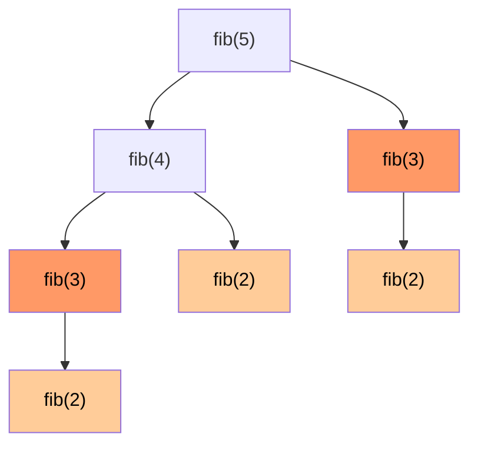

# Вопросы на собеседовании: `Динамическое программирование`

DP — самая «отсеивающая» тема на интервью. Кандидаты часто не видят DP за задачей. Главное — научиться распознавать **оптимальную подструктуру** и **перекрывающиеся подзадачи**, и переходить от brute-force рекурсии → к мемоизации → к табуляции → к оптимизации памяти.

## Полезные ссылки

### Официальная документация и авторитетные источники

- [Dynamic Programming — Baeldung](https://www.baeldung.com/cs/dynamic-programming)
- [Knapsack Problem — Baeldung](https://www.baeldung.com/cs/knapsack-problem)
- [Longest Common Subsequence — Baeldung](https://www.baeldung.com/cs/longest-common-subsequence)
- [Edit Distance — Baeldung](https://www.baeldung.com/cs/edit-distance)
- [Memoization vs Tabulation — Baeldung](https://www.baeldung.com/cs/memoization-vs-tabulation)
- [DP for Beginners — LeetCode Discuss](https://leetcode.com/discuss/general-discussion/458695/dynamic-programming-patterns)

## Содержание

- [Полезные ссылки](#полезные-ссылки)
- [See also](#see-also)

**Базовые понятия**
- [Q1. (!) Что такое DP и когда применяется?](#q1--что-такое-dp-и-когда-применяется)
- [Q2. (!) Что такое оптимальная подструктура?](#q2--что-такое-оптимальная-подструктура)
- [Q3. (!) Что такое перекрывающиеся подзадачи?](#q3--что-такое-перекрывающиеся-подзадачи)
- [Q4. (!) В чём разница между Memoization и Tabulation?](#q4--в-чём-разница-между-memoization-и-tabulation)

**Базовые DP задачи**
- [Q5. (!) Fibonacci через DP?](#q5--fibonacci-через-dp)
- [Q6. (!) Как решить задачу Climbing Stairs?](#q6--как-решить-задачу-climbing-stairs)
- [Q7. Как решить задачу House Robber?](#q7-как-решить-задачу-house-robber)
- [Q8. House Robber II — круговой массив?](#q8-house-robber-ii--круговой-массив)
- [Q9. Как решить задачу Min Cost Climbing Stairs?](#q9-как-решить-задачу-min-cost-climbing-stairs)

**Knapsack-like задачи**
- [Q10. (!) Как решить задачу 0/1 Knapsack (рюкзак)?](#q10--как-решить-задачу-01-knapsack-рюкзак)
- [Q11. Как решить задачу Unbounded Knapsack?](#q11-как-решить-задачу-unbounded-knapsack)
- [Q12. (!) Coin Change — минимум монет?](#q12--coin-change--минимум-монет)
- [Q13. (!) Coin Change II — число способов?](#q13--coin-change-ii--число-способов)
- [Q14. Как решить задачу Partition Equal Subset Sum?](#q14-как-решить-задачу-partition-equal-subset-sum)

**Subsequence задачи**
- [Q15. (!) Как найти Longest Common Subsequence (LCS)?](#q15--как-найти-longest-common-subsequence-lcs)
- [Q16. (!) Как найти Longest Increasing Subsequence (LIS)?](#q16--как-найти-longest-increasing-subsequence-lis)
- [Q17. (!) Как вычислить Edit Distance (расстояние Левенштейна)?](#q17--как-вычислить-edit-distance-расстояние-левенштейна)
- [Q18. Как найти Longest Palindromic Subsequence?](#q18-как-найти-longest-palindromic-subsequence)
- [Q19. Как решить задачу Distinct Subsequences?](#q19-как-решить-задачу-distinct-subsequences)

**String и Grid DP**
- [Q20. (!) Как найти Longest Palindromic Substring через DP?](#q20--как-найти-longest-palindromic-substring-через-dp)
- [Q21. (!) Как посчитать Unique Paths в матрице?](#q21--как-посчитать-unique-paths-в-матрице)
- [Q22. (!) Как решить задачу Minimum Path Sum?](#q22--как-решить-задачу-minimum-path-sum)
- [Q23. Как решить задачу Word Break?](#q23-как-решить-задачу-word-break)
- [Q24. Как решить задачу Maximal Square / Rectangle?](#q24-как-решить-задачу-maximal-square--rectangle)

**Stock задачи**
- [Q25. (!) Best Time to Buy and Sell Stock — серия задач?](#q25--best-time-to-buy-and-sell-stock--серия-задач)

**Интервалы и игры**
- [Q26. Как решить задачу Burst Balloons?](#q26-как-решить-задачу-burst-balloons)
- [Q27. Как решить задачу Predict the Winner (игровое DP)?](#q27-как-решить-задачу-predict-the-winner-игровое-dp)

**State compression и оптимизации**
- [Q28. (!) Как оптимизировать память DP?](#q28--как-оптимизировать-память-dp)
- [Q29. (!) Bitmask DP — как решить TSP за O(n²·2ⁿ)?](#q29--bitmask-dp--как-решить-tsp-за-on²2ⁿ)
- [Q30. Что такое pseudo-polynomial complexity?](#q30-что-такое-pseudo-polynomial-complexity)

**Distinguishing DP**
- [Q31. (!) Чем DP отличается от Greedy?](#q31--чем-dp-отличается-от-greedy)
- [Q32. (!) Чем DP отличается от Divide and Conquer?](#q32--чем-dp-отличается-от-divide-and-conquer)
- [Q33. (!) Как распознать DP-задачу на интервью?](#q33--как-распознать-dp-задачу-на-интервью)

## Q1. (!) Что такое DP и когда применяется?

**Dynamic Programming** — это решение задачи через разбиение на подзадачи с **запоминанием** их результатов, чтобы не пересчитывать одно и то же. Суть в одной фразе: «реши каждую подзадачу один раз и переиспользуй ответ». Это превращает экспоненциальную рекурсию в полиномиальный алгоритм.

DP применим, только когда выполнены **оба** условия одновременно:

1. **Optimal substructure (оптимальная подструктура)** — оптимальный ответ на задачу собирается из оптимальных ответов на подзадачи. Это даёт право комбинировать частичные решения.
2. **Overlapping subproblems (перекрывающиеся подзадачи)** — одни и те же подзадачи встречаются в наивной рекурсии многократно. Это даёт выигрыш от запоминания: без повторов кешировать было бы нечего.

**Как соотносится с соседними техниками:**

- Есть optimal substructure, но подзадачи НЕ перекрываются → это Divide and Conquer (например, Merge Sort): подзадачи независимы, кеш не нужен.
- Подзадачи перекрываются → именно здесь DP даёт значительное ускорение, отсекая повторный пересчёт.


## Q2. (!) Что такое оптимальная подструктура?

**Оптимальная подструктура** — это свойство задачи, при котором её оптимальное решение можно собрать из оптимальных решений подзадач. Если оно есть, можно решать задачу «снизу вверх», комбинируя ответы на меньшие куски; если нет — DP неприменим в принципе.

**Пример, где свойство есть — кратчайший путь.** Если кратчайший путь A→C проходит через B, то его участки A→B и B→C тоже кратчайшие. Будь A→B длиннее необходимого, мы заменили бы его и сократили весь путь. Именно поэтому на этом свойстве строятся Dijkstra и Bellman-Ford.

**Контрпример, где свойства нет — самый длинный простой путь.** Самый длинный простой путь A→C может НЕ содержать самый длинный путь A→B: оптимальный A→B может пройти через C и тогда «съест» вершину, нужную для продолжения. Подзадачи не комбинируются независимо, поэтому наивный DP здесь даст неверный ответ.

**Вывод:** прежде чем строить рекуррентность, убедись, что задача действительно собирается из оптимумов подзадач. Не у каждой задачи это свойство есть.


## Q3. (!) Что такое перекрывающиеся подзадачи?

**Перекрывающиеся подзадачи** — это ситуация, когда наивная рекурсия многократно решает одни и те же подзадачи. Именно их повторяемость делает кеширование осмысленным: запомнив ответ один раз, мы избегаем целого поддерева пересчётов.

Классический пример — Фибоначчи:

```
fib(5) = fib(4) + fib(3)
fib(4) = fib(3) + fib(2)
fib(3) = fib(2) + fib(1)
       ...
```

Здесь `fib(3)` считается 2 раза, `fib(2)` — 3 раза, и чем глубже дерево, тем сильнее ветви дублируют друг друга. Число вызовов растёт как `O(2ⁿ)`.

**Решение** — запоминать результат каждой подзадачи (мемоизация). Тогда `fib(k)` для каждого `k` вычисляется ровно один раз, и `O(2ⁿ)` схлопывается в `O(n)`. На дереве ниже оранжевые узлы — те самые повторно вычисляемые вызовы, которые мемоизация делает один раз.




## Q4. (!) В чём разница между Memoization и Tabulation?

Это два способа реализовать одну и ту же рекуррентность. **Memoization** идёт сверху вниз: обычная рекурсия плюс кеш, который не даёт пересчитать уже решённую подзадачу. **Tabulation** идёт снизу вверх: вручную заполняем таблицу от базовых случаев к итоговому, без рекурсии.

| Подход | Направление | Как устроен |
|--------|----------|-----------|
| **Memoization** | Top-down | Рекурсия + кеш результатов |
| **Tabulation** | Bottom-up | Итеративно заполняем таблицу |

**Memoization (top-down):**

```java
int[] memo;
int fib(int n) {
    if (n <= 1) return n;
    if (memo[n] != 0) return memo[n];
    return memo[n] = fib(n - 1) + fib(n - 2);
}
```

**Tabulation (bottom-up):**

```java
int fib(int n) {
    if (n <= 1) return n;
    int[] dp = new int[n + 1];
    dp[1] = 1;
    for (int i = 2; i <= n; i++) dp[i] = dp[i - 1] + dp[i - 2];
    return dp[n];
}
```

**Сравнение и компромиссы:**

| Критерий | Memoization | Tabulation |
|----------|-------------|------------|
| Простота | Часто проще (естественная рекурсия) | Требует понимания зависимостей |
| Стек вызовов | `O(n)` (риск StackOverflow) | `O(1)` |
| Скорость | Чуть медленнее (накладные расходы на вызовы) | Быстрее |
| Считает только нужное | Да | Иногда считает лишние состояния |
| Оптимизация памяти | Сложнее | Естественно |

Главный компромисс: memoization пишется почти автоматически из рекурсии и не трогает заведомо ненужные состояния, но рискует переполнить стек на больших `n`. Tabulation быстрее, не зависит от стека и легче ужимается по памяти (см. Q28), но требует заранее понять порядок зависимостей.

**Как отвечать на интервью:** двигайся по лестнице brute-force рекурсия → memoization → tabulation → оптимизация памяти. Каждый шаг — небольшое улучшение предыдущего, и проговаривание этого пути показывает интервьюеру ход мысли.


## Q5. (!) Fibonacci через DP?

Фибоначчи — каноническая «учебная» задача DP: на ней удобно показать всю лестницу оптимизаций от наивной рекурсии до `O(1)` по памяти. Ниже — пять реализаций по нарастанию эффективности; именно так и стоит проговаривать решение на интервью.

- **Naive** — прямая рекурсия, `O(2ⁿ)`: дерево вызовов экспоненциально из-за перекрытий (см. Q3).
- **Memoization** — та же рекурсия плюс кеш: каждое `fib(k)` считается один раз, `O(n)` по времени и памяти.
- **Tabulation** — итеративное заполнение массива снизу вверх, `O(n)` / `O(n)`.
- **Space-optimized** — храним только два предыдущих значения вместо всего массива, `O(n)` / `O(1)`.
- **Matrix exponentiation** — возведение матрицы в степень быстрым алгоритмом, `O(log n)`: нужно редко, но хорошо иметь в запасе.

```java
// Naive O(2^n)
int fibNaive(int n) {
    if (n <= 1) return n;
    return fibNaive(n - 1) + fibNaive(n - 2);
}

// Memoization O(n) time, O(n) space
int fibMemo(int n, int[] memo) {
    if (n <= 1) return n;
    if (memo[n] != 0) return memo[n];
    return memo[n] = fibMemo(n - 1, memo) + fibMemo(n - 2, memo);
}

// Tabulation O(n) time, O(n) space
int fibTab(int n) {
    if (n <= 1) return n;
    int[] dp = new int[n + 1];
    dp[1] = 1;
    for (int i = 2; i <= n; i++) dp[i] = dp[i - 1] + dp[i - 2];
    return dp[n];
}

// Space-optimized O(n) time, O(1) space
int fibOpt(int n) {
    if (n <= 1) return n;
    int prev2 = 0, prev1 = 1;
    for (int i = 2; i <= n; i++) {
        int curr = prev1 + prev2;
        prev2 = prev1; prev1 = curr;
    }
    return prev1;
}

// Matrix exponentiation O(log n)
// fib(n) = ([1,1],[1,0])^n  применяя fast power
```


## Q6. (!) Как решить задачу Climbing Stairs?

**Условие:** `n` ступенек, за один шаг можно подняться на 1 или 2 ступеньки. Сколько разных способов добраться до верха?

**Идея:** на верхнюю ступеньку `i` мы попадаем либо с `i-1` (шаг на 1), либо с `i-2` (шаг на 2), поэтому число способов `dp[i] = dp[i-1] + dp[i-2]`. Это та же рекуррентность, что у Фибоначчи, — отсюда и решение через две переменные с `O(1)` памятью.

```java
int climbStairs(int n) {
    if (n <= 2) return n;
    int prev2 = 1, prev1 = 2;
    for (int i = 3; i <= n; i++) {
        int curr = prev1 + prev2;
        prev2 = prev1; prev1 = curr;
    }
    return prev1;
}
```

**Обобщение:** если разрешены прыжки на 1, 2 или 3 ступеньки, рекуррентность просто расширяется до `dp[i] = dp[i-1] + dp[i-2] + dp[i-3]` — суммируем все ступеньки, с которых можно шагнуть на текущую.


## Q7. Как решить задачу House Robber?

**Условие:** дома стоят в ряд, грабить два соседних нельзя. Найти максимальную сумму, которую можно унести.

**Идея:** для каждого дома `i` есть выбор из двух вариантов — пропустить его (тогда ответ равен `dp[i-1]`) или ограбить (тогда к `nums[i]` прибавляется лучший результат до позапрошлого дома `dp[i-2]`, ведь сосед запрещён). Берём максимум: `dp[i] = max(dp[i-1], dp[i-2] + nums[i])`. Поскольку нужны только два предыдущих значения, массив сворачивается в две переменные.

```java
int rob(int[] nums) {
    int prev2 = 0, prev1 = 0;
    for (int n : nums) {
        int curr = Math.max(prev1, prev2 + n);
        prev2 = prev1; prev1 = curr;
    }
    return prev1;
}
```

**Сложность:** `O(n)` по времени, `O(1)` по памяти.


## Q8. House Robber II — круговой массив?

**Условие:** дома расставлены по кругу, поэтому первый и последний теперь соседи — ограбить оба нельзя.

**Идея:** сводим задачу к обычному House Robber из Q7 хитрым приёмом. Раз первый и последний дома конфликтуют, в оптимальном решении хотя бы один из них точно не берётся. Значит, достаточно решить линейную задачу дважды — на отрезке без последнего дома и на отрезке без первого — и взять максимум. Так круговое ограничение «разрывается» и не приходится отслеживать его явно.

```java
int robCircular(int[] nums) {
    if (nums.length == 1) return nums[0];
    return Math.max(
        robRange(nums, 0, nums.length - 2),
        robRange(nums, 1, nums.length - 1)
    );
}

int robRange(int[] nums, int lo, int hi) {
    int prev2 = 0, prev1 = 0;
    for (int i = lo; i <= hi; i++) {
        int curr = Math.max(prev1, prev2 + nums[i]);
        prev2 = prev1; prev1 = curr;
    }
    return prev1;
}
```


## Q9. Как решить задачу Min Cost Climbing Stairs?

**Условие:** у каждой ступеньки своя стоимость `cost[i]`; шагать можно на 1 или 2 ступеньки, начинать — с любой из первых двух. Найти минимальную суммарную стоимость, чтобы выйти за верхнюю ступеньку.

**Идея:** это вариант Climbing Stairs (Q6), но вместо подсчёта способов мы минимизируем стоимость. На площадку `i` приходим либо с `i-1`, заплатив `cost[i-1]`, либо с `i-2`, заплатив `cost[i-2]`; берём дешевле: `dp[i] = min(dp[i-1] + cost[i-1], dp[i-2] + cost[i-2])`. Цель — площадка за последней ступенькой, поэтому цикл идёт до `cost.length` включительно.

```java
int minCostClimbingStairs(int[] cost) {
    int prev2 = 0, prev1 = 0;
    for (int i = 2; i <= cost.length; i++) {
        int curr = Math.min(prev1 + cost[i - 1], prev2 + cost[i - 2]);
        prev2 = prev1; prev1 = curr;
    }
    return prev1;
}
```


## Q10. (!) Как решить задачу 0/1 Knapsack (рюкзак)?

**Условие:** `n` предметов с весом `w[i]` и ценностью `v[i]`. Нужно набрать максимальную суммарную ценность, не превысив грузоподъёмность `capacity`. «0/1» означает, что каждый предмет берётся целиком либо не берётся вовсе — дробить нельзя.

**Идея:** состояние `dp[i][w]` — максимальная ценность из первых `i` предметов при лимите веса `w`. Для каждого предмета — бинарный выбор: не брать (`dp[i-1][w]`) или брать, если он влезает (`dp[i-1][w - w[i]] + v[i]`). Берём максимум. Перебор всех таких выборов и есть DP; жадность тут не работает, потому что выгодный по отношению «ценность/вес» предмет может вытеснить более удачную комбинацию.

```java
int knapsack(int[] weights, int[] values, int capacity) {
    int n = weights.length;
    int[][] dp = new int[n + 1][capacity + 1];

    for (int i = 1; i <= n; i++) {
        for (int w = 0; w <= capacity; w++) {
            dp[i][w] = dp[i - 1][w]; // не берём предмет i
            if (weights[i - 1] <= w) {
                dp[i][w] = Math.max(dp[i][w],
                    dp[i - 1][w - weights[i - 1]] + values[i - 1]); // берём
            }
        }
    }
    return dp[n][capacity];
}
```

**Сложность:** `O(n · capacity)` по времени и памяти. Это **псевдополиномиальная** сложность: она полиномиальна от значения `capacity`, но экспоненциальна от числа битов в его записи (подробнее — Q30).

**Оптимизация памяти:** каждая строка зависит только от предыдущей, поэтому хватает двух строк или одного массива с обратным проходом по весу → `O(capacity)` (см. Q28).


## Q11. Как решить задачу Unbounded Knapsack?

**Условие:** тот же рюкзак, но теперь каждый предмет доступен в неограниченном количестве — один и тот же тип можно класть **сколько угодно раз**.

```java
int unboundedKnapsack(int[] weights, int[] values, int capacity) {
    int[] dp = new int[capacity + 1];
    for (int w = 1; w <= capacity; w++) {
        for (int i = 0; i < weights.length; i++) {
            if (weights[i] <= w) {
                dp[w] = Math.max(dp[w], dp[w - weights[i]] + values[i]);
            }
        }
    }
    return dp[capacity];
}
```

**Разница с 0/1:** в задаче 0/1 при свёртке в 1D-массив мы идём по весу в обратном порядке, чтобы не взять предмет дважды. Здесь повторы как раз разрешены, поэтому используем прямой проход по `w` — обновлённое `dp[w - w[i]]` уже может включать тот же предмет, и это легально. Coin Change II (Q13) — частный случай unbounded knapsack, где «ценность» каждой монеты — это один способ набора.


## Q12. (!) Coin Change — минимум монет?

**Условие:** даны номиналы монет (каждого вида бесконечно много) и сумма `amount`. Нужно набрать сумму минимальным числом монет; если это невозможно — вернуть `-1`.

**Идея:** `dp[i]` — минимум монет на сумму `i`. Чтобы набрать `i`, пробуем «положить последней» каждую монету `c` и берём лучший хвост: `dp[i] = min(dp[i - c] + 1)` по всем подходящим `c`. Массив инициализируем «бесконечностью» (`amount + 1` — заведомо недостижимо), а `dp[0] = 0` — на нулевую сумму нужно ноль монет.

```java
int coinChange(int[] coins, int amount) {
    int[] dp = new int[amount + 1];
    Arrays.fill(dp, amount + 1); // sentinel "infinity"
    dp[0] = 0;

    for (int i = 1; i <= amount; i++) {
        for (int c : coins) {
            if (c <= i) dp[i] = Math.min(dp[i], dp[i - c] + 1);
        }
    }
    return dp[amount] > amount ? -1 : dp[amount];
}
```

**Сложность:** `O(amount · n)` по времени, `O(amount)` по памяти.

**Подводный камень:** жадность («бери самую крупную монету») работает не на любом наборе номиналов. Для `coins = [1, 3, 4]`, `amount = 6` greedy выдаёт `4 + 1 + 1 = 3` монеты, а оптимум — `3 + 3 = 2`. DP перебирает все варианты последней монеты и потому всегда находит минимум — в этом его преимущество над жадным подходом (см. Q31).


## Q13. (!) Coin Change II — число способов?

**Условие:** теперь не минимум монет, а **сколько разных комбинаций** дают сумму `amount` (каждый номинал доступен бесконечно). Комбинации `1+2` и `2+1` считаются одной — порядок не важен.

**Идея:** `dp[i]` — число способов набрать сумму `i`. Базовый случай `dp[0] = 1` (пустой набор — один валидный способ набрать ноль). Перебирая монеты во внешнем цикле, мы добавляем каждый номинал «по одному типу за раз» и так считаем именно комбинации, а не перестановки.

```java
int change(int amount, int[] coins) {
    int[] dp = new int[amount + 1];
    dp[0] = 1; // пустое множество — 1 способ
    for (int c : coins) {
        for (int i = c; i <= amount; i++) dp[i] += dp[i - c];
    }
    return dp[amount];
}
```

**Порядок циклов критичен.** Монеты должны быть во внешнем цикле, сумма — во внутреннем. Так каждая комбинация учитывается один раз. Поменяй циклы местами (сумма снаружи, монеты внутри) — и `1+2` с `2+1` посчитаются как разные, то есть получишь число перестановок, а не комбинаций. Это типичная ловушка на собеседовании.


## Q14. Как решить задачу Partition Equal Subset Sum?

**Условие:** можно ли разбить массив на две группы с равной суммой?

**Идея:** если общая сумма нечётная, разбиение невозможно сразу. Иначе задача сводится к 0/1 Knapsack (Q10): ищем подмножество с суммой `total/2` — тогда остаток автоматически даёт вторую половину. Здесь нас интересует не ценность, а сам факт достижимости, поэтому `dp[i]` булев: «можно ли набрать сумму `i`». Проход по весу идёт в обратном порядке — как в 0/1, чтобы каждый элемент использовался не более одного раза.

```java
boolean canPartition(int[] nums) {
    int sum = Arrays.stream(nums).sum();
    if (sum % 2 != 0) return false;
    int target = sum / 2;

    boolean[] dp = new boolean[target + 1];
    dp[0] = true;
    for (int n : nums) {
        for (int i = target; i >= n; i--) {
            dp[i] = dp[i] || dp[i - n];
        }
    }
    return dp[target];
}
```

**Сложность:** `O(n · sum)` — как у knapsack по сумме.


## Q15. (!) Как найти Longest Common Subsequence (LCS)?

**Условие:** найти длину самой длинной подпоследовательности, общей для двух строк. Подпоследовательность — необязательно непрерывная, но порядок символов сохраняется (в отличие от подстроки).

**Идея:** `dp[i][j]` — длина LCS для префиксов `a[0..i)` и `b[0..j)`. Если последние символы префиксов совпали, они входят в общую подпоследовательность — берём `dp[i-1][j-1] + 1`. Если нет, отбрасываем последний символ одной из строк и берём лучший из двух вариантов: `max(dp[i-1][j], dp[i][j-1])`.

```java
int longestCommonSubsequence(String a, String b) {
    int m = a.length(), n = b.length();
    int[][] dp = new int[m + 1][n + 1];

    for (int i = 1; i <= m; i++) {
        for (int j = 1; j <= n; j++) {
            if (a.charAt(i - 1) == b.charAt(j - 1)) {
                dp[i][j] = dp[i - 1][j - 1] + 1;
            } else {
                dp[i][j] = Math.max(dp[i - 1][j], dp[i][j - 1]);
            }
        }
    }
    return dp[m][n];
}
```

**Сложность:** `O(m · n)` по времени и памяти.

**Где применяется:** утилиты `diff`, three-way merge в git, биоинформатика (выравнивание последовательностей ДНК). По сути LCS — это формальная мера «насколько две последовательности похожи по сохранённому порядку».


## Q16. (!) Как найти Longest Increasing Subsequence (LIS)?

**Условие:** найти длину самой длинной строго возрастающей подпоследовательности массива (элементы не обязаны идти подряд).

**Два решения:**

- **DP за `O(n²)`** — `dp[i]` хранит длину LIS, заканчивающейся в позиции `i`. Для каждого `i` смотрим все предыдущие `j < i` с меньшим значением и продлеваем лучшую из них: `dp[i] = max(dp[j] + 1)`. Просто и наглядно, но квадратично.
- **Greedy + binary search за `O(n log n)`** — поддерживаем массив `tails`, где `tails[k]` — минимально возможный последний элемент возрастающей подпоследовательности длины `k+1`. Для каждого числа бинарным поиском находим место и либо удлиняем `tails`, либо уменьшаем существующий хвост. Итоговая длина `tails` и есть ответ.

```java
// O(n²) DP
int lengthOfLIS(int[] nums) {
    int[] dp = new int[nums.length];
    Arrays.fill(dp, 1);
    int max = 1;
    for (int i = 1; i < nums.length; i++) {
        for (int j = 0; j < i; j++) {
            if (nums[j] < nums[i]) {
                dp[i] = Math.max(dp[i], dp[j] + 1);
            }
        }
        max = Math.max(max, dp[i]);
    }
    return max;
}

// O(n log n) — patience sorting + binary search
int lengthOfLISBinary(int[] nums) {
    List<Integer> tails = new ArrayList<>();
    for (int num : nums) {
        int idx = Collections.binarySearch(tails, num);
        if (idx < 0) idx = -(idx + 1);
        if (idx == tails.size()) tails.add(num);
        else tails.set(idx, num);
    }
    return tails.size();
}
```

Почему `O(n log n)`-версия корректна: чем меньше последний элемент подпоследовательности данной длины, тем больше шансов её продлить дальше, поэтому `tails` всегда держит «самые перспективные» хвосты и остаётся отсортированным — а значит, по нему можно искать бинарно. Важно: `tails` даёт правильную *длину* LIS, но сам массив `tails` — не обязательно настоящая подпоследовательность.


## Q17. (!) Как вычислить Edit Distance (расстояние Левенштейна)?

**Условие:** найти минимальное число операций — вставка (insert), удаление (delete), замена (replace) одного символа — чтобы превратить одну строку в другую.

**Идея:** `dp[i][j]` — стоимость превращения префикса `word1[0..i)` в префикс `word2[0..j)`. База: чтобы получить пустую строку, нужно удалить все символы (`dp[i][0] = i`), а чтобы построить строку из пустой — вставить все (`dp[0][j] = j`). Если последние символы совпали, операция не нужна — берём `dp[i-1][j-1]`. Иначе пробуем три действия и берём дешевле плюс единицу: замена (`dp[i-1][j-1]`), удаление (`dp[i-1][j]`), вставка (`dp[i][j-1]`).

```java
int minDistance(String word1, String word2) {
    int m = word1.length(), n = word2.length();
    int[][] dp = new int[m + 1][n + 1];

    for (int i = 0; i <= m; i++) dp[i][0] = i;
    for (int j = 0; j <= n; j++) dp[0][j] = j;

    for (int i = 1; i <= m; i++) {
        for (int j = 1; j <= n; j++) {
            if (word1.charAt(i - 1) == word2.charAt(j - 1)) {
                dp[i][j] = dp[i - 1][j - 1];
            } else {
                dp[i][j] = 1 + Math.min(dp[i - 1][j - 1], // replace
                                Math.min(dp[i - 1][j],   // delete
                                         dp[i][j - 1])); // insert
            }
        }
    }
    return dp[m][n];
}
```

**Сложность:** `O(m · n)` по времени и памяти.

**Где применяется:** проверка орфографии (подсказки «возможно, вы имели в виду»), нечёткий поиск (fuzzy search), детекторы плагиата, выравнивание ДНК. Везде, где нужна численная мера «насколько строки близки по составу».


## Q18. Как найти Longest Palindromic Subsequence?

**Условие:** найти длину самой длинной подпоследовательности строки, которая читается одинаково в обе стороны.

**Идея:** `dp[i][j]` — длина наибольшей палиндромной подпоследовательности на отрезке `s[i..j]`. Если крайние символы совпали, они образуют «оболочку» палиндрома: `dp[i][j] = dp[i+1][j-1] + 2`. Если нет — отбрасываем один из краёв и берём лучший вариант. Считаем по возрастанию длины отрезка, чтобы внутренние подзадачи были готовы раньше внешних.

```java
int longestPalindromeSubseq(String s) {
    int n = s.length();
    int[][] dp = new int[n][n];
    for (int i = 0; i < n; i++) dp[i][i] = 1;

    for (int len = 2; len <= n; len++) {
        for (int i = 0; i <= n - len; i++) {
            int j = i + len - 1;
            if (s.charAt(i) == s.charAt(j)) {
                dp[i][j] = dp[i + 1][j - 1] + 2;
            } else {
                dp[i][j] = Math.max(dp[i + 1][j], dp[i][j - 1]);
            }
        }
    }
    return dp[0][n - 1];
}
```

**Сложность:** `O(n²)`. Полезный факт: эта задача эквивалентна LCS (Q15) для строки и её реверса — общая подпоследовательность строки с её зеркалом и есть палиндром.


## Q19. Как решить задачу Distinct Subsequences?

**Условие:** сколько различных подпоследовательностей строки `s` в точности совпадают со строкой `t`?

**Идея:** `dp[i][j]` — число способов получить префикс `t[0..j)` как подпоследовательность префикса `s[0..i)`. Базово `dp[i][0] = 1`: пустую строку `t` можно «набрать» из любого `s` ровно одним способом (взяв ничего). На каждом шаге символ `s[i-1]` можно пропустить — это всегда даёт `dp[i-1][j]`. Если же он совпал с `t[j-1]`, добавляется ещё и вариант, где мы его используем: `dp[i-1][j-1]`.

```java
int numDistinct(String s, String t) {
    int m = s.length(), n = t.length();
    int[][] dp = new int[m + 1][n + 1];
    for (int i = 0; i <= m; i++) dp[i][0] = 1; // пустая подпоследовательность

    for (int i = 1; i <= m; i++) {
        for (int j = 1; j <= n; j++) {
            dp[i][j] = dp[i - 1][j];
            if (s.charAt(i - 1) == t.charAt(j - 1)) {
                dp[i][j] += dp[i - 1][j - 1];
            }
        }
    }
    return dp[m][n];
}
```


## Q20. (!) Как найти Longest Palindromic Substring через DP?

**Условие:** найти самую длинную **подстроку** (непрерывный участок), которая является палиндромом. В отличие от Q18, здесь символы должны идти подряд.

**Идея:** `dp[i][j]` — булев флаг «является ли `s[i..j]` палиндромом». Участок палиндромен, когда крайние символы равны И внутренность `s[i+1..j-1]` тоже палиндром (для длины 2 внутренности нет, поэтому достаточно равенства краёв). Перебираем отрезки по возрастанию длины и запоминаем самый длинный найденный палиндром через `start` и `maxLen`.

```java
String longestPalindromeDP(String s) {
    int n = s.length();
    boolean[][] dp = new boolean[n][n];
    int start = 0, maxLen = 1;

    for (int i = 0; i < n; i++) dp[i][i] = true;

    for (int len = 2; len <= n; len++) {
        for (int i = 0; i <= n - len; i++) {
            int j = i + len - 1;
            if (s.charAt(i) == s.charAt(j)) {
                if (len == 2 || dp[i + 1][j - 1]) {
                    dp[i][j] = true;
                    if (len > maxLen) {
                        start = i;
                        maxLen = len;
                    }
                }
            }
        }
    }
    return s.substring(start, start + maxLen);
}
```

**Сложность:** `O(n²)` по времени и памяти.

**Альтернативы:** expand around center даёт те же `O(n²)` по времени, но `O(1)` по памяти (растим палиндром из каждого центра). Алгоритм Манакера решает задачу за `O(n)`, но сложнее в реализации — на интервью его обычно достаточно упомянуть.


## Q21. (!) Как посчитать Unique Paths в матрице?

**Условие:** робот идёт из левого верхнего угла `(0,0)` в правый нижний `(m-1, n-1)`, на каждом шаге — только вправо или вниз. Сколько различных путей?

**Идея:** в любую клетку можно попасть либо сверху, либо слева, поэтому число путей до неё — сумма путей до этих двух соседей: `dp[i][j] = dp[i-1][j] + dp[i][j-1]`. Первая строка и первый столбец заполнены единицами — туда ведёт ровно один путь (всё время вправо или всё время вниз).

```java
int uniquePaths(int m, int n) {
    int[][] dp = new int[m][n];
    for (int i = 0; i < m; i++) dp[i][0] = 1;
    for (int j = 0; j < n; j++) dp[0][j] = 1;

    for (int i = 1; i < m; i++) {
        for (int j = 1; j < n; j++) {
            dp[i][j] = dp[i - 1][j] + dp[i][j - 1];
        }
    }
    return dp[m - 1][n - 1];
}
```

**Сложность:** `O(m · n)`. Память можно сжать до `O(min(m, n))`, храня лишь одну строку или колонку (см. Q28).

**Формула без DP:** путь — это последовательность из `m-1` шагов вниз и `n-1` шагов вправо, поэтому ответ — биномиальный коэффициент `C(m+n-2, m-1)` (число способов выбрать, на каких шагах идти вниз).


## Q22. (!) Как решить задачу Minimum Path Sum?

**Условие:** в каждой клетке `grid` записано число; идём из верхнего левого угла в нижний правый, только вправо или вниз. Минимизировать сумму чисел вдоль пути.

**Идея:** та же сетка, что в Q21, но вместо подсчёта путей минимизируем стоимость. В клетку приходим сверху или слева — выбираем дешевле и прибавляем значение самой клетки: `dp[i][j] = grid[i][j] + min(dp[i-1][j], dp[i][j-1])`. Решение пишет результат прямо в `grid` (in-place), экономя память: клетки первой строки/столбца накапливают сумму единственного возможного направления.

```java
int minPathSum(int[][] grid) {
    int m = grid.length, n = grid[0].length;
    for (int i = 0; i < m; i++) {
        for (int j = 0; j < n; j++) {
            if (i == 0 && j == 0) continue;
            if (i == 0)      grid[i][j] += grid[i][j - 1];
            else if (j == 0) grid[i][j] += grid[i - 1][j];
            else             grid[i][j] += Math.min(grid[i - 1][j], grid[i][j - 1]);
        }
    }
    return grid[m - 1][n - 1];
}
```

**Сложность:** `O(m · n)` по времени, без доп. памяти (in-place). Если по условию `grid` менять нельзя — заведи отдельный массив `dp` той же формы.


## Q23. Как решить задачу Word Break?

**Условие:** можно ли разбить строку на последовательность слов из заданного словаря (слова можно использовать многократно)?

**Идея:** `dp[i]` — флаг «можно ли разбить префикс `s[0..i)`». База `dp[0] = true` (пустой префикс разбивается тривиально). Для каждой позиции `i` ищем точку разреза `j`: если префикс до `j` уже разбит (`dp[j]`) и оставшийся кусок `s[j..i)` есть в словаре, то и `dp[i]` достижим. Словарь кладём в `HashSet`, чтобы проверка вхождения была `O(1)`.

```java
boolean wordBreak(String s, List<String> wordDict) {
    Set<String> dict = new HashSet<>(wordDict);
    boolean[] dp = new boolean[s.length() + 1];
    dp[0] = true;

    for (int i = 1; i <= s.length(); i++) {
        for (int j = 0; j < i; j++) {
            if (dp[j] && dict.contains(s.substring(j, i))) {
                dp[i] = true;
                break;
            }
        }
    }
    return dp[s.length()];
}
```

**Сложность:** `O(n² · m)`, где `m` — максимальная длина слова в словаре (стоимость хеширования подстроки). Альтернатива — Trie: она избавляет от создания подстрок и быстрее отсекает невозможные разрезы.


## Q24. Как решить задачу Maximal Square / Rectangle?

**Условие:** найти площадь максимального квадрата, целиком заполненного единицами, в бинарной матрице.

**Идея:** `dp[i][j]` — сторона наибольшего квадрата с правым нижним углом в клетке `(i-1, j-1)`. Квадрат можно «нарастить», только если три соседа сверху, слева и по диагонали тоже образуют квадраты, поэтому ограничивающим оказывается минимальный из них: `dp[i][j] = min(сверху, слева, по диагонали) + 1`. По ходу запоминаем максимальную сторону; ответ — её квадрат.

```java
int maximalSquare(char[][] matrix) {
    int rows = matrix.length, cols = matrix[0].length;
    int[][] dp = new int[rows + 1][cols + 1];
    int maxSide = 0;

    for (int i = 1; i <= rows; i++) {
        for (int j = 1; j <= cols; j++) {
            if (matrix[i - 1][j - 1] == '1') {
                dp[i][j] = Math.min(dp[i - 1][j],
                          Math.min(dp[i][j - 1], dp[i - 1][j - 1])) + 1;
                maxSide = Math.max(maxSide, dp[i][j]);
            }
        }
    }
    return maxSide * maxSide;
}
```

**Сложность:** `O(R · C)`.

**Maximal Rectangle** (произвольный прямоугольник, не только квадрат) — заметно сложнее: его сводят к задаче «наибольший прямоугольник в гистограмме» и решают через monotonic stack построчно.


## Q25. (!) Best Time to Buy and Sell Stock — серия задач?

Это семейство задач про максимизацию прибыли от торговли акцией при разных ограничениях. Общая модель — **состояние** `dp[день][число сделок][есть ли акция на руках]`: на каждый день мы либо держим позицию, либо нет, и переходим между этими состояниями покупкой/продажей. Разные варианты задачи — это разные ограничения поверх одной и той же машины состояний.

- **I — одна сделка.** Решается за `O(n)` вообще без DP: идём слева направо, держим минимальную цену и максимизируем разницу `цена − минимум`.
- **II — сколько угодно сделок, без cooldown.** Жадно: суммируем все положительные разности соседних дней — это эквивалентно тому, чтобы ловить каждый рост.
- **III — не более 2 сделок.** Полноценный DP с состоянием `dp[i][k][holding]`.
- **IV — не более `k` сделок.** Обобщение III на произвольное `k` (код ниже).
- **V — с cooldown.** После продажи обязателен день простоя; в машину состояний добавляется состояние «остываю».
- **VI — с комиссией.** За каждую сделку вычитается фиксированная плата; она просто учитывается в переходе продажи.

```java
// IV: not more than k transactions
int maxProfit(int k, int[] prices) {
    if (k == 0 || prices.length < 2) return 0;
    int[][] buy = new int[k + 1][prices.length];
    int[][] sell = new int[k + 1][prices.length];

    for (int i = 1; i <= k; i++) {
        int maxBuy = -prices[0];
        for (int j = 1; j < prices.length; j++) {
            sell[i][j] = Math.max(sell[i][j - 1], maxBuy + prices[j]);
            maxBuy = Math.max(maxBuy, sell[i - 1][j - 1] - prices[j]);
            buy[i][j] = -maxBuy;
        }
    }
    return sell[k][prices.length - 1];
}
```

Эту серию любят на интервью, потому что она тренирует главный навык DP — формулировать задачу через **состояние и переходы** (state machine). Освоив базовую модель «держу / не держу акцию», все варианты получаешь добавлением одного измерения или ограничения.


## Q26. Как решить задачу Burst Balloons?

**Условие:** дан ряд из `n` шариков. Лопая шарик `i`, получаешь `nums[i-1] * nums[i] * nums[i+1]` очков (соседи — текущие, с учётом уже лопнувших). Максимизировать сумму очков.

**Почему это interval DP:** при «прямом» подходе (какой шарик лопнуть первым) соседи постоянно меняются — состояние не замыкается. Трюк в инверсии: считаем `k` тем шариком, который лопается **последним** на интервале `[left, right]`. Тогда его соседями гарантированно остаются границы `left-1` и `right+1`, а интервал распадается на два независимых подынтервала слева и справа от `k`. Перебираем все `k` и берём максимум: `dp[left][right] = max(dp[left][k-1] + arr[left-1]*arr[k]*arr[right+1] + dp[k+1][right])`. Массив дополняем виртуальными единицами по краям, чтобы не выходить за границы.

```java
int maxCoins(int[] nums) {
    int n = nums.length;
    int[] arr = new int[n + 2];
    arr[0] = 1; arr[n + 1] = 1;
    for (int i = 0; i < n; i++) arr[i + 1] = nums[i];

    int[][] dp = new int[n + 2][n + 2];
    for (int len = 1; len <= n; len++) {
        for (int left = 1; left <= n - len + 1; left++) {
            int right = left + len - 1;
            for (int k = left; k <= right; k++) {
                dp[left][right] = Math.max(dp[left][right],
                    dp[left][k - 1] + arr[left - 1] * arr[k] * arr[right + 1] + dp[k + 1][right]);
            }
        }
    }
    return dp[1][n];
}
```

**Сложность:** `O(n³)` — тройной цикл по длине интервала, левой границе и выбору `k`. Ключевую идею стоит сказать вслух на интервью: рассматриваем `k` как **последний** лопнутый шарик, а не первый, — именно это делает подзадачи независимыми.


## Q27. Как решить задачу Predict the Winner (игровое DP)?

**Условие:** два игрока по очереди забирают число с любого из двух краёв массива; оба играют оптимально. Победит ли первый игрок (наберёт сумму не меньше второго)?

**Идея:** напрямую считать очки каждого неудобно — удобнее хранить **разницу** «мой счёт минус счёт соперника». `dp[i][j]` — максимальная разница, которую текущий игрок может обеспечить на отрезке `[i, j]`. Взяв `nums[i]`, он получает `nums[i]`, но дальше уже ходит соперник на отрезке `[i+1, j]` и максимизирует разницу против него — поэтому `nums[i] - dp[i+1][j]`. Симметрично для правого края; берём лучший вариант. Минус `dp` соперника — это и есть учёт того, что дальше противник играет против нас.

```java
boolean predictWinner(int[] nums) {
    int n = nums.length;
    int[][] dp = new int[n][n];
    for (int i = 0; i < n; i++) dp[i][i] = nums[i];

    for (int len = 2; len <= n; len++) {
        for (int i = 0; i <= n - len; i++) {
            int j = i + len - 1;
            dp[i][j] = Math.max(nums[i] - dp[i + 1][j], nums[j] - dp[i][j - 1]);
        }
    }
    return dp[0][n - 1] >= 0;
}
```

**Итог:** `dp[0][n-1]` — итоговая разница при оптимальной игре обоих. Если она `≥ 0`, первый игрок как минимум не проигрывает, то есть побеждает (по условию ничья засчитывается ему).


## Q28. (!) Как оптимизировать память DP?

Главный принцип: храни ровно столько прошлого, сколько нужно для следующего перехода. Если в рекуррентность входят только несколько недавних слоёв, всю таблицу держать незачем. Типичные приёмы:

1. **Зависимость только от предыдущей строки** → достаточно двух строк или одной с обратным проходом (как в knapsack). Память падает с `O(n·m)` до `O(m)`.
2. **Зависимость только от предыдущего столбца** → хватает одной колонки.
3. **Зависимость только от `dp[i-1]` и `dp[i-2]`** → массив сворачивается в две переменные (Фибоначчи, House Robber).

```java
// Из 2D в 1D — Knapsack
int[] dp = new int[capacity + 1];
for (int i = 0; i < n; i++) {
    for (int w = capacity; w >= weights[i]; w--) { // reverse!
        dp[w] = Math.max(dp[w], dp[w - weights[i]] + values[i]);
    }
}
```

**Обратный проход (reverse iteration)** в 0/1 Knapsack обязателен: если идти по весу слева направо, обновлённое `dp[w - w[i]]` уже будет учитывать текущий предмет, и тот «возьмётся» дважды. Идя справа налево, мы читаем `dp[w - w[i]]` ещё из предыдущего слоя — каждый предмет используется не более одного раза.


## Q29. (!) Bitmask DP — как решить TSP за O(n²·2ⁿ)?

**Задача (Travelling Salesman Problem):** найти минимальный по стоимости замкнутый маршрут, который проходит через все вершины ровно один раз и возвращается в старт.

**Идея bitmask DP:** состояние — пара `(множество уже посещённых вершин, текущая вершина)`. Множество кодируется битовой маской: `i`-й бит = 1, если вершина `i` посещена. `dp[u][mask]` — минимальная стоимость прийти в `u`, посетив ровно вершины из `mask`. Переход — продлить путь в ещё не посещённую `v`: `dp[v][mask | (1<<v)] = min(..., dp[u][mask] + dist[u][v])`. Ответ — минимум по всем `u` из `dp[u][ALL] + dist[u][0]` (замыкаем кольцо в старт).

```java
int tsp(int[][] dist) {
    int n = dist.length;
    int ALL = (1 << n) - 1;
    int[][] dp = new int[n][1 << n];
    for (int[] row : dp) Arrays.fill(row, Integer.MAX_VALUE / 2);
    dp[0][1] = 0; // старт из 0

    for (int mask = 1; mask <= ALL; mask++) {
        for (int u = 0; u < n; u++) {
            if (dp[u][mask] == Integer.MAX_VALUE / 2) continue;
            if ((mask & (1 << u)) == 0) continue;
            for (int v = 0; v < n; v++) {
                if ((mask & (1 << v)) != 0) continue;
                int newMask = mask | (1 << v);
                dp[v][newMask] = Math.min(dp[v][newMask], dp[u][mask] + dist[u][v]);
            }
        }
    }

    int result = Integer.MAX_VALUE;
    for (int u = 0; u < n; u++)
        result = Math.min(result, dp[u][ALL] + dist[u][0]);
    return result;
}
```

**Сложность:** `O(n² · 2ⁿ)` по времени и `O(n · 2ⁿ)` по памяти — экспоненциально, но это огромный выигрыш против перебора всех `n!` маршрутов. На практике хватает для `n ≤ 20-22`: TSP NP-трудна, и точное решение возможно лишь для небольших `n`.


## Q30. Что такое pseudo-polynomial complexity?

**Псевдополиномиальная сложность** — это сложность, полиномиальная от **числового значения** входа, но экспоненциальная от **размера его представления** (числа битов). Различие важно, потому что «настоящий» размер входа — это длина записи числа, а не само число.

**Пример:** Knapsack работает за `O(n · W)`. Выглядит полиномиально, но `W` записывается всего `log₂ W` битами. При `W = 10⁹` это `10¹⁰` операций — экспоненциально по `log₂ W ≈ 30` битам. Поэтому формально такой алгоритм не считается полиномиальным, хотя на «небольших по значению» данных работает отлично.

Подробнее — в [Анализ сложности](../complexity/complexity-analysis-interview.md).


## Q31. (!) Чем DP отличается от Greedy?

Кратко: DP перебирает все варианты выбора и гарантирует глобальный оптимум, а Greedy на каждом шаге фиксирует один локально лучший вариант и больше его не пересматривает — быстрее, но оптимум не гарантирован.

| Критерий | DP | Greedy |
|----------|-----|--------|
| Выбор на шаге | Перебирает все варианты | Берёт локально оптимальный |
| Оптимальность | Гарантирует глобальный оптимум | Не всегда даёт оптимум |
| Сложность | Обычно полиномиальная | Часто `O(n log n)` или быстрее |
| Память | `O(n)` или `O(n·k)` | Обычно `O(1)` |
| Условие применимости | Optimal substructure | Optimal substructure + greedy choice property |

Ключевое различие — **greedy choice property**: возможность доказать, что локально лучший выбор всегда ведёт к глобальному оптимуму. Если такого доказательства нет, жадность ошибается, и нужен полный перебор через DP.

**Coin Change как иллюстрация:** на номиналах `[1, 5, 10, 25]` жадность («бери самую крупную») оптимальна, а на `[1, 3, 4]` — уже нет (см. Q12), и спасает только DP.

**Activity Selection:** здесь greedy доказуемо оптимален — выбор задачи с самым ранним концом всегда корректен.

Подробнее — в [Greedy](greedy-algorithms-interview.md).


## Q32. (!) Чем DP отличается от Divide and Conquer?

Обе техники разбивают задачу на подзадачи, но различаются в одном: перекрываются ли эти подзадачи. В Divide and Conquer подзадачи независимы, поэтому кеш бесполезен; в DP они повторяются, и кеш — суть метода.

| Критерий | DP | Divide and Conquer |
|----------|-----|--------------------|
| Перекрытия подзадач | Да | Нет (или редко) |
| Memoization | Нужна | Не нужна |
| Подход | Bottom-up или top-down | Обычно top-down рекурсия |
| Примеры | Fibonacci, Knapsack | Merge Sort, Quick Sort |

Запоминающаяся формула: D&C — «решить и забыть» (подзадача больше не встретится), DP — «решить и запомнить, чтобы не повторять».

Подробнее — в [Divide and Conquer](divide-and-conquer-interview.md).


## Q33. (!) Как распознать DP-задачу на интервью?

DP редко называют в условии прямо — его нужно распознать по формулировке. Чем больше признаков ниже совпадает, тем вероятнее, что это DP.

**Признаки DP:**

1. Просят **минимум / максимум / число способов** — почти всегда это DP или жадный алгоритм.
2. **На каждом шаге есть выбор** (взять / не взять предмет, идти влево / вправо) — то есть пространство решений ветвится.
3. Задачу можно описать функцией `f(state)`, где **состояние задаётся небольшим числом параметров** (индекс, остаток суммы, маска).
4. **Подзадачи перекрываются** — наивная рекурсия многократно решает одно и то же.
5. Есть **optimal substructure** — оптимум собирается из оптимумов подзадач (Q2).

Если первых трёх признаков достаточно, чтобы заподозрить DP, то пункты 4-5 — это проверка, что DP действительно применим (без них он не работает).

**Алгоритм решения (рабочий чеклист):**

1. Определи **состояние** — что хранит `dp[i]`, `dp[i][j]`, ... и что значит индекс.
2. Определи **переход** (рекуррентность) — как состояние выражается через меньшие.
3. Определи **базу** — начальные значения, от которых строится остальное.
4. Реализуй через мемоизацию (проще всего) → перепиши табуляцией → ужми память (Q28).

---

## See also

- [Алгоритмы (обзор)](../algorithms-interview.md) — карта алгоритмических тем
- [Рекурсия](recursion-interview.md) — DP начинается с рекурсии
- [Greedy алгоритмы](greedy-algorithms-interview.md) — альтернатива DP
- [Divide and Conquer](divide-and-conquer-interview.md) — без перекрытий
- [Backtracking](backtracking-interview.md) — DP через мемоизацию состояний
- [Массивы и строки](../data-structures/arrays-strings-interview.md) — Kadane, Edit Distance
- [Деревья](../data-structures/trees-interview.md) — DP на деревьях (House Robber III)
- [Графы](../data-structures/graphs-interview.md) — Bellman-Ford, Floyd-Warshall — это DP
- [Two Pointers](two-pointers-sliding-window-interview.md) — иногда альтернатива DP
- [Анализ сложности](../complexity/complexity-analysis-interview.md) — pseudo-polynomial
- [Хеш-таблицы](../data-structures/hash-tables-interview.md) — мемоизация через HashMap


- [Backtracking](backtracking-interview.md)
- [Divide and Conquer](divide-and-conquer-interview.md)
- [Жадные алгоритмы (Greedy)](greedy-algorithms-interview.md)
- [Рекурсия](recursion-interview.md)
- [Two Pointers и Sliding Window](two-pointers-sliding-window-interview.md)
- [Алгоритмы (обзор)](../algorithms-interview.md)
- [Шпаргалка: Динамическое программирование](../../../algorithms/algorithmic-paradigms/dynamic-programming.md) — теория
