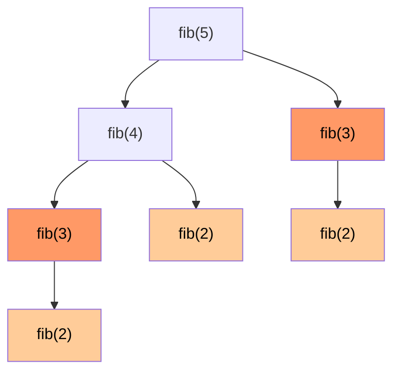

# Вопросы на собеседовании: `Динамическое программирование`

DP — самая «отсеивающая» тема на интервью. Кандидаты часто не видят DP за задачей. Главное — научиться распознавать **оптимальную подструктуру** и **перекрывающиеся подзадачи**, и переходить от brute-force рекурсии → к мемоизации → к табуляции → к оптимизации памяти.

Дата последнего обновления: 2026-04-18

## Полезные ссылки

### Официальная документация и авторитетные источники

- [Dynamic Programming — Baeldung](https://www.baeldung.com/cs/dynamic-programming)
- [Knapsack Problem — Baeldung](https://www.baeldung.com/cs/knapsack-problem)
- [Longest Common Subsequence — Baeldung](https://www.baeldung.com/cs/longest-common-subsequence)
- [Edit Distance — Baeldung](https://www.baeldung.com/cs/edit-distance)
- [Memoization vs Tabulation — Baeldung](https://www.baeldung.com/cs/memoization-vs-tabulation)
- [DP for Beginners — LeetCode Discuss](https://leetcode.com/discuss/general-discussion/458695/dynamic-programming-patterns)

## Содержание

- [Полезные ссылки](#полезные-ссылки)
- [See also](#see-also)

**Базовые понятия**
- [Q1. (!) Что такое DP и когда применяется?](#q1--что-такое-dp-и-когда-применяется)
- [Q2. (!) Что такое оптимальная подструктура?](#q2--что-такое-оптимальная-подструктура)
- [Q3. (!) Что такое перекрывающиеся подзадачи?](#q3--что-такое-перекрывающиеся-подзадачи)
- [Q4. (!) Memoization vs Tabulation?](#q4--memoization-vs-tabulation)

**Базовые DP задачи**
- [Q5. (!) Fibonacci через DP?](#q5--fibonacci-через-dp)
- [Q6. (!) Climbing Stairs?](#q6--climbing-stairs)
- [Q7. House Robber?](#q7-house-robber)
- [Q8. House Robber II — круговой массив?](#q8-house-robber-ii--круговой-массив)
- [Q9. Min Cost Climbing Stairs?](#q9-min-cost-climbing-stairs)

**Knapsack-like задачи**
- [Q10. (!) 0/1 Knapsack?](#q10--01-knapsack)
- [Q11. Unbounded Knapsack?](#q11-unbounded-knapsack)
- [Q12. (!) Coin Change — минимум монет?](#q12--coin-change--минимум-монет)
- [Q13. (!) Coin Change II — число способов?](#q13--coin-change-ii--число-способов)
- [Q14. Partition Equal Subset Sum?](#q14-partition-equal-subset-sum)

**Subsequence задачи**
- [Q15. (!) Longest Common Subsequence (LCS)?](#q15--longest-common-subsequence-lcs)
- [Q16. (!) Longest Increasing Subsequence (LIS)?](#q16--longest-increasing-subsequence-lis)
- [Q17. (!) Edit Distance (Levenshtein)?](#q17--edit-distance-levenshtein)
- [Q18. Longest Palindromic Subsequence?](#q18-longest-palindromic-subsequence)
- [Q19. Distinct Subsequences?](#q19-distinct-subsequences)

**String и Grid DP**
- [Q20. (!) Longest Palindromic Substring через DP?](#q20--longest-palindromic-substring-через-dp)
- [Q21. (!) Unique Paths в матрице?](#q21--unique-paths-в-матрице)
- [Q22. (!) Minimum Path Sum?](#q22--minimum-path-sum)
- [Q23. Word Break?](#q23-word-break)
- [Q24. Maximal Square / Rectangle?](#q24-maximal-square--rectangle)

**Stock задачи**
- [Q25. (!) Best Time to Buy and Sell Stock — серия задач?](#q25--best-time-to-buy-and-sell-stock--серия-задач)

**Интервалы и игры**
- [Q26. Burst Balloons?](#q26-burst-balloons)
- [Q27. Predict the Winner — Game DP?](#q27-predict-the-winner--game-dp)

**State compression и оптимизации**
- [Q28. (!) Как оптимизировать память DP?](#q28--как-оптимизировать-память-dp)
- [Q29. (!) Bitmask DP — TSP за O(n²·2ⁿ)?](#q29--bitmask-dp--tsp-за-on²2ⁿ)
- [Q30. Что такое pseudo-polynomial complexity?](#q30-что-такое-pseudo-polynomial-complexity)

**Distinguishing DP**
- [Q31. (!) Чем DP отличается от Greedy?](#q31--чем-dp-отличается-от-greedy)
- [Q32. (!) Чем DP отличается от Divide and Conquer?](#q32--чем-dp-отличается-от-divide-and-conquer)
- [Q33. (!) Как распознать DP-задачу на интервью?](#q33--как-распознать-dp-задачу-на-интервью)

## Q1. (!) Что такое DP и когда применяется?

**Dynamic Programming** — метод решения задач разбиением на подзадачи **с запоминанием** результатов, чтобы не пересчитывать одно и то же.

**Условия применимости:**
1. **Optimal substructure** — оптимальное решение задачи строится из оптимальных решений подзадач
2. **Overlapping subproblems** — те же подзадачи встречаются много раз в наивной рекурсии

Если есть только optimal substructure (без перекрытий) — Divide and Conquer (Merge Sort). Если перекрытия есть — DP даёт значительное ускорение.

## Q2. (!) Что такое оптимальная подструктура?

**Оптимальное решение задачи можно построить из оптимальных решений её подзадач.**

**Пример (Shortest path):** если кратчайший путь от A до C проходит через B, то A→B и B→C — тоже кратчайшие. Поэтому Dijkstra/Bellman-Ford работают.

**Контрпример (Longest path):** самый длинный простой путь от A до C может НЕ содержать самый длинный путь от A до B (тот может пересечь C).

**Не все задачи** имеют оптимальную подструктуру — для них DP не подходит.

## Q3. (!) Что такое перекрывающиеся подзадачи?

Подзадачи **повторяются** при наивной рекурсии. Пример — Фибоначчи:

```
fib(5) = fib(4) + fib(3)
fib(4) = fib(3) + fib(2)
fib(3) = fib(2) + fib(1)
       ...
```

`fib(3)` вычисляется 2 раза, `fib(2)` — 3 раза. При больших `n` — экспоненциально много повторов.

**Решение:** запоминать результаты — мемоизация. Это превращает `O(2ⁿ)` в `O(n)`.



## Q4. (!) Memoization vs Tabulation?

| Подход | Top-down | Bottom-up |
|--------|----------|-----------|
| **Memoization** | Рекурсия + кеш | — |
| **Tabulation** | — | Итеративно заполняем таблицу |

**Memoization (top-down):**

```java
int[] memo;
int fib(int n) {
    if (n <= 1) return n;
    if (memo[n] != 0) return memo[n];
    return memo[n] = fib(n - 1) + fib(n - 2);
}
```

**Tabulation (bottom-up):**

```java
int fib(int n) {
    if (n <= 1) return n;
    int[] dp = new int[n + 1];
    dp[1] = 1;
    for (int i = 2; i <= n; i++) dp[i] = dp[i - 1] + dp[i - 2];
    return dp[n];
}
```

**Сравнение:**

| Критерий | Memoization | Tabulation |
|----------|-------------|------------|
| Простота | Часто проще (естественная рекурсия) | Требует понимания зависимостей |
| Стек | `O(n)` (риск StackOverflow) | `O(1)` |
| Скорость | Чуть медленнее (overhead вызовов) | Быстрее |
| Считает только нужное | Да | Иногда лишнее |
| Optimization памяти | Сложнее | Естественно |

На интервью: начни с brute-force рекурсии → memoization → tabulation → space optimization.

## Q5. (!) Fibonacci через DP?

```java
// Naive O(2^n)
int fibNaive(int n) {
    if (n <= 1) return n;
    return fibNaive(n - 1) + fibNaive(n - 2);
}

// Memoization O(n) time, O(n) space
int fibMemo(int n, int[] memo) {
    if (n <= 1) return n;
    if (memo[n] != 0) return memo[n];
    return memo[n] = fibMemo(n - 1, memo) + fibMemo(n - 2, memo);
}

// Tabulation O(n) time, O(n) space
int fibTab(int n) {
    if (n <= 1) return n;
    int[] dp = new int[n + 1];
    dp[1] = 1;
    for (int i = 2; i <= n; i++) dp[i] = dp[i - 1] + dp[i - 2];
    return dp[n];
}

// Space-optimized O(n) time, O(1) space
int fibOpt(int n) {
    if (n <= 1) return n;
    int prev2 = 0, prev1 = 1;
    for (int i = 2; i <= n; i++) {
        int curr = prev1 + prev2;
        prev2 = prev1; prev1 = curr;
    }
    return prev1;
}

// Matrix exponentiation O(log n)
// fib(n) = ([1,1],[1,0])^n  применяя fast power
```

## Q6. (!) Climbing Stairs?

`n` ступенек, можно прыгать на 1 или 2. Сколько способов добраться до верха?

```java
int climbStairs(int n) {
    if (n <= 2) return n;
    int prev2 = 1, prev1 = 2;
    for (int i = 3; i <= n; i++) {
        int curr = prev1 + prev2;
        prev2 = prev1; prev1 = curr;
    }
    return prev1;
}
```

**По сути — Фибоначчи.** Если бы можно было прыгать на 1, 2, 3 — `dp[i] = dp[i-1] + dp[i-2] + dp[i-3]`.

## Q7. House Robber?

Грабитель не может ограбить два соседних дома. Найти максимальную сумму.

```java
int rob(int[] nums) {
    int prev2 = 0, prev1 = 0;
    for (int n : nums) {
        int curr = Math.max(prev1, prev2 + n);
        prev2 = prev1; prev1 = curr;
    }
    return prev1;
}
```

`O(n)` время, `O(1)` память. Recurrence: `dp[i] = max(dp[i-1], dp[i-2] + nums[i])`.

## Q8. House Robber II — круговой массив?

Дома по кругу — первый и последний нельзя оба. Решение: применить House Robber дважды (исключая первый и исключая последний), взять max.

```java
int robCircular(int[] nums) {
    if (nums.length == 1) return nums[0];
    return Math.max(
        robRange(nums, 0, nums.length - 2),
        robRange(nums, 1, nums.length - 1)
    );
}

int robRange(int[] nums, int lo, int hi) {
    int prev2 = 0, prev1 = 0;
    for (int i = lo; i <= hi; i++) {
        int curr = Math.max(prev1, prev2 + nums[i]);
        prev2 = prev1; prev1 = curr;
    }
    return prev1;
}
```

## Q9. Min Cost Climbing Stairs?

Каждая ступенька имеет cost. Минимальный cost достичь верха.

```java
int minCostClimbingStairs(int[] cost) {
    int prev2 = 0, prev1 = 0;
    for (int i = 2; i <= cost.length; i++) {
        int curr = Math.min(prev1 + cost[i - 1], prev2 + cost[i - 2]);
        prev2 = prev1; prev1 = curr;
    }
    return prev1;
}
```

## Q10. (!) 0/1 Knapsack?

`n` предметов с весом `w[i]` и ценностью `v[i]`. Максимизировать ценность, не превышая capacity.

```java
int knapsack(int[] weights, int[] values, int capacity) {
    int n = weights.length;
    int[][] dp = new int[n + 1][capacity + 1];

    for (int i = 1; i <= n; i++) {
        for (int w = 0; w <= capacity; w++) {
            dp[i][w] = dp[i - 1][w]; // не берём предмет i
            if (weights[i - 1] <= w) {
                dp[i][w] = Math.max(dp[i][w],
                    dp[i - 1][w - weights[i - 1]] + values[i - 1]); // берём
            }
        }
    }
    return dp[n][capacity];
}
```

`O(n · capacity)` время и память. **Pseudo-polynomial** — экспоненциально по числу битов в capacity.

**Space optimization:** только две строки → `O(capacity)`.

## Q11. Unbounded Knapsack?

Каждый предмет можно брать **сколько угодно раз**.

```java
int unboundedKnapsack(int[] weights, int[] values, int capacity) {
    int[] dp = new int[capacity + 1];
    for (int w = 1; w <= capacity; w++) {
        for (int i = 0; i < weights.length; i++) {
            if (weights[i] <= w) {
                dp[w] = Math.max(dp[w], dp[w - weights[i]] + values[i]);
            }
        }
    }
    return dp[capacity];
}
```

**Разница с 0/1:** идём по `w` снаружи, по предметам внутри (или 1D массив + правильный порядок). Coin Change II — частный случай.

## Q12. (!) Coin Change — минимум монет?

Дан набор номиналов и сумма. Минимальное число монет для составления.

```java
int coinChange(int[] coins, int amount) {
    int[] dp = new int[amount + 1];
    Arrays.fill(dp, amount + 1); // sentinel "infinity"
    dp[0] = 0;

    for (int i = 1; i <= amount; i++) {
        for (int c : coins) {
            if (c <= i) dp[i] = Math.min(dp[i], dp[i - c] + 1);
        }
    }
    return dp[amount] > amount ? -1 : dp[amount];
}
```

`O(amount · n)` время, `O(amount)` память.

**Подвох:** **жадный алгоритм** работает не всегда. Для `coins = [1, 3, 4]`, `amount = 6`: greedy даст `4 + 1 + 1 = 3`, оптимум `3 + 3 = 2`. DP всегда найдёт оптимум.

## Q13. (!) Coin Change II — число способов?

Сколько способов составить amount из монет (каждая бесконечно)?

```java
int change(int amount, int[] coins) {
    int[] dp = new int[amount + 1];
    dp[0] = 1; // пустое множество — 1 способ
    for (int c : coins) {
        for (int i = c; i <= amount; i++) dp[i] += dp[i - c];
    }
    return dp[amount];
}
```

**Порядок циклов критичен:** монеты снаружи, amount внутри — иначе посчитаем перестановки вместо комбинаций.

## Q14. Partition Equal Subset Sum?

Разделить массив на две группы с одинаковой суммой?

```java
boolean canPartition(int[] nums) {
    int sum = Arrays.stream(nums).sum();
    if (sum % 2 != 0) return false;
    int target = sum / 2;

    boolean[] dp = new boolean[target + 1];
    dp[0] = true;
    for (int n : nums) {
        for (int i = target; i >= n; i--) {
            dp[i] = dp[i] || dp[i - n];
        }
    }
    return dp[target];
}
```

Knapsack-like: ищем подмножество с суммой `total/2`. `O(n · sum)`.

## Q15. (!) Longest Common Subsequence (LCS)?

Самая длинная подпоследовательность (необязательно непрерывная), общая для двух строк.

```java
int longestCommonSubsequence(String a, String b) {
    int m = a.length(), n = b.length();
    int[][] dp = new int[m + 1][n + 1];

    for (int i = 1; i <= m; i++) {
        for (int j = 1; j <= n; j++) {
            if (a.charAt(i - 1) == b.charAt(j - 1)) {
                dp[i][j] = dp[i - 1][j - 1] + 1;
            } else {
                dp[i][j] = Math.max(dp[i - 1][j], dp[i][j - 1]);
            }
        }
    }
    return dp[m][n];
}
```

`O(m · n)` время и память. Применяется в `diff` утилитах, биоинформатике (ДНК-выравнивание), git merge.

## Q16. (!) Longest Increasing Subsequence (LIS)?

```java
// O(n²) DP
int lengthOfLIS(int[] nums) {
    int[] dp = new int[nums.length];
    Arrays.fill(dp, 1);
    int max = 1;
    for (int i = 1; i < nums.length; i++) {
        for (int j = 0; j < i; j++) {
            if (nums[j] < nums[i]) {
                dp[i] = Math.max(dp[i], dp[j] + 1);
            }
        }
        max = Math.max(max, dp[i]);
    }
    return max;
}

// O(n log n) — patience sorting + binary search
int lengthOfLISBinary(int[] nums) {
    List<Integer> tails = new ArrayList<>();
    for (int num : nums) {
        int idx = Collections.binarySearch(tails, num);
        if (idx < 0) idx = -(idx + 1);
        if (idx == tails.size()) tails.add(num);
        else tails.set(idx, num);
    }
    return tails.size();
}
```

`tails[i]` — минимальный последний элемент возрастающей подпоследовательности длины `i+1`. Длина `tails` — длина LIS.

## Q17. (!) Edit Distance (Levenshtein)?

Минимальное число операций (insert/delete/replace) для превращения одной строки в другую.

```java
int minDistance(String word1, String word2) {
    int m = word1.length(), n = word2.length();
    int[][] dp = new int[m + 1][n + 1];

    for (int i = 0; i <= m; i++) dp[i][0] = i;
    for (int j = 0; j <= n; j++) dp[0][j] = j;

    for (int i = 1; i <= m; i++) {
        for (int j = 1; j <= n; j++) {
            if (word1.charAt(i - 1) == word2.charAt(j - 1)) {
                dp[i][j] = dp[i - 1][j - 1];
            } else {
                dp[i][j] = 1 + Math.min(dp[i - 1][j - 1], // replace
                                Math.min(dp[i - 1][j],   // delete
                                         dp[i][j - 1])); // insert
            }
        }
    }
    return dp[m][n];
}
```

`O(m · n)` время и память. Применения: spell checkers, fuzzy search, plagiarism detection, DNA alignment.

## Q18. Longest Palindromic Subsequence?

```java
int longestPalindromeSubseq(String s) {
    int n = s.length();
    int[][] dp = new int[n][n];
    for (int i = 0; i < n; i++) dp[i][i] = 1;

    for (int len = 2; len <= n; len++) {
        for (int i = 0; i <= n - len; i++) {
            int j = i + len - 1;
            if (s.charAt(i) == s.charAt(j)) {
                dp[i][j] = dp[i + 1][j - 1] + 2;
            } else {
                dp[i][j] = Math.max(dp[i + 1][j], dp[i][j - 1]);
            }
        }
    }
    return dp[0][n - 1];
}
```

`O(n²)`. Эквивалентно LCS строки и её реверса.

## Q19. Distinct Subsequences?

Сколько различных подпоследовательностей `s` равны `t`?

```java
int numDistinct(String s, String t) {
    int m = s.length(), n = t.length();
    int[][] dp = new int[m + 1][n + 1];
    for (int i = 0; i <= m; i++) dp[i][0] = 1; // пустая подпоследовательность

    for (int i = 1; i <= m; i++) {
        for (int j = 1; j <= n; j++) {
            dp[i][j] = dp[i - 1][j];
            if (s.charAt(i - 1) == t.charAt(j - 1)) {
                dp[i][j] += dp[i - 1][j - 1];
            }
        }
    }
    return dp[m][n];
}
```

## Q20. (!) Longest Palindromic Substring через DP?

```java
String longestPalindromeDP(String s) {
    int n = s.length();
    boolean[][] dp = new boolean[n][n];
    int start = 0, maxLen = 1;

    for (int i = 0; i < n; i++) dp[i][i] = true;

    for (int len = 2; len <= n; len++) {
        for (int i = 0; i <= n - len; i++) {
            int j = i + len - 1;
            if (s.charAt(i) == s.charAt(j)) {
                if (len == 2 || dp[i + 1][j - 1]) {
                    dp[i][j] = true;
                    if (len > maxLen) {
                        start = i;
                        maxLen = len;
                    }
                }
            }
        }
    }
    return s.substring(start, start + maxLen);
}
```

`O(n²)` время и память. Альтернатива — expand around center (`O(n²)` без `O(n²)` памяти) или Манакер `O(n)`.

## Q21. (!) Unique Paths в матрице?

Robot из (0,0) в (m-1, n-1), может идти только вправо или вниз. Число путей.

```java
int uniquePaths(int m, int n) {
    int[][] dp = new int[m][n];
    for (int i = 0; i < m; i++) dp[i][0] = 1;
    for (int j = 0; j < n; j++) dp[0][j] = 1;

    for (int i = 1; i < m; i++) {
        for (int j = 1; j < n; j++) {
            dp[i][j] = dp[i - 1][j] + dp[i][j - 1];
        }
    }
    return dp[m - 1][n - 1];
}
```

`O(m · n)`. Можно оптимизировать до `O(min(m, n))` памяти.

**Math solution:** `C(m+n-2, m-1)` — биномиальный коэффициент.

## Q22. (!) Minimum Path Sum?

Из верхнего левого в нижний правый угол grid, можно идти вправо или вниз. Минимальная сумма.

```java
int minPathSum(int[][] grid) {
    int m = grid.length, n = grid[0].length;
    for (int i = 0; i < m; i++) {
        for (int j = 0; j < n; j++) {
            if (i == 0 && j == 0) continue;
            if (i == 0)      grid[i][j] += grid[i][j - 1];
            else if (j == 0) grid[i][j] += grid[i - 1][j];
            else             grid[i][j] += Math.min(grid[i - 1][j], grid[i][j - 1]);
        }
    }
    return grid[m - 1][n - 1];
}
```

`O(m · n)` in-place. Если нельзя модифицировать `grid` — отдельный массив.

## Q23. Word Break?

Можно ли разбить строку на слова из словаря?

```java
boolean wordBreak(String s, List<String> wordDict) {
    Set<String> dict = new HashSet<>(wordDict);
    boolean[] dp = new boolean[s.length() + 1];
    dp[0] = true;

    for (int i = 1; i <= s.length(); i++) {
        for (int j = 0; j < i; j++) {
            if (dp[j] && dict.contains(s.substring(j, i))) {
                dp[i] = true;
                break;
            }
        }
    }
    return dp[s.length()];
}
```

`O(n² · m)`, где `m` — макс. длина слова в словаре. Альтернатива через Trie — экономит подстроки.

## Q24. Maximal Square / Rectangle?

Максимальный квадрат из `1` в бинарной матрице.

```java
int maximalSquare(char[][] matrix) {
    int rows = matrix.length, cols = matrix[0].length;
    int[][] dp = new int[rows + 1][cols + 1];
    int maxSide = 0;

    for (int i = 1; i <= rows; i++) {
        for (int j = 1; j <= cols; j++) {
            if (matrix[i - 1][j - 1] == '1') {
                dp[i][j] = Math.min(dp[i - 1][j],
                          Math.min(dp[i][j - 1], dp[i - 1][j - 1])) + 1;
                maxSide = Math.max(maxSide, dp[i][j]);
            }
        }
    }
    return maxSide * maxSide;
}
```

`dp[i][j]` — сторона квадрата с правым нижним углом в `(i-1, j-1)`. `O(R · C)`.

**Maximal Rectangle** — сложнее, через Histogram + monotonic stack.

## Q25. (!) Best Time to Buy and Sell Stock — серия задач?

**I.** Одна сделка. `O(n)` без DP — отслеживай минимум.

**II.** Несколько сделок без cooldown. Greedy: суммируй все положительные разности.

**III.** Не более 2 сделок. DP: `dp[i][k][holding]`.

**IV.** Не более `k` сделок.

**V (cooldown).** После продажи — день отдыха.

**VI (transaction fee).** За каждую сделку — fee.

```java
// IV: not more than k transactions
int maxProfit(int k, int[] prices) {
    if (k == 0 || prices.length < 2) return 0;
    int[][] buy = new int[k + 1][prices.length];
    int[][] sell = new int[k + 1][prices.length];

    for (int i = 1; i <= k; i++) {
        int maxBuy = -prices[0];
        for (int j = 1; j < prices.length; j++) {
            sell[i][j] = Math.max(sell[i][j - 1], maxBuy + prices[j]);
            maxBuy = Math.max(maxBuy, sell[i - 1][j - 1] - prices[j]);
            buy[i][j] = -maxBuy;
        }
    }
    return sell[k][prices.length - 1];
}
```

Эта серия — **классика DP с состоянием**. Учат думать в терминах state machine.

## Q26. Burst Balloons?

`n` шариков. Лопая шарик `i`, получаешь `nums[i-1] * nums[i] * nums[i+1]`. Максимизировать сумму.

**DP по интервалам:**

```java
int maxCoins(int[] nums) {
    int n = nums.length;
    int[] arr = new int[n + 2];
    arr[0] = 1; arr[n + 1] = 1;
    for (int i = 0; i < n; i++) arr[i + 1] = nums[i];

    int[][] dp = new int[n + 2][n + 2];
    for (int len = 1; len <= n; len++) {
        for (int left = 1; left <= n - len + 1; left++) {
            int right = left + len - 1;
            for (int k = left; k <= right; k++) {
                dp[left][right] = Math.max(dp[left][right],
                    dp[left][k - 1] + arr[left - 1] * arr[k] * arr[right + 1] + dp[k + 1][right]);
            }
        }
    }
    return dp[1][n];
}
```

`O(n³)`. Ключевая идея: рассматривать `k` как **последний** лопнутый, не первый.

## Q27. Predict the Winner — Game DP?

Два игрока берут по очереди с краёв массива. Выиграет ли первый игрок?

```java
boolean predictWinner(int[] nums) {
    int n = nums.length;
    int[][] dp = new int[n][n];
    for (int i = 0; i < n; i++) dp[i][i] = nums[i];

    for (int len = 2; len <= n; len++) {
        for (int i = 0; i <= n - len; i++) {
            int j = i + len - 1;
            dp[i][j] = Math.max(nums[i] - dp[i + 1][j], nums[j] - dp[i][j - 1]);
        }
    }
    return dp[0][n - 1] >= 0;
}
```

`dp[i][j]` — разница счёта первого игрока минус второго при оптимальной игре. Если ≥ 0 — первый выигрывает.

## Q28. (!) Как оптимизировать память DP?

1. **Если зависим только от предыдущей строки** → две строки или одна с обратным проходом
2. **Если зависим только от предыдущего столбца** → одна колонка
3. **Если зависим только от `dp[i-1]`, `dp[i-2]`** → две переменные

```java
// Из 2D в 1D — Knapsack
int[] dp = new int[capacity + 1];
for (int i = 0; i < n; i++) {
    for (int w = capacity; w >= weights[i]; w--) { // reverse!
        dp[w] = Math.max(dp[w], dp[w - weights[i]] + values[i]);
    }
}
```

**Reverse iteration** для 0/1 Knapsack — чтобы не переиспользовать элемент дважды.

## Q29. (!) Bitmask DP — TSP за O(n²·2ⁿ)?

**Travelling Salesman Problem:** найти минимальный замкнутый путь по всем вершинам.

```java
int tsp(int[][] dist) {
    int n = dist.length;
    int ALL = (1 << n) - 1;
    int[][] dp = new int[n][1 << n];
    for (int[] row : dp) Arrays.fill(row, Integer.MAX_VALUE / 2);
    dp[0][1] = 0; // старт из 0

    for (int mask = 1; mask <= ALL; mask++) {
        for (int u = 0; u < n; u++) {
            if (dp[u][mask] == Integer.MAX_VALUE / 2) continue;
            if ((mask & (1 << u)) == 0) continue;
            for (int v = 0; v < n; v++) {
                if ((mask & (1 << v)) != 0) continue;
                int newMask = mask | (1 << v);
                dp[v][newMask] = Math.min(dp[v][newMask], dp[u][mask] + dist[u][v]);
            }
        }
    }

    int result = Integer.MAX_VALUE;
    for (int u = 0; u < n; u++)
        result = Math.min(result, dp[u][ALL] + dist[u][0]);
    return result;
}
```

`O(n² · 2ⁿ)` — экспоненциально, но позволяет решать TSP для `n ≤ 20-22`.

## Q30. Что такое pseudo-polynomial complexity?

Алгоритм, время которого полиномиально от **значения** числа во входе, а не от **размера представления**.

Пример: Knapsack — `O(n · W)`. Если `W = 10⁹`, то это `10¹⁰` — экспоненциально по числу битов в `W` (`log₂ W = 30`).

Подробнее — в [Анализ сложности](../complexity/complexity-analysis-interview.md).

## Q31. (!) Чем DP отличается от Greedy?

| Критерий | DP | Greedy |
|----------|-----|--------|
| Подзадачи | Перебирает все варианты | Выбирает локально оптимальный |
| Оптимальность | Гарантирует глобальный оптимум | Не всегда даёт оптимум |
| Сложность | Обычно полиномиальная | Часто `O(n log n)` или быстрее |
| Память | `O(n)` или `O(n·k)` | `O(1)` обычно |
| Применимость | Optimal substructure | Optimal substructure + greedy choice property |

**Coin Change:** для `[1, 5, 10, 25]` greedy работает, для `[1, 3, 4]` — нет (нужен DP).
**Activity Selection:** greedy оптимален.

Подробнее — в [Greedy](greedy-algorithms-interview.md).

## Q32. (!) Чем DP отличается от Divide and Conquer?

| Критерий | DP | Divide and Conquer |
|----------|-----|--------------------|
| Перекрытия подзадач | Да | Нет (или редко) |
| Memoization | Да | Не нужен |
| Подход | Bottom-up или top-down | Top-down рекурсия |
| Примеры | Fibonacci, Knapsack | Merge Sort, Quick Sort |

D&C — это «решить и забыть», DP — «решить и запомнить, чтобы не повторять».

Подробнее — в [Divide and Conquer](divide-and-conquer-interview.md).

## Q33. (!) Как распознать DP-задачу на интервью?

**Признаки DP:**
1. **«Найти минимум/максимум/число способов»** — почти всегда DP или жадный
2. **«Есть выбор на каждом шаге»** (взять/не взять, идти влево/вправо)
3. **Можно сформулировать через `f(state)`**, где `state` определяется небольшим числом параметров
4. **Подзадачи перекрываются** — наивная рекурсия делает много повторов
5. **Optimal substructure** — оптимум складывается из оптимумов подзадач

**Алгоритм решения:**
1. Определи **состояние** (`dp[i]`, `dp[i][j]`, ...)
2. Определи **переход** (recurrence)
3. Определи **базу** (initial values)
4. Реши через мемоизацию (легче) → перепиши через табуляцию → оптимизируй память

---

## See also

- [Алгоритмы (обзор)](../algorithms-interview.md) — карта алгоритмических тем
- [Рекурсия](recursion-interview.md) — DP начинается с рекурсии
- [Greedy алгоритмы](greedy-algorithms-interview.md) — альтернатива DP
- [Divide and Conquer](divide-and-conquer-interview.md) — без перекрытий
- [Backtracking](backtracking-interview.md) — DP через мемоизацию состояний
- [Массивы и строки](../data-structures/arrays-strings-interview.md) — Kadane, Edit Distance
- [Деревья](../data-structures/trees-interview.md) — DP на деревьях (House Robber III)
- [Графы](../data-structures/graphs-interview.md) — Bellman-Ford, Floyd-Warshall — это DP
- [Two Pointers](two-pointers-sliding-window-interview.md) — иногда альтернатива DP
- [Анализ сложности](../complexity/complexity-analysis-interview.md) — pseudo-polynomial
- [Хеш-таблицы](../data-structures/hash-tables-interview.md) — мемоизация через HashMap

- [[backtracking-interview|Backtracking]]
- [[divide-and-conquer-interview|Divide and Conquer]]
- [[greedy-algorithms-interview|Жадные алгоритмы (Greedy)]]
- [[recursion-interview|Рекурсия]]
- [[two-pointers-sliding-window-interview|Two Pointers и Sliding Window]]
- [[algorithms-interview|Алгоритмы (обзор)]]
