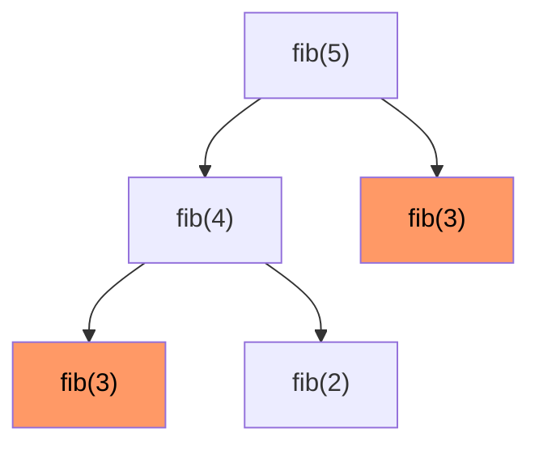
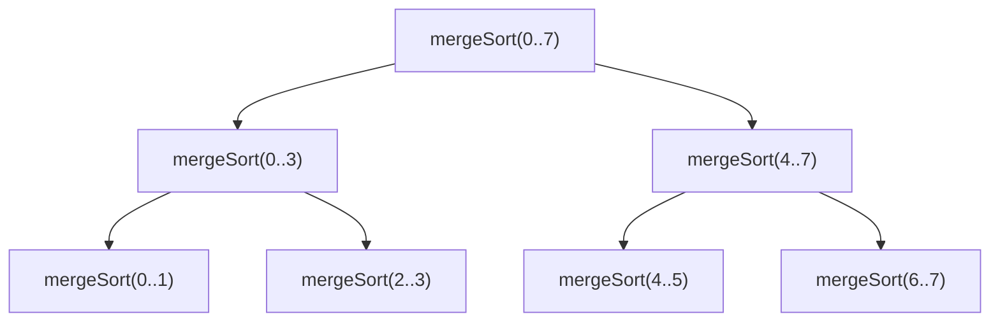

# Вопросы на собеседовании: `Рекурсия`

Рекурсия — фундамент DFS, divide-and-conquer, backtracking, DP. На интервью важно различать **base case** и **recursive step**, понимать **call stack** и риски `StackOverflowError`, знать классику: factorial, Fibonacci, Hanoi, fast power, обход деревьев.

## Полезные ссылки

### Официальная документация и авторитетные источники

- [Recursion in Java — Baeldung](https://www.baeldung.com/java-recursion)
- [Tail Recursion — Baeldung](https://www.baeldung.com/cs/tail-vs-non-tail-recursion)
- [Tower of Hanoi — Baeldung](https://www.baeldung.com/cs/tower-of-hanoi)
- [Fast Power — Baeldung](https://www.baeldung.com/cs/exponentiation-by-squaring)
- [Recursion Visualizer](https://recursion.now.sh/)

## Содержание

- [Полезные ссылки](#полезные-ссылки)
- [See also](#see-also)

**Базовые понятия**
- [Q1. (!) Что такое рекурсия?](#q1--что-такое-рекурсия)
- [Q2. (!) Базовый случай и рекурсивный шаг?](#q2--базовый-случай-и-рекурсивный-шаг)
- [Q3. (!) Что такое recursion call stack?](#q3--что-такое-recursion-call-stack)
- [Q4. (!) Чем рекурсия отличается от итерации?](#q4--чем-рекурсия-отличается-от-итерации)

**Tail vs Non-tail**
- [Q5. (!) Что такое tail recursion?](#q5--что-такое-tail-recursion)
- [Q6. (!) Поддерживает ли JVM tail call optimization?](#q6--поддерживает-ли-jvm-tail-call-optimization)
- [Q7. Как обойти отсутствие TCO в Java?](#q7-как-обойти-отсутствие-tco-в-java)

**Классические задачи**
- [Q8. (!) Factorial — рекурсивно?](#q8--factorial--рекурсивно)
- [Q9. (!) Fibonacci — рекурсивно?](#q9--fibonacci--рекурсивно)
- [Q10. Sum of array элементов?](#q10-sum-of-array-элементов)
- [Q11. (!) Tower of Hanoi?](#q11--tower-of-hanoi)
- [Q12. Перевод числа в систему счисления?](#q12-перевод-числа-в-систему-счисления)
- [Q13. (!) Power(x, n) — быстрое возведение в степень?](#q13--powerx-n--быстрое-возведение-в-степень)
- [Q14. Reverse string рекурсивно?](#q14-reverse-string-рекурсивно)
- [Q15. Обход файловой системы?](#q15-обход-файловой-системы)

**Деревья и графы**
- [Q16. (!) Все обходы дерева рекурсивно?](#q16--все-обходы-дерева-рекурсивно)
- [Q17. (!) Высота дерева?](#q17--высота-дерева)
- [Q18. (!) Зеркальное отражение дерева?](#q18--зеркальное-отражение-дерева)
- [Q19. DFS на графе?](#q19-dfs-на-графе)

**Дерево вызовов и анализ**
- [Q20. (!) Что такое recursion tree?](#q20--что-такое-recursion-tree)
- [Q21. Как анализировать сложность рекурсии?](#q21-как-анализировать-сложность-рекурсии)

**Подводные камни и оптимизации**
- [Q22. (!) Когда рекурсия даёт StackOverflowError?](#q22--когда-рекурсия-даёт-stackoverflowerror)
- [Q23. (!) Memoization — что это и зачем?](#q23--memoization--что-это-и-зачем)
- [Q24. Как преобразовать рекурсию в итерацию?](#q24-как-преобразовать-рекурсию-в-итерацию)
- [Q25. (!) Чем рекурсия отличается от backtracking?](#q25--чем-рекурсия-отличается-от-backtracking)
- [Q26. Mutual recursion — что это?](#q26-mutual-recursion--что-это)

**Применения**
- [Q27. (!) Где рекурсия в production?](#q27--где-рекурсия-в-production)

## Q1. (!) Что такое рекурсия?

**Рекурсия** — функция, которая вызывает **сама себя** с упрощённой подзадачей.

```java
int factorial(int n) {
    if (n <= 1) return 1;          // base case
    return n * factorial(n - 1);   // recursive step
}
```

**Применения:**
- Обходы деревьев и графов
- Divide and Conquer (Merge Sort, Quick Sort)
- Backtracking (N-Queens, Sudoku)
- Парсеры (recursive descent)
- Файловая система

## Q2. (!) Базовый случай и рекурсивный шаг?

Рекурсивная функция состоит из:

1. **Base case** — условие останова. Без него — бесконечная рекурсия → `StackOverflowError`.
2. **Recursive step** — вызов с **меньшей** подзадачей.

```java
int fact(int n) {
    if (n <= 1) return 1;       // base case — must!
    return n * fact(n - 1);     // recursive step — приближаемся к base
}
```

**Правило:** на каждом рекурсивном вызове задача должна **уменьшаться** к base case. Иначе StackOverflow.

## Q3. (!) Что такое recursion call stack?

Каждый вызов функции добавляет **stack frame**: локальные переменные, параметры, адрес возврата.

```
factorial(4) call stack:
┌─────────────────────┐
│ factorial(1) → 1    │ ← base case
├─────────────────────┤
│ factorial(2) → 2*1  │
├─────────────────────┤
│ factorial(3) → 3*2  │
├─────────────────────┤
│ factorial(4) → 4*6  │ ← начало
└─────────────────────┘
```

После каждого `return` фрейм удаляется. Глубина стека = глубина рекурсии.

**В JVM** размер стека потока — `~512KB-1MB` (настраивается `-Xss`). Если стек переполнен — `StackOverflowError`.

## Q4. (!) Чем рекурсия отличается от итерации?

| Критерий | Рекурсия | Итерация |
|----------|----------|----------|
| Читаемость | Часто проще для деревьев, графов | Проще для линейных задач |
| Память | `O(n)` стек | `O(1)` обычно |
| Производительность | Overhead на вызовы | Быстрее |
| Риск StackOverflow | Да | Нет |
| Применимость | Естественна для D&C, рекурсивных структур | Универсальна |

**Любую** рекурсию можно переписать итеративно, но не всегда **просто**.

```java
// Рекурсия — естественно для дерева
int sumTree(TreeNode node) {
    if (node == null) return 0;
    return node.val + sumTree(node.left) + sumTree(node.right);
}

// Итеративно — через явный стек
int sumTreeIter(TreeNode root) {
    if (root == null) return 0;
    Deque<TreeNode> stack = new ArrayDeque<>();
    stack.push(root);
    int sum = 0;
    while (!stack.isEmpty()) {
        TreeNode node = stack.pop();
        sum += node.val;
        if (node.left != null) stack.push(node.left);
        if (node.right != null) stack.push(node.right);
    }
    return sum;
}
```

Итеративно — `O(h)` память на стек явный. Рекурсия — то же на JVM stack, но риск `StackOverflowError`.

## Q5. (!) Что такое tail recursion?

**Tail recursion** — рекурсивный вызов является **последней** операцией в функции. Между вызовом и `return` ничего не происходит.

```java
// Tail recursive
int sum(int n, int acc) {
    if (n == 0) return acc;
    return sum(n - 1, acc + n); // последнее действие — вызов
}

// НЕ tail recursive — после вызова мы умножаем
int factorial(int n) {
    if (n <= 1) return 1;
    return n * factorial(n - 1); // вызов, потом *
}
```

**Преимущество:** компилятор может **переиспользовать** текущий stack frame вместо создания нового → итеративный цикл без stack growth.

## Q6. (!) Поддерживает ли JVM tail call optimization?

**НЕТ.** JVM не поддерживает TCO (Tail Call Optimization).

**Причины (исторические):**
- Усложняет stack traces (интроспекция)
- Усложняет работу security manager (привязан к stack frames)
- Project Loom (виртуальные потоки) частично решает проблему другим способом

**Следствие:** даже tail-recursive методы в Java расходуют стек. Для большой глубины — итерация или явный стек.

**В Scala / Kotlin:** есть `@tailrec` annotation — компилятор оптимизирует в цикл (обходит ограничение JVM).

```kotlin
tailrec fun sum(n: Int, acc: Int = 0): Int =
    if (n == 0) acc else sum(n - 1, acc + n) // компилируется в while-loop
```

## Q7. Как обойти отсутствие TCO в Java?

1. **Переписать итеративно:**

```java
int sumIter(int n) {
    int sum = 0;
    for (int i = 1; i <= n; i++) sum += i;
    return sum;
}
```

2. **Trampolining** — функция возвращает `Supplier<Result>` или **продолжение** вместо рекурсивного вызова, цикл крутит:

```java
interface TailCall<T> {
    TailCall<T> apply();
    boolean isComplete();
    T result();

    default T invoke() {
        TailCall<T> tc = this;
        while (!tc.isComplete()) tc = tc.apply();
        return tc.result();
    }
}
```

3. **Increased stack** — `-Xss4m` (с 512K до 4MB) — даёт ~80K глубину рекурсии.

4. **Project Loom virtual threads** — виртуальный поток имеет растущий стек. Не решает proper TCO, но снимает практическое ограничение.

## Q8. (!) Factorial — рекурсивно?

```java
// O(n) время, O(n) стек
long factorial(int n) {
    if (n < 0) throw new IllegalArgumentException("n must be >= 0");
    if (n <= 1) return 1;
    return n * factorial(n - 1);
}

// Итеративно — O(n) время, O(1) память
long factorialIter(int n) {
    long result = 1;
    for (int i = 2; i <= n; i++) result *= i;
    return result;
}

// BigInteger для больших n
BigInteger factorialBig(int n) {
    BigInteger result = BigInteger.ONE;
    for (int i = 2; i <= n; i++) result = result.multiply(BigInteger.valueOf(i));
    return result;
}
```

`long` переполняется при `n = 21` (`20! = 2,432,902,008,176,640,000`). Для большего — `BigInteger`.

## Q9. (!) Fibonacci — рекурсивно?

```java
// Naive — O(2^n) — НЕПРИГОДНО для n > 30
int fibNaive(int n) {
    if (n <= 1) return n;
    return fibNaive(n - 1) + fibNaive(n - 2);
}

// Memoization — O(n) время и память
int fibMemo(int n, int[] memo) {
    if (n <= 1) return n;
    if (memo[n] != 0) return memo[n];
    return memo[n] = fibMemo(n - 1, memo) + fibMemo(n - 2, memo);
}

// Итеративно — O(n) время, O(1) память
int fibIter(int n) {
    if (n <= 1) return n;
    int prev2 = 0, prev1 = 1;
    for (int i = 2; i <= n; i++) {
        int curr = prev1 + prev2;
        prev2 = prev1; prev1 = curr;
    }
    return prev1;
}
```



`fib(3)` вычисляется дважды — повторные вычисления. Memoization устраняет.

## Q10. Sum of array элементов?

```java
int sum(int[] arr, int index) {
    if (index == arr.length) return 0;
    return arr[index] + sum(arr, index + 1);
}

// Tail recursive (но JVM не оптимизирует!)
int sumTail(int[] arr, int index, int acc) {
    if (index == arr.length) return acc;
    return sumTail(arr, index + 1, acc + arr[index]);
}
```

`O(n)` время, `O(n)` стек. Для большого массива — итеративно.

## Q11. (!) Tower of Hanoi?

Перенести `n` дисков с `from` на `to`, используя `via`. Можно класть только меньший на больший.

```java
void hanoi(int n, char from, char to, char via) {
    if (n == 0) return;
    hanoi(n - 1, from, via, to);
    System.out.printf("Move disk %d from %c to %c%n", n, from, to);
    hanoi(n - 1, via, to, from);
}

hanoi(3, 'A', 'C', 'B');
// Move 1 from A to C
// Move 2 from A to B
// Move 1 from C to B
// Move 3 from A to C
// Move 1 from B to A
// Move 2 from B to C
// Move 1 from A to C
```

`O(2^n)` шагов — экспоненциально, **минимально возможное число**. Recurrence: `T(n) = 2T(n-1) + 1`.

Классическая задача-демонстрация рекурсии.

## Q12. Перевод числа в систему счисления?

```java
String decimalToBase(int number, int base) {
    if (number == 0) return "0";
    return decimalToBaseHelper(number, base, new StringBuilder()).reverse().toString();
}

StringBuilder decimalToBaseHelper(int n, int base, StringBuilder sb) {
    if (n == 0) return sb;
    int digit = n % base;
    sb.append(digit < 10 ? (char)('0' + digit) : (char)('A' + digit - 10));
    return decimalToBaseHelper(n / base, base, sb);
}
```

`O(log_base n)` стек. Альтернатива — итеративно через `while (n > 0)`.

## Q13. (!) Power(x, n) — быстрое возведение в степень?

```java
double power(double x, int n) {
    if (n == 0) return 1;
    if (n < 0) return 1.0 / power(x, -n);
    if (n % 2 == 0) {
        double half = power(x, n / 2);
        return half * half; // ОДНО умножение вместо n/2
    }
    return x * power(x, n - 1);
}
```

`O(log n)` вместо наивного `O(n)`. Recurrence: `T(n) = T(n/2) + O(1)`.

Применения: RSA-шифрование, быстрое возведение матриц (Фибоначчи за `O(log n)`).

## Q14. Reverse string рекурсивно?

```java
String reverseRec(String s) {
    if (s.length() <= 1) return s;
    return reverseRec(s.substring(1)) + s.charAt(0);
}
```

`O(n)` времени, `O(n)` памяти на стек И `O(n²)` из-за создания substrings. **Не рекомендуется** для production — лучше `StringBuilder.reverse()`.

## Q15. Обход файловой системы?

```java
void traverse(File dir, int depth) {
    File[] files = dir.listFiles();
    if (files == null) return;
    for (File f : files) {
        String indent = "  ".repeat(depth);
        if (f.isDirectory()) {
            System.out.println(indent + "[DIR]  " + f.getName());
            traverse(f, depth + 1);
        } else {
            System.out.println(indent + "[FILE] " + f.getName());
        }
    }
}

// Современный вариант через NIO Stream
void traverseNio(Path root) throws IOException {
    try (Stream<Path> stream = Files.walk(root)) {
        stream.forEach(p -> {
            String type = Files.isDirectory(p) ? "[DIR] " : "[FILE]";
            System.out.println(type + root.relativize(p));
        });
    }
}
```

`Files.walk()` внутри использует **итеративный DFS** через стек — нет риска StackOverflow.

## Q16. (!) Все обходы дерева рекурсивно?

```java
// Preorder: root → L → R
void preorder(TreeNode node) {
    if (node == null) return;
    process(node);
    preorder(node.left);
    preorder(node.right);
}

// Inorder: L → root → R
void inorder(TreeNode node) {
    if (node == null) return;
    inorder(node.left);
    process(node);
    inorder(node.right);
}

// Postorder: L → R → root
void postorder(TreeNode node) {
    if (node == null) return;
    postorder(node.left);
    postorder(node.right);
    process(node);
}
```

`O(n)` время, `O(h)` стек.

Подробнее — в [[trees-interview|Деревья]].

## Q17. (!) Высота дерева?

```java
int height(TreeNode root) {
    if (root == null) return 0;
    return 1 + Math.max(height(root.left), height(root.right));
}
```

`O(n)` время, `O(h)` стек.

## Q18. (!) Зеркальное отражение дерева?

```java
TreeNode invertTree(TreeNode root) {
    if (root == null) return null;
    TreeNode left = invertTree(root.left);
    TreeNode right = invertTree(root.right);
    root.left = right;
    root.right = left;
    return root;
}
```

`O(n)` время, `O(h)` стек. Знаменитая задача — Max Howell, автор Homebrew, не смог решить на интервью в Google.

## Q19. DFS на графе?

```java
void dfs(List<List<Integer>> adj, int u, boolean[] visited) {
    visited[u] = true;
    process(u);
    for (int v : adj.get(u)) {
        if (!visited[v]) dfs(adj, v, visited);
    }
}
```

`O(V + E)` время, `O(V)` стек. Для графов с миллионами вершин — итеративный DFS через явный стек.

## Q20. (!) Что такое recursion tree?

**Recursion tree** — графическое представление **всех** рекурсивных вызовов:
- Корень — исходный вызов
- Дети — рекурсивные вызовы из текущего
- Листья — base cases

Используется для:
- **Анализа сложности** (число узлов = число вызовов)
- **Поиска повторных вычислений** (одинаковые узлы → нужна мемоизация)
- **Определения глубины стека** (высота дерева)



Для Merge Sort: `log n` уровней × `O(n)` работы на уровне = `O(n log n)`.

## Q21. Как анализировать сложность рекурсии?

1. **Recurrence relation:** записать `T(n) = a · T(n/b) + f(n)` или подобное
2. **Master theorem** (если применим)
3. **Дерево рекурсии** — сумма работы по уровням
4. **Substitution method** — угадать оценку, доказать индукцией

Подробнее — в [[complexity-analysis-interview|Анализ сложности]] и [[divide-and-conquer-interview|Divide and Conquer]].

## Q22. (!) Когда рекурсия даёт StackOverflowError?

JVM stack — `~512KB-1MB`, один frame — `~50-100 байт`. Лимит — `~5K-20K` глубоких вызовов.

**Типичные причины:**
1. **Глубокая линейная рекурсия:** factorial(100000), sum(arr) на больших массивах
2. **Бесконечная рекурсия:** забыли base case
3. **Глубокие linked lists/trees:** обход списка из 10⁶ узлов
4. **Mutual recursion** без base case

**Защита:**
- Преобразовать в итерацию
- Использовать явный стек
- Увеличить `-Xss` (но это лимит, не решение)
- Project Loom virtual threads (растущий стек)

## Q23. (!) Memoization — что это и зачем?

**Memoization** — кеширование результатов рекурсивных вызовов, чтобы не пересчитывать дважды.

```java
Map<Integer, Integer> memo = new HashMap<>();

int fib(int n) {
    if (n <= 1) return n;
    if (memo.containsKey(n)) return memo.get(n);
    int result = fib(n - 1) + fib(n - 2);
    memo.put(n, result);
    return result;
}
```

Превращает экспоненциальную рекурсию (Fibonacci) в полиномиальную. По сути — **DP top-down**.

Применяется когда подзадачи **перекрываются**. См. [[dynamic-programming-interview|DP]].

## Q24. Как преобразовать рекурсию в итерацию?

1. **Линейная рекурсия → цикл** (factorial, sum)
2. **Tail recursion → while-loop** (sum с аккумулятором)
3. **DFS на дереве → явный stack**
4. **BFS на дереве → queue**
5. **Memoized recursion → bottom-up DP таблица**

```java
// Рекурсия
int fact(int n) {
    if (n <= 1) return 1;
    return n * fact(n - 1);
}

// Итерация
int factIter(int n) {
    int result = 1;
    for (int i = 2; i <= n; i++) result *= i;
    return result;
}
```

Иногда итеративный код менее читаем (Sudoku Solver, обходы деревьев) — оставляют рекурсию.

## Q25. (!) Чем рекурсия отличается от backtracking?

**Backtracking — это рекурсия с откатом (undo).** После рекурсивного вызова мы **отменяем** изменения и пробуем другие варианты.

```java
// Чистая рекурсия (без backtracking)
int sumTree(TreeNode node) {
    if (node == null) return 0;
    return node.val + sumTree(node.left) + sumTree(node.right);
}

// Backtracking
void permute(int[] nums, List<Integer> current, ...) {
    if (current.size() == nums.length) { result.add(new ArrayList<>(current)); return; }
    for (int i = 0; i < nums.length; i++) {
        if (used[i]) continue;
        used[i] = true; current.add(nums[i]);
        permute(nums, current, ...);
        used[i] = false; current.remove(current.size() - 1); // ← BACKTRACK
    }
}
```

Подробнее — в [[backtracking-interview|Backtracking]].

## Q26. Mutual recursion — что это?

**Mutual (взаимная) рекурсия** — две (или больше) функций вызывают друг друга.

```java
boolean isEven(int n) {
    if (n == 0) return true;
    return isOdd(n - 1);
}

boolean isOdd(int n) {
    if (n == 0) return false;
    return isEven(n - 1);
}
```

Используется в:
- **Парсерах** — recursive descent для разных грамматических правил
- **State machines**
- **Game AI** — minimax (`maximizer` ↔ `minimizer`)

## Q27. (!) Где рекурсия в production?

1. **Парсеры** — recursive descent для JSON, XML, expressions
2. **Файловая система** — обходы директорий
3. **JSON/XML traversal** — Jackson, Gson обходят дерево
4. **Spring DI** — bean dependency resolution
5. **Compilers** — AST traversal, type checking
6. **Database query plans** — оптимизатор перебирает планы рекурсивно
7. **GC algorithms** — некоторые reference traversal
8. **Game engines** — scene graph traversal
9. **HTTP request routing** — middleware chain (некоторые реализации)
10. **Filesystem walkers** (`Files.walk`, `File.listFiles`)

---

## See also

- [[algorithms-interview|Алгоритмы (обзор)]] — карта алгоритмических тем
- [[divide-and-conquer-interview|Divide and Conquer]] — D&C основан на рекурсии
- [[backtracking-interview|Backtracking]] — рекурсия с undo
- [[dynamic-programming-interview|DP]] — рекурсия + memoization
- [[trees-interview|Деревья]] — обходы рекурсивны
- [[graphs-interview|Графы]] — DFS рекурсивен
- [[stacks-queues-interview|Стеки и очереди]] — стек = call stack
- [[linked-lists-interview|Связные списки]] — рекурсивный реверс
- [[arrays-strings-interview|Массивы и строки]] — рекурсивный sum, reverse
- [[complexity-analysis-interview|Анализ сложности]] — recurrence relations
- [[jvm-interview|JVM]] — stack frames, Xss, отсутствие TCO
- [[java-concurrency-interview|Java Concurrency]] — Project Loom virtual threads

- [[backtracking-interview|Backtracking]]
- [[divide-and-conquer-interview|Divide and Conquer]]
- [[dynamic-programming-interview|Динамическое программирование]]
- [[greedy-algorithms-interview|Жадные алгоритмы (Greedy)]]
- [[two-pointers-sliding-window-interview|Two Pointers и Sliding Window]]
- [[algorithms-interview|Алгоритмы (обзор)]]
