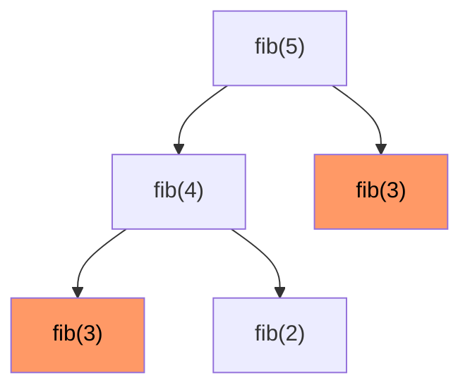
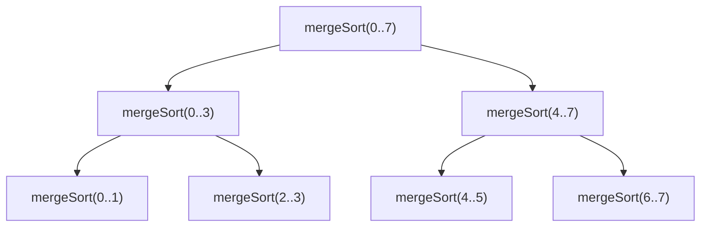

# Вопросы на собеседовании: `Рекурсия`

Рекурсия — фундамент DFS, divide-and-conquer, backtracking, DP. На интервью важно различать **base case** и **recursive step**, понимать **call stack** и риски `StackOverflowError`, знать классику: factorial, Fibonacci, Hanoi, fast power, обход деревьев.

## Полезные ссылки

### Официальная документация и авторитетные источники

- [Recursion in Java — Baeldung](https://www.baeldung.com/java-recursion)
- [Tail Recursion — Baeldung](https://www.baeldung.com/cs/tail-vs-non-tail-recursion)
- [Tower of Hanoi — Baeldung](https://www.baeldung.com/cs/tower-of-hanoi)
- [Fast Power — Baeldung](https://www.baeldung.com/cs/exponentiation-by-squaring)
- [Recursion Visualizer](https://recursion.now.sh/)

## Содержание

- [Полезные ссылки](#полезные-ссылки)
- [See also](#see-also)

**Базовые понятия**
- [Q1. (!) Что такое рекурсия?](#q1--что-такое-рекурсия)
- [Q2. (!) Базовый случай и рекурсивный шаг?](#q2--базовый-случай-и-рекурсивный-шаг)
- [Q3. (!) Что такое recursion call stack?](#q3--что-такое-recursion-call-stack)
- [Q4. (!) Чем рекурсия отличается от итерации?](#q4--чем-рекурсия-отличается-от-итерации)

**Tail vs Non-tail**
- [Q5. (!) Что такое tail recursion?](#q5--что-такое-tail-recursion)
- [Q6. (!) Поддерживает ли JVM tail call optimization?](#q6--поддерживает-ли-jvm-tail-call-optimization)
- [Q7. Как обойти отсутствие TCO в Java?](#q7-как-обойти-отсутствие-tco-в-java)

**Классические задачи**
- [Q8. (!) Factorial — рекурсивно?](#q8--factorial--рекурсивно)
- [Q9. (!) Fibonacci — рекурсивно?](#q9--fibonacci--рекурсивно)
- [Q10. Sum of array элементов?](#q10-sum-of-array-элементов)
- [Q11. (!) Tower of Hanoi?](#q11--tower-of-hanoi)
- [Q12. Перевод числа в систему счисления?](#q12-перевод-числа-в-систему-счисления)
- [Q13. (!) Power(x, n) — быстрое возведение в степень?](#q13--powerx-n--быстрое-возведение-в-степень)
- [Q14. Reverse string рекурсивно?](#q14-reverse-string-рекурсивно)
- [Q15. Обход файловой системы?](#q15-обход-файловой-системы)

**Деревья и графы**
- [Q16. (!) Все обходы дерева рекурсивно?](#q16--все-обходы-дерева-рекурсивно)
- [Q17. (!) Высота дерева?](#q17--высота-дерева)
- [Q18. (!) Зеркальное отражение дерева?](#q18--зеркальное-отражение-дерева)
- [Q19. DFS на графе?](#q19-dfs-на-графе)

**Дерево вызовов и анализ**
- [Q20. (!) Что такое recursion tree?](#q20--что-такое-recursion-tree)
- [Q21. Как анализировать сложность рекурсии?](#q21-как-анализировать-сложность-рекурсии)

**Подводные камни и оптимизации**
- [Q22. (!) Когда рекурсия даёт StackOverflowError?](#q22--когда-рекурсия-даёт-stackoverflowerror)
- [Q23. (!) Memoization — что это и зачем?](#q23--memoization--что-это-и-зачем)
- [Q24. Как преобразовать рекурсию в итерацию?](#q24-как-преобразовать-рекурсию-в-итерацию)
- [Q25. (!) Чем рекурсия отличается от backtracking?](#q25--чем-рекурсия-отличается-от-backtracking)
- [Q26. Mutual recursion — что это?](#q26-mutual-recursion--что-это)

**Применения**
- [Q27. (!) Где рекурсия в production?](#q27--где-рекурсия-в-production)

## Q1. (!) Что такое рекурсия?

**Рекурсия** — функция, которая вызывает **сама себя** с упрощённой подзадачей.

```java
int factorial(int n) {
    if (n <= 1) return 1;          // base case
    return n * factorial(n - 1);   // recursive step
}
```

**Применения:**
- Обходы деревьев и графов
- Divide and Conquer (Merge Sort, Quick Sort)
- Backtracking (N-Queens, Sudoku)
- Парсеры (recursive descent)
- Файловая система


> [!mcq]
> - [ ] Функция которая вызывает другую функцию в цикле | ❌ ПОСЛЕДСТВИЕ: это iteration через функции, не рекурсия; рекурсия — self-call с меньшей подзадачей
> - [ ] Алгоритм повторяющийся через for/while цикл | ❌ ПОСЛЕДСТВИЕ: это iteration; рекурсия использует call stack а не явный цикл
> - [x] Функция которая вызывает себя с меньшей подзадачей; нужен base case (останов) и recursive step (уменьшение задачи) | ✓ ПРИМЕНЯТЬ: обход деревьев, D&C, backtracking, парсеры 📋 ПРАВИЛО: рекурсия = self-call + base case + уменьшение к base 🔗 См. Q2
> - [ ] Метод который запускается параллельно в нескольких потоках | ❌ ПОСЛЕДСТВИЕ: это concurrency, не рекурсия; рекурсия последовательна по call stack

## Q2. (!) Базовый случай и рекурсивный шаг?

Рекурсивная функция состоит из:

1. **Base case** — условие останова. Без него — бесконечная рекурсия → `StackOverflowError`.
2. **Recursive step** — вызов с **меньшей** подзадачей.

```java
int fact(int n) {
    if (n <= 1) return 1;       // base case — must!
    return n * fact(n - 1);     // recursive step — приближаемся к base
}
```

**Правило:** на каждом рекурсивном вызове задача должна **уменьшаться** к base case. Иначе StackOverflow.


> [!mcq]
> - [ ] base case — единственный, recursive step — несколько; без recursive step функция завершается мгновенно | ❌ ПОСЛЕДСТВИЕ: без recursive step нет уменьшения задачи — infinite recursion или некорректный результат
> - [x] base case — условие останова (без него StackOverflow); recursive step — вызов с меньшей подзадачей (приближение к base case) | ✓ ПРИМЕНЯТЬ: любая рекурсивная функция должна иметь оба 📋 ПРАВИЛО: base case + шаг уменьшения = корректная рекурсия 🔗 См. Q1
> - [ ] base case — первый вызов функции; recursive step — возврат результата | ❌ ПОСЛЕДСТВИЕ: base case — это условие ОСТАНОВА, не первый вызов; без правильного base case бесконечная рекурсия
> - [ ] base case необязателен если функция конечная | ❌ ПОСЛЕДСТВИЕ: без base case рекурсия не завершится корректно → StackOverflowError независимо от размера входа

## Q3. (!) Что такое recursion call stack?

Каждый вызов функции добавляет **stack frame**: локальные переменные, параметры, адрес возврата.

```
factorial(4) call stack:
┌─────────────────────┐
│ factorial(1) → 1    │ ← base case
├─────────────────────┤
│ factorial(2) → 2*1  │
├─────────────────────┤
│ factorial(3) → 3*2  │
├─────────────────────┤
│ factorial(4) → 4*6  │ ← начало
└─────────────────────┘
```

После каждого `return` фрейм удаляется. Глубина стека = глубина рекурсии.

**В JVM** размер стека потока — `~512KB-1MB` (настраивается `-Xss`). Если стек переполнен — `StackOverflowError`.


> [!mcq]
> - [ ] Каждый stack frame хранит только возвращаемое значение | ❌ ПОСЛЕДСТВИЕ: фрейм хранит локальные переменные + параметры + адрес возврата; только значение — это упрощение ломающее понимание глубины
> - [ ] Call stack заполняется в heap, не в stack thread | ❌ ПОСЛЕДСТВИЕ: call stack — это именно thread stack (JVM: -Xss); heap используется для объектов, не для stack frames
> - [ ] StackOverflowError невозможен при правильном base case | ❌ ПОСЛЕДСТВИЕ: правильный base case предотвращает бесконечную рекурсию, но слишком глубокая конечная рекурсия (n=100000) всё равно вызовет StackOverflowError
> - [x] Каждый вызов добавляет stack frame (локальные переменные, параметры, адрес возврата); при StackOverflow JVM бросает StackOverflowError, не исключение | ✓ ПРИМЕНЯТЬ: для анализа памяти рекурсии; глубина = O(h) стека 📋 ПРАВИЛО: 1 рекурсивный вызов = 1 stack frame; глубина рекурсии = глубина стека 🔗 См. Q5

## Q4. (!) Чем рекурсия отличается от итерации?

| Критерий | Рекурсия | Итерация |
|----------|----------|----------|
| Читаемость | Часто проще для деревьев, графов | Проще для линейных задач |
| Память | `O(n)` стек | `O(1)` обычно |
| Производительность | Overhead на вызовы | Быстрее |
| Риск StackOverflow | Да | Нет |
| Применимость | Естественна для D&C, рекурсивных структур | Универсальна |

**Любую** рекурсию можно переписать итеративно, но не всегда **просто**.

```java
// Рекурсия — естественно для дерева
int sumTree(TreeNode node) {
    if (node == null) return 0;
    return node.val + sumTree(node.left) + sumTree(node.right);
}

// Итеративно — через явный стек
int sumTreeIter(TreeNode root) {
    if (root == null) return 0;
    Deque<TreeNode> stack = new ArrayDeque<>();
    stack.push(root);
    int sum = 0;
    while (!stack.isEmpty()) {
        TreeNode node = stack.pop();
        sum += node.val;
        if (node.left != null) stack.push(node.left);
        if (node.right != null) stack.push(node.right);
    }
    return sum;
}
```

Итеративно — `O(h)` память на стек явный. Рекурсия — то же на JVM stack, но риск `StackOverflowError`.


> [!mcq]
> - [ ] Рекурсия и итерация имеют одинаковую сложность по памяти | ❌ ПОСЛЕДСТВИЕ: рекурсия использует O(h) call stack; итерация часто O(1); для дерева h=N → O(N) стека в рекурсии
> - [x] Рекурсия: O(h) стек, риск StackOverflow, удобна для D&C/деревьев; итерация: O(1) память, быстрее, но сложнее для рекурсивных структур | ✓ ПРИМЕНЯТЬ: рекурсия для деревьев/D&C; итерация для линейных задач с большой n 📋 ПРАВИЛО: рекурсия = читаемость + стек; итерация = память + скорость 🔗 См. Q5
> - [ ] Итерацию нельзя использовать для обхода деревьев | ❌ ПОСЛЕДСТВИЕ: итеративный DFS через явный Deque<TreeNode> stack — стандартный паттерн для деревьев
> - [ ] Любую рекурсию легко переписать итеративно | ❌ ПОСЛЕДСТВИЕ: возможно всегда, но не всегда просто; взаимная рекурсия и сложные continuation требуют trampolining

## Q5. (!) Что такое tail recursion?

**Tail recursion** — рекурсивный вызов является **последней** операцией в функции. Между вызовом и `return` ничего не происходит.

```java
// Tail recursive
int sum(int n, int acc) {
    if (n == 0) return acc;
    return sum(n - 1, acc + n); // последнее действие — вызов
}

// НЕ tail recursive — после вызова мы умножаем
int factorial(int n) {
    if (n <= 1) return 1;
    return n * factorial(n - 1); // вызов, потом *
}
```

**Преимущество:** компилятор может **переиспользовать** текущий stack frame вместо создания нового → итеративный цикл без stack growth.


> [!mcq]
> - [ ] Tail recursion — последний вызов функции в программе вообще | ❌ ПОСЛЕДСТВИЕ: tail recursion — последняя операция внутри ДАННОЙ рекурсивной функции; не последний вызов в программе
> - [ ] `factorial(n) = n * factorial(n-1)` — пример tail recursion | ❌ ПОСЛЕДСТВИЕ: нет: после вызова factorial(n-1) выполняется умножение *n; tail = вызов должен быть ПОСЛЕДНЕЙ операцией
> - [ ] Tail recursion требует отдельной аннотации в Java | ❌ ПОСЛЕДСТВИЕ: Java не поддерживает TCO вообще; @tailrec — аннотация Scala/Kotlin компилятора
> - [x] Рекурсивный вызов является последней операцией; TCO позволяет компилятору переиспользовать stack frame → O(1) стека | ✓ ПРИМЕНЯТЬ: sum(n, acc) → sum(n-1, acc+n) — tail recursive; factorial(n) = n * fact(n-1) — нет 📋 ПРАВИЛО: tail = self-call как return-statement без операций после 🔗 См. Q6

## Q6. (!) Поддерживает ли JVM tail call optimization?

**НЕТ.** JVM не поддерживает TCO (Tail Call Optimization).

**Причины (исторические):**
- Усложняет stack traces (интроспекция)
- Усложняет работу security manager (привязан к stack frames)
- Project Loom (виртуальные потоки) частично решает проблему другим способом

**Следствие:** даже tail-recursive методы в Java расходуют стек. Для большой глубины — итерация или явный стек.

**В Scala / Kotlin:** есть `@tailrec` annotation — компилятор оптимизирует в цикл (обходит ограничение JVM).

```kotlin
tailrec fun sum(n: Int, acc: Int = 0): Int =
    if (n == 0) acc else sum(n - 1, acc + n) // компилируется в while-loop
```


> [!mcq]
> - [ ] JVM поддерживает TCO начиная с Java 17 | ❌ ПОСЛЕДСТВИЕ: JVM не поддерживает TCO ни в одной версии Java; @tailrec — только Scala/Kotlin компилятор, не JVM
> - [x] JVM не поддерживает TCO; даже tail-recursive Java методы расходуют стек; Kotlin/Scala @tailrec — компилятор превращает в while-loop | ✓ ПРИМЕНЯТЬ: в Java использовать итерацию или trampolining; в Kotlin — @tailrec annotation 📋 ПРАВИЛО: JVM = нет TCO; @tailrec = Kotlin/Scala compiler trick, не JVM feature 🔗 См. Q7
> - [ ] Project Loom решает проблему TCO добавляя реальный TCO в JVM | ❌ ПОСЛЕДСТВИЕ: Loom даёт growing virtual thread stacks но не TCO; цель Loom — concurrency, не TCO
> - [ ] -Xss увеличивает heap а не thread stack | ❌ ПОСЛЕДСТВИЕ: -Xss настраивает размер THREAD STACK (по умолчанию 512KB-1MB); heap настраивается -Xmx/-Xms

## Q7. Как обойти отсутствие TCO в Java?

1. **Переписать итеративно:**

```java
int sumIter(int n) {
    int sum = 0;
    for (int i = 1; i <= n; i++) sum += i;
    return sum;
}
```

2. **Trampolining** — функция возвращает `Supplier<Result>` или **продолжение** вместо рекурсивного вызова, цикл крутит:

```java
interface TailCall<T> {
    TailCall<T> apply();
    boolean isComplete();
    T result();

    default T invoke() {
        TailCall<T> tc = this;
        while (!tc.isComplete()) tc = tc.apply();
        return tc.result();
    }
}
```

3. **Increased stack** — `-Xss4m` (с 512K до 4MB) — даёт ~80K глубину рекурсии.

4. **Project Loom virtual threads** — виртуальный поток имеет растущий стек. Не решает proper TCO, но снимает практическое ограничение.


> [!mcq]
> - [ ] Добавить @tailrec в Java код — тогда JVM применит TCO | ❌ ПОСЛЕДСТВИЕ: @tailrec — Kotlin/Scala аннотация; в Java нет аннотации TCO; JVM не делает TCO независимо от аннотаций
> - [x] Переписать итеративно; trampolining (функция возвращает продолжение, цикл крутит); увеличить -Xss | ✓ ПРИМЕНЯТЬ: итерация для простых случаев; trampolining для взаимной рекурсии 📋 ПРАВИЛО: нет TCO в Java = итерация + явный стек + trampolining 🔗 См. Q6
> - [ ] Использовать CompletableFuture для асинхронного вызова | ❌ ПОСЛЕДСТВИЕ: async не решает проблему stack depth; каждый CompletableFuture stage всё равно использует thread stack
> - [ ] Только увеличить -Xmx heap | ❌ ПОСЛЕДСТВИЕ: проблема в thread stack, не heap; нужен -Xss (thread stack size) не -Xmx

## Q8. (!) Factorial — рекурсивно?

```java
// O(n) время, O(n) стек
long factorial(int n) {
    if (n < 0) throw new IllegalArgumentException("n must be >= 0");
    if (n <= 1) return 1;
    return n * factorial(n - 1);
}

// Итеративно — O(n) время, O(1) память
long factorialIter(int n) {
    long result = 1;
    for (int i = 2; i <= n; i++) result *= i;
    return result;
}

// BigInteger для больших n
BigInteger factorialBig(int n) {
    BigInteger result = BigInteger.ONE;
    for (int i = 2; i <= n; i++) result = result.multiply(BigInteger.valueOf(i));
    return result;
}
```

`long` переполняется при `n = 21` (`20! = 2,432,902,008,176,640,000`). Для большего — `BigInteger`.


> [!mcq]
> - [ ] factorial(n) = n * factorial(n) — рекурсивный шаг | ❌ ПОСЛЕДСТВИЕ: нет уменьшения задачи (n не уменьшается); бесконечная рекурсия → StackOverflowError
> - [ ] long переполнится при n = 100, нужен double | ❌ ПОСЛЕДСТВИЕ: long переполнится при n=21 (20!=2.4*10^18); double теряет точность; правильно — BigInteger для n>20
> - [x] factorial(n) = n * factorial(n-1); base case: n<=1 → 1; O(n) стек; long переполняется при n=21 | ✓ ПРИМЕНЯТЬ: рекурсивный factorial — учебный пример; для больших n — BigInteger итеративно 📋 ПРАВИЛО: factorial = умножение на n, рекурсия по n-1, base=1 🔗 См. Q2
> - [ ] Base case factorial: if (n == 0) return 0 | ❌ ПОСЛЕДСТВИЕ: 0! = 1 по определению, не 0; возврат 0 сделает все factorial(n) = 0

## Q9. (!) Fibonacci — рекурсивно?

```java
// Naive — O(2^n) — НЕПРИГОДНО для n > 30
int fibNaive(int n) {
    if (n <= 1) return n;
    return fibNaive(n - 1) + fibNaive(n - 2);
}

// Memoization — O(n) время и память
int fibMemo(int n, int[] memo) {
    if (n <= 1) return n;
    if (memo[n] != 0) return memo[n];
    return memo[n] = fibMemo(n - 1, memo) + fibMemo(n - 2, memo);
}

// Итеративно — O(n) время, O(1) память
int fibIter(int n) {
    if (n <= 1) return n;
    int prev2 = 0, prev1 = 1;
    for (int i = 2; i <= n; i++) {
        int curr = prev1 + prev2;
        prev2 = prev1; prev1 = curr;
    }
    return prev1;
}
```



`fib(3)` вычисляется дважды — повторные вычисления. Memoization устраняет.


> [!mcq]
> - [ ] fibNaive(n) имеет сложность O(n) | ❌ ПОСЛЕДСТВИЕ: fibNaive — exponential O(2^n) из-за двойного рекурсивного вызова; fib(50) займёт несколько минут
> - [ ] fibMemo(n) требует O(n²) памяти для хранения memo | ❌ ПОСЛЕДСТВИЕ: memo массив размером n → O(n) память; O(n²) только при использовании 2D DP таблицы
> - [x] fibNaive = O(2^n) непригодно для n>30; fibMemo = O(n) время + O(n) память; fibIter = O(n) время O(1) память | ✓ ПРИМЕНЯТЬ: для n>30 только memoization или iterative; naive только для демонстрации 📋 ПРАВИЛО: naive fib = exponential; memo = linear; iter = optimal 🔗 См. Q23
> - [ ] fib(0) = 1, fib(1) = 1 — стандартный base case | ❌ ПОСЛЕДСТВИЕ: стандартно fib(0)=0, fib(1)=1; fib(0)=1 сдвигает последовательность и даст неверные результаты

## Q10. Sum of array элементов?

```java
int sum(int[] arr, int index) {
    if (index == arr.length) return 0;
    return arr[index] + sum(arr, index + 1);
}

// Tail recursive (но JVM не оптимизирует!)
int sumTail(int[] arr, int index, int acc) {
    if (index == arr.length) return acc;
    return sumTail(arr, index + 1, acc + arr[index]);
}
```

`O(n)` время, `O(n)` стек. Для большого массива — итеративно.


> [!mcq]
> - [ ] Sum of array рекурсивно — O(1) стека благодаря tail call оптимизации | ❌ ПОСЛЕДСТВИЕ: JVM не делает TCO; sumTail всё равно O(n) стека; для больших массивов → StackOverflowError
> - [ ] Base case для sum: if (index == 0) return 0 | ❌ ПОСЛЕДСТВИЕ: нужен if (index == arr.length) return 0; начинать с 0 — неверный базовый случай, функция никогда не достигнет его через index+1
> - [x] sum(arr, index) = arr[index] + sum(arr, index+1); base case: index == arr.length; O(n) стек → для большого массива итеративно | ✓ ПРИМЕНЯТЬ: рекурсивный sum как учебный паттерн; в prod — Arrays.stream().sum() 📋 ПРАВИЛО: array sum = текущий элемент + рекурсия от следующего 🔗 См. Q2
> - [ ] Рекурсивный sum медленнее итеративного на O(n²) | ❌ ПОСЛЕДСТВИЕ: оба O(n); рекурсия медленнее из-за function call overhead, но не O(n²)

## Q11. (!) Tower of Hanoi?

Перенести `n` дисков с `from` на `to`, используя `via`. Можно класть только меньший на больший.

```java
void hanoi(int n, char from, char to, char via) {
    if (n == 0) return;
    hanoi(n - 1, from, via, to);
    System.out.printf("Move disk %d from %c to %c%n", n, from, to);
    hanoi(n - 1, via, to, from);
}

hanoi(3, 'A', 'C', 'B');
// Move 1 from A to C
// Move 2 from A to B
// Move 1 from C to B
// Move 3 from A to C
// Move 1 from B to A
// Move 2 from B to C
// Move 1 from A to C
```

`O(2^n)` шагов — экспоненциально, **минимально возможное число**. Recurrence: `T(n) = 2T(n-1) + 1`.

Классическая задача-демонстрация рекурсии.


> [!mcq]
> - [ ] Tower of Hanoi имеет сложность O(n²) | ❌ ПОСЛЕДСТВИЕ: Hanoi требует минимально 2^n - 1 ходов → O(2^n); это нижняя граница, итеративного решения с меньшей сложностью нет
> - [x] hanoi(n) = hanoi(n-1, from, via) + move + hanoi(n-1, via, to); T(n)=2T(n-1)+1 → O(2^n) шагов — минимально возможное | ✓ ПРИМЕНЯТЬ: Hanoi — демонстрация recurrence relation и D&C рекурсии 📋 ПРАВИЛО: Hanoi = 2 рекурсивных вызова + 1 ход → O(2^n) 🔗 См. Q4
> - [ ] Tower of Hanoi решается без рекурсии за O(n log n) | ❌ ПОСЛЕДСТВИЕ: Hanoi требует ровно 2^n - 1 ходов; итеративное решение существует но не быстрее — ходов столько же
> - [ ] Для n=4 нужно 8 ходов | ❌ ПОСЛЕДСТВИЕ: n=4 → 2^4-1 = 15 ходов; n=3 → 7 ходов; формула: 2^n - 1

## Q12. Перевод числа в систему счисления?

```java
String decimalToBase(int number, int base) {
    if (number == 0) return "0";
    return decimalToBaseHelper(number, base, new StringBuilder()).reverse().toString();
}

StringBuilder decimalToBaseHelper(int n, int base, StringBuilder sb) {
    if (n == 0) return sb;
    int digit = n % base;
    sb.append(digit < 10 ? (char)('0' + digit) : (char)('A' + digit - 10));
    return decimalToBaseHelper(n / base, base, sb);
}
```

`O(log_base n)` стек. Альтернатива — итеративно через `while (n > 0)`.


> [!mcq]
> - [ ] decimalToBase строит цифры в правильном порядке без reverse | ❌ ПОСЛЕДСТВИЕ: рекурсия добавляет остатки от наименее значимого; нужен reverse или сборка строки в другом порядке
> - [ ] Base case: if (n == 0) return "" | ❌ ПОСЛЕДСТВИЕ: если number=0 рекурсия не достигает базового случая при n/base; нужно проверять n==0 в начале вызова
> - [x] decimalToBaseHelper(n, base): берёт n%base как цифру, рекурсирует с n/base; O(log_base n) стека; нужен reverse | ✓ ПРИМЕНЯТЬ: учебный паттерн digit extraction; в prod — Integer.toString(n, base) 📋 ПРАВИЛО: число → цифры = n%base + рекурсия(n/base) + reverse 🔗 См. Q8
> - [ ] Функция работает для base=1 | ❌ ПОСЛЕДСТВИЕ: base=1 → n%1=0 всегда → бесконечная рекурсия; base должен быть >= 2

## Q13. (!) Power(x, n) — быстрое возведение в степень?

```java
double power(double x, int n) {
    if (n == 0) return 1;
    if (n < 0) return 1.0 / power(x, -n);
    if (n % 2 == 0) {
        double half = power(x, n / 2);
        return half * half; // ОДНО умножение вместо n/2
    }
    return x * power(x, n - 1);
}
```

`O(log n)` вместо наивного `O(n)`. Recurrence: `T(n) = T(n/2) + O(1)`.

Применения: RSA-шифрование, быстрое возведение матриц (Фибоначчи за `O(log n)`).


> [!mcq]
> - [ ] power(x, n) наивно = O(n) время — достаточно для большинства задач | ❌ ПОСЛЕДСТВИЕ: RSA и матричное возведение в степень требуют O(log n); для n=10^9 разница = 1 млрд vs 30 итераций
> - [ ] Быстрое возведение: power(x, n) = power(x, n-1) * x — рекурсия | ❌ ПОСЛЕДСТВИЕ: это наивное O(n); быстрое = power(x, n/2)^2 с ОДНИМ умножением для чётного n → O(log n)
> - [ ] При n<0 алгоритм бросает исключение | ❌ ПОСЛЕДСТВИЕ: корректная реализация: if (n<0) return 1.0/power(x,-n); отрицательные степени поддерживаются
> - [x] n чётное: half=power(x,n/2); return half*half; n нечётное: return x*power(x,n-1); O(log n) | ✓ ПРИМЕНЯТЬ: RSA, матричное умножение, fib за O(log n) 📋 ПРАВИЛО: fast power = divide by 2 + cache half → O(log n) 🔗 См. Q4

## Q14. Reverse string рекурсивно?

```java
String reverseRec(String s) {
    if (s.length() <= 1) return s;
    return reverseRec(s.substring(1)) + s.charAt(0);
}
```

`O(n)` времени, `O(n)` памяти на стек И `O(n²)` из-за создания substrings. **Не рекомендуется** для production — лучше `StringBuilder.reverse()`.


> [!mcq]
> - [ ] reverseRec(s) = O(n) времени и O(1) памяти | ❌ ПОСЛЕДСТВИЕ: substring() в Java создаёт новую строку → O(n) создаётся на каждом уровне → O(n²) суммарно; стек O(n) тоже
> - [x] reverseRec имеет O(n²) из-за substring на каждом уровне стека; для production — StringBuilder.reverse() за O(n) | ✓ ПРИМЕНЯТЬ: только как учебный пример рекурсии; в prod — new StringBuilder(s).reverse().toString() 📋 ПРАВИЛО: рекурсивный reverse = O(n²) из-за substring; итеративный = O(n) 🔗 См. Q4
> - [ ] reverseRec("abc") = reverseRec("bc") + 'a' — корректно | ❌ ПОСЛЕДСТВИЕ: формула верная концептуально, но reverseRec(s.substring(1)) + s.charAt(0) создаёт O(n) временных строк
> - [ ] Base case: if (s.isEmpty()) return s — достаточно | ❌ ПОСЛЕДСТВИЕ: нужен s.length() <= 1 чтобы корректно обработать single char; пустая строка ок, но одиночный символ тоже base case

## Q15. Обход файловой системы?

```java
void traverse(File dir, int depth) {
    File[] files = dir.listFiles();
    if (files == null) return;
    for (File f : files) {
        String indent = "  ".repeat(depth);
        if (f.isDirectory()) {
            System.out.println(indent + "[DIR]  " + f.getName());
            traverse(f, depth + 1);
        } else {
            System.out.println(indent + "[FILE] " + f.getName());
        }
    }
}

// Современный вариант через NIO Stream
void traverseNio(Path root) throws IOException {
    try (Stream<Path> stream = Files.walk(root)) {
        stream.forEach(p -> {
            String type = Files.isDirectory(p) ? "[DIR] " : "[FILE]";
            System.out.println(type + root.relativize(p));
        });
    }
}
```

`Files.walk()` внутри использует **итеративный DFS** через стек — нет риска StackOverflow.


> [!mcq]
> - [ ] Рекурсивный traverse(dir) безопасен для любой глубины директорий | ❌ ПОСЛЕДСТВИЕ: очень глубокие директории (> ~10000 уровней) → StackOverflowError; Files.walk() итеративен и безопасен
> - [x] Рекурсивный DFS на FS: для каждой директории рекурсируем; Files.walk() внутри итеративный DFS → нет StackOverflow | ✓ ПРИМЕНЯТЬ: Files.walk() или Files.walkFileTree() в production; рекурсия — для ограниченной глубины 📋 ПРАВИЛО: FS traverse = рекурсивный DFS; для prod — Files.walk() безопаснее 🔗 См. Q16
> - [ ] Files.walk() всегда BFS | ❌ ПОСЛЕДСТВИЕ: Files.walk() — это DFS (depth-first), не BFS; возвращает элементы в DFS-порядке
> - [ ] dir.listFiles() возвращает null если директория пуста | ❌ ПОСЛЕДСТВИЕ: listFiles() возвращает null только если f не директория или I/O ошибка; пустая директория → пустой массив []

## Q16. (!) Все обходы дерева рекурсивно?

```java
// Preorder: root → L → R
void preorder(TreeNode node) {
    if (node == null) return;
    process(node);
    preorder(node.left);
    preorder(node.right);
}

// Inorder: L → root → R
void inorder(TreeNode node) {
    if (node == null) return;
    inorder(node.left);
    process(node);
    inorder(node.right);
}

// Postorder: L → R → root
void postorder(TreeNode node) {
    if (node == null) return;
    postorder(node.left);
    postorder(node.right);
    process(node);
}
```

`O(n)` время, `O(h)` стек.

Подробнее — в [Деревья](../data-structures/trees-interview.md).


> [!mcq]
> - [ ] Inorder: root → left → right | ❌ ПОСЛЕДСТВИЕ: это preorder; inorder = left → root → right; inorder на BST дает отсортированные элементы
> - [x] Preorder = root→L→R; Inorder = L→root→R (BST sorted); Postorder = L→R→root; все O(n) время O(h) стек | ✓ ПРИМЕНЯТЬ: inorder BST→sorted; preorder→serialize tree; postorder→delete/evaluate 📋 ПРАВИЛО: pre/in/post = когда обрабатывается root: до/между/после детей 🔗 См. Q17
> - [ ] Postorder обходит сначала root, затем правое поддерево | ❌ ПОСЛЕДСТВИЕ: postorder = left → right → root; root обрабатывается ПОСЛЕДНИМ — отсюда "post"
> - [ ] BFS и inorder дают одинаковый порядок для BST | ❌ ПОСЛЕДСТВИЕ: inorder BST = отсортированный порядок; BFS = уровень за уровнем; для BST они дают принципиально разные порядки

## Q17. (!) Высота дерева?

```java
int height(TreeNode root) {
    if (root == null) return 0;
    return 1 + Math.max(height(root.left), height(root.right));
}
```

`O(n)` время, `O(h)` стек.


> [!mcq]
> - [ ] height(root) = number of nodes в дереве | ❌ ПОСЛЕДСТВИЕ: height = количество рёбер на самом длинном пути от root до leaf; nodes != height для несбалансированных деревьев
> - [ ] height(null) = -1 | ❌ ПОСЛЕДСТВИЕ: возможны оба соглашения; height(null)=0 считает высоту в nodes; height(null)=-1 считает в рёбрах; код выше использует 0 (в nodes)
> - [x] height(root) = 1 + max(height(left), height(right)); base: height(null) = 0; O(n) время O(h) стек | ✓ ПРИМЕНЯТЬ: проверка сбалансированности, вычисление диаметра дерева 📋 ПРАВИЛО: height = max глубина от текущего до leaf + 1 🔗 См. Q16
> - [ ] Высоту дерева можно вычислить за O(log n) | ❌ ПОСЛЕДСТВИЕ: нужно посетить все n узлов → O(n); O(log n) только для сбалансированного дерева И только если высота известна заранее

## Q18. (!) Зеркальное отражение дерева?

```java
TreeNode invertTree(TreeNode root) {
    if (root == null) return null;
    TreeNode left = invertTree(root.left);
    TreeNode right = invertTree(root.right);
    root.left = right;
    root.right = left;
    return root;
}
```

`O(n)` время, `O(h)` стек. Знаменитая задача — Max Howell, автор Homebrew, не смог решить на интервью в Google.


> [!mcq]
> - [ ] invertTree нужен отдельный массив для хранения исходного дерева | ❌ ПОСЛЕДСТВИЕ: инверсия делается in-place: свапаем left/right после рекурсивных вызовов; дополнительный массив не нужен
> - [ ] invertTree = root.left = root.right; root.right = root.left → swap | ❌ ПОСЛЕДСТВИЕ: прямой swap без temp потеряет значение root.left; нужно: left=invert(left); right=invert(right); root.left=right; root.right=left
> - [ ] invertTree работает неверно для unbalanced деревьев | ❌ ПОСЛЕДСТВИЕ: invertTree корректен для любой формы дерева; рекурсия обходит все узлы независимо от balance
> - [x] Рекурсивно инвертировать left, right; затем поменять местами: root.left=right; root.right=left; O(n) время O(h) стек | ✓ ПРИМЕНЯТЬ: invert tree — паттерн postorder (обрабатываем после рекурсии) 📋 ПРАВИЛО: invert = recurse children first, swap after 🔗 См. Q16

## Q19. DFS на графе?

```java
void dfs(List<List<Integer>> adj, int u, boolean[] visited) {
    visited[u] = true;
    process(u);
    for (int v : adj.get(u)) {
        if (!visited[v]) dfs(adj, v, visited);
    }
}
```

`O(V + E)` время, `O(V)` стек. Для графов с миллионами вершин — итеративный DFS через явный стек.


> [!mcq]
> - [ ] DFS без visited[] корректен для деревьев — visited не нужен | ❌ ПОСЛЕДСТВИЕ: для деревьев верно (нет циклов); для графов без visited → бесконечный цикл на каждом back edge
> - [ ] Рекурсивный DFS безопасен для графов с миллионами вершин | ❌ ПОСЛЕДСТВИЕ: граф с V=1M вершин в цепочке → O(V) глубина стека → StackOverflowError; нужен итеративный DFS через Deque
> - [x] dfs(adj, u, visited): mark visited[u]=true; process(u); iterate neighbours; recurse unvisited; O(V+E) время O(V) стек | ✓ ПРИМЕНЯТЬ: connected components, cycle detection, topological sort на малых графах 📋 ПРАВИЛО: DFS = mark visited + recurse unvisited neighbours 🔗 См. Q20
> - [ ] DFS и BFS имеют одинаковый порядок обхода | ❌ ПОСЛЕДСТВИЕ: DFS идёт вглубь (depth-first); BFS обходит по уровням (breadth-first); порядок принципиально разный

## Q20. (!) Что такое recursion tree?

**Recursion tree** — графическое представление **всех** рекурсивных вызовов:
- Корень — исходный вызов
- Дети — рекурсивные вызовы из текущего
- Листья — base cases

Используется для:
- **Анализа сложности** (число узлов = число вызовов)
- **Поиска повторных вычислений** (одинаковые узлы → нужна мемоизация)
- **Определения глубины стека** (высота дерева)



Для Merge Sort: `log n` уровней × `O(n)` работы на уровне = `O(n log n)`.


> [!mcq]
> - [ ] Recursion tree — это AST (abstract syntax tree) рекурсивной функции | ❌ ПОСЛЕДСТВИЕ: AST — структура кода; recursion tree — визуализация ВЫЗОВОВ функции во время выполнения
> - [ ] Одинаковые узлы в recursion tree означают что алгоритм некорректен | ❌ ПОСЛЕДСТВИЕ: одинаковые узлы означают повторные вычисления → нужна мемоизация; корректность алгоритма не нарушена
> - [x] Визуализация всех рекурсивных вызовов: корень=исходный, дети=рекурсивные, листья=base cases; помогает анализировать сложность и найти повторные вычисления | ✓ ПРИМЕНЯТЬ: анализ Fibonacci (дублирующиеся подзадачи), Merge Sort (log n уровней × O(n) работы) 📋 ПРАВИЛО: recursion tree = все вызовы в виде дерева; одинаковые узлы = нужна мемоизация 🔗 См. Q9
> - [ ] Recursion tree применим только к сортировкам | ❌ ПОСЛЕДСТВИЕ: recursion tree применим к любой рекурсии: Fibonacci, factorial, DFS, backtracking, DP

## Q21. Как анализировать сложность рекурсии?

1. **Recurrence relation:** записать `T(n) = a · T(n/b) + f(n)` или подобное
2. **Master theorem** (если применим)
3. **Дерево рекурсии** — сумма работы по уровням
4. **Substitution method** — угадать оценку, доказать индукцией

Подробнее — в [Анализ сложности](../complexity/complexity-analysis-interview.md) и [Divide and Conquer](divide-and-conquer-interview.md).


> [!mcq]
> - [ ] Сложность рекурсии всегда равна числу рекурсивных вызовов | ❌ ПОСЛЕДСТВИЕ: сложность = число вызовов × работа на каждый; для merge sort: O(n) вызовов × O(n) merge = O(n log n)
> - [x] Recurrence relation T(n)=a·T(n/b)+f(n) → Master theorem или recursion tree с суммированием по уровням | ✓ ПРИМЕНЯТЬ: merge sort T(n)=2T(n/2)+O(n)=O(n log n); binary search T(n)=T(n/2)+O(1)=O(log n) 📋 ПРАВИЛО: recurrence → Master theorem → O(n^log_b(a)) vs f(n) 🔗 См. Q20
> - [ ] Master theorem применим к любой рекурсии | ❌ ПОСЛЕДСТВИЕ: Master theorem только для T(n)=aT(n/b)+f(n) форм; не применим к T(n)=T(n-1)+T(n-2) (Fibonacci)
> - [ ] Recursion tree всегда имеет log n уровней | ❌ ПОСЛЕДСТВИЕ: log n уровней только при делении на b>1 (D&C); для T(n)=T(n-1)+O(1) дерево линейное с n уровнями

## Q22. (!) Когда рекурсия даёт StackOverflowError?

JVM stack — `~512KB-1MB`, один frame — `~50-100 байт`. Лимит — `~5K-20K` глубоких вызовов.

**Типичные причины:**
1. **Глубокая линейная рекурсия:** factorial(100000), sum(arr) на больших массивах
2. **Бесконечная рекурсия:** забыли base case
3. **Глубокие linked lists/trees:** обход списка из 10⁶ узлов
4. **Mutual recursion** без base case

**Защита:**
- Преобразовать в итерацию
- Использовать явный стек
- Увеличить `-Xss` (но это лимит, не решение)
- Project Loom virtual threads (растущий стек)


> [!mcq]
> - [ ] StackOverflowError возникает только при бесконечной рекурсии | ❌ ПОСЛЕДСТВИЕ: конечная рекурсия тоже вызывает SOE при слишком большой глубине (n=100000 для factorial → ~100K frames → SOE)
> - [x] Глубина > ~5K-20K frames (JVM thread stack ~512KB-1MB) вызывает SOE; причины: нет base case, слишком глубокая конечная рекурсия, mutual recursion | ✓ ПРИМЕНЯТЬ: при работе с большими n → итерация + явный стек + -Xss как крайний вариант 📋 ПРАВИЛО: SOE = stack overflow = слишком много frames; защита = iterative или увеличить -Xss 🔗 См. Q3
> - [ ] StackOverflowError — это OutOfMemoryError для heap | ❌ ПОСЛЕДСТВИЕ: SOE — это Error для thread stack; OOM — для heap; разные пространства памяти JVM
> - [ ] catch(StackOverflowError e) безопасно для восстановления | ❌ ПОСЛЕДСТВИЕ: SOE — это Error не Exception; стек может быть исчерпан; catching SOE ненадёжно и может привести к непредсказуемому поведению

## Q23. (!) Memoization — что это и зачем?

**Memoization** — кеширование результатов рекурсивных вызовов, чтобы не пересчитывать дважды.

```java
Map<Integer, Integer> memo = new HashMap<>();

int fib(int n) {
    if (n <= 1) return n;
    if (memo.containsKey(n)) return memo.get(n);
    int result = fib(n - 1) + fib(n - 2);
    memo.put(n, result);
    return result;
}
```

Превращает экспоненциальную рекурсию (Fibonacci) в полиномиальную. По сути — **DP top-down**.

Применяется когда подзадачи **перекрываются**. См. [DP](dynamic-programming-interview.md).


> [!mcq]
> - [ ] Memoization используется для ускорения ЛЮБОЙ рекурсии | ❌ ПОСЛЕДСТВИЕ: memoization полезна только когда подзадачи перекрываются; для divide-and-conquer (merge sort) — нет перекрытия → мемо не поможет
> - [ ] Memoization = tabulation (bottom-up DP) | ❌ ПОСЛЕДСТВИЕ: memoization = top-down DP (рекурсия + кеш); tabulation = bottom-up DP (итерация от base cases); разные подходы к одной задаче
> - [x] Кеширование результатов рекурсивных вызовов в Map/array; применять когда подзадачи перекрываются; превращает O(2^n) в O(n) для Fibonacci | ✓ ПРИМЕНЯТЬ: DP top-down, Fibonacci, longest common subsequence, coin change 📋 ПРАВИЛО: memoize = если одни и те же аргументы вызываются несколько раз 🔗 См. Q9
> - [ ] memo[n] = 0 — безопасный sentinel для «не вычислено» | ❌ ПОСЛЕДСТВИЕ: если 0 — валидный результат (fib(0)=0), то 0 нельзя использовать как sentinel; нужен -1 или containsKey() проверка

## Q24. Как преобразовать рекурсию в итерацию?

1. **Линейная рекурсия → цикл** (factorial, sum)
2. **Tail recursion → while-loop** (sum с аккумулятором)
3. **DFS на дереве → явный stack**
4. **BFS на дереве → queue**
5. **Memoized recursion → bottom-up DP таблица**

```java
// Рекурсия
int fact(int n) {
    if (n <= 1) return 1;
    return n * fact(n - 1);
}

// Итерация
int factIter(int n) {
    int result = 1;
    for (int i = 2; i <= n; i++) result *= i;
    return result;
}
```

Иногда итеративный код менее читаем (Sudoku Solver, обходы деревьев) — оставляют рекурсию.


> [!mcq]
> - [ ] Итеративный код всегда быстрее рекурсивного | ❌ ПОСЛЕДСТВИЕ: итерация быстрее из-за отсутствия function call overhead; но для сложных задач (Sudoku, tree traversal) итеративный код значительно сложнее
> - [ ] Рекурсию невозможно преобразовать в итерацию для DFS | ❌ ПОСЛЕДСТВИЕ: итеративный DFS = явный Deque<Node> стек; абсолютно возможно и часто нужно для глубоких деревьев
> - [x] Линейная рекурсия → while loop; DFS → явный stack; BFS → queue; memoized recursion → bottom-up DP таблица | ✓ ПРИМЕНЯТЬ: при риске SOE или performance требованиях 📋 ПРАВИЛО: любая рекурсия = явный стек + цикл; DFS stack = call stack рекурсии 🔗 См. Q6
> - [ ] Memoized рекурсию нельзя преобразовать в итерацию | ❌ ПОСЛЕДСТВИЕ: memoized рекурсия (top-down DP) ≡ bottom-up DP таблица; часто bottom-up проще и эффективнее

## Q25. (!) Чем рекурсия отличается от backtracking?

**Backtracking — это рекурсия с откатом (undo).** После рекурсивного вызова мы **отменяем** изменения и пробуем другие варианты.

```java
// Чистая рекурсия (без backtracking)
int sumTree(TreeNode node) {
    if (node == null) return 0;
    return node.val + sumTree(node.left) + sumTree(node.right);
}

// Backtracking
void permute(int[] nums, List<Integer> current, ...) {
    if (current.size() == nums.length) { result.add(new ArrayList<>(current)); return; }
    for (int i = 0; i < nums.length; i++) {
        if (used[i]) continue;
        used[i] = true; current.add(nums[i]);
        permute(nums, current, ...);
        used[i] = false; current.remove(current.size() - 1); // ← BACKTRACK
    }
}
```

Подробнее — в [Backtracking](backtracking-interview.md).


> [!mcq]
> - [ ] Backtracking — это рекурсия без base case | ❌ ПОСЛЕДСТВИЕ: backtracking имеет base case (нашли решение или исчерпали варианты); без base case — infinite recursion
> - [ ] Backtracking = memoization (кешируем состояния для skip) | ❌ ПОСЛЕДСТВИЕ: backtracking undo и пробует следующий вариант; memoization кеширует результаты; разные паттерны
> - [x] Backtracking = рекурсия + undo после рекурсивного вызова; перебирает все варианты, откатывая неудачные | ✓ ПРИМЕНЯТЬ: N-Queens, Sudoku, permutations, subsets — когда нужно explore all valid combinations 📋 ПРАВИЛО: backtrack = choose + recurse + unchoose 🔗 См. Q1
> - [ ] Backtracking и рекурсия имеют одинаковую временную сложность | ❌ ПОСЛЕДСТВИЕ: backtracking обычно экспоненциальный из-за перебора; чистая рекурсия может быть O(n log n) как merge sort

## Q26. Mutual recursion — что это?

**Mutual (взаимная) рекурсия** — две (или больше) функций вызывают друг друга.

```java
boolean isEven(int n) {
    if (n == 0) return true;
    return isOdd(n - 1);
}

boolean isOdd(int n) {
    if (n == 0) return false;
    return isEven(n - 1);
}
```

Используется в:
- **Парсерах** — recursive descent для разных грамматических правил
- **State machines**
- **Game AI** — minimax (`maximizer` ↔ `minimizer`)


> [!mcq]
> - [ ] Mutual recursion не нуждается в base case у каждой функции | ❌ ПОСЛЕДСТВИЕ: нужен base case хотя бы в одной; isEven(0)=true и isOdd(0)=false — оба base cases необходимы
> - [ ] Mutual recursion нельзя преобразовать в итерацию | ❌ ПОСЛЕДСТВИЕ: можно через trampolining или state machine; сложнее но возможно
> - [x] Две функции вызывают друг друга; применяется в recursive descent парсерах, minimax AI, state machines | ✓ ПРИМЕНЯТЬ: парсеры (expr→term→factor→expr), minimax (maximizer↔minimizer) 📋 ПРАВИЛО: mutual recursion = A вызывает B, B вызывает A; нужен общий base case 🔗 См. Q22
> - [ ] Mutual recursion = indirect recursion через callback | ❌ ПОСЛЕДСТВИЕ: mutual recursion — прямой вызов друг друга; callback используется для event-driven, не mutual recursion

## Q27. (!) Где рекурсия в production?

1. **Парсеры** — recursive descent для JSON, XML, expressions
2. **Файловая система** — обходы директорий
3. **JSON/XML traversal** — Jackson, Gson обходят дерево
4. **Spring DI** — bean dependency resolution
5. **Compilers** — AST traversal, type checking
6. **Database query plans** — оптимизатор перебирает планы рекурсивно
7. **GC algorithms** — некоторые reference traversal
8. **Game engines** — scene graph traversal
9. **HTTP request routing** — middleware chain (некоторые реализации)
10. **Filesystem walkers** (`Files.walk`, `File.listFiles`)

---

## See also

- [Алгоритмы (обзор)](../algorithms-interview.md) — карта алгоритмических тем
- [Divide and Conquer](divide-and-conquer-interview.md) — D&C основан на рекурсии
- [Backtracking](backtracking-interview.md) — рекурсия с undo
- [DP](dynamic-programming-interview.md) — рекурсия + memoization
- [Деревья](../data-structures/trees-interview.md) — обходы рекурсивны
- [Графы](../data-structures/graphs-interview.md) — DFS рекурсивен
- [Стеки и очереди](../data-structures/stacks-queues-interview.md) — стек = call stack
- [Связные списки](../data-structures/linked-lists-interview.md) — рекурсивный реверс
- [Массивы и строки](../data-structures/arrays-strings-interview.md) — рекурсивный sum, reverse
- [Анализ сложности](../complexity/complexity-analysis-interview.md) — recurrence relations
- [JVM](../../jvm/jvm-interview.md) — stack frames, Xss, отсутствие TCO
- [Java Concurrency](../../programming-languages/java/java-concurrency-interview.md) — Project Loom virtual threads


> [!mcq]
> - [ ] Рекурсия используется в production только для учебных примеров | ❌ ПОСЛЕДСТВИЕ: recursive descent парсеры (JSON, SQL), Spring DI resolution, AST traversal в компиляторах — всё реальный production код
> - [ ] Spring DI не использует рекурсию | ❌ ПОСЛЕДСТВИЕ: bean dependency resolution — рекурсивное: A зависит от B, B от C → рекурсивное создание; circular dependency → Spring выбрасывает exception
> - [x] Парсеры (JSON/XML), FS walkers (Files.walk), AST traversal (компиляторы), Spring DI bean resolution, game scene graphs | ✓ ПРИМЕНЯТЬ: всюду где данные имеют рекурсивную структуру (деревья, графы, вложенные правила) 📋 ПРАВИЛО: рекурсия в prod = рекурсивные ДАННЫЕ (деревья, грамматики) → рекурсивный КОД 🔗 См. Q15
> - [ ] Jackson/Gson используют только iterative обход JSON | ❌ ПОСЛЕДСТВИЕ: Jackson использует recursive descent для nested objects; глубоко вложенный JSON может вызвать SOE — поэтому есть maxDepth настройка
