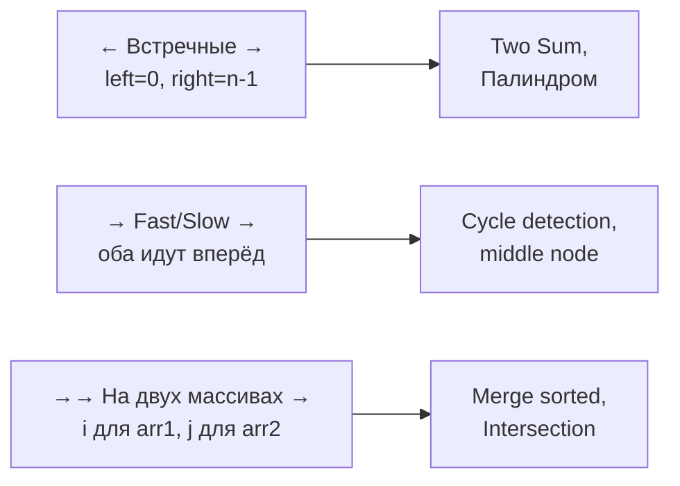

# Вопросы на собеседовании: `Two Pointers и Sliding Window`

Two Pointers и Sliding Window — два самых полезных паттерна для **снижения сложности** задач на массивах и строках. Превращают `O(n²)` или `O(n³)` в `O(n)`. Задачи: Two Sum, Container with Most Water, Longest Substring Without Repeating, Minimum Window Substring, Trapping Rain Water.

## Полезные ссылки

### Официальная документация и авторитетные источники

- [Two Pointers Pattern — Baeldung](https://www.baeldung.com/cs/two-pointer-technique)
- [Sliding Window — Baeldung](https://www.baeldung.com/cs/sliding-window-algorithm)
- [Floyd's Cycle Finding — Baeldung](https://www.baeldung.com/cs/floyds-tortoise-hare-algorithm)
- [LeetCode Top Patterns](https://leetcode.com/discuss/general-discussion/657507/sliding-window-for-beginners)

## Содержание

- [Полезные ссылки](#полезные-ссылки)
- [See also](#see-also)

**Two Pointers — базовые**
- [Q1. (!) Что такое техника Two Pointers?](#q1--что-такое-техника-two-pointers)
- [Q2. (!) Какие виды Two Pointers существуют?](#q2--какие-виды-two-pointers-существуют)
- [Q3. (!) Когда применять Two Pointers?](#q3--когда-применять-two-pointers)

**Встречные указатели**
- [Q4. (!) Two Sum в отсортированном массиве?](#q4--two-sum-в-отсортированном-массиве)
- [Q5. Как решить Three Sum (все тройки с нулевой суммой)?](#q5-как-решить-three-sum-все-тройки-с-нулевой-суммой)
- [Q6. (!) Как найти контейнер максимального объёма (Container with Most Water)?](#q6--как-найти-контейнер-максимального-объёма-container-with-most-water)
- [Q7. (!) Как посчитать объём дождевой воды (Trapping Rain Water)?](#q7--как-посчитать-объём-дождевой-воды-trapping-rain-water)
- [Q8. (!) Проверка палиндрома?](#q8--проверка-палиндрома)
- [Q9. Как развернуть строку на месте (reverse in-place)?](#q9-как-развернуть-строку-на-месте-reverse-in-place)
- [Q10. Valid Palindrome II — удалить максимум 1 символ?](#q10-valid-palindrome-ii--удалить-максимум-1-символ)

**Fast/Slow указатели**
- [Q11. (!) Floyd's cycle detection в LinkedList?](#q11--floyds-cycle-detection-в-linkedlist)
- [Q12. (!) Найти middle node за один проход?](#q12--найти-middle-node-за-один-проход)
- [Q13. (!) Удалить N-ый узел с конца?](#q13--удалить-n-ый-узел-с-конца)
- [Q14. Happy Number — есть ли цикл?](#q14-happy-number--есть-ли-цикл)
- [Q15. Как найти дубликат в массиве (Find the Duplicate Number)?](#q15-как-найти-дубликат-в-массиве-find-the-duplicate-number)

**Указатели на разных массивах**
- [Q16. (!) Как слить два отсортированных массива (merge two sorted arrays)?](#q16--как-слить-два-отсортированных-массива-merge-two-sorted-arrays)
- [Q17. Как найти пересечение двух массивов (Intersection of Two Arrays)?](#q17-как-найти-пересечение-двух-массивов-intersection-of-two-arrays)
- [Q18. Как сравнить строки с backspace (Backspace String Compare)?](#q18-как-сравнить-строки-с-backspace-backspace-string-compare)

**Sliding Window — базовые**
- [Q19. (!) Что такое Sliding Window?](#q19--что-такое-sliding-window)
- [Q20. (!) Чем отличается фиксированное и переменное окно?](#q20--чем-отличается-фиксированное-и-переменное-окно)

**Фиксированное окно**
- [Q21. (!) Как найти подмассив размера k с максимальной суммой?](#q21--как-найти-подмассив-размера-k-с-максимальной-суммой)
- [Q22. (!) Как найти максимум каждого окна (Sliding Window Maximum)?](#q22--как-найти-максимум-каждого-окна-sliding-window-maximum)
- [Q23. Как посчитать среднее всех подмассивов размера k?](#q23-как-посчитать-среднее-всех-подмассивов-размера-k)

**Переменное окно**
- [Q24. (!) Как найти длиннейшую подстроку без повторов (Longest Substring Without Repeating Characters)?](#q24--как-найти-длиннейшую-подстроку-без-повторов-longest-substring-without-repeating-characters)
- [Q25. (!) Как найти минимальное окно-подстроку (Minimum Window Substring)?](#q25--как-найти-минимальное-окно-подстроку-minimum-window-substring)
- [Q26. (!) Как найти длиннейшую подстроку с K различными символами?](#q26--как-найти-длиннейшую-подстроку-с-k-различными-символами)
- [Q27. Как найти кратчайший подмассив с суммой ≥ target (Minimum Size Subarray Sum)?](#q27-как-найти-кратчайший-подмассив-с-суммой--target-minimum-size-subarray-sum)
- [Q28. (!) Как проверить вхождение перестановки (Permutation in String)?](#q28--как-проверить-вхождение-перестановки-permutation-in-string)
- [Q29. Как найти все анаграммы в строке (Find All Anagrams in a String)?](#q29-как-найти-все-анаграммы-в-строке-find-all-anagrams-in-a-string)
- [Q30. Как решить Fruits into Baskets (не более 2 сортов в окне)?](#q30-как-решить-fruits-into-baskets-не-более-2-сортов-в-окне)

**Метакаунты и подводные камни**
- [Q31. (!) Чем Sliding Window отличается от Two Pointers?](#q31--чем-sliding-window-отличается-от-two-pointers)
- [Q32. (!) Шаблон переменного окна?](#q32--шаблон-переменного-окна)
- [Q33. Когда Sliding Window не применим?](#q33-когда-sliding-window-не-применим)

## Q1. (!) Что такое техника Two Pointers?

**Two Pointers** — это паттерн, в котором по массиву или строке движутся **два индекса** (указателя), и решение строится на их взаимном положении. Главный выигрыш: задача, которая в лоб требует перебора всех пар за `O(n²)` (два вложенных цикла), решается за один проход — `O(n)`.

**Почему это работает.** Перебор всех пар тратит время на заведомо бесполезные комбинации. Two Pointers использует структуру данных (чаще всего отсортированность), чтобы на каждом шаге **отбросить целую группу вариантов** и сдвинуть лишь один указатель в нужную сторону.

**Пример.** Ищем пару с суммой `target` в отсортированном массиве. Сумма на концах слишком мала — двигаем левый указатель вправо (увеличиваем сумму); слишком велика — двигаем правый влево. Каждый сдвиг гарантированно исключает один край из рассмотрения, поэтому хватает `O(n)` шагов вместо `O(n²)`.

**Эмпирическое правило:** если хочется написать вложенный цикл по парам индексов на отсортированных или симметричных данных — почти всегда есть вариант с двумя указателями за `O(n)`.

## Q2. (!) Какие виды Two Pointers существуют?



Различают четыре разновидности — отличаются тем, **куда и с какой скоростью движутся указатели**:

| Тип | Как движутся | Применение |
|-----|--------------|------------|
| **Встречные (opposite ends)** | `left` от начала, `right` от конца, навстречу друг другу | Two Sum sorted, Palindrome, Container |
| **Fast/Slow** | Оба от начала, но `fast` шагает быстрее `slow` | Cycle detection, middle node, removing nth |
| **На двух массивах** | По одному указателю на каждую структуру | Merge, Intersection, Backspace Compare |
| **Sliding Window** | `left` и `right` на одном массиве, оба вправо | Подмассив или подстрока с условием |

Тип выбирается по форме задачи: симметрия и пары → встречные; циклы и «середина» в списке → fast/slow; объединение двух последовательностей → два массива; непрерывный сегмент с условием → окно.

## Q3. (!) Когда применять Two Pointers?

Two Pointers подходит, когда в данных есть **порядок или структура, позволяющая на каждом шаге однозначно решить, какой указатель двигать**. Это и есть главный сигнал.

**Признаки, что паттерн зайдёт:**
- Массив **отсортирован** (для встречных указателей сортировка — почти обязательное условие)
- Нужно найти пару / тройку / группу элементов с условием на сумму
- Задача про палиндромы или реверс — естественная симметрия «с двух концов»
- Задачи на linked list: поиск цикла, середины, N-го узла с конца (fast/slow)
- Слияние или сравнение двух последовательностей

**Когда паттерн НЕ подходит:**
- Нужен **произвольный доступ** к позициям, не связанным порядком, — тогда быстрее HashMap (за `O(1)` на запрос), а не движение указателей.
- Условие зависит от **глобального** состояния (например, от элементов вне рассматриваемого участка), а не от локального положения указателей — нет правила, по которому двигать указатель.

**Суть:** если непонятно, какой из двух указателей сдвинуть на текущем шаге, — Two Pointers, скорее всего, не ваш инструмент.

## Q4. (!) Two Sum в отсортированном массиве?

**Задача:** в отсортированном массиве найти два элемента, дающие в сумме `target`.

**Идея.** Ставим указатели на концы и смотрим на сумму краёв. Так как массив отсортирован, поведение предсказуемо: сумма мала — двигаем `left` вправо (единственный способ её увеличить); сумма велика — двигаем `right` влево. Каждый шаг отбрасывает один край, поэтому хватает одного прохода.

```java
int[] twoSumSorted(int[] arr, int target) {
    int left = 0, right = arr.length - 1;
    while (left < right) {
        int sum = arr[left] + arr[right];
        if (sum == target) return new int[]{left, right};
        if (sum < target) left++;
        else              right--;
    }
    return new int[]{-1, -1};
}
```

**Сложность:** `O(n)` время, `O(1)` память. Если массив не отсортирован, сортировать ради этого не нужно — есть вариант через `HashMap` за `O(n)` время и `O(n)` память.

## Q5. Как решить Three Sum (все тройки с нулевой суммой)?

**Задача:** найти все уникальные тройки элементов с нулевой суммой.

**Идея.** Сводим Three Sum к Two Sum: сортируем массив, фиксируем первый элемент `arr[i]`, а оставшуюся пару ищем встречными указателями на хвосте. Получается внешний цикл по `i` плюс линейный проход указателями — `O(n²)` вместо наивного `O(n³)`.

**Подводный камень — дубликаты.** Без пропуска повторов одна и та же тройка попадёт в ответ несколько раз. Поэтому скипаем повторяющиеся значения и для `i`, и для `left`/`right` после найденной тройки — это критичная деталь, на которой чаще всего срезаются.

```java
List<List<Integer>> threeSum(int[] arr) {
    Arrays.sort(arr);
    List<List<Integer>> result = new ArrayList<>();
    for (int i = 0; i < arr.length - 2; i++) {
        if (i > 0 && arr[i] == arr[i - 1]) continue;
        int left = i + 1, right = arr.length - 1;
        while (left < right) {
            int sum = arr[i] + arr[left] + arr[right];
            if (sum == 0) {
                result.add(List.of(arr[i], arr[left], arr[right]));
                while (left < right && arr[left] == arr[left + 1]) left++;
                while (left < right && arr[right] == arr[right - 1]) right--;
                left++; right--;
            } else if (sum < 0) left++;
            else                 right--;
        }
    }
    return result;
}
```

**Сложность:** `O(n²)` время (сортировка `O(n log n)` поглощается).

## Q6. (!) Как найти контейнер максимального объёма (Container with Most Water)?

**Задача:** массив высот — выбрать две линии, образующие «контейнер» максимального объёма. Площадь между линиями `i` и `j` равна `min(h[i], h[j]) * (j - i)`: высоту ограничивает меньшая стенка, ширину — расстояние между ними.

**Идея.** Стартуем с самого широкого контейнера (концы массива) и сжимаем его. На каждом шаге двигаем указатель **меньшей** стенки внутрь. Почему именно меньший: площадь ограничена меньшей высотой, поэтому сдвиг бо́льшей стенки только уменьшит ширину, не подняв потолок, — улучшения быть не может. А вот меньшая стенка теоретически может смениться на более высокую и дать выигрыш.

```java
int maxArea(int[] heights) {
    int left = 0, right = heights.length - 1;
    int max = 0;
    while (left < right) {
        int area = Math.min(heights[left], heights[right]) * (right - left);
        max = Math.max(max, area);
        // Двигаем меньший — больший не может улучшить площадь
        if (heights[left] < heights[right]) left++;
        else                                  right--;
    }
    return max;
}
```

**Сложность:** `O(n)` время, `O(1)` память — один проход встречными указателями.

## Q7. (!) Как посчитать объём дождевой воды (Trapping Rain Water)?

**Задача:** дан профиль высот столбиков — сколько воды задержится между ними после дождя.

**Ключевая идея.** Над каждым столбиком уровень воды равен `min(максимум слева, максимум справа)`. Чтобы не считать оба максимума заранее, идём встречными указателями и **всегда обрабатываем меньшую сторону**: если, скажем, `height[left] < height[right]`, то справа точно есть стенка не ниже `height[right]`, а значит для левой позиции ограничивающим является именно `leftMax` — правый максимум заведомо больше и на результат не влияет. Это и позволяет решить задачу за один проход без массивов префиксных максимумов.

```java
int trap(int[] height) {
    int left = 0, right = height.length - 1;
    int leftMax = 0, rightMax = 0, total = 0;

    while (left < right) {
        if (height[left] < height[right]) {
            if (height[left] >= leftMax) leftMax = height[left];
            else                          total += leftMax - height[left];
            left++;
        } else {
            if (height[right] >= rightMax) rightMax = height[right];
            else                            total += rightMax - height[right];
            right--;
        }
    }
    return total;
}
```

**Сложность:** `O(n)` время, `O(1)` память.

**Компромисс с DP-решением.** Можно заранее построить массивы `leftMax[i]` и `rightMax[i]` и просуммировать `min(leftMax[i], rightMax[i]) - height[i]`. Логика прозрачнее, но это `O(n)` дополнительной памяти. Вариант с двумя указателями даёт ту же `O(n)` по времени при `O(1)` памяти.

## Q8. (!) Проверка палиндрома?

**Задача:** проверить, читается ли строка одинаково слева направо и справа налево.

**Идея.** Палиндром симметричен относительно центра, поэтому сравниваем пары «крайний слева — крайний справа», двигаясь к середине. Первое же несовпадение означает, что строка не палиндром. В «LeetCode-варианте» добавляется типичный нюанс: учитываются только буквы и цифры, регистр игнорируется — поэтому внутренние циклы пропускают «мусорные» символы, прежде чем сравнивать.

```java
boolean isPalindrome(String s) {
    int left = 0, right = s.length() - 1;
    while (left < right) {
        if (s.charAt(left) != s.charAt(right)) return false;
        left++; right--;
    }
    return true;
}

// LeetCode-вариант: только alphanumeric, ignore case
boolean isPalindromeLeet(String s) {
    int left = 0, right = s.length() - 1;
    while (left < right) {
        while (left < right && !Character.isLetterOrDigit(s.charAt(left))) left++;
        while (left < right && !Character.isLetterOrDigit(s.charAt(right))) right--;
        if (Character.toLowerCase(s.charAt(left)) !=
            Character.toLowerCase(s.charAt(right))) return false;
        left++; right--;
    }
    return true;
}
```

**Сложность:** `O(n)` время, `O(1)` память.

## Q9. Как развернуть строку на месте (reverse in-place)?

**Задача:** развернуть массив символов на месте, без выделения нового массива.

**Идея.** Меняем местами крайний левый и крайний правый символы, затем сдвигаем оба указателя к центру. К моменту встречи указателей все пары переставлены. Память — `O(1)`, потому что переворот идёт прямо в исходном массиве.

```java
void reverseString(char[] s) {
    int left = 0, right = s.length - 1;
    while (left < right) {
        char tmp = s[left]; s[left++] = s[right]; s[right--] = tmp;
    }
}
```

**Сложность:** `O(n)` время, `O(1)` память.

## Q10. Valid Palindrome II — удалить максимум 1 символ?

**Задача:** можно удалить не более одного символа — способна ли строка после этого стать палиндромом.

**Идея.** Идём встречными указателями, как при обычной проверке палиндрома. Пока символы совпадают — всё хорошо. На **первом** несовпадении используем единственное разрешённое удаление: пробуем выбросить либо левый символ, либо правый и проверяем, что один из двух оставшихся отрезков — палиндром. Если оба варианта проваливаются, одного удаления не хватит. Развилка возникает один раз, поэтому общее время остаётся линейным.

```java
boolean validPalindrome(String s) {
    int left = 0, right = s.length() - 1;
    while (left < right) {
        if (s.charAt(left) != s.charAt(right)) {
            return isPalindrome(s, left + 1, right) || isPalindrome(s, left, right - 1);
        }
        left++; right--;
    }
    return true;
}

boolean isPalindrome(String s, int l, int r) {
    while (l < r) {
        if (s.charAt(l++) != s.charAt(r--)) return false;
    }
    return true;
}
```

**Сложность:** `O(n)` время, `O(1)` память.

## Q11. (!) Floyd's cycle detection в LinkedList?

**Задача:** определить, есть ли в связном списке цикл, не используя дополнительную память.

**Идея (tortoise and hare).** Пускаем два указателя: `slow` шагает по одному узлу, `fast` — по два. Если списком цикла нет, `fast` дойдёт до конца (`null`). Если цикл есть, `fast` войдёт в петлю первым и начнёт «нагонять» `slow` сзади, сокращая разрыв на один узел за шаг, — встреча неизбежна. Сам факт встречи `slow == fast` и означает наличие цикла.

```java
boolean hasCycle(ListNode head) {
    ListNode slow = head, fast = head;
    while (fast != null && fast.next != null) {
        slow = slow.next;
        fast = fast.next.next;
        if (slow == fast) return true;
    }
    return false;
}
```

**Сложность:** `O(n)` время, `O(1)` память. Альтернатива «в лоб» — складывать узлы в `HashSet<ListNode>` и ловить повтор, но это уже `O(n)` памяти.

Подробнее — в [Связные списки](../data-structures/linked-lists-interview.md).

## Q12. (!) Найти middle node за один проход?

**Задача:** найти средний узел списка, не зная заранее его длины и не проходя список дважды.

**Идея.** Тот же приём fast/slow: `fast` идёт вдвое быстрее `slow`. Когда `fast` упирается в конец, он прошёл весь список, а `slow` — ровно его половину, то есть стоит на середине. Это экономит один проход по сравнению с наивным «сначала посчитать длину, потом дойти до `len/2`».

```java
ListNode middleNode(ListNode head) {
    ListNode slow = head, fast = head;
    while (fast != null && fast.next != null) {
        slow = slow.next;
        fast = fast.next.next;
    }
    return slow;
}
```

**Нюанс:** при чётном числе узлов метод вернёт **второй** из двух центральных (так как `slow` делает лишний шаг). Если нужен первый средний — условие цикла меняют на проверку `fast.next.next`.

## Q13. (!) Удалить N-ый узел с конца?

**Задача:** удалить N-й узел, считая от конца списка, за один проход.

**Идея — разрыв в N узлов между указателями.** Сначала уводим `fast` на `n+1` шагов вперёд. Теперь между `fast` и `slow` ровно `n+1` узлов. Дальше двигаем оба синхронно: когда `fast` достигнет конца (`null`), `slow` окажется **прямо перед** удаляемым узлом, и его можно «перепрыгнуть» через `slow.next = slow.next.next`. Фиктивный `dummy`-узел перед головой нужен, чтобы корректно обработать удаление самой головы списка.

```java
ListNode removeNthFromEnd(ListNode head, int n) {
    ListNode dummy = new ListNode(0, head);
    ListNode slow = dummy, fast = dummy;
    for (int i = 0; i <= n; i++) fast = fast.next;
    while (fast != null) {
        slow = slow.next;
        fast = fast.next;
    }
    slow.next = slow.next.next;
    return dummy.next;
}
```

**Сложность:** `O(n)` время, `O(1)` память — ровно один проход.

## Q14. Happy Number — есть ли цикл?

**Задача:** число «счастливое», если последовательность «сумма квадратов цифр → снова сумма квадратов цифр → …» в итоге приходит к 1. Если нет — она зацикливается, не достигая 1.

**Идея.** Это та же задача про цикл, что и для linked list, только «следующий узел» вычисляется функцией `sumSquares`. Применяем Floyd: `slow` делает один шаг последовательности, `fast` — два. Если оба сошлись на 1 — число счастливое; если встретились на другом значении — попали в цикл, и единицы не будет. Это позволяет обойтись без `HashSet` для хранения уже встреченных чисел.

```java
boolean isHappy(int n) {
    int slow = n, fast = n;
    do {
        slow = sumSquares(slow);
        fast = sumSquares(sumSquares(fast));
    } while (slow != fast);
    return slow == 1;
}

int sumSquares(int n) {
    int sum = 0;
    while (n > 0) {
        int d = n % 10;
        sum += d * d;
        n /= 10;
    }
    return sum;
}
```

**Главный вывод:** Floyd работает не только со связными списками — его можно применить к любой **детерминированной последовательности** `x → f(x)`, даже если никакой явной структуры в памяти нет. Стоимость одного шага здесь — `O(log n)` (перебор цифр числа).

## Q15. Как найти дубликат в массиве (Find the Duplicate Number)?

**Задача:** в массиве из `n+1` целых в диапазоне от 1 до `n` найти дубликат за `O(n)`, не меняя массив и без дополнительной памяти.

**Идея — превратить массив в связный список.** Считаем, что из позиции `i` ведёт «ссылка» на позицию `nums[i]`. Поскольку значения лежат в диапазоне индексов, по этим ссылкам можно ходить, как по списку. Если есть дубликат, две разные позиции указывают на одну и ту же — это создаёт **цикл**, а вход в цикл соответствует дублирующемуся значению. Дальше — стандартный Floyd: первая фаза находит точку встречи внутри цикла, вторая (запуск `slow` из начала) — вход в цикл, то есть искомый дубликат.

```java
int findDuplicate(int[] nums) {
    int slow = nums[0], fast = nums[0];
    do {
        slow = nums[slow];
        fast = nums[nums[fast]];
    } while (slow != fast);

    slow = nums[0];
    while (slow != fast) {
        slow = nums[slow];
        fast = nums[fast];
    }
    return slow;
}
```

**Сложность:** `O(n)` время, `O(1)` память. Массив не модифицируется — это ключевое требование задачи, которое и отсекает «простые» решения (сортировку, пометку посещённых, hash-set).

## Q16. (!) Как слить два отсортированных массива (merge two sorted arrays)?

**Задача:** слить два отсортированных массива в один отсортированный.

**Идея.** Держим по указателю на каждом массиве и на каждом шаге переносим в результат **меньший** из текущих элементов, сдвигая соответствующий указатель. Когда один массив заканчивается, остаток второго копируется как есть — он уже отсортирован. Это шаг слияния, лежащий в основе Merge Sort.

```java
int[] merge(int[] a, int[] b) {
    int[] result = new int[a.length + b.length];
    int i = 0, j = 0, k = 0;
    while (i < a.length && j < b.length) {
        if (a[i] <= b[j]) result[k++] = a[i++];
        else               result[k++] = b[j++];
    }
    while (i < a.length) result[k++] = a[i++];
    while (j < b.length) result[k++] = b[j++];
    return result;
}
```

**Сложность:** `O(n + m)` время — каждый элемент посещается один раз.

## Q17. Как найти пересечение двух массивов (Intersection of Two Arrays)?

**Задача:** найти пересечение двух массивов (общие элементы).

**Идея.** Сортируем оба массива и идём двумя указателями: равные элементы добавляем в ответ и сдвигаем оба указателя; иначе сдвигаем тот, что указывает на **меньший** элемент, — он точно не встретится дальше. После сортировки совпадения «выстраиваются» напротив друг друга, и хватает одного прохода.

**Компромисс.** Доминирует стоимость сортировки — `O(n log n + m log m)`. Если сортировать нельзя или массивы уже разной природы, быстрее HashMap: `O(n + m)` по времени ценой `O(n)` памяти.

```java
int[] intersect(int[] nums1, int[] nums2) {
    Arrays.sort(nums1);
    Arrays.sort(nums2);
    List<Integer> result = new ArrayList<>();
    int i = 0, j = 0;
    while (i < nums1.length && j < nums2.length) {
        if (nums1[i] == nums2[j]) {
            result.add(nums1[i]);
            i++; j++;
        } else if (nums1[i] < nums2[j]) i++;
        else                              j++;
    }
    return result.stream().mapToInt(Integer::intValue).toArray();
}
```

## Q18. Как сравнить строки с backspace (Backspace String Compare)?

**Задача:** символ `#` означает backspace (удаляет предыдущий введённый символ). Нужно сравнить, какие итоговые строки получатся.

**Идея — идти с конца.** Если читать слева направо, заранее непонятно, какие символы будут стёрты будущими `#`. А вот при движении **справа налево** всё определённо: встретив `#`, увеличиваем счётчик «сколько символов впереди надо пропустить», а обычный символ либо «съедается» этим счётчиком, либо является значимым. Сравнивая значимые символы обеих строк попарно, обходимся `O(1)` памяти — без перестроения строк.

```java
boolean backspaceCompare(String s, String t) {
    int i = s.length() - 1, j = t.length() - 1;
    while (i >= 0 || j >= 0) {
        i = nextValidChar(s, i);
        j = nextValidChar(t, j);
        if (i < 0 && j < 0) return true;
        if (i < 0 || j < 0) return false;
        if (s.charAt(i) != t.charAt(j)) return false;
        i--; j--;
    }
    return true;
}

int nextValidChar(String s, int i) {
    int skip = 0;
    while (i >= 0) {
        if (s.charAt(i) == '#') { skip++; i--; }
        else if (skip > 0) { skip--; i--; }
        else return i;
    }
    return -1;
}
```

**Сложность:** `O(n + m)` время, `O(1)` память.

## Q19. (!) Что такое Sliding Window?

**Sliding Window** — техника для задач на **непрерывные подмассивы или подстроки**: по данным «скользит» окно (отрезок), а ответ накапливается по ходу движения. Размер окна бывает фиксированным или переменным.

**Почему быстро.** Наивный подход пересчитывает каждый отрезок с нуля — отсюда `O(n²)` или `O(n³)`. Sliding Window использует то, что соседние окна **почти совпадают**: при сдвиге достаточно добавить элемент, вошедший справа, и убрать вышедший слева. Каждое такое обновление — `O(1)`, поэтому весь обход укладывается в `O(n)`.

**Суть в одной фразе:** не пересчитываем окно заново, а инкрементально поддерживаем его состояние при сдвиге.

## Q20. (!) Чем отличается фиксированное и переменное окно?

Разница в том, **что управляет границами окна**: внешний параметр или условие на содержимое.

**Фиксированное окно** — размер задан заранее (например, длина `k`). Один указатель тащит окно вперёд на одну позицию за шаг: добавляем новый элемент справа, убираем выпавший слева. Применяется, когда в задаче явно фигурирует число `k` («подмассивы размера `k`»).

```java
// Шаблон фиксированного окна
int sum = 0;
for (int i = 0; i < k; i++) sum += arr[i]; // первое окно
int max = sum;
for (int i = k; i < arr.length; i++) {
    sum += arr[i] - arr[i - k]; // sliding step: O(1)
    max = Math.max(max, sum);
}
```

**Переменное окно** — размер заранее неизвестен и меняется по условию (например, «самая длинная подстрока без повторов»). Здесь два независимых указателя: `right` расширяет окно, `left` сжимает его, пока окно не станет снова валидным. Применяется, когда ищем самый длинный/короткий отрезок, удовлетворяющий какому-то свойству.

```java
// Шаблон переменного окна
int left = 0;
for (int right = 0; right < arr.length; right++) {
    addToWindow(arr[right]);
    while (windowInvalid()) {
        removeFromWindow(arr[left]);
        left++;
    }
    updateAnswer(right - left + 1);
}
```

## Q21. (!) Как найти подмассив размера k с максимальной суммой?

**Задача:** найти максимальную сумму среди всех подмассивов фиксированной длины `k`.

**Идея.** Считаем сумму первого окна напрямую, а дальше для каждого следующего окна не суммируем заново все `k` элементов, а корректируем сумму за `O(1)`: прибавляем вошедший справа `arr[i]` и вычитаем выпавший слева `arr[i - k]`. Это канонический пример выигрыша фиксированного окна.

```java
int maxSumFixed(int[] arr, int k) {
    int sum = 0;
    for (int i = 0; i < k; i++) sum += arr[i];
    int max = sum;
    for (int i = k; i < arr.length; i++) {
        sum += arr[i] - arr[i - k];
        max = Math.max(max, sum);
    }
    return max;
}
```

**Сложность:** `O(n)` время, `O(1)` память. Наивный пересчёт каждого окна — `O(n · k)`.

## Q22. (!) Как найти максимум каждого окна (Sliding Window Maximum)?

**Задача:** для каждого окна размера `k` вернуть его максимум.

**Почему наивно не получается.** Для суммы есть трюк «прибавил-вычел», а для максимума нет: если из окна выпал именно максимальный элемент, новый максимум придётся искать заново. Поэтому нужна структура, помнящая «кандидатов на максимум».

**Идея — монотонный deque.** Храним в дэке **индексы** так, чтобы соответствующие значения убывали от головы к хвосту. Тогда максимум окна всегда в голове. На каждом шаге: (1) выбрасываем из головы индексы, вышедшие за левую границу окна; (2) выбрасываем из хвоста все индексы с меньшими значениями, чем текущий, — они больше никогда не станут максимумом, ведь текущий элемент и новее, и больше. Каждый индекс добавляется и удаляется ровно один раз, отсюда амортизированное `O(n)`.

```java
int[] maxSlidingWindow(int[] nums, int k) {
    int[] result = new int[nums.length - k + 1];
    Deque<Integer> deque = new ArrayDeque<>(); // monotonic decreasing — индексы

    for (int i = 0; i < nums.length; i++) {
        // 1. Убираем индексы вне окна
        if (!deque.isEmpty() && deque.peekFirst() <= i - k) deque.pollFirst();
        // 2. Убираем меньшие с конца
        while (!deque.isEmpty() && nums[deque.peekLast()] <= nums[i]) deque.pollLast();
        deque.offerLast(i);
        // 3. Записываем максимум, если окно полное
        if (i >= k - 1) result[i - k + 1] = nums[deque.peekFirst()];
    }
    return result;
}
```

**Сложность:** `O(n)` амортизированно, `O(k)` памяти на deque.

**Компромисс.** Можно обойтись `PriorityQueue` (max-heap) с ленивым удалением — проще в реализации, но `O(n log k)` по времени. Монотонный deque быстрее именно потому, что отбрасывает заведомо «мёртвых» кандидатов сразу, а не хранит их в куче.

## Q23. Как посчитать среднее всех подмассивов размера k?

**Задача:** вернуть средние значения всех подмассивов длины `k`.

**Идея.** Полный аналог задачи о максимальной сумме (Q21): поддерживаем бегущую сумму окна за `O(1)` на сдвиг, а среднее получаем делением на `k`. Никакой дополнительной структуры не нужно.

```java
double[] averages(int[] arr, int k) {
    double[] result = new double[arr.length - k + 1];
    double sum = 0;
    for (int i = 0; i < k; i++) sum += arr[i];
    result[0] = sum / k;
    for (int i = k; i < arr.length; i++) {
        sum += arr[i] - arr[i - k];
        result[i - k + 1] = sum / k;
    }
    return result;
}
```

**Сложность:** `O(n)` время, `O(n - k + 1)` памяти под массив результатов.

## Q24. (!) Как найти длиннейшую подстроку без повторов (Longest Substring Without Repeating Characters)?

**Задача:** найти длину самой длинной подстроки без повторяющихся символов.

**Идея — переменное окно.** Указатель `right` расширяет окно вправо. Как только встречаем символ, который уже есть в окне, нарушается инвариант «без повторов» — сдвигаем `left` сразу за прошлое вхождение этого символа, моментально восстанавливая валидность. `HashMap` хранит **последнюю** позицию каждого символа, поэтому «прыжок» `left` делается за `O(1)`, а не посимвольным сжатием. Проверка `lastSeen.get(c) >= left` важна: она отсекает старые вхождения, которые уже выпали из окна.

```java
int lengthOfLongestSubstring(String s) {
    Map<Character, Integer> lastSeen = new HashMap<>();
    int maxLen = 0, left = 0;

    for (int right = 0; right < s.length(); right++) {
        char c = s.charAt(right);
        if (lastSeen.containsKey(c) && lastSeen.get(c) >= left) {
            left = lastSeen.get(c) + 1;
        }
        lastSeen.put(c, right);
        maxLen = Math.max(maxLen, right - left + 1);
    }
    return maxLen;
}
```

**Сложность:** `O(n)` время, `O(min(n, alphabet))` память — в окне не больше символов, чем в алфавите.

## Q25. (!) Как найти минимальное окно-подстроку (Minimum Window Substring)?

**Задача:** найти минимальную по длине подстроку `s`, содержащую все символы `t` (с учётом кратностей).

**Идея — расширяем, затем максимально сжимаем.** `right` расширяет окно, пока оно не «накроет» все нужные символы. Как только окно валидно, начинаем сдвигать `left`, ужимая окно до тех пор, пока валидность не потеряется, — и на каждом шаге сжатия пробуем обновить минимум. Так для каждого правого конца находим самое короткое подходящее окно.

**Зачем счётчик `formed`.** Чтобы не сравнивать две хэш-карты целиком на каждом шаге, ведём счётчик «сколько различных нужных символов уже набрано в нужном количестве». Окно валидно ровно когда `formed == required`. Это и держит общую сложность линейной.

```java
String minWindow(String s, String t) {
    if (s.length() < t.length()) return "";
    Map<Character, Integer> need = new HashMap<>();
    for (char c : t.toCharArray()) need.merge(c, 1, Integer::sum);

    int required = need.size();
    int formed = 0;
    Map<Character, Integer> windowCount = new HashMap<>();
    int left = 0, minLen = Integer.MAX_VALUE, minLeft = 0;

    for (int right = 0; right < s.length(); right++) {
        char c = s.charAt(right);
        windowCount.merge(c, 1, Integer::sum);
        if (need.containsKey(c) && windowCount.get(c).intValue() == need.get(c).intValue()) {
            formed++;
        }

        while (formed == required) {
            if (right - left + 1 < minLen) {
                minLen = right - left + 1;
                minLeft = left;
            }
            char l = s.charAt(left);
            windowCount.merge(l, -1, Integer::sum);
            if (need.containsKey(l) && windowCount.get(l) < need.get(l)) {
                formed--;
            }
            left++;
        }
    }
    return minLen == Integer.MAX_VALUE ? "" : s.substring(minLeft, minLeft + minLen);
}
```

**Сложность:** `O(n)` время, `O(alphabet)` память. Классическая «hard»-задача и эталон шаблона «расширил → сжал».

## Q26. (!) Как найти длиннейшую подстроку с K различными символами?

**Задача:** найти длину самой длинной подстроки, содержащей не более `k` различных символов.

**Идея.** Расширяем окно вправо и считаем символы в `HashMap`. Инвариант — «не больше `k` ключей в карте». Как только различных символов стало `> k`, сжимаем слева: уменьшаем счётчик `arr[left]` и, если он обнулился, удаляем ключ — именно удаление ключа возвращает размер карты в пределы `k`. Длину валидного окна `right - left + 1` сравниваем с максимумом.

```java
int lengthOfLongestSubstringKDistinct(String s, int k) {
    Map<Character, Integer> count = new HashMap<>();
    int left = 0, max = 0;

    for (int right = 0; right < s.length(); right++) {
        count.merge(s.charAt(right), 1, Integer::sum);
        while (count.size() > k) {
            char l = s.charAt(left);
            count.merge(l, -1, Integer::sum);
            if (count.get(l) == 0) count.remove(l);
            left++;
        }
        max = Math.max(max, right - left + 1);
    }
    return max;
}
```

**Сложность:** `O(n)` время, `O(k)` память — в карте максимум `k+1` ключей.

## Q27. Как найти кратчайший подмассив с суммой ≥ target (Minimum Size Subarray Sum)?

**Задача:** найти минимальную длину непрерывного подмассива, сумма которого ≥ `target`.

**Идея.** Расширяем окно, накапливая сумму. Как только сумма дотянула до `target`, пробуем **сократить** окно слева — пока условие держится, обновляем минимум и вычитаем `nums[left]`. Это работает, потому что числа неотрицательные: расширение только увеличивает сумму, сжатие — только уменьшает, то есть условие монотонно (см. ограничение в Q33).

```java
int minSubArrayLen(int target, int[] nums) {
    int left = 0, sum = 0, minLen = Integer.MAX_VALUE;
    for (int right = 0; right < nums.length; right++) {
        sum += nums[right];
        while (sum >= target) {
            minLen = Math.min(minLen, right - left + 1);
            sum -= nums[left++];
        }
    }
    return minLen == Integer.MAX_VALUE ? 0 : minLen;
}
```

**Сложность:** `O(n)` время, `O(1)` память.

## Q28. (!) Как проверить вхождение перестановки (Permutation in String)?

**Задача:** содержит ли `s2` хотя бы одну перестановку строки `s1` как непрерывную подстроку.

**Идея.** Перестановка `s1` — это любая подстрока той же длины с тем же набором символов (теми же частотами). Поэтому ведём окно **фиксированной** длины `s1.length()` и сравниваем частоты символов окна с частотами `s1`. Частоты удобно держать в массивах из 26 счётчиков: при сдвиге окна один символ входит (`window[...]++`), один выходит (`window[...]--`). Совпадение `need` и `window` означает, что нужная перестановка найдена.

```java
boolean checkInclusion(String s1, String s2) {
    if (s1.length() > s2.length()) return false;
    int[] need = new int[26];
    int[] window = new int[26];
    for (char c : s1.toCharArray()) need[c - 'a']++;

    for (int i = 0; i < s2.length(); i++) {
        window[s2.charAt(i) - 'a']++;
        if (i >= s1.length()) window[s2.charAt(i - s1.length()) - 'a']--;
        if (Arrays.equals(need, window)) return true;
    }
    return false;
}
```

**Сложность:** окно фиксированной длины `s1.length()`, `Arrays.equals` по 26 ячейкам — `O(n · 26) = O(n)`.

## Q29. Как найти все анаграммы в строке (Find All Anagrams in a String)?

**Задача:** вернуть все стартовые индексы подстрок `s`, являющихся анаграммами `p`.

**Идея.** По сути та же задача, что и Permutation in String (Q28): анаграмма `p` — это окно длины `p.length()` с теми же частотами символов. Отличие лишь в том, что мы не останавливаемся на первом совпадении, а собираем **все** позиции, где частоты окна совпали с частотами `p`.

```java
List<Integer> findAnagrams(String s, String p) {
    List<Integer> result = new ArrayList<>();
    if (s.length() < p.length()) return result;
    int[] need = new int[26];
    int[] window = new int[26];
    for (char c : p.toCharArray()) need[c - 'a']++;

    for (int i = 0; i < s.length(); i++) {
        window[s.charAt(i) - 'a']++;
        if (i >= p.length()) window[s.charAt(i - p.length()) - 'a']--;
        if (Arrays.equals(need, window)) result.add(i - p.length() + 1);
    }
    return result;
}
```

**Сложность:** `O(n)` время, `O(1)` память (массивы из 26 счётчиков).

## Q30. Как решить Fruits into Baskets (не более 2 сортов в окне)?

**Задача:** дан ряд деревьев с фруктами; имея две корзины (каждая под один сорт), собрать максимально длинный непрерывный участок. По сути — найти длиннейший подмассив, в котором **не более 2 различных** значений.

**Идея.** Это частный случай Q26 при `k = 2`: переменное окно, в котором держим не больше двух различных значений. Расширяем `right`, а при появлении третьего сорта сжимаем `left`, пока различных значений снова не станет два.

```java
int totalFruit(int[] fruits) {
    Map<Integer, Integer> count = new HashMap<>();
    int left = 0, max = 0;
    for (int right = 0; right < fruits.length; right++) {
        count.merge(fruits[right], 1, Integer::sum);
        while (count.size() > 2) {
            count.merge(fruits[left], -1, Integer::sum);
            if (count.get(fruits[left]) == 0) count.remove(fruits[left]);
            left++;
        }
        max = Math.max(max, right - left + 1);
    }
    return max;
}
```

**Сложность:** `O(n)` время, `O(1)` память. Полностью повторяет шаблон Longest Substring with K Distinct при `k = 2`.

## Q31. (!) Чем Sliding Window отличается от Two Pointers?

**Главное:** Sliding Window — это **частный случай** Two Pointers, в котором оба указателя движутся в одну сторону (вперёд) и всегда ограничивают непрерывный сегмент массива. Two Pointers — понятие шире: указатели могут идти и навстречу, и с разной скоростью, и по разным структурам.

| Two Pointers | Sliding Window |
|--------------|----------------|
| Указатели могут идти навстречу | Оба идут вперёд |
| Часто требует отсортированный массив | Сортировка не нужна |
| Условие обычно на пару элементов (Two Sum) | Условие на весь подмассив/подстроку |
| Не всегда образует «окно» | Всегда непрерывный сегмент |

Кратко: Sliding Window — это вариант «`left` и `right`, оба движутся вправо» из семейства Two Pointers.

## Q32. (!) Шаблон переменного окна?

Почти все задачи на переменное окно сводятся к одной структуре из трёх шагов внутри цикла по `right`: **добавить** новый элемент в состояние окна → пока окно невалидно, **сжимать** слева (`left++`) → **обновить** ответ. Меняется только наполнение `add`, `remove`, `isValid` и формула ответа — каркас остаётся прежним. Запомнив его, вы решаете весь класс задач (Q24–Q30) по одной схеме.

```java
int slidingWindow(int[] arr, ...) {
    int left = 0;
    int answer = 0; // или Integer.MAX_VALUE для min
    State state = new State();

    for (int right = 0; right < arr.length; right++) {
        state.add(arr[right]);

        // Сжимаем окно, пока оно невалидно (для max — пока валидно для последнего шага)
        while (!isValid(state)) {
            state.remove(arr[left]);
            left++;
        }

        // Обновляем ответ
        answer = Math.max(answer, right - left + 1);
    }
    return answer;
}
```

**Запомните этот каркас** — под него подгоняется любая задача на переменное окно, отличается лишь содержимое `state`, `isValid` и формула обновления ответа.

## Q33. Когда Sliding Window не применим?

Sliding Window корректен только при **монотонности**: расширение окна должно менять «годность» в одну сторону, а сжатие — в обратную. Если этого свойства нет, метод даёт неверный ответ. Признаки, что окно не подойдёт:

1. **Условие зависит от глобального состояния**, а не от содержимого окна (например, от суммы элементов *вне* окна) — двигать `left`/`right` по локальному правилу нельзя.
2. **Отрицательные числа** в задаче «минимальная длина с суммой ≥ target»: добавление элемента может уменьшить сумму, монотонность ломается, и окно начинает «прыгать».
3. **Несвязные подмножества** — окно работает только с **непрерывными** сегментами; если ответ может состоять из разрозненных элементов, это не его задача.
4. **Нет монотонности** «расширил → улучшилось / сжал → ухудшилось» (или наоборот) — без неё нельзя однозначно решить, какую границу двигать.

**Чем заменить:** при отсутствии монотонности обычно помогают prefix sums + HashMap (для сумм с отрицательными числами), segment tree или динамическое программирование.

## See also

- [Алгоритмы (обзор)](../algorithms-interview.md) — карта алгоритмических тем
- [Массивы и строки](../data-structures/arrays-strings-interview.md) — основа для большинства задач
- [Связные списки](../data-structures/linked-lists-interview.md) — Floyd cycle detection
- [Хеш-таблицы](../data-structures/hash-tables-interview.md) — для подсчёта в окне
- [Стеки и очереди](../data-structures/stacks-queues-interview.md) — monotonic deque в Sliding Window Max
- [Алгоритмы поиска](../sorting-searching/searching-algorithms-interview.md) — родственная техника
- [Алгоритмы сортировки](../sorting-searching/sorting-algorithms-interview.md) — Two Pointers в merge
- [DP](dynamic-programming-interview.md) — иногда альтернатива
- [Рекурсия](recursion-interview.md) — итеративная альтернатива
- [Анализ сложности](../complexity/complexity-analysis-interview.md) — снижение O(n²) → O(n)

- [Divide and Conquer](divide-and-conquer-interview.md)
- [Динамическое программирование](dynamic-programming-interview.md)
- [Жадные алгоритмы (Greedy)](greedy-algorithms-interview.md)
- [Рекурсия](recursion-interview.md)
- [Алгоритмы (обзор)](../algorithms-interview.md)
