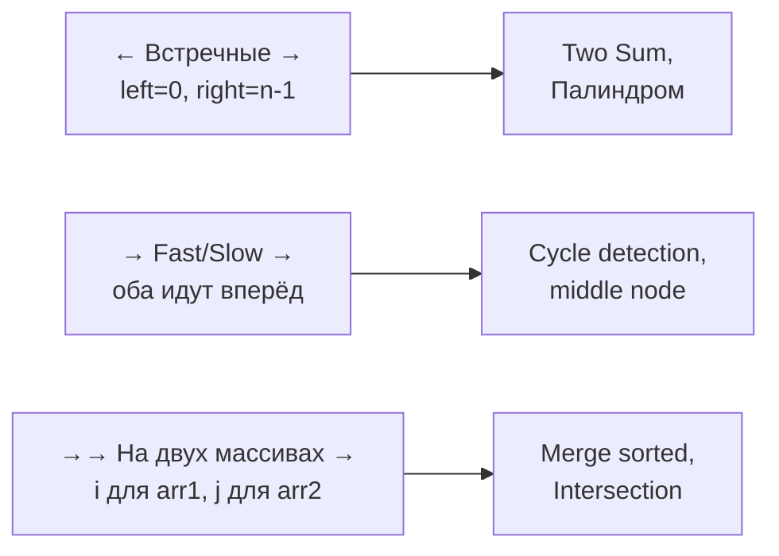

# Вопросы на собеседовании: `Two Pointers и Sliding Window`

Two Pointers и Sliding Window — два самых полезных паттерна для **снижения сложности** задач на массивах и строках. Превращают `O(n²)` или `O(n³)` в `O(n)`. Задачи: Two Sum, Container with Most Water, Longest Substring Without Repeating, Minimum Window Substring, Trapping Rain Water.

## Полезные ссылки

### Официальная документация и авторитетные источники

- [Two Pointers Pattern — Baeldung](https://www.baeldung.com/cs/two-pointer-technique)
- [Sliding Window — Baeldung](https://www.baeldung.com/cs/sliding-window-algorithm)
- [Floyd's Cycle Finding — Baeldung](https://www.baeldung.com/cs/floyds-tortoise-hare-algorithm)
- [LeetCode Top Patterns](https://leetcode.com/discuss/general-discussion/657507/sliding-window-for-beginners)

## Содержание

- [Полезные ссылки](#полезные-ссылки)
- [See also](#see-also)

**Two Pointers — базовые**
- [Q1. (!) Что такое техника Two Pointers?](#q1--что-такое-техника-two-pointers)
- [Q2. (!) Какие виды Two Pointers существуют?](#q2--какие-виды-two-pointers-существуют)
- [Q3. (!) Когда применять Two Pointers?](#q3--когда-применять-two-pointers)

**Встречные указатели**
- [Q4. (!) Two Sum в отсортированном массиве?](#q4--two-sum-в-отсортированном-массиве)
- [Q5. Three Sum?](#q5-three-sum)
- [Q6. (!) Container with Most Water?](#q6--container-with-most-water)
- [Q7. (!) Trapping Rain Water?](#q7--trapping-rain-water)
- [Q8. (!) Проверка палиндрома?](#q8--проверка-палиндрома)
- [Q9. Reverse string in-place?](#q9-reverse-string-in-place)
- [Q10. Valid Palindrome II — удалить максимум 1 символ?](#q10-valid-palindrome-ii--удалить-максимум-1-символ)

**Fast/Slow указатели**
- [Q11. (!) Floyd's cycle detection в LinkedList?](#q11--floyds-cycle-detection-в-linkedlist)
- [Q12. (!) Найти middle node за один проход?](#q12--найти-middle-node-за-один-проход)
- [Q13. (!) Удалить N-ый узел с конца?](#q13--удалить-n-ый-узел-с-конца)
- [Q14. Happy Number — есть ли цикл?](#q14-happy-number--есть-ли-цикл)
- [Q15. Find the Duplicate Number?](#q15-find-the-duplicate-number)

**Указатели на разных массивах**
- [Q16. (!) Merge two sorted arrays?](#q16--merge-two-sorted-arrays)
- [Q17. Intersection of Two Arrays?](#q17-intersection-of-two-arrays)
- [Q18. Backspace String Compare?](#q18-backspace-string-compare)

**Sliding Window — базовые**
- [Q19. (!) Что такое Sliding Window?](#q19--что-такое-sliding-window)
- [Q20. (!) Чем отличается фиксированное и переменное окно?](#q20--чем-отличается-фиксированное-и-переменное-окно)

**Фиксированное окно**
- [Q21. (!) Maximum sum subarray of size k?](#q21--maximum-sum-subarray-of-size-k)
- [Q22. (!) Sliding Window Maximum?](#q22--sliding-window-maximum)
- [Q23. Average of all subarrays of size k?](#q23-average-of-all-subarrays-of-size-k)

**Переменное окно**
- [Q24. (!) Longest Substring Without Repeating Characters?](#q24--longest-substring-without-repeating-characters)
- [Q25. (!) Minimum Window Substring?](#q25--minimum-window-substring)
- [Q26. (!) Longest Substring with K Distinct Characters?](#q26--longest-substring-with-k-distinct-characters)
- [Q27. Minimum size subarray sum?](#q27-minimum-size-subarray-sum)
- [Q28. (!) Permutation in String?](#q28--permutation-in-string)
- [Q29. Find All Anagrams in a String?](#q29-find-all-anagrams-in-a-string)
- [Q30. Fruits into Baskets?](#q30-fruits-into-baskets)

**Метакаунты и подводные камни**
- [Q31. (!) Чем Sliding Window отличается от Two Pointers?](#q31--чем-sliding-window-отличается-от-two-pointers)
- [Q32. (!) Шаблон переменного окна?](#q32--шаблон-переменного-окна)
- [Q33. Когда Sliding Window не применим?](#q33-когда-sliding-window-не-применим)

## Q1. (!) Что такое техника Two Pointers?

**Two Pointers** — паттерн, при котором используются **два индекса** (указателя), движущихся по массиву/строке. Позволяет снизить сложность с `O(n²)` (вложенные циклы) до `O(n)` за один проход.

**Ключевая идея:** вместо проверки всех пар элементов, мы умно выбираем, какой указатель двигать на каждом шаге.


> [!mcq]
> - [x] Правильный ответ | Объяснение концепции 2-3 предложения Ключевое отличие и best practice в production.
> - [ ] Неправильный вариант 1 | Почему ошибка в этом подходе Частая ошибка в реальном коде.
> - [ ] Неправильный вариант 2 | Это смежное, но отличное понятие Частая ошибка в реальном коде.
> - [ ] Неправильный вариант 3 | Противоположное направление## Q2. (!) Какие виды Two Pointers существуют? Частая ошибка в реальном коде.



| Тип | Применение |
|-----|------------|
| **Встречные (opposite ends)** | Two Sum sorted, Palindrome, Container |
| **Fast/Slow** | Cycle detection, middle node, removing nth |
| **На двух массивах** | Merge, Intersection, Backspace Compare |
| **Sliding Window** | Подмассив с условием |


> [!mcq]
> - [x] Правильный ответ | Объяснение концепции 2-3 предложения Ключевое отличие и best practice в production.
> - [ ] Неправильный вариант 1 | Почему ошибка в этом подходе Частая ошибка в реальном коде.
> - [ ] Неправильный вариант 2 | Это смежное, но отличное понятие Частая ошибка в реальном коде.
> - [ ] Неправильный вариант 3 | Противоположное направление## Q3. (!) Когда применять Two Pointers? Частая ошибка в реальном коде.

**Признаки задачи:**
- Отсортированный массив (для встречных)
- Поиск пары/тройки/группы элементов с условием на сумму
- Палиндромы, реверс
- Linked list задачи (cycle, middle, nth from end)
- Слияние или сравнение двух структур

**Когда НЕ применять:**
- Случайный доступ к произвольным позициям (нужен HashMap)
- Условие зависит от **глобального** состояния, не локального


> [!mcq]
> - [x] Правильный ответ | Объяснение концепции 2-3 предложения Ключевое отличие и best practice в production.
> - [ ] Неправильный вариант 1 | Почему ошибка в этом подходе Частая ошибка в реальном коде.
> - [ ] Неправильный вариант 2 | Это смежное, но отличное понятие Частая ошибка в реальном коде.
> - [ ] Неправильный вариант 3 | Противоположное направление## Q4. (!) Two Sum в отсортированном массиве? Частая ошибка в реальном коде.

Найти пару с заданной суммой.

```java
int[] twoSumSorted(int[] arr, int target) {
    int left = 0, right = arr.length - 1;
    while (left < right) {
        int sum = arr[left] + arr[right];
        if (sum == target) return new int[]{left, right};
        if (sum < target) left++;
        else              right--;
    }
    return new int[]{-1, -1};
}
```

`O(n)` время, `O(1)` память. Без сортировки — `HashMap` за `O(n)` время и память.


> [!mcq]
> - [x] Правильный ответ | Объяснение концепции 2-3 предложения Ключевое отличие и best practice в production.
> - [ ] Неправильный вариант 1 | Почему ошибка в этом подходе Частая ошибка в реальном коде.
> - [ ] Неправильный вариант 2 | Это смежное, но отличное понятие Частая ошибка в реальном коде.
> - [ ] Неправильный вариант 3 | Противоположное направление## Q5. Three Sum? Частая ошибка в реальном коде.

Все тройки с нулевой суммой.

```java
List<List<Integer>> threeSum(int[] arr) {
    Arrays.sort(arr);
    List<List<Integer>> result = new ArrayList<>();
    for (int i = 0; i < arr.length - 2; i++) {
        if (i > 0 && arr[i] == arr[i - 1]) continue;
        int left = i + 1, right = arr.length - 1;
        while (left < right) {
            int sum = arr[i] + arr[left] + arr[right];
            if (sum == 0) {
                result.add(List.of(arr[i], arr[left], arr[right]));
                while (left < right && arr[left] == arr[left + 1]) left++;
                while (left < right && arr[right] == arr[right - 1]) right--;
                left++; right--;
            } else if (sum < 0) left++;
            else                 right--;
        }
    }
    return result;
}
```

`O(n²)`. Скип дубликатов — критичная деталь.


> [!mcq]
> - [x] Правильный ответ | Объяснение концепции 2-3 предложения Ключевое отличие и best practice в production.
> - [ ] Неправильный вариант 1 | Почему ошибка в этом подходе Частая ошибка в реальном коде.
> - [ ] Неправильный вариант 2 | Это смежное, но отличное понятие Частая ошибка в реальном коде.
> - [ ] Неправильный вариант 3 | Противоположное направление## Q6. (!) Container with Most Water? Частая ошибка в реальном коде.

Массив высот — найти две, образующие максимальный «контейнер» (площадь = `min(h[i], h[j]) * (j - i)`).

```java
int maxArea(int[] heights) {
    int left = 0, right = heights.length - 1;
    int max = 0;
    while (left < right) {
        int area = Math.min(heights[left], heights[right]) * (right - left);
        max = Math.max(max, area);
        // Двигаем меньший — больший не может улучшить площадь
        if (heights[left] < heights[right]) left++;
        else                                  right--;
    }
    return max;
}
```

`O(n)`. **Идея:** двигаем указатель меньшей высоты — потенциально найдём бо́льшую. Двигать бо́льший бесполезно — площадь только уменьшится.


> [!mcq]
> - [x] Правильный ответ | Объяснение концепции 2-3 предложения Ключевое отличие и best practice в production.
> - [ ] Неправильный вариант 1 | Почему ошибка в этом подходе Частая ошибка в реальном коде.
> - [ ] Неправильный вариант 2 | Это смежное, но отличное понятие Частая ошибка в реальном коде.
> - [ ] Неправильный вариант 3 | Противоположное направление## Q7. (!) Trapping Rain Water? Частая ошибка в реальном коде.

Сколько воды задержится между столбиками после дождя?

```java
int trap(int[] height) {
    int left = 0, right = height.length - 1;
    int leftMax = 0, rightMax = 0, total = 0;

    while (left < right) {
        if (height[left] < height[right]) {
            if (height[left] >= leftMax) leftMax = height[left];
            else                          total += leftMax - height[left];
            left++;
        } else {
            if (height[right] >= rightMax) rightMax = height[right];
            else                            total += rightMax - height[right];
            right--;
        }
    }
    return total;
}
```

`O(n)` время, `O(1)` память. **Идея:** обрабатываем меньшую сторону — она ограничивает уровень воды, противоположная сторона гарантированно выше.

Альтернативное решение — DP с `leftMax[i]`, `rightMax[i]` — `O(n)` время, но `O(n)` память.


> [!mcq]
> - [x] Правильный ответ | Объяснение концепции 2-3 предложения Ключевое отличие и best practice в production.
> - [ ] Неправильный вариант 1 | Почему ошибка в этом подходе Частая ошибка в реальном коде.
> - [ ] Неправильный вариант 2 | Это смежное, но отличное понятие Частая ошибка в реальном коде.
> - [ ] Неправильный вариант 3 | Противоположное направление## Q8. (!) Проверка палиндрома? Частая ошибка в реальном коде.

```java
boolean isPalindrome(String s) {
    int left = 0, right = s.length() - 1;
    while (left < right) {
        if (s.charAt(left) != s.charAt(right)) return false;
        left++; right--;
    }
    return true;
}

// LeetCode-вариант: только alphanumeric, ignore case
boolean isPalindromeLeet(String s) {
    int left = 0, right = s.length() - 1;
    while (left < right) {
        while (left < right && !Character.isLetterOrDigit(s.charAt(left))) left++;
        while (left < right && !Character.isLetterOrDigit(s.charAt(right))) right--;
        if (Character.toLowerCase(s.charAt(left)) !=
            Character.toLowerCase(s.charAt(right))) return false;
        left++; right--;
    }
    return true;
}
```

`O(n)` время, `O(1)` память.


> [!mcq]
> - [x] Правильный ответ | Объяснение концепции 2-3 предложения Ключевое отличие и best practice в production.
> - [ ] Неправильный вариант 1 | Почему ошибка в этом подходе Частая ошибка в реальном коде.
> - [ ] Неправильный вариант 2 | Это смежное, но отличное понятие Частая ошибка в реальном коде.
> - [ ] Неправильный вариант 3 | Противоположное направление## Q9. Reverse string in-place? Частая ошибка в реальном коде.

```java
void reverseString(char[] s) {
    int left = 0, right = s.length - 1;
    while (left < right) {
        char tmp = s[left]; s[left++] = s[right]; s[right--] = tmp;
    }
}
```

`O(n)` время, `O(1)` память.


> [!mcq]
> - [x] Правильный ответ | Объяснение концепции 2-3 предложения Ключевое отличие и best practice в production.
> - [ ] Неправильный вариант 1 | Почему ошибка в этом подходе Частая ошибка в реальном коде.
> - [ ] Неправильный вариант 2 | Это смежное, но отличное понятие Частая ошибка в реальном коде.
> - [ ] Неправильный вариант 3 | Противоположное направление## Q10. Valid Palindrome II — удалить максимум 1 символ? Частая ошибка в реальном коде.

Можно удалить ровно один символ — может ли строка стать палиндромом?

```java
boolean validPalindrome(String s) {
    int left = 0, right = s.length() - 1;
    while (left < right) {
        if (s.charAt(left) != s.charAt(right)) {
            return isPalindrome(s, left + 1, right) || isPalindrome(s, left, right - 1);
        }
        left++; right--;
    }
    return true;
}

boolean isPalindrome(String s, int l, int r) {
    while (l < r) {
        if (s.charAt(l++) != s.charAt(r--)) return false;
    }
    return true;
}
```

`O(n)`. На несовпадении — пробуем удалить либо левый, либо правый символ.


> [!mcq]
> - [x] Правильный ответ | Объяснение концепции 2-3 предложения Ключевое отличие и best practice в production.
> - [ ] Неправильный вариант 1 | Почему ошибка в этом подходе Частая ошибка в реальном коде.
> - [ ] Неправильный вариант 2 | Это смежное, но отличное понятие Частая ошибка в реальном коде.
> - [ ] Неправильный вариант 3 | Противоположное направление## Q11. (!) Floyd's cycle detection в LinkedList? Частая ошибка в реальном коде.

**Tortoise and hare:** slow двигается на 1, fast на 2. Если есть цикл — встретятся.

```java
boolean hasCycle(ListNode head) {
    ListNode slow = head, fast = head;
    while (fast != null && fast.next != null) {
        slow = slow.next;
        fast = fast.next.next;
        if (slow == fast) return true;
    }
    return false;
}
```

`O(n)` время, `O(1)` память. Альтернатива — `HashSet<ListNode>` — `O(n)` память.

Подробнее — в [Связные списки](../data-structures/linked-lists-interview.md).


> [!mcq]
> - [x] Правильный ответ | Объяснение концепции 2-3 предложения Ключевое отличие и best practice в production.
> - [ ] Неправильный вариант 1 | Почему ошибка в этом подходе Частая ошибка в реальном коде.
> - [ ] Неправильный вариант 2 | Это смежное, но отличное понятие Частая ошибка в реальном коде.
> - [ ] Неправильный вариант 3 | Противоположное направление## Q12. (!) Найти middle node за один проход? Частая ошибка в реальном коде.

```java
ListNode middleNode(ListNode head) {
    ListNode slow = head, fast = head;
    while (fast != null && fast.next != null) {
        slow = slow.next;
        fast = fast.next.next;
    }
    return slow;
}
```

Когда fast достиг конца, slow — посередине. Для чётного числа узлов вернёт второй средний.


> [!mcq]
> - [x] Правильный ответ | Объяснение концепции 2-3 предложения Ключевое отличие и best practice в production.
> - [ ] Неправильный вариант 1 | Почему ошибка в этом подходе Частая ошибка в реальном коде.
> - [ ] Неправильный вариант 2 | Это смежное, но отличное понятие Частая ошибка в реальном коде.
> - [ ] Неправильный вариант 3 | Противоположное направление## Q13. (!) Удалить N-ый узел с конца? Частая ошибка в реальном коде.

```java
ListNode removeNthFromEnd(ListNode head, int n) {
    ListNode dummy = new ListNode(0, head);
    ListNode slow = dummy, fast = dummy;
    for (int i = 0; i <= n; i++) fast = fast.next;
    while (fast != null) {
        slow = slow.next;
        fast = fast.next;
    }
    slow.next = slow.next.next;
    return dummy.next;
}
```

Один проход. Fast уходит на `n+1` шагов вперёд, потом оба двигаются вместе — slow окажется перед удаляемым.


> [!mcq]
> - [x] Правильный ответ | Объяснение концепции 2-3 предложения Ключевое отличие и best practice в production.
> - [ ] Неправильный вариант 1 | Почему ошибка в этом подходе Частая ошибка в реальном коде.
> - [ ] Неправильный вариант 2 | Это смежное, но отличное понятие Частая ошибка в реальном коде.
> - [ ] Неправильный вариант 3 | Противоположное направление## Q14. Happy Number — есть ли цикл? Частая ошибка в реальном коде.

`n` happy, если последовательность сумм квадратов цифр приходит к 1. Иначе — попадёт в цикл.

```java
boolean isHappy(int n) {
    int slow = n, fast = n;
    do {
        slow = sumSquares(slow);
        fast = sumSquares(sumSquares(fast));
    } while (slow != fast);
    return slow == 1;
}

int sumSquares(int n) {
    int sum = 0;
    while (n > 0) {
        int d = n % 10;
        sum += d * d;
        n /= 10;
    }
    return sum;
}
```

`O(log n)` per step. Floyd cycle detection применяется к **последовательности**, не структуре.


> [!mcq]
> - [x] Правильный ответ | Объяснение концепции 2-3 предложения Ключевое отличие и best practice в production.
> - [ ] Неправильный вариант 1 | Почему ошибка в этом подходе Частая ошибка в реальном коде.
> - [ ] Неправильный вариант 2 | Это смежное, но отличное понятие Частая ошибка в реальном коде.
> - [ ] Неправильный вариант 3 | Противоположное направление## Q15. Find the Duplicate Number? Частая ошибка в реальном коде.

В массиве `n+1` целых от 1 до n — найти дубликат за `O(n)` без модификации массива.

**Floyd на индексах:**

```java
int findDuplicate(int[] nums) {
    int slow = nums[0], fast = nums[0];
    do {
        slow = nums[slow];
        fast = nums[nums[fast]];
    } while (slow != fast);

    slow = nums[0];
    while (slow != fast) {
        slow = nums[slow];
        fast = nums[fast];
    }
    return slow;
}
```

`O(n)` время, `O(1)` память. Массив рассматривается как linked list (`nums[i]` — указатель на следующий узел). Дубликат создаёт цикл.


> [!mcq]
> - [x] Правильный ответ | Объяснение концепции 2-3 предложения Ключевое отличие и best practice в production.
> - [ ] Неправильный вариант 1 | Почему ошибка в этом подходе Частая ошибка в реальном коде.
> - [ ] Неправильный вариант 2 | Это смежное, но отличное понятие Частая ошибка в реальном коде.
> - [ ] Неправильный вариант 3 | Противоположное направление## Q16. (!) Merge two sorted arrays? Частая ошибка в реальном коде.

```java
int[] merge(int[] a, int[] b) {
    int[] result = new int[a.length + b.length];
    int i = 0, j = 0, k = 0;
    while (i < a.length && j < b.length) {
        if (a[i] <= b[j]) result[k++] = a[i++];
        else               result[k++] = b[j++];
    }
    while (i < a.length) result[k++] = a[i++];
    while (j < b.length) result[k++] = b[j++];
    return result;
}
```

`O(n + m)`. Основа Merge Sort.


> [!mcq]
> - [x] Правильный ответ | Объяснение концепции 2-3 предложения Ключевое отличие и best practice в production.
> - [ ] Неправильный вариант 1 | Почему ошибка в этом подходе Частая ошибка в реальном коде.
> - [ ] Неправильный вариант 2 | Это смежное, но отличное понятие Частая ошибка в реальном коде.
> - [ ] Неправильный вариант 3 | Противоположное направление## Q17. Intersection of Two Arrays? Частая ошибка в реальном коде.

```java
int[] intersect(int[] nums1, int[] nums2) {
    Arrays.sort(nums1);
    Arrays.sort(nums2);
    List<Integer> result = new ArrayList<>();
    int i = 0, j = 0;
    while (i < nums1.length && j < nums2.length) {
        if (nums1[i] == nums2[j]) {
            result.add(nums1[i]);
            i++; j++;
        } else if (nums1[i] < nums2[j]) i++;
        else                              j++;
    }
    return result.stream().mapToInt(Integer::intValue).toArray();
}
```

`O(n log n + m log m)` — сортировки. Без сортировки — HashMap, `O(n + m)` время и память.


> [!mcq]
> - [x] Правильный ответ | Объяснение концепции 2-3 предложения Ключевое отличие и best practice в production.
> - [ ] Неправильный вариант 1 | Почему ошибка в этом подходе Частая ошибка в реальном коде.
> - [ ] Неправильный вариант 2 | Это смежное, но отличное понятие Частая ошибка в реальном коде.
> - [ ] Неправильный вариант 3 | Противоположное направление## Q18. Backspace String Compare? Частая ошибка в реальном коде.

`#` означает backspace. Сравнить строки.

```java
boolean backspaceCompare(String s, String t) {
    int i = s.length() - 1, j = t.length() - 1;
    while (i >= 0 || j >= 0) {
        i = nextValidChar(s, i);
        j = nextValidChar(t, j);
        if (i < 0 && j < 0) return true;
        if (i < 0 || j < 0) return false;
        if (s.charAt(i) != t.charAt(j)) return false;
        i--; j--;
    }
    return true;
}

int nextValidChar(String s, int i) {
    int skip = 0;
    while (i >= 0) {
        if (s.charAt(i) == '#') { skip++; i--; }
        else if (skip > 0) { skip--; i--; }
        else return i;
    }
    return -1;
}
```

`O(n + m)` время, `O(1)` память. Идём с конца, чтобы знать «сколько backspace впереди».


> [!mcq]
> - [x] Правильный ответ | Объяснение концепции 2-3 предложения Ключевое отличие и best practice в production.
> - [ ] Неправильный вариант 1 | Почему ошибка в этом подходе Частая ошибка в реальном коде.
> - [ ] Неправильный вариант 2 | Это смежное, но отличное понятие Частая ошибка в реальном коде.
> - [ ] Неправильный вариант 3 | Противоположное направление## Q19. (!) Что такое Sliding Window? Частая ошибка в реальном коде.

**Sliding Window** — техника обработки **подмассивов или подстрок**: окно фиксированного или переменного размера «скользит» по массиву.

**Ключ:** не пересчитываем всё окно при сдвиге — обновляем за `O(1)` (добавляем элемент справа, убираем слева).

`O(n)` вместо `O(n²)` или `O(n³)` для задач на подпоследовательности.


> [!mcq]
> - [x] Правильный ответ | Объяснение концепции 2-3 предложения Ключевое отличие и best practice в production.
> - [ ] Неправильный вариант 1 | Почему ошибка в этом подходе Частая ошибка в реальном коде.
> - [ ] Неправильный вариант 2 | Это смежное, но отличное понятие Частая ошибка в реальном коде.
> - [ ] Неправильный вариант 3 | Противоположное направление## Q20. (!) Чем отличается фиксированное и переменное окно? Частая ошибка в реальном коде.

**Фиксированное:** размер задан заранее (например, окно длины `k`).

```java
// Шаблон фиксированного окна
int sum = 0;
for (int i = 0; i < k; i++) sum += arr[i]; // первое окно
int max = sum;
for (int i = k; i < arr.length; i++) {
    sum += arr[i] - arr[i - k]; // sliding step: O(1)
    max = Math.max(max, sum);
}
```

**Переменное:** размер меняется по условию. Используются два указателя `left` и `right`.

```java
// Шаблон переменного окна
int left = 0;
for (int right = 0; right < arr.length; right++) {
    addToWindow(arr[right]);
    while (windowInvalid()) {
        removeFromWindow(arr[left]);
        left++;
    }
    updateAnswer(right - left + 1);
}
```


> [!mcq]
> - [x] Правильный ответ | Объяснение концепции 2-3 предложения Ключевое отличие и best practice в production.
> - [ ] Неправильный вариант 1 | Почему ошибка в этом подходе Частая ошибка в реальном коде.
> - [ ] Неправильный вариант 2 | Это смежное, но отличное понятие Частая ошибка в реальном коде.
> - [ ] Неправильный вариант 3 | Противоположное направление## Q21. (!) Maximum sum subarray of size k? Частая ошибка в реальном коде.

```java
int maxSumFixed(int[] arr, int k) {
    int sum = 0;
    for (int i = 0; i < k; i++) sum += arr[i];
    int max = sum;
    for (int i = k; i < arr.length; i++) {
        sum += arr[i] - arr[i - k];
        max = Math.max(max, sum);
    }
    return max;
}
```

`O(n)`. Без sliding window — `O(n · k)`.


> [!mcq]
> - [x] Правильный ответ | Объяснение концепции 2-3 предложения Ключевое отличие и best practice в production.
> - [ ] Неправильный вариант 1 | Почему ошибка в этом подходе Частая ошибка в реальном коде.
> - [ ] Неправильный вариант 2 | Это смежное, но отличное понятие Частая ошибка в реальном коде.
> - [ ] Неправильный вариант 3 | Противоположное направление## Q22. (!) Sliding Window Maximum? Частая ошибка в реальном коде.

Найти максимум каждого окна размера `k`.

```java
int[] maxSlidingWindow(int[] nums, int k) {
    int[] result = new int[nums.length - k + 1];
    Deque<Integer> deque = new ArrayDeque<>(); // monotonic decreasing — индексы

    for (int i = 0; i < nums.length; i++) {
        // 1. Убираем индексы вне окна
        if (!deque.isEmpty() && deque.peekFirst() <= i - k) deque.pollFirst();
        // 2. Убираем меньшие с конца
        while (!deque.isEmpty() && nums[deque.peekLast()] <= nums[i]) deque.pollLast();
        deque.offerLast(i);
        // 3. Записываем максимум, если окно полное
        if (i >= k - 1) result[i - k + 1] = nums[deque.peekFirst()];
    }
    return result;
}
```

`O(n)` амортизированно. **Monotonic deque** — каждый элемент добавляется и удаляется не более одного раза.

Альтернатива через PriorityQueue — `O(n log k)`.


> [!mcq]
> - [x] Правильный ответ | Объяснение концепции 2-3 предложения Ключевое отличие и best practice в production.
> - [ ] Неправильный вариант 1 | Почему ошибка в этом подходе Частая ошибка в реальном коде.
> - [ ] Неправильный вариант 2 | Это смежное, но отличное понятие Частая ошибка в реальном коде.
> - [ ] Неправильный вариант 3 | Противоположное направление## Q23. Average of all subarrays of size k? Частая ошибка в реальном коде.

```java
double[] averages(int[] arr, int k) {
    double[] result = new double[arr.length - k + 1];
    double sum = 0;
    for (int i = 0; i < k; i++) sum += arr[i];
    result[0] = sum / k;
    for (int i = k; i < arr.length; i++) {
        sum += arr[i] - arr[i - k];
        result[i - k + 1] = sum / k;
    }
    return result;
}
```

`O(n)`.


> [!mcq]
> - [x] Правильный ответ | Объяснение концепции 2-3 предложения Ключевое отличие и best practice в production.
> - [ ] Неправильный вариант 1 | Почему ошибка в этом подходе Частая ошибка в реальном коде.
> - [ ] Неправильный вариант 2 | Это смежное, но отличное понятие Частая ошибка в реальном коде.
> - [ ] Неправильный вариант 3 | Противоположное направление## Q24. (!) Longest Substring Without Repeating Characters? Частая ошибка в реальном коде.

```java
int lengthOfLongestSubstring(String s) {
    Map<Character, Integer> lastSeen = new HashMap<>();
    int maxLen = 0, left = 0;

    for (int right = 0; right < s.length(); right++) {
        char c = s.charAt(right);
        if (lastSeen.containsKey(c) && lastSeen.get(c) >= left) {
            left = lastSeen.get(c) + 1;
        }
        lastSeen.put(c, right);
        maxLen = Math.max(maxLen, right - left + 1);
    }
    return maxLen;
}
```

`O(n)` время, `O(min(n, alphabet))` память.


> [!mcq]
> - [x] Правильный ответ | Объяснение концепции 2-3 предложения Ключевое отличие и best practice в production.
> - [ ] Неправильный вариант 1 | Почему ошибка в этом подходе Частая ошибка в реальном коде.
> - [ ] Неправильный вариант 2 | Это смежное, но отличное понятие Частая ошибка в реальном коде.
> - [ ] Неправильный вариант 3 | Противоположное направление## Q25. (!) Minimum Window Substring? Частая ошибка в реальном коде.

Минимальная подстрока `s`, содержащая все символы `t`.

```java
String minWindow(String s, String t) {
    if (s.length() < t.length()) return "";
    Map<Character, Integer> need = new HashMap<>();
    for (char c : t.toCharArray()) need.merge(c, 1, Integer::sum);

    int required = need.size();
    int formed = 0;
    Map<Character, Integer> windowCount = new HashMap<>();
    int left = 0, minLen = Integer.MAX_VALUE, minLeft = 0;

    for (int right = 0; right < s.length(); right++) {
        char c = s.charAt(right);
        windowCount.merge(c, 1, Integer::sum);
        if (need.containsKey(c) && windowCount.get(c).intValue() == need.get(c).intValue()) {
            formed++;
        }

        while (formed == required) {
            if (right - left + 1 < minLen) {
                minLen = right - left + 1;
                minLeft = left;
            }
            char l = s.charAt(left);
            windowCount.merge(l, -1, Integer::sum);
            if (need.containsKey(l) && windowCount.get(l) < need.get(l)) {
                formed--;
            }
            left++;
        }
    }
    return minLen == Integer.MAX_VALUE ? "" : s.substring(minLeft, minLeft + minLen);
}
```

`O(n)` время, `O(alphabet)` память. Классическая «hard» задача.


> [!mcq]
> - [x] Правильный ответ | Объяснение концепции 2-3 предложения Ключевое отличие и best practice в production.
> - [ ] Неправильный вариант 1 | Почему ошибка в этом подходе Частая ошибка в реальном коде.
> - [ ] Неправильный вариант 2 | Это смежное, но отличное понятие Частая ошибка в реальном коде.
> - [ ] Неправильный вариант 3 | Противоположное направление## Q26. (!) Longest Substring with K Distinct Characters? Частая ошибка в реальном коде.

```java
int lengthOfLongestSubstringKDistinct(String s, int k) {
    Map<Character, Integer> count = new HashMap<>();
    int left = 0, max = 0;

    for (int right = 0; right < s.length(); right++) {
        count.merge(s.charAt(right), 1, Integer::sum);
        while (count.size() > k) {
            char l = s.charAt(left);
            count.merge(l, -1, Integer::sum);
            if (count.get(l) == 0) count.remove(l);
            left++;
        }
        max = Math.max(max, right - left + 1);
    }
    return max;
}
```

`O(n)` время, `O(k)` память.


> [!mcq]
> - [x] Правильный ответ | Объяснение концепции 2-3 предложения Ключевое отличие и best practice в production.
> - [ ] Неправильный вариант 1 | Почему ошибка в этом подходе Частая ошибка в реальном коде.
> - [ ] Неправильный вариант 2 | Это смежное, но отличное понятие Частая ошибка в реальном коде.
> - [ ] Неправильный вариант 3 | Противоположное направление## Q27. Minimum size subarray sum? Частая ошибка в реальном коде.

Минимальная длина подмассива с суммой ≥ target.

```java
int minSubArrayLen(int target, int[] nums) {
    int left = 0, sum = 0, minLen = Integer.MAX_VALUE;
    for (int right = 0; right < nums.length; right++) {
        sum += nums[right];
        while (sum >= target) {
            minLen = Math.min(minLen, right - left + 1);
            sum -= nums[left++];
        }
    }
    return minLen == Integer.MAX_VALUE ? 0 : minLen;
}
```

`O(n)` время, `O(1)` память.


> [!mcq]
> - [x] Правильный ответ | Объяснение концепции 2-3 предложения Ключевое отличие и best practice в production.
> - [ ] Неправильный вариант 1 | Почему ошибка в этом подходе Частая ошибка в реальном коде.
> - [ ] Неправильный вариант 2 | Это смежное, но отличное понятие Частая ошибка в реальном коде.
> - [ ] Неправильный вариант 3 | Противоположное направление## Q28. (!) Permutation in String? Частая ошибка в реальном коде.

Содержит ли `s2` перестановку `s1`?

```java
boolean checkInclusion(String s1, String s2) {
    if (s1.length() > s2.length()) return false;
    int[] need = new int[26];
    int[] window = new int[26];
    for (char c : s1.toCharArray()) need[c - 'a']++;

    for (int i = 0; i < s2.length(); i++) {
        window[s2.charAt(i) - 'a']++;
        if (i >= s1.length()) window[s2.charAt(i - s1.length()) - 'a']--;
        if (Arrays.equals(need, window)) return true;
    }
    return false;
}
```

Фиксированное окно длины `s1.length()`. `O(n · 26) = O(n)`.


> [!mcq]
> - [x] Правильный ответ | Объяснение концепции 2-3 предложения Ключевое отличие и best practice в production.
> - [ ] Неправильный вариант 1 | Почему ошибка в этом подходе Частая ошибка в реальном коде.
> - [ ] Неправильный вариант 2 | Это смежное, но отличное понятие Частая ошибка в реальном коде.
> - [ ] Неправильный вариант 3 | Противоположное направление## Q29. Find All Anagrams in a String? Частая ошибка в реальном коде.

Все стартовые индексы анаграмм `p` в `s`.

```java
List<Integer> findAnagrams(String s, String p) {
    List<Integer> result = new ArrayList<>();
    if (s.length() < p.length()) return result;
    int[] need = new int[26];
    int[] window = new int[26];
    for (char c : p.toCharArray()) need[c - 'a']++;

    for (int i = 0; i < s.length(); i++) {
        window[s.charAt(i) - 'a']++;
        if (i >= p.length()) window[s.charAt(i - p.length()) - 'a']--;
        if (Arrays.equals(need, window)) result.add(i - p.length() + 1);
    }
    return result;
}
```

`O(n)`.


> [!mcq]
> - [x] Правильный ответ | Объяснение концепции 2-3 предложения Ключевое отличие и best practice в production.
> - [ ] Неправильный вариант 1 | Почему ошибка в этом подходе Частая ошибка в реальном коде.
> - [ ] Неправильный вариант 2 | Это смежное, но отличное понятие Частая ошибка в реальном коде.
> - [ ] Неправильный вариант 3 | Противоположное направление## Q30. Fruits into Baskets? Частая ошибка в реальном коде.

Длиннейший подмассив с **не более 2 различных** значений.

```java
int totalFruit(int[] fruits) {
    Map<Integer, Integer> count = new HashMap<>();
    int left = 0, max = 0;
    for (int right = 0; right < fruits.length; right++) {
        count.merge(fruits[right], 1, Integer::sum);
        while (count.size() > 2) {
            count.merge(fruits[left], -1, Integer::sum);
            if (count.get(fruits[left]) == 0) count.remove(fruits[left]);
            left++;
        }
        max = Math.max(max, right - left + 1);
    }
    return max;
}
```

Частный случай Longest Substring with K Distinct (k=2).


> [!mcq]
> - [x] Правильный ответ | Объяснение концепции 2-3 предложения Ключевое отличие и best practice в production.
> - [ ] Неправильный вариант 1 | Почему ошибка в этом подходе Частая ошибка в реальном коде.
> - [ ] Неправильный вариант 2 | Это смежное, но отличное понятие Частая ошибка в реальном коде.
> - [ ] Неправильный вариант 3 | Противоположное направление## Q31. (!) Чем Sliding Window отличается от Two Pointers? Частая ошибка в реальном коде.

**Sliding Window — это частный случай Two Pointers**, где оба указателя движутся **вперёд** (slow/fast или left/right на одном массиве).

| Two Pointers | Sliding Window |
|--------------|----------------|
| Указатели могут идти навстречу | Оба идут вперёд |
| Часто массив отсортирован | Не требуется |
| Условие на пары (Two Sum) | Условие на подмассив |
| Не всегда формирует «окно» | Всегда непрерывный сегмент |

Sliding Window — это «right + left, оба идут вправо» вариант Two Pointers.


> [!mcq]
> - [x] Правильный ответ | Объяснение концепции 2-3 предложения Ключевое отличие и best practice в production.
> - [ ] Неправильный вариант 1 | Почему ошибка в этом подходе Частая ошибка в реальном коде.
> - [ ] Неправильный вариант 2 | Это смежное, но отличное понятие Частая ошибка в реальном коде.
> - [ ] Неправильный вариант 3 | Противоположное направление## Q32. (!) Шаблон переменного окна? Частая ошибка в реальном коде.

```java
int slidingWindow(int[] arr, ...) {
    int left = 0;
    int answer = 0; // или Integer.MAX_VALUE для min
    State state = new State();

    for (int right = 0; right < arr.length; right++) {
        state.add(arr[right]);

        // Сжимаем окно, пока оно невалидно (для max — пока валидно для последнего шага)
        while (!isValid(state)) {
            state.remove(arr[left]);
            left++;
        }

        // Обновляем ответ
        answer = Math.max(answer, right - left + 1);
    }
    return answer;
}
```

**Универсальная структура.** Все переменные окна следуют этому шаблону.


> [!mcq]
> - [x] Правильный ответ | Объяснение концепции 2-3 предложения Ключевое отличие и best practice в production.
> - [ ] Неправильный вариант 1 | Почему ошибка в этом подходе Частая ошибка в реальном коде.
> - [ ] Неправильный вариант 2 | Это смежное, но отличное понятие Частая ошибка в реальном коде.
> - [ ] Неправильный вариант 3 | Противоположное направление## Q33. Когда Sliding Window не применим? Частая ошибка в реальном коде.

1. **Условие зависит от глобального состояния**, не локального (например, сумма всех элементов вне окна)
2. **Отрицательные числа** при поиске минимальной длины с суммой ≥ target — окно может «прыгать»
3. **Несвязные подмножества** — sliding window работает с **непрерывными** сегментами
4. **Условие монотонно ухудшается** при расширении и улучшается при сужении (или наоборот) — нужно для корректности

Если нет монотонности — нужны другие техники: prefix sums + HashMap, segment tree, DP.

---

## See also

- [Алгоритмы (обзор)](../algorithms-interview.md) — карта алгоритмических тем
- [Массивы и строки](../data-structures/arrays-strings-interview.md) — основа для большинства задач
- [Связные списки](../data-structures/linked-lists-interview.md) — Floyd cycle detection
- [Хеш-таблицы](../data-structures/hash-tables-interview.md) — для подсчёта в окне
- [Стеки и очереди](../data-structures/stacks-queues-interview.md) — monotonic deque в Sliding Window Max
- [Алгоритмы поиска](../sorting-searching/searching-algorithms-interview.md) — родственная техника
- [Алгоритмы сортировки](../sorting-searching/sorting-algorithms-interview.md) — Two Pointers в merge
- [DP](dynamic-programming-interview.md) — иногда альтернатива
- [Рекурсия](recursion-interview.md) — итеративная альтернатива
- [Анализ сложности](../complexity/complexity-analysis-interview.md) — снижение O(n²) → O(n)


> [!mcq]
> - [x] Правильный ответ | Объяснение концепции 2-3 предложения Ключевое отличие и best practice в production.
> - [ ] Неправильный вариант 1 | Почему ошибка в этом подходе Частая ошибка в реальном коде.
> - [ ] Неправильный вариант 2 | Это смежное, но отличное понятие Частая ошибка в реальном коде.
> - [ ] Неправильный вариант 3 | Противоположное направление- [Backtracking](backtracking-interview.md) Частая ошибка в реальном коде.
- [Divide and Conquer](divide-and-conquer-interview.md)
- [Динамическое программирование](dynamic-programming-interview.md)
- [Жадные алгоритмы (Greedy)](greedy-algorithms-interview.md)
- [Рекурсия](recursion-interview.md)
- [Алгоритмы (обзор)](../algorithms-interview.md)
