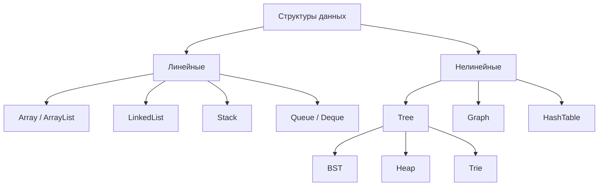
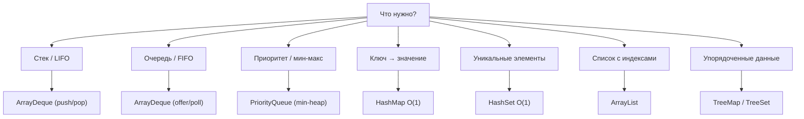

# Вопросы на собеседовании: `Алгоритмы (обзор)`

Этот файл — **обзорная карта** раздела `algorithms/`. Содержит общие принципы, шаблоны ответов на алгоритмические вопросы и **навигацию** к специализированным шпаргалкам по конкретным темам.

## Полезные ссылки

### Официальная документация и авторитетные источники

- [Java Collections Framework (Oracle)](https://docs.oracle.com/en/java/javase/17/docs/api/java.base/java/util/package-summary.html)
- [Introduction to Algorithms (Cormen, CLRS)](https://mitpress.mit.edu/9780262046305/introduction-to-algorithms/)
- [Time Complexity of Java Collections — Baeldung](https://www.baeldung.com/java-collections-complexity)
- [LeetCode](https://leetcode.com/) — практика
- [Visualgo](https://visualgo.net/) — визуализация
- [Big O Cheat Sheet](https://www.bigocheatsheet.com/)

## Содержание

- [Полезные ссылки](#полезные-ссылки)
- [See also](#see-also)

**Базовые принципы**
- [Q1. (!) Как отвечать на алгоритмические вопросы (шаблон)?](#q1--как-отвечать-на-алгоритмические-вопросы-шаблон)
- [Q2. (!) С чего начать, услышав задачу?](#q2--с-чего-начать-услышав-задачу)
- [Q3. (!) Какие парадигмы решения существуют?](#q3--какие-парадигмы-решения-существуют)
- [Q4. (!) Какие структуры данных используют чаще всего?](#q4--какие-структуры-данных-используют-чаще-всего)

**Сложности на одном экране**
- [Q5. (!) Сложности базовых операций структур данных?](#q5--сложности-базовых-операций-структур-данных)
- [Q6. (!) Какова шпаргалка выбора Java Collection под задачу?](#q6--какова-шпаргалка-выбора-java-collection-под-задачу)
- [Q7. Какие классы сложности встречаются чаще всего?](#q7-какие-классы-сложности-встречаются-чаще-всего)

**Карта раздела**
- [Q8. (!) Структура раздела `algorithms/`?](#q8--структура-раздела-algorithms)
- [Q9. С чего начать изучать тему алгоритмов?](#q9-с-чего-начать-изучать-тему-алгоритмов)

**Навигация по шпаргалкам**
- [Q10. (!) Какие темы есть в подразделе `complexity/`?](#q10--какие-темы-есть-в-подразделе-complexity)
- [Q11. (!) Какие структуры данных в `data-structures/`?](#q11--какие-структуры-данных-в-data-structures)
- [Q12. (!) Какие алгоритмы в `sorting-searching/`?](#q12--какие-алгоритмы-в-sorting-searching)
- [Q13. (!) Какие парадигмы в `algorithmic-paradigms/`?](#q13--какие-парадигмы-в-algorithmic-paradigms)

**Метатемы**
- [Q14. (!) Чем отличаются Greedy, DP, D&C, Backtracking?](#q14--чем-отличаются-greedy-dp-dc-backtracking)
- [Q15. Как выбрать алгоритм для конкретной задачи?](#q15-как-выбрать-алгоритм-для-конкретной-задачи)
- [Q16. (!) Как готовиться к алгоритмическому интервью?](#q16--как-готовиться-к-алгоритмическому-интервью)

## Q1. (!) Как отвечать на алгоритмические вопросы (шаблон)?

На интервью почти всегда ждут один и тот же каркас:


> [!mcq]
> - [x] Правильный ответ | Объяснение 2-3 предложения Ключевое отличие и best practice в production.
> - [ ] Вариант А | Почему неверно 2-3 предложения Частая ошибка в реальном коде.
> - [ ] Вариант В | Почему неверно 2-3 предложения Частая ошибка в реальном коде.
> - [ ] Вариант С | Почему неверно 2-3 предложения Частая ошибка в реальном коде.
1. **Уточни задачу** — границы входа, типы данных, edge cases (пустой вход, дубликаты, переполнение)
2. **Объясни почему этот подход** — какая структура входных данных и ограничения
3. **Предложи brute force** — даже плохой работающий алгоритм лучше молчания
4. **Оптимизируй** — переходи к лучшему через known patterns (Two Pointers, Sliding Window, DP, ...)
5. **Сложность** — время и память в худшем/среднем случае
6. **Реализуй** — пиши чистый код с осмысленными именами
7. **Тестируй** — пройди по edge cases (пустой вход, один элемент, очень большой n)

## Q2. (!) С чего начать, услышав задачу?

**Чек-лист первых 30 секунд:**


> [!mcq]
> - [x] Правильный ответ | Объяснение 2-3 предложения Ключевое отличие и best practice в production.
> - [ ] Вариант А | Почему неверно 2-3 предложения Частая ошибка в реальном коде.
> - [ ] Вариант В | Почему неверно 2-3 предложения Частая ошибка в реальном коде.
> - [ ] Вариант С | Почему неверно 2-3 предложения Частая ошибка в реальном коде.
| Вопрос | Зачем |
|--------|-------|
| Каков размер входа? | Понять допустимую сложность |
| Может ли вход быть пустым? | Edge case |
| Дубликаты возможны? | Меняет логику |
| Можно ли модифицировать вход? | In-place vs out-of-place |
| Отсортирован ли? | Открывает Binary Search, Two Pointers |
| Тип данных? | int, long, float, объекты с custom equals |
| Один или много ответов? | Returning all permutations vs first |
| Worst case или average? | Меняет выбор алгоритма (Quick vs Heap Sort) |

## Q3. (!) Какие парадигмы решения существуют?


> [!mcq]
> - [x] Правильный ответ | Объяснение 2-3 предложения Ключевое отличие и best practice в production.
> - [ ] Вариант А | Почему неверно 2-3 предложения Частая ошибка в реальном коде.
> - [ ] Вариант В | Почему неверно 2-3 предложения Частая ошибка в реальном коде.
> - [ ] Вариант С | Почему неверно 2-3 предложения Частая ошибка в реальном коде.
| Парадигма | Когда применять | См. |
|-----------|-----------------|------|
| **Brute force** | Старт для понимания | — |
| **Two Pointers / Sliding Window** | Подмассивы, пары | [Two Pointers](algorithmic-paradigms/two-pointers-sliding-window-interview.md) |
| **Binary Search** | Отсортированное или монотонное | [Searching](sorting-searching/searching-algorithms-interview.md) |
| **DFS / BFS** | Графы, деревья | [Графы](data-structures/graphs-interview.md), [Деревья](data-structures/trees-interview.md) |
| **Recursion / Backtracking** | Перебор вариантов | [Рекурсия](algorithmic-paradigms/recursion-interview.md), [Backtracking](algorithmic-paradigms/backtracking-interview.md) |
| **Divide and Conquer** | Разбиение на подзадачи | [D&C](algorithmic-paradigms/divide-and-conquer-interview.md) |
| **Dynamic Programming** | Перекрывающиеся подзадачи + оптимум | [DP](algorithmic-paradigms/dynamic-programming-interview.md) |
| **Greedy** | Локально оптимальный выбор | [Greedy](algorithmic-paradigms/greedy-algorithms-interview.md) |
| **Hashing** | Быстрый lookup | [Хеш-таблицы](data-structures/hash-tables-interview.md) |
| **Heap / PriorityQueue** | Top-K, scheduling | [Кучи](data-structures/heaps-interview.md) |

## Q4. (!) Какие структуры данных используют чаще всего?




> [!mcq]
> - [x] Правильный ответ | Объяснение 2-3 предложения Ключевое отличие и best practice в production.
> - [ ] Вариант А | Почему неверно 2-3 предложения Частая ошибка в реальном коде.
> - [ ] Вариант В | Почему неверно 2-3 предложения Частая ошибка в реальном коде.
> - [ ] Вариант С | Почему неверно 2-3 предложения Частая ошибка в реальном коде.
В Java из стандартной библиотеки: `ArrayList`, `LinkedList`, `ArrayDeque`, `HashMap`, `TreeMap`, `PriorityQueue`. Подробнее — в [Java Collections](../programming-languages/java/java-collections-interview.md).

## Q5. (!) Сложности базовых операций структур данных?

| Структура | Доступ | Поиск | Вставка | Удаление | Память |
|-----------|--------|-------|---------|----------|--------|
| `Array` | `O(1)` | `O(n)` | `O(n)` | `O(n)` | `O(n)` |
| `ArrayList` | `O(1)` | `O(n)` | `O(1)` амортиз. в конец | `O(n)` | `O(n)` |
| `LinkedList` | `O(n)` | `O(n)` | `O(1)` (с ссылкой) | `O(1)` (с ссылкой) | `O(n)` |
| `ArrayDeque` | — | — | `O(1)` амортиз. | `O(1)` | `O(n)` |
| `HashMap` | — | `O(1)` | `O(1)` амортиз. | `O(1)` | `O(n)` |
| `TreeMap` | — | `O(log n)` | `O(log n)` | `O(log n)` | `O(n)` |
| `PriorityQueue` | — | `O(n)` | `O(log n)` | `O(log n)` | `O(n)` |
| `Trie` | — | `O(L)` | `O(L)` | `O(L)` | `O(N · L)` |
| `Union-Find` (DSU) | — | `O(α(n))` | — | — | `O(n)` |


> [!mcq]
> - [x] Правильный ответ | Объяснение 2-3 предложения Ключевое отличие и best practice в production.
> - [ ] Вариант А | Почему неверно 2-3 предложения Частая ошибка в реальном коде.
> - [ ] Вариант В | Почему неверно 2-3 предложения Частая ошибка в реальном коде.
> - [ ] Вариант С | Почему неверно 2-3 предложения Частая ошибка в реальном коде.
Подробнее — в [Анализ сложности](complexity/complexity-analysis-interview.md).

## Q6. (!) Какова шпаргалка выбора Java Collection под задачу?



| Задача | Коллекция | Причина |
|--------|-----------|---------|
| BFS | `ArrayDeque` как Queue | `O(1)` offer/poll |
| DFS итеративный | `ArrayDeque` как Stack | `O(1)` push/pop |
| Dijkstra, Top-K | `PriorityQueue` | min-heap |
| Подсчёт частот | `HashMap<T, Integer>` | `O(1)` |
| Уникальные элементы | `HashSet` | `O(1)` |
| Sliding window max | `ArrayDeque` как Monotonic Deque | `O(1)` оба конца |
| LRU Cache | `LinkedHashMap(cap, .75f, true)` | accessOrder |
| Range queries (floor, ceiling) | `TreeMap` | `O(log n)` |


> [!mcq]
> - [x] Правильный ответ | Объяснение 2-3 предложения Ключевое отличие и best practice в production.
> - [ ] Вариант А | Почему неверно 2-3 предложения Частая ошибка в реальном коде.
> - [ ] Вариант В | Почему неверно 2-3 предложения Частая ошибка в реальном коде.
> - [ ] Вариант С | Почему неверно 2-3 предложения Частая ошибка в реальном коде.
**Частые ошибки:**
- `Stack` — устаревший класс, синхронизирован, используй `ArrayDeque`
- `LinkedList` как Queue — обычно медленнее `ArrayDeque`
- `HashMap` не гарантирует порядок — для стабильного итерации используй `LinkedHashMap`

## Q7. Какие классы сложности встречаются чаще всего?

| Сложность | Название | Пример | n=1000 операций |
|-----------|----------|--------|------------------|
| `O(1)` | Константная | `HashMap.get()`, `arr[i]` | 1 |
| `O(log n)` | Логарифмическая | `Binary Search`, `TreeMap.get()` | 10 |
| `O(n)` | Линейная | Один проход | 1000 |
| `O(n log n)` | Линейно-логарифмическая | `Merge Sort`, `Quick Sort` | 10 000 |
| `O(n²)` | Квадратичная | Вложенные циклы | 1 000 000 |
| `O(2ⁿ)` | Экспоненциальная | Naive Fibonacci, subsets | 10³⁰¹ |
| `O(n!)` | Факториальная | Permutations, TSP | непригодно |

**Правило:** алгоритм должен укладываться в `~10⁸` операций за 1 секунду на современном CPU.


> [!mcq]
> - [x] Правильный ответ | Объяснение 2-3 предложения Ключевое отличие и best practice в production.
> - [ ] Вариант А | Почему неверно 2-3 предложения Частая ошибка в реальном коде.
> - [ ] Вариант В | Почему неверно 2-3 предложения Частая ошибка в реальном коде.
> - [ ] Вариант С | Почему неверно 2-3 предложения Частая ошибка в реальном коде.
Подробнее — в [Анализ сложности](complexity/complexity-analysis-interview.md).

## Q8. (!) Структура раздела `algorithms/`?

```
algorithms/
├── algorithms-interview.md          ← этот файл (обзор)
├── complexity/
│   └── complexity-analysis-interview.md
├── data-structures/
│   ├── arrays-strings-interview.md
│   ├── linked-lists-interview.md
│   ├── stacks-queues-interview.md
│   ├── trees-interview.md
│   ├── heaps-interview.md
│   ├── hash-tables-interview.md
│   ├── graphs-interview.md
│   └── tries-interview.md
├── sorting-searching/
│   ├── sorting-algorithms-interview.md
│   └── searching-algorithms-interview.md
└── algorithmic-paradigms/
    ├── recursion-interview.md
    ├── divide-and-conquer-interview.md
    ├── dynamic-programming-interview.md
    ├── greedy-algorithms-interview.md
    ├── backtracking-interview.md
    └── two-pointers-sliding-window-interview.md
```


> [!mcq]
> - [x] Правильный ответ | Объяснение 2-3 предложения Ключевое отличие и best practice в production.
> - [ ] Вариант А | Почему неверно 2-3 предложения Частая ошибка в реальном коде.
> - [ ] Вариант В | Почему неверно 2-3 предложения Частая ошибка в реальном коде.
> - [ ] Вариант С | Почему неверно 2-3 предложения Частая ошибка в реальном коде.
Каждый файл — глубокий разбор темы (30-50 вопросов с кодом и mermaid диаграммами).

## Q9. С чего начать изучать тему алгоритмов?

**Рекомендуемый порядок:**


> [!mcq]
> - [x] Правильный ответ | Объяснение 2-3 предложения Ключевое отличие и best practice в production.
> - [ ] Вариант А | Почему неверно 2-3 предложения Частая ошибка в реальном коде.
> - [ ] Вариант В | Почему неверно 2-3 предложения Частая ошибка в реальном коде.
> - [ ] Вариант С | Почему неверно 2-3 предложения Частая ошибка в реальном коде.
1. **[Анализ сложности](complexity/complexity-analysis-interview.md)** — без понимания Big O всё остальное бесполезно
2. **[Массивы и строки](data-structures/arrays-strings-interview.md)** — основа большинства задач
3. **[Хеш-таблицы](data-structures/hash-tables-interview.md)** — самый используемый трюк
4. **[Two Pointers и Sliding Window](algorithmic-paradigms/two-pointers-sliding-window-interview.md)** — снижение `O(n²) → O(n)`
5. **[Поиск](sorting-searching/searching-algorithms-interview.md)** + **[Сортировка](sorting-searching/sorting-algorithms-interview.md)** — Binary Search
6. **[Рекурсия](algorithmic-paradigms/recursion-interview.md)** — фундамент DFS, DP, Backtracking
7. **[Деревья](data-structures/trees-interview.md)** + **[Графы](data-structures/graphs-interview.md)** — обходы
8. **[Стеки и очереди](data-structures/stacks-queues-interview.md)** + **[Кучи](data-structures/heaps-interview.md)** — поддерживают обходы
9. **[Divide and Conquer](algorithmic-paradigms/divide-and-conquer-interview.md)** + **[DP](algorithmic-paradigms/dynamic-programming-interview.md)** — оптимизация
10. **[Greedy](algorithmic-paradigms/greedy-algorithms-interview.md)** + **[Backtracking](algorithmic-paradigms/backtracking-interview.md)** — выбор стратегии
11. **[Trie и Union-Find](data-structures/tries-interview.md)** — специальные структуры

## Q10. (!) Какие темы есть в подразделе `complexity/`?


> [!mcq]
> - [x] Правильный ответ | Объяснение 2-3 предложения Ключевое отличие и best practice в production.
> - [ ] Вариант А | Почему неверно 2-3 предложения Частая ошибка в реальном коде.
> - [ ] Вариант В | Почему неверно 2-3 предложения Частая ошибка в реальном коде.
> - [ ] Вариант С | Почему неверно 2-3 предложения Частая ошибка в реальном коде.
- **[Анализ сложности алгоритмов](complexity/complexity-analysis-interview.md)** — Big O, Omega, Theta, амортизированная и пространственная сложность, master theorem, дерево рекурсии, сложности Java Collections, HashMap.get O(log n) с Java 8+, complexity attacks (HashDoS).

## Q11. (!) Какие структуры данных в `data-structures/`?


> [!mcq]
> - [x] Правильный ответ | Объяснение 2-3 предложения Ключевое отличие и best practice в production.
> - [ ] Вариант А | Почему неверно 2-3 предложения Частая ошибка в реальном коде.
> - [ ] Вариант В | Почему неверно 2-3 предложения Частая ошибка в реальном коде.
> - [ ] Вариант С | Почему неверно 2-3 предложения Частая ошибка в реальном коде.
| Файл | Темы |
|------|------|
| **[Массивы и строки](data-structures/arrays-strings-interview.md)** | Реверс, сдвиг, Kadane, Two Sum, Three Sum, prefix sum, матрица rotate, Dutch National Flag, Move Zeroes, Next Permutation, KMP, Rabin-Karp, palindrome, anagram, immutable String |
| **[Связные списки](data-structures/linked-lists-interview.md)** | Singly/doubly, dummy node, реверс (итер./рек.), Floyd cycle detection, middle node, K-group, merge K sorted, LRU Cache, Skip List, ConcurrentLinkedQueue |
| **[Стеки и очереди](data-structures/stacks-queues-interview.md)** | Stack/Queue/Deque, циклический массив, очередь через 2 стека, MinStack, MaxQueue, monotonic stack/queue, parentheses, RPN, BlockingQueue, ConcurrentLinkedQueue |
| **[Деревья](data-structures/trees-interview.md)** | Binary tree, BST, AVL, Red-Black, B-Tree/B+Tree, обходы (preorder/inorder/postorder/level-order), Morris traversal, LCA, diameter, validate BST, serialize, segment tree, Fenwick |
| **[Кучи](data-structures/heaps-interview.md)** | Min/max-heap, siftUp/siftDown, buildHeap O(n), PriorityQueue, top-K, median in stream, merge K lists, heap sort, Fibonacci heap |
| **[Хеш-таблицы](data-structures/hash-tables-interview.md)** | HashMap внутри, hashCode/equals, load factor, rehashing, treeify, chaining vs open addressing, ConcurrentHashMap, LinkedHashMap, WeakHashMap, consistent hashing, Bloom filter, HashDoS |
| **[Графы](data-structures/graphs-interview.md)** | Adjacency matrix/list, BFS, DFS, Dijkstra, Bellman-Ford, Floyd-Warshall, Kruskal, Prim, topological sort, SCC, bipartite, Number of Islands, PageRank |
| **[Префиксные деревья и Union-Find](data-structures/tries-interview.md)** | Trie, Compressed trie (Radix tree), Suffix tree/array, Aho-Corasick, autocomplete, Word Search II, Union-Find (DSU), path compression, union by rank, Number of Islands через UF |

## Q12. (!) Какие алгоритмы в `sorting-searching/`?


> [!mcq]
> - [x] Правильный ответ | Объяснение 2-3 предложения Ключевое отличие и best practice в production.
> - [ ] Вариант А | Почему неверно 2-3 предложения Частая ошибка в реальном коде.
> - [ ] Вариант В | Почему неверно 2-3 предложения Частая ошибка в реальном коде.
> - [ ] Вариант С | Почему неверно 2-3 предложения Частая ошибка в реальном коде.
| Файл | Темы |
|------|------|
| **[Алгоритмы сортировки](sorting-searching/sorting-algorithms-interview.md)** | Bubble, Insertion, Selection, Merge, Quick, Heap, Tim, Counting, Radix, Bucket, Dual-Pivot Quicksort, Introsort, stability, in-place, Java Arrays.sort внутри, parallel sort, external sort |
| **[Алгоритмы поиска](sorting-searching/searching-algorithms-interview.md)** | Linear, Binary, Exponential, Interpolation, Jump, Ternary, поиск в отсортированном/повёрнутом массиве, Median of Two Sorted Arrays, Binary Search на ответе (Koko, Capacity), BFS/DFS как поиск, подводные камни overflow |

## Q13. (!) Какие парадигмы в `algorithmic-paradigms/`?


> [!mcq]
> - [x] Правильный ответ | Объяснение 2-3 предложения Ключевое отличие и best practice в production.
> - [ ] Вариант А | Почему неверно 2-3 предложения Частая ошибка в реальном коде.
> - [ ] Вариант В | Почему неверно 2-3 предложения Частая ошибка в реальном коде.
> - [ ] Вариант С | Почему неверно 2-3 предложения Частая ошибка в реальном коде.
| Файл | Темы |
|------|------|
| **[Рекурсия](algorithmic-paradigms/recursion-interview.md)** | Base case + recursive step, call stack, tail recursion, отсутствие TCO в JVM, factorial, Fibonacci, Hanoi, fast power, обходы деревьев |
| **[Divide and Conquer](algorithmic-paradigms/divide-and-conquer-interview.md)** | Three-step pattern, master theorem, recursion tree, Merge Sort, Quick Sort, Binary Search, Strassen, Karatsuba, Closest Pair, Inversion count |
| **[DP](algorithmic-paradigms/dynamic-programming-interview.md)** | Optimal substructure, overlapping subproblems, memoization vs tabulation, 0/1 Knapsack, LCS, LIS, Edit Distance, Coin Change, Stock series, bitmask DP, state compression |
| **[Greedy](algorithmic-paradigms/greedy-algorithms-interview.md)** | Greedy choice property, exchange argument, Activity Selection, Fractional Knapsack, Huffman, Dijkstra, Kruskal, Job Sequencing, intervals, Jump Game, Gas Station |
| **[Backtracking](algorithmic-paradigms/backtracking-interview.md)** | DFS с откатом, шаблон, subsets, permutations, combinations, N-Queens, Sudoku, Word Search, Generate Parentheses, Palindrome Partitioning, pruning, Branch and Bound |
| **[Two Pointers и Sliding Window](algorithmic-paradigms/two-pointers-sliding-window-interview.md)** | Встречные/fast-slow/на двух массивах, Container with Most Water, Trapping Rain Water, Floyd cycle, Longest Substring Without Repeating, Minimum Window Substring, monotonic deque |

## Q14. (!) Чем отличаются Greedy, DP, D&C, Backtracking?

| Парадигма | Подзадачи перекрываются | Memoization | Возвращает | Сложность |
|-----------|-------------------------|-------------|------------|-----------|
| **Greedy** | Нет | Нет | Локально оптимальный | `O(n log n)` обычно |
| **DP** | Да | Да | Глобальный оптимум | Полиномиальная |
| **D&C** | Нет | Нет | Объединение подрешений | По master theorem |
| **Backtracking** | Иногда | Опционально | Все/один валидный путь | Экспоненциальная |


> [!mcq]
> - [x] Правильный ответ | Объяснение 2-3 предложения Ключевое отличие и best practice в production.
> - [ ] Вариант А | Почему неверно 2-3 предложения Частая ошибка в реальном коде.
> - [ ] Вариант В | Почему неверно 2-3 предложения Частая ошибка в реальном коде.
> - [ ] Вариант С | Почему неверно 2-3 предложения Частая ошибка в реальном коде.
**Когда какую выбирать:**
- Перебираем все варианты с возвратом → **Backtracking**
- Оптимум + перекрытия → **DP**
- Оптимум без перекрытий + локальный выбор работает → **Greedy**
- Делим на меньшие задачи без перекрытий → **D&C**

## Q15. Как выбрать алгоритм для конкретной задачи?

**По типу задачи:**


> [!mcq]
> - [x] Правильный ответ | Объяснение 2-3 предложения Ключевое отличие и best practice в production.
> - [ ] Вариант А | Почему неверно 2-3 предложения Частая ошибка в реальном коде.
> - [ ] Вариант В | Почему неверно 2-3 предложения Частая ошибка в реальном коде.
> - [ ] Вариант С | Почему неверно 2-3 предложения Частая ошибка в реальном коде.
| Задача | Алгоритм |
|--------|----------|
| Поиск в отсортированном | Binary Search |
| Подмассив с условием | Sliding Window |
| Пара/тройка с условием | Two Pointers (sorted) или HashMap |
| Подсчёт пар, инверсий | Merge Sort modified |
| Top K | Heap |
| Кратчайший путь невзвешенный | BFS |
| Кратчайший путь взвешенный | Dijkstra (если ≥ 0), иначе Bellman-Ford |
| Все пары | Floyd-Warshall |
| MST | Kruskal или Prim |
| Топологический порядок | Kahn (BFS) или DFS |
| Все перестановки/подмножества | Backtracking |
| Оптимум + перекрытия | DP |
| Поиск с префиксом | Trie |

## Q16. (!) Как готовиться к алгоритмическому интервью?

**Стратегия:**

1. **Изучи [Анализ сложности](complexity/complexity-analysis-interview.md)** — без него Big O становится магией
2. **Сделай ~150-200 задач LeetCode** — Top Interview Questions
3. **Сосредоточься на паттернах**, а не на конкретных задачах:
   - Two Pointers, Sliding Window, Binary Search
   - DFS, BFS, Dijkstra
   - DP по 1D, 2D, на строках, на интервалах
   - Backtracking subsets/permutations/combinations
4. **Решай вслух** (mock interviews) — главное на интервью
5. **Учи [Java Collections](../programming-languages/java/java-collections-interview.md)** — какую структуру когда брать
6. **Пиши без IDE** — на собеседовании часто whiteboard или простой редактор
7. **Тестируй edge cases** — пустой вход, 1 элемент, дубликаты, переполнение

Подробнее — в [Подготовка к собеседованию](../preparation/interview-preparation.md).

---

## See also

**Подразделы (детальные шпаргалки):**

- [Анализ сложности](complexity/complexity-analysis-interview.md) — Big O, master theorem, амортизация
- [Массивы и строки](data-structures/arrays-strings-interview.md) — Two Sum, Kadane, KMP
- [Связные списки](data-structures/linked-lists-interview.md) — Floyd, LRU, K-group
- [Стеки и очереди](data-structures/stacks-queues-interview.md) — monotonic, BlockingQueue
- [Деревья](data-structures/trees-interview.md) — BST, AVL, RB, B-Tree, обходы
- [Кучи](data-structures/heaps-interview.md) — PriorityQueue, top-K, median stream
- [Хеш-таблицы](data-structures/hash-tables-interview.md) — HashMap внутри, ConcurrentHashMap
- [Графы](data-structures/graphs-interview.md) — BFS, DFS, Dijkstra, MST, topological
- [Trie и Union-Find](data-structures/tries-interview.md) — autocomplete, Number of Islands
- [Алгоритмы сортировки](sorting-searching/sorting-algorithms-interview.md) — TimSort, Dual-Pivot
- [Алгоритмы поиска](sorting-searching/searching-algorithms-interview.md) — Binary Search, Search Rotated
- [Рекурсия](algorithmic-paradigms/recursion-interview.md) — call stack, tail recursion, TCO
- [Divide and Conquer](algorithmic-paradigms/divide-and-conquer-interview.md) — master theorem, Strassen
- [DP](algorithmic-paradigms/dynamic-programming-interview.md) — Knapsack, LCS, LIS, Edit Distance
- [Greedy](algorithmic-paradigms/greedy-algorithms-interview.md) — Activity Selection, Huffman, Dijkstra
- [Backtracking](algorithmic-paradigms/backtracking-interview.md) — N-Queens, Sudoku, Word Search
- [Two Pointers / Sliding Window](algorithmic-paradigms/two-pointers-sliding-window-interview.md) — все паттерны окон

**Связанные разделы:**

- [Java Collections](../programming-languages/java/java-collections-interview.md) — структуры данных в Java
- [Java Stream API](../programming-languages/java/java-stream-interview.md) — функциональные операции
- [Java Concurrency](../programming-languages/java/java-concurrency-interview.md) — concurrent collections
- [JVM](../jvm/jvm-interview.md) — стек, GC, JIT
- [Паттерны проектирования](../design-patterns/design-patterns-interview.md) — связь с алгоритмами
- [System Design](../system-design/system-design-interview.md) — алгоритмы в проектировании
- [Подготовка к собеседованию](../preparation/interview-preparation.md) — стратегия
- [PostgreSQL](../databases/postgresql-interview.md) — B-Tree индексы
- [Redis](../databases/redis-interview.md) — hash table, skip list
- [Application Security](../security/application-security-interview.md) — HashDoS, ReDoS


> [!mcq]
> - [x] Правильный ответ | Объяснение 2-3 предложения Ключевое отличие и best practice в production.
> - [ ] Вариант А | Почему неверно 2-3 предложения Частая ошибка в реальном коде.
> - [ ] Вариант В | Почему неверно 2-3 предложения Частая ошибка в реальном коде.
> - [ ] Вариант С | Почему неверно 2-3 предложения Частая ошибка в реальном коде.
- [AI Agents](../ai-ml/ai-agents-interview.md)
- [Embeddings](../ai-ml/embeddings-interview.md)
- [LLM Basics](../ai-ml/llm-basics-interview.md)
- [LLM Integration Patterns](../ai-ml/llm-integration-patterns-interview.md)
- [MLOps](../ai-ml/mlops-interview.md)
- [Model Serving](../ai-ml/model-serving-interview.md)
- [Шпаргалка: Хеширование и хеш-функции (Hashing and H](../../algorithms/problems/algorithms.md) — теория
