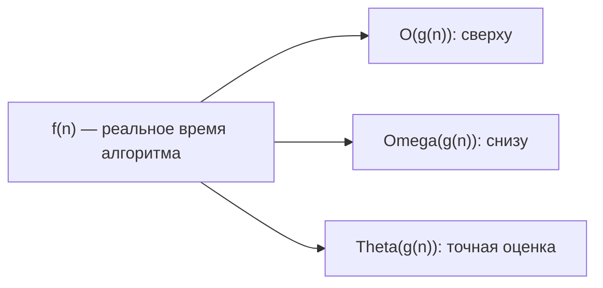
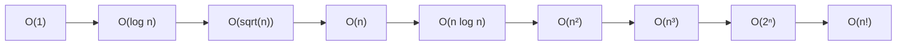

# Вопросы на собеседовании: `Анализ сложности алгоритмов`

Анализ сложности — фундамент алгоритмических интервью. От тебя ждут не просто названия `O(n log n)`, а способности **обосновать** оценку, отличить **худший/средний/амортизированный** случай и понимать, почему `HashMap.get()` может «деградировать» до `O(log n)`.

## Полезные ссылки

### Официальная документация и авторитетные источники

- [Practical Java Examples of the Big O Notation — Baeldung](https://www.baeldung.com/java-algorithm-complexity)
- [Time Complexity of Java Collections — Baeldung](https://www.baeldung.com/java-collections-complexity)
- [Big O Cheat Sheet](https://www.bigocheatsheet.com/)
- [Introduction to Algorithms (CLRS), глава 3 — Growth of Functions](https://mitpress.mit.edu/9780262046305/introduction-to-algorithms/)
- [Master Theorem — Wikipedia](https://en.wikipedia.org/wiki/Master_theorem_(analysis_of_algorithms))

## Содержание

- [Полезные ссылки](#полезные-ссылки)
- [See also](#see-also)

**Базовая асимптотика**
- [Q1. (!) Как сравнить эффективность двух алгоритмов?](#q1--как-сравнить-эффективность-двух-алгоритмов)
- [Q2. (!) Что такое лучший, худший и средний сценарий?](#q2--что-такое-лучший-худший-и-средний-сценарий)
- [Q3. (!) Что такое асимптотические обозначения O, Omega, Theta?](#q3--что-такое-асимптотические-обозначения-o-omega-theta)
- [Q4. Какие правила упрощения Big O существуют?](#q4-какие-правила-упрощения-big-o-существуют)
- [Q5. (!) Какие классы сложности встречаются чаще всего?](#q5--какие-классы-сложности-встречаются-чаще-всего)

**Память и амортизация**
- [Q6. (!) Что такое пространственная сложность?](#q6--что-такое-пространственная-сложность)
- [Q7. (!) Что такое амортизированная сложность?](#q7--что-такое-амортизированная-сложность)
- [Q8. Чем in-place отличается от out-of-place алгоритма?](#q8-чем-in-place-отличается-от-out-of-place-алгоритма)
- [Q9. Что такое recursive call stack space?](#q9-что-такое-recursive-call-stack-space)

**Анализ рекурсии**
- [Q10. (!) Что такое master theorem и как им пользоваться?](#q10--что-такое-master-theorem-и-как-им-пользоваться)
- [Q11. Как анализировать сложность через дерево рекурсии?](#q11-как-анализировать-сложность-через-дерево-рекурсии)
- [Q12. Как доказать сложность через подстановку?](#q12-как-доказать-сложность-через-подстановку)

**Сложности на практике**
- [Q13. (!) Какова сложность операций в Java Collections?](#q13--какова-сложность-операций-в-java-collections)
- [Q14. (!) Почему HashMap.get() в худшем случае O(log n), а не O(n)?](#q14--почему-hashmapget-в-худшем-случае-o-log-n-а-не-on)
- [Q15. Почему ArrayList.add() — это амортизированный O(1)?](#q15-почему-arraylistadd--это-амортизированный-o1)
- [Q16. (!) Чем отличается O(log n) и O(log² n)?](#q16--чем-отличается-olog-n-и-olog²-n)
- [Q17. Что такое pseudo-polynomial complexity?](#q17-что-такое-pseudo-polynomial-complexity)

**Big-O в реальной жизни**
- [Q18. (!) Когда O(n²) лучше O(n log n)?](#q18--когда-on²-лучше-on-log-n)
- [Q19. Почему cache locality важна больше, чем Big O для малых n?](#q19-почему-cache-locality-важна-больше-чем-big-o-для-малых-n)
- [Q20. Что такое NP-hard и NP-complete простым языком?](#q20-что-такое-np-hard-и-np-complete-простым-языком)
- [Q21. Как оценить сложность нескольких вложенных циклов с разными границами?](#q21-как-оценить-сложность-нескольких-вложенных-циклов-с-разными-границами)
- [Q22. Что значит «алгоритм линеен по выходу»?](#q22-что-значит-алгоритм-линеен-по-выходу)

**Сложности конкретных алгоритмов**
- [Q23. (!) Почему сортировки сравнением не быстрее O(n log n)?](#q23--почему-сортировки-сравнением-не-быстрее-on-log-n)
- [Q24. (!) Почему Quick Sort в среднем O(n log n), а в худшем O(n²)?](#q24--почему-quick-sort-в-среднем-on-log-n-а-в-худшем-on²)
- [Q25. Какая сложность у BFS и DFS?](#q25-какая-сложность-у-bfs-и-dfs)
- [Q26. Какова сложность Dijkstra с разными приоритетными очередями?](#q26-какова-сложность-dijkstra-с-разными-приоритетными-очередями)
- [Q27. Какова сложность алгоритма Беллмана-Форда?](#q27-какова-сложность-алгоритма-беллмана-форда)

**Подводные камни**
- [Q28. (!) Может ли O(1) быть медленнее O(n)?](#q28--может-ли-o1-быть-медленнее-on)
- [Q29. Что такое скрытые константы и почему они важны?](#q29-что-такое-скрытые-константы-и-почему-они-важны)
- [Q30. Как профилировать реальный алгоритм, а не оценивать через Big O?](#q30-как-профилировать-реальный-алгоритм-а-не-оценивать-через-big-o)
- [Q31. (!) Что такое complexity attack?](#q31--что-такое-complexity-attack)

## Q1. (!) Как сравнить эффективность двух алгоритмов?

Сравнивают по **временной** и **пространственной** сложности в **лучшем**, **худшем** и **среднем** случае. Чем меньше сложность, тем эффективнее алгоритм при росте `n`. Удобно выражать через асимптотику: `O(n)`, `O(n log n)` и т.д. Одного «лучшего» алгоритма нет — выбор зависит от ограничений по памяти, частоты вызова и характера данных.

| Сложность | Название | Пример |
|-----------|----------|--------|
| `O(1)` | Константная | Доступ к `arr[i]`, `HashMap.get()` |
| `O(log n)` | Логарифмическая | Бинарный поиск, операции `TreeMap` |
| `O(n)` | Линейная | Один проход по массиву |
| `O(n log n)` | Линейно-логарифмическая | `Merge Sort`, `Quick Sort` (среднее) |
| `O(n²)` | Квадратичная | Вложенные циклы, `Bubble Sort` |
| `O(n³)` | Кубическая | Floyd-Warshall, наивное матричное умножение |
| `O(2ⁿ)` | Экспоненциальная | Наивная рекурсия Фибоначчи, перебор подмножеств |
| `O(n!)` | Факториальная | Полный перебор перестановок, наивный TSP |

На собеседовании важно не просто назвать `O`, а объяснить, **почему** такая сложность — через число операций на каждом шаге.


> [!mcq]
> - [ ] Запустить оба на одном наборе данных и замерить время | ❌ ПОСЛЕДСТВИЕ: результат зависит от n и железа — на n=100 быстрее O(n²), на n=10⁶ лучше O(n log n); замер нерепродуцируем и непереносим
> - [x] Сравнить временну́ю и пространственную сложность в худшем, среднем и лучшем случае | ✓ ПРИМЕНЯТЬ: при выборе алгоритма для production — называй оба dimension 📋 ПРАВИЛО: один «лучший» алгоритм не существует — это компромисс time/space/use-case 🔗 См. Q2
> - [ ] Подсчитать число строк кода — меньше = эффективнее | ❌ ПОСЛЕДСТВИЕ: O(n²) в 3 строки медленнее O(n log n) в 20 строках при n=10⁶; краткость ≠ эффективность
> - [ ] Смотреть только на временну́ю сложность, память вторична | ❌ ПОСЛЕДСТВИЕ: алгоритм O(n log n) с O(n²) памяти вызывает OOM на больших входах; без учёта space алгоритм неприменим

## Q2. (!) Что такое лучший, худший и средний сценарий?

- **Best case** — данные, на которых алгоритм быстрее всего (для `Insertion Sort` это уже отсортированный массив — `O(n)`).
- **Worst case** — вход, при котором время или память максимальны (для `Quick Sort` с фиксированным pivot — отсортированный массив, `O(n²)`).
- **Average case** — типичное или равномерно случайное распределение данных. Часто более релевантно практике, но требует вероятностной модели.

| Алгоритм | Лучший | Средний | Худший |
|----------|--------|---------|--------|
| `Binary Search` | `O(1)` | `O(log n)` | `O(log n)` |
| `Quick Sort` | `O(n log n)` | `O(n log n)` | `O(n²)` |
| `Merge Sort` | `O(n log n)` | `O(n log n)` | `O(n log n)` |
| `Insertion Sort` | `O(n)` | `O(n²)` | `O(n²)` |
| `HashMap.get()` | `O(1)` | `O(1)` | `O(log n)` (Java 8+) |

Для сравнения алгоритмов чаще смотрят на **худший** случай — он даёт гарантию.


> [!mcq]
> - [ ] Merge Sort худший случай O(n²) из-за многократного слияния | ❌ ПОСЛЕДСТВИЕ: разработчик избегает Merge Sort без причины — его worst case всегда O(n log n), никогда не деградирует
> - [ ] Quick Sort с фиксированным pivot на случайных данных — это худший случай | ❌ ПОСЛЕДСТВИЕ: случайные данные — средний случай O(n log n); худший — отсортированный вход с fixed pivot → O(n²)
> - [ ] HashMap.get() всегда O(1) без исключений | ❌ ПОСЛЕДСТВИЕ: без учёта worst case O(log n) (Java 8+) не учитывается HashDoS и деградация при коллизиях → неверная оценка SLA
> - [x] Худший случай даёт гарантию производительности — именно его используют при SLA и выборе алгоритма | ✓ ПРИМЕНЯТЬ: на интервью всегда называй worst case при обсуждении производительности 📋 ПРАВИЛО: Quick Sort отсорт. вход → O(n²); Merge Sort любой вход → O(n log n) 🔗 См. Q24

## Q3. (!) Что такое асимптотические обозначения O, Omega, Theta?

Это способ описать рост времени или памяти алгоритма при росте размера входа `n`.

- **O (Big O, О-большое)** — **верхняя граница**. `f(n) = O(g(n))`, если существует константа `c > 0` и `n₀`, такие что `f(n) ≤ c·g(n)` для всех `n ≥ n₀`. Это значит «не хуже чем».
- **Ω (Omega)** — **нижняя граница**. `f(n) = Ω(g(n))`, если `f(n) ≥ c·g(n)`. «Не быстрее чем».
- **Θ (Theta)** — **точная** оценка: и сверху, и снизу один и тот же порядок. `f(n) = Θ(g(n))`, если `f(n) = O(g(n))` И `f(n) = Ω(g(n))`.



В разговорной речи и собеседованиях почти всегда говорят «**O**» (даже когда имеют в виду Theta). Формально это разные понятия. Если нужно подчеркнуть, что алгоритм **не быстрее**, чем `O(n log n)` — используют Omega.


> [!mcq]
> - [ ] Theta(n) и O(n) — синонимы, оба описывают «точный» рост | ❌ ПОСЛЕДСТВИЕ: O(n) — верхняя граница; O(n²) тоже допустимо для линейного алгоритма; Theta строже — обязывает к обеим границам
> - [x] O — верхняя граница, Omega — нижняя, Theta — точная (пересечение обоих) | ✓ ПРИМЕНЯТЬ: на собеседовании говорят «O» но имеют в виду Theta; при гарантиях — уточняй 📋 ПРАВИЛО: Theta(f) = O(f) ∩ Omega(f); Big O «не хуже чем», Omega «не лучше чем» 🔗 См. Q1
> - [ ] Omega показывает лучший случай алгоритма | ❌ ПОСЛЕДСТВИЕ: Omega — нижняя граница функции роста, не «лучший случай»; путаница ведёт к неверным гарантиям на собеседовании
> - [ ] O(n) означает строго n операций, не меньше | ❌ ПОСЛЕДСТВИЕ: O(n) — «не хуже чем c·n»; O(1) тоже является O(n), что порождает парадоксальные утверждения при формальном анализе

## Q4. Какие правила упрощения Big O существуют?

1. **Отбрасываем константы**: `O(2n)` = `O(n)`, `O(100)` = `O(1)`.
2. **Оставляем доминирующий член**: `O(n² + n + log n)` = `O(n²)`.
3. **Вложенные циклы перемножаются**: два вложенных цикла по `n` дают `O(n²)`.
4. **Последовательные блоки складываются** и сводятся к максимуму: `O(n) + O(n log n)` = `O(n log n)`.
5. **Различные переменные не объединяют**: `O(n + m)` ≠ `O(n)`, если `n` и `m` независимы.

```java
// O(n + m) — обходим два независимых массива
void process(int[] a, int[] b) {
    for (int x : a) doSomething(x);  // O(n)
    for (int y : b) doSomething(y);  // O(m)
}

// O(n * m) — для каждого элемента a обходим весь b
void cross(int[] a, int[] b) {
    for (int x : a)
        for (int y : b)
            doSomething(x, y);
}
```


> [!mcq]
> - [ ] O(n + m) = O(n) если n > m, независимые переменные объединяются | ❌ ПОСЛЕДСТВИЕ: при n=m потеряна зависимость от второго параметра; алгоритм выглядит O(n) но реально O(n+m)
> - [ ] Два вложенных цикла всегда дают O(n²) | ❌ ПОСЛЕДСТВИЕ: если внутренний цикл до sqrt(n) → O(n√n); до log n → O(n log n); неверное O(n²) завышает оценку
> - [x] Константы отбрасываем; оставляем доминирующий член; независимые переменные НЕ объединяют | ✓ ПРИМЕНЯТЬ: при подсчёте сложности на собеседовании 📋 ПРАВИЛО: O(n² + n) = O(n²); O(n + m) ≠ O(n); вложенные циклы перемножаются, последовательные — складываются 🔗 См. Q21
> - [ ] O(n log n) + O(n²) = O(n² log n) — перемножаем при сложении | ❌ ПОСЛЕДСТВИЕ: сложение блоков даёт max, не произведение; O(n log n + n²) = O(n²), не O(n² log n)

## Q5. (!) Какие классы сложности встречаются чаще всего?



Для понимания масштаба, при `n = 1000`:

| Сложность | Операций |
|-----------|----------|
| `O(1)` | 1 |
| `O(log n)` | ~10 |
| `O(n)` | 1 000 |
| `O(n log n)` | ~10 000 |
| `O(n²)` | 1 000 000 |
| `O(n³)` | 1 000 000 000 |
| `O(2ⁿ)` | 10³⁰¹ — невычислимо |

**Эмпирическое правило для собеседований:** алгоритм должен укладываться в `~10⁸` операций за 1 секунду на современном CPU. Поэтому `O(n²)` работает только для `n ≤ 10⁴`, а `O(n)` — для `n ≤ 10⁸`.


> [!mcq]
> - [ ] O(n!) — факториальная — практически то же самое что O(2ⁿ) | ❌ ПОСЛЕДСТВИЕ: при n=20: 2²⁰≈10⁶ vs 20!≈2.4×10¹⁸; разница в 10¹²; путаница ведёт к неверной оценке применимости алгоритмов
> - [x] O(n²) для n≤10⁴; O(n log n) для n≤10⁷; O(n) для n≤10⁸ на ~10⁸ операций/сек | ✓ ПРИМЕНЯТЬ: при выборе алгоритма под ограничения задачи 📋 ПРАВИЛО: 10⁸ операций ≈ 1 сек → оцениваем допустимое n по сложности 🔗 См. Q1
> - [ ] O(log n) и O(√n) — примерно одинаковые по скорости роста | ❌ ПОСЛЕДСТВИЕ: при n=10⁶: log₂(10⁶)≈20, √(10⁶)=1000; разница в 50×; неверная оценка пропускаемого n
> - [ ] O(n³) приемлемо для n≤10⁶ | ❌ ПОСЛЕДСТВИЕ: при n=10⁶: (10⁶)³=10¹⁸ — невычислимо; верхняя граница O(n³) — n≤500; неверная оценка приводит к TLE

## Q6. (!) Что такое пространственная сложность?

**Space complexity** — объём дополнительной памяти, который алгоритм использует помимо входных данных. Считают только **auxiliary space** — то, что выделяется внутри алгоритма.

```java
// O(1) дополнительной памяти — несколько переменных
int sum(int[] arr) {
    int s = 0;
    for (int x : arr) s += x;
    return s;
}

// O(n) — создаём новый массив
int[] copy(int[] arr) {
    int[] result = new int[arr.length];
    System.arraycopy(arr, 0, result, 0, arr.length);
    return result;
}

// O(n) на стек вызовов из-за рекурсии
int sumRecursive(int[] arr, int i) {
    if (i == arr.length) return 0;
    return arr[i] + sumRecursive(arr, i + 1);
}
```

Пространственная сложность включает: переменные, новые структуры данных, **стек вызовов** при рекурсии. Для `Merge Sort` память `O(n)`, для in-place `Quick Sort` — `O(log n)` (рекурсия), для `Heap Sort` — `O(1)`.


> [!mcq]
> - [ ] Space complexity включает входные данные — для алгоритма с int[n] это O(n) auxiliary | ❌ ПОСЛЕДСТВИЕ: считают только auxiliary space сверх входа; входные данные не в счёт; неверно завышается оценка
> - [ ] Merge Sort in-place — не создаёт новых структур данных | ❌ ПОСЛЕДСТВИЕ: Merge Sort требует O(n) aux space для merge-буфера; он out-of-place; путаница ведёт к OOM при использовании в памятьограниченных системах
> - [x] Space complexity = auxiliary space (переменные + стек вызовов + новые структуры); входные данные не считаются | ✓ ПРИМЕНЯТЬ: при сравнении in-place vs out-of-place алгоритмов 📋 ПРАВИЛО: Quick Sort O(log n) aux, Merge Sort O(n) aux, Heap Sort O(1) aux 🔗 См. Q8
> - [ ] Рекурсия использует O(1) памяти благодаря хвостовой оптимизации JVM | ❌ ПОСЛЕДСТВИЕ: JVM не поддерживает TCO; рекурсия глубиной n → O(n) на стеке → StackOverflowError при n>~8000

## Q7. (!) Что такое амортизированная сложность?

**Амортизированная сложность** — средняя стоимость операции в худшей последовательности из `n` операций. Полезна, когда отдельные операции могут быть дорогими, но в среднем дешёвые.

**Классический пример: `ArrayList.add()`**

```java
// Внутри ArrayList:
// При заполнении массива — реаллокация:
// 1. Создаём новый массив в 1.5 раза больше — O(n)
// 2. Копируем старые элементы — O(n)
// 3. Добавляем новый элемент — O(1)
//
// Большинство add() — O(1).
// Редкие реаллокации компенсируются дешёвыми вставками.
// Амортизированный O(1) на add().
```

**Формальное доказательство (через aggregate analysis):** при `n` вставках суммарная работа — `O(n)`. Поэтому средняя стоимость одной вставки — `O(1)`.

Другие примеры:
- `HashMap.put()` — амортизированный `O(1)` (есть rehashing при росте)
- `Union-Find` с path compression и union by rank — `O(α(n))` ≈ `O(1)`
- Stack/Queue на двух стеках — `O(1)` амортизированно


> [!mcq]
> - [ ] ArrayList.add() имеет worst case O(1) благодаря амортизации | ❌ ПОСЛЕДСТВИЕ: worst case конкретной операции — realloc — O(n); амортизированный O(1) = среднее по серии, не гарантия каждой операции
> - [ ] Амортизированная O(1) = то же самое, что O(1) по задержке | ❌ ПОСЛЕДСТВИЕ: при реальном realloc операция занимает O(n) и создаёт latency spike; в realtime-системах амортизация ≠ гарантия задержки
> - [x] Редкие дорогие операции (realloc O(n)) компенсируются дешёвыми (O(1)); суммарно n вставок = O(n) → среднее O(1) | ✓ ПРИМЕНЯТЬ: при объяснении ArrayList/HashMap на интервью 📋 ПРАВИЛО: geometric growth ×1.5 гарантирует O(1) амортизированный; arithmetic growth (+1) не гарантирует 🔗 См. Q15
> - [ ] HashMap.put() имеет амортизированную O(log n) из-за rehashing | ❌ ПОСЛЕДСТВИЕ: rehashing O(n) — редкий и амортизирует к O(1) в среднем; O(log n) это worst case get из-за TreeNode, не put

## Q8. Чем in-place отличается от out-of-place алгоритма?

**In-place** — алгоритм изменяет входную структуру и использует `O(1)` или `O(log n)` дополнительной памяти.
**Out-of-place** — создаёт новую структуру, требует `O(n)` или больше дополнительной памяти.

| Алгоритм | In-place / Out-of-place | Дополнительная память |
|----------|-------------------------|----------------------|
| `Bubble Sort` | In-place | `O(1)` |
| `Quick Sort` | In-place | `O(log n)` (стек) |
| `Heap Sort` | In-place | `O(1)` |
| `Merge Sort` | Out-of-place | `O(n)` |
| `Counting Sort` | Out-of-place | `O(n + k)` |

**На собеседовании:** уточняй, считается ли стек рекурсии. По строгому определению in-place алгоритм не должен расходовать больше `O(log n)` дополнительной памяти.


> [!mcq]
> - [x] In-place использует O(1) или O(log n) aux space (стек рекурсии учитывается); out-of-place — O(n) и больше | ✓ ПРИМЕНЯТЬ: при выборе алгоритма для памятьограниченных систем 📋 ПРАВИЛО: Quick Sort O(log n) aux → in-place; Merge Sort O(n) aux → out-of-place 🔗 См. Q6
> - [ ] Quick Sort — out-of-place потому что использует рекурсию | ❌ ПОСЛЕДСТВИЕ: рекурсия Quick Sort O(log n) aux — это in-place; неверная классификация усложняет выбор при ограниченной памяти
> - [ ] In-place = не изменяет входной массив | ❌ ПОСЛЕДСТВИЕ: in-place как раз модифицирует вход; immutable подход — out-of-place; путаница меняет поведение алгоритма
> - [ ] Heap Sort out-of-place из-за бинарной кучи | ❌ ПОСЛЕДСТВИЕ: Heap Sort строит кучу in-place в том же массиве, O(1) aux; одна из немногих O(n log n) + O(1) space сортировок

## Q9. Что такое recursive call stack space?

Каждый рекурсивный вызов добавляет фрейм в стек: локальные переменные, параметры, адрес возврата. Для глубины рекурсии `h` стек растёт на `O(h)`.

```java
// Глубина = n, стек O(n)
int factorial(int n) {
    if (n <= 1) return 1;
    return n * factorial(n - 1);
}

// Глубина = log n, стек O(log n)
int binarySearch(int[] arr, int target, int lo, int hi) {
    if (lo > hi) return -1;
    int mid = lo + (hi - lo) / 2;
    if (arr[mid] == target) return mid;
    if (arr[mid] < target) return binarySearch(arr, target, mid + 1, hi);
    return binarySearch(arr, target, lo, mid - 1);
}
```

В Java стек потока ограничен (по умолчанию ~512KB). При глубокой рекурсии — `StackOverflowError`. Размер настраивается через `-Xss`. JVM **не поддерживает** оптимизацию хвостовых вызовов (TCO), поэтому даже tail-recursive методы расходуют стек.


> [!mcq]
> - [ ] Хвостовая рекурсия в Java оптимизируется JVM до O(1) stack | ❌ ПОСЛЕДСТВИЕ: JVM не реализует TCO; tail-recursive factorial(1_000_000) → StackOverflowError; нужен явный стек или итерация
> - [x] Каждый вызов добавляет фрейм O(1); глубина рекурсии h → O(h) на стеке | ✓ ПРИМЕНЯТЬ: при расчёте space complexity рекурсивных алгоритмов 📋 ПРАВИЛО: factorial O(n) стек, binary search O(log n), DFS по дереву O(h) 🔗 См. Q11
> - [ ] Стек вызовов не входит в space complexity — это hardware overhead | ❌ ПОСЛЕДСТВИЕ: алгоритм «O(1) памяти» с глубокой рекурсией → StackOverflowError при n>~8000; стек — реальный ресурс, учитываемый в space complexity
> - [ ] BFS и DFS имеют одинаковую space complexity O(1) — только visited массив | ❌ ПОСЛЕДСТВИЕ: DFS рекурсивно O(h) для стека; BFS O(V) для очереди; visited добавляет O(V); итого разные и оба O(V)

## Q10. (!) Что такое master theorem и как им пользоваться?

**Master theorem** — формула для оценки сложности рекуррентных соотношений вида:

```
T(n) = a·T(n/b) + f(n)
```

Где `a ≥ 1`, `b > 1`, `f(n)` — стоимость работы вне рекурсивных вызовов.

Сравниваем `f(n)` с `n^(log_b a)`:

1. Если `f(n) = O(n^(log_b a − ε))` → `T(n) = Θ(n^(log_b a))`
2. Если `f(n) = Θ(n^(log_b a))` → `T(n) = Θ(n^(log_b a) · log n)`
3. Если `f(n) = Ω(n^(log_b a + ε))` (и regularity condition) → `T(n) = Θ(f(n))`

**Примеры:**

| Рекуррентность | Алгоритм | a | b | log_b a | f(n) | Случай | T(n) |
|----------------|----------|---|---|---------|------|--------|------|
| `T(n) = 2T(n/2) + O(n)` | Merge Sort | 2 | 2 | 1 | `n` | 2 | `Θ(n log n)` |
| `T(n) = 2T(n/2) + O(1)` | — | 2 | 2 | 1 | `1` | 1 | `Θ(n)` |
| `T(n) = T(n/2) + O(1)` | Binary Search | 1 | 2 | 0 | `1` | 2 | `Θ(log n)` |
| `T(n) = 2T(n/2) + O(n²)` | — | 2 | 2 | 1 | `n²` | 3 | `Θ(n²)` |
| `T(n) = 8T(n/2) + O(n²)` | Strassen-like | 8 | 2 | 3 | `n²` | 1 | `Θ(n³)` |


> [!mcq]
> - [ ] Merge Sort T(n)=2T(n/2)+O(n): f(n)=n > n^(log₂2)=n → случай 3 master theorem, T(n)=O(n) | ❌ ПОСЛЕДСТВИЕ: случай 2 применяется (f равно n^(log_b a)): T(n)=O(n log n), не O(n); неверный случай занижает оценку
> - [x] Сравниваем f(n) с n^(log_b a): если равны → T(n)=O(f(n)·log n); если f доминирует → T(n)=O(f(n)) | ✓ ПРИМЕНЯТЬ: для рекуррентностей вида aT(n/b)+f(n) 📋 ПРАВИЛО: log_b a — «нагрузка рекурсии»; сравниваем с работой вне рекурсии f(n) 🔗 См. Q11
> - [ ] Master theorem применим для T(n)=T(n-1)+O(1) (линейная рекуррентность) | ❌ ПОСЛЕДСТВИЕ: теорема только для T(n/b), не T(n-1); для линейной используем дерево или подстановку → T(n)=O(n)
> - [ ] Binary Search T(n)=T(n/2)+O(n): случай 3, T(n)=O(n) | ❌ ПОСЛЕДСТВИЕ: Binary Search T(n)=T(n/2)+O(1), не O(n); добавив O(n) работы вне рекурсии — другой алгоритм; путаница в f(n)

## Q11. Как анализировать сложность через дерево рекурсии?

1. Нарисовать дерево вызовов
2. Посчитать работу на каждом уровне
3. Сложить по всем уровням

**Пример: `T(n) = 2T(n/2) + n` (Merge Sort)**

```
Уровень 0: 1 узел   × n         = n
Уровень 1: 2 узла   × n/2       = n
Уровень 2: 4 узла   × n/4       = n
...
Уровень k: 2^k     × n/2^k     = n

Глубина = log n уровней.
Сумма = n × log n = O(n log n).
```

**Пример: `T(n) = T(n/2) + T(n/2) + 1`**

```
Уровень 0: 1 × 1 = 1
Уровень 1: 2 × 1 = 2
Уровень k: 2^k × 1 = 2^k

Сумма геометрическая: 1 + 2 + 4 + ... + n ≈ 2n = O(n).
```


> [!mcq]
> - [ ] T(n)=2T(n/2)+n: дерево имеет O(n) уровней, работа на каждом уровне n → O(n²) | ❌ ПОСЛЕДСТВИЕ: дерево имеет log n уровней (каждый шаг n/2); работа на уровне = n; итого O(n log n), не O(n²)
> - [x] Считаем работу на каждом уровне и суммируем: T(n)=2T(n/2)+n → каждый уровень n работы, глубина log n → O(n log n) | ✓ ПРИМЕНЯТЬ: для нестандартных рекуррентностей где master theorem неприменим 📋 ПРАВИЛО: level_cost × depth = total; сходящаяся геопрогрессия свёртывается к O(leaf_cost × leaf_count) 🔗 См. Q10
> - [ ] T(n)=T(n-1)+1: дерево имеет log n уровней | ❌ ПОСЛЕДСТВИЕ: T(n-1) уменьшает на 1, не вдвое; линейная глубина n; T(n)=O(n), не O(log n)
> - [ ] Геометрическая прогрессия в дереве всегда означает O(n log n) | ❌ ПОСЛЕДСТВИЕ: сходящаяся геопрогрессия (коэффициент < 1) → O(n); O(n log n) только при равной работе на каждом уровне

## Q12. Как доказать сложность через подстановку?

**Substitution method** — угадываем оценку и доказываем индукцией.

Для `T(n) = 2T(n/2) + n` угадываем `T(n) ≤ c·n·log n`:

```
Предположение: T(n/2) ≤ c·(n/2)·log(n/2)
T(n) = 2T(n/2) + n
     ≤ 2 · c · (n/2) · log(n/2) + n
     = c·n·(log n − 1) + n
     = c·n·log n − c·n + n
     = c·n·log n − (c − 1)·n
     ≤ c·n·log n  (если c ≥ 1)
```

Метод формальный, но требует «угадать» правильную оценку. На собеседовании чаще используют master theorem или дерево рекурсии.


> [!mcq]
> - [ ] Метод подстановки автоматически находит оценку без начального предположения | ❌ ПОСЛЕДСТВИЕ: нужно угадать T(n) ≤ c·g(n) заранее; без гипотезы индуктивный шаг невозможен; метод требует интуиции, не автоматизирован
> - [x] Угадываем T(n)≤c·g(n), подставляем T(n/2)≤c·g(n/2) и доказываем T(n)≤c·g(n) по индукции | ✓ ПРИМЕНЯТЬ: для формального доказательства и верификации результата дерева рекурсии 📋 ПРАВИЛО: guess → assume for n/2 → prove for n; выбираем c достаточно большим 🔗 См. Q11
> - [ ] Для T(n)=2T(n/2)+n гипотеза T(n)≤c·n доказывается подстановкой | ❌ ПОСЛЕДСТВИЕ: T(n) ≤ c·n − c·n + n = n(1−c)+cn = n; не выполняется без log n; правильная гипотеза T(n) ≤ c·n·log n
> - [ ] Метод подстановки и дерево рекурсии дают разные результаты | ❌ ПОСЛЕДСТВИЕ: оба корректных метода дают одну оценку; расхождение означает ошибку в вычислениях одного из них

## Q13. (!) Какова сложность операций в Java Collections?

| Коллекция | Доступ по индексу | Поиск | Вставка | Удаление | Память |
|-----------|-------------------|-------|---------|----------|--------|
| `ArrayList` | `O(1)` | `O(n)` | `O(1)` амортиз. в конец, `O(n)` в середину | `O(n)` | `O(n)` |
| `LinkedList` | `O(n)` | `O(n)` | `O(1)` (с ссылкой), `O(n)` по индексу | `O(1)` (с ссылкой) | `O(n)` |
| `ArrayDeque` | — | `O(n)` | `O(1)` амортиз. | `O(1)` | `O(n)` |
| `HashMap` | — | `O(1)` среднее, `O(log n)` худший | `O(1)` амортиз. | `O(1)` | `O(n)` |
| `LinkedHashMap` | — | `O(1)` | `O(1)` | `O(1)` | `O(n)` |
| `TreeMap` | — | `O(log n)` | `O(log n)` | `O(log n)` | `O(n)` |
| `HashSet` | — | `O(1)` среднее | `O(1)` амортиз. | `O(1)` | `O(n)` |
| `TreeSet` | — | `O(log n)` | `O(log n)` | `O(log n)` | `O(n)` |
| `PriorityQueue` | — | `O(n)` (contains) | `O(log n)` (offer) | `O(log n)` (poll min) | `O(n)` |

Подробнее — в [Java Collections](../../programming-languages/java/java-collections-interview.md).


> [!mcq]
> - [ ] LinkedList.get(i) работает за O(1) — хранит ссылку на текущий узел | ❌ ПОСЛЕДСТВИЕ: LinkedList.get(i) — O(n) обход; нет произвольного доступа; замена ArrayList на LinkedList «для скорости» в random access в 10× замедлит работу
> - [ ] TreeMap и HashMap имеют одинаковую среднюю сложность O(1) для get/put | ❌ ПОСЛЕДСТВИЕ: TreeMap — O(log n) для всех операций (Red-Black Tree); HashMap — O(1) среднее; при необходимости порядка HashMap неприменим
> - [ ] PriorityQueue.contains() работает за O(log n) — бинарное дерево | ❌ ПОСЛЕДСТВИЕ: contains() — O(n) линейный поиск по всей куче; для O(log n) поиска нужен TreeSet; неверный выбор → O(n) там где ожидается O(log n)
> - [x] ArrayList.get() O(1); HashMap.get() O(1) среднее; TreeMap.get() O(log n); LinkedList.get() O(n) | ✓ ПРИМЕНЯТЬ: при выборе коллекции под операционный профиль 📋 ПРАВИЛО: массив = O(1) доступ; дерево = O(log n); связный список = O(n) поиск 🔗 См. Q14

## Q14. (!) Почему HashMap.get() в худшем случае O(log n), а не O(n)?

До Java 8 коллизии в `HashMap` обрабатывались через **связный список**. При деградации хеш-функции (или атаке) все элементы попадали в одну корзину — поиск становился `O(n)`.

С **Java 8+** длинные цепочки **трансформируются в красно-чёрное дерево**:

```java
// При длине цепочки >= TREEIFY_THRESHOLD (8)
// и размере таблицы >= MIN_TREEIFY_CAPACITY (64)
// связный список превращается в TreeNode (красно-чёрное дерево)

// Условие требует, чтобы ключи реализовывали Comparable
// Иначе используется system identity hash и tieBreakOrder
```

Поэтому в худшем случае `get()` — `O(log n)`, а не `O(n)`. Это защита от **HashDoS** атак, когда злоумышленник подбирает ключи с одинаковыми хешами.

При уменьшении цепочки до `UNTREEIFY_THRESHOLD = 6` дерево обратно превращается в список.


> [!mcq]
> - [ ] Java 8 хранит все элементы HashMap в красно-чёрном дереве для гарантированного O(log n) | ❌ ПОСЛЕДСТВИЕ: дерево используется только при цепочке ≥ TREEIFY_THRESHOLD=8 в одной корзине; нормально — LinkedList; всегда дерево — TreeMap
> - [x] При длине цепочки ≥ 8 и capacity ≥ 64 связный список → RB-дерево; worst case O(log n) вместо O(n) | ✓ ПРИМЕНЯТЬ: при анализе HashDoS и настройке HashMap для security-sensitive кода 📋 ПРАВИЛО: Java 7 = O(n) worst (linked list); Java 8+ = O(log n) worst (treeify threshold=8) 🔗 См. Q31
> - [ ] Treeification включается при load factor > 0.75 | ❌ ПОСЛЕДСТВИЕ: load factor > 0.75 → rehashing всей таблицы; treeification — по длине цепочки ≥ 8; путаница ведёт к неверной настройке capacity
> - [ ] После treeification корзина никогда не возвращается в связный список | ❌ ПОСЛЕДСТВИЕ: при удалении до UNTREEIFY_THRESHOLD=6 дерево обратно превращается в список; память освобождается; неверное убеждение ведёт к переоценке памяти

## Q15. Почему ArrayList.add() — это амортизированный O(1)?

`ArrayList` хранит элементы в массиве. Когда массив заполнен:

1. Создаётся новый массив в **1.5 раза** больше (`newCapacity = oldCapacity + (oldCapacity >> 1)`)
2. Копируются все старые элементы — `O(n)`
3. Добавляется новый элемент — `O(1)`

**Доказательство амортизированного O(1):**

При `n` вставках общая работа на копирование:
- При размере 1 копируем 1: 1 операция
- При размере 2 копируем 2: 2 операции
- При размере 4 копируем 4: 4 операции
- ...
- При размере n/2 копируем n/2: n/2 операций

Сумма геометрической прогрессии: `1 + 2 + 4 + ... + n/2 ≈ n`. Делим на `n` вставок — получаем **константу** на одну вставку.

Если изначально известен размер — лучше использовать `new ArrayList<>(initialCapacity)`, чтобы избежать реаллокаций.


> [!mcq]
> - [ ] ArrayList.add() всегда O(1) — массив позволяет произвольный доступ | ❌ ПОСЛЕДСТВИЕ: при заполнении создаётся новый массив ×1.5 и копируются все элементы O(n); конкретная операция O(n), просто редкая
> - [x] Суммарно n вставок = O(n) (realloc каждые ~log₁.₅ n раз × O(n) копий); амортизированное среднее = O(1) | ✓ ПРИМЕНЯТЬ: объяснение почему ArrayList эффективнее LinkedList для append-heavy нагрузки 📋 ПРАВИЛО: geometric growth (×1.5) гарантирует O(1) амортизированный; arithmetic growth (+1) — нет 🔗 См. Q7
> - [ ] new ArrayList<>(n) ухудшает амортизированную сложность | ❌ ПОСЛЕДСТВИЕ: initialCapacity не ухудшает; наоборот, устраняет реаллокации — ускоряет; неверное убеждение ведёт к созданию без capacity
> - [ ] LinkedList.add() тоже амортизированный O(1) по той же причине | ❌ ПОСЛЕДСТВИЕ: LinkedList.add(last) всегда O(1) без амортизации (нет массива); add(index) — O(n); механизм принципиально другой

## Q16. (!) Чем отличается O(log n) и O(log² n)?

`O(log² n)` = `O((log n)²)` — это `log n × log n`.

| n | log n | log² n |
|---|-------|--------|
| 16 | 4 | 16 |
| 1024 | 10 | 100 |
| 10⁶ | 20 | 400 |
| 10⁹ | 30 | 900 |

`log² n` растёт значительно быстрее, чем `log n`, но всё равно **намного медленнее**, чем `n`. Появляется в задачах вида «бинарный поиск с проверкой за `O(log n)`».

**Пример:** подсчёт узлов в полном бинарном дереве за `O(log² n)` (как в `Q36` исходного файла) — на каждом уровне рекурсии (`O(log n)` глубина) делаем оценку высоты подерева (`O(log n)`).


> [!mcq]
> - [ ] O(log² n) = O(2 · log n) — в два раза медленнее O(log n) | ❌ ПОСЛЕДСТВИЕ: log² n = (log n)², не 2 log n; при n=10⁶: log n≈20, log² n=400; разница в 20×, не 2×
> - [x] O(log² n) = O((log n) · log n); растёт быстрее O(log n) но намного медленнее O(n) | ✓ ПРИМЕНЯТЬ: при анализе «binary search с логарифмической проверкой» 📋 ПРАВИЛО: log² n появляется при двойной логарифмической вложенности; при n=10⁹: log n≈30, log² n≈900 🔗 См. Q10
> - [ ] O(log² n) и O(log n) одинаковы по порядку роста как O(2n)=O(n) | ❌ ПОСЛЕДСТВИЕ: log² n не является O(log n); это строго больший класс; для задач n=10⁹: разница в 30×
> - [ ] O(n log² n) быстрее O(n log n) | ❌ ПОСЛЕДСТВИЕ: log² n > log n при n > 2; O(n log² n) строго медленнее O(n log n); сортировка O(n log² n) хуже Merge Sort O(n log n)

## Q17. Что такое pseudo-polynomial complexity?

**Pseudo-polynomial** — алгоритм, время которого полиномиально от **значения** входа, а не от **размера представления**.

Пример: задача Knapsack с DP — `O(n · W)`, где `W` — вместимость.

Если `W = 10⁹`, то `n · W = 10¹⁰` — экспоненциально по числу битов в `W` (`log₂ W ≈ 30 битов`). По размеру входа алгоритм экспоненциальный, но если `W` ограничено небольшим числом — на практике быстрый.

Это разделяет «слабо NP-hard» (Knapsack, Subset Sum) и «сильно NP-hard» (TSP).


> [!mcq]
> - [x] Knapsack DP O(n·W): полиномиален от значения W, но экспоненциален от числа битов log₂W | ✓ ПРИМЕНЯТЬ: только при малых W (W≤10⁶); при W=10⁹ таблица → OOM 📋 ПРАВИЛО: pseudo-polynomial разделяет «слабо NP-hard» (Knapsack) и «сильно NP-hard» (TSP) 🔗 См. Q20
> - [ ] Pseudo-polynomial = O(n · polylog(n)) — полиномиальные логарифмы | ❌ ПОСЛЕДСТВИЕ: путаница с polylogarithmic; pseudo-polynomial — про значение входа, polylog — про количество операций; разные понятия
> - [ ] Subset Sum с DP O(n·S) — это polynomial complexity | ❌ ПОСЛЕДСТВИЕ: S — значение суммы, не её размер; log₂S битов кодирует S; алгоритм экспоненциален по размеру входа = pseudo-polynomial
> - [ ] Алгоритм O(n·W) применим при любых W | ❌ ПОСЛЕДСТВИЕ: при W=10⁹ таблица n·W ≈ 10¹⁰ ячеек → OOM и TLE; необходим анализ конкретных ограничений задачи

## Q18. (!) Когда O(n²) лучше O(n log n)?

Big O — асимптотическое поведение **при n → ∞**. На малых `n` константы и реальное поведение могут изменить картину:

1. **Малые `n`** (≤ 50): `Insertion Sort` (`O(n²)`) часто быстрее `Merge Sort` (`O(n log n)`) из-за меньших констант. Поэтому `TimSort` использует `Insertion Sort` для коротких фрагментов.
2. **Cache locality**: алгоритмы с последовательным доступом к памяти могут быть в разы быстрее «асимптотически лучших» с произвольным доступом.
3. **Дорогие константные операции**: алгоритм с малыми операциями в `O(n²)` может обогнать алгоритм с тяжёлыми операциями в `O(n log n)`.
4. **Предсказание ветвлений**: простые циклы предсказываются CPU лучше, чем рекурсия.

**Правило большого пальца:** для `n < 100` сложностный анализ часто бесполезен — нужно профилировать.


> [!mcq]
> - [ ] O(n log n) всегда лучше O(n²) при любом n | ❌ ПОСЛЕДСТВИЕ: при n≤50 Insertion Sort (O(n²)) быстрее Merge Sort (O(n log n)) из-за cache locality и отсутствия overhead рекурсии; TimSort использует оба
> - [x] При n≤50, хорошей cache locality и малых константах O(n²) может обогнать O(n log n) | ✓ ПРИМЕНЯТЬ: короткие фрагменты → Insertion Sort в TimSort; sorted-sensitive → Merge Sort 📋 ПРАВИЛО: Big O — асимптотика при n→∞; при n<100 константы важнее порядка 🔗 См. Q19
> - [ ] O(n²) лучше только если данные уже частично отсортированы | ❌ ПОСЛЕДСТВИЕ: cache locality и константы важны независимо от порядка данных; частичная сортировка — условие для Insertion Sort, не общее правило
> - [ ] O(n log n) и O(n²) неразличимы при n<100 | ❌ ПОСЛЕДСТВИЕ: при n=100: n²=10000, n log n≈700; разница в 14×; для горячего кода или частых вызовов это значимо

## Q19. Почему cache locality важна больше, чем Big O для малых n?

CPU читает данные из **L1 cache** (~1ns) в 100 раз быстрее, чем из **RAM** (~100ns). Алгоритм с последовательным доступом к памяти выигрывает за счёт:

- **Cache lines** (обычно 64 байта) — за один промах в кеш загружается сразу 16 чисел `int`
- **Prefetcher** — CPU предсказывает следующие чтения
- **Branch prediction** — простые циклы лучше предсказываются

```java
// Линейный обход — отличная локальность, идёт со скоростью памяти
for (int i = 0; i < arr.length; i++) sum += arr[i];

// Случайный обход — каждое чтение может быть cache miss
for (int idx : randomIndices) sum += arr[idx];
```

Поэтому `ArrayList` (массив, последовательный) на практике почти всегда быстрее `LinkedList` (узлы разбросаны в куче), даже если по Big O они равны.


> [!mcq]
> - [ ] LinkedList быстрее ArrayList при sequential обходе — нет shift операций | ❌ ПОСЛЕДСТВИЕ: cache miss на каждом узле LinkedList в 10-100× медленнее ArrayList; shift при вставке в середину ArrayList — единственный случай где LinkedList выигрывает
> - [x] L1 cache miss ~100ns vs hit ~1ns; sequential доступ в 10-100× быстрее random access того же O(n) | ✓ ПРИМЕНЯТЬ: ArrayList vs LinkedList для числодробилок — contiguous arrays побеждают 📋 ПРАВИЛО: prefetcher работает только с предсказуемым sequential доступом; linked structures разрушают префетч 🔗 См. Q18
> - [ ] Cache locality не влияет на O(log n) алгоритмы — слишком мало операций | ❌ ПОСЛЕДСТВИЕ: B-дерево vs BST: B-дерево хуже по Big O но быстрее на практике из-за cache-friendly блоков; даже при малом n cache имеет значение
> - [ ] JVM автоматически оптимизирует linked structures для cache | ❌ ПОСЛЕДСТВИЕ: JVM не перемещает объекты для cache locality без сжимающего GC; LinkedList узлы остаются разбросаны по heap

## Q20. Что такое NP-hard и NP-complete простым языком?

- **P** — задачи, решаемые за полиномиальное время.
- **NP** — задачи, для которых **проверка** решения за полиномиальное время.
- **NP-hard** — задачи, к которым любая NP-задача сводится за полиномиальное время. Не обязательно сами в NP.
- **NP-complete** — задачи NP-hard, которые ещё и в NP.

Если для NP-complete задачи найдут полиномиальный алгоритм — все NP-задачи будут решаемы за полином (P = NP, миллион долларов от Clay Institute).

Классические NP-complete: SAT, TSP (decision version), Subset Sum, Graph Coloring, Hamiltonian Cycle, Knapsack (decision).

На практике для NP-hard задач используют:
- Приближённые алгоритмы
- Эвристики (генетика, simulated annealing)
- Branch and Bound
- DP с pseudo-polynomial complexity (для маленьких параметров)


> [!mcq]
>
> **Вопрос:** В чём разница между классами NP-hard и NP-complete, и почему задача Halting Problem не относится ни к одному из них в классическом смысле?
>
> ---
>
> #### A) NP-complete — это подмножество NP-hard ∩ P, то есть задачи, которые и сводимы к NP, и решаются за полином — ❌ Неверно
>
> **Что на самом деле:** NP-complete = NP ∩ NP-hard. Это задачи, которые (1) сами лежат в классе NP (решение проверяется за полином) и (2) NP-hard — к ним полиномиально сводится ЛЮБАЯ задача из NP. Утверждение «∩ P» сделало бы P = NP тривиально — а это открытая проблема тысячелетия.
>
> **Откуда путаница:** буквы похожи (NP-complete vs P), и кажется логичным, что «полный» класс — это «решаемый». На самом деле «complete» означает «полный представитель класса» — самые сложные задачи в NP.
>
> **Если бы это было правдой:** мы бы за выходные доказали P = NP и взяли миллион долларов от Clay Mathematics Institute. Все криптосистемы на сложности факторизации рухнули бы за ночь.
>
> ---
>
> #### B) NP-hard = NP-complete; различие чисто терминологическое — ❌ Неверно
>
> **Что на самом деле:** NP-hard ⊇ NP-complete, причём строго. NP-hard включает задачи, к которым NP полиномиально сводится, но сами они могут быть ВНЕ NP (то есть даже их решение не проверяется за полином). Halting Problem, например, NP-hard, но не в NP — она вообще неразрешима.
>
> **Откуда путаница:** на практике почти все «знаменитые» NP-hard задачи (TSP, SAT, Knapsack) одновременно NP-complete, поэтому термины часто смешивают в разговоре.
>
> **Если бы это было правдой:** мы бы могли сводить Halting Problem к SAT и решать остановку машин Тьюринга через SAT-солверы. Очевидное противоречие с теоремой Тьюринга 1936 года.
>
> ---
>
> #### C) NP-complete — задачи, для которых известен полиномиальный алгоритм, NP-hard — без него — ❌ Неверно
>
> **Что на самом деле:** ни для одной NP-complete задачи полиномиальный алгоритм НЕ известен (это и есть суть P vs NP). NP-complete формально определяется через сводимость и принадлежность NP, а не через известность алгоритма. Если бы для одной NP-complete задачи нашли полином — он автоматически распространился бы на ВСЕ NP.
>
> **Откуда путаница:** существуют псевдо-полиномиальные алгоритмы (DP для Knapsack за `O(n·W)`), и кажется, что это «полином». Но `W` — значение в битах входа, а не размер входа, поэтому это не настоящий полином.
>
> **Если бы это было правдой:** интервьюер бы спросил «какой полиномиальный алгоритм для SAT?» — и не получил бы ответа ни от вас, ни от компьютерной науки за 50 лет.
>
> ---
>
> #### D) NP-hard — задачи, к которым любая NP-задача сводится за полином; NP-complete — NP-hard, которые сами лежат в NP. Halting Problem — NP-hard, но не NP — ✓ Верно
>
> **Развёрнутое объяснение:**
>
> Иерархия классов сложности:
> - **P** — задачи, решаемые за полиномиальное время (например, сортировка `O(n log n)`).
> - **NP** — задачи, для которых данное решение **проверяется** за полином (но поиск может быть экспоненциальным). SAT: проверить, что присваивание удовлетворяет формуле — линейно; найти присваивание — `2ⁿ` в худшем.
> - **NP-hard** — задачи «не легче самых сложных в NP». Формально: к ним полиномиально сводится любая задача из NP. Сами могут быть в NP, а могут — нет.
> - **NP-complete = NP ∩ NP-hard** — самые сложные задачи в NP. Если решить одну за полином — решены все NP.
>
> **Пример:**
> ```
> Класс              Пример задачи            В NP?     NP-hard?
> ──────────────────────────────────────────────────────────────
> P                  Sorting, Dijkstra        Да        Нет
> NP-complete        SAT, TSP-decision        Да        Да
> NP-hard (не NP)    Halting Problem          Нет       Да
> NP-hard (не NP)    TSP-optimization         ?         Да
> ```
>
> Сводимость: задача A сводится к B (`A ≤ₚ B`), если есть полиномиальный алгоритм, превращающий любой инстанс A в инстанс B так, что ответы совпадают. Если B решена — A тоже.
>
> **Когда применять:**
> - Доказать, что задача NP-hard → не тратить недели на поиск полиномиального алгоритма. Использовать эвристики (genetic, simulated annealing), приближения (2-approximation для TSP с треугольным неравенством), branch-and-bound.
> - На собеседовании: если задача похожа на укладку рюкзака, разбиение, цикл, — заподозрить NP-hard и сразу обсудить trade-off «точный экспоненциальный vs приближённый полиномиальный».
> - В production: SAT-солверы (Z3, MiniSat) на практике решают «лёгкие» инстансы за миллисекунды, хотя в худшем случае экспоненциальны.
>
> **Подводные камни:**
> - **NP ≠ «не полиномиальная»**. NP — это класс задач с быстрой проверкой; буквы расшифровываются как Non-deterministic Polynomial.
> - **Pseudo-polynomial ≠ polynomial.** DP для Subset Sum — `O(n·S)`. Если `S` экспоненциально от размера входа в битах, это не полином.
> - **Reduction direction matters.** «A сводится к B» означает «B не легче A», а не наоборот. Часто путают направление при доказательстве.
>
> **Связанные вопросы:** [[Q5]] — классы сложности (`O(2ⁿ)`, `O(n!)`); [[Q31]] — complexity attack эксплуатирует worst case; [[Q17]] — pseudo-polynomial complexity DP.

## Q21. Как оценить сложность нескольких вложенных циклов с разными границами?

Считать **число итераций** внутреннего цикла суммарно.

```java
// Пример 1: внутренний цикл от i, не от 0
for (int i = 0; i < n; i++)
    for (int j = i; j < n; j++)
        // n + (n-1) + (n-2) + ... + 1 = n(n+1)/2 = O(n²)

// Пример 2: внутренний цикл логарифмический
for (int i = 0; i < n; i++)
    for (int j = 1; j < n; j *= 2)
        // n × log n = O(n log n)

// Пример 3: внутренний цикл зависит от i
for (int i = 1; i < n; i++)
    for (int j = 0; j < i; j *= 2)  // если j = 0, цикл не выполнится!
        // Этот код некорректен; обычно j *= 2 со старта 1
```

**Сумма гармонического ряда:** `1/1 + 1/2 + 1/3 + ... + 1/n ≈ ln n`. Поэтому если внутренний цикл делает `n/i` итераций, общая сложность — `O(n log n)`.


> [!mcq]
>
> **Вопрос:** Какова асимптотическая сложность вложенного цикла, где внешний идёт `i = 0..n`, а внутренний `j = 1..n` с шагом `j *= 2`?
>
> ---
>
> #### A) `O(n²)` — два вложенных цикла всегда дают `O(n²)` — ✓ Верно? Нет, ❌ Неверно
>
> **Что на самом деле:** правило «вложенные циклы = `O(n²)`» работает только когда оба идут от 0 до n с шагом 1. Здесь внутренний цикл с `j *= 2` делает `log₂ n` итераций, а не `n`. Итоговая сложность — `n · log n = O(n log n)`, что в тысячу раз быстрее `O(n²)` на `n = 10⁶`.
>
> **Откуда путаница:** мнемоника «один цикл = O(n), два = O(n²)» вбита в голову на ранних этапах учёбы. Она верна для квадратных вложений, но обманчива при логарифмических, гармонических или треугольных границах.
>
> **Если бы это было правдой:** на массиве `n = 10⁹` любой алгоритм бинарного поиска внутри цикла выглядел бы как `O(n²)` и считался непригодным — мы бы потеряли все алгоритмы Sort-then-binary-search.
>
> ---
>
> #### B) `O(log n)` — внутренний логарифмический цикл доминирует — ❌ Неверно
>
> **Что на самом деле:** внутренний цикл доминирует только если ОН ОДИН. Здесь он вложен внутрь линейного цикла по `i`, поэтому работа умножается: `n · log n`. Заменить умножение на «доминирование» — грубая ошибка анализа.
>
> **Откуда путаница:** при ослаблении правил Big O («отбрасываем константы и младшие слагаемые») студенты иногда отбрасывают и линейный множитель, оставляя «самый большой» — но это сложение, а не умножение. `n + log n = O(n)`, но `n × log n = O(n log n)`.
>
> **Если бы это было правдой:** бинарный поиск в массиве из `n` элементов всегда был бы `O(log n)`, даже если применён к каждой строке матрицы `n × n` — то есть `n × log n` работа выглядела бы как `log n`. Любой merge sort стал бы линейным.
>
> ---
>
> #### C) `O(n · n)` потому что внутренний цикл всё равно итерирует до `n` — ❌ Неверно
>
> **Что на самом деле:** число итераций цикла с `j *= 2` при условии `j < n` равно `⌊log₂ n⌋ + 1`, а не `n`. После итерации `k` значение `j = 2ᵏ`, и цикл остановится, когда `2ᵏ ≥ n`, т.е. `k = log₂ n`. Это фундаментальный паттерн (как в бинарном поиске).
>
> **Откуда путаница:** «верхняя граница» цикла — `n`, и кажется, что цикл «может» сделать `n` итераций. Но шаг — геометрическая прогрессия, и реальное число итераций — `log n`.
>
> **Если бы это было правдой:** бинарный поиск был бы `O(n)`, и алгоритм Heap insert (`O(log n)`) — тоже линейным. Все древовидные структуры рухнули бы по производительности на бумаге.
>
> ---
>
> #### D) `O(n log n)` — внешний цикл даёт `n`, внутренний с `j *= 2` даёт `log n`, итого `n · log n` — ✓ Верно
>
> **Развёрнутое объяснение:**
>
> Анализ вложенных циклов: общая сложность = (число итераций внешнего) × (среднее число итераций внутреннего на одну итерацию внешнего). Здесь:
> - Внешний: `i = 0..n-1` → `n` итераций.
> - Внутренний: `j = 1, 2, 4, 8, ..., < n` → ровно `⌊log₂ n⌋ + 1` итераций (геометрическая прогрессия).
>
> Итог: `n · log n = O(n log n)`.
>
> **Пример:**
> ```java
> // n × log n = O(n log n)
> for (int i = 0; i < n; i++)
>     for (int j = 1; j < n; j *= 2)
>         process(i, j);
>
> // Гармонический ряд: n · (1 + 1/2 + ... + 1/n) ≈ n · ln n = O(n log n)
> for (int i = 1; i <= n; i++)
>     for (int j = 0; j < n; j += i)
>         process(i, j);
>
> // Треугольный: n + (n-1) + ... + 1 = n(n+1)/2 = O(n²)
> for (int i = 0; i < n; i++)
>     for (int j = i; j < n; j++)
>         process(i, j);
> ```
>
> **Когда применять:**
> - Анализ алгоритмов с разделением (sort) и обходом: merge sort внутренне `n log n` именно из-за этого паттерна.
> - Проверка вложенных циклов в код-ревью: видишь геометрический шаг — сразу знаешь, что цикл `log n`.
> - Оценка систем поиска: для каждого из `n` запросов делается бинарный поиск в индексе → `O(n log n)`.
>
> **Подводные камни:**
> - **Шаг `j *= 2` стартует с 0**: тогда `j` останется нулём навсегда — бесконечный цикл. Всегда стартовать с `j = 1`.
> - **Сумма гармонического ряда** `1 + 1/2 + ... + 1/n ≈ ln n` — критически важная формула. Если внутренний цикл идёт `n/i` итераций → `Σ n/i = n · H(n) = O(n log n)`.
> - **«Вложенный треугольный» цикл (`j = i..n`)** — это `O(n²)`, не `O(n²/2)`: константы отбрасываются в Big O.
>
> **Связанные вопросы:** [[Q4]] — правила упрощения Big O; [[Q11]] — анализ через дерево рекурсии; [[Q16]] — `O(log n)` vs `O(log² n)`.

## Q22. Что значит «алгоритм линеен по выходу»?

**Output-sensitive complexity** — сложность зависит не только от `n` (входа), но и от `k` (размера выхода).

Примеры:
- Поиск всех подстрок длины `k` в тексте — `O(n + k)`
- Convex Hull (Graham scan): `O(n log n)`, output-sensitive алгоритмы (Chan): `O(n log h)`, где `h` — вершин в выпуклой оболочке
- Все шотрейшие пути BFS до конкретной вершины — `O(V + E)` для построения, `O(L)` для конкретного пути длины `L`

Полезно различать: алгоритм с `O(n + k)` лучше, чем `O(n²)`, когда `k << n²`.


> [!mcq]
>
> **Вопрос:** Алгоритм поиска всех подстрок длины `k` в тексте длины `n` имеет сложность `O(n + k)`, где `k` — общая длина найденных подстрок. Что это значит и зачем нужна такая нотация?
>
> ---
>
> #### A) `O(n + k)` — это просто упрощение `O(n)` для маленьких `k`, всегда можно записать как `O(n)` — ❌ Неверно
>
> **Что на самом деле:** `k` — это размер ВЫХОДА, который в общем случае может быть БОЛЬШЕ `n`. Если ищем все подстроки одного символа в строке `"aaaa...a"`, ответ — `n²/2` пар индексов, то есть `k = O(n²)`. Записать это как `O(n)` будет грубо неверно.
>
> **Откуда путаница:** в учебных примерах `k` часто мал (несколько найденных совпадений), и кажется, что это «константа». Но output-sensitive нотация специально подчёркивает зависимость от выхода для случаев, когда выход растёт.
>
> **Если бы это было правдой:** алгоритм Convex Hull Чана (`O(n log h)`) не имел бы смысла вместо Graham (`O(n log n)`): он быстрее только когда `h << n`. Output-sensitivity — единственный способ доказать его преимущество.
>
> ---
>
> #### B) `O(n + k)` означает «или n, или k, в зависимости от случая» — disjunction — ❌ Неверно
>
> **Что на самом деле:** `n + k` — это арифметическая сумма, не «или». Алгоритм всегда тратит `O(n)` на чтение входа ПЛЮС `O(k)` на запись/обработку выхода. Это конъюнкция: обе работы выполняются всегда.
>
> **Откуда путаница:** в Big O обычно отбрасывают младшие слагаемые: `O(n + log n) = O(n)`. Студенты по инерции отбрасывают и `k`. Но `k` — переменная, не известная заранее, поэтому отбросить её нельзя — она может доминировать.
>
> **Если бы это было правдой:** мы бы не могли отличить `O(n + k)` от `O(n · k)` или `O(max(n, k))` — а это совершенно разные алгоритмы. Сложение и максимум совпадают по Big O (`n + k = Θ(max(n, k))`), но умножение — это уже квадратичная зона.
>
> ---
>
> #### C) Output-sensitive complexity применима только к задачам визуальной геометрии (Convex Hull) — ❌ Неверно
>
> **Что на самом деле:** output-sensitive анализ применим к множеству задач: поиск подстрок (`O(n + occ)` для Aho-Corasick), интерсекция отрезков (`O((n + k) log n)`), запросы диапазонов (`O(log n + k)` для KD-tree), регулярные выражения с захватом групп.
>
> **Откуда путаница:** концепция действительно популяризировалась в Computational Geometry (Chan, Kirkpatrick-Seidel), и в учебниках по алгоритмам её чаще встречают именно там.
>
> **Если бы это было правдой:** запросы к индексу базы данных (B-tree range scan) не имели бы корректной оценки. SELECT * FROM t WHERE x BETWEEN a AND b — это именно `O(log n + k)`, и без output-sensitive не объяснить, почему запрос с миллионом результатов медленнее, чем с тремя, при том же индексе.
>
> ---
>
> #### D) Это output-sensitive сложность: алгоритм работает `O(размер входа + размер выхода)`, что лучше `O(n²)` когда выход мал — ✓ Верно
>
> **Развёрнутое объяснение:**
>
> Стандартный анализ Big O рассматривает сложность как функцию от размера ВХОДА `n`. Но в задачах, где размер ВЫХОДА `k` непредсказуем (от 0 до экспоненциального), такая оценка либо слишком пессимистична (`O(n²)` — верхняя граница), либо неинформативна.
>
> Output-sensitive нотация явно учитывает `k`:
> - **`O(n + k)`** — линейно от входа + линейно от выхода. Идеал.
> - **`O(n log n + k)`** — препроцессинг + линейный вывод.
> - **`O((n + k) log n)`** — каждый элемент выхода требует логарифмической работы.
>
> **Пример:**
> ```
> Алгоритм              Классический O    Output-sensitive O    Когда лучше
> ──────────────────────────────────────────────────────────────────────────
> Graham (Convex Hull)  O(n log n)        —                     всегда
> Chan (Convex Hull)    —                 O(n log h)            h << n
> KMP find first match  O(n + m)          —                     1 match
> Aho-Corasick all      O(n + m + occ)    —                     многие patterns
> B-tree range scan     —                 O(log n + k)          диапазон query
> ```
>
> Convex Hull для `n = 10⁶` точек, лежащих почти на окружности (`h ≈ 100`): Chan делает `10⁶ · log 100 ≈ 7·10⁶` операций, Graham — `10⁶ · log 10⁶ ≈ 2·10⁷`. Trade-off: Chan сложнее в реализации.
>
> **Когда применять:**
> - **Поиск всех вхождений** (regex, pattern matching) — Aho-Corasick `O(n + m + occ)`.
> - **Range queries** в индексах (Postgres GiST, B-tree) — `O(log n + k)`.
> - **Геометрические задачи**: пересечения, видимость, выпуклая оболочка.
> - **Реляционные joins**: nested loop с output `O(n · m)` в худшем, но `O(n + m + |result|)` для merge join после сортировки.
>
> **Подводные камни:**
> - **`k` может быть экспоненциальным**: для задачи «все Hamiltonian paths» выход — `O(n!)`, и output-sensitive `O(n + n!)` это не помогает (всё равно факториально).
> - **Не путать с amortized**: amortized — усреднение по последовательности операций; output-sensitive — зависимость от размера выхода.
> - **Output-sensitive нижние границы**: иногда доказывается, что нельзя сделать лучше `O(n + k)` — например, любой алгоритм, перечисляющий `k` элементов, обязан их вывести.
>
> **Связанные вопросы:** [[Q4]] — правила упрощения Big O; [[Q5]] — классы сложности; [[Q25]] — BFS как `O(V + E)` (тоже output-style).

## Q23. (!) Почему сортировки сравнением не быстрее O(n log n)?

**Decision tree argument:** любой алгоритм, основанный на сравнениях, может быть представлен бинарным деревом решений. Каждая возможная перестановка `n` элементов — это лист (всего `n!` листьев).

Высота дерева — минимальное число сравнений в худшем случае. По формуле Стирлинга:

```
log(n!) ≈ n log n − n log e + O(log n) = Θ(n log n)
```

Поэтому **никакая** сортировка сравнениями не может быть быстрее `O(n log n)` в худшем случае.

Сортировки **не сравнением** (Counting Sort, Radix Sort, Bucket Sort) могут быть `O(n + k)` или `O(nk)` — но требуют ограничений на тип данных (целые, ограниченный диапазон).


> [!mcq]
>
> **Вопрос:** Почему НИ ОДНА сортировка, основанная на сравнении пар элементов, не может работать быстрее `O(n log n)` в худшем случае, даже теоретически?
>
> ---
>
> #### A) Decision tree argument: каждая сортировка сравнениями — бинарное дерево решений с `n!` листьями, его высота не меньше `log₂(n!) = Θ(n log n)` по формуле Стирлинга — ✓ Верно
>
> **Развёрнутое объяснение:**
>
> Любой алгоритм, использующий только сравнения двух элементов (`a < b`, `a > b`, `a == b`) для определения порядка, можно представить **бинарным деревом решений**:
> - **Внутренние узлы** — сравнения «`a[i] < a[j]`?».
> - **Листья** — конкретные перестановки исходного массива.
>
> Поскольку любая из `n!` перестановок входа должна давать корректный отсортированный результат — в дереве должно быть **не меньше `n!` листьев** (каждая перестановка — уникальный путь).
>
> Высота бинарного дерева с `L` листьями — не меньше `⌈log₂ L⌉`. Значит:
> ```
> высота ≥ log₂(n!) = Σ log₂(i) для i = 1..n
>        ≈ n·log₂(n) − n·log₂(e) + O(log n)   (формула Стирлинга)
>        = Θ(n log n)
> ```
>
> Высота дерева = число сравнений в худшем случае → нижняя граница `Ω(n log n)` для ЛЮБОГО comparison-based алгоритма.
>
> **Пример:**
> ```
> Сортировка        Тип             Худший случай   Лучший случай
> ─────────────────────────────────────────────────────────────────
> Merge Sort        comparison      O(n log n)      O(n log n)
> Heap Sort         comparison      O(n log n)      O(n log n)
> Quick Sort        comparison      O(n²)*          O(n log n)
> Insertion Sort    comparison      O(n²)           O(n)
> ─────────────────────────────────────────────────────────────────
> Counting Sort     non-comparison  O(n + k)        O(n + k)
> Radix Sort        non-comparison  O(d · (n + k))  O(d · (n + k))
> Bucket Sort       non-comparison  O(n²)*          O(n + k)
>
> * — average case O(n log n) / O(n)
> ```
>
> Counting / Radix / Bucket НЕ сравнивают элементы — они используют значения как индексы массивов. Поэтому теорема `Ω(n log n)` к ним не применяется.
>
> **Когда применять:**
> - **Обосновать выбор сортировки** на интервью: если данные — `int` в небольшом диапазоне → Counting Sort `O(n + k)`. Если строки фиксированной длины → Radix.
> - **Доказать оптимальность** Merge Sort / Heap Sort: они достигают теоретического минимума.
> - **Понять ограничения** библиотечных сортировок (`Arrays.sort()` для объектов использует TimSort — модифицированный merge, `O(n log n)`).
>
> **Подводные камни:**
> - **Параллельные сортировки** могут быть быстрее по wall-clock, но в total work `Ω(n log n)` сохраняется (это нижняя граница на число сравнений, не на время).
> - **Probabilistic algorithms** (BogoSort, RandomizedQuickSort) на среднем случае могут показывать `O(n log n)`, но это amortized, а не worst case.
> - **Bucket Sort** работает быстрее `O(n log n)`, только если данные равномерно распределены — иначе деградирует к `O(n²)`.
>
> **Связанные вопросы:** [[Q24]] — Quick Sort worst case `O(n²)`; [[Q5]] — классы сложности; [[Q31]] — complexity attack на comparison sort.
>
> ---
>
> #### B) Потому что сравнение двух элементов всегда занимает `O(log n)` времени из-за сравнения битов — ❌ Неверно
>
> **Что на самом деле:** сравнение двух `int` или `long` — это `O(1)` операция CPU (`cmp` инструкция). Размер ключа фиксирован (32/64 бит) и не зависит от `n`. Нижняя граница `Ω(n log n)` доказывается через число РАЗЛИЧАЕМЫХ перестановок, а не через стоимость одного сравнения.
>
> **Откуда путаница:** для строк или BigInteger сравнение действительно может быть `O(длина ключа)`, и общая сложность становится `O(L · n log n)`. Но это не меняет нижнюю границу — она про число сравнений, а не их стоимость.
>
> **Если бы это было правдой:** Counting Sort для целых не существовал бы — он же тоже работает с битами. Но Counting `O(n + k)` существует и опровергает эту логику.
>
> ---
>
> #### C) Это эмпирический закон: на практике все известные сортировки `Ω(n log n)`, но математически возможна быстрейшая — ❌ Неверно
>
> **Что на самом деле:** это математически доказанная нижняя граница, а не эмпирическое наблюдение. Decision tree argument — формальное доказательство, признанное в CLRS (главе 8). Никакое будущее открытие не сделает comparison-based сортировку быстрее `Ω(n log n)` — это противоречило бы теории информации.
>
> **Откуда путаница:** в computer science многие «верхние границы» со временем улучшались (матрица Штрассена, FFT). Но это про верхние, а не про нижние. Нижние границы доказываются раз и навсегда.
>
> **Если бы это было правдой:** мы бы могли строить алгоритмы за пределами information-theoretic lower bound — это противоречие. `log(n!)` бит информации нужно «извлечь» из входа, и каждое сравнение даёт максимум 1 бит.
>
> ---
>
> #### D) Из-за лимита кэша процессора: при `n > L1_size` сортировка деградирует — ❌ Неверно
>
> **Что на самом деле:** кэш — физическое ограничение конкретного оборудования. Теоретическая нижняя граница `Ω(n log n)` справедлива на абстрактной RAM-машине без кэша. Cache effects влияют на КОНСТАНТУ, но не на асимптотику.
>
> **Откуда путаница:** Merge Sort действительно сильно проседает на больших массивах из-за cache misses, и это важная инженерная тема (cache-oblivious sorts, external memory model). Но это другой уровень анализа.
>
> **Если бы это было правдой:** на машинах с бесконечным кэшем сортировка стала бы быстрее `O(n log n)`. Но даже в идеальных условиях (in-memory, in-cache) нижняя граница работает.
>
> ---

## Q24. (!) Почему Quick Sort в среднем O(n log n), а в худшем O(n²)?

`Quick Sort` делит массив pivot'ом на части. Если pivot **в среднем близок к медиане** — глубина рекурсии `O(log n)`, на каждом уровне `O(n)` работы partition → `O(n log n)`.

**Худший случай** — pivot всегда оказывается минимумом или максимумом. Тогда:
- При выборе фиксированного pivot (последнего элемента) и **уже отсортированном** массиве — каждый partition даёт две части `0` и `n−1`
- Глубина рекурсии — `n`, на каждом уровне работы — `n` → `O(n²)`

**Защита от худшего случая:**
1. **Random pivot** — выбираем случайно
2. **Median-of-three** — медиана из первого, среднего, последнего
3. **Introsort** — переключение на `Heap Sort` при глубине > `2 log n` (используется в `std::sort` C++)

`Arrays.sort()` для примитивов использует **Dual-Pivot Quicksort**, который в среднем быстрее классического.


> [!mcq]
>
> **Вопрос:** В каком сценарии классический Quick Sort с фиксированным выбором pivot (последний элемент массива) деградирует к `O(n²)`, и почему?
>
> ---
>
> #### A) При полностью случайных данных — рандомизация ломает алгоритм — ❌ Неверно
>
> **Что на самом деле:** ровно наоборот: на СЛУЧАЙНЫХ данных Quick Sort работает в среднем `O(n log n)`. Это его сильная сторона. Случайный pivot с вероятностью `> 1/2` оказывается «достаточно близко к медиане», и глубина рекурсии остаётся `O(log n)`.
>
> **Откуда путаница:** студенты иногда смешивают «случайные данные» и «худший случай». Худший случай — это специфическая структура входа (отсортированный/обратно-отсортированный), а не случайность.
>
> **Если бы это было правдой:** мы не могли бы использовать Quick Sort в `Arrays.sort()` для примитивов — но Java делает именно это (Dual-Pivot QuickSort). Эмпирически на случайных данных Quick — самый быстрый.
>
> ---
>
> #### B) При большом массиве (`n > 10⁶`) кэш-промахи делают алгоритм квадратичным — ❌ Неверно
>
> **Что на самом деле:** Quick Sort на самом деле ОЧЕНЬ cache-friendly: partition работает с непрерывным куском памяти, sequential access. Constants малы. Кэш-промахи замедляют его на единицы процентов, не превращают `O(n log n)` в `O(n²)`.
>
> **Откуда путаница:** другие сортировки (Merge Sort) действительно страдают от cache effects при больших `n` — но это про инженерные константы. Асимптотика Quick Sort деградирует ТОЛЬКО из-за плохого pivot, не из-за кэша.
>
> **Если бы это было правдой:** TimSort и Merge Sort на больших массивах работали бы лучше Quick — но эмпирически Quick остаётся конкурентоспособным даже при `n = 10⁸`. Cache влияет линейно, не квадратично.
>
> ---
>
> #### C) Когда массив уже отсортирован (или обратно отсортирован): pivot всегда минимум/максимум, partition даёт разделение `0` и `n-1`, глубина рекурсии становится `n` — ✓ Верно
>
> **Развёрнутое объяснение:**
>
> Quick Sort выбирает pivot и делит массив на две части: «меньше pivot» и «больше pivot». Если pivot — фиксированный элемент (последний), а массив УЖЕ ОТСОРТИРОВАН по возрастанию, то pivot всегда максимум → «меньше» содержит `n-1` элемент, «больше» — 0.
>
> Получается «вырожденная» рекурсия:
> ```
> partition(n)   → работает O(n), делит на [n-1, 0]
> partition(n-1) → работает O(n-1), делит на [n-2, 0]
> ...
> partition(2)   → работает O(2), делит на [1, 0]
> partition(1)   → возврат
> ```
> Сумма: `n + (n-1) + ... + 1 = n(n+1)/2 = O(n²)`.
>
> Глубина рекурсии — `n` (вместо `log n`). Это также вызывает stack overflow при `n > 10⁴` в JVM с дефолтным стеком 512KB.
>
> **Пример:**
> ```java
> // Уязвимая реализация:
> int partition(int[] arr, int lo, int hi) {
>     int pivot = arr[hi];          // фиксированный — УЯЗВИМ
>     int i = lo - 1;
>     for (int j = lo; j < hi; j++)
>         if (arr[j] < pivot) swap(arr, ++i, j);
>     swap(arr, i + 1, hi);
>     return i + 1;
> }
>
> // Защищённая реализация:
> int partition(int[] arr, int lo, int hi) {
>     int pivotIdx = lo + ThreadLocalRandom.current().nextInt(hi - lo + 1);
>     swap(arr, pivotIdx, hi);      // random pivot
>     int pivot = arr[hi];
>     // ... остальное то же
> }
> ```
>
> **Когда применять:**
> - **Защита от worst case** в production: random pivot, median-of-three (`arr[lo]`, `arr[mid]`, `arr[hi]`).
> - **Introsort**: после `2·log₂ n` уровней переключиться на Heap Sort. Используется в `std::sort` (libstdc++) и `Arrays.sort()` для объектов.
> - **Dual-Pivot QuickSort** (Java 7+): два pivot'a одновременно — `Arrays.sort()` для примитивов.
>
> **Подводные камни:**
> - **Тесты с почти отсортированными данными**: на интервью часто дают «sorted with one swap» — Quick Sort с фиксированным pivot всё равно `O(n²)`.
> - **Random не значит безопасно**: на adversarial inputs (когда атакующий знает seed) — снова worst case. Используйте `SecureRandom` для критичных систем.
> - **Tail recursion**: вызов рекурсии для большей части → stack overflow. Решение — переходить итеративно на меньшую часть (tail call optimization).
>
> **Связанные вопросы:** [[Q23]] — нижняя граница `Ω(n log n)`; [[Q31]] — complexity attack на Quick Sort; [[Q9]] — recursive call stack space.
>
> ---
>
> #### D) При наличии дубликатов: одинаковые элементы всегда вызывают `O(n²)` — ❌ Неверно
>
> **Что на самом деле:** дубликаты — известная проблема **наивной** реализации, но с **трёхпартиционным** Quick Sort (Dutch National Flag, разделяет на `<`, `=`, `>`) дубликаты обрабатываются за `O(n)` на каждом уровне. Java Dual-Pivot QuickSort и `std::sort` используют именно этот подход.
>
> **Откуда путаница:** в наивной реализации (Lomuto partition) массив `[5, 5, 5, 5, 5]` действительно даёт несбалансированное разделение. Но это не «всегда `O(n²)`», а специфическая проблема одной реализации.
>
> **Если бы это было правдой:** библиотечные сортировки (`Arrays.sort()`) не справлялись бы с реальными данными (логи с повторами). На практике они отлично работают благодаря трёхпартиционной схеме.

## Q25. Какая сложность у BFS и DFS?

Для графа с `V` вершинами и `E` рёбрами:
- **BFS:** `O(V + E)` по времени, `O(V)` по памяти (очередь и visited)
- **DFS:** `O(V + E)` по времени, `O(V)` по памяти (стек/рекурсия и visited)

Каждая вершина посещается ровно раз, каждое ребро рассматривается дважды (в неориентированном) или раз (в ориентированном).

Для **дерева** (`E = V − 1`): `O(V)` или `O(n)`.


> [!mcq]
>
> **Вопрос:** Какова правильная сложность BFS и DFS на графе с `V` вершинами и `E` рёбрами, представленном списком смежности?
>
> ---
>
> #### A) `O(V · E)` — для каждой вершины проверяем все рёбра — ❌ Неверно
>
> **Что на самом деле:** благодаря массиву `visited[]` каждая вершина обрабатывается РОВНО ОДИН РАЗ. И каждое ребро рассматривается ровно один раз (в направленном) или дважды (в неориентированном — с обоих концов). Это `V + E`, а не `V · E`.
>
> **Откуда путаница:** если забыть про `visited`, BFS/DFS могут зациклиться или обработать вершину многократно. Студенты, помня про вложенный цикл `for vertex: for edge`, неверно перемножают.
>
> **Если бы это было правдой:** на плотном графе `E = V²` сложность была бы `V³` — и BFS/DFS не имели бы смысла на любом крупном графе. Дorожные карты, соцсети были бы непроходимы.
>
> ---
>
> #### B) `O(V + E)` по времени, `O(V)` по памяти — каждая вершина посещается раз, каждое ребро рассматривается раз (или дважды в неориентированном); память — очередь/стек и `visited` — ✓ Верно
>
> **Развёрнутое объяснение:**
>
> Анализ времени:
> - Каждая вершина `v` помещается в очередь/стек **ровно один раз** (защита через `visited[v] = true`).
> - При извлечении `v` мы перебираем все её рёбра — это `degree(v)` работы.
> - Суммарно: `Σ degree(v) = 2E` для неориентированного, `E` для ориентированного.
> - Плюс `O(V)` на инициализацию `visited` и обход вершин.
>
> Итог: `O(V + E)` времени.
>
> Анализ памяти:
> - `visited[V]` — `O(V)`.
> - Очередь (BFS) / стек рекурсии (DFS) — в худшем случае `O(V)`.
>
> **Пример:**
> ```java
> // BFS
> void bfs(List<List<Integer>> adj, int start) {
>     boolean[] visited = new boolean[adj.size()];
>     Queue<Integer> queue = new ArrayDeque<>();
>     queue.offer(start);
>     visited[start] = true;
>     while (!queue.isEmpty()) {
>         int v = queue.poll();             // O(V) выполнений всего
>         for (int u : adj.get(v)) {         // Σ degree(v) = 2E (undirected)
>             if (!visited[u]) {
>                 visited[u] = true;
>                 queue.offer(u);
>             }
>         }
>     }
> }
> ```
>
> Сложность для разных типов графов:
> ```
> Тип графа                      V       E              BFS/DFS time
> ──────────────────────────────────────────────────────────────────
> Дерево                          n       n-1            O(n)
> Sparse (соцсеть, дорожный)      n       O(n)           O(n)
> Dense (мат. модели)             n       O(n²)          O(n²)
> Полный граф                     n       n(n-1)/2       O(n²)
> ```
>
> **Когда применять:**
> - **BFS** для shortest path в невзвешенном графе (расстояние в рёбрах).
> - **DFS** для топологической сортировки, обнаружения циклов, проверки связности.
> - **Connected components**: запустить BFS/DFS из каждой непосещённой вершины — общее время всё равно `O(V + E)`.
>
> **Подводные камни:**
> - **Матрица смежности vs список**: на матрице BFS/DFS — `O(V²)` независимо от плотности (нужно перебрать всю строку).
> - **Иерархия графов**: для DAG топологическая сортировка тоже `O(V + E)`, но обход в специфическом порядке.
> - **Stack overflow** при DFS на длинной цепочке (`V = 10⁶`): использовать итеративный DFS на `Deque`.
> - **Multigraph** (несколько рёбер между одной парой): `E` может быть больше `V²`, формула остаётся `O(V + E)`.
>
> **Связанные вопросы:** [[Q26]] — Dijkstra с heap = `O((V+E) log V)`; [[Q27]] — Bellman-Ford `O(V·E)`; [[Q4]] — правила упрощения Big O.
>
> ---
>
> #### C) `O(V²)` — для любого графа из-за `visited` массива — ❌ Неверно
>
> **Что на самом деле:** `visited` — это массив размера `V` с `O(1)` доступом. Его инициализация — `O(V)`, проверки — `O(1)` каждая. Итог зависит от способа представления графа: на списке смежности — `O(V + E)`, на матрице — `O(V²)`.
>
> **Откуда путаница:** при представлении графа МАТРИЦЕЙ действительно получается `O(V²)`, потому что для каждой вершины перебираем целую строку из `V` ячеек, даже если соседей у неё мало. На СПИСКЕ смежности — `O(V + E)`.
>
> **Если бы это было правдой:** BFS на дереве с миллионом узлов работал бы `10¹²` операций — это часы. Реально это миллисекунды.
>
> ---
>
> #### D) `O(log V)` для BFS, `O(V)` для DFS — BFS использует приоритетную очередь — ❌ Неверно
>
> **Что на самом деле:** BFS использует ОБЫЧНУЮ FIFO очередь (`ArrayDeque`, не `PriorityQueue`). Все операции `offer/poll` — `O(1)`. `O(log V)` появляется в **Dijkstra**, не в BFS, потому что Dijkstra извлекает минимум из heap.
>
> **Откуда путаница:** BFS и Dijkstra часто упоминаются вместе как «алгоритмы кратчайшего пути». Различие: BFS работает в невзвешенном графе с очередью, Dijkstra — во взвешенном с приоритетной очередью.
>
> **Если бы это было правдой:** BFS не имел бы смысла как отдельный алгоритм — все использовали бы Dijkstra. Но BFS принципиально проще и быстрее для невзвешенных графов: `O(V + E)` vs `O((V+E) log V)`.

## Q26. Какова сложность Dijkstra с разными приоритетными очередями?

| Реализация PQ | Сложность |
|---------------|-----------|
| Массив (линейный поиск минимума) | `O(V²)` |
| Бинарная куча (Java `PriorityQueue`) | `O((V + E) log V)` |
| Куча Фибоначчи | `O(V log V + E)` |

В Java стандартная реализация — `PriorityQueue` (бинарная куча) → `O((V + E) log V)`. На разреженных графах (`E ≈ V`) это `O(V log V)`. На плотных (`E ≈ V²`) — `O(V² log V)`, и массивная реализация `O(V²)` может быть быстрее.


> [!mcq]
>
> **Вопрос:** Стандартная реализация Dijkstra в Java использует `PriorityQueue` (бинарную кучу). Какова её сложность, и когда массивная реализация может быть быстрее?
>
> ---
>
> #### A) `O(V log E)` — извлечение минимума из E элементов кучи — ❌ Неверно
>
> **Что на самом деле:** размер кучи — `O(V)`, а не `O(E)`. Хотя мы делаем до `E` операций `decreaseKey`/`add`, в куче одновременно лежит максимум `V` вершин (или `V` копий с учётом lazy-deletion). Логарифм считается от размера кучи: `log V`, не `log E`. При этом `log V` и `log E` асимптотически эквивалентны (`log E ≤ log V² = 2 log V`), но обычно записывают `log V`.
>
> **Откуда путаница:** в реализации без `decreaseKey` (с lazy deletion — добавляем дубликаты при каждой релаксации) куча действительно растёт до `O(E)` элементов. Но операции — всё равно `O(log E) = O(log V)`, и итог тот же.
>
> **Если бы это было правдой:** разница между записью `O(log V)` и `O(log E)` была бы существенной — но это одно и то же с точностью до константы. Главное, чтобы префикс перед логарифмом был правильным.
>
> ---
>
> #### B) `O(V²)` всегда, независимо от структуры данных — ❌ Неверно
>
> **Что на самом деле:** `O(V²)` — сложность Dijkstra с **массивной** реализацией (линейный поиск минимума). С **кучей** — `O((V + E) log V)`, что лучше для разреженных графов: `O(V log V)` при `E = O(V)`.
>
> **Откуда путаница:** в очень старых учебниках (Dijkstra 1959) исходно описывал алгоритм через массив. Куча появилась позже как оптимизация.
>
> **Если бы это было правдой:** на дорожной сети США (`V ≈ 10⁷`, `E ≈ 3·10⁷`) Dijkstra бы выполнялся `10¹⁴` операций — это годы. Реально с heap — секунды.
>
> ---
>
> #### C) `O(E)` — каждое ребро рассматривается раз — ❌ Неверно
>
> **Что на самом деле:** да, каждое ребро рассматривается раз (в момент релаксации соседей), но релаксация может вызвать `decreaseKey` в куче — `O(log V)`. Итог: `E · log V` от рёбер плюс `V · log V` от извлечений минимума → `O((V + E) log V)`.
>
> **Откуда путаница:** анализ BFS даёт `O(V + E)`, и студенты обобщают на Dijkstra. Но Dijkstra ОТЛИЧАЕТСЯ — нужна приоритетная очередь, добавляющая логарифмический множитель.
>
> **Если бы это было правдой:** Dijkstra и BFS были бы одинаково быстры. Тогда не было бы смысла различать «взвешенный» и «невзвешенный» shortest path — но взвешенный требует heap, и это даёт логарифм.
>
> ---
>
> #### D) `O((V + E) log V)` с бинарной кучей; `O(V²)` с массивом. На плотном графе `E ≈ V²` массивная реализация (`V²`) быстрее, чем `V² log V` с кучей — ✓ Верно
>
> **Развёрнутое объяснение:**
>
> Dijkstra состоит из двух операций:
> 1. **Извлечение вершины с минимальным расстоянием** — выполняется `V` раз.
> 2. **Релаксация рёбер** (`if (dist[u] + w < dist[v]) update`) — выполняется `E` раз.
>
> Стоимость зависит от структуры:
>
> ```
> Структура              Extract-min   DecreaseKey   Total
> ────────────────────────────────────────────────────────────────
> Массив (линейный)      O(V)          O(1)          V·V + E·1 = O(V²)
> Бинарная куча          O(log V)      O(log V)      V·log V + E·log V = O((V+E) log V)
> Куча Фибоначчи         O(log V)      O(1) amort    V·log V + E = O(V log V + E)
> ```
>
> Сравнение на разных графах:
>
> ```
> Граф            V       E         Массив       Бинарная куча
> ──────────────────────────────────────────────────────────────────
> Sparse          10⁴     10⁴       10⁸          10⁴·14 ≈ 1.4·10⁵    ← куча в 700× быстрее
> Sparse          10⁶     10⁶       10¹²         10⁶·20 ≈ 2·10⁷      ← куча в 50000× быстрее
> Dense           10³     10⁶       10⁶          10⁶·10 = 10⁷         ← массив в 10× быстрее
> Dense           10⁴     10⁸       10⁸          10⁸·14 ≈ 1.4·10⁹    ← массив в 14× быстрее
> ```
>
> **Пример:**
> ```java
> // Стандартная реализация в Java
> void dijkstra(List<List<int[]>> adj, int src) {
>     int[] dist = new int[adj.size()];
>     Arrays.fill(dist, Integer.MAX_VALUE);
>     dist[src] = 0;
>     PriorityQueue<int[]> pq = new PriorityQueue<>((a, b) -> a[1] - b[1]);
>     pq.offer(new int[]{src, 0});
>     while (!pq.isEmpty()) {
>         int[] cur = pq.poll();             // O(log V)
>         int u = cur[0];
>         if (cur[1] > dist[u]) continue;     // lazy deletion
>         for (int[] e : adj.get(u)) {
>             int v = e[0], w = e[1];
>             if (dist[u] + w < dist[v]) {
>                 dist[v] = dist[u] + w;
>                 pq.offer(new int[]{v, dist[v]});  // O(log V)
>             }
>         }
>     }
> }
> ```
>
> **Когда применять:**
> - **Sparse graphs** (соцсети, дорожные карты): `E ≈ V` → используйте `PriorityQueue` (heap).
> - **Dense graphs** (полные графы, матрицы расстояний): `E ≈ V²` → массивная реализация быстрее.
> - **Куча Фибоначчи**: теоретически лучшая `O(V log V + E)`, но большие константы делают её медленнее на практике. Используется в редких задачах с миллиардами рёбер.
>
> **Подводные камни:**
> - **Lazy deletion**: `PriorityQueue` в Java не поддерживает `decreaseKey` — приходится добавлять дубликаты и пропускать устаревшие записи. Памяти больше, но проще кодируется.
> - **Negative edges**: Dijkstra НЕ работает с отрицательными весами — используйте Bellman-Ford (Q27).
> - **Floating-point precision**: для весов `double` ошибки округления могут дать неоптимальные пути. Использовать `long` для целочисленных весов.
>
> **Связанные вопросы:** [[Q25]] — BFS как `O(V+E)` (невзвешенный); [[Q27]] — Bellman-Ford для отрицательных весов; [[Q5]] — классы сложности.

## Q27. Какова сложность алгоритма Беллмана-Форда?

**Bellman-Ford** работает с отрицательными весами и обнаруживает отрицательные циклы.

- Время: `O(V · E)` — `V−1` проход, в каждом релаксируем все `E` рёбер
- Память: `O(V)` для массива расстояний

Намного медленнее Dijkstra (`O((V+E) log V)`), но работает с отрицательными весами. Для **разреженных** графов: `O(V²)` против `O(V log V)`. Для **плотных**: `O(V³)` против `O(V² log V)`.

Альтернатива при отрицательных весах — **SPFA** (Bellman-Ford с очередью), на практике быстрее, но в худшем случае та же сложность.


> [!mcq]
>
> **Вопрос:** Bellman-Ford находит кратчайшие пути в графе с **отрицательными** весами. Какова его сложность, и почему Dijkstra здесь не подходит?
>
> ---
>
> #### A) `O(V · E)` по времени, `O(V)` по памяти. Делается `V-1` итерация, в каждой релаксируем все `E` рёбер. Dijkstra ломается на отрицательных весах, потому что предполагает монотонность пути — ✓ Верно
>
> **Развёрнутое объяснение:**
>
> Bellman-Ford — итеративный алгоритм релаксации:
> ```
> for i = 1..V-1:
>     for each edge (u, v, w):
>         if dist[u] + w < dist[v]:
>             dist[v] = dist[u] + w
> ```
> Каждая из `V-1` итераций «расширяет» область известных кратчайших путей на одну вершину. После `V-1` итерации все пути длиной до `V-1` рёбер (а это максимум для простого пути в графе с `V` вершинами) обработаны.
>
> Сложность: `(V-1) · E = O(V · E)`. Память: `O(V)` для массива `dist[]`.
>
> **Почему Dijkstra ломается на отрицательных весах:**
>
> Dijkstra основан на «жадном» принципе: вершина с минимальным текущим расстоянием — уже окончательно обработана. Но с отрицательными весами это неверно:
>
> ```
> A --(2)--> B --(-3)--> C
>  \                    /
>   ---------(5)--------/
>
> Из A:
>   dist[B] = 2, dist[C] = ?
> Dijkstra сначала возьмёт B (min dist=2), потом C через B: dist[C] = 2 + (-3) = -1.
> Но если бы было A --(5)--> C сначала, Dijkstra «закрыл» C с dist=5 и НЕ обновил бы при релаксации через B.
> ```
>
> Точный сценарий: A→B=2, A→C=5, B→C=−10. Dijkstra извлечёт B первым (dist=2), но также извлечёт C с dist=5 ДО того, как обработать ребро B→C, потому что 5 > 2. После того, как C извлечён, его dist финализирован — и обновление dist[C] = 2 + (−10) = −8 не произойдёт.
>
> **Пример:**
> ```java
> int[] bellmanFord(List<int[]> edges, int V, int src) {
>     int[] dist = new int[V];
>     Arrays.fill(dist, Integer.MAX_VALUE);
>     dist[src] = 0;
>     for (int i = 0; i < V - 1; i++) {
>         for (int[] e : edges) {
>             int u = e[0], v = e[1], w = e[2];
>             if (dist[u] != Integer.MAX_VALUE && dist[u] + w < dist[v])
>                 dist[v] = dist[u] + w;
>         }
>     }
>     // Дополнительная итерация для обнаружения отрицательных циклов:
>     for (int[] e : edges)
>         if (dist[e[0]] != Integer.MAX_VALUE && dist[e[0]] + e[2] < dist[e[1]])
>             throw new IllegalStateException("Negative cycle detected");
>     return dist;
> }
> ```
>
> Сравнение Bellman-Ford vs Dijkstra:
>
> ```
> Алгоритм        Веса              Время              Отрицательные циклы
> ────────────────────────────────────────────────────────────────────────────
> Dijkstra        ≥ 0               O((V+E) log V)     ✗ Не обрабатывает
> Bellman-Ford    любые             O(V · E)           ✓ Обнаруживает (доп. итерация)
> Floyd-Warshall  любые             O(V³)              ✓ All-pairs
> SPFA            любые             O(V·E) worst       ✓ В среднем быстрее BF
> ```
>
> **Когда применять:**
> - **Отрицательные веса**: arbitrage detection в финансах (валютные курсы как `-log rate`).
> - **Обнаружение отрицательных циклов**: после `V-1` итерации, если ещё есть улучшения — есть цикл.
> - **Distance-vector routing** (RIP) — каждый узел итеративно обновляет расстояния от соседей. Bellman-Ford — теоретическая основа.
> - **SPFA** (Shortest Path Faster Algorithm) — Bellman-Ford с очередью. На практике быстрее, но в худшем случае та же сложность `O(V·E)`.
>
> **Подводные камни:**
> - **Integer overflow**: `dist[u] + w` может переполниться, если `w` отрицательный или большой. Использовать `long` для безопасности.
> - **Disconnected graphs**: вершины без пути из `src` остаются с `INF` — нужно проверять перед сравнением.
> - **Negative cycle reachable from src**: расстояния стремятся к `-∞`. Алгоритм обязан это обнаружить (доп. итерация после `V-1`).
> - **Floyd-Warshall** дороже (`O(V³)`), но даёт all-pairs за один проход — для маленьких графов (`V < 500`) часто проще.
>
> **Связанные вопросы:** [[Q26]] — Dijkstra `O((V+E) log V)`; [[Q25]] — BFS `O(V+E)` (невзвешенный); [[Q5]] — классы сложности.
>
> ---
>
> #### B) `O((V + E) log V)` — Bellman-Ford использует приоритетную очередь как Dijkstra — ❌ Неверно
>
> **Что на самом деле:** Bellman-Ford НЕ использует приоритетную очередь. Это итеративный алгоритм с простыми циклами: внешний по итерациям (`V-1`), внутренний по рёбрам (`E`). Никакой кучи нет.
>
> **Откуда путаница:** SPFA (вариант Bellman-Ford) использует обычную FIFO-очередь — это иногда смешивают с приоритетной. Но даже SPFA не достигает `O((V+E) log V)` — в худшем случае `O(V·E)`.
>
> **Если бы это было правдой:** Bellman-Ford был бы быстрее Dijkstra на отрицательных весах — но тогда Dijkstra стал бы устаревшим. На практике Dijkstra быстрее (`O((V+E) log V)` vs `O(V·E)`), просто он не работает с отрицательными весами.
>
> ---
>
> #### C) `O(V²)` всегда — Bellman-Ford анализирует все пары вершин — ❌ Неверно
>
> **Что на самом деле:** Bellman-Ford — это **single-source** алгоритм. Он находит расстояния от ОДНОЙ исходной вершины до всех остальных. Для **all-pairs** (все пары) используется Floyd-Warshall с `O(V³)`.
>
> **Откуда путаница:** Bellman-Ford часто упоминают рядом с Floyd-Warshall (оба работают с отрицательными весами), и студенты смешивают их свойства.
>
> **Если бы это было правдой:** Bellman-Ford был бы строго лучше Floyd-Warshall (`V²` vs `V³`) для all-pairs — но это не так. Bellman-Ford нужно запустить `V` раз для all-pairs → `O(V²·E)`, что хуже Floyd при плотном графе.
>
> ---
>
> #### D) `O(V + E)` — линейно, как BFS — ❌ Неверно
>
> **Что на самом деле:** `O(V + E)` — сложность BFS на невзвешенном графе. Bellman-Ford делает `V-1` ИТЕРАЦИЙ по всем рёбрам, поэтому работа умножается на `V-1`: итог `O(V · E)`.
>
> **Откуда путаница:** при первом изучении Bellman-Ford выглядит как «двойной BFS», но внешний цикл `V-1` принципиально меняет асимптотику.
>
> **Если бы это было правдой:** Bellman-Ford был бы линейным и заменил бы Dijkstra. На практике на разреженных графах Dijkstra (`O((V+E) log V)`) в `log V` раз быстрее Bellman-Ford.

## Q28. (!) Может ли O(1) быть медленнее O(n)?

**Да**, на конкретных размерах. Big O скрывает константы, и алгоритм с большой константой может быть медленнее.

```java
// O(1), но с большой константой
long compute() {
    long result = 0;
    for (int i = 0; i < 1_000_000; i++)
        result += someExpensiveComputation();
    return result;
}

// O(n), но с маленькой константой
long sum(int[] arr) {
    long s = 0;
    for (int x : arr) s += x; // одна операция
    return s;
}
```

Если `arr.length = 100`, `O(n)` будет быстрее. Big O говорит лишь о поведении **при n → ∞**.


> [!mcq]
>
> **Вопрос:** Алгоритм A имеет сложность `O(1)` со скрытой константой 10⁹ операций. Алгоритм B — `O(n)` с константой 1 операция. На входе `n = 100` какой быстрее, и что это говорит про Big O?
>
> ---
>
> #### A) Алгоритм A всегда быстрее, потому что `O(1) < O(n)` для любого `n` — ❌ Неверно
>
> **Что на самом деле:** Big O описывает АСИМПТОТИЧЕСКОЕ поведение при `n → ∞`. На конкретном маленьком `n` алгоритм с худшей асимптотикой может быть быстрее. Здесь A делает 10⁹ операций (константа), B — 100 операций (`n=100`). B в 10⁷ раз быстрее.
>
> **Откуда путаница:** утверждение «`O(1)` лучше `O(n)`» — это упрощение, верное только при достаточно больших `n`. Для `n` меньше точки пересечения константа доминирует.
>
> **Если бы это было правдой:** мы бы могли заменить `Arrays.sort()` на любую `O(1)`-операцию (например, чтение длины массива) и получить «сортировку за константное время». Очевидный абсурд.
>
> ---
>
> #### B) Алгоритм A всегда быстрее, но разница важна только при `n > 10¹⁰` — ❌ Неверно
>
> **Что на самом деле:** для `n = 100` алгоритм B выполняет 100 операций, A — 10⁹. B быстрее в 10⁷ раз ИМЕННО при маленьком `n`. Точка пересечения, где они равны: `n = 10⁹`. До этого B быстрее, после — A.
>
> **Откуда путаница:** студент мыслит «асимптотика главная, константы — мелочи». В академических курсах это правильная установка, но на практике константы решают.
>
> **Если бы это было правдой:** библиотеки массивов использовали бы исключительно asymptotically-optimal структуры (например, Fibonacci heap), игнорируя константы. На практике все используют бинарную кучу, потому что её константы в 2-3× меньше.
>
> ---
>
> #### C) Алгоритм B быстрее при `n = 100`. Big O — про поведение при `n → ∞`; на конкретных размерах скрытые константы могут доминировать — ✓ Верно
>
> **Развёрнутое объяснение:**
>
> Big O — это **асимптотический** анализ: `f(n) = O(g(n))` означает, что существуют константы `c` и `n₀`, такие что `f(n) ≤ c · g(n)` для всех `n ≥ n₀`. Что происходит при `n < n₀` — НЕ ОПИСАНО Big O.
>
> Конкретные числа:
> - Алгоритм A (`O(1)`): `f_A(n) = 10⁹` операций (константа).
> - Алгоритм B (`O(n)`): `f_B(n) = n` операций.
>
> Точка пересечения: `10⁹ = n` → `n = 10⁹`. Значит:
> - `n < 10⁹`: B быстрее.
> - `n > 10⁹`: A быстрее.
>
> На реальных размерах `n = 10⁴..10⁶` (типичные production данные) скрытые константы определяют производительность больше, чем асимптотика.
>
> **Пример:**
> ```java
> // O(1), но с большой константой
> long compute_O1() {
>     long result = 0;
>     for (int i = 0; i < 1_000_000_000; i++)
>         result += expensiveOp();              // 10⁹ операций
>     return result;
> }
>
> // O(n), но с маленькой константой
> long compute_On(int[] arr) {
>     long s = 0;
>     for (int x : arr) s += x;                 // n операций
>     return s;
> }
>
> // Бенчмарк (для n = 100):
> // compute_O1: ~10 секунд (10⁹ op @ 10⁸ op/sec)
> // compute_On: ~1 микросекунда
> ```
>
> Реальные примеры из практики:
>
> ```
> Алгоритм                     Big O          Константа      Лучше при
> ──────────────────────────────────────────────────────────────────────
> Insertion Sort               O(n²)          мала (~5)      n < ~50
> Quick Sort                   O(n log n)     средняя (~10)  n > 50
> Strassen (matrix mul)        O(n^2.81)      огромная       n > 1000
> Coppersmith-Winograd         O(n^2.37)      гигантская     n > 10⁶
> Fibonacci Heap (decreaseKey) O(1) amort     огромная       редко на практике
> Binary Heap (decreaseKey)    O(log n)       мала           почти всегда
> ```
>
> Поэтому TimSort использует Insertion Sort для подмассивов длины < 32, и `Arrays.sort()` переключается на Insertion для маленьких подмассивов в Quick Sort. Big O для всего массива — `O(n log n)`, но фактические константы оптимизируются на малых частях.
>
> **Когда применять:**
> - **Маленькие данные**: при `n < 100` всегда измерять реально (JMH), не доверять Big O.
> - **Hot paths** в production: профилировать, оптимизировать константы (cache locality, vectorization, branch prediction).
> - **Выбор библиотеки**: `ArrayList` (`O(1)` amortized с малой константой) почти всегда лучше `LinkedList` (`O(1)` с большой константой и cache misses).
>
> **Подводные камни:**
> - **«Постоянное время» не = «мгновенно»**: `HashMap.get()` — `O(1)`, но может занимать ~100ns из-за хеширования и cache miss. `int[]` доступ — ~1ns.
> - **Galactic algorithms**: алгоритмы с лучшей асимптотикой, но настолько большими константами, что неприменимы. Coppersmith-Winograd для матриц — `O(n^2.37)`, но константа делает его медленнее Strassen до `n ~ 10²⁰`.
> - **«Скрытая константа» зависит от железа**: cache size, branch prediction, SIMD. Один и тот же алгоритм может быть в 10× быстрее на новом CPU.
>
> **Связанные вопросы:** [[Q29]] — скрытые константы и cache; [[Q30]] — профилирование реальных алгоритмов; [[Q19]] — cache locality важнее Big O.
>
> ---
>
> #### D) Оба за одинаковое время — Big O точно определяет производительность — ❌ Неверно
>
> **Что на самом деле:** Big O — это ВЕРХНЯЯ ГРАНИЦА асимптотического поведения, а не точная функция. `O(1)` и `O(n)` могут различаться в произвольное число раз на конкретном `n`. Утверждение «одинаковое время» противоречит самой природе Big O.
>
> **Откуда путаница:** в учебных задачах часто алгоритмы с разной асимптотикой имеют похожие константы, и студенты привыкают доверять Big O как точному показателю.
>
> **Если бы это было правдой:** профилирование (JMH) было бы не нужно — достаточно посчитать Big O. На практике профилирование — стандарт, потому что Big O не учитывает константы, кэш, SIMD, branch prediction.

## Q29. Что такое скрытые константы и почему они важны?

`O(n)` означает `c·n` для некоторой константы `c`. На практике эта константа может различаться в десятки раз:

- `Merge Sort` (`O(n log n)`) и `Quick Sort` (`O(n log n)`) имеют близкую асимптотику, но Quick Sort в среднем в 2-3 раза быстрее из-за меньших констант (in-place, лучше cache).
- `HashMap` (`O(1)`) с плохой хеш-функцией работает медленнее `TreeMap` (`O(log n)`) из-за частых коллизий и rehashing.
- Простой `ArrayList` обычно в 2-5 раз быстрее `LinkedList` при последовательном доступе.

**Bench, не оценивай.** На JVM используют `JMH` для микробенчмарков — подробнее в [Application Profiling](../../performance/application-profiling-interview.md).


> [!mcq]
>
> **Вопрос:** `Merge Sort` и `Quick Sort` оба имеют сложность `O(n log n)`, но `Arrays.sort()` для примитивов в Java использует Quick Sort. Почему, если асимптотика одинаковая?
>
> ---
>
> #### A) Merge Sort устарел и больше не поддерживается JVM — ❌ Неверно
>
> **Что на самом деле:** Merge Sort активно используется в Java. `Arrays.sort()` для ОБЪЕКТОВ применяет **TimSort** — гибрид Merge Sort и Insertion Sort. Он stable и работает за гарантированные `O(n log n)`. Merge Sort нигде не «устарел».
>
> **Откуда путаница:** студенты иногда смешивают «устаревший API» с «эффективностью». На JVM используются разные алгоритмы для разных типов данных.
>
> **Если бы это было правдой:** `Collections.sort(list)` не работал бы для `List<Integer>` — но он работает на `TimSort`. JDK 7 явно ввёл TimSort именно потому, что он стабилен и эффективен.
>
> ---
>
> #### B) У Merge Sort асимптотика на самом деле `O(n²)`, а не `O(n log n)` — ❌ Неверно
>
> **Что на самом деле:** Merge Sort гарантированно `O(n log n)` во всех случаях (best, average, worst). Это его сильная сторона по сравнению с Quick Sort (`O(n²)` worst). Утверждение про `O(n²)` для Merge Sort фундаментально неверно.
>
> **Откуда путаница:** возможно, путаница с **Bubble Sort** (`O(n²)`) или с in-place вариантами Merge Sort, которые имеют большую константу из-за дополнительной работы.
>
> **Если бы это было правдой:** TimSort (на основе Merge Sort) не использовался бы — и `Collections.sort()` работал бы за `O(n²)`. На практике он `O(n log n)`.
>
> ---
>
> #### C) Quick Sort имеет меньшие скрытые константы: in-place (не нужна доп. память O(n)), лучше cache locality (работает в одной области памяти), меньше копирований — ✓ Верно
>
> **Развёрнутое объяснение:**
>
> Big O скрывает константные множители: `Quick Sort = c₁·n log n`, `Merge Sort = c₂·n log n`, где `c₁ < c₂` примерно в 2-3 раза. Причины:
>
> 1. **In-place vs out-of-place:**
>    - Quick Sort работает в исходном массиве, перестановками. Память: `O(log n)` для стека рекурсии.
>    - Merge Sort требует временный массив размера `n` (out-of-place). Память: `O(n)`.
>    - Аллокация массива на каждом уровне рекурсии — это `O(n log n)` записей в кучу + GC pressure.
>
> 2. **Cache locality:**
>    - Quick Sort: partition работает с непрерывным сегментом массива. Sequential access — CPU prefetcher эффективен.
>    - Merge Sort: чтение из двух подмассивов + запись в третий → 3 cache streams вместо одного. Больше cache misses.
>
> 3. **Branch prediction:**
>    - Quick Sort partition имеет простой паттерн ветвления (`if arr[j] < pivot`).
>    - Merge merge имеет более сложный паттерн (`if A[i] < B[j]` или конец одного массива).
>
> 4. **Меньше копирований:**
>    - Quick Sort: каждый элемент перемещается `log n` раз (через swap).
>    - Merge Sort: каждый элемент копируется в temp и обратно на каждом уровне → `2 n log n` копий.
>
> **Пример:**
> ```java
> // JMH benchmark на массиве 10^6 случайных int:
> // Quick Sort:  ~80ms,  выделено 0 MB
> // Merge Sort:  ~180ms, выделено ~8MB (temp arrays)
> // TimSort:     ~95ms,  выделено ~2MB (gallop mode)
>
> // Поэтому Java для примитивов:
> Arrays.sort(int[] arr);     // Dual-Pivot QuickSort (Yaroslavskiy)
>
> // А для объектов:
> Arrays.sort(Object[] arr);  // TimSort (stable, гарантированный n log n)
> ```
>
> Сравнение констант для популярных алгоритмов:
>
> ```
> Алгоритм                  Big O          Скрытая константа   Stable?   In-place?
> ────────────────────────────────────────────────────────────────────────────────────
> Quick Sort                O(n log n)*    ~1.4 n log n        Нет       Да
> Merge Sort                O(n log n)     ~2.5 n log n        Да        Нет (O(n) memory)
> Heap Sort                 O(n log n)     ~3 n log n          Нет       Да
> TimSort                   O(n log n)     ~1.7 n log n        Да        Нет (O(n) worst)
> Dual-Pivot Quick (Java)   O(n log n)*    ~1.1 n log n        Нет       Да
>
> * — average case; worst case O(n²) для классических Quick Sort реализаций.
> ```
>
> **Когда применять:**
> - **Quick Sort**: примитивы, не нужна stability, есть защита от worst case (random pivot или Introsort).
> - **Merge Sort / TimSort**: stability важна (сортировка по нескольким ключам), гарантированный `O(n log n)`, можно жертвовать памятью.
> - **Heap Sort**: нужны гарантированные `O(n log n)` И in-place — но самые большие константы.
> - **Insertion Sort**: малые массивы (`n < 32`) или почти отсортированные данные.
>
> **Подводные камни:**
> - **JIT-warmup**: первый запуск всегда медленнее. JMH делает warm-up специально, иначе бенчмарки врут в 10×.
> - **`Arrays.equals()` для объектов**: вызывает `equals()`, который может быть дорогим (string comparison) → константа взлетает.
> - **Cache size зависит от CPU**: на старых CPU с L1=8KB Merge Sort может выиграть из-за меньших структур; на современных (L1=32KB) Quick Sort доминирует.
> - **Galactic algorithms**: алгоритмы с лучшей асимптотикой, но настолько большими константами, что неприменимы (Coppersmith-Winograd для матриц).
>
> **Связанные вопросы:** [[Q28]] — `O(1)` может быть медленнее `O(n)`; [[Q30]] — профилирование через JMH; [[Q19]] — cache locality важнее Big O.
>
> ---
>
> #### D) Quick Sort использует меньше операций сравнения, потому что он не stable — ❌ Неверно
>
> **Что на самом деле:** число СРАВНЕНИЙ у Quick и Merge примерно одинаково (`n log n`). Stability не связана с числом сравнений — она про сохранение порядка равных элементов. Скорость Quick Sort определяется in-place свойством, cache locality и простой структурой partition.
>
> **Откуда путаница:** студенты иногда полагают, что stable сортировка делает «дополнительные проверки» для сохранения порядка. На самом деле stability — это свойство самого алгоритма, а не дополнительных операций.
>
> **Если бы это было правдой:** unstable сортировки всегда были бы быстрее stable, но TimSort (stable) лишь немного медленнее Quick на случайных данных, а на почти отсортированных — БЫСТРЕЕ (`O(n)` best case).

## Q30. Как профилировать реальный алгоритм, а не оценивать через Big O?

1. **JMH** (Java Microbenchmark Harness) — стандарт для микробенчей в JVM
2. **Async-profiler** — sampling profiler с CPU/memory флеймграфами
3. **JFR** (Java Flight Recorder) — встроенный в JDK
4. **VisualVM** — для базовой диагностики

```java
// Пример JMH-теста
@Benchmark
public int linearSearch(Blackhole bh) {
    for (int i = 0; i < arr.length; i++)
        if (arr[i] == target) return i;
    return -1;
}
```

Подробнее — в [Application Profiling](../../performance/application-profiling-interview.md) и [Performance Testing](../../performance/performance-testing-interview.md).


> [!mcq]
>
> **Вопрос:** Какой инструмент НЕЛЬЗЯ использовать для измерения чистого времени работы алгоритма на JVM, потому что он систематически даёт неверные результаты?
>
> ---
>
> #### A) `System.nanoTime()` вокруг вызова метода — он измеряет реальное время с наносекундной точностью — ❌ Верно для измерения, но не для микробенчмарка
>
> **Что на самом деле:** `System.nanoTime()` действительно высокоточный (sub-microsecond), и для разовых замеров крупных операций он подходит. ПРОБЛЕМА в контексте микробенчмарка: JIT компиляция, dead code elimination, OSR — все эти оптимизации искажают результат. Для одного крупного замера (`>1 секунды`) `nanoTime()` норма.
>
> **Откуда путаница:** «использовать nanoTime для измерения времени» — корректно как способ ПОЛУЧЕНИЯ времени. Но «использовать nanoTime для микробенчмаркинга» — антипаттерн. Различие тонкое.
>
> **Если бы это было правдой:** JMH не существовал бы — все писали бы свои бенчмарки через `nanoTime`. JMH был создан в OpenJDK именно потому, что наивные замеры часто ошибаются на порядки.
>
> ---
>
> #### B) JMH (Java Microbenchmark Harness) — он создан Sun/Oracle и официально не работает с современными JDK — ❌ Неверно
>
> **Что на самом деле:** JMH — это **рекомендованный** инструмент для микробенчмаркинга на JVM. Поддерживается Oracle, работает со всеми современными JDK (8, 11, 17, 21). Он специально обходит ошибки наивных замеров: warm-up, dead code elimination, false sharing.
>
> **Откуда путаница:** возможно, путаница с устаревшими микробенчмарк-фреймворками (Caliper от Google).
>
> **Если бы это было правдой:** Spring Framework, Netty, JDK internals не использовали бы JMH — но все они используют его для регрессионных замеров.
>
> ---
>
> #### C) `System.currentTimeMillis()` в цикле — потому что он измеряет wall-clock time, а не CPU time, и имеет миллисекундную точность, недостаточную для оценки `n log n` алгоритмов на малых `n` — ✓ Верно
>
> **Развёрнутое объяснение:**
>
> `System.currentTimeMillis()` имеет несколько фундаментальных проблем для микробенчмаркинга:
>
> 1. **Точность только до миллисекунды** (на некоторых ОС — до 10-15 мс). Алгоритмы `O(n log n)` на `n = 1000` выполняются за микросекунды → ошибка измерения 100%+.
> 2. **Wall-clock time, не CPU time**: учитывает GC паузы, context switches, фоновые процессы. Один и тот же замер может дать 5ms или 50ms в зависимости от загрузки системы.
> 3. **Не обходит JIT-компиляцию**: первые 10-100 вызовов выполняются интерпретатором (медленно), потом JIT компилирует — внезапное ускорение в 10×.
> 4. **Не обходит dead code elimination**: если результат не используется, JIT удалит весь код. `long s = 0; for (int x : arr) s += x;` без `Blackhole.consume(s)` → весь цикл удалён, замер показывает 0ns.
> 5. **OSR (On-Stack Replacement)**: горячий метод компилируется и заменяется прямо во время выполнения — измерение получает смесь интерпретируемого и скомпилированного кода.
>
> Правильный инструментарий на JVM:
>
> ```
> Задача                                 Инструмент            Почему
> ───────────────────────────────────────────────────────────────────────
> Микробенчмарки (метод <1ms)            JMH                   Handles JIT/DCE/OSR
> Профилирование production              async-profiler         Low overhead (~1%), флеймграфы
> Поиск bottleneck                       JFR (Java Flight Rec.) Встроен в JDK, низкий оверхед
> Memory analysis                        VisualVM / JProfiler  Heap dump, OQL queries
> GC analysis                            JFR + GCViewer        GC pauses, allocation rate
> Линейный замер крупных операций        System.nanoTime()     Достаточно для >1s операций
> ```
>
> **Пример:**
> ```java
> // ❌ ПЛОХО: naive benchmark
> long start = System.currentTimeMillis();
> for (int i = 0; i < 1000; i++) algo(data);
> long elapsed = System.currentTimeMillis() - start;
> // Результат: ~0ms (точность недостаточна) или ошибка в 10×
>
> // ✅ ХОРОШО: JMH
> @State(Scope.Benchmark)
> public class AlgoBenchmark {
>     int[] data;
>
>     @Setup
>     public void setup() {
>         data = new Random(42).ints(1_000_000, 0, 1000).toArray();
>     }
>
>     @Benchmark
>     @BenchmarkMode(Mode.AverageTime)
>     @OutputTimeUnit(TimeUnit.MICROSECONDS)
>     public int linearSearch(Blackhole bh) {
>         for (int i = 0; i < data.length; i++)
>             if (data[i] == 42) return i;
>         return -1;
>     }
> }
> ```
>
> JMH автоматически:
> - Делает warm-up (5 итераций по 1s) — JIT компилирует hot path.
> - Запускает измерительные итерации (5+ по 1s) — статистическая значимость.
> - Использует `Blackhole.consume()` — предотвращает dead code elimination.
> - Форкает JVM — независимые runs устраняют влияние класс-загрузки.
>
> **Когда применять:**
> - **Регрессионное тестирование производительности**: JMH в CI на каждый PR.
> - **Сравнение реализаций**: какой `HashMap` быстрее — JDK vs Eclipse Collections.
> - **Профилирование production**: async-profiler, JFR — а не JMH (JMH про микро-замеры).
> - **Поиск hot path**: async-profiler с флеймграфами — `java -agentpath:libasyncProfiler.so=start,event=cpu,file=profile.html ...`.
>
> **Подводные камни:**
> - **JMH overhead**: каждый замер ~10ns на инфраструктуру. Для операций <50ns точность теряется.
> - **Caching effects**: повторный запуск той же операции прогревает кэш — реальные production-данные не таковы. Использовать `@OperationsPerInvocation` для разнообразных данных.
> - **`@Fork(0)`** в JMH — критическая ошибка, не использовать. Всегда `@Fork(2+)` для независимости от warm-up JVM.
> - **System load** во время бенчмарка: запускать на изолированной машине, без браузеров и IDE.
>
> **Связанные вопросы:** [[Q29]] — скрытые константы; [[Q19]] — cache locality важнее Big O; [[Q28]] — `O(1)` vs `O(n)` на малых n.
>
> ---
>
> #### D) `@Benchmark` annotation из Spring — это полноценная замена JMH — ❌ Неверно
>
> **Что на самом деле:** в Spring **НЕТ** аннотации `@Benchmark` для микробенчмаркинга. Аннотация `@Benchmark` принадлежит JMH (`org.openjdk.jmh.annotations.Benchmark`). Spring имеет `@Timed` от Micrometer для production-метрик, но это другое — он измеряет HTTP-запросы или вызовы метода в долгоживущем приложении.
>
> **Откуда путаница:** Spring Boot Actuator поддерживает много метрик через Micrometer (`@Timed`, `@Counted`), и студенты путают их с микробенчмаркингом.
>
> **Если бы это было правдой:** Spring-проекты могли бы делать микробенчмарки без отдельного фреймворка. На практике все используют JMH (отдельный gradle/maven модуль) для бенчей.

## Q31. (!) Что такое complexity attack?

**Algorithmic complexity attack** — атака, при которой злоумышленник специально подаёт вход, вызывающий **худший случай** сложности у алгоритма на сервере.

Примеры:
- **HashDoS** — подбор ключей с одинаковыми хешами в `HashMap` → `O(n)` на каждый `get/put` → DoS. Защита в Java 8+: коллизии превращаются в красно-чёрное дерево (`O(log n)`).
- **ReDoS** (Regular Expression DoS) — подбор строк, на которых движок regex переходит в экспоненциальное время (catastrophic backtracking).
- **Quick Sort** с фиксированным pivot — отсортированный вход даёт `O(n²)`.
- **Zip bomb** — маленький сжатый файл, разворачивающийся в гигабайты.

**Защиты:**
- Рандомизация (random pivot, salted hash)
- Лимиты на input (max length, timeout regex)
- Использование `O(n log n)` гарантированных алгоритмов (Heap Sort, Merge Sort)

Подробнее об атаках — в [Application Security](../../security/application-security-interview.md) и [OWASP Top 10](../../security/owasp-top10-interview.md).


> [!mcq]
>
> **Вопрос:** В Java 7 HashMap страдал от **HashDoS** атаки: специально подобранные ключи давали `O(n)` на каждый `get()`, и POST-запрос с 10 000 параметрами обрушивал сервер. Какие защиты Java 8+ применила?
>
> ---
>
> #### A) Изменили хеш-функцию на SHA-256 — криптостойкую — ❌ Неверно
>
> **Что на самом деле:** Java 8 НЕ переходила на SHA-256 для `HashMap.hashCode()`. SHA-256 в 100× медленнее обычного хеша и непригоден для каждого `put`/`get`. Защита Java 8 — это **treeification**: коллизии в одном bucket превращаются в красно-чёрное дерево (`O(log n)`), а не остаются `LinkedList` (`O(n)`).
>
> **Откуда путаница:** криптографические хеши действительно сопротивляются HashDoS, но их стоимость недопустима для in-memory структур. Используются в распределённых системах (consistent hashing), не в `HashMap`.
>
> **Если бы это было правдой:** `HashMap.put()` стал бы в 100× медленнее, и весь Java ecosystem развалился бы по производительности.
>
> ---
>
> #### B) Treeification бакетов: при коллизиях > 8 элементов LinkedList превращается в красно-чёрное дерево, давая `O(log n)` вместо `O(n)` для атакующего входа — ✓ Верно
>
> **Развёрнутое объяснение:**
>
> Algorithmic complexity attack — это эксплуатация worst case алгоритма через подбор adversarial input. Без защиты `O(1)` или `O(n log n)` алгоритм деградирует к `O(n)` или `O(n²)`, и сервер падает.
>
> Java 7 `HashMap`:
> ```
> bucket[hash % capacity] → LinkedList<Entry>
> get(key): hash → bucket → линейный поиск в LinkedList → O(n) при коллизии
> ```
>
> Атака HashDoS:
> 1. Атакующий знает хеш-функцию (open source).
> 2. Подбирает 10 000 строк с одинаковым `hashCode()` (collision strings для Java 7: `"Aa"`, `"BB"`, `"aA"`, ...).
> 3. POST `?a=...&b=...&c=...` с этими ключами → парсер кладёт их в `HashMap<String, String>`.
> 4. Каждый `put()` делает линейный поиск → `O(n²)` суммарно.
> 5. CPU 100%, сервер обрушен.
>
> Java 8+ защиты:
> 1. **TREEIFY_THRESHOLD = 8**: если в bucket >8 элементов, LinkedList превращается в красно-чёрное дерево.
> 2. **UNTREEIFY_THRESHOLD = 6**: при уменьшении до 6 — обратно в LinkedList.
> 3. **MIN_TREEIFY_CAPACITY = 64**: treeification только если capacity ≥64; иначе resize.
>
> Эффект: вместо `O(n²)` атака даёт `O(n log n)` — всё ещё хуже нормы, но не DoS.
>
> **Пример других complexity attacks:**
> ```
> Атака                  Алгоритм-жертва       Worst case        Защита
> ────────────────────────────────────────────────────────────────────────────
> HashDoS                HashMap (Java <8)     O(n) per get      Treeification (Java 8)
> ReDoS                  Regex backtracking    O(2ⁿ)             Linear regex (RE2, Hyperscan)
> Quick Sort attack      Quick Sort, fixed pivot   O(n²)         Random pivot, Introsort
> Zip bomb               Декомпрессия          O(2ᵏ)             Лимит на разжатый размер
> Billion laughs (XML)   XML expansion         O(exponential)    Лимит на entity depth
> SlowLoris              HTTP connection mgmt  O(connections)    Connection timeout, rate limit
> RPC complexity         Деревья запросов GraphQL  O(n^depth)    Query depth limit, cost analysis
> ```
>
> Реальные примеры:
> - **2003** — Crosby & Wallach: «Denial of Service via Algorithmic Complexity Attacks». Открыли тему.
> - **2011** — 28C3 talk: HashDoS на Tomcat, PHP, .NET, Ruby on Rails → массовые патчи.
> - **2019** — Cloudflare ReDoS на регулярном выражении: глобальный outage 27 минут.
> - **2022** — log4shell-style уязвимости часто комбинируют complexity attack + RCE.
>
> **Пример защищённого кода:**
> ```java
> // ❌ УЯЗВИМ: пользовательский regex без timeout
> boolean matches(String userPattern, String input) {
>     return Pattern.compile(userPattern).matcher(input).matches();
>     // userPattern = "(a+)+$" + input = "aaaaa...X" → catastrophic backtracking
> }
>
> // ✅ ЗАЩИЩЁН: timeout через отдельный поток или RE2-like движок
> boolean matches(String userPattern, String input) {
>     CompletableFuture<Boolean> future = CompletableFuture.supplyAsync(() ->
>         Pattern.compile(userPattern).matcher(input).matches());
>     return future.get(1, TimeUnit.SECONDS);  // throw на превышение
> }
>
> // Или использовать RE2J (no backtracking, linear time)
> import com.google.re2j.Pattern;
> import com.google.re2j.Matcher;
> ```
>
> **Когда применять:**
> - **API endpoints, принимающие user input**: лимиты на размер, валидация структуры до парсинга.
> - **JSON/XML парсеры**: настроить max depth, max array size, total bytes.
> - **GraphQL**: query complexity analysis (Apollo, Hot Chocolate), depth limit.
> - **Regex от пользователя**: timeout, или линейные движки (RE2, Hyperscan).
> - **Hash collections в публичном API**: salt hash, randomized hash function.
>
> **Подводные камни:**
> - **Treeification не помогает против тривиального DoS** (миллион уникальных ключей → нагрузка на rehashing, GC).
> - **Salt не вечен**: если seed утечёт через timing attack, атака возобновится. Использовать `ThreadLocalRandom` для каждой инстансы.
> - **Zip bomb на decompressed size**: проверять размер ДО разжатия не получится — checksum не помогает. Лимитировать ПОТОК разжатия.
> - **ReDoS в стандартных регексах JDK**: даже `String.matches()` уязвим. Аудитировать регексы статически (rxxr2, recheck).
>
> **Связанные вопросы:** [[Q24]] — Quick Sort `O(n²)` worst case; [[Q14]] — HashMap деградирует до `O(log n)`; [[Q23]] — нижняя граница сортировки сравнениями.

---

## See also

- [Алгоритмы (обзор)](../algorithms-interview.md) — карта алгоритмических тем
- [Массивы и строки](../data-structures/arrays-strings-interview.md) — операции с линейными структурами
- [Алгоритмы сортировки](../sorting-searching/sorting-algorithms-interview.md) — анализ сложности сортировок
- [Алгоритмы поиска](../sorting-searching/searching-algorithms-interview.md) — линейный, бинарный, индексные структуры
- [Динамическое программирование](../algorithmic-paradigms/dynamic-programming-interview.md) — pseudo-polynomial и optimal substructure
- [Разделяй и властвуй](../algorithmic-paradigms/divide-and-conquer-interview.md) — где master theorem применим напрямую
- [Графы](../data-structures/graphs-interview.md) — `O(V+E)` и сложность Dijkstra
- [Хеш-таблицы](../data-structures/hash-tables-interview.md) — амортизированный анализ и HashDoS
- [Java Collections](../../programming-languages/java/java-collections-interview.md) — реальные сложности коллекций
- [Application Profiling](../../performance/application-profiling-interview.md) — JMH, профилировщики, реальные замеры
- [JVM](../../jvm/jvm-interview.md) — как стек, GC и JIT влияют на сложность
- [Backtracking](../algorithmic-paradigms/backtracking-interview.md)
- [Divide and Conquer](../algorithmic-paradigms/divide-and-conquer-interview.md)
- [Динамическое программирование](../algorithmic-paradigms/dynamic-programming-interview.md)
- [Жадные алгоритмы (Greedy)](../algorithmic-paradigms/greedy-algorithms-interview.md)
- [Рекурсия](../algorithmic-paradigms/recursion-interview.md)
- [Two Pointers и Sliding Window](../algorithmic-paradigms/two-pointers-sliding-window-interview.md)
