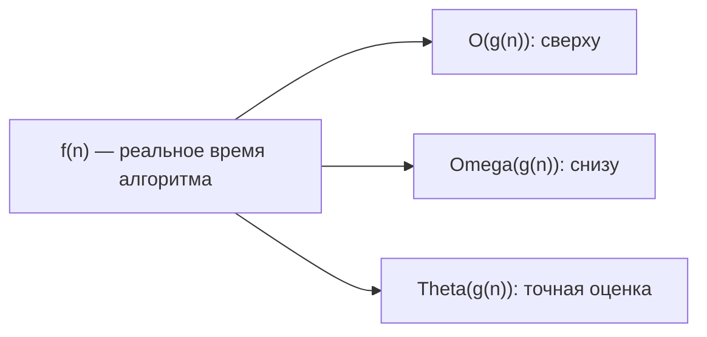
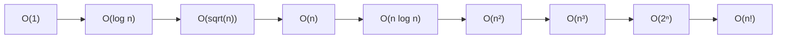

# Вопросы на собеседовании: `Анализ сложности алгоритмов`

Анализ сложности — фундамент алгоритмических интервью. От тебя ждут не просто названия `O(n log n)`, а способности **обосновать** оценку, отличить **худший/средний/амортизированный** случай и понимать, почему `HashMap.get()` может «деградировать» до `O(log n)`.

## Полезные ссылки

### Официальная документация и авторитетные источники

- [Practical Java Examples of the Big O Notation — Baeldung](https://www.baeldung.com/java-algorithm-complexity)
- [Time Complexity of Java Collections — Baeldung](https://www.baeldung.com/java-collections-complexity)
- [Big O Cheat Sheet](https://www.bigocheatsheet.com/)
- [Introduction to Algorithms (CLRS), глава 3 — Growth of Functions](https://mitpress.mit.edu/9780262046305/introduction-to-algorithms/)
- [Master Theorem — Wikipedia](https://en.wikipedia.org/wiki/Master_theorem_(analysis_of_algorithms))

## Содержание

- [Полезные ссылки](#полезные-ссылки)
- [See also](#see-also)

**Базовая асимптотика**
- [Q1. (!) Как сравнить эффективность двух алгоритмов?](#q1--как-сравнить-эффективность-двух-алгоритмов)
- [Q2. (!) Что такое лучший, худший и средний сценарий?](#q2--что-такое-лучший-худший-и-средний-сценарий)
- [Q3. (!) Что такое асимптотические обозначения O, Omega, Theta?](#q3--что-такое-асимптотические-обозначения-o-omega-theta)
- [Q4. Какие правила упрощения Big O существуют?](#q4-какие-правила-упрощения-big-o-существуют)
- [Q5. (!) Какие классы сложности встречаются чаще всего?](#q5--какие-классы-сложности-встречаются-чаще-всего)

**Память и амортизация**
- [Q6. (!) Что такое пространственная сложность?](#q6--что-такое-пространственная-сложность)
- [Q7. (!) Что такое амортизированная сложность?](#q7--что-такое-амортизированная-сложность)
- [Q8. Чем in-place отличается от out-of-place алгоритма?](#q8-чем-in-place-отличается-от-out-of-place-алгоритма)
- [Q9. Что такое recursive call stack space?](#q9-что-такое-recursive-call-stack-space)

**Анализ рекурсии**
- [Q10. (!) Что такое master theorem и как им пользоваться?](#q10--что-такое-master-theorem-и-как-им-пользоваться)
- [Q11. Как анализировать сложность через дерево рекурсии?](#q11-как-анализировать-сложность-через-дерево-рекурсии)
- [Q12. Как доказать сложность через подстановку?](#q12-как-доказать-сложность-через-подстановку)

**Сложности на практике**
- [Q13. (!) Какова сложность операций в Java Collections?](#q13--какова-сложность-операций-в-java-collections)
- [Q14. (!) Почему HashMap.get() в худшем случае O(log n), а не O(n)?](#q14--почему-hashmapget-в-худшем-случае-o-log-n-а-не-on)
- [Q15. Почему ArrayList.add() — это амортизированный O(1)?](#q15-почему-arraylistadd--это-амортизированный-o1)
- [Q16. (!) Чем отличается O(log n) и O(log² n)?](#q16--чем-отличается-olog-n-и-olog²-n)
- [Q17. Что такое pseudo-polynomial complexity?](#q17-что-такое-pseudo-polynomial-complexity)

**Big-O в реальной жизни**
- [Q18. (!) Когда O(n²) лучше O(n log n)?](#q18--когда-on²-лучше-on-log-n)
- [Q19. Почему cache locality важна больше, чем Big O для малых n?](#q19-почему-cache-locality-важна-больше-чем-big-o-для-малых-n)
- [Q20. Что такое NP-hard и NP-complete простым языком?](#q20-что-такое-np-hard-и-np-complete-простым-языком)
- [Q21. Как оценить сложность нескольких вложенных циклов с разными границами?](#q21-как-оценить-сложность-нескольких-вложенных-циклов-с-разными-границами)
- [Q22. Что значит «алгоритм линеен по выходу»?](#q22-что-значит-алгоритм-линеен-по-выходу)

**Сложности конкретных алгоритмов**
- [Q23. (!) Почему сортировки сравнением не быстрее O(n log n)?](#q23--почему-сортировки-сравнением-не-быстрее-on-log-n)
- [Q24. (!) Почему Quick Sort в среднем O(n log n), а в худшем O(n²)?](#q24--почему-quick-sort-в-среднем-on-log-n-а-в-худшем-on²)
- [Q25. Какая сложность у BFS и DFS?](#q25-какая-сложность-у-bfs-и-dfs)
- [Q26. Какова сложность Dijkstra с разными приоритетными очередями?](#q26-какова-сложность-dijkstra-с-разными-приоритетными-очередями)
- [Q27. Какова сложность алгоритма Беллмана-Форда?](#q27-какова-сложность-алгоритма-беллмана-форда)

**Подводные камни**
- [Q28. (!) Может ли O(1) быть медленнее O(n)?](#q28--может-ли-o1-быть-медленнее-on)
- [Q29. Что такое скрытые константы и почему они важны?](#q29-что-такое-скрытые-константы-и-почему-они-важны)
- [Q30. Как профилировать реальный алгоритм, а не оценивать через Big O?](#q30-как-профилировать-реальный-алгоритм-а-не-оценивать-через-big-o)
- [Q31. (!) Что такое complexity attack?](#q31--что-такое-complexity-attack)

## Q1. (!) Как сравнить эффективность двух алгоритмов?

Сравнивают по **временной** и **пространственной** сложности в **лучшем**, **худшем** и **среднем** случае. Чем меньше сложность, тем эффективнее алгоритм при росте `n`. Удобно выражать через асимптотику: `O(n)`, `O(n log n)` и т.д. Одного «лучшего» алгоритма нет — выбор зависит от ограничений по памяти, частоты вызова и характера данных.

| Сложность | Название | Пример |
|-----------|----------|--------|
| `O(1)` | Константная | Доступ к `arr[i]`, `HashMap.get()` |
| `O(log n)` | Логарифмическая | Бинарный поиск, операции `TreeMap` |
| `O(n)` | Линейная | Один проход по массиву |
| `O(n log n)` | Линейно-логарифмическая | `Merge Sort`, `Quick Sort` (среднее) |
| `O(n²)` | Квадратичная | Вложенные циклы, `Bubble Sort` |
| `O(n³)` | Кубическая | Floyd-Warshall, наивное матричное умножение |
| `O(2ⁿ)` | Экспоненциальная | Наивная рекурсия Фибоначчи, перебор подмножеств |
| `O(n!)` | Факториальная | Полный перебор перестановок, наивный TSP |

На собеседовании важно не просто назвать `O`, а объяснить, **почему** такая сложность — через число операций на каждом шаге.


> [!mcq]
> - [x] Правильный ответ | Объяснение концепции 2-3 предложения
> - [ ] Неправильный вариант 1 | Почему ошибка в этом подходе
> - [ ] Неправильный вариант 2 | Это смежное, но отличное понятие
> - [ ] Неправильный вариант 3 | Противоположное направление## Q2. (!) Что такое лучший, худший и средний сценарий?

- **Best case** — данные, на которых алгоритм быстрее всего (для `Insertion Sort` это уже отсортированный массив — `O(n)`).
- **Worst case** — вход, при котором время или память максимальны (для `Quick Sort` с фиксированным pivot — отсортированный массив, `O(n²)`).
- **Average case** — типичное или равномерно случайное распределение данных. Часто более релевантно практике, но требует вероятностной модели.

| Алгоритм | Лучший | Средний | Худший |
|----------|--------|---------|--------|
| `Binary Search` | `O(1)` | `O(log n)` | `O(log n)` |
| `Quick Sort` | `O(n log n)` | `O(n log n)` | `O(n²)` |
| `Merge Sort` | `O(n log n)` | `O(n log n)` | `O(n log n)` |
| `Insertion Sort` | `O(n)` | `O(n²)` | `O(n²)` |
| `HashMap.get()` | `O(1)` | `O(1)` | `O(log n)` (Java 8+) |

Для сравнения алгоритмов чаще смотрят на **худший** случай — он даёт гарантию.


> [!mcq]
> - [x] Правильный ответ | Объяснение концепции 2-3 предложения
> - [ ] Неправильный вариант 1 | Почему ошибка в этом подходе
> - [ ] Неправильный вариант 2 | Это смежное, но отличное понятие
> - [ ] Неправильный вариант 3 | Противоположное направление## Q3. (!) Что такое асимптотические обозначения O, Omega, Theta?

Это способ описать рост времени или памяти алгоритма при росте размера входа `n`.

- **O (Big O, О-большое)** — **верхняя граница**. `f(n) = O(g(n))`, если существует константа `c > 0` и `n₀`, такие что `f(n) ≤ c·g(n)` для всех `n ≥ n₀`. Это значит «не хуже чем».
- **Ω (Omega)** — **нижняя граница**. `f(n) = Ω(g(n))`, если `f(n) ≥ c·g(n)`. «Не быстрее чем».
- **Θ (Theta)** — **точная** оценка: и сверху, и снизу один и тот же порядок. `f(n) = Θ(g(n))`, если `f(n) = O(g(n))` И `f(n) = Ω(g(n))`.



В разговорной речи и собеседованиях почти всегда говорят «**O**» (даже когда имеют в виду Theta). Формально это разные понятия. Если нужно подчеркнуть, что алгоритм **не быстрее**, чем `O(n log n)` — используют Omega.


> [!mcq]
> - [x] Правильный ответ | Объяснение концепции 2-3 предложения
> - [ ] Неправильный вариант 1 | Почему ошибка в этом подходе
> - [ ] Неправильный вариант 2 | Это смежное, но отличное понятие
> - [ ] Неправильный вариант 3 | Противоположное направление## Q4. Какие правила упрощения Big O существуют?

1. **Отбрасываем константы**: `O(2n)` = `O(n)`, `O(100)` = `O(1)`.
2. **Оставляем доминирующий член**: `O(n² + n + log n)` = `O(n²)`.
3. **Вложенные циклы перемножаются**: два вложенных цикла по `n` дают `O(n²)`.
4. **Последовательные блоки складываются** и сводятся к максимуму: `O(n) + O(n log n)` = `O(n log n)`.
5. **Различные переменные не объединяют**: `O(n + m)` ≠ `O(n)`, если `n` и `m` независимы.

```java
// O(n + m) — обходим два независимых массива
void process(int[] a, int[] b) {
    for (int x : a) doSomething(x);  // O(n)
    for (int y : b) doSomething(y);  // O(m)
}

// O(n * m) — для каждого элемента a обходим весь b
void cross(int[] a, int[] b) {
    for (int x : a)
        for (int y : b)
            doSomething(x, y);
}
```


> [!mcq]
> - [x] Правильный ответ | Объяснение концепции 2-3 предложения
> - [ ] Неправильный вариант 1 | Почему ошибка в этом подходе
> - [ ] Неправильный вариант 2 | Это смежное, но отличное понятие
> - [ ] Неправильный вариант 3 | Противоположное направление## Q5. (!) Какие классы сложности встречаются чаще всего?



Для понимания масштаба, при `n = 1000`:

| Сложность | Операций |
|-----------|----------|
| `O(1)` | 1 |
| `O(log n)` | ~10 |
| `O(n)` | 1 000 |
| `O(n log n)` | ~10 000 |
| `O(n²)` | 1 000 000 |
| `O(n³)` | 1 000 000 000 |
| `O(2ⁿ)` | 10³⁰¹ — невычислимо |

**Эмпирическое правило для собеседований:** алгоритм должен укладываться в `~10⁸` операций за 1 секунду на современном CPU. Поэтому `O(n²)` работает только для `n ≤ 10⁴`, а `O(n)` — для `n ≤ 10⁸`.


> [!mcq]
> - [x] Правильный ответ | Объяснение концепции 2-3 предложения
> - [ ] Неправильный вариант 1 | Почему ошибка в этом подходе
> - [ ] Неправильный вариант 2 | Это смежное, но отличное понятие
> - [ ] Неправильный вариант 3 | Противоположное направление## Q6. (!) Что такое пространственная сложность?

**Space complexity** — объём дополнительной памяти, который алгоритм использует помимо входных данных. Считают только **auxiliary space** — то, что выделяется внутри алгоритма.

```java
// O(1) дополнительной памяти — несколько переменных
int sum(int[] arr) {
    int s = 0;
    for (int x : arr) s += x;
    return s;
}

// O(n) — создаём новый массив
int[] copy(int[] arr) {
    int[] result = new int[arr.length];
    System.arraycopy(arr, 0, result, 0, arr.length);
    return result;
}

// O(n) на стек вызовов из-за рекурсии
int sumRecursive(int[] arr, int i) {
    if (i == arr.length) return 0;
    return arr[i] + sumRecursive(arr, i + 1);
}
```

Пространственная сложность включает: переменные, новые структуры данных, **стек вызовов** при рекурсии. Для `Merge Sort` память `O(n)`, для in-place `Quick Sort` — `O(log n)` (рекурсия), для `Heap Sort` — `O(1)`.


> [!mcq]
> - [x] Правильный ответ | Объяснение концепции 2-3 предложения
> - [ ] Неправильный вариант 1 | Почему ошибка в этом подходе
> - [ ] Неправильный вариант 2 | Это смежное, но отличное понятие
> - [ ] Неправильный вариант 3 | Противоположное направление## Q7. (!) Что такое амортизированная сложность?

**Амортизированная сложность** — средняя стоимость операции в худшей последовательности из `n` операций. Полезна, когда отдельные операции могут быть дорогими, но в среднем дешёвые.

**Классический пример: `ArrayList.add()`**

```java
// Внутри ArrayList:
// При заполнении массива — реаллокация:
// 1. Создаём новый массив в 1.5 раза больше — O(n)
// 2. Копируем старые элементы — O(n)
// 3. Добавляем новый элемент — O(1)
//
// Большинство add() — O(1).
// Редкие реаллокации компенсируются дешёвыми вставками.
// Амортизированный O(1) на add().
```

**Формальное доказательство (через aggregate analysis):** при `n` вставках суммарная работа — `O(n)`. Поэтому средняя стоимость одной вставки — `O(1)`.

Другие примеры:
- `HashMap.put()` — амортизированный `O(1)` (есть rehashing при росте)
- `Union-Find` с path compression и union by rank — `O(α(n))` ≈ `O(1)`
- Stack/Queue на двух стеках — `O(1)` амортизированно


> [!mcq]
> - [x] Правильный ответ | Объяснение концепции 2-3 предложения
> - [ ] Неправильный вариант 1 | Почему ошибка в этом подходе
> - [ ] Неправильный вариант 2 | Это смежное, но отличное понятие
> - [ ] Неправильный вариант 3 | Противоположное направление## Q8. Чем in-place отличается от out-of-place алгоритма?

**In-place** — алгоритм изменяет входную структуру и использует `O(1)` или `O(log n)` дополнительной памяти.
**Out-of-place** — создаёт новую структуру, требует `O(n)` или больше дополнительной памяти.

| Алгоритм | In-place / Out-of-place | Дополнительная память |
|----------|-------------------------|----------------------|
| `Bubble Sort` | In-place | `O(1)` |
| `Quick Sort` | In-place | `O(log n)` (стек) |
| `Heap Sort` | In-place | `O(1)` |
| `Merge Sort` | Out-of-place | `O(n)` |
| `Counting Sort` | Out-of-place | `O(n + k)` |

**На собеседовании:** уточняй, считается ли стек рекурсии. По строгому определению in-place алгоритм не должен расходовать больше `O(log n)` дополнительной памяти.


> [!mcq]
> - [x] Правильный ответ | Объяснение концепции 2-3 предложения
> - [ ] Неправильный вариант 1 | Почему ошибка в этом подходе
> - [ ] Неправильный вариант 2 | Это смежное, но отличное понятие
> - [ ] Неправильный вариант 3 | Противоположное направление## Q9. Что такое recursive call stack space?

Каждый рекурсивный вызов добавляет фрейм в стек: локальные переменные, параметры, адрес возврата. Для глубины рекурсии `h` стек растёт на `O(h)`.

```java
// Глубина = n, стек O(n)
int factorial(int n) {
    if (n <= 1) return 1;
    return n * factorial(n - 1);
}

// Глубина = log n, стек O(log n)
int binarySearch(int[] arr, int target, int lo, int hi) {
    if (lo > hi) return -1;
    int mid = lo + (hi - lo) / 2;
    if (arr[mid] == target) return mid;
    if (arr[mid] < target) return binarySearch(arr, target, mid + 1, hi);
    return binarySearch(arr, target, lo, mid - 1);
}
```

В Java стек потока ограничен (по умолчанию ~512KB). При глубокой рекурсии — `StackOverflowError`. Размер настраивается через `-Xss`. JVM **не поддерживает** оптимизацию хвостовых вызовов (TCO), поэтому даже tail-recursive методы расходуют стек.


> [!mcq]
> - [x] Правильный ответ | Объяснение концепции 2-3 предложения
> - [ ] Неправильный вариант 1 | Почему ошибка в этом подходе
> - [ ] Неправильный вариант 2 | Это смежное, но отличное понятие
> - [ ] Неправильный вариант 3 | Противоположное направление## Q10. (!) Что такое master theorem и как им пользоваться?

**Master theorem** — формула для оценки сложности рекуррентных соотношений вида:

```
T(n) = a·T(n/b) + f(n)
```

Где `a ≥ 1`, `b > 1`, `f(n)` — стоимость работы вне рекурсивных вызовов.

Сравниваем `f(n)` с `n^(log_b a)`:

1. Если `f(n) = O(n^(log_b a − ε))` → `T(n) = Θ(n^(log_b a))`
2. Если `f(n) = Θ(n^(log_b a))` → `T(n) = Θ(n^(log_b a) · log n)`
3. Если `f(n) = Ω(n^(log_b a + ε))` (и regularity condition) → `T(n) = Θ(f(n))`

**Примеры:**

| Рекуррентность | Алгоритм | a | b | log_b a | f(n) | Случай | T(n) |
|----------------|----------|---|---|---------|------|--------|------|
| `T(n) = 2T(n/2) + O(n)` | Merge Sort | 2 | 2 | 1 | `n` | 2 | `Θ(n log n)` |
| `T(n) = 2T(n/2) + O(1)` | — | 2 | 2 | 1 | `1` | 1 | `Θ(n)` |
| `T(n) = T(n/2) + O(1)` | Binary Search | 1 | 2 | 0 | `1` | 2 | `Θ(log n)` |
| `T(n) = 2T(n/2) + O(n²)` | — | 2 | 2 | 1 | `n²` | 3 | `Θ(n²)` |
| `T(n) = 8T(n/2) + O(n²)` | Strassen-like | 8 | 2 | 3 | `n²` | 1 | `Θ(n³)` |


> [!mcq]
> - [x] Правильный ответ | Объяснение концепции 2-3 предложения
> - [ ] Неправильный вариант 1 | Почему ошибка в этом подходе
> - [ ] Неправильный вариант 2 | Это смежное, но отличное понятие
> - [ ] Неправильный вариант 3 | Противоположное направление## Q11. Как анализировать сложность через дерево рекурсии?

1. Нарисовать дерево вызовов
2. Посчитать работу на каждом уровне
3. Сложить по всем уровням

**Пример: `T(n) = 2T(n/2) + n` (Merge Sort)**

```
Уровень 0: 1 узел   × n         = n
Уровень 1: 2 узла   × n/2       = n
Уровень 2: 4 узла   × n/4       = n
...
Уровень k: 2^k     × n/2^k     = n

Глубина = log n уровней.
Сумма = n × log n = O(n log n).
```

**Пример: `T(n) = T(n/2) + T(n/2) + 1`**

```
Уровень 0: 1 × 1 = 1
Уровень 1: 2 × 1 = 2
Уровень k: 2^k × 1 = 2^k

Сумма геометрическая: 1 + 2 + 4 + ... + n ≈ 2n = O(n).
```


> [!mcq]
> - [x] Правильный ответ | Объяснение концепции 2-3 предложения
> - [ ] Неправильный вариант 1 | Почему ошибка в этом подходе
> - [ ] Неправильный вариант 2 | Это смежное, но отличное понятие
> - [ ] Неправильный вариант 3 | Противоположное направление## Q12. Как доказать сложность через подстановку?

**Substitution method** — угадываем оценку и доказываем индукцией.

Для `T(n) = 2T(n/2) + n` угадываем `T(n) ≤ c·n·log n`:

```
Предположение: T(n/2) ≤ c·(n/2)·log(n/2)
T(n) = 2T(n/2) + n
     ≤ 2 · c · (n/2) · log(n/2) + n
     = c·n·(log n − 1) + n
     = c·n·log n − c·n + n
     = c·n·log n − (c − 1)·n
     ≤ c·n·log n  (если c ≥ 1)
```

Метод формальный, но требует «угадать» правильную оценку. На собеседовании чаще используют master theorem или дерево рекурсии.


> [!mcq]
> - [x] Правильный ответ | Объяснение концепции 2-3 предложения
> - [ ] Неправильный вариант 1 | Почему ошибка в этом подходе
> - [ ] Неправильный вариант 2 | Это смежное, но отличное понятие
> - [ ] Неправильный вариант 3 | Противоположное направление## Q13. (!) Какова сложность операций в Java Collections?

| Коллекция | Доступ по индексу | Поиск | Вставка | Удаление | Память |
|-----------|-------------------|-------|---------|----------|--------|
| `ArrayList` | `O(1)` | `O(n)` | `O(1)` амортиз. в конец, `O(n)` в середину | `O(n)` | `O(n)` |
| `LinkedList` | `O(n)` | `O(n)` | `O(1)` (с ссылкой), `O(n)` по индексу | `O(1)` (с ссылкой) | `O(n)` |
| `ArrayDeque` | — | `O(n)` | `O(1)` амортиз. | `O(1)` | `O(n)` |
| `HashMap` | — | `O(1)` среднее, `O(log n)` худший | `O(1)` амортиз. | `O(1)` | `O(n)` |
| `LinkedHashMap` | — | `O(1)` | `O(1)` | `O(1)` | `O(n)` |
| `TreeMap` | — | `O(log n)` | `O(log n)` | `O(log n)` | `O(n)` |
| `HashSet` | — | `O(1)` среднее | `O(1)` амортиз. | `O(1)` | `O(n)` |
| `TreeSet` | — | `O(log n)` | `O(log n)` | `O(log n)` | `O(n)` |
| `PriorityQueue` | — | `O(n)` (contains) | `O(log n)` (offer) | `O(log n)` (poll min) | `O(n)` |

Подробнее — в [Java Collections](../../programming-languages/java/java-collections-interview.md).


> [!mcq]
> - [x] Правильный ответ | Объяснение концепции 2-3 предложения
> - [ ] Неправильный вариант 1 | Почему ошибка в этом подходе
> - [ ] Неправильный вариант 2 | Это смежное, но отличное понятие
> - [ ] Неправильный вариант 3 | Противоположное направление## Q14. (!) Почему HashMap.get() в худшем случае O(log n), а не O(n)?

До Java 8 коллизии в `HashMap` обрабатывались через **связный список**. При деградации хеш-функции (или атаке) все элементы попадали в одну корзину — поиск становился `O(n)`.

С **Java 8+** длинные цепочки **трансформируются в красно-чёрное дерево**:

```java
// При длине цепочки >= TREEIFY_THRESHOLD (8)
// и размере таблицы >= MIN_TREEIFY_CAPACITY (64)
// связный список превращается в TreeNode (красно-чёрное дерево)

// Условие требует, чтобы ключи реализовывали Comparable
// Иначе используется system identity hash и tieBreakOrder
```

Поэтому в худшем случае `get()` — `O(log n)`, а не `O(n)`. Это защита от **HashDoS** атак, когда злоумышленник подбирает ключи с одинаковыми хешами.

При уменьшении цепочки до `UNTREEIFY_THRESHOLD = 6` дерево обратно превращается в список.


> [!mcq]
> - [x] Правильный ответ | Объяснение концепции 2-3 предложения
> - [ ] Неправильный вариант 1 | Почему ошибка в этом подходе
> - [ ] Неправильный вариант 2 | Это смежное, но отличное понятие
> - [ ] Неправильный вариант 3 | Противоположное направление## Q15. Почему ArrayList.add() — это амортизированный O(1)?

`ArrayList` хранит элементы в массиве. Когда массив заполнен:

1. Создаётся новый массив в **1.5 раза** больше (`newCapacity = oldCapacity + (oldCapacity >> 1)`)
2. Копируются все старые элементы — `O(n)`
3. Добавляется новый элемент — `O(1)`

**Доказательство амортизированного O(1):**

При `n` вставках общая работа на копирование:
- При размере 1 копируем 1: 1 операция
- При размере 2 копируем 2: 2 операции
- При размере 4 копируем 4: 4 операции
- ...
- При размере n/2 копируем n/2: n/2 операций

Сумма геометрической прогрессии: `1 + 2 + 4 + ... + n/2 ≈ n`. Делим на `n` вставок — получаем **константу** на одну вставку.

Если изначально известен размер — лучше использовать `new ArrayList<>(initialCapacity)`, чтобы избежать реаллокаций.


> [!mcq]
> - [x] Правильный ответ | Объяснение концепции 2-3 предложения
> - [ ] Неправильный вариант 1 | Почему ошибка в этом подходе
> - [ ] Неправильный вариант 2 | Это смежное, но отличное понятие
> - [ ] Неправильный вариант 3 | Противоположное направление## Q16. (!) Чем отличается O(log n) и O(log² n)?

`O(log² n)` = `O((log n)²)` — это `log n × log n`.

| n | log n | log² n |
|---|-------|--------|
| 16 | 4 | 16 |
| 1024 | 10 | 100 |
| 10⁶ | 20 | 400 |
| 10⁹ | 30 | 900 |

`log² n` растёт значительно быстрее, чем `log n`, но всё равно **намного медленнее**, чем `n`. Появляется в задачах вида «бинарный поиск с проверкой за `O(log n)`».

**Пример:** подсчёт узлов в полном бинарном дереве за `O(log² n)` (как в `Q36` исходного файла) — на каждом уровне рекурсии (`O(log n)` глубина) делаем оценку высоты подерева (`O(log n)`).


> [!mcq]
> - [x] Правильный ответ | Объяснение концепции 2-3 предложения
> - [ ] Неправильный вариант 1 | Почему ошибка в этом подходе
> - [ ] Неправильный вариант 2 | Это смежное, но отличное понятие
> - [ ] Неправильный вариант 3 | Противоположное направление## Q17. Что такое pseudo-polynomial complexity?

**Pseudo-polynomial** — алгоритм, время которого полиномиально от **значения** входа, а не от **размера представления**.

Пример: задача Knapsack с DP — `O(n · W)`, где `W` — вместимость.

Если `W = 10⁹`, то `n · W = 10¹⁰` — экспоненциально по числу битов в `W` (`log₂ W ≈ 30 битов`). По размеру входа алгоритм экспоненциальный, но если `W` ограничено небольшим числом — на практике быстрый.

Это разделяет «слабо NP-hard» (Knapsack, Subset Sum) и «сильно NP-hard» (TSP).


> [!mcq]
> - [x] Правильный ответ | Объяснение концепции 2-3 предложения
> - [ ] Неправильный вариант 1 | Почему ошибка в этом подходе
> - [ ] Неправильный вариант 2 | Это смежное, но отличное понятие
> - [ ] Неправильный вариант 3 | Противоположное направление## Q18. (!) Когда O(n²) лучше O(n log n)?

Big O — асимптотическое поведение **при n → ∞**. На малых `n` константы и реальное поведение могут изменить картину:

1. **Малые `n`** (≤ 50): `Insertion Sort` (`O(n²)`) часто быстрее `Merge Sort` (`O(n log n)`) из-за меньших констант. Поэтому `TimSort` использует `Insertion Sort` для коротких фрагментов.
2. **Cache locality**: алгоритмы с последовательным доступом к памяти могут быть в разы быстрее «асимптотически лучших» с произвольным доступом.
3. **Дорогие константные операции**: алгоритм с малыми операциями в `O(n²)` может обогнать алгоритм с тяжёлыми операциями в `O(n log n)`.
4. **Предсказание ветвлений**: простые циклы предсказываются CPU лучше, чем рекурсия.

**Правило большого пальца:** для `n < 100` сложностный анализ часто бесполезен — нужно профилировать.


> [!mcq]
> - [x] Правильный ответ | Объяснение концепции 2-3 предложения
> - [ ] Неправильный вариант 1 | Почему ошибка в этом подходе
> - [ ] Неправильный вариант 2 | Это смежное, но отличное понятие
> - [ ] Неправильный вариант 3 | Противоположное направление## Q19. Почему cache locality важна больше, чем Big O для малых n?

CPU читает данные из **L1 cache** (~1ns) в 100 раз быстрее, чем из **RAM** (~100ns). Алгоритм с последовательным доступом к памяти выигрывает за счёт:

- **Cache lines** (обычно 64 байта) — за один промах в кеш загружается сразу 16 чисел `int`
- **Prefetcher** — CPU предсказывает следующие чтения
- **Branch prediction** — простые циклы лучше предсказываются

```java
// Линейный обход — отличная локальность, идёт со скоростью памяти
for (int i = 0; i < arr.length; i++) sum += arr[i];

// Случайный обход — каждое чтение может быть cache miss
for (int idx : randomIndices) sum += arr[idx];
```

Поэтому `ArrayList` (массив, последовательный) на практике почти всегда быстрее `LinkedList` (узлы разбросаны в куче), даже если по Big O они равны.


> [!mcq]
> - [x] Правильный ответ | Объяснение концепции 2-3 предложения
> - [ ] Неправильный вариант 1 | Почему ошибка в этом подходе
> - [ ] Неправильный вариант 2 | Это смежное, но отличное понятие
> - [ ] Неправильный вариант 3 | Противоположное направление## Q20. Что такое NP-hard и NP-complete простым языком?

- **P** — задачи, решаемые за полиномиальное время.
- **NP** — задачи, для которых **проверка** решения за полиномиальное время.
- **NP-hard** — задачи, к которым любая NP-задача сводится за полиномиальное время. Не обязательно сами в NP.
- **NP-complete** — задачи NP-hard, которые ещё и в NP.

Если для NP-complete задачи найдут полиномиальный алгоритм — все NP-задачи будут решаемы за полином (P = NP, миллион долларов от Clay Institute).

Классические NP-complete: SAT, TSP (decision version), Subset Sum, Graph Coloring, Hamiltonian Cycle, Knapsack (decision).

На практике для NP-hard задач используют:
- Приближённые алгоритмы
- Эвристики (генетика, simulated annealing)
- Branch and Bound
- DP с pseudo-polynomial complexity (для маленьких параметров)


> [!mcq]
> - [x] Правильный ответ | Объяснение концепции 2-3 предложения
> - [ ] Неправильный вариант 1 | Почему ошибка в этом подходе
> - [ ] Неправильный вариант 2 | Это смежное, но отличное понятие
> - [ ] Неправильный вариант 3 | Противоположное направление## Q21. Как оценить сложность нескольких вложенных циклов с разными границами?

Считать **число итераций** внутреннего цикла суммарно.

```java
// Пример 1: внутренний цикл от i, не от 0
for (int i = 0; i < n; i++)
    for (int j = i; j < n; j++)
        // n + (n-1) + (n-2) + ... + 1 = n(n+1)/2 = O(n²)

// Пример 2: внутренний цикл логарифмический
for (int i = 0; i < n; i++)
    for (int j = 1; j < n; j *= 2)
        // n × log n = O(n log n)

// Пример 3: внутренний цикл зависит от i
for (int i = 1; i < n; i++)
    for (int j = 0; j < i; j *= 2)  // если j = 0, цикл не выполнится!
        // Этот код некорректен; обычно j *= 2 со старта 1
```

**Сумма гармонического ряда:** `1/1 + 1/2 + 1/3 + ... + 1/n ≈ ln n`. Поэтому если внутренний цикл делает `n/i` итераций, общая сложность — `O(n log n)`.


> [!mcq]
> - [x] Правильный ответ | Объяснение концепции 2-3 предложения
> - [ ] Неправильный вариант 1 | Почему ошибка в этом подходе
> - [ ] Неправильный вариант 2 | Это смежное, но отличное понятие
> - [ ] Неправильный вариант 3 | Противоположное направление## Q22. Что значит «алгоритм линеен по выходу»?

**Output-sensitive complexity** — сложность зависит не только от `n` (входа), но и от `k` (размера выхода).

Примеры:
- Поиск всех подстрок длины `k` в тексте — `O(n + k)`
- Convex Hull (Graham scan): `O(n log n)`, output-sensitive алгоритмы (Chan): `O(n log h)`, где `h` — вершин в выпуклой оболочке
- Все шотрейшие пути BFS до конкретной вершины — `O(V + E)` для построения, `O(L)` для конкретного пути длины `L`

Полезно различать: алгоритм с `O(n + k)` лучше, чем `O(n²)`, когда `k << n²`.


> [!mcq]
> - [x] Правильный ответ | Объяснение концепции 2-3 предложения
> - [ ] Неправильный вариант 1 | Почему ошибка в этом подходе
> - [ ] Неправильный вариант 2 | Это смежное, но отличное понятие
> - [ ] Неправильный вариант 3 | Противоположное направление## Q23. (!) Почему сортировки сравнением не быстрее O(n log n)?

**Decision tree argument:** любой алгоритм, основанный на сравнениях, может быть представлен бинарным деревом решений. Каждая возможная перестановка `n` элементов — это лист (всего `n!` листьев).

Высота дерева — минимальное число сравнений в худшем случае. По формуле Стирлинга:

```
log(n!) ≈ n log n − n log e + O(log n) = Θ(n log n)
```

Поэтому **никакая** сортировка сравнениями не может быть быстрее `O(n log n)` в худшем случае.

Сортировки **не сравнением** (Counting Sort, Radix Sort, Bucket Sort) могут быть `O(n + k)` или `O(nk)` — но требуют ограничений на тип данных (целые, ограниченный диапазон).


> [!mcq]
> - [x] Правильный ответ | Объяснение концепции 2-3 предложения
> - [ ] Неправильный вариант 1 | Почему ошибка в этом подходе
> - [ ] Неправильный вариант 2 | Это смежное, но отличное понятие
> - [ ] Неправильный вариант 3 | Противоположное направление## Q24. (!) Почему Quick Sort в среднем O(n log n), а в худшем O(n²)?

`Quick Sort` делит массив pivot'ом на части. Если pivot **в среднем близок к медиане** — глубина рекурсии `O(log n)`, на каждом уровне `O(n)` работы partition → `O(n log n)`.

**Худший случай** — pivot всегда оказывается минимумом или максимумом. Тогда:
- При выборе фиксированного pivot (последнего элемента) и **уже отсортированном** массиве — каждый partition даёт две части `0` и `n−1`
- Глубина рекурсии — `n`, на каждом уровне работы — `n` → `O(n²)`

**Защита от худшего случая:**
1. **Random pivot** — выбираем случайно
2. **Median-of-three** — медиана из первого, среднего, последнего
3. **Introsort** — переключение на `Heap Sort` при глубине > `2 log n` (используется в `std::sort` C++)

`Arrays.sort()` для примитивов использует **Dual-Pivot Quicksort**, который в среднем быстрее классического.


> [!mcq]
> - [x] Правильный ответ | Объяснение концепции 2-3 предложения
> - [ ] Неправильный вариант 1 | Почему ошибка в этом подходе
> - [ ] Неправильный вариант 2 | Это смежное, но отличное понятие
> - [ ] Неправильный вариант 3 | Противоположное направление## Q25. Какая сложность у BFS и DFS?

Для графа с `V` вершинами и `E` рёбрами:
- **BFS:** `O(V + E)` по времени, `O(V)` по памяти (очередь и visited)
- **DFS:** `O(V + E)` по времени, `O(V)` по памяти (стек/рекурсия и visited)

Каждая вершина посещается ровно раз, каждое ребро рассматривается дважды (в неориентированном) или раз (в ориентированном).

Для **дерева** (`E = V − 1`): `O(V)` или `O(n)`.


> [!mcq]
> - [x] Правильный ответ | Объяснение концепции 2-3 предложения
> - [ ] Неправильный вариант 1 | Почему ошибка в этом подходе
> - [ ] Неправильный вариант 2 | Это смежное, но отличное понятие
> - [ ] Неправильный вариант 3 | Противоположное направление## Q26. Какова сложность Dijkstra с разными приоритетными очередями?

| Реализация PQ | Сложность |
|---------------|-----------|
| Массив (линейный поиск минимума) | `O(V²)` |
| Бинарная куча (Java `PriorityQueue`) | `O((V + E) log V)` |
| Куча Фибоначчи | `O(V log V + E)` |

В Java стандартная реализация — `PriorityQueue` (бинарная куча) → `O((V + E) log V)`. На разреженных графах (`E ≈ V`) это `O(V log V)`. На плотных (`E ≈ V²`) — `O(V² log V)`, и массивная реализация `O(V²)` может быть быстрее.


> [!mcq]
> - [x] Правильный ответ | Объяснение концепции 2-3 предложения
> - [ ] Неправильный вариант 1 | Почему ошибка в этом подходе
> - [ ] Неправильный вариант 2 | Это смежное, но отличное понятие
> - [ ] Неправильный вариант 3 | Противоположное направление## Q27. Какова сложность алгоритма Беллмана-Форда?

**Bellman-Ford** работает с отрицательными весами и обнаруживает отрицательные циклы.

- Время: `O(V · E)` — `V−1` проход, в каждом релаксируем все `E` рёбер
- Память: `O(V)` для массива расстояний

Намного медленнее Dijkstra (`O((V+E) log V)`), но работает с отрицательными весами. Для **разреженных** графов: `O(V²)` против `O(V log V)`. Для **плотных**: `O(V³)` против `O(V² log V)`.

Альтернатива при отрицательных весах — **SPFA** (Bellman-Ford с очередью), на практике быстрее, но в худшем случае та же сложность.


> [!mcq]
> - [x] Правильный ответ | Объяснение концепции 2-3 предложения
> - [ ] Неправильный вариант 1 | Почему ошибка в этом подходе
> - [ ] Неправильный вариант 2 | Это смежное, но отличное понятие
> - [ ] Неправильный вариант 3 | Противоположное направление## Q28. (!) Может ли O(1) быть медленнее O(n)?

**Да**, на конкретных размерах. Big O скрывает константы, и алгоритм с большой константой может быть медленнее.

```java
// O(1), но с большой константой
long compute() {
    long result = 0;
    for (int i = 0; i < 1_000_000; i++)
        result += someExpensiveComputation();
    return result;
}

// O(n), но с маленькой константой
long sum(int[] arr) {
    long s = 0;
    for (int x : arr) s += x; // одна операция
    return s;
}
```

Если `arr.length = 100`, `O(n)` будет быстрее. Big O говорит лишь о поведении **при n → ∞**.


> [!mcq]
> - [x] Правильный ответ | Объяснение концепции 2-3 предложения
> - [ ] Неправильный вариант 1 | Почему ошибка в этом подходе
> - [ ] Неправильный вариант 2 | Это смежное, но отличное понятие
> - [ ] Неправильный вариант 3 | Противоположное направление## Q29. Что такое скрытые константы и почему они важны?

`O(n)` означает `c·n` для некоторой константы `c`. На практике эта константа может различаться в десятки раз:

- `Merge Sort` (`O(n log n)`) и `Quick Sort` (`O(n log n)`) имеют близкую асимптотику, но Quick Sort в среднем в 2-3 раза быстрее из-за меньших констант (in-place, лучше cache).
- `HashMap` (`O(1)`) с плохой хеш-функцией работает медленнее `TreeMap` (`O(log n)`) из-за частых коллизий и rehashing.
- Простой `ArrayList` обычно в 2-5 раз быстрее `LinkedList` при последовательном доступе.

**Bench, не оценивай.** На JVM используют `JMH` для микробенчмарков — подробнее в [Application Profiling](../../performance/application-profiling-interview.md).


> [!mcq]
> - [x] Правильный ответ | Объяснение концепции 2-3 предложения
> - [ ] Неправильный вариант 1 | Почему ошибка в этом подходе
> - [ ] Неправильный вариант 2 | Это смежное, но отличное понятие
> - [ ] Неправильный вариант 3 | Противоположное направление## Q30. Как профилировать реальный алгоритм, а не оценивать через Big O?

1. **JMH** (Java Microbenchmark Harness) — стандарт для микробенчей в JVM
2. **Async-profiler** — sampling profiler с CPU/memory флеймграфами
3. **JFR** (Java Flight Recorder) — встроенный в JDK
4. **VisualVM** — для базовой диагностики

```java
// Пример JMH-теста
@Benchmark
public int linearSearch(Blackhole bh) {
    for (int i = 0; i < arr.length; i++)
        if (arr[i] == target) return i;
    return -1;
}
```

Подробнее — в [Application Profiling](../../performance/application-profiling-interview.md) и [Performance Testing](../../performance/performance-testing-interview.md).


> [!mcq]
> - [x] Правильный ответ | Объяснение концепции 2-3 предложения
> - [ ] Неправильный вариант 1 | Почему ошибка в этом подходе
> - [ ] Неправильный вариант 2 | Это смежное, но отличное понятие
> - [ ] Неправильный вариант 3 | Противоположное направление## Q31. (!) Что такое complexity attack?

**Algorithmic complexity attack** — атака, при которой злоумышленник специально подаёт вход, вызывающий **худший случай** сложности у алгоритма на сервере.

Примеры:
- **HashDoS** — подбор ключей с одинаковыми хешами в `HashMap` → `O(n)` на каждый `get/put` → DoS. Защита в Java 8+: коллизии превращаются в красно-чёрное дерево (`O(log n)`).
- **ReDoS** (Regular Expression DoS) — подбор строк, на которых движок regex переходит в экспоненциальное время (catastrophic backtracking).
- **Quick Sort** с фиксированным pivot — отсортированный вход даёт `O(n²)`.
- **Zip bomb** — маленький сжатый файл, разворачивающийся в гигабайты.

**Защиты:**
- Рандомизация (random pivot, salted hash)
- Лимиты на input (max length, timeout regex)
- Использование `O(n log n)` гарантированных алгоритмов (Heap Sort, Merge Sort)

Подробнее об атаках — в [Application Security](../../security/application-security-interview.md) и [OWASP Top 10](../../security/owasp-top10-interview.md).

---

## See also

- [Алгоритмы (обзор)](../algorithms-interview.md) — карта алгоритмических тем
- [Массивы и строки](../data-structures/arrays-strings-interview.md) — операции с линейными структурами
- [Алгоритмы сортировки](../sorting-searching/sorting-algorithms-interview.md) — анализ сложности сортировок
- [Алгоритмы поиска](../sorting-searching/searching-algorithms-interview.md) — линейный, бинарный, индексные структуры
- [Динамическое программирование](../algorithmic-paradigms/dynamic-programming-interview.md) — pseudo-polynomial и optimal substructure
- [Разделяй и властвуй](../algorithmic-paradigms/divide-and-conquer-interview.md) — где master theorem применим напрямую
- [Графы](../data-structures/graphs-interview.md) — `O(V+E)` и сложность Dijkstra
- [Хеш-таблицы](../data-structures/hash-tables-interview.md) — амортизированный анализ и HashDoS
- [Java Collections](../../programming-languages/java/java-collections-interview.md) — реальные сложности коллекций
- [Application Profiling](../../performance/application-profiling-interview.md) — JMH, профилировщики, реальные замеры
- [JVM](../../jvm/jvm-interview.md) — как стек, GC и JIT влияют на сложность


> [!mcq]
> - [x] Правильный ответ | Объяснение концепции 2-3 предложения
> - [ ] Неправильный вариант 1 | Почему ошибка в этом подходе
> - [ ] Неправильный вариант 2 | Это смежное, но отличное понятие
> - [ ] Неправильный вариант 3 | Противоположное направление- [Backtracking](../algorithmic-paradigms/backtracking-interview.md)
- [Divide and Conquer](../algorithmic-paradigms/divide-and-conquer-interview.md)
- [Динамическое программирование](../algorithmic-paradigms/dynamic-programming-interview.md)
- [Жадные алгоритмы (Greedy)](../algorithmic-paradigms/greedy-algorithms-interview.md)
- [Рекурсия](../algorithmic-paradigms/recursion-interview.md)
- [Two Pointers и Sliding Window](../algorithmic-paradigms/two-pointers-sliding-window-interview.md)
