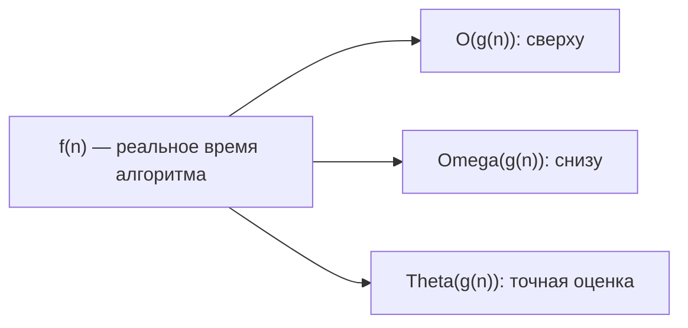
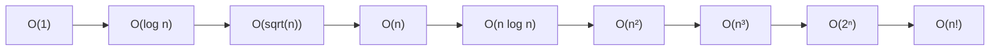

# Вопросы на собеседовании: `Анализ сложности алгоритмов`

Анализ сложности — фундамент алгоритмических интервью. От тебя ждут не просто названия `O(n log n)`, а способности **обосновать** оценку, отличить **худший/средний/амортизированный** случай и понимать, почему `HashMap.get()` может «деградировать» до `O(log n)`.

## Полезные ссылки

### Официальная документация и авторитетные источники

- [Practical Java Examples of the Big O Notation — Baeldung](https://www.baeldung.com/java-algorithm-complexity)
- [Time Complexity of Java Collections — Baeldung](https://www.baeldung.com/java-collections-complexity)
- [Big O Cheat Sheet](https://www.bigocheatsheet.com/)
- [Introduction to Algorithms (CLRS), глава 3 — Growth of Functions](https://mitpress.mit.edu/9780262046305/introduction-to-algorithms/)
- [Master Theorem — Wikipedia](https://en.wikipedia.org/wiki/Master_theorem_(analysis_of_algorithms))

## Содержание

- [Полезные ссылки](#полезные-ссылки)
- [See also](#see-also)

**Базовая асимптотика**
- [Q1. (!) Как сравнить эффективность двух алгоритмов?](#q1--как-сравнить-эффективность-двух-алгоритмов)
- [Q2. (!) Что такое лучший, худший и средний сценарий?](#q2--что-такое-лучший-худший-и-средний-сценарий)
- [Q3. (!) Что такое асимптотические обозначения O, Omega, Theta?](#q3--что-такое-асимптотические-обозначения-o-omega-theta)
- [Q4. Какие правила упрощения Big O существуют?](#q4-какие-правила-упрощения-big-o-существуют)
- [Q5. (!) Какие классы сложности встречаются чаще всего?](#q5--какие-классы-сложности-встречаются-чаще-всего)

**Память и амортизация**
- [Q6. (!) Что такое пространственная сложность?](#q6--что-такое-пространственная-сложность)
- [Q7. (!) Что такое амортизированная сложность?](#q7--что-такое-амортизированная-сложность)
- [Q8. Чем in-place отличается от out-of-place алгоритма?](#q8-чем-in-place-отличается-от-out-of-place-алгоритма)
- [Q9. Что такое recursive call stack space?](#q9-что-такое-recursive-call-stack-space)

**Анализ рекурсии**
- [Q10. (!) Что такое master theorem и как им пользоваться?](#q10--что-такое-master-theorem-и-как-им-пользоваться)
- [Q11. Как анализировать сложность через дерево рекурсии?](#q11-как-анализировать-сложность-через-дерево-рекурсии)
- [Q12. Как доказать сложность через подстановку?](#q12-как-доказать-сложность-через-подстановку)

**Сложности на практике**
- [Q13. (!) Какова сложность операций в Java Collections?](#q13--какова-сложность-операций-в-java-collections)
- [Q14. (!) Почему HashMap.get() в худшем случае O(log n), а не O(n)?](#q14--почему-hashmapget-в-худшем-случае-o-log-n-а-не-on)
- [Q15. Почему ArrayList.add() — это амортизированный O(1)?](#q15-почему-arraylistadd--это-амортизированный-o1)
- [Q16. (!) Чем отличается O(log n) и O(log² n)?](#q16--чем-отличается-olog-n-и-olog²-n)
- [Q17. Что такое pseudo-polynomial complexity?](#q17-что-такое-pseudo-polynomial-complexity)

**Big-O в реальной жизни**
- [Q18. (!) Когда O(n²) лучше O(n log n)?](#q18--когда-on²-лучше-on-log-n)
- [Q19. Почему cache locality важна больше, чем Big O для малых n?](#q19-почему-cache-locality-важна-больше-чем-big-o-для-малых-n)
- [Q20. Что такое NP-hard и NP-complete простым языком?](#q20-что-такое-np-hard-и-np-complete-простым-языком)
- [Q21. Как оценить сложность нескольких вложенных циклов с разными границами?](#q21-как-оценить-сложность-нескольких-вложенных-циклов-с-разными-границами)
- [Q22. Что значит «алгоритм линеен по выходу»?](#q22-что-значит-алгоритм-линеен-по-выходу)

**Сложности конкретных алгоритмов**
- [Q23. (!) Почему сортировки сравнением не быстрее O(n log n)?](#q23--почему-сортировки-сравнением-не-быстрее-on-log-n)
- [Q24. (!) Почему Quick Sort в среднем O(n log n), а в худшем O(n²)?](#q24--почему-quick-sort-в-среднем-on-log-n-а-в-худшем-on²)
- [Q25. Какая сложность у BFS и DFS?](#q25-какая-сложность-у-bfs-и-dfs)
- [Q26. Какова сложность Dijkstra с разными приоритетными очередями?](#q26-какова-сложность-dijkstra-с-разными-приоритетными-очередями)
- [Q27. Какова сложность алгоритма Беллмана-Форда?](#q27-какова-сложность-алгоритма-беллмана-форда)

**Подводные камни**
- [Q28. (!) Может ли O(1) быть медленнее O(n)?](#q28--может-ли-o1-быть-медленнее-on)
- [Q29. Что такое скрытые константы и почему они важны?](#q29-что-такое-скрытые-константы-и-почему-они-важны)
- [Q30. Как профилировать реальный алгоритм, а не оценивать через Big O?](#q30-как-профилировать-реальный-алгоритм-а-не-оценивать-через-big-o)
- [Q31. (!) Что такое complexity attack?](#q31--что-такое-complexity-attack)

## Q1. (!) Как сравнить эффективность двух алгоритмов?

Сравнивают по **временной** и **пространственной** сложности в **лучшем**, **худшем** и **среднем** случае. Чем меньше сложность, тем эффективнее алгоритм при росте `n`. Удобно выражать через асимптотику: `O(n)`, `O(n log n)` и т.д. Одного «лучшего» алгоритма нет — выбор зависит от ограничений по памяти, частоты вызова и характера данных.

| Сложность | Название | Пример |
|-----------|----------|--------|
| `O(1)` | Константная | Доступ к `arr[i]`, `HashMap.get()` |
| `O(log n)` | Логарифмическая | Бинарный поиск, операции `TreeMap` |
| `O(n)` | Линейная | Один проход по массиву |
| `O(n log n)` | Линейно-логарифмическая | `Merge Sort`, `Quick Sort` (среднее) |
| `O(n²)` | Квадратичная | Вложенные циклы, `Bubble Sort` |
| `O(n³)` | Кубическая | Floyd-Warshall, наивное матричное умножение |
| `O(2ⁿ)` | Экспоненциальная | Наивная рекурсия Фибоначчи, перебор подмножеств |
| `O(n!)` | Факториальная | Полный перебор перестановок, наивный TSP |

На собеседовании важно не просто назвать `O`, а объяснить, **почему** такая сложность — через число операций на каждом шаге.


> [!mcq] Как корректно сравнить эффективность двух алгоритмов перед выбором для production?
>
> - [ ] A. Запустить оба на одном наборе данных и замерить время выполнения секундомером.
>
>     **Что на самом деле.** Бенчмарк на одном наборе данных характеризует поведение в конкретной точке `n`, а не закон роста. При `n=100` алгоритм `O(n²)` с малой константой может быть быстрее `O(n log n)`, но при `n=10⁶` ситуация инвертируется. Без асимптотического анализа нельзя экстраполировать.
>
>     **Откуда путаница.** «Измеряй, а не гадай» — здоровый инженерный лозунг для оптимизации hot-path. Но он не отменяет необходимости понимать закон роста: бенчмарк — это одна точка, Big O — функция.
>
>     **Если бы это было правдой.** Команды выбирали бы Bubble Sort для production, потому что на `n=10` он быстрее Merge Sort. Через год нагрузка вырастает до `n=10⁶`, latency p99 поднимается с 50ms до 5s, и срочно переписывают код в pager-вызов.
>
>     **Как было бы правильно.** Бенчмарк дополняет, но не заменяет анализ сложности: сначала сравнить `O()` в worst/avg/best и по памяти, потом для финального выбора померить константы на репрезентативных `n`.
>
> - [x] B. Сравнить временну́ю и пространственную сложность в худшем, среднем и лучшем случае.
>
>     **Развёрнутое объяснение.** Сравнение алгоритмов идёт по двум ортогональным измерениям — **time** и **space** — и по трём сценариям входа: best/average/worst. Big O даёт верхнюю границу закона роста, что позволяет предсказать поведение при увеличении `n` без эмпирики. На собеседовании ожидают, что кандидат назовёт обе сложности и обоснует выбор: например, Quick Sort `O(n log n)` avg time + `O(log n)` space лучше Merge Sort `O(n log n)` + `O(n)` для memory-constrained систем.
>
>     **Пример.** При выборе сортировки для embedded-устройства с 64KB RAM: `Heap Sort` (`O(n log n)` time, `O(1)` space) предпочтительнее `Merge Sort` (`O(n)` aux), хотя константы Heap Sort больше. На сервере с unlimited RAM выбор обратный — TimSort стабильнее и быстрее на real-world данных.
>
>     **Когда применять.** При проектировании algorithmic API или выборе collection-типа в production — Netflix, Booking.com явно документируют ожидаемую сложность операций как часть SLA.
>
>     **Подводные камни.** Worst case иногда экстремально редок (Quick Sort `O(n²)` на отсортированном входе при fixed pivot), и avg case ближе к реальности — но для security-sensitive систем worst всё равно главный (HashDoS, ReDoS).
>
>     **Связанные вопросы.** [[complexity-analysis-interview#Q2]] best/worst/average; [[complexity-analysis-interview#Q3]] O/Omega/Theta нотация; [[complexity-analysis-interview#Q6]] пространственная сложность.
>
> - [ ] C. Подсчитать число строк кода — чем меньше, тем эффективнее.
>
>     **Что на самом деле.** Длина кода и асимптотика — независимые характеристики. Bubble Sort помещается в 5 строк, но `O(n²)`; Merge Sort — 20 строк, но `O(n log n)`. Краткость может быть антипаттерном: одна строка с `stream().sorted().collect()` скрывает `O(n log n)` allocation overhead.
>
>     **Откуда путаница.** Метрика LOC популярна для оценки «сложности кода», и её ошибочно переносят на «сложность алгоритма» — два разных концепта (Cyclomatic complexity vs Computational complexity).
>
>     **Если бы это было правдой.** В CLRS не было бы 1300 страниц анализа — достаточно было бы измерять алгоритмы линейкой. На практике даже однострочник `arr.sort()` запускает 200+ строк JDK кода под капотом.
>
>     **Как было бы правильно.** Метрика LOC характеризует читаемость и maintainability; для эффективности нужна именно асимптотическая оценка time/space.
>
> - [ ] D. Смотреть только на временну́ю сложность — память сегодня дешёвая и вторична.
>
>     **Что на самом деле.** Память не «дешёвая» в любых контекстах: JVM heap ограничен `-Xmx`, embedded-системы имеют KB-десятки RAM, при `O(n²)` aux space на `n=10⁵` это уже 80GB. Space также влияет на cache locality, GC pressure и латентность.
>
>     **Откуда путаница.** В классических курсах действительно сначала учат time complexity, а space упоминается мимоходом. В современных high-throughput системах memory-bound становятся первичными.
>
>     **Если бы это было правдой.** Naive recursive Fibonacci с memoization (`O(n)` time, `O(n)` memory) был бы оптимален для всех случаев — но iterative two-variable вариант (`O(n)` time, `O(1)` memory) на embedded спасает от OOM.
>
>     **Как было бы правильно.** Сравнивать обе характеристики и выбирать по ограничениям системы: latency-critical → time; memory-constrained → space; production server → обе с приоритетом по бизнес-требованиям.

## Q2. (!) Что такое лучший, худший и средний сценарий?

- **Best case** — данные, на которых алгоритм быстрее всего (для `Insertion Sort` это уже отсортированный массив — `O(n)`).
- **Worst case** — вход, при котором время или память максимальны (для `Quick Sort` с фиксированным pivot — отсортированный массив, `O(n²)`).
- **Average case** — типичное или равномерно случайное распределение данных. Часто более релевантно практике, но требует вероятностной модели.

| Алгоритм | Лучший | Средний | Худший |
|----------|--------|---------|--------|
| `Binary Search` | `O(1)` | `O(log n)` | `O(log n)` |
| `Quick Sort` | `O(n log n)` | `O(n log n)` | `O(n²)` |
| `Merge Sort` | `O(n log n)` | `O(n log n)` | `O(n log n)` |
| `Insertion Sort` | `O(n)` | `O(n²)` | `O(n²)` |
| `HashMap.get()` | `O(1)` | `O(1)` | `O(log n)` (Java 8+) |

Для сравнения алгоритмов чаще смотрят на **худший** случай — он даёт гарантию.


> [!mcq] Почему именно worst case часто важнее average при выборе алгоритма?
>
> - [ ] A. Merge Sort имеет худший случай `O(n²)` из-за многократного слияния — поэтому его избегают в production.
>
>     **Что на самом деле.** Merge Sort гарантированно `O(n log n)` во всех трёх сценариях (best/avg/worst). Разделение всегда даёт две равные части (`n/2`), независимо от данных. Слияние — линейная операция за `O(n)` на каждом уровне × `log n` уровней = `O(n log n)`. Это его ключевое преимущество перед Quick Sort.
>
>     **Откуда путаница.** Студенты помнят, что Merge Sort тратит память `O(n)` на временный буфер, и переносят это на time — но aux space и time complexity ортогональны.
>
>     **Если бы это было правдой.** TimSort (на основе Merge Sort) в `Arrays.sort(Object[])` имел бы катастрофические провалы на adversarial input — но он стабильно `O(n log n)` на любых данных, и именно поэтому его выбрала JDK для объектных сортировок.
>
>     **Как было бы правильно.** Merge Sort всегда `O(n log n)` time + `O(n)` space — выбирай за стабильную сложность и stability свойство, не отбрасывай из-за мифического worst case.
>
> - [ ] B. Quick Sort с фиксированным pivot на полностью случайных данных — это и есть худший случай.
>
>     **Что на самом деле.** Случайные данные — это **средний** случай Quick Sort с фиксированным pivot, ожидаемое время `O(n log n)`. Худший случай — **отсортированный** или **обратно-отсортированный** вход: тогда pivot всегда минимум/максимум, partition разбивает `n` на `[n-1, 0]`, глубина рекурсии `n`, итог `O(n²)`.
>
>     **Откуда путаница.** Существует ассоциация «случайность = нестабильность = плохо», но в Quick Sort всё ровно наоборот: случайные данные хороши, упорядоченные плохи. Именно поэтому добавляют random pivot.
>
>     **Если бы это было правдой.** `Arrays.sort(int[])` в Java (Dual-Pivot Quick) деградировал бы каждый раз при сортировке случайных int — и был бы заменён давно. Но он остаётся быстрейшим на real-world нагрузке.
>
>     **Как было бы правильно.** Уточнить: случайные данные — average case (`O(n log n)`); отсортированные/обратно отсортированные с fixed pivot — worst case (`O(n²)`). Защита — random pivot или median-of-three.
>
> - [ ] C. `HashMap.get()` всегда `O(1)` без исключений — на этом строится оценка SLA.
>
>     **Что на самом деле.** `HashMap.get()` имеет **средний** `O(1)` и **худший** `O(log n)` (Java 8+, treeified bucket) или `O(n)` (Java 7 и раньше, linked list bucket). При HashDoS-атаке или плохой hash-функции worst case реален и наблюдаем.
>
>     **Откуда путаница.** На обычной нагрузке `HashMap.get()` ведёт себя как `O(1)` миллиарды раз — и складывается уверенность, что worst case теоретический. Реальные incident-репорты (Crosby & Wallach 2003, 28C3 2011) показывают обратное.
>
>     **Если бы это было правдой.** Не существовало бы CVE-2011-4838 (Tomcat hash collision DoS), и Java 8 не вводила бы treeification. Реально атаки уронили продакшен Tomcat, PHP, Ruby — и заставили все runtimes ввести защиты.
>
>     **Как было бы правильно.** При SLA-оценке всегда называть worst case: `HashMap.get() = O(1)` avg, `O(log n)` worst (Java 8+). Без worst анализ неполон и уязвим к complexity attack.
>
> - [x] D. Худший случай даёт гарантию производительности — на нём строят SLA и выбор алгоритма для критичных систем.
>
>     **Развёрнутое объяснение.** SLA — это обязательство по верхней границе latency. Worst case — единственная характеристика, дающая такую гарантию: avg case описывает ожидаемое поведение, но не предохраняет от tail latency. На p99/p99.9 SLA worst case проявляется при достаточном объёме запросов. Поэтому в high-stakes системах (биржи, безопасность, real-time) выбирают алгоритмы с предсказуемым worst case даже ценой худшего avg.
>
>     **Пример.** В trading-системе Heap Sort (`O(n log n)` worst, `O(1)` space) предпочитают Quick Sort (`O(n log n)` avg, `O(n²)` worst): один outlier в `O(n²)` создаёт 50ms spike, разваливающий market-making бот. Knight Capital в 2012 потеряла $440M за 45 минут из-за похожего edge case.
>
>     **Когда применять.** При обсуждении SLA на собеседовании; при выборе алгоритма для финансовых, медицинских, security-критичных систем; для public APIs принимающих user input (защита от complexity attack).
>
>     **Подводные камни.** Worst case иногда крайне маловероятен — для batch-обработки с контролируемым входом avg case может быть достаточен. Но если на input есть user influence — worst случай обязателен.
>
>     **Связанные вопросы.** [[complexity-analysis-interview#Q24]] Quick Sort worst case; [[complexity-analysis-interview#Q14]] HashMap worst O(log n); [[complexity-analysis-interview#Q31]] complexity attack.

## Q3. (!) Что такое асимптотические обозначения O, Omega, Theta?

Это способ описать рост времени или памяти алгоритма при росте размера входа `n`.

- **O (Big O, О-большое)** — **верхняя граница**. `f(n) = O(g(n))`, если существует константа `c > 0` и `n₀`, такие что `f(n) ≤ c·g(n)` для всех `n ≥ n₀`. Это значит «не хуже чем».
- **Ω (Omega)** — **нижняя граница**. `f(n) = Ω(g(n))`, если `f(n) ≥ c·g(n)`. «Не быстрее чем».
- **Θ (Theta)** — **точная** оценка: и сверху, и снизу один и тот же порядок. `f(n) = Θ(g(n))`, если `f(n) = O(g(n))` И `f(n) = Ω(g(n))`.



В разговорной речи и собеседованиях почти всегда говорят «**O**» (даже когда имеют в виду Theta). Формально это разные понятия. Если нужно подчеркнуть, что алгоритм **не быстрее**, чем `O(n log n)` — используют Omega.


> [!mcq] В чём формальное различие между O, Omega и Theta при анализе сложности?
>
> - [x] A. `O` — верхняя граница, `Omega` — нижняя, `Theta` — точная (пересечение `O` и `Omega`).
>
>     **Развёрнутое объяснение.** Формально: `f(n) = O(g(n))` если `∃ c, n₀: f(n) ≤ c·g(n)` для всех `n ≥ n₀` («рост не быстрее `g`»). `f(n) = Omega(g(n))` если `f(n) ≥ c·g(n)` («рост не медленнее `g`»). `f(n) = Theta(g(n))` ⟺ `f(n) = O(g(n)) ∧ f(n) = Omega(g(n))` — точный порядок роста. `Omega` используется в нижних границах сложности задачи (`Ω(n log n)` для comparison sort) — это утверждение, что **никакой** алгоритм быстрее быть не может.
>
>     **Пример.** Quick Sort: `T_avg(n) = Theta(n log n)` — точная средняя сложность; `T_worst(n) = O(n²)` — верхняя граница худшего случая; `T_any(n) = Omega(n log n)` — никакой comparison sort не быстрее (information-theoretic lower bound из decision tree).
>
>     **Когда применять.** При доказательстве оптимальности алгоритма (через нижнюю границу `Omega`); в академических статьях, формальных спецификациях, академических собеседованиях; в production-документации обычно достаточно `O`.
>
>     **Подводные камни.** Утверждение «алгоритм `O(n²)`» само по себе не значит, что он не `O(n log n)` — лучшее (более tight) upper bound может существовать. Поэтому `Theta` строже и информативнее, чем `O`.
>
>     **Связанные вопросы.** [[complexity-analysis-interview#Q4]] правила упрощения Big O; [[complexity-analysis-interview#Q23]] нижняя граница comparison sort; [[complexity-analysis-interview#Q5]] классы сложности.
>
> - [ ] B. `Theta(n)` и `O(n)` — синонимы, оба описывают «точный» порядок роста алгоритма.
>
>     **Что на самом деле.** `O(n)` — это **только верхняя граница**: алгоритм работает не хуже `c·n`. Линейный алгоритм можно корректно описать как `O(n)`, но также как `O(n²)` или `O(2ⁿ)` — все эти границы верны, просто не tight. `Theta(n)` обязывает к обеим границам сверху и снизу — это строгая характеристика точного порядка роста.
>
>     **Откуда путаница.** В разговоре «программисты говорят O, имеют в виду Theta» — это устоявшаяся практика, и она перетекает в учебники. Формально это смешение, и интервьюер с математическим бэкграундом отличит.
>
>     **Если бы это было правдой.** Утверждение «sorted insertion в TreeMap = O(n)» было бы неотличимо от «O(log n)» — обе утверждения valid как upper bound, но дают совершенно разную картину. Анализ потерял бы дискриминирующую силу.
>
>     **Как было бы правильно.** `O` — upper bound («не хуже»); `Theta` — tight bound («точно такого порядка»); они отличаются именно строгостью.
>
> - [ ] C. `Omega` показывает лучший случай работы алгоритма на конкретных входах.
>
>     **Что на самом деле.** `Omega` — нижняя граница **функции роста**, а не «best case» алгоритма. Это две независимые оси: best/avg/worst — про класс входа; `O`/`Omega`/`Theta` — про tight bound функции. Можно сказать `T_best(n) = Omega(n)` — best case растёт не медленнее линейно. Или `T_worst(n) = Omega(n²)` — worst случай растёт не медленнее квадратично.
>
>     **Откуда путаница.** Терминологическая ловушка: `O` ассоциируется с «худшим» (потому что upper bound), и по симметрии `Omega` — с «лучшим». Но это смешение двух ортогональных размерностей: bound vs case.
>
>     **Если бы это было правдой.** В CLRS не было бы фразы «Comparison sort require Omega(n log n) comparisons in the worst case» — а она центральна. Конкретно: worst case (n log n) — lower bound (Omega) для всех comparison sorts.
>
>     **Как было бы правильно.** Best case — это сценарий входа; `Omega` — характеристика роста функции. Их можно комбинировать: `T_best(n) = Omega(n)` или `T_worst(n) = Omega(n log n)`.
>
> - [ ] D. `O(n)` означает строго `n` операций — не больше и не меньше.
>
>     **Что на самом деле.** `O(n)` — это асимптотический upper bound: `f(n) ≤ c·n` для некоторой константы `c` при `n ≥ n₀`. Конкретное число операций может быть `2n + 5`, `100n`, `0.5n`, или даже `7` (константа — тоже `O(n)`). Big O скрывает константы и low-order terms.
>
>     **Откуда путаница.** Студенты первого курса часто читают `O(n)` буквально как «n шагов». На самом деле это асимптотический класс функций, а не точное число.
>
>     **Если бы это было правдой.** `O(2n) ≠ O(n)`, что нарушало бы все правила упрощения Big O. Не существовало бы лемм «отбрасываем константы», и анализ стал бы непрактичным.
>
>     **Как было бы правильно.** `O(n)` — функция растёт линейно с константным множителем; точное число операций варьирует, но порядок роста константен.

## Q4. Какие правила упрощения Big O существуют?

1. **Отбрасываем константы**: `O(2n)` = `O(n)`, `O(100)` = `O(1)`.
2. **Оставляем доминирующий член**: `O(n² + n + log n)` = `O(n²)`.
3. **Вложенные циклы перемножаются**: два вложенных цикла по `n` дают `O(n²)`.
4. **Последовательные блоки складываются** и сводятся к максимуму: `O(n) + O(n log n)` = `O(n log n)`.
5. **Различные переменные не объединяют**: `O(n + m)` ≠ `O(n)`, если `n` и `m` независимы.

```java
// O(n + m) — обходим два независимых массива
void process(int[] a, int[] b) {
    for (int x : a) doSomething(x);  // O(n)
    for (int y : b) doSomething(y);  // O(m)
}

// O(n * m) — для каждого элемента a обходим весь b
void cross(int[] a, int[] b) {
    for (int x : a)
        for (int y : b)
            doSomething(x, y);
}
```


> [!mcq] Какое из правил упрощения Big O сформулировано корректно?
>
> - [ ] A. `O(n + m) = O(n)` если `n > m` — независимые переменные допустимо объединять.
>
>     **Что на самом деле.** Независимые переменные в Big O **не объединяют**, даже если в конкретный момент `n > m`. Алгоритм со сложностью `O(n + m)` принципиально зависит от обеих величин — например, обход двух массивов разной длины. Записать его как `O(n)` означает потерять зависимость от `m`.
>
>     **Откуда путаница.** Правило «отбрасываем младшие члены» (`O(n² + n) = O(n²)`) ошибочно расширяют на разные переменные. Но `m` — не «младший член относительно `n`», это независимая величина.
>
>     **Если бы это было правдой.** При обработке двух independent feeds разной длины `n=10⁶`, `m=10⁹` оценка `O(n)` показала бы 10⁶ операций, реально — 10⁹+10⁶ ≈ 10⁹. Latency недооценена в 1000×.
>
>     **Как было бы правильно.** `O(n + m)` остаётся `O(n + m)`; объединять можно только когда показано, что `m = O(n)` или наоборот.
>
> - [ ] B. Два вложенных цикла всегда дают `O(n²)`.
>
>     **Что на самом деле.** Сложность зависит от **числа итераций** каждого цикла, а не от факта вложенности. Внешний цикл `n` × внутренний цикл `n` = `O(n²)`. Но `n` × `log n` = `O(n log n)`; `n` × `√n` = `O(n √n)`; `n` × `n/i` (треугольный) = `O(n²)` или гармонический `O(n log n)`.
>
>     **Откуда путаница.** Мнемоника «один цикл = O(n), два = O(n²)» вбита на ранних курсах. Работает для квадратных вложений, обманчива при логарифмических, треугольных или гармонических границах.
>
>     **Если бы это было правдой.** Все алгоритмы с binary search внутри цикла оценивались бы как `O(n²)` вместо реального `O(n log n)` — Sort+Search паттерны (`Arrays.sort + binarySearch`) выглядели бы непригодными.
>
>     **Как было бы правильно.** Считать iterations каждого цикла и перемножать: `O(внешний × внутренний)`. При логарифмическом шаге внутреннего цикла — `O(n log n)`, не `O(n²)`.
>
> - [x] C. Константы отбрасываем, оставляем доминирующий член, независимые переменные НЕ объединяют, вложенные циклы перемножаются, последовательные — складываются.
>
>     **Развёрнутое объяснение.** Это полный набор правил упрощения Big O. (1) `O(2n) = O(n)` — константные множители не влияют на класс. (2) `O(n² + n + log n) = O(n²)` — доминирующий член поглощает остальные. (3) `O(n + m) ≠ O(n)` — независимые переменные сохраняются. (4) Вложенные циклы `for i: for j` дают `O(iters_i × iters_j)`. (5) Последовательные блоки `sort(); search();` дают `O(блок1) + O(блок2) = O(max(блок1, блок2))`. Правила выводятся из определения `f(n) = O(g(n)) ⟺ ∃c, n₀: f(n) ≤ c·g(n)`.
>
>     **Пример.** Алгоритм: сначала отсортировать массив (`O(n log n)`), затем для каждого элемента бинарный поиск во втором массиве (`O(n log m)`). Итог: `O(n log n) + O(n log m) = O(n log n + n log m) = O(n · (log n + log m))`. Нельзя объединить `n` и `m`, и нельзя отбросить slower term, если переменные независимы.
>
>     **Когда применять.** При подсчёте сложности на собеседовании, в код-ревью, в архитектурных решениях — обязательная техника для верной оценки.
>
>     **Подводные камни.** При adversarial input «доминирующий член» может меняться: `O(n + k)` где `k` — output, может быть `O(n)` или `O(n²)` в зависимости от случая (output-sensitive complexity). Тогда сохраняем обе переменные.
>
>     **Связанные вопросы.** [[complexity-analysis-interview#Q21]] вложенные циклы с разными границами; [[complexity-analysis-interview#Q22]] output-sensitive complexity; [[complexity-analysis-interview#Q5]] классы сложности.
>
> - [ ] D. `O(n log n) + O(n²) = O(n² log n)` — при сложении блоки перемножаются.
>
>     **Что на самом деле.** При сложении сложностей берётся **максимум**: `O(f(n)) + O(g(n)) = O(max(f, g))`. `O(n log n) + O(n²) = O(n²)`, потому что `n²` доминирует. Перемножение применяется только для вложенных циклов, не для последовательных блоков.
>
>     **Откуда путаница.** Студенты иногда применяют арифметику Big O буквально, не различая «вложенно» (×) и «последовательно» (+).
>
>     **Если бы это было правдой.** Tim Sort (`O(n log n)` сортировка + `O(n)` запись) оценивался бы как `O(n² log n)` — что неверно. Реально `O(n log n) + O(n) = O(n log n)`.
>
>     **Как было бы правильно.** `O(A) + O(B) = O(max(A, B))` для последовательных блоков; `O(A) × O(B) = O(A·B)` для вложенных циклов; различать когда что применять.

## Q5. (!) Какие классы сложности встречаются чаще всего?



Для понимания масштаба, при `n = 1000`:

| Сложность | Операций |
|-----------|----------|
| `O(1)` | 1 |
| `O(log n)` | ~10 |
| `O(n)` | 1 000 |
| `O(n log n)` | ~10 000 |
| `O(n²)` | 1 000 000 |
| `O(n³)` | 1 000 000 000 |
| `O(2ⁿ)` | 10³⁰¹ — невычислимо |

**Эмпирическое правило для собеседований:** алгоритм должен укладываться в `~10⁸` операций за 1 секунду на современном CPU. Поэтому `O(n²)` работает только для `n ≤ 10⁴`, а `O(n)` — для `n ≤ 10⁸`.


> [!mcq] Какая оценка допустимого `n` для разных классов сложности при ~10⁸ операций/сек верна?
>
> - [x] A. `O(n²)` для `n ≤ 10⁴`; `O(n log n)` для `n ≤ 10⁷`; `O(n)` для `n ≤ 10⁸` при бюджете ~10⁸ операций/сек.
>
>     **Развёрнутое объяснение.** Эмпирическое правило competitive programming: современный CPU выполняет порядка 10⁸ простых операций в секунду (с учётом cache miss, branch mispredict, JIT overhead). Делим бюджет на функцию сложности: `n² ≤ 10⁸ → n ≤ 10⁴`; `n log n ≤ 10⁸ → n ≤ 5·10⁶` (округляем до 10⁷); `n ≤ 10⁸ → n ≤ 10⁸`. Эта таблица — первый sanity-check на собеседовании при ограничениях задачи.
>
>     **Пример.** На LeetCode при `n ≤ 10⁵` и time limit 1 сек: `O(n²) = 10¹⁰` — TLE; нужен `O(n log n)` или лучше. При `n ≤ 100` любая полиномиальная сложность приемлема — даже `O(n³) = 10⁶`.
>
>     **Когда применять.** При оценке complexity-budget на собеседовании, в код-ревью production систем, при выборе алгоритма по бизнес-требованиям (latency p99 < 100ms ⟶ `n²` для `n ≤ 1000`).
>
>     **Подводные камни.** Константы и cache effects могут изменить картину в 10×: `O(n)` с cache miss на каждом обращении медленнее `O(n log n)` с sequential access; JVM warm-up в первые секунды снижает производительность в 5-10×.
>
>     **Связанные вопросы.** [[complexity-analysis-interview#Q18]] когда O(n²) лучше O(n log n); [[complexity-analysis-interview#Q19]] cache locality; [[complexity-analysis-interview#Q28]] константы важнее асимптотики на малых n.
>
> - [ ] B. `O(n!)` практически то же самое, что `O(2ⁿ)` — обе экспоненциальны.
>
>     **Что на самом деле.** Факториал растёт **намного быстрее** экспоненты. При `n=20`: `2²⁰ ≈ 10⁶`, а `20! ≈ 2.4·10¹⁸` — разница в 10¹². По формуле Стирлинга `n! ≈ (n/e)ⁿ · √(2πn)`, что превышает `cⁿ` для любой константы `c` при больших `n`. Это разные классы сложности.
>
>     **Откуда путаница.** Оба считаются «экспоненциальными» в неформальной речи, и при `n < 5` числа сравнимы (`2⁵=32`, `5!=120`).
>
>     **Если бы это было правдой.** Naive TSP (`O(n!)`) для n=15 был бы выполним за минуты — но `15! ≈ 1.3·10¹²`, это часы даже для одного CPU. Held-Karp DP TSP (`O(2ⁿ · n²)`) даёт реальный gap: `2¹⁵ · 15² ≈ 7.4·10⁶` — миллисекунды.
>
>     **Как было бы правильно.** `O(n!) >> O(2ⁿ) >> O(nᵏ)` — три разных класса; путать факториал и экспоненту нельзя.
>
> - [ ] C. `O(log n)` и `O(√n)` примерно одинаковые по скорости роста.
>
>     **Что на самом деле.** `O(log n)` растёт значительно медленнее `O(√n)`. При `n=10⁶`: `log₂(10⁶) ≈ 20`, `√(10⁶) = 1000` — разница в 50×. При `n=10⁹`: `log₂ ≈ 30`, `√ ≈ 31623` — разница в 1000×. Логарифмическая сложность принципиально лучше корневой.
>
>     **Откуда путаница.** Обе сложности «суб-линейные» (медленнее `O(n)`), и в неформальной речи их объединяют как «быстрые». Но между ними экспоненциальный разрыв.
>
>     **Если бы это было правдой.** Binary search (`O(log n)`) и pollard rho (`O(n^¼)`) считались бы эквивалентными — а первый кратно быстрее для проверки членства в множестве.
>
>     **Как было бы правильно.** `O(log n) << O(√n) << O(n)`; различать классы не объединяя.
>
> - [ ] D. `O(n³)` приемлемо для `n ≤ 10⁶`.
>
>     **Что на самом деле.** При `n = 10⁶`, `n³ = 10¹⁸` операций — порядка 10¹⁰ секунд = 300 лет на одном CPU. Верхняя граница для `O(n³)` в бюджете 10⁸ op/сек — `n ≤ √[3]{10⁸} ≈ 460`. Дальше — TLE.
>
>     **Откуда путаница.** Студенты помнят, что «полиномы быстрые», и не делают арифметику: `n³` при больших `n` гигантский.
>
>     **Если бы это было правдой.** Floyd-Warshall (`O(V³)`) на графе с миллионом вершин был бы выполним — но он применим только до `V ≈ 500`. Для крупных графов используют Dijkstra-per-source или гибридные алгоритмы.
>
>     **Как было бы правильно.** `O(n³)` приемлемо до `n ≤ 500`; для `n = 10⁶` нужен `O(n)` или `O(n log n)`.

## Q6. (!) Что такое пространственная сложность?

**Space complexity** — объём дополнительной памяти, который алгоритм использует помимо входных данных. Считают только **auxiliary space** — то, что выделяется внутри алгоритма.

```java
// O(1) дополнительной памяти — несколько переменных
int sum(int[] arr) {
    int s = 0;
    for (int x : arr) s += x;
    return s;
}

// O(n) — создаём новый массив
int[] copy(int[] arr) {
    int[] result = new int[arr.length];
    System.arraycopy(arr, 0, result, 0, arr.length);
    return result;
}

// O(n) на стек вызовов из-за рекурсии
int sumRecursive(int[] arr, int i) {
    if (i == arr.length) return 0;
    return arr[i] + sumRecursive(arr, i + 1);
}
```

Пространственная сложность включает: переменные, новые структуры данных, **стек вызовов** при рекурсии. Для `Merge Sort` память `O(n)`, для in-place `Quick Sort` — `O(log n)` (рекурсия), для `Heap Sort` — `O(1)`.


> [!mcq] Что входит в пространственную сложность алгоритма?
>
> - [ ] A. Space complexity включает входные данные — для алгоритма с массивом `int[n]` это `O(n)` auxiliary.
>
>     **Что на самом деле.** Space complexity считает только **auxiliary space** — память, выделяемую внутри алгоритма поверх входа. Входной массив считается уже занятым и не учитывается в анализе. Это позволяет сравнивать алгоритмы независимо от размера входа.
>
>     **Откуда путаница.** В обыденной речи «памяти нужно много» включает и сам массив. Формальное определение исключает input по соглашению, иначе всякий алгоритм был бы как минимум `O(n)` по памяти.
>
>     **Если бы это было правдой.** In-place алгоритмы (Bubble Sort, Heap Sort, Quick Sort partition) не отличались бы от out-of-place — все были бы `O(n)`. Реально для memory-constrained систем именно auxiliary решает выбор.
>
>     **Как было бы правильно.** Учитывать только auxiliary space (переменные + стек + новые структуры); входной массив исключаем.
>
> - [ ] B. Merge Sort работает in-place и не создаёт новых структур данных.
>
>     **Что на самом деле.** Merge Sort требует **`O(n)` aux space** для временного буфера на merge-шаге. Слияние двух отсортированных подмассивов в третий — out-of-place операция: классический Merge Sort невозможен без дополнительной памяти размера `n`. Существуют in-place merge sort варианты, но они теряют простоту или скорость.
>
>     **Откуда путаница.** Merge Sort и Quick Sort обычно упоминают вместе как «эффективные `O(n log n)` сортировки», и студенты переносят свойства одной на другую. Quick Sort — in-place (`O(log n)` aux), Merge Sort — нет.
>
>     **Если бы это было правдой.** TimSort (на основе Merge Sort) не требовал бы worst case `O(n)` heap memory — но JDK резервирует именно его. На embedded-устройствах с 64KB RAM сортировка миллиона int через Merge не помещается.
>
>     **Как было бы правильно.** Merge Sort = `O(n log n)` time + `O(n)` aux space (out-of-place); Heap Sort = `O(n log n)` time + `O(1)` aux (in-place).
>
> - [x] C. Space complexity = auxiliary space (переменные + стек вызовов + новые структуры); входные данные не учитываются.
>
>     **Развёрнутое объяснение.** Стандартное определение space complexity — auxiliary memory, выделяемая алгоритмом сверх входа: локальные переменные, новые массивы/HashMap/Set, стек рекурсии. Входной массив считается «дано» и не входит в анализ. Эта конвенция позволяет различать in-place (`O(1)`/`O(log n)` aux) и out-of-place (`O(n)`+ aux) алгоритмы. Стек рекурсии — критическая часть: алгоритм может выглядеть `O(1)` memory, но иметь `O(n)` стек, что вызовет `StackOverflowError`.
>
>     **Пример.** `Quick Sort` aux = `O(log n)` (стек рекурсии на сбалансированном partition); `Merge Sort` aux = `O(n)` (буфер) + `O(log n)` (стек); `Heap Sort` aux = `O(1)` (in-place, итеративно); `BFS` aux = `O(V)` (очередь + visited). Это первый параметр при выборе алгоритма для memory-constrained.
>
>     **Когда применять.** При выборе алгоритма для embedded/realtime систем, оценке JVM heap pressure, сравнении in-place vs out-of-place; на собеседовании всегда называть time + space.
>
>     **Подводные камни.** Стек рекурсии часто забывают — алгоритм с `O(1)` локальными переменными, но рекурсией глубиной `n` реально занимает `O(n)` памяти на стеке (фрейм ~ 50-200 байт в JVM).
>
>     **Связанные вопросы.** [[complexity-analysis-interview#Q8]] in-place vs out-of-place; [[complexity-analysis-interview#Q9]] recursive call stack space; [[complexity-analysis-interview#Q7]] амортизированная сложность.
>
> - [ ] D. Рекурсия использует `O(1)` памяти благодаря хвостовой оптимизации JVM (TCO).
>
>     **Что на самом деле.** JVM **не реализует** Tail Call Optimization (отличие от Scala/Clojure через `@tailrec`/`trampoline`, или Scheme/Haskell нативно). Каждый рекурсивный вызов в Java добавляет фрейм на стек — даже tail-recursive методы. Глубина `n` → `O(n)` на стеке → `StackOverflowError` при `n > ~8000` (с дефолтным `-Xss512k`).
>
>     **Откуда путаница.** В функциональных языках TCO стандарт, и Java-разработчики, переходящие с Scala, ожидают того же. Spec JVM поддерживает invokedynamic + frame replacement, но компилятор `javac` не генерирует TCO bytecode.
>
>     **Если бы это было правдой.** `factorial(1_000_000)` через tail recursion работал бы — но он бросает StackOverflowError. Проверить можно простым тестом: `int f(int n, int acc) { return n == 0 ? acc : f(n-1, acc*n); }` упадёт на больших `n`.
>
>     **Как было бы правильно.** В JVM рекурсия = `O(глубина)` aux space на стеке; для глубокой рекурсии конвертировать в итерацию с явным `Deque` или использовать trampolining библиотеки.

## Q7. (!) Что такое амортизированная сложность?

**Амортизированная сложность** — средняя стоимость операции в худшей последовательности из `n` операций. Полезна, когда отдельные операции могут быть дорогими, но в среднем дешёвые.

**Классический пример: `ArrayList.add()`**

```java
// Внутри ArrayList:
// При заполнении массива — реаллокация:
// 1. Создаём новый массив в 1.5 раза больше — O(n)
// 2. Копируем старые элементы — O(n)
// 3. Добавляем новый элемент — O(1)
//
// Большинство add() — O(1).
// Редкие реаллокации компенсируются дешёвыми вставками.
// Амортизированный O(1) на add().
```

**Формальное доказательство (через aggregate analysis):** при `n` вставках суммарная работа — `O(n)`. Поэтому средняя стоимость одной вставки — `O(1)`.

Другие примеры:
- `HashMap.put()` — амортизированный `O(1)` (есть rehashing при росте)
- `Union-Find` с path compression и union by rank — `O(α(n))` ≈ `O(1)`
- Stack/Queue на двух стеках — `O(1)` амортизированно


> [!mcq] Что корректно характеризует амортизированную сложность операции?
>
> - [ ] A. `ArrayList.add()` имеет worst case `O(1)` благодаря амортизации.
>
>     **Что на самом деле.** Worst case **конкретной** операции `add()` — это realloc + copy на `O(n)` (когда внутренний массив заполнен). Амортизированный `O(1)` означает усреднение по серии из `n` операций, не гарантию на каждую отдельную. Это два разных утверждения.
>
>     **Откуда путаница.** «Amortized = worst average» — звучит как «гарантированный worst case». Реально амортизация — это распределение стоимости по серии операций, не bound на одну операцию.
>
>     **Если бы это было правдой.** Latency-critical системы (HFT, gaming engines) могли бы свободно использовать `ArrayList.add()` без опасений — но при realloc на 10M элементов latency spike до 50ms виден в p99.99. В trading это убытки.
>
>     **Как было бы правильно.** Worst case одной операции `O(n)`, амортизированный `O(1)` — разные меры; для realtime нужна гарантия на каждую операцию, не среднее.
>
> - [ ] B. Амортизированный `O(1)` — это то же самое, что `O(1)` по задержке.
>
>     **Что на самом деле.** Амортизированный `O(1)` усредняет стоимость по серии, но **отдельная** операция может занять `O(n)`. В realtime-системах с строгим latency budget (например, p99.9 < 10ms) realloc-операция `ArrayList` создаст spike, нарушающий SLA. Амортизированная сложность не дает per-operation guarantees.
>
>     **Откуда путаница.** В обычных backend-системах spike в 1ms на realloc незаметен, и Big O воспринимается буквально как «время на операцию».
>
>     **Если бы это было правдой.** Не было бы pre-sized ArrayList (`new ArrayList<>(capacity)`) и системы как Aeron, LMAX Disruptor (используют ring buffers фиксированного размера именно для гарантий по latency). Latency-критичные системы избегают амортизированных структур.
>
>     **Как было бы правильно.** Амортизированный `O(1)` — статистическое усреднение; для каждой операции в realtime нужна гарантия `O(1)` worst-case (pre-allocated, lock-free).
>
> - [x] C. Редкие дорогие операции (realloc `O(n)`) компенсируются дешёвыми (`O(1)`); суммарно `n` вставок = `O(n)` → среднее `O(1)`.
>
>     **Развёрнутое объяснение.** Амортизированный анализ через aggregate method: пусть `n` операций выполнили суммарно `T(n)` работы; амортизированная стоимость одной = `T(n)/n`. Для `ArrayList.add()`: realloc происходит при размерах 1, 2, 4, 8, ..., `n` (geometric growth ×2 или ×1.5). Стоимость realloc — `O(размер)`. Суммарная работа на realloc: `1 + 2 + 4 + ... + n ≈ 2n = O(n)`. Делим на `n` вставок: `O(1)` amortized. Ключевой ингредиент — **геометрический** рост; при arithmetic (+1 каждый раз) realloc происходит на каждой операции → `O(n)` каждый раз → `O(n²)` суммарно → `O(n)` amortized.
>
>     **Пример.** Java `ArrayList`: `newCapacity = oldCapacity + (oldCapacity >> 1)` (×1.5). При вставке 10⁶ элементов: realloc происходит ~34 раза (log₁.₅(10⁶)≈34), суммарная work ~2.5·10⁶ = `O(n)`. На каждую операцию в среднем — 2.5 операций. Без geometric growth (например, `+10` каждый раз) при 10⁶ элементов: 10⁵ realloc × ~ 10⁶/2 копий = 5·10¹⁰ work — невычислимо.
>
>     **Когда применять.** При объяснении ArrayList/HashMap/StringBuilder на интервью; при выборе структуры с динамическим ростом для high-throughput batch обработки (не для realtime).
>
>     **Подводные камни.** Geometric growth с фактором 2 двойная память сразу после realloc; ×1.5 — компромисс между waste и количеством realloc. Adversarial input может заставить попасть в worst case паттерн (но для ArrayList это не критично без злого умысла).
>
>     **Связанные вопросы.** [[complexity-analysis-interview#Q15]] ArrayList.add() амортизированный анализ; [[complexity-analysis-interview#Q14]] HashMap rehashing; [[complexity-analysis-interview#Q5]] классы сложности.
>
> - [ ] D. `HashMap.put()` имеет амортизированную `O(log n)` из-за rehashing.
>
>     **Что на самом деле.** `HashMap.put()` амортизированно **`O(1)`**. Rehashing — действительно `O(n)` операция, но происходит редко (при load factor > 0.75) и amortized к `O(1)` по тому же принципу geometric growth. `O(log n)` worst case относится к `get()` в treeified bucket (Java 8+), не к amortized `put()`.
>
>     **Откуда путаница.** Java 8 ввела `TreeNode` для bucket'ов с длинной цепочкой → `O(log n)` worst для get/put в одном bucket. Студенты путают worst для конкретного bucket с amortized по всему `HashMap`.
>
>     **Если бы это было правдой.** `HashMap.put()` был бы строго медленнее `TreeMap.put()` (`O(log n)`) — но эмпирически HashMap в 3-5× быстрее. Если бы amortized был `O(log n)`, HashMap не имел бы смысла.
>
>     **Как было бы правильно.** `HashMap.put()` = `O(1)` amortized (avg + rehashing); worst для одной операции — `O(log n)` (treeified bucket) или `O(n)` (rehashing).

## Q8. Чем in-place отличается от out-of-place алгоритма?

**In-place** — алгоритм изменяет входную структуру и использует `O(1)` или `O(log n)` дополнительной памяти.
**Out-of-place** — создаёт новую структуру, требует `O(n)` или больше дополнительной памяти.

| Алгоритм | In-place / Out-of-place | Дополнительная память |
|----------|-------------------------|----------------------|
| `Bubble Sort` | In-place | `O(1)` |
| `Quick Sort` | In-place | `O(log n)` (стек) |
| `Heap Sort` | In-place | `O(1)` |
| `Merge Sort` | Out-of-place | `O(n)` |
| `Counting Sort` | Out-of-place | `O(n + k)` |

**На собеседовании:** уточняй, считается ли стек рекурсии. По строгому определению in-place алгоритм не должен расходовать больше `O(log n)` дополнительной памяти.


> [!mcq] Чем in-place алгоритм отличается от out-of-place?
>
> - [x] A. In-place использует `O(1)` или `O(log n)` aux space (стек рекурсии учитывается); out-of-place — `O(n)` и больше.
>
>     **Развёрнутое объяснение.** In-place алгоритм работает в той же области памяти, что и вход, и тратит не больше `O(log n)` дополнительной памяти. По строгому определению `O(1)` aux — strict in-place; с учётом рекурсии до `O(log n)` — relaxed in-place (включает Quick Sort). Out-of-place требует `O(n)` или больше — создаёт новые структуры (буфер, копию). Различие критично для memory-constrained систем: embedded, JVM с ограниченным heap, real-time с строгим memory budget.
>
>     **Пример.** Bubble Sort и Heap Sort — strict in-place (`O(1)` aux). Quick Sort — relaxed in-place (`O(log n)` aux на стек рекурсии при balanced partition). Merge Sort — out-of-place (`O(n)` aux на буфер для merge). Counting Sort — out-of-place (`O(n + k)` aux на count и output arrays). Reverse в `StringBuilder` — in-place. `new ArrayList<>(other)` — out-of-place.
>
>     **Когда применять.** Embedded/IoT (Heap Sort вместо Merge); JVM при tight heap (`Arrays.sort` для int[] — Dual-Pivot Quick Sort, in-place); streaming алгоритмы (in-place preferred). Out-of-place выбирают для stability (Merge Sort) или parallelism (легче распараллелить).
>
>     **Подводные камни.** «In-place» в литературе понимают по-разному: строго `O(1)` или включая стек `O(log n)`. На собеседовании уточнять, что имеется в виду. JVM-объекты с references — даже in-place алгоритм меняет порядок указателей, что может повлиять на GC.
>
>     **Связанные вопросы.** [[complexity-analysis-interview#Q6]] пространственная сложность; [[complexity-analysis-interview#Q9]] recursive call stack; [[complexity-analysis-interview#Q15]] ArrayList realloc.
>
> - [ ] B. Quick Sort — out-of-place, потому что использует рекурсию.
>
>     **Что на самом деле.** Quick Sort partition работает в исходном массиве через swap — это in-place операция. Рекурсия добавляет `O(log n)` aux space на стек (при balanced partition), что укладывается в relaxed in-place определение. Worst case `O(n)` стек при unbalanced partition — редкий случай, исправляемый introsort fallback.
>
>     **Откуда путаница.** Рекурсия ассоциируется с «созданием нового», а out-of-place — с «новой структурой данных». Но стек рекурсии — это другой ресурс, и Quick Sort не выделяет новый массив.
>
>     **Если бы это было правдой.** `Arrays.sort(int[])` в Java (Dual-Pivot Quick) аллоцировал бы `O(n)` heap — но он не делает этого, и это причина его выбора для примитивов: zero heap allocation.
>
>     **Как было бы правильно.** Quick Sort — in-place (relaxed): `O(log n)` aux на стек, без дополнительной структуры данных размера `n`.
>
> - [ ] C. In-place означает «не изменяет входной массив».
>
>     **Что на самом деле.** In-place — **наоборот**, алгоритм модифицирует вход вместо создания новой структуры. Это противоречит intuition «in-place = безопасно для входа». Immutable / pure-functional подход — **out-of-place**: создаёт новую структуру, оставляя оригинал нетронутым.
>
>     **Откуда путаница.** «In» в «in-place» путают с «not touched». На деле «in-place» — «работает на месте, в том же месте памяти».
>
>     **Если бы это было правдой.** `Arrays.sort(arr)` не модифицировал бы `arr` — но это его основное поведение. `List.sort()` тоже мутирует. Immutable варианты — `Collections.sort` + copy, `Stream.sorted().toList()`.
>
>     **Как было бы правильно.** In-place = модифицирует вход (`O(1)`/`O(log n)` aux); out-of-place = не трогает вход, создаёт новый (`O(n)` aux). Immutability — это out-of-place семантика.
>
> - [ ] D. Heap Sort out-of-place из-за бинарной кучи внутри.
>
>     **Что на самом деле.** Heap Sort строит max-heap **в том же массиве**, используя индексную арифметику (`parent = i/2`, `children = 2i, 2i+1`). Никакая отдельная структура данных не создаётся — это in-place алгоритм с `O(1)` aux space. Это одна из немногих сортировок с `O(n log n)` worst time + `O(1)` aux space одновременно.
>
>     **Откуда путаница.** «Бинарная куча» звучит как отдельная структура (PriorityQueue), но в Heap Sort куча — это логическая структура, наложенная на массив через индексы.
>
>     **Если бы это было правдой.** Heap Sort не использовался бы в embedded или security-критичных системах — но он там популярен именно за in-place + гарантированный worst case. `std::sort` в libstdc++ через Introsort падает в Heap Sort при глубокой рекурсии.
>
>     **Как было бы правильно.** Heap Sort — strict in-place (`O(1)` aux); куча построена на месте через индексы в том же массиве.

## Q9. Что такое recursive call stack space?

Каждый рекурсивный вызов добавляет фрейм в стек: локальные переменные, параметры, адрес возврата. Для глубины рекурсии `h` стек растёт на `O(h)`.

```java
// Глубина = n, стек O(n)
int factorial(int n) {
    if (n <= 1) return 1;
    return n * factorial(n - 1);
}

// Глубина = log n, стек O(log n)
int binarySearch(int[] arr, int target, int lo, int hi) {
    if (lo > hi) return -1;
    int mid = lo + (hi - lo) / 2;
    if (arr[mid] == target) return mid;
    if (arr[mid] < target) return binarySearch(arr, target, mid + 1, hi);
    return binarySearch(arr, target, lo, mid - 1);
}
```

В Java стек потока ограничен (по умолчанию ~512KB). При глубокой рекурсии — `StackOverflowError`. Размер настраивается через `-Xss`. JVM **не поддерживает** оптимизацию хвостовых вызовов (TCO), поэтому даже tail-recursive методы расходуют стек.


> [!mcq] Что корректно описывает recursive call stack space для алгоритма?
>
> - [ ] A. Хвостовая рекурсия в Java оптимизируется JVM до `O(1)` стека.
>
>     **Что на самом деле.** JVM **не реализует** Tail Call Optimization (TCO). Каждый рекурсивный вызов — даже tail position — создаёт новый stack frame. Tail-recursive `factorial(1_000_000)` падает с `StackOverflowError`. Project Loom рассматривал TCO как возможность, но не включил в финальный релиз.
>
>     **Откуда путаница.** Scala, Kotlin (с `tailrec`), Clojure через `recur`, Haskell, Scheme — поддерживают TCO. Разработчики, переходящие с этих языков, ожидают того же от Java.
>
>     **Если бы это было правдой.** Recursive deep traversal на дереве с миллионом узлов работал бы без проблем — реально это StackOverflow при ~8000 глубины с `-Xss512k`.
>
>     **Как было бы правильно.** JVM не делает TCO; для tail-recursive алгоритмов конвертировать в loop, использовать explicit `Deque` стек, или trampolining (libraries как Vavr).
>
> - [x] B. Каждый вызов добавляет фрейм `O(1)`; глубина рекурсии `h` → `O(h)` стек.
>
>     **Развёрнутое объяснение.** Stack frame в JVM содержит: локальные переменные, параметры, адрес возврата, ссылку на `this` (для instance methods), operand stack. Размер фрейма зависит от метода — обычно 50-200 байт. При глубине рекурсии `h` стек растёт на `O(h)` фреймов. Дефолтный thread stack `-Xss = 512KB` (Linux x64), что вмещает ~5-10 тысяч фреймов. Превышение → `StackOverflowError`. Стек — реальный ресурс, входящий в space complexity.
>
>     **Пример.** `factorial(n)` — рекурсия глубиной `n` → `O(n)` стек, падает при `n > ~8000`. `binarySearch(arr, lo, hi)` — глубина `log n` → `O(log n)` стек, для `n = 2³²` всего 32 фрейма. DFS на дереве — глубина `O(h)` где `h` — высота дерева; для skewed tree `h = n` (StackOverflow риск); для balanced — `h = log n`. Recursive merge sort: глубина `log n` → `O(log n)` стек.
>
>     **Когда применять.** При расчёте space complexity рекурсивных алгоритмов на собеседовании; при выборе алгоритма для deep tree обработки в JVM; при настройке `-Xss` для специфических workload.
>
>     **Подводные камни.** GraalVM, OpenJ9 могут иметь разные defaults для thread stack. Virtual Threads (Loom) имеют меньшие стартовые фреймы, но всё равно растут с рекурсией. Глубина unbalanced tree может стать `O(n)` неожиданно.
>
>     **Связанные вопросы.** [[complexity-analysis-interview#Q6]] space complexity общая; [[complexity-analysis-interview#Q11]] дерево рекурсии; [[complexity-analysis-interview#Q24]] Quick Sort recursion depth.
>
> - [ ] C. Стек вызовов не входит в space complexity — это hardware overhead.
>
>     **Что на самом деле.** Стек — это **прикладной** ресурс памяти, ограниченный `-Xss` и заполняемый исполнением программы. Это не «hardware overhead» — это память, которую алгоритм реально использует. При глубокой рекурсии стек переполняется и приложение падает. Без учёта стека space complexity была бы неполной.
>
>     **Откуда путаница.** Стек невидим в обычном программировании — не аллоцируется явно через `new`, не виден в profiler heap dump. Создаётся иллюзия, что это «системный ресурс», не относящийся к алгоритму.
>
>     **Если бы это было правдой.** Рекурсивный DFS считался бы `O(1)` aux space — но при глубине 10⁵ он падает. Студент, сдавая интервью, забывает упомянуть стек и получает feedback «неполный анализ».
>
>     **Как было бы правильно.** Стек включается в total space complexity: для рекурсии = `O(глубина_рекурсии)` дополнительно к любым явным аллокациям.
>
> - [ ] D. BFS и DFS имеют одинаковую space complexity `O(1)` — только `visited` массив.
>
>     **Что на самом деле.** Оба нуждаются в `visited[V]` (`O(V)`), но различаются дополнительной структурой: **DFS** рекурсивно — `O(h)` стек, где `h` — глубина дерева/графа (до `V` в worst case skewed graph); итеративный DFS — `O(V)` явный стек. **BFS** — `O(V)` очередь (worst case все вершины одного уровня). Итого оба `O(V)` память, но через разные механизмы.
>
>     **Откуда путаница.** «`visited` массив — главная структура» — упрощение из учебников, игнорирующее стек/очередь.
>
>     **Если бы это было правдой.** DFS на длинной цепочке вершин `V = 10⁶` работал бы без StackOverflow — реально падает на ~8000 глубине. BFS требовал бы `O(1)` очереди, но `Queue.offer()` хранит ссылки на вершины — растёт с шириной уровня.
>
>     **Как было бы правильно.** BFS = `O(V)` (visited + queue); recursive DFS = `O(V)` (visited + recursion stack of depth h≤V); iterative DFS = `O(V)` (visited + explicit stack).

## Q10. (!) Что такое master theorem и как им пользоваться?

**Master theorem** — формула для оценки сложности рекуррентных соотношений вида:

```
T(n) = a·T(n/b) + f(n)
```

Где `a ≥ 1`, `b > 1`, `f(n)` — стоимость работы вне рекурсивных вызовов.

Сравниваем `f(n)` с `n^(log_b a)`:

1. Если `f(n) = O(n^(log_b a − ε))` → `T(n) = Θ(n^(log_b a))`
2. Если `f(n) = Θ(n^(log_b a))` → `T(n) = Θ(n^(log_b a) · log n)`
3. Если `f(n) = Ω(n^(log_b a + ε))` (и regularity condition) → `T(n) = Θ(f(n))`

**Примеры:**

| Рекуррентность | Алгоритм | a | b | log_b a | f(n) | Случай | T(n) |
|----------------|----------|---|---|---------|------|--------|------|
| `T(n) = 2T(n/2) + O(n)` | Merge Sort | 2 | 2 | 1 | `n` | 2 | `Θ(n log n)` |
| `T(n) = 2T(n/2) + O(1)` | — | 2 | 2 | 1 | `1` | 1 | `Θ(n)` |
| `T(n) = T(n/2) + O(1)` | Binary Search | 1 | 2 | 0 | `1` | 2 | `Θ(log n)` |
| `T(n) = 2T(n/2) + O(n²)` | — | 2 | 2 | 1 | `n²` | 3 | `Θ(n²)` |
| `T(n) = 8T(n/2) + O(n²)` | Strassen-like | 8 | 2 | 3 | `n²` | 1 | `Θ(n³)` |


> [!mcq] Как корректно применить master theorem к рекуррентности `T(n) = a·T(n/b) + f(n)`?
>
> - [x] A. Сравниваем `f(n)` с `n^(log_b a)`: равны → `T(n) = O(f(n) · log n)`; `f(n)` доминирует строго → `T(n) = O(f(n))`; `f(n)` поглощается → `T(n) = O(n^(log_b a))`.
>
>     **Развёрнутое объяснение.** Master theorem для `T(n) = a·T(n/b) + f(n)` с `a ≥ 1`, `b > 1`: вычисляем критическую функцию `n^(log_b a)` (это «работа рекурсивных вызовов»). Три случая: **(1)** `f(n) = O(n^(log_b a − ε))` для `ε > 0` — `f` слабее → `T(n) = Θ(n^(log_b a))`, рекурсия доминирует. **(2)** `f(n) = Θ(n^(log_b a))` — равны → `T(n) = Θ(n^(log_b a) · log n)`, логарифмический множитель. **(3)** `f(n) = Ω(n^(log_b a + ε))` + regularity condition `a·f(n/b) ≤ c·f(n)` для `c < 1` — `f` доминирует → `T(n) = Θ(f(n))`, работа вне рекурсии доминирует.
>
>     **Пример.** Binary Search `T(n) = T(n/2) + O(1)`: `a=1, b=2`, `n^(log_b a) = n⁰ = 1`, `f(n) = 1` — случай 2 → `T(n) = Θ(log n)`. Merge Sort `T(n) = 2T(n/2) + O(n)`: `a=2, b=2`, `n^(log_b a) = n`, `f(n) = n` — случай 2 → `T(n) = Θ(n log n)`. Strassen `T(n) = 7T(n/2) + O(n²)`: `n^(log₂7) ≈ n^2.81`, `f(n) = n²` — случай 1 → `T(n) = Θ(n^2.81)`.
>
>     **Когда применять.** Для divide-and-conquer алгоритмов с равномерным делением на `b` подзадач; в анализе DP с recursive структурой; на собеседовании для быстрой оценки рекурсивных алгоритмов.
>
>     **Подводные камни.** Master theorem **не применим** к `T(n) = T(n-1) + O(1)` (не divide-and-conquer форма), к `T(n) = T(n/3) + T(2n/3) + O(n)` (разные подзадачи). Для этих случаев — recursion tree method или substitution.
>
>     **Связанные вопросы.** [[complexity-analysis-interview#Q11]] дерево рекурсии; [[complexity-analysis-interview#Q12]] метод подстановки; [[complexity-analysis-interview#Q24]] Quick Sort анализ.
>
> - [ ] B. Merge Sort `T(n) = 2T(n/2) + O(n)`: `f(n) = n` доминирует над `n^(log₂2) = n` → случай 3, `T(n) = O(n)`.
>
>     **Что на самом деле.** Здесь `f(n) = n` и `n^(log_b a) = n^(log₂2) = n^1 = n` — они **равны**, не «`f` доминирует». Это случай 2 master theorem: `T(n) = Θ(n^(log_b a) · log n) = Θ(n log n)`. Случай 3 требовал бы `f(n) = Ω(n^(log_b a + ε))` для некоторого `ε > 0` — то есть строго больший порядок роста.
>
>     **Откуда путаница.** «`f(n) = n` ≥ `n^(log_b a) = n`» воспринимается как «доминирует или равно» → случай 3. На деле для случая 3 нужно **строгое** доминирование с `ε > 0`, не равенство.
>
>     **Если бы это было правдой.** Merge Sort оценивался бы как `O(n)` — а это противоречит общеизвестному `O(n log n)`. Тест: при `n = 10⁶` Merge Sort делает ~2·10⁷ операций, а `n` — 10⁶, в 20× меньше.
>
>     **Как было бы правильно.** При `f(n) = Θ(n^(log_b a))` применяется случай 2 → `T(n) = Θ(n^(log_b a) · log n)`. Для Merge Sort: `T(n) = Θ(n log n)`.
>
> - [ ] C. Master theorem применим для `T(n) = T(n-1) + O(1)` (линейная рекуррентность).
>
>     **Что на самом деле.** Master theorem требует форму `T(n) = a·T(n/b) + f(n)` с `b > 1` — деление подзадачи на меньшие. `T(n-1)` — это **уменьшение** на константу, а не деление. Для линейной рекуррентности применяют recursion tree или substitution → `T(n) = O(n)`.
>
>     **Откуда путаница.** Обе формы — «рекурсивное определение через меньшее `n`», и студенты пытаются применить master theorem к любой рекуррентности.
>
>     **Если бы это было правдой.** `T(n) = T(n-1) + O(1)` оценивалось бы как `T(n) = O(log n)` (по аналогии с `T(n/2) + O(1)`) — но реально это `O(n)` (`factorial`, `linkedList.length`).
>
>     **Как было бы правильно.** Master theorem только для `T(n/b)`; для `T(n-1)` использовать recursion tree или substitution method.
>
> - [ ] D. Binary Search `T(n) = T(n/2) + O(n)` соответствует случаю 3 master theorem, `T(n) = O(n)`.
>
>     **Что на самом деле.** Binary Search имеет `T(n) = T(n/2) + O(1)`, не `O(n)`. На каждом шаге делается **константное** число сравнений, а не линейное. Если бы рекуррентность была `T(n) = T(n/2) + O(n)`, то да, случай 3 → `T(n) = O(n)` — но это уже другой алгоритм (например, селект n-го порядкового статистика, hoare's algorithm).
>
>     **Откуда путаница.** Студент помнит, что Binary Search «обходит массив» — но реально он не обходит, а делит indices. На каждом шаге одно сравнение `arr[mid] vs target`.
>
>     **Если бы это было правдой.** Binary Search был бы `O(n)` — таким же как linear search. Различие двух алгоритмов потерялось бы.
>
>     **Как было бы правильно.** Binary Search: `T(n) = T(n/2) + O(1)`, `a=1, b=2`, `n^(log_b a) = 1 = f(n)` → случай 2 → `T(n) = Θ(log n)`.

## Q11. Как анализировать сложность через дерево рекурсии?

1. Нарисовать дерево вызовов
2. Посчитать работу на каждом уровне
3. Сложить по всем уровням

**Пример: `T(n) = 2T(n/2) + n` (Merge Sort)**

```
Уровень 0: 1 узел   × n         = n
Уровень 1: 2 узла   × n/2       = n
Уровень 2: 4 узла   × n/4       = n
...
Уровень k: 2^k     × n/2^k     = n

Глубина = log n уровней.
Сумма = n × log n = O(n log n).
```

**Пример: `T(n) = T(n/2) + T(n/2) + 1`**

```
Уровень 0: 1 × 1 = 1
Уровень 1: 2 × 1 = 2
Уровень k: 2^k × 1 = 2^k

Сумма геометрическая: 1 + 2 + 4 + ... + n ≈ 2n = O(n).
```


> [!mcq] Как корректно анализировать сложность через дерево рекурсии?
>
> - [ ] A. `T(n) = 2T(n/2) + n`: дерево имеет `O(n)` уровней, работа на каждом уровне `n` → `O(n²)`.
>
>     **Что на самом деле.** Глубина дерева — `O(log n)`, не `O(n)`. На каждом уровне размер задачи делится пополам, и через `k` уровней получаем `n/2^k`. Останавливаемся при `n/2^k = 1`, т.е. `k = log₂ n`. Работа на каждом уровне `n` (суммарная работа по всем поддеревьям). Итог: `n × log n = O(n log n)`, не `O(n²)`.
>
>     **Откуда путаница.** Студенты иногда смешивают глубину дерева и число подзадач: 2 подзадачи на узел дают `2^log_n = n` листьев, и кажется, что глубина — `n`. Реально глубина — это число уровней, и она `log n`.
>
>     **Если бы это было правдой.** Merge Sort оценивался бы как `O(n²)` — но это противоречит реальной производительности. На `n = 10⁶`: `n² = 10¹²` (часы), а реально Merge Sort — секунды.
>
>     **Как было бы правильно.** Глубина деления пополам — `log n`; работа на уровень — `n`; итог `O(n log n)`.
>
> - [x] B. Считаем работу на каждом уровне и суммируем: `T(n) = 2T(n/2) + n` → каждый уровень `n` работы, глубина `log n` → `O(n log n)`.
>
>     **Развёрнутое объяснение.** Recursion tree method: (1) Рисуем дерево вызовов, где корень — `T(n)`, дети — `a` копий `T(n/b)`. (2) На каждом уровне считаем суммарную работу подзадач. (3) Считаем глубину дерева (`log_b n`). (4) Суммируем по всем уровням. Для `T(n) = 2T(n/2) + n`: уровень 0 — 1 узел × `n` работы = `n`; уровень 1 — 2 узла × `n/2` = `n`; ... уровень `log n` — `n` узлов × 1 = `n`. Сумма: `n × log n = O(n log n)`. Метод универсален и применим к рекуррентностям, где master theorem не работает (неравные подзадачи, аддитивные термы).
>
>     **Пример.** `T(n) = T(n/2) + T(n/2) + 1` (DP с counting): уровень `k` имеет `2^k` узлов × 1 = `2^k`. Сумма геопрогрессии: `1 + 2 + 4 + ... + n = 2n - 1 = O(n)`. Применимо к двоичному поиску c counting подзадач. Другой пример: `T(n) = T(n/3) + T(2n/3) + n` (median-of-three quicksort) — дерево unbalanced, но работа на уровень всё ещё `n`, глубина `O(log n)` → `O(n log n)`.
>
>     **Когда применять.** Для рекуррентностей где master theorem неприменим (неравные подзадачи, T(n-1)); для intuitive understanding сложности D&C алгоритмов; на собеседовании для оценки нестандартных рекурсий.
>
>     **Подводные камни.** Метод визуальный, но при unbalanced trees сложно посчитать. Можно ошибиться на границах (last level partial). Сходящаяся геопрогрессия даёт `O(work at root)`, а не `O(n log n)` — внимательно к коэффициентам.
>
>     **Связанные вопросы.** [[complexity-analysis-interview#Q10]] master theorem; [[complexity-analysis-interview#Q12]] метод подстановки; [[complexity-analysis-interview#Q24]] Quick Sort рекурсия.
>
> - [ ] C. `T(n) = T(n-1) + 1`: дерево имеет `log n` уровней.
>
>     **Что на самом деле.** `T(n-1)` уменьшает `n` на **1** на каждом шаге, а не делит пополам. Глубина дерева — `n` уровней, не `log n`. На каждом уровне 1 единица работы. Итог: `T(n) = O(n)`. Это линейная рекуррентность, не divide-and-conquer.
>
>     **Откуда путаница.** Студенты часто применяют «логарифмическая глубина» как универсальный паттерн для рекурсии, забывая что логарифм возникает только при делении пополам/на `b`.
>
>     **Если бы это было правдой.** Iterative `factorial(n)` (рекурсивно `T(n-1) + O(1)`) оценивался бы как `O(log n)` — но это `O(n)` (один умножение на каждое уменьшение).
>
>     **Как было бы правильно.** `T(n) = T(n-1) + O(1)` → линейная глубина `n` → `T(n) = O(n)`. Логарифмическая глубина только при `T(n/b)`.
>
> - [ ] D. Геометрическая прогрессия в дереве всегда означает `O(n log n)`.
>
>     **Что на самом деле.** Геопрогрессия даёт **разные** результаты в зависимости от коэффициента: если ratio = 1 (равная работа на уровень) → `O(n log n)`; если ratio < 1 (убывающая) → `O(work at root)`, например `O(n)` для `T(n) = T(n/2) + n`; если ratio > 1 (растущая) → `O(leaves cost)`, например `O(n^log_b a)` для bottom-heavy дерева.
>
>     **Откуда путаница.** Merge Sort (`O(n log n)`) часто приводят как образец, и студенты обобщают на любую D&C рекурсию.
>
>     **Если бы это было правдой.** `T(n) = T(n/2) + n` оценивалось бы как `O(n log n)`, но реально это `O(n)` (сходящаяся геопрогрессия `n + n/2 + n/4 + ... = 2n`).
>
>     **Как было бы правильно.** Анализировать ratio геопрогрессии: 1 → `O(n log n)`; <1 → `O(work_at_root)`; >1 → `O(leaves)`. Master theorem формализует эти три случая.

## Q12. Как доказать сложность через подстановку?

**Substitution method** — угадываем оценку и доказываем индукцией.

Для `T(n) = 2T(n/2) + n` угадываем `T(n) ≤ c·n·log n`:

```
Предположение: T(n/2) ≤ c·(n/2)·log(n/2)
T(n) = 2T(n/2) + n
     ≤ 2 · c · (n/2) · log(n/2) + n
     = c·n·(log n − 1) + n
     = c·n·log n − c·n + n
     = c·n·log n − (c − 1)·n
     ≤ c·n·log n  (если c ≥ 1)
```

Метод формальный, но требует «угадать» правильную оценку. На собеседовании чаще используют master theorem или дерево рекурсии.


> [!mcq] Как корректно работает метод подстановки для доказательства сложности рекуррентности?
>
> - [ ] A. Метод подстановки автоматически находит асимптотическую оценку без начального предположения.
>
>     **Что на самом деле.** Substitution method требует **предварительно угадать** оценку `T(n) ≤ c·g(n)` (или `Theta`/`Omega`). Затем подставить гипотезу для `T(n/2)` (или иной формы) в рекуррентность и доказать индукцией, что та же оценка выполняется для `n`. Без начальной гипотезы индуктивный шаг невозможен — нечего подставлять.
>
>     **Откуда путаница.** Название «substitution» звучит механически, как алгоритмическая процедура. Реально это **доказательство гипотезы**, не её поиск.
>
>     **Если бы это было правдой.** Существовал бы алгоритм автоматического анализа сложности любой рекуррентности — но даже современные системы (Wolfram Alpha) ограничены и требуют формулировки гипотезы.
>
>     **Как было бы правильно.** Для гипотезы используют recursion tree или master theorem (где применим), потом substitution для верификации/доказательства.
>
> - [x] B. Угадываем `T(n) ≤ c·g(n)`, подставляем `T(n/2) ≤ c·g(n/2)` в рекуррентность и доказываем `T(n) ≤ c·g(n)` по индукции.
>
>     **Развёрнутое объяснение.** Substitution method — формальный доказательственный приём через mathematical induction. (1) **Guess**: предположить, что `T(n) ≤ c·g(n)` для подходящих констант `c, n₀`. (2) **Assume**: индукционное предположение — `T(k) ≤ c·g(k)` для всех `k < n`. (3) **Prove**: подставить в рекуррентность и показать, что `T(n) ≤ c·g(n)` выполняется при выборе достаточно большого `c`. Метод даёт строгое математическое доказательство, не приближение. Используется в академических работах и CLRS для верификации интуитивных оценок.
>
>     **Пример.** Для `T(n) = 2T(n/2) + n` угадываем `T(n) ≤ c·n·log n`. Подставляем: `T(n) ≤ 2·c·(n/2)·log(n/2) + n = c·n·(log n − 1) + n = c·n·log n − c·n + n`. Чтобы это было `≤ c·n·log n`, нужно `−c·n + n ≤ 0`, т.е. `c ≥ 1`. Выбираем `c = 1` и базовый случай → доказательство завершено. Если бы угадали `T(n) ≤ c·n` — не сработало бы: `2·c·(n/2) + n = c·n + n > c·n`.
>
>     **Когда применять.** В академических доказательствах сложности; для формальной верификации результата recursion tree или master theorem; в complex DP алгоритмах где другие методы дают только приближение.
>
>     **Подводные камни.** Может не сработать с неправильной гипотезой — приходится итерировать. Иногда нужно strengthen induction hypothesis (доказывать более сильное утверждение для успеха индукции). Граничные условия — отдельная работа.
>
>     **Связанные вопросы.** [[complexity-analysis-interview#Q11]] дерево рекурсии для подбора гипотезы; [[complexity-analysis-interview#Q10]] master theorem; [[complexity-analysis-interview#Q4]] правила Big O.
>
> - [ ] C. Для `T(n) = 2T(n/2) + n` гипотеза `T(n) ≤ c·n` доказывается подстановкой.
>
>     **Что на самом деле.** При подстановке: `T(n) ≤ 2·(c·n/2) + n = c·n + n > c·n`. Гипотеза `T(n) ≤ c·n` **не выполняется** для любого `c` — индукция падает. Правильная гипотеза — `T(n) ≤ c·n·log n`, которая успешно подставляется (см. предыдущий пример).
>
>     **Откуда путаница.** Линейная гипотеза `O(n)` интуитивна для алгоритма, обходящего массив. Но Merge Sort делает работу на каждом уровне рекурсии, а уровней `log n` — нужен логарифмический множитель.
>
>     **Если бы это было правдой.** Merge Sort был бы `O(n)` — но он `Θ(n log n)`. Это разница в `log n` раз, существенная при `n = 10⁹`.
>
>     **Как было бы правильно.** Для `2T(n/2) + n` правильная гипотеза — `T(n) = O(n log n)`. Substitution с `T(n) ≤ c·n` фаилит, и это сигнал усилить гипотезу.
>
> - [ ] D. Метод подстановки и дерево рекурсии могут давать разные результаты для одной рекуррентности.
>
>     **Что на самом деле.** Оба метода — корректные доказательственные техники, и для одной рекуррентности дают **одинаковый** результат. Разные оценки означают ошибку вычислений в одном из методов. Это математические теоремы: tight bound уникален с точностью до константы.
>
>     **Откуда путаница.** Recursion tree — визуальный/интуитивный; substitution — формальный. Кажется, что они «разные методы». Это разные инструменты для одного факта.
>
>     **Если бы это было правдой.** Не существовало бы единой теории сложности — каждый метод давал бы свой ответ. CLRS не было бы возможным, и комплексити-анализ был бы непредсказуем.
>
>     **Как было бы правильно.** Все корректные методы (recursion tree, substitution, master theorem) дают одинаковый tight bound; расхождение — ошибка, требующая проверки.

## Q13. (!) Какова сложность операций в Java Collections?

| Коллекция | Доступ по индексу | Поиск | Вставка | Удаление | Память |
|-----------|-------------------|-------|---------|----------|--------|
| `ArrayList` | `O(1)` | `O(n)` | `O(1)` амортиз. в конец, `O(n)` в середину | `O(n)` | `O(n)` |
| `LinkedList` | `O(n)` | `O(n)` | `O(1)` (с ссылкой), `O(n)` по индексу | `O(1)` (с ссылкой) | `O(n)` |
| `ArrayDeque` | — | `O(n)` | `O(1)` амортиз. | `O(1)` | `O(n)` |
| `HashMap` | — | `O(1)` среднее, `O(log n)` худший | `O(1)` амортиз. | `O(1)` | `O(n)` |
| `LinkedHashMap` | — | `O(1)` | `O(1)` | `O(1)` | `O(n)` |
| `TreeMap` | — | `O(log n)` | `O(log n)` | `O(log n)` | `O(n)` |
| `HashSet` | — | `O(1)` среднее | `O(1)` амортиз. | `O(1)` | `O(n)` |
| `TreeSet` | — | `O(log n)` | `O(log n)` | `O(log n)` | `O(n)` |
| `PriorityQueue` | — | `O(n)` (contains) | `O(log n)` (offer) | `O(log n)` (poll min) | `O(n)` |

Подробнее — в [Java Collections](../../programming-languages/java/java-collections-interview.md).


> [!mcq] Какая сложность операций в Java Collections указана корректно?
>
> - [ ] A. `LinkedList.get(i)` работает за `O(1)` — хранит ссылку на текущий узел.
>
>     **Что на самом деле.** `LinkedList.get(i)` — это **`O(n)`** операция. Внутри происходит обход от head или tail до индекса `i` (Java оптимизирует: если `i < size/2` идёт с head, иначе с tail). Random access принципиально не поддерживается в linked structure — нет арифметики указателей на ячейку.
>
>     **Откуда путаница.** Студенты путают `LinkedList.add(last)` (`O(1)` — да, хранит ссылку на tail) с `get(i)` (нет O(1)). Замена `ArrayList` на `LinkedList` «для скорости» в random access — типичный антипаттерн.
>
>     **Если бы это было правдой.** Не было бы необходимости в `ArrayList` — `LinkedList` был бы строго лучше (`O(1)` insert/delete + `O(1)` random access). Реально `ArrayList` доминирует в JDK именно из-за random access.
>
>     **Как было бы правильно.** `LinkedList.get(i)` — `O(n)`; для random access всегда `ArrayList` или массив; LinkedList оптимален для частых insert/delete в середине через ListIterator.
>
> - [ ] B. `TreeMap` и `HashMap` имеют одинаковую среднюю сложность `O(1)` для `get/put`.
>
>     **Что на самом деле.** `TreeMap` — это Red-Black Tree, и **все** операции (`get`, `put`, `remove`) — `O(log n)` worst и avg. `HashMap` — `O(1)` avg, `O(log n)` worst (treeified bucket). На больших `n` разница существенна: `n=10⁶`, `TreeMap` ~20 операций, `HashMap` ~1.
>
>     **Откуда путаница.** Оба реализуют интерфейс `Map`, и API идентичен. Студенты путают одинаковый API с одинаковой сложностью.
>
>     **Если бы это было правдой.** Не было бы смысла иметь оба класса в JDK — HashMap был бы строго лучше (`O(1)` + lower constants). Реально TreeMap нужен именно когда требуется упорядоченность (`firstKey`, `floorKey`, `subMap`).
>
>     **Как было бы правильно.** HashMap = `O(1)` avg / `O(log n)` worst; TreeMap = `O(log n)` всегда; выбирать по требованию ordered iteration.
>
> - [ ] C. `PriorityQueue.contains()` работает за `O(log n)` — бинарное дерево внутри.
>
>     **Что на самом деле.** `PriorityQueue.contains()` — это `O(n)` линейный поиск по всей куче. Бинарная куча упорядочена только относительно min/max (top), но не для произвольного поиска. Для `O(log n)` поиска нужен `TreeSet` или иная упорядоченная структура.
>
>     **Откуда путаница.** Слово «бинарная куча» звучит как «бинарное дерево поиска», и кажется, что contains должен быть `O(log n)`. Но heap order ≠ search tree order: дочерние узлы могут быть в любом порядке относительно друг друга.
>
>     **Если бы это было правдой.** `PriorityQueue` заменил бы `TreeSet` — но это не происходит. Реально для запросов «есть ли элемент» PriorityQueue не подходит.
>
>     **Как было бы правильно.** `PriorityQueue.contains() = O(n)`; `offer/poll = O(log n)`; `peek = O(1)`. Для поиска нужны TreeSet/HashSet.
>
> - [x] D. `ArrayList.get() = O(1)`; `HashMap.get() = O(1)` avg, `O(log n)` worst; `TreeMap.get() = O(log n)`; `LinkedList.get() = O(n)`.
>
>     **Развёрнутое объяснение.** Каждая коллекция имеет характерный набор сложностей по операциям, определяемый внутренней структурой. **Массивы** (`ArrayList`, `ArrayDeque`) — `O(1)` random access через индексную арифметику. **Hash-based** (`HashMap`, `HashSet`) — `O(1)` avg через хеш-функцию, `O(log n)` worst (Java 8 treeified). **Tree-based** (`TreeMap`, `TreeSet`) — `O(log n)` через RB-Tree, поддерживают упорядочённый обход. **Linked** (`LinkedList`) — `O(n)` random access, `O(1)` insertion at known position. Знание этой матрицы — обязательное на собеседовании.
>
>     **Пример.** Кэширование пользовательских профилей по `userId` (high-throughput lookup): `HashMap<Long, User>` — `O(1)` avg. Iterating top-10 leaderboard по score: `TreeMap<Integer, String>` или `PriorityQueue` с capacity 10. Большой батч с iteration по индексу: `ArrayList<T>`. Queue для BFS: `ArrayDeque`. LinkedList используется редко — обычно `LinkedList` хуже `ArrayList` из-за cache misses.
>
>     **Когда применять.** При выборе коллекции под операционный профиль (read/write/iterate/search ratio); при оценке latency на собеседовании; в код-ревью при подозрении на неоптимальный выбор структуры.
>
>     **Подводные камни.** `HashMap.put()` иногда O(n) (rehashing) — но amortized O(1). `ArrayList.add()` amortized O(1) только при добавлении в конец; в середине — O(n). `TreeMap` не synchronized — нужны `ConcurrentSkipListMap` для concurrent ordered access (тоже `O(log n)`).
>
>     **Связанные вопросы.** [[complexity-analysis-interview#Q14]] HashMap worst O(log n); [[complexity-analysis-interview#Q15]] ArrayList amortized; [[complexity-analysis-interview#Q19]] cache locality.

## Q14. (!) Почему HashMap.get() в худшем случае O(log n), а не O(n)?

До Java 8 коллизии в `HashMap` обрабатывались через **связный список**. При деградации хеш-функции (или атаке) все элементы попадали в одну корзину — поиск становился `O(n)`.

С **Java 8+** длинные цепочки **трансформируются в красно-чёрное дерево**:

```java
// При длине цепочки >= TREEIFY_THRESHOLD (8)
// и размере таблицы >= MIN_TREEIFY_CAPACITY (64)
// связный список превращается в TreeNode (красно-чёрное дерево)

// Условие требует, чтобы ключи реализовывали Comparable
// Иначе используется system identity hash и tieBreakOrder
```

Поэтому в худшем случае `get()` — `O(log n)`, а не `O(n)`. Это защита от **HashDoS** атак, когда злоумышленник подбирает ключи с одинаковыми хешами.

При уменьшении цепочки до `UNTREEIFY_THRESHOLD = 6` дерево обратно превращается в список.


> [!mcq] Почему `HashMap.get()` в Java 8+ имеет worst case `O(log n)`, а не `O(n)`?
>
> - [x] A. При длине цепочки `>= TREEIFY_THRESHOLD = 8` и `capacity >= MIN_TREEIFY_CAPACITY = 64` LinkedList превращается в RB-дерево; worst case `O(log n)` вместо `O(n)`.
>
>     **Развёрнутое объяснение.** Java 7 `HashMap`: bucket = `LinkedList<Entry>`. При коллизиях или HashDoS-атаке цепочка растёт, `get()` становится `O(n)`. Java 8 добавила **treeification**: когда в bucket >= 8 элементов И capacity >= 64, LinkedList трансформируется в Red-Black Tree (`TreeNode`). Worst case становится `O(log n)`. Защита требует, чтобы ключи реализовывали `Comparable` — иначе используется `System.identityHashCode` как tieBreakOrder. При уменьшении до `UNTREEIFY_THRESHOLD = 6` дерево обратно превращается в список.
>
>     **Пример.** Атака HashDoS 2011 на Tomcat: атакующий подбирал ключи с одинаковым `hashCode()` (например, для Java 7 строки `"Aa"`, `"BB"`, `"BBaA"` коллидировали). POST с 10000 такими параметрами → 10000 элементов в одном bucket → `O(n²)` суммарно на парсинг → CPU 100%, DoS. Java 8 treeification снижает атаку до `O(n log n)` — не идеально, но не DoS.
>
>     **Когда применять.** При анализе безопасности HashMap для security-critical кода; при настройке `initialCapacity` для high-throughput Map; при отладке latency spikes в hot path.
>
>     **Подводные камни.** Если ключ не реализует `Comparable`, treeification использует identity hash — менее эффективно. `MIN_TREEIFY_CAPACITY = 64` — если capacity меньше, при коллизии происходит resize, а не treeify (resize обычно решает проблему). При frequent insert/remove balanced дерево требует rebalancing, что добавляет константу к operations.
>
>     **Связанные вопросы.** [[complexity-analysis-interview#Q13]] сложности Java Collections; [[complexity-analysis-interview#Q31]] complexity attack (HashDoS); [[complexity-analysis-interview#Q7]] амортизированный анализ.
>
> - [ ] B. Java 8 хранит все элементы `HashMap` в красно-чёрном дереве для гарантированного `O(log n)`.
>
>     **Что на самом деле.** Дерево используется **только** при достижении `TREEIFY_THRESHOLD = 8` элементов в одной корзине (bucket). Обычно bucket — это `LinkedList` из 1-3 элементов. Если бы все элементы были в одном дереве, `HashMap` имел бы постоянный overhead и потерял бы преимущество перед `TreeMap`.
>
>     **Откуда путаница.** Студенты слышат «Java 8 ввела дерево» и обобщают на весь `HashMap`. Реально это локальная оптимизация на коллизии.
>
>     **Если бы это было правдой.** `HashMap.get()` всегда `O(log n)` — но эмпирически он быстрее `TreeMap`. Тест: `n=10⁶`, HashMap.get() ~ 50ns, TreeMap.get() ~ 200ns. Разница в 4× не существовала бы.
>
>     **Как было бы правильно.** Bucket нормально — `LinkedList`; treeify только при `>= 8` элементов в bucket И `capacity >= 64`. Остальные buckets остаются list'ами.
>
> - [ ] C. Treeification включается при load factor > 0.75.
>
>     **Что на самом деле.** Load factor > 0.75 → **rehashing** всей таблицы (удвоение capacity), а не treeification. Treeification срабатывает по длине **отдельной цепочки** в bucket: `>= 8 элементов`. Эти два механизма — разные защиты: rehashing уменьшает collision rate, treeification — ограничивает worst case при unavoidable collisions.
>
>     **Откуда путаница.** Оба связаны с «когда HashMap становится медленным», и студенты их смешивают. Реально это разные триггеры.
>
>     **Если бы это было правдой.** При HashDoS-атаке load factor мог бы оставаться низким (мало уникальных hash buckets), и treeification не сработал бы. Защита от атаки была бы нулевой.
>
>     **Как было бы правильно.** Rehashing — при `size > capacity · loadFactor`; treeification — при `bucket.length >= 8 && capacity >= 64`. Два независимых механизма.
>
> - [ ] D. После treeification bucket никогда не возвращается в связный список.
>
>     **Что на самом деле.** При уменьшении до `UNTREEIFY_THRESHOLD = 6` (через `remove()`) дерево **обратно** превращается в LinkedList. Это экономит память: TreeNode тяжелее (parent/left/right/prev/red), чем простой Node. Реверсия — динамическая, для разных buckets независимо.
>
>     **Откуда путаница.** Кажется, что трансформация «дороже отменить», но реально reverse — это просто перестроение list из in-order обхода.
>
>     **Если бы это было правдой.** HashMap после атаки HashDoS сохранял бы tree overhead навсегда (даже после удаления злонамеренных элементов) → memory leak. Реально cleanup происходит автоматически.
>
>     **Как было бы правильно.** `TREEIFY_THRESHOLD = 8` для перехода в tree, `UNTREEIFY_THRESHOLD = 6` для обратного перехода в list; асимметрия предотвращает thrashing.

## Q15. Почему ArrayList.add() — это амортизированный O(1)?

`ArrayList` хранит элементы в массиве. Когда массив заполнен:

1. Создаётся новый массив в **1.5 раза** больше (`newCapacity = oldCapacity + (oldCapacity >> 1)`)
2. Копируются все старые элементы — `O(n)`
3. Добавляется новый элемент — `O(1)`

**Доказательство амортизированного O(1):**

При `n` вставках общая работа на копирование:
- При размере 1 копируем 1: 1 операция
- При размере 2 копируем 2: 2 операции
- При размере 4 копируем 4: 4 операции
- ...
- При размере n/2 копируем n/2: n/2 операций

Сумма геометрической прогрессии: `1 + 2 + 4 + ... + n/2 ≈ n`. Делим на `n` вставок — получаем **константу** на одну вставку.

Если изначально известен размер — лучше использовать `new ArrayList<>(initialCapacity)`, чтобы избежать реаллокаций.


> [!mcq] Почему `ArrayList.add()` имеет амортизированную сложность `O(1)`?
>
> - [x] A. Суммарно `n` вставок выполняют `O(n)` работы (realloc происходит ~`log₁.₅ n` раз × копирования); амортизированное среднее `= O(1)`.
>
>     **Развёрнутое объяснение.** Aggregate amortized analysis: посчитаем total work для `n` вставок. Realloc происходит при размерах 1, 2 (~1.5·1), 3 (~1.5·2), 4 (~1.5·3)... примерно `log₁.₅ n` раз. Каждый realloc копирует текущие элементы: 1 + 1.5 + 2.25 + ... + n ≈ `n · (1.5/0.5) = 3n` (геометрическая сумма). Плюс `n` дешёвых вставок (O(1) каждая). Total: `O(n)` work. Делим на `n` операций: `O(1)` amortized. **Ключевой ингредиент** — геометрический рост: arithmetic growth (capacity + k) дал бы `O(n²)` total → `O(n)` amortized, что хуже.
>
>     **Пример.** Java реализация: `newCapacity = oldCapacity + (oldCapacity >> 1)` — фактор 1.5 (компромисс между waste и realloc count). Для `n = 10⁶`: realloc происходит ~34 раза, суммарная work ~2.5·10⁶ операций. Средняя — 2.5 op/insert. Без geometric growth (например, `+10`): 10⁵ realloc × ~5·10⁵ копий = 5·10¹⁰ — катастрофа. Поэтому `Vector` в Java исторически имел `+capacity` и был медленнее.
>
>     **Когда применять.** При объяснении ArrayList на интервью; при подготовке к large append-heavy workload (batch processing, log accumulation); при выборе initial capacity для known-size data.
>
>     **Подводные камни.** Amortized ≠ worst case: одна операция может занять `O(n)`, что создаёт latency spike в realtime системах. Для предсказуемой latency использовать pre-sized `new ArrayList<>(n)` или ring buffer.
>
>     **Связанные вопросы.** [[complexity-analysis-interview#Q7]] амортизированная сложность; [[complexity-analysis-interview#Q13]] Java Collections complexity; [[complexity-analysis-interview#Q14]] HashMap rehashing.
>
> - [ ] B. `ArrayList.add()` всегда `O(1)` — массив позволяет произвольный доступ к элементам.
>
>     **Что на самом деле.** Конкретная операция `add()` может быть `O(n)` — когда внутренний массив заполнен, создаётся новый размера `×1.5`, копируются все элементы (`O(n)`), потом добавляется новый. Только **средняя** стоимость через серию операций — `O(1)`. Random access к элементам (`O(1)`) — это `get(i)`, не `add()`.
>
>     **Откуда путаница.** Студенты помнят, что `ArrayList` — это массив, и переносят `O(1)` access на `O(1)` insert. Это разные операции.
>
>     **Если бы это было правдой.** Не имело бы значения, передавать `initialCapacity` в конструктор — на практике это даёт 2-5× ускорение для known-size scenarios.
>
>     **Как было бы правильно.** `ArrayList.add(last)` — `O(1)` amortized (не worst); `get(i)` — `O(1)` worst (random access).
>
> - [ ] C. `new ArrayList<>(n)` ухудшает амортизированную сложность из-за изначально большой памяти.
>
>     **Что на самом деле.** Указание `initialCapacity` **улучшает** производительность, устраняя необходимость в realloc. При known-size `new ArrayList<>(1000000)` выделяет массив сразу — все 10⁶ операций `add()` будут `O(1)` без амортизации. Memory footprint тот же, что и при автоматическом росте до конца.
>
>     **Откуда путаница.** Может казаться, что «больше памяти сразу = хуже», но это premature optimization. Реально это правильный паттерн.
>
>     **Если бы это было правдой.** JDK не предоставлял бы конструктор с capacity — но он есть в `ArrayList`, `HashMap`, `StringBuilder` именно для оптимизации.
>
>     **Как было бы правильно.** `initialCapacity` устраняет realloc → детерминированный `O(1)` для каждой вставки; рекомендуется для known-size scenarios.
>
> - [ ] D. `LinkedList.add()` тоже амортизированный `O(1)` по той же причине.
>
>     **Что на самом деле.** `LinkedList.add(last)` — это **`O(1)` worst case, без амортизации**. Внутри есть ссылка на tail, добавление — это `tail.next = newNode; tail = newNode`. Никаких realloc — у linked list нет фиксированного массива. Механизм принципиально другой. `LinkedList.add(index)` — это `O(n)` обход до индекса + `O(1)` вставка.
>
>     **Откуда путаница.** Оба класса добавляют элементы и являются `List`, и студенты обобщают сложность.
>
>     **Если бы это было правдой.** Между ArrayList и LinkedList не было бы выбора — но обычно `ArrayList` лучше из-за cache locality (даже при `O(1)` LinkedList операциях, cache misses делают её медленнее на практике).
>
>     **Как было бы правильно.** `ArrayList.add(last)` — `O(1)` amortized (realloc + geometric growth); `LinkedList.add(last)` — `O(1)` worst (pointer manipulation); разные механизмы для одного асимптотического класса.

## Q16. (!) Чем отличается O(log n) и O(log² n)?

`O(log² n)` = `O((log n)²)` — это `log n × log n`.

| n | log n | log² n |
|---|-------|--------|
| 16 | 4 | 16 |
| 1024 | 10 | 100 |
| 10⁶ | 20 | 400 |
| 10⁹ | 30 | 900 |

`log² n` растёт значительно быстрее, чем `log n`, но всё равно **намного медленнее**, чем `n`. Появляется в задачах вида «бинарный поиск с проверкой за `O(log n)`».

**Пример:** подсчёт узлов в полном бинарном дереве за `O(log² n)` (как в `Q36` исходного файла) — на каждом уровне рекурсии (`O(log n)` глубина) делаем оценку высоты подерева (`O(log n)`).


> [!mcq] Чем отличаются `O(log n)` и `O(log² n)` по асимптотике?
>
> - [ ] A. `O(log² n) = O(2 · log n)` — в два раза медленнее `O(log n)`.
>
>     **Что на самом деле.** `O(log² n) = O((log n)²)` — это **квадрат** логарифма, а не двойной логарифм. При `n = 10⁶`: `log₂(10⁶) ≈ 20`, `(log₂(10⁶))² = 400` — разница в **20×**, а не 2×. При `n = 10⁹`: `log n ≈ 30`, `log² n ≈ 900` — разница в 30×.
>
>     **Откуда путаница.** Запись `log² n` визуально похожа на `2·log n` (где «²» — это «×2»). Реально это `(log n) × (log n)`.
>
>     **Если бы это было правдой.** Алгоритм считающий узлы в perfect binary tree (`O(log² n)`) был бы только в 2× медленнее простого высота-измерения (`O(log n)`) — реально разница в десятки раз на больших деревьях.
>
>     **Как было бы правильно.** `log² n` означает `(log n)²` — квадрат логарифма; не путать с удвоением.
>
> - [x] B. `O(log² n) = O((log n) · (log n))`; растёт быстрее `O(log n)`, но намного медленнее `O(n)`.
>
>     **Развёрнутое объяснение.** `log² n` появляется при двойной логарифмической вложенности: внешний цикл `log n` итераций, внутренний — `log n`. Это всё ещё **полилогарифмическая** сложность, что значительно лучше любой полиномиальной (`O(n)`, `O(n²)`, etc.). При `n = 10⁹`: `log n ≈ 30`, `log² n ≈ 900`, `n ≈ 10⁹` — `log² n` в 10⁶ раз меньше `n`. На практике `O(log² n)` алгоритмы considered очень быстрыми.
>
>     **Пример.** Counting nodes в complete binary tree (Q36 в leetcode): для каждого узла (`log n` глубина) делаем оценку высоты подерева (`log n`) → `O(log² n)`. При `n = 10⁶` узлов: ~400 операций vs наивный `O(n) = 10⁶`. Другой пример: некоторые data structures с двойной индексацией (например, segment tree с lazy propagation для range queries).
>
>     **Когда применять.** При анализе алгоритмов с «binary search inside binary search» паттерном; при оценке полилогарифмических DS; на собеседовании для отличия от линейных классов.
>
>     **Подводные камни.** `log² n` всё ещё растёт — при `n = 10⁹` это 900 операций, что в 30× медленнее `O(log n)`. Не всегда «логарифмическая» = «мгновенная». Также `log³ n`, `log⁴ n` существуют и логарифмически растут.
>
>     **Связанные вопросы.** [[complexity-analysis-interview#Q5]] классы сложности; [[complexity-analysis-interview#Q10]] master theorem; [[complexity-analysis-interview#Q21]] вложенные циклы с разными границами.
>
> - [ ] C. `O(log² n)` и `O(log n)` одинаковы по порядку роста — как `O(2n) = O(n)`.
>
>     **Что на самом деле.** Правило отбрасывания константы (`O(2n) = O(n)`) применимо только для **константных** множителей. `log n` — переменная функция от `n`, а не константа. `(log n)²` строго больший класс, чем `log n`: соотношение `log²n / log n = log n → ∞` при `n → ∞`.
>
>     **Откуда путаница.** Студенты автоматически отбрасывают «²» как «константу степени», игнорируя что основание — переменная.
>
>     **Если бы это было правдой.** Любой алгоритм с полилогарифмической сложностью оценивался бы одинаково (`log n`, `log²n`, `log¹⁰⁰ n`) — а это противоречит факту, что асимптотики действительно различаются.
>
>     **Как было бы правильно.** `O(log² n) ≠ O(log n)` — строго больший класс. Константа отбрасывается, переменная функция — нет.
>
> - [ ] D. `O(n log² n)` быстрее `O(n log n)`.
>
>     **Что на самом деле.** `log² n > log n` для `n > 2`, поэтому `O(n log² n) > O(n log n)` — медленнее. При `n = 10⁶`: `n log n = 2·10⁷`, `n log² n = 4·10⁸` — в 20× медленнее. Любая сортировка `O(n log² n)` хуже Merge Sort (`O(n log n)`).
>
>     **Откуда путаница.** Студенты путают полилогарифмические факторы. «log² быстрее n»? — да, но `n log² n` ≠ `n × log²(n)` ≠ что-то лучше `n log n`.
>
>     **Если бы это было правдой.** Shellsort (`O(n log² n)` в одной версии) был бы быстрее Quick/Merge — но эмпирически он медленнее на больших данных.
>
>     **Как было бы правильно.** `O(n log² n) > O(n log n)` — медленнее в `log n` раз; для сортировок предпочитают `O(n log n)`.

## Q17. Что такое pseudo-polynomial complexity?

**Pseudo-polynomial** — алгоритм, время которого полиномиально от **значения** входа, а не от **размера представления**.

Пример: задача Knapsack с DP — `O(n · W)`, где `W` — вместимость.

Если `W = 10⁹`, то `n · W = 10¹⁰` — экспоненциально по числу битов в `W` (`log₂ W ≈ 30 битов`). По размеру входа алгоритм экспоненциальный, но если `W` ограничено небольшим числом — на практике быстрый.

Это разделяет «слабо NP-hard» (Knapsack, Subset Sum) и «сильно NP-hard» (TSP).


> [!mcq] Что такое pseudo-polynomial complexity и где она проявляется?
>
> - [x] A. Knapsack DP `O(n·W)`: полиномиален от **значения** W, но экспоненциален от **числа битов** `log₂ W`.
>
>     **Развёрнутое объяснение.** Pseudo-polynomial — это алгоритм, время которого полиномиально от **значения** входного параметра, но экспоненциально от его **размера представления** (числа битов). Для Knapsack DP таблица — `n × W` ячеек, где `W` — вместимость рюкзака. Если `W = 2^30 ≈ 10⁹`, размер входа — 30 битов, но алгоритм делает 10⁹·n операций — экспоненциально по битам. Pseudo-polynomial — ключевое понятие для классификации NP-hard задач: «слабо NP-hard» (Knapsack, Subset Sum — есть pseudo-polynomial DP) vs «сильно NP-hard» (TSP — нет даже pseudo-polynomial).
>
>     **Пример.** Knapsack для `W = 10⁶, n = 1000`: таблица — 10⁹ ячеек, ~10ms на правильно реализованном DP. Knapsack для `W = 10¹², n = 1000`: 10¹⁵ ячеек — OOM и часы. Хотя размер входа изменился незначительно (40 vs 12 битов для `W`), время и память выросли на порядки. Также Subset Sum DP `O(n·S)` — pseudo-polynomial.
>
>     **Когда применять.** При оценке Knapsack/Subset Sum в production — проверять диапазон `W`/`S`; для NP-hard задач выбирать pseudo-polynomial DP только при ограниченных параметрах; в академическом контексте при классификации сложности.
>
>     **Подводные камни.** Pseudo-polynomial != polynomial: при unbounded `W` алгоритм бесполезен. Distinct от polylog (`O(n · log^k n)`): polylog — про количество операций как функцию от размера, pseudo-poly — про связь с значением входа.
>
>     **Связанные вопросы.** [[complexity-analysis-interview#Q20]] NP-hard vs NP-complete; [[complexity-analysis-interview#Q5]] классы сложности; [[complexity-analysis-interview#Q12]] доказательство подстановкой.
>
> - [ ] B. Pseudo-polynomial = `O(n · polylog(n))` — алгоритм с полиномиальными логарифмами.
>
>     **Что на самом деле.** Pseudo-polynomial и polylog — **разные** концепты. Polylog — `O((log n)^k)` для константного `k`, описывает количество операций как функцию от размера входа `n`. Pseudo-polynomial — связь сложности с **значением** параметра, не его размером.
>
>     **Откуда путаница.** Оба термина содержат «poly» и звучат как «промежуточные» классы между полиномами и экспонентой.
>
>     **Если бы это было правдой.** Knapsack DP оценивался бы как polylog — но он экспоненциален по битам входа. Это разные оси анализа.
>
>     **Как было бы правильно.** Polylog — `O((log n)^k)` (про размер); pseudo-poly — `O(value(input))` (про значение). Knapsack pseudo-poly, fast Fourier — polylog.
>
> - [ ] C. Subset Sum с DP `O(n·S)` — это **полиномиальная** сложность.
>
>     **Что на самом деле.** `S` — это **значение** целевой суммы. Для кодирования `S` нужно `log₂ S` битов. Если `S = 2^30`, размер входа — 30 битов, а алгоритм делает `S = 10⁹` операций — это 2³⁰ операций по битам, **экспоненциально**. Полиномиальный алгоритм работал бы за `O(poly(log S))`, например `O((log S)^10)`.
>
>     **Откуда путаница.** `O(n·S)` визуально похоже на полиномиальную форму. Студенты не различают «размер входа» (биты) и «значение входа» (целое число).
>
>     **Если бы это было правдой.** Subset Sum была бы в P → P = NP. Clay Institute заплатил бы $1M.
>
>     **Как было бы правильно.** `O(n·S)` — pseudo-polynomial; полиномиально от значения `S`, экспоненциально от размера в битах `log S`.
>
> - [ ] D. Алгоритм `O(n·W)` применим при любых `W`.
>
>     **Что на самом деле.** При `W = 10⁹` таблица `n·W` содержит `10¹²` ячеек × `n = 10³` = `10¹⁵` ячеек. Memory: каждая `int` = 4 байта → `4·10¹⁵ = 4 PB` — невычислимо. Алгоритм применим только при ограниченных `W` (обычно `W ≤ 10⁶`).
>
>     **Откуда путаница.** Студенты на learnбуке решают Knapsack для `W = 100` и обобщают на любые значения.
>
>     **Если бы это было правдой.** Можно было бы решить произвольную NP-hard задачу полиномиально — снова P = NP.
>
>     **Как было бы правильно.** Проверять `W` (или `S`) на входе; для больших `W` использовать approximation algorithms (FPTAS для Knapsack) или branch-and-bound.

## Q18. (!) Когда O(n²) лучше O(n log n)?

Big O — асимптотическое поведение **при n → ∞**. На малых `n` константы и реальное поведение могут изменить картину:

1. **Малые `n`** (≤ 50): `Insertion Sort` (`O(n²)`) часто быстрее `Merge Sort` (`O(n log n)`) из-за меньших констант. Поэтому `TimSort` использует `Insertion Sort` для коротких фрагментов.
2. **Cache locality**: алгоритмы с последовательным доступом к памяти могут быть в разы быстрее «асимптотически лучших» с произвольным доступом.
3. **Дорогие константные операции**: алгоритм с малыми операциями в `O(n²)` может обогнать алгоритм с тяжёлыми операциями в `O(n log n)`.
4. **Предсказание ветвлений**: простые циклы предсказываются CPU лучше, чем рекурсия.

**Правило большого пальца:** для `n < 100` сложностный анализ часто бесполезен — нужно профилировать.


> [!mcq] Когда `O(n²)` алгоритм может быть быстрее `O(n log n)` на практике?
>
> - [ ] A. `O(n log n)` всегда лучше `O(n²)` при любом `n`.
>
>     **Что на самом деле.** Big O описывает поведение **при `n → ∞`**, скрывая константы. На малых `n` (`n < 50`) Insertion Sort (`O(n²)`) часто **быстрее** Merge Sort (`O(n log n)`) из-за меньших констант, лучшей cache locality, отсутствия overhead рекурсии и аллокаций. TimSort и Java Dual-Pivot Quick Sort переключаются на Insertion Sort для малых подмассивов именно по этой причине.
>
>     **Откуда путаница.** Big O — это упрощение, и в учебниках его представляют как «универсальный закон». В реальной production-системе константы решают.
>
>     **Если бы это было правдой.** Не было бы hybrid sorting algorithms (TimSort, Introsort, Dual-Pivot). JDK реализовал бы один универсальный алгоритм — реально использует несколько с переключениями.
>
>     **Как было бы правильно.** На малых `n` `O(n²)` может быть быстрее; асимптотика верна только при `n → ∞`; пороговая точка определяется константами.
>
> - [x] B. При `n ≤ 50`, хорошей cache locality и малых константах `O(n²)` может обогнать `O(n log n)`.
>
>     **Развёрнутое объяснение.** Big O — это асимптотический анализ: `f(n) = O(g(n))` означает `f(n) ≤ c·g(n)` для всех `n ≥ n₀`. При `n < n₀` поведение не описано Big O. В реальном железе важны: (1) **Cache locality** — sequential access (`Insertion Sort` на массиве) в 10-100× быстрее random (Merge Sort с двух буферов). (2) **Branch prediction** — простые петли лучше предсказываются, чем recursive calls. (3) **Allocation overhead** — Merge Sort выделяет `O(n)` память каждый раз, Insertion Sort — `O(1)`. (4) **JIT inlining** — короткие методы инлайнятся лучше. Insertion Sort с константой ~5 на `n = 50`: 5·50² = 12500 ops; Merge Sort с константой ~50: 50·50·log 50 ≈ 14000 ops — comparable.
>
>     **Пример.** TimSort (`Arrays.sort(Object[])` в JDK 7+) использует Insertion Sort для подмассивов `n < 32`, потом merge. Dual-Pivot Quick Sort (`Arrays.sort(int[])`) переключается на Insertion при `n < 47`. Introsort (`std::sort` в libstdc++) — на `n < 16`. Эти пороги тщательно подобраны через benchmarking.
>
>     **Когда применять.** При оптимизации hot path с малыми `n`; при выборе алгоритма для embedded или realtime; на собеседовании при обсуждении hybrid sorting algorithms.
>
>     **Подводные камни.** Порог зависит от железа (CPU cache size, branch predictor): на разных архитектурах оптимальное `n` отличается в 2-3×. Также от типа данных: для объектов overhead `equals/compareTo` сдвигает порог.
>
>     **Связанные вопросы.** [[complexity-analysis-interview#Q19]] cache locality важнее Big O; [[complexity-analysis-interview#Q28]] константы важнее асимптотики; [[complexity-analysis-interview#Q29]] скрытые константы.
>
> - [ ] C. `O(n²)` лучше только если данные уже частично отсортированы.
>
>     **Что на самом деле.** Cache locality и константы важны **независимо** от порядка данных. На случайных входах малой длины Insertion Sort всё равно быстрее Merge Sort из-за простоты операций. Преимущество на partially sorted — отдельный эффект (`O(n)` best case для Insertion Sort), не основное правило.
>
>     **Откуда путаница.** Insertion Sort действительно особенно хорош на nearly-sorted (TimSort использует это для real-world data), и студенты экстраполируют на все случаи.
>
>     **Если бы это было правдой.** TimSort и Quick Sort не переключались бы на Insertion для малых random подмассивов — но они делают это всегда.
>
>     **Как было бы правильно.** На малых `n` константы решают для любых данных; partially sorted — отдельный бонус.
>
> - [ ] D. `O(n log n)` и `O(n²)` неразличимы при `n < 100`.
>
>     **Что на самом деле.** При `n = 100`: `n² = 10000`, `n log n ≈ 700` — разница в **14×**. Для hot code или частых вызовов это значимо: при 10⁶ вызовов/сек — 10⁴ vs 7·10² мс = 10x latency difference. Различимо легко через JMH.
>
>     **Откуда путаница.** В абсолютном wall time оба «миллисекунды», и кажется «одинаково». Реально на серверной нагрузке кумулятивно различимо.
>
>     **Если бы это было правдой.** Профилирование hot path было бы бессмысленным на малых `n` — но JMH регулярно показывает 5-15× разницы.
>
>     **Как было бы правильно.** Различимы всегда: соотношение `n²/(n log n) = n/log n`; для `n = 100` — 14×; для `n = 50` — 7×. На малых `n` константы могут перевернуть картину, но числа операций различимы.

## Q19. Почему cache locality важна больше, чем Big O для малых n?

CPU читает данные из **L1 cache** (~1ns) в 100 раз быстрее, чем из **RAM** (~100ns). Алгоритм с последовательным доступом к памяти выигрывает за счёт:

- **Cache lines** (обычно 64 байта) — за один промах в кеш загружается сразу 16 чисел `int`
- **Prefetcher** — CPU предсказывает следующие чтения
- **Branch prediction** — простые циклы лучше предсказываются

```java
// Линейный обход — отличная локальность, идёт со скоростью памяти
for (int i = 0; i < arr.length; i++) sum += arr[i];

// Случайный обход — каждое чтение может быть cache miss
for (int idx : randomIndices) sum += arr[idx];
```

Поэтому `ArrayList` (массив, последовательный) на практике почти всегда быстрее `LinkedList` (узлы разбросаны в куче), даже если по Big O они равны.


> [!mcq] Почему cache locality часто важнее Big O для real-world производительности?
>
> - [ ] A. `LinkedList` быстрее `ArrayList` при sequential обходе — нет shift операций.
>
>     **Что на самом деле.** Sequential обход `LinkedList` **медленнее** `ArrayList` в 10-100× из-за **cache miss** на каждом узле. ArrayList хранит данные contiguous в массиве — prefetcher загружает 16-64 int за один cache line (64 байт). LinkedList узлы разбросаны по heap случайным образом, и каждый `next` — потенциальный cache miss (~100ns latency). Shift при вставке в середину — единственный сценарий, где LinkedList выигрывает.
>
>     **Откуда путаница.** Big O говорит «оба `O(n)` обход» — кажется, что одинаково. Реальность: константы из-за cache отличаются на порядки.
>
>     **Если бы это было правдой.** Современные high-performance системы использовали бы LinkedList — но эмпирически (JMH, profiling) `ArrayList` выигрывает почти везде.
>
>     **Как было бы правильно.** ArrayList sequential обход в 10-100× быстрее LinkedList из-за cache; одна из главных причин избегать LinkedList в Java.
>
> - [x] B. L1 cache miss `~100ns` vs cache hit `~1ns`; sequential доступ в 10-100× быстрее random access того же `O(n)`.
>
>     **Развёрнутое объяснение.** Memory hierarchy: L1 cache (`~1ns`, 32KB), L2 (`~3ns`, 256KB), L3 (`~10ns`, 8MB), RAM (`~100ns`, GB). Каждый уровень в 3-30× медленнее. Cache line — 64 байта; за один miss загружается 16 int сразу. CPU **prefetcher** предсказывает следующие чтения для sequential паттернов, скрывая latency. Random access на linked structures разрушает prefetch — каждое чтение становится миссом. Branch prediction также эффективнее для простых циклов, чем для рекурсии. Итог: алгоритм с худшим Big O может побеждать на практике благодаря cache-friendly access patterns. Например, B-Tree (`O(log_b n)` с большой константой) обычно быстрее AVL/BST (`O(log n)` с маленькой константой) — потому что B-Tree блоки помещаются в cache line.
>
>     **Пример.** Sum по 10⁶ int: `ArrayList` ~1.5ms, `LinkedList` ~150ms — 100× разница, оба `O(n)`. Бинарный поиск в массиве (`O(log n)` + sequential) быстрее поиска в balanced BST (`O(log n)` + random pointers). B-Tree в databases (PostgreSQL, MySQL) — `O(log n)` с branching factor 100-1000, оптимизирован под 8KB page = cache-friendly.
>
>     **Когда применять.** При выборе структуры для CPU-intensive workload; в databases (B-Tree вместо BST); в data engineering для batch processing больших массивов; на собеседовании при обсуждении real-world производительности.
>
>     **Подводные камни.** Cache-friendly не всегда означает «contiguous»: иногда random access по small dataset помещается в L1 целиком, и locality не важна. Также concurrent access создаёт false sharing — отдельная проблема.
>
>     **Связанные вопросы.** [[complexity-analysis-interview#Q18]] когда O(n²) лучше O(n log n); [[complexity-analysis-interview#Q28]] O(1) может быть медленнее O(n); [[complexity-analysis-interview#Q29]] скрытые константы.
>
> - [ ] C. Cache locality не влияет на `O(log n)` алгоритмы — слишком мало операций.
>
>     **Что на самом деле.** Cache locality критична для **всех** алгоритмов, включая `O(log n)`. B-Tree vs BST: оба `O(log n)`, но B-Tree выигрывает на практике из-за cache-friendly блоков. PostgreSQL хранит index в 8KB страницах именно для cache/disk locality. Даже binary search в массиве быстрее, чем в дереве, потому что массив — sequential.
>
>     **Откуда путаница.** «Логарифмическое — быстро всё равно» — упрощение, не учитывающее latency cache miss.
>
>     **Если бы это было правдой.** Использование BST в database indexes было бы стандартом — реально все базы используют B-Tree (или LSM-tree).
>
>     **Как было бы правильно.** Cache locality важна для любой сложности; при `O(log n)` cache miss tax = 100× оригинал.
>
> - [ ] D. JVM автоматически оптимизирует linked structures для cache locality.
>
>     **Что на самом деле.** JVM **не перемещает** объекты для cache locality без compacting GC. Compacting GC (G1, Shenandoah, ZGC) уплотняет heap, но порядок объектов не оптимизируется под access pattern. LinkedList узлы остаются разбросаны по heap, особенно при concurrent insert/remove.
>
>     **Откуда путаница.** Современные GC делают много оптимизаций (escape analysis, generational), и кажется, что они «всё сами оптимизируют».
>
>     **Если бы это было правдой.** Не было бы разницы между ArrayList и LinkedList на JVM — но JMH постоянно показывает разрыв.
>
>     **Как было бы правильно.** JVM не делает cache-aware layout; для cache locality использовать `ArrayList`, `int[]`, value types (Project Valhalla в будущем).

## Q20. Что такое NP-hard и NP-complete простым языком?

- **P** — задачи, решаемые за полиномиальное время.
- **NP** — задачи, для которых **проверка** решения за полиномиальное время.
- **NP-hard** — задачи, к которым любая NP-задача сводится за полиномиальное время. Не обязательно сами в NP.
- **NP-complete** — задачи NP-hard, которые ещё и в NP.

Если для NP-complete задачи найдут полиномиальный алгоритм — все NP-задачи будут решаемы за полином (P = NP, миллион долларов от Clay Institute).

Классические NP-complete: SAT, TSP (decision version), Subset Sum, Graph Coloring, Hamiltonian Cycle, Knapsack (decision).

На практике для NP-hard задач используют:
- Приближённые алгоритмы
- Эвристики (генетика, simulated annealing)
- Branch and Bound
- DP с pseudo-polynomial complexity (для маленьких параметров)


> [!mcq] В чём разница между классами NP-hard и NP-complete?
>
> - [ ] A. NP-complete — это подмножество `NP-hard ∩ P`, то есть задачи, которые и сводимы к NP, и решаются за полином.
>
>     **Что на самом деле.** NP-complete = `NP ∩ NP-hard`. Это задачи, которые (1) сами лежат в классе NP (решение проверяется за полином) и (2) NP-hard (к ним полиномиально сводится любая задача из NP). Утверждение «∩ P» сделало бы P = NP тривиально — а это открытая проблема тысячелетия.
>
>     **Откуда путаница.** Буквы похожи (NP-complete vs P), и кажется логичным, что «полный» класс — это «решаемый». На самом деле «complete» означает «полный представитель класса» — самые сложные задачи в NP.
>
>     **Если бы это было правдой.** За выходные доказали бы P = NP и взяли миллион долларов от Clay Mathematics Institute. Все криптосистемы на сложности факторизации рухнули бы за ночь — RSA, ECC, blockchain.
>
>     **Как было бы правильно.** NP-complete = `NP ∩ NP-hard`; «complete» означает «полный представитель» (самые сложные в NP), а не «полностью решаемый».
>
> - [ ] B. NP-hard и NP-complete — одно и то же, различие чисто терминологическое.
>
>     **Что на самом деле.** `NP-hard ⊇ NP-complete`, причём строго. NP-hard включает задачи, к которым NP полиномиально сводится, но сами они могут быть **вне** NP (то есть даже их решение не проверяется за полином). Halting Problem, например, NP-hard (любая NP-задача сводится к ней), но не в NP — она вообще неразрешима.
>
>     **Откуда путаница.** На практике почти все «знаменитые» NP-hard задачи (TSP, SAT, Knapsack) одновременно NP-complete, поэтому термины часто смешивают.
>
>     **Если бы это было правдой.** Можно было бы сводить Halting Problem к SAT и решать остановку машин Тьюринга через SAT-солверы. Очевидное противоречие с теоремой Тьюринга 1936 года.
>
>     **Как было бы правильно.** NP-hard — строго больший класс, чем NP-complete; включает неразрешимые задачи (Halting Problem) и optimization-варианты (TSP-optimization).
>
> - [ ] C. NP-complete — задачи, для которых известен полиномиальный алгоритм, NP-hard — без него.
>
>     **Что на самом деле.** Ни для одной NP-complete задачи полиномиальный алгоритм **не известен** (это и есть суть P vs NP). NP-complete формально определяется через сводимость и принадлежность NP, а не через известность алгоритма. Если бы для одной NP-complete задачи нашли полином — он автоматически распространился бы на все NP через reduction.
>
>     **Откуда путаница.** Существуют pseudo-polynomial алгоритмы (DP для Knapsack за `O(n·W)`), и кажется, что это «полином». Но `W` — значение, а не размер входа в битах, поэтому это не настоящий полином.
>
>     **Если бы это было правдой.** Интервьюер бы спросил «какой полиномиальный алгоритм для SAT?» — и не получил бы ответа ни от вас, ни от компьютерной науки за 50 лет.
>
>     **Как было бы правильно.** NP-complete определяется через reduction и membership в NP, не через known algorithm; для всех NP-complete полином неизвестен.
>
> - [x] D. NP-hard — задачи, к которым любая NP-задача сводится за полином; NP-complete — `NP-hard ∩ NP` (NP-hard, которые сами лежат в NP). Halting Problem — NP-hard, но не NP.
>
>     **Развёрнутое объяснение.** Иерархия классов: **P** — решаемые за полином (sorting `O(n log n)`). **NP** — решение **проверяется** за полином (SAT: проверить присваивание линейно, найти — `2ⁿ`). **NP-hard** — «не легче самых сложных в NP»; формально: любая NP-задача полиномиально сводится к ней. Сами могут быть в NP или вне. **NP-complete = NP ∩ NP-hard** — самые сложные задачи в NP. Если решить одну за полином — решены все NP. Сводимость `A ≤ₚ B`: полиномиальный алгоритм, превращающий instance A в instance B так, что ответы совпадают.
>
>     **Пример.** SAT, TSP-decision, Subset Sum, Graph Coloring — NP-complete (в NP, NP-hard). Halting Problem — NP-hard, но не в NP (неразрешима — нет finite proof). TSP-optimization (найти кратчайший тур) — NP-hard, но не точно NP (не сертифицируется finite proof, нужен альтернативный тур для сравнения). Sorting, Dijkstra — в P, не NP-hard.
>
>     **Когда применять.** Доказать NP-hardness задачи → не тратить недели на полиномиальный алгоритм, использовать heuristics (genetic, simulated annealing), approximations (2-approximation для metric TSP), branch-and-bound, exact для маленьких instances; на собеседовании при появлении задач со словами «найти оптимальное», «существует ли путь», «минимальное покрытие».
>
>     **Подводные камни.** NP ≠ «не полиномиальная» (Non-deterministic Polynomial); pseudo-polynomial ≠ polynomial (DP Knapsack `O(n·W)` экспоненциально от битов); reduction direction matters — `A ≤ₚ B` означает «B не легче A», часто путают направление.
>
>     **Связанные вопросы.** [[complexity-analysis-interview#Q5]] классы сложности; [[complexity-analysis-interview#Q17]] pseudo-polynomial; [[complexity-analysis-interview#Q31]] complexity attack.

## Q21. Как оценить сложность нескольких вложенных циклов с разными границами?

Считать **число итераций** внутреннего цикла суммарно.

```java
// Пример 1: внутренний цикл от i, не от 0
for (int i = 0; i < n; i++)
    for (int j = i; j < n; j++)
        // n + (n-1) + (n-2) + ... + 1 = n(n+1)/2 = O(n²)

// Пример 2: внутренний цикл логарифмический
for (int i = 0; i < n; i++)
    for (int j = 1; j < n; j *= 2)
        // n × log n = O(n log n)

// Пример 3: внутренний цикл зависит от i
for (int i = 1; i < n; i++)
    for (int j = 0; j < i; j *= 2)  // если j = 0, цикл не выполнится!
        // Этот код некорректен; обычно j *= 2 со старта 1
```

**Сумма гармонического ряда:** `1/1 + 1/2 + 1/3 + ... + 1/n ≈ ln n`. Поэтому если внутренний цикл делает `n/i` итераций, общая сложность — `O(n log n)`.


> [!mcq] Какова сложность вложенного цикла: внешний `i = 0..n`, внутренний `j = 1..n` с шагом `j *= 2`?
>
> - [ ] A. `O(n²)` — два вложенных цикла всегда дают `O(n²)`.
>
>     **Что на самом деле.** Правило «вложенные циклы = `O(n²)`» работает только когда оба идут от 0 до n с шагом 1. Здесь внутренний цикл с `j *= 2` делает `log₂ n` итераций, а не `n`. Итоговая сложность — `n · log n = O(n log n)`, что в тысячу раз быстрее `O(n²)` на `n = 10⁶`.
>
>     **Откуда путаница.** Мнемоника «один цикл = O(n), два = O(n²)» вбита в голову на ранних этапах. Она верна для квадратных вложений, но обманчива при логарифмических, гармонических или треугольных границах.
>
>     **Если бы это было правдой.** На массиве `n = 10⁹` любой алгоритм бинарного поиска внутри цикла выглядел бы как `O(n²)` и считался непригодным — потерялись бы все Sort-then-binary-search паттерны.
>
>     **Как было бы правильно.** Считать iterations каждого цикла отдельно: внешний `n`, внутренний `log n` → `n × log n = O(n log n)`.
>
> - [ ] B. `O(log n)` — внутренний логарифмический цикл доминирует.
>
>     **Что на самом деле.** Внутренний цикл доминирует только если он **один**. Здесь он вложен внутрь линейного цикла по `i`, поэтому работа **умножается**: `n · log n`. Заменить умножение на «доминирование» — грубая ошибка анализа.
>
>     **Откуда путаница.** При ослаблении правил Big O («отбрасываем константы и младшие слагаемые») студенты иногда отбрасывают и линейный множитель. Но это сложение vs умножение: `n + log n = O(n)`, но `n × log n = O(n log n)`.
>
>     **Если бы это было правдой.** Бинарный поиск в массиве из `n` элементов всегда был бы `O(log n)`, даже если применён к каждой строке матрицы `n × n` — `n × log n` работа выглядела бы как `log n`. Любой merge sort стал бы линейным.
>
>     **Как было бы правильно.** Вложенные циклы умножаются: `O(внешний × внутренний)` = `O(n log n)`.
>
> - [ ] C. `O(n · n)` — потому что внутренний цикл всё равно итерирует до `n`.
>
>     **Что на самом деле.** Число итераций цикла с `j *= 2` при `j < n` равно `⌊log₂ n⌋ + 1`, а не `n`. После итерации `k` значение `j = 2ᵏ`, цикл останавливается при `2ᵏ ≥ n`, т.е. `k = log₂ n`. Это фундаментальный паттерн (как в бинарном поиске).
>
>     **Откуда путаница.** «Верхняя граница» цикла — `n`, и кажется, что цикл «может» сделать `n` итераций. Но шаг — геометрическая прогрессия, и реальное число итераций — `log n`.
>
>     **Если бы это было правдой.** Бинарный поиск был бы `O(n)`, и Heap.insert (`O(log n)`) — тоже линейным. Все древовидные структуры рухнули бы по производительности.
>
>     **Как было бы правильно.** Анализировать **скорость роста** счётчика: `*= 2` → геометрическая → `log n` итераций; `+= 1` → линейная → `n` итераций.
>
> - [x] D. `O(n log n)` — внешний цикл даёт `n`, внутренний с `j *= 2` даёт `log n`, итого `n · log n`.
>
>     **Развёрнутое объяснение.** Анализ вложенных циклов: total = (iters внешнего) × (avg iters внутреннего). Внешний `i = 0..n-1` → `n` итераций. Внутренний `j = 1, 2, 4, ..., < n` → `⌊log₂ n⌋ + 1` итераций (геопрогрессия). Итог: `n · log n = O(n log n)`. Геометрический шаг (`*=k` для `k > 1`) всегда даёт `O(log n)` итераций; арифметический (`+= k`) — `O(n/k)`. При гармоническом шаге (`j += i`) → сумма `n · H(n) = O(n log n)` через гармонический ряд.
>
>     **Пример.** `for i in 1..n: for j = 0; j < n; j += i` → гармоническая прогрессия `Σ n/i ≈ n·H(n) = O(n log n)`. `for i in 0..n: for j = i..n` → треугольный `n + (n-1) + ... + 1 = n(n+1)/2 = O(n²)`. `for i in 0..n: for j = 1; j < n; j *= 2` → `n · log n` (наш случай). Merge sort внутренне `n log n` именно из-за этого паттерна на каждом уровне рекурсии.
>
>     **Когда применять.** При анализе вложенных циклов на собеседовании и в код-ревью; при проектировании batch операций с binary search на каждый item; при оценке систем поиска (для каждого из `n` запросов — бинарный поиск).
>
>     **Подводные камни.** Шаг `*= 2` стартует с 0 → `j` останется нулём навсегда → бесконечный цикл. Гармонический ряд `H(n) ≈ ln n` — важная формула. Вложенный треугольный = `O(n²)`, не `O(n²/2)` (константы отбрасываются).
>
>     **Связанные вопросы.** [[complexity-analysis-interview#Q4]] правила Big O; [[complexity-analysis-interview#Q11]] дерево рекурсии; [[complexity-analysis-interview#Q16]] O(log²n) vs O(log n).

## Q22. Что значит «алгоритм линеен по выходу»?

**Output-sensitive complexity** — сложность зависит не только от `n` (входа), но и от `k` (размера выхода).

Примеры:
- Поиск всех подстрок длины `k` в тексте — `O(n + k)`
- Convex Hull (Graham scan): `O(n log n)`, output-sensitive алгоритмы (Chan): `O(n log h)`, где `h` — вершин в выпуклой оболочке
- Все шотрейшие пути BFS до конкретной вершины — `O(V + E)` для построения, `O(L)` для конкретного пути длины `L`

Полезно различать: алгоритм с `O(n + k)` лучше, чем `O(n²)`, когда `k << n²`.


> [!mcq] Что означает output-sensitive сложность `O(n + k)` для алгоритма поиска всех подстрок?
>
> - [ ] A. `O(n + k)` — это просто упрощение `O(n)` для маленьких `k`, всегда можно записать как `O(n)`.
>
>     **Что на самом деле.** `k` — это размер **выхода**, который в общем случае может быть больше `n`. Если ищем все подстроки одного символа в строке `"aaaa...a"`, ответ — `n²/2` пар индексов, т.е. `k = O(n²)`. Записать это как `O(n)` — грубо неверно.
>
>     **Откуда путаница.** В учебных примерах `k` часто мал, и кажется, что это «константа». Но output-sensitive нотация специально подчёркивает зависимость от выхода для случаев, когда он растёт.
>
>     **Если бы это было правдой.** Алгоритм Convex Hull Чана (`O(n log h)`) не имел бы смысла vs Graham (`O(n log n)`): он быстрее только когда `h << n`. Output-sensitivity — единственный способ доказать его преимущество.
>
>     **Как было бы правильно.** Output-sensitive нотация сохраняет `k`: `O(n + k)` ≠ `O(n)` в общем случае; на adversarial input `k = O(n²)`.
>
> - [ ] B. `O(n + k)` означает «или `n`, или `k`, в зависимости от случая» — disjunction.
>
>     **Что на самом деле.** `n + k` — это **арифметическая сумма**, не «или». Алгоритм всегда тратит `O(n)` на чтение входа **плюс** `O(k)` на запись/обработку выхода. Это конъюнкция: обе работы выполняются всегда.
>
>     **Откуда путаница.** В Big O обычно отбрасывают младшие слагаемые: `O(n + log n) = O(n)`. Студенты по инерции отбрасывают и `k`. Но `k` — переменная, не константа.
>
>     **Если бы это было правдой.** Нельзя было бы отличить `O(n + k)` от `O(n · k)` или `O(max(n, k))` — а это разные алгоритмы. Сложение и максимум совпадают (`n + k = Θ(max(n, k))`), но умножение — квадратичная зона.
>
>     **Как было бы правильно.** `O(n + k)` — сумма work над входом и выходом; обе компоненты выполняются всегда, не альтернатива.
>
> - [ ] C. Output-sensitive complexity применима только к задачам визуальной геометрии (Convex Hull).
>
>     **Что на самом деле.** Output-sensitive анализ применим к множеству задач: поиск подстрок (`O(n + occ)` для Aho-Corasick), интерсекция отрезков (`O((n + k) log n)`), запросы диапазонов (`O(log n + k)` для B-tree), регулярные выражения с захватом групп.
>
>     **Откуда путаница.** Концепция действительно популяризировалась в Computational Geometry (Chan, Kirkpatrick-Seidel), и в учебниках чаще там.
>
>     **Если бы это было правдой.** Запросы к индексу БД (B-tree range scan) не имели бы корректной оценки. `SELECT * FROM t WHERE x BETWEEN a AND b` — это `O(log n + k)`, без output-sensitive не объяснить, почему миллион результатов медленнее трёх.
>
>     **Как было бы правильно.** Output-sensitive применима к: pattern matching, range queries, joins (merge join `O(n + m + |result|)`), geometric algorithms.
>
> - [x] D. Output-sensitive complexity: алгоритм работает за `O(размер входа + размер выхода)`, что лучше `O(n²)` когда выход мал.
>
>     **Развёрнутое объяснение.** Стандартный Big O — функция от размера входа `n`. В задачах, где размер выхода `k` непредсказуем (0 до экспоненциального), такая оценка либо слишком пессимистична (`O(n²)` worst), либо неинформативна. Output-sensitive нотация явно учитывает `k`: `O(n + k)` — линейно от входа + выхода (идеал); `O(n log n + k)` — препроцессинг + линейный вывод; `O((n + k) log n)` — каждый элемент выхода требует log работы. Это позволяет более точно сравнивать алгоритмы для запросов, где результат может быть мал.
>
>     **Пример.** Convex Hull для `n = 10⁶` точек на окружности (`h ≈ 100`): Chan `O(n log h) = 10⁶ · 7 ≈ 7·10⁶`; Graham `O(n log n) = 10⁶ · 20 ≈ 2·10⁷` — Chan в 3× быстрее. B-tree range scan PostgreSQL `SELECT WHERE x BETWEEN 100 AND 110` на 10⁹ строк: `O(log n + k) = 30 + 10 ≈ 40` операций vs full scan `O(n) = 10⁹`. Aho-Corasick для поиска `m` patterns в тексте `n` с `occ` вхождений: `O(n + m + occ)`.
>
>     **Когда применять.** Range queries в databases (Postgres B-tree); pattern matching на больших корпусах (Aho-Corasick); merge joins после sort; геометрические алгоритмы (Convex Hull, Voronoi); GraphQL/REST API endpoints с pagination.
>
>     **Подводные камни.** `k` может быть экспоненциальным: для «все Hamiltonian paths» выход `O(n!)` — output-sensitive `O(n + n!)` не помогает. Не путать с amortized (усреднение по операциям) vs output-sensitive (зависимость от выхода). Иногда доказывается output-sensitive lower bound: любой алгоритм, перечисляющий `k` элементов, обязан их вывести.
>
>     **Связанные вопросы.** [[complexity-analysis-interview#Q4]] правила Big O; [[complexity-analysis-interview#Q5]] классы сложности; [[complexity-analysis-interview#Q25]] BFS как O(V+E).

## Q23. (!) Почему сортировки сравнением не быстрее O(n log n)?

**Decision tree argument:** любой алгоритм, основанный на сравнениях, может быть представлен бинарным деревом решений. Каждая возможная перестановка `n` элементов — это лист (всего `n!` листьев).

Высота дерева — минимальное число сравнений в худшем случае. По формуле Стирлинга:

```
log(n!) ≈ n log n − n log e + O(log n) = Θ(n log n)
```

Поэтому **никакая** сортировка сравнениями не может быть быстрее `O(n log n)` в худшем случае.

Сортировки **не сравнением** (Counting Sort, Radix Sort, Bucket Sort) могут быть `O(n + k)` или `O(nk)` — но требуют ограничений на тип данных (целые, ограниченный диапазон).


> [!mcq] Почему сортировка сравнениями не может работать быстрее `O(n log n)` в худшем случае?
>
> - [x] A. Decision tree argument: каждая сортировка сравнениями — бинарное дерево решений с `n!` листьями, его высота не меньше `log₂(n!) = Θ(n log n)` по формуле Стирлинга.
>
>     **Развёрнутое объяснение.** Любой алгоритм, использующий только сравнения двух элементов для определения порядка, представляется бинарным **деревом решений**: внутренние узлы — сравнения `a[i] < a[j]?`, листья — конкретные перестановки. Каждая из `n!` перестановок входа даёт корректный отсортированный результат — в дереве не меньше `n!` листьев. Высота бинарного дерева с `L` листьями — не меньше `⌈log₂ L⌉`. Значит: высота ≥ `log₂(n!) = Σ log₂(i) ≈ n·log₂(n) − n·log₂(e) + O(log n) = Θ(n log n)` (формула Стирлинга). Высота = число сравнений в worst case → `Ω(n log n)` lower bound для любого comparison-based алгоритма. Это **information-theoretic** доказательство: чтобы различить `n!` перестановок, нужно минимум `log(n!)` бит информации, и каждое сравнение даёт максимум 1 бит.
>
>     **Пример.** Comparison sorts достигают этой границы: Merge Sort — `O(n log n)` worst; Heap Sort — `O(n log n)` worst; TimSort — `O(n log n)` worst. Non-comparison sorts (Counting `O(n+k)`, Radix `O(d·(n+k))`, Bucket `O(n+k)` avg) **не сравнивают** элементы — используют значения как индексы — поэтому `Ω(n log n)` к ним не применяется и они могут быть быстрее.
>
>     **Когда применять.** Обосновать выбор сортировки на интервью (для int в малом диапазоне → Counting `O(n+k)`); доказать оптимальность Merge/Heap; понять, почему `Arrays.sort(Object[])` — TimSort (`O(n log n)`).
>
>     **Подводные камни.** Параллельные сортировки могут быть быстрее по wall-clock, но total work `Ω(n log n)` сохраняется. Probabilistic algorithms (RandomizedQuickSort) — `O(n log n)` avg, но worst всё ещё `O(n²)`. Bucket Sort быстрее `O(n log n)` только при равномерном распределении.
>
>     **Связанные вопросы.** [[complexity-analysis-interview#Q24]] Quick Sort worst case; [[complexity-analysis-interview#Q5]] классы сложности; [[complexity-analysis-interview#Q31]] complexity attack.
>
> - [ ] B. Потому что сравнение двух элементов всегда занимает `O(log n)` времени из-за сравнения битов.
>
>     **Что на самом деле.** Сравнение двух `int` или `long` — это `O(1)` операция CPU (одна `cmp` инструкция). Размер ключа фиксирован (32/64 бит) и не зависит от `n`. Нижняя граница `Ω(n log n)` доказывается через число **различаемых перестановок**, а не через стоимость одного сравнения.
>
>     **Откуда путаница.** Для строк или BigInteger сравнение действительно `O(длина ключа)`, и общая сложность становится `O(L · n log n)`. Но это не меняет lower bound — он про **число** сравнений, не их стоимость.
>
>     **Если бы это было правдой.** Counting Sort для целых не существовал бы — он работает с теми же битами. Но Counting `O(n+k)` существует и опровергает эту логику.
>
>     **Как было бы правильно.** Один сравнение — `O(1)` для fixed-size ключей; `Ω(n log n)` доказывается через decision tree и теорию информации, не через cost сравнения.
>
> - [ ] C. Это эмпирический закон: на практике все известные сортировки `Ω(n log n)`, но математически возможна быстрейшая.
>
>     **Что на самом деле.** Это **математически доказанная** lower bound, не эмпирическое наблюдение. Decision tree argument — формальное доказательство в CLRS (глава 8). Никакое будущее открытие не сделает comparison-based сортировку быстрее `Ω(n log n)` — это противоречило бы теории информации.
>
>     **Откуда путаница.** В computer science многие upper bounds улучшались со временем (Strassen для матриц, FFT). Но это upper, не lower. Нижние границы доказываются окончательно.
>
>     **Если бы это было правдой.** Можно было бы построить алгоритм за пределами information-theoretic limit — противоречие. `log(n!)` бит информации нужно «извлечь», и каждое сравнение даёт максимум 1 бит.
>
>     **Как было бы правильно.** `Ω(n log n)` — окончательная математическая lower bound для comparison sort; будущие алгоритмы могут быть только non-comparison.
>
> - [ ] D. Из-за лимита кэша процессора: при `n > L1_size` сортировка деградирует.
>
>     **Что на самом деле.** Кэш — физическое ограничение конкретного оборудования. Теоретическая lower bound `Ω(n log n)` справедлива на абстрактной RAM-машине без кэша. Cache effects влияют на **константу**, не на асимптотику.
>
>     **Откуда путаница.** Merge Sort действительно проседает на больших массивах из-за cache misses (cache-oblivious sorts, external memory model — отдельная тема). Это другой уровень анализа.
>
>     **Если бы это было правдой.** На машинах с бесконечным кэшем сортировка работала бы быстрее `O(n log n)` — но даже в идеальных условиях (in-memory, in-cache) lower bound сохраняется.
>
>     **Как было бы правильно.** Cache влияет на константы, не на асимптотику; `Ω(n log n)` справедлива на любой архитектуре.

## Q24. (!) Почему Quick Sort в среднем O(n log n), а в худшем O(n²)?

`Quick Sort` делит массив pivot'ом на части. Если pivot **в среднем близок к медиане** — глубина рекурсии `O(log n)`, на каждом уровне `O(n)` работы partition → `O(n log n)`.

**Худший случай** — pivot всегда оказывается минимумом или максимумом. Тогда:
- При выборе фиксированного pivot (последнего элемента) и **уже отсортированном** массиве — каждый partition даёт две части `0` и `n−1`
- Глубина рекурсии — `n`, на каждом уровне работы — `n` → `O(n²)`

**Защита от худшего случая:**
1. **Random pivot** — выбираем случайно
2. **Median-of-three** — медиана из первого, среднего, последнего
3. **Introsort** — переключение на `Heap Sort` при глубине > `2 log n` (используется в `std::sort` C++)

`Arrays.sort()` для примитивов использует **Dual-Pivot Quicksort**, который в среднем быстрее классического.


> [!mcq] В каком сценарии классический Quick Sort с фиксированным pivot деградирует к `O(n²)`?
>
> - [ ] A. При полностью случайных данных — рандомизация ломает алгоритм.
>
>     **Что на самом деле.** Ровно наоборот: на **случайных** данных Quick Sort работает в среднем `O(n log n)`. Это его сильная сторона. Случайный pivot с вероятностью `> 1/2` оказывается «достаточно близко к медиане», и глубина рекурсии остаётся `O(log n)`.
>
>     **Откуда путаница.** Студенты смешивают «случайные данные» и «худший случай». Worst case — это специфическая структура входа (отсортированный), а не случайность.
>
>     **Если бы это было правдой.** Quick Sort не использовался бы в `Arrays.sort()` для примитивов — но Java делает именно это (Dual-Pivot QuickSort). Эмпирически на случайных данных Quick — самый быстрый.
>
>     **Как было бы правильно.** Random — это avg case (`O(n log n)`); worst case — это **упорядоченный** вход с fixed pivot.
>
> - [ ] B. При большом массиве (`n > 10⁶`) кэш-промахи делают алгоритм квадратичным.
>
>     **Что на самом деле.** Quick Sort очень cache-friendly: partition работает с непрерывным куском памяти, sequential access. Константы малы. Кэш-промахи замедляют на единицы процентов, не превращают `O(n log n)` в `O(n²)`.
>
>     **Откуда путаница.** Другие сортировки (Merge) страдают от cache при больших `n` — это про инженерные константы. Асимптотика Quick деградирует только из-за плохого pivot.
>
>     **Если бы это было правдой.** TimSort и Merge работали бы лучше Quick на `n = 10⁸` — но эмпирически Quick остаётся конкурентоспособным.
>
>     **Как было бы правильно.** Cache влияет линейно (constants), не превращает алгоритм в `O(n²)`; для degradation нужен конкретный adversarial pivot pattern.
>
> - [x] C. Когда массив уже отсортирован (или обратно отсортирован): pivot всегда минимум/максимум, partition даёт разделение `[0, n-1]`, глубина рекурсии становится `n`.
>
>     **Развёрнутое объяснение.** Quick Sort выбирает pivot и делит массив на две части. Если pivot — фиксированный (последний) элемент, а массив уже отсортирован, то pivot всегда максимум → «меньше» содержит `n-1` элементов, «больше» — 0. Получается «вырожденная» рекурсия: partition(n) → O(n), потом partition(n-1) → O(n-1), и так далее. Сумма `n + (n-1) + ... + 1 = n(n+1)/2 = O(n²)`. Глубина рекурсии — `n`, что также вызывает StackOverflowError при `n > ~10⁴` в JVM с дефолтным `-Xss512k`. Защиты: random pivot (`ThreadLocalRandom.nextInt`), median-of-three (медиана из first/mid/last), Introsort (переключение на Heap Sort при глубине > `2 log n`), Dual-Pivot (Java 7+ для int[]).
>
>     **Пример.** Naive `partition(arr, lo, hi)` с `pivot = arr[hi]`: на отсортированном `[1, 2, 3, ..., 10⁶]` → 10⁶ уровней рекурсии × 10⁶/2 partition = 5·10¹¹ операций → timeout. С random pivot ожидание `2·10⁷` операций → миллисекунды. `Arrays.sort()` Java для int[] использует Dual-Pivot Quicksort (Yaroslavskiy) с защитой от worst case через дополнительный pivot и переключение на Insertion Sort для малых подмассивов.
>
>     **Когда применять.** Понимать риск при имплементации custom Quick Sort; на интервью указывать защиту (random pivot/median-of-three); при использовании JDK `Arrays.sort` worst case уже защищён внутри.
>
>     **Подводные камни.** «Sorted with one swap» — adversarial test на интервью; всё равно `O(n²)` для fixed pivot. Random не безопасно при known seed → SecureRandom для security-critical. Tail recursion на большей части → StackOverflow; решение — переходить итеративно на меньшую часть.
>
>     **Связанные вопросы.** [[complexity-analysis-interview#Q23]] нижняя граница Ω(n log n); [[complexity-analysis-interview#Q9]] recursive call stack; [[complexity-analysis-interview#Q31]] complexity attack.
>
> - [ ] D. При наличии дубликатов: одинаковые элементы всегда вызывают `O(n²)`.
>
>     **Что на самом деле.** Дубликаты — проблема **наивной** реализации (Lomuto partition), но с **трёхпартиционным** Quick Sort (Dutch National Flag: разделяет на `<`, `=`, `>`) дубликаты обрабатываются за `O(n)` на каждом уровне. Java Dual-Pivot QuickSort и `std::sort` используют именно этот подход.
>
>     **Откуда путаница.** В наивной реализации (Lomuto) `[5, 5, 5, 5, 5]` действительно даёт несбалансированное разделение. Но это специфическая проблема одной реализации.
>
>     **Если бы это было правдой.** Библиотечные сортировки не справлялись бы с реальными данными (логи с повторами). На практике они отлично работают.
>
>     **Как было бы правильно.** Three-way partition handles дубликаты за `O(n)`; проблема — только в naive Lomuto, не во всём Quick Sort семействе.

## Q25. Какая сложность у BFS и DFS?

Для графа с `V` вершинами и `E` рёбрами:
- **BFS:** `O(V + E)` по времени, `O(V)` по памяти (очередь и visited)
- **DFS:** `O(V + E)` по времени, `O(V)` по памяти (стек/рекурсия и visited)

Каждая вершина посещается ровно раз, каждое ребро рассматривается дважды (в неориентированном) или раз (в ориентированном).

Для **дерева** (`E = V − 1`): `O(V)` или `O(n)`.


> [!mcq] Какова правильная сложность BFS и DFS на графе с `V` вершинами и `E` рёбрами, представленном adjacency list?
>
> - [ ] A. `O(V · E)` — для каждой вершины проверяем все рёбра.
>
>     **Что на самом деле.** Благодаря массиву `visited[]` каждая вершина обрабатывается **ровно один раз**, и каждое ребро — ровно один раз (в направленном) или дважды (в неориентированном — с обоих концов). Это `V + E`, не `V · E`. `visited` гарантирует, что мы не возвращаемся к обработанным вершинам.
>
>     **Откуда путаница.** Если забыть про `visited`, BFS/DFS могут зациклиться. Студенты, видя «for vertex: for edge», неверно перемножают.
>
>     **Если бы это было правдой.** На плотном графе `E = V²` сложность была бы `V³`, и BFS/DFS не имели бы смысла. Дорожные карты, соцсети были бы непроходимы.
>
>     **Как было бы правильно.** Каждая вершина и ребро посещаются константное число раз → `O(V + E)`.
>
> - [x] B. `O(V + E)` по времени, `O(V)` по памяти; каждая вершина посещается раз, каждое ребро рассматривается раз (или дважды в неориентированном).
>
>     **Развёрнутое объяснение.** Анализ времени: каждая вершина помещается в очередь/стек ровно один раз (защита через `visited`). При извлечении перебираем все её рёбра — `degree(v)` работы. Суммарно `Σ degree(v) = 2E` для неориентированного, `E` для ориентированного. Плюс `O(V)` на инициализацию visited и iter по vertices. Итог `O(V + E)`. Анализ памяти: `visited[V]` — `O(V)`; очередь BFS / стек DFS — worst `O(V)`. Это базовая сложность для большинства алгоритмов на графах через обход (топосорт, connected components, cycle detection, bipartiteness check).
>
>     **Пример.** Социальная сеть LinkedIn: `V = 10⁹` пользователей, `E ≈ 10¹¹` рёбер (избрано связей). BFS для «друзья друзей» (2 уровня): обход `O(V + E)` = 10¹¹ операций ≈ 1000 сек — нужен distributed подход. Для дерева Spotify playlist (`E = V - 1 = 10⁶` нод): BFS `O(V) = 10⁶` ≈ миллисекунды. PostgreSQL `LATERAL` recursive CTE для иерархий выполняет в основе BFS/DFS.
>
>     **Когда применять.** BFS для shortest path в unweighted graph; DFS для топсорта/cycle detection/connected components; иерархические обходы (org chart, DOM tree); web crawlers (BFS по ссылкам).
>
>     **Подводные камни.** Adjacency matrix vs list: на matrix всегда `O(V²)`, даже на sparse graph. DFS recursive на длинной цепочке `V = 10⁶` → StackOverflow; нужен iterative с явным `Deque`. Multigraph (несколько рёбер между парой): `E` может быть > `V²`, формула остаётся `O(V + E)`.
>
>     **Связанные вопросы.** [[complexity-analysis-interview#Q26]] Dijkstra; [[complexity-analysis-interview#Q27]] Bellman-Ford; [[complexity-analysis-interview#Q4]] правила Big O.
>
> - [ ] C. `O(V²)` для любого графа из-за `visited` массива.
>
>     **Что на самом деле.** `visited` — массив `V` с `O(1)` доступом. Инициализация `O(V)`, проверки `O(1)`. Итог зависит от представления: adjacency list → `O(V + E)`; adjacency matrix → `O(V²)`.
>
>     **Откуда путаница.** При **матричном** представлении действительно `O(V²)` — для каждой вершины перебираем всю строку. На **списке** — `O(V + E)`. Студент путает два представления.
>
>     **Если бы это было правдой.** BFS на дереве с миллионом узлов = `10¹²` операций — часы. Реально миллисекунды.
>
>     **Как было бы правильно.** На adjacency list — `O(V + E)`; на adjacency matrix — `O(V²)`; учитывать тип представления при анализе.
>
> - [ ] D. `O(log V)` для BFS, `O(V)` для DFS — BFS использует priority queue.
>
>     **Что на самом деле.** BFS использует **обычную FIFO** очередь (`ArrayDeque`, не `PriorityQueue`). Все операции `offer/poll` — `O(1)`. `O(log V)` появляется в **Dijkstra** (heap для извлечения min weight vertex), не в BFS.
>
>     **Откуда путаница.** BFS и Dijkstra оба про shortest path; студенты смешивают структуры данных. BFS — unweighted с queue, Dijkstra — weighted с heap.
>
>     **Если бы это было правдой.** BFS был бы избыточен — все использовали бы Dijkstra. Но BFS принципиально проще и быстрее: `O(V + E)` vs `O((V+E) log V)`.
>
>     **Как было бы правильно.** BFS использует FIFO queue, операции `O(1)`; total `O(V + E)`. Priority queue появляется в Dijkstra.

## Q26. Какова сложность Dijkstra с разными приоритетными очередями?

| Реализация PQ | Сложность |
|---------------|-----------|
| Массив (линейный поиск минимума) | `O(V²)` |
| Бинарная куча (Java `PriorityQueue`) | `O((V + E) log V)` |
| Куча Фибоначчи | `O(V log V + E)` |

В Java стандартная реализация — `PriorityQueue` (бинарная куча) → `O((V + E) log V)`. На разреженных графах (`E ≈ V`) это `O(V log V)`. На плотных (`E ≈ V²`) — `O(V² log V)`, и массивная реализация `O(V²)` может быть быстрее.


> [!mcq] Какова сложность Dijkstra с `PriorityQueue` (бинарной кучей) в Java?
>
> - [ ] A. `O(V log E)` — извлечение минимума из E элементов кучи.
>
>     **Что на самом деле.** Размер кучи — `O(V)`, не `O(E)`. Хотя выполняем до `E` операций `decreaseKey`/`add`, в куче одновременно максимум `V` вершин (или `V` копий с lazy deletion). Логарифм считается от размера кучи: `log V`. При этом `log V` и `log E` асимптотически эквивалентны (`log E ≤ log V² = 2 log V`), но обычно пишут `log V`.
>
>     **Откуда путаница.** В реализации с lazy deletion куча действительно растёт до `O(E)` элементов (добавляем дубликаты при каждой релаксации). Но операции `O(log E) = O(log V)`, итог тот же.
>
>     **Если бы это было правдой.** Разница `O(log V)` vs `O(log E)` была бы существенной — но они одно и то же с точностью до константы. Главное — префикс перед логарифмом.
>
>     **Как было бы правильно.** Записывать `O((V + E) log V)` — стандартная нотация для Dijkstra с binary heap.
>
> - [ ] B. `O(V²)` всегда, независимо от структуры данных.
>
>     **Что на самом деле.** `O(V²)` — сложность Dijkstra с **массивной** реализацией (линейный поиск минимума). С **кучей** — `O((V + E) log V)`, что лучше для sparse графов: `O(V log V)` при `E = O(V)`.
>
>     **Откуда путаница.** В исходной статье Dijkstra 1959 алгоритм описан через массив; куча появилась позже как оптимизация. Учебники часто упоминают только array version.
>
>     **Если бы это было правдой.** На дорожной сети США (`V ≈ 10⁷`, `E ≈ 3·10⁷`) Dijkstra выполнялся бы `10¹⁴` операций = годы. Реально с heap — секунды.
>
>     **Как было бы правильно.** Сложность зависит от структуры данных: array `O(V²)`, binary heap `O((V+E) log V)`, Fibonacci heap `O(V log V + E)`.
>
> - [ ] C. `O(E)` — каждое ребро рассматривается раз.
>
>     **Что на самом деле.** Каждое ребро рассматривается раз, но релаксация может вызвать `decreaseKey` в куче — `O(log V)`. Итог: `E · log V` от рёбер плюс `V · log V` от извлечений minimum → `O((V + E) log V)`. BFS — `O(V + E)`, но он не использует heap (unweighted).
>
>     **Откуда путаница.** Анализ BFS `O(V + E)` обобщают на Dijkstra. Но Dijkstra использует priority queue, добавляющую log множитель.
>
>     **Если бы это было правдой.** Dijkstra и BFS были бы одинаково быстры. Тогда не было бы смысла различать weighted/unweighted shortest path — но weighted требует heap.
>
>     **Как было бы правильно.** Dijkstra `O((V + E) log V)` (heap); BFS `O(V + E)` (queue) — логарифм — цена weighted.
>
> - [x] D. `O((V + E) log V)` с binary heap; `O(V²)` с массивом. На плотном графе `E ≈ V²` массивная реализация быстрее, чем `V² log V` с кучей.
>
>     **Развёрнутое объяснение.** Dijkstra состоит из двух операций: extract-min (`V` раз) и relaxation (`E` раз). Стоимость зависит от структуры данных PQ. **Array** (линейный поиск): extract-min `O(V)`, decreaseKey `O(1)` → `V·V + E·1 = O(V²)`. **Binary heap**: extract-min `O(log V)`, decreaseKey `O(log V)` → `V·log V + E·log V = O((V+E) log V)`. **Fibonacci heap**: extract-min `O(log V)`, decreaseKey `O(1)` amortized → `O(V log V + E)`. Для sparse графов `E ≈ V` heap выигрывает (`O(V log V)` vs `O(V²)`); для dense графов `E ≈ V²` array выигрывает (`O(V²)` vs `O(V² log V)`).
>
>     **Пример.** Sparse 10⁶ V, 10⁶ E: array — 10¹², heap — 2·10⁷ (heap в 50000× быстрее, секунды vs часы). Dense 10⁴ V, 10⁸ E: array — 10⁸, heap — 1.4·10⁹ (array в 14× быстрее). Java standard: `PriorityQueue` через lazy deletion (`pq.offer(updated)`, проверка `if (cur[1] > dist[u]) continue;`) — проще, чем true `decreaseKey`. Используется в `PathFinder` Spring, Neo4j для shortest path, в GPS-навигации (с A* оптимизацией).
>
>     **Когда применять.** Sparse graphs (соцсети, дорожные карты `E ≈ V`) → PriorityQueue/binary heap; dense graphs (полные, mat distance `E ≈ V²`) → array; для production обычно binary heap (`PriorityQueue`) — universal good default.
>
>     **Подводные камни.** Java `PriorityQueue` не поддерживает `decreaseKey` — lazy deletion компромисс. Negative edges → Dijkstra ломается, использовать Bellman-Ford. Floating-point weights дают накопление ошибки — для целочисленных предпочесть `long`. Fibonacci heap теоретически лучше, на практике константы делают его медленнее.
>
>     **Связанные вопросы.** [[complexity-analysis-interview#Q25]] BFS O(V+E); [[complexity-analysis-interview#Q27]] Bellman-Ford; [[complexity-analysis-interview#Q5]] классы сложности.

## Q27. Какова сложность алгоритма Беллмана-Форда?

**Bellman-Ford** работает с отрицательными весами и обнаруживает отрицательные циклы.

- Время: `O(V · E)` — `V−1` проход, в каждом релаксируем все `E` рёбер
- Память: `O(V)` для массива расстояний

Намного медленнее Dijkstra (`O((V+E) log V)`), но работает с отрицательными весами. Для **разреженных** графов: `O(V²)` против `O(V log V)`. Для **плотных**: `O(V³)` против `O(V² log V)`.

Альтернатива при отрицательных весах — **SPFA** (Bellman-Ford с очередью), на практике быстрее, но в худшем случае та же сложность.


> [!mcq] Какова сложность Bellman-Ford и почему он применяется вместо Dijkstra на отрицательных весах?
>
> - [x] A. `O(V · E)` time, `O(V)` memory; делается `V-1` итерация, в каждой релаксируем все `E` рёбер. Dijkstra ломается на отрицательных весах из-за greedy финализации вершин.
>
>     **Развёрнутое объяснение.** Bellman-Ford — итеративный алгоритм релаксации: `for i in 1..V-1: for each edge (u,v,w): if dist[u]+w < dist[v]: dist[v] = dist[u]+w`. Каждая из `V-1` итераций «расширяет» область известных shortest path на одну вершину. После `V-1` итерации все пути длиной до `V-1` рёбер обработаны (максимум для простого пути в графе с `V` вершинами). Сложность: `(V-1)·E = O(V·E)`. Память `O(V)` для `dist[]`. Дополнительная `V`-я итерация обнаруживает negative cycle: если есть улучшение — цикл существует. **Dijkstra ломается** на негативных весах: greedy финализирует вершину с минимальным dist, но негативное ребро далее может улучшить уже «закрытую» вершину — алгоритм пропускает это обновление.
>
>     **Пример.** Граф A→B=2, A→C=5, B→C=−10. Dijkstra извлекает B первым (dist=2), потом C (dist=5) — закрывает C **до** обработки ребра B→C. Реальный shortest path A→B→C = 2−10 = −8 пропущен. Bellman-Ford в итерации 1: dist[B]=2, dist[C]=5; итерация 2: dist[C]=2−10=−8 (через B). Корректно находит. Real-world: arbitrage detection в forex — валютные курсы как `−log(rate)`, negative cycle = арбитраж. Internet routing protocol RIP — distance-vector, в основе Bellman-Ford.
>
>     **Когда применять.** Графы с негативными весами; обнаружение negative cycle; distance-vector routing protocols; financial arbitrage; SPFA — практически быстрее, но worst case `O(V·E)`.
>
>     **Подводные камни.** Integer overflow при `dist[u] + w` — использовать `long`. Disconnected graphs: вершины без пути остаются `INF`, проверять перед сравнением. Negative cycle reachable from src → dist стремится к `-∞`, обязательно дополнительная V-я итерация для detection.
>
>     **Связанные вопросы.** [[complexity-analysis-interview#Q26]] Dijkstra; [[complexity-analysis-interview#Q25]] BFS; [[complexity-analysis-interview#Q5]] классы сложности.
>
> - [ ] B. `O((V + E) log V)` — Bellman-Ford использует priority queue как Dijkstra.
>
>     **Что на самом деле.** Bellman-Ford **не использует** PriorityQueue. Это итеративный алгоритм с простыми циклами: внешний по итерациям (`V-1`), внутренний по рёбрам (`E`). Никакой кучи. SPFA (вариант Bellman-Ford) использует обычную FIFO, но это другое.
>
>     **Откуда путаница.** SPFA — оптимизация Bellman-Ford с queue — иногда смешивают с priority queue. Но даже SPFA не `O((V+E) log V)` — worst `O(V·E)`.
>
>     **Если бы это было правдой.** Bellman-Ford был бы быстрее Dijkstra на negative weights — но тогда Dijkstra устарел. Реально Dijkstra `O((V+E) log V)` быстрее BF `O(V·E)`, просто не работает с negative weights.
>
>     **Как было бы правильно.** Bellman-Ford = `O(V·E)` без heap; SPFA с FIFO queue — те же worst, лучше avg.
>
> - [ ] C. `O(V²)` всегда — Bellman-Ford анализирует все пары вершин.
>
>     **Что на самом деле.** Bellman-Ford — это **single-source** алгоритм. Находит расстояния от **одной** исходной вершины до всех остальных. Для all-pairs используется Floyd-Warshall с `O(V³)` или Bellman-Ford запущенный `V` раз → `O(V²·E)`.
>
>     **Откуда путаница.** Bellman-Ford часто упоминают рядом с Floyd-Warshall (оба работают с negative weights), студенты смешивают.
>
>     **Если бы это было правдой.** BF был бы строго лучше Floyd (`V²` vs `V³`) для all-pairs — но это не так. BF×V = `V²·E`, что хуже Floyd на плотном графе.
>
>     **Как было бы правильно.** Bellman-Ford single-source `O(V·E)`; Floyd-Warshall all-pairs `O(V³)`; различать scope алгоритмов.
>
> - [ ] D. `O(V + E)` — линейно, как BFS.
>
>     **Что на самом деле.** `O(V + E)` — сложность BFS на unweighted graph. Bellman-Ford делает **`V-1` итераций** по всем рёбрам — работа умножается на `V-1`: итог `O(V · E)`. Это принципиально другой класс сложности.
>
>     **Откуда путаница.** При первом изучении BF выглядит как «вложенный BFS», но внешний цикл `V-1` радикально меняет асимптотику.
>
>     **Если бы это было правдой.** Bellman-Ford был бы линейным и заменил Dijkstra. На sparse графах Dijkstra (`O((V+E) log V)`) в `log V` раз быстрее BF.
>
>     **Как было бы правильно.** BFS = `O(V + E)` (один проход); Bellman-Ford = `O(V · E)` (V-1 проходов); разный класс сложности.

## Q28. (!) Может ли O(1) быть медленнее O(n)?

**Да**, на конкретных размерах. Big O скрывает константы, и алгоритм с большой константой может быть медленнее.

```java
// O(1), но с большой константой
long compute() {
    long result = 0;
    for (int i = 0; i < 1_000_000; i++)
        result += someExpensiveComputation();
    return result;
}

// O(n), но с маленькой константой
long sum(int[] arr) {
    long s = 0;
    for (int x : arr) s += x; // одна операция
    return s;
}
```

Если `arr.length = 100`, `O(n)` будет быстрее. Big O говорит лишь о поведении **при n → ∞**.


> [!mcq] Алгоритм A — `O(1)` с константой 10⁹ операций; алгоритм B — `O(n)` с константой 1. При `n = 100` какой быстрее?
>
> - [ ] A. Алгоритм A всегда быстрее, потому что `O(1) < O(n)` для любого `n`.
>
>     **Что на самом деле.** Big O описывает асимптотическое поведение при `n → ∞`. На конкретном маленьком `n` алгоритм с худшей асимптотикой может быть быстрее. Здесь A делает 10⁹ операций (константа), B — 100 операций (`n=100`). B в 10⁷ раз быстрее.
>
>     **Откуда путаница.** Утверждение «`O(1)` лучше `O(n)`» — упрощение, верное только при достаточно больших `n`. Для `n` меньше точки пересечения константа доминирует.
>
>     **Если бы это было правдой.** Можно было бы заменить `Arrays.sort()` на любую `O(1)`-операцию (чтение длины) и получить «сортировку за константное время» — очевидный абсурд.
>
>     **Как было бы правильно.** Big O — асимптотический, не absolute; конкретное `n` может перевернуть картину в зависимости от констант.
>
> - [ ] B. Алгоритм A всегда быстрее, но разница важна только при `n > 10¹⁰`.
>
>     **Что на самом деле.** Для `n = 100` алгоритм B выполняет 100 операций, A — 10⁹. B быстрее в 10⁷ раз именно **при маленьком `n`**. Точка пересечения, где они равны: `n = 10⁹`. До этого B быстрее, после — A.
>
>     **Откуда путаница.** «Асимптотика главная, константы — мелочи» — академическая установка, которая на практике не работает на малых `n`.
>
>     **Если бы это было правдой.** Библиотеки использовали бы asymptotically-optimal Fibonacci heap игнорируя константы. Реально все используют binary heap — его константы в 2-3× меньше.
>
>     **Как было бы правильно.** При `n = 100` B быстрее A; точка перехода зависит от соотношения констант, может быть на любом `n`.
>
> - [x] C. Алгоритм B быстрее при `n = 100`. Big O — про поведение при `n → ∞`; на конкретных размерах скрытые константы могут доминировать.
>
>     **Развёрнутое объяснение.** Big O — асимптотический анализ: `f(n) = O(g(n))` означает существование `c, n₀` таких, что `f(n) ≤ c · g(n)` для всех `n ≥ n₀`. Поведение при `n < n₀` Big O не описывает. Конкретные числа: A = 10⁹ ops (constant), B = `n` ops. Точка пересечения `10⁹ = n` → `n = 10⁹`. До этого B быстрее, после — A. На реальных production размерах (`n = 10⁴..10⁶`) скрытые константы определяют производительность больше асимптотики. Поэтому TimSort использует Insertion Sort для подмассивов `n < 32`; `Arrays.sort()` переключается на Insertion в Quick Sort для малых частей.
>
>     **Пример.** Galactic algorithms: Coppersmith-Winograd для умножения матриц `O(n^2.37)`, но константа настолько огромна, что Strassen `O(n^2.81)` быстрее до `n ~ 10²⁰`. Никто не использует Coppersmith в production. Fibonacci heap decreaseKey `O(1)` amortized vs Binary heap `O(log n)` — Fibonacci имеет огромные константы и сложную реализацию, на практике binary heap почти всегда быстрее.
>
>     **Когда применять.** При выборе алгоритма для известного диапазона `n`; при оптимизации hot path в production; на собеседовании при обсуждении trade-offs.
>
>     **Подводные камни.** «Constant time» ≠ «instant»: `HashMap.get() = O(1)` но ~100ns; `int[]` access ~1ns — разница в 100× при одинаковой асимптотике. Константа зависит от железа: cache size, SIMD, branch predictor. На разных CPU один алгоритм может быть в 10× быстрее.
>
>     **Связанные вопросы.** [[complexity-analysis-interview#Q29]] скрытые константы; [[complexity-analysis-interview#Q30]] профилирование; [[complexity-analysis-interview#Q19]] cache locality.
>
> - [ ] D. Оба за одинаковое время — Big O точно определяет производительность.
>
>     **Что на самом деле.** Big O — это **верхняя граница** асимптотического поведения, не точная функция. `O(1)` и `O(n)` могут различаться в произвольное число раз на конкретном `n`. Утверждение «одинаковое время» противоречит самой природе Big O.
>
>     **Откуда путаница.** В учебных задачах часто алгоритмы с разной асимптотикой имеют похожие константы, и студенты привыкают доверять Big O как точному показателю.
>
>     **Если бы это было правдой.** Профилирование (JMH) было бы не нужно — достаточно Big O. На практике профилирование — стандарт.
>
>     **Как было бы правильно.** Big O — оценка closer to ∞; для конкретных `n` мерить через JMH или анализировать константы.

## Q29. Что такое скрытые константы и почему они важны?

`O(n)` означает `c·n` для некоторой константы `c`. На практике эта константа может различаться в десятки раз:

- `Merge Sort` (`O(n log n)`) и `Quick Sort` (`O(n log n)`) имеют близкую асимптотику, но Quick Sort в среднем в 2-3 раза быстрее из-за меньших констант (in-place, лучше cache).
- `HashMap` (`O(1)`) с плохой хеш-функцией работает медленнее `TreeMap` (`O(log n)`) из-за частых коллизий и rehashing.
- Простой `ArrayList` обычно в 2-5 раз быстрее `LinkedList` при последовательном доступе.

**Bench, не оценивай.** На JVM используют `JMH` для микробенчмарков — подробнее в [Application Profiling](../../performance/application-profiling-interview.md).


> [!mcq] `Merge Sort` и `Quick Sort` оба `O(n log n)`, но `Arrays.sort()` для int[] в Java использует Quick. Почему?
>
> - [ ] A. Merge Sort устарел и больше не поддерживается JVM.
>
>     **Что на самом деле.** Merge Sort активно используется в Java. `Arrays.sort()` для **объектов** применяет **TimSort** — гибрид Merge и Insertion Sort. Он stable и гарантированно `O(n log n)`. Merge Sort нигде не устарел.
>
>     **Откуда путаница.** Студенты смешивают «устаревший API» с «эффективностью». На JVM разные алгоритмы для разных типов данных.
>
>     **Если бы это было правдой.** `Collections.sort(list)` не работал бы для `List<Integer>` — но он работает на TimSort. JDK 7 явно ввёл TimSort за stability и эффективность.
>
>     **Как было бы правильно.** Merge Sort активно используется (через TimSort для объектов); причина выбора Quick для примитивов — константы, не «устаревание».
>
> - [ ] B. У Merge Sort асимптотика на самом деле `O(n²)`, а не `O(n log n)`.
>
>     **Что на самом деле.** Merge Sort гарантированно `O(n log n)` во всех случаях (best, average, worst). Это его сильная сторона vs Quick Sort (`O(n²)` worst). Утверждение про `O(n²)` для Merge — фундаментально неверно.
>
>     **Откуда путаница.** Возможно путаница с Bubble Sort (`O(n²)`) или с in-place вариантами Merge Sort с большой константой.
>
>     **Если бы это было правдой.** TimSort (на основе Merge) не использовался бы — а `Collections.sort()` работал бы за `O(n²)`. Реально `O(n log n)`.
>
>     **Как было бы правильно.** Merge Sort = `O(n log n)` worst (гарантировано); Quick Sort = `O(n log n)` avg, `O(n²)` worst — обратная характеристика worst case.
>
> - [x] C. Quick Sort имеет меньшие скрытые константы: in-place (не нужна доп. память `O(n)`), лучше cache locality (одна область памяти), меньше копирований.
>
>     **Развёрнутое объяснение.** Big O скрывает константные множители: Quick Sort `≈ 1.4·n log n` ops, Merge Sort `≈ 2.5·n log n` ops — Quick в 2× быстрее с тем же `O(n log n)`. Причины: (1) **In-place vs out-of-place** — Quick работает в исходном массиве, Merge требует временный буфер `O(n)` + аллокация на каждом уровне рекурсии. (2) **Cache locality** — Quick partition работает с непрерывным сегментом (sequential access, prefetcher эффективен); Merge читает из двух подмассивов и пишет в третий (3 cache streams). (3) **Branch prediction** — Quick `if arr[j] < pivot` простой; Merge сложнее из-за конца одного массива. (4) **Меньше копирований** — Quick: каждый элемент moved `log n` раз через swap; Merge: copied `2·n log n` раз в temp и обратно.
>
>     **Пример.** JMH benchmark на 10⁶ случайных int: Quick Sort ~80ms (0 MB allocated), Merge Sort ~180ms (8MB temp arrays), TimSort ~95ms (2MB gallop mode). Поэтому `Arrays.sort(int[])` использует Dual-Pivot QuickSort (Yaroslavskiy, JDK 7+), а `Arrays.sort(Object[])` — TimSort (нужна stability для объектов с compositekeys). Heap Sort: `O(n log n)` + `O(1)` space, но константа `~3·n log n` — медленнее Quick из-за random access к heap.
>
>     **Когда применять.** Quick Sort — примитивы, нет stability требования, защита от worst case (random pivot/Introsort). Merge/TimSort — stability важна (multi-key sort), гарантированный worst, можно жертвовать памятью. Heap Sort — гарантированный `O(n log n)` + in-place; самые большие константы.
>
>     **Подводные камни.** JIT warm-up — первый запуск медленнее в 10×; JMH делает warm-up. `Arrays.equals()` для объектов вызывает `equals()` — может быть дорого (string comparison). Cache size зависит от CPU: на старых L1=8KB Merge может выиграть; на современных L1=32KB Quick доминирует.
>
>     **Связанные вопросы.** [[complexity-analysis-interview#Q28]] O(1) может быть медленнее O(n); [[complexity-analysis-interview#Q30]] профилирование JMH; [[complexity-analysis-interview#Q19]] cache locality.
>
> - [ ] D. Quick Sort использует меньше операций сравнения, потому что он не stable.
>
>     **Что на самом деле.** Число **сравнений** у Quick и Merge примерно одинаково (`n log n`). Stability не связана с числом сравнений — она про сохранение порядка равных элементов. Скорость Quick определяется in-place, cache locality, простой partition.
>
>     **Откуда путаница.** Студенты полагают, что stable сортировка делает «дополнительные проверки» для сохранения порядка. Stability — свойство алгоритма, не дополнительные операции.
>
>     **Если бы это было правдой.** Unstable сортировки всегда были бы быстрее stable — но TimSort (stable) лишь немного медленнее Quick на random data; на nearly-sorted — быстрее (`O(n)` best case).
>
>     **Как было бы правильно.** Quick быстрее из-за in-place + cache + меньше копирований; stability — независимая характеристика.

## Q30. Как профилировать реальный алгоритм, а не оценивать через Big O?

1. **JMH** (Java Microbenchmark Harness) — стандарт для микробенчей в JVM
2. **Async-profiler** — sampling profiler с CPU/memory флеймграфами
3. **JFR** (Java Flight Recorder) — встроенный в JDK
4. **VisualVM** — для базовой диагностики

```java
// Пример JMH-теста
@Benchmark
public int linearSearch(Blackhole bh) {
    for (int i = 0; i < arr.length; i++)
        if (arr[i] == target) return i;
    return -1;
}
```

Подробнее — в [Application Profiling](../../performance/application-profiling-interview.md) и [Performance Testing](../../performance/performance-testing-interview.md).


> [!mcq] Какой инструмент **нельзя** использовать для микробенчмаркинга на JVM из-за систематических ошибок?
>
> - [ ] A. `System.nanoTime()` вокруг вызова метода — он измеряет реальное время с наносекундной точностью.
>
>     **Что на самом деле.** `System.nanoTime()` действительно высокоточный (sub-microsecond) и для разовых замеров крупных операций (`>1 сек`) подходит. **Проблема в контексте микробенчмарка** — JIT компиляция, dead code elimination, OSR искажают результат. Для long-running операций `nanoTime()` норма.
>
>     **Откуда путаница.** «Использовать nanoTime для измерения» корректно как способ получения времени. «Использовать nanoTime для микробенчмаркинга» — антипаттерн. Различие тонкое.
>
>     **Если бы это было правдой.** JMH не существовал бы — все писали бы свои бенчмарки через `nanoTime`. JMH был создан в OpenJDK именно потому, что наивные замеры ошибаются на порядки.
>
>     **Как было бы правильно.** `nanoTime()` для разовых long-running замеров — ok; для микробенчмарков (`<1ms` per op) — антипаттерн, использовать JMH.
>
> - [ ] B. JMH (Java Microbenchmark Harness) — он создан Sun/Oracle и официально не работает с современными JDK.
>
>     **Что на самом деле.** JMH — **рекомендованный** инструмент для микробенчмаркинга на JVM. Поддерживается Oracle, работает со всеми современными JDK (8, 11, 17, 21). Специально обходит ошибки наивных замеров: warm-up, dead code elimination, false sharing.
>
>     **Откуда путаница.** Возможно, путаница с Google Caliper (устарел в 2014).
>
>     **Если бы это было правдой.** Spring Framework, Netty, JDK internals не использовали бы JMH — а все используют для регрессионных замеров.
>
>     **Как было бы правильно.** JMH — действующий standard для JVM-микробенчмарков; работает на всех актуальных JDK.
>
> - [x] C. `System.currentTimeMillis()` в цикле — wall-clock time с миллисекундной точностью, недостаточной для оценки `n log n` алгоритмов на малых `n`.
>
>     **Развёрнутое объяснение.** `System.currentTimeMillis()` имеет несколько фундаментальных проблем для микробенчмарка: (1) **Точность до миллисекунды** (на некоторых ОС — 10-15ms). Алгоритмы `O(n log n)` на `n = 1000` выполняются за микросекунды → ошибка >100%. (2) **Wall-clock, не CPU time**: учитывает GC паузы, context switches, фоновые процессы. Один замер может дать 5ms или 50ms. (3) **Не обходит JIT**: первые 10-100 вызовов через интерпретатор, потом JIT компилирует → внезапное ускорение в 10×. (4) **Не обходит dead code elimination**: без `Blackhole.consume(result)` JIT удаляет неиспользуемый код → замер 0ns. (5) **OSR (On-Stack Replacement)**: горячий метод компилируется во время выполнения → смесь интерпретируемого и компилируемого кода в замере.
>
>     **Пример.** Naive: `long start = System.currentTimeMillis(); for (1000) algo(data); long elapsed = System.currentTimeMillis() - start;` — результат `0ms` (недостаточная точность) или ошибка в 10× из-за JIT warm-up. Правильно через JMH: `@Benchmark` + `@Warmup(5)` + `@Measurement(5)` + `@Fork(2)` + `@OutputTimeUnit(MICROSECONDS)` + `Blackhole.consume()`. JMH автоматически делает warm-up (5×1s — JIT prepares hot path), измерения (5×1s — statistical significance), Blackhole (prevents dead code elimination), форк JVM (изоляция от class loading).
>
>     **Когда применять.** Регрессионные тесты производительности в CI (JMH per PR); сравнение реализаций (JDK HashMap vs Eclipse Collections); поиск hot path (async-profiler с flame graphs); профилирование production (JFR, async-profiler) — не JMH.
>
>     **Подводные камни.** JMH overhead ~10ns на каждый замер — для операций <50ns точность теряется. Caching effects: повторный run прогревает cache, не отражая production. `@Fork(0)` — критическая ошибка, всегда `@Fork(2+)`. System load во время бенчмарка — запускать на изолированной машине без браузеров.
>
>     **Связанные вопросы.** [[complexity-analysis-interview#Q29]] скрытые константы; [[complexity-analysis-interview#Q19]] cache locality; [[complexity-analysis-interview#Q28]] O(1) vs O(n) на малых n.
>
> - [ ] D. `@Benchmark` annotation из Spring — это полноценная замена JMH.
>
>     **Что на самом деле.** В Spring **нет** аннотации `@Benchmark` для микробенчмаркинга. `@Benchmark` принадлежит JMH (`org.openjdk.jmh.annotations.Benchmark`). Spring имеет `@Timed` от Micrometer для production метрик HTTP-запросов — другая задача.
>
>     **Откуда путаница.** Spring Boot Actuator поддерживает много метрик через Micrometer (`@Timed`, `@Counted`) — студенты путают с микробенчмарками.
>
>     **Если бы это было правдой.** Spring-проекты могли бы делать микробенчмарки без отдельного фреймворка — на практике все используют JMH (отдельный gradle/maven модуль).
>
>     **Как было бы правильно.** `@Benchmark` — это JMH; `@Timed` — Micrometer для production метрик; разные инструменты для разных задач.

## Q31. (!) Что такое complexity attack?

**Algorithmic complexity attack** — атака, при которой злоумышленник специально подаёт вход, вызывающий **худший случай** сложности у алгоритма на сервере.

Примеры:
- **HashDoS** — подбор ключей с одинаковыми хешами в `HashMap` → `O(n)` на каждый `get/put` → DoS. Защита в Java 8+: коллизии превращаются в красно-чёрное дерево (`O(log n)`).
- **ReDoS** (Regular Expression DoS) — подбор строк, на которых движок regex переходит в экспоненциальное время (catastrophic backtracking).
- **Quick Sort** с фиксированным pivot — отсортированный вход даёт `O(n²)`.
- **Zip bomb** — маленький сжатый файл, разворачивающийся в гигабайты.

**Защиты:**
- Рандомизация (random pivot, salted hash)
- Лимиты на input (max length, timeout regex)
- Использование `O(n log n)` гарантированных алгоритмов (Heap Sort, Merge Sort)

Подробнее об атаках — в [Application Security](../../security/application-security-interview.md) и [OWASP Top 10](../../security/owasp-top10-interview.md).


> [!mcq] Какие защиты от complexity attack ввёл Java 8 в `HashMap` против HashDoS?
>
> - [ ] A. Изменили хеш-функцию на криптостойкую SHA-256.
>
>     **Что на самом деле.** Java 8 **не переходила** на SHA-256 для `HashMap.hashCode()`. SHA-256 в 100× медленнее обычного хеша и непригоден для каждого `put`/`get`. Защита Java 8 — это **treeification**: коллизии в одном bucket превращаются в RB-дерево (`O(log n)`), а не остаются LinkedList (`O(n)`).
>
>     **Откуда путаница.** Криптографические хеши действительно сопротивляются HashDoS, но их стоимость недопустима для in-memory структур. Используются в распределённых системах (consistent hashing), не в HashMap.
>
>     **Если бы это было правдой.** `HashMap.put()` стал бы в 100× медленнее, и весь Java ecosystem развалился бы по производительности.
>
>     **Как было бы правильно.** Java 8 ввела treeification (RB-tree bucket при >8 элементов) — не криптохеш; стоимость минимальна, защита достаточна.
>
> - [x] B. Treeification бакетов: при коллизиях `>= 8` элементов в bucket LinkedList превращается в красно-чёрное дерево, давая `O(log n)` worst вместо `O(n)`.
>
>     **Развёрнутое объяснение.** Algorithmic complexity attack — эксплуатация worst case алгоритма через подбор adversarial input. Java 7 HashMap: bucket = `LinkedList<Entry>`. При HashDoS-атаке цепочка растёт → `get()` становится `O(n)`, суммарно `O(n²)`. Java 8+ защиты: (1) `TREEIFY_THRESHOLD = 8` — bucket с ≥8 элементов превращается в RB-дерево. (2) `UNTREEIFY_THRESHOLD = 6` — обратное превращение в LinkedList. (3) `MIN_TREEIFY_CAPACITY = 64` — treeify только при capacity ≥64, иначе resize. Эффект: атака даёт `O(n log n)` вместо `O(n²)` — degradation, но не DoS. Требует, чтобы ключи реализовывали `Comparable`, иначе используется `System.identityHashCode` как tieBreakOrder.
>
>     **Пример.** Атака HashDoS на Tomcat 2011 (28C3 talk): атакующий подбирал ключи с одинаковым `hashCode()` (для Java 7 — `"Aa"`, `"BB"`, `"aA"`...). POST с 10⁴ параметрами → 10⁴ элементов в одном bucket → 10⁸ операций per `get()` → CPU 100%, DoS. Глобальные патчи во всех runtimes: Java, PHP, Ruby on Rails, .NET, Python. Другие complexity attacks: ReDoS (regex `(a+)+$` + `"aaaaaa...X"` → catastrophic backtracking), Zip bomb (10KB → 1TB после распаковки), Quick Sort attack (sorted input → `O(n²)`), Billion laughs (XML entity expansion), GraphQL deep query.
>
>     **Когда применять.** При проектировании public API принимающих user input; в security-аудите high-throughput Map'ов; при обработке user-provided regex (timeout, RE2J); в JSON/XML парсерах (max depth, max array size); GraphQL (depth limit, cost analysis).
>
>     **Подводные камни.** Treeification не помогает против trivial DoS (миллион уникальных ключей → нагрузка на rehashing, GC). Salt seed может утечь через timing attack — использовать `ThreadLocalRandom`. Zip bomb — лимитировать **поток** распаковки, не финальный размер (checksum не помогает). ReDoS в JDK regex — даже `String.matches()` уязвим; аудитировать статически (rxxr2, recheck) или использовать RE2J (linear time).
>
>     **Связанные вопросы.** [[complexity-analysis-interview#Q14]] HashMap O(log n) worst; [[complexity-analysis-interview#Q24]] Quick Sort O(n²) attack; [[complexity-analysis-interview#Q23]] нижняя граница sorting.
>
> - [ ] C. Java 8 ввела ограничение на число коллизий — отклоняет ключи после 100 collisions.
>
>     **Что на самом деле.** Java **не отклоняет** ключи на основе collision count — это нарушило бы корректность `Map` (любые ключи должны быть accepted). Treeification — это структурная трансформация bucket, а не отклонение. После treeification `put` всё ещё работает, просто за `O(log n)` вместо `O(n)`.
>
>     **Откуда путаница.** «Защита от DoS» интуитивно ассоциируется с rate limiting / rejection. Реально HashMap делает graceful degradation.
>
>     **Если бы это было правдой.** Application код бы видел `IllegalStateException` при добавлении 101-го элемента с конкретным hashCode — но `HashMap` принимает любые ключи. JDK не делает такого breaking change.
>
>     **Как было бы правильно.** Java 8 трансформирует структуру bucket (treeify), не отклоняет ключи; API контракт `Map` сохраняется.
>
> - [ ] D. Java 8 ввела случайный seed в hashCode — атакующий не может предсказать коллизии.
>
>     **Что на самом деле.** В Java `String.hashCode()` **детерминирован** и определён спецификацией (`s[0]·31^(n-1) + ... + s[n-1]`). Изменение спецификации сломало бы serialization, distributed systems, caching. Java **не** ввела random seed для `String.hashCode()`. Python 3.3+ и Ruby сделали randomized hash для строк, но Java не последовала из-за совместимости.
>
>     **Откуда путаница.** Randomized hashing — известная защита от HashDoS (Crosby & Wallach 2003), и студенты предполагают, что Java тоже её применила.
>
>     **Если бы это было правдой.** `"abc".hashCode()` давал бы разные значения в разных runs — каскадные баги в serialization, distributed cache (Hazelcast, Redis), unit tests. Спецификация String.hashCode явно фиксирует формулу.
>
>     **Как было бы правильно.** Java 8 защита — treeification (структурная); randomized hashing рассмотрен и отвергнут из-за breaking compatibility.

---

## See also

- [Алгоритмы (обзор)](../algorithms-interview.md) — карта алгоритмических тем
- [Массивы и строки](../data-structures/arrays-strings-interview.md) — операции с линейными структурами
- [Алгоритмы сортировки](../sorting-searching/sorting-algorithms-interview.md) — анализ сложности сортировок
- [Алгоритмы поиска](../sorting-searching/searching-algorithms-interview.md) — линейный, бинарный, индексные структуры
- [Динамическое программирование](../algorithmic-paradigms/dynamic-programming-interview.md) — pseudo-polynomial и optimal substructure
- [Разделяй и властвуй](../algorithmic-paradigms/divide-and-conquer-interview.md) — где master theorem применим напрямую
- [Графы](../data-structures/graphs-interview.md) — `O(V+E)` и сложность Dijkstra
- [Хеш-таблицы](../data-structures/hash-tables-interview.md) — амортизированный анализ и HashDoS
- [Java Collections](../../programming-languages/java/java-collections-interview.md) — реальные сложности коллекций
- [Application Profiling](../../performance/application-profiling-interview.md) — JMH, профилировщики, реальные замеры
- [JVM](../../jvm/jvm-interview.md) — как стек, GC и JIT влияют на сложность
- [Backtracking](../algorithmic-paradigms/backtracking-interview.md)
- [Divide and Conquer](../algorithmic-paradigms/divide-and-conquer-interview.md)
- [Динамическое программирование](../algorithmic-paradigms/dynamic-programming-interview.md)
- [Жадные алгоритмы (Greedy)](../algorithmic-paradigms/greedy-algorithms-interview.md)
- [Рекурсия](../algorithmic-paradigms/recursion-interview.md)
- [Two Pointers и Sliding Window](../algorithmic-paradigms/two-pointers-sliding-window-interview.md)
