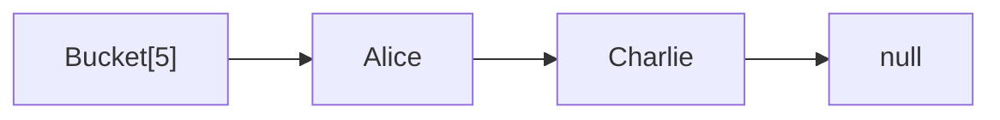
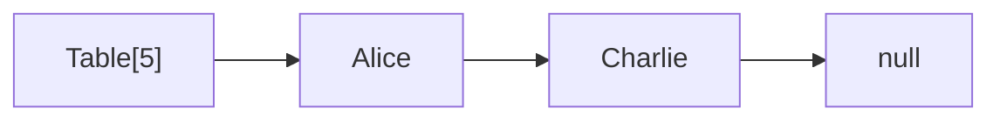
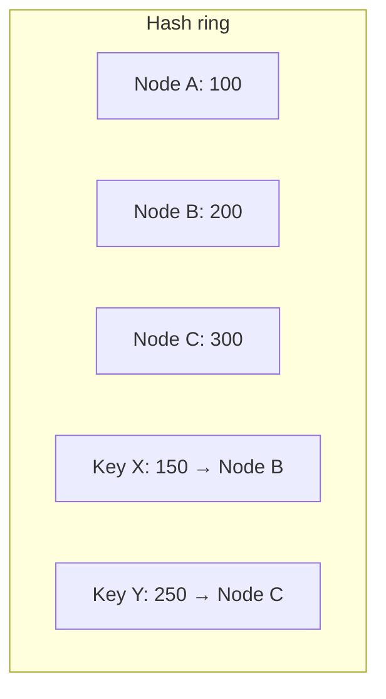

# Вопросы на собеседовании: `Хеш-таблицы`

Хеш-таблица — самая используемая структура в продакшене: `HashMap`, `HashSet`, кэши, индексы. На собеседовании любят спрашивать про коллизии, treeify в Java 8+, отличия `HashMap` и `ConcurrentHashMap`, consistent hashing для распределённых систем.

## Полезные ссылки

### Официальная документация и авторитетные источники

- [Java HashMap — Baeldung](https://www.baeldung.com/java-hashmap)
- [Inside Java HashMap (Java 8) — Baeldung](https://www.baeldung.com/java-hashmap-load-factor)
- [ConcurrentHashMap — Baeldung](https://www.baeldung.com/java-concurrent-map)
- [hashCode() and equals() — Baeldung](https://www.baeldung.com/java-equals-hashcode-contracts)
- [Consistent Hashing — Baeldung](https://www.baeldung.com/cs/consistent-hashing)
- [HashMap (Java) — Oracle Docs](https://docs.oracle.com/en/java/javase/17/docs/api/java.base/java/util/HashMap.html)

## Содержание

- [Полезные ссылки](#полезные-ссылки)
- [See also](#see-also)

**Базовые понятия**
- [Q1. (!) Что такое хеш-таблица?](#q1--что-такое-хеш-таблица)
- [Q2. (!) Что такое хеш-функция и какие требования к ней?](#q2--что-такое-хеш-функция-и-какие-требования-к-ней)
- [Q3. (!) Что такое коллизии и как их разрешают?](#q3--что-такое-коллизии-и-как-их-разрешают)

**Methods и contract**
- [Q4. (!) Контракт hashCode() и equals()?](#q4--контракт-hashcode-и-equals)
- [Q5. (!) Что будет, если переопределить equals, но не hashCode?](#q5--что-будет-если-переопределить-equals-но-не-hashcode)
- [Q6. Как переопределять hashCode по правилам?](#q6-как-переопределять-hashcode-по-правилам)
- [Q7. Что такое immutable key и почему важен?](#q7-что-такое-immutable-key-и-почему-важен)

**Реализация HashMap в Java**
- [Q8. (!) Как устроен HashMap внутри?](#q8--как-устроен-hashmap-внутри)
- [Q9. (!) Что такое load factor и initial capacity?](#q9--что-такое-load-factor-и-initial-capacity)
- [Q10. (!) Что такое rehashing?](#q10--что-такое-rehashing)
- [Q11. (!) Что такое treeify и как работает с Java 8+?](#q11--что-такое-treeify-и-как-работает-с-java-8)
- [Q12. (!) Сложности операций HashMap?](#q12--сложности-операций-hashmap)
- [Q13. Почему capacity HashMap всегда степень двойки?](#q13-почему-capacity-hashmap-всегда-степень-двойки)
- [Q14. Что такое perturbation в hashCode?](#q14-что-такое-perturbation-в-hashcode)

**Виды разрешения коллизий**
- [Q15. (!) Chaining (separate chaining) — как работает?](#q15--chaining-separate-chaining--как-работает)
- [Q16. (!) Open addressing — линейное и квадратичное пробирование?](#q16--open-addressing--линейное-и-квадратичное-пробирование)
- [Q17. Что такое double hashing и чем он лучше квадратичного пробирования?](#q17-что-такое-double-hashing-и-чем-он-лучше-квадратичного-пробирования)
- [Q18. Когда выбирают chaining, а когда open addressing?](#q18-когда-выбирают-chaining-а-когда-open-addressing)

**HashMap и thread-safety**
- [Q19. (!) Почему HashMap небезопасна в многопотоке?](#q19--почему-hashmap-небезопасна-в-многопотоке)
- [Q20. (!) Как устроена ConcurrentHashMap?](#q20--как-устроена-concurrenthashmap)
- [Q21. Чем ConcurrentHashMap отличается от Hashtable и Collections.synchronizedMap?](#q21-чем-concurrenthashmap-отличается-от-hashtable-и-collectionssynchronizedmap)
- [Q22. (!) Атомарные методы ConcurrentHashMap?](#q22--атомарные-методы-concurrenthashmap)

**Особые виды Map**
- [Q23. (!) LinkedHashMap — как устроен и зачем?](#q23--linkedhashmap--как-устроен-и-зачем)
- [Q24. Что такое WeakHashMap и зачем он нужен?](#q24-что-такое-weakhashmap-и-зачем-он-нужен)
- [Q25. Чем отличается IdentityHashMap от обычной HashMap?](#q25-чем-отличается-identityhashmap-от-обычной-hashmap)
- [Q26. Что такое EnumMap и почему он эффективнее HashMap?](#q26-что-такое-enummap-и-почему-он-эффективнее-hashmap)

**Распределённое хеширование**
- [Q27. (!) Что такое consistent hashing?](#q27--что-такое-consistent-hashing)
- [Q28. Как работает rendezvous hashing?](#q28-как-работает-rendezvous-hashing)
- [Q29. (!) Что такое Bloom filter и где он применяется?](#q29--что-такое-bloom-filter-и-где-он-применяется)
- [Q30. Как работает cuckoo hashing?](#q30-как-работает-cuckoo-hashing)

**Подводные камни**
- [Q31. (!) Что такое HashDoS-атака?](#q31--что-такое-hashdos-атака)
- [Q32. Когда HashMap деградирует до O(n)?](#q32-когда-hashmap-деградирует-до-on)
- [Q33. Можно ли использовать null как ключ или значение?](#q33-можно-ли-использовать-null-как-ключ-или-значение)
- [Q34. (!) Чем HashSet отличается от HashMap?](#q34--чем-hashset-отличается-от-hashmap)

## Q1. (!) Что такое хеш-таблица?

**Hash table** — структура «ключ → значение», которая даёт доступ к данным за константное время в среднем. Вместо того чтобы перебирать элементы, она хеш-функцией превращает ключ в индекс массива и сразу попадает в нужную ячейку (bucket).

Ключевая идея: ключ → `hash(key)` → индекс. Поэтому неважно, сколько в таблице элементов — путь к нужному всегда «вычисляется», а не «ищется перебором».

```mermaid
graph LR
    K["Key: Alice"] -->|hash() % size| I["Index: 5"]
    I --> B["Bucket[5]: value"]
```

**Сложности:**
- Среднее: `O(1)` на `get/put/remove` — пока ключи распределены равномерно.
- Худшее: `O(n)` (если все ключи сваливаются в один bucket) или `O(log n)` в Java 8+ за счёт treeify.

**Где применяется:** кеши (Redis, Memcached), индексы in-memory БД, словари и множества, дедупликация, подсчёт частот, шардирование в распределённых системах. Это самая ходовая структура в продакшене — именно поэтому её устройство так любят на собеседованиях.


## Q2. (!) Что такое хеш-функция и какие требования к ней?

**Хеш-функция** — это `hash(key) → int`, отображающая ключ в число, которое потом сводится к индексу bucket. От её качества напрямую зависит, будет ли таблица работать за `O(1)` или деградирует до `O(n)`.

Четыре требования к хорошей хеш-функции:

1. **Детерминированность:** один и тот же ключ всегда даёт один и тот же хеш — иначе элемент потеряется.
2. **Равномерность:** хеши распределены по всему диапазону без перекосов — это минимизирует коллизии.
3. **Скорость:** вычисление за `O(длины ключа)`; функция зовётся на каждый `get/put`, поэтому медленная убивает производительность.
4. **Avalanche effect (лавинный эффект):** изменение одного бита ключа меняет половину битов хеша. Без него похожие ключи дают похожие индексы и слипаются.

```java
// Пример хеш-функции для строки (использует Java)
int hash = 0;
for (char c : str.toCharArray()) {
    hash = 31 * hash + c; // 31 — простое число с хорошими свойствами
}
```

**Криптографические против некриптографических.** Криптографические хеши (SHA-256, MD5) дают «непредсказуемый» выход, но они медленные и для хеш-таблиц избыточны. Поэтому в таблицах берут быстрые некриптографические функции (`Murmur`, `xxHash`, `CityHash`). Криптостойкость нужна там, где важна защита от подбора (например, против HashDoS — см. Q31).


## Q3. (!) Что такое коллизии и как их разрешают?

**Коллизия** — когда два разных ключа попадают в один bucket (одинаковый хеш или один и тот же индекс после взятия по модулю). Коллизии неизбежны: возможных ключей бесконечно много, а ячеек конечное число — по принципу Дирихле (pigeonhole) хоть какие-то ключи обязательно совпадут. Поэтому вопрос не «как избежать», а «как обработать».

**Два семейства стратегий:**

1. **Chaining (раздельное связывание)** — каждый bucket хранит список (или дерево) всех попавших в него элементов. Коллизия просто дописывает элемент в цепочку:


2. **Open addressing (открытая адресация)** — все элементы лежат прямо в массиве; при коллизии ищем следующую свободную ячейку по правилу:
   - Linear probing: `(hash + 1) % size`
   - Quadratic probing: `(hash + i²) % size`
   - Double hashing: `(hash + i · h₂(key)) % size`

`HashMap` в Java использует **chaining**, а с Java 8+ длинные цепочки (≥8 элементов) превращаются в **красно-чёрное дерево**, чтобы худший случай был `O(log n)`, а не `O(n)`. Подробнее про каждую стратегию — Q15–Q18.


## Q4. (!) Контракт hashCode() и equals()?

```
1. equals() reflexive: x.equals(x) == true
2. equals() symmetric: x.equals(y) == y.equals(x)
3. equals() transitive: x.equals(y) && y.equals(z) → x.equals(z)
4. equals() consistent: пока объекты не меняются, equals возвращает то же
5. equals() with null: x.equals(null) == false

6. hashCode() consistent: пока объекты не меняются, hashCode возвращает то же
7. equals → hashCode: x.equals(y) → x.hashCode() == y.hashCode()
8. !equals → hashCode: x.equals(y) == false НЕ требует разных hashCode (но желательно)
```

**Что важно понять, а не зубрить.** Контракт состоит из двух частей. `equals()` обязан задавать корректное отношение эквивалентности (рефлексивность, симметричность, транзитивность, согласованность). А связка с `hashCode()` держится на одном направлении:

- **Равные объекты → одинаковый hashCode** — это закон, нарушение ломает hash-коллекции (см. Q5).
- **Одинаковый hashCode → НЕ обязательно равные** — это лишь коллизия, она допустима и обрабатывается цепочкой/деревом.

**Эмпирическое правило:** чем меньше коллизий (разные объекты — разные хеши), тем быстрее работает таблица, но это рекомендация по производительности, а не требование контракта.


## Q5. (!) Что будет, если переопределить equals, но не hashCode?

Объект «потеряется» в hash-коллекции: вы кладёте его, а `contains`/`get` его не находит. Почему — разберём на коде.

```java
class User {
    String name;
    User(String name) { this.name = name; }

    @Override
    public boolean equals(Object o) {
        if (!(o instanceof User u)) return false;
        return name.equals(u.name);
    }
    // hashCode НЕ переопределён — используется Object.hashCode() (по identity)
}

Set<User> users = new HashSet<>();
users.add(new User("Alice"));
users.contains(new User("Alice")); // false! Разные hashCode → разные buckets
```

**Механика сбоя.** `HashSet`/`HashMap` сначала по hashCode вычисляют bucket, и только потом внутри него сравнивают через `equals`. Два «Alice» логически равны (`equals == true`), но без переопределённого `hashCode` берётся `Object.hashCode()` по identity — у разных объектов он разный. Значит, поиск уходит не в тот bucket и просто не доходит до сравнения `equals`.

**Правило:** `hashCode` и `equals` всегда переопределяй парой — они должны строиться на одних и тех же полях. На практике не пиши их руками: используй IDE-генератор, Lombok `@EqualsAndHashCode` или `record`.


## Q6. Как переопределять hashCode по правилам?

Базовый рецепт — взять те же поля, что и в `equals`, и скомбинировать их так, чтобы разные объекты с большой вероятностью давали разный хеш. От самого читаемого к самому быстрому:

```java
// Java 7+ — Objects.hash()
@Override
public int hashCode() {
    return Objects.hash(field1, field2, field3);
}

// Ручная реализация (немного быстрее, без autoboxing)
@Override
public int hashCode() {
    int result = 17;
    result = 31 * result + (field1 != null ? field1.hashCode() : 0);
    result = 31 * result + Integer.hashCode(field2);
    result = 31 * result + Long.hashCode(field3);
    return result;
}

// Лучшая практика — Lombok или record
@EqualsAndHashCode
class User { ... }

record User(String name, int age) { } // hashCode/equals/toString автоматически
```

**Почему именно 31.** Это простое число (даёт хорошее перемешивание битов) и при этом JIT превращает умножение в дешёвую пару операций: `31 * x = (x << 5) - x`. Множитель важен — без него, складывая поля напрямую, перестановки полей давали бы один и тот же хеш.

**Рекомендация:** руками пиши `hashCode` только когда нужна максимальная скорость и нет autoboxing. В обычном коде хватает `Objects.hash(...)`, Lombok или `record`.


## Q7. Что такое immutable key и почему важен?

**Immutable key (неизменяемый ключ)** — ключ, состояние которого нельзя поменять после создания. Это важно, потому что `HashMap` вычисляет bucket по `hashCode` **в момент `put`** и больше его не пересчитывает.

Если изменить поле, входящее в `hashCode`, уже **после** добавления:
- хеш ключа меняется → `get()` идёт искать в новый bucket;
- но сам элемент остался лежать в старом bucket → его не находят.

Элемент фактически «застревает»: он есть в таблице, но недостижим по этому ключу.

```java
class MutableKey {
    int value;
    MutableKey(int v) { this.value = v; }
    @Override public int hashCode() { return value; }
    @Override public boolean equals(Object o) { ... }
}

MutableKey key = new MutableKey(1);
Map<MutableKey, String> map = new HashMap<>();
map.put(key, "value");
key.value = 2; // ИЗМЕНИЛИ КЛЮЧ!
map.get(key); // null! теперь хеш другой
```

**Правило:** в качестве ключей `HashMap` используй **immutable** объекты (`String`, `Integer`, `LocalDate`, records). Не меняй mutable поля, входящие в `hashCode/equals`.


## Q8. (!) Как устроен HashMap внутри?

Внутри `HashMap` (Java 8+) — это массив корзин, где каждая корзина при коллизиях разрастается в список или дерево. Четыре опоры реализации:

- **Массив `Node<K, V>[] table`** — собственно buckets (по умолчанию 16 штук).
- **Каждый bucket** — связный список, а при длинной цепочке — красно-чёрное дерево.
- **Хеш-функция:** `hash = (h = key.hashCode()) ^ (h >>> 16)` — perturbation подмешивает старшие биты в младшие (зачем — см. Q14).
- **Индекс:** `(table.length - 1) & hash` — быстрое взятие по модулю через `&`, работает потому что `length` всегда степень двойки (см. Q13).

```java
// Упрощённо
public class HashMap<K, V> {
    Node<K, V>[] table;
    int size, threshold;
    final float loadFactor;

    static class Node<K, V> {
        final int hash;
        final K key;
        V value;
        Node<K, V> next;
    }
}
```

**Жизненный цикл bucket.** При коллизии элемент дописывается в цепочку. Если цепочка дорастает до ≥8 элементов И общая capacity ≥64, цепочка превращается в дерево из `TreeNode` (красно-чёрное), что превращает худший случай поиска внутри корзины из `O(n)` в `O(log n)` — подробнее в Q11.


## Q9. (!) Что такое load factor и initial capacity?

Это два параметра, которые управляют балансом «память против скорости»:

- **Initial capacity** — начальный размер массива buckets (по умолчанию **16**).
- **Load factor** — доля заполнения, после которой таблица расширяется (по умолчанию **0.75**).
- **Threshold** = `capacity × loadFactor` — порог в штуках элементов, по умолчанию `16 × 0.75 = 12`.

Логика проста: как только `size > threshold`, запускается **rehashing** (расширение таблицы вдвое, см. Q10). Load factor 0.75 — компромисс по умолчанию: уже достаточно плотно, чтобы не транжирить память, но ещё редко, чтобы коллизии не накапливались.

```java
// Указываем initial capacity, чтобы избежать rehashing
Map<String, Integer> map = new HashMap<>(64); // capacity рассчитывается до ближайшей степени двойки

// С expected size N: capacity = N / 0.75
int expected = 1000;
Map<String, Integer> sized = new HashMap<>((int)(expected / 0.75f) + 1);

// Java 19+ — newHashMap
Map<String, Integer> v19 = HashMap.newHashMap(1000);
```

**Компромисс:** низкий load factor → меньше коллизий, но больше расходуемой памяти. Высокий → экономнее по памяти, но коллизий и rehashing-ов больше.

**Рекомендация:** если заранее знаешь размер коллекции — задавай capacity при создании. Так ты избегаешь нескольких дорогих rehashing-ов по мере роста. Формула — `capacity = ожидаемое_число / 0.75`, а в Java 19+ за тебя это делает `HashMap.newHashMap(N)`.


## Q10. (!) Что такое rehashing?

**Rehashing** — расширение таблицы, когда она переполнилась (`size > threshold`). Зачем: при заполнении растёт средняя длина цепочек, и без расширения `O(1)` постепенно превратился бы в `O(n)`. Шаги:

1. Создаётся новый массив **вдвое больше** старого.
2. Все элементы переносятся в новый массив с пересчётом индексов.
3. Разовая стоимость — `O(n)`.

**Хитрость Java 8+: индексы не пересчитываются с нуля.** Поскольку capacity всегда удваивается (степень двойки), новый индекс элемента отличается от старого ровно на один бит хеша. Цепочку делят на две группы:
- `(hash & oldCapacity) == 0` → элемент остаётся на той же позиции;
- иначе → переезжает на `oldPosition + oldCapacity`.

Полный `hashCode` заново не вычисляется — проверяется один бит, поэтому перенос дешевле.

**Почему `put` всё равно амортизированно `O(1)`.** Дорогой rehashing случается редко (раз на удвоение), а его стоимость «размазывается» по всем дешёвым вставкам между расширениями — тот же приём, что у `ArrayList.add`.


## Q11. (!) Что такое treeify и как работает с Java 8+?

**Treeify** — превращение слишком длинной цепочки в bucket в красно-чёрное дерево. Смысл: пока в корзине 1–2 элемента, список быстрее дерева; но если их накопилось много (плохой хеш или атака), линейный обход становится узким местом — тогда дерево даёт `O(log n)` вместо `O(n)`. Три порога управляют этим:

- **TREEIFY_THRESHOLD = 8** — цепочка длиной ≥8 превращается в дерево.
- **MIN_TREEIFY_CAPACITY = 64** — но только если capacity ≥64; при меньшей сначала делается resize (на маленькой таблице длинные цепочки чаще лечатся расширением, чем деревом).
- **UNTREEIFY_THRESHOLD = 6** — если дерево «похудело» до ≤6 элементов, оно сворачивается обратно в список. Зазор 8/6 нужен, чтобы избежать дёрганья туда-сюда на границе.

```java
// Если коллизий много:
// До Java 8: O(n) на get/put в худшем случае
// С Java 8+: O(log n) благодаря treeify
```

**Зачем это вообще ввели:** главным образом как защиту от **HashDoS-атак** (Q31) — даже если злоумышленник нагонит коллизий в один bucket, операции там останутся `O(log n)`, а не `O(n)`.

**Нюанс с упорядочиванием.** Дереву нужен порядок ключей. Если ключи реализуют `Comparable`, используется их `compareTo`. Если нет — в качестве tie-breaker берётся system identity hash. То есть treeify спасает производительность независимо от того, сравнимы ключи или нет.


## Q12. (!) Сложности операций HashMap?

В среднем все операции по ключу — `O(1)`, в худшем — `O(log n)` (благодаря treeify). Операции по значению линейны, потому что значения не индексируются.

| Операция | Среднее | Худшее (Java 8+) |
|----------|---------|------------------|
| `get(k)` | `O(1)` | `O(log n)` |
| `put(k, v)` | `O(1)` амортиз. | `O(log n)` |
| `remove(k)` | `O(1)` | `O(log n)` |
| `containsKey(k)` | `O(1)` | `O(log n)` |
| `containsValue(v)` | `O(n)` | `O(n)` |
| Iteration | `O(n + capacity)` | `O(n + capacity)` |

**Почему так:**
- `containsValue` всегда `O(n)` — индекс построен по ключам, поэтому значение приходится искать перебором.
- Итерация — `O(n + capacity)`: проходят все элементы плюс пустые buckets, поэтому раздутая capacity замедляет обход.
- Худший случай по ключу — `O(log n)`, а не `O(n)`: даже при плохом `hashCode` длинная цепочка станет деревом (treeify, Q11). До Java 8 здесь был `O(n)`.


## Q13. Почему capacity HashMap всегда степень двойки?

Чтобы заменить **дорогой остаток `% capacity`** на дешёвое **битовое `& (capacity - 1)`**. Деление по модулю в горячем пути `get/put` было бы заметно медленнее.

```java
// При capacity = 16 (= 2^4):
int index = hash & (16 - 1); // = hash & 0b1111 — берём 4 младших бита
// Эквивалентно hash % 16, но в разы быстрее
```

Трюк работает только для степеней двойки: тогда `capacity - 1` — это маска из единиц (`0b1111`), и `&` просто берёт младшие биты хеша. Если бы capacity не была степенью двойки, маска получилась бы «дырявой» и распределение по корзинам стало бы неравномерным. Поэтому при `new HashMap(N)` значение N округляется вверх до ближайшей степени двойки.


## Q14. Что такое perturbation в hashCode?

`HashMap` не берёт `key.hashCode()` напрямую — он сначала «перемешивает» его специальной функцией (perturbation), чтобы старшие биты тоже влияли на выбор bucket:

```java
static final int hash(Object key) {
    int h;
    return (key == null) ? 0 : (h = key.hashCode()) ^ (h >>> 16);
}
```

**Как это работает:** `h >>> 16` сдвигает старшие 16 бит хеша вниз, а `^` (XOR) подмешивает их к младшим. В итоге выбор bucket зависит от всех битов, а не только от младших.

**Зачем это нужно** (логика по шагам):
- индекс bucket = `(table.length - 1) & hash`, то есть учитываются только младшие биты хеша;
- если у `hashCode()` хорошие старшие биты, но «плохие» (мало меняющиеся) младшие — без perturbation многие ключи попали бы в одни и те же корзины;
- perturbation за один XOR «втягивает» информацию из старших битов в младшие, и распределение становится равномернее почти бесплатно.


## Q15. (!) Chaining (separate chaining) — как работает?

Каждый bucket держит контейнер (связный список, а с Java 8+ — дерево) из всех элементов, попавших в этот индекс. Коллизия не «борется за ячейку», а просто добавляет узел в цепочку:



**Плюсы:**
- Простая реализация — добавил узел в список, и всё.
- Работает при любом load factor (даже >1): корзина просто удлиняется, переполнения массива не бывает.
- Удаление тривиально — выкинул узел из списка.
- Нет primary clustering: занятость одной корзины не влияет на соседние.

**Минусы:**
- Накладные расходы памяти на сами узлы (ссылки `next`).
- Плохая cache locality — каждый переход по `next` — это потенциальный cache miss (узлы разбросаны по куче).
- При плохом хеше цепочка вырождается в `O(n)` — но в Java 8+ это лечится treeify до `O(log n)`.

На chaining построены `HashMap`, `LinkedHashMap` и `ConcurrentHashMap`.


## Q16. (!) Open addressing — линейное и квадратичное пробирование?

В отличие от chaining, здесь нет отдельных списков — все элементы лежат **прямо в массиве**. При коллизии не создаём узел, а по детерминированному правилу пробуем следующую ячейку, пока не найдём свободную. Это правило (probe sequence) и отличает варианты:

**Linear probing (линейное):** `(hash + i) % size` — идём по соседним ячейкам.
- Проблема: **primary clustering** — занятые ячейки слипаются в длинные блоки, и поиск свободного места в таком блоке замедляется.

**Quadratic probing (квадратичное):** `(hash + i²) % size` — шаги растут квадратично, «перепрыгивая» кластеры.
- Снимает primary clustering.
- Но остаётся **secondary clustering**: ключи с одинаковым стартовым хешем идут по одной и той же последовательности проб.

```java
class OpenAddressingMap<K, V> {
    private K[] keys;
    private V[] values;

    int probeIndex(K key, int attempt) {
        return (key.hashCode() + attempt) % keys.length; // linear
    }
}
```

Используется в **C++ `std::unordered_map`** (некоторые реализации), Python **`dict`**, Go **`map`**.


## Q17. Что такое double hashing и чем он лучше квадратичного пробирования?

**Double hashing** — вариант open addressing, где шаг пробирования сам зависит от ключа. Вторая хеш-функция задаёт размер шага:

```
index = (h1(key) + i × h2(key)) % size
```

**Чем лучше квадратичного.** При quadratic probing все ключи с одинаковым стартовым хешем идут по одной и той же последовательности проб (secondary clustering). Здесь же шаг `h2(key)` у разных ключей разный, поэтому даже при совпадении `h1` их пути расходятся — кластеризация почти исчезает.

**Условие корректности:** `h2(key)` и `size` должны быть взаимно простыми — иначе пробирование зациклится, не обойдя все ячейки. Поэтому часто берут `size = простое число`.


## Q18. Когда выбирают chaining, а когда open addressing?

Коротко: **open addressing** выбирают ради скорости (плотные данные, cache locality), **chaining** — ради простоты и устойчивости к плохим хешам. Сравнение по ключевым осям:

| Критерий | Chaining | Open addressing |
|----------|----------|-----------------|
| Память | Больше (узлы) | Меньше (только массив) |
| Cache locality | Плохая | Отличная |
| Удаление | Простое | Сложное (tombstones) |
| Load factor | Любой | < 0.7 (иначе деградация) |
| Worst case | `O(log n)` (Java 8+) | `O(n)` |
| Простота | Проще | Сложнее (tombstones, rehash) |

**Итог.** Open addressing выигрывает при плотных данных и хорошей хеш-функции: все элементы в одном массиве, отличная cache locality, никакого overhead на узлы. Но он чувствителен к высокому load factor (после ~0.7 деградирует) и усложняет удаление — нужны tombstones, чтобы probe-цепочки не «рвались». Chaining проще, держит любой load factor и устойчивее к плохим хешам — поэтому именно его выбрала Java для `HashMap`.


## Q19. (!) Почему HashMap небезопасна в многопотоке?

`HashMap` не делает никакой синхронизации, поэтому при конкурентной записи её внутреннее состояние рушится. Три классические проблемы:

1. **Потеря обновлений (lost updates)** — два потока одновременно пишут в одну корзину; одна вставка перетирает другую, элемент исчезает.
2. **Бесконечный цикл при rehashing (до Java 8)** — два потока одновременно перестраивали таблицу и формировали закольцованный связный список. Последующий `get` крутился по кольцу вечно → 100% CPU. Это самый известный симптом «HashMap в многопотоке».
3. **Несогласованное состояние** — один поток ещё не закончил resize, другой уже читает наполовину перестроенную таблицу и получает мусор или `null`.

```java
HashMap<String, Integer> map = new HashMap<>();
// Опасно при concurrent put
ExecutorService es = Executors.newFixedThreadPool(8);
for (int i = 0; i < 10000; i++) {
    int finalI = i;
    es.submit(() -> map.put("key" + finalI, finalI)); // race condition
}
```

**Решения (от лучшего к худшему):**
- `ConcurrentHashMap` — штатный потокобезопасный вариант, без глобального лока (Q20).
- `Collections.synchronizedMap(new HashMap<>())` — обёртка с одним общим локом на всё: безопасно, но плохо масштабируется.
- `Hashtable` — legacy, синхронизирован полностью; в новом коде не использовать.


## Q20. (!) Как устроена ConcurrentHashMap?

Главная идея — блокировать не всю таблицу, а отдельную корзину, и по возможности обходиться вообще без блокировок. С Java 8+ это достигается так:

- **CAS (compare-and-swap)** для вставки первого узла в пустой bucket — атомарно и без лока.
- **synchronized на уровне отдельного bucket** (не всей таблицы) — для записи в непустую корзину; потоки, работающие с разными корзинами, не мешают друг другу.
- **TreeBins** — потокобезопасные деревья при treeify длинных цепочек.
- **Параллельный resize** через `transferIndex` — несколько потоков делят между собой работу по переносу элементов.

До Java 8 применялся segment-based locking: таблица делилась на 16 сегментов со своим локом на каждый, то есть параллелизм был ограничен числом сегментов. Теперь гранулярность — до отдельной корзины.

```java
ConcurrentHashMap<String, Integer> map = new ConcurrentHashMap<>();
map.put("a", 1); // потокобезопасно
map.computeIfAbsent("b", k -> 2); // атомарно
```

**Что из этого следует:**
- Чтение полностью lock-free: `get` никогда не блокируется и не блокирует пишущих.
- При записи блокируется только конкретная корзина, а не вся карта.
- За счёт этого — высокий throughput на многоядерных системах.
- `null` запрещён и для ключей, и для значений (почему — см. Q33).


## Q21. Чем ConcurrentHashMap отличается от Hashtable и Collections.synchronizedMap?

Все три потокобезопасны, но первые два сериализуют любой доступ одним глобальным локом, а `ConcurrentHashMap` блокирует лишь отдельную корзину и не блокирует чтение вовсе. Отсюда и разница в масштабируемости:

| Структура | Стратегия | Чтение | Производительность |
|-----------|-----------|--------|--------------------|
| `Hashtable` | Глобальный `synchronized` | Блокирует | Низкая (legacy) |
| `Collections.synchronizedMap` | Обёртка с глобальным локом | Блокирует | Низкая |
| `ConcurrentHashMap` | Bucket-level lock + CAS | **Не блокирует** | Высокая |

```java
// Synchronized wrapper — блокирует ВСЁ при любой операции
Map<String, Integer> sync = Collections.synchronizedMap(new HashMap<>());

// ConcurrentHashMap — параллельные читатели + локальный writer lock
ConcurrentHashMap<String, Integer> conc = new ConcurrentHashMap<>();
```

**Важный нюанс synchronizedMap:** обёртка делает атомарной каждую отдельную операцию, но не их связки. Итерацию по такой карте нужно вручную оборачивать в `synchronized (map) { ... }`, иначе словите `ConcurrentModificationException`. У `ConcurrentHashMap` итератор слабо-согласованный (weakly consistent) и этого не требует.

**Рекомендация:** в современном Java `Hashtable` не используют (legacy); для потокобезопасной карты по умолчанию берут `ConcurrentHashMap`.


## Q22. (!) Атомарные методы ConcurrentHashMap?

Это методы, которые выполняют связку «прочитать → решить → записать» как одну неделимую операцию. Они нужны, потому что наивный `if (!map.containsKey(k)) map.put(k, v)` в многопотоке — это гонка: между проверкой и вставкой может вклиниться другой поток.

```java
ConcurrentHashMap<String, Integer> map = new ConcurrentHashMap<>();

// putIfAbsent — атомарно
map.putIfAbsent("counter", 0);

// computeIfAbsent — вычислить и поместить, если отсутствует
map.computeIfAbsent("expensive", k -> heavyComputation());

// computeIfPresent — обновить, если присутствует
map.computeIfPresent("counter", (k, v) -> v + 1);

// compute — атомарно прочитать-обновить
map.compute("counter", (k, v) -> v == null ? 1 : v + 1);

// merge — для счётчиков идеально
map.merge("counter", 1, Integer::sum);
```

Каждый такой метод атомарен: на время его работы корзина блокируется, поэтому между чтением и записью никто не вмешается. Без них пришлось бы оборачивать связку во внешний `synchronized`, теряя главное преимущество `ConcurrentHashMap` — мелкогранулярную блокировку.

**Сценарий применения:** `merge(key, 1, Integer::sum)` — канонический потокобезопасный счётчик; `computeIfAbsent` — ленивая инициализация дорогого значения ровно один раз.


## Q23. (!) LinkedHashMap — как устроен и зачем?

`LinkedHashMap` наследует `HashMap`, но дополнительно связывает все записи в **двусвязный список**. Обычный `HashMap` не гарантирует порядка итерации; `LinkedHashMap` обходит элементы предсказуемо — в порядке вставки либо в порядке доступа. Эта дополнительная нить и делает возможным LRU-кеш.

```java
// Insertion order
LinkedHashMap<String, Integer> map = new LinkedHashMap<>();
map.put("a", 1); map.put("b", 2); map.put("c", 3);
// Iteration order: a, b, c

// Access order — для LRU
LinkedHashMap<String, Integer> lru = new LinkedHashMap<>(16, 0.75f, true);
```

**Где применяется:**
- **Предсказуемый порядок** итерации — удобно для детерминированных тестов и стабильного вывода.
- **LRU-кеш в несколько строк.** В access-order режиме (`accessOrder = true`) каждый `get` перемещает запись в конец списка, поэтому в голове всегда самый давно не использованный элемент. Переопределив `removeEldestEntry`, мы автоматически выселяем его при переполнении:

```java
class LRUCache<K, V> extends LinkedHashMap<K, V> {
    private final int capacity;
    LRUCache(int cap) {
        super(cap, 0.75f, true); // accessOrder = true
        this.capacity = cap;
    }
    @Override
    protected boolean removeEldestEntry(Map.Entry<K, V> eldest) {
        return size() > capacity;
    }
}
```


## Q24. Что такое WeakHashMap и зачем он нужен?

`WeakHashMap` хранит ключи через **WeakReference**, поэтому сама карта не удерживает ключ «в живых». Как только на ключ не остаётся обычных (strong) ссылок снаружи, GC вправе его собрать — и тогда соответствующая запись автоматически исчезает из карты. То есть карта не мешает уборке мусора.

```java
WeakHashMap<Object, String> cache = new WeakHashMap<>();
Object key = new Object();
cache.put(key, "value");
key = null; // больше нет strong ссылки
System.gc(); // может удалить запись
```

**Где применяется:** кеши и реестры метаданных, где запись должна жить ровно столько, сколько жив сам объект-ключ, и не должна продлевать ему жизнь (паттерн Canonical Map). Классика — ассоциировать вспомогательные данные с объектом, не вызывая утечки памяти.

**Подводный камень:** не подходит для строковых ключей. Строковые литералы попадают в string pool (interning) и остаются достижимы через strong-ссылки — такой ключ GC не соберёт, и запись «зависнет» навсегда.


## Q25. Чем отличается IdentityHashMap от обычной HashMap?

`IdentityHashMap` сравнивает ключи по ссылке (`==`), а не через `equals()`, и использует `System.identityHashCode()` вместо `hashCode()`. То есть для него два «равных» по содержимому объекта — это разные ключи, если это разные объекты в памяти.

```java
IdentityHashMap<String, Integer> map = new IdentityHashMap<>();
String a = new String("hello");
String b = new String("hello");
map.put(a, 1);
map.get(b); // null! — разные ссылки
map.get(a); // 1
```

**Где применяется:** обход графов объектов, где важна именно идентичность узла, а не его содержимое — топологическая сортировка, сериализация и глубокое копирование (нужно отметить уже посещённые объекты, чтобы не зациклиться на циклических ссылках). Здесь сравнение по `equals` сломало бы логику: два разных узла с одинаковыми полями считались бы одним.


## Q26. Что такое EnumMap и почему он эффективнее HashMap?

`EnumMap` — специализированная Map, ключами которой могут быть только значения одного enum. Это позволяет ей отказаться от хеширования вообще.

```java
enum Day { MONDAY, TUESDAY, WEDNESDAY, ... }

EnumMap<Day, Integer> hours = new EnumMap<>(Day.class);
hours.put(Day.MONDAY, 8);
hours.put(Day.TUESDAY, 10);
```

**Почему это быстро.** У каждой константы enum есть `ordinal()` — её порядковый номер. `EnumMap` просто использует его как индекс в массиве `Object[ENUM_VALUES_COUNT]`. Никаких `hashCode`, коллизий и rehashing — доступ `O(1)` прямой индексацией. По сравнению с `HashMap` это и быстрее (нет хеширования), и компактнее (нет узлов и пустых buckets). Поэтому для enum-ключей `EnumMap` — выбор по умолчанию.


## Q27. (!) Что такое consistent hashing?

**Consistent hashing** — способ распределить ключи по узлам кластера так, чтобы добавление или удаление узла перемещало только ~`1/N` ключей, а не перетасовывало все. Это решает главную боль наивного `hash(key) % N`: там при изменении числа узлов меняется почти каждое соответствие «ключ → узел», и весь кеш инвалидируется разом.

**Идея «кольца».** И узлы, и ключи хешируются на общее кольцо значений (`0 .. 2³² - 1`). Ключ принадлежит первому узлу, который встретится при движении по часовой стрелке. Тогда при выпадении узла «осиротевшие» ключи переезжают только к его соседу справа — остальные не трогаются.



**Virtual nodes (виртуальные узлы):** один физический узел представляют сотнями точек на кольце. Без этого при малом числе узлов промежутки между ними получаются неравными — и нагрузка ложится неравномерно. Размазав узел по многим точкам, мы выравниваем распределение и сглаживаем переезд ключей при отказе.

**Где применяется:**
- Распределённые кеши: **Memcached, Redis Cluster**.
- Распределённые БД и шардирование: **Cassandra, DynamoDB**.
- CDN: выбор edge-сервера, который отдаст кешированный объект.
- Балансировщики нагрузки с привязкой запроса к узлу.


## Q28. Как работает rendezvous hashing?

**Rendezvous hashing (HRW — Highest Random Weight)** — альтернатива consistent hashing для той же задачи «ключ → узел». Для ключа считаем `hash(key, node)` по каждому узлу и отдаём ключ узлу с **максимальным** хешем. Свойство минимального переезда сохраняется: если выпадает выбранный узел, ключ просто уходит к узлу со вторым по величине хешем — остальные ключи не затрагиваются.

```java
String pickNode(String key, List<String> nodes) {
    return nodes.stream()
                .max(Comparator.comparingLong(n -> hash(key + n)))
                .orElseThrow();
}
```

**Чем лучше consistent hashing:**
- Не нужно хранить и поддерживать структуру кольца — узлы можно держать просто списком.
- Балансировка из коробки равномернее (не требуются виртуальные узлы для борьбы с перекосами).
- Реализация проще: один проход по узлам с выбором максимума.

**Плата за это:** lookup стоит `O(N)` — хеш считается по каждому узлу. При большом числе узлов это дороже, чем `O(log N)` поиск по кольцу в consistent hashing. Поэтому HRW хорош, когда узлов немного.


## Q29. (!) Что такое Bloom filter и где он применяется?

**Bloom filter** — компактная вероятностная структура для проверки принадлежности множеству. Она отвечает только двумя вариантами: «**точно нет**» или «**возможно, есть**». Ложноотрицательных ответов не бывает, а вот ложноположительные (false positive) — да. Зато памяти она тратит в разы меньше, чем хранить само множество.

**Как устроена.** Это битовый массив плюс `k` хеш-функций. При `add` элемент прогоняется через все `k` функций, и соответствующие биты выставляются в 1. При проверке смотрим те же `k` бит: если хоть один равен 0 — элемента точно нет; если все равны 1 — он, скорее всего, есть (но биты могли совпасть из-за других элементов — отсюда false positive).

```java
class BloomFilter {
    private final BitSet bits;
    private final int size;
    private final List<Function<String, Integer>> hashFns;

    public void add(String item) {
        for (var fn : hashFns) bits.set(fn.apply(item) % size);
    }

    public boolean mightContain(String item) {
        for (var fn : hashFns) {
            if (!bits.get(fn.apply(item) % size)) return false;
        }
        return true; // вероятно
    }
}
```

**Где применяется.** Везде, где дешёвая проверка «точно нет» позволяет избежать дорогой операции:
- **Cassandra, RocksDB, LevelDB:** «есть ли ключ в SSTable?» — отсекает лишние чтения с диска.
- **Кеши:** «может ли значение вообще быть в кеше?» перед обращением к нему.
- **Веб-краулеры:** «посещали ли уже этот URL?», не храня все URL целиком.
- **Проверка орфографии:** быстрое «есть ли слово в словаре».

**Контроль точности.** Вероятность false positive — `(1 − e^(−kn/m))^k`, где `k` — число хеш-функций, `n` — число добавленных элементов, `m` — размер битового массива. Вывод практичный: чем больше памяти (`m`) под фиксированный `n`, тем реже ложные срабатывания, а `k` подбирают под оптимум.


## Q30. Как работает cuckoo hashing?

**Cuckoo hashing** — open addressing с **двумя** хеш-функциями, дающими каждому ключу ровно две возможные позиции. Название — от кукушки: при вставке, если обе позиции заняты, мы «выталкиваем» одного из жильцов и переселяем его на его альтернативную позицию (а тот, в свою очередь, может вытолкнуть следующего — пока цепочка переселений не завершится).

**Преимущества:**
- `O(1)` в худшем случае на чтение — ключ лежит максимум в двух местах, проверяем не более двух ячеек.
- Высокая плотность заполнения (до ~90%).

**Недостатки:**
- Сложнее в реализации (логика переселений).
- При высокой загрузке вставка может зациклиться в бесконечной цепочке переселений — тогда требуется rehash всей таблицы.

**Сценарий применения:** Cuckoo filter (улучшение Bloom filter, поддерживающее удаление) и некоторые аппаратные TLB в CPU, где гарантия фиксированного числа проверок на lookup особенно ценна.


## Q31. (!) Что такое HashDoS-атака?

**HashDoS — атака на алгоритмическую сложность.** Злоумышленник подбирает входные данные (POST-параметры, ключи JSON), которые дают **одинаковый хеш** в `HashMap`. Расчёт на то, что сервер сам сложит эти данные в карту (например, при парсинге запроса). Дальше срабатывает каскад:

- все подобранные ключи валятся в один bucket;
- из-за этого `get/put` деградируют с `O(1)` до `O(n)`;
- на обработку даже небольшого запроса уходит непропорционально много CPU → отказ в обслуживании.

То есть малым входом достигается большая нагрузка — отсюда «complexity attack». Известна с 2003 года (CCS Conference), массовые инциденты в Java/PHP/Python/Ruby пришлись на 2011–2012.

**Защита в Java 8+:**
- **Treeify** при длинных цепочках → `O(log n)` worst-case
- **Randomized hash seed** в некоторых местах

**Защита на уровне приложения:**
- Лимиты на число параметров
- Не использовать user-controlled strings как ключи без validation

Подробнее — в [Application Security](../../security/application-security-interview.md).


## Q32. Когда HashMap деградирует до O(n)?

Общий знаменатель всех случаев — много элементов сваливается в одну корзину или операция вообще не использует индекс:

1. **Плохая хеш-функция** — все ключи дают один хеш и попадают в один bucket. До Java 8 это давало честный `O(n)`; с treeify — `O(log n)`.
2. **Преднамеренный HashDoS** — то же скучивание, но устроенное специально (Q31).
3. **Слишком маленькая capacity** под объём данных — высокая плотность, длинные цепочки, частые коллизии.
4. **Mutable-ключи**, изменённые после вставки, — `get` уходит не в тот bucket и не находит элемент (Q7).
5. **`containsValue()`** — всегда `O(n)`: ищется по значениям, которые не индексируются.


## Q33. Можно ли использовать null как ключ или значение?

Зависит от реализации. Обычный `HashMap` допускает `null` и как ключ (ровно один), и как значение; потокобезопасные и сортированные карты — нет.

| Структура | null ключ | null значение |
|-----------|-----------|---------------|
| `HashMap` | **Да** (один) | Да |
| `LinkedHashMap` | Да | Да |
| `TreeMap` | Нет (NPE при сравнении) | Да |
| `Hashtable` | Нет (NPE) | Нет (NPE) |
| `ConcurrentHashMap` | **Нет** (NPE) | **Нет** (NPE) |

**Почему так:**
- `HashMap` для `null`-ключа просто использует bucket 0 (хеш `null` считается равным 0) — отсюда ровно один такой ключ.
- `TreeMap` и `Hashtable` падают с NPE: первому нечего сравнивать через `compareTo`, второй запрещает `null` исторически.
- `ConcurrentHashMap` запрещает `null` намеренно. В однопоточном коде неоднозначность «`get` вернул `null`» снимается вызовом `containsKey`. Но в конкурентной среде нет атомарной связки `containsKey + get`, поэтому отличить «ключа нет» от «значение равно `null`» надёжно невозможно — `null` запретили, чтобы убрать саму неоднозначность.


## Q34. (!) Чем HashSet отличается от HashMap?

`HashSet<T>` — это тонкая обёртка над `HashMap<T, Object>`: множество хранит элементы как ключи карты, а значением для всех ставит один общий объект-заглушку `PRESENT`. То есть собственной структуры у `HashSet` нет — он переиспользует `HashMap`.

```java
public class HashSet<E> {
    private transient HashMap<E, Object> map;
    private static final Object PRESENT = new Object();

    public boolean add(E e) {
        return map.put(e, PRESENT) == null;
    }

    public boolean contains(Object o) {
        return map.containsKey(o);
    }
}
```

Из этого следует прямо: все сложности операций и весь контракт `hashCode/equals` у `HashSet` ровно те же, что у `HashMap` (Q4–Q5). Применяется, когда нужна только проверка уникальности/наличия, а сами значения не нужны.


---

## See also

- [Алгоритмы (обзор)](../algorithms-interview.md) — карта алгоритмических тем
- [Массивы и строки](arrays-strings-interview.md) — Two Sum, group anagrams через HashMap
- [Связные списки](linked-lists-interview.md) — chaining в HashMap
- [Деревья](trees-interview.md) — RB-tree в HashMap (treeify)
- [Кучи](heaps-interview.md) — top-K через HashMap + heap
- [Анализ сложности](../complexity/complexity-analysis-interview.md) — амортизированный O(1) и HashDoS
- [Java Collections](../../programming-languages/java/java-collections-interview.md) — все Map в Java
- [Java Concurrency](../../programming-languages/java/java-concurrency-interview.md) — ConcurrentHashMap
- [Java Core](../../programming-languages/java/java-core-interview.md) — hashCode/equals contract
- [Стратегии кэширования](../../architecture/caching-strategies-interview.md) — consistent hashing для distributed caches
- [Распределённые системы](../../architecture/distributed-systems-interview.md) — sharding и hashing
- [Application Security](../../security/application-security-interview.md) — HashDoS защита
- [Redis](../../databases/redis-interview.md) — hash table в основе
