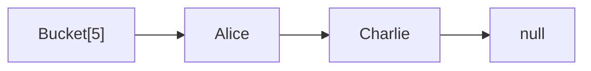
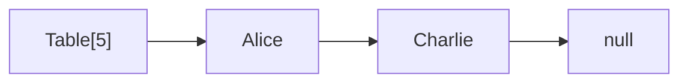
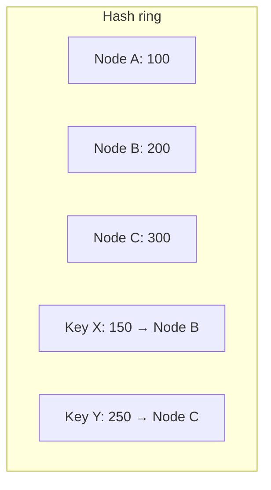

# Вопросы на собеседовании: `Хеш-таблицы`

Хеш-таблица — самая используемая структура в продакшене: `HashMap`, `HashSet`, кэши, индексы. На собеседовании любят спрашивать про коллизии, treeify в Java 8+, отличия `HashMap` и `ConcurrentHashMap`, consistent hashing для распределённых систем.

Дата последнего обновления: 2026-04-18

## Полезные ссылки

### Официальная документация и авторитетные источники

- [Java HashMap — Baeldung](https://www.baeldung.com/java-hashmap)
- [Inside Java HashMap (Java 8) — Baeldung](https://www.baeldung.com/java-hashmap-load-factor)
- [ConcurrentHashMap — Baeldung](https://www.baeldung.com/java-concurrent-map)
- [hashCode() and equals() — Baeldung](https://www.baeldung.com/java-equals-hashcode-contracts)
- [Consistent Hashing — Baeldung](https://www.baeldung.com/cs/consistent-hashing)
- [HashMap (Java) — Oracle Docs](https://docs.oracle.com/en/java/javase/17/docs/api/java.base/java/util/HashMap.html)

## Содержание

- [Полезные ссылки](#полезные-ссылки)
- [See also](#see-also)

**Базовые понятия**
- [Q1. (!) Что такое хеш-таблица?](#q1--что-такое-хеш-таблица)
- [Q2. (!) Что такое хеш-функция и какие требования к ней?](#q2--что-такое-хеш-функция-и-какие-требования-к-ней)
- [Q3. (!) Что такое коллизии и как их разрешают?](#q3--что-такое-коллизии-и-как-их-разрешают)

**Methods и contract**
- [Q4. (!) Контракт hashCode() и equals()?](#q4--контракт-hashcode-и-equals)
- [Q5. (!) Что будет, если переопределить equals, но не hashCode?](#q5--что-будет-если-переопределить-equals-но-не-hashcode)
- [Q6. Как переопределять hashCode по правилам?](#q6-как-переопределять-hashcode-по-правилам)
- [Q7. Что такое immutable key и почему важен?](#q7-что-такое-immutable-key-и-почему-важен)

**Реализация HashMap в Java**
- [Q8. (!) Как устроен HashMap внутри?](#q8--как-устроен-hashmap-внутри)
- [Q9. (!) Что такое load factor и initial capacity?](#q9--что-такое-load-factor-и-initial-capacity)
- [Q10. (!) Что такое rehashing?](#q10--что-такое-rehashing)
- [Q11. (!) Что такое treeify и как работает с Java 8+?](#q11--что-такое-treeify-и-как-работает-с-java-8)
- [Q12. (!) Сложности операций HashMap?](#q12--сложности-операций-hashmap)
- [Q13. Почему capacity HashMap всегда степень двойки?](#q13-почему-capacity-hashmap-всегда-степень-двойки)
- [Q14. Что такое perturbation в hashCode?](#q14-что-такое-perturbation-в-hashcode)

**Виды разрешения коллизий**
- [Q15. (!) Chaining (separate chaining) — как работает?](#q15--chaining-separate-chaining--как-работает)
- [Q16. (!) Open addressing — линейное и квадратичное пробирование?](#q16--open-addressing--линейное-и-квадратичное-пробирование)
- [Q17. Что такое double hashing?](#q17-что-такое-double-hashing)
- [Q18. Когда выбирают chaining, а когда open addressing?](#q18-когда-выбирают-chaining-а-когда-open-addressing)

**HashMap и thread-safety**
- [Q19. (!) Почему HashMap небезопасна в многопотоке?](#q19--почему-hashmap-небезопасна-в-многопотоке)
- [Q20. (!) Как устроена ConcurrentHashMap?](#q20--как-устроена-concurrenthashmap)
- [Q21. Чем ConcurrentHashMap отличается от Hashtable и Collections.synchronizedMap?](#q21-чем-concurrenthashmap-отличается-от-hashtable-и-collectionssynchronizedmap)
- [Q22. (!) Атомарные методы ConcurrentHashMap?](#q22--атомарные-методы-concurrenthashmap)

**Особые виды Map**
- [Q23. (!) LinkedHashMap — как устроен и зачем?](#q23--linkedhashmap--как-устроен-и-зачем)
- [Q24. WeakHashMap?](#q24-weakhashmap)
- [Q25. IdentityHashMap?](#q25-identityhashmap)
- [Q26. EnumMap?](#q26-enummap)

**Распределённое хеширование**
- [Q27. (!) Что такое consistent hashing?](#q27--что-такое-consistent-hashing)
- [Q28. Как работает rendezvous hashing?](#q28-как-работает-rendezvous-hashing)
- [Q29. (!) Bloom filter?](#q29--bloom-filter)
- [Q30. Cuckoo hashing?](#q30-cuckoo-hashing)

**Подводные камни**
- [Q31. (!) Что такое HashDoS-атака?](#q31--что-такое-hashdos-атака)
- [Q32. Когда HashMap деградирует до O(n)?](#q32-когда-hashmap-деградирует-до-on)
- [Q33. Можно ли использовать null как ключ или значение?](#q33-можно-ли-использовать-null-как-ключ-или-значение)
- [Q34. (!) Чем HashSet отличается от HashMap?](#q34--чем-hashset-отличается-от-hashmap)

## Q1. (!) Что такое хеш-таблица?

**Hash table** — структура для быстрого поиска, вставки и удаления по ключу. Использует **хеш-функцию** для преобразования ключа в индекс массива (bucket).

```mermaid
graph LR
    K["Key: Alice"] -->|hash() % size| I["Index: 5"]
    I --> B["Bucket[5]: value"]
```

**Сложности:**
- Среднее: `O(1)` на `get/put/remove`
- Худшее: `O(n)` (без оптимизаций) или `O(log n)` (Java 8+ с treeify)

**Применения:** кеши (Redis, Memcached), индексы in-memory БД, dictionaries, sets, deduplication, frequency counting, distributed sharding.

## Q2. (!) Что такое хеш-функция и какие требования к ней?

**Хеш-функция** — функция `hash(key) → int`, преобразующая ключ в индекс. Хорошая хеш-функция:

1. **Детерминированная:** одинаковый ключ → одинаковый хеш
2. **Равномерная:** значения хешей равномерно распределены
3. **Быстрая:** вычисление O(длины ключа)
4. **Avalanche effect:** малое изменение ключа → большое изменение хеша

```java
// Пример хеш-функции для строки (использует Java)
int hash = 0;
for (char c : str.toCharArray()) {
    hash = 31 * hash + c; // 31 — простое число с хорошими свойствами
}
```

**Криптографические хеши** (SHA-256, MD5) — медленнее, но «непредсказуемые». Для hash-таблиц используют **некриптографические** (`Murmur`, `xxHash`, `CityHash`).

## Q3. (!) Что такое коллизии и как их разрешают?

**Коллизия** — два разных ключа дают одинаковый хеш (или один индекс bucket). Неизбежны: ключей бесконечно, индексов конечно (по pigeonhole principle).

**Способы разрешения:**

1. **Chaining (separate chaining)** — в bucket связный список (или дерево):


2. **Open addressing** — ищем следующую свободную ячейку:
   - Linear probing: `(hash + 1) % size`
   - Quadratic probing: `(hash + i²) % size`
   - Double hashing: `(hash + i · h₂(key)) % size`

`HashMap` в Java использует **chaining**, с Java 8+ длинные цепочки превращаются в **красно-чёрное дерево**.

## Q4. (!) Контракт hashCode() и equals()?

```
1. equals() reflexive: x.equals(x) == true
2. equals() symmetric: x.equals(y) == y.equals(x)
3. equals() transitive: x.equals(y) && y.equals(z) → x.equals(z)
4. equals() consistent: пока объекты не меняются, equals возвращает то же
5. equals() with null: x.equals(null) == false

6. hashCode() consistent: пока объекты не меняются, hashCode возвращает то же
7. equals → hashCode: x.equals(y) → x.hashCode() == y.hashCode()
8. !equals → hashCode: x.equals(y) == false НЕ требует разных hashCode (но желательно)
```

**Главное правило:** если два объекта равны (`equals == true`) — их hashCode **обязан** быть равным. Обратное не обязательно.

## Q5. (!) Что будет, если переопределить equals, но не hashCode?

**Полная катастрофа** в hash-based коллекциях:

```java
class User {
    String name;
    User(String name) { this.name = name; }

    @Override
    public boolean equals(Object o) {
        if (!(o instanceof User u)) return false;
        return name.equals(u.name);
    }
    // hashCode НЕ переопределён — используется Object.hashCode() (по identity)
}

Set<User> users = new HashSet<>();
users.add(new User("Alice"));
users.contains(new User("Alice")); // false! Разные hashCode → разные buckets
```

Контракт нарушен: `equals == true`, но `hashCode != hashCode`. `HashSet/HashMap` ищут в bucket, который определяется hashCode — не находят и считают, что объекта нет.

**Правило:** всегда переопределяй `hashCode` вместе с `equals`. Используй IDE-генератор или Lombok `@EqualsAndHashCode`.

## Q6. Как переопределять hashCode по правилам?

```java
// Java 7+ — Objects.hash()
@Override
public int hashCode() {
    return Objects.hash(field1, field2, field3);
}

// Ручная реализация (немного быстрее, без autoboxing)
@Override
public int hashCode() {
    int result = 17;
    result = 31 * result + (field1 != null ? field1.hashCode() : 0);
    result = 31 * result + Integer.hashCode(field2);
    result = 31 * result + Long.hashCode(field3);
    return result;
}

// Лучшая практика — Lombok или record
@EqualsAndHashCode
class User { ... }

record User(String name, int age) { } // hashCode/equals/toString автоматически
```

**Почему 31:** простое число, легко оптимизируется JIT (`31 * x = (x << 5) - x`).

## Q7. Что такое immutable key и почему важен?

**Immutable key** — ключ, состояние которого нельзя изменить после создания. Если ключ изменить **после** добавления в `HashMap`:
- Хеш изменится → `get()` не найдёт элемент
- Элемент «потеряется» в неправильном bucket

```java
class MutableKey {
    int value;
    MutableKey(int v) { this.value = v; }
    @Override public int hashCode() { return value; }
    @Override public boolean equals(Object o) { ... }
}

MutableKey key = new MutableKey(1);
Map<MutableKey, String> map = new HashMap<>();
map.put(key, "value");
key.value = 2; // ИЗМЕНИЛИ КЛЮЧ!
map.get(key); // null! теперь хеш другой
```

**Правило:** в качестве ключей `HashMap` используй **immutable** объекты (`String`, `Integer`, `LocalDate`, records). Не меняй mutable поля, входящие в `hashCode/equals`.

## Q8. (!) Как устроен HashMap внутри?

С Java 8+ `HashMap`:
- **Массив `Node<K, V>[] table`** — buckets (по умолчанию size = 16)
- **Каждый bucket** — связный список или красно-чёрное дерево
- **Хеш-функция:** `hash = (h = key.hashCode()) ^ (h >>> 16)` (perturbation для младших битов)
- **Индекс:** `(table.length - 1) & hash` (т.к. `length` — степень двойки)

```java
// Упрощённо
public class HashMap<K, V> {
    Node<K, V>[] table;
    int size, threshold;
    final float loadFactor;

    static class Node<K, V> {
        final int hash;
        final K key;
        V value;
        Node<K, V> next;
    }
}
```

При коллизии — добавление в начало/конец цепочки. При длине цепочки ≥ 8 и size ≥ 64 — превращение в `TreeNode` (красно-чёрное дерево).

## Q9. (!) Что такое load factor и initial capacity?

- **Initial capacity** — начальный размер массива buckets (по умолчанию **16**)
- **Load factor** — порог заполнения, при котором происходит rehashing (по умолчанию **0.75**)
- **Threshold** = `capacity × loadFactor` (по умолчанию `16 × 0.75 = 12`)

Когда `size > threshold` — **rehashing**.

```java
// Указываем initial capacity, чтобы избежать rehashing
Map<String, Integer> map = new HashMap<>(64); // capacity рассчитывается до ближайшей степени двойки

// С expected size N: capacity = N / 0.75
int expected = 1000;
Map<String, Integer> sized = new HashMap<>((int)(expected / 0.75f) + 1);

// Java 19+ — newHashMap
Map<String, Integer> v19 = HashMap.newHashMap(1000);
```

**Trade-off:** низкий load factor → меньше коллизий, но больше памяти. Высокий → больше коллизий, меньше памяти.

## Q10. (!) Что такое rehashing?

**Rehashing** — увеличение размера таблицы и перераспределение элементов:
1. Создаётся новый массив **в 2 раза больше**
2. Все элементы переносятся (новые индексы пересчитываются)
3. Стоимость — `O(n)`

В Java 8+ при rehashing элементы цепочки разделяются на **две группы** по бите хеша:
- `(hash & oldCapacity) == 0` → остаются на старой позиции
- иначе → переносятся на `oldPosition + oldCapacity`

Это эффективнее, чем полный пересчёт hash для каждого элемента.

**Амортизированный `O(1)`** на `put` — такой же принцип, как у `ArrayList.add`.

## Q11. (!) Что такое treeify и как работает с Java 8+?

С Java 8+ при длинных цепочках `HashMap` превращает их в **красно-чёрное дерево**:

- **TREEIFY_THRESHOLD = 8** — при длине цепочки ≥ 8 → treeify
- **MIN_TREEIFY_CAPACITY = 64** — но только если capacity ≥ 64 (иначе сначала resize)
- **UNTREEIFY_THRESHOLD = 6** — при уменьшении до ≤ 6 → обратно в список

```java
// Если коллизий много:
// До Java 8: O(n) на get/put в худшем случае
// С Java 8+: O(log n) благодаря treeify
```

**Зачем:** защита от **HashDoS-атак**. Также гарантия `O(log n)` worst-case вместо `O(n)`.

Treeify работает только если ключи реализуют `Comparable` (для упорядочивания в дереве). Иначе используется system identity hash как tie-breaker.

## Q12. (!) Сложности операций HashMap?

| Операция | Среднее | Худшее (Java 8+) |
|----------|---------|------------------|
| `get(k)` | `O(1)` | `O(log n)` |
| `put(k, v)` | `O(1)` амортиз. | `O(log n)` |
| `remove(k)` | `O(1)` | `O(log n)` |
| `containsKey(k)` | `O(1)` | `O(log n)` |
| `containsValue(v)` | `O(n)` | `O(n)` |
| Iteration | `O(n + capacity)` | `O(n + capacity)` |

`containsValue` — `O(n)` всегда (нужно линейно проверять).

Если `hashCode` плохой (много коллизий) — `O(log n)` благодаря treeify.

## Q13. Почему capacity HashMap всегда степень двойки?

Чтобы заменить **дорогую операцию `% capacity`** на быструю **битовую `& (capacity - 1)`**:

```java
// При capacity = 16 (= 2^4):
int index = hash & (16 - 1); // = hash & 0b1111 — берём 4 младших бита
// Эквивалентно hash % 16, но в разы быстрее
```

Если capacity не степень двойки — `&` дала бы неравномерное распределение. Поэтому при создании `HashMap(N)` — N округляется до ближайшей степени двойки вверх.

## Q14. Что такое perturbation в hashCode?

В Java HashMap не использует `key.hashCode()` напрямую. Применяется **perturbation function**:

```java
static final int hash(Object key) {
    int h;
    return (key == null) ? 0 : (h = key.hashCode()) ^ (h >>> 16);
}
```

`h >>> 16` — сдвигает старшие биты в младшие. XOR смешивает их. Зачем:
- При `(table.length - 1) & hash` берутся только младшие биты
- Если `hashCode()` имеет хорошие старшие биты, но плохие младшие — без perturbation было бы много коллизий
- Perturbation «перемешивает» биты для лучшего распределения

## Q15. (!) Chaining (separate chaining) — как работает?

В каждом bucket — связный список (или дерево с Java 8+) элементов с одинаковым индексом:



**Плюсы:**
- Простая реализация
- Любой load factor (даже > 1)
- Удаление простое
- Не страдает от primary clustering

**Минусы:**
- Память на узлы (overhead)
- Cache miss на каждый node lookup
- Если хеш плохой — деградация до `O(n)` (но Java 8+ — treeify до `O(log n)`)

Java `HashMap`, `LinkedHashMap`, `ConcurrentHashMap` — chaining.

## Q16. (!) Open addressing — линейное и квадратичное пробирование?

Все элементы хранятся **в самом массиве**. При коллизии — ищем следующую свободную ячейку.

**Linear probing:** `(hash + i) % size`
- Проблема: **primary clustering** — соседние занятые ячейки сливаются в кластеры

**Quadratic probing:** `(hash + i²) % size`
- Уменьшает primary clustering
- Появляется **secondary clustering** (одинаковый стартовый hash → одинаковая последовательность проб)

```java
class OpenAddressingMap<K, V> {
    private K[] keys;
    private V[] values;

    int probeIndex(K key, int attempt) {
        return (key.hashCode() + attempt) % keys.length; // linear
    }
}
```

Используется в **C++ `std::unordered_map`** (некоторые реализации), Python **`dict`**, Go **`map`**.

## Q17. Что такое double hashing?

**Double hashing** — комбинация двух хеш-функций:

```
index = (h1(key) + i × h2(key)) % size
```

Уменьшает clustering ещё лучше, чем quadratic probing. Требует, чтобы `h2(key)` и `size` были взаимно простыми (часто `size = prime`).

## Q18. Когда выбирают chaining, а когда open addressing?

| Критерий | Chaining | Open addressing |
|----------|----------|-----------------|
| Память | Больше (узлы) | Меньше (только массив) |
| Cache locality | Плохая | Отличная |
| Удаление | Простое | Сложное (tombstones) |
| Load factor | Любой | < 0.7 (иначе деградация) |
| Worst case | `O(log n)` (Java 8+) | `O(n)` |
| Простота | Проще | Сложнее (tombstones, rehash) |

**Open addressing** выигрывает при **плотных** данных и хорошей хеш-функции — лучше cache. **Chaining** проще и устойчивее к плохим хешам.

## Q19. (!) Почему HashMap небезопасна в многопотоке?

Несколько проблем:
1. **Lost updates** — два потока одновременно `put` в одну ячейку — один `put` теряется
2. **Infinite loop при rehashing** (до Java 8) — два потока одновременно делали resize и формировали циклический связный список → 100% CPU
3. **Inconsistent state** — один поток ещё не закончил resize, другой читает

```java
HashMap<String, Integer> map = new HashMap<>();
// Опасно при concurrent put
ExecutorService es = Executors.newFixedThreadPool(8);
for (int i = 0; i < 10000; i++) {
    int finalI = i;
    es.submit(() -> map.put("key" + finalI, finalI)); // race condition
}
```

**Решения:**
- `ConcurrentHashMap` — потокобезопасная
- `Collections.synchronizedMap(new HashMap<>())` — обёртка с глобальным локом
- `Hashtable` — устаревший, синхронизирован

## Q20. (!) Как устроена ConcurrentHashMap?

С Java 8+ `ConcurrentHashMap` использует:
- **CAS (compare-and-swap)** для изменения первого узла bucket
- **synchronized на уровне bucket** (не всей таблицы) для остальных операций
- **Помеченные узлы (TreeBins)** при treeify
- **Параллельный resize** через `transferIndex`

До Java 8 — segment-based locking (по 16 segments).

```java
ConcurrentHashMap<String, Integer> map = new ConcurrentHashMap<>();
map.put("a", 1); // потокобезопасно
map.computeIfAbsent("b", k -> 2); // атомарно
```

**Ключевые особенности:**
- Не блокирует чтение (lock-free `get`)
- Блокирует только конкретный bucket при write
- Высокий throughput на многоядерных системах
- Не разрешает `null` ключи и значения (в отличие от `HashMap`)

## Q21. Чем ConcurrentHashMap отличается от Hashtable и Collections.synchronizedMap?

| Структура | Стратегия | Чтение | Производительность |
|-----------|-----------|--------|--------------------|
| `Hashtable` | Глобальный `synchronized` | Блокирует | Низкая (legacy) |
| `Collections.synchronizedMap` | Обёртка с глобальным локом | Блокирует | Низкая |
| `ConcurrentHashMap` | Bucket-level lock + CAS | **Не блокирует** | Высокая |

```java
// Synchronized wrapper — блокирует ВСЁ при любой операции
Map<String, Integer> sync = Collections.synchronizedMap(new HashMap<>());

// ConcurrentHashMap — параллельные читатели + локальный writer lock
ConcurrentHashMap<String, Integer> conc = new ConcurrentHashMap<>();
```

В современном Java **никогда не используй `Hashtable`** — устаревшее. Для thread-safe — `ConcurrentHashMap`.

## Q22. (!) Атомарные методы ConcurrentHashMap?

```java
ConcurrentHashMap<String, Integer> map = new ConcurrentHashMap<>();

// putIfAbsent — атомарно
map.putIfAbsent("counter", 0);

// computeIfAbsent — вычислить и поместить, если отсутствует
map.computeIfAbsent("expensive", k -> heavyComputation());

// computeIfPresent — обновить, если присутствует
map.computeIfPresent("counter", (k, v) -> v + 1);

// compute — атомарно прочитать-обновить
map.compute("counter", (k, v) -> v == null ? 1 : v + 1);

// merge — для счётчиков идеально
map.merge("counter", 1, Integer::sum);
```

Эти методы **атомарны** — между чтением и записью никто не вмешается. Без них пришлось бы делать `synchronized` блок снаружи.

## Q23. (!) LinkedHashMap — как устроен и зачем?

`LinkedHashMap` extends `HashMap` + поддерживает **связный список** всех элементов в порядке вставки (или доступа).

```java
// Insertion order
LinkedHashMap<String, Integer> map = new LinkedHashMap<>();
map.put("a", 1); map.put("b", 2); map.put("c", 3);
// Iteration order: a, b, c

// Access order — для LRU
LinkedHashMap<String, Integer> lru = new LinkedHashMap<>(16, 0.75f, true);
```

**Применения:**
- **Предсказуемый порядок** итерации (важно для тестов, hash detection)
- **LRU Cache** в 5 строк:

```java
class LRUCache<K, V> extends LinkedHashMap<K, V> {
    private final int capacity;
    LRUCache(int cap) {
        super(cap, 0.75f, true); // accessOrder = true
        this.capacity = cap;
    }
    @Override
    protected boolean removeEldestEntry(Map.Entry<K, V> eldest) {
        return size() > capacity;
    }
}
```

## Q24. WeakHashMap?

`WeakHashMap` — ключи хранятся через **WeakReference**. Когда ключ становится недостижимым из других мест — может быть собран GC, и запись из map удалится.

```java
WeakHashMap<Object, String> cache = new WeakHashMap<>();
Object key = new Object();
cache.put(key, "value");
key = null; // больше нет strong ссылки
System.gc(); // может удалить запись
```

**Применения:** кэши, где не хочется держать объект живым только из-за кэша. Использует **Canonical Map Pattern**.

**Подводный камень:** не для строк! `String` interning может оставлять strong references.

## Q25. IdentityHashMap?

`IdentityHashMap` — сравнивает ключи через `==` (reference identity), а не `equals()`.

```java
IdentityHashMap<String, Integer> map = new IdentityHashMap<>();
String a = new String("hello");
String b = new String("hello");
map.put(a, 1);
map.get(b); // null! — разные ссылки
map.get(a); // 1
```

**Применения:** топологическая сортировка, сериализация (отслеживать уже посещённые объекты), implementations of Object.equals where reference equality matters.

## Q26. EnumMap?

`EnumMap` — оптимизированная Map для enum-ключей.

```java
enum Day { MONDAY, TUESDAY, WEDNESDAY, ... }

EnumMap<Day, Integer> hours = new EnumMap<>(Day.class);
hours.put(Day.MONDAY, 8);
hours.put(Day.TUESDAY, 10);
```

Внутри — массив `Object[ENUM_VALUES_COUNT]`. `O(1)` без хеширования. **Меньше памяти**, **быстрее** обычной HashMap для enum-ключей.

## Q27. (!) Что такое consistent hashing?

**Consistent hashing** — техника распределения ключей по узлам кластера, где **добавление/удаление узла** перемещает только `1/N` ключей (а не все).

**Идея:** хеши узлов и ключей маппятся на **кольцо** (0 .. 2³² - 1). Ключ принадлежит первому узлу по часовой стрелке.



**Virtual nodes:** каждый физический узел маппится на много точек кольца — для лучшей балансировки.

**Применения:**
- Distributed caches: **Memcached, Redis Cluster**
- Distributed databases: **Cassandra, DynamoDB**
- CDN: какому edge-серверу отдать кешированный объект
- Load balancers

## Q28. Как работает rendezvous hashing?

**Rendezvous hashing (HRW — Highest Random Weight):** для каждого ключа вычисляем `hash(key, node)` для всех узлов; выбираем узел с **максимальным** хешем.

```java
String pickNode(String key, List<String> nodes) {
    return nodes.stream()
                .max(Comparator.comparingLong(n -> hash(key + n)))
                .orElseThrow();
}
```

**Преимущества над consistent hashing:**
- Не нужно хранить ring data structure
- Лучшая балансировка
- Простая реализация

**Недостаток:** `O(N)` на каждый lookup (где N — число узлов).

## Q29. (!) Bloom filter?

**Bloom filter** — вероятностная структура для проверки членства: «**может быть в множестве**» или «**точно нет**». Очень компактная, но даёт false positives.

```java
class BloomFilter {
    private final BitSet bits;
    private final int size;
    private final List<Function<String, Integer>> hashFns;

    public void add(String item) {
        for (var fn : hashFns) bits.set(fn.apply(item) % size);
    }

    public boolean mightContain(String item) {
        for (var fn : hashFns) {
            if (!bits.get(fn.apply(item) % size)) return false;
        }
        return true; // вероятно
    }
}
```

**Применения:**
- **Cassandra, RocksDB, LevelDB:** проверка «есть ли ключ в SSTable» до тяжёлого чтения с диска
- **Cache filtering:** «может ли быть в кэше?»
- **Web crawlers:** «посещали ли URL?»
- **Spell checkers**

False positive rate: `(1 − e^(−kn/m))^k`, где `k` — число хеш-функций, `n` — добавленных элементов, `m` — bit array size.

## Q30. Cuckoo hashing?

**Cuckoo hashing** — open addressing с **двумя** хеш-функциями. Каждый элемент может быть в одной из двух позиций. При вставке, если обе заняты — выкидываем существующий и пробуем поместить его на альтернативную позицию.

**Преимущества:**
- `O(1)` worst-case lookup (всегда 2 проверки)
- Высокая загрузка (до 90%)

**Недостатки:**
- Более сложная реализация
- При высокой загрузке — risk of infinite loop при insert

Используется в **Cuckoo filter** (улучшение Bloom filter), некоторых CPU TLB.

## Q31. (!) Что такое HashDoS-атака?

**Algorithmic complexity attack:** злоумышленник подбирает входы (POST-параметры, JSON keys), которые дают **одинаковый хеш** в `HashMap`. Тогда:
- Все ключи попадают в один bucket
- `get/put` становятся `O(n)`
- Сервер тратит весь CPU на парсинг → DoS

Известно с 2003 (CCS Conference). В 2011-2012 — массовые случаи в Java/PHP/Python/Ruby.

**Защита в Java 8+:**
- **Treeify** при длинных цепочках → `O(log n)` worst-case
- **Randomized hash seed** в некоторых местах

**Защита на уровне приложения:**
- Лимиты на число параметров
- Не использовать user-controlled strings как ключи без validation

Подробнее — в [Application Security](../../security/application-security-interview.md).

## Q32. Когда HashMap деградирует до O(n)?

1. **Плохая хеш-функция** — все ключи дают один хеш. Без treeify — `O(n)`. С treeify — `O(log n)`.
2. **Преднамеренный HashDoS** — см. Q31
3. **Capacity слишком мал** для размера данных (много коллизий)
4. **Mutable keys** меняются после insert — get не находит → линейный fallback
5. **`containsValue()`** — всегда `O(n)`

## Q33. Можно ли использовать null как ключ или значение?

| Структура | null ключ | null значение |
|-----------|-----------|---------------|
| `HashMap` | **Да** (один) | Да |
| `LinkedHashMap` | Да | Да |
| `TreeMap` | Нет (NPE при сравнении) | Да |
| `Hashtable` | Нет (NPE) | Нет (NPE) |
| `ConcurrentHashMap` | **Нет** (NPE) | **Нет** (NPE) |

`ConcurrentHashMap` запрещает `null` намеренно — иначе нельзя отличить «нет ключа» от «значение = null» в concurrent среде (там нет атомарного `containsKey + get`).

## Q34. (!) Чем HashSet отличается от HashMap?

`HashSet<T>` — обёртка вокруг `HashMap<T, Object>`. Все элементы как ключи, значения — `PRESENT` (sentinel).

```java
public class HashSet<E> {
    private transient HashMap<E, Object> map;
    private static final Object PRESENT = new Object();

    public boolean add(E e) {
        return map.put(e, PRESENT) == null;
    }

    public boolean contains(Object o) {
        return map.containsKey(o);
    }
}
```

Все сложности и контракт `hashCode/equals` — те же, что у `HashMap`. Применяется для **уникальности** без значений.

---

## See also

- [Алгоритмы (обзор)](../algorithms-interview.md) — карта алгоритмических тем
- [Массивы и строки](arrays-strings-interview.md) — Two Sum, group anagrams через HashMap
- [Связные списки](linked-lists-interview.md) — chaining в HashMap
- [Деревья](trees-interview.md) — RB-tree в HashMap (treeify)
- [Кучи](heaps-interview.md) — top-K через HashMap + heap
- [Анализ сложности](../complexity/complexity-analysis-interview.md) — амортизированный O(1) и HashDoS
- [Java Collections](../../programming-languages/java/java-collections-interview.md) — все Map в Java
- [Java Concurrency](../../programming-languages/java/java-concurrency-interview.md) — ConcurrentHashMap
- [Java Core](../../programming-languages/java/java-core-interview.md) — hashCode/equals contract
- [Стратегии кэширования](../../architecture/caching-strategies-interview.md) — consistent hashing для distributed caches
- [Распределённые системы](../../architecture/distributed-systems-interview.md) — sharding и hashing
- [Application Security](../../security/application-security-interview.md) — HashDoS защита
- [Redis](../../databases/redis-interview.md) — hash table в основе
