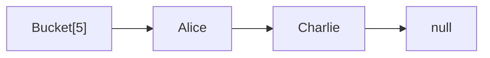
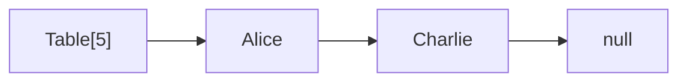
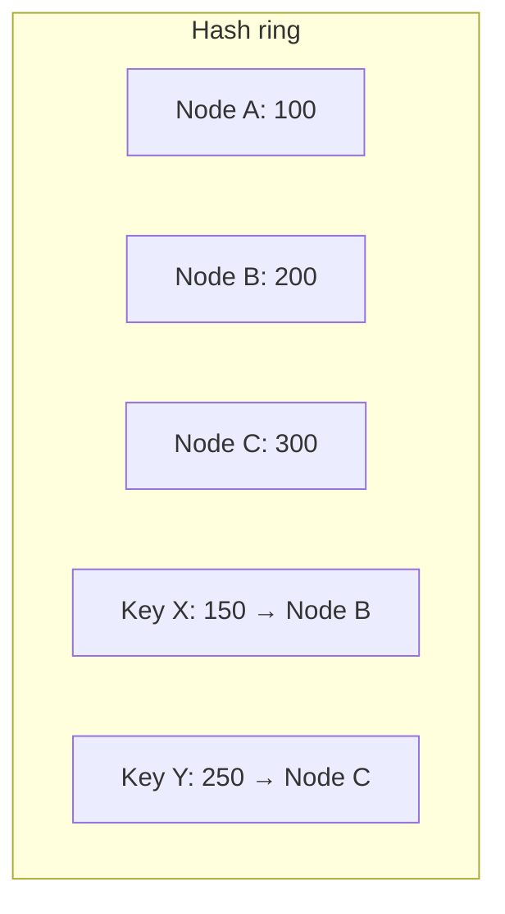

# Вопросы на собеседовании: `Хеш-таблицы`

Хеш-таблица — самая используемая структура в продакшене: `HashMap`, `HashSet`, кэши, индексы. На собеседовании любят спрашивать про коллизии, treeify в Java 8+, отличия `HashMap` и `ConcurrentHashMap`, consistent hashing для распределённых систем.

## Полезные ссылки

### Официальная документация и авторитетные источники

- [Java HashMap — Baeldung](https://www.baeldung.com/java-hashmap)
- [Inside Java HashMap (Java 8) — Baeldung](https://www.baeldung.com/java-hashmap-load-factor)
- [ConcurrentHashMap — Baeldung](https://www.baeldung.com/java-concurrent-map)
- [hashCode() and equals() — Baeldung](https://www.baeldung.com/java-equals-hashcode-contracts)
- [Consistent Hashing — Baeldung](https://www.baeldung.com/cs/consistent-hashing)
- [HashMap (Java) — Oracle Docs](https://docs.oracle.com/en/java/javase/17/docs/api/java.base/java/util/HashMap.html)

## Содержание

- [Полезные ссылки](#полезные-ссылки)
- [See also](#see-also)

**Базовые понятия**
- [Q1. (!) Что такое хеш-таблица?](#q1--что-такое-хеш-таблица)
- [Q2. (!) Что такое хеш-функция и какие требования к ней?](#q2--что-такое-хеш-функция-и-какие-требования-к-ней)
- [Q3. (!) Что такое коллизии и как их разрешают?](#q3--что-такое-коллизии-и-как-их-разрешают)

**Methods и contract**
- [Q4. (!) Контракт hashCode() и equals()?](#q4--контракт-hashcode-и-equals)
- [Q5. (!) Что будет, если переопределить equals, но не hashCode?](#q5--что-будет-если-переопределить-equals-но-не-hashcode)
- [Q6. Как переопределять hashCode по правилам?](#q6-как-переопределять-hashcode-по-правилам)
- [Q7. Что такое immutable key и почему важен?](#q7-что-такое-immutable-key-и-почему-важен)

**Реализация HashMap в Java**
- [Q8. (!) Как устроен HashMap внутри?](#q8--как-устроен-hashmap-внутри)
- [Q9. (!) Что такое load factor и initial capacity?](#q9--что-такое-load-factor-и-initial-capacity)
- [Q10. (!) Что такое rehashing?](#q10--что-такое-rehashing)
- [Q11. (!) Что такое treeify и как работает с Java 8+?](#q11--что-такое-treeify-и-как-работает-с-java-8)
- [Q12. (!) Сложности операций HashMap?](#q12--сложности-операций-hashmap)
- [Q13. Почему capacity HashMap всегда степень двойки?](#q13-почему-capacity-hashmap-всегда-степень-двойки)
- [Q14. Что такое perturbation в hashCode?](#q14-что-такое-perturbation-в-hashcode)

**Виды разрешения коллизий**
- [Q15. (!) Chaining (separate chaining) — как работает?](#q15--chaining-separate-chaining--как-работает)
- [Q16. (!) Open addressing — линейное и квадратичное пробирование?](#q16--open-addressing--линейное-и-квадратичное-пробирование)
- [Q17. Что такое double hashing?](#q17-что-такое-double-hashing)
- [Q18. Когда выбирают chaining, а когда open addressing?](#q18-когда-выбирают-chaining-а-когда-open-addressing)

**HashMap и thread-safety**
- [Q19. (!) Почему HashMap небезопасна в многопотоке?](#q19--почему-hashmap-небезопасна-в-многопотоке)
- [Q20. (!) Как устроена ConcurrentHashMap?](#q20--как-устроена-concurrenthashmap)
- [Q21. Чем ConcurrentHashMap отличается от Hashtable и Collections.synchronizedMap?](#q21-чем-concurrenthashmap-отличается-от-hashtable-и-collectionssynchronizedmap)
- [Q22. (!) Атомарные методы ConcurrentHashMap?](#q22--атомарные-методы-concurrenthashmap)

**Особые виды Map**
- [Q23. (!) LinkedHashMap — как устроен и зачем?](#q23--linkedhashmap--как-устроен-и-зачем)
- [Q24. WeakHashMap?](#q24-weakhashmap)
- [Q25. IdentityHashMap?](#q25-identityhashmap)
- [Q26. EnumMap?](#q26-enummap)

**Распределённое хеширование**
- [Q27. (!) Что такое consistent hashing?](#q27--что-такое-consistent-hashing)
- [Q28. Как работает rendezvous hashing?](#q28-как-работает-rendezvous-hashing)
- [Q29. (!) Bloom filter?](#q29--bloom-filter)
- [Q30. Cuckoo hashing?](#q30-cuckoo-hashing)

**Подводные камни**
- [Q31. (!) Что такое HashDoS-атака?](#q31--что-такое-hashdos-атака)
- [Q32. Когда HashMap деградирует до O(n)?](#q32-когда-hashmap-деградирует-до-on)
- [Q33. Можно ли использовать null как ключ или значение?](#q33-можно-ли-использовать-null-как-ключ-или-значение)
- [Q34. (!) Чем HashSet отличается от HashMap?](#q34--чем-hashset-отличается-от-hashmap)

## Q1. (!) Что такое хеш-таблица?

**Hash table** — структура для быстрого поиска, вставки и удаления по ключу. Использует **хеш-функцию** для преобразования ключа в индекс массива (bucket).

```mermaid
graph LR
    K["Key: Alice"] -->|hash() % size| I["Index: 5"]
    I --> B["Bucket[5]: value"]
```

**Сложности:**
- Среднее: `O(1)` на `get/put/remove`
- Худшее: `O(n)` (без оптимизаций) или `O(log n)` (Java 8+ с treeify)

**Применения:** кеши (Redis, Memcached), индексы in-memory БД, dictionaries, sets, deduplication, frequency counting, distributed sharding.


> [!mcq] Что верно характеризует хеш-таблицу как структуру данных?
>
> - [ ] A. Хеш-таблица гарантирует O(1) для всех операций без исключений, включая containsValue и iteration по полному набору значений.
>
>     **Что на самом деле.** containsValue в HashMap — это O(n + capacity) всегда: он сканирует все buckets и сравнивает значения через equals. Iteration — тоже O(n + capacity). Хеш-таблица даёт O(1) только для операций по ключу: get, put, remove, containsKey.
>
>     **Откуда путаница.** Маркетинговое «O(1)» из учебников опускает, что это только для key-lookup; iterables/value-lookup не выигрывают от структуры массива buckets.
>
>     **Если бы это было правдой.** Сервис, делающий `cache.containsValue(staleObject)` в hot-path на карте с 1M записей при p99-SLA 50ms, получил бы регулярные таймауты — что и наблюдалось в реальных incidents с reverse-lookup-кодом.
>
>     **Как было бы правильно.** Уточнить, что O(1) — только key-операции; для value-lookup нужен обратный индекс `Map<V, Set<K>>` или специализированный двусторонний словарь.
>
> - [x] B. Хеш-таблица — структура, отображающая ключи в значения через `index = hash(key) mod capacity`; даёт O(1) среднее для get/put/remove, а коллизии разрешаются chaining либо open addressing.
>
>     **Развёрнутое объяснение.** Ядро структуры — массив buckets фиксированного размера. Хеш-функция превращает ключ произвольного типа в целое число, и индекс в массиве вычисляется через modulo (или битовую операцию для power-of-two capacity). Поскольку bucket-pointer в массиве — это random access, get/put/remove получают amortized O(1). При коллизиях (разные ключи, один индекс) применяются две классические стратегии: chaining (список/дерево в bucket) или open addressing (поиск следующей свободной ячейки в массиве). Java `HashMap` использует chaining + treeify при цепочке ≥ 8.
>
>     **Пример.** Redis использует hash table как primary in-memory store: `dict.c` реализует chained hash с инкрементальным rehashing. При 100M ключей и доступе по `GET user:42` Redis выполняет хеш и indexing за ~50ns без сканирования; именно поэтому Redis отдаёт ~100k ops/sec на одно ядро.
>
>     **Когда применять.** Любой O(1) lookup по ключу: in-memory кэши, индексы БД, dedup, frequency counting, session storage, sharding. Это default-структура, когда нужен быстрый доступ по равенству (а не по диапазону — для range-запросов берём TreeMap/BTreeMap).
>
>     **Подводные камни.** Резкое падение производительности при плохом hashCode (все в один bucket) — поэтому в Java 8+ ввели treeify. iteration order не определён и может меняться между запусками JVM — нельзя полагаться в тестах. Initial capacity критичен: `new HashMap<>(1_500_000)` экономит ~20 resize-операций при 1M записей.
>
>     **Связанные вопросы.** [[hash-tables-interview#Q3]] коллизии; [[hash-tables-interview#Q8]] устройство HashMap; [[hash-tables-interview#Q12]] сложности операций.
>
> - [ ] C. Хеш-таблица сортирует ключи и использует бинарный поиск по отсортированному массиву.
>
>     **Что на самом деле.** Сортировка + бинарный поиск — это описание `TreeMap` (red-black tree) или sorted array; они дают O(log n). HashMap намеренно НЕ сортирует — порядок iteration зависит от hashCode и capacity, и формально не определён.
>
>     **Откуда путаница.** Студентов часто учат «структуры для быстрого поиска» одновременно (BST, hash table), и алгоритмы смешиваются. «Bucket» иногда путают с «отсортированный сегмент».
>
>     **Если бы это было правдой.** Код, ожидающий «отсортированный» вывод из `map.keySet()`, получал бы непредсказуемые результаты при апгрейде Java или изменении capacity — баги типа «тесты падают в CI после изменения порядка ключей».
>
>     **Как было бы правильно.** Описать TreeMap (O(log n), отсортированные ключи) как отдельную структуру для случаев, когда порядок важен; HashMap — для O(1) без порядка.
>
> - [ ] D. Хеш-таблица хранит элементы в связном списке, индексируемом по порядку вставки.
>
>     **Что на самом деле.** Это описание `LinkedList` или `ArrayList`. Хеш-таблица использует массив buckets с random-access по индексу-хешу. `LinkedHashMap` поддерживает порядок вставки ДОПОЛНИТЕЛЬНО к hash-структуре, но базовый HashMap — нет.
>
>     **Откуда путаница.** Слово «таблица» иногда воспринимается как «упорядоченный список»; chaining добавляет ассоциацию с linked list.
>
>     **Если бы это было правдой.** `get(key)` стоил бы O(n) — линейный обход списка для поиска ключа; в production-системе с 10M записей это сделало бы любую операцию неприемлемо медленной.
>
>     **Как было бы правильно.** Указать, что элементы хранятся в массиве buckets с O(1) доступом по индексу; chaining внутри bucket — это запасной механизм, не основной storage.

## Q2. (!) Что такое хеш-функция и какие требования к ней?

**Хеш-функция** — функция `hash(key) → int`, преобразующая ключ в индекс. Хорошая хеш-функция:

1. **Детерминированная:** одинаковый ключ → одинаковый хеш
2. **Равномерная:** значения хешей равномерно распределены
3. **Быстрая:** вычисление O(длины ключа)
4. **Avalanche effect:** малое изменение ключа → большое изменение хеша

```java
// Пример хеш-функции для строки (использует Java)
int hash = 0;
for (char c : str.toCharArray()) {
    hash = 31 * hash + c; // 31 — простое число с хорошими свойствами
}
```

**Криптографические хеши** (SHA-256, MD5) — медленнее, но «непредсказуемые». Для hash-таблиц используют **некриптографические** (`Murmur`, `xxHash`, `CityHash`).


> [!mcq] Какие требования к хорошей хеш-функции для HashMap, и что выбирать в production?
>
> - [ ] A. Хеш-функция должна возвращать уникальные значения для каждого ключа, иначе HashMap сломается.
>
>     **Что на самом деле.** Уникальность невозможна по pigeonhole principle: ключей бесконечно (например, всех String), а int — 2³². Коллизии неизбежны и нормальны — HashMap разрешает их через chaining/treeify. Требование к хеш-функции — равномерность, а не уникальность.
>
>     **Откуда путаница.** Идеализация «hash = fingerprint» из криптографических контекстов (SHA-256), где для практических входов коллизий почти не бывает. Для HashMap масштабы другие.
>
>     **Если бы это было правдой.** Любая попытка использовать String как ключ ломалась бы — два разных String с одинаковым hashCode (а их легко найти, например, "Aa" и "BB" в Java) делали бы HashMap неработоспособным.
>
>     **Как было бы правильно.** Сформулировать требование как «равномерное распределение значений хеша по доступному диапазону, при котором коллизии редки и не группируются».
>
> - [ ] B. Хеш-функция должна сохранять близость ключей: близкие по значению ключи получают близкие хеши.
>
>     **Что на самом деле.** Это требование локально-чувствительного хеша (LSH), который применяется для approximate nearest-neighbor поиска (image similarity, document dedup). Для HashMap нужно ровно обратное — avalanche effect: малое изменение ключа должно давать большое изменение хеша, иначе ключи кластеризуются в соседних buckets.
>
>     **Откуда путаница.** Интуиция «соседние данные → соседние индексы» из массивов и B-деревьев. В hash table эта интуиция приводит к катастрофе.
>
>     **Если бы это было правдой.** Карта со счётчиками по последовательным `id=1,2,3,...` загнала бы все ключи в первые buckets — а остальной массив пустовал бы; деградация до O(n) на linear scan.
>
>     **Как было бы правильно.** Требование «avalanche effect» — близкие ключи должны давать максимально удалённые хеши; LSH — это отдельная задача, не для общеназначных HashMap.
>
> - [x] C. Хорошая хеш-функция детерминирована, равномерно распределяет значения по диапазону, быстро вычисляется; для HashMap в production используют некриптографические функции (MurmurHash, xxHash, CityHash) с avalanche effect.
>
>     **Развёрнутое объяснение.** Четыре ключевых свойства: (1) **детерминизм** — `hash(x) == hash(x)` всегда, иначе теряется invariant Map; (2) **равномерность** — хеши должны покрывать диапазон без перекоса, иначе buckets перегружаются; (3) **скорость** — хеш вызывается на каждый put/get/contains, поэтому O(длины ключа) с маленькой константой; (4) **avalanche effect** — изменение одного бита ключа должно менять ~50% бит хеша, что предотвращает clustering. Для in-memory hash tables это даёт MurmurHash3 (Redis, Cassandra), xxHash (rocksDB, LZ4), CityHash (Google). Криптографические (SHA-256, MD5) подходят теоретически, но на порядок медленнее и не нужны для нон-adversarial scenario.
>
>     **Пример.** Java `String.hashCode()` использует polynomial с base 31: `h = 31*h + c`. Простое число 31 даёт хорошее распределение и JIT-friendly (заменяется на shift+subtract `(h<<5) - h`). После этого HashMap применяет perturbation `h ^ (h>>>16)` для смешивания старших и младших бит. Для cryptographic-grade распределения Guava предлагает `Hashing.murmur3_128()`.
>
>     **Когда применять.** При написании custom hashCode для value-объектов: использовать `Objects.hash(field1, field2)` или Lombok `@EqualsAndHashCode`. В системах со sharding (Kafka partitioning, distributed cache) — MurmurHash или xxHash для лучшего распределения по узлам. Криптографические — только когда есть adversarial input и нужна защита (например, hash-flooding в открытых API).
>
>     **Подводные камни.** `String.hashCode()` имеет известные коллизии (например, "Aa" и "BB" дают одинаковый хеш) — этим пользовались HashDoS-атакующие. Поэтому Java 8+ добавил treeify. Кастомный `hashCode` с `return 1;` технически детерминирован, но катастрофически неравномерен — typical antipattern в junior-коде.
>
>     **Связанные вопросы.** [[hash-tables-interview#Q14]] perturbation; [[hash-tables-interview#Q4]] hashCode contract; [[hash-tables-interview#Q31]] HashDoS.
>
> - [ ] D. Для HashMap необходимо использовать криптографические хеши (SHA-256) для защиты от коллизий и атак.
>
>     **Что на самом деле.** SHA-256 на 1-2 порядка медленнее MurmurHash (~1 μs vs ~10 ns на 32-байтовый ключ), и эта стоимость ложится на каждый put/get. Криптографические хеши избыточны для нон-adversarial use case; Java и большинство языков используют обычные `hashCode` + treeify как защиту.
>
>     **Откуда путаница.** «Hash» в безопасности и в структурах данных — разные требования. SHA-256 защищает от подбора preimage (нужно для подписей), а HashMap нужно только uniform distribution.
>
>     **Если бы это было правдой.** Сервис с 50k RPS и 1KB-ключами тратил бы 50ms CPU/сек только на хеширование — это треть бюджета CPU при small object cache; throughput упал бы в 3-5 раз.
>
>     **Как было бы правильно.** Использовать MurmurHash/xxHash для скорости + treeify в HashMap как защиту от worst-case коллизий; криптографический хеш — только когда модель угроз требует resistance к адверсарной подделке коллизий.

## Q3. (!) Что такое коллизии и как их разрешают?

**Коллизия** — два разных ключа дают одинаковый хеш (или один индекс bucket). Неизбежны: ключей бесконечно, индексов конечно (по pigeonhole principle).

**Способы разрешения:**

1. **Chaining (separate chaining)** — в bucket связный список (или дерево):


2. **Open addressing** — ищем следующую свободную ячейку:
   - Linear probing: `(hash + 1) % size`
   - Quadratic probing: `(hash + i²) % size`
   - Double hashing: `(hash + i · h₂(key)) % size`

`HashMap` в Java использует **chaining**, с Java 8+ длинные цепочки превращаются в **красно-чёрное дерево**.


> [!mcq] Что такое коллизия в хеш-таблице и какие основные стратегии её разрешения?
>
> - [x] A. Коллизия — два разных ключа дают одинаковый индекс bucket; Java HashMap разрешает их через chaining (связный список, при ≥8 элементов и capacity≥64 — красно-чёрное дерево), а open addressing ищет следующую свободную ячейку в массиве.
>
>     **Развёрнутое объяснение.** Коллизии неизбежны по pigeonhole principle: ключей бесконечно, buckets — конечное число. Две классические стратегии: **chaining** — каждый bucket держит список (или дерево) элементов, и при коллизии новый элемент дописывается в этот список; **open addressing** — все элементы в одном массиве, при занятой ячейке ищется следующая свободная (linear/quadratic probing, double hashing). Chaining терпит любой load factor (даже >1), open addressing деградирует при LF > 0.7. Java HashMap с Java 8+ использует chaining + treeify в красно-чёрное дерево, что даёт O(log n) worst-case вместо O(n).
>
>     **Пример.** Cassandra `Memtable` использует chaining для in-memory hash; при flush на диск (SSTable) — это уже B-tree-подобная структура. Python `dict` использует open addressing (perturbation-based probing); Go `map` — open addressing с bucketized chaining (8 элементов на bucket).
>
>     **Когда применять.** Chaining — когда LF может варьироваться, ключей много, кэш не главное (большинство языков SDK: Java, C#, Ruby). Open addressing — когда LF контролируется и важна cache locality (Python, Go, C++ flat_hash_map от Abseil). При проектировании custom hash table — chaining проще реализовать корректно, open addressing требует tombstones.
>
>     **Подводные камни.** Treeify в Java требует, чтобы ключи реализовывали `Comparable`; иначе используется `System.identityHashCode` как tie-breaker — менее эффективно, но всё равно O(log n). При treeify capacity должен быть ≥ 64 (`MIN_TREEIFY_CAPACITY`), иначе вместо treeify происходит resize.
>
>     **Связанные вопросы.** [[hash-tables-interview#Q11]] treeify; [[hash-tables-interview#Q15]] chaining; [[hash-tables-interview#Q16]] open addressing.
>
> - [ ] B. Коллизии в HashMap полностью предотвращаются выбором правильной хеш-функции — при идеальном хеше их нет.
>
>     **Что на самом деле.** Идеальная хеш-функция (perfect hash) возможна только для **статичного, заранее известного** набора ключей (например, keywords компилятора). Для динамического HashMap коллизии неизбежны: множество возможных String бесконечно, а range int — конечен.
>
>     **Откуда путаница.** Учебники иногда упоминают «perfect hashing» как теоретическую цель, не подчёркивая, что это работает только для статичных наборов.
>
>     **Если бы это было правдой.** Не нужны были бы ни chaining, ни treeify, ни load factor — HashMap был бы тривиальным `Node[]`. Но любая попытка добавить новый ключ в карту со 100M записей всё равно вызовет коллизию, и игнорирование этого приведёт к потере данных.
>
>     **Как было бы правильно.** Уточнить, что perfect hashing работает только для статичного набора ключей (GNU `gperf`, например); для dynamic HashMap нужны механизмы разрешения коллизий.
>
> - [ ] C. Open addressing и chaining дают одинаковую производительность при любом load factor — выбор между ними чисто эстетический.
>
>     **Что на самом деле.** Open addressing деградирует драматически при LF > 0.7 из-за primary/secondary clustering (соседние занятые ячейки сливаются). Chaining работает корректно при любом LF, просто цепочки становятся длиннее. На LF=0.5 open addressing быстрее (cache locality), но на LF=0.9 чтение open addressing может стоить десятки probes, а chaining — те же 1-2 элемента в списке.
>
>     **Откуда путаница.** Учебники иногда сравнивают только asymptotic complexity, опуская constant factor и поведение на разных LF.
>
>     **Если бы это было правдой.** Не было бы причин использовать chaining в Java HashMap; разработчики JDK выбирали бы open addressing для cache locality. Но Java HashMap при LF=0.95 (например, через `(int)(1_000_000/0.75)+1`) всё ещё работает приемлемо благодаря chaining.
>
>     **Как было бы правильно.** Указать, что open addressing нужно держать на LF < 0.7, а chaining терпит больше; выбор стратегии зависит от ожидаемого LF и важности cache locality.
>
> - [ ] D. Rehashing полностью устраняет коллизии, перераспределяя все ключи через новый хеш-алгоритм.
>
>     **Что на самом деле.** Rehashing увеличивает capacity (обычно ×2) и перераспределяет ключи по новым индексам, что уменьшает плотность и количество коллизий — но не устраняет их полностью. Если все ключи имеют одинаковый hashCode, никакой rehash их не разделит — они снова окажутся в одном bucket.
>
>     **Откуда путаница.** Если LF был 0.95 и стал 0.475, кажется, что «коллизий стало вдвое меньше» — это правда, но не «ноль коллизий».
>
>     **Если бы это было правдой.** HashMap с capacity=2³² мог бы вместить любое число ключей без коллизий — но это невозможно ни физически (память), ни логически (pigeonhole). Реальные HashMap всегда имеют коллизии при достаточном размере.
>
>     **Как было бы правильно.** Уточнить, что rehashing **снижает** среднее число коллизий через расширение пространства buckets, но не гарантирует их отсутствие; для случая «все ключи в одном bucket» поможет только treeify, а не rehash.

## Q4. (!) Контракт hashCode() и equals()?

```
1. equals() reflexive: x.equals(x) == true
2. equals() symmetric: x.equals(y) == y.equals(x)
3. equals() transitive: x.equals(y) && y.equals(z) → x.equals(z)
4. equals() consistent: пока объекты не меняются, equals возвращает то же
5. equals() with null: x.equals(null) == false

6. hashCode() consistent: пока объекты не меняются, hashCode возвращает то же
7. equals → hashCode: x.equals(y) → x.hashCode() == y.hashCode()
8. !equals → hashCode: x.equals(y) == false НЕ требует разных hashCode (но желательно)
```

**Главное правило:** если два объекта равны (`equals == true`) — их hashCode **обязан** быть равным. Обратное не обязательно.


> [!mcq] Какой контракт связывает методы `equals()` и `hashCode()` в Java?
>
> - [ ] A. Если `equals()` возвращает true, то `hashCode()` обязан также возвращать true для обоих объектов.
>
>     **Что на самом деле.** Контракт связывает `equals` (возвращает boolean) и `hashCode` (возвращает int — число!) через значение, а не через результат вызова. Правильная формулировка: если `a.equals(b) == true`, то `a.hashCode() == b.hashCode()` (одинаковые int-значения).
>
>     **Откуда путаница.** Незнание сигнатур методов: разработчик помнит «equals и hashCode должны согласоваться», но не помнит типы возврата.
>
>     **Если бы это было правдой.** В коде типа `if (a.hashCode())` Java выдаст compile error (`int cannot be converted to boolean`); попытка реализовать «hashCode возвращает true» физически невозможна.
>
>     **Как было бы правильно.** Сформулировать: `a.equals(b) ⟹ a.hashCode() == b.hashCode()` (равенство int-значений хешей).
>
> - [ ] B. Контракт симметричен в обоих направлениях: equals и hashCode согласованы и в одну, и в обратную сторону.
>
>     **Что на самом деле.** Контракт **асимметричен**: `equals ⟹ same hashCode`, но НЕ наоборот. Два разных объекта могут иметь одинаковый hashCode (это коллизия — нормально), но они не обязаны быть equal. Без асимметрии хеш-функция была бы тривиальной (например, `return 1;` нарушила бы только «обратное», но не реальный контракт).
>
>     **Откуда путаница.** Интуиция «контракт = двусторонняя связь»; на деле hashCode — это lossy projection (int — узкий тип).
>
>     **Если бы это было правдой.** Любая хеш-коллизия (например, `"Aa".hashCode() == "BB".hashCode()`) делала бы HashMap нерабочей: "Aa" и "BB" должны были бы быть equal, но это разные строки. Все HashMap в JDK сломались бы.
>
>     **Как было бы правильно.** Принять асимметрию: equals → same hashCode (обязательно), same hashCode → equals (не обязательно).
>
> - [ ] C. Контракт требует: два объекта с одинаковым hashCode обязательно equals.
>
>     **Что на самом деле.** Это обратное направление контракта, и оно **не обязательно**. Одинаковый hashCode — это коллизия, нормальное явление. HashMap внутри решает коллизии через chaining: сначала находит bucket по hashCode, затем перебирает элементы цепочки и сравнивает через equals — только тогда определяется, есть ли совпадение.
>
>     **Откуда путаница.** Чтение контракта в одном направлении (`equals → hashCode`) и обобщение «значит и наоборот».
>
>     **Если бы это было правдой.** Хеш-функция должна была бы быть injective (биекция), что невозможно для String/Object → int. HashMap не мог бы работать с произвольными ключами; коллизии стали бы багами.
>
>     **Как было бы правильно.** Контракт только в одну сторону: `equals ⟹ same hashCode`; одинаковый hashCode при `!equals` — это коллизия, нужная и нормальная.
>
> - [x] D. Контракт: если `a.equals(b) == true`, то `a.hashCode() == b.hashCode()` обязательно; обратное не требуется — разные объекты могут иметь одинаковый hashCode (это коллизия, нормальное явление, разрешаемое chaining/treeify).
>
>     **Развёрнутое объяснение.** Полный контракт состоит из 5 правил для equals (рефлексивность, симметричность, транзитивность, согласованность, `x.equals(null) == false`) и 2 правил для hashCode (согласованность во времени, согласованность с equals). Главное правило, которое чаще всего нарушают: **equal objects must have equal hashCodes**. Обратное направление (one-to-one) физически невозможно: hashCode возвращает int (2³² значений), а ключей бесконечно много. Поэтому коллизии — норма. HashMap при коллизии сначала ищет по hashCode (bucket), затем внутри bucket сравнивает кандидатов через equals.
>
>     **Пример.** Lombok `@EqualsAndHashCode(of = {"id"})` генерирует пару методов, которые читают одно и то же поле `id`. Если изменить annotation на `equals` только без hashCode (или включить разные поля), HashMap сломается тихо: `set.add(obj)` сработает, но `set.contains(equalObj)` вернёт false. Знаменитый «потерянный объект в HashSet» — типичный bug на code review.
>
>     **Когда применять.** При создании любого value object, который будет ключом HashMap/HashSet или элементом этой Set. Records (Java 14+) генерируют контракт автоматически — предпочтительный вариант. Для классов — Lombok `@EqualsAndHashCode` или IDE-generator (IDEA, Eclipse). Никогда не писать вручную для production-кода без unit-тестов контракта.
>
>     **Подводные камни.** При наследовании контракт легко нарушается: Person и Employee (extends Person), где Person.equals сравнивает по name, может дать `person.equals(employee) == true`, но `employee.equals(person) == false` — нарушение симметричности. Лучше всего избегать наследования value objects; использовать composition.
>
>     **Связанные вопросы.** [[hash-tables-interview#Q5]] нарушение контракта; [[hash-tables-interview#Q6]] правильная реализация; [[hash-tables-interview#Q7]] immutable keys.

## Q5. (!) Что будет, если переопределить equals, но не hashCode?

**Полная катастрофа** в hash-based коллекциях:

```java
class User {
    String name;
    User(String name) { this.name = name; }

    @Override
    public boolean equals(Object o) {
        if (!(o instanceof User u)) return false;
        return name.equals(u.name);
    }
    // hashCode НЕ переопределён — используется Object.hashCode() (по identity)
}

Set<User> users = new HashSet<>();
users.add(new User("Alice"));
users.contains(new User("Alice")); // false! Разные hashCode → разные buckets
```

Контракт нарушен: `equals == true`, но `hashCode != hashCode`. `HashSet/HashMap` ищут в bucket, который определяется hashCode — не находят и считают, что объекта нет.

**Правило:** всегда переопределяй `hashCode` вместе с `equals`. Используй IDE-генератор или Lombok `@EqualsAndHashCode`.


> [!mcq] Что произойдёт, если переопределить `equals()` без `hashCode()` и положить такой объект в `HashSet`?
>
> - [ ] A. `equals()` выбросит `ClassCastException` при попытке сравнить объекты из разных buckets.
>
>     **Что на самом деле.** `ClassCastException` бросается при касте объекта к несовместимому типу, и никак не связан с hashCode. Реальная проблема — функциональный bug без exception: `set.contains(equalObject)` тихо возвращает `false`, даже если объект логически "тот же".
>
>     **Откуда путаница.** Разработчики ожидают, что Java «защищает» от нарушений контракта через runtime-проверки. На деле контракт hashCode/equals — это API contract, который JVM не проверяет; ответственность на программисте.
>
>     **Если бы это было правдой.** Любое нарушение контракта приводило бы к exception, и баги ловились бы сразу. На деле приложения месяцами работают с потерянными в HashSet записями, пока кто-нибудь не заметит «дубликаты» в логе.
>
>     **Как было бы правильно.** Указать, что нарушение тихое: данные «теряются» в HashSet, но без исключения — это и делает баг особенно опасным.
>
> - [x] B. `HashSet`/`HashMap` не найдут логически равный объект: поиск идёт сначала по hashCode (выбор bucket), и поскольку hashCode разный (унаследованный `Object.hashCode()` по identity), поиск попадает в другой bucket и `contains()` возвращает `false` без exception.
>
>     **Развёрнутое объяснение.** Алгоритм HashMap.get/contains: (1) вычислить `hashCode(key)`, (2) определить bucket по `index = (capacity-1) & hash`, (3) пройти по цепочке в этом bucket и сравнить кандидатов через `equals`. Если hashCode переопределён неправильно (или не переопределён вовсе), два логически равных объекта попадают в разные buckets — equals никогда не вызывается. Это самое коварное нарушение контракта в Java: код компилируется, тесты иногда проходят (если HashSet пуст или маленький), но в production данные «теряются».
>
>     **Пример.** Класс `Person { String name; }` с переопределённым `equals` (сравнение по name) без hashCode. `Set<Person> seen = new HashSet<>(); seen.add(new Person("Alice")); seen.contains(new Person("Alice"));` — возвращает `false`! Lombok `@EqualsAndHashCode` или generation IDEA/Eclipse решает проблему. Records (Java 14+) делают это автоматически.
>
>     **Когда применять.** При создании любого класса-ключа Map или элемента Set: всегда генерировать пару методов одновременно через Lombok/IDE/records. На code review: проверять, что `@EqualsAndHashCode` либо обе аннотации присутствуют, либо ни одной. В тестах — assert-проверка контракта через EqualsVerifier (Jan Ouwens) или Guava `EqualsTester`.
>
>     **Подводные камни.** Hibernate proxy объекты имеют непредсказуемый hashCode из-за lazy loading: их нельзя использовать как ключи HashMap. Тестировать стоит и `set.add()` → `set.contains()`, и `map.put(k, v)` → `map.get(equalK)`, и `set.remove(equalK)`. Использовать `EqualsVerifier.forClass(MyKey.class).verify()` в unit-тестах — он находит все 8 нарушений контракта.
>
>     **Связанные вопросы.** [[hash-tables-interview#Q4]] контракт hashCode/equals; [[hash-tables-interview#Q6]] правильная реализация; [[hash-tables-interview#Q7]] immutable keys.
>
> - [ ] C. Метод `put()` выбросит исключение при попытке добавить объект с нарушенным контрактом.
>
>     **Что на самом деле.** `put()` не проверяет контракт — он просто вычисляет hashCode (любое значение допустимо), кладёт элемент в соответствующий bucket. Никакой verification внутри Java collections нет. Bug проявится только при `get()`/`contains()`/`remove()`, и то не в виде exception, а в виде «не находит» — самый трудно отлаживаемый случай.
>
>     **Откуда путаница.** Ожидание, что Java имеет «defensive checks» в стандартных коллекциях. На деле это design choice: проверки stalled бы производительность put в hot path.
>
>     **Если бы это было правдой.** Контракт нарушался бы громко, и баги фиксились бы сразу — но на практике приложения работают с invisible duplicate'ами в HashSet, потому что bug тихий.
>
>     **Как было бы правильно.** Использовать EqualsVerifier в тестах для assert-проверки контракта; код не получает runtime-защиты от JDK.
>
> - [ ] D. Коллекция будет работать корректно, только с увеличенным числом коллизий.
>
>     **Что на самом деле.** Это не «больше коллизий» — это **функциональный bug**. `set.add(new Person("Alice"))` и `set.add(new Person("Alice"))` добавят два разных объекта в Set (потому что у них разный identity-hashCode), хотя пользователь ожидает один. `contains()` для нового `Person("Alice")` вернёт false. Семантика Set сломана полностью.
>
>     **Откуда путаница.** Разработчик предполагает, что «нарушение оптимизации» означает «медленнее», но коллекция работает. На деле — функциональная инкорректность, а не perf-degradation.
>
>     **Если бы это было правдой.** Все Java-приложения с custom keys продолжали бы работать, просто медленнее. На деле многие имеют тихий bug с потерянными данными в Set/Map.
>
>     **Как было бы правильно.** Указать функциональное последствие: дубликаты добавляются как разные, `contains/remove` не находят логически равных — это сломанная семантика Set/Map, а не perf issue.

## Q6. Как переопределять hashCode по правилам?

```java
// Java 7+ — Objects.hash()
@Override
public int hashCode() {
    return Objects.hash(field1, field2, field3);
}

// Ручная реализация (немного быстрее, без autoboxing)
@Override
public int hashCode() {
    int result = 17;
    result = 31 * result + (field1 != null ? field1.hashCode() : 0);
    result = 31 * result + Integer.hashCode(field2);
    result = 31 * result + Long.hashCode(field3);
    return result;
}

// Лучшая практика — Lombok или record
@EqualsAndHashCode
class User { ... }

record User(String name, int age) { } // hashCode/equals/toString автоматически
```

**Почему 31:** простое число, легко оптимизируется JIT (`31 * x = (x << 5) - x`).


> [!mcq] Как правильно реализовать `hashCode()` для value-объекта, который будет ключом HashMap?
>
> - [ ] A. hashCode должен возвращать постоянно увеличивающееся значение для минимизации коллизий и упорядоченного распределения.
>
>     **Что на самом деле.** Монотонный hashCode (например, инкрементированный counter в конструкторе) кластеризует все ключи в первых buckets — это хуже, чем случайный. Хорошее распределение — равномерное по всему range int, а не монотонное.
>
>     **Откуда путаница.** Интуиция «уникальные значения через counter» (как database IDENTITY) переносится из БД, где порядковые ID хороши для primary key. В hash table этот подход вреден.
>
>     **Если бы это было правдой.** При capacity=16 первые 16 объектов попадут каждый в свой bucket, дальше — все в bucket[15] (или другой остаток). При 1M записей — все в bucket[14], потому что (1_000_000 & 15) = 0; деградация до O(n) на любой get.
>
>     **Как было бы правильно.** Использовать поля объекта (через `Objects.hash`) для равномерного распределения по диапазону int; counter в конструкторе — это antipattern для hashCode.
>
> - [ ] B. Использование `Objects.hash()` нарушает контракт, поэтому нужна только ручная реализация с XOR и простым числом.
>
>     **Что на самом деле.** `Objects.hash(field1, field2)` полностью корректен и рекомендован Effective Java (3rd ed., Item 11). Внутри он использует `Arrays.hashCode(Object[])` с тем же polynomial-31 алгоритмом. Ручная реализация нужна только для hot-path performance (избегание autoboxing и varargs array allocation).
>
>     **Откуда путаница.** Перфекционисты-разработчики считают, что «стандартная утилита делает хуже, чем кастомная». Это правда только для микро-оптимизаций на 10ns в hot loop, а не для контракта.
>
>     **Если бы это было правдой.** Lombok `@EqualsAndHashCode` (использующий аналог `Objects.hash`) и Java records (использующие `Objects.hash`) ломали бы контракт — но они работают корректно в миллиардах продакшен-кодов.
>
>     **Как было бы правильно.** Использовать `Objects.hash` или records по умолчанию; ручную реализацию — только для micro-benchmark-доказанных hot path с autoboxing-проблемой.
>
> - [x] C. Правильный hashCode включает все поля, участвующие в `equals()`, использует простой множитель 31 для polynomial combination; `Objects.hash(field1, field2, ...)` — стандарт Java 7+, а Lombok `@EqualsAndHashCode` и records генерируют корректную пару автоматически.
>
>     **Развёрнутое объяснение.** Алгоритм polynomial hash: `result = 31 * result + field.hashCode()` для каждого поля. Множитель 31 выбран как простое нечётное число с хорошими свойствами распределения и JIT-friendly (заменяется на `(h << 5) - h`). Все поля, по которым equals сравнивает, должны участвовать в hashCode — иначе контракт нарушится. Для null-safe: `Objects.hashCode(field)` или `(field != null ? field.hashCode() : 0)`. Records (Java 14+) — лучший подход для value objects: один-строчное определение и компилятор генерирует контракт автоматически.
>
>     **Пример.** `record Money(BigDecimal amount, Currency currency) {}` — два поля, и записываются: equals (сравнивает оба), hashCode (`Objects.hash(amount, currency)`), toString. Без records: `@EqualsAndHashCode @Value class Money { BigDecimal amount; Currency currency; }` через Lombok. Ручная реализация: `int result = 17; result = 31*result + amount.hashCode(); result = 31*result + currency.hashCode(); return result;`.
>
>     **Когда применять.** Любой value object для HashMap/HashSet: предпочитать records; иначе Lombok `@Value` или `@EqualsAndHashCode`. Hot-path code на 100k+ RPS с маленькими объектами — можно ручная реализация с XOR (быстрее на 5-10ns из-за отсутствия autoboxing varargs). Для тестирования — EqualsVerifier.
>
>     **Подводные камни.** Не включать в hashCode mutable поля, которые могут измениться после `put()` — иначе ключ «потеряется». Не включать поля, которых нет в equals (нарушит «equal → same hashCode»). В наследовании передавать `super.hashCode()` через 31-polynomial. Учитывать `BigDecimal.equals` (учитывает scale) vs `compareTo` (не учитывает) — выбирать одно и использовать соответствующее в hashCode.
>
>     **Связанные вопросы.** [[hash-tables-interview#Q4]] контракт hashCode/equals; [[hash-tables-interview#Q5]] нарушение контракта; [[hash-tables-interview#Q14]] perturbation в HashMap.
>
> - [ ] D. Для оптимальной производительности hashCode должен включать только один "уникальный" идентификатор, игнорируя остальные поля.
>
>     **Что на самом деле.** Если equals сравнивает несколько полей, hashCode обязан включать те же. Иначе контракт нарушится: два объекта с одинаковым id, но разными name дадут одинаковый hashCode (правильно), но если equals сравнивает и name — они будут `!equals` при `same hashCode` (это допустимо!). Проблема обратная: если equals = `(id, name)`, а hashCode = `id`, то для двух equal objects (с равными id и name) hashCode совпадёт — это работает. Но если меняется требование equals (добавили поле), hashCode тоже надо обновить.
>
>     **Откуда путаница.** «Один id уникален → одного достаточно для hashCode» — частая упрощённая логика. Это даже работает, пока equals тоже только по id. Но при расширении equals — рассинхрон.
>
>     **Если бы это было правдой.** Любое изменение equals требовало бы синхронного изменения hashCode — что часто забывают; контракт нарушится.
>
>     **Как было бы правильно.** Включать все поля equals в hashCode — это стандарт; синхронизация ответственность Lombok/records/IDE-генератора.

## Q7. Что такое immutable key и почему важен?

**Immutable key** — ключ, состояние которого нельзя изменить после создания. Если ключ изменить **после** добавления в `HashMap`:
- Хеш изменится → `get()` не найдёт элемент
- Элемент «потеряется» в неправильном bucket

```java
class MutableKey {
    int value;
    MutableKey(int v) { this.value = v; }
    @Override public int hashCode() { return value; }
    @Override public boolean equals(Object o) { ... }
}

MutableKey key = new MutableKey(1);
Map<MutableKey, String> map = new HashMap<>();
map.put(key, "value");
key.value = 2; // ИЗМЕНИЛИ КЛЮЧ!
map.get(key); // null! теперь хеш другой
```

**Правило:** в качестве ключей `HashMap` используй **immutable** объекты (`String`, `Integer`, `LocalDate`, records). Не меняй mutable поля, входящие в `hashCode/equals`.


> [!mcq] Что произойдёт, если после `map.put(key, value)` изменить поле объекта-ключа, входящее в hashCode?
>
> - [x] A. hashCode ключа изменится → `get()` вычислит новый index и пойдёт в другой bucket → не найдёт запись → вернёт null; запись «потеряется» без исключения. Правило: использовать только immutable ключи (String, Integer, LocalDate, records).
>
>     **Развёрнутое объяснение.** HashMap при `put()` запоминает позицию по текущему hashCode ключа. После изменения mutable поля ключа hashCode меняется, но HashMap не «знает» об этом — записи в карте не пересортировываются автоматически. При следующем `get(sameKey)` вычисляется новый bucket, в нём записи нет — возвращается null. При этом запись физически всё ещё в карте (в старом bucket), но недоступна по этому ключу. Хуже того: iteration по `map.entrySet()` всё ещё покажет её. Это самый тихий и трудно-отлаживаемый bug в Java collections.
>
>     **Пример.** Класс `class Person { String name; }` с реальным equals/hashCode по name. `Person alice = new Person("Alice"); map.put(alice, "data"); alice.name = "Bob"; map.get(alice);` — возвращает null! Запись осталась в bucket, соответствующем hash("Alice"), но get идёт в bucket для hash("Bob"). Правильный подход — `record Person(String name) {}` — поле final, изменить невозможно.
>
>     **Когда применять.** При любом проектировании value objects для использования в Map/Set. Records (Java 14+) — golden standard: final fields by default. Если используется обычный класс — все поля, входящие в equals/hashCode, должны быть `private final`. Defensive copy для mutable container fields (List, Map) — клонировать в конструкторе. Для DTO с setters — использовать как ключ только если seterы недоступны (например, после `@JsonProperty` deserialization, если объект сразу immutable).
>
>     **Подводные камни.** Hibernate proxy объекты с lazy-load полями: hashCode до load и после load может различаться, если поле включено в hashCode — это типичная проблема. Решение: использовать только `id` (immutable после persist) в hashCode/equals для JPA-entity. Также `BigDecimal` с разным scale (`new BigDecimal("1.0").equals(new BigDecimal("1.00")) == false`) — выбирать `equals` или `compareTo`-семантику явно.
>
>     **Связанные вопросы.** [[hash-tables-interview#Q4]] контракт hashCode/equals; [[hash-tables-interview#Q5]] нарушение контракта; [[hash-tables-interview#Q25]] IdentityHashMap.
>
> - [ ] B. Если изменить поле объекта-ключа после put(), HashMap автоматически переместит запись в правильный bucket при следующем put или resize.
>
>     **Что на самом деле.** HashMap не отслеживает изменения ключей — у Java нет listener-механизма для изменений полей. Запись остаётся в старом bucket навсегда; rehash тоже использует **новый** hashCode (изменённого ключа), поэтому при resize запись «перемещается» по новой логике — и теряется ещё надёжнее.
>
>     **Откуда путаница.** Ожидание «умного» поведения коллекций, как у observable-структур (например, JavaFX `ObservableMap`). Стандартная HashMap не observable.
>
>     **Если бы это было правдой.** HashMap имел бы overhead на listener-механизм для каждого ключа, что замедлило бы put/get на порядок. На деле — статическая привязка к hashCode на момент put.
>
>     **Как было бы правильно.** Изменение mutable полей ключа НЕ отслеживается — запись «теряется»; единственный надёжный путь — immutable keys.
>
> - [ ] C. Mutable ключи безопасны, если переопределить только `equals()` без hashCode — equals найдёт объект при изменении.
>
>     **Что на самом деле.** HashMap ищет bucket по hashCode **первым**, и только при попадании в правильный bucket вызывает equals. Если hashCode изменился, поиск идёт в другой bucket, и equals никогда не вызывается. Без hashCode переопределения используется `Object.hashCode()` (identity), который вообще не меняется при изменении полей — но тогда два логически равных объекта дадут разный hashCode (см. Q5).
>
>     **Откуда путаница.** Разработчик думает «equals достаточно для проверки равенства» — забывает архитектуру HashMap (hash-first).
>
>     **Если бы это было правдой.** Можно было бы безопасно класть mutable объекты в HashSet и изменять их — но HashSet и HashMap фундаментально hash-based, не linear scan.
>
>     **Как было бы правильно.** Понимать, что hashCode → bucket → equals — три последовательных шага; нарушение любого делает поиск некорректным.
>
> - [ ] D. Изменение ключа после `put()` вызовет `ConcurrentModificationException` при следующем обращении.
>
>     **Что на самом деле.** `ConcurrentModificationException` бросается при **структурных** изменениях коллекции во время iteration (fail-fast iterator), а не при изменении полей внутри ключа. Например, `map.put(newKey, v)` во время iteration вызовет CME. Изменение mutable поля существующего ключа — JVM этого не видит.
>
>     **Откуда путаница.** Слово «modification» в имени exception ассоциируется с любыми изменениями. На деле речь о структурных изменениях `size`, `modCount`.
>
>     **Если бы это было правдой.** Bug ловился бы быстро через exception. На деле он тихий: записи теряются, get возвращает null, баг проявляется только при scrutiny логов или метрик «потерянные кеши».
>
>     **Как было бы правильно.** CME — для структурных изменений во время iteration; mutable key — тихий bug без exception. Использовать immutable ключи или EqualsVerifier-тесты.

## Q8. (!) Как устроен HashMap внутри?

С Java 8+ `HashMap`:
- **Массив `Node<K, V>[] table`** — buckets (по умолчанию size = 16)
- **Каждый bucket** — связный список или красно-чёрное дерево
- **Хеш-функция:** `hash = (h = key.hashCode()) ^ (h >>> 16)` (perturbation для младших битов)
- **Индекс:** `(table.length - 1) & hash` (т.к. `length` — степень двойки)

```java
// Упрощённо
public class HashMap<K, V> {
    Node<K, V>[] table;
    int size, threshold;
    final float loadFactor;

    static class Node<K, V> {
        final int hash;
        final K key;
        V value;
        Node<K, V> next;
    }
}
```

При коллизии — добавление в начало/конец цепочки. При длине цепочки ≥ 8 и size ≥ 64 — превращение в `TreeNode` (красно-чёрное дерево).


> [!mcq] Как внутренне устроен `HashMap` в Java 8+?
>
> - [ ] A. HashMap хранит записи в одном массиве без вспомогательных структур — каждая ячейка содержит ровно один элемент.
>
>     **Что на самом деле.** HashMap = массив `Node<K,V>[] table` + chaining: каждый bucket может содержать связный список (или красно-чёрное дерево при treeify) элементов с одинаковым индексом. Без chaining нельзя разрешать коллизии — при одинаковом индексе новая запись затирала бы старую.
>
>     **Откуда путаница.** Упрощённое представление hash table из учебников начального уровня: «hash → массив → значение».
>
>     **Если бы это было правдой.** Любая коллизия (например, "Aa" и "BB" с одинаковым hashCode) приводила бы к потере данных: `map.put("Aa", 1); map.put("BB", 2); map.get("Aa");` вернул бы 2 (или null), а не 1. HashMap был бы непригоден.
>
>     **Как было бы правильно.** Описать chaining: каждая ячейка `Node<K,V>` имеет ссылку `next`, формируя цепочку при коллизии; с Java 8+ — treeify при длине ≥ 8.
>
> - [ ] B. Индекс bucket вычисляется через `hash % capacity`, поэтому capacity может быть любым числом.
>
>     **Что на самом деле.** HashMap использует **битовую** операцию `(capacity - 1) & hash` вместо modulo (`%`). Эта оптимизация работает только если capacity — степень двойки, потому что тогда `(capacity-1)` — это маска младших бит (например, 16-1=15 = 0b1111). Поэтому Java округляет указанный capacity вверх до ближайшей степени двойки.
>
>     **Откуда путаница.** Учебники описывают хеш-таблицы через `% capacity` как универсальный подход; не упоминают bit-twiddling оптимизацию Java.
>
>     **Если бы это было правдой.** `new HashMap<>(17)` создавал бы карту с capacity=17, и `& 16` (= 0b10000) выбирал бы только bit 4 — почти все ключи попадали бы в один bucket. На деле Java округлит 17 до 32 и использует `& 31` (= 0b11111).
>
>     **Как было бы правильно.** Указать `(capacity-1) & hash` для O(1) индексации; capacity всегда степень двойки; новый capacity при создании округляется через `tableSizeFor`.
>
> - [ ] C. При Java 8+ HashMap использует только красно-чёрное дерево для всех buckets, что гарантирует O(log n).
>
>     **Что на самом деле.** Treeify применяется только к **конкретным** bucket'ам, у которых цепочка достигла TREEIFY_THRESHOLD (8) ПРИ ТОМ что общий capacity ≥ MIN_TREEIFY_CAPACITY (64). Большинство buckets — связные списки (или вовсе пустые/single-element). Тоже untreeify при сжатии до 6 элементов — обратно в список.
>
>     **Откуда путаница.** Знание о treeify часто упрощается до «Java 8 заменила list на tree».
>
>     **Если бы это было правдой.** Memory overhead был бы катастрофическим: TreeNode на ~48 байт против Node на ~32 байта; для пустой HashMap с 16 buckets это +256 байт постоянно. На деле tree-узлы аллоцируются лениво.
>
>     **Как было бы правильно.** Treeify условный: per-bucket, при ≥8 коллизий И capacity≥64; большинство buckets всё ещё linked list.
>
> - [x] D. HashMap = массив `Node<K,V>[] table` + chaining; `hash = key.hashCode() ^ (h >>> 16)` (perturbation для смешивания старших бит); индекс = `(capacity-1) & hash`; при коллизии — добавление в цепочку, при ≥8 элементов и capacity≥64 — treeify в красно-чёрное дерево.
>
>     **Развёрнутое объяснение.** Структура HashMap (Java 8+):
>     - Поле `Node<K,V>[] table` — массив buckets, изначально лениво создаётся при первом put (default capacity 16).
>     - `Node<K,V>` хранит: `final int hash`, `final K key`, `V value`, `Node<K,V> next` (ссылка для chaining).
>     - При put: вычисляется hash через perturbation (XOR старших и младших 16 бит), индекс = `(capacity-1) & hash`. Если bucket пуст — создаётся новый Node. Если занят — обход цепочки, поиск дубликата по equals (заменить value); если не нашли — добавление в конец.
>     - При длине цепочки ≥ TREEIFY_THRESHOLD (8) и capacity ≥ MIN_TREEIFY_CAPACITY (64) — конвертация в TreeNode (`TreeBin`), это красно-чёрное дерево.
>     - При `size > threshold` (capacity × loadFactor, default 12 при capacity=16) — rehashing с удвоением capacity.
>
>     **Пример.** Java 8 source code: `transient Node<K,V>[] table;`, `static class Node<K,V> implements Map.Entry<K,V>`, методы `putVal`, `getNode`, `treeifyBin`, `resize`. Можно посмотреть в `OpenJDK` репозитории. Spring Boot `BeanDefinitionMap` — это `LinkedHashMap` поверх HashMap с insertion order.
>
>     **Когда применять.** Знание устройства нужно на собеседовании senior+ и при диагностике performance issues (long GC pauses при resize, hot bucket из-за плохого hashCode). Понимание `(capacity-1) & hash` объясняет, почему `new HashMap<>(100)` создаёт capacity=128 (степень двойки ≥ 100), а не 100.
>
>     **Подводные камни.** При resize в Java 8+ оптимизация: элементы цепочки разделяются по биту `(hash & oldCapacity)` — те с битом 0 остаются на месте, с битом 1 переезжают на `oldPosition + oldCapacity`. Это избегает пересчёта индекса для всех. До Java 8 был bug: concurrent resize мог сформировать circular linked list → infinite loop в getNode.
>
>     **Связанные вопросы.** [[hash-tables-interview#Q11]] treeify; [[hash-tables-interview#Q13]] capacity = степень двойки; [[hash-tables-interview#Q14]] perturbation.

## Q9. (!) Что такое load factor и initial capacity?

- **Initial capacity** — начальный размер массива buckets (по умолчанию **16**)
- **Load factor** — порог заполнения, при котором происходит rehashing (по умолчанию **0.75**)
- **Threshold** = `capacity × loadFactor` (по умолчанию `16 × 0.75 = 12`)

Когда `size > threshold` — **rehashing**.

```java
// Указываем initial capacity, чтобы избежать rehashing
Map<String, Integer> map = new HashMap<>(64); // capacity рассчитывается до ближайшей степени двойки

// С expected size N: capacity = N / 0.75
int expected = 1000;
Map<String, Integer> sized = new HashMap<>((int)(expected / 0.75f) + 1);

// Java 19+ — newHashMap
Map<String, Integer> v19 = HashMap.newHashMap(1000);
```

**Trade-off:** низкий load factor → меньше коллизий, но больше памяти. Высокий → больше коллизий, меньше памяти.


> [!mcq] Что такое initial capacity и load factor в HashMap, и как их выбирать?
>
> - [ ] A. Load factor по умолчанию равен 1.0 — HashMap расширяется только когда полностью заполнена.
>
>     **Что на самом деле.** Default load factor в Java HashMap = 0.75, не 1.0. При LF=1.0 коллизии накапливались бы сильнее: при заполнении 100% buckets число коллизий росло бы геометрически. 0.75 — это эмпирический баланс между памятью (capacity × loadFactor) и количеством коллизий.
>
>     **Откуда путаница.** Интуитивное «полностью заполнена = пора расширяться» ассоциируется с ArrayList (где LF фактически 1.0). Hash table работает иначе из-за коллизий до полного заполнения.
>
>     **Если бы это было правдой.** HashMap страдал бы от коллизий уже при 80-90% заполнения — все get/put становились бы O(log n) или хуже. На деле resize запускается раньше, поддерживая O(1) average.
>
>     **Как было бы правильно.** Default LF = 0.75; threshold = capacity × LF = 12 при capacity=16; при превышении — rehashing.
>
> - [x] B. Initial capacity — начальный размер массива buckets (default 16, всегда округляется до степени двойки); load factor — порог заполнения для триггера rehashing (default 0.75); threshold = `capacity × loadFactor` — при превышении автоматически удваивается capacity и происходит rehashing.
>
>     **Развёрнутое объяснение.** Initial capacity задаёт стартовый размер `Node[] table`; задаётся через конструктор `new HashMap<>(initialCapacity)`. Любое значение округляется вверх до ближайшей степени двойки через `tableSizeFor`. Load factor — это `size / capacity` порог; при size > threshold вызывается `resize()`, который удваивает capacity и перераспределяет элементы. Trade-off: низкий LF (0.5) — меньше коллизий, больше памяти; высокий LF (0.9) — больше коллизий, меньше памяти. 0.75 — sweet spot по эксперементам Sun/Oracle.
>
>     **Пример.** Для 1M ожидаемых элементов: `new HashMap<>((int)(1_000_000 / 0.75f) + 1)` → ~1_333_334 → округлено до 2_097_152 (≈ 2M). Без указания capacity HashMap начнёт с 16 и сделает ~17 resize-операций (16 → 32 → 64 → ... → 2M), каждая O(n) — суммарно ~10× работы. Java 19+ дал `HashMap.newHashMap(expectedSize)` — utility-метод, делающий правильный расчёт.
>
>     **Когда применять.** При создании HashMap с известным размером — всегда передавать initial capacity. Spring `ConcurrentReferenceHashMap`, Caffeine `LoadingCache` тоже принимают expected size. Для long-living структур (cache, registry) — sized init особенно критичен; для коротко-живущих temp map — обычно не имеет значения.
>
>     **Подводные камни.** Конструктор `new HashMap<>(N)` создаёт capacity ≈ N (округлённый до степени двойки), но threshold = N × 0.75 → resize произойдёт уже при N × 0.75 элементов! Поэтому формула `(int)(expected / 0.75f) + 1` нужна, чтобы threshold был ≥ expected. Constructor `(int initialCapacity, float loadFactor)` принимает оба параметра — для нестандартных trade-off. Java 19 `newHashMap(expectedSize)` решает эту проблему элегантно.
>
>     **Связанные вопросы.** [[hash-tables-interview#Q10]] rehashing; [[hash-tables-interview#Q13]] capacity = степень двойки; [[hash-tables-interview#Q32]] деградация HashMap.
>
> - [ ] C. Initial capacity задаёт максимальное количество элементов — превышение вызывает `IllegalStateException`.
>
>     **Что на самом деле.** HashMap автоматически делает rehashing при превышении threshold; нет жёсткого лимита на размер (ограничение — `MAXIMUM_CAPACITY = 1 << 30` ~ 1B buckets, дальше HashMap deactivates resize, но работает с любым размером). Initial capacity — это **стартовый**, не максимальный.
>
>     **Откуда путаница.** Аналогия с `ArrayList(int initialCapacity)` (хотя там тоже не максимум) и с типизированными буферами фиксированного размера в других языках.
>
>     **Если бы это было правдой.** Все Spring-приложения с динамическими registries падали бы с IllegalStateException при росте; на деле HashMap молча resize и работает.
>
>     **Как было бы правильно.** Initial capacity — стартовый размер; HashMap автоматически расширяется через rehashing при превышении `capacity × loadFactor`.
>
> - [ ] D. Высокий load factor (например, 0.9) всегда лучше, так как экономит память без потери скорости.
>
>     **Что на самом деле.** Высокий LF означает больше коллизий: при LF=0.9 средняя длина цепочки в bucket больше, чем при LF=0.75. Это увеличивает время get/put: даже без treeify O(1) превращается в O(k) где k — длина цепочки. Бенчмарки JMH показывают: LF=0.9 на 15-25% медленнее LF=0.75 на типичной workload.
>
>     **Откуда путаница.** «Экономия памяти = лучше» — упрощённая heuristic, игнорирующая performance trade-off.
>
>     **Если бы это было правдой.** Java разработчики установили бы default LF=1.0; вместо этого десятилетиями держат 0.75 — это результат эмпирических измерений.
>
>     **Как было бы правильно.** Trade-off: память vs скорость. 0.75 — баланс. LF=0.5 — для performance-critical с памятью не жалко; LF=0.9+ — для memory-constrained embedded; обычно оставить дефолт.

## Q10. (!) Что такое rehashing?

**Rehashing** — увеличение размера таблицы и перераспределение элементов:
1. Создаётся новый массив **в 2 раза больше**
2. Все элементы переносятся (новые индексы пересчитываются)
3. Стоимость — `O(n)`

В Java 8+ при rehashing элементы цепочки разделяются на **две группы** по бите хеша:
- `(hash & oldCapacity) == 0` → остаются на старой позиции
- иначе → переносятся на `oldPosition + oldCapacity`

Это эффективнее, чем полный пересчёт hash для каждого элемента.

**Амортизированный `O(1)`** на `put` — такой же принцип, как у `ArrayList.add`.


> [!mcq] Что такое rehashing в HashMap и какова его стоимость?
>
> - [ ] A. Rehashing происходит при каждой вставке для гарантии равномерного распределения.
>
>     **Что на самом деле.** Rehashing запускается только при `size > threshold` (capacity × loadFactor). Между resize-операциями put/get работают O(1) без накладных расходов. Если бы rehashing был при каждой вставке, put стоил бы O(n) постоянно — HashMap был бы непригоден.
>
>     **Откуда путаница.** Незнание механизма amortized analysis: redo-операция кажется «постоянной», на деле она редкая.
>
>     **Если бы это было правдой.** Insert 1M элементов стоил бы 1M × 500K = 500 миллиардов операций (квадратичный); реально — ~3M операций amortized.
>
>     **Как было бы правильно.** Rehashing — редкая (log n раз при росте), а put в среднем O(1) благодаря amortized-анализу (как ArrayList).
>
> - [ ] B. После rehashing capacity уменьшается, если элементов мало — для освобождения памяти.
>
>     **Что на самом деле.** Стандартный `HashMap` НЕ делает shrink: capacity только растёт. Даже после массового `clear()` или `remove()` массив остаётся прежнего размера. Если нужна shrink-семантика, надо создать новый HashMap и скопировать в него. ConcurrentHashMap тоже не shrink.
>
>     **Откуда путаница.** Ассоциация с динамическими структурами в других языках (Python `dict` в некоторых версиях делает compact, Java ArrayList — нет shrink, тоже).
>
>     **Если бы это было правдой.** При `cache.clear()` память освобождалась бы сразу — на деле GC соберёт массив только если HashMap сама станет unreachable. В session-storage с TTL это приводит к «утечкам» памяти, пока explicit recycle не сделают.
>
>     **Как было бы правильно.** Указать, что HashMap monotonically grows; для shrink — создавать новую карту, либо использовать специальные конструкции (Eclipse Collections `MutableMap.trim()`).
>
> - [x] C. Rehashing: при `size > threshold` создаётся новый массив **в 2 раза больше**, все элементы перераспределяются по новым индексам (в Java 8+ — оптимизация: элементы цепочки разделяются на 2 группы по одному биту `hash & oldCapacity` — те с битом 0 остаются на месте, остальные переезжают на `oldPosition + oldCapacity`). Суммарная стоимость O(n), amortized O(1) на put.
>
>     **Развёрнутое объяснение.** Rehashing — ключевой механизм поддержания O(1) amortized для put. Алгоритм: (1) аллоцировать `Node[oldCapacity * 2]`; (2) пройти по всем bucket'ам старого массива; (3) для каждого элемента вычислить новый индекс. До Java 8 новый индекс пересчитывался полностью (`hash & (newCapacity-1)`). С Java 8+ оптимизация: т.к. capacity всегда power-of-two, удвоение добавляет один бит к маске. Элементы цепочки разделяются на две: те, у которых старший бит нового index = 0, остаются на старой позиции; те, у которых = 1, переезжают на `oldPosition + oldCapacity`. Это O(k) на bucket вместо O(k log n) пересчёта.
>
>     **Пример.** HashMap из 1M элементов с initial capacity=16: 17 resize-операций (16 → 32 → 64 → ... → 2M), каждая стоит O(размер_на_тот_момент). Суммарно ~2M операций (геометрическая сумма). Если задать `new HashMap<>(1_500_000)` — 0 resize-операций, чистый O(1) на put. Это и есть мотивация задавать initial capacity.
>
>     **Когда применять.** При создании HashMap с known size — всегда указывать initial capacity. При диагностике latency spikes в Spring Boot apps (например, p99 latency 50ms → 500ms раз в час) — посмотреть, не происходит ли resize огромной HashMap (например, RequestMappingHandlerMapping при reload). Решение: warm-up + initial sizing.
>
>     **Подводные камни.** Resize — O(n) в одном вызове put, который выбился на этот вызов: stop-the-world для thread'а. Для real-time систем это unacceptable. ConcurrentHashMap решает это через cooperative resize (`transferIndex`): множество потоков помогают переносить. До Java 8 был bug: concurrent rehash в HashMap мог сформировать circular linked list → infinite loop в getNode (100% CPU).
>
>     **Связанные вопросы.** [[hash-tables-interview#Q9]] load factor; [[hash-tables-interview#Q19]] thread-safety; [[hash-tables-interview#Q20]] ConcurrentHashMap.
>
> - [ ] D. Rehashing сортирует элементы по hashCode для ускорения будущих get() операций.
>
>     **Что на самом деле.** Rehashing не сортирует — он перераспределяет по новым индексам (capacity ×2). HashMap не поддерживает сортировку вообще; для сортировки — TreeMap (O(log n) операции, red-black tree). Iteration HashMap может варьироваться даже между запусками JVM.
>
>     **Откуда путаница.** «Сортировка ускоряет поиск» — общая интуиция (binary search), но HashMap использует хеш-индексацию (random access по hash), а не binary search.
>
>     **Если бы это было правдой.** Стоимость resize была бы O(n log n) (сортировка), и iteration HashMap была бы упорядочена; ни то, ни другое не наблюдается.
>
>     **Как было бы правильно.** Resize перераспределяет элементы по новым bucket'ам через хеш-индексацию; никакой сортировки; iteration order undefined в HashMap (используется LinkedHashMap для insertion order или TreeMap для sorted order).

## Q11. (!) Что такое treeify и как работает с Java 8+?

С Java 8+ при длинных цепочках `HashMap` превращает их в **красно-чёрное дерево**:

- **TREEIFY_THRESHOLD = 8** — при длине цепочки ≥ 8 → treeify
- **MIN_TREEIFY_CAPACITY = 64** — но только если capacity ≥ 64 (иначе сначала resize)
- **UNTREEIFY_THRESHOLD = 6** — при уменьшении до ≤ 6 → обратно в список

```java
// Если коллизий много:
// До Java 8: O(n) на get/put в худшем случае
// С Java 8+: O(log n) благодаря treeify
```

**Зачем:** защита от **HashDoS-атак**. Также гарантия `O(log n)` worst-case вместо `O(n)`.

Treeify работает только если ключи реализуют `Comparable` (для упорядочивания в дереве). Иначе используется system identity hash как tie-breaker.


> [!mcq] Что такое treeify в HashMap (Java 8+) и какие условия его активации?
>
> - [x] A. Treeify конвертирует **отдельный** bucket в красно-чёрное дерево, когда длина цепочки достигает TREEIFY_THRESHOLD=8 и общий capacity ≥ MIN_TREEIFY_CAPACITY=64; обратная конвертация (untreeify) при уменьшении до UNTREEIFY_THRESHOLD=6 элементов; даёт O(log n) worst-case вместо O(n) при плохом hashCode.
>
>     **Развёрнутое объяснение.** Treeify — это per-bucket оптимизация, не глобальная. Когда цепочка одного bucket переходит порог 8, и общий размер таблицы достаточно большой (≥64 buckets), цепочка `Node` заменяется деревом `TreeNode`/`TreeBin`. Дерево сохраняет hash-индексацию (bucket по-прежнему выбирается по hashCode), но внутри bucket вместо linear scan — `O(log k)` lookup в red-black tree. Если capacity < 64, вместо treeify происходит resize (это часто эффективнее: расширение массива снижает collision density). Untreeify при 6 элементов: при удалениях дерево возвращается в list — экономия памяти.
>
>     **Пример.** Knight Capital-style DoS-сценарий: атакующий шлёт 1000 String с одинаковым hashCode. Без treeify: один bucket цепочки длиной 1000, каждый get/put стоит O(1000). С treeify: red-black tree глубиной ~10, get/put = O(log 1000) ≈ 10 операций. Java 8+ переживает атаку, до Java 8 — сервер бы повис на 100% CPU.
>
>     **Когда применять.** Знание полезно при объяснении HashDoS-защиты на собеседовании. На практике treeify работает «само», но важно: tree-узлы (`TreeNode extends LinkedHashMap.Entry`) занимают ~2× памяти Node, поэтому в worst-case taller bucket = больше памяти. Если в продакшене вы видите много treeified buckets — повод проверить hashCode-функцию.
>
>     **Подводные камни.** Treeify требует, чтобы ключи реализовывали `Comparable<K>` для упорядочивания в дереве. Если нет — используется `tieBreakOrder` через `System.identityHashCode` (адрес в памяти). Это работает, но identity-порядок нестабилен между запусками JVM. Лучше всегда делать custom keys Comparable, особенно когда они могут попасть в treeified bucket. Также: treeify сам по себе НЕ защищает от concurrent issues — `HashMap` остаётся thread-unsafe; для concurrent — ConcurrentHashMap.
>
>     **Связанные вопросы.** [[hash-tables-interview#Q8]] устройство HashMap; [[hash-tables-interview#Q31]] HashDoS; [[hash-tables-interview#Q32]] деградация HashMap.
>
> - [ ] B. Treeify превращает **весь** HashMap в одно красно-чёрное дерево при достижении определённого размера.
>
>     **Что на самом деле.** Treeify применяется **per-bucket**, а не глобально. Большинство buckets остаются связными списками (или single-element). Treeify-ятся только buckets с длинной цепочкой (≥8), что обычно происходит при плохом hashCode или HashDoS-атаке.
>
>     **Откуда путаница.** Упрощение «Java 8 заменила list на tree» — слышали о изменении, не разобрались с granularity.
>
>     **Если бы это было правдой.** HashMap = TreeMap; все операции O(log n), без O(1) average. Java разработчики не вводили бы новый класс TreeMap отдельно, если бы HashMap уже был tree-based.
>
>     **Как было бы правильно.** Treeify — per-bucket; большинство buckets остаются list; глобальная структура — массив, hashCode → index, list/tree внутри bucket.
>
> - [ ] C. Treeify работает для любых ключей независимо от их реализации `Comparable`.
>
>     **Что на самом деле.** Red-black tree нуждается в упорядочивании. Если ключи реализуют `Comparable<K>`, используется `compareTo`. Если нет — fallback на `tieBreakOrder`: сравнение через `System.identityHashCode`, что даёт стабильный порядок в рамках одной JVM, но не гарантирует hashCode-based порядок и нестабилен между запусками.
>
>     **Откуда путаница.** Разработчики думают «hashCode уже даёт упорядочивание». На самом деле в treeified bucket все элементы имеют один hashCode (это коллизия!), поэтому compareTo / identityHash нужен как secondary order.
>
>     **Если бы это было правдой.** Custom keys без Comparable работали бы оптимально в HashMap. На деле они работают **корректно**, но через identity-fallback — менее эффективно, чем native compareTo.
>
>     **Как было бы правильно.** Делать custom keys `Comparable<K>` для максимальной эффективности treeify; без Comparable работает, но через identityHashCode tie-breaker.
>
> - [ ] D. После treeify bucket перестаёт поддерживать новые вставки и требует rehashing для добавления элементов.
>
>     **Что на самом деле.** `TreeBin` полностью поддерживает все операции: insert, delete, find — все O(log k). Никакого «закрытого» состояния. Если новый элемент попадает в treeified bucket, он добавляется в дерево и балансируется. При удалениях до ≤6 элементов — untreeify обратно в list.
>
>     **Откуда путаница.** Ассоциация «дерево + rehashing» из общей теории; на деле treeify ортогонален rehashing.
>
>     **Если бы это было правдой.** Каждый treeify-event вызывал бы полный resize — это O(n) overhead, который бы блокировал put-операции на длительное время. На деле treeify локален и быстр.
>
>     **Как было бы правильно.** TreeBin поддерживает все операции; rehashing — отдельный механизм, активируемый только при `size > threshold`.

## Q12. (!) Сложности операций HashMap?

| Операция | Среднее | Худшее (Java 8+) |
|----------|---------|------------------|
| `get(k)` | `O(1)` | `O(log n)` |
| `put(k, v)` | `O(1)` амортиз. | `O(log n)` |
| `remove(k)` | `O(1)` | `O(log n)` |
| `containsKey(k)` | `O(1)` | `O(log n)` |
| `containsValue(v)` | `O(n)` | `O(n)` |
| Iteration | `O(n + capacity)` | `O(n + capacity)` |

`containsValue` — `O(n)` всегда (нужно линейно проверять).

Если `hashCode` плохой (много коллизий) — `O(log n)` благодаря treeify.


> [!mcq] Какова асимптотическая сложность операций HashMap (Java 8+)?
>
> - [ ] A. `containsKey()` работает за O(log n) в HashMap, так как использует бинарный поиск по sorted buckets.
>
>     **Что на самом деле.** `containsKey()` — O(1) среднее, O(log n) worst-case (только при treeified bucket). Бинарный поиск используется в `TreeMap` (O(log n)) или `Arrays.binarySearch` на отсортированном массиве; HashMap не отсортирован.
>
>     **Откуда путаница.** Смешение HashMap и TreeMap; «contains в чём-то отсортированном — O(log n)».
>
>     **Если бы это было правдой.** Все contains/get вызовы в Spring `BeanFactory` (использует HashMap для bean registry) стоили бы O(log n) — это десятки операций вместо одной. На деле Spring выдерживает миллионы bean lookup с O(1).
>
>     **Как было бы правильно.** `containsKey()` имеет ту же сложность что `get()`: O(1) average, O(log n) worst-case (treeify), O(n) до Java 8 worst-case без treeify.
>
> - [ ] B. Все операции HashMap — O(1) амортизированное, включая iteration.
>
>     **Что на самом деле.** Iteration HashMap — O(n + capacity). При capacity=1_000_000 и size=10 итерация проходит 1M buckets, из которых 999990 пустых, чтобы найти 10 элементов. LinkedHashMap решает это через doubly-linked list (O(n) без capacity-penalty), но обычный HashMap — нет.
>
>     **Откуда путаница.** «Hash table = O(1) везде» — упрощение; iteration не выигрывает от хеш-индексации.
>
>     **Если бы это было правдой.** `map.forEach()` стоил бы O(size); на деле он стоит O(size + capacity). Это видно при profiling: HashMap с 10 элементами и capacity=1M медленнее обычной HashMap.
>
>     **Как было бы правильно.** Iteration — O(n + capacity). Для иттерации в insertion order и O(n) — использовать LinkedHashMap.
>
> - [ ] C. При плохой хеш-функции HashMap деградирует до O(n²) из-за quadratic probing.
>
>     **Что на самом деле.** HashMap использует **chaining**, а не quadratic probing. Quadratic probing — это техника open addressing (Python dict, Go map). При плохом hashCode (все ключи в один bucket) HashMap деградирует до O(n) (без treeify, Java 7) или O(log n) (с treeify, Java 8+). O(n²) могло бы быть, если каждый put стоит O(n) и таких put N — суммарная вставка O(n²), но это не «сложность одной операции».
>
>     **Откуда путаница.** Смешение разных техник resolution коллизий.
>
>     **Если бы это было правдой.** Каждая операция стоила бы O(n²) — для 1M элементов это 10¹² операций, невозможно.
>
>     **Как было бы правильно.** HashMap = chaining (Java 8+: chaining + treeify); деградация при плохом hashCode — O(log n) worst-case с treeify, O(n) без.
>
> - [x] D. get/put/remove/containsKey — O(1) average, O(log n) worst-case (Java 8+ через treeify) или O(n) (до Java 8 / без treeify); containsValue — O(n + capacity) **всегда** (линейное сканирование); iteration — O(n + capacity).
>
>     **Развёрнутое объяснение.** Сводная таблица:
>     - `get(k)`, `put(k,v)`, `remove(k)`, `containsKey(k)`: O(1) avg, O(log n) worst (treeify). Хеш → bucket → equals.
>     - `put(k,v)`: amortized O(1) (с учётом resize-операций, которые O(n) каждая, но редкие).
>     - `containsValue(v)`: всегда O(n + capacity), потому что нет value-index. Сканирует все buckets и сравнивает значения через equals.
>     - Iteration (forEach, entrySet/keySet/values iterator): O(n + capacity), потому что пропускаются пустые buckets.
>     - `size()`, `isEmpty()`: O(1).
>     `containsValue` — главный пункт для production: его O(n) часто упускают, и используют в hot path вместо обратного индекса.
>
>     **Пример.** Spring `ConcurrentReferenceHashMap` (используется в bean factory) делает get-операции O(1) под нагрузкой 100k RPS. Если же на reverse-lookup стоит `chm.containsValue(target)` — это O(n+capacity), и при N=10k bean'ов это сотни микросекунд per call. Для reverse-lookup правильное решение — Guava `BiMap` или manual `Map<V, Set<K>>` обратный индекс.
>
>     **Когда применять.** При оценке latency budget для код-ревью: любой containsValue в hot path = red flag. При выборе HashMap vs TreeMap: HashMap для O(1) get без сортировки, TreeMap для O(log n) с sorted iteration и range queries. При планировании capacity: large capacity + small size = wasted iteration O(capacity).
>
>     **Подводные камни.** До Java 8 worst-case был O(n), что эксплуатировалось через HashDoS. Java 8 ввела treeify → O(log n) worst — но это не идеально: tree-узлы тяжелее в памяти. `KeySet.contains(k)` — O(1), но `keySet().stream().filter(eq(k)).count()` — O(n) (stream полностью обходит set). `entrySet()` итерация может быть медленной, если capacity >> size.
>
>     **Связанные вопросы.** [[hash-tables-interview#Q11]] treeify; [[hash-tables-interview#Q32]] деградация; [[hash-tables-interview#Q10]] rehashing amortized.

## Q13. Почему capacity HashMap всегда степень двойки?

Чтобы заменить **дорогую операцию `% capacity`** на быструю **битовую `& (capacity - 1)`**:

```java
// При capacity = 16 (= 2^4):
int index = hash & (16 - 1); // = hash & 0b1111 — берём 4 младших бита
// Эквивалентно hash % 16, но в разы быстрее
```

Если capacity не степень двойки — `&` дала бы неравномерное распределение. Поэтому при создании `HashMap(N)` — N округляется до ближайшей степени двойки вверх.


> [!mcq] Почему capacity HashMap всегда округляется до степени двойки?
>
> - [ ] A. Capacity в степени двойки нужна для поддержки итерации в порядке вставки.
>
>     **Что на самом деле.** Iteration в порядке вставки — это особенность `LinkedHashMap` (через doubly-linked list поверх HashMap). Обычный HashMap не сохраняет порядок iteration вообще, и степень двойки этого никак не обеспечивает. Степень двойки нужна для битовой оптимизации индексации.
>
>     **Откуда путаница.** Студенты путают features разных Map-классов: insertion order — LinkedHashMap, sorted — TreeMap, capacity-степень-двойки — HashMap.
>
>     **Если бы это было правдой.** HashMap имел бы такие же гарантии порядка как LinkedHashMap — но тогда два класса дублировались бы, и `LinkedHashMap` не существовал бы в JDK.
>
>     **Как было бы правильно.** Степень двойки нужна для замены `% capacity` на битовую операцию `(capacity-1) & hash` — оптимизация скорости, а не порядка.
>
> - [x] B. Capacity = степень двойки позволяет заменить дорогую операцию `hash % capacity` на быструю битовую `(capacity-1) & hash` (один цикл CPU вместо ~20-30 для деления). При создании `new HashMap<>(N)` значение N округляется вверх до ближайшей степени двойки через `tableSizeFor`.
>
>     **Развёрнутое объяснение.** На современных CPU операция целочисленного деления (`%`, `/`) стоит ~20-30 циклов из-за отсутствия pipelined divider в большинстве архитектур. Битовая AND — 1 цикл. Если capacity = 2^k, то `capacity-1` это маска младших k бит (`16-1 = 0b1111`), и `(capacity-1) & hash` даёт остаток от деления. Поэтому HashMap всегда держит capacity как степень двойки. Конструктор `new HashMap<>(initialCapacity)` пропускает значение через `tableSizeFor`: 17 → 32, 100 → 128, 1000 → 1024. Метод: `n |= n >>> 1; n |= n >>> 2; ...` — заполняет все младшие биты, затем +1.
>
>     **Пример.** Бенчмарк JMH: `hash % 1000` ~25 ns/op vs `hash & 1023` ~1 ns/op (при corresponding capacity 1024). На 100k RPS hash-операций (типичный микросервис с HashMap-кэшем) это разница 2.5 ms/sec CPU — почти 3% одного ядра. По модулю кажется мелочью, но архитектурно — критично для высоконагруженных систем.
>
>     **Когда применять.** Знание полезно для собеседования senior+. На практике: при инициализации HashMap с size = 100, вы получите capacity = 128 (не 100). При расчёте memory footprint: 1M HashMap имеет capacity ≥ 2M (с LF=0.75), а не точно 1M.
>
>     **Подводные камни.** `(capacity-1) & hash` использует только младшие k бит хеша; если hashCode имеет хорошие старшие биты и плохие младшие — много коллизий. Поэтому HashMap дополнительно применяет **perturbation**: `hash = h ^ (h >>> 16)` (см. Q14) — XOR старших и младших 16 бит для смешивания. Без perturbation `String.hashCode()` имел бы много коллизий на коротких строках в маленьких HashMap.
>
>     **Связанные вопросы.** [[hash-tables-interview#Q8]] устройство HashMap; [[hash-tables-interview#Q14]] perturbation; [[hash-tables-interview#Q10]] rehashing.
>
> - [ ] C. HashMap использует простые числа как capacity для минимизации коллизий — это лучший подход.
>
>     **Что на самом деле.** HashMap использует **степени двойки** (16, 32, 64, ...), не простые числа. Простые числа применяются в **open addressing** реализациях (например, классический Knuth Hash), где `index = hash % prime` даёт лучшее распределение для linear probing. Java HashMap — chaining, и битовая оптимизация важнее теоретически лучшего распределения.
>
>     **Откуда путаница.** Из учебников по хеш-таблицам, где простые числа упоминаются в общей теории. На практике язык/библиотека выбирает между «простые числа vs степени двойки» по стратегии resolution коллизий.
>
>     **Если бы это было правдой.** HashMap.capacity = ближайшее простое ≥ N; индексация через `hash % capacity` (медленнее на 20-30 циклов).
>
>     **Как было бы правильно.** Степень двойки для chaining HashMap; простые числа — для open addressing с linear/quadratic probing.
>
> - [ ] D. Capacity всегда сохраняется равной начальному значению — HashMap не изменяет её автоматически.
>
>     **Что на самом деле.** Capacity удваивается при каждом rehashing (когда size > threshold = capacity × loadFactor). HashMap может вырасти до `MAXIMUM_CAPACITY = 1 << 30` (~1B buckets). Без предзаданного initial capacity и при росте до 1M элементов — capacity вырастет от 16 до 2_097_152 (17 resize-операций).
>
>     **Откуда путаница.** Разработчик думает, что initial capacity = жёсткий размер. На деле это стартовое значение, дальше HashMap автомасштабируется.
>
>     **Если бы это было правдой.** HashMap с 16 buckets не мог бы вместить 1M элементов; все были бы в 16 длинных цепочках. На деле resize происходит автоматически.
>
>     **Как было бы правильно.** Initial capacity = стартовый размер; автоматически удваивается при превышении threshold; настройка через конструктор `(int, float)`.

## Q14. Что такое perturbation в hashCode?

В Java HashMap не использует `key.hashCode()` напрямую. Применяется **perturbation function**:

```java
static final int hash(Object key) {
    int h;
    return (key == null) ? 0 : (h = key.hashCode()) ^ (h >>> 16);
}
```

`h >>> 16` — сдвигает старшие биты в младшие. XOR смешивает их. Зачем:
- При `(table.length - 1) & hash` берутся только младшие биты
- Если `hashCode()` имеет хорошие старшие биты, но плохие младшие — без perturbation было бы много коллизий
- Perturbation «перемешивает» биты для лучшего распределения


> [!mcq] Что такое perturbation в HashMap и зачем она нужна?
>
> - [ ] A. Perturbation заменяет hashCode() пользователя собственным случайным значением для безопасности от HashDoS.
>
>     **Что на самом деле.** Perturbation НЕ заменяет hashCode — она применяет к нему детерминированный XOR со сдвинутой версией: `hash = h ^ (h >>> 16)`. Значение пользовательского `hashCode()` сохраняется как основа; perturbation лишь смешивает старшие и младшие биты. Это не randomization, а bit-mixing.
>
>     **Откуда путаница.** В Python и Ruby есть hash randomization (`PYTHONHASHSEED`) для защиты от HashDoS — там per-process random seed добавляется к hash. Java выбрала другой путь (treeify), и perturbation — это детерминированная функция.
>
>     **Если бы это было правдой.** `"hello".hashCode()` давал бы разные значения в разных HashMap или между JVM-запусками — но реально Java гарантирует, что String.hashCode стабилен, и perturbation детерминирована.
>
>     **Как было бы правильно.** Perturbation — детерминированный XOR mixing; от HashDoS защищает не она, а treeify (Q11).
>
> - [ ] B. Perturbation нужна только при использовании String ключей — для других типов hashCode применяется напрямую.
>
>     **Что на самом деле.** Perturbation применяется ко всем ключам в `HashMap.hash(Object key)` — это статический метод, вызываемый на каждый put/get, независимо от типа ключа. Код: `static final int hash(Object key) { int h; return (key == null) ? 0 : (h = key.hashCode()) ^ (h >>> 16); }`.
>
>     **Откуда путаница.** String — самый частый тип ключа, и его hashCode известен как имеющий слабости (короткие строки → ограниченный range). Возможно, разработчик слышал, что «String требует perturbation» и обобщил.
>
>     **Если бы это было правдой.** HashMap должен был бы checking тип ключа на каждый put/get — это overhead. На деле perturbation применяется universally — O(1) операция (one XOR, one shift), почти бесплатно.
>
>     **Как было бы правильно.** Perturbation — universal для любого типа ключа; вызывается всегда; O(1) overhead.
>
> - [x] C. Perturbation в HashMap: `hash = h ^ (h >>> 16)` — XOR старших 16 бит с младшими. Нужна потому что `(capacity-1) & hash` использует только младшие k бит хеша; без perturbation информация из старших бит терялась бы, и плохое распределение младших бит вело к кластеризации.
>
>     **Развёрнутое объяснение.** При capacity = 16, `(capacity-1) = 0b1111` — берутся только младшие 4 бита hash. Если hashCode имеет хорошие старшие 28 бит и плохие младшие 4 (например, hashCode = (id << 4)) — все ключи попадут в один bucket, и HashMap деградирует до O(n). Perturbation решает это: `h ^ (h >>> 16)` смешивает старшие и младшие биты, гарантируя, что плохое распределение в одной половине компенсируется хорошим в другой. Это дешёвая операция (one XOR + one shift = ~1 ns) с большим эффектом на качество распределения.
>
>     **Пример.** Java `Long.hashCode(long value)` определён как `(int)(value ^ (value >>> 32))` — это perturbation на стороне типа. Для `String.hashCode` — polynomial с base 31, и старшие биты обычно лучше, чем младшие (накопленная сумма). HashMap.hash добавляет дополнительный mixing на уровне коллекции. Эта двухступенчатая защита — почему HashMap работает хорошо даже с не-идеальным custom hashCode.
>
>     **Когда применять.** Знание полезно для собеседования и при написании custom hash table (например, JCTools off-heap collection). На практике это абстракция, не требующая пользовательского вмешательства. Но: пишите hashCode так, чтобы все биты были «информативны» — `Objects.hash(field1, field2)` делает это автоматически.
>
>     **Подводные камни.** Perturbation **не спасает** от полностью одинакового hashCode (когда все ключи дают одно число): XOR `h ^ (h >>> 16)` тоже даст одно число. Защита от worst-case — treeify. До Java 8 perturbation была более агрессивной (несколько XOR + shifts), Java 8 упростили до одной XOR — потому что treeify покрывает worst-case случай.
>
>     **Связанные вопросы.** [[hash-tables-interview#Q8]] устройство HashMap; [[hash-tables-interview#Q13]] capacity = степень двойки; [[hash-tables-interview#Q2]] хеш-функции.
>
> - [ ] D. Perturbation увеличивает вычислительную стоимость hashCode до O(log n) для надёжности.
>
>     **Что на самом деле.** Perturbation — это **O(1)** операция: один XOR и один right shift. На современных CPU это ~1 нс, незаметно. Никакого O(log n) overhead — это бы убило производительность HashMap.
>
>     **Откуда путаница.** Ассоциация «надёжность = больше работы»; представление, что perturbation — это «делать hash несколько раз».
>
>     **Если бы это было правдой.** put/get стоили бы как у TreeMap (O(log n)); HashMap не имел бы преимущества над TreeMap.
>
>     **Как было бы правильно.** Perturbation — одна XOR + один shift, O(1); фундаментальное преимущество HashMap (O(1) avg) сохраняется.

## Q15. (!) Chaining (separate chaining) — как работает?

В каждом bucket — связный список (или дерево с Java 8+) элементов с одинаковым индексом:



**Плюсы:**
- Простая реализация
- Любой load factor (даже > 1)
- Удаление простое
- Не страдает от primary clustering

**Минусы:**
- Память на узлы (overhead)
- Cache miss на каждый node lookup
- Если хеш плохой — деградация до `O(n)` (но Java 8+ — treeify до `O(log n)`)

Java `HashMap`, `LinkedHashMap`, `ConcurrentHashMap` — chaining.


> [!mcq] Что такое chaining (separate chaining) и в каких реализациях он применяется?
>
> - [x] A. Chaining: каждый bucket содержит связный список (или дерево при treeify, Java 8+) элементов с одинаковым индексом; при `get()` сначала вычисляется bucket по hashCode, затем traversal по цепочке с equals-сравнением. Применяется в Java HashMap, LinkedHashMap, ConcurrentHashMap, Ruby Hash, .NET Dictionary.
>
>     **Развёрнутое объяснение.** Алгоритм: bucket — это указатель на голову списка `Node` (или TreeNode при treeify). При коллизии новый элемент дописывается в конец цепочки (Java 8+) или в голову (Java 7). Поиск: вычислили index → дошли до bucket → пошли по `next` ссылкам, сравнивая ключи через equals. Плюсы: терпит любой load factor (даже 5+, просто цепочки растут), удаление простое (просто отстёгиваем node из списка), не страдает от primary/secondary clustering. Минусы: каждый Node — отдельная аллокация (24-32 байта overhead на element), cache miss на каждый pointer chase (плохая cache locality по сравнению с open addressing).
>
>     **Пример.** Java HashMap.putVal: `if ((p = tab[i = (n - 1) & hash]) == null) tab[i] = newNode(hash, key, value, null); else { ... traversal ... }`. Если bucket пуст — создаём первый Node; если занят — идём по списку, ищем дубликат для replace или добавляем в конец. С Java 8+ при длине ≥ 8 — конвертация в TreeNode (см. Q11).
>
>     **Когда применять.** Chaining — стандартный выбор для general-purpose hash table (Java, C#, Ruby SDK). Особенно хорош когда: load factor может варьироваться (динамическая нагрузка), ключи большие или с дорогим equals (cache locality второстепенна), нужны быстрые удаления. Open addressing предпочтительнее когда LF контролируется < 0.7 и важна cache locality (Python dict, Go map для small data, Abseil flat_hash_map).
>
>     **Подводные камни.** Memory overhead: для HashMap<Integer, Integer> с N=1M элементов: ~32 байта на Node × 1M = 32 MB на узлы + 8-16 MB на array = ~50 MB. Open addressing занимал бы ~20 MB. На каждый get — 1-2 cache miss (array lookup + node pointer). При плохом hashCode цепочки растут — Java 8+ treeify смягчает, но не убирает проблему: tree-узлы тяжелее. Решение: пишите хорошие hashCode-функции, используйте `Objects.hash`.
>
>     **Связанные вопросы.** [[hash-tables-interview#Q3]] коллизии; [[hash-tables-interview#Q16]] open addressing; [[hash-tables-interview#Q18]] выбор между ними.
>
> - [ ] B. Chaining хранит все элементы одного bucket в отсортированном массиве для быстрого бинарного поиска.
>
>     **Что на самом деле.** Chaining использует **связный список** (или red-black дерево при treeify), а не отсортированный массив. Поиск по цепочке — O(k) linear scan через `next`-ссылки. Отсортированный массив требовал бы O(k log k) insert (поддержание порядка) — это бы свело на нет преимущества hash table.
>
>     **Откуда путаница.** Студентов учат «отсортированное даёт O(log)» — обобщение не различает структуры внутри bucket.
>
>     **Если бы это было правдой.** Insert в HashMap стоил бы O(log k) на цепочке + O(k log k) на сортировку; хуже, чем O(k) linear.
>
>     **Как было бы правильно.** Внутри bucket — связный список (linear search) или red-black tree (только при treeify); сортированный массив — это другая структура (например, sorted array used in `Arrays.sort` + binarySearch).
>
> - [ ] C. Chaining требует, чтобы все ключи в одном bucket были одинаковыми — иначе bucket автоматически разделяется на два.
>
>     **Что на самом деле.** Нет никакого разделения. Bucket — это просто список всех элементов с одинаковым индексом (т.е. с одинаковым `hash & (capacity-1)`), независимо от того, equal ли они. Дубликаты (по equals) заменяют значение в существующей записи. Разделение происходит только при rehashing (увеличение capacity ×2), что глобальная операция, не bucket-локальная.
>
>     **Откуда путаница.** Возможно, спутали с B+ tree (которое splits на полные node) или с hash table extension techniques (extendible hashing — но это для disk-based структур).
>
>     **Если бы это было правдой.** Каждая коллизия запускала бы какую-то split-операцию; на деле HashMap имеет lazy resize только при превышении threshold.
>
>     **Как было бы правильно.** Bucket аккумулирует все элементы с одним индексом; разделения нет; rehashing — глобальное удвоение capacity, не локальное split.
>
> - [ ] D. Chaining нельзя использовать при load factor < 0.5 — список будет слишком коротким и неэффективным.
>
>     **Что на самом деле.** Chaining работает при любом LF, включая очень низкие (например, 0.1). Низкий LF означает много пустых buckets и короткие цепочки — это **хорошее** поведение, не плохое. Trade-off — больше памяти на (по большей части пустой) массив. Default LF=0.75 — это балансировка между памятью и скоростью.
>
>     **Откуда путаница.** Связь «LF влияет на структуру» неверно перенесена с open addressing (где LF > 0.7 ломает алгоритм).
>
>     **Если бы это было правдой.** `new HashMap<>(1_000_000, 0.1f)` (LF=0.1) был бы запрещён или работал бы некорректно — на деле он работает, просто занимает много памяти.
>
>     **Как было бы правильно.** Chaining работает при любом LF; низкий = больше памяти + короче цепочки; высокий = меньше памяти + длиннее цепочки; компромисс по умолчанию 0.75.

## Q16. (!) Open addressing — линейное и квадратичное пробирование?

Все элементы хранятся **в самом массиве**. При коллизии — ищем следующую свободную ячейку.

**Linear probing:** `(hash + i) % size`
- Проблема: **primary clustering** — соседние занятые ячейки сливаются в кластеры

**Quadratic probing:** `(hash + i²) % size`
- Уменьшает primary clustering
- Появляется **secondary clustering** (одинаковый стартовый hash → одинаковая последовательность проб)

```java
class OpenAddressingMap<K, V> {
    private K[] keys;
    private V[] values;

    int probeIndex(K key, int attempt) {
        return (key.hashCode() + attempt) % keys.length; // linear
    }
}
```

Используется в **C++ `std::unordered_map`** (некоторые реализации), Python **`dict`**, Go **`map`**.


> [!mcq] Как работает open addressing и в чём разница между linear и quadratic probing?
>
> - [ ] A. Open addressing хранит все элементы в отдельных связных списках за пределами основного массива.
>
>     **Что на самом деле.** Это описание **chaining**, а не open addressing. В open addressing все элементы хранятся **внутри** одного массива без внешних структур; коллизии разрешаются поиском следующей свободной ячейки в том же массиве. Никаких списков, никаких pointer-chains — только массив.
>
>     **Откуда путаница.** Названия близки, и студенты путают концепции. «Open» в open addressing означает «открытая адресация» — поиск открытой (свободной) ячейки в массиве.
>
>     **Если бы это было правдой.** Open addressing и chaining были бы синонимами; не было бы смысла в двух названиях и сравнении.
>
>     **Как было бы правильно.** Open addressing: все элементы в массиве; при коллизии — поиск следующей свободной ячейки через probing sequence.
>
> - [ ] B. Quadratic probing создаёт больше кластеров, чем linear probing — поэтому используется реже.
>
>     **Что на самом деле.** Quadratic probing создаёт **меньше** primary clustering (когда подряд занятые ячейки сливаются в большой кластер) по сравнению с linear. Зато появляется **secondary** clustering: ключи с одинаковым начальным hash идут по одинаковой последовательности проб. Quadratic используется именно потому что primary clustering хуже — это самая частая проблема linear probing.
>
>     **Откуда путаница.** Двойственность «primary vs secondary clustering» путает. Quadratic избавляется от primary, но получает secondary — это trade-off, в целом улучшение.
>
>     **Если бы это было правдой.** Linear probing был бы стандартом везде; на деле Python `dict` использует perturbed probing (улучшение quadratic), Go map — bucketized linear-like.
>
>     **Как было бы правильно.** Quadratic уменьшает primary clustering, добавляет secondary; double hashing (см. Q17) решает и secondary.
>
> - [ ] C. Open addressing работает корректно при load factor > 1 — элементов может быть больше, чем ячеек.
>
>     **Что на самом деле.** Open addressing **физически не может** иметь LF > 1: элементов не может быть больше, чем slots в массиве (каждый slot держит максимум один элемент). LF приближение к 1 = таблица почти заполнена, и любая вставка может найти слот только после N-1 пробб — катастрофа. На практике LF держат < 0.7 для linear, < 0.85 для bucketized cuckoo.
>
>     **Откуда путаница.** Студенты обобщают LF из chaining (где LF > 1 нормально, длинные цепочки).
>
>     **Если бы это было правдой.** Python dict с 1M ключей и 100k slots работал бы — но это противоречит constant array size.
>
>     **Как было бы правильно.** Open addressing требует LF < 1 фундаментально (slots — capacity); resize запускается на LF=0.66 (Python) или 0.5 (Go) для предотвращения деградации.
>
> - [x] D. Open addressing хранит все элементы в одном массиве; при коллизии ищется следующая свободная ячейка через probing sequence. Linear probing: `(hash + i) mod size` — простой, но создаёт primary clustering. Quadratic probing: `(hash + i²) mod size` — уменьшает primary clustering, добавляет secondary. Применяется в Python dict, Go map, C++ flat_hash_map (Abseil).
>
>     **Развёрнутое объяснение.** Открытая адресация: при коллизии (slot занят), пробуем slot `(hash + 1)`, потом `(hash + 2)`, и т.д. — это **linear probing**. Проблема: соседние занятые ячейки сливаются в кластеры, и каждая новая коллизия удлиняет кластер. **Quadratic** уменьшает это: `(hash + 1²), (hash + 2²), (hash + 3²)` — прыгаем дальше с каждой пробой, кластеры не сливаются. **Удаление** требует tombstones (маркеры «было занято, теперь свободно»): нельзя просто пометить как пустой, иначе нарушится последовательность проб для других ключей.
>
>     **Пример.** Python `dict.lookup`: использует perturbed probing с компонентом hashCode для каждой следующей пробы (защита от HashDoS). Go `map` использует bucketized linear: bucket из 8 слотов, внутри linear scan. Abseil `flat_hash_map` (C++) — open addressing с SIMD-ускоренным поиском tombstones — даёт самый быстрый hash map в bench-mark'ах.
>
>     **Когда применять.** Open addressing предпочтительнее когда: LF контролируется (известна типичная нагрузка), важна cache locality (hot data в hot-path), памяти мало (нет overhead на pointer chain). Используется в high-performance kernels (Linux radix tree, в одном из вариантов), embedded systems, нативный код C++/Rust. Java выбрала chaining в HashMap из-за простоты и предсказуемости при произвольных LF.
>
>     **Подводные камни.** Удаление в open addressing требует tombstones: при удалении ключа K из slot S, нельзя ставить S=null — это сломает probing sequence для ключей, которые попали мимо S во время вставки. Tombstones накапливаются и замедляют поиск; периодический rehash их очищает. Также: open addressing более чувствителен к hashCode quality — плохой hashCode → длинные probing chains. Quadratic probing требует, чтобы size был степенью двойки или простым числом (иначе пробы могут не покрыть все slots).
>
>     **Связанные вопросы.** [[hash-tables-interview#Q15]] chaining; [[hash-tables-interview#Q17]] double hashing; [[hash-tables-interview#Q18]] выбор между ними.

## Q17. Что такое double hashing?

**Double hashing** — комбинация двух хеш-функций:

```
index = (h1(key) + i × h2(key)) % size
```

Уменьшает clustering ещё лучше, чем quadratic probing. Требует, чтобы `h2(key)` и `size` были взаимно простыми (часто `size = prime`).


> [!mcq] Что такое double hashing в контексте open addressing?
>
> - [ ] A. Double hashing использует второй массив для хранения overflow элементов, не помещающихся в основной.
>
>     **Что на самом деле.** Double hashing — это техника **open addressing** с двумя хеш-функциями для вычисления шага пробирования: `index = (h1(key) + i × h2(key)) % size`. Все элементы хранятся в **одном** массиве; никаких overflow-структур. Слова «double hashing» описывают использование двух хешей, а не двух массивов.
>
>     **Откуда путаница.** Возможно ассоциация с extendible hashing (disk-based, используется в Oracle / DBMS) или с two-level cache в CPU. Это разные концепции.
>
>     **Если бы это было правдой.** Алгоритм был бы overflow-table; на деле это open addressing с улучшенным probing.
>
>     **Как было бы правильно.** Двух массивов нет; «double» относится к двум хеш-функциям для probing sequence.
>
> - [x] B. Double hashing: шаг пробирования вычисляется второй хеш-функцией. `index = (h1(key) + i × h2(key)) mod size`. Это полностью устраняет primary и secondary clustering, давая лучшую равномерность чем quadratic probing. Требует, чтобы `h2(key)` была взаимно-простой с size (обычно size = простое число и h2 < size).
>
>     **Развёрнутое объяснение.** Linear probing страдает primary clustering (соседние занятые ячейки), quadratic — secondary clustering (ключи с одинаковым h1 идут по одной последовательности проб). Double hashing решает оба: шаг разный для каждого ключа благодаря h2(key). При поиске: вычисляем `h1(key)` и `h2(key)`, начинаем с `h1`, при коллизии — добавляем `h2`, потом `2*h2`, и т.д. Для каждого ключа последовательность проб уникальна. Условие коректности: gcd(h2(key), size) = 1 (чтобы последовательность покрывала все slots) — гарантируется, если size простое и h2 < size.
>
>     **Пример.** Классический pair хеш-функций: `h1(k) = k mod prime1`, `h2(k) = prime2 - (k mod prime2)`, где prime2 < prime1. Java `Hashtable` (deprecated) использует похожее: `int index = (hash & 0x7FFFFFFF) % tab.length`, при коллизии — `index = (index + step) % tab.length`, где `step` зависит от hash. Современные реализации (Python `dict`) используют «perturbed probing» — гибрид double hashing и hashCode-bit-rotation.
>
>     **Когда применять.** Если строите кастомную hash table на C/C++/Rust с open addressing и нужна равномерность — double hashing хороший выбор. На практике в JVM не используется, потому что Java HashMap — chaining. В embedded и database-engine кодах (Cassandra row cache, RocksDB compaction) double hashing применяется для in-memory структур.
>
>     **Подводные камни.** h2 должна возвращать ненулевое значение (иначе step=0 и зацикливание на первой пробе). h2 должна быть взаимно-простой с size — это причина использовать prime size в classical CS, а не степень двойки. На степени двойки нужны другие техники (например, perturbed probing в Python).
>
>     **Связанные вопросы.** [[hash-tables-interview#Q16]] open addressing; [[hash-tables-interview#Q18]] выбор стратегии; [[hash-tables-interview#Q30]] cuckoo hashing.
>
> - [ ] C. Double hashing вычисляет хеш дважды для большей надёжности — два одинаковых результата подтверждают правильность ключа.
>
>     **Что на самом деле.** Double hashing — это **probing technique**, а не verification. Две хеш-функции дают два разных числа: h1 — стартовый индекс, h2 — шаг пробирования. Это часть алгоритма распределения ключей по слотам, а не checksumming/верификация.
>
>     **Откуда путаница.** Слово «double» в обычной речи ассоциируется с «check twice for safety». В CS это значит «два разных хеша для разных целей».
>
>     **Если бы это было правдой.** Double hashing не давал бы выигрыша в распределении — был бы просто linear probing с дополнительной проверкой; алгоритм был бы бесполезен.
>
>     **Как было бы правильно.** Двойное хеширование = пара хешей для probing sequence; равенство h1==h2 не требуется и не проверяется.
>
> - [ ] D. Double hashing применяется только в chaining как дополнительный уровень хеширования внутри bucket.
>
>     **Что на самом деле.** Double hashing — техника **open addressing**, не chaining. Все элементы в одном массиве, и double hashing определяет последовательность проб по слотам. Chaining использует указатели на связный список — там нет «пробирования», есть traversal списка.
>
>     **Откуда путаница.** Не разобрались с принципиальным различием open addressing vs chaining.
>
>     **Если бы это было правдой.** Алгоритм был бы бессмысленным внутри bucket: список уже линейный, обход всё равно O(k). Двойной хеш не помогает в chaining.
>
>     **Как было бы правильно.** Double hashing — улучшение probing в open addressing; в chaining применяются другие техники (treeify, second-level hash table — но это редкие варианты).

## Q18. Когда выбирают chaining, а когда open addressing?

| Критерий | Chaining | Open addressing |
|----------|----------|-----------------|
| Память | Больше (узлы) | Меньше (только массив) |
| Cache locality | Плохая | Отличная |
| Удаление | Простое | Сложное (tombstones) |
| Load factor | Любой | < 0.7 (иначе деградация) |
| Worst case | `O(log n)` (Java 8+) | `O(n)` |
| Простота | Проще | Сложнее (tombstones, rehash) |

**Open addressing** выигрывает при **плотных** данных и хорошей хеш-функции — лучше cache. **Chaining** проще и устойчивее к плохим хешам.


> [!mcq] Когда выбирать chaining, а когда open addressing для собственной hash-таблицы?
>
> - [ ] A. Open addressing всегда быстрее chaining при любом load factor и количестве элементов.
>
>     **Что на самом деле.** Open addressing быстрее **только при LF ≤ 0.7** благодаря cache locality (всё в одном массиве). При LF > 0.7 он резко деградирует из-за clustering — каждый probe промахивается, и поиск стоит десятки операций. Chaining терпит любой LF (просто длинные цепочки) — он более устойчив.
>
>     **Откуда путаница.** Бенчмарки часто измеряют на низком LF, где open addressing действительно лидер; экстраполяция на все условия неверна.
>
>     **Если бы это было правдой.** Java HashMap использовал бы open addressing — но Doug Lea выбрал chaining за устойчивость и простоту.
>
>     **Как было бы правильно.** Выбор зависит от LF, hashCode quality, важности cache locality, и сценария удалений; open addressing — нишевый, не универсальный winner.
>
> - [ ] B. Chaining нельзя использовать в production из-за накладных расходов на GC от множества Node-объектов.
>
>     **Что на самом деле.** Java HashMap (chaining) — самая используемая Map в production уже 20+ лет. GC-overhead есть, но он минимален по сравнению с cache miss penalty — особенно для долгоживущих структур (cache, registry), которые попадают в Old Gen и не часто собираются. Для критичных по аллокации систем — `Eclipse Collections` или off-heap структуры.
>
>     **Откуда путаница.** Anti-allocation evangelism в HFT / real-time системах — там избегают любых аллокаций в hot path.
>
>     **Если бы это было правдой.** Spring, Hibernate, любой Java SDK не работали бы — они переполнены HashMap. Реально chaining в JVM выдерживает миллиарды операций.
>
>     **Как было бы правильно.** Chaining работает в production отлично; для allocation-sensitive workload — off-heap или Eclipse Collections, но это редкий specific case.
>
> - [x] C. Open addressing: лучший cache locality (всё в одном массиве, ~50% меньше памяти), но требует LF < 0.7 и хорошей hash-функции. Chaining: устойчивее к плохим хешам, любой LF (даже >1), простое удаление без tombstones — Java HashMap, .NET Dictionary, Ruby Hash используют chaining. Open addressing — Python dict, Go map, C++ Abseil flat_hash_map.
>
>     **Развёрнутое объяснение.** Таблица сравнения:
>     | Критерий | Chaining | Open addressing |
>     |---|---|---|
>     | Память | Больше (Node-узлы, ~32 байта/element overhead) | Меньше (только массив) |
>     | Cache locality | Плохая (pointer chasing) | Отличная (массив) |
>     | Удаление | Простое (отстёгиваем node) | Сложное (tombstones) |
>     | Load factor | Любой, типично 0.75 | < 0.7, иначе деградация |
>     | Worst case | O(log n) с treeify | O(n) при clustering |
>     | Простота impl | Проще | Сложнее (tombstones, rehash logic) |
>     Выбор Java — chaining, потому что: (1) предсказуемое поведение при произвольных LF, (2) простая реализация ConcurrentHashMap с per-bucket lock, (3) treeify даёт O(log n) worst case. Python выбрал open addressing для cache locality на маленьких dict (dict comprehension, kwargs передаются как dict — каждый раз новый).
>
>     **Пример.** Cassandra `Memtable` использует ConcurrentSkipListMap (sorted) — но row cache внутри — chaining HashMap. Redis `dict.c` — open addressing с incremental rehashing (бы не вызывать pause при увеличении). Disruptor (LMAX) для inter-thread queue использует ring buffer, не hash table — другая концепция.
>
>     **Когда применять.** Выбирать chaining для: универсальной структуры, нестабильного LF, custom keys с не-идеальным hashCode, легкой реализации. Open addressing для: критичных по памяти/cache hot-path lookup, известного LF, перфоманс-критичных систем (game engine, network switch). Cuckoo hashing — для гарантированного O(1) worst-case (см. Q30).
>
>     **Подводные камни.** Open addressing с linear probing — самый простой, но primary clustering убивает производительность. Quadratic — лучше, но secondary clustering. Double hashing — лучший вариант, но требует prime size. Modern alternatives: Robin Hood hashing (выравнивает probe distances), Hopscotch hashing (Microsoft Bing), bucketized cuckoo (MemC3).
>
>     **Связанные вопросы.** [[hash-tables-interview#Q15]] chaining; [[hash-tables-interview#Q16]] open addressing; [[hash-tables-interview#Q30]] cuckoo hashing.
>
> - [ ] D. Удаление элемента из open addressing таблицы работает так же просто, как в chaining.
>
>     **Что на самом деле.** Удаление в open addressing требует **tombstones** (маркеры удалённых ячеек). Если просто пометить ячейку как пустую, probing sequence для других ключей сломается: следующий ключ, который попал бы дальше через коллизию, не дойдёт. Tombstones оставляют слот «было занято», и при поиске probe продолжается через них. Это усложняет реализацию: tombstones накапливаются, периодически нужен rehash для очистки. Chaining — просто отстегнуть node из списка, O(1) без tombstones.
>
>     **Откуда путаница.** Симметрия insert/delete в массиве кажется естественной.
>
>     **Если бы это было правдой.** Open addressing был бы тривиален в реализации; на деле delete — самая сложная часть, и многие embedded реализации просто не поддерживают delete (rebuild при необходимости).
>
>     **Как было бы правильно.** Open addressing delete = tombstones + периодический rehash для очистки; chaining delete = O(1) без tombstones.

## Q19. (!) Почему HashMap небезопасна в многопотоке?

Несколько проблем:
1. **Lost updates** — два потока одновременно `put` в одну ячейку — один `put` теряется
2. **Infinite loop при rehashing** (до Java 8) — два потока одновременно делали resize и формировали циклический связный список → 100% CPU
3. **Inconsistent state** — один поток ещё не закончил resize, другой читает

```java
HashMap<String, Integer> map = new HashMap<>();
// Опасно при concurrent put
ExecutorService es = Executors.newFixedThreadPool(8);
for (int i = 0; i < 10000; i++) {
    int finalI = i;
    es.submit(() -> map.put("key" + finalI, finalI)); // race condition
}
```

**Решения:**
- `ConcurrentHashMap` — потокобезопасная
- `Collections.synchronizedMap(new HashMap<>())` — обёртка с глобальным локом
- `Hashtable` — устаревший, синхронизирован


> [!mcq] Почему обычный HashMap небезопасен в многопоточной среде, и какие конкретные баги возможны?
>
> - [x] A. HashMap небезопасна: возможны (1) lost updates при concurrent put в один bucket; (2) infinite loop при concurrent resize до Java 8 (формировался circular linked list); (3) несогласованное состояние при параллельном resize; (4) visibility issues — поток может не увидеть изменения другого без proper happens-before. Решение: ConcurrentHashMap или Collections.synchronizedMap.
>
>     **Развёрнутое объяснение.** Четыре типа проблем:
>     1. **Lost updates**: два потока одновременно вставляют в один bucket — один put может переписать состояние другого, потому что нет CAS/lock. Один из put'ов потеряется.
>     2. **Infinite loop (Java 7 и раньше)**: при concurrent resize два потока могли сформировать циклическую цепочку Node (A.next = B, B.next = A), и `get(K)` тоже зацикливался в while-loop, поднимая CPU до 100%. Это знаменитый bug, диагностированный в production многих систем. Java 8 переделал resize, но HashMap всё равно небезопасен.
>     3. **Inconsistent state at resize**: один поток в середине resize (старая table + новая table), другой читает — может попасть в неконсистентность.
>     4. **Visibility**: без `volatile`/`synchronized` JIT может закэшировать поля в регистрах, и другой поток никогда не увидит изменения.
>
>     **Пример.** Production-инцидент: микросервис на Spring Boot держал `HashMap<String, ServiceMeta> registry` без синхронизации, регистрация новых сервисов шла из admin thread, чтение — из request thread. Через несколько недель в production — один из CPU ядер показал 100%, thread dump показал бесконечный цикл в HashMap.getNode. Это и был classic circular linked list bug. Fix: заменить на ConcurrentHashMap.
>
>     **Когда применять.** На code review: любое поле типа `HashMap`/`HashSet`/`LinkedHashMap` в shared (instance/static) контексте — red flag. Спрашивать: «кто и когда модифицирует?». Если есть concurrent put — заменить на ConcurrentHashMap. Если только read-only после инициализации — можно оставить HashMap, но лучше `Map.of()` (immutable) или `Collections.unmodifiableMap()` для защиты от случайной модификации.
>
>     **Подводные камни.** `Collections.synchronizedMap(new HashMap<>())` — wrapper с глобальным лок mutex; thread-safe, но медленный (нет параллелизма). Iterators всё равно требуют внешнего `synchronized(syncMap) { iterator() }`. `Hashtable` — legacy, тоже глобальный lock, не использовать в новом коде. `ConcurrentHashMap` — правильный выбор, но запрещает null. `ImmutableMap` (Guava) или `Map.of()` (Java 9+) — для read-only данных.
>
>     **Связанные вопросы.** [[hash-tables-interview#Q20]] ConcurrentHashMap; [[hash-tables-interview#Q21]] vs Hashtable; [[hash-tables-interview#Q22]] атомарные методы.
>
> - [ ] B. HashMap thread-safe при read-only операциях — несколько потоков могут безопасно делать только `get()` без `put()`.
>
>     **Что на самом деле.** Concurrent **только-read** HashMap безопасен ТОЛЬКО если HashMap полностью построена ДО старта потоков (publication через `final`-поле или volatile). Если же один поток делает put и другой — get, то get может видеть несогласованное состояние (например, во время resize). Также get при отсутствии happens-before может вернуть stale data.
>
>     **Откуда путаница.** Полу-правда: если карта **immutable** после инициализации, многопоточный read действительно безопасен. Но «без put» включает любой `computeIfAbsent`, который тоже модифицирует.
>
>     **Если бы это было правдой.** Многие кеш-имплементации обходились бы без synchronization. На деле read concurrent с put — это race condition.
>
>     **Как было бы правильно.** Read-only HashMap безопасен после инициализации с правильной publication; любой concurrent put → нужен ConcurrentHashMap.
>
> - [ ] C. HashMap выбрасывает `ConcurrentModificationException` при любом concurrent доступе.
>
>     **Что на самом деле.** CME бросается только при **структурных** изменениях коллекции во время **iteration** (fail-fast iterator). Concurrent put + get без iteration НЕ выбрасывает CME — приводит к тихим bugs (lost updates, infinite loops). Это и есть главная опасность: проблема тихая.
>
>     **Откуда путаница.** Имя exception ассоциируется с любыми concurrent operations.
>
>     **Если бы это было правдой.** Concurrent bug ловился бы быстро через exception. На деле многие production-инциденты с HashMap проходят месяцами незамеченными, пока не сжигают CPU.
>
>     **Как было бы правильно.** CME — только для iteration + structural modification; concurrent put/get без iteration — тихая инкорректность.
>
> - [ ] D. Достаточно синхронизировать только `put()` — `get()` всегда безопасен без блокировки.
>
>     **Что на самом деле.** Без synchronization `get()` может видеть partial updates: поток A пишет new Node[] table (resize), поток B читает table — может прочитать reference на новый массив, но без увиденных изменений в Node-ах. Memory model JMM требует, чтобы оба operations были под happens-before. Если только put синхронизирован, get без synchronization имеет visibility issues.
>
>     **Откуда путаница.** «Read isn't dangerous» — упрощённая интуиция; на деле read без happens-before тоже unsafe в Java.
>
>     **Если бы это было правдой.** ConcurrentHashMap не использовал бы volatile-чтение для get; на деле в `Node.val` поле volatile — это и обеспечивает безопасный lock-free read.
>
>     **Как было бы правильно.** Оба метода требуют синхронизации (или volatile-семантики); ConcurrentHashMap делает это автоматически через volatile fields + CAS + per-bucket lock.

## Q20. (!) Как устроена ConcurrentHashMap?

С Java 8+ `ConcurrentHashMap` использует:
- **CAS (compare-and-swap)** для изменения первого узла bucket
- **synchronized на уровне bucket** (не всей таблицы) для остальных операций
- **Помеченные узлы (TreeBins)** при treeify
- **Параллельный resize** через `transferIndex`

До Java 8 — segment-based locking (по 16 segments).

```java
ConcurrentHashMap<String, Integer> map = new ConcurrentHashMap<>();
map.put("a", 1); // потокобезопасно
map.computeIfAbsent("b", k -> 2); // атомарно
```

**Ключевые особенности:**
- Не блокирует чтение (lock-free `get`)
- Блокирует только конкретный bucket при write
- Высокий throughput на многоядерных системах
- Не разрешает `null` ключи и значения (в отличие от `HashMap`)


> [!mcq] Как ConcurrentHashMap (Java 8+) достигает высокого параллельного throughput по сравнению с Hashtable?
>
> - [ ] A. Используется один глобальный `ReentrantLock` для всей таблицы, но fair-стратегия даёт высокую пропускную способность.
>
>     **Что на самом деле.** ConcurrentHashMap НЕ использует глобальный лок. С Java 8+ применяется CAS на пустой bucket и `synchronized` на head-узле конкретного bucket при коллизии. Глобальный лок убил бы параллелизм — именно так работают Hashtable/synchronizedMap, и поэтому они медленные.
>
>     **Откуда путаница.** Ассоциация «thread-safe = lock» из учебников по concurrency; опускается, что современные lock-free структуры используют CAS и per-bucket-локи.
>
>     **Если бы это было правдой.** При 32 ядрах и 100k RPS на shared map с одним fair lock — очередь потоков на лок убила бы производительность; p99 latency ушёл бы в секунды. JMH-бенчмарки показывают, что ConcurrentHashMap на 32 потоках держит ~10× throughput Hashtable.
>
>     **Как было бы правильно.** Сказать «CAS + per-bucket synchronized», без упоминания глобального лока.
>
> - [ ] B. ConcurrentHashMap использует ровно 16 сегментов (Segments) с отдельным lock на каждый — как было в Java 7.
>
>     **Что на самом деле.** Segment-based locking был **до** Java 8. В Java 8+ его убрали в пользу более тонкой стратегии: CAS на пустой bucket, `synchronized` на head-узле bucket при коллизии. Это лучше масштабируется, чем фиксированные 16 сегментов.
>
>     **Откуда путаница.** Многие старые статьи и книги (Effective Java 2nd ed, до 2018) описывают legacy Java 7 implementation. Информация устарела, а Stack Overflow ответы 2010-х годов всё ещё в топе поиска.
>
>     **Если бы это было правдой.** При 64 ядрах все потоки конкурировали бы за всего 16 локов — bottleneck при write-heavy workload; не было бы выигрыша от перехода на Java 8+. На деле Java 8 ConcurrentHashMap на 2-3× быстрее Java 7 на high-concurrency.
>
>     **Как было бы правильно.** Указать, что segment-based архитектура была в Java 7; Java 8+ использует bucket-level locking — гранулярность улучшилась с 16 до capacity (например, 16384 buckets для большой карты).
>
> - [ ] C. Не блокирует чтение — `get()` использует CAS и atomic read.
>
>     **Что на самом деле.** `get()` в ConcurrentHashMap действительно lock-free, но **не использует CAS** — он просто читает `volatile` поле `Node.val`. CAS применяется только при модификации (put/remove). Утверждение про CAS на read — миф.
>
>     **Откуда путаница.** «Lock-free = CAS» — расхожее упрощение. На деле lock-free read возможен через volatile/memory barriers без atomic compare-and-swap.
>
>     **Если бы это было правдой.** CAS на каждом чтении добавил бы overhead `LOCK CMPXCHG` инструкции — это снизило бы read throughput на 30-50%. На современных CPU `LOCK CMPXCHG` стоит ~10-20 циклов из-за cache coherence; volatile read — ~1-2 цикла.
>
>     **Как было бы правильно.** Read = volatile read поля `Node.val`; CAS — только для writes (insert/update). Lock-free без CAS — это normal volatile, не CAS-loop.
>
> - [x] D. CAS на пустой bucket для атомарной вставки first node + `synchronized` на head-узле bucket при коллизии + lock-free volatile reads (без CAS) + кооперативный resize через `transferIndex` (атомарный счётчик незавершённых bucket'ов).
>
>     **Развёрнутое объяснение.** Java 8+ ConcurrentHashMap построен на трёх принципах:
>     1. **Reads полностью lock-free** через `volatile Node.val` — несколько потоков читают параллельно без contention. Compiler-side memory barriers гарантируют visibility без overhead.
>     2. **Writes fine-grained**: если bucket пуст — CAS-вставка first node; если есть коллизия — `synchronized(head)` только на этот bucket. Другие buckets продолжают работать.
>     3. **Resize кооперативный**: при rehashing множество потоков помогают переносить элементы, координируясь через `transferIndex`. Это избегает stop-the-world на resize, как в HashMap.
>     Также: counter (`baseCount` + cells array как LongAdder) для атомарного size; treeify per bucket; null запрещён.
>
>     **Пример.** Spring Cloud Eureka регистр-сервис использует `ConcurrentHashMap<String, Application>` для service registry. При 100 service-instance updates/sec параллельно с тысячами read-requests на discovery, CHM выдерживает thanks to bucket-level locking. Глобальный лок не позволил бы такую нагрузку.
>
>     **Когда применять.** Любой shared mutable map в многопоточном коде: registry, кэши, counters, session storage, lookup tables. `ConcurrentHashMap<K, LongAdder>` — идеальный паттерн для concurrent counters (frequency, hit-count). `chm.computeIfAbsent(k, ...)` — для memoization с single-flight гарантией.
>
>     **Подводные камни.** `null` запрещён и для ключа, и для значения — иначе невозможно атомарно отличить «нет ключа» от «значение = null» в lock-free read. `size()` приближённый при concurrent modifications — не использовать для exact counting; вместо `mappingCount()` или внешний `LongAdder`. Iterators **weakly consistent**: не бросают CME, но могут не отразить недавние изменения (snapshot semantics). `compute*` лямбды не должны модифицировать ту же мапу — это может вызвать deadlock на bucket lock.
>
>     **Связанные вопросы.** [[hash-tables-interview#Q19]] thread-safety HashMap; [[hash-tables-interview#Q21]] vs Hashtable; [[hash-tables-interview#Q22]] атомарные методы.

## Q21. Чем ConcurrentHashMap отличается от Hashtable и Collections.synchronizedMap?

| Структура | Стратегия | Чтение | Производительность |
|-----------|-----------|--------|--------------------|
| `Hashtable` | Глобальный `synchronized` | Блокирует | Низкая (legacy) |
| `Collections.synchronizedMap` | Обёртка с глобальным локом | Блокирует | Низкая |
| `ConcurrentHashMap` | Bucket-level lock + CAS | **Не блокирует** | Высокая |

```java
// Synchronized wrapper — блокирует ВСЁ при любой операции
Map<String, Integer> sync = Collections.synchronizedMap(new HashMap<>());

// ConcurrentHashMap — параллельные читатели + локальный writer lock
ConcurrentHashMap<String, Integer> conc = new ConcurrentHashMap<>();
```

В современном Java **никогда не используй `Hashtable`** — устаревшее. Для thread-safe — `ConcurrentHashMap`.


> [!mcq] В чём принципиальная разница между `Collections.synchronizedMap(new HashMap<>())`, `Hashtable` и `ConcurrentHashMap` под нагрузкой?
>
> - [ ] A. `synchronizedMap` блокирует только при write, а ConcurrentHashMap блокирует при любой операции для maximum safety.
>
>     **Что на самом деле.** Ровно наоборот. `synchronizedMap` использует обёртку с глобальным `synchronized(mutex)` на **каждую** операцию, включая `get()`. ConcurrentHashMap НЕ блокирует чтения вообще (lock-free volatile read). Поэтому CHM на 10-100× быстрее на read-heavy workload.
>
>     **Откуда путаница.** Название «ConcurrentHashMap» наводит на мысль о более «защитной» (тяжёлой) реализации; на деле она оптимизирована под высокий concurrency.
>
>     **Если бы это было правдой.** ConcurrentHashMap не имела бы преимуществ перед `synchronizedMap` — но JMH-бенчмарки показывают разницу в 10-100× на read-heavy workload, особенно при N > 32 потоков.
>
>     **Как было бы правильно.** synchronizedMap = глобальный lock на ВСЁ; CHM = bucket-level lock на write + lock-free read.
>
> - [x] B. Hashtable и synchronizedMap используют **глобальный лок** на каждую операцию — get/put/remove блокируют всю карту; throughput не растёт с числом ядер. ConcurrentHashMap использует **bucket-level locking** + lock-free reads — параллельные write в разные buckets не конкурируют, reads не блокируются; throughput линейно масштабируется. Также CHM предоставляет атомарные методы (`computeIfAbsent`, `merge`), которые нельзя безопасно реализовать поверх synchronizedMap без внешнего лока.
>
>     **Развёрнутое объяснение.** Главное различие — гранулярность локов:
>     - **Hashtable**: legacy-класс из Java 1.0; каждый метод имеет `synchronized` модификатор; используется внутренний `this` lock. Throughput на 32 ядрах = throughput на 1 ядре (все потоки в очереди).
>     - **`Collections.synchronizedMap(new HashMap<>())`**: wrapper над любой Map; глобальный mutex-object `Object mutex = this;`. Iterator всё равно небезопасен — нужен внешний `synchronized(syncMap) { iterator() }`.
>     - **ConcurrentHashMap**: bucket-level + lock-free read. Атомарные методы (compute, merge) гарантируют single-flight; iterator weakly consistent (без CME).
>     Дополнительные различия: Hashtable не имеет `computeIfAbsent` атомарно (его реализация в interface — read-then-write, не атомарна); synchronizedMap наследует методы interface, тоже без атомарности.
>
>     **Пример.** Spring `@Cacheable` под капотом использует ConcurrentHashMap для кэша. Тысячи параллельных `getCachedValue(key)` — все lock-free. Запись (через `computeIfAbsent`) только при cache miss, и она атомарна — гарантирует single computation per key. Замена на synchronizedMap снизила бы read throughput в 50-100×.
>
>     **Когда применять.** ConcurrentHashMap — default для любой shared mutable map в новом коде. synchronizedMap — только для legacy-интеропа или если нужна Map с null-значениями + thread-safety (редко). Hashtable — никогда в новом коде; только для backward compat (System.getProperties() возвращает Hashtable).
>
>     **Подводные камни.** Iterator у synchronizedMap требует внешней блокировки `synchronized(syncMap) { iterator() }` — без этого fail-fast не сработает корректно. ConcurrentHashMap `size()` приближённый — для exact count использовать `mappingCount()` или LongAdder. Hashtable `null` бросает NPE — миграция со старого кода требует null-checks. ConcurrentHashMap тоже запрещает null (намеренно, для семантической ясности).
>
>     **Связанные вопросы.** [[hash-tables-interview#Q19]] thread-safety HashMap; [[hash-tables-interview#Q20]] устройство CHM; [[hash-tables-interview#Q22]] атомарные методы.
>
> - [ ] C. ConcurrentHashMap позволяет null значения, в то время как Hashtable — нет; это главное различие.
>
>     **Что на самом деле.** Обе **запрещают** null. Hashtable бросает NPE из-за legacy-design (Java 1.0 era). ConcurrentHashMap запрещает namerenno — Doug Lea выбрал это для семантической ясности: если бы `get()` возвращал null, нельзя было бы атомарно отличить «нет ключа» от «есть, но null» в lock-free contexte. HashMap и LinkedHashMap — единственные стандартные Map, разрешающие null.
>
>     **Откуда путаница.** Часто путают, какая именно map разрешает null. Тестирование показывает: HashMap.put(null, null) работает; ConcurrentHashMap.put("k", null) бросает NPE.
>
>     **Если бы это было правдой.** Можно было бы мигрировать с HashMap на CHM, не меняя null-handling. На практике миграция требует замены `null` на sentinel или Optional.
>
>     **Как было бы правильно.** Hashtable И ConcurrentHashMap запрещают null; HashMap/LinkedHashMap разрешают; разница между Hashtable и CHM в **гранулярности lock**, не в null-policy.
>
> - [ ] D. Hashtable и synchronizedMap полностью эквивалентны и взаимозаменяемы — оба используют глобальный лок.
>
>     **Что на самом деле.** Оба используют глобальный лок, но различаются API и наследование: Hashtable — class из Java 1.0 с собственными методами (`elements()`, `keys()` возвращают `Enumeration`, не Iterator), не наследуется от AbstractMap. `synchronizedMap` — wrapper вокруг любой Map с делегированием методов. Hashtable не имеет `computeIfAbsent`/`merge`; synchronizedMap наследует их от interface, но они не атомарны (default implementation в interface = read + write, под одним global lock — атомарно только в реализации после Java 8).
>
>     **Откуда путаница.** Оба «медленные и глобально залоченные», кажутся одинаковыми.
>
>     **Если бы это было правдой.** Можно было бы безопасно мигрировать с Hashtable на synchronizedMap без изменений; на практике Enumeration → Iterator ломает совместимость.
>
>     **Как было бы правильно.** Оба используют global lock (низкий concurrency), но различаются API; для нового кода всё равно использовать ConcurrentHashMap.

## Q22. (!) Атомарные методы ConcurrentHashMap?

```java
ConcurrentHashMap<String, Integer> map = new ConcurrentHashMap<>();

// putIfAbsent — атомарно
map.putIfAbsent("counter", 0);

// computeIfAbsent — вычислить и поместить, если отсутствует
map.computeIfAbsent("expensive", k -> heavyComputation());

// computeIfPresent — обновить, если присутствует
map.computeIfPresent("counter", (k, v) -> v + 1);

// compute — атомарно прочитать-обновить
map.compute("counter", (k, v) -> v == null ? 1 : v + 1);

// merge — для счётчиков идеально
map.merge("counter", 1, Integer::sum);
```

Эти методы **атомарны** — между чтением и записью никто не вмешается. Без них пришлось бы делать `synchronized` блок снаружи.


> [!mcq] Чем `chm.compute(key, (k, v) -> v == null ? 1 : v + 1)` лучше последовательности `get + put` на ConcurrentHashMap?
>
> - [ ] A. Это синтаксический сахар — runtime-поведение идентично, просто короче в коде.
>
>     **Что на самом деле.** Разница принципиальная. `compute()` выполняет read-modify-write **атомарно** под `synchronized(head)` для конкретного bucket. Последовательность `chm.get(k); chm.put(k, ...)` имеет race-window между чтением и записью: другой поток может вставить/обновить значение между ними — lost update. На concurrent counter с 10 потоков и 1M итераций каждый разница может быть в миллионы потерянных инкрементов.
>
>     **Откуда путаница.** Код выглядит «той же логикой» в одну строку — кажется эквивалентным; забывается atomicity-гарантия.
>
>     **Если бы это было правдой.** Счётчик `chm.compute(k, (k,v) -> v+1)` показывал бы те же значения, что и `chm.put(k, chm.get(k)+1)` — но второй теряет инкременты при concurrent доступе. JMH-тест: 8 потоков × 1M increments = 8M ожидаемых; `get+put` показывает 1-2M (потеряно 70-90%); `compute` — точно 8M.
>
>     **Как было бы правильно.** `compute` — атомарная операция под bucket-lock; `get+put` — две независимые операции с race-window между ними.
>
> - [ ] B. `compute` использует optimistic locking с retry — при contention повторяет вычисление лямбды.
>
>     **Что на самом деле.** `compute` использует `synchronized(head)`, не optimistic locking. Лямбда выполняется ровно один раз. Если нужен retry-pattern — это `AtomicReference.updateAndGet` (CAS-loop), но это другая абстракция и используется только для атомарных reference, не для Map.
>
>     **Откуда путаница.** ConcurrentHashMap ассоциируется с CAS (для пустого bucket insert); домысливается, что атомарные methods тоже на CAS-retry.
>
>     **Если бы это было правдой.** Лямбда с side-effects (логирование, метрики) могла бы выполниться несколько раз — нарушение контракта `compute` (документация гарантирует single invocation). Это сломало бы все примеры типа `compute((k,v) -> { log.info("computing"); return v+1; })`.
>
>     **Как было бы правильно.** `compute` — `synchronized(head)` + single invocation; гарантирует ровно один вызов лямбды.
>
> - [x] C. `compute` атомарно выполняет read-modify-write под `synchronized(head)` для конкретного bucket — между чтением и записью никто не вмешается; `get + put` не атомарны и теряют обновления при concurrent доступе. Это эквивалентно (но эффективнее) внешнего лока вокруг ручной get-modify-put-последовательности.
>
>     **Развёрнутое объяснение.** Атомарные методы ConcurrentHashMap — `compute`, `computeIfAbsent`, `computeIfPresent`, `merge`, `putIfAbsent`, `replace` — гарантируют, что лямбда выполняется ровно один раз под bucket-локом, и результат записывается без race-window. Эквивалент тяжёлого кода:
>     ```
>     synchronized (someExternalLock) {
>         V v = map.get(key);
>         V newV = remappingFn.apply(key, v);
>         if (newV == null) map.remove(key); else map.put(key, newV);
>     }
>     ```
>     Но без внешнего лока (лочится только bucket, не вся карта). Это даёт высокий concurrency: write в разные buckets идут параллельно.
>
>     **Пример.** Word-frequency counter: `words.parallelStream().forEach(w -> counters.merge(w, 1, Integer::sum));` — корректен при concurrent updates. Без merge пришлось бы писать `synchronized(counters) { counters.put(w, counters.getOrDefault(w, 0) + 1); }` — global lock, плохая масштабируемость. Cache pattern: `caches.computeIfAbsent(key, k -> expensiveBuild(k))` — гарантия single-flight на ключ; полезно для memoization (только один поток вычисляет ценное значение, остальные ждут).
>
>     **Когда применять.** `merge(k, 1, Integer::sum)` — идеальный паттерн для concurrent counters. `computeIfAbsent(k, this::load)` — для memoization, lazy cache initialization. `compute(k, fn)` — для сложных update-логик с null-handling. `putIfAbsent` — простая «вставка, если нет», без вычисления. Каждый из этих методов невозможно корректно реализовать через `get+put` без external lock.
>
>     **Подводные камни.** Лямбда в `computeIfAbsent` **не должна модифицировать ту же мапу** (особенно тот же ключ) — это вызовет `IllegalStateException` или зависание из-за recursive lock attempt на bucket head (в Java 8 был JDK-8062841 deadlock-bug, фикс в 9+). Долгие вычисления внутри лямбды держат bucket lock — другие потоки на тот же bucket блокируются; для тяжёлых операций использовать `CompletableFuture` как значение или Caffeine cache. `merge` с return `null` из remapping удалит ключ — иногда непреднамеренно.
>
>     **Связанные вопросы.** [[hash-tables-interview#Q19]] thread-safety; [[hash-tables-interview#Q20]] устройство CHM; [[hash-tables-interview#Q21]] vs Hashtable.
>
> - [ ] D. Атомарные методы работают только на single-threaded коде — в multi-threaded нужен внешний lock.
>
>     **Что на самом деле.** Атомарные методы предназначены именно для **multi-threaded** использования — это их основная польза. В single-threaded коде разницы с `get+put` нет (race-window не существует). Внешний lock не нужен — лок встроен в реализацию метода (synchronized на bucket head).
>
>     **Откуда путаница.** «Atomic» иногда понимают как «однопоточное выполнение» — что неверно; atomic = неделимая операция с точки зрения других потоков.
>
>     **Если бы это было правдой.** API не имел бы смысла — пользователи писали бы `synchronized` блоки сами; CHM не давала бы добавленной ценности перед synchronizedMap.
>
>     **Как было бы правильно.** Атомарные методы CHM работают в multi-threaded без external lock; lock встроен внутри (per-bucket synchronized); single-flight гарантирован.

## Q23. (!) LinkedHashMap — как устроен и зачем?

`LinkedHashMap` extends `HashMap` + поддерживает **связный список** всех элементов в порядке вставки (или доступа).

```java
// Insertion order
LinkedHashMap<String, Integer> map = new LinkedHashMap<>();
map.put("a", 1); map.put("b", 2); map.put("c", 3);
// Iteration order: a, b, c

// Access order — для LRU
LinkedHashMap<String, Integer> lru = new LinkedHashMap<>(16, 0.75f, true);
```

**Применения:**
- **Предсказуемый порядок** итерации (важно для тестов, hash detection)
- **LRU Cache** в 5 строк:

```java
class LRUCache<K, V> extends LinkedHashMap<K, V> {
    private final int capacity;
    LRUCache(int cap) {
        super(cap, 0.75f, true); // accessOrder = true
        this.capacity = cap;
    }
    @Override
    protected boolean removeEldestEntry(Map.Entry<K, V> eldest) {
        return size() > capacity;
    }
}
```


> [!mcq] Чем `LinkedHashMap` отличается от `HashMap`, и как с его помощью реализовать LRU-кэш?
>
> - [x] A. `LinkedHashMap` extends `HashMap` и дополнительно поддерживает doubly-linked list всех entries в порядке вставки (default) или порядке доступа (`accessOrder=true`). Конструктор `(capacity, loadFactor, true)` включает access-order; переопределение `removeEldestEntry()` даёт LRU-eviction.
>
>     **Развёрнутое объяснение.** LinkedHashMap — это HashMap + двусвязный список всех узлов. Каждая Entry хранит дополнительно ссылки `before`/`after`, формируя глобальный список. Это даёт два режима iteration:
>     - **Insertion order** (default): iteration в порядке `put()` — полезно для предсказуемых тестов, сериализации (Jackson, YAML сохраняют порядок полей).
>     - **Access order** (`accessOrder=true`): каждый `get()`/`put()` перемещает entry в конец списка. Eldest entry (head) — least-recently-used.
>     Метод `removeEldestEntry()` вызывается после каждого put; если возвращает `true` — eldest удаляется. Это hook для LRU-кэша на 5 строк, без внешних библиотек.
>
>     **Пример.** ```class LRUCache<K, V> extends LinkedHashMap<K, V> { private final int capacity; LRUCache(int cap) { super(cap, 0.75f, true); this.capacity = cap; } @Override protected boolean removeEldestEntry(Map.Entry<K, V> eldest) { return size() > capacity; } }``` — полноценный LRU-кэш. Используется в Tomcat HTTP session manager, embedded-сценариях, тестах. Spring `HandlerMappingIntrospector` использует LinkedHashMap для cache mapping.
>
>     **Когда применять.** Простой in-process LRU без зависимостей (тесты, embedded). Кэши с детерминированным iteration order (debug, snapshot tests). Маршалинг данных с семантическим порядком ключей (HTTP-headers preservation). Когда нужно сохранить порядок вставки для UI/CSV-сериализации. Production-grade LRU/LFU — Caffeine cache (W-TinyLFU algorithm).
>
>     **Подводные камни.** **Не thread-safe** — для concurrent LRU использовать `Caffeine` или `ConcurrentLinkedHashMap` (Guava). **Access-order модифицирует структуру при read** — итерация одновременно с `get()` даст `ConcurrentModificationException` даже в single thread! `removeEldestEntry` вызывается ТОЛЬКО при `put`, не при `get` — eviction откладывается до следующей вставки. LRU неточен в multi-shard сценариях — для распределённых кэшей нужны другие алгоритмы. Memory overhead: ~16 байт на entry на 64-bit JVM.
>
>     **Связанные вопросы.** [[hash-tables-interview#Q8]] устройство HashMap; [[hash-tables-interview#Q24]] WeakHashMap; [[hash-tables-interview#Q33]] null-policies.
>
> - [ ] B. `LinkedHashMap` сортирует ключи по `compareTo()` — как `TreeMap`, но быстрее за счёт hash-indexing.
>
>     **Что на самом деле.** LinkedHashMap **не сортирует** ключи. Он поддерживает **порядок вставки** (или порядок доступа), не порядок compareTo. Сортировка по compareTo — это `TreeMap` (O(log n) операции). LinkedHashMap — O(1) операции (как HashMap) + порядок вставки/доступа.
>
>     **Откуда путаница.** «Linked» в названии ассоциируется с упорядоченностью, что верно — но это порядок вставки/доступа, а не сортировка по значению.
>
>     **Если бы это было правдой.** Iteration по LinkedHashMap была бы в compareTo-порядке. На деле она в insertion-порядке: `lhm.put("c", 1); lhm.put("a", 2); lhm.keySet();` → `[c, a]`, не `[a, c]`.
>
>     **Как было бы правильно.** LinkedHashMap — порядок вставки/доступа; TreeMap — sorted по compareTo. Не смешивать.
>
> - [ ] C. LinkedHashMap всегда быстрее HashMap из-за дополнительной структуры списка для оптимизации iteration.
>
>     **Что на самом деле.** LinkedHashMap **медленнее** HashMap и потребляет больше памяти. Каждый узел дополнительно хранит `before`/`after` ссылки (16 байт overhead на entry на 64-bit JVM). put/get/remove имеют ту же O(1) асимптотику, но constant factor выше — нужно обновлять doubly-linked list. Iteration быстрее ТОЛЬКО когда capacity >> size (HashMap пропускает пустые buckets, LinkedHashMap идёт по списку).
>
>     **Откуда путаница.** «Дополнительная структура = больше возможностей = быстрее» — неверная эвристика; обычно дополнительные инварианты замедляют.
>
>     **Если бы это было правдой.** Java разработчики установили бы LinkedHashMap по умолчанию или заменили HashMap. На деле HashMap — default за простоту и скорость.
>
>     **Как было бы правильно.** LinkedHashMap немного медленнее (constant factor) и тяжелее по памяти; iteration быстрее только при large capacity / small size; полезен за detereminstic order, а не скорость.
>
> - [ ] D. LinkedHashMap наследуется от TreeMap и поддерживает range queries `subMap`, `headMap`.
>
>     **Что на самом деле.** LinkedHashMap наследуется от **HashMap** (не TreeMap). Range queries (`subMap`, `headMap`, `tailMap`) — это интерфейс `NavigableMap`, реализованный TreeMap и ConcurrentSkipListMap; LinkedHashMap не имеет таких методов.
>
>     **Откуда путаница.** «Упорядоченная Map» → ассоциация с TreeMap. Но «упорядоченная по порядку вставки» ≠ «упорядоченная по ключу».
>
>     **Если бы это было правдой.** `linkedMap.subMap("a", "m")` компилировался бы; на деле метода нет.
>
>     **Как было бы правильно.** LinkedHashMap extends HashMap; для range queries — TreeMap или ConcurrentSkipListMap.

## Q24. WeakHashMap?

`WeakHashMap` — ключи хранятся через **WeakReference**. Когда ключ становится недостижимым из других мест — может быть собран GC, и запись из map удалится.

```java
WeakHashMap<Object, String> cache = new WeakHashMap<>();
Object key = new Object();
cache.put(key, "value");
key = null; // больше нет strong ссылки
System.gc(); // может удалить запись
```

**Применения:** кэши, где не хочется держать объект живым только из-за кэша. Использует **Canonical Map Pattern**.

**Подводный камень:** не для строк! `String` interning может оставлять strong references.


> [!mcq] Что произойдёт с записью в `WeakHashMap`, если других strong-ссылок на ключ нет и сработает GC?
>
> - [ ] A. WeakHashMap кеширует weak-ссылки на **значения** (не на ключи) — значения могут быть собраны GC.
>
>     **Что на самом деле.** Ровно наоборот. WeakHashMap держит **weak-ссылки на ключи** и strong-ссылки на значения. Когда ключ становится unreachable извне — GC может его собрать, и entry удаляется при следующей операции на карте.
>
>     **Откуда путаница.** Иногда полагают, что цель — экономить память на значениях (которые обычно тяжелее). Семантика обратная: weak-ключ = «забыть пару, когда ключ больше не нужен снаружи».
>
>     **Если бы это было правдой.** Ключ оставался бы в карте, а значение пропадало; `map.get(key)` возвращал бы `null` при существующем ключе. Это бы сломало инварианты canonical map pattern (например, Hibernate identity-map).
>
>     **Как было бы правильно.** Weak — на ключи; values — strong; entry удаляется когда ключ unreachable извне.
>
> - [ ] B. WeakHashMap автоматически вызывает `Cleaner` после `key = null` — не нужно ждать GC.
>
>     **Что на самом деле.** WeakHashMap не имеет внутреннего Cleaner-потока. Очистка происходит только при **GC + последующей операции** на карте. Нельзя предсказать момент удаления — это lazy/non-deterministic semantics.
>
>     **Откуда путаница.** Java 9+ ввела `java.lang.ref.Cleaner` как замену finalizers — иногда смешивают с механикой WeakReference.
>
>     **Если бы это было правдой.** WeakHashMap имела бы overhead на background thread. Ожидание «удалится сразу» — но GC работает по своему расписанию (G1, ZGC, Shenandoah имеют разные паузы). На деле между `key=null` и удалением может пройти секунды или минуты.
>
>     **Как было бы правильно.** Очистка через GC + ReferenceQueue + следующая операция (lazy); никаких background-threads; время удаления non-deterministic.
>
> - [ ] C. Запись остаётся навсегда — JVM не собирает ключи в коллекциях.
>
>     **Что на самом деле.** Именно это отличает WeakHashMap от HashMap. Обычный HashMap держит **strong-ссылки** на ключи (через `Node.key`), поэтому GC не может их собрать — это известная memory leak паттерн (cache, который растёт неограниченно). WeakHashMap решает это через WeakReference на ключ.
>
>     **Откуда путаница.** Разработчик не знает разницы или путает с обычным HashMap.
>
>     **Если бы это было правдой.** WeakHashMap не имела бы смысла существовать — была бы тождественна HashMap. На деле она специально создана для GC-aware caching.
>
>     **Как было бы правильно.** Обычный HashMap держит strong-ссылки на ключи (источник memory leaks при misuse); WeakHashMap — weak-ссылки, ключи могут быть собраны GC.
>
> - [x] D. Запись из map будет удалена при следующей операции на карте (`size`, `get`, `put`) — WeakReference ключа очищается GC, помещается в ReferenceQueue, и lazy-cleanup при следующей операции удаляет entry.
>
>     **Развёрнутое объяснение.** WeakHashMap хранит каждый ключ в `WeakReference<K>` (внутренний `Entry extends WeakReference`) и регистрирует ссылки в `ReferenceQueue queue`. Когда GC обнаруживает, что на объект-ключ нет strong/soft ссылок, он: (1) очищает WeakReference (ставит `.get() == null`); (2) помещает очищенную ссылку в queue. При следующем вызове `size()`/`get()`/`put()` WeakHashMap проходит по queue (`expungeStaleEntries`) и удаляет соответствующие entries. Это **lazy** cleanup: между моментом GC и следующей операцией entry формально ещё в карте (но ключ уже dead).
>
>     **Пример.** ```WeakHashMap<Object, String> cache = new WeakHashMap<>(); Object key = new Object(); cache.put(key, "value"); cache.size(); // 1 key = null; System.gc(); // через несколько gc()/sleep: cache.size(); // 0```. Hibernate `@OneToMany` через PersistenceContext использует похожий weak-pattern для identity map: сессия держит сущности, но при сборе сессии все detached сущности освобождаются. Swing PropertyChangeListener registry использует WeakHashMap для подписок — слушатели не предотвращают GC компонентов.
>
>     **Когда применять.** **Canonical Map pattern** — интернирование объектов (как `String.intern()`): один canonical instance на equals-эквивалентность. **Metadata caches**, привязанные к жизни объектов: ClassLoader → metadata, Bean → annotations. **Listener registry** в библиотеках UI (Swing): слушатели не удерживают компоненты. Когда жизненный цикл значения должен следовать жизненному циклу ключа извне.
>
>     **Подводные камни.** **String и autoboxed Integer не подходят** — `String.intern()` и Integer cache держат strong-ссылки в JVM, ключи никогда не освободятся. Время удаления **non-deterministic** — зависит от GC; не использовать как timer-eviction. Values держат strong-ссылки на ключ — если value ссылается на key, образуется cycle, и ключ не собирается. Решение: оборачивать values тоже в WeakReference или использовать Caffeine с weak-values. **Не thread-safe** — для concurrent: `Collections.synchronizedMap(new WeakHashMap<>())` или Guava `MapMaker.weakKeys()`.
>
>     **Связанные вопросы.** [[hash-tables-interview#Q23]] LinkedHashMap; [[hash-tables-interview#Q25]] IdentityHashMap; [[hash-tables-interview#Q7]] immutable keys.

## Q25. IdentityHashMap?

`IdentityHashMap` — сравнивает ключи через `==` (reference identity), а не `equals()`.

```java
IdentityHashMap<String, Integer> map = new IdentityHashMap<>();
String a = new String("hello");
String b = new String("hello");
map.put(a, 1);
map.get(b); // null! — разные ссылки
map.get(a); // 1
```

**Применения:** топологическая сортировка, сериализация (отслеживать уже посещённые объекты), implementations of Object.equals where reference equality matters.


> [!mcq] Что вернёт `get` в `IdentityHashMap`, если после `put(new String("hello"), 1)` сделать `get(new String("hello"))`?
>
> - [ ] A. `get` вернёт `1` — IdentityHashMap внутри использует обычный `equals()`.
>
>     **Что на самом деле.** IdentityHashMap намеренно НЕ использует `equals` — это её основная особенность. Она сравнивает ключи через `==` (reference equality). `new String("hello")` и `new String("hello")` — это два разных объекта в heap с разными адресами, поэтому `==` вернёт false, и `get` вернёт null.
>
>     **Откуда путаница.** Название содержит «HashMap» — кажется обычной Map с какой-то «identity-фичей». На деле семантика равенства полностью изменена.
>
>     **Если бы это было правдой.** Разработчики, которые сознательно выбрали IdentityHashMap для отслеживания objects-by-reference (например, в сериализации Kryo), получили бы баги — два «equal» объекта схлопывались бы в одну запись, и циклические ссылки не детектировались бы.
>
>     **Как было бы правильно.** IdentityHashMap использует `==` (reference) для сравнения; equals не вызывается; для двух `new String("hello")` get вернёт null.
>
> - [x] B. `get` вернёт `null` — IdentityHashMap сравнивает ключи через `==` (reference equality), а не `equals()`; два разных `new String("hello")` — это два разных объекта в heap с разными адресами и разными `System.identityHashCode`. Хеш-функция использует `System.identityHashCode(key)`, не `key.hashCode()`.
>
>     **Развёрнутое объяснение.** IdentityHashMap намеренно нарушает контракт `Map`: вместо `key1.equals(key2)` использует `key1 == key2`. Хеш-функция — `System.identityHashCode(key)` (значение, основанное на адресе объекта при первом вызове, сохраняется в object header). Это даёт две гарантии: (1) Reference-based уникальность — два разных объекта с одинаковым содержимым — два разных ключа; (2) Стабильность для mutable объектов — даже если изменить внутренние поля, identityHashCode не меняется, и get найдёт запись. Внутри использует open addressing с linear probing на одном плоском массиве (Object[] table, чередуются key, value, key, value).
>
>     **Пример.** ```IdentityHashMap<String, Integer> map = new IdentityHashMap<>(); String a = new String("hello"); String b = new String("hello"); map.put(a, 1); map.get(b); // null — разные ссылки; map.get(a); // 1```. Но строки-литералы pool: `map.put("x", 1); map.get("x"); // 1` — компилятор интернирует одну ссылку. Hibernate `IdentityHashMap` использует для cascade-detection (избежать infinite loop в graph traversal). Kryo serialization — для tracking уже-сериализованных объектов.
>
>     **Когда применять.** Топологическая сортировка / cycle detection в графах: нужно отслеживать «посещённые узлы» по identity, не по equals (важно когда equals может вернуть true для разных узлов). Сериализация (Kryo, Java Serialization) — обработка циклических ссылок. Proxy/Object Graph Mapping (Hibernate cascade). Метаданные на конкретный instance — аннотации поведения на конкретный bean.
>
>     **Подводные камни.** **Нарушает Map contract** — нельзя использовать как drop-in для HashMap. **String literals interning**: `"hello"` и `"hello"` (литералы) — одна ссылка, identity-сравнение совпадёт. Тесты с литералами могут давать ложно-зелёный результат — тестировать с `new String`. **Память**: open addressing требует LF < 0.7 — для 1000 ключей выделяется ~2048 слотов; больше памяти, чем у chaining HashMap. equals/hashCode пользовательских классов **не вызываются** — даже если переопределены.
>
>     **Связанные вопросы.** [[hash-tables-interview#Q4]] equals/hashCode contract; [[hash-tables-interview#Q7]] immutable keys; [[hash-tables-interview#Q24]] WeakHashMap.
>
> - [ ] C. Будет выброшен `IllegalArgumentException`, потому что String не поддерживается IdentityHashMap.
>
>     **Что на самом деле.** IdentityHashMap принимает любые `Object` как ключи, включая null. Никакой type restriction нет. `IdentityHashMap<String, Integer>` — валидный generic type, работает как с любым другим.
>
>     **Откуда путаница.** Кажется, что «identity-mapping имеет смысл только для определённых типов».
>
>     **Если бы это было правдой.** API был бы перегружен generic-ограничениями типа `IdentityHashMap<K extends Object & !immutable, V>` — на деле IdentityHashMap<K, V> работает с любым K.
>
>     **Как было бы правильно.** IdentityHashMap принимает любые типы ключей; никаких restrictions; ведёт себя одинаково с любыми Object.
>
> - [ ] D. IdentityHashMap всегда использует `key.hashCode()` ключа — поэтому два разных new String с одинаковым содержимым найдутся одинаково.
>
>     **Что на самом деле.** IdentityHashMap игнорирует пользовательский `hashCode()`. Использует `System.identityHashCode(key)` — это native метод, возвращающий hash на основе identity-маркера в object header (раз присвоенный, не меняется), не содержимого. Два `new String("hello")` имеют разные identityHashCode (потому что разные объекты), и попадают в разные buckets.
>
>     **Откуда путаница.** «Map = всегда вызывает hashCode» — общее правило для HashMap, но IdentityHashMap его нарушает; в этом её суть.
>
>     **Если бы это было правдой.** Два `new String("hello")` дали бы одинаковый identityHashCode (потому что одинаковый `hashCode()`), и они попадали бы в один bucket — но это противоречит реальному поведению.
>
>     **Как было бы правильно.** IdentityHashMap = `System.identityHashCode` + `==`; пользовательский hashCode/equals полностью игнорируются.

## Q26. EnumMap?

`EnumMap` — оптимизированная Map для enum-ключей.

```java
enum Day { MONDAY, TUESDAY, WEDNESDAY, ... }

EnumMap<Day, Integer> hours = new EnumMap<>(Day.class);
hours.put(Day.MONDAY, 8);
hours.put(Day.TUESDAY, 10);
```

Внутри — массив `Object[ENUM_VALUES_COUNT]`. `O(1)` без хеширования. **Меньше памяти**, **быстрее** обычной HashMap для enum-ключей.


> [!mcq] Почему `EnumMap` предпочтительнее `HashMap` для enum-ключей в hot-path коде?
>
> - [ ] A. EnumMap безопаснее: бросает исключение, если положить значение неподходящего типа.
>
>     **Что на самом деле.** EnumMap проверяет, что ключ принадлежит указанному в конструкторе enum-классу, и бросает `ClassCastException` при попытке вставить ключ не того типа. Но это побочная гарантия — основное преимущество в производительности и памяти, а не в type-safety (HashMap с generics уже type-safe в compile time).
>
>     **Откуда путаница.** Разработчики, не знакомые с внутренним устройством, выделяют видимую разницу — runtime type check.
>
>     **Если бы это было правдой.** EnumMap не имела бы смысла существовать как отдельный класс — `HashMap<E extends Enum<E>, V>` обеспечивает ту же type safety на этапе компиляции.
>
>     **Как было бы правильно.** Главное преимущество — perfect hashing через `ordinal()`; type check — побочный side effect.
>
> - [ ] B. EnumMap использует EnumSet внутри — оба основаны на bit-vector представлении.
>
>     **Что на самом деле.** EnumMap и EnumSet — отдельные классы. EnumSet (для enum-множеств) действительно использует bit-vector (`long` для ≤64 значений, `long[]` для больше). EnumMap использует **`Object[]` массив** (один слот на enum value, хранит value Object, не bit).
>
>     **Откуда путаница.** Оба класса работают с enum и оба «оптимизированы»; предполагают общую реализацию.
>
>     **Если бы это было правдой.** EnumMap могла бы хранить только boolean-значения (как EnumSet); реально она хранит произвольные V (Integer, String, Lambda, etc.).
>
>     **Как было бы правильно.** EnumSet = bit-vector (boolean storage); EnumMap = Object[] array (value storage); разные представления для разных задач.
>
> - [x] C. EnumMap внутри использует плоский массив `Object[K.values().length]` с индексом = `enum.ordinal()` — это perfect hashing без коллизий: O(1) гарантированно, без вычисления hashCode и без chaining; меньше памяти и cache-friendly из-за compact-layout.
>
>     **Развёрнутое объяснение.** EnumMap построен на ключевом наблюдении: множество enum-значений конечно и известно заранее. Это даёт условия для perfect hashing через direct array indexing:
>     - **Хранилище**: `Object[K.values().length]` — массив фиксированной длины (например, для `enum Status { OK, ERROR, RETRY }` массив длины 3).
>     - **Индекс**: `enum.ordinal()` — int от 0 до N-1. Никаких хеш-функций, никаких коллизий.
>     - **null как маркер**: для значений-null используется sentinel placeholder (`NULL`), чтобы отличить «нет ключа» от «есть, но null».
>     - **Iteration в порядке объявления констант enum** — детерминированный.
>     Преимущества над HashMap: нет вычисления hashCode, нет perturbation, нет `(capacity-1)&hash`, нет traversal цепочки — просто `array[ordinal]`. Memory: для 3 entries EnumMap ~24 байта, HashMap ~200+ байт.
>
>     **Пример.** ```enum HttpStatus { OK, NOT_FOUND, INTERNAL_ERROR, BAD_REQUEST }; EnumMap<HttpStatus, Counter> stats = new EnumMap<>(HttpStatus.class); for (HttpStatus s : HttpStatus.values()) stats.put(s, new Counter()); stats.get(response.getStatus()).increment(); // прямой array access```. Spring Boot HttpStatus stats, Kafka MessageType counters, Order state machine transitions — типичные cases. JMH bench-mark: EnumMap.get ~1ns, HashMap.get ~10ns.
>
>     **Когда применять.** State machines с enum-состояниями: `EnumMap<State, Transition>`. Per-enum-tag статистика/конфиги — счётчики по типам событий, лимиты по тарифам. Hot path с известным набором ключей: JVM сильно оптимизирует EnumMap (intrinsics для ordinal()). Замена switch в polymorphic dispatch: `EnumMap<EventType, Handler>` — позволяет добавлять handlers без compile-time switch'ей.
>
>     **Подводные камни.** Размер фиксирован при создании — нельзя расширить enum без пересоздания карты. Если enum пополнится новым значением после deserialization из старой версии — будет `ArrayIndexOutOfBoundsException` или невидимая запись. Не thread-safe — для concurrent: `Collections.synchronizedMap(new EnumMap<>(K.class))`. `ordinal()` хрупкий API — если изменить порядок enum-констант между версиями, persisted EnumMap (если так делать) сломается. Не подходит для int-ключей — для них Eclipse Collections `IntObjectHashMap`.
>
>     **Связанные вопросы.** [[hash-tables-interview#Q8]] устройство HashMap; [[hash-tables-interview#Q23]] LinkedHashMap; [[hash-tables-interview#Q12]] сложности операций.
>
> - [ ] D. EnumMap медленнее HashMap из-за дополнительной валидации типа на каждом put.
>
>     **Что на самом деле.** EnumMap бенчмаркируется быстрее HashMap по всем операциям на enum-ключах из-за direct array indexing. Type check на put — однократная проверка `key.getClass() == keyType` — O(1) и амортизируется на фоне отсутствия hashCode/equals/coll-traversal. JMH-бенчмарки: EnumMap.get/put на ~10× быстрее HashMap для enum keys.
>
>     **Откуда путаница.** «Дополнительная проверка = overhead = медленнее» — типичная неверная эвристика.
>
>     **Если бы это было правдой.** Документация Oracle не рекомендовала бы EnumMap. Реально Effective Java Item 37 явно советует EnumMap: «Enum maps are represented internally as arrays. This representation is extremely compact and efficient.»
>
>     **Как было бы правильно.** EnumMap всегда быстрее HashMap для enum-ключей за счёт perfect hashing; type-check — micro-cost на put, незаметный.

## Q27. (!) Что такое consistent hashing?

**Consistent hashing** — техника распределения ключей по узлам кластера, где **добавление/удаление узла** перемещает только `1/N` ключей (а не все).

**Идея:** хеши узлов и ключей маппятся на **кольцо** (0 .. 2³² - 1). Ключ принадлежит первому узлу по часовой стрелке.



**Virtual nodes:** каждый физический узел маппится на много точек кольца — для лучшей балансировки.

**Применения:**
- Distributed caches: **Memcached, Redis Cluster**
- Distributed databases: **Cassandra, DynamoDB**
- CDN: какому edge-серверу отдать кешированный объект
- Load balancers


> [!mcq] Cluster из 100 шардов использует `hash(key) % N`. Что произойдёт при добавлении 101-го шарда, и как consistent hashing решает эту проблему?
>
> - [x] A. При `hash % N` смена N со 100 на 101 меняет destination практически **всех** ключей — нужно мигрировать ~99% данных. Consistent hashing решает это: и узлы, и ключи маппятся на круговое hash space (`[0, 2³²)`); ключ принадлежит первому узлу по часовой стрелке; добавление узла перемещает только ~K/N ключей (его «сектор» на ринге). Virtual nodes (50-200 per physical node) улучшают балансировку.
>
>     **Развёрнутое объяснение.** Modulo-hashing — это глобальная операция, изменение N меняет результат для большинства ключей: ключ, который ранее отображался на shard 5, при N=101 может оказаться на shard 7 — и данные «потеряются» (физически на shard 5, но запрос пойдёт на 7). Consistent hashing (1997, MIT) решает это иначе: каждый узел занимает позицию на ринге, ключ маппится на свою позицию и идёт по часовой стрелке к первому узлу. Добавление узла «отнимает» только тот сегмент ринга, который был у соседа против часовой стрелки. Удаление узла — его ключи идут следующему. Перемещается ~K/N (1%) ключей, не 99%.
>
>     **Пример.** Cassandra использует consistent hashing (token ring) + virtual nodes (256 по умолчанию). При scale-out с 10 до 11 nodes — переезжает ~9% данных (а не 99%), что критично для multi-TB кластеров. DynamoDB партицирует по hash range. Memcached Ketama (libketama) — фактический стандарт consistent hashing для distributed caches. Redis Cluster использует 16384 hash slots — упрощённая форма consistent hashing с фиксированным числом «узлов» (slots) на ринге.
>
>     **Когда применять.** Distributed caches (Memcached с Ketama, Redis Cluster). Distributed databases (Cassandra token ring, DynamoDB hash partition). CDN edge-selection: какой edge-сервер кэширует данный content URL. Load balancers с session affinity — клиент попадает на тот же бэкенд после rebalance. Любая система, где scaling-out не должен вызывать массовый rebalance.
>
>     **Подводные камни.** Без virtual nodes распределение крайне неравномерное — один узел может получить 50% данных при 4 узлах из-за случайных позиций на ринге. Hot keys не решаются consistent hashing — нужен дополнительный slicing (hot-key replication, chunked queues). Token ring metadata должен быть согласован между узлами — gossip protocol (Cassandra) или централизованный coordinator (Zookeeper в Kafka). Replica placement при factor=3: ключ идёт на 3 последовательных узла на ринге, но vnodes могут оказаться одного физического узла — нужен rack-aware placement (Cassandra NetworkTopologyStrategy).
>
>     **Связанные вопросы.** [[hash-tables-interview#Q28]] rendezvous hashing; [[hash-tables-interview#Q3]] коллизии; [[hash-tables-interview#Q31]] HashDoS.
>
> - [ ] B. Перераспределится только 1% ключей — самый загруженный шард будет автоматически разгружен.
>
>     **Что на самом деле.** При `hash % N` смена N со 100 на 101 меняет результат для ~99% ключей. Только случайно (~1/N) ключ останется на том же shard. Это вынуждает перенести ~99% данных между шардами — катастрофическая операция для distributed system.
>
>     **Откуда путаница.** Интуитивно «добавили 1 из 100 — изменилось 1%». На деле modulo — глобальная операция, не локальная.
>
>     **Если бы это было правдой.** Добавление шардов было бы дешёвой операцией, и consistent hashing не было бы нужно. На деле существование консистентного хеширования (1997, Akamai/MIT) и его повсеместное использование — прямое свидетельство, что modulo-rebalance — катастрофа.
>
>     **Как было бы правильно.** При `hash % N` перемещаются 99% ключей; consistent hashing меняет это на ~K/N (~1%).
>
> - [ ] C. Cluster продолжит работать без изменений — старые ключи будут найдены по старому алгоритму после resize.
>
>     **Что на самом деле.** При `hash % N`, изменив N, мы используем **новый** алгоритм для всех queries. Ключ, который раньше указывал на shard 5, теперь укажет на shard 7. Если данные не перенесены — они физически на shard 5, но запрос идёт на shard 7 и получает miss (или старое значение, если shard 7 имел другой ключ с тем же `% 101`).
>
>     **Откуда путаница.** Ожидание «backward compatibility» в простом modulo-sharding без явного rebalancing.
>
>     **Если бы это было правдой.** Не было бы downtime/rebalancing проблем при scale-out — но именно это и главный вызов distributed systems, и причина существования consistent hashing.
>
>     **Как было бы правильно.** Modulo-resharding требует явной миграции данных; consistent hashing минимизирует объём миграции до K/N.
>
> - [ ] D. Consistent hashing использует TreeMap для хранения узлов — это даёт O(log N) на каждый routing, и это главное решение проблемы.
>
>     **Что на самом деле.** Утверждение про TreeMap правда (Java-реализации часто используют `TreeMap<Long, Node>` для floor/ceiling lookup) — но это деталь реализации, не суть consistent hashing. Суть — **в распределении ключей на ринге** и минимизации rebalance при изменении topology. TreeMap — оптимизация O(log N) routing, но даже O(N) linear-scan по узлам реализует ту же семантику.
>
>     **Откуда путаница.** Ассоциация «consistent hashing = TreeMap» правильная для Java, но не объясняет почему consistent hashing решает проблему.
>
>     **Если бы это было правдой.** Любой sorted lookup решал бы проблему scale-out — но нет, нужна именно ring-семантика (key → first node clockwise).
>
>     **Как было бы правильно.** Главное — ring-семантика и K/N rebalance; TreeMap — implementation detail для эффективного routing.

## Q28. Как работает rendezvous hashing?

**Rendezvous hashing (HRW — Highest Random Weight):** для каждого ключа вычисляем `hash(key, node)` для всех узлов; выбираем узел с **максимальным** хешем.

```java
String pickNode(String key, List<String> nodes) {
    return nodes.stream()
                .max(Comparator.comparingLong(n -> hash(key + n)))
                .orElseThrow();
}
```

**Преимущества над consistent hashing:**
- Не нужно хранить ring data structure
- Лучшая балансировка
- Простая реализация

**Недостаток:** `O(N)` на каждый lookup (где N — число узлов).


> [!mcq] В чём ключевое отличие rendezvous hashing (HRW) от consistent hashing, и когда HRW выгоднее?
>
> - [ ] A. HRW требует global coordinator и менее distributed-friendly, чем consistent hashing.
>
>     **Что на самом деле.** Наоборот, HRW **проще и более distributed-friendly**: каждый узел независимо вычисляет, какому узлу принадлежит ключ. Никакого ring metadata, gossip protocol, координатора. Алгоритм: для ключа `k` вычисляется `hash(k, n)` для каждого узла n; выбирается узел с максимальным hash. Полностью stateless.
>
>     **Откуда путаница.** «Новее = сложнее» — типичная неверная эвристика. HRW старше consistent hashing (1996 vs 1997), но реже упоминается в популярной литературе.
>
>     **Если бы это было правдой.** GitHub, Microsoft, Google не использовали бы HRW в своих CDN/edge-системах; реально HRW популярен — Microsoft CARP, GitHub Pages routing.
>
>     **Как было бы правильно.** HRW stateless и не требует координатора; именно его простота — главное преимущество.
>
> - [ ] B. HRW использует ring data structure, как consistent hashing — оба алгоритма по сути синонимы.
>
>     **Что на самом деле.** HRW **не использует ring**. У него нет «позиции узла на пространстве». Алгоритм — direct comparison хешей `hash(key, node)` для всех узлов: выбирается max. Это его главное отличие от consistent hashing, где есть ring с позициями.
>
>     **Откуда путаница.** Оба алгоритма решают одну задачу (load distribution с минимальным rebalance), поэтому смешивают.
>
>     **Если бы это было правдой.** Не было бы причин использовать HRW — он был бы худшей версией consistent hashing (одинаковая структура, но O(N) lookup vs O(log N)).
>
>     **Как было бы правильно.** Consistent hashing = ring; HRW = direct argmax per query; разные подходы.
>
> - [ ] C. HRW работает только для ровно 2 узлов — для больших кластеров не масштабируется.
>
>     **Что на самом деле.** HRW работает для любого N. CARP протокол Microsoft использует HRW в больших CDN-сетях. Ограничение — O(N) lookup, но не количество узлов. Для тысяч узлов используют hierarchical HRW (HRW для регионов → внутри региона consistent hashing).
>
>     **Откуда путаница.** «Highest random weight» воспринимается как «два игрока». На деле argmax по всем N кандидатам.
>
>     **Если бы это было правдой.** Алгоритм был бы тривиален и неинтересен; реально это конкурент consistent hashing в крупных системах.
>
>     **Как было бы правильно.** HRW масштабируется до тысяч узлов; ограничение — O(N) lookup, решается через hierarchy.
>
> - [x] D. Для каждого ключа HRW вычисляет `hash(key, node)` для **всех** узлов и выбирает узел с максимальным hash. Преимущества: stateless (нет ring metadata), лучшая балансировка, простая реализация, top-K по hash даёт стабильные реплики. Недостаток: O(N) на каждый lookup vs O(log N) для consistent hashing с TreeMap.
>
>     **Развёрнутое объяснение.** Rendezvous hashing (Highest Random Weight, HRW): `node = argmax over nodes of hash(key, node)`. Хеш-функция должна равномерно распределять — обычно MurmurHash3 от конкатенации `key + ":" + node_id`. При добавлении узла он «отнимает» только те ключи, для которых его hash оказался максимальным — статистически ~K/N (как в consistent hashing). При удалении узла ключи переезжают на узел со **вторым** по величине hash — никакого ring shift. Сложность lookup: O(N) — нужно вычислить hash для всех узлов; vs O(log N) для consistent hashing с TreeMap. Top-K replicas: отсортировать по hash и взять top-K — стабильные replicas при изменении кластера.
>
>     **Пример.** Java реализация: ```String pickNode(String key, List<String> nodes) { return nodes.stream().max(Comparator.comparingLong(n -> MurmurHash3.hash(key + ":" + n))).orElseThrow(); }```. Microsoft CARP (Cache Array Routing Protocol, 1998) использует HRW для выбора cache-server в CDN. GitHub Pages routing — выбор бэкенда без shared state. Cassandra использует похожий принцип для multi-DC replica placement.
>
>     **Когда применять.** CDN edge selection: Microsoft CARP. Multi-replica placement: top-K по hash даёт K реплик, стабильных при изменениях кластера. Малое N (≤100 узлов) — O(N) lookup приемлем, проще чем поддерживать ring metadata + gossip. Stateless services где нет координатора (serverless functions выбирают backend). Hierarchical: HRW для регионов → consistent hashing внутри.
>
>     **Подводные камни.** O(N) на каждый lookup — для тысяч узлов медленнее consistent hashing; решение — multi-level (HRW для DC, consistent hashing внутри). Несбалансированность при N≤10 — статистические отклонения заметны при малом числе узлов; нужны virtual replicas (как vnodes в consistent hashing). Хеш-функция должна быть качественной (MurmurHash, xxHash, FNV) — слабый hash даёт неравномерное распределение. Performance overhead: при высоком RPS и N=1000 это 1ns × 1000 = 1μs только на routing — может стать bottleneck.
>
>     **Связанные вопросы.** [[hash-tables-interview#Q27]] consistent hashing; [[hash-tables-interview#Q2]] хеш-функции; [[hash-tables-interview#Q3]] коллизии.

## Q29. (!) Bloom filter?

**Bloom filter** — вероятностная структура для проверки членства: «**может быть в множестве**» или «**точно нет**». Очень компактная, но даёт false positives.

```java
class BloomFilter {
    private final BitSet bits;
    private final int size;
    private final List<Function<String, Integer>> hashFns;

    public void add(String item) {
        for (var fn : hashFns) bits.set(fn.apply(item) % size);
    }

    public boolean mightContain(String item) {
        for (var fn : hashFns) {
            if (!bits.get(fn.apply(item) % size)) return false;
        }
        return true; // вероятно
    }
}
```

**Применения:**
- **Cassandra, RocksDB, LevelDB:** проверка «есть ли ключ в SSTable» до тяжёлого чтения с диска
- **Cache filtering:** «может ли быть в кэше?»
- **Web crawlers:** «посещали ли URL?»
- **Spell checkers**

False positive rate: `(1 − e^(−kn/m))^k`, где `k` — число хеш-функций, `n` — добавленных элементов, `m` — bit array size.


> [!mcq] Какой ответ Bloom filter гарантирует, что ключа точно нет в наборе, и какова ассиметрия его ошибок?
>
> - [ ] A. `mightContain() == false` означает «возможно нет, но возможен false negative» — иногда фильтр пропускает существующий ключ.
>
>     **Что на самом деле.** Bloom filter **не имеет false negatives** — это его фундаментальное свойство. Если все `k` бит для ключа установлены в 1, returns true. Если хотя бы один = 0, ключ **точно** не вставлялся (потому что при `add(key)` все его k бит установились бы в 1). Поэтому `false` всегда точен; «возможно» относится только к `true` (false positive возможен).
>
>     **Откуда путаница.** Разработчик путает направление вероятностной ошибки.
>
>     **Если бы это было правдой.** Cassandra теряла бы данные при чтении: фильтр сказал бы «нет ключа», SSTable не читался, существующая запись потерялась. Это бы сделало Bloom filter непригодным для production.
>
>     **Как было бы правильно.** Bloom filter: `false` — точное «нет»; `true` — «возможно есть» (false positive ≠ 0). Нет false negatives.
>
> - [x] B. `mightContain() == false` гарантирует, что ключа **точно нет** в наборе — нет false negatives. `mightContain() == true` означает «возможно есть» — допустимы false positives (другие ключи установили те же биты). Cassandra использует это: при false — пропускает SSTable (экономия disk I/O); при true — читает SSTable (изредка впустую при false positive).
>
>     **Развёрнутое объяснение.** Bloom filter — вероятностная структура с асимметричными ошибками: bit array `m` бит + `k` независимых хеш-функций. **add(x)**: вычисляет `h1(x), h2(x), ..., hk(x)` и устанавливает соответствующие биты в 1. **mightContain(x)**: проверяет все k бит — если все = 1, returns true; если хотя бы один = 0, returns false. Логика: если x был добавлен, все его k бит = 1 — невозможно получить false. Но true может быть случайным совпадением битов от других ключей (false positive). FP rate: `(1 − e^(−kn/m))^k`, оптимальные k = `(m/n) * ln(2)`.
>
>     **Пример.** Guava Bloom filter: `BloomFilter<String> filter = BloomFilter.create(Funnels.stringFunnel(UTF_8), 1_000_000, 0.01);` — 1M expected entries, 1% FP rate. Cassandra SSTable: для каждого .db-файла хранится `.Filter.db` (Bloom filter всех ключей). При read query: проверяем filter → если false, skip SSTable (на ~90% запросов экономит disk I/O). RocksDB и LevelDB — аналогично. Web crawlers (Google) используют Bloom filter «посещали ли уже URL?» — позволяет хранить miliards URL в небольшой памяти.
>
>     **Когда применять.** Cassandra/RocksDB/LevelDB перед SSTable read — экономия 90%+ disk reads. Distributed caches: «может ли ключ быть в L1?» — если нет, идём на L2 без miss penalty. Web crawlers: «посещали URL?» без хранения миллионов URL. Spell checkers: false positive okay (просто пропустим warning), false negative недопустим. Database joins: probe-фильтр в HashJoin (Spark, BigQuery).
>
>     **Подводные камни.** **Нельзя удалить** элемент (стандартный Bloom): удаление одного set бита поломает другие записи. Для удалений — **Counting Bloom** или **Cuckoo Filter** (см. Q30). FP rate растёт с числом insertions — нужно правильно подбирать m, k под expected n. Не возвращает значение, только membership. Hash quality критичен: слабые хеши коррелируют, эффективное число независимых хешей меньше k. Размер: 1B ключей при 1% FP — ~10GB bit array (vs ~50GB+ для full hash set).
>
>     **Связанные вопросы.** [[hash-tables-interview#Q30]] Cuckoo hashing/filter; [[hash-tables-interview#Q27]] consistent hashing; [[hash-tables-interview#Q2]] хеш-функции.
>
> - [ ] C. Оба ответа Bloom filter гарантированы точно — это deterministic data structure.
>
>     **Что на самом деле.** Bloom filter — **вероятностная** структура. Точный ответ только для `false`. Для `true` возможен false positive (другие ключи установили те же биты «случайно»). Полностью точная membership structure — это hash set, но он занимает больше памяти.
>
>     **Откуда путаница.** «Filter» = «проверка» = «точный да/нет» — неверная интуиция. Bloom — compromise точности ради экономии памяти.
>
>     **Если бы это было правдой.** Bloom filter был бы заменой full hash set без trade-off. На деле компромисс: 10× меньше памяти за счёт 1% false positive.
>
>     **Как было бы правильно.** Probabilistic: false — точно нет; true — возможно есть (false positive с параметризуемой вероятностью).
>
> - [ ] D. Bloom filter возвращает только true — никогда false; всегда нужна реальная проверка после.
>
>     **Что на самом деле.** Bloom filter возвращает `false`, когда хотя бы один из k бит для ключа = 0 — это значит, что ключ точно не вставлялся. Если бы всегда возвращался true — фильтр был бы бесполезен (Cassandra всегда читала бы SSTable). `false` — это и есть основная польза.
>
>     **Откуда путаница.** Разработчик не понимает базовой механики структуры.
>
>     **Если бы это было правдой.** Не было бы никакой оптимизации — Cassandra всегда читала бы SSTable, даже когда ключа явно нет.
>
>     **Как было бы правильно.** False — точное «нет»; именно этот случай — экономит I/O в LSM-trees / caching layers.

## Q30. Cuckoo hashing?

**Cuckoo hashing** — open addressing с **двумя** хеш-функциями. Каждый элемент может быть в одной из двух позиций. При вставке, если обе заняты — выкидываем существующий и пробуем поместить его на альтернативную позицию.

**Преимущества:**
- `O(1)` worst-case lookup (всегда 2 проверки)
- Высокая загрузка (до 90%)

**Недостатки:**
- Более сложная реализация
- При высокой загрузке — risk of infinite loop при insert

Используется в **Cuckoo filter** (улучшение Bloom filter), некоторых CPU TLB.


> [!mcq] В чём принцип Cuckoo hashing и какой главный риск этого алгоритма?
>
> - [ ] A. Cuckoo hashing использует только одну хеш-функцию — это даёт O(1) гарантированный lookup за счёт оптимизированной реализации.
>
>     **Что на самом деле.** Cuckoo hashing использует **две (или более) хеш-функций**. Каждый элемент может находиться в одной из двух позиций — `h1(key)` или `h2(key)`. Lookup всегда проверяет ровно эти две ячейки → O(1) worst-case. С одной хеш-функцией это был бы обычный linear probing без cuckoo-семантики.
>
>     **Откуда путаница.** «Cuckoo» — кукушка, которая «занимает чужие гнёзда» — деталь алгоритма теряется в названии, и читают название без понимания механики.
>
>     **Если бы это было правдой.** Cuckoo был бы тождественен linear probing — не было бы причин его использовать.
>
>     **Как было бы правильно.** Cuckoo = 2 хеш-функции (h1, h2) и две candidate-позиции на ключ; lookup = 2 чтения = O(1).
>
> - [ ] B. Cuckoo hashing не использует хеш-функции — работает через прямое сравнение ключей.
>
>     **Что на самом деле.** Cuckoo — это **семейство hash table алгоритмов**, основанных на двух хеш-функциях. Без хеш-функций это была бы plain associative array с O(n) lookup.
>
>     **Откуда путаница.** В названии нет слова «hash» (только «cuckoo»), путают с другими структурами.
>
>     **Если бы это было правдой.** Не было бы O(1) lookup; алгоритм был бы бесполезен.
>
>     **Как было бы правильно.** Cuckoo HASHING = два или более хешей + recursive eviction; O(1) worst-case lookup.
>
> - [x] C. Cuckoo hashing использует **две хеш-функции**: `h1(key)` и `h2(key)` — две candidate-позиции на ключ. При insert если обе позиции заняты — выкидываем существующий элемент в его альтернативную позицию (рекурсивно, как «кукушка выселяет птенцов»). Lookup всегда O(1) worst-case (2 чтения), удаление тривиально без tombstones, но **insert может зациклиться** при load factor > 0.5 — требуется rebuild с новыми хешами.
>
>     **Развёрнутое объяснение.** Cuckoo hashing — open addressing с гарантированным O(1) lookup за счёт двух хешей. Алгоритм insert: положить в `h1(k)`; если занят — вытолкнуть старый элемент на его альтернативную позицию (h2 для старого, или h1, если он был во h2-таблице); если и там занят — рекурсивно выселить следующего; если цепочка превышает порог (`log N`) или есть цикл — полный rebuild с новыми хеш-функциями. Lookup: проверяем h1-position и h2-position; если ключ там, он точно есть; иначе нет. Delete: просто очистить ячейку — никаких tombstones (в отличие от linear probing). Варианты: d-ary cuckoo (d>2 хеша) и bucketized cuckoo (k слотов на bucket) повышают LF до 95%+.
>
>     **Пример.** Cuckoo filter — улучшение Bloom filter с поддержкой удаления (Fan et al., 2014). RocksDB block cache использует Cuckoo hashing для быстрого lookup. MemC3 — улучшенный Memcached на Cuckoo hashing — даёт +30% throughput vs original Memcached благодаря concurrent-friendly алгоритму. Network switches (Cisco silicon) используют Cuckoo для TLB и MAC tables: гарантия O(1) lookup критична для wire-speed forwarding (миллионы packets per second).
>
>     **Когда применять.** Cuckoo filter — когда нужны удаления в probabilistic membership structure. Network switches / hardware TLB — гарантия O(1) для wire-speed. Real-time systems с жёсткими SLA — нет амортизированных операций (никаких rehash во время критической операции). MemC3 / concurrent cache — bucketized cuckoo позволяет lock-free reads.
>
>     **Подводные камни.** Insert может зациклиться при load factor > 0.5 (для basic 2-table cuckoo). Решение — limit на eviction chain (обычно log N) + полный rebuild со сменой хеш-функций. Качество h1, h2 критично — должны быть **независимыми** (не коррелированы), иначе много циклов; обычно `h2(k) = MurmurHash(k + salt)`. Memory: load factor ограничен 50% для 2-table — двойная память против chaining. Bucketized cuckoo решает (LF до 95%). Concurrent version сложна — рекурсивные swaps плохо параллелизуются; MemC3 решает через optimistic lock + lazy update.
>
>     **Связанные вопросы.** [[hash-tables-interview#Q16]] open addressing; [[hash-tables-interview#Q17]] double hashing; [[hash-tables-interview#Q29]] Bloom filter (Cuckoo filter — его улучшение).
>
> - [ ] D. Cuckoo hashing подходит только для небольших key-spaces (≤ 1000 элементов) и не масштабируется.
>
>     **Что на самом деле.** Cuckoo hashing успешно применяется в системах с миллиардами ключей (MemC3, RocksDB, network switches с миллионами MAC entries). Ограничение — load factor (≤ 50% для basic 2-table, до 95% для bucketized), но не количество ключей. Cuckoo filter в RocksDB используется с billion-key наборами.
>
>     **Откуда путаница.** Ассоциация «гарантированный O(1) = только для маленьких структур».
>
>     **Если бы это было правдой.** Cuckoo filter не использовался бы в RocksDB и других production-системах с миллиардами keys.
>
>     **Как было бы правильно.** Cuckoo масштабируется до миллиардов; ограничение по LF, не по N.

## Q31. (!) Что такое HashDoS-атака?

**Algorithmic complexity attack:** злоумышленник подбирает входы (POST-параметры, JSON keys), которые дают **одинаковый хеш** в `HashMap`. Тогда:
- Все ключи попадают в один bucket
- `get/put` становятся `O(n)`
- Сервер тратит весь CPU на парсинг → DoS

Известно с 2003 (CCS Conference). В 2011-2012 — массовые случаи в Java/PHP/Python/Ruby.

**Защита в Java 8+:**
- **Treeify** при длинных цепочках → `O(log n)` worst-case
- **Randomized hash seed** в некоторых местах

**Защита на уровне приложения:**
- Лимиты на число параметров
- Не использовать user-controlled strings как ключи без validation

Подробнее — в [Application Security](../../security/application-security-interview.md).


> [!mcq] Что такое HashDoS-атака и какие механизмы Java 8+ защищают HashMap от неё?
>
> - [x] A. **Algorithmic complexity attack**: атакующий подбирает ключи (POST-параметры, JSON-ключи, HTTP headers) с **одинаковым hashCode** — все попадают в один bucket HashMap; bucket вырождается в O(n) цепочку, обработка одного запроса с N ключами стоит O(n²); CPU thread занят на секунды/минуты. Java 8+ защита: **treeify** при длине цепочки ≥ 8 (red-black tree, O(log n) worst-case) + на уровне приложения — Tomcat `maxParameterCount`, лимиты на JSON depth.
>
>     **Развёрнутое объяснение.** HashDoS известна с CCS 2003, массовая эксплуатация — 2011-2012 в Java/PHP/Python/Ruby (CVE-2011-4858 для Java SE). Принцип: атакующий знает алгоритм `String.hashCode()` (polynomial-31), генерирует строки с одинаковым хешем (классический пример: "Aa" и "BB" имеют одинаковый hashCode), и отправляет HTTP POST с тысячами таких ключей. Сервер парсит form-data в HashMap, все ключи в одном bucket, обработка O(n²). При 60k параметров — 3.6B операций = десятки секунд CPU. Защита Java 8+: треify конвертирует длинные цепочки в red-black tree → O(log n). 60k коллизий: O(log 60000) ≈ 16 операций на lookup вместо 60000. Это смягчает атаку до манагеджебл уровня.
>
>     **Пример.** Tomcat в 2011 был уязвим: `?a=1&b=2&...` с 60k одинаково-хешируемых ключей загружал CPU на минуты. Fix: добавлен `server.tomcat.max-parameter-count=10000` (default было unlimited). Spring Boot применяет это автоматически. Jackson установил лимит на JSON nesting depth (`MAX_NESTING_DEPTH = 1000`) для защиты от похожих атак на JSON parser. Hibernate Validator — лимиты на input length.
>
>     **Когда применять защиту.** Любой публичный API, принимающий user-controlled keys (form data, JSON, XML attributes). Search indexes / facets — где пользователь может задать произвольный набор полей. Web-frameworks: проверить дефолтные limits (`server.tomcat.max-parameter-count`, `spring.servlet.multipart.max-request-size`). API gateway / WAF — request size + parameter count limits.
>
>     **Подводные камни.** Treeify работает только если ключи `Comparable`. Иначе fallback на `System.identityHashCode` как tie-breaker — менее эффективно, но всё равно O(log n). `TREEIFY_THRESHOLD = 8 + MIN_TREEIFY_CAPACITY = 64`: при capacity < 64 вместо treeify происходит resize. На маленьких картах атака может проходить дольше до treeify. Custom keys с константным hashCode (`return 1;`) — treeify помогает, но это симптом плохого hashCode. `ConcurrentHashMap` тоже уязвим без правильных hashCode — treeify там тоже есть, но bucket lock contention — отдельная проблема.
>
>     **Связанные вопросы.** [[hash-tables-interview#Q11]] treeify; [[hash-tables-interview#Q32]] деградация HashMap; [[hash-tables-interview#Q2]] хеш-функции.
>
> - [ ] B. HashDoS — атака на CPU кэш через специально подобранные ключи, забивающие L1.
>
>     **Что на самом деле.** HashDoS не про CPU cache. Атака подбирает ключи с одинаковым hashCode, что отправляет их в один bucket HashMap. Bucket вырождается в O(n) цепочку, и обработка одного запроса стоит O(n²) operations — CPU занят на секунды/минуты. Это про **algorithmic complexity**, не про cache.
>
>     **Откуда путаница.** «DoS» в HTTP-контексте ассоциируется с сетевой/CPU нагрузкой; HashDoS — специфический подтип algorithmic complexity attack.
>
>     **Если бы это было правдой.** Java 8 treeify не помогал бы (treeify не про cache), и Tomcat не вводил бы `maxParameterCount` (cache attack не зависит от количества параметров).
>
>     **Как было бы правильно.** HashDoS = algorithmic complexity attack на hash table collision; защита — treeify + парам-лимиты, не cache-related.
>
> - [ ] C. Атака подбирает ключи с одинаковым hashCode для забивания random buckets — защита через CSPRNG-хеши.
>
>     **Что на самом деле.** Атака отправляет всё в **один** bucket (не random — все цели сходятся в одно место). Java 8 не использует CSPRNG для hash (overhead на каждый put/get неприемлем); вместо этого: (1) randomized hash seed для String в некоторых JVM (deprecated в OpenJDK 11+); (2) главное — treeify при длинных цепочках. Python и Ruby используют hash randomization (per-process random seed) — Java выбрала другой путь.
>
>     **Откуда путаница.** Упоминание CSPRNG звучит правдоподобно — Python `PYTHONHASHSEED`, Ruby Hash seed.
>
>     **Если бы это было правдой.** Каждый put/get страдал бы от overhead крипто-хеша (~1μs vs ~10ns); throughput Java HashMap упал бы в 100×.
>
>     **Как было бы правильно.** Атака в один bucket; защита — treeify (структурная) + парам-лимиты (на application layer); не CSPRNG.
>
> - [ ] D. HashDoS — атака на DNS-резолверы через массовые запросы — не имеет отношения к HashMap.
>
>     **Что на самом деле.** HashDoS — это конкретно algorithmic complexity attack на in-memory hash tables (HashMap, dict, hash). DNS-флуд — отдельная категория DDoS-атак (network-layer), не связана с in-memory hash table.
>
>     **Откуда путаница.** «Hash» и «DoS» по отдельности могут относиться к разным атакам; смешение терминов.
>
>     **Если бы это было правдой.** Java SE Security Update CVE-2011-4858 не существовал бы как фикс в HashMap; Java документация не упоминала бы treeify как защиту от HashDoS.
>
>     **Как было бы правильно.** HashDoS — attack на in-memory hash structure через коллизионные ключи; никак не связана с DNS.

## Q32. Когда HashMap деградирует до O(n)?

1. **Плохая хеш-функция** — все ключи дают один хеш. Без treeify — `O(n)`. С treeify — `O(log n)`.
2. **Преднамеренный HashDoS** — см. Q31
3. **Capacity слишком мал** для размера данных (много коллизий)
4. **Mutable keys** меняются после insert — get не находит → линейный fallback
5. **`containsValue()`** — всегда `O(n)`


> [!mcq] Какие сценарии вызывают деградацию HashMap до O(n) или больше даже в Java 17?
>
> - [ ] A. Только при concurrent modifications — single-threaded HashMap всегда O(1).
>
>     **Что на самом деле.** Деградация возможна и в single-threaded коде. Главные причины: плохой hashCode (все ключи в один bucket → O(log n) с treeify / O(n) без), HashDoS (преднамеренные коллизии), `containsValue` (всегда O(n)). Concurrent modifications приводят к undefined behavior (потеря данных, infinite loop), а не к контролируемой деградации в O(n).
>
>     **Откуда путаница.** Ассоциация «O(n) проблемы = thread safety проблемы».
>
>     **Если бы это было правдой.** Все single-threaded benchmarks показывали бы стабильный O(1); на деле на adversarial payload — деградация даже на 1 thread.
>
>     **Как было бы правильно.** Деградация в single-threaded возможна; concurrent issues — отдельная категория (тоже опасна, но другого рода).
>
> - [x] B. **Множественные сценарии** даже в Java 17: (1) плохой hashCode (все ключи в один bucket — с treeify O(log n), без — O(n)); (2) HashDoS (преднамеренные коллизии); (3) недооцененная capacity (множественные resize до правильного размера); (4) mutable keys, изменённые после insert (get идёт в другой bucket → запись «теряется»); (5) `containsValue()` всегда O(n + capacity); (6) iteration O(n + capacity) при large capacity / small size.
>
>     **Развёрнутое объяснение.** Шесть основных способов деградации HashMap:
>     1. **Плохой hashCode**: `return 1;` или `id % 10` — мало уникальных значений → большие цепочки. С treeify — O(log n), без — O(n).
>     2. **HashDoS** (см. Q31): adversarial input с одинаковым hashCode → O(n²) на парсинг N параметров.
>     3. **Недооцененная capacity**: `new HashMap<>()` (default 16) при росте до 1M элементов → 17 resize-операций каждая O(n).
>     4. **Mutable keys**: изменили поле, входящее в hashCode, после put — запись «теряется», get возвращает null (это не O(n), а функциональный баг).
>     5. **`containsValue(v)`**: всегда O(n + capacity), потому что нет value-index — сканирует все buckets.
>     6. **Iteration O(n + capacity)**: при capacity=1M и size=10 итерация проходит 1M buckets, из них 999990 пустых.
>
>     **Пример.** Production-инциденты: 
>     ```class BadKey { @Override public int hashCode() { return 42; } }``` 
>     — 10k put стоят 10k × 5000 = 50M операций (с treeify ~130k). 
>     ```Map<String, Integer> big = new HashMap<>(); for (int i = 0; i < 1_000_000; i++) big.put("k" + i, i);``` 
>     — 17 resize, ~20M allocations, заметные GC pauses. 
>     Правильно: `new HashMap<>(1_500_000)`. 
>     `containsValue` в hot path 100k RPS на map с 10k entries — это 1B operations/sec, заняло бы 100% CPU.
>
>     **Когда применять знание.** Code review: ловить `new HashMap<>()` где известен размер; flag любой `containsValue` в hot path. Профилирование: если flame graph показывает много времени в `HashMap.getNode` traversal — плохой hashCode. Security review: user-input ключи без length-limit → потенциальный HashDoS. Tune-up: Java 19+ `HashMap.newHashMap(expectedSize)` — utility для правильного capacity.
>
>     **Подводные камни.** **Records спасают hashCode**: Java 14+ records авто-генерируют корректные hashCode/equals — используйте их для value objects. **Hibernate proxy** имеют разный hashCode после lazy load — не использовать как ключи. **Lombok `@EqualsAndHashCode`** на mutable классе — bug в ожидании; использовать только на `@Value` (immutable). **`Objects.hash`** имеет overhead (autoboxing varargs) — в hot path ручная XOR-комбинация быстрее на 5-10ns.
>
>     **Связанные вопросы.** [[hash-tables-interview#Q11]] treeify; [[hash-tables-interview#Q31]] HashDoS; [[hash-tables-interview#Q7]] immutable keys.
>
> - [ ] C. Высокий load factor (0.75) автоматически вызывает деградацию — нужно ставить ≤ 0.5.
>
>     **Что на самом деле.** LF=0.75 — оптимальный баланс между памятью и производительностью. При его превышении срабатывает rehashing (capacity ×2), что поддерживает О(1) среднее. LF не вызывает деградацию сам по себе; он триггер для resize. LF=0.5 даёт меньше коллизий, но больше памяти; LF=0.9 — наоборот.
>
>     **Откуда путаница.** «Высокий = плохо» — упрощённая эвристика; на деле HashMap спроектирован под LF=0.75.
>
>     **Если бы это было правдой.** Java разработчики устанавливали бы default LF=0.5; реально 0.75 десятилетиями. JMH-бенчмарки подтверждают: 0.75 оптимален для большинства workload.
>
>     **Как было бы правильно.** LF=0.75 — default, не причина деградации; причины — плохой hashCode, HashDoS, containsValue, mutable keys.
>
> - [ ] D. Только при `containsKey()`, потому что он сравнивает все ключи.
>
>     **Что на самом деле.** `containsKey()` использует тот же путь, что и `get()` — O(1) average, O(log n) worst-case с treeify. Линейный поиск делает `containsValue()`, не containsKey. Это типичная путаница containsKey vs containsValue.
>
>     **Откуда путаница.** Разработчик путает containsKey и containsValue, не помнит их структурное различие.
>
>     **Если бы это было правдой.** Код `if (map.containsKey(k))` был бы катастрофически медленным; на деле это идиоматический паттерн, выполняется миллиардами раз в Spring.
>
>     **Как было бы правильно.** containsKey = O(1) average; containsValue = O(n + capacity) всегда — именно последний опасен в hot path.

## Q33. Можно ли использовать null как ключ или значение?

| Структура | null ключ | null значение |
|-----------|-----------|---------------|
| `HashMap` | **Да** (один) | Да |
| `LinkedHashMap` | Да | Да |
| `TreeMap` | Нет (NPE при сравнении) | Да |
| `Hashtable` | Нет (NPE) | Нет (NPE) |
| `ConcurrentHashMap` | **Нет** (NPE) | **Нет** (NPE) |

`ConcurrentHashMap` запрещает `null` намеренно — иначе нельзя отличить «нет ключа» от «значение = null» в concurrent среде (там нет атомарного `containsKey + get`).


> [!mcq]
>
> **Вопрос:** Почему `ConcurrentHashMap` запрещает `null` для ключа и значения, а обычный `HashMap` разрешает?
>
> ---
>
> #### A) В concurrent setting нельзя атомарно отличить «нет ключа» от «есть, но значение null» через `get()` — это создавало бы race window между `containsKey()` и `get()` — ✓ Верно
>
> **Развёрнутое объяснение:**
>
> `HashMap.get(key)` возвращает `null` в двух случаях:
> 1. Ключа нет в карте.
> 2. Ключ есть, но значение `null`.
>
> В single-threaded коде разделить эти случаи можно через `containsKey()`. Но в **многопоточной** среде между `containsKey()` и `get()` другой поток может удалить/добавить ключ — результат становится недостоверным. Невозможно атомарно «проверить и взять».
>
> Дизайнеры ConcurrentHashMap (Doug Lea) решили: чтобы не вводить в API ambiguity, **запретить null совсем**. Тогда `get() == null` имеет один смысл — ключа нет. Это упрощает контракт и устраняет category of bugs.
>
> Также `null` ключи усложняли бы lock-free read path: нужно было бы вычислять hashCode на null (0 по конвенции) и обрабатывать его специально.
>
> **Пример:**
> ```java
> // HashMap — null допустим, но требует careful handling:
> HashMap<String, Integer> map = new HashMap<>();
> map.put("counter", null);
> Integer v = map.get("counter");  // null — есть, но null
> if (v == null) {
>     if (map.containsKey("counter")) { /* есть, значение null */ }
>     else { /* нет */ }
> }
>
> // ConcurrentHashMap — NullPointerException:
> ConcurrentHashMap<String, Integer> chm = new ConcurrentHashMap<>();
> chm.put("k", null);  // NPE!
> chm.put(null, 1);    // NPE!
> ```
>
> **Когда применять знание:**
> - **Миграция HashMap → ConcurrentHashMap**: проверить, что ни один put не использует null значения; иначе использовать sentinel object или Optional.
> - **API design**: если ваша Map-возвращающая функция может вернуть null значения, документировать поведение — пользователи могут передать в ConcurrentHashMap и получить NPE.
> - **`compute*` методы**: возврат null из remapping лямбды удаляет ключ — иногда непреднамеренное удаление.
>
> **Подводные камни:**
> - **`Collections.synchronizedMap(new HashMap<>())`** РАЗРЕШАЕТ null (это просто wrapper над HashMap). Подмена ConcurrentHashMap на synchronizedMap «починит» NPE, но снизит throughput в разы.
> - **TreeMap**: запрещает null ключи (NPE при `compareTo(null)`), разрешает null значения. Hashtable — запрещает оба.
> - **Java Streams `Collectors.toMap`** бросает NPE на null values (даже если коллектор внутри HashMap) — known sharp edge.
> - **Workaround для concurrent null**: `chm.put(k, Optional.ofNullable(v))` или sentinel `NULL_VALUE`.
>
> ---
>
> #### B) ConcurrentHashMap наследуется от Hashtable, который тоже запрещал null — это legacy ограничение — ❌ Неверно
>
> **Что на самом деле:** ConcurrentHashMap наследуется от AbstractMap, не от Hashtable. Запрет null — намеренный design choice Doug Lea для семантики concurrent contract, не legacy.
>
> **Откуда путаница:** оба класса thread-safe и оба запрещают null — кажется наследованием.
>
> **Если бы это было правдой:** ConcurrentHashMap не вводил бы новые API (computeIfAbsent, merge) — она была бы «просто более быстрый Hashtable».
>
> ---
>
> #### C) JVM не может хранить null в lock-free структурах — это техническое ограничение — ❌ Неверно
>
> **Что на самом деле:** JVM может хранить null в lock-free структурах (например, `AtomicReference.set(null)` работает). Это design choice ConcurrentHashMap, не JVM-ограничение.
>
> **Откуда путаница:** «технические причины» звучат правдоподобно, но реальная мотивация — semantic clarity API.
>
> **Если бы это было правдой:** ConcurrentLinkedQueue, ConcurrentSkipListMap и другие lock-free structures также запрещали бы null; реально каждый класс имеет свои правила.
>
> ---
>
> #### D) Все Map в Java запрещают null — HashMap делает это с Java 17+ — ❌ Неверно
>
> **Что на самом деле:** HashMap и LinkedHashMap разрешают null ключи и null значения во всех версиях Java (включая 21). Это часть их публичного контракта и backward-compatibility.
>
> **Откуда путаница:** разработчик может путать с TreeMap (NPE на null ключи) или ConcurrentHashMap.
>
> **Если бы это было правдой:** миллионы существующих приложений сломались бы при апгрейде; реально HashMap.put(null, v) работает и в Java 21.
>
> ---
>
> **Связанные вопросы:** [[hash-tables-interview#Q20]] — устройство ConcurrentHashMap; [[hash-tables-interview#Q21]] — vs Hashtable; [[hash-tables-interview#Q22]] — атомарные методы.

## Q34. (!) Чем HashSet отличается от HashMap?

`HashSet<T>` — обёртка вокруг `HashMap<T, Object>`. Все элементы как ключи, значения — `PRESENT` (sentinel).

```java
public class HashSet<E> {
    private transient HashMap<E, Object> map;
    private static final Object PRESENT = new Object();

    public boolean add(E e) {
        return map.put(e, PRESENT) == null;
    }

    public boolean contains(Object o) {
        return map.containsKey(o);
    }
}
```

Все сложности и контракт `hashCode/equals` — те же, что у `HashMap`. Применяется для **уникальности** без значений.


> [!mcq]
>
> **Вопрос:** Как реализован `HashSet<T>` в Java и какое значение хранится в его внутренней Map?
>
> ---
>
> #### A) HashSet — независимая структура с собственным алгоритмом хеширования, оптимизированная для отсутствия значений — ❌ Неверно
>
> **Что на самом деле:** HashSet — это обёртка вокруг HashMap, а не независимая структура. Внутри хранится `private transient HashMap<E, Object> map;` — все элементы используются как ключи, а в качестве значения используется один общий sentinel объект.
>
> **Откуда путаница:** название «HashSet» подразумевает уникальную реализацию; разработчики ожидают «более лёгкого» класса.
>
> **Если бы это было правдой:** HashSet имел бы другие performance characteristics, чем HashMap; реально они идентичны (потому что Set делегирует Map'у).
>
> ---
>
> #### B) HashSet хранит элементы в TreeMap для гарантии порядка — ❌ Неверно
>
> **Что на самом деле:** HashSet хранит в HashMap (нет порядка). Set с упорядоченным порядком — это TreeSet (на TreeMap) или LinkedHashSet (insertion-order). Путаница с TreeMap привела бы к O(log n) операциям, а не O(1).
>
> **Откуда путаница:** разработчик может смешивать TreeSet и HashSet.
>
> **Если бы это было правдой:** iteration по HashSet был бы отсортирован — но это не так, тесты с set.iterator() показали бы случайный порядок.
>
> ---
>
> #### C) HashSet<E> = обёртка над HashMap<E, Object>; все элементы хранятся как ключи; значение — единый sentinel `private static final Object PRESENT = new Object()`; add/contains/remove делегируются map.put/containsKey/remove — ✓ Верно
>
> **Развёрнутое объяснение:**
>
> JDK-реализация HashSet — простой adapter:
> ```java
> public class HashSet<E> extends AbstractSet<E> {
>     private transient HashMap<E, Object> map;
>     private static final Object PRESENT = new Object();
>
>     public boolean add(E e) {
>         return map.put(e, PRESENT) == null;  // true если ключа не было
>     }
>
>     public boolean contains(Object o) {
>         return map.containsKey(o);
>     }
>
>     public boolean remove(Object o) {
>         return map.remove(o) == PRESENT;
>     }
> }
> ```
>
> Дизайн-преимущество: вся сложная логика (treeify, resize, hashCode contract, fail-fast iterator) уже отлажена в HashMap. HashSet получает её бесплатно. Минус — overhead на хранение PRESENT-ссылки в каждом entry (8-16 байт на element, бесполезно).
>
> Аналогично:
> - `LinkedHashSet` обёртка над `LinkedHashMap`.
> - `TreeSet` обёртка над `TreeMap`.
> - `ConcurrentHashMap.newKeySet()` — Set-вид на ConcurrentHashMap.
>
> **Пример:**
> ```java
> Set<String> set = new HashSet<>();
> set.add("a");        // внутри: map.put("a", PRESENT)
> set.contains("a");   // внутри: map.containsKey("a")
>
> // Иногда нужна Set-семантика над существующей ConcurrentHashMap:
> ConcurrentHashMap<String, Boolean> chm = new ConcurrentHashMap<>();
> Set<String> view = ConcurrentHashMap.newKeySet();   // отдельная Set
> Set<String> keys = chm.keySet(true);                // view с дефолтным значением
> keys.add("k");                                        // равно chm.put("k", true)
> ```
>
> **Когда применять:**
> - **Deduplication**: уникальные ID/строки — natural fit для Set.
> - **Membership testing**: `if (allowedRoles.contains(role))`.
> - **`stream().distinct()` под капотом** использует HashSet.
> - **Set operations**: union/intersection через `addAll`/`retainAll`.
>
> **Подводные камни:**
> - **Память**: HashSet тяжелее `Map<K, Boolean>` или `boolean[]` (если элементы — small int). PRESENT занимает место бесполезно.
> - **Iteration order**: HashSet не гарантирует порядок (даже стабильный между запусками). Для предсказуемого — LinkedHashSet.
> - **Не thread-safe**: для concurrent — `ConcurrentHashMap.newKeySet()` или `CopyOnWriteArraySet` (для редких записей).
> - **contains() требует корректного equals/hashCode** на элементах. Если положить mutable объект и потом изменить — теряется (как с HashMap-ключами).
> - `remove(Object)` — возвращает boolean, но `remove(int)` НЕ существует на HashSet (в отличие от List) — частая ловушка.
>
> ---
>
> #### D) HashSet работает за O(log n) из-за внутреннего сравнения по hashCode — ❌ Неверно
>
> **Что на самом деле:** HashSet работает за O(1) среднее, O(log n) худшее (только при treeify коллизий) — те же характеристики, что у HashMap. «Сравнение по hashCode» — некорректное описание; элементы группируются в bucket по hash, и внутри bucket equals разрешает коллизии.
>
> **Откуда путаница:** «hash» + «set» + «сравнение» → ассоциация с sorted/binary search.
>
> **Если бы это было правдой:** HashSet был бы заметно медленнее на больших размерах — реально его используют в hot-path коде без проблем.
>
> ---
>
> **Связанные вопросы:** [[hash-tables-interview#Q8]] — устройство HashMap; [[hash-tables-interview#Q4]] — equals/hashCode contract; [[hash-tables-interview#Q23]] — LinkedHashMap (LinkedHashSet — Set-вариант).

---

## See also

- [Алгоритмы (обзор)](../algorithms-interview.md) — карта алгоритмических тем
- [Массивы и строки](arrays-strings-interview.md) — Two Sum, group anagrams через HashMap
- [Связные списки](linked-lists-interview.md) — chaining в HashMap
- [Деревья](trees-interview.md) — RB-tree в HashMap (treeify)
- [Кучи](heaps-interview.md) — top-K через HashMap + heap
- [Анализ сложности](../complexity/complexity-analysis-interview.md) — амортизированный O(1) и HashDoS
- [Java Collections](../../programming-languages/java/java-collections-interview.md) — все Map в Java
- [Java Concurrency](../../programming-languages/java/java-concurrency-interview.md) — ConcurrentHashMap
- [Java Core](../../programming-languages/java/java-core-interview.md) — hashCode/equals contract
- [Стратегии кэширования](../../architecture/caching-strategies-interview.md) — consistent hashing для distributed caches
- [Распределённые системы](../../architecture/distributed-systems-interview.md) — sharding и hashing
- [Application Security](../../security/application-security-interview.md) — HashDoS защита
- [Redis](../../databases/redis-interview.md) — hash table в основе
