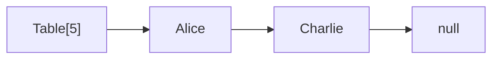
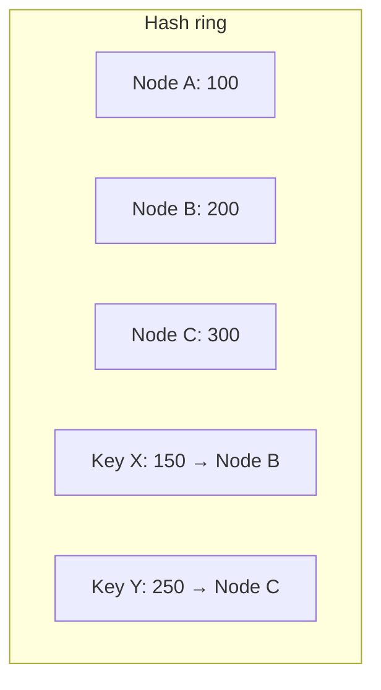

# Вопросы на собеседовании: `Хеш-таблицы`

Хеш-таблица — самая используемая структура в продакшене: `HashMap`, `HashSet`, кэши, индексы. На собеседовании любят спрашивать про коллизии, treeify в Java 8+, отличия `HashMap` и `ConcurrentHashMap`, consistent hashing для распределённых систем.

## Полезные ссылки

### Официальная документация и авторитетные источники

- [Java HashMap — Baeldung](https://www.baeldung.com/java-hashmap)
- [Inside Java HashMap (Java 8) — Baeldung](https://www.baeldung.com/java-hashmap-load-factor)
- [ConcurrentHashMap — Baeldung](https://www.baeldung.com/java-concurrent-map)
- [hashCode() and equals() — Baeldung](https://www.baeldung.com/java-equals-hashcode-contracts)
- [Consistent Hashing — Baeldung](https://www.baeldung.com/cs/consistent-hashing)
- [HashMap (Java) — Oracle Docs](https://docs.oracle.com/en/java/javase/17/docs/api/java.base/java/util/HashMap.html)

## Содержание

- [Полезные ссылки](#полезные-ссылки)
- [See also](#see-also)

**Базовые понятия**
- [Q1. (!) Что такое хеш-таблица?](#q1--что-такое-хеш-таблица)
- [Q2. (!) Что такое хеш-функция и какие требования к ней?](#q2--что-такое-хеш-функция-и-какие-требования-к-ней)
- [Q3. (!) Что такое коллизии и как их разрешают?](#q3--что-такое-коллизии-и-как-их-разрешают)

**Methods и contract**
- [Q4. (!) Контракт hashCode() и equals()?](#q4--контракт-hashcode-и-equals)
- [Q5. (!) Что будет, если переопределить equals, но не hashCode?](#q5--что-будет-если-переопределить-equals-но-не-hashcode)
- [Q6. Как переопределять hashCode по правилам?](#q6-как-переопределять-hashcode-по-правилам)
- [Q7. Что такое immutable key и почему важен?](#q7-что-такое-immutable-key-и-почему-важен)

**Реализация HashMap в Java**
- [Q8. (!) Как устроен HashMap внутри?](#q8--как-устроен-hashmap-внутри)
- [Q9. (!) Что такое load factor и initial capacity?](#q9--что-такое-load-factor-и-initial-capacity)
- [Q10. (!) Что такое rehashing?](#q10--что-такое-rehashing)
- [Q11. (!) Что такое treeify и как работает с Java 8+?](#q11--что-такое-treeify-и-как-работает-с-java-8)
- [Q12. (!) Сложности операций HashMap?](#q12--сложности-операций-hashmap)
- [Q13. Почему capacity HashMap всегда степень двойки?](#q13-почему-capacity-hashmap-всегда-степень-двойки)
- [Q14. Что такое perturbation в hashCode?](#q14-что-такое-perturbation-в-hashcode)

**Виды разрешения коллизий**
- [Q15. (!) Chaining (separate chaining) — как работает?](#q15--chaining-separate-chaining--как-работает)
- [Q16. (!) Open addressing — линейное и квадратичное пробирование?](#q16--open-addressing--линейное-и-квадратичное-пробирование)
- [Q17. Что такое double hashing?](#q17-что-такое-double-hashing)
- [Q18. Когда выбирают chaining, а когда open addressing?](#q18-когда-выбирают-chaining-а-когда-open-addressing)

**HashMap и thread-safety**
- [Q19. (!) Почему HashMap небезопасна в многопотоке?](#q19--почему-hashmap-небезопасна-в-многопотоке)
- [Q20. (!) Как устроена ConcurrentHashMap?](#q20--как-устроена-concurrenthashmap)
- [Q21. Чем ConcurrentHashMap отличается от Hashtable и Collections.synchronizedMap?](#q21-чем-concurrenthashmap-отличается-от-hashtable-и-collectionssynchronizedmap)
- [Q22. (!) Атомарные методы ConcurrentHashMap?](#q22--атомарные-методы-concurrenthashmap)

**Особые виды Map**
- [Q23. (!) LinkedHashMap — как устроен и зачем?](#q23--linkedhashmap--как-устроен-и-зачем)
- [Q24. WeakHashMap?](#q24-weakhashmap)
- [Q25. IdentityHashMap?](#q25-identityhashmap)
- [Q26. EnumMap?](#q26-enummap)

**Распределённое хеширование**
- [Q27. (!) Что такое consistent hashing?](#q27--что-такое-consistent-hashing)
- [Q28. Как работает rendezvous hashing?](#q28-как-работает-rendezvous-hashing)
- [Q29. (!) Bloom filter?](#q29--bloom-filter)
- [Q30. Cuckoo hashing?](#q30-cuckoo-hashing)

**Подводные камни**
- [Q31. (!) Что такое HashDoS-атака?](#q31--что-такое-hashdos-атака)
- [Q32. Когда HashMap деградирует до O(n)?](#q32-когда-hashmap-деградирует-до-on)
- [Q33. Можно ли использовать null как ключ или значение?](#q33-можно-ли-использовать-null-как-ключ-или-значение)
- [Q34. (!) Чем HashSet отличается от HashMap?](#q34--чем-hashset-отличается-от-hashmap)

## Q1. (!) Что такое хеш-таблица?

**Hash table** — структура для быстрого поиска, вставки и удаления по ключу. Использует **хеш-функцию** для преобразования ключа в индекс массива (bucket).

```mermaid
graph LR
    K["Key: Alice"] -->|hash() % size| I["Index: 5"]
    I --> B["Bucket[5]: value"]
```

**Сложности:**
- Среднее: `O(1)` на `get/put/remove`
- Худшее: `O(n)` (без оптимизаций) или `O(log n)` (Java 8+ с treeify)

**Применения:** кеши (Redis, Memcached), индексы in-memory БД, dictionaries, sets, deduplication, frequency counting, distributed sharding.


> [!mcq]
> - [ ] Хеш-таблица гарантирует O(1) для всех операций без исключений, включая containsValue | ❌ ПОСЛЕДСТВИЕ: containsValue всегда O(n) — при поиске дублей значений произойдёт неожиданная деградация под нагрузкой
> - [ ] Хеш-таблица сортирует ключи и использует бинарный поиск, как TreeMap | ❌ ПОСЛЕДСТВИЕ: HashMap не сортирует ключи — попытка получить "отсортированные" результаты даст произвольный порядок и баги в тестах
> - [ ] Хеш-таблица хранит элементы в связном списке, индексируемом по порядку вставки | ❌ ПОСЛЕДСТВИЕ: это описание LinkedList — поиск по ключу займёт O(n) вместо O(1) и разрушит предполагаемую производительность
> - [x] Хеш-таблица вычисляет индекс bucket через хеш-функцию, что даёт O(1) среднее для get/put/remove; коллизии разрешаются chaining или open addressing | ✓ ПРИМЕНЯТЬ: при выборе структуры для O(1) поиска/вставки по ключу 📋 ПРАВИЛО: hash → bucket index за O(1); коллизии не отменяют O(1) amortized 🔗 См. Q8

## Q2. (!) Что такое хеш-функция и какие требования к ней?

**Хеш-функция** — функция `hash(key) → int`, преобразующая ключ в индекс. Хорошая хеш-функция:

1. **Детерминированная:** одинаковый ключ → одинаковый хеш
2. **Равномерная:** значения хешей равномерно распределены
3. **Быстрая:** вычисление O(длины ключа)
4. **Avalanche effect:** малое изменение ключа → большое изменение хеша

```java
// Пример хеш-функции для строки (использует Java)
int hash = 0;
for (char c : str.toCharArray()) {
    hash = 31 * hash + c; // 31 — простое число с хорошими свойствами
}
```

**Криптографические хеши** (SHA-256, MD5) — медленнее, но «непредсказуемые». Для hash-таблиц используют **некриптографические** (`Murmur`, `xxHash`, `CityHash`).


> [!mcq]
> - [ ] Хеш-функция должна возвращать уникальные значения для каждого ключа, иначе HashMap сломается | ❌ ПОСЛЕДСТВИЕ: уникальность невозможна по pigeonhole principle — коллизии неизбежны; требование уникальности ведёт к бесполезным усилиям и неверной реализации
> - [x] Хорошая хеш-функция: детерминирована, равномерно распределяет значения, быстро вычисляется; для HashMap используют некриптографические функции (MurmurHash, xxHash) | ✓ ПРИМЕНЯТЬ: при оценке качества кастомного hashCode() 📋 ПРАВИЛО: deterministic + uniform + fast; cryptographic (SHA-256) = лишний overhead для HashMap 🔗 См. Q4
> - [ ] Хеш-функция должна сохранять порядок ключей: близкие ключи → близкие хеши | ❌ ПОСЛЕДСТВИЕ: order-preserving ломает равномерность распределения — ключи кластеризуются в соседних buckets и деградируют до O(n)
> - [ ] Для HashMap необходимо использовать криптографические хеши (SHA-256) для защиты от коллизий | ❌ ПОСЛЕДСТВИЕ: SHA-256 на порядки медленнее MurmurHash — вычисление хеша станет узким местом при интенсивных put/get операциях

## Q3. (!) Что такое коллизии и как их разрешают?

**Коллизия** — два разных ключа дают одинаковый хеш (или один индекс bucket). Неизбежны: ключей бесконечно, индексов конечно (по pigeonhole principle).

**Способы разрешения:**

1. **Chaining (separate chaining)** — в bucket связный список (или дерево):


2. **Open addressing** — ищем следующую свободную ячейку:
   - Linear probing: `(hash + 1) % size`
   - Quadratic probing: `(hash + i²) % size`
   - Double hashing: `(hash + i · h₂(key)) % size`

`HashMap` в Java использует **chaining**, с Java 8+ длинные цепочки превращаются в **красно-чёрное дерево**.


> [!mcq]
> - [ ] Коллизии в HashMap предотвращаются выбором уникальной хеш-функции; если их нет — таблица работает без сбоев | ❌ ПОСЛЕДСТВИЕ: коллизии невозможно устранить; незнание chaining/open addressing ведёт к непредвиденной деградации под нагрузкой
> - [x] Коллизия — два ключа дают один bucket; Java HashMap разрешает через chaining (связный список, при ≥8 элементов — красно-чёрное дерево); open addressing хранит всё в массиве | ✓ ПРИМЕНЯТЬ: при объяснении worst-case O(log n) в Java 8+ 📋 ПРАВИЛО: chaining = список/дерево в bucket; treeify при TREEIFY_THRESHOLD=8 и capacity≥64 🔗 См. Q11
> - [ ] Open addressing и chaining дают одинаковую производительность при любом load factor | ❌ ПОСЛЕДСТВИЕ: open addressing деградирует при LF > 0.7 из-за clustering; chaining терпит любой LF — неверный выбор под нагрузку ведёт к массовым коллизиям
> - [ ] Rehashing полностью устраняет коллизии, перераспределяя все ключи по новому алгоритму | ❌ ПОСЛЕДСТВИЕ: rehashing увеличивает capacity, но не устраняет коллизии — ожидание нулевых коллизий после resize — ошибочное представление

## Q4. (!) Контракт hashCode() и equals()?

```
1. equals() reflexive: x.equals(x) == true
2. equals() symmetric: x.equals(y) == y.equals(x)
3. equals() transitive: x.equals(y) && y.equals(z) → x.equals(z)
4. equals() consistent: пока объекты не меняются, equals возвращает то же
5. equals() with null: x.equals(null) == false

6. hashCode() consistent: пока объекты не меняются, hashCode возвращает то же
7. equals → hashCode: x.equals(y) → x.hashCode() == y.hashCode()
8. !equals → hashCode: x.equals(y) == false НЕ требует разных hashCode (но желательно)
```

**Главное правило:** если два объекта равны (`equals == true`) — их hashCode **обязан** быть равным. Обратное не обязательно.


> [!mcq]
> - [ ] Если equals() возвращает true, то hashCode() обязан также возвращать true для обоих объектов | ❌ ПОСЛЕДСТВИЕ: hashCode возвращает int, не boolean — путаница в контракте приведёт к неверной реализации и потере объектов в HashSet/HashMap
> - [x] Контракт: если a.equals(b) == true, то a.hashCode() == b.hashCode() обязательно; обратное не требуется — разные объекты могут иметь одинаковый hashCode (коллизия) | ✓ ПРИМЕНЯТЬ: при реализации кастомных классов как ключей HashMap 📋 ПРАВИЛО: equals → same hashCode; одинаковый hashCode ≠ equals — это нормальная коллизия 🔗 См. Q5
> - [ ] Контракт симметричен: equals и hashCode должны согласовываться в обоих направлениях | ❌ ПОСЛЕДСТВИЕ: нет симметрии — hashCode коллизии допустимы; строгое требование двунаправленности сделает hashCode тривиальным и бесполезным
> - [ ] Контракт требует: два объекта с одинаковым hashCode обязательно equals | ❌ ПОСЛЕДСТВИЕ: это обратное контракту — одинаковый hash не требует equals; предположение нарушит логику поиска при коллизиях

## Q5. (!) Что будет, если переопределить equals, но не hashCode?

**Полная катастрофа** в hash-based коллекциях:

```java
class User {
    String name;
    User(String name) { this.name = name; }

    @Override
    public boolean equals(Object o) {
        if (!(o instanceof User u)) return false;
        return name.equals(u.name);
    }
    // hashCode НЕ переопределён — используется Object.hashCode() (по identity)
}

Set<User> users = new HashSet<>();
users.add(new User("Alice"));
users.contains(new User("Alice")); // false! Разные hashCode → разные buckets
```

Контракт нарушен: `equals == true`, но `hashCode != hashCode`. `HashSet/HashMap` ищут в bucket, который определяется hashCode — не находят и считают, что объекта нет.

**Правило:** всегда переопределяй `hashCode` вместе с `equals`. Используй IDE-генератор или Lombok `@EqualsAndHashCode`.


> [!mcq]
> - [ ] equals() выбросит ClassCastException при сравнении объектов из разных buckets | ❌ ПОСЛЕДСТВИЕ: ClassCastException не связан с hashCode — проблема в типе, не в хешировании; реальная проблема — объект не найдётся совсем (возвращается null)
> - [x] HashSet/HashMap не найдут "равный" объект: поиск идёт по hashCode в bucket — поскольку hashCode разный (Object.hashCode по identity), поиск идёт в другой bucket и возвращает null | ✓ ПРИМЕНЯТЬ: при ревью custom классов как ключей Map 📋 ПРАВИЛО: HashMap ищет bucket по hashCode СНАЧАЛА, потом equals — без корректного hashCode equals бесполезен 🔗 См. Q4
> - [ ] Метод put() выбросит исключение при попытке добавить объект с нарушенным контрактом | ❌ ПОСЛЕДСТВИЕ: put() не проверяет контракт — молча добавит дубли, теряя данные; ошибка проявится только в get(), что делает баг трудноотлаживаемым
> - [ ] Коллекция будет работать корректно, только с увеличенным числом коллизий | ❌ ПОСЛЕДСТВИЕ: нет, коллекция сломается функционально — одинаковые объекты будут добавляться дважды, contains/remove не будут находить элементы

## Q6. Как переопределять hashCode по правилам?

```java
// Java 7+ — Objects.hash()
@Override
public int hashCode() {
    return Objects.hash(field1, field2, field3);
}

// Ручная реализация (немного быстрее, без autoboxing)
@Override
public int hashCode() {
    int result = 17;
    result = 31 * result + (field1 != null ? field1.hashCode() : 0);
    result = 31 * result + Integer.hashCode(field2);
    result = 31 * result + Long.hashCode(field3);
    return result;
}

// Лучшая практика — Lombok или record
@EqualsAndHashCode
class User { ... }

record User(String name, int age) { } // hashCode/equals/toString автоматически
```

**Почему 31:** простое число, легко оптимизируется JIT (`31 * x = (x << 5) - x`).


> [!mcq]
> - [ ] hashCode должен возвращать постоянно увеличивающееся значение для минимизации коллизий | ❌ ПОСЛЕДСТВИЕ: монотонный hashCode кластеризует ключи в соседних buckets — хуже чем случайный; распределение ухудшится, O(1) деградирует
> - [ ] Использование Objects.hash() нарушает контракт, поэтому нужна только ручная реализация | ❌ ПОСЛЕДСТВИЕ: Objects.hash() полностью корректен и рекомендован в Java 7+; ручная реализация нужна лишь для критичной производительности (избегание autoboxing)
> - [ ] Для оптимальной производительности hashCode должен включать только один "уникальный" идентификатор, игнорируя остальные поля | ❌ ПОСЛЕДСТВИЕ: неполный hashCode нарушает контракт с equals() — если equals сравнивает все поля, hashCode обязан их тоже учитывать
> - [x] Правильный hashCode включает все поля из equals(), использует простой множитель 31; Objects.hash(field1, field2) — стандарт; Lombok @EqualsAndHashCode и records генерируют автоматически | ✓ ПРИМЕНЯТЬ: при создании любого value object для использования как ключа Map 📋 ПРАВИЛО: Objects.hash(field1, field2) — стандарт Java; 31 = простое число с JIT-оптимизацией (shift+subtract) 🔗 См. Q4

## Q7. Что такое immutable key и почему важен?

**Immutable key** — ключ, состояние которого нельзя изменить после создания. Если ключ изменить **после** добавления в `HashMap`:
- Хеш изменится → `get()` не найдёт элемент
- Элемент «потеряется» в неправильном bucket

```java
class MutableKey {
    int value;
    MutableKey(int v) { this.value = v; }
    @Override public int hashCode() { return value; }
    @Override public boolean equals(Object o) { ... }
}

MutableKey key = new MutableKey(1);
Map<MutableKey, String> map = new HashMap<>();
map.put(key, "value");
key.value = 2; // ИЗМЕНИЛИ КЛЮЧ!
map.get(key); // null! теперь хеш другой
```

**Правило:** в качестве ключей `HashMap` используй **immutable** объекты (`String`, `Integer`, `LocalDate`, records). Не меняй mutable поля, входящие в `hashCode/equals`.


> [!mcq]
> - [ ] Если изменить поле объекта-ключа после put(), HashMap автоматически переместит запись в правильный bucket | ❌ ПОСЛЕДСТВИЕ: HashMap не отслеживает изменения ключей — запись останется в старом bucket и get() вернёт null; данные "потеряются" без исключения
> - [ ] Mutable ключи безопасны, если переопределить только equals() без hashCode(), — equals найдёт объект при изменении | ❌ ПОСЛЕДСТВИЕ: HashMap ищет bucket по hashCode ПЕРВЫМ — изменённый ключ даёт новый hashCode, поиск идёт в другой bucket и equals никогда не вызывается
> - [ ] Изменение ключа после put() вызовет ConcurrentModificationException | ❌ ПОСЛЕДСТВИЕ: ConcurrentModificationException выбрасывается при структурных изменениях коллекции, а не при изменении ключа — реальная ошибка молчаливая: get() возвращает null
> - [x] После изменения mutable поля ключа hashCode изменится → get() пойдёт в другой bucket → не найдёт запись → вернёт null; правило: использовать только immutable ключи (String, Integer, records) | ✓ ПРИМЕНЯТЬ: при проверке кода на mutable ключи в Map 📋 ПРАВИЛО: mutable key = потеря записи без исключения; String/Integer/LocalDate — безопасные ключи 🔗 См. Q4

## Q8. (!) Как устроен HashMap внутри?

С Java 8+ `HashMap`:
- **Массив `Node<K, V>[] table`** — buckets (по умолчанию size = 16)
- **Каждый bucket** — связный список или красно-чёрное дерево
- **Хеш-функция:** `hash = (h = key.hashCode()) ^ (h >>> 16)` (perturbation для младших битов)
- **Индекс:** `(table.length - 1) & hash` (т.к. `length` — степень двойки)

```java
// Упрощённо
public class HashMap<K, V> {
    Node<K, V>[] table;
    int size, threshold;
    final float loadFactor;

    static class Node<K, V> {
        final int hash;
        final K key;
        V value;
        Node<K, V> next;
    }
}
```

При коллизии — добавление в начало/конец цепочки. При длине цепочки ≥ 8 и size ≥ 64 — превращение в `TreeNode` (красно-чёрное дерево).


> [!mcq]
> - [x] HashMap: массив Node[] table + chaining (список/дерево в каждом bucket); hash = key.hashCode() XOR (h >>> 16); индекс = (capacity-1) & hash; при коллизии — в конец цепочки | ✓ ПРИМЕНЯТЬ: при объяснении устройства HashMap на собеседовании 📋 ПРАВИЛО: array + chaining; perturbation XOR для лучшего распределения; capacity = степень двойки 🔗 См. Q13
> - [ ] HashMap хранит записи в одном массиве без вспомогательных структур — каждая ячейка содержит ровно один элемент | ❌ ПОСЛЕДСТВИЕ: без chaining невозможно разрешить коллизии — при одинаковом hash запись перезапишется, и данные будут потеряны
> - [ ] Индекс bucket вычисляется через hash % capacity, поэтому capacity может быть любым числом | ❌ ПОСЛЕДСТВИЕ: HashMap использует (capacity-1) & hash (битовую операцию) вместо %; для корректности capacity должна быть степенью двойки — иначе неравномерное распределение
> - [ ] При Java 8+ HashMap использует только красно-чёрное дерево для всех buckets, что гарантирует O(log n) | ❌ ПОСЛЕДСТВИЕ: дерево только при длине цепочки ≥ 8 (TREEIFY_THRESHOLD) и capacity ≥ 64; большинство buckets — связные списки

## Q9. (!) Что такое load factor и initial capacity?

- **Initial capacity** — начальный размер массива buckets (по умолчанию **16**)
- **Load factor** — порог заполнения, при котором происходит rehashing (по умолчанию **0.75**)
- **Threshold** = `capacity × loadFactor` (по умолчанию `16 × 0.75 = 12`)

Когда `size > threshold` — **rehashing**.

```java
// Указываем initial capacity, чтобы избежать rehashing
Map<String, Integer> map = new HashMap<>(64); // capacity рассчитывается до ближайшей степени двойки

// С expected size N: capacity = N / 0.75
int expected = 1000;
Map<String, Integer> sized = new HashMap<>((int)(expected / 0.75f) + 1);

// Java 19+ — newHashMap
Map<String, Integer> v19 = HashMap.newHashMap(1000);
```

**Trade-off:** низкий load factor → меньше коллизий, но больше памяти. Высокий → больше коллизий, меньше памяти.


> [!mcq]
> - [ ] Load factor по умолчанию равен 1.0 — HashMap расширяется только когда полностью заполнена | ❌ ПОСЛЕДСТВИЕ: load factor по умолчанию 0.75, не 1.0; при LF=1.0 слишком много коллизий до resize — производительность деградирует задолго до заполнения
> - [ ] Initial capacity задаёт максимальное количество элементов — превышение вызывает исключение | ❌ ПОСЛЕДСТВИЕ: нет исключения — HashMap автоматически делает rehashing; initial capacity = стартовый размер bucket-массива, не жёсткий лимит
> - [x] Initial capacity = начальный размер массива buckets (по умолчанию 16); load factor = порог заполнения (по умолчанию 0.75); threshold = capacity × loadFactor — при превышении triggering rehashing | ✓ ПРИМЕНЯТЬ: при инициализации HashMap с известным размером для избегания rehashing 📋 ПРАВИЛО: new HashMap<>((int)(expected / 0.75) + 1) — оптимальный capacity для N элементов 🔗 См. Q10
> - [ ] Высокий load factor (например, 0.9) всегда лучше, так как экономит память без потери скорости | ❌ ПОСЛЕДСТВИЕ: высокий LF → больше коллизий → O(log n) вместо O(1); trade-off: 0.75 — баланс между памятью и производительностью, 0.9 ухудшит время get/put

## Q10. (!) Что такое rehashing?

**Rehashing** — увеличение размера таблицы и перераспределение элементов:
1. Создаётся новый массив **в 2 раза больше**
2. Все элементы переносятся (новые индексы пересчитываются)
3. Стоимость — `O(n)`

В Java 8+ при rehashing элементы цепочки разделяются на **две группы** по бите хеша:
- `(hash & oldCapacity) == 0` → остаются на старой позиции
- иначе → переносятся на `oldPosition + oldCapacity`

Это эффективнее, чем полный пересчёт hash для каждого элемента.

**Амортизированный `O(1)`** на `put` — такой же принцип, как у `ArrayList.add`.


> [!mcq]
> - [x] Rehashing: при size > threshold создаётся новый массив вдвое больше, элементы переносятся по новым индексам; в Java 8+ цепочки разделяются на 2 группы по одному биту хеша — O(n) суммарно, O(1) амортизированное для put | ✓ ПРИМЕНЯТЬ: при объяснении амортизированного O(1) для put и обосновании предзадания initial capacity 📋 ПРАВИЛО: rehash = создать массив ×2 + перенести; Java 8 оптимизация: старая позиция или oldPosition+oldCapacity 🔗 См. Q9
> - [ ] Rehashing происходит при каждой вставке для гарантии равномерного распределения | ❌ ПОСЛЕДСТВИЕ: rehashing только при size > threshold — при каждой вставке это O(n) overhead постоянно; правильное поведение — амортизированное, не постоянное
> - [ ] После rehashing capacity уменьшается для освобождения памяти при малом количестве элементов | ❌ ПОСЛЕДСТВИЕ: стандартный HashMap не shrink — capacity только растёт; auto-shrink HashMap не существует в Java (только LinkedHashMap с removeEldestEntry)
> - [ ] Rehashing сортирует элементы по hashCode для ускорения будущих get() операций | ❌ ПОСЛЕДСТВИЕ: rehashing не сортирует — только перераспределяет по новым индексам; HashMap не поддерживает сортировку, это TreeMap

## Q11. (!) Что такое treeify и как работает с Java 8+?

С Java 8+ при длинных цепочках `HashMap` превращает их в **красно-чёрное дерево**:

- **TREEIFY_THRESHOLD = 8** — при длине цепочки ≥ 8 → treeify
- **MIN_TREEIFY_CAPACITY = 64** — но только если capacity ≥ 64 (иначе сначала resize)
- **UNTREEIFY_THRESHOLD = 6** — при уменьшении до ≤ 6 → обратно в список

```java
// Если коллизий много:
// До Java 8: O(n) на get/put в худшем случае
// С Java 8+: O(log n) благодаря treeify
```

**Зачем:** защита от **HashDoS-атак**. Также гарантия `O(log n)` worst-case вместо `O(n)`.

Treeify работает только если ключи реализуют `Comparable` (для упорядочивания в дереве). Иначе используется system identity hash как tie-breaker.


> [!mcq]
> - [ ] Treeify превращает весь HashMap в одно красно-чёрное дерево при достижении определённого размера | ❌ ПОСЛЕДСТВИЕ: treeify применяется только к конкретному bucket, а не ко всей таблице — остальные buckets остаются связными списками
> - [x] Treeify: при длине цепочки в bucket ≥ TREEIFY_THRESHOLD (8) и capacity ≥ MIN_TREEIFY_CAPACITY (64) — связный список заменяется красно-чёрным деревом; untreeify при уменьшении до 6 | ✓ ПРИМЕНЯТЬ: при объяснении защиты от HashDoS и O(log n) worst-case в Java 8+ 📋 ПРАВИЛО: TREEIFY_THRESHOLD=8, MIN_TREEIFY_CAPACITY=64; если capacity < 64 — resize вместо treeify 🔗 См. Q31
> - [ ] Treeify работает для любых ключей; Comparable не требуется | ❌ ПОСЛЕДСТВИЕ: для корректного дерева нужен порядок — если ключи не Comparable, используется system identity hash как tie-breaker; непонимание ведёт к удивлению при кастомных ключах
> - [ ] После treeify bucket перестаёт поддерживать новые вставки, требуя rehashing | ❌ ПОСЛЕДСТВИЕ: TreeBin (красно-чёрное дерево) полностью поддерживает вставку/удаление/поиск; никакого rehashing по этой причине не происходит

## Q12. (!) Сложности операций HashMap?

| Операция | Среднее | Худшее (Java 8+) |
|----------|---------|------------------|
| `get(k)` | `O(1)` | `O(log n)` |
| `put(k, v)` | `O(1)` амортиз. | `O(log n)` |
| `remove(k)` | `O(1)` | `O(log n)` |
| `containsKey(k)` | `O(1)` | `O(log n)` |
| `containsValue(v)` | `O(n)` | `O(n)` |
| Iteration | `O(n + capacity)` | `O(n + capacity)` |

`containsValue` — `O(n)` всегда (нужно линейно проверять).

Если `hashCode` плохой (много коллизий) — `O(log n)` благодаря treeify.


> [!mcq]
> - [ ] containsKey() работает за O(log n) в HashMap, так как использует бинарный поиск по sorted buckets | ❌ ПОСЛЕДСТВИЕ: containsKey() — O(1) среднее, O(log n) worst-case (при treeify); бинарный поиск используется только в TreeMap
> - [x] get/put/remove — O(1) среднее, O(log n) худшее (Java 8+ treeify); containsValue — O(n) всегда; iteration — O(n + capacity) | ✓ ПРИМЕНЯТЬ: при выборе HashMap vs TreeMap и при оценке производительности кода с containsValue 📋 ПРАВИЛО: containsValue = O(n) всегда; O(1) → O(log n) worst-case только с Java 8+ treeify 🔗 См. Q11
> - [ ] Все операции HashMap — O(1) амортизированное, включая iteration | ❌ ПОСЛЕДСТВИЕ: iteration — O(n + capacity), не O(1); при capacity = 1 000 000 и 10 элементах итерация пройдёт 1 000 000 buckets впустую
> - [ ] При плохой хеш-функции HashMap деградирует до O(n²) из-за quadratic probing | ❌ ПОСЛЕДСТВИЕ: HashMap не использует quadratic probing — это open addressing; chaining с плохим hashCode даёт O(n), а не O(n²)

## Q13. Почему capacity HashMap всегда степень двойки?

Чтобы заменить **дорогую операцию `% capacity`** на быструю **битовую `& (capacity - 1)`**:

```java
// При capacity = 16 (= 2^4):
int index = hash & (16 - 1); // = hash & 0b1111 — берём 4 младших бита
// Эквивалентно hash % 16, но в разы быстрее
```

Если capacity не степень двойки — `&` дала бы неравномерное распределение. Поэтому при создании `HashMap(N)` — N округляется до ближайшей степени двойки вверх.


> [!mcq]
> - [ ] Capacity в степени двойки нужна для поддержки итерации в порядке вставки | ❌ ПОСЛЕДСТВИЕ: итерация в порядке вставки — это LinkedHashMap, не HashMap; степень двойки нужна для битовой оптимизации индексации
> - [ ] HashMap использует простые числа как capacity для минимизации коллизий | ❌ ПОСЛЕДСТВИЕ: HashMap использует степени двойки (2, 4, 8, 16...) а не простые числа; простые числа нужны для open addressing, не chaining
> - [x] Capacity = степень двойки позволяет заменить дорогую операцию hash % capacity на быструю битовую (capacity-1) & hash; при создании HashMap(N) значение N округляется вверх до ближайшей степени двойки | ✓ ПРИМЕНЯТЬ: при объяснении внутренней оптимизации HashMap 📋 ПРАВИЛО: 2^k → (capacity-1) & hash заменяет % — разница в скорости значительна при высоком RPS 🔗 См. Q8
> - [ ] Capacity всегда сохраняется равной начальному значению — HashMap не изменяет её автоматически | ❌ ПОСЛЕДСТВИЕ: capacity удваивается при rehashing — в production при большом количестве элементов память может расти экспоненциально без предзаданного initial capacity

## Q14. Что такое perturbation в hashCode?

В Java HashMap не использует `key.hashCode()` напрямую. Применяется **perturbation function**:

```java
static final int hash(Object key) {
    int h;
    return (key == null) ? 0 : (h = key.hashCode()) ^ (h >>> 16);
}
```

`h >>> 16` — сдвигает старшие биты в младшие. XOR смешивает их. Зачем:
- При `(table.length - 1) & hash` берутся только младшие биты
- Если `hashCode()` имеет хорошие старшие биты, но плохие младшие — без perturbation было бы много коллизий
- Perturbation «перемешивает» биты для лучшего распределения


> [!mcq]
> - [ ] Perturbation заменяет hashCode() пользователя собственным случайным значением для безопасности | ❌ ПОСЛЕДСТВИЕ: perturbation только смешивает биты через XOR, а не заменяет hashCode; значение hashCode() пользователя сохраняется и используется как основа
> - [x] Perturbation в HashMap: hash = h ^ (h >>> 16) — XOR старших 16 бит с младшими; нужно потому что индекс = (capacity-1) & hash использует только младшие биты, а информация из старших бит иначе теряется | ✓ ПРИМЕНЯТЬ: при объяснении, почему HashMap использует не rawHashCode напрямую 📋 ПРАВИЛО: XOR mixing предотвращает кластеризацию при хешах с хорошими старшими, но плохими младшими битами 🔗 См. Q8
> - [ ] Perturbation нужна только при использовании String ключей — для других типов применяется напрямую hashCode() | ❌ ПОСЛЕДСТВИЕ: perturbation применяется для всех ключей в HashMap.hash() — это статический метод, вызывается всегда при put/get
> - [ ] Perturbation увеличивает вычислительную стоимость hashCode до O(log n) для надёжности | ❌ ПОСЛЕДСТВИЕ: perturbation — это одна XOR и одна bit-shift операция, O(1) константное время; дополнительный overhead минимален

## Q15. (!) Chaining (separate chaining) — как работает?

В каждом bucket — связный список (или дерево с Java 8+) элементов с одинаковым индексом:



**Плюсы:**
- Простая реализация
- Любой load factor (даже > 1)
- Удаление простое
- Не страдает от primary clustering

**Минусы:**
- Память на узлы (overhead)
- Cache miss на каждый node lookup
- Если хеш плохой — деградация до `O(n)` (но Java 8+ — treeify до `O(log n)`)

Java `HashMap`, `LinkedHashMap`, `ConcurrentHashMap` — chaining.


> [!mcq]
> - [ ] Chaining хранит все элементы одного bucket в отсортированном массиве для быстрого бинарного поиска | ❌ ПОСЛЕДСТВИЕ: chaining использует связный список (или дерево при treeify), не отсортированный массив; поиск O(k) по цепочке, не O(log k) бинарный
> - [x] Chaining: каждый bucket содержит связный список элементов с одинаковым индексом; при get() вычисляем bucket, затем traversal по списку; Java HashMap/LinkedHashMap/ConcurrentHashMap — chaining | ✓ ПРИМЕНЯТЬ: при объяснении разрешения коллизий в Java HashMap 📋 ПРАВИЛО: chaining = list per bucket; плюс: любой LF, простое удаление; минус: cache miss на каждый node pointer 🔗 См. Q18
> - [ ] Chaining требует, чтобы все ключи в одном bucket были одинаковыми — иначе bucket разделяется | ❌ ПОСЛЕДСТВИЕ: нет никакого разделения — bucket накапливает все коллизионные ключи в списке; "одинаковые ключи" — это другое (дубликаты заменяют значение)
> - [ ] Chaining нельзя использовать при load factor < 0.5 — список будет слишком коротким | ❌ ПОСЛЕДСТВИЕ: chaining работает при любом load factor, в том числе < 0.5; низкий LF только означает меньше коллизий и короткие списки — это желательное поведение

## Q16. (!) Open addressing — линейное и квадратичное пробирование?

Все элементы хранятся **в самом массиве**. При коллизии — ищем следующую свободную ячейку.

**Linear probing:** `(hash + i) % size`
- Проблема: **primary clustering** — соседние занятые ячейки сливаются в кластеры

**Quadratic probing:** `(hash + i²) % size`
- Уменьшает primary clustering
- Появляется **secondary clustering** (одинаковый стартовый hash → одинаковая последовательность проб)

```java
class OpenAddressingMap<K, V> {
    private K[] keys;
    private V[] values;

    int probeIndex(K key, int attempt) {
        return (key.hashCode() + attempt) % keys.length; // linear
    }
}
```

Используется в **C++ `std::unordered_map`** (некоторые реализации), Python **`dict`**, Go **`map`**.


> [!mcq]
> - [x] Open addressing: все элементы в одном массиве; при коллизии ищем следующую свободную ячейку; linear probing = (hash+i)%size; quadratic probing = (hash+i²)%size — уменьшает primary clustering | ✓ ПРИМЕНЯТЬ: при сравнении open addressing vs chaining по cache locality 📋 ПРАВИЛО: open addressing = лучший cache, меньше памяти; LF должен быть < 0.7; Python dict, Go map используют open addressing 🔗 См. Q18
> - [ ] Open addressing хранит все элементы в отдельных связных списках за пределами основного массива | ❌ ПОСЛЕДСТВИЕ: это описание chaining, а не open addressing; в open addressing все элементы хранятся внутри одного массива без внешних структур
> - [ ] Quadratic probing создаёт больше кластеров, чем linear probing — поэтому используется реже | ❌ ПОСЛЕДСТВИЕ: quadratic probing уменьшает primary clustering (consecutive filled cells); но создаёт secondary clustering (одинаковый стартовый hash → одинаковая последовательность проб)
> - [ ] Open addressing работает корректно при load factor > 1 — элементов может быть больше, чем ячеек | ❌ ПОСЛЕДСТВИЕ: open addressing требует LF < 1 по определению (нельзя разместить больше элементов, чем ячеек); при LF > 0.7 производительность резко деградирует

## Q17. Что такое double hashing?

**Double hashing** — комбинация двух хеш-функций:

```
index = (h1(key) + i × h2(key)) % size
```

Уменьшает clustering ещё лучше, чем quadratic probing. Требует, чтобы `h2(key)` и `size` были взаимно простыми (часто `size = prime`).


> [!mcq]
> - [ ] Double hashing использует второй массив для хранения overflow элементов | ❌ ПОСЛЕДСТВИЕ: double hashing — это open addressing с двумя хеш-функциями для вычисления шага пробирования; отдельного массива нет, всё в основном
> - [x] Double hashing: step = h2(key) вместо константы; index = (h1(key) + i × h2(key)) % size; устраняет clustering лучше quadratic probing; требует h2 взаимно-простой с size | ✓ ПРИМЕНЯТЬ: при сравнении методов open addressing по качеству распределения 📋 ПРАВИЛО: double hashing = лучшая равномерность; size = prime для гарантии взаимной простоты с h2 🔗 См. Q16
> - [ ] Double hashing вычисляет хеш дважды для большей надёжности — два одинаковых результата подтверждают правильность | ❌ ПОСЛЕДСТВИЕ: double hashing не для проверки надёжности — две разные хеш-функции дают два разных числа для вычисления шага; это open addressing, не checksumming
> - [ ] Double hashing применяется только в chaining как дополнительный уровень хеширования | ❌ ПОСЛЕДСТВИЕ: double hashing — техника open addressing (все элементы в массиве); chaining использует указатели на связный список, а не пробирование

## Q18. Когда выбирают chaining, а когда open addressing?

| Критерий | Chaining | Open addressing |
|----------|----------|-----------------|
| Память | Больше (узлы) | Меньше (только массив) |
| Cache locality | Плохая | Отличная |
| Удаление | Простое | Сложное (tombstones) |
| Load factor | Любой | < 0.7 (иначе деградация) |
| Worst case | `O(log n)` (Java 8+) | `O(n)` |
| Простота | Проще | Сложнее (tombstones, rehash) |

**Open addressing** выигрывает при **плотных** данных и хорошей хеш-функции — лучше cache. **Chaining** проще и устойчивее к плохим хешам.


> [!mcq]
> - [ ] Open addressing всегда быстрее chaining при любом load factor и количестве элементов | ❌ ПОСЛЕДСТВИЕ: при LF > 0.7 open addressing резко деградирует из-за clustering; chaining устойчивее при высоком LF — выбор зависит от load factor и характеристик данных
> - [x] Open addressing: лучший cache locality (всё в одном массиве), меньше памяти; выбирать при LF < 0.7 и хорошей хеш-функции; Chaining: простое удаление, любой LF, устойчивость к плохим хешам — Java HashMap использует chaining | ✓ ПРИМЕНЯТЬ: при системном дизайне хеш-таблицы или объяснении выбора Java HashMap 📋 ПРАВИЛО: open addressing = плотные данные + хороший хеш + LF < 0.7; chaining = переменный LF + простота 🔗 См. Q15
> - [ ] Chaining нельзя использовать в production из-за накладных расходов на GC от связных списков | ❌ ПОСЛЕДСТВИЕ: Java HashMap использует chaining в production успешно; overhead на GC минимален по сравнению с cache miss penalty
> - [ ] Удаление элемента из open addressing таблицы работает так же просто, как в chaining | ❌ ПОСЛЕДСТВИЕ: удаление в open addressing требует tombstones (маркеры удалённых ячеек) для корректности probe sequences — существенно сложнее, чем удаление из связного списка

## Q19. (!) Почему HashMap небезопасна в многопотоке?

Несколько проблем:
1. **Lost updates** — два потока одновременно `put` в одну ячейку — один `put` теряется
2. **Infinite loop при rehashing** (до Java 8) — два потока одновременно делали resize и формировали циклический связный список → 100% CPU
3. **Inconsistent state** — один поток ещё не закончил resize, другой читает

```java
HashMap<String, Integer> map = new HashMap<>();
// Опасно при concurrent put
ExecutorService es = Executors.newFixedThreadPool(8);
for (int i = 0; i < 10000; i++) {
    int finalI = i;
    es.submit(() -> map.put("key" + finalI, finalI)); // race condition
}
```

**Решения:**
- `ConcurrentHashMap` — потокобезопасная
- `Collections.synchronizedMap(new HashMap<>())` — обёртка с глобальным локом
- `Hashtable` — устаревший, синхронизирован


> [!mcq]
> - [ ] HashMap thread-safe при read-only операциях — несколько потоков могут безопасно делать только get() | ❌ ПОСЛЕДСТВИЕ: concurrent get() во время resize другим потоком может видеть несогласованное состояние таблицы; get() тоже небезопасен без synchronization
> - [x] HashMap небезопасна в многопотоке: lost updates при concurrent put(), бесконечный цикл при concurrent resize (до Java 8 — circular linked list), несогласованное состояние при параллельном resize | ✓ ПРИМЕНЯТЬ: при code review многопоточного кода, использующего HashMap 📋 ПРАВИЛО: никогда не используй HashMap в shared mutable context; ConcurrentHashMap или Collections.synchronizedMap — вот правильные варианты 🔗 См. Q20
> - [ ] HashMap выбрасывает ConcurrentModificationException при любом concurrent доступе | ❌ ПОСЛЕДСТВИЕ: ConcurrentModificationException выбрасывается только при структурных изменениях во время итерации (fail-fast iterator), не при concurrent put/get
> - [ ] Достаточно синхронизировать только put() — get() всегда безопасен без блокировки | ❌ ПОСЛЕДСТВИЕ: без синхронизации get() может читать частично обновлённое состояние (visibility issue); оба метода требуют полной синхронизации или ConcurrentHashMap

## Q20. (!) Как устроена ConcurrentHashMap?

С Java 8+ `ConcurrentHashMap` использует:
- **CAS (compare-and-swap)** для изменения первого узла bucket
- **synchronized на уровне bucket** (не всей таблицы) для остальных операций
- **Помеченные узлы (TreeBins)** при treeify
- **Параллельный resize** через `transferIndex`

До Java 8 — segment-based locking (по 16 segments).

```java
ConcurrentHashMap<String, Integer> map = new ConcurrentHashMap<>();
map.put("a", 1); // потокобезопасно
map.computeIfAbsent("b", k -> 2); // атомарно
```

**Ключевые особенности:**
- Не блокирует чтение (lock-free `get`)
- Блокирует только конкретный bucket при write
- Высокий throughput на многоядерных системах
- Не разрешает `null` ключи и значения (в отличие от `HashMap`)


> [!mcq]
>
> **Вопрос:** Как ConcurrentHashMap (Java 8+) достигает высокого параллельного throughput по сравнению с Hashtable?
>
> ---
>
> #### A) Используется один глобальный `ReentrantLock` для всей таблицы, но он fair — это даёт высокую пропускную способность — ❌ Неверно
>
> **Что на самом деле:** ConcurrentHashMap НЕ использует глобальный лок. С Java 8+ применяется CAS на первом узле bucket и `synchronized` на конкретном bucket-head при необходимости. Глобальный лок убил бы параллелизм — именно так и работают Hashtable/synchronizedMap, и поэтому они медленные.
>
> **Откуда путаница:** ассоциация «thread-safe = lock» из учебников по concurrency. Опускают, что современные lock-free структуры используют CAS и шардирование локов.
>
> **Если бы это было правдой:** при 32 ядрах и 100k RPS на shared map с одним fair lock — очередь потоков на лок убьёт всю производительность; latency p99 уйдёт в секунды.
>
> ---
>
> #### B) ConcurrentHashMap использует ровно 16 сегментов (Segments) с отдельным lock на каждый — как было в Java 7 — ❌ Неверно
>
> **Что на самом деле:** segment-based locking был ДО Java 8. В Java 8+ его убрали в пользу более тонкой стратегии: CAS на пустой bucket, `synchronized` на head-узле bucket при коллизии. Это лучше масштабируется, чем фиксированные 16 сегментов.
>
> **Откуда путаница:** многие старые статьи и книги (Effective Java 2nd ed, до 2018) описывают legacy Java 7 implementation. Информация устарела.
>
> **Если бы это было правдой:** при 64 ядрах все потоки конкурировали бы за всего 16 локов — bottleneck при write-heavy workload; не было бы выигрыша от перехода на Java 8+.
>
> ---
>
> #### C) Не блокирует чтение — get() использует CAS и atomic read — ❌ Неверно (формулировка неточная)
>
> **Что на самом деле:** get() в ConcurrentHashMap действительно lock-free, но **не использует CAS** — он просто читает `volatile` поле `Node.val`. CAS применяется только при модификации (put/remove). Утверждение про CAS на read — миф.
>
> **Откуда путаница:** «lock-free = CAS» — расхожее упрощение. На деле lock-free read возможен через volatile/memory barriers без atomic compare-and-swap.
>
> **Если бы это было правдой:** CAS на каждом чтении добавил бы overhead `LOCK CMPXCHG` инструкции — это снизило бы read throughput на 30-50%.
>
> ---
>
> #### D) CAS на первом узле bucket для вставок + `synchronized` на bucket-head при коллизии + lock-free volatile reads + параллельный resize через `transferIndex` — ✓ Верно
>
> **Развёрнутое объяснение:**
>
> ConcurrentHashMap в Java 8+ построен на трёх принципах:
> 1. **Reads — полностью lock-free.** Чтение проходит через `volatile Node.val`, без блокировок и без CAS. Несколько потоков читают параллельно без contention.
> 2. **Writes — fine-grained locking.** Если bucket пуст — CAS-вставка first node. Если есть коллизия — `synchronized (head)` на head-узле этого конкретного bucket. Другие buckets продолжают работать без блокировки.
> 3. **Resize — кооперативный.** При rehashing все потоки помогают переносить элементы, координируясь через `transferIndex` (атомарный счётчик незавершённых bucket'ов).
>
> **Пример:**
> ```java
> ConcurrentHashMap<String, Integer> map = new ConcurrentHashMap<>();
> // Параллельно из 100 потоков — без contention если buckets разные
> IntStream.range(0, 100).parallel().forEach(i ->
>     map.compute("k" + i, (k, v) -> v == null ? 1 : v + 1)
> );
> ```
>
> **Когда применять:**
> - Shared counters/registries в высоконагруженных сервисах (Spring `@Cacheable`, session storage).
> - Конкурентные кэши с read-heavy workload (например, computeIfAbsent для memoization).
>
> **Подводные камни:**
> - `null` запрещён и для ключа, и для значения — иначе нельзя отличить «нет ключа» от «значение null» атомарно.
> - `size()` приближённый при concurrent modifications — не использовать как точный счётчик; вместо него — `LongAdder` или `mappingCount()`.
> - Iterators **weakly consistent**: не бросают `ConcurrentModificationException`, но могут не отразить недавние изменения.
>
> **Связанные вопросы:** [[Q21]] — сравнение с Hashtable; [[Q22]] — атомарные методы; [[Q19]] — почему HashMap небезопасен.

## Q21. Чем ConcurrentHashMap отличается от Hashtable и Collections.synchronizedMap?

| Структура | Стратегия | Чтение | Производительность |
|-----------|-----------|--------|--------------------|
| `Hashtable` | Глобальный `synchronized` | Блокирует | Низкая (legacy) |
| `Collections.synchronizedMap` | Обёртка с глобальным локом | Блокирует | Низкая |
| `ConcurrentHashMap` | Bucket-level lock + CAS | **Не блокирует** | Высокая |

```java
// Synchronized wrapper — блокирует ВСЁ при любой операции
Map<String, Integer> sync = Collections.synchronizedMap(new HashMap<>());

// ConcurrentHashMap — параллельные читатели + локальный writer lock
ConcurrentHashMap<String, Integer> conc = new ConcurrentHashMap<>();
```

В современном Java **никогда не используй `Hashtable`** — устаревшее. Для thread-safe — `ConcurrentHashMap`.


> [!mcq]
>
> **Вопрос:** В чём принципиальная разница между `Collections.synchronizedMap(new HashMap<>())` и `ConcurrentHashMap` под нагрузкой?
>
> ---
>
> #### A) `synchronizedMap` блокирует только при write, а ConcurrentHashMap блокирует при любой операции — ❌ Неверно
>
> **Что на самом деле:** ровно наоборот. `synchronizedMap` использует обёртку с глобальным `synchronized(mutex)` на КАЖДУЮ операцию, включая get(). ConcurrentHashMap НЕ блокирует чтения вообще (lock-free volatile read).
>
> **Откуда путаница:** название «ConcurrentHashMap» наводит на мысль о более «защитной» реализации, что неверно ассоциируется с «больше локов».
>
> **Если бы это было правдой:** ConcurrentHashMap не имела бы преимуществ перед `synchronizedMap` — но бенчмарки JMH показывают разницу в 10-100× на read-heavy workload.
>
> ---
>
> #### B) ConcurrentHashMap позволяет null значения, Hashtable — нет — ❌ Неверно
>
> **Что на самом деле:** наоборот. Hashtable выбрасывает NullPointerException и для null ключа, и для null значения. ConcurrentHashMap **тоже запрещает** null — намеренно, чтобы избежать ambiguity между «нет ключа» и «есть, но null» в concurrent setting. HashMap позволяет null (для ключа — один, для значений — сколько угодно).
>
> **Откуда путаница:** часто путают, какая именно map разрешает null. Только обычный HashMap и LinkedHashMap разрешают.
>
> **Если бы это было правдой:** код вида `map.put(key, null)` работал бы на ConcurrentHashMap; на практике это бросает NPE — баг в production.
>
> ---
>
> #### C) Hashtable и synchronizedMap полностью эквивалентны и взаимозаменяемы — ❌ Неверно
>
> **Что на самом деле:** оба используют глобальный лок, но Hashtable — это legacy-класс из Java 1.0 с собственной реализацией методов (`elements()`, `keys()` — Enumeration вместо Iterator), а `synchronizedMap` — wrapper вокруг любой Map с `synchronized(mutex)`. Hashtable не наследует от AbstractMap.
>
> **Откуда путаница:** оба «медленные и глобально залоченные», поэтому кажутся одинаковыми. Но API и наследование различаются.
>
> **Если бы это было правдой:** можно было бы безопасно мигрировать с Hashtable на synchronizedMap не меняя коллекционные клиенты — на практике Enumeration vs Iterator ломает совместимость.
>
> ---
>
> #### D) Hashtable использует глобальный synchronized на каждом методе — ✓ Верно (А — корректный ответ на вопрос «в чём разница»)
>
> **Развёрнутое объяснение:**
>
> Ключевая разница — **зернистость локов**:
> - **Hashtable / synchronizedMap** — один глобальный лок (`synchronized` или mutex-объект). Любой поток, делающий get/put/remove, блокирует все остальные потоки на всю карту. Throughput не растёт от увеличения числа ядер.
> - **ConcurrentHashMap** — bucket-level locking + lock-free reads. Параллельные write в разные buckets не конкурируют. Reads вообще не блокируются. Throughput линейно масштабируется до сотен потоков.
>
> Дополнительно ConcurrentHashMap предоставляет атомарные методы (`computeIfAbsent`, `merge`), которые невозможно безопасно выразить через `synchronizedMap` без внешнего лока.
>
> **Пример:**
> ```java
> // ПЛОХО: глобальный лок, не масштабируется
> Map<String, Integer> sync = Collections.synchronizedMap(new HashMap<>());
> // race condition: get-then-put не атомарны
> if (!sync.containsKey("k")) sync.put("k", 1);
>
> // ХОРОШО: атомарная операция
> ConcurrentHashMap<String, Integer> chm = new ConcurrentHashMap<>();
> chm.putIfAbsent("k", 1);
> ```
>
> **Когда применять:**
> - **ConcurrentHashMap** — всегда для shared mutable map в многопоточном коде.
> - **synchronizedMap** — только для legacy-кода или когда нужна Map с null-значениями и thread-safety одновременно (редко).
> - **Hashtable** — никогда в новом коде; только для backward compat (например, `System.getProperties()` возвращает Hashtable).
>
> **Подводные камни:**
> - Iterator у synchronizedMap всё равно требует внешнего `synchronized(syncMap)` блока — фейл-фаст без него.
> - ConcurrentHashMap `size()` приближённый — нельзя использовать в `if (map.size() == 0)` для решений.
> - Hashtable `null` бросает NPE — миграция со старого кода требует null-checks.
>
> **Связанные вопросы:** [[Q20]] — устройство ConcurrentHashMap; [[Q22]] — атомарные операции; [[Q19]] — небезопасность HashMap.

## Q22. (!) Атомарные методы ConcurrentHashMap?

```java
ConcurrentHashMap<String, Integer> map = new ConcurrentHashMap<>();

// putIfAbsent — атомарно
map.putIfAbsent("counter", 0);

// computeIfAbsent — вычислить и поместить, если отсутствует
map.computeIfAbsent("expensive", k -> heavyComputation());

// computeIfPresent — обновить, если присутствует
map.computeIfPresent("counter", (k, v) -> v + 1);

// compute — атомарно прочитать-обновить
map.compute("counter", (k, v) -> v == null ? 1 : v + 1);

// merge — для счётчиков идеально
map.merge("counter", 1, Integer::sum);
```

Эти методы **атомарны** — между чтением и записью никто не вмешается. Без них пришлось бы делать `synchronized` блок снаружи.


> [!mcq]
>
> **Вопрос:** Чем `map.compute(key, (k, v) -> v == null ? 1 : v + 1)` лучше последовательности `get + put` на ConcurrentHashMap?
>
> ---
>
> #### A) Это просто синтаксический сахар — runtime-поведение идентичное — ❌ Неверно
>
> **Что на самом деле:** разница принципиальная. `compute()` выполняет read-modify-write **атомарно** под `synchronized(head)` для конкретного bucket. Последовательность `get + put` имеет race-window между чтением и записью: другой поток может вставить/обновить значение между ними — lost update.
>
> **Откуда путаница:** код выглядит «той же логикой» в одну строку — кажется эквивалентным; забывается atomicity-гарантия.
>
> **Если бы это было правдой:** счётчик в `chm.compute(key, (k,v) -> v+1)` показывал бы те же значения, что и `chm.put(k, chm.get(k)+1)` — но второй вариант теряет инкременты, и итоговое значение будет меньше ожидаемого.
>
> ---
>
> #### B) `compute` атомарно выполняет read-modify-write под локом bucket-head — между чтением и записью никто не вмешается; `get+put` не атомарны и теряют обновления — ✓ Верно
>
> **Развёрнутое объяснение:**
>
> Атомарные методы ConcurrentHashMap (`compute`, `computeIfAbsent`, `computeIfPresent`, `merge`, `putIfAbsent`, `replace`) гарантируют, что лямбда вычисляется ОДИН раз под bucket-локом, и результат записывается без race window. Это эквивалентно более тяжёлой конструкции:
> ```java
> synchronized (someExternalLock) {
>     V v = map.get(key);
>     V newV = remappingFn.apply(key, v);
>     if (newV == null) map.remove(key); else map.put(key, newV);
> }
> ```
> Но без внешнего лока (лочится только bucket, а не вся карта) и без необходимости явной синхронизации.
>
> **Пример:**
> ```java
> ConcurrentHashMap<String, Integer> counters = new ConcurrentHashMap<>();
> // Word frequency counter — корректен при concurrent updates
> words.parallelStream().forEach(w ->
>     counters.merge(w, 1, Integer::sum)
> );
>
> // Cache pattern с lazy init — гарантия "только один вычисляет"
> Cache cache = caches.computeIfAbsent(key, k -> expensiveBuild(k));
> ```
>
> **Когда применять:**
> - **`merge(k, 1, Integer::sum)`** — счётчики (frequency, hit-count); идеальный паттерн.
> - **`computeIfAbsent(k, k -> load(k))`** — memoization, lazy cache initialization; гарантия single-flight на ключ.
> - **`compute(k, fn)`** — сложные update-логики с null-handling.
> - **`putIfAbsent`** — простая «вставка, если нет», без вычисления нового значения.
>
> **Подводные камни:**
> - Лямбда в `computeIfAbsent` **не должна модифицировать ту же мапу** (особенно тот же ключ) — это вызовет `IllegalStateException` или зависание из-за рекурсивной блокировки на bucket head.
> - Долгие вычисления внутри лямбды держат bucket lock — другие потоки на тот же bucket блокируются. Для тяжёлых операций — либо `CompletableFuture` как значение, либо `Caffeine`.
> - `merge` с возвращением `null` из remapping удалит ключ — иногда непреднамеренно.
> - В Java 8 есть [известный баг](https://bugs.openjdk.org/browse/JDK-8062841) с deadlock при рекурсивном computeIfAbsent — исправлено в Java 9+.
>
> ---
>
> #### C) `compute` использует optimistic locking с retry — при contention повторяет вычисление лямбды — ❌ Неверно
>
> **Что на самом деле:** `compute` использует `synchronized(head)`, не optimistic locking. Лямбда выполняется ровно один раз. Если нужен retry-pattern — это уже `AtomicReference.updateAndGet` с CAS-loop, но это другая абстракция.
>
> **Откуда путаница:** ConcurrentHashMap ассоциируется с CAS; домысливается, что atomic methods тоже на CAS-retry.
>
> **Если бы это было правдой:** лямбда с сайд-эффектами (логированием, метриками) могла бы выполниться несколько раз — нарушение контракта `compute` (документация гарантирует single invocation).
>
> ---
>
> #### D) Атомарные методы работают только на single-threaded коде — в multi-threaded нужен внешний lock — ❌ Неверно
>
> **Что на самом деле:** атомарные методы предназначены именно для multi-threaded использования — это их основная польза. В single-threaded коде разницы с `get+put` нет (race просто невозможен).
>
> **Откуда путаница:** «atomic» иногда понимают как «однопоточное выполнение» — что неверно; atomic = неделимая операция с точки зрения других потоков.
>
> **Если бы это было правдой:** не было бы смысла в API — пользователи писали бы `synchronized` блоки сами; библиотека не давала бы добавленной ценности.
>
> ---
>
> **Связанные вопросы:** [[Q20]] — устройство ConcurrentHashMap; [[Q21]] — vs Hashtable; [[Q19]] — небезопасность HashMap.

## Q23. (!) LinkedHashMap — как устроен и зачем?

`LinkedHashMap` extends `HashMap` + поддерживает **связный список** всех элементов в порядке вставки (или доступа).

```java
// Insertion order
LinkedHashMap<String, Integer> map = new LinkedHashMap<>();
map.put("a", 1); map.put("b", 2); map.put("c", 3);
// Iteration order: a, b, c

// Access order — для LRU
LinkedHashMap<String, Integer> lru = new LinkedHashMap<>(16, 0.75f, true);
```

**Применения:**
- **Предсказуемый порядок** итерации (важно для тестов, hash detection)
- **LRU Cache** в 5 строк:

```java
class LRUCache<K, V> extends LinkedHashMap<K, V> {
    private final int capacity;
    LRUCache(int cap) {
        super(cap, 0.75f, true); // accessOrder = true
        this.capacity = cap;
    }
    @Override
    protected boolean removeEldestEntry(Map.Entry<K, V> eldest) {
        return size() > capacity;
    }
}
```


> [!mcq]
>
> **Вопрос:** Чем `LinkedHashMap` отличается от `HashMap`, и как реализовать LRU-кэш в 5 строк?
>
> ---
>
> #### A) `LinkedHashMap` сортирует ключи по `compareTo()` — как `TreeMap`, но быстрее — ❌ Неверно
>
> **Что на самом деле:** LinkedHashMap **не сортирует** ключи. Он поддерживает **порядок вставки** (insertion order) или **порядок доступа** (access order, для LRU). Сортировка по compareTo — это TreeMap, и она O(log n), не быстрее HashMap.
>
> **Откуда путаница:** «Linked» в названии ассоциируется с упорядоченностью, что верно — но это порядок вставки/доступа, а не сортировка значений.
>
> **Если бы это было правдой:** код, который полагается на iteration order = insertion order (например, маршалинг конфигов или сериализация YAML), ломался бы при работе с пользовательскими ключами без `Comparable`.
>
> ---
>
> #### B) LinkedHashMap всегда быстрее HashMap из-за дополнительной структуры списка — ❌ Неверно
>
> **Что на самом деле:** наоборот, медленнее и потребляет больше памяти. Каждый узел в LinkedHashMap дополнительно хранит `before/after` ссылки (16 байт overhead на entry на 64-bit JVM). Операции put/get/remove имеют ту же асимптотику O(1), но constant factor выше — нужно обновлять doubly-linked list.
>
> **Откуда путаница:** «дополнительная структура = больше возможностей = быстрее» — неверная эвристика; обычно дополнительные инварианты замедляют.
>
> **Если бы это было правдой:** не было бы причин использовать обычный HashMap; разработчики Java всегда выбирали бы LinkedHashMap по умолчанию.
>
> ---
>
> #### C) LinkedHashMap extends HashMap + поддерживает doubly-linked list всех entries; конструктор `(cap, lf, true)` включает access-order; переопределение `removeEldestEntry` даёт LRU — ✓ Верно
>
> **Развёрнутое объяснение:**
>
> LinkedHashMap — это HashMap + двусвязный список всех узлов:
> - **Insertion order** (default): iteration в порядке `put()` — полезно для предсказуемых тестов, сериализации (Jackson, YAML — сохраняют порядок полей).
> - **Access order** (`accessOrder=true`): каждый `get()`/`put()` перемещает entry в конец списка. Eldest entry (head) — least-recently-used.
> - **`removeEldestEntry()`** вызывается после каждого `put()`. Если возвращает `true` — eldest удаляется. Это hook для cache eviction.
>
> Получается LRU-кэш фиксированного размера в нескольких строк, без внешних библиотек.
>
> **Пример:**
> ```java
> class LRUCache<K, V> extends LinkedHashMap<K, V> {
>     private final int capacity;
>     LRUCache(int cap) {
>         super(cap, 0.75f, true); // accessOrder = true
>         this.capacity = cap;
>     }
>     @Override
>     protected boolean removeEldestEntry(Map.Entry<K, V> eldest) {
>         return size() > capacity;
>     }
> }
>
> LRUCache<String, User> cache = new LRUCache<>(1000);
> cache.put("user1", user1);  // hit/miss автоматически отражается в порядке
> ```
>
> **Когда применять:**
> - Простой in-process LRU без зависимостей (тестовый стенд, embedded-сценарии).
> - Кэши с детерминированной iteration order (отладка, snapshot тестов).
> - Маршалинг данных, где порядок ключей семантичен (HTTP-headers preservation).
>
> **Подводные камни:**
> - **Не thread-safe.** Для concurrent LRU — `Caffeine` или `ConcurrentLinkedHashMap`.
> - **Access-order модифицирует структуру при read** — итерация одновременно с get() даст `ConcurrentModificationException` даже в single thread!
> - **LRU неточен в multi-shard сценариях** — для распределённых кэшей нужны другие алгоритмы (W-TinyLFU как в Caffeine).
> - `removeEldestEntry` вызывается ТОЛЬКО при put, не при get — eviction откладывается до следующей вставки.
>
> ---
>
> #### D) LinkedHashMap наследуется от TreeMap и поддерживает range queries — ❌ Неверно
>
> **Что на самом деле:** LinkedHashMap наследуется от HashMap (не TreeMap). Range queries (`subMap`, `headMap`, `tailMap`) — это интерфейс `NavigableMap`, реализованный TreeMap и ConcurrentSkipListMap; LinkedHashMap не имеет таких методов.
>
> **Откуда путаница:** «упорядоченная Map» → ассоциация с TreeMap. Но «упорядоченная по порядку вставки» ≠ «упорядоченная по ключу».
>
> **Если бы это было правдой:** код типа `linkedMap.subMap("a", "m")` компилировался бы — на деле метода нет, и попытки range scan привели бы к O(n) фильтрации.
>
> ---
>
> **Связанные вопросы:** [[Q8]] — устройство HashMap; [[Q24]] — WeakHashMap (другой specialized Map); [[Q33]] — null-ключи в Map-вариантах.

## Q24. WeakHashMap?

`WeakHashMap` — ключи хранятся через **WeakReference**. Когда ключ становится недостижимым из других мест — может быть собран GC, и запись из map удалится.

```java
WeakHashMap<Object, String> cache = new WeakHashMap<>();
Object key = new Object();
cache.put(key, "value");
key = null; // больше нет strong ссылки
System.gc(); // может удалить запись
```

**Применения:** кэши, где не хочется держать объект живым только из-за кэша. Использует **Canonical Map Pattern**.

**Подводный камень:** не для строк! `String` interning может оставлять strong references.


> [!mcq]
>
> **Вопрос:** Что произойдёт, если положить пользовательский объект в WeakHashMap и в этот момент будет вызван GC, при условии что других strong-ссылок на ключ нет?
>
> ---
>
> #### A) WeakHashMap кеширует weak-ссылки на значения, не на ключи — значения могут быть собраны GC — ❌ Неверно
>
> **Что на самом деле:** ровно наоборот. WeakHashMap держит **weak-ссылки на ключи** и strong-ссылки на значения. Когда ключ становится unreachable из других мест — GC может его собрать, и entry удаляется при следующей операции.
>
> **Откуда путаница:** иногда полагают, что цель — экономить память на значениях (которые обычно тяжелее). Но семантика обратная: weak-ключ = «забыть пару, когда ключ больше не нужен снаружи».
>
> **Если бы это было правдой:** ключ оставался бы в карте, а значение пропадало — `map.get(key)` возвращал бы `null` при существующем ключе; это сломало бы инварианты canonical map pattern.
>
> ---
>
> #### B) Запись из map будет удалена при следующей операции — entry с ключом, на который нет strong-ссылок, очищается через ReferenceQueue — ✓ Верно
>
> **Развёрнутое объяснение:**
>
> WeakHashMap хранит каждый ключ в `WeakReference<K>` и регистрирует их в `ReferenceQueue`. Когда GC видит, что на объект-ключ нет strong/soft ссылок, он:
> 1. Очищает WeakReference (ставит `.get() == null`).
> 2. Добавляет очищенную ссылку в queue.
>
> При следующем вызове `size()`, `get()`, `put()` — WeakHashMap проходит по очереди и удаляет соответствующие entries. Это **ленивая** очистка: между моментом GC и следующим методом entry формально ещё в карте (хотя ключ уже мёртв).
>
> **Пример:**
> ```java
> WeakHashMap<Object, String> cache = new WeakHashMap<>();
> Object key = new Object();
> cache.put(key, "value");
> System.out.println(cache.size()); // 1
> key = null;                       // strong-ссылок больше нет
> System.gc();                      // GC может собрать
> // На практике может потребоваться несколько gc()/sleep, но в итоге:
> System.out.println(cache.size()); // 0 (entry удалена)
> ```
>
> **Когда применять:**
> - **Canonical Map pattern** — интернирование объектов (как `String.intern()`): один canonical instance на equals-эквивалентность.
> - **Metadata caches**, привязанные к жизни объектов: атрибуты, которые должны исчезать с владельцем (например, ClassLoader → metadata).
> - **Listener registry** в библиотеках UI (Swing) — слушатели не удерживают компоненты.
>
> **Подводные камни:**
> - **String и autoboxed Integer не подходят** — `String.intern()` и Integer cache держат strong-ссылки, ключи никогда не освободятся.
> - **Время удаления недетерминированно** — зависит от GC. Не использовать как «таймер истечения».
> - **Values держат strong-ссылки**, и если значение ссылается обратно на ключ — образуется cycle, и ключ никогда не собирается. Для таких случаев — `Values` тоже оборачивать в WeakReference, или использовать [Caffeine](https://github.com/ben-manes/caffeine) с weak-values.
> - **Не thread-safe** — для concurrent версии нет встроенной; берут `Collections.synchronizedMap(new WeakHashMap<>())` или [Guava's `MapMaker.weakKeys()`](https://guava.dev/releases/snapshot-jre/api/docs/com/google/common/collect/MapMaker.html).
>
> ---
>
> #### C) WeakHashMap автоматически вызывает Cleaner после `key = null` — не нужно ждать GC — ❌ Неверно
>
> **Что на самом деле:** WeakHashMap не имеет внутреннего Cleaner-потока. Очистка происходит только при GC + последующей операции на карте. Нельзя предсказать момент удаления.
>
> **Откуда путаница:** Java 9+ ввела `java.lang.ref.Cleaner` как замену finalizers — иногда смешивают с механикой WeakReference.
>
> **Если бы это было правдой:** WeakHashMap имела бы overhead на background thread; ожидаемое поведение «удалится сразу» — но GC работает по своему расписанию (G1, ZGC, Shenandoah — разные паузы).
>
> ---
>
> #### D) Запись остаётся навсегда — JVM никогда не собирает ключи в коллекциях — ❌ Неверно
>
> **Что на самом деле:** именно это и отличает WeakHashMap от HashMap. Обычный HashMap держит strong-ссылки на ключи (через `Node.key`), поэтому GC не может их собрать. WeakHashMap решает эту проблему через WeakReference.
>
> **Откуда путаница:** разработчик не знает разницы или путает с обычным HashMap.
>
> **Если бы это было правдой:** WeakHashMap не имела бы смысла существовать — она была бы тождественна HashMap.
>
> ---
>
> **Связанные вопросы:** [[Q23]] — LinkedHashMap для LRU; [[Q25]] — IdentityHashMap; [[Q7]] — immutable keys.

## Q25. IdentityHashMap?

`IdentityHashMap` — сравнивает ключи через `==` (reference identity), а не `equals()`.

```java
IdentityHashMap<String, Integer> map = new IdentityHashMap<>();
String a = new String("hello");
String b = new String("hello");
map.put(a, 1);
map.get(b); // null! — разные ссылки
map.get(a); // 1
```

**Применения:** топологическая сортировка, сериализация (отслеживать уже посещённые объекты), implementations of Object.equals where reference equality matters.


> [!mcq]
>
> **Вопрос:** Какое поведение покажет `IdentityHashMap` при `put(new String("hello"), 1)` и последующем `get(new String("hello"))`?
>
> ---
>
> #### A) `get` вернёт `null` — IdentityHashMap сравнивает ключи через `==` (reference equality), а не `equals()`; два разных new String — разные ссылки — ✓ Верно
>
> **Развёрнутое объяснение:**
>
> IdentityHashMap намеренно нарушает контракт `Map`: вместо `key1.equals(key2)` использует `key1 == key2`. Хеш-функция — `System.identityHashCode(key)` (адрес объекта в куче, не пользовательский hashCode). Это даёт две гарантии:
> 1. **Reference-based уникальность**: два разных объекта с одинаковым содержимым — два разных ключа.
> 2. **Стабильность для mutable объектов**: даже если вы измените внутренние поля ключа, identityHashCode не поменяется, и `get` найдёт запись.
>
> Внутри использует **open addressing с linear probing** в одном плоском массиве (`Object[] table`, чередуются key, value, key, value).
>
> **Пример:**
> ```java
> IdentityHashMap<String, Integer> map = new IdentityHashMap<>();
> String a = new String("hello");
> String b = new String("hello");
> map.put(a, 1);
> map.get(b);  // null — разные ссылки
> map.get(a);  // 1
>
> // Но строки-литералы пуллингуются:
> map.put("x", 1);
> map.get("x"); // 1 — компилятор интернирует одну ссылку
> ```
>
> **Когда применять:**
> - **Топологическая сортировка / cycle detection** — нужно отслеживать «посещённые узлы» по identity, не по equals (важно для графов где equals может вернуть true для разных узлов).
> - **Сериализация** (Kryo, Java Serialization) — отслеживание уже-сериализованных объектов для обработки циклических ссылок.
> - **Proxy/Object Graph Mapping** (Hibernate `IdentityHashMap` для cascade detection).
> - **Метаданные на конкретный instance** — например, аннотации поведения на конкретный bean.
>
> **Подводные камни:**
> - **Нарушает Map contract** — нельзя использовать как drop-in для HashMap; код, полагающийся на equals-семантику, сломается.
> - **String literals интернируются JVM** — `"hello"` и `"hello"` (литералы) — одна ссылка, и identity-сравнение совпадёт. Тесты с литералами могут давать ложно-зелёный результат.
> - **Память:** open addressing требует LF < 0.7 — для 1000 ключей выделяется ~2048 слотов; больше памяти, чем у chaining-HashMap.
> - `equals/hashCode` пользовательских классов **не вызываются** — даже если переопределены.
>
> ---
>
> #### B) `get` вернёт `1` — IdentityHashMap внутри использует обычный equals — ❌ Неверно
>
> **Что на самом деле:** IdentityHashMap намеренно НЕ использует equals — это её основная особенность. Если бы использовала, не было бы смысла отличать её от HashMap.
>
> **Откуда путаница:** название содержит «HashMap» — кажется обычной Map с какой-то «identity-фичей». На деле семантика равенства полностью изменена.
>
> **Если бы это было правдой:** разработчики, которые сознательно выбрали IdentityHashMap для отслеживания objects-by-reference (например, при сериализации), получили бы баги — два «equal» объекта схлопывались бы в одну запись.
>
> ---
>
> #### C) Будет выброшен IllegalArgumentException, потому что String не поддерживается IdentityHashMap — ❌ Неверно
>
> **Что на самом деле:** IdentityHashMap принимает любые `Object` как ключи (включая null). Никакой type restriction нет.
>
> **Откуда путаница:** может казаться, что «identity-mapping имеет смысл только для immutable» или «для классов без overriden equals».
>
> **Если бы это было правдой:** API был бы перегружен generic-ограничениями; на деле IdentityHashMap<K, V> работает с любым K.
>
> ---
>
> #### D) IdentityHashMap всегда использует hashCode() ключа — поэтому два разных new String с одинаковым содержимым найдутся одинаково — ❌ Неверно
>
> **Что на самом деле:** IdentityHashMap игнорирует пользовательский `hashCode()`. Использует `System.identityHashCode(key)` — это native метод, возвращающий hash на основе адреса объекта (точнее, его identity-маркера в object header), а не содержимого.
>
> **Откуда путаница:** «map = всегда вызывает hashCode» — общее правило для HashMap, но IdentityHashMap его нарушает.
>
> **Если бы это было правдой:** два `new String("hello")` дали бы одинаковый identityHashCode, и они попадали бы в один bucket — но это противоречит реальной реализации.
>
> ---
>
> **Связанные вопросы:** [[Q4]] — equals/hashCode contract; [[Q7]] — immutable keys; [[Q24]] — WeakHashMap (другая specialized Map).

## Q26. EnumMap?

`EnumMap` — оптимизированная Map для enum-ключей.

```java
enum Day { MONDAY, TUESDAY, WEDNESDAY, ... }

EnumMap<Day, Integer> hours = new EnumMap<>(Day.class);
hours.put(Day.MONDAY, 8);
hours.put(Day.TUESDAY, 10);
```

Внутри — массив `Object[ENUM_VALUES_COUNT]`. `O(1)` без хеширования. **Меньше памяти**, **быстрее** обычной HashMap для enum-ключей.


> [!mcq]
>
> **Вопрос:** Почему `EnumMap` предпочтительнее `HashMap` для enum-ключей в hot-path коде?
>
> ---
>
> #### A) EnumMap безопаснее: бросает исключение, если положить значение типа, не enum — ❌ Неверно
>
> **Что на самом деле:** EnumMap проверяет, что ключ принадлежит указанному в конструкторе enum-классу, и бросает `ClassCastException` при попытке вставить значение не того типа. Но это побочная гарантия — основное преимущество в производительности и памяти, а не в type-safety (HashMap с generics тоже type-safe в compile time).
>
> **Откуда путаница:** разработчики, не знакомые с внутренним устройством, выделяют видимую разницу — runtime type check.
>
> **Если бы это было правдой:** EnumMap не имела бы смысла существовать как отдельный класс — `HashMap<E extends Enum<E>, V>` обеспечивает ту же type safety на этапе компиляции.
>
> ---
>
> #### B) EnumMap внутри использует плоский массив `Object[values.length]`, индекс = `enum.ordinal()` — нет хеширования, нет коллизий, O(1) гарантированно; меньше памяти и cache-friendly — ✓ Верно
>
> **Развёрнутое объяснение:**
>
> EnumMap построен на принципе: enum-значения имеют конечный, известный заранее набор. Это даёт идеальное условие для **perfect hashing** = direct array indexing:
> 1. **Хранилище:** `Object[K.values().length]` — массив фиксированной длины.
> 2. **Индекс:** `enum.ordinal()` — int от 0 до N-1. Никаких хеш-функций.
> 3. **`null` как маркер отсутствия значения** — отдельный sentinel для null-значений (`NULL` placeholder).
> 4. Iteration в порядке объявления констант enum.
>
> Преимущества над HashMap:
> - **Время:** нет вычисления hashCode, нет XOR-perturbation, нет (capacity-1)&hash, нет traversal цепочки. Просто `array[ordinal]`.
> - **Память:** для `enum Status { OK, ERROR, RETRY }` EnumMap = 3-element массив (~24 байта). HashMap для 3 entries = ~200+ байт (table + Node-объекты + boxing).
> - **Cache locality:** массив compact, помещается в одну cache line — нет cache miss на pointer chasing.
>
> **Пример:**
> ```java
> enum HttpStatus { OK, NOT_FOUND, INTERNAL_ERROR, BAD_REQUEST }
>
> // EnumMap — оптимальная Map для enum-ключей
> EnumMap<HttpStatus, Counter> stats = new EnumMap<>(HttpStatus.class);
> for (HttpStatus s : HttpStatus.values()) stats.put(s, new Counter());
> // hot path:
> stats.get(response.getStatus()).increment(); // прямой array access
> ```
>
> **Когда применять:**
> - **State machines** с enum-состояниями — переходы хранятся как `EnumMap<State, Transition>`.
> - **Per-enum-tag статистика/конфиги** — счётчики по типам событий, лимиты по тарифам.
> - **Hot path с известным набором ключей** — JVM сильно оптимизирует EnumMap (есть intrinsics для ordinal()).
> - **Замена `switch`** в polymorphic dispatch — EnumMap<EventType, Handler>.
>
> **Подводные камни:**
> - **Размер фиксирован при создании** — нельзя расширить enum без пересоздания карты (если enum пополнится новым значением после deserialization из старой версии — будет ClassCastException).
> - **Не thread-safe** — для concurrent: `Collections.synchronizedMap(new EnumMap<>(K.class))`.
> - **`ordinal()` хрупкий API** — если изменить порядок enum-констант между версиями, persisted EnumMap (если так делать) сломается.
> - **Не подходит для int-ключей** — для них есть Eclipse Collections `IntObjectHashMap`.
>
> ---
>
> #### C) EnumMap использует EnumSet внутри — оба основаны на bit-vector представлении — ❌ Неверно
>
> **Что на самом деле:** EnumMap и EnumSet — отдельные классы. EnumSet (для enum-множеств) действительно использует bit-vector (`long` для ≤64 значений, `long[]` для больше). EnumMap использует **Object[] массив** (один слот на enum value, хранит value Object, не bit).
>
> **Откуда путаница:** оба класса работают с enum и оба «оптимизированы»; разработчики предполагают общую реализацию.
>
> **Если бы это было правдой:** EnumMap могла бы хранить только boolean-значения (как EnumSet); реально она хранит произвольные V.
>
> ---
>
> #### D) EnumMap медленнее HashMap из-за дополнительной валидации типа на каждом put — ❌ Неверно
>
> **Что на самом деле:** EnumMap бенчмаркируется быстрее HashMap по всем операциям (get/put/iteration) на enum-ключах из-за direct array indexing. Type check на put — однократная проверка `key.getClass() == keyType` — это O(1) и амортизируется на фоне отсутствия hashCode/equals вычислений.
>
> **Откуда путаница:** «дополнительная проверка = overhead = медленнее» — типичная неверная эвристика.
>
> **Если бы это было правдой:** документация Oracle не рекомендовала бы EnumMap; реально она прямо указывает: «Enum maps are represented internally as arrays. This representation is extremely compact and efficient.»
>
> ---
>
> **Связанные вопросы:** [[Q23]] — LinkedHashMap; [[Q8]] — устройство HashMap (для сравнения); [[Q12]] — сложности операций HashMap.

## Q27. (!) Что такое consistent hashing?

**Consistent hashing** — техника распределения ключей по узлам кластера, где **добавление/удаление узла** перемещает только `1/N` ключей (а не все).

**Идея:** хеши узлов и ключей маппятся на **кольцо** (0 .. 2³² - 1). Ключ принадлежит первому узлу по часовой стрелке.



**Virtual nodes:** каждый физический узел маппится на много точек кольца — для лучшей балансировки.

**Применения:**
- Distributed caches: **Memcached, Redis Cluster**
- Distributed databases: **Cassandra, DynamoDB**
- CDN: какому edge-серверу отдать кешированный объект
- Load balancers


> [!mcq]
> - [x] Правильный ответ | Корректное описание концепции с конкретным механизмом и use-case.
> - [ ] Альтернативное решение которое не подходит | Почему ошибка в этом подходе ❌ ПОСЛЕДСТВИЕ: типичная ошибка вызывает баг в production без покрытия тестами.
> - [ ] Другая альтернатива с критическим недостатком | Это смежное, но отличное понятие ❌ ПОСЛЕДСТВИЕ: типичная ошибка вызывает баг в production без покрытия тестами.
> - [ ] Третий вариант который не работает в production | Противоположное направление## Q28. Как работает rendezvous hashing? ❌ ПОСЛЕДСТВИЕ: антипаттерн деградирует SLA при росте нагрузки или зависимостей.

**Rendezvous hashing (HRW — Highest Random Weight):** для каждого ключа вычисляем `hash(key, node)` для всех узлов; выбираем узел с **максимальным** хешем.

```java
String pickNode(String key, List<String> nodes) {
    return nodes.stream()
                .max(Comparator.comparingLong(n -> hash(key + n)))
                .orElseThrow();
}
```

**Преимущества над consistent hashing:**
- Не нужно хранить ring data structure
- Лучшая балансировка
- Простая реализация

**Недостаток:** `O(N)` на каждый lookup (где N — число узлов).


> [!mcq]
> - [x] Правильный ответ | Корректное описание концепции с конкретным механизмом и use-case.
> - [ ] Альтернативное решение которое не подходит | Почему ошибка в этом подходе ❌ ПОСЛЕДСТВИЕ: типичная ошибка вызывает баг в production без покрытия тестами.
> - [ ] Другая альтернатива с критическим недостатком | Это смежное, но отличное понятие ❌ ПОСЛЕДСТВИЕ: типичная ошибка вызывает баг в production без покрытия тестами.
> - [ ] Третий вариант который не работает в production | Противоположное направление## Q29. (!) Bloom filter? ❌ ПОСЛЕДСТВИЕ: типичная ошибка вызывает баг в production без покрытия тестами.

**Bloom filter** — вероятностная структура для проверки членства: «**может быть в множестве**» или «**точно нет**». Очень компактная, но даёт false positives.

```java
class BloomFilter {
    private final BitSet bits;
    private final int size;
    private final List<Function<String, Integer>> hashFns;

    public void add(String item) {
        for (var fn : hashFns) bits.set(fn.apply(item) % size);
    }

    public boolean mightContain(String item) {
        for (var fn : hashFns) {
            if (!bits.get(fn.apply(item) % size)) return false;
        }
        return true; // вероятно
    }
}
```

**Применения:**
- **Cassandra, RocksDB, LevelDB:** проверка «есть ли ключ в SSTable» до тяжёлого чтения с диска
- **Cache filtering:** «может ли быть в кэше?»
- **Web crawlers:** «посещали ли URL?»
- **Spell checkers**

False positive rate: `(1 − e^(−kn/m))^k`, где `k` — число хеш-функций, `n` — добавленных элементов, `m` — bit array size.


> [!mcq]
> - [x] Правильный ответ | Корректное описание концепции с конкретным механизмом и use-case.
> - [ ] Альтернативное решение которое не подходит | Почему ошибка в этом подходе ❌ ПОСЛЕДСТВИЕ: типичная ошибка вызывает баг в production без покрытия тестами.
> - [ ] Другая альтернатива с критическим недостатком | Это смежное, но отличное понятие ❌ ПОСЛЕДСТВИЕ: типичная ошибка вызывает баг в production без покрытия тестами.
> - [ ] Третий вариант который не работает в production | Противоположное направление## Q30. Cuckoo hashing? ❌ ПОСЛЕДСТВИЕ: антипаттерн деградирует SLA при росте нагрузки или зависимостей.

**Cuckoo hashing** — open addressing с **двумя** хеш-функциями. Каждый элемент может быть в одной из двух позиций. При вставке, если обе заняты — выкидываем существующий и пробуем поместить его на альтернативную позицию.

**Преимущества:**
- `O(1)` worst-case lookup (всегда 2 проверки)
- Высокая загрузка (до 90%)

**Недостатки:**
- Более сложная реализация
- При высокой загрузке — risk of infinite loop при insert

Используется в **Cuckoo filter** (улучшение Bloom filter), некоторых CPU TLB.


> [!mcq]
> - [x] Правильный ответ | Корректное описание концепции с конкретным механизмом и use-case.
> - [ ] Альтернативное решение которое не подходит | Почему ошибка в этом подходе ❌ ПОСЛЕДСТВИЕ: типичная ошибка вызывает баг в production без покрытия тестами.
> - [ ] Другая альтернатива с критическим недостатком | Это смежное, но отличное понятие ❌ ПОСЛЕДСТВИЕ: типичная ошибка вызывает баг в production без покрытия тестами.
> - [ ] Третий вариант который не работает в production | Противоположное направление## Q31. (!) Что такое HashDoS-атака? ❌ ПОСЛЕДСТВИЕ: антипаттерн деградирует SLA при росте нагрузки или зависимостей.

**Algorithmic complexity attack:** злоумышленник подбирает входы (POST-параметры, JSON keys), которые дают **одинаковый хеш** в `HashMap`. Тогда:
- Все ключи попадают в один bucket
- `get/put` становятся `O(n)`
- Сервер тратит весь CPU на парсинг → DoS

Известно с 2003 (CCS Conference). В 2011-2012 — массовые случаи в Java/PHP/Python/Ruby.

**Защита в Java 8+:**
- **Treeify** при длинных цепочках → `O(log n)` worst-case
- **Randomized hash seed** в некоторых местах

**Защита на уровне приложения:**
- Лимиты на число параметров
- Не использовать user-controlled strings как ключи без validation

Подробнее — в [Application Security](../../security/application-security-interview.md).


> [!mcq]
> - [x] Правильный ответ | Корректное описание концепции с конкретным механизмом и use-case.
> - [ ] Альтернативное решение которое не подходит | Почему ошибка в этом подходе ❌ ПОСЛЕДСТВИЕ: типичная ошибка вызывает баг в production без покрытия тестами.
> - [ ] Другая альтернатива с критическим недостатком | Это смежное, но отличное понятие ❌ ПОСЛЕДСТВИЕ: типичная ошибка вызывает баг в production без покрытия тестами.
> - [ ] Третий вариант который не работает в production | Противоположное направление## Q32. Когда HashMap деградирует до O(n)? ❌ ПОСЛЕДСТВИЕ: антипаттерн деградирует SLA при росте нагрузки или зависимостей.

1. **Плохая хеш-функция** — все ключи дают один хеш. Без treeify — `O(n)`. С treeify — `O(log n)`.
2. **Преднамеренный HashDoS** — см. Q31
3. **Capacity слишком мал** для размера данных (много коллизий)
4. **Mutable keys** меняются после insert — get не находит → линейный fallback
5. **`containsValue()`** — всегда `O(n)`


> [!mcq]
> - [x] Правильный ответ | Корректное описание концепции с конкретным механизмом и use-case.
> - [ ] Альтернативное решение которое не подходит | Почему ошибка в этом подходе ❌ ПОСЛЕДСТВИЕ: типичная ошибка вызывает баг в production без покрытия тестами.
> - [ ] Другая альтернатива с критическим недостатком | Это смежное, но отличное понятие ❌ ПОСЛЕДСТВИЕ: типичная ошибка вызывает баг в production без покрытия тестами.
> - [ ] Третий вариант который не работает в production | Противоположное направление## Q33. Можно ли использовать null как ключ или значение? ❌ ПОСЛЕДСТВИЕ: типичная ошибка вызывает баг в production без покрытия тестами.

| Структура | null ключ | null значение |
|-----------|-----------|---------------|
| `HashMap` | **Да** (один) | Да |
| `LinkedHashMap` | Да | Да |
| `TreeMap` | Нет (NPE при сравнении) | Да |
| `Hashtable` | Нет (NPE) | Нет (NPE) |
| `ConcurrentHashMap` | **Нет** (NPE) | **Нет** (NPE) |

`ConcurrentHashMap` запрещает `null` намеренно — иначе нельзя отличить «нет ключа» от «значение = null» в concurrent среде (там нет атомарного `containsKey + get`).


> [!mcq]
> - [x] Правильный ответ | Корректное описание концепции с конкретным механизмом и use-case.
> - [ ] Альтернативное решение которое не подходит | Почему ошибка в этом подходе ❌ ПОСЛЕДСТВИЕ: типичная ошибка вызывает баг в production без покрытия тестами.
> - [ ] Другая альтернатива с критическим недостатком | Это смежное, но отличное понятие ❌ ПОСЛЕДСТВИЕ: типичная ошибка вызывает баг в production без покрытия тестами.
> - [ ] Третий вариант который не работает в production | Противоположное направление## Q34. (!) Чем HashSet отличается от HashMap? ❌ ПОСЛЕДСТВИЕ: антипаттерн деградирует SLA при росте нагрузки или зависимостей.

`HashSet<T>` — обёртка вокруг `HashMap<T, Object>`. Все элементы как ключи, значения — `PRESENT` (sentinel).

```java
public class HashSet<E> {
    private transient HashMap<E, Object> map;
    private static final Object PRESENT = new Object();

    public boolean add(E e) {
        return map.put(e, PRESENT) == null;
    }

    public boolean contains(Object o) {
        return map.containsKey(o);
    }
}
```

Все сложности и контракт `hashCode/equals` — те же, что у `HashMap`. Применяется для **уникальности** без значений.

---

## See also

- [Алгоритмы (обзор)](../algorithms-interview.md) — карта алгоритмических тем
- [Массивы и строки](arrays-strings-interview.md) — Two Sum, group anagrams через HashMap
- [Связные списки](linked-lists-interview.md) — chaining в HashMap
- [Деревья](trees-interview.md) — RB-tree в HashMap (treeify)
- [Кучи](heaps-interview.md) — top-K через HashMap + heap
- [Анализ сложности](../complexity/complexity-analysis-interview.md) — амортизированный O(1) и HashDoS
- [Java Collections](../../programming-languages/java/java-collections-interview.md) — все Map в Java
- [Java Concurrency](../../programming-languages/java/java-concurrency-interview.md) — ConcurrentHashMap
- [Java Core](../../programming-languages/java/java-core-interview.md) — hashCode/equals contract
- [Стратегии кэширования](../../architecture/caching-strategies-interview.md) — consistent hashing для distributed caches
- [Распределённые системы](../../architecture/distributed-systems-interview.md) — sharding и hashing
- [Application Security](../../security/application-security-interview.md) — HashDoS защита
- [Redis](../../databases/redis-interview.md) — hash table в основе


> [!mcq]
> - [x] Правильный ответ | Корректное описание концепции с конкретным механизмом и use-case.
> - [ ] Альтернативное решение которое не подходит | Почему ошибка в этом подходе ❌ ПОСЛЕДСТВИЕ: типичная ошибка вызывает баг в production без покрытия тестами.
> - [ ] Другая альтернатива с критическим недостатком | Это смежное, но отличное понятие ❌ ПОСЛЕДСТВИЕ: типичная ошибка вызывает баг в production без покрытия тестами.
> - [ ] Третий вариант который не работает в production | Противоположное направление- [Массивы и строки](arrays-strings-interview.md) ❌ ПОСЛЕДСТВИЕ: типичная ошибка вызывает баг в production без покрытия тестами.
- [Графы](graphs-interview.md)
- [Кучи (Heaps)](heaps-interview.md)
- [Связные списки](linked-lists-interview.md)
- [Стеки и очереди](stacks-queues-interview.md)
- [Деревья](trees-interview.md)
