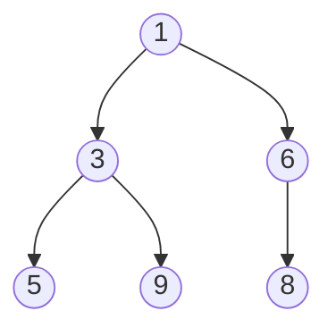

# Вопросы на собеседовании: `Кучи (Heaps)`

Куча — основа `PriorityQueue` в Java и классических задач: top-K, median in stream, Dijkstra, scheduler. На интервью важно знать heap-property, как работает `heapify`, `siftUp`/`siftDown`, и почему `build-heap` — `O(n)`, а не `O(n log n)`.

## Полезные ссылки

### Официальная документация и авторитетные источники

- [Java PriorityQueue — Baeldung](https://www.baeldung.com/java-priorityqueue)
- [Heap Sort in Java — Baeldung](https://www.baeldung.com/java-heap-sort)
- [Min Heap Implementation — Baeldung](https://www.baeldung.com/cs/binary-heap-vs-binary-search-tree)
- [PriorityQueue (Java) — Oracle Docs](https://docs.oracle.com/en/java/javase/17/docs/api/java.base/java/util/PriorityQueue.html)
- [Fibonacci Heap — Wikipedia](https://en.wikipedia.org/wiki/Fibonacci_heap)

## Содержание

- [Полезные ссылки](#полезные-ссылки)
- [See also](#see-also)

**Базовые понятия**
- [Q1. (!) Что такое heap (куча)?](#q1--что-такое-heap-куча)
- [Q2. (!) Чем min-heap отличается от max-heap?](#q2--чем-min-heap-отличается-от-max-heap)
- [Q3. (!) Чем heap отличается от BST?](#q3--чем-heap-отличается-от-bst)
- [Q4. Какие виды heap бывают?](#q4-какие-виды-heap-бывают)

**Реализация**
- [Q5. (!) Как хранить heap в массиве?](#q5--как-хранить-heap-в-массиве)
- [Q6. (!) Что такое siftUp и siftDown?](#q6--что-такое-siftup-и-siftdown)
- [Q7. (!) Как строится heap из массива (buildHeap)?](#q7--как-строится-heap-из-массива-buildheap)
- [Q8. (!) Почему buildHeap — это O(n), а не O(n log n)?](#q8--почему-buildheap--это-on-а-не-on-log-n)

**Операции**
- [Q9. (!) Сложности операций heap?](#q9--сложности-операций-heap)
- [Q10. Как удалить произвольный элемент из heap?](#q10-как-удалить-произвольный-элемент-из-heap)
- [Q11. Decrease-key и increase-key — что это?](#q11-decrease-key-и-increase-key--что-это)
- [Q12. Heap merge — слияние двух куч?](#q12-heap-merge--слияние-двух-куч)

**PriorityQueue в Java**
- [Q13. (!) Как создать min-heap и max-heap в Java?](#q13--как-создать-min-heap-и-max-heap-в-java)
- [Q14. (!) Что внутри Java PriorityQueue?](#q14--что-внутри-java-priorityqueue)
- [Q15. Какие сложности у методов PriorityQueue?](#q15-какие-сложности-у-методов-priorityqueue)
- [Q16. Является ли итерация по PriorityQueue упорядоченной?](#q16-является-ли-итерация-по-priorityqueue-упорядоченной)
- [Q17. (!) PriorityQueue thread-safe? Какие альтернативы?](#q17--priorityqueue-thread-safe-какие-альтернативы)

**Heap Sort**
- [Q18. (!) Алгоритм Heap Sort?](#q18--алгоритм-heap-sort)
- [Q19. Почему Heap Sort O(n log n) во всех случаях?](#q19-почему-heap-sort-on-log-n-во-всех-случаях)

**Классические задачи**
- [Q20. (!) K-ый наибольший элемент в массиве?](#q20--k-ый-наибольший-элемент-в-массиве)
- [Q21. (!) Как найти K самых частых элементов (Top K Frequent)?](#q21--как-найти-k-самых-частых-элементов-top-k-frequent)
- [Q22. (!) Median from Data Stream — два heap'а?](#q22--median-from-data-stream--два-heapа)
- [Q23. (!) Слияние K отсортированных списков?](#q23--слияние-k-отсортированных-списков)
- [Q24. Как найти K ближайших к началу координат точек (K Closest Points)?](#q24-как-найти-k-ближайших-к-началу-координат-точек-k-closest-points)
- [Q25. Task Scheduler — минимальное время с cooldown?](#q25-task-scheduler--минимальное-время-с-cooldown)
- [Q26. Reorganize String — без двух одинаковых подряд?](#q26-reorganize-string--без-двух-одинаковых-подряд)

**Продвинутые темы**
- [Q27. Что такое Fibonacci heap?](#q27-что-такое-fibonacci-heap)
- [Q28. Что такое pairing heap?](#q28-что-такое-pairing-heap)
- [Q29. Когда heap проигрывает другим структурам?](#q29-когда-heap-проигрывает-другим-структурам)

## Q1. (!) Что такое heap (куча)?

**Heap (куча)** — это полное (complete) бинарное дерево, в котором каждый узел упорядочен относительно своих детей (**heap-property**). Корень всегда содержит экстремум, поэтому доступ к нему — `O(1)`.

- **Min-heap:** значение каждого узла ≤ значений его детей → минимум в корне
- **Max-heap:** значение каждого узла ≥ значений его детей → максимум в корне



Ключевой момент: порядок гарантируется **только между родителем и детьми**, а не глобально — соседи на одном уровне между собой не упорядочены. Из-за этого inorder-обход кучи даёт не отсортированный набор, а мусор (см. Q3).

Дерево называется **полным**, потому что все уровни заполнены целиком, и только последний может быть заполнен частично — но строго слева направо, без «дыр». Именно эта плотность позволяет хранить кучу в обычном массиве без указателей (см. Q5).

**Где применяют:**
- Priority queue — планировщики задач, A*, Dijkstra, Prim
- Top-K задачи (k наибольших, k самых частых)
- Heap Sort
- Поддержание медианы потока (два heap'а)
- Системные планировщики: Kafka, OS scheduler, Linux CFS


## Q2. (!) Чем min-heap отличается от max-heap?

Разница только в **направлении** heap-property — структура и сложности операций идентичны:
- **Min-heap:** корень — минимум; доступ к минимуму за `O(1)`
- **Max-heap:** корень — максимум; доступ к максимуму за `O(1)`

В Java по умолчанию `PriorityQueue` — это **min-heap**:

```java
PriorityQueue<Integer> minHeap = new PriorityQueue<>();
minHeap.offer(3); minHeap.offer(1); minHeap.offer(2);
minHeap.peek(); // 1

PriorityQueue<Integer> maxHeap = new PriorityQueue<>(Comparator.reverseOrder());
maxHeap.offer(3); maxHeap.offer(1); maxHeap.offer(2);
maxHeap.peek(); // 3
```

Один тип легко получить из другого: достаточно инвертировать компаратор (`Comparator.reverseOrder()`) или хранить числа со знаком минус — тогда min-heap ведёт себя как max-heap.


## Q3. (!) Чем heap отличается от BST?

| Критерий | Heap | BST |
|----------|------|-----|
| Порядок | Только parent ↔ child | Полный (left < root < right) |
| Поиск произвольного | `O(n)` | `O(log n)` для сбалансированного |
| `findMin/Max` | `O(1)` | `O(log n)` |
| `insert` | `O(log n)` | `O(log n)` |
| `deleteMin/Max` | `O(log n)` | `O(log n)` |
| Inorder обход | Не отсортирован | Отсортирован |
| Память | Массив (компактно) | Узлы (overhead) |
| Применение | Priority queue, top-K | Отсортированная структура, range queries |

**Суть отличия:** heap гарантирует только локальный порядок parent ↔ child, а BST — глобальный (left < root < right). Отсюда вытекает всё остальное:

- В куче нет «направления» к конкретному значению, поэтому поиск произвольного элемента — `O(n)`; в BST спуск по дереву даёт `O(log n)`.
- Зато куча мгновенно отдаёт экстремум (`O(1)`), а BST для min/max надо спускаться до листа.
- Inorder-обход BST отсортирован, а у кучи — мусор, потому что глобального порядка нет.

**Правило выбора:** нужен только min/max и быстрые вставки → heap; нужны поиск, диапазоны и отсортированный обход → BST.


## Q4. Какие виды heap бывают?

| Тип | Структура | Insert | DeleteMin | DecreaseKey | Merge |
|-----|-----------|--------|-----------|-------------|-------|
| **Binary heap** | Массив | `O(log n)` | `O(log n)` | `O(log n)` | `O(n)` |
| **d-ary heap** | Массив (d детей) | `O(log_d n)` | `O(d · log_d n)` | — | — |
| **Binomial heap** | Лес деревьев | `O(log n)` | `O(log n)` | `O(log n)` | `O(log n)` |
| **Fibonacci heap** | Лес деревьев | `O(1)` амортиз. | `O(log n)` амортиз. | `O(1)` амортиз. | `O(1)` |
| **Pairing heap** | Многонаправленное | `O(1)` | `O(log n)` амортиз. | `O(log n)`* | `O(1)` |
| **Leftist heap** | Связное | `O(log n)` | `O(log n)` | — | `O(log n)` |
| **Skew heap** | Связное | `O(log n)` амортиз. | — | — | `O(log n)` амортиз. |

**Как читать таблицу:** большинство куч жертвуют простотой ради дешёвого `merge` или `decreaseKey`. Binary heap самый простой и кэш-дружелюбный, но `merge` у него `O(n)`. Если приложению нужно часто сливать кучи или менять ключи (Dijkstra, Prim), смотрят в сторону Binomial/Fibonacci/Pairing.

В **Java** `PriorityQueue` — это стандартный **binary heap** на массиве.


## Q5. (!) Как хранить heap в массиве?

Куча — полное дерево, поэтому её узлы можно уложить в массив подряд, уровень за уровнем, слева направо. Никаких пропусков и указателей не нужно — связь «родитель ↔ ребёнок» вычисляется арифметикой по индексу.

```
Индекс:   0  1  2  3  4  5  6
Значение: 1  3  6  5  9  8  ?

         [0]
        /   \
      [1]   [2]
      / \   /
    [3] [4][5]
```

Для узла на индексе `i` (нумерация с нуля):
- **Родитель:** `(i - 1) / 2`
- **Левый ребёнок:** `2i + 1`
- **Правый ребёнок:** `2i + 2`

Корень — всегда `arr[0]`. Поскольку соседние узлы лежат рядом в памяти, у массивного представления отличная локальность кеша — это одна из причин, почему binary heap на практике обгоняет «теоретически лучшие» кучи на указателях (см. Q27).


## Q6. (!) Что такое siftUp и siftDown?

Это две базовые операции, восстанавливающие heap-property после изменения кучи. Любая вставка и удаление сводятся к одной из них.

**siftUp (всплытие):** используется при вставке. Новый элемент кладём в конец массива, а затем поднимаем вверх, меняя местами с родителем, пока он меньше родителя (для min-heap). Так нарушение «проталкивается» наверх и исчезает.

```java
void siftUp(int[] heap, int i) {
    while (i > 0) {
        int parent = (i - 1) / 2;
        if (heap[i] < heap[parent]) {
            swap(heap, i, parent);
            i = parent;
        } else break;
    }
}
```

**siftDown (погружение):** используется при удалении корня. На место корня ставим последний элемент массива, а затем опускаем его вниз, меняя местами с **наименьшим** из детей, пока heap-property не восстановится. Менять надо именно с минимальным ребёнком — иначе после обмена он окажется больше второго ребёнка и инвариант снова сломается.

```java
void siftDown(int[] heap, int size, int i) {
    while (true) {
        int left = 2 * i + 1;
        int right = 2 * i + 2;
        int smallest = i;
        if (left < size && heap[left] < heap[smallest]) smallest = left;
        if (right < size && heap[right] < heap[smallest]) smallest = right;
        if (smallest == i) break;
        swap(heap, i, smallest);
        i = smallest;
    }
}
```

Обе операции — `O(log n)`, потому что в худшем случае проходят путь от листа до корня (или обратно), а высота полного дерева — `log n`.


## Q7. (!) Как строится heap из массива (buildHeap)?

Идея: вместо `n` отдельных вставок берём готовый массив и «чиним» его снизу вверх, вызывая `siftDown` для каждого нелистового узла.

```java
void buildHeap(int[] arr) {
    int n = arr.length;
    // Идём с последнего внутреннего узла к корню
    for (int i = n / 2 - 1; i >= 0; i--) {
        siftDown(arr, n, i);
    }
}
```

**Почему именно так:**
- Цикл идёт от `n/2 - 1` к `0` — это **внутренние** (нелистовые) узлы. Листья (индексы `n/2` … `n-1`) уже валидны: одноузловое поддерево тривиально удовлетворяет heap-property, чинить нечего.
- Двигаемся **снизу вверх**: к моменту вызова `siftDown(i)` оба поддерева узла `i` уже корректные кучи, поэтому одного погружения достаточно.

Итог — `O(n)` (см. Q8), что заметно лучше наивного `O(n log n)` через `n` последовательных вставок.


## Q8. (!) Почему buildHeap — это O(n), а не O(n log n)?

**Наивная оценка:** `n` вызовов siftDown × `O(log n)` каждый = `O(n log n)`. Но она **завышена**, потому что не все узлы делают `log n` шагов — далеко не все.

**Ключевое наблюдение:** стоимость siftDown зависит от **высоты узла**, а не от высоты дерева. Узлов внизу много, но они почти не двигаются; узлов вверху, которые двигаются далеко, — мало. На уровне `k` (считая снизу) находится примерно `n / 2^k` узлов, и каждый делает не больше `O(k)` шагов. Суммируем по всем уровням:

```
T(n) = ∑(k=0 до log n) (n / 2^k) · k
     = n · ∑(k / 2^k)
     ≤ n · 2          (геометрический ряд сходится)
     = O(n)
```

Ряд `∑ k / 2^k` сходится к константе (равен 2), поэтому вся сумма ограничена `2n` — то есть `O(n)`. Интуиция: основная масса узлов внизу делает по 0–1 шагу, а дорогие узлы наверху единичны, так что суммарно работа линейна.

Этот результат — фундамент **Heap Sort**: `O(n)` на построение кучи плюс `O(n log n)` на извлечение даёт итог `O(n log n)` (см. Q18).


## Q9. (!) Сложности операций heap?

| Операция | Сложность |
|----------|-----------|
| `peek()` (min/max) | `O(1)` |
| `insert()` (offer) | `O(log n)` |
| `deleteMin/Max()` (poll) | `O(log n)` |
| `decreaseKey()` (с известным индексом) | `O(log n)` |
| `buildHeap()` (из массива) | `O(n)` |
| `contains()` (поиск элемента) | `O(n)` |
| `remove(Object)` | `O(n)` (поиск) + `O(log n)` (удаление) |
| `merge()` (для binary heap) | `O(n + m)` |

**Что стоит запомнить:**
- `peek` и `buildHeap` — это «бесплатные» сильные стороны кучи: экстремум за `O(1)`, построение за `O(n)`.
- Любая модификация структуры (insert/poll/decreaseKey) — `O(log n)` за счёт одного siftUp или siftDown.
- А вот поиск произвольного элемента (`contains`, `remove(Object)`) — `O(n)`: куча не отсортирована глобально, направления к нужному значению нет, приходится сканировать весь массив.


## Q10. Как удалить произвольный элемент из heap?

Удаление из середины кучи — три шага. Так работает и `PriorityQueue.remove(Object)` в Java:

1. **Найти элемент** — линейный поиск `O(n)` (глобального порядка нет).
2. **Заменить его последним** элементом массива и уменьшить размер — `O(1)`.
3. **Восстановить heap-property** — `O(log n)`. Тут нюанс: новый элемент может оказаться как меньше родителя, так и больше детей, поэтому нужен либо siftUp, либо siftDown. Сработает только один из них — поэтому вызываем siftDown, а siftUp применяем лишь если элемент не сдвинулся вниз.

```java
boolean removeAt(int[] heap, int i, int size) {
    int last = size - 1;
    if (i == last) return true;
    heap[i] = heap[last];
    // Может потребоваться siftUp или siftDown
    siftDown(heap, size - 1, i);
    if (heap[i] == heap[last]) siftUp(heap, i);
    return true;
}
```

**Как ускорить:** если `decreaseKey` или удаление по ключу нужны часто, узким местом становится шаг 1 — поиск `O(n)`. Решение — держать сбоку `Map<Element, Index>`, чтобы находить индекс за `O(1)`. Такая структура называется **indexed priority queue** и именно она используется в эффективных реализациях Dijkstra и Prim (см. Q11).


## Q11. Decrease-key и increase-key — что это?

Это изменение приоритета уже лежащего в куче элемента:

- **Decrease-key** — уменьшить значение. В min-heap элемент мог стать меньше родителя → нужен **siftUp**.
- **Increase-key** — увеличить значение. Элемент мог стать больше детей → нужен **siftDown**.

**Загвоздка:** чтобы применить siftUp/siftDown, надо знать индекс элемента в массиве, а поиск по значению — `O(n)`. Поэтому в стандартном `PriorityQueue` прямого `decreaseKey` нет. Нужен **indexed heap** — куча с отображением «ID элемента → текущий индекс», которое обновляется при каждом обмене. Это критично для **Dijkstra** и **Prim**, где приоритеты вершин многократно уменьшаются по ходу алгоритма.

```java
class IndexedHeap {
    private int[] heap;        // heap значений
    private int[] indexOf;     // от ID к индексу в heap
    private int[] idAt;        // от индекса в heap к ID

    void decreaseKey(int id, int newValue) {
        int i = indexOf[id];
        heap[i] = newValue;
        siftUp(i);
    }
}
```

**Обходной путь в Java (lazy deletion):** не возиться с indexed heap, а класть в очередь копию с новым приоритетом и помечать старую запись как устаревшую. При `poll` пропускаем записи, которые уже неактуальны. Просто в реализации, но куча растёт и тратит лишнюю память.


## Q12. Heap merge — слияние двух куч?

У binary heap нет дешёвого слияния — лучшее, что можно сделать, это `O(n + m)`: склеить оба массива в один и один раз построить кучу через `buildHeap`.

```java
PriorityQueue<Integer> merge(PriorityQueue<Integer> a, PriorityQueue<Integer> b) {
    a.addAll(b); // под капотом siftUp для каждого = O(m log(n+m))
    return a;
}
```

**Почему `addAll` хуже:** под капотом он делает `m` отдельных вставок, каждая с siftUp, итого `O(m · log(n+m))`. Прямое объединение массивов с одним `buildHeap` дешевле и стоит `O(n + m)`.

**Когда merge — частая операция,** binary heap вообще не подходит. Тогда берут Binomial, Fibonacci или Pairing heap — у них слияние `O(log n)` или даже `O(1)` (см. Q4, Q27).


## Q13. (!) Как создать min-heap и max-heap в Java?

```java
// Min-heap (по умолчанию)
PriorityQueue<Integer> minHeap = new PriorityQueue<>();

// Max-heap — через reverse Comparator
PriorityQueue<Integer> maxHeap = new PriorityQueue<>(Comparator.reverseOrder());

// Кастомный приоритет
PriorityQueue<int[]> customHeap = new PriorityQueue<>(
    Comparator.comparingInt((int[] a) -> a[0]) // первый элемент массива
              .thenComparingInt(a -> a[1])     // tie-breaker — второй
);

// Из существующей коллекции — O(n) build
PriorityQueue<Integer> fromList = new PriorityQueue<>(List.of(3, 1, 4, 1, 5));
```

**Что важно помнить:**
- min-heap получается «бесплатно» (`new PriorityQueue<>()`), max-heap — через `Comparator.reverseOrder()`;
- для объектов почти всегда нужен явный компаратор с tie-breaker, иначе порядок при равных приоритетах не определён;
- конструктор из коллекции использует `buildHeap`, то есть `O(n)`, а не `n` вставок по `O(log n)`.

**Трюк для max-heap из чисел:** вместо компаратора можно класть значения со знаком минус — тогда обычный min-heap отдаёт максимум. Удобно в LeetCode-задачах, но осторожно с `Integer.MIN_VALUE` (его отрицание переполняется).


## Q14. (!) Что внутри Java PriorityQueue?

`PriorityQueue` — это **binary min-heap на массиве** (`Object[] queue`). `offer` кладёт элемент в конец и поднимает siftUp; `poll` возвращает `queue[0]`, ставит на его место последний элемент и опускает siftDown:

```java
// Внутри (упрощённо)
public class PriorityQueue<E> {
    transient Object[] queue;
    private int size;
    private final Comparator<? super E> comparator;

    public boolean offer(E e) {
        // Добавляем в конец и siftUp
        ...
    }

    public E poll() {
        // Берём queue[0], ставим последний на его место, siftDown
        ...
    }
}
```

**Особенности, о которых часто спрашивают:**
- **Не thread-safe** — для конкурентного доступа есть `PriorityBlockingQueue` (см. Q17).
- **Не допускает `null`** — бросит `NullPointerException`, так как `null` нельзя сравнить.
- **Растёт динамически**, как `ArrayList` (при переполнении пересоздаёт внутренний массив).
- **`iterator()` не упорядочен** — обходит элементы в порядке их хранения в массиве, а не по приоритету. Это самая частая ловушка (см. Q16).


## Q15. Какие сложности у методов PriorityQueue?

| Метод | Сложность |
|-------|-----------|
| `offer(e)` | `O(log n)` |
| `poll()` | `O(log n)` |
| `peek()` | `O(1)` |
| `remove(o)` | `O(n)` |
| `contains(o)` | `O(n)` |
| `size()` | `O(1)` |
| Конструктор из коллекции | `O(n)` (buildHeap) |

`offer`/`poll` — `O(log n)` (один siftUp/siftDown), `peek` — `O(1)` (просто `queue[0]`). А `remove(o)` и `contains(o)` — `O(n)`, потому что требуют линейного поиска: куча упорядочена только parent ↔ child, найти элемент по значению без сканирования нельзя.


## Q16. Является ли итерация по PriorityQueue упорядоченной?

**Нет.** `iterator()` (и цикл `for-each`) обходит элементы в **порядке их хранения в массиве**, а не по приоритету. Гарантируется только, что первым из кучи выйдет корень при `poll` — но не порядок итерации. Чтобы получить отсортированный обход, есть два пути:

```java
// Нельзя:
for (Integer x : pq) System.out.println(x); // не отсортировано!

// Можно (деструктивно):
while (!pq.isEmpty()) System.out.println(pq.poll());

// Или копией + сортировкой:
List<Integer> sorted = new ArrayList<>(pq);
Collections.sort(sorted, pq.comparator());
```

**Главное:** `poll` в цикле упорядочивает, но разрушает очередь; копия со `sort` сохраняет очередь, но стоит `O(n log n)`. Путать heap с sorted set — частая ошибка на интервью: куча даёт порядок только «по одному, с вершины».


## Q17. (!) PriorityQueue thread-safe? Какие альтернативы?

**Нет, `PriorityQueue` не thread-safe** — при доступе из нескольких потоков нужна внешняя синхронизация или другая структура.

Альтернативы:
- **`PriorityBlockingQueue`** — потокобезопасная версия той же кучи. Неограниченного размера: `put` никогда не блокируется, а `take` блокируется, если очередь пуста. Это стандартный выбор для пулов задач с приоритетом.
- **`Collections.synchronizedXxx()`** — обёртка с одним глобальным локом на все операции; работает, но узкое место под нагрузкой.
- **`ConcurrentSkipListMap`** — это не куча, а отсортированная структура с `O(log n)`-операциями, но без блокировок; подходит, когда нужен не только min/max, но и навигация по порядку.

```java
PriorityBlockingQueue<Task> queue = new PriorityBlockingQueue<>(
    100,
    Comparator.comparingInt(Task::priority).reversed()
);
queue.put(task);     // не блокируется (unbounded)
Task t = queue.take(); // блокируется, если пусто
```

**Где встречается на практике:** `PriorityBlockingQueue` лежит в основе `ScheduledThreadPoolExecutor` — задачи в нём упорядочены по времени запуска, и рабочий поток забирает ближайшую через блокирующий `take`.


## Q18. (!) Алгоритм Heap Sort?

Heap Sort сортирует массив на месте в два этапа: строит max-heap, а затем `n-1` раз снимает максимум с вершины и кладёт его в конец, постепенно сужая «активную» часть кучи.

```java
void heapSort(int[] arr) {
    int n = arr.length;

    // 1. Построение max-heap — O(n)
    for (int i = n / 2 - 1; i >= 0; i--) siftDown(arr, n, i);

    // 2. Извлечение элементов — O(n log n)
    for (int i = n - 1; i > 0; i--) {
        int tmp = arr[0]; arr[0] = arr[i]; arr[i] = tmp;
        siftDown(arr, i, 0);
    }
}

void siftDown(int[] arr, int size, int i) {
    while (true) {
        int left = 2 * i + 1, right = 2 * i + 2;
        int largest = i;
        if (left < size && arr[left] > arr[largest]) largest = left;
        if (right < size && arr[right] > arr[largest]) largest = right;
        if (largest == i) break;
        int tmp = arr[i]; arr[i] = arr[largest]; arr[largest] = tmp;
        i = largest;
    }
}
```

**Идея извлечения:** максимум всегда в `arr[0]`. Меняем его с последним активным элементом — максимум встаёт на своё финальное место в конце. Уменьшаем размер кучи на 1 и одним siftDown восстанавливаем max-heap. Повторяя, получаем отсортированный по возрастанию массив.

**Свойства:** `O(n log n)` во всех случаях, **in-place** (без доппамяти), но **нестабильная** — одинаковые элементы могут поменять относительный порядок (см. Q19).


## Q19. Почему Heap Sort O(n log n) во всех случаях?

Потому что объём работы **не зависит от порядка** входных данных — в отличие от Quick Sort, у которого неудачный выбор pivot даёт `O(n²)`:
- buildHeap — `O(n)` при любом входе;
- извлечение — ровно `n` снятий вершины, каждое с siftDown за `O(log n)`, итого `O(n log n)` всегда.

Нет «плохого» входа, который заставил бы siftDown работать дольше `log n` — высота кучи фиксирована.

**Компромисс:** гарантированный `O(n log n)` — главный плюс Heap Sort, но на практике он обычно медленнее Quick Sort из-за **плохой локальности кеша** (siftDown прыгает по массиву на большие расстояния, тогда как Quick Sort работает с близкими элементами). Поэтому Heap Sort применяют не сам по себе, а в **introsort**: тот стартует с Quick Sort ради скорости и переключается на Heap Sort, когда рекурсия становится слишком глубокой, — чтобы исключить `O(n²)`.


## Q20. (!) K-ый наибольший элемент в массиве?

**Идея — min-heap фиксированного размера K.** Держим в куче только k кандидатов на роль наибольших. Когда размер превышает k, выбрасываем корень — текущий минимум среди кандидатов. Так в куче всегда остаются именно k наибольших, а их минимум (корень) и есть k-ый по величине. Время `O(n log k)`, память `O(k)`.

```java
int findKthLargest(int[] nums, int k) {
    PriorityQueue<Integer> minHeap = new PriorityQueue<>();
    for (int x : nums) {
        minHeap.offer(x);
        if (minHeap.size() > k) minHeap.poll();
    }
    return minHeap.peek();
}
```

**Почему min-heap, а не max-heap:** в min-heap легко за `O(1)` увидеть и выкинуть наименьшего из текущих кандидатов — а именно его и нужно отбрасывать, оставляя крупных.

**Альтернативы и когда они лучше:**
- **Сортировка** `O(n log n)` — проще кода, но медленнее при больших `n` и малом `k`.
- **QuickSelect** — `O(n)` в среднем, `O(n²)` в худшем; самый быстрый в среднем и не требует доппамяти, но мутирует массив и не даёт стабильного времени. Heap-подход выигрывает, когда данные приходят потоком (весь массив сразу не доступен) или нужна гарантия времени.


## Q21. (!) Как найти K самых частых элементов (Top K Frequent)?

Два шага: сначала считаем частоты в `HashMap`, затем тем же приёмом «min-heap размера K» (см. Q20) отбираем k элементов с наибольшей частотой.

```java
int[] topKFrequent(int[] nums, int k) {
    Map<Integer, Integer> count = new HashMap<>();
    for (int x : nums) count.merge(x, 1, Integer::sum);

    // Min-heap по частоте, размером K
    PriorityQueue<int[]> heap = new PriorityQueue<>(
        Comparator.comparingInt(a -> a[1]) // [число, частота]
    );

    for (var e : count.entrySet()) {
        heap.offer(new int[]{e.getKey(), e.getValue()});
        if (heap.size() > k) heap.poll();
    }

    int[] result = new int[k];
    for (int i = k - 1; i >= 0; i--) result[i] = heap.poll()[0];
    return result;
}
```

**Сложность:** `O(n log k)` — `n` элементов, у каждого вставка в кучу размера `k`. Поскольку частоты лежат в диапазоне `[1, n]`, задачу можно решить и за `O(n)` через **bucket sort**: завести массив корзин, где индекс — это частота, и пройти его с конца. Heap-подход проще и обычно достаточно быстр; bucket sort берут, когда `k` близко к числу уникальных элементов.


## Q22. (!) Median from Data Stream — два heap'а?

Задача: по потоку чисел поддерживать текущую медиану — методы `addNum(x)` и `findMedian()`. Хитрость в том, что для медианы не нужен весь отсортированный массив — достаточно знать два центральных элемента. Их и держат на «границе» двух куч.

```java
class MedianFinder {
    // max-heap для нижней половины
    PriorityQueue<Integer> low = new PriorityQueue<>(Comparator.reverseOrder());
    // min-heap для верхней половины
    PriorityQueue<Integer> high = new PriorityQueue<>();

    public void addNum(int num) {
        low.offer(num);
        high.offer(low.poll()); // балансируем
        if (high.size() > low.size()) low.offer(high.poll());
    }

    public double findMedian() {
        if (low.size() > high.size()) return low.peek();
        return (low.peek() + high.peek()) / 2.0;
    }
}
```

**Сложность:** `addNum` — `O(log n)` (две операции с кучами), `findMedian` — `O(1)` (только заглядываем в корни).

**Идея целиком:**
- `low` (max-heap) хранит меньшую половину чисел, `high` (min-heap) — большую.
- Корень `low` — наибольший из «маленьких», корень `high` — наименьший из «больших». Медиана всегда зажата между ними.
- При вставке прогоняем число через обе кучи и **балансируем** так, чтобы размеры отличались не больше чем на 1. Если общее число элементов нечётное — медиана это корень большей кучи; если чётное — среднее двух корней.


## Q23. (!) Слияние K отсортированных списков?

**Идея:** держать в куче по одному «фронтовому» узлу от каждого списка. На каждом шаге извлекаем глобальный минимум, дописываем его в результат и подсовываем в кучу следующий узел из того же списка. Так куча всегда содержит не больше `k` элементов.

```java
ListNode mergeKLists(ListNode[] lists) {
    PriorityQueue<ListNode> pq = new PriorityQueue<>(
        Comparator.comparingInt(n -> n.val)
    );
    for (ListNode head : lists) if (head != null) pq.offer(head);

    ListNode dummy = new ListNode(0), curr = dummy;
    while (!pq.isEmpty()) {
        ListNode node = pq.poll();
        curr.next = node;
        curr = node;
        if (node.next != null) pq.offer(node.next);
    }
    return dummy.next;
}
```

**Сложность:** `O(N log k)`, где `N` — общее число элементов, `k` — число списков: каждый из `N` элементов один раз проходит через кучу размера `k`. Память — `O(k)`.

**Альтернатива:** divide-and-conquer — попарно сливать списки (как merge в merge sort). Та же асимптотика `O(N log k)`, но без накладных расходов на кучу, поэтому на практике часто быстрее.


## Q24. Как найти K ближайших к началу координат точек (K Closest Points)?

**Идея — max-heap размера K по расстоянию.** Зеркало задачи Q20: чтобы оставить k *ближайших*, держим в куче k кандидатов и при переполнении выбрасываем самого *далёкого*. Поэтому здесь нужен max-heap (корень — наибольшее расстояние), а не min-heap.

```java
int[][] kClosest(int[][] points, int k) {
    // Max-heap по дистанции, размер k
    PriorityQueue<int[]> heap = new PriorityQueue<>(
        (a, b) -> distSq(b) - distSq(a)
    );
    for (int[] p : points) {
        heap.offer(p);
        if (heap.size() > k) heap.poll();
    }
    return heap.toArray(new int[k][]);
}

int distSq(int[] p) { return p[0] * p[0] + p[1] * p[1]; }
```

**Сложность:** `O(n log k)`, память `O(k)`. Сравниваем по **квадрату** расстояния, а не по самому расстоянию: `sqrt` монотонна, поэтому порядок не меняется, а мы экономим на вычислениях и избегаем погрешностей чисел с плавающей точкой.


## Q25. Task Scheduler — минимальное время с cooldown?

Задача: дан массив задач (буквы) и cooldown `n` — между двумя одинаковыми задачами должно пройти не меньше `n` тиков. Найти минимальное общее время выполнения (с учётом простоев). Жадная идея: на каждом «окне» из `n+1` слотов запускаем самые частые из ещё доступных задач — так чаще всего встречающаяся задача успевает остыть к следующему окну.

```java
int leastInterval(char[] tasks, int n) {
    int[] freq = new int[26];
    for (char c : tasks) freq[c - 'A']++;

    PriorityQueue<Integer> maxHeap = new PriorityQueue<>(Comparator.reverseOrder());
    for (int f : freq) if (f > 0) maxHeap.offer(f);

    int time = 0;
    while (!maxHeap.isEmpty()) {
        List<Integer> tmp = new ArrayList<>();
        for (int i = 0; i <= n; i++) { // обрабатываем (n+1) разных задач
            if (!maxHeap.isEmpty()) {
                int f = maxHeap.poll();
                if (f > 1) tmp.add(f - 1);
            }
            time++;
            if (maxHeap.isEmpty() && tmp.isEmpty()) break;
        }
        maxHeap.addAll(tmp);
    }
    return time;
}
```

**Почему max-heap:** в каждом окне приоритет — за самыми частыми задачами, иначе они «застрянут» и создадут лишние простои в конце. После окна задачи с остатком возвращаем в кучу. Сложность — `O(n log 26)` ≈ `O(n)`, так как разных букв не больше 26, и куча мала.


## Q26. Reorganize String — без двух одинаковых подряд?

Нужно переставить буквы так, чтобы никакие две одинаковые не стояли рядом. Жадная идея: на каждом шаге ставить **самую частую** из доступных букв — но не ту, что поставили только что. Самую частую держим в max-heap, а только что использованную «придерживаем» один шаг, чтобы не нарушить правило.

```java
String reorganizeString(String s) {
    int[] freq = new int[26];
    for (char c : s.toCharArray()) freq[c - 'a']++;

    PriorityQueue<int[]> heap = new PriorityQueue<>(
        (a, b) -> b[1] - a[1] // max-heap по частоте
    );
    for (int i = 0; i < 26; i++) {
        if (freq[i] > 0) heap.offer(new int[]{i, freq[i]});
    }

    StringBuilder sb = new StringBuilder();
    int[] prev = null;
    while (!heap.isEmpty()) {
        int[] curr = heap.poll();
        sb.append((char)('a' + curr[0]));
        curr[1]--;
        if (prev != null && prev[1] > 0) heap.offer(prev);
        prev = curr;
    }

    return sb.length() == s.length() ? sb.toString() : "";
}
```

**Механика `prev`:** ставим символ, уменьшаем его счётчик и откладываем в `prev` — он вернётся в кучу только на следующем шаге, поэтому два одинаковых не окажутся рядом. Если в конце длина результата меньше исходной — значит, какая-то буква встречалась чаще половины строки и переставить без повторов невозможно (возвращаем `""`). Сложность — `O(n log 26)` ≈ `O(n)`.


## Q27. Что такое Fibonacci heap?

**Fibonacci heap** — куча на лесе деревьев, спроектированная под дешёвые `insert`, `decreaseKey` и `merge`. Достигает этого за счёт «ленивости»: при вставке и слиянии работа откладывается, а реальная перестройка деревьев происходит только при `deleteMin`. Отсюда **отличные амортизированные** сложности:

| Операция | Сложность |
|----------|-----------|
| `insert` | `O(1)` |
| `findMin` | `O(1)` |
| `decreaseKey` | `O(1)` |
| `merge` | `O(1)` |
| `deleteMin` | `O(log n)` |
| `delete` | `O(log n)` |

**Зачем нужен:** `decreaseKey` за `O(1)` теоретически ускоряет Dijkstra до `O(V log V + E)` против `O((V+E) log V)` с binary heap — выигрыш на плотных графах, где рёбер (и операций decreaseKey) много.

**Почему почти не используется:** большие скрытые константы и сложная реализация на указателях с плохой локальностью кеша. На реальных данных binary heap часто быстрее, несмотря на худшую асимптотику. В JDK Fibonacci heap нет — это структура «для учебников и доказательств».


## Q28. Что такое pairing heap?

**Pairing heap** — самобалансирующаяся куча на многонаправленном дереве, по сути упрощённая Fibonacci heap. Амортизированные сложности близки к Fibonacci, но реализация куда проще:

| Операция | Сложность |
|----------|-----------|
| `insert` | `O(1)` |
| `findMin` | `O(1)` |
| `decreaseKey` | `O(log n)` (сложно доказать точно) |
| `merge` | `O(1)` |
| `deleteMin` | `O(log n)` амортиз. |

**Главный плюс:** благодаря простоте и лучшей локальности на практике часто **обгоняет Fibonacci heap**, давая близкие преимущества (быстрый `merge` и `decreaseKey`) меньшей ценой. Точная сложность `decreaseKey` до сих пор не доказана строго, но эмпирически близка к `O(log n)`. Используется, например, в **GCC libstdc++** в некоторых режимах работы с приоритетными очередями.


## Q29. Когда heap проигрывает другим структурам?

Куча сильна только в одном — быстром доступе к экстремуму. Всё, что выходит за рамки «дай мне минимум/максимум», она делает плохо:

1. **Поиск произвольного элемента** — `O(n)`, глобального порядка нет. Лучше `HashSet` (`O(1)`) или BST (`O(log n)`).
2. **Запросы по диапазону** (range queries) — куча не упорядочена, диапазон не вырезать. Лучше segment tree или sorted set.
3. **Обход по порядку** — итерация по куче не отсортирована (см. Q16). Лучше `TreeMap`.
4. **Decrease-key в Dijkstra/Prim** — обычная куча не умеет менять ключ по значению; нужен indexed heap (см. Q11).
5. **Очень маленькие данные** — накладные расходы на heapify не окупаются, проще линейный поиск или сортировка.

**Вывод:** для нагрузки с частым decrease-key берут indexed binary heap или Fibonacci heap; для поиска и диапазонов — хеш-таблицы и отсортированные структуры. Heap — это узкий инструмент «top/min/max», а не универсальный контейнер.

---

## See also

- [Алгоритмы (обзор)](../algorithms-interview.md) — карта алгоритмических тем
- [Деревья](trees-interview.md) — heap как complete binary tree
- [Стеки и очереди](stacks-queues-interview.md) — PriorityQueue в Java
- [Алгоритмы сортировки](../sorting-searching/sorting-algorithms-interview.md) — Heap Sort
- [Графы](graphs-interview.md) — Dijkstra использует priority queue
- [Хеш-таблицы](hash-tables-interview.md) — для top-K frequent (count + heap)
- [Массивы и строки](arrays-strings-interview.md) — top-K в массивах
- [Анализ сложности](../complexity/complexity-analysis-interview.md) — buildHeap O(n) обоснование
- [Java Collections](../../programming-languages/java/java-collections-interview.md) — PriorityQueue, PriorityBlockingQueue
- [Java Concurrency](../../programming-languages/java/java-concurrency-interview.md) — PriorityBlockingQueue, ScheduledThreadPoolExecutor


- [Массивы и строки](arrays-strings-interview.md)
- [Графы](graphs-interview.md)
- [Хеш-таблицы](hash-tables-interview.md)
- [Связные списки](linked-lists-interview.md)
- [Стеки и очереди](stacks-queues-interview.md)
- [Деревья](trees-interview.md)
