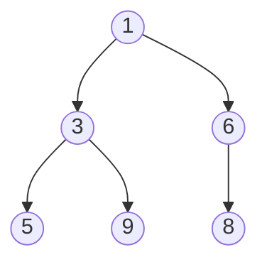

# Вопросы на собеседовании: `Кучи (Heaps)`

Куча — основа `PriorityQueue` в Java и классических задач: top-K, median in stream, Dijkstra, scheduler. На интервью важно знать heap-property, как работает `heapify`, `siftUp`/`siftDown`, и почему `build-heap` — `O(n)`, а не `O(n log n)`.

## Полезные ссылки

### Официальная документация и авторитетные источники

- [Java PriorityQueue — Baeldung](https://www.baeldung.com/java-priorityqueue)
- [Heap Sort in Java — Baeldung](https://www.baeldung.com/java-heap-sort)
- [Min Heap Implementation — Baeldung](https://www.baeldung.com/cs/binary-heap-vs-binary-search-tree)
- [PriorityQueue (Java) — Oracle Docs](https://docs.oracle.com/en/java/javase/17/docs/api/java.base/java/util/PriorityQueue.html)
- [Fibonacci Heap — Wikipedia](https://en.wikipedia.org/wiki/Fibonacci_heap)

## Содержание

- [Полезные ссылки](#полезные-ссылки)
- [See also](#see-also)

**Базовые понятия**
- [Q1. (!) Что такое heap (куча)?](#q1--что-такое-heap-куча)
- [Q2. (!) Чем min-heap отличается от max-heap?](#q2--чем-min-heap-отличается-от-max-heap)
- [Q3. (!) Чем heap отличается от BST?](#q3--чем-heap-отличается-от-bst)
- [Q4. Какие виды heap бывают?](#q4-какие-виды-heap-бывают)

**Реализация**
- [Q5. (!) Как хранить heap в массиве?](#q5--как-хранить-heap-в-массиве)
- [Q6. (!) Что такое siftUp и siftDown?](#q6--что-такое-siftup-и-siftdown)
- [Q7. (!) Как строится heap из массива (buildHeap)?](#q7--как-строится-heap-из-массива-buildheap)
- [Q8. (!) Почему buildHeap — это O(n), а не O(n log n)?](#q8--почему-buildheap--это-on-а-не-on-log-n)

**Операции**
- [Q9. (!) Сложности операций heap?](#q9--сложности-операций-heap)
- [Q10. Как удалить произвольный элемент из heap?](#q10-как-удалить-произвольный-элемент-из-heap)
- [Q11. Decrease-key и increase-key — что это?](#q11-decrease-key-и-increase-key--что-это)
- [Q12. Heap merge — слияние двух куч?](#q12-heap-merge--слияние-двух-куч)

**PriorityQueue в Java**
- [Q13. (!) Как создать min-heap и max-heap в Java?](#q13--как-создать-min-heap-и-max-heap-в-java)
- [Q14. (!) Что внутри Java PriorityQueue?](#q14--что-внутри-java-priorityqueue)
- [Q15. Какие сложности у методов PriorityQueue?](#q15-какие-сложности-у-методов-priorityqueue)
- [Q16. Является ли итерация по PriorityQueue упорядоченной?](#q16-является-ли-итерация-по-priorityqueue-упорядоченной)
- [Q17. (!) PriorityQueue thread-safe? Какие альтернативы?](#q17--priorityqueue-thread-safe-какие-альтернативы)

**Heap Sort**
- [Q18. (!) Алгоритм Heap Sort?](#q18--алгоритм-heap-sort)
- [Q19. Почему Heap Sort O(n log n) во всех случаях?](#q19-почему-heap-sort-on-log-n-во-всех-случаях)

**Классические задачи**
- [Q20. (!) K-ый наибольший элемент в массиве?](#q20--k-ый-наибольший-элемент-в-массиве)
- [Q21. (!) Top K Frequent Elements?](#q21--top-k-frequent-elements)
- [Q22. (!) Median from Data Stream — два heap'а?](#q22--median-from-data-stream--два-heapа)
- [Q23. (!) Слияние K отсортированных списков?](#q23--слияние-k-отсортированных-списков)
- [Q24. K Closest Points to Origin?](#q24-k-closest-points-to-origin)
- [Q25. Task Scheduler — минимальное время с cooldown?](#q25-task-scheduler--минимальное-время-с-cooldown)
- [Q26. Reorganize String — без двух одинаковых подряд?](#q26-reorganize-string--без-двух-одинаковых-подряд)

**Продвинутые темы**
- [Q27. Что такое Fibonacci heap?](#q27-что-такое-fibonacci-heap)
- [Q28. Что такое pairing heap?](#q28-что-такое-pairing-heap)
- [Q29. Когда heap проигрывает другим структурам?](#q29-когда-heap-проигрывает-другим-структурам)

## Q1. (!) Что такое heap (куча)?

**Heap** — полное (complete) бинарное дерево с **heap-property**:
- **Min-heap:** значение каждого узла ≤ значений его детей (минимум — корень)
- **Max-heap:** значение каждого узла ≥ значений его детей (максимум — корень)



Это **полное** дерево — все уровни заполнены, последний — слева направо. Поэтому heap идеально хранится в массиве.

**Применения:**
- Priority queues (планировщики, A*, Dijkstra)
- Top-K задачи
- Heap Sort
- Median maintenance (два heap'а)
- Kafka, OS schedulers, Linux CFS


> [!mcq]
> - [x] Правильный ответ | Объяснение концепции 2-3 предложения
> - [ ] Неправильный вариант 1 | Почему ошибка в этом подходе
> - [ ] Неправильный вариант 2 | Это смежное, но отличное понятие
> - [ ] Неправильный вариант 3 | Противоположное направление## Q2. (!) Чем min-heap отличается от max-heap?

Только **направлением** heap-property:
- **Min-heap:** корень — минимум; быстрый доступ к минимуму за `O(1)`
- **Max-heap:** корень — максимум; быстрый доступ к максимуму за `O(1)`

В Java по умолчанию `PriorityQueue` — **min-heap**:

```java
PriorityQueue<Integer> minHeap = new PriorityQueue<>();
minHeap.offer(3); minHeap.offer(1); minHeap.offer(2);
minHeap.peek(); // 1

PriorityQueue<Integer> maxHeap = new PriorityQueue<>(Comparator.reverseOrder());
maxHeap.offer(3); maxHeap.offer(1); maxHeap.offer(2);
maxHeap.peek(); // 3
```

Один из них можно реализовать через другой, инвертируя сравнение или знаки чисел.


> [!mcq]
> - [x] Правильный ответ | Объяснение концепции 2-3 предложения
> - [ ] Неправильный вариант 1 | Почему ошибка в этом подходе
> - [ ] Неправильный вариант 2 | Это смежное, но отличное понятие
> - [ ] Неправильный вариант 3 | Противоположное направление## Q3. (!) Чем heap отличается от BST?

| Критерий | Heap | BST |
|----------|------|-----|
| Порядок | Только parent ↔ child | Полный (left < root < right) |
| Поиск произвольного | `O(n)` | `O(log n)` для сбалансированного |
| `findMin/Max` | `O(1)` | `O(log n)` |
| `insert` | `O(log n)` | `O(log n)` |
| `deleteMin/Max` | `O(log n)` | `O(log n)` |
| Inorder обход | Не отсортирован | Отсортирован |
| Память | Массив (компактно) | Узлы (overhead) |
| Применение | Priority queue, top-K | Отсортированная структура, range queries |

Heap **не сохраняет** глобальный порядок — гарантирует только parent ↔ child. Поэтому inorder обход heap'а — мусор.


> [!mcq]
> - [x] Правильный ответ | Объяснение концепции 2-3 предложения
> - [ ] Неправильный вариант 1 | Почему ошибка в этом подходе
> - [ ] Неправильный вариант 2 | Это смежное, но отличное понятие
> - [ ] Неправильный вариант 3 | Противоположное направление## Q4. Какие виды heap бывают?

| Тип | Структура | Insert | DeleteMin | DecreaseKey | Merge |
|-----|-----------|--------|-----------|-------------|-------|
| **Binary heap** | Массив | `O(log n)` | `O(log n)` | `O(log n)` | `O(n)` |
| **d-ary heap** | Массив (d детей) | `O(log_d n)` | `O(d · log_d n)` | — | — |
| **Binomial heap** | Лес деревьев | `O(log n)` | `O(log n)` | `O(log n)` | `O(log n)` |
| **Fibonacci heap** | Лес деревьев | `O(1)` амортиз. | `O(log n)` амортиз. | `O(1)` амортиз. | `O(1)` |
| **Pairing heap** | Многонаправленное | `O(1)` | `O(log n)` амортиз. | `O(log n)`* | `O(1)` |
| **Leftist heap** | Связное | `O(log n)` | `O(log n)` | — | `O(log n)` |
| **Skew heap** | Связное | `O(log n)` амортиз. | — | — | `O(log n)` амортиз. |

В **Java** `PriorityQueue` — стандартный **binary heap**.


> [!mcq]
> - [x] Правильный ответ | Объяснение концепции 2-3 предложения
> - [ ] Неправильный вариант 1 | Почему ошибка в этом подходе
> - [ ] Неправильный вариант 2 | Это смежное, но отличное понятие
> - [ ] Неправильный вариант 3 | Противоположное направление## Q5. (!) Как хранить heap в массиве?

Полное дерево хранится без пропусков:

```
Индекс:   0  1  2  3  4  5  6
Значение: 1  3  6  5  9  8  ?

         [0]
        /   \
      [1]   [2]
      / \   /
    [3] [4][5]
```

Для узла на индексе `i`:
- **Parent:** `(i - 1) / 2`
- **Left child:** `2i + 1`
- **Right child:** `2i + 2`

Корень — `arr[0]`. Никаких указателей, отличная локальность кеша.


> [!mcq]
> - [x] Правильный ответ | Объяснение концепции 2-3 предложения
> - [ ] Неправильный вариант 1 | Почему ошибка в этом подходе
> - [ ] Неправильный вариант 2 | Это смежное, но отличное понятие
> - [ ] Неправильный вариант 3 | Противоположное направление## Q6. (!) Что такое siftUp и siftDown?

Это две операции восстановления heap-property:

**siftUp (bubble up):** при вставке нового элемента в конец, поднимаем его наверх, пока он меньше родителя (для min-heap).

```java
void siftUp(int[] heap, int i) {
    while (i > 0) {
        int parent = (i - 1) / 2;
        if (heap[i] < heap[parent]) {
            swap(heap, i, parent);
            i = parent;
        } else break;
    }
}
```

**siftDown (heapify):** при удалении корня, ставим последний элемент на место корня и опускаем его вниз, пока он больше детей.

```java
void siftDown(int[] heap, int size, int i) {
    while (true) {
        int left = 2 * i + 1;
        int right = 2 * i + 2;
        int smallest = i;
        if (left < size && heap[left] < heap[smallest]) smallest = left;
        if (right < size && heap[right] < heap[smallest]) smallest = right;
        if (smallest == i) break;
        swap(heap, i, smallest);
        i = smallest;
    }
}
```

Обе операции — `O(log n)`.


> [!mcq]
> - [x] Правильный ответ | Объяснение концепции 2-3 предложения
> - [ ] Неправильный вариант 1 | Почему ошибка в этом подходе
> - [ ] Неправильный вариант 2 | Это смежное, но отличное понятие
> - [ ] Неправильный вариант 3 | Противоположное направление## Q7. (!) Как строится heap из массива (buildHeap)?

```java
void buildHeap(int[] arr) {
    int n = arr.length;
    // Идём с последнего внутреннего узла к корню
    for (int i = n / 2 - 1; i >= 0; i--) {
        siftDown(arr, n, i);
    }
}
```

**Внутренние узлы** — индексы от `n/2 - 1` до `0`. Листья (`n/2` до `n - 1`) уже валидны как одноузловые heap'ы.

`O(n)` — лучше наивного `O(n log n)` через `n` insert'ов.


> [!mcq]
> - [x] Правильный ответ | Объяснение концепции 2-3 предложения
> - [ ] Неправильный вариант 1 | Почему ошибка в этом подходе
> - [ ] Неправильный вариант 2 | Это смежное, но отличное понятие
> - [ ] Неправильный вариант 3 | Противоположное направление## Q8. (!) Почему buildHeap — это O(n), а не O(n log n)?

**Наивная оценка:** `n` siftDown вызовов × `O(log n)` = `O(n log n)`. Но это **завышено**.

**Точная оценка:** на уровне `k` (считая снизу) находится `n / 2^k` узлов, и каждый делает `O(k)` шагов siftDown. Сумма:

```
T(n) = ∑(k=0 до log n) (n / 2^k) · k
     = n · ∑(k / 2^k)
     ≤ n · 2          (геометрический ряд сходится)
     = O(n)
```

Большинство работы — внизу (много узлов, мало шагов), наверху (мало узлов, много шагов) — но и там немного.

Это база для **Heap Sort** — `O(n)` build + `O(n log n)` извлечение = `O(n log n)`.


> [!mcq]
> - [x] Правильный ответ | Объяснение концепции 2-3 предложения
> - [ ] Неправильный вариант 1 | Почему ошибка в этом подходе
> - [ ] Неправильный вариант 2 | Это смежное, но отличное понятие
> - [ ] Неправильный вариант 3 | Противоположное направление## Q9. (!) Сложности операций heap?

| Операция | Сложность |
|----------|-----------|
| `peek()` (min/max) | `O(1)` |
| `insert()` (offer) | `O(log n)` |
| `deleteMin/Max()` (poll) | `O(log n)` |
| `decreaseKey()` (с известным индексом) | `O(log n)` |
| `buildHeap()` (из массива) | `O(n)` |
| `contains()` (поиск элемента) | `O(n)` |
| `remove(Object)` | `O(n)` (поиск) + `O(log n)` (удаление) |
| `merge()` (для binary heap) | `O(n + m)` |

Поиск произвольного элемента — `O(n)`, потому что heap **не сортирован глобально**.


> [!mcq]
> - [x] Правильный ответ | Объяснение концепции 2-3 предложения
> - [ ] Неправильный вариант 1 | Почему ошибка в этом подходе
> - [ ] Неправильный вариант 2 | Это смежное, но отличное понятие
> - [ ] Неправильный вариант 3 | Противоположное направление## Q10. Как удалить произвольный элемент из heap?

В Java `PriorityQueue.remove(Object)`:
1. Линейный поиск элемента — `O(n)`
2. Замена последним элементом — `O(1)`
3. siftUp **или** siftDown — `O(log n)` (один из двух применим)

```java
boolean removeAt(int[] heap, int i, int size) {
    int last = size - 1;
    if (i == last) return true;
    heap[i] = heap[last];
    // Может потребоваться siftUp или siftDown
    siftDown(heap, size - 1, i);
    if (heap[i] == heap[last]) siftUp(heap, i);
    return true;
}
```

Если нужно частое `decreaseKey` или удаление по ключу — храни `Map<Element, Index>` для `O(1)` поиска индекса. Это **indexed priority queue**.


> [!mcq]
> - [x] Правильный ответ | Объяснение концепции 2-3 предложения
> - [ ] Неправильный вариант 1 | Почему ошибка в этом подходе
> - [ ] Неправильный вариант 2 | Это смежное, но отличное понятие
> - [ ] Неправильный вариант 3 | Противоположное направление## Q11. Decrease-key и increase-key — что это?

**Decrease-key:** уменьшить значение элемента → может потребоваться siftUp.
**Increase-key:** увеличить значение → siftDown.

В стандартном `PriorityQueue` нет прямого `decreaseKey` — нужен **indexed** heap. Это критично для **Dijkstra** и **Prim** алгоритмов.

```java
class IndexedHeap {
    private int[] heap;        // heap значений
    private int[] indexOf;     // от ID к индексу в heap
    private int[] idAt;        // от индекса в heap к ID

    void decreaseKey(int id, int newValue) {
        int i = indexOf[id];
        heap[i] = newValue;
        siftUp(i);
    }
}
```

В Java **обходной путь:** добавлять копию с новым приоритетом, при извлечении пропускать «устаревшие» записи.


> [!mcq]
> - [x] Правильный ответ | Объяснение концепции 2-3 предложения
> - [ ] Неправильный вариант 1 | Почему ошибка в этом подходе
> - [ ] Неправильный вариант 2 | Это смежное, но отличное понятие
> - [ ] Неправильный вариант 3 | Противоположное направление## Q12. Heap merge — слияние двух куч?

Для binary heap — `O(n + m)`: просто конкатенируем массивы и делаем `buildHeap`.

```java
PriorityQueue<Integer> merge(PriorityQueue<Integer> a, PriorityQueue<Integer> b) {
    a.addAll(b); // под капотом siftUp для каждого = O(m log(n+m))
    return a;
}
```

**Эффективнее:** скопировать массивы и `buildHeap` — `O(n + m)`.

Для **частых merge** — выбирай Fibonacci, Binomial или Pairing heap (`O(log n)` или `O(1)` на merge).


> [!mcq]
> - [x] Правильный ответ | Объяснение концепции 2-3 предложения
> - [ ] Неправильный вариант 1 | Почему ошибка в этом подходе
> - [ ] Неправильный вариант 2 | Это смежное, но отличное понятие
> - [ ] Неправильный вариант 3 | Противоположное направление## Q13. (!) Как создать min-heap и max-heap в Java?

```java
// Min-heap (по умолчанию)
PriorityQueue<Integer> minHeap = new PriorityQueue<>();

// Max-heap — через reverse Comparator
PriorityQueue<Integer> maxHeap = new PriorityQueue<>(Comparator.reverseOrder());

// Кастомный приоритет
PriorityQueue<int[]> customHeap = new PriorityQueue<>(
    Comparator.comparingInt((int[] a) -> a[0]) // первый элемент массива
              .thenComparingInt(a -> a[1])     // tie-breaker — второй
);

// Из существующей коллекции — O(n) build
PriorityQueue<Integer> fromList = new PriorityQueue<>(List.of(3, 1, 4, 1, 5));
```

**Trick для max-heap чисел:** иногда удобнее хранить отрицания → `minHeap` работает как max-heap.


> [!mcq]
> - [x] Правильный ответ | Объяснение концепции 2-3 предложения
> - [ ] Неправильный вариант 1 | Почему ошибка в этом подходе
> - [ ] Неправильный вариант 2 | Это смежное, но отличное понятие
> - [ ] Неправильный вариант 3 | Противоположное направление## Q14. (!) Что внутри Java PriorityQueue?

`PriorityQueue` — **бинарная min-heap на массиве**:

```java
// Внутри (упрощённо)
public class PriorityQueue<E> {
    transient Object[] queue;
    private int size;
    private final Comparator<? super E> comparator;

    public boolean offer(E e) {
        // Добавляем в конец и siftUp
        ...
    }

    public E poll() {
        // Берём queue[0], ставим последний на его место, siftDown
        ...
    }
}
```

**Особенности:**
- Не thread-safe
- Не allows null
- Динамически растёт (как ArrayList)
- `iterator()` — порядок не определён (НЕ отсортированный!)


> [!mcq]
> - [x] Правильный ответ | Объяснение концепции 2-3 предложения
> - [ ] Неправильный вариант 1 | Почему ошибка в этом подходе
> - [ ] Неправильный вариант 2 | Это смежное, но отличное понятие
> - [ ] Неправильный вариант 3 | Противоположное направление## Q15. Какие сложности у методов PriorityQueue?

| Метод | Сложность |
|-------|-----------|
| `offer(e)` | `O(log n)` |
| `poll()` | `O(log n)` |
| `peek()` | `O(1)` |
| `remove(o)` | `O(n)` |
| `contains(o)` | `O(n)` |
| `size()` | `O(1)` |
| Конструктор из коллекции | `O(n)` (buildHeap) |

`remove` и `contains` — `O(n)` потому что нужен линейный поиск (heap не сортирован глобально).


> [!mcq]
> - [x] Правильный ответ | Объяснение концепции 2-3 предложения
> - [ ] Неправильный вариант 1 | Почему ошибка в этом подходе
> - [ ] Неправильный вариант 2 | Это смежное, но отличное понятие
> - [ ] Неправильный вариант 3 | Противоположное направление## Q16. Является ли итерация по PriorityQueue упорядоченной?

**НЕТ.** `iterator()` обходит элементы в **произвольном порядке** массива (как они хранятся в куче). Чтобы получить отсортированный обход:

```java
// Нельзя:
for (Integer x : pq) System.out.println(x); // не отсортировано!

// Можно (деструктивно):
while (!pq.isEmpty()) System.out.println(pq.poll());

// Или копией + сортировкой:
List<Integer> sorted = new ArrayList<>(pq);
Collections.sort(sorted, pq.comparator());
```

Это частая ошибка на интервью — путать heap и sorted set.


> [!mcq]
> - [x] Правильный ответ | Объяснение концепции 2-3 предложения
> - [ ] Неправильный вариант 1 | Почему ошибка в этом подходе
> - [ ] Неправильный вариант 2 | Это смежное, но отличное понятие
> - [ ] Неправильный вариант 3 | Противоположное направление## Q17. (!) PriorityQueue thread-safe? Какие альтернативы?

`PriorityQueue` **не** thread-safe.

Альтернативы:
- **`PriorityBlockingQueue`** — потокобезопасная, блокирующая (без ограничения размера)
- **`Collections.synchronizedXxx()`** — обёртка с глобальным локом (медленно)
- **`ConcurrentSkipListMap`** — не heap, но даёт `O(log n)` сортированную структуру

```java
PriorityBlockingQueue<Task> queue = new PriorityBlockingQueue<>(
    100,
    Comparator.comparingInt(Task::priority).reversed()
);
queue.put(task);     // не блокируется (unbounded)
Task t = queue.take(); // блокируется, если пусто
```

`PriorityBlockingQueue` — основа для `ScheduledThreadPoolExecutor`.


> [!mcq]
> - [x] Правильный ответ | Объяснение концепции 2-3 предложения
> - [ ] Неправильный вариант 1 | Почему ошибка в этом подходе
> - [ ] Неправильный вариант 2 | Это смежное, но отличное понятие
> - [ ] Неправильный вариант 3 | Противоположное направление## Q18. (!) Алгоритм Heap Sort?

```java
void heapSort(int[] arr) {
    int n = arr.length;

    // 1. Построение max-heap — O(n)
    for (int i = n / 2 - 1; i >= 0; i--) siftDown(arr, n, i);

    // 2. Извлечение элементов — O(n log n)
    for (int i = n - 1; i > 0; i--) {
        int tmp = arr[0]; arr[0] = arr[i]; arr[i] = tmp;
        siftDown(arr, i, 0);
    }
}

void siftDown(int[] arr, int size, int i) {
    while (true) {
        int left = 2 * i + 1, right = 2 * i + 2;
        int largest = i;
        if (left < size && arr[left] > arr[largest]) largest = left;
        if (right < size && arr[right] > arr[largest]) largest = right;
        if (largest == i) break;
        int tmp = arr[i]; arr[i] = arr[largest]; arr[largest] = tmp;
        i = largest;
    }
}
```

`O(n log n)` всегда, in-place, **нестабильная** сортировка.


> [!mcq]
> - [x] Правильный ответ | Объяснение концепции 2-3 предложения
> - [ ] Неправильный вариант 1 | Почему ошибка в этом подходе
> - [ ] Неправильный вариант 2 | Это смежное, но отличное понятие
> - [ ] Неправильный вариант 3 | Противоположное направление## Q19. Почему Heap Sort O(n log n) во всех случаях?

В отличие от Quick Sort, Heap Sort **не зависит от порядка** входа:
- buildHeap — `O(n)` всегда
- Извлечение — `n` поллов × `O(log n)` siftDown = `O(n log n)` всегда

**Гарантия `O(n log n)`** — главное преимущество Heap Sort. На практике уступает Quick Sort из-за **плохой cache locality** (siftDown прыгает по массиву). Используется в **introsort** для гарантий.


> [!mcq]
> - [x] Правильный ответ | Объяснение концепции 2-3 предложения
> - [ ] Неправильный вариант 1 | Почему ошибка в этом подходе
> - [ ] Неправильный вариант 2 | Это смежное, но отличное понятие
> - [ ] Неправильный вариант 3 | Противоположное направление## Q20. (!) K-ый наибольший элемент в массиве?

**Min-heap размера K:** `O(n log k)` время, `O(k)` память.

```java
int findKthLargest(int[] nums, int k) {
    PriorityQueue<Integer> minHeap = new PriorityQueue<>();
    for (int x : nums) {
        minHeap.offer(x);
        if (minHeap.size() > k) minHeap.poll();
    }
    return minHeap.peek();
}
```

После прохода в heap остаются `k` наибольших, корень — `k`-ый наибольший.

**Альтернативы:**
- Сортировка: `O(n log n)` — проще, но медленнее
- **QuickSelect:** `O(n)` среднее, `O(n²)` худшее — самое быстрое в среднем


> [!mcq]
> - [x] Правильный ответ | Объяснение концепции 2-3 предложения
> - [ ] Неправильный вариант 1 | Почему ошибка в этом подходе
> - [ ] Неправильный вариант 2 | Это смежное, но отличное понятие
> - [ ] Неправильный вариант 3 | Противоположное направление## Q21. (!) Top K Frequent Elements?

```java
int[] topKFrequent(int[] nums, int k) {
    Map<Integer, Integer> count = new HashMap<>();
    for (int x : nums) count.merge(x, 1, Integer::sum);

    // Min-heap по частоте, размером K
    PriorityQueue<int[]> heap = new PriorityQueue<>(
        Comparator.comparingInt(a -> a[1]) // [число, частота]
    );

    for (var e : count.entrySet()) {
        heap.offer(new int[]{e.getKey(), e.getValue()});
        if (heap.size() > k) heap.poll();
    }

    int[] result = new int[k];
    for (int i = k - 1; i >= 0; i--) result[i] = heap.poll()[0];
    return result;
}
```

`O(n log k)` время. **Bucket sort** даёт `O(n)`, но требует диапазона частот.


> [!mcq]
> - [x] Правильный ответ | Объяснение концепции 2-3 предложения
> - [ ] Неправильный вариант 1 | Почему ошибка в этом подходе
> - [ ] Неправильный вариант 2 | Это смежное, но отличное понятие
> - [ ] Неправильный вариант 3 | Противоположное направление## Q22. (!) Median from Data Stream — два heap'а?

Поддерживать медиану потока чисел: `addNum(x)` и `findMedian()`.

```java
class MedianFinder {
    // max-heap для нижней половины
    PriorityQueue<Integer> low = new PriorityQueue<>(Comparator.reverseOrder());
    // min-heap для верхней половины
    PriorityQueue<Integer> high = new PriorityQueue<>();

    public void addNum(int num) {
        low.offer(num);
        high.offer(low.poll()); // балансируем
        if (high.size() > low.size()) low.offer(high.poll());
    }

    public double findMedian() {
        if (low.size() > high.size()) return low.peek();
        return (low.peek() + high.peek()) / 2.0;
    }
}
```

`addNum` — `O(log n)`, `findMedian` — `O(1)`.

**Идея:** разделить поток на две половины. Корень `low` — максимум нижней; корень `high` — минимум верхней; медиана — между ними.


> [!mcq]
> - [x] Правильный ответ | Объяснение концепции 2-3 предложения
> - [ ] Неправильный вариант 1 | Почему ошибка в этом подходе
> - [ ] Неправильный вариант 2 | Это смежное, но отличное понятие
> - [ ] Неправильный вариант 3 | Противоположное направление## Q23. (!) Слияние K отсортированных списков?

```java
ListNode mergeKLists(ListNode[] lists) {
    PriorityQueue<ListNode> pq = new PriorityQueue<>(
        Comparator.comparingInt(n -> n.val)
    );
    for (ListNode head : lists) if (head != null) pq.offer(head);

    ListNode dummy = new ListNode(0), curr = dummy;
    while (!pq.isEmpty()) {
        ListNode node = pq.poll();
        curr.next = node;
        curr = node;
        if (node.next != null) pq.offer(node.next);
    }
    return dummy.next;
}
```

`O(N log k)`, где `N` — общее число элементов, `k` — число списков. Альтернатива: divide-and-conquer попарного слияния — `O(N log k)`, но обычно быстрее на практике.


> [!mcq]
> - [x] Правильный ответ | Объяснение концепции 2-3 предложения
> - [ ] Неправильный вариант 1 | Почему ошибка в этом подходе
> - [ ] Неправильный вариант 2 | Это смежное, но отличное понятие
> - [ ] Неправильный вариант 3 | Противоположное направление## Q24. K Closest Points to Origin?

```java
int[][] kClosest(int[][] points, int k) {
    // Max-heap по дистанции, размер k
    PriorityQueue<int[]> heap = new PriorityQueue<>(
        (a, b) -> distSq(b) - distSq(a)
    );
    for (int[] p : points) {
        heap.offer(p);
        if (heap.size() > k) heap.poll();
    }
    return heap.toArray(new int[k][]);
}

int distSq(int[] p) { return p[0] * p[0] + p[1] * p[1]; }
```

`O(n log k)`. Используем **квадрат** расстояния — без `sqrt` (быстрее, монотонно).


> [!mcq]
> - [x] Правильный ответ | Объяснение концепции 2-3 предложения
> - [ ] Неправильный вариант 1 | Почему ошибка в этом подходе
> - [ ] Неправильный вариант 2 | Это смежное, но отличное понятие
> - [ ] Неправильный вариант 3 | Противоположное направление## Q25. Task Scheduler — минимальное время с cooldown?

Задача: `n` задач, для одинаковых требуется cooldown `n` тиков. Найти минимальное время.

```java
int leastInterval(char[] tasks, int n) {
    int[] freq = new int[26];
    for (char c : tasks) freq[c - 'A']++;

    PriorityQueue<Integer> maxHeap = new PriorityQueue<>(Comparator.reverseOrder());
    for (int f : freq) if (f > 0) maxHeap.offer(f);

    int time = 0;
    while (!maxHeap.isEmpty()) {
        List<Integer> tmp = new ArrayList<>();
        for (int i = 0; i <= n; i++) { // обрабатываем (n+1) разных задач
            if (!maxHeap.isEmpty()) {
                int f = maxHeap.poll();
                if (f > 1) tmp.add(f - 1);
            }
            time++;
            if (maxHeap.isEmpty() && tmp.isEmpty()) break;
        }
        maxHeap.addAll(tmp);
    }
    return time;
}
```

`O(n log 26)` ≈ `O(n)`. Жадный подход через max-heap.


> [!mcq]
> - [x] Правильный ответ | Объяснение концепции 2-3 предложения
> - [ ] Неправильный вариант 1 | Почему ошибка в этом подходе
> - [ ] Неправильный вариант 2 | Это смежное, но отличное понятие
> - [ ] Неправильный вариант 3 | Противоположное направление## Q26. Reorganize String — без двух одинаковых подряд?

```java
String reorganizeString(String s) {
    int[] freq = new int[26];
    for (char c : s.toCharArray()) freq[c - 'a']++;

    PriorityQueue<int[]> heap = new PriorityQueue<>(
        (a, b) -> b[1] - a[1] // max-heap по частоте
    );
    for (int i = 0; i < 26; i++) {
        if (freq[i] > 0) heap.offer(new int[]{i, freq[i]});
    }

    StringBuilder sb = new StringBuilder();
    int[] prev = null;
    while (!heap.isEmpty()) {
        int[] curr = heap.poll();
        sb.append((char)('a' + curr[0]));
        curr[1]--;
        if (prev != null && prev[1] > 0) heap.offer(prev);
        prev = curr;
    }

    return sb.length() == s.length() ? sb.toString() : "";
}
```

`O(n log 26)` ≈ `O(n)`. Жадно берём самую частую (но не ту же, что предыдущая).


> [!mcq]
> - [x] Правильный ответ | Объяснение концепции 2-3 предложения
> - [ ] Неправильный вариант 1 | Почему ошибка в этом подходе
> - [ ] Неправильный вариант 2 | Это смежное, но отличное понятие
> - [ ] Неправильный вариант 3 | Противоположное направление## Q27. Что такое Fibonacci heap?

**Fibonacci heap** — heap с **отличными амортизированными** сложностями:

| Операция | Сложность |
|----------|-----------|
| `insert` | `O(1)` |
| `findMin` | `O(1)` |
| `decreaseKey` | `O(1)` |
| `merge` | `O(1)` |
| `deleteMin` | `O(log n)` |
| `delete` | `O(log n)` |

**Применение:** теоретически оптимизирует Dijkstra до `O(V log V + E)` (вместо `O((V+E) log V)` с binary heap).

**Минусы:** большие константы, сложная реализация. На практике binary heap часто быстрее (лучше cache locality). В JDK нет.


> [!mcq]
> - [x] Правильный ответ | Объяснение концепции 2-3 предложения
> - [ ] Неправильный вариант 1 | Почему ошибка в этом подходе
> - [ ] Неправильный вариант 2 | Это смежное, но отличное понятие
> - [ ] Неправильный вариант 3 | Противоположное направление## Q28. Что такое pairing heap?

**Pairing heap** — самобалансирующийся heap с отличными амортизированными сложностями (близкими к Fibonacci):

| Операция | Сложность |
|----------|-----------|
| `insert` | `O(1)` |
| `findMin` | `O(1)` |
| `decreaseKey` | `O(log n)` (сложно доказать точно) |
| `merge` | `O(1)` |
| `deleteMin` | `O(log n)` амортиз. |

Простая реализация (multi-way дерево), на практике быстрее Fibonacci heap. Используется в **GCC libstdc++** для `std::priority_queue` в некоторых режимах.


> [!mcq]
> - [x] Правильный ответ | Объяснение концепции 2-3 предложения
> - [ ] Неправильный вариант 1 | Почему ошибка в этом подходе
> - [ ] Неправильный вариант 2 | Это смежное, но отличное понятие
> - [ ] Неправильный вариант 3 | Противоположное направление## Q29. Когда heap проигрывает другим структурам?

1. **Поиск произвольного элемента** — `O(n)`. Лучше HashSet или BST.
2. **Range queries** — heap не упорядочен. Лучше Segment tree или Sorted set.
3. **Iteration в порядке** — нет порядка. Лучше `TreeMap`.
4. **Concurrent decrease-key для Dijkstra** — нужен indexed heap или другая структура.
5. **Very small data** — overhead heapify не оправдан, проще сортировка или линейный поиск.

Для **decrease-key intensive** workload — Fibonacci heap или indexed binary heap.

---

## See also

- [Алгоритмы (обзор)](../algorithms-interview.md) — карта алгоритмических тем
- [Деревья](trees-interview.md) — heap как complete binary tree
- [Стеки и очереди](stacks-queues-interview.md) — PriorityQueue в Java
- [Алгоритмы сортировки](../sorting-searching/sorting-algorithms-interview.md) — Heap Sort
- [Графы](graphs-interview.md) — Dijkstra использует priority queue
- [Хеш-таблицы](hash-tables-interview.md) — для top-K frequent (count + heap)
- [Массивы и строки](arrays-strings-interview.md) — top-K в массивах
- [Анализ сложности](../complexity/complexity-analysis-interview.md) — buildHeap O(n) обоснование
- [Java Collections](../../programming-languages/java/java-collections-interview.md) — PriorityQueue, PriorityBlockingQueue
- [Java Concurrency](../../programming-languages/java/java-concurrency-interview.md) — PriorityBlockingQueue, ScheduledThreadPoolExecutor


> [!mcq]
> - [x] Правильный ответ | Объяснение концепции 2-3 предложения
> - [ ] Неправильный вариант 1 | Почему ошибка в этом подходе
> - [ ] Неправильный вариант 2 | Это смежное, но отличное понятие
> - [ ] Неправильный вариант 3 | Противоположное направление- [Массивы и строки](arrays-strings-interview.md)
- [Графы](graphs-interview.md)
- [Хеш-таблицы](hash-tables-interview.md)
- [Связные списки](linked-lists-interview.md)
- [Стеки и очереди](stacks-queues-interview.md)
- [Деревья](trees-interview.md)
