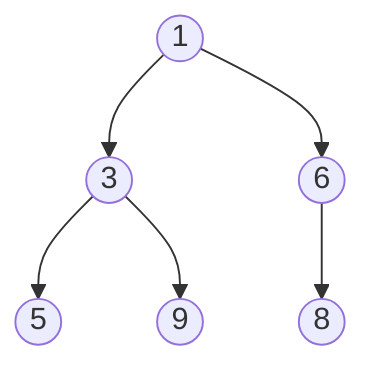

# Вопросы на собеседовании: `Кучи (Heaps)`

Куча — основа `PriorityQueue` в Java и классических задач: top-K, median in stream, Dijkstra, scheduler. На интервью важно знать heap-property, как работает `heapify`, `siftUp`/`siftDown`, и почему `build-heap` — `O(n)`, а не `O(n log n)`.

## Полезные ссылки

### Официальная документация и авторитетные источники

- [Java PriorityQueue — Baeldung](https://www.baeldung.com/java-priorityqueue)
- [Heap Sort in Java — Baeldung](https://www.baeldung.com/java-heap-sort)
- [Min Heap Implementation — Baeldung](https://www.baeldung.com/cs/binary-heap-vs-binary-search-tree)
- [PriorityQueue (Java) — Oracle Docs](https://docs.oracle.com/en/java/javase/17/docs/api/java.base/java/util/PriorityQueue.html)
- [Fibonacci Heap — Wikipedia](https://en.wikipedia.org/wiki/Fibonacci_heap)

## Содержание

- [Полезные ссылки](#полезные-ссылки)
- [See also](#see-also)

**Базовые понятия**
- [Q1. (!) Что такое heap (куча)?](#q1--что-такое-heap-куча)
- [Q2. (!) Чем min-heap отличается от max-heap?](#q2--чем-min-heap-отличается-от-max-heap)
- [Q3. (!) Чем heap отличается от BST?](#q3--чем-heap-отличается-от-bst)
- [Q4. Какие виды heap бывают?](#q4-какие-виды-heap-бывают)

**Реализация**
- [Q5. (!) Как хранить heap в массиве?](#q5--как-хранить-heap-в-массиве)
- [Q6. (!) Что такое siftUp и siftDown?](#q6--что-такое-siftup-и-siftdown)
- [Q7. (!) Как строится heap из массива (buildHeap)?](#q7--как-строится-heap-из-массива-buildheap)
- [Q8. (!) Почему buildHeap — это O(n), а не O(n log n)?](#q8--почему-buildheap--это-on-а-не-on-log-n)

**Операции**
- [Q9. (!) Сложности операций heap?](#q9--сложности-операций-heap)
- [Q10. Как удалить произвольный элемент из heap?](#q10-как-удалить-произвольный-элемент-из-heap)
- [Q11. Decrease-key и increase-key — что это?](#q11-decrease-key-и-increase-key--что-это)
- [Q12. Heap merge — слияние двух куч?](#q12-heap-merge--слияние-двух-куч)

**PriorityQueue в Java**
- [Q13. (!) Как создать min-heap и max-heap в Java?](#q13--как-создать-min-heap-и-max-heap-в-java)
- [Q14. (!) Что внутри Java PriorityQueue?](#q14--что-внутри-java-priorityqueue)
- [Q15. Какие сложности у методов PriorityQueue?](#q15-какие-сложности-у-методов-priorityqueue)
- [Q16. Является ли итерация по PriorityQueue упорядоченной?](#q16-является-ли-итерация-по-priorityqueue-упорядоченной)
- [Q17. (!) PriorityQueue thread-safe? Какие альтернативы?](#q17--priorityqueue-thread-safe-какие-альтернативы)

**Heap Sort**
- [Q18. (!) Алгоритм Heap Sort?](#q18--алгоритм-heap-sort)
- [Q19. Почему Heap Sort O(n log n) во всех случаях?](#q19-почему-heap-sort-on-log-n-во-всех-случаях)

**Классические задачи**
- [Q20. (!) K-ый наибольший элемент в массиве?](#q20--k-ый-наибольший-элемент-в-массиве)
- [Q21. (!) Top K Frequent Elements?](#q21--top-k-frequent-elements)
- [Q22. (!) Median from Data Stream — два heap'а?](#q22--median-from-data-stream--два-heapа)
- [Q23. (!) Слияние K отсортированных списков?](#q23--слияние-k-отсортированных-списков)
- [Q24. K Closest Points to Origin?](#q24-k-closest-points-to-origin)
- [Q25. Task Scheduler — минимальное время с cooldown?](#q25-task-scheduler--минимальное-время-с-cooldown)
- [Q26. Reorganize String — без двух одинаковых подряд?](#q26-reorganize-string--без-двух-одинаковых-подряд)

**Продвинутые темы**
- [Q27. Что такое Fibonacci heap?](#q27-что-такое-fibonacci-heap)
- [Q28. Что такое pairing heap?](#q28-что-такое-pairing-heap)
- [Q29. Когда heap проигрывает другим структурам?](#q29-когда-heap-проигрывает-другим-структурам)

## Q1. (!) Что такое heap (куча)?

**Heap** — полное (complete) бинарное дерево с **heap-property**:
- **Min-heap:** значение каждого узла ≤ значений его детей (минимум — корень)
- **Max-heap:** значение каждого узла ≥ значений его детей (максимум — корень)



Это **полное** дерево — все уровни заполнены, последний — слева направо. Поэтому heap идеально хранится в массиве.

**Применения:**
- Priority queues (планировщики, A*, Dijkstra)
- Top-K задачи
- Heap Sort
- Median maintenance (два heap'а)
- Kafka, OS schedulers, Linux CFS


> [!mcq] Что такое heap (куча) с точки зрения структуры и инварианта?
>
> - [x] A. Полное (complete) бинарное дерево с heap-property: для каждого узла его значение упорядочено относительно детей (минимум в корне для min-heap или максимум — для max-heap).
>
>     **Развёрнутое объяснение.** Heap — это complete binary tree (все уровни заполнены, последний — слева направо без пропусков), где работает локальный инвариант parent ⪯ children. Глобального порядка между «братьями» и поддеревьями нет, поэтому inorder-обход даёт не отсортированную последовательность. Благодаря compactness структура хранится в массиве без указателей: `parent = (i-1)/2`, `left = 2i+1`, `right = 2i+2`. Стандартные асимптотики: `peek()` за `O(1)`, `insert` и `extractMin/Max` за `O(log n)`, `buildHeap` за `O(n)`. Поиск произвольного элемента — `O(n)`, так как heap не сортирован глобально.
>
>     **Пример.** Java `PriorityQueue<Integer>` по умолчанию — min-heap на массиве: `pq.offer(3); pq.offer(1); pq.offer(2); pq.peek();` вернёт `1` за `O(1)`. Тот же массив `[1,3,2]` хранит дерево с корнем `1` и детьми `3, 2`.
>
>     **Когда применять.** Priority queues (Dijkstra, A*, OS scheduler — Linux CFS), top-K задачи (top-K largest/smallest за `O(n log k)`), heap sort, median maintenance через два heap'а, Kafka delayed-producer.
>
>     **Подводные камни.** Heap не сохраняет порядок между братьями — нельзя «обойти отсортированно» без destructive `poll()` всех элементов. Итератор `PriorityQueue.iterator()` возвращает элементы в порядке хранения массива, не по приоритету.
>
>     **Связанные вопросы.** [[heaps-interview#Q3]] heap vs BST; [[heaps-interview#Q5]] хранение в массиве; [[heaps-interview#Q9]] сложности операций.
>
> - [ ] B. Двоичное дерево поиска (BST), где левое поддерево меньше корня, а правое — больше.
>
>     **Что на самом деле.** Это определение BST, не heap. BST поддерживает глобальный порядок: inorder-обход даёт отсортированную последовательность, поиск произвольного элемента — `O(log n)` для сбалансированного. Heap гарантирует только parent ↔ child, и поиск произвольного — `O(n)`.
>
>     **Откуда путаница.** Оба — деревья, оба часто появляются в одном разделе «деревья и кучи». Java `TreeMap` (Red-Black BST) и `PriorityQueue` (heap) синтаксически похожи в API, что усиливает смешение.
>
>     **Если бы это было правдой.** Heap позволял бы `contains(x)` за `O(log n)`, но `PriorityQueue.contains` — `O(n)`; код, опирающийся на «быстрый поиск в heap», деградировал бы до `O(n²)` при массовых проверках.
>
>     **Как было бы правильно.** Признать, что heap — complete tree с локальным parent-child инвариантом, а BST — отдельная структура с глобальным порядком и `O(log n)` поиском.
>
> - [ ] C. Сбалансированное дерево, где разница высот поддеревьев не больше единицы.
>
>     **Что на самом деле.** Это определение AVL-дерева (или близких сбалансированных BST: Red-Black, Treap). Heap действительно сбалансирован по высоте, но как следствие completeness, а не как определяющее свойство. Heap-property — про порядок значений, а не про разницу высот.
>
>     **Откуда путаница.** Complete tree всегда имеет высоту `⌈log₂(n+1)⌉` и визуально похож на сбалансированное — учебники часто путают «сбалансированный по высоте» с «полный».
>
>     **Если бы это было правдой.** Heap нужно было бы перебалансировать при вставке/удалении ротациями (как AVL), что добавило бы константный overhead и потребовало хранить высоту в каждом узле — но heap всё это не делает, обходясь линейным siftUp/siftDown.
>
>     **Как было бы правильно.** Описать heap через completeness (заполнение по уровням слева направо) + heap-property, а AVL-балансировку оставить для BST-семейства.
>
> - [ ] D. Структура для быстрого поиска по произвольному ключу с амортизированной сложностью `O(1)`.
>
>     **Что на самом деле.** Это описание hash table (`HashMap` в Java). Heap не предназначен для поиска по ключу — это `O(n)`. Heap оптимизирован под доступ к min/max за `O(1)` и их извлечение за `O(log n)`.
>
>     **Откуда путаница.** И heap, и hash table — «быстрые» структуры с какими-то `O(1)` операциями, и middle путает «быстрый peek min» с «быстрый lookup по ключу».
>
>     **Если бы это было правдой.** Можно было бы строить indexed priority queue одним heap'ом без дополнительного `Map<key, index>`, но именно потому что heap не даёт `O(1)` lookup, в реальных Dijkstra-реализациях держат параллельный `Map`.
>
>     **Как было бы правильно.** Признать, что heap даёт `O(1)` только на корень (min/max), а произвольный lookup требует hash table или BST поверх.

## Q2. (!) Чем min-heap отличается от max-heap?

Только **направлением** heap-property:
- **Min-heap:** корень — минимум; быстрый доступ к минимуму за `O(1)`
- **Max-heap:** корень — максимум; быстрый доступ к максимуму за `O(1)`

В Java по умолчанию `PriorityQueue` — **min-heap**:

```java
PriorityQueue<Integer> minHeap = new PriorityQueue<>();
minHeap.offer(3); minHeap.offer(1); minHeap.offer(2);
minHeap.peek(); // 1

PriorityQueue<Integer> maxHeap = new PriorityQueue<>(Comparator.reverseOrder());
maxHeap.offer(3); maxHeap.offer(1); maxHeap.offer(2);
maxHeap.peek(); // 3
```

Один из них можно реализовать через другой, инвертируя сравнение или знаки чисел.


> [!mcq] Чем именно min-heap отличается от max-heap?
>
> - [ ] A. Структурой хранения: min-heap всегда хранится в массиве, max-heap — в связном списке узлов.
>
>     **Что на самом деле.** Структура хранения идентична: оба binary heap'а — это массив (`Object[]` в `PriorityQueue`). Тип определяется только направлением сравнения, а способ хранения — деталь имплементации, общая для обоих.
>
>     **Откуда путаница.** В учебниках max-heap часто рисуют через явные узлы и стрелки (для heap sort), а min-heap — как priority queue на массиве, и студенты переносят это на представление структуры.
>
>     **Если бы это было правдой.** Max-heap терял бы `O(1)` доступ к корню (нужно было бы идти по указателям) и cache locality просаживалась бы в 2–3 раза — но `PriorityQueue` с `Comparator.reverseOrder()` работает ровно с той же скоростью, что и default min-heap.
>
>     **Как было бы правильно.** Признать, что оба используют один и тот же массив-backend, и переключаются исключительно компаратором.
>
> - [x] D. Направлением heap-property: в min-heap parent ≤ children (минимум в корне), в max-heap parent ≥ children (максимум в корне).
>
>     **Развёрнутое объяснение.** Это единственное концептуальное различие. Структурно оба — complete binary tree, оба обычно хранятся в массиве, оба имеют идентичные асимптотики: `O(log n)` для `insert`/`extractMin/Max`, `O(1)` для `peek`, `O(n)` для `buildHeap`. Любой min-heap превращается в max-heap инверсией компаратора (или хранением `-x`). Часто это используется как трюк: «вставлять `-x` в min-heap» — дешевле, чем писать кастомный компаратор.
>
>     **Пример.** В Java `new PriorityQueue<Integer>()` — min-heap по умолчанию, `peek()` после `offer(3); offer(1); offer(2)` вернёт `1`. `new PriorityQueue<>(Comparator.reverseOrder())` — max-heap, `peek()` вернёт `3`.
>
>     **Когда применять.** Min-heap — Dijkstra (минимальная дистанция), event loop (ближайший дедлайн), top-K largest (heap размера K хранит K крупнейших, корень — k-й). Max-heap — top-K smallest (симметрично), heap sort по возрастанию (извлекаем максимум в конец), median maintenance (нижняя половина).
>
>     **Подводные камни.** При инверсии знаков `-x` для эмуляции max-heap через min-heap легко напороться на overflow для `Integer.MIN_VALUE` (`-Integer.MIN_VALUE == Integer.MIN_VALUE`). Безопаснее использовать `Comparator.reverseOrder()`.
>
>     **Связанные вопросы.** [[heaps-interview#Q13]] min/max в Java; [[heaps-interview#Q18]] Heap Sort; [[heaps-interview#Q22]] median через два heap'а.
>
> - [ ] C. Асимптотическими сложностями операций: min-heap работает за `O(log n)`, max-heap — за `O(n)`.
>
>     **Что на самом деле.** Асимптотики идентичны: обе разновидности — это одна и та же структура с инвертированным сравнением. `insert`, `extractMin/Max` — `O(log n)`, `peek` — `O(1)`. Разница в производительности — миф.
>
>     **Откуда путаница.** Студенты, видя heap sort с max-heap (in-place извлечение в конец массива), могут путать общий цикл `n × siftDown` с асимптотикой одной операции и приписывать max-heap'у замедление.
>
>     **Если бы это было правдой.** Использование `Comparator.reverseOrder()` приводило бы к деградации `PriorityQueue` на порядок — но микробенчмарки JMH показывают одинаковую скорость insert/poll для default и reversed компараторов.
>
>     **Как было бы правильно.** Признать, что выбор min/max диктуется задачей (Dijkstra → min, top-K largest → max), а не различием в скорости.
>
> - [ ] B. Применением: min-heap нужен только для приоритетных очередей, max-heap — исключительно для сортировки.
>
>     **Что на самом деле.** Оба применяются и там, и там. Priority queue может быть любого направления (min — Dijkstra, max — high-priority-first scheduler). Heap sort использует max-heap для сортировки по возрастанию, но симметрично работает с min-heap для убывания.
>
>     **Откуда путаница.** Классический алгоритм heap sort из CLRS объясняется через max-heap, а PriorityQueue в Java дефолтно min-heap — двое канонических примеров создают ложную дихотомию.
>
>     **Если бы это было правдой.** Невозможно было бы решать «top-K smallest» через max-heap размера K (стандартный шаблон) — но именно этот приём широко используется в LeetCode-задачах вроде Top K Frequent.
>
>     **Как было бы правильно.** Признать, что выбор направления — функция задачи: что важнее извлекать первым (минимум или максимум), то и кладём в корень.

## Q3. (!) Чем heap отличается от BST?

| Критерий | Heap | BST |
|----------|------|-----|
| Порядок | Только parent ↔ child | Полный (left < root < right) |
| Поиск произвольного | `O(n)` | `O(log n)` для сбалансированного |
| `findMin/Max` | `O(1)` | `O(log n)` |
| `insert` | `O(log n)` | `O(log n)` |
| `deleteMin/Max` | `O(log n)` | `O(log n)` |
| Inorder обход | Не отсортирован | Отсортирован |
| Память | Массив (компактно) | Узлы (overhead) |
| Применение | Priority queue, top-K | Отсортированная структура, range queries |

Heap **не сохраняет** глобальный порядок — гарантирует только parent ↔ child. Поэтому inorder обход heap'а — мусор.


> [!mcq] В чём ключевое различие между heap и BST?
>
> - [ ] A. Heap — это разновидность BST с улучшенной балансировкой и теми же операциями над ключами.
>
>     **Что на самом деле.** Heap не является BST. BST поддерживает глобальный порядок (left < root < right), heap — только локальный parent ↔ child. Поиск произвольного элемента в BST — `O(log n)`, в heap — `O(n)`. Inorder-обход BST отсортирован, heap — нет.
>
>     **Откуда путаница.** Оба «двоичные деревья», оба часто реализуются как «бинарные деревья поиска» в начальных курсах. У heap-узлов есть «левый» и «правый» ребёнок, что внешне похоже на BST.
>
>     **Если бы это было правдой.** `PriorityQueue.contains(x)` работал бы за `O(log n)`, и indexed heap для Dijkstra не требовал бы параллельной hash table — но в реальности `PriorityQueue` с миллионом элементов выполняет `contains` за миллисекунды линейно.
>
>     **Как было бы правильно.** Признать, что heap и BST — параллельные структуры с разной силой порядка, а не наследники.
>
> - [ ] B. BST быстрее во всех операциях, поэтому heap используется только из-за простоты реализации.
>
>     **Что на самом деле.** Heap быстрее BST в своих ключевых операциях: `findMin/Max` — `O(1)` vs `O(log n)` (BST требует спуска влево), `buildHeap` — `O(n)` vs `O(n log n)` для построения BST вставками. Heap также компактнее (массив без указателей) и имеет лучшую cache locality.
>
>     **Откуда путаница.** BST «универсальнее» (поддерживает range queries, sorted iteration), и студенты переносят универсальность на скорость.
>
>     **Если бы это было правдой.** Никто не использовал бы `PriorityQueue` — все писали бы `TreeMap` — но Dijkstra, A*, Kafka scheduler, OS task queue выбраны на heap'е именно из-за скорости peek/poll.
>
>     **Как было бы правильно.** Признать, что heap и BST — разные ниши: heap выигрывает в priority queue / top-K / heap sort, BST — в lookup / range / sorted iteration.
>
> - [x] C. Heap гарантирует только parent ↔ child порядок (быстрый min/max за `O(1)`), BST — глобальный порядок (быстрый поиск, range queries, сортированный обход).
>
>     **Развёрнутое объяснение.** Ключевое различие — сила порядка. Heap: локальный инвариант parent ⪯ children. `findMin/Max` — `O(1)` (корень), `insert`/`extract` — `O(log n)`, поиск произвольного — `O(n)`, inorder-обход — не отсортирован. BST: глобальный порядок left < root < right. Поиск, insert, delete — `O(log n)` для сбалансированного (AVL, Red-Black), `O(n)` в худшем случае для несбалансированного. Inorder-обход BST отсортирован, что даёт range queries `[lo..hi]`, successor/predecessor.
>
>     **Пример.** Если нужен Dijkstra на графе с `V = 10⁶` вершин — `PriorityQueue<Edge>` (heap) даёт `O((V+E) log V)`, `peek` за `O(1)` на каждой итерации. Если нужен «все события в диапазоне `[start..end]`» — `TreeMap.subMap(start, end)` (BST) даёт `O(log n + k)`.
>
>     **Когда применять.** Heap — priority queue (Dijkstra, A*, scheduler), top-K (heap размера K), heap sort, median maintenance. BST (через `TreeMap`/`TreeSet`) — sorted iteration, range queries, ceiling/floor для timeline-индексов, expiring caches с `pollFirstEntry`.
>
>     **Подводные камни.** `TreeMap` имеет константу overhead на узел (~48 байт на JVM 64-bit с compressed oops), heap — только массив. Для миллиона `Integer`-элементов разница в памяти ~5×. С другой стороны, у `TreeMap` стабильный ordered iterator, у `PriorityQueue` — нет.
>
>     **Связанные вопросы.** [[heaps-interview#Q1]] определение heap; [[heaps-interview#Q9]] сложности heap; [[trees-interview#Q5]] BST-балансировка.
>
> - [ ] D. Heap и BST идентичны по функциональности, различаются только синтаксисом API.
>
>     **Что на самом деле.** Разные асимптотические гарантии и разные сценарии. Heap не умеет `O(log n)` найти «есть ли элемент X» — это `O(n)`. BST не даёт `O(1)` доступ к минимуму без дополнительного указателя (`TreeMap.firstKey()` — `O(log n)`).
>
>     **Откуда путаница.** Оба структуры доступны в `java.util` и оба «упорядоченные», поэтому в шапке IDE документации они выглядят взаимозаменяемыми.
>
>     **Если бы это было правдой.** Можно было бы выбирать структуру по эстетике API — но Dijkstra на `TreeMap` будет в 1.5–2× медленнее, чем на `PriorityQueue`, из-за overhead узлов и ротаций.
>
>     **Как было бы правильно.** Признать, что heap и BST — структуры с разной семантикой, и выбирать нужно по требованиям: peek min vs range query.

## Q4. Какие виды heap бывают?

| Тип | Структура | Insert | DeleteMin | DecreaseKey | Merge |
|-----|-----------|--------|-----------|-------------|-------|
| **Binary heap** | Массив | `O(log n)` | `O(log n)` | `O(log n)` | `O(n)` |
| **d-ary heap** | Массив (d детей) | `O(log_d n)` | `O(d · log_d n)` | — | — |
| **Binomial heap** | Лес деревьев | `O(log n)` | `O(log n)` | `O(log n)` | `O(log n)` |
| **Fibonacci heap** | Лес деревьев | `O(1)` амортиз. | `O(log n)` амортиз. | `O(1)` амортиз. | `O(1)` |
| **Pairing heap** | Многонаправленное | `O(1)` | `O(log n)` амортиз. | `O(log n)`* | `O(1)` |
| **Leftist heap** | Связное | `O(log n)` | `O(log n)` | — | `O(log n)` |
| **Skew heap** | Связное | `O(log n)` амортиз. | — | — | `O(log n)` амортиз. |

В **Java** `PriorityQueue` — стандартный **binary heap**.


> [!mcq] Какой тип heap используется в `java.util.PriorityQueue` и в чём его компромиссы?
>
> - [ ] A. Fibonacci heap — единственный production-ready heap, поэтому JDK выбрал именно его.
>
>     **Что на самом деле.** В JDK `PriorityQueue` реализован как binary heap на массиве — простой и быстрый на практике. Fibonacci heap в JDK вообще нет; он требует сложной реализации (mark-bits, lazy consolidation), даёт `O(1)` амортизированный `insert/decreaseKey/merge`, но проигрывает binary heap на mainstream-нагрузке из-за больших констант и плохой cache locality.
>
>     **Откуда путаница.** В курсах по алгоритмам Fibonacci heap преподают как «теоретически лучший», и студенты переносят это на «лучший в production».
>
>     **Если бы это было правдой.** Каждый `pq.offer(x)` создавал бы новый узел через `new Node()`, генерируя сотни мегабайт garbage в секунду при высоком QPS — но обычный `PriorityQueue` отлично работает в Kafka producer и Netty event loop.
>
>     **Как было бы правильно.** Указать binary heap как production default и упомянуть Fibonacci лишь как теоретический optimum для алгоритмов с интенсивным decreaseKey.
>
> - [x] B. Binary heap на массиве — стандартная реализация в Java; даёт `O(log n)` insert/extract, `O(1)` peek, `O(n)` build, отлично укладывается в кеш.
>
>     **Развёрнутое объяснение.** Binary heap — каноническая структура: complete binary tree, индексы `parent = (i-1)/2`, `left = 2i+1`, `right = 2i+2`. Бывают вариации: d-ary heap (каждый узел имеет `d` детей; insert быстрее `O(log_d n)`, extract медленнее `O(d · log_d n)`), binomial heap (лес деревьев, merge `O(log n)`), Fibonacci/pairing heap (продвинутые амортизированные сложности, merge `O(1)`), leftist/skew heap (для частых merge). В JDK выбран binary heap из-за простоты, отсутствия указателей и хорошей константы.
>
>     **Пример.** `PriorityQueue<Integer>` хранит `Object[] queue` — массив `Integer`. `offer(5)` кладёт в `queue[size]`, делает siftUp; `poll()` возвращает `queue[0]`, ставит последний на корень, делает siftDown.
>
>     **Когда применять.** Default-выбор для priority queue в Java/C++ STL. d-ary heap (обычно 4-ary) — когда insert'ов значительно больше, чем extract'ов (например, Dijkstra на плотных графах). Fibonacci/pairing — академические/специализированные случаи.
>
>     **Подводные камни.** Binary heap не поддерживает `O(log n)` merge — это `O(n + m)` через `buildHeap`. Для частого слияния heap'ов (например, в k-way merge с динамическим объединением источников) нужен binomial/leftist/Fibonacci heap.
>
>     **Связанные вопросы.** [[heaps-interview#Q14]] внутренности `PriorityQueue`; [[heaps-interview#Q12]] heap merge; [[heaps-interview#Q27]] Fibonacci heap.
>
> - [ ] C. d-ary heap с `d = 16` — потому что современные процессоры читают cache line по 16 указателей за раз.
>
>     **Что на самом деле.** JDK использует обычный binary heap (d=2). d-ary heap — отдельная вариация, не дефолт. Хотя 4-ary heap иногда быстрее на практике из-за cache locality (CLRS даже даёт оценку), JDK эту оптимизацию не делает.
>
>     **Откуда путаница.** Существуют HPC-библиотеки и кастомные имплементации (Boost C++, некоторые Rust crates) с 4-ary или 8-ary heap, и кто-то приписывает это поведение JDK.
>
>     **Если бы это было правдой.** `2i+1` индексация в `PriorityQueue.siftUp` не работала бы — нужно было бы 16 формул `16*i + 1..16` — но в исходниках OpenJDK ровно `parent = (i - 1) >>> 1`.
>
>     **Как было бы правильно.** Признать, что JDK реализует binary heap, и d-ary heap — вариация, доступная в сторонних библиотеках.
>
> - [ ] D. Skew heap — самонастраивающаяся структура без явного балансира, поэтому она и стала default в JDK.
>
>     **Что на самом деле.** Skew heap — pointer-based структура, ориентированная на быстрый `merge` за `O(log n)` амортизированно, без поддержки decreaseKey. В JDK её нет; она требует узлов с указателями и плохо использует кеш.
>
>     **Откуда путаница.** Термин «самобалансирующийся» (как у Red-Black BST) ассоциируется с надёжностью и переносится на heap-варианты, хотя у binary heap балансировки в этом смысле нет — он balanced by construction.
>
>     **Если бы это было правдой.** Тогда `PriorityQueue` имел бы метод `merge(PriorityQueue)` за `O(log n)` — но единственный способ слить в JDK — это `addAll`, который выполняет `m × O(log(n+m))` = `O(m log(n+m))`.
>
>     **Как было бы правильно.** Признать, что для частого merge нужен specialized heap (leftist, skew, binomial, Fibonacci), а binary heap в JDK — компромисс между простотой и скоростью обычных операций.

## Q5. (!) Как хранить heap в массиве?

Полное дерево хранится без пропусков:

```
Индекс:   0  1  2  3  4  5  6
Значение: 1  3  6  5  9  8  ?

         [0]
        /   \
      [1]   [2]
      / \   /
    [3] [4][5]
```

Для узла на индексе `i`:
- **Parent:** `(i - 1) / 2`
- **Left child:** `2i + 1`
- **Right child:** `2i + 2`

Корень — `arr[0]`. Никаких указателей, отличная локальность кеша.


> [!mcq] Как для узла на индексе `i` в массиве-heap'е вычислить родителя и детей?
>
> - [x] A. `parent = (i - 1) / 2`, `left = 2*i + 1`, `right = 2*i + 2`; корень — `arr[0]`.
>
>     **Развёрнутое объяснение.** Для 0-индексированного массива (как Java/C++) формулы выводятся из свойства complete tree: уровень `k` начинается с индекса `2^k - 1` и содержит `2^k` узлов. Узел `i` имеет детей на позициях `2i+1` (left) и `2i+2` (right), а его родитель — на `(i-1)/2` (целочисленное деление). Эти формулы дают компактное хранение без указателей и отличную cache locality: при siftDown процессор префетчит cache line с обоими детьми сразу. Для 1-индексированной версии (как в CLRS) формулы проще: `parent = i/2`, `left = 2i`, `right = 2i+1`.
>
>     **Пример.** Heap `[1, 3, 6, 5, 9, 8]`: узел `3` на индексе `1` имеет родителя `arr[(1-1)/2] = arr[0] = 1`, детей `arr[3]=5` и `arr[4]=9`.
>
>     **Когда применять.** Любая реализация binary heap на массиве: `PriorityQueue` в JDK, `std::priority_queue` в C++, `heapq` в Python, OS schedulers, Dijkstra с array-heap.
>
>     **Подводные камни.** При больших `i` (~`Integer.MAX_VALUE / 2`) `2*i + 1` переполняется. JDK защищается через `MAX_ARRAY_SIZE = Integer.MAX_VALUE - 8` и проверки в `grow()`. Также для 1-индексированной версии формула отличается — путать формулы из CLRS с реализацией на 0-base — частая ошибка.
>
>     **Связанные вопросы.** [[heaps-interview#Q1]] определение heap; [[heaps-interview#Q6]] siftUp/siftDown; [[heaps-interview#Q7]] buildHeap.
>
> - [ ] B. `parent = i / 2`, `left = 2*i`, `right = 2*i + 1`; корень — `arr[1]`.
>
>     **Что на самом деле.** Это формулы для 1-индексированного массива (как в CLRS). В Java и C++ массивы 0-индексированные, и применение этих формул сместит всё на единицу: узел `0` будет «родителем сам себя» (`0/2 = 0`), а левый ребёнок корня окажется `arr[0]` вместо `arr[1]`.
>
>     **Откуда путаница.** CLRS — каноническая книга по алгоритмам — использует 1-индексацию для удобства формул. Студенты заучивают именно эти формулы и переносят их в код буквально.
>
>     **Если бы это было правдой.** Java-реализация heap с этими формулами на пустом массиве при первом `offer(x)` ушла бы в бесконечную рекурсию (узел `0` — свой собственный родитель), либо просто давала бы IndexOutOfBoundsException при `2*0 = 0`.
>
>     **Как было бы правильно.** Признать, что для 0-индексации формулы сдвигаются: `parent = (i-1)/2`, `left = 2i+1`, `right = 2i+2` — именно так в OpenJDK `PriorityQueue`.
>
> - [ ] C. `parent = i - 1`, `left = i + 1`, `right = i + 2` — heap-property поддерживается линейной зависимостью.
>
>     **Что на самом деле.** Эти формулы описывают связный список, а не дерево. У узла должно быть два ребёнка в discrete-bin-tree смысле, и они располагаются на следующем уровне (индексы экспоненциально дальше).
>
>     **Откуда путаница.** Линейная индексация выглядит «проще» и иногда возникает в naive псевдокоде, особенно если автор путает heap с очередью.
>
>     **Если бы это было правдой.** Высота heap'а с `n` элементами была бы `n` (линейная), и `siftUp` работал бы `O(n)` вместо `O(log n)` — heap деградировал бы в `insertion sort`.
>
>     **Как было бы правильно.** Использовать экспоненциальные формулы `2i+1, 2i+2`, которые отражают удвоение числа узлов на каждом уровне complete tree.
>
> - [ ] D. Дочерние индексы вычислять не нужно — каждый узел хранит явные указатели `leftChild` и `rightChild` через `Node` объекты.
>
>     **Что на самом деле.** Это описывает pointer-based heap (например, leftist или Fibonacci), но не array-based binary heap, которым реально является `PriorityQueue` в JDK. Главная фишка array-heap'а — отсутствие указателей и компактность.
>
>     **Откуда путаница.** Все остальные деревья в Java (`TreeMap`, `LinkedList` как «дерево из одной ветки», AST в Parsers) хранятся через `Node` с указателями, и middle переносит этот паттерн на heap.
>
>     **Если бы это было правдой.** `PriorityQueue<Integer>` с миллионом элементов потреблял бы 48 байт × 10⁶ = 48 МБ только на узлы (`Node` overhead в 64-bit JVM) — но фактически уходит ~16 МБ (массив `Integer`-боксов).
>
>     **Как было бы правильно.** Признать, что binary heap на массиве — реализация по умолчанию в JDK, и индексы детей вычисляются арифметически, без указателей.

## Q6. (!) Что такое siftUp и siftDown?

Это две операции восстановления heap-property:

**siftUp (bubble up):** при вставке нового элемента в конец, поднимаем его наверх, пока он меньше родителя (для min-heap).

```java
void siftUp(int[] heap, int i) {
    while (i > 0) {
        int parent = (i - 1) / 2;
        if (heap[i] < heap[parent]) {
            swap(heap, i, parent);
            i = parent;
        } else break;
    }
}
```

**siftDown (heapify):** при удалении корня, ставим последний элемент на место корня и опускаем его вниз, пока он больше детей.

```java
void siftDown(int[] heap, int size, int i) {
    while (true) {
        int left = 2 * i + 1;
        int right = 2 * i + 2;
        int smallest = i;
        if (left < size && heap[left] < heap[smallest]) smallest = left;
        if (right < size && heap[right] < heap[smallest]) smallest = right;
        if (smallest == i) break;
        swap(heap, i, smallest);
        i = smallest;
    }
}
```

Обе операции — `O(log n)`.


> [!mcq] Какая операция используется при `offer(x)` в `PriorityQueue` и почему именно она?
>
> - [ ] A. siftDown от корня вниз: при вставке элемент кладётся в `queue[0]`, а старый корень опускается.
>
>     **Что на самом деле.** При `offer(x)` элемент добавляется в **конец** массива (на позицию `size`), затем выполняется siftUp — поднимаем его, пока он меньше родителя (для min-heap). Старый корень не трогаем. siftDown применяется при `poll()`, а не `offer()`.
>
>     **Откуда путаница.** «Вставка» интуитивно ассоциируется с «положить наверх», и студенты представляют новый элемент сразу у корня.
>
>     **Если бы это было правдой.** Каждая вставка двигала бы все элементы в среднем на половину высоты дерева — `O(n log n)` build и `O(log n)` на одну вставку, но с гораздо большей константой.
>
>     **Как было бы правильно.** Положить элемент в конец и сделать siftUp — стандартная схема `O(log n)` insert.
>
> - [x] B. siftUp от конца к корню: новый элемент кладётся в `queue[size]`, затем поднимается обменом с родителем, пока меньше его (для min-heap).
>
>     **Развёрнутое объяснение.** siftUp (он же bubble-up, percolate-up) восстанавливает heap-property после вставки в конец. Алгоритм: `parent = (i-1)/2`; пока `queue[i] < queue[parent]` — `swap`, `i = parent`; иначе stop. Симметрично siftDown (heapify, percolate-down) применяется после извлечения корня: ставим последний элемент в `queue[0]` и опускаем его, сравнивая с **меньшим** из детей. Обе операции работают за `O(log n)` — длину пути от листа до корня в complete tree. siftUp проще siftDown, потому что у узла один родитель, а детей — двое (приходится сравнивать с обоими и выбирать меньший).
>
>     **Пример.** Min-heap `[1, 3, 6, 5, 9]`, вставляем `2`: кладём в конец `[1, 3, 6, 5, 9, 2]`, индекс `5`. siftUp: `parent = 2`, `arr[5]=2 < arr[2]=6` → swap → `[1, 3, 2, 5, 9, 6]`. Теперь `i=2`, `parent = 0`, `arr[2]=2 > arr[0]=1` → stop.
>
>     **Когда применять.** siftUp — при `offer`/`insert`. siftDown — при `poll`/`extract` и в `buildHeap` (идём от середины к началу). Обе нужны при «двунаправленной» модификации в `remove(Object)`: после замены последним элементом неясно — стало больше или меньше родителя, делаем обе.
>
>     **Подводные камни.** При работе с пользовательскими `Comparator` ошибочный `compareTo` (нарушающий transitivity) приводит к нарушению heap-property — siftUp/siftDown «зависают» в локальном минимуме, и `poll` начинает возвращать неверный порядок без exception.
>
>     **Связанные вопросы.** [[heaps-interview#Q5]] индексы parent/children; [[heaps-interview#Q7]] buildHeap; [[heaps-interview#Q14]] внутренности `PriorityQueue`.
>
> - [ ] C. Прямая вставка в нужную позицию через binary search по массиву — `O(log n)`.
>
>     **Что на самом деле.** Heap **не сортирован глобально**, поэтому binary search по массиву невозможен — он работает только на отсортированных массивах. siftUp работает по дереву (parent ↔ child), а не по массиву.
>
>     **Откуда путаница.** Слово «log n» в сложности heap insert вызывает ассоциацию с binary search, который тоже `O(log n)`.
>
>     **Если бы это было правдой.** Можно было бы делать `contains(x)` за `O(log n)`, но в реальности это `O(n)` именно потому что массив не сортирован.
>
>     **Как было бы правильно.** Признать, что siftUp идёт вверх по дереву через родителей, а массив остаётся в heap-порядке, не глобально-сортированном.
>
> - [ ] D. Полный rebuild всего heap'а через `buildHeap` после каждой вставки — `O(n)`.
>
>     **Что на самом деле.** `buildHeap` нужен только при инициализации heap'а из существующего массива (например, в конструкторе `PriorityQueue(Collection)`). Для одиночной вставки достаточно siftUp за `O(log n)`.
>
>     **Откуда путаница.** Студенты, увидев, что `buildHeap` — `O(n)`, иногда применяют его «универсально», не понимая, что он восстанавливает heap-property для **массива произвольных значений**, а не для уже-почти-валидного heap'а после одной вставки.
>
>     **Если бы это было правдой.** Вставка `n` элементов в heap была бы `O(n²)` вместо `O(n log n)` (или `O(n)` через `buildHeap` после bulk-добавления) — Kafka producer с миллионом сообщений в секунду деградировал бы до тысяч.
>
>     **Как было бы правильно.** Использовать siftUp `O(log n)` для одиночной вставки и `buildHeap` `O(n)` только для инициализации из готового массива.

## Q7. (!) Как строится heap из массива (buildHeap)?

```java
void buildHeap(int[] arr) {
    int n = arr.length;
    // Идём с последнего внутреннего узла к корню
    for (int i = n / 2 - 1; i >= 0; i--) {
        siftDown(arr, n, i);
    }
}
```

**Внутренние узлы** — индексы от `n/2 - 1` до `0`. Листья (`n/2` до `n - 1`) уже валидны как одноузловые heap'ы.

`O(n)` — лучше наивного `O(n log n)` через `n` insert'ов.


> [!mcq] С какого индекса и в каком направлении выполняется `buildHeap` поверх произвольного массива?
>
> - [ ] A. От `0` до `n-1`, выполняя siftUp для каждого элемента подряд.
>
>     **Что на самом деле.** Такой алгоритм работает (это последовательность из `n` insert'ов), но даёт `O(n log n)`, а не `O(n)`. Эффективный `buildHeap` идёт **от `n/2 - 1` до `0`** с siftDown, потому что нижние половины уже валидны как 1-элементные heap'ы.
>
>     **Откуда путаница.** Естественное направление чтения — слева направо, и интуиция говорит «начнём с начала и пойдём вперёд».
>
>     **Если бы это было правдой.** На массиве `n = 10⁶` `buildHeap` сделал бы 20 млн сравнений вместо 2 млн — критично для алгоритмов вроде heap sort.
>
>     **Как было бы правильно.** Начать с последнего внутреннего узла (`n/2 - 1`), идти к корню, применять siftDown — даёт `O(n)`.
>
> - [x] D. От `n/2 - 1` до `0`, применяя siftDown к каждому узлу; листья `(n/2 .. n-1)` уже валидны как одноузловые heap'ы.
>
>     **Развёрнутое объяснение.** Внутренние узлы — те, у которых есть хотя бы один ребёнок — занимают индексы `0..n/2-1` (для 0-base массива). Листья `n/2 .. n-1` сами по себе валидные heap'ы (один элемент). Идя снизу вверх и применяя siftDown к каждому внутреннему узлу, мы гарантируем, что к моменту обработки узла `i` оба его поддерева уже являются валидными heap'ами — поэтому одного siftDown достаточно. Общая сложность `O(n)`, а не `O(n log n)`, потому что большая часть работы — у листьев (много узлов, мало шагов).
>
>     **Пример.** Для массива `[9, 5, 8, 3, 1, 6]` (n=6), внутренние узлы: `i = 2, 1, 0`. siftDown(2): `arr[2]=8`, дети `arr[5]=6` — ничего не меняется. siftDown(1): `arr[1]=5`, дети `3, 1` → swap с `1` → `[9, 1, 8, 3, 5, 6]`. siftDown(0): `arr[0]=9`, меньший ребёнок `arr[1]=1` → swap → `[1, 9, 8, 3, 5, 6]`, далее `arr[1]=9` > `arr[3]=3` → swap → `[1, 3, 8, 9, 5, 6]`. Готово.
>
>     **Когда применять.** Конструктор `PriorityQueue(Collection)` — `O(n)` build вместо `O(n log n)`. Первая фаза heap sort. Перехеширование индексов в задачах вроде «найти все пары с разницей K» с предварительным построением.
>
>     **Подводные камни.** Если массив изменяется во время `buildHeap` (например, многопоточность), heap-property нарушится — `PriorityQueue.iterator().remove()` не безопасен при concurrent modification.
>
>     **Связанные вопросы.** [[heaps-interview#Q6]] siftDown; [[heaps-interview#Q8]] доказательство `O(n)`; [[heaps-interview#Q18]] heap sort.
>
> - [ ] C. От корня `0` до `n-1`, применяя siftDown на каждом узле.
>
>     **Что на самом деле.** Идти сверху вниз с siftDown некорректно: когда мы обрабатываем корень, его поддеревья ещё не являются валидными heap'ами, и siftDown «спускает» элемент в неправильное место, нарушая инвариант.
>
>     **Откуда путаница.** Симметричная путаница с правильным «снизу вверх» — направление кажется случайным.
>
>     **Если бы это было правдой.** Heap-property нарушалась бы: на массиве `[1, 9, 5, 8, 3]` siftDown(0) оставил бы `1` на месте (он уже минимум), но `9` в подкорне `arr[1]` так и осталось бы выше `8` и `3`.
>
>     **Как было бы правильно.** Начинать с нижних внутренних узлов и идти к корню — тогда siftDown к моменту обработки узла имеет валидные поддеревья.
>
> - [ ] B. От `0` до `n/2`, применяя siftUp — потому что для внутренних узлов хватает «поднять наверх».
>
>     **Что на самом деле.** siftUp перемещает узел вверх к корню, что не подходит для построения. Чтобы внутренний узел стал «вершиной» валидного heap'а, нужно опускать вниз неподходящие значения (siftDown), а не поднимать сам узел.
>
>     **Откуда путаница.** siftUp проще писать (один родитель vs два ребёнка), и студенты пытаются обойтись им.
>
>     **Если бы это было правдой.** На массиве `[9, 5, 8]` siftUp(2): `arr[2]=8`, parent `arr[0]=9`, swap → `[8, 5, 9]`. siftUp(1): `arr[1]=5 < arr[0]=8`, swap → `[5, 8, 9]`. Но ребёнок `arr[2]=9` всё ещё больше `arr[1]=8` — корректно. На большем массиве `[9, 5, 8, 3, 1]` siftUp на индексе `2` уже не достанет до уровня `arr[3], arr[4]`, и инвариант сломается.
>
>     **Как было бы правильно.** Применить siftDown снизу вверх по внутренним узлам — это и даёт `O(n)` build.

## Q8. (!) Почему buildHeap — это O(n), а не O(n log n)?

**Наивная оценка:** `n` siftDown вызовов × `O(log n)` = `O(n log n)`. Но это **завышено**.

**Точная оценка:** на уровне `k` (считая снизу) находится `n / 2^k` узлов, и каждый делает `O(k)` шагов siftDown. Сумма:

```
T(n) = ∑(k=0 до log n) (n / 2^k) · k
     = n · ∑(k / 2^k)
     ≤ n · 2          (геометрический ряд сходится)
     = O(n)
```

Большинство работы — внизу (много узлов, мало шагов), наверху (мало узлов, много шагов) — но и там немного.

Это база для **Heap Sort** — `O(n)` build + `O(n log n)` извлечение = `O(n log n)`.


> [!mcq] Почему точная асимптотика `buildHeap` через siftDown — это `O(n)`, а не `O(n log n)`?
>
> - [ ] A. Большинство siftDown'ов выполняются на корне — `O(log n)` работы каждый, итого `n log n / 2 = O(n log n)`.
>
>     **Что на самом деле.** Наоборот: большинство узлов — листья (или близкие к ним), и для них siftDown делает 0 или 1 шаг. Корней — один, и `O(log n)` тратится лишь на верхушку.
>
>     **Откуда путаница.** Поверхностный анализ «n узлов × log n высота = n log n» — это **верхняя граница**, но не точная. Реально работа неоднородно распределена по уровням.
>
>     **Если бы это было правдой.** Heap sort деградировал бы до `O(n log n)` уже на фазе build, что лишь немного хуже общей сложности — но конкретно build всё равно был бы заметно медленнее реального `O(n)`.
>
>     **Как было бы правильно.** Считать сумму `∑ (n/2^k) · k` по уровням, что сходится к `2n` и даёт `O(n)`.
>
> - [x] B. Сумма `∑ (n / 2^k) · k` для уровней `k = 0..log n` сходится к `2n` (геометрический ряд `∑ k / 2^k = 2`), большинство работы — внизу, где много узлов, но шагов мало.
>
>     **Развёрнутое объяснение.** На уровне `k` (считая снизу) находится `n / 2^k` узлов, и siftDown с этого уровня делает не более `k` шагов. Общая работа: `T(n) = ∑(k=0..log n) (n / 2^k) · k = n · ∑(k=1..log n) (k / 2^k)`. Известный геометрический ряд `∑(k=1..∞) k/2^k = 2` сходится, поэтому `T(n) ≤ 2n = O(n)`. Интуиция: на самом нижнем уровне `n/2` листьев с 0 шагов работы, на втором снизу `n/4` узлов по 1 шагу, …, на корне 1 узел по `log n` шагов. Суммарно — линейная константа.
>
>     **Пример.** Для `n = 10⁶`: top уровень — `1` узел × `log₂(10⁶) ≈ 20` шагов; уровень снизу 2 — `2 × 19 ≈ 38`; уровень снизу 3 — `4 × 18 ≈ 72`; …; листья — `500k × 0 = 0`. Сумма ~`2 × 10⁶`, т.е. константа `2`. Эмпирически: ~2 млн сравнений против ~20 млн у наивного `n insert'ов`.
>
>     **Когда применять.** Это база для heap sort (фаза build — `O(n)`, фаза извлечения — `O(n log n)`, итого `O(n log n)`); для `PriorityQueue(Collection)` конструктор использует именно `buildHeap` `O(n)`. Также применимо в задачах вроде «k-й наибольший элемент»: можно сделать `buildHeap` `O(n)` + `k` poll'ов `O(k log n)` = `O(n + k log n)`.
>
>     **Подводные камни.** `O(n)` справедливо только для siftDown «снизу вверх»; вариант siftUp «сверху вниз» даёт `O(n log n)`. Также `O(n)` не означает скорости — на практике `Arrays.sort` (Tim Sort, `O(n log n)`) может быть быстрее, чем `buildHeap + n × poll` из-за лучшей cache locality.
>
>     **Связанные вопросы.** [[heaps-interview#Q7]] алгоритм buildHeap; [[heaps-interview#Q18]] heap sort; [[complexity-analysis-interview#Q15]] амортизированный анализ.
>
> - [ ] C. Это амортизированная оценка `O(n)`: одна операция дорогая `O(n)`, но среднее значение — константа.
>
>     **Что на самом деле.** Это **точная** (worst-case), а не амортизированная сложность. `buildHeap` всегда выполняется за `O(n)` шагов сравнений, без зависимости от входа.
>
>     **Откуда путаница.** Термины «амортизированный» и «средний» путаются — амортизированный анализ применяется, например, к `ArrayList.add` (worst-case `O(n)`, amortized `O(1)`). К `buildHeap` он не нужен.
>
>     **Если бы это было правдой.** Worst-case heap sort был бы `O(n²)`, потому что одна «дорогая» фаза `O(n)` плюс `n` извлечений `O(log n)` — но heap sort гарантирует `O(n log n)` в худшем случае.
>
>     **Как было бы правильно.** Признать `O(n)` как точную worst-case оценку через анализ суммы по уровням.
>
> - [ ] D. Это упрощение для интервью — реальная сложность всё-таки `O(n log n)`, просто округлили.
>
>     **Что на самом деле.** `O(n)` — строгое математическое утверждение, доказанное через сумму геометрического ряда. CLRS и любой учебник по алгоритмам приводят формальное доказательство.
>
>     **Откуда путаница.** Интуиция «n операций по log n работы каждая» сильна, и студенты считают `O(n)` округлением.
>
>     **Если бы это было правдой.** Не было бы смысла различать `buildHeap` и `n insert'ов` — но именно из-за `O(n)` build алгоритм heap sort устроен как «build then extract», а не как «insert n times then extract».
>
>     **Как было бы правильно.** Признать `O(n)` как точную и важную асимптотику, основанную на неравномерном распределении работы по уровням.

## Q9. (!) Сложности операций heap?

| Операция | Сложность |
|----------|-----------|
| `peek()` (min/max) | `O(1)` |
| `insert()` (offer) | `O(log n)` |
| `deleteMin/Max()` (poll) | `O(log n)` |
| `decreaseKey()` (с известным индексом) | `O(log n)` |
| `buildHeap()` (из массива) | `O(n)` |
| `contains()` (поиск элемента) | `O(n)` |
| `remove(Object)` | `O(n)` (поиск) + `O(log n)` (удаление) |
| `merge()` (для binary heap) | `O(n + m)` |

Поиск произвольного элемента — `O(n)`, потому что heap **не сортирован глобально**.


> [!mcq] Какие асимптотические сложности у ключевых операций binary heap (peek, insert, poll, contains)?
>
> - [x] A. `peek` — `O(1)`, `insert`/`offer` — `O(log n)`, `poll`/`extractMin` — `O(log n)`, `contains`/`remove(Object)` — `O(n)`, `buildHeap` — `O(n)`.
>
>     **Развёрнутое объяснение.** Эти асимптотики прямо вытекают из структуры. `peek` — это `queue[0]`, постоянное время. `insert` — добавление в конец + siftUp по высоте `O(log n)`. `poll` — взятие `queue[0]` + замена последним + siftDown `O(log n)`. `contains` и `remove(Object)` требуют линейного поиска, потому что heap не сортирован глобально — нет способа быстрее `O(n)` найти произвольный элемент. `buildHeap` — `O(n)` благодаря неоднородному распределению работы по уровням. `decreaseKey` при известном индексе — `O(log n)` (siftUp), но в `PriorityQueue` индекс неизвестен, поэтому суммарно `O(n) + O(log n) = O(n)`.
>
>     **Пример.** Java `PriorityQueue<Integer>` с миллионом элементов: `pq.peek()` за наносекунды, `pq.offer(x)` ~50 нс, `pq.poll()` ~100 нс, `pq.contains(x)` ~10 мс (линейный скан 10⁶ элементов).
>
>     **Когда применять.** При выборе структуры под workload: если основной паттерн — частые `peek` + `poll` + `offer` (priority scheduler, Dijkstra) — heap идеален; если нужен частый `contains` или `remove` по значению — heap проигрывает HashSet или TreeMap.
>
>     **Подводные камни.** В Dijkstra с decreaseKey: `PriorityQueue.remove(node)` — `O(n)`, что делает наивную реализацию `O(V × E)` вместо `O((V+E) log V)`. Решение — либо indexed heap, либо «lazy deletion»: добавлять новую копию и пропускать устаревшие при `poll`.
>
>     **Связанные вопросы.** [[heaps-interview#Q14]] внутренности PriorityQueue; [[heaps-interview#Q11]] decreaseKey; [[heaps-interview#Q15]] сложности методов PriorityQueue.
>
> - [ ] B. Все операции — `O(log n)`, кроме `peek` — `O(1)`; включая `contains` и `remove(Object)`.
>
>     **Что на самом деле.** `contains` и `remove(Object)` — `O(n)`, потому что требуют линейного поиска по неотсортированному массиву. Только `peek` и операции с известным индексом дают логарифм или константу.
>
>     **Откуда путаница.** Слово «heap» ассоциируется с «логарифмической структурой», и middle экстраполирует на все операции.
>
>     **Если бы это было правдой.** `PriorityQueue.contains(x)` на 10⁶ элементах был бы микросекунды — но реальные бенчмарки показывают миллисекунды (`O(n)`).
>
>     **Как было бы правильно.** Признать, что heap оптимизирован под доступ к min/max, а произвольный lookup всегда `O(n)`.
>
> - [ ] C. `peek` — `O(log n)`, `insert` — `O(1)`, `poll` — `O(log n)` амортизированно, `contains` — `O(log n)`.
>
>     **Что на самом деле.** `peek` — `O(1)` (просто `queue[0]`), `insert` — `O(log n)` (требует siftUp, не амортизированно). `contains` — `O(n)`. Эти асимптотики перепутаны.
>
>     **Откуда путаница.** В Fibonacci heap `insert` действительно `O(1)` амортизированно, и эту особенность приписывают binary heap.
>
>     **Если бы это было правдой.** Можно было бы делать `n` insert'ов за `O(n)` амортизированно — но в binary heap это `O(n log n)` (или `O(n)` через `buildHeap` сразу из массива, не последовательно).
>
>     **Как было бы правильно.** Разделить: binary heap имеет `O(log n)` insert, `O(1)` peek; Fibonacci heap имеет `O(1)` amortized insert и `O(log n)` extractMin.
>
> - [ ] D. `peek` — `O(n)`, `insert` — `O(n)`, `poll` — `O(n log n)`, `contains` — `O(1)`.
>
>     **Что на самом деле.** Все эти асимптотики неверны: `peek` — `O(1)`, `insert` — `O(log n)`, `poll` — `O(log n)`, `contains` — `O(n)`. Heap не работает как hash table, и его суть — быстрый доступ к min/max через структурное свойство дерева.
>
>     **Откуда путаница.** Запоминание сложностей наизусть без понимания механизмов даёт случайный набор оценок.
>
>     **Если бы это было правдой.** Heap был бы практически бесполезен — никакая реальная задача не позволяет себе `O(n)` peek. Но Linux CFS, Kafka, Netty, Dijkstra работают на heap'е именно из-за `O(1)` peek.
>
>     **Как было бы правильно.** Запомнить: heap = «доступ к корню за `O(1)`, путь по высоте за `O(log n)`, всё остальное — `O(n)`».

## Q10. Как удалить произвольный элемент из heap?

В Java `PriorityQueue.remove(Object)`:
1. Линейный поиск элемента — `O(n)`
2. Замена последним элементом — `O(1)`
3. siftUp **или** siftDown — `O(log n)` (один из двух применим)

```java
boolean removeAt(int[] heap, int i, int size) {
    int last = size - 1;
    if (i == last) return true;
    heap[i] = heap[last];
    // Может потребоваться siftUp или siftDown
    siftDown(heap, size - 1, i);
    if (heap[i] == heap[last]) siftUp(heap, i);
    return true;
}
```

Если нужно частое `decreaseKey` или удаление по ключу — храни `Map<Element, Index>` для `O(1)` поиска индекса. Это **indexed priority queue**.


> [!mcq] Как корректно удалить произвольный элемент из binary heap (с заменой последним элементом)?
>
> - [ ] A. Просто заменить элемент последним и сделать только siftDown — этого всегда достаточно.
>
>     **Что на самом деле.** Только siftDown недостаточно: после замены элемента последним может оказаться, что новый элемент **меньше** своего родителя (для min-heap), и нужен siftUp. Алгоритм должен попробовать оба: сначала siftDown, а если индекс не изменился — siftUp.
>
>     **Откуда путаница.** При `poll()` (удаление корня) достаточно siftDown, потому что у корня нет родителя — и это знание ошибочно переносят на удаление произвольного элемента.
>
>     **Если бы это было правдой.** Heap нарушал бы инвариант после `remove(Object)`: например, удаление `8` из `[1, 3, 6, 5, 9, 8]` с заменой последним (`8` уже на месте, ничего не делаем) — но если бы заменили `3` (индекс 1) на последнее `8`, siftDown не сработал бы (`8 > 5, 9`), а siftUp нужен (`8 > 1`, ОК — но если последний был `2`, то `2 < 6` родителя индекса 1 = `1`, и siftUp нужен).
>
>     **Как было бы правильно.** Применить siftDown, а если индекс не изменился — siftUp. Именно так в OpenJDK `PriorityQueue.removeAt`.
>
> - [x] C. Заменить элемент последним, попробовать siftDown; если позиция не изменилась — попробовать siftUp; сложность — `O(n)` поиск + `O(log n)` ремонт.
>
>     **Развёрнутое объяснение.** Полный алгоритм: (1) найти индекс элемента линейным сканом `O(n)`; (2) если это последний элемент — просто удалить, `O(1)`; (3) иначе поставить на его место последний элемент, удалить хвост, и применить siftDown; (4) если siftDown не сдвинул элемент (новое значение ≥ детей), применить siftUp — на случай, если новое значение меньше родителя. В JDK `PriorityQueue.removeAt(int i)` возвращает `null`, если siftDown сдвинул элемент (тогда siftUp не нужен), либо moved-up значение, если потребовался siftUp — для корректной работы итератора, обходящего массив.
>
>     **Пример.** Min-heap `[1, 5, 3, 9, 7, 6]`. Удаляем `5` (индекс 1). Замена последним: `[1, 6, 3, 9, 7]`. siftDown(1): `6 vs min(9, 7) = 7` — нет, `6 < 7`, не двигаем. siftUp(1): `6 > 1`, не двигаем. Финал `[1, 6, 3, 9, 7]` — heap-property сохранена. Другой пример: удаляем `9` (индекс 3) из `[1, 5, 3, 9, 7, 6]`. Замена последним: `[1, 5, 3, 6, 7]`. siftDown(3): нет детей. siftUp(3): `6 > 5`, не двигаем. ОК.
>
>     **Когда применять.** `PriorityQueue.remove(Object)`, lazy deletion в Dijkstra (когда нужно «забыть» устаревший элемент), индексные heap'ы для задач планирования.
>
>     **Подводные камни.** Линейный поиск делает `remove(Object)` тяжёлой операцией для больших heap'ов; в Dijkstra на графе с миллионом рёбер это `O(E × V)` вместо `O((V+E) log V)`. Решение — indexed heap с `Map<Element, Index>` для `O(1)` поиска индекса перед удалением.
>
>     **Связанные вопросы.** [[heaps-interview#Q6]] siftUp/siftDown; [[heaps-interview#Q11]] decreaseKey и indexed heap; [[heaps-interview#Q14]] PriorityQueue.removeAt.
>
> - [ ] B. Удалить элемент сдвигом всего хвоста массива влево, сохраняя порядок — `O(n)`.
>
>     **Что на самом деле.** Сдвиг хвоста сохранил бы порядок в массиве, но **нарушил бы индексы детей и родителей** в дереве. Дерево не «склеится» само — heap-property сломается. После сдвига понадобился бы `buildHeap` `O(n)`, что хуже замены последним + `O(log n)`.
>
>     **Откуда путаница.** Сдвиг — стандартный приём для удаления в `ArrayList.remove(int)`; middle переносит этот паттерн на heap, не учитывая, что heap — это дерево, а не линейный список.
>
>     **Если бы это было правдой.** `PriorityQueue.remove(x)` имел бы сложность `O(n)` на сдвиг + `O(n)` на ребилд = `O(n)` вместо текущего `O(n) + O(log n)` — в 2× медленнее на больших heap'ах.
>
>     **Как было бы правильно.** Заменить удаляемый элемент последним из массива и применить siftDown/siftUp, не двигая остальной хвост.
>
> - [ ] D. Установить элемент в `Integer.MIN_VALUE`, выполнить siftUp до корня, затем `poll()` — `O(log n)`.
>
>     **Что на самом деле.** Это валидный трюк для **`decreaseKey + extractMin`** при работе с числами (известный pattern для удаления из heap'а), но требует знать индекс элемента (`O(n)` поиск без indexed heap) и работает только для целочисленных значений без overflow. Для общего случая (Object с Comparator) трюк не работает.
>
>     **Откуда путаница.** Это action-item из CLRS для академического heap, и middle применяет к JDK без учёта что `PriorityQueue` принимает Comparator любой природы, и `Integer.MIN_VALUE` не универсально-минимально.
>
>     **Если бы это было правдой.** Для `PriorityQueue<String>` или `PriorityQueue<Task>` приём не работал бы (нет «минимально возможного» значения), и алгоритм требовал бы специального обращения с типами.
>
>     **Как было бы правильно.** Использовать `removeAt`: замена последним + siftDown/siftUp. Это работает для любого `Comparator` без знания «минимальной» границы.

## Q11. Decrease-key и increase-key — что это?

**Decrease-key:** уменьшить значение элемента → может потребоваться siftUp.
**Increase-key:** увеличить значение → siftDown.

В стандартном `PriorityQueue` нет прямого `decreaseKey` — нужен **indexed** heap. Это критично для **Dijkstra** и **Prim** алгоритмов.

```java
class IndexedHeap {
    private int[] heap;        // heap значений
    private int[] indexOf;     // от ID к индексу в heap
    private int[] idAt;        // от индекса в heap к ID

    void decreaseKey(int id, int newValue) {
        int i = indexOf[id];
        heap[i] = newValue;
        siftUp(i);
    }
}
```

В Java **обходной путь:** добавлять копию с новым приоритетом, при извлечении пропускать «устаревшие» записи.


> [!mcq] Что такое decrease-key в Dijkstra и почему в стандартном `PriorityQueue` его эффективно не реализовать?
>
> - [ ] A. decrease-key — это `pq.offer(newValue)` после `pq.remove(oldValue)`; в `PriorityQueue` он работает за `O(log n)`.
>
>     **Что на самом деле.** `pq.remove(Object)` — это `O(n)` (линейный поиск), плюс `O(log n)` на ремонт; итого `O(n)`. Целиком цикл `remove + offer` даёт `O(n)`, а не `O(log n)`. Эффективный decrease-key требует знать индекс элемента в массиве, что без вспомогательной структуры невозможно.
>
>     **Откуда путаница.** Семантически `remove + offer` — корректная замена, и middle упускает сложность поиска.
>
>     **Если бы это было правдой.** Dijkstra на `PriorityQueue` имел бы сложность `O((V+E) log V)` — но без indexed heap он либо `O(V × E)` (наивный remove+offer), либо `O((V+E) log V)` с lazy deletion и `Map<Vertex, Distance>`.
>
>     **Как было бы правильно.** Использовать indexed heap (`Map<Element, Index>`), либо lazy deletion (просто добавлять новую копию с меньшим значением и пропускать устаревшие при poll).
>
> - [x] D. decrease-key уменьшает значение элемента в heap, требуя siftUp `O(log n)` — но в `PriorityQueue` нет API доступа по индексу, поэтому в Dijkstra используют lazy deletion или indexed heap.
>
>     **Развёрнутое объяснение.** decrease-key — операция «уменьшить значение элемента» (увеличить его приоритет в min-heap). Если индекс известен, выполняется siftUp за `O(log n)`. increase-key симметрично использует siftDown. В JDK `PriorityQueue` нет публичного API по индексу, поэтому есть два production-подхода: (1) **indexed heap** — параллельная `Map<Element, Integer>` хранит индекс каждого элемента, обновляемая при swap'ах в siftUp/siftDown; даёт `O(1)` lookup + `O(log n)` ремонт; (2) **lazy deletion** — при необходимости decrease-key добавляем новую копию с лучшим значением и не удаляем старую; при `poll()` проверяем актуальность (через `Set<Vertex>` или `Map<Vertex, Distance>`) и пропускаем устаревшие записи. Lazy подход проще, но heap может разрастаться до `O(E)` для графа.
>
>     **Пример.** Dijkstra на графе: вершина `v` сначала добавлена с `dist = 10`, потом нашли путь короче — `dist = 7`. Lazy: `pq.offer(new Edge(v, 7))`, при `poll` старой `(v, 10)` проверяем `if (dist[v] < 10) skip`. Indexed: `pq.decreaseKey(v, 7)` за `O(log V)`.
>
>     **Когда применять.** Indexed heap — production-системы вроде маршрутизации в OpenStreetMap, где плотность графа и частота decrease-key высокие. Lazy deletion — академическая реализация Dijkstra, тестовые задачи, когда `O(E log V)` приемлемо.
>
>     **Подводные камни.** Indexed heap требует поддержки `Map<Element, Integer>` при каждом swap в siftUp/siftDown — легко забыть один путь и получить inconsistent state. Lazy deletion раздувает heap: на dense-графе с миллионом рёбер heap может содержать миллион устаревших записей, занимая лишнюю память.
>
>     **Связанные вопросы.** [[heaps-interview#Q10]] произвольное удаление; [[heaps-interview#Q27]] Fibonacci heap; [[graphs-interview#Q15]] Dijkstra с heap.
>
> - [ ] C. decrease-key — это операция только Fibonacci heap; binary heap её не поддерживает в принципе.
>
>     **Что на самом деле.** binary heap прекрасно поддерживает decrease-key за `O(log n)` (через siftUp), если индекс известен. Fibonacci heap даёт `O(1)` амортизированно, что лучше, но не означает, что binary heap не умеет вообще.
>
>     **Откуда путаница.** В CLRS Fibonacci heap преподают как «структура для decrease-key intensive алгоритмов», и студенты делают вывод, что бинарный её не умеет.
>
>     **Если бы это было правдой.** Не было бы indexed binary heap'ов в OpenStreetMap, JGraphT, Boost Graph Library — а они там есть и работают за `O(log n)` decrease-key.
>
>     **Как было бы правильно.** Признать, что binary heap поддерживает decrease-key за `O(log n)`, а Fibonacci heap — за `O(1)` амортизированно; обе структуры работают, разница в константах и сложности реализации.
>
> - [ ] B. decrease-key в Java делается через `pq.peek().setValue(newValue)` — изменение элемента на месте без ремонта.
>
>     **Что на самом деле.** Изменение поля объекта внутри heap без последующего siftUp/siftDown нарушает heap-property: элемент остаётся на старом месте, хотя его приоритет изменился. `peek` возвращает корень, но изменение его значения не запускает реструктуризацию.
>
>     **Откуда путаница.** В мутабельных объектах поля можно менять «незаметно», и middle не понимает, что heap «не знает» об изменении приоритета.
>
>     **Если бы это было правдой.** Heap бы корректно работал после `peek().setValue(...)` — но Java HotSpot не имеет такой магии, и реальный код после такого изменения с большой вероятностью будет возвращать неверный min/max.
>
>     **Как было бы правильно.** Удалить элемент, изменить значение, вставить заново; либо использовать indexed heap с явным `decreaseKey(element, newValue)`, либо immutable wrapper (`Edge(v, dist)` как value-object) + lazy deletion.

## Q12. Heap merge — слияние двух куч?

Для binary heap — `O(n + m)`: просто конкатенируем массивы и делаем `buildHeap`.

```java
PriorityQueue<Integer> merge(PriorityQueue<Integer> a, PriorityQueue<Integer> b) {
    a.addAll(b); // под капотом siftUp для каждого = O(m log(n+m))
    return a;
}
```

**Эффективнее:** скопировать массивы и `buildHeap` — `O(n + m)`.

Для **частых merge** — выбирай Fibonacci, Binomial или Pairing heap (`O(log n)` или `O(1)` на merge).


> [!mcq] Какая сложность слияния двух binary heap'ов и как её улучшить?
>
> - [ ] A. `O(log n)` — heap имеет логарифмическую высоту, поэтому merge тоже логарифмический.
>
>     **Что на самом деле.** Для binary heap слияние — `O(n + m)` (где `n, m` — размеры куч), потому что после конкатенации массивов нужно выполнить `buildHeap` над объединённым массивом. `O(log n)` merge даёт только специализированные структуры: binomial, leftist, skew (`O(log n)` worst-case или amortized), Fibonacci (`O(1)`).
>
>     **Откуда путаница.** Большинство операций heap — `O(log n)`, и middle экстраполирует это на merge без анализа.
>
>     **Если бы это было правдой.** В Kafka stream processing с тысячами sliding-window heap'ов сliжение работало бы за миллисекунды — но в реальности оно занимает время, пропорциональное общему размеру (`O(n+m)`).
>
>     **Как было бы правильно.** Признать `O(n+m)` для binary heap; для частого merge использовать leftist/binomial/Fibonacci heap.
>
> - [x] B. `O(n + m)` через конкатенацию массивов + `buildHeap`; если нужны частые merge — leftist (`O(log n)`), binomial (`O(log n)`) или Fibonacci heap (`O(1)`).
>
>     **Развёрнутое объяснение.** binary heap не имеет внутренней структуры для эффективного слияния — лучшее, что можно сделать, это скопировать оба массива в новый размером `n + m` и применить `buildHeap` за `O(n + m)`. Это **лучше**, чем `addAll` через `m` отдельных `offer'ов`, который даёт `O(m log(n+m))`. Для частых merge есть специализированные структуры: **leftist heap** хранит NPL (null path length) и при merge выбирает поддерево с большим NPL — `O(log n)` worst-case. **binomial heap** — лес деревьев степени 0, 1, 2, …; merge — как сложение двоичных чисел — `O(log n)`. **Fibonacci heap** — `O(1)` amortized merge за счёт ленивого объединения корней.
>
>     **Пример.** Сliвание двух массивов `[1, 3, 5]` и `[2, 4, 6]`: `[1, 3, 5, 2, 4, 6]` → `buildHeap` (siftDown(2), siftDown(1), siftDown(0)) → `[1, 2, 5, 3, 4, 6]`. Время — `O(6)` сравнений.
>
>     **Когда применять.** Binary heap c `O(n+m)` merge — для batch-операций (слили один раз, потом много poll'ов). Для постоянных merge (например, k-way merge с динамическим объединением источников или distributed priority queue) — binomial heap или leftist heap.
>
>     **Подводные камни.** `pq1.addAll(pq2)` в JDK не использует оптимизацию через `buildHeap` — он итерируется и `offer` каждый элемент, давая `O(m log(n+m))` вместо `O(n+m)`. Для оптимального merge нужно создать новый `PriorityQueue` от `List<E>`, объединённого через `Stream.concat`.
>
>     **Связанные вопросы.** [[heaps-interview#Q4]] виды heap'ов; [[heaps-interview#Q23]] k-way merge; [[heaps-interview#Q27]] Fibonacci heap.
>
> - [ ] C. `O((n + m) log(n + m))` — нужно сначала отсортировать оба массива, потом сделать merge sort.
>
>     **Что на самом деле.** Сортировать массивы не нужно — heap-property не требует глобального порядка. `buildHeap` `O(n+m)` работает на произвольных массивах. Сортировка добавила бы `O(n log n)` без выгоды.
>
>     **Откуда путаница.** Merge sort и его merge-step ассоциируются со словом «merge», и middle тащит этот паттерн на heap.
>
>     **Если бы это было правдой.** Slиение двух heap'ов было бы как полная сортировка — но `buildHeap` за `O(n+m)` строго лучше.
>
>     **Как было бы правильно.** Конкатенировать массивы и применить `buildHeap`; сортировка не нужна.
>
> - [ ] D. `O(1)` для всех binary heap'ов — достаточно поменять корни местами.
>
>     **Что на самом деле.** Замена корней не даёт валидного heap — оба поддерева остаются раздельными, и нет общей структуры. `O(1)` merge возможен только в Fibonacci heap и pairing heap за счёт «лесной» структуры с указателями.
>
>     **Откуда путаница.** Поверхностная аналогия с union-find (где `union` — `O(α(n))`), но union-find работает на лесе, а binary heap — на одном дереве.
>
>     **Если бы это было правдой.** Все алгоритмы с heap merge (Huffman code, k-way merge, distributed priority queue) работали бы за константу — но это противоречит established complexity theory.
>
>     **Как было бы правильно.** Признать, что `O(1)` merge — фишка специализированных heap'ов (Fibonacci, pairing) за счёт сложной внутренней структуры; binary heap — `O(n+m)`.

## Q13. (!) Как создать min-heap и max-heap в Java?

```java
// Min-heap (по умолчанию)
PriorityQueue<Integer> minHeap = new PriorityQueue<>();

// Max-heap — через reverse Comparator
PriorityQueue<Integer> maxHeap = new PriorityQueue<>(Comparator.reverseOrder());

// Кастомный приоритет
PriorityQueue<int[]> customHeap = new PriorityQueue<>(
    Comparator.comparingInt((int[] a) -> a[0]) // первый элемент массива
              .thenComparingInt(a -> a[1])     // tie-breaker — второй
);

// Из существующей коллекции — O(n) build
PriorityQueue<Integer> fromList = new PriorityQueue<>(List.of(3, 1, 4, 1, 5));
```

**Trick для max-heap чисел:** иногда удобнее хранить отрицания → `minHeap` работает как max-heap.


> [!mcq] Как корректно создать max-heap в Java через `PriorityQueue`?
>
> - [ ] A. `new PriorityQueue<Integer>(MAX_HEAP)` — JDK поддерживает специальный флаг для max-heap.
>
>     **Что на самом деле.** В JDK нет константы `MAX_HEAP` или флага для типа heap. `PriorityQueue` всегда работает как min-heap по `Comparator`; чтобы получить max-heap, нужно передать обратный компаратор: `new PriorityQueue<>(Comparator.reverseOrder())`.
>
>     **Откуда путаница.** В некоторых сторонних библиотеках (Apache Commons Collections) есть отдельные классы вроде `BinaryHeap(comparator, true/false)` — middle переносит этот API на JDK.
>
>     **Если бы это было правдой.** Существовала бы константа `java.util.PriorityQueue.MAX_HEAP`, но её нет — javadoc явно говорит о `Comparator`-based порядке.
>
>     **Как было бы правильно.** Использовать `new PriorityQueue<>(Comparator.reverseOrder())` либо `new PriorityQueue<>((a, b) -> b - a)` для max-heap.
>
> - [x] D. `new PriorityQueue<>(Comparator.reverseOrder())` — передать обратный компаратор; либо `new PriorityQueue<>((a, b) -> b.compareTo(a))` для своих типов.
>
>     **Развёрнутое объяснение.** В JDK `PriorityQueue<E>` принимает опциональный `Comparator<? super E>`. Без него используется `natural ordering` (`Comparable`), что даёт min-heap. Для max-heap передаём `Comparator.reverseOrder()` (для `Comparable`-типов) или lambda `(a, b) -> b.compareTo(a)`. Для кастомных полей: `Comparator.comparingInt(Task::priority).reversed()`. Тип heap определяется исключительно компаратором; внутренняя структура (массив, siftUp/siftDown) идентична. Конструктор от `Collection` использует `buildHeap` `O(n)`.
>
>     **Пример.** `PriorityQueue<Integer> max = new PriorityQueue<>(Comparator.reverseOrder()); max.offer(3); max.offer(1); max.offer(5); max.peek();` вернёт `5`. Для кастомных объектов: `new PriorityQueue<Task>((a, b) -> b.priority() - a.priority())`.
>
>     **Когда применять.** Top-K largest (max-heap размера K), heap sort по возрастанию (max-heap, извлекаем максимум в конец массива), приоритезация задач (наибольший priority первым), median maintenance (нижняя половина — max-heap).
>
>     **Подводные камни.** Лямбда `(a, b) -> b - a` для `Integer` опасна при `b = Integer.MIN_VALUE` или `a = Integer.MAX_VALUE` — целочисленное переполнение. Безопаснее `Comparator.reverseOrder()` или `Integer.compare(b, a)`. Также для `equals` с разной `compareTo` (например, `Comparator.comparingInt(...)`) есть риск нарушения contract'а Set/Map при использовании heap-сравнения для удаления.
>
>     **Связанные вопросы.** [[heaps-interview#Q2]] min vs max heap; [[heaps-interview#Q14]] внутренности PriorityQueue; [[heaps-interview#Q20]] top-K через max-heap.
>
> - [ ] C. `new PriorityQueue<Integer>().reverse()` — вызвать метод `.reverse()` для смены направления.
>
>     **Что на самом деле.** У `PriorityQueue` нет метода `.reverse()`. Компаратор фиксирован при создании и не может быть изменён динамически. Чтобы изменить направление, нужно создать новый `PriorityQueue` с другим компаратором и перенести элементы.
>
>     **Откуда путаница.** У `Collections.reverse(List)` есть, и `List.of(...)` тоже не immutable-reversible — оба смежных метода создают ложную ассоциацию.
>
>     **Если бы это было правдой.** API был бы удобнее, но в реальности `pq.reverse()` даст compile-time error: `cannot find symbol`.
>
>     **Как было бы правильно.** Передавать обратный компаратор при создании: `new PriorityQueue<>(Comparator.reverseOrder())`.
>
> - [ ] B. `Collections.reverseOrder(new PriorityQueue<>())` — обернуть min-heap в reverse-iterator.
>
>     **Что на самом деле.** `Collections.reverseOrder()` возвращает `Comparator`, не разворачивает коллекцию. Применение к `PriorityQueue` даст compile-time error: метод ожидает `Comparator`, не `Queue`. Кроме того, обратный итератор не превратил бы min-heap в max-heap — heap-property всё равно min, и `poll()` возвращал бы минимум.
>
>     **Откуда путаница.** `Collections.reverseOrder()` без аргументов возвращает обратный компаратор, и есть `Collections.reverse(List)`, который инвертирует список — middle их смешивает.
>
>     **Если бы это было правдой.** Можно было бы динамически менять направление существующего heap'а — но heap-property фиксирована при построении, и для смены пришлось бы перестраивать структуру (`O(n)` buildHeap).
>
>     **Как было бы правильно.** Использовать `Collections.reverseOrder()` именно как `Comparator` при конструкции: `new PriorityQueue<>(Collections.reverseOrder())`.

## Q14. (!) Что внутри Java PriorityQueue?

`PriorityQueue` — **бинарная min-heap на массиве**:

```java
// Внутри (упрощённо)
public class PriorityQueue<E> {
    transient Object[] queue;
    private int size;
    private final Comparator<? super E> comparator;

    public boolean offer(E e) {
        // Добавляем в конец и siftUp
        ...
    }

    public E poll() {
        // Берём queue[0], ставим последний на его место, siftDown
        ...
    }
}
```

**Особенности:**
- Не thread-safe
- Не allows null
- Динамически растёт (как ArrayList)
- `iterator()` — порядок не определён (НЕ отсортированный!)


> [!mcq] Что находится внутри Java `PriorityQueue` и какие у неё особенности по поводу `null` и thread-safety?
>
> - [x] A. Binary min-heap на `Object[] queue`, не thread-safe, не допускает `null`, динамически растёт; итерация не упорядочена.
>
>     **Развёрнутое объяснение.** `PriorityQueue<E>` в OpenJDK реализован как binary heap на массиве: `transient Object[] queue`, `int size`, `Comparator<? super E> comparator`. Грубо схема — `offer`: положить в `queue[size++]`, siftUp; `poll`: вернуть `queue[0]`, заменить `queue[--size]`, siftDown. Массив растёт как `ArrayList` (50% или 100% expansion в зависимости от размера). `null` запрещён по двум причинам: (1) `null` нельзя сравнить через `Comparable.compareTo` (NPE); (2) heap использует `queue[i] == null` как маркер «нет элемента». `iterator()` возвращает элементы в порядке хранения в массиве (heap layout), не по приоритету — это частая ошибка («почему `for (x : pq) ...` выводит не отсортированно?»). Для thread-safe варианта используют `PriorityBlockingQueue`.
>
>     **Пример.** Внутри `PriorityQueue<Integer>` после `offer(3); offer(1); offer(2); offer(5); offer(4)` массив `queue = [1, 3, 2, 5, 4]` — это min-heap, не сортированный список. `for (Integer x : pq) sout(x);` выведет `1 3 2 5 4`, не `1 2 3 4 5`.
>
>     **Когда применять.** Single-threaded priority queue: event loop, scheduler, top-K задачи. Для многопоточности — `PriorityBlockingQueue` (blocking) или `ConcurrentLinkedQueue` без приоритета. Для thread-safe priority через synchronization — `Collections.synchronizedXxx(pq)`, но это «глобальный лок» — медленно.
>
>     **Подводные камни.** Сериализация: `transient` на `queue` означает custom `writeObject/readObject` — нельзя просто скопировать поле через reflection. Также `equals` для `PriorityQueue` не сравнивает по содержимому отсортированно — два heap'а с одинаковыми элементами в разном порядке считаются разными `equals` (наследуется от `AbstractCollection.equals`, который не overriden).
>
>     **Связанные вопросы.** [[heaps-interview#Q13]] создание min/max heap; [[heaps-interview#Q16]] итерация PriorityQueue; [[heaps-interview#Q17]] thread-safe альтернативы.
>
> - [ ] B. Fibonacci heap на узлах с указателями, thread-safe, допускает `null`, фиксированного размера.
>
>     **Что на самом деле.** Это противоположность реальности по всем пунктам. JDK использует binary heap на массиве (не Fibonacci), не thread-safe (нужен `PriorityBlockingQueue`), не допускает `null` (NPE при `offer(null)`), динамически растёт (не фиксирован).
>
>     **Откуда путаница.** Fibonacci heap преподают как «теоретически лучший», и middle предполагает, что JDK выбрал его.
>
>     **Если бы это было правдой.** Многопоточный код мог бы свободно использовать `PriorityQueue` без `synchronized`, но в реальности это приводит к `ConcurrentModificationException` или silent corruption.
>
>     **Как было бы правильно.** Признать: binary heap на массиве, не thread-safe, no `null`, динамический рост.
>
> - [ ] C. Red-Black tree (как `TreeMap`), сортируется на каждой операции, итератор всегда возвращает в порядке возрастания.
>
>     **Что на самом деле.** Red-Black tree — это `TreeMap`/`TreeSet`, а не `PriorityQueue`. `PriorityQueue` — heap, и его итератор не отсортирован. Сliжение этих структур — частая ошибка.
>
>     **Откуда путаница.** Обе структуры дают «упорядоченный» доступ к min/max, и middle путает heap (parent-child) с BST (left-root-right).
>
>     **Если бы это было правдой.** `for (x : pq) sout(x);` выводил бы отсортированно — но это **не так**, и тесты на это часто проваливаются.
>
>     **Как было бы правильно.** Различать: heap → `O(1)` peek + неупорядоченный iterator; BST → `O(log n)` first + ordered iterator.
>
> - [ ] D. Связный список, отсортированный при каждой `offer`; insert — `O(n)`, peek — `O(1)`.
>
>     **Что на самом деле.** Связный список с insert'ом в отсортированной позиции — это альтернатива heap (`SortedList`), но не реализация `PriorityQueue` в JDK. JDK использует array-based heap с `O(log n)` insert, не `O(n)`.
>
>     **Откуда путаница.** Naive way to implement priority queue — sorted linked list, и middle переносит этот academic pattern на JDK.
>
>     **Если бы это было правдой.** `pq.offer(x)` на 10⁶ элементах был бы миллисекунды (линейный scan), но bench показывает наносекунды.
>
>     **Как было бы правильно.** Признать array-based binary heap: `O(log n)` insert, `O(1)` peek, `O(log n)` poll.

## Q15. Какие сложности у методов PriorityQueue?

| Метод | Сложность |
|-------|-----------|
| `offer(e)` | `O(log n)` |
| `poll()` | `O(log n)` |
| `peek()` | `O(1)` |
| `remove(o)` | `O(n)` |
| `contains(o)` | `O(n)` |
| `size()` | `O(1)` |
| Конструктор из коллекции | `O(n)` (buildHeap) |

`remove` и `contains` — `O(n)` потому что нужен линейный поиск (heap не сортирован глобально).


> [!mcq] Какая сложность у `PriorityQueue.remove(Object)` и `contains(Object)`?
>
> - [ ] A. Обе — `O(log n)`, потому что heap имеет логарифмическую высоту.
>
>     **Что на самом деле.** `remove(Object)` и `contains(Object)` — обе `O(n)`, потому что требуют линейного поиска по неотсортированному массиву. Логарифмическая высота помогает только для операций с **известным индексом** (siftUp/siftDown), а не для поиска по значению.
>
>     **Откуда путаница.** Большинство операций heap — `O(log n)`, и middle применяет это правило универсально.
>
>     **Если бы это было правдой.** `PriorityQueue.contains(x)` на миллионе элементов работал бы за наносекунды, но реально — миллисекунды (линейный скан).
>
>     **Как было бы правильно.** Признать `O(n)` для `contains`/`remove(Object)`, потому что heap не сортирован глобально.
>
> - [ ] B. Обе — `O(1)`, аналогично `HashMap.get`.
>
>     **Что на самом деле.** `PriorityQueue` не использует hash table — это array-based heap. `O(1)` lookup даёт `HashMap`, а heap — `O(n)`. Никакой hashing в `PriorityQueue` нет.
>
>     **Откуда путаница.** В JDK есть много структур с `O(1)` lookup (`HashMap`, `HashSet`), и middle переносит это на любые коллекции с быстрым доступом к min/max.
>
>     **Если бы это было правдой.** Можно было бы делать `pq.remove(x)` мгновенно для любого размера — но реально это требует линейного скана.
>
>     **Как было бы правильно.** Понимать, что только корень доступен за `O(1)`, остальное — `O(n)` поиск.
>
> - [x] C. `offer` / `poll` — `O(log n)`, `peek` / `size` — `O(1)`, `remove(Object)` / `contains` — `O(n)`, конструктор `PriorityQueue(Collection)` — `O(n)` через `buildHeap`.
>
>     **Развёрнутое объяснение.** Полная таблица: `offer(e)` — `O(log n)` (siftUp); `poll()` — `O(log n)` (siftDown); `peek()` — `O(1)` (queue[0]); `size()` — `O(1)` (поле); `isEmpty()` — `O(1)`; `remove(Object)` — `O(n) + O(log n) = O(n)` (линейный скан + ремонт); `contains(Object)` — `O(n)` (линейный скан с `equals`); `iterator()` — `O(1)` создание, `O(1)` на next; `toArray()` — `O(n)`; конструктор `PriorityQueue(Collection)` — `O(n)` через `buildHeap`; конструктор `PriorityQueue(int initialCapacity)` — `O(1)`. Эти асимптотики чётко описаны в javadoc.
>
>     **Пример.** В Dijkstra на графе с `V` вершин, `E` рёбер: `V` `offer` × `O(log V)` + `E` `decreaseKey` через `remove + offer` = `V log V + E × V` — наивная реализация. Если bypass `remove` через lazy deletion: `(V + E) log V` — оптимальное.
>
>     **Когда применять.** При проектировании алгоритма: если основной паттерн — `offer/poll/peek`, heap идеален. Если нужны `contains` или `remove(Object)` часто — использовать indexed heap (Map + heap) или вообще другую структуру (TreeMap).
>
>     **Подводные камни.** `pq.remove()` (без аргументов) — это `poll()` за `O(log n)`, **не** `O(n)`; путать `remove()` и `remove(Object)` — частая ошибка. Также `addAll(Collection)` через `offer` каждого элемента — `O(m log(n+m))`, а не `O(m)` (нет оптимизации через `buildHeap`).
>
>     **Связанные вопросы.** [[heaps-interview#Q9]] сложности heap; [[heaps-interview#Q10]] произвольное удаление; [[heaps-interview#Q14]] внутренности PriorityQueue.
>
> - [ ] D. Все операции — `O(n)`; heap не подходит для production из-за плохой производительности.
>
>     **Что на самом деле.** Большинство операций — `O(log n)` или `O(1)`, не `O(n)`. Heap широко используется в production: Kafka, Linux CFS scheduler, Netty event loop, Dijkstra в навигации, OS task scheduling.
>
>     **Откуда путаница.** Один факт «`contains` — `O(n)`» обобщается на всю структуру.
>
>     **Если бы это было правдой.** JDK не включал бы `PriorityQueue` в стандартную библиотеку, и она не использовалась бы в `ScheduledThreadPoolExecutor` — но именно она там и работает.
>
>     **Как было бы правильно.** Heap эффективен для `offer/poll/peek`-tense нагрузки; `contains`/`remove(Object)` — это slow path, не main use case.

## Q16. Является ли итерация по PriorityQueue упорядоченной?

**НЕТ.** `iterator()` обходит элементы в **произвольном порядке** массива (как они хранятся в куче). Чтобы получить отсортированный обход:

```java
// Нельзя:
for (Integer x : pq) System.out.println(x); // не отсортировано!

// Можно (деструктивно):
while (!pq.isEmpty()) System.out.println(pq.poll());

// Или копией + сортировкой:
List<Integer> sorted = new ArrayList<>(pq);
Collections.sort(sorted, pq.comparator());
```

Это частая ошибка на интервью — путать heap и sorted set.


> [!mcq] Как `PriorityQueue.iterator()` обходит элементы — в порядке возрастания или нет?
>
> - [ ] A. Да, в порядке возрастания приоритета: `iterator()` лениво вызывает `poll` под капотом.
>
>     **Что на самом деле.** `iterator()` возвращает элементы в порядке хранения в массиве (heap layout `queue[0], queue[1], ...`), а не по приоритету. `poll` под капотом не вызывается — иначе iterator был бы destructive.
>
>     **Откуда путаница.** Слово «priority» в `PriorityQueue` создаёт ожидание sorted iteration, как у `TreeMap`/`SortedSet`.
>
>     **Если бы это было правдой.** `for (Integer x : new PriorityQueue<>(List.of(3, 1, 4, 1, 5)))` выводил бы `1 1 3 4 5`, но реально — `1 1 4 3 5` (heap layout).
>
>     **Как было бы правильно.** Признать, что итератор — non-destructive, проходит по массиву как есть, без учёта приоритета.
>
> - [x] D. Нет, итератор обходит элементы в порядке хранения массива (heap layout), не по приоритету; для отсортированного обхода — `poll`-loop или `new ArrayList<>(pq); list.sort(pq.comparator())`.
>
>     **Развёрнутое объяснение.** `PriorityQueue.iterator()` возвращает элементы в том порядке, в котором они физически лежат в `Object[] queue` — то есть heap layout. Для min-heap это означает: корень первым, потом второй уровень, потом третий — без глобальной сортировки. Это сделано для производительности (`O(1)` per next) и non-destructive семантики (можно итерировать без изменения heap). Чтобы получить отсортированный обход, есть два варианта: (1) **destructive**: `while (!pq.isEmpty()) sout(pq.poll());` — `O(n log n)`, пустошит heap; (2) **non-destructive**: `List<Integer> sorted = new ArrayList<>(pq); sorted.sort(pq.comparator());` — `O(n log n)`, сохраняет heap. Третий вариант — `pq.stream().sorted(pq.comparator()).forEach(...)` — то же `O(n log n)` через Stream API.
>
>     **Пример.** `PriorityQueue<Integer> pq = new PriorityQueue<>(List.of(5, 2, 8, 1, 9, 3));` Heap layout: `[1, 2, 3, 5, 9, 8]`. `for (Integer x : pq) sout(x);` → `1 2 3 5 9 8`. `pq.stream().sorted().forEach(System.out::println);` → `1 2 3 5 8 9`.
>
>     **Когда применять.** Когда нужно посмотреть содержимое heap без destructive операций (debugging, snapshot) — используем `iterator()` (или `toArray()`) и понимаем, что порядок не sorted. Когда нужна отсортированная копия — `new ArrayList<>(pq).sort(...)`. Когда нужно destructive consume — `while (!pq.isEmpty()) ... pq.poll()`.
>
>     **Подводные камни.** `pq.stream()` не отсортирован по умолчанию — нужно явно `sorted()`. Также при concurrent modification `iterator()` бросит `ConcurrentModificationException` (fail-fast). Для thread-safe iteration используют `PriorityBlockingQueue.iterator()`, который weakly consistent — не бросает CME, но может пропустить или вернуть устаревший элемент.
>
>     **Связанные вопросы.** [[heaps-interview#Q14]] внутренности PriorityQueue; [[heaps-interview#Q15]] сложности методов; [[heaps-interview#Q17]] thread-safe альтернативы.
>
> - [ ] C. Да, но только если задан `Comparator` — без него итератор random order.
>
>     **Что на самом деле.** Наличие `Comparator` не влияет на порядок итерации — она всегда heap layout, независимо от способа создания. Comparator определяет правило сравнения внутри siftUp/siftDown, не порядок iterator'а.
>
>     **Откуда путаница.** Comparator в `TreeMap` действительно определяет порядок iterator'а — middle экстраполирует это на `PriorityQueue`.
>
>     **Если бы это было правдой.** `new PriorityQueue<Integer>().iterator()` (без Comparator, natural ordering) давал бы один порядок, а `new PriorityQueue<>(Comparator.naturalOrder())` — другой, что нелогично.
>
>     **Как было бы правильно.** Признать, что iterator всегда возвращает heap layout, не по Comparator.
>
> - [ ] B. Зависит от размера: для маленьких heap'ов (`<= 16`) — отсортированно, для больших — нет (JDK оптимизирует через TimSort).
>
>     **Что на самом деле.** В JDK нет такой оптимизации; iterator всегда heap layout, независимо от размера. Также TimSort применяется в `Arrays.sort`/`Collections.sort`, не в `PriorityQueue.iterator`.
>
>     **Откуда путаница.** В JDK есть много size-dependent оптимизаций (например, `HashMap` rehashing), и middle придумывает аналогии без проверки.
>
>     **Если бы это было правдой.** Поведение зависело бы от размера, что нарушало бы principle of least surprise — но javadoc явно говорит «no order guarantees».
>
>     **Как было бы правильно.** Признать, что iterator всегда heap layout, и для sorted iteration нужен дополнительный шаг (copy + sort или poll-loop).

## Q17. (!) PriorityQueue thread-safe? Какие альтернативы?

`PriorityQueue` **не** thread-safe.

Альтернативы:
- **`PriorityBlockingQueue`** — потокобезопасная, блокирующая (без ограничения размера)
- **`Collections.synchronizedXxx()`** — обёртка с глобальным локом (медленно)
- **`ConcurrentSkipListMap`** — не heap, но даёт `O(log n)` сортированную структуру

```java
PriorityBlockingQueue<Task> queue = new PriorityBlockingQueue<>(
    100,
    Comparator.comparingInt(Task::priority).reversed()
);
queue.put(task);     // не блокируется (unbounded)
Task t = queue.take(); // блокируется, если пусто
```

`PriorityBlockingQueue` — основа для `ScheduledThreadPoolExecutor`.


> [!mcq] Какой класс из `java.util.concurrent` использовать для thread-safe priority queue, и в чём его особенности?
>
> - [ ] A. `Collections.synchronizedQueue(new PriorityQueue<>())` — самый правильный способ, идентичен `PriorityBlockingQueue`.
>
>     **Что на самом деле.** `synchronizedXxx` оборачивает каждый метод в `synchronized`, давая монолитный лок на всю коллекцию — это **медленнее** lock-striped и lock-free структур из `java.util.concurrent`. Кроме того, `Queue` нет в `synchronizedXxx` (есть только `Collection`, `List`, `Map`, `Set`), и нужно использовать `synchronizedCollection(pq)`. Это **не идентично** `PriorityBlockingQueue` — последняя имеет blocking `take()` и оптимизированный ReentrantLock с эффективным notifyEmpty.
>
>     **Откуда путаница.** `synchronizedXxx` — стандартный шаблон для thread-safe из `java.util`, и middle применяет его универсально.
>
>     **Если бы это было правдой.** В Java 5+ не было бы смысла создавать `PriorityBlockingQueue` — но именно она используется в `ScheduledThreadPoolExecutor` именно из-за blocking semantics, недоступной у `synchronized` обёрток.
>
>     **Как было бы правильно.** Использовать `PriorityBlockingQueue` для true concurrent priority queue с blocking `take`.
>
> - [x] B. `PriorityBlockingQueue` — unbounded thread-safe heap с blocking `take()`; основа `ScheduledThreadPoolExecutor`; `put()` неблокирующий.
>
>     **Развёрнутое объяснение.** `PriorityBlockingQueue<E>` из `java.util.concurrent` — потокобезопасная версия `PriorityQueue` на базе binary heap + `ReentrantLock` + `Condition notEmpty`. Ключевые особенности: (1) **unbounded** — нет ограничения размера, `put()` никогда не блокируется (если хватит heap memory); (2) **blocking `take()`** — если очередь пуста, поток ждёт до появления элемента; (3) **`drainTo()`** — атомарный bulk-перенос в другую коллекцию; (4) **iterator слабо-консистентный** — не бросает CME, но может пропустить элементы. Не позволяет `null`, требует `Comparable` или `Comparator`. Используется в `ScheduledThreadPoolExecutor` для упорядоченного выполнения задач по `delay`/`fixed-rate`.
>
>     **Пример.** `PriorityBlockingQueue<Task> queue = new PriorityBlockingQueue<>(16, Comparator.comparingLong(Task::deadline)); queue.put(task); Task t = queue.take();` (поток-консьюмер блокируется до появления задачи). В `ScheduledThreadPoolExecutor` worker thread в цикле `take` блокируется до момента, когда верхний task'а становится «готов» по времени.
>
>     **Когда применять.** Многопоточный scheduler (ScheduledThreadPoolExecutor), distributed job queue с приоритетом, event-driven системы с дедлайнами. Если нужен bounded (с blocking `put` при переполнении), `PriorityBlockingQueue` не подходит — нужна обвязка или другая структура.
>
>     **Подводные камни.** Unbounded размер — потенциальный OOM при unbounded producer flow. Iterator не sorted (как у `PriorityQueue`). `drainTo(coll)` сбрасывает в `coll` heap-layout порядке, не sorted. Lock contention при высокой concurrency может стать bottleneck'ом — альтернатива: lock-free skip-list-based priority queue из сторонних библиотек (Disruptor, JCTools).
>
>     **Связанные вопросы.** [[heaps-interview#Q14]] PriorityQueue не thread-safe; [[heaps-interview#Q15]] асимптотики; [[java-concurrency-interview#Q25]] BlockingQueue API.
>
> - [ ] C. `ConcurrentLinkedQueue` — non-blocking thread-safe priority queue.
>
>     **Что на самом деле.** `ConcurrentLinkedQueue` — это **FIFO** queue (по порядку добавления), а не priority queue. Она не учитывает приоритет — `offer` добавляет в хвост, `poll` берёт из головы. Для thread-safe priority queue нужен `PriorityBlockingQueue`.
>
>     **Откуда путаница.** Обе из `java.util.concurrent`, обе «безопасные очереди» — middle их сливает.
>
>     **Если бы это было правдой.** `ConcurrentLinkedQueue<Task>` с порядком по `priority` — но он игнорирует Comparator и работает FIFO.
>
>     **Как было бы правильно.** Различать: `ConcurrentLinkedQueue` — FIFO; `PriorityBlockingQueue` — heap с приоритетом.
>
> - [ ] D. `ConcurrentSkipListMap` — heap на основе skip-list, оптимизированный для concurrent.
>
>     **Что на самом деле.** `ConcurrentSkipListMap` — это thread-safe sorted map на skip-list, не heap. Даёт `O(log n)` `put`/`get`/`firstKey`, поддерживает range queries и sorted iteration. Это **не heap** — это thread-safe аналог `TreeMap`. Можно использовать как priority queue, но с другой семантикой (unique keys, ordered iteration, поддержка ceiling/floor).
>
>     **Откуда путаница.** `firstKey()` дёшево извлекается, как `peek` в heap, и middle путает с heap.
>
>     **Если бы это было правдой.** `pq.poll()` был бы `O(log n)` через `pollFirstEntry`, но это работает иначе: skip-list имеет несколько уровней линкованных списков, и операции — `O(log n)` через probabilistic levels.
>
>     **Как было бы правильно.** Признать `ConcurrentSkipListMap` как thread-safe BST-like, а `PriorityBlockingQueue` — как thread-safe heap.

## Q18. (!) Алгоритм Heap Sort?

```java
void heapSort(int[] arr) {
    int n = arr.length;

    // 1. Построение max-heap — O(n)
    for (int i = n / 2 - 1; i >= 0; i--) siftDown(arr, n, i);

    // 2. Извлечение элементов — O(n log n)
    for (int i = n - 1; i > 0; i--) {
        int tmp = arr[0]; arr[0] = arr[i]; arr[i] = tmp;
        siftDown(arr, i, 0);
    }
}

void siftDown(int[] arr, int size, int i) {
    while (true) {
        int left = 2 * i + 1, right = 2 * i + 2;
        int largest = i;
        if (left < size && arr[left] > arr[largest]) largest = left;
        if (right < size && arr[right] > arr[largest]) largest = right;
        if (largest == i) break;
        int tmp = arr[i]; arr[i] = arr[largest]; arr[largest] = tmp;
        i = largest;
    }
}
```

`O(n log n)` всегда, in-place, **нестабильная** сортировка.


> [!mcq] Как работает алгоритм Heap Sort и что про него важно знать (стабильность, in-place, асимптотика)?
>
> - [x] A. Построить max-heap `O(n)`, затем извлекать максимум в конец массива `n` раз `O(log n)` каждый — итого `O(n log n)` worst-case, in-place, нестабильная.
>
>     **Развёрнутое объяснение.** Heap sort — двухфазный алгоритм. Фаза 1: преобразовать вход в max-heap через `buildHeap` `O(n)` (siftDown снизу вверх). Фаза 2: `n` раз swap'нуть `arr[0]` (максимум) с `arr[i]` (конец активной части), уменьшить размер heap'а, выполнить siftDown(0) — `O(log n)`. Итого `O(n) + n × O(log n) = O(n log n)` всегда: best, average, worst — одинаково. **In-place** — нужен `O(1)` дополнительной памяти (используем исходный массив как heap). **Нестабильная** — относительный порядок равных ключей не сохраняется (siftDown может «перепрыгнуть» равный элемент). На практике уступает Quick Sort из-за плохой cache locality (siftDown прыгает по индексам `2i+1, 2i+2`, не sequential).
>
>     **Пример.** Java `Arrays.sort(int[])` использует Dual-Pivot Quicksort, не heap sort. Но `Arrays.sort(Object[])` использует TimSort, который **не** heap sort. Heap sort применяется в introsort (C++ `std::sort`) как fallback при глубине рекурсии Quick Sort > `2 log n` — для гарантии `O(n log n)`.
>
>     **Когда применять.** Когда нужны **строгие гарантии `O(n log n)` worst-case** + in-place (Quick Sort даёт `O(n²)` worst-case без оптимизации pivot'а). Embedded systems с ограниченной памятью. Также в introsort для защиты от adversarial input.
>
>     **Подводные камни.** Cache-unfriendly: siftDown скачет по экспоненциально удаляющимся индексам, что плохо для prefetcher'а. На практике Quick Sort и Merge Sort в 2–3× быстрее на современных CPU. Также heap sort нестабильный — если важен relative order равных, нужен merge sort или TimSort.
>
>     **Связанные вопросы.** [[heaps-interview#Q19]] `O(n log n)` во всех случаях; [[heaps-interview#Q7]] buildHeap `O(n)`; [[sorting-algorithms-interview#Q5]] introsort.
>
> - [ ] B. Построить max-heap, затем извлекать минимум через siftUp — `O(n log² n)` worst-case.
>
>     **Что на самом деле.** Извлечение из max-heap даёт максимум, не минимум. Также извлечение делается через swap корня с последним + siftDown — не siftUp. Асимптотика — `O(n log n)`, не `O(n log² n)`.
>
>     **Откуда путаница.** Слово «извлечение» может вызвать ассоциацию с siftUp (хотя siftUp — для insert), а max-heap «по аналогии» предполагается давать минимум при извлечении.
>
>     **Если бы это было правдой.** Heap sort на 10⁶ элементов делал бы 400 млн сравнений вместо 20 млн — был бы практически бесполезен.
>
>     **Как было бы правильно.** Извлекать максимум (корень max-heap) и через siftDown поддерживать инвариант.
>
> - [ ] C. Сортировать вставками в `TreeMap`, потом обходить `entrySet()` — `O(n log n)`, стабильная, требует `O(n)` доп. памяти.
>
>     **Что на самом деле.** Это **tree sort**, не heap sort. Tree sort использует BST (например, AVL/Red-Black), даёт `O(n log n)` и **стабильность зависит** от тонкостей реализации (обычно нет). Heap sort — другой алгоритм с использованием heap.
>
>     **Откуда путаница.** И heap, и tree — деревья, оба дают `O(n log n)` сортировку, и middle их смешивает.
>
>     **Если бы это было правдой.** Heap sort требовал бы `O(n)` доп. памяти на дерево — но фактически он in-place, использует только исходный массив.
>
>     **Как было бы правильно.** Различать: tree sort = вставки в BST + inorder; heap sort = buildHeap + extract-max-loop.
>
> - [ ] D. Найти минимум линейным сканом `O(n)`, вынести в начало, повторить — это и есть heap sort.
>
>     **Что на самом деле.** Это **selection sort**, не heap sort. Selection sort даёт `O(n²)`, в то время как heap sort — `O(n log n)`. Heap sort использует heap-структуру для ускорения поиска экстремума с `O(n)` до `O(log n)` на каждой итерации.
>
>     **Откуда путаница.** Оба алгоритма «извлекают минимум/максимум по очереди» — но heap sort умеет это делать быстрее благодаря heap-property.
>
>     **Если бы это было правдой.** Heap sort на 10⁶ элементов был бы `O(10¹²)` сравнений — недопустимо. Но реально — `O(10⁶ × 20) = O(10⁷)`.
>
>     **Как было бы правильно.** Selection sort: `O(n²)` через линейный поиск минимума. Heap sort: `O(n log n)` через heap-extract.

## Q19. Почему Heap Sort O(n log n) во всех случаях?

В отличие от Quick Sort, Heap Sort **не зависит от порядка** входа:
- buildHeap — `O(n)` всегда
- Извлечение — `n` поллов × `O(log n)` siftDown = `O(n log n)` всегда

**Гарантия `O(n log n)`** — главное преимущество Heap Sort. На практике уступает Quick Sort из-за **плохой cache locality** (siftDown прыгает по массиву). Используется в **introsort** для гарантий.


> [!mcq] Почему Heap Sort даёт `O(n log n)` во всех случаях (best, average, worst), в отличие от Quick Sort?
>
> - [ ] A. Heap Sort использует random sampling pivot'а, который равномерно распределяет работу — отсюда стабильная асимптотика.
>
>     **Что на самом деле.** Heap Sort не использует pivot — это не divide-and-conquer. Стабильная асимптотика возникает из структурных свойств: `buildHeap` — `O(n)`, каждый из `n` extract'ов — `O(log n)`, и это не зависит от порядка входа.
>
>     **Откуда путаница.** Quick Sort использует pivot и его выбор влияет на сложность; middle переносит эту терминологию на Heap Sort.
>
>     **Если бы это было правдой.** Heap Sort деградировал бы в адверсиальных случаях вроде «pivot всегда наименьший элемент» — но он стабильно `O(n log n)` для любого входа.
>
>     **Как было бы правильно.** Heap Sort гарантирует `O(n log n)` через **структурный** инвариант heap, а не через рандомизацию.
>
> - [ ] B. JDK реализует Heap Sort как fallback при сложности `> n²`, поэтому теоретическая сложность не имеет значения.
>
>     **Что на самом деле.** JDK не имеет такой логики; `Arrays.sort` использует Dual-Pivot Quicksort (primitives) или TimSort (objects), а не Heap Sort. Heap Sort применяется в introsort `std::sort` (C++) как fallback при глубокой рекурсии Quick Sort, но это не имеет отношения к асимптотике Heap Sort.
>
>     **Откуда путаница.** Существуют hybrid sorts (introsort, TimSort), которые комбинируют алгоритмы, и middle придумывает, что JDK делает что-то похожее.
>
>     **Если бы это было правдой.** `Arrays.sort` в Java давал бы стабильное `O(n log n)` worst-case даже для adversarial input — но Dual-Pivot Quicksort в JDK имеет `O(n²)` worst-case (хоть и крайне редкий).
>
>     **Как было бы правильно.** Heap Sort сам по себе гарантирует `O(n log n)`, независимо от JDK fallback.
>
> - [x] C. Heap Sort не зависит от порядка входа: `buildHeap` — `O(n)`, `n` extract'ов по `O(log n)` каждый, итого `O(n log n)` для любого входа; Quick Sort в worst-case `O(n²)` при плохом pivot'е.
>
>     **Развёрнутое объяснение.** Heap Sort работает в две фазы: (1) `buildHeap` всегда `O(n)` независимо от входа; (2) `n` итераций — каждая делает swap + siftDown, который занимает `O(log n)` шагов по высоте дерева. Итого `O(n log n)`. **Никаких** adversarial inputs для Heap Sort нет — структура heap'а гарантирует логарифмическую высоту, и siftDown проходит её всегда. Quick Sort, напротив, чувствителен к pivot'у: при выборе worst-case pivot'а (наименьший или наибольший элемент) рекурсия глубокая, и сложность деградирует до `O(n²)`. В реальной жизни Quick Sort использует random или median-of-three pivot, что почти всегда даёт `O(n log n)`, но теоретический worst-case остаётся `O(n²)`.
>
>     **Пример.** Heap Sort на массиве из 1 млн элементов отсортированном по убыванию: `buildHeap` сделает ~1 млн swap'ов, фаза извлечения — ~20 млн сравнений. Quick Sort с naive `pivot = arr[0]` на том же массиве: `O(n²)` ≈ 10¹² операций — за минуты вместо секунд.
>
>     **Когда применять.** Когда нужна **гарантия** `O(n log n)` worst-case + in-place: embedded systems, real-time systems, sorting под адверсиальной нагрузкой (например, web-input на API). Также в introsort как fallback от Quick Sort.
>
>     **Подводные камни.** Гарантия не означает скорости: cache-unfriendly siftDown проигрывает Quick Sort и Merge Sort в 2–3× на современных CPU. Если worst-case не критичен и hot data — Quick Sort/Merge Sort выгоднее.
>
>     **Связанные вопросы.** [[heaps-interview#Q18]] алгоритм Heap Sort; [[heaps-interview#Q7]] buildHeap `O(n)`; [[sorting-algorithms-interview#Q3]] Quick Sort worst-case.
>
> - [ ] D. Heap Sort `O(n log n)` только в среднем; best case — `O(n)` для уже отсортированного массива.
>
>     **Что на самом деле.** Heap Sort `O(n log n)` для best, average, worst — без adaptive поведения. Для уже отсортированного массива по возрастанию: `buildHeap` всё равно `O(n)`, и каждый extract — `O(log n)`. В отличие от TimSort или Insertion Sort, которые **адаптивны** и могут давать `O(n)` для отсортированного входа.
>
>     **Откуда путаница.** Adaptive sorts (TimSort, Insertion Sort) дают `O(n)` для sorted input, и middle экстраполирует на Heap Sort.
>
>     **Если бы это было правдой.** Heap Sort выгодно применять к почти-sorted данным — но реально на них Quick Sort с median-of-three и TimSort показывают `O(n)`, в то время как Heap Sort всё ещё `O(n log n)`.
>
>     **Как было бы правильно.** Признать, что Heap Sort **не адаптивен** — даёт `O(n log n)` для любого входа.

## Q20. (!) K-ый наибольший элемент в массиве?

**Min-heap размера K:** `O(n log k)` время, `O(k)` память.

```java
int findKthLargest(int[] nums, int k) {
    PriorityQueue<Integer> minHeap = new PriorityQueue<>();
    for (int x : nums) {
        minHeap.offer(x);
        if (minHeap.size() > k) minHeap.poll();
    }
    return minHeap.peek();
}
```

После прохода в heap остаются `k` наибольших, корень — `k`-ый наибольший.

**Альтернативы:**
- Сортировка: `O(n log n)` — проще, но медленнее
- **QuickSelect:** `O(n)` среднее, `O(n²)` худшее — самое быстрое в среднем


> [!mcq] Какой heap нужен для поиска `k`-го наибольшего элемента в массиве и какая асимптотика?
>
> - [ ] A. Max-heap размера `n`, извлечь `k` элементов; `O(n + k log n)`.
>
>     **Что на самом деле.** Это рабочий подход, но **не оптимальный** по памяти: `O(n)` против `O(k)` у min-heap размера `k`. По времени `O(n + k log n)` ≈ `O(n log n)` для `k ≈ n`; для маленького `k` это эффективно, но min-heap размера `k` даёт `O(n log k)`, что лучше при `k ≪ n`.
>
>     **Откуда путаница.** Интуитивно «наибольший = max-heap», и middle применяет max-heap «в лоб».
>
>     **Если бы это было правдой.** На массиве 10⁹ элементов с `k = 10`: max-heap занимал бы 10⁹ × 16 байт = 16 ГБ памяти, что не помещается; min-heap размера 10 — 160 байт, помещается тривиально.
>
>     **Как было бы правильно.** Использовать min-heap размера `k` для `O(k)` памяти и `O(n log k)` времени.
>
> - [x] B. Min-heap размера `k`: пройти массив, поддерживать в heap только `k` наибольших, отбрасывая меньшие; корень — `k`-й наибольший. `O(n log k)` время, `O(k)` память.
>
>     **Развёрнутое объяснение.** Шаблон «top-K через min-heap размера K» работает так: для каждого элемента массива добавляем его в min-heap; если размер heap'а превысил `k`, удаляем минимум (текущий корень). После прохода в heap остаются ровно `k` наибольших элементов, и его корень — наименьший из них, то есть `k`-й наибольший в исходном массиве. Сложность: `n × O(log k)` для `offer+poll` = `O(n log k)` (намного лучше `O(n log n)` сортировки при `k ≪ n`). Память — `O(k)`, что важно для streaming-обработки. Для top-K **smallest** симметрично используем max-heap размера `k`.
>
>     **Пример.** Найти 5-й наибольший элемент в массиве `[3, 1, 4, 1, 5, 9, 2, 6, 5, 3, 5]`: добавляем `3, 1, 4, 1, 5`, heap `[1, 1, 3, 4, 5]`. Далее `9`: добавляем, удаляем `1` → `[1, 3, 4, 5, 9]`. `2`: меньше корня `1`? Нет, добавляем; удаляем `1` → wait, актуально: `2 > 1`, добавляем, удаляем `1` → `[2, 3, 4, 5, 9]`. Продолжаем… В конце heap = `[3, 4, 5, 5, 9]`, корень `3` — это 5-й наибольший.
>
>     **Когда применять.** «K largest/smallest elements» из streaming-данных (Kafka top-K events), top-K queries в БД, LeetCode классика. Также как fallback к QuickSelect (`O(n)` average, но `O(n²)` worst-case).
>
>     **Подводные камни.** Если `k` близко к `n`, heap-подход теряет преимущество — лучше сортировка. Также при равных значениях heap не сохраняет порядок, и при `k`-th с tie может вернуть произвольный элемент из равных.
>
>     **Связанные вопросы.** [[heaps-interview#Q21]] top-K frequent; [[heaps-interview#Q24]] k closest points; [[arrays-strings-interview#Q15]] QuickSelect.
>
> - [ ] C. Сортировать массив `O(n log n)` и взять `nums[n - k]` — самый эффективный способ.
>
>     **Что на самом деле.** Это работает за `O(n log n)`, но **не самый эффективный** способ. Heap-подход даёт `O(n log k)` (лучше для маленького `k`), QuickSelect — `O(n)` average. Сортировка хороша только если уже нужна полная отсортированность для дальнейшей работы.
>
>     **Откуда путаница.** Сортировка — universally applicable, и middle применяет её по умолчанию.
>
>     **Если бы это было правдой.** Streaming-системы (top-K events в Kafka) не могли бы быть эффективными — но они работают на `O(n log k)` heap-подходе.
>
>     **Как было бы правильно.** Использовать min-heap размера `k` для `O(n log k)` или QuickSelect для `O(n)` average.
>
> - [ ] D. Binary search на отсортированном массиве — `O(log n)`.
>
>     **Что на самом деле.** Binary search работает только на отсортированном массиве, и сначала нужно его отсортировать `O(n log n)`. Также `k`-й наибольший — это просто `nums[n - k]` после сортировки, binary search тут не нужен.
>
>     **Откуда путаница.** Binary search — стандартный приём для «найти что-то быстро», и middle применяет его без разбора.
>
>     **Если бы это было правдой.** Можно было бы найти k-й наибольший без обхода массива за `O(log n)` — но даже на отсортированном массиве это `O(1)` (просто индекс), не `O(log n)`.
>
>     **Как было бы правильно.** Использовать heap-подход (`O(n log k)`) или QuickSelect (`O(n)` average).

## Q21. (!) Top K Frequent Elements?

```java
int[] topKFrequent(int[] nums, int k) {
    Map<Integer, Integer> count = new HashMap<>();
    for (int x : nums) count.merge(x, 1, Integer::sum);

    // Min-heap по частоте, размером K
    PriorityQueue<int[]> heap = new PriorityQueue<>(
        Comparator.comparingInt(a -> a[1]) // [число, частота]
    );

    for (var e : count.entrySet()) {
        heap.offer(new int[]{e.getKey(), e.getValue()});
        if (heap.size() > k) heap.poll();
    }

    int[] result = new int[k];
    for (int i = k - 1; i >= 0; i--) result[i] = heap.poll()[0];
    return result;
}
```

`O(n log k)` время. **Bucket sort** даёт `O(n)`, но требует диапазона частот.


> [!mcq] Как решить Top K Frequent Elements (найти `k` самых частых элементов в массиве) через heap?
>
> - [x] A. Посчитать частоты в `HashMap`, затем min-heap размера `k` по частоте: `O(n + n log k)` = `O(n log k)`.
>
>     **Развёрнутое объяснение.** Стандартный шаблон: (1) `HashMap<Element, Integer> count` — заполнить за `O(n)` (где `n` — размер массива); (2) min-heap размера `k`, сортирующий по частоте `count.entrySet().iterator()`. Для каждой entry: добавить в heap; если размер > `k`, удалить минимум. После прохода в heap остаются `k` элементов с наибольшими частотами, корень — наименьшая из top-K. Время: `O(n)` на counting + `O(m log k)` на heap (где `m` — число уникальных), итого `O(n log k)` в худшем случае (`m = n`). Память: `O(n)` на HashMap + `O(k)` на heap.
>
>     **Пример.** `nums = [1,1,1,2,2,3], k = 2`. Counting: `{1:3, 2:2, 3:1}`. Heap min по частоте, размер 2: add `(1,3)` → heap `[(1,3)]`; add `(2,2)` → `[(2,2),(1,3)]`; add `(3,1)` → размер 3, удалить min `(3,1)` → `[(2,2),(1,3)]`. Результат: `[1, 2]` (в произвольном порядке).
>
>     **Когда применять.** Top-K в streaming-аналитике (топ трендовых hashtags в Twitter), recommendation engines, frequency analysis в text mining, real-time dashboards. Альтернатива — **bucket sort** `O(n)`, но требует знать диапазон частот заранее.
>
>     **Подводные камни.** При большом числе уникальных элементов `HashMap` может стать bottleneck'ом по памяти; для streaming с миллиардами уникальных используют probabilistic structures (Count-Min Sketch). Также при равных частотах heap не сохраняет порядок, и приходится использовать tie-breaker (например, по lexical order).
>
>     **Связанные вопросы.** [[heaps-interview#Q20]] k-й наибольший; [[heaps-interview#Q22]] median; [[hash-tables-interview#Q12]] frequency counting.
>
> - [ ] B. Отсортировать массив и подсчитать длины run'ов одинаковых элементов — `O(n log n)`.
>
>     **Что на самом деле.** Это рабочий подход, но `O(n log n)` хуже `O(n log k)` heap'а при `k ≪ n`. Также после сортировки нужно ещё пройти и собрать run'ы, и top-K из run'ов требует отдельной обработки.
>
>     **Откуда путаница.** Сортировка интуитивна и универсальна.
>
>     **Если бы это было правдой.** На массиве 10⁹ элементов с `k = 100` сортировка дала бы ~30 × 10⁹ сравнений; heap-подход — ~7 × 10⁹ операций. Разница в разы.
>
>     **Как было бы правильно.** Использовать HashMap + heap размера `k` для `O(n log k)`.
>
> - [ ] C. Перебрать все элементы и для каждого посчитать `count = Collections.frequency(arr, x)` за `O(n)` — итого `O(n²)`.
>
>     **Что на самом деле.** Это работает, но крайне медленно — `O(n²)` против `O(n log k)`. Для миллиона элементов разница: 10¹² vs 10⁷ операций — день vs секунда.
>
>     **Откуда путаница.** `Collections.frequency` выглядит как «готовое решение», и middle применяет его без анализа.
>
>     **Если бы это было правдой.** Любой top-K алгоритм можно было бы решать наивным циклом — но в production это unacceptable performance.
>
>     **Как было бы правильно.** Сначала single-pass в HashMap для частот `O(n)`, затем heap для top-K `O(m log k)`.
>
> - [ ] D. Использовать `TreeMap<Integer, Integer> freq` и взять `lastEntry()` k раз — `O(k log n)`.
>
>     **Что на самом деле.** `TreeMap` хранит ключи отсортированно, но ключ — это **элемент**, не частота. Чтобы сортировать по частоте, нужна обратная map `TreeMap<Frequency, List<Element>>` — что усложняет API. Также `lastEntry()` `O(log n)`, и итого `O(n + k log n)` — близко к heap, но с большей константой.
>
>     **Откуда путаница.** `TreeMap` даёт sorted access, и middle путает «sorted by key» с «sorted by value».
>
>     **Если бы это было правдой.** `TreeMap<Element>` давал бы top-K по частоте — но нужно либо inverted map, либо ручной поиск максимальной частоты, что дороже heap.
>
>     **Как было бы правильно.** Использовать `HashMap<Element, Count>` для подсчёта и min-heap для top-K.

## Q22. (!) Median from Data Stream — два heap'а?

Поддерживать медиану потока чисел: `addNum(x)` и `findMedian()`.

```java
class MedianFinder {
    // max-heap для нижней половины
    PriorityQueue<Integer> low = new PriorityQueue<>(Comparator.reverseOrder());
    // min-heap для верхней половины
    PriorityQueue<Integer> high = new PriorityQueue<>();

    public void addNum(int num) {
        low.offer(num);
        high.offer(low.poll()); // балансируем
        if (high.size() > low.size()) low.offer(high.poll());
    }

    public double findMedian() {
        if (low.size() > high.size()) return low.peek();
        return (low.peek() + high.peek()) / 2.0;
    }
}
```

`addNum` — `O(log n)`, `findMedian` — `O(1)`.

**Идея:** разделить поток на две половины. Корень `low` — максимум нижней; корень `high` — минимум верхней; медиана — между ними.


> [!mcq] Как поддерживать медиану в потоке чисел с `addNum` и `findMedian` через два heap'а?
>
> - [ ] A. Один max-heap для всех чисел; медиана — это `peek()` после удаления половины элементов.
>
>     **Что на самом деле.** Один heap даёт доступ только к экстремуму (`O(1)`), а медиана — это **средний** элемент, для которого нужен доступ к границе двух половин. Удаление половины элементов на каждом `findMedian` — `O(n log n)`, что недопустимо для streaming.
>
>     **Откуда путаница.** Поверхностная интуиция «отсортируем и возьмём середину» переносится на один heap.
>
>     **Если бы это было правдой.** Каждый `findMedian` был бы destructive — нужно было бы пересоздавать heap, что превращает streaming в batch с `O(n log n)` на запрос.
>
>     **Как было бы правильно.** Использовать два heap'а: max-heap для нижней половины, min-heap для верхней; медиана — это либо `low.peek()`, либо `(low.peek() + high.peek()) / 2.0`.
>
> - [x] C. Max-heap `low` для нижней половины + min-heap `high` для верхней; балансируем размеры (разница ≤ 1); медиана = `low.peek()` или `(low.peek() + high.peek()) / 2.0`.
>
>     **Развёрнутое объяснение.** Идея — разделить поток на две половины так, чтобы корни обоих heap'ов «обрамляли» медиану: max-heap `low` хранит элементы ≤ медианы (корень — максимум нижней), min-heap `high` хранит элементы ≥ медианы (корень — минимум верхней). При `addNum(x)`: добавляем в `low`, затем перекладываем корень `low` в `high`, потом ребалансируем (если `high.size() > low.size()` — переложить корень `high` в `low`). Это гарантирует `low.size() ∈ {high.size(), high.size() + 1}`. `findMedian`: если размеры равны, медиана = среднее корней; иначе медиана = `low.peek()` (потому что `low` больше на 1). `addNum` — `O(log n)`, `findMedian` — `O(1)`.
>
>     **Пример.** Поток `[5, 2, 10, 7]`. `addNum(5)`: `low.offer(5); high.offer(low.poll()=5)`; rebalance: `high.size()=1 > low.size()=0 → low.offer(high.poll()=5)`. State: `low=[5], high=[]`. `findMedian = 5.0`. `addNum(2)`: `low.offer(2); high.offer(low.poll()=5)`. State: `low=[2], high=[5]`. `findMedian = (2+5)/2 = 3.5`. `addNum(10)`: `low.offer(10); high.offer(low.poll()=10)`. State: `low=[2], high=[5, 10]`. Rebalance: `high.size()=2 > low.size()=1 → low.offer(high.poll()=5)`. State: `low=[5, 2], high=[10]`. `findMedian = 5.0`. `addNum(7)`: `low.offer(7); high.offer(low.poll()=7)`. State: `low=[5, 2], high=[7, 10]`. `findMedian = (5+7)/2 = 6.0`.
>
>     **Когда применять.** Real-time analytics с running median (latency p50 в monitoring systems, fraud detection thresholds), статистические streaming queries в Apache Flink/Spark Streaming, online medical monitoring.
>
>     **Подводные камни.** Для общих percentile (не только p50) нужна другая структура — t-digest или quantile sketch, потому что два heap'а работают только для медианы. При sliding window (медиана за последние N) нужно ещё отслеживать «протухшие» элементы — обычно через double-linked list + lazy deletion.
>
>     **Связанные вопросы.** [[heaps-interview#Q20]] k-й наибольший; [[heaps-interview#Q21]] top-K frequent; [[heaps-interview#Q14]] PriorityQueue.
>
> - [ ] B. Отсортированный `TreeSet<Integer>` и `set.toArray()[size/2]` — `O(n)` на каждый `findMedian`.
>
>     **Что на самом деле.** `TreeSet.toArray()` за `O(n)`, и применять это на каждый `findMedian` — недопустимо медленно. Кроме того, `TreeSet` не допускает дубликаты, что некорректно для потока с повторами. Правильнее `TreeMap<Integer, Integer> freq` + индекс — но это сложнее, чем два heap'а.
>
>     **Откуда путаница.** TreeSet — упорядоченная структура, и middle думает, что взять «средний» элемент тривиально.
>
>     **Если бы это было правдой.** Streaming с миллионом `findMedian` запросов работал бы за `O(n²) = 10¹²` операций — часы.
>
>     **Как было бы правильно.** Два heap'а для `O(log n)` `addNum` и `O(1)` `findMedian`.
>
> - [ ] D. Хранить все числа в `ArrayList`, сортировать перед каждым `findMedian` — `O(n log n)` на запрос.
>
>     **Что на самом деле.** Сортировка перед каждым `findMedian` — это `O(n log n)` per call. На потоке из миллиона чисел с миллионом `findMedian` — `O(n² log n)`, не masштабируется.
>
>     **Откуда путаница.** Простой и универсальный подход «отсортируй и возьми середину» — но он не учитывает streaming nature.
>
>     **Если бы это было правдой.** Real-time monitoring p50 был бы невозможен — но он работает в production именно благодаря two-heap pattern.
>
>     **Как было бы правильно.** Использовать два heap'а с `O(log n)` insert и `O(1)` query.

## Q23. (!) Слияние K отсортированных списков?

```java
ListNode mergeKLists(ListNode[] lists) {
    PriorityQueue<ListNode> pq = new PriorityQueue<>(
        Comparator.comparingInt(n -> n.val)
    );
    for (ListNode head : lists) if (head != null) pq.offer(head);

    ListNode dummy = new ListNode(0), curr = dummy;
    while (!pq.isEmpty()) {
        ListNode node = pq.poll();
        curr.next = node;
        curr = node;
        if (node.next != null) pq.offer(node.next);
    }
    return dummy.next;
}
```

`O(N log k)`, где `N` — общее число элементов, `k` — число списков. Альтернатива: divide-and-conquer попарного слияния — `O(N log k)`, но обычно быстрее на практике.


> [!mcq] Как эффективно слить `K` отсортированных списков (общее число элементов `N`) с помощью heap'а?
>
> - [ ] A. Конкатенировать все списки и отсортировать — `O(N log N)`, простой и достаточно быстрый.
>
>     **Что на самом деле.** Это работает, но `O(N log N)` хуже `O(N log K)` heap-подхода при `K ≪ N`. Также конкатенация ломает структуру (LinkedList требует пересоздания связей), и память возрастает в 2×.
>
>     **Откуда путаница.** Сортировка универсальна, и middle применяет её по умолчанию.
>
>     **Если бы это было правдой.** На K = 1000 списках по 10⁶ элементов каждый: sort-based = 10⁹ × 30 ≈ 3 × 10¹⁰; heap-based = 10⁹ × 10 ≈ 10¹⁰. Разница в 3×, и при большем `K` пропорциональна.
>
>     **Как было бы правильно.** Использовать min-heap размера `K` (по одному текущему узлу из каждого списка) для `O(N log K)`.
>
> - [x] D. Min-heap размера `K` с указателями на текущие узлы каждого списка; `poll` → добавить в результат → `offer(node.next)` если есть; `O(N log K)`.
>
>     **Развёрнутое объяснение.** Идея: heap всегда содержит максимум `K` узлов — по одному «текущему» из каждого активного списка. Изначально кладём в heap головы всех `K` списков (если они не null). На каждом шаге `poll` извлекает минимальный — он становится следующим в merged-результате. Если у этого узла есть `next`, кладём `next` в heap. Цикл продолжается, пока heap не пуст. Всего `N` операций `poll+offer`, каждая `O(log K)`. Итого `O(N log K)`. **Альтернатива** — divide-and-conquer попарного слияния: рекурсивно сливаем `K → K/2 → ... → 1` списков, каждый уровень `O(N)`, всего `log K` уровней = `O(N log K)`. Та же асимптотика, но на практике D&C часто быстрее из-за лучшей cache locality.
>
>     **Пример.** LeetCode 23 «Merge k Sorted Lists». Lists: `[[1,4,5], [1,3,4], [2,6]]`. Heap старт: `[(1,L0), (1,L1), (2,L2)]`. Poll `(1,L0)` → result `[1]`, offer `(4,L0)`. Poll `(1,L1)` → result `[1,1]`, offer `(3,L1)`. Poll `(2,L2)` → result `[1,1,2]`, offer `(6,L2)`. И так далее.
>
>     **Когда применять.** Merge log streams от разных сервисов (отсортированы по timestamp), k-way merge в external sort (когда данные не помещаются в RAM), TimSort внутренняя процедура для слияния отсортированных runs.
>
>     **Подводные камни.** Если `K` очень большое (близко к `N`), heap-подход теряет преимущество — лучше D&C, потому что heap-overhead начинает доминировать. Также для linked-list нужно осторожно с `next`-указателями: после `poll` нужно сразу сохранить `node.next`, прежде чем добавлять `node` в результат (иначе можно потерять связь).
>
>     **Связанные вопросы.** [[heaps-interview#Q20]] top-K largest; [[heaps-interview#Q24]] k closest points; [[sorting-algorithms-interview#Q8]] external sort.
>
> - [ ] C. Min-heap размера `N` (все элементы), затем `N` раз `poll` — `O(N log N)`.
>
>     **Что на самом деле.** Этот подход работает, но `O(N log N)` вместо `O(N log K)` — heap раздувается до полного размера. При `K = 10`, `N = 10⁹`: heap размера 10 vs 10⁹ — память ×10⁸, и `log` тоже больше.
>
>     **Откуда путаница.** Heap-sort-like подход «загрузи всё, потом извлеки» интуитивен.
>
>     **Если бы это было правдой.** Память для merge 1000 списков по млн элементов была бы 1 ГБ heap'а — но heap-K-pointers подход работает в 8 МБ.
>
>     **Как было бы правильно.** Держать в heap только `K` указателей (по одному на список) для `O(N log K)`.
>
> - [ ] B. Bubble sort по всем `N` элементам — простой и понятный.
>
>     **Что на самом деле.** Bubble sort — `O(N²)`, недопустимо медленный. На `N = 10⁶` это 10¹² операций (часы) против 10⁷ операций (секунды) у heap-подхода.
>
>     **Откуда путаница.** Bubble sort — самый простой в реализации, и middle выбирает «простое решение».
>
>     **Если бы это было правдой.** Любая k-way merge задача была бы неподъёмной, но в production она решается за миллисекунды через heap.
>
>     **Как было бы правильно.** Использовать min-heap размера `K` для `O(N log K)` слияния.

## Q24. K Closest Points to Origin?

```java
int[][] kClosest(int[][] points, int k) {
    // Max-heap по дистанции, размер k
    PriorityQueue<int[]> heap = new PriorityQueue<>(
        (a, b) -> distSq(b) - distSq(a)
    );
    for (int[] p : points) {
        heap.offer(p);
        if (heap.size() > k) heap.poll();
    }
    return heap.toArray(new int[k][]);
}

int distSq(int[] p) { return p[0] * p[0] + p[1] * p[1]; }
```

`O(n log k)`. Используем **квадрат** расстояния — без `sqrt` (быстрее, монотонно).


> [!mcq] Как найти `K` ближайших к началу координат точек через heap, и зачем использовать квадрат расстояния?
>
> - [x] A. Max-heap размера `K` по `x² + y²` (квадрат расстояния, без `sqrt`); при превышении размера удалять корень; `O(n log K)` время, `O(K)` память.
>
>     **Развёрнутое объяснение.** Шаблон «K closest» — это вариация «top-K smallest»: нужны `K` точек с **наименьшим** расстоянием, поэтому используем max-heap размера `K` (корень — наибольшее из текущих `K` лучших, его можно «вытолкнуть» более близкой точкой). Сравнение по `x² + y²` вместо `sqrt(x² + y²)`: монотонная функция (если `a < b`, то `a² < b²` для положительных), но без `sqrt`-операции, которая в 5–10× медленнее умножения и может давать floating-point inaccuracy. После прохода в heap остаются `K` ближайших точек.
>
>     **Пример.** Точки `[(1,3), (-2,2), (5,8), (0,1)]`, K=2. Distances²: `[10, 8, 89, 1]`. Heap max-pq размера 2: add `(1,3)|10` → `[(1,3)|10]`; add `(-2,2)|8` → `[(1,3)|10, (-2,2)|8]`; add `(5,8)|89` → size 3, poll max `(5,8)|89` → `[(1,3)|10, (-2,2)|8]`; add `(0,1)|1` → size 3, poll max `(1,3)|10` → `[(-2,2)|8, (0,1)|1]`. Результат: `[(-2,2), (0,1)]`.
>
>     **Когда применять.** Geospatial queries (k-nearest neighbours в Uber для поиска ближайших водителей), recommendation systems (k similar items по cosine distance), real-time anomaly detection (k closest points в feature space).
>
>     **Подводные камни.** Для огромных `K` (близкого к `n`) heap-подход теряет преимущество — лучше QuickSelect или сортировка. Также при равных расстояниях heap не гарантирует order — может потребоваться tie-breaker (например, по `(x, y)` lexicographically). Для очень больших размерностей (k-NN в ML на 100+ измерениях) лучше KD-tree или Ball-tree.
>
>     **Связанные вопросы.** [[heaps-interview#Q20]] k-й largest; [[heaps-interview#Q23]] k-way merge; [[heaps-interview#Q22]] median.
>
> - [ ] B. Min-heap размера `n` (все точки), извлечь первые `K` — `O(n + K log n)`.
>
>     **Что на самом деле.** Это рабочий подход, но **`O(n)`** на память (heap всех точек) против `O(K)` у max-heap размера `K`. По времени: `O(n) + K × O(log n)` против `O(n log K)`. При `K ≪ n`: `O(n) + K log n` vs `O(n log K)` — второй чуть медленнее, но **намного экономнее памяти**.
>
>     **Откуда путаница.** Для top-K smallest интуитивно «положить всё в min-heap», но это не оптимально по памяти.
>
>     **Если бы это было правдой.** Streaming-системы с миллиардом точек и K=10 нуждались бы в гигабайтах памяти — но max-heap размера 10 решает за килобайт.
>
>     **Как было бы правильно.** Max-heap размера `K` — для отбрасывания «худших» элементов на лету.
>
> - [ ] C. Сортировать все точки по `sqrt(x² + y²)` и взять первые `K` — `O(n log n)`.
>
>     **Что на самом деле.** Сортировка работает, но `O(n log n)` хуже `O(n log K)` при `K ≪ n`, и `sqrt` лишний (см. correct). Этот подход прост, но не оптимален.
>
>     **Откуда путаница.** «Отсортируй и возьми первые K» — стандартный приём.
>
>     **Если бы это было правдой.** Heap-based решения top-K не имели бы смысла — но при `K = 10`, `n = 10⁶`: heap = `n × log K ≈ 3×10⁶`, sort = `n × log n ≈ 2×10⁷` — разница в 7×.
>
>     **Как было бы правильно.** Использовать heap с size-K и сравнение по `x² + y²` (без `sqrt`).
>
> - [ ] D. Использовать `sqrt` и сравнивать расстояния напрямую — для точности.
>
>     **Что на самом деле.** `sqrt` не нужен: сравнение `a² < b²` эквивалентно `|a| < |b|` для неотрицательных чисел, а расстояния всегда ≥ 0. `sqrt` медленнее (CPU instruction `sqrtss` ~14 циклов vs `mul` 3 цикла) и может давать floating-point ошибки (`Math.sqrt(2.0)² != 2.0`).
>
>     **Откуда путаница.** Расстояние формально определяется как `sqrt`, и middle применяет это буквально.
>
>     **Если бы это было правдой.** Любой k-NN алгоритм с `sqrt` работал бы в 5–10× медленнее — но реальные индексы (KD-tree, Ball-tree, FAISS) используют squared distance для compare и `sqrt` только для финального вывода.
>
>     **Как было бы правильно.** Сравнивать `x² + y²` (squared distance) — монотонно эквивалентно, но без `sqrt`.

## Q25. Task Scheduler — минимальное время с cooldown?

Задача: `n` задач, для одинаковых требуется cooldown `n` тиков. Найти минимальное время.

```java
int leastInterval(char[] tasks, int n) {
    int[] freq = new int[26];
    for (char c : tasks) freq[c - 'A']++;

    PriorityQueue<Integer> maxHeap = new PriorityQueue<>(Comparator.reverseOrder());
    for (int f : freq) if (f > 0) maxHeap.offer(f);

    int time = 0;
    while (!maxHeap.isEmpty()) {
        List<Integer> tmp = new ArrayList<>();
        for (int i = 0; i <= n; i++) { // обрабатываем (n+1) разных задач
            if (!maxHeap.isEmpty()) {
                int f = maxHeap.poll();
                if (f > 1) tmp.add(f - 1);
            }
            time++;
            if (maxHeap.isEmpty() && tmp.isEmpty()) break;
        }
        maxHeap.addAll(tmp);
    }
    return time;
}
```

`O(n log 26)` ≈ `O(n)`. Жадный подход через max-heap.


> [!mcq] Какую стратегию использовать в Task Scheduler с cooldown через heap, и почему она работает?
>
> - [ ] A. Выполнять задачи в порядке прихода (FIFO); при попадании на cooldown — idle тик.
>
>     **Что на самом деле.** FIFO не оптимален: если есть много одинаковых задач (например, `AAAABB` с cooldown 2), FIFO даёт `A_AA_AB_B` — много idle. Жадный подход через max-heap по частоте даёт оптимум: всегда выполняем самую частую из доступных задач.
>
>     **Откуда путаница.** FIFO — естественный порядок для очередей, и middle применяет его по умолчанию.
>
>     **Если бы это было правдой.** Не было бы смысла в task scheduling алгоритмах — но Linux CFS и K8s schedulers используют priority-based, не FIFO.
>
>     **Как было бы правильно.** Использовать max-heap по частоте — на каждом шаге выполнять самую частую из доступных (не в cooldown).
>
> - [x] B. Max-heap по частоте задач; на каждом «цикле» (`n+1` тиков) извлекать до `n+1` самых частых, уменьшать счётчики, возвращать ненулевые в heap.
>
>     **Развёрнутое объяснение.** Жадная стратегия: на каждой итерации выполняем `n+1` различных задач (по одной в каждый из `n+1` тиков — это гарантирует cooldown). Берём из max-heap самые частые (`pollHighest`), уменьшаем счётчик; если счётчик > 0, сохраняем во временный список для возврата в heap после цикла (нельзя сразу — нарушит cooldown). Если heap опустел до конца цикла и временный список тоже пуст — это конец. Иначе idle-тики добавляются автоматически (просто `time++` без задачи). Сложность `O(n × log 26)` ≈ `O(n)` (max 26 unique tasks для уппер-кейс букв). Доказательство оптимальности: жадный выбор «самой частой первой» минимизирует количество idle-тиков, потому что задачи с высокой частотой создают cooldown-конфликты, и их нужно «расселять» как можно равномернее.
>
>     **Пример.** `tasks = "AAABBB", n = 2`. Heap по частоте: `[A:3, B:3]`. Cycle 1: pollA, pollB (size 2 < n+1=3, добавим idle); time=3, temp=[A:2, B:2]. Push temp back: heap=[A:2, B:2]. Cycle 2: pollA, pollB, idle; time=6, temp=[A:1, B:1]. Cycle 3: pollA, pollB; both freq=0 после decrement, temp empty, heap empty → break после time=8. Result: 8 тиков (`A B _ A B _ A B`).
>
>     **Когда применять.** Real-life schedulers: rate-limited API consumers (например, выполнить N запросов с cooldown между одинаковыми endpoints), task queue с уникальностью execution slot, parallel job dispatcher.
>
>     **Подводные камни.** Альтернативная формула без heap: `max(tasks.length, (maxFreq - 1) × (n + 1) + countOfMaxFreq)` — `O(n)` без структур. Но интуитивно сложнее объяснить на интервью; heap-подход более general.
>
>     **Связанные вопросы.** [[heaps-interview#Q26]] reorganize string; [[heaps-interview#Q21]] top-K frequent; [[heaps-interview#Q14]] PriorityQueue с Comparator.
>
> - [ ] C. Min-heap по частоте; задачи с минимальной частотой выполняются первыми (least-recently-used).
>
>     **Что на самом деле.** Min-heap даёт обратную стратегию — это не работает для cooldown-задачи. Самая частая задача создаёт наибольшее число конфликтов с cooldown, поэтому её нужно «размазывать» равномерно по тиками — что достигается через max-heap (всегда брать самую частую первой).
>
>     **Откуда путаница.** LRU-cache использует min-heap или LinkedHashMap, и middle переносит «least-used = first» на task scheduling.
>
>     **Если бы это было правдой.** Для `AAAABB, n = 2` алгоритм брал бы сначала `B` (низкая частота), потом `B`, потом `A`, и т.д. — но это привело бы к большему числу idle-тиков, не оптимум.
>
>     **Как было бы правильно.** Max-heap (наибольшая частота первой) — это жадный optimum для cooldown-scheduling.
>
> - [ ] D. Граф зависимостей задач и топологическая сортировка — `O(V + E)`.
>
>     **Что на самом деле.** Topological sort решает задачи с **dependencies** (A must run before B), но в Task Scheduler с cooldown зависимостей нет — есть только ограничение «одинаковые с интервалом ≥ n». Граф здесь не нужен.
>
>     **Откуда путаница.** Слово «scheduler» вызывает ассоциацию с deployment pipelines (CI/CD), где есть dependencies, и middle применяет topological sort.
>
>     **Если бы это было правдой.** Задача LeetCode 621 «Task Scheduler» решалась бы через graph algorithms, но реально она решается жадно через max-heap.
>
>     **Как было бы правильно.** Max-heap по частоте — жадный алгоритм для cooldown без dependencies.

## Q26. Reorganize String — без двух одинаковых подряд?

```java
String reorganizeString(String s) {
    int[] freq = new int[26];
    for (char c : s.toCharArray()) freq[c - 'a']++;

    PriorityQueue<int[]> heap = new PriorityQueue<>(
        (a, b) -> b[1] - a[1] // max-heap по частоте
    );
    for (int i = 0; i < 26; i++) {
        if (freq[i] > 0) heap.offer(new int[]{i, freq[i]});
    }

    StringBuilder sb = new StringBuilder();
    int[] prev = null;
    while (!heap.isEmpty()) {
        int[] curr = heap.poll();
        sb.append((char)('a' + curr[0]));
        curr[1]--;
        if (prev != null && prev[1] > 0) heap.offer(prev);
        prev = curr;
    }

    return sb.length() == s.length() ? sb.toString() : "";
}
```

`O(n log 26)` ≈ `O(n)`. Жадно берём самую частую (но не ту же, что предыдущая).


> [!mcq] Как реорганизовать строку, чтобы не было двух одинаковых символов подряд, через heap?
>
> - [ ] A. Отсортировать символы и расставить по очереди (1-й, 3-й, 5-й позиции для самого частого) — `O(n log n)`.
>
>     **Что на самом деле.** Этот подход (распределение по чётным/нечётным индексам) **работает**, но требует выделить позиции aforehand, что усложняет код. Heap-based жадный подход чище: «всегда брать самый частый из не-prev», и работает за `O(n log 26) = O(n)`.
>
>     **Откуда путаница.** Решение через «чётные/нечётные позиции» — известный паттерн для этой задачи (после построения частот).
>
>     **Если бы это было правдой.** Это рабочая альтернатива, но она требует определить, помещается ли максимально частый в `(n+1)/2` позиций (иначе невозможно). Heap-подход делает это natural-проверкой через `else return ""`.
>
>     **Как было бы правильно.** Использовать max-heap по частоте + `prev` tracker: на каждом шаге извлечь max-frequency символ (не равный prev), уменьшить счётчик, обновить prev.
>
> - [x] D. Max-heap по частоте + переменная `prev`; на каждом шаге извлечь максимально частый ≠ prev, добавить в результат, уменьшить счётчик, обновить prev (возвращать prev в heap до уменьшения).
>
>     **Развёрнутое объяснение.** Жадный алгоритм: (1) посчитать частоты букв; (2) max-heap по частоте; (3) держать переменную `prev` — символ, использованный в предыдущей итерации; (4) на каждом шаге: извлечь max-frequency (это и есть ≠ prev, потому что prev мы не клали в heap), добавить в результат, уменьшить счётчик, **сначала** положить prev в heap (если у него ещё есть частота), потом обновить prev = текущий. Цикл, пока heap не пуст. Если результат длиной < n — невозможно (один символ доминирует); вернуть `""`. Сложность `O(n log 26) ≈ O(n)`.
>
>     **Пример.** `"aab"`: freq `{a:2, b:1}`. Heap `[a:2, b:1]`. Iter1: poll `a:2`, append `a`, decrement → `a:1`; prev=null, push prev? нет. prev = `(a:1)`. Heap `[b:1]`. Iter2: poll `b:1`, append `b` → `ab`, b:0; push prev=`(a:1)` back; prev=`(b:0)` (но 0 — не сохраняем). Heap `[a:1]`. Iter3: poll `a:1`, append `a` → `aba`, decrement → 0. Done. Result `"aba"`.
>
>     **Когда применять.** Аналогично Task Scheduler — это паттерн «жадно расставить элементы с ограничением». Применимо к: rearrange-задачам с no-adjacent-duplicate, balanced batch scheduling, anti-clustering в A/B testing.
>
>     **Подводные камни.** Если `maxFreq > (n+1)/2` — реорганизация невозможна (один символ доминирует, не хватит «прокладок»). Алгоритм это обнаружит через пустой heap до конца — но можно проверить заранее. Также порядок tie-breaker между равными частотами не детерминирован у heap — может вернуть `"aba"` или `"bab"`.
>
>     **Связанные вопросы.** [[heaps-interview#Q25]] task scheduler с cooldown; [[heaps-interview#Q21]] top-K frequent; [[heaps-interview#Q14]] PriorityQueue с Comparator.
>
> - [ ] C. Использовать DFS с backtracking — перебирать все перестановки и проверять валидность.
>
>     **Что на самом деле.** Backtracking даёт `O(n!)` worst-case, что недопустимо. Жадный greedy через heap даёт `O(n)`. Эта задача имеет жадное решение, не нуждается в backtracking.
>
>     **Откуда путаница.** Permutation-задачи часто решаются backtracking, и middle применяет шаблон без анализа.
>
>     **Если бы это было правдой.** Для строки длиной 100 алгоритм работал бы `10¹⁵⁸` операций — невозможно.
>
>     **Как было бы правильно.** Жадный max-heap + prev-tracker.
>
> - [ ] B. Sliding window размера 2 — проверять каждую пару и менять местами, если равны.
>
>     **Что на самом деле.** Sliding window здесь не работает: при `aabb` свапы пар не помогут — `aabb` → `aabb` (свап `a,a` без изменения), нужно глобальное реструктурирование. Жадный подход через heap строит результат с нуля, а не модифицирует существующий.
>
>     **Откуда путаница.** Sliding window — частый паттерн для строковых задач, и middle применяет его универсально.
>
>     **Если бы это было правдой.** `aabb` превратился бы в `abab` через свапы — но локальные свапы недостаточны для general reordering.
>
>     **Как было бы правильно.** Построить результат с нуля через max-heap + prev-tracker.

## Q27. Что такое Fibonacci heap?

**Fibonacci heap** — heap с **отличными амортизированными** сложностями:

| Операция | Сложность |
|----------|-----------|
| `insert` | `O(1)` |
| `findMin` | `O(1)` |
| `decreaseKey` | `O(1)` |
| `merge` | `O(1)` |
| `deleteMin` | `O(log n)` |
| `delete` | `O(log n)` |

**Применение:** теоретически оптимизирует Dijkstra до `O(V log V + E)` (вместо `O((V+E) log V)` с binary heap).

**Минусы:** большие константы, сложная реализация. На практике binary heap часто быстрее (лучше cache locality). В JDK нет.


> [!mcq] Что такое Fibonacci heap и почему он редко используется в production несмотря на лучшие амортизированные сложности?
>
> - [x] A. Fibonacci heap — heap с `O(1)` amortized для `insert`/`decreaseKey`/`merge` и `O(log n)` amortized для `extractMin`; на практике проигрывает binary heap из-за больших констант и плохой cache locality.
>
>     **Развёрнутое объяснение.** Fibonacci heap (Fredman, Tarjan, 1984) — структура, оптимизирующая Dijkstra до `O(E + V log V)` (вместо `O((V+E) log V)` с binary heap). Идея: вместо одного дерева — **лес** деревьев, объединение которых ленивое (происходит только при `extractMin`). `insert(x)` просто добавляет новое дерево в лес — `O(1)`. `decreaseKey(x, v)` — обновляет значение, отсоединяет узел от родителя если нарушен инвариант, и помечает родителя — `O(1)` amortized. `extractMin` — извлекает минимум, объединяет деревья одинаковой степени (consolidate), даёт `O(log n)` amortized. Имя «Fibonacci» — из доказательства амортизированной границы через числа Фибоначчи. **Минусы:** (1) **сложная реализация** — mark-bits, cascading cuts, parent/child/sibling pointers (~5–10× больше кода, чем binary heap); (2) **большие константы** — `extractMin` делает много малых операций; (3) **плохая cache locality** — узлы разбросаны по куче. Эти факторы делают Fibonacci heap на практике медленнее binary heap в 2–5× для типичных Dijkstra-нагрузок.
>
>     **Пример.** Реализации существуют в Boost C++ Graph Library (`boost::fibonacci_heap`) и academic Python packages. JDK его не включает. В реальной OpenStreetMap-маршрутизации используют indexed binary heap (с параллельной HashMap), не Fibonacci.
>
>     **Когда применять.** Сложные алгоритмы с **большим числом** `decreaseKey` относительно `extractMin`: некоторые варианты Prim's MST, Edmonds-Karp с heuristic, теоретически Dijkstra на dense графах. На практике — почти никогда; в industry binary heap + lazy deletion даёт лучший real-world perf.
>
>     **Подводные камни.** «Амортизированный `O(1)`» означает, что **одна** операция может быть `O(log n)` или даже `O(n)`, но усреднённо — константа. Для real-time системы с p99-latency этого может быть недостаточно — лучше binary heap с предсказуемым `O(log n)` worst-case.
>
>     **Связанные вопросы.** [[heaps-interview#Q4]] виды heap; [[heaps-interview#Q28]] pairing heap; [[heaps-interview#Q11]] decreaseKey.
>
> - [ ] B. Это binary heap, оптимизированный кэш-aware индексацией (Fibonacci-числа вместо степеней двойки).
>
>     **Что на самом деле.** Fibonacci heap — это **не** binary heap; это совсем другая структура (лес деревьев с lazy consolidation). Имя «Fibonacci» из доказательства амортизированной границы, не из индексации.
>
>     **Откуда путаница.** Имя «Fibonacci» вызывает ассоциацию с Fibonacci numbers в индексации (как в Fibonacci search).
>
>     **Если бы это было правдой.** Реализация была бы относительно простой — но Fibonacci heap считается одной из самых сложных в реализации структур в учебниках по алгоритмам.
>
>     **Как было бы правильно.** Признать Fibonacci heap как отдельную forest-based структуру с lazy consolidation.
>
> - [ ] C. Fibonacci heap = `PriorityQueue` в JDK; они идентичны.
>
>     **Что на самом деле.** В JDK `PriorityQueue` — обычный binary heap, не Fibonacci. Это две **разные** структуры с разными сложностями.
>
>     **Откуда путаница.** «Heap» в JDK на интервью часто упоминают как «лучший», и middle ассоциирует с «лучшим теоретически» — Fibonacci.
>
>     **Если бы это было правдой.** Dijkstra на `PriorityQueue` теоретически работал бы за `O(E + V log V)` — но реально это `O((V+E) log V)`.
>
>     **Как было бы правильно.** JDK использует binary heap; Fibonacci heap в стандартной библиотеке Java нет.
>
> - [ ] D. Fibonacci heap имеет `O(n)` все операции и используется только в академических курсах.
>
>     **Что на самом деле.** `O(n)` на операции у Fibonacci heap означало бы, что он медленнее binary heap, но фактически он **быстрее** в амортизированном смысле для определённых операций (`insert`, `decreaseKey`, `merge` — `O(1)` amortized). Просто на практике константы плохие.
>
>     **Откуда путаница.** «Не используется в production» middle интерпретирует как «медленный во всех смыслах».
>
>     **Если бы это было правдой.** Fibonacci heap не появлялся бы в Boost, не было бы доказательств для CLRS — но он там есть как теоретически интересная структура.
>
>     **Как было бы правильно.** Признать `O(1)` amortized для большинства операций и `O(log n)` для extractMin; «не used в production» — из-за плохих констант, не из-за асимптотики.

## Q28. Что такое pairing heap?

**Pairing heap** — самобалансирующийся heap с отличными амортизированными сложностями (близкими к Fibonacci):

| Операция | Сложность |
|----------|-----------|
| `insert` | `O(1)` |
| `findMin` | `O(1)` |
| `decreaseKey` | `O(log n)` (сложно доказать точно) |
| `merge` | `O(1)` |
| `deleteMin` | `O(log n)` амортиз. |

Простая реализация (multi-way дерево), на практике быстрее Fibonacci heap. Используется в **GCC libstdc++** для `std::priority_queue` в некоторых режимах.


> [!mcq] Что такое pairing heap и в чём его практическое преимущество над Fibonacci heap?
>
> - [ ] A. Это binary heap с pair-wise сравнением вместо siftDown — `O(1)` для всех операций.
>
>     **Что на самом деле.** Pairing heap — pointer-based forest-like структура, не binary heap. Все операции `O(1)` — не правда: `extractMin` — `O(log n)` amortized, `decreaseKey` — открытый вопрос (заявленный `O(log n)`, доказанный `O(log n)` верхняя граница, но истинная сложность активно исследовалась — Pettie 2005 доказал `O(2^{2√log log n})`).
>
>     **Откуда путаница.** Слово «pair» вызывает ассоциацию с парными сравнениями, как в tournament tree.
>
>     **Если бы это было правдой.** Pairing heap превосходил бы все известные heap'ы — но он лишь конкурентоспособен с Fibonacci heap на практике.
>
>     **Как было бы правильно.** Pairing heap — multi-way tree (один корень с произвольным числом детей), с `O(1)` для insert/findMin/merge и `O(log n)` amortized для extractMin/decreaseKey.
>
> - [x] C. Pairing heap — простая multi-way tree структура; на практике обычно быстрее Fibonacci heap благодаря лучшей cache locality, при сходных амортизированных сложностях.
>
>     **Развёрнутое объяснение.** Pairing heap (Fredman, Sedgewick, Sleator, Tarjan, 1986) — heap, оптимизирующий простоту реализации и реальную производительность за счёт чуть менее строгой амортизированной анализируемости. Структура: один tree с корнем (минимум), произвольное число детей. Операции: `insert(x)` — создать узел и сделать `merge`; `merge(h1, h2)` — поставить тот, у кого корень меньше, родителем второго (`O(1)`); `findMin` — корень (`O(1)`); `decreaseKey(node, v)` — обновить значение, если меньше родителя — отсоединить и `merge` (`O(log n)` amortized, не доказано точно); `extractMin` — удалить корень, выполнить **pair-wise merge** оставшихся детей (left-to-right, потом right-to-left) — `O(log n)` amortized. Используется в **GCC libstdc++** для priority queue в некоторых режимах, в **Boost C++** (`boost::pairing_heap`).
>
>     **Пример.** В современных шорт-пайплайнах GCC (например, scheduling-optimizer) pairing heap часто выбирают вместо Fibonacci heap из-за более простой реализации и лучшей real-world performance. Также используется в network flow algorithms для O(V log V + E) Dijkstra.
>
>     **Когда применять.** Когда нужны Fibonacci-подобные сложности (быстрый insert, merge, decreaseKey) с реалистичной производительностью; академические/исследовательские реализации Dijkstra; алгоритмы с интенсивным merge.
>
>     **Подводные камни.** Точная сложность `decreaseKey` остаётся открытым вопросом — на adversarial-нагрузке может оказаться хуже Fibonacci heap. Также pointer-based реализация требует careful memory management в языках без GC (C/C++).
>
>     **Связанные вопросы.** [[heaps-interview#Q27]] Fibonacci heap; [[heaps-interview#Q4]] виды heap; [[heaps-interview#Q12]] heap merge.
>
> - [ ] B. Pairing heap — это пара двух binary heap'ов, балансирующих друг друга; используется в `ConcurrentSkipListMap`.
>
>     **Что на самом деле.** Pairing heap — это **одна** structure (multi-way tree), не «пара двух heap'ов». `ConcurrentSkipListMap` основан на skip-list, а не на pairing heap.
>
>     **Откуда путаница.** Имя «pairing» наводит на мысль о паре структур.
>
>     **Если бы это было правдой.** В JDK существовало бы что-то под названием PairingHeap — но его нет, и `ConcurrentSkipListMap` работает иначе.
>
>     **Как было бы правильно.** Pairing heap — multi-way tree с lazy pair-wise consolidation.
>
> - [ ] D. Pairing heap — это устаревшая версия binary heap, заменённая binary heap'ом в 1990-х.
>
>     **Что на самом деле.** Pairing heap (1986) **новее** binary heap (1964). Он не «устарел» — он активно используется в современных библиотеках (GCC libstdc++, Boost). Это **другая** структура с другими свойствами, не предшественник.
>
>     **Откуда путаница.** Pairing heap не такой популярный, как binary heap, и middle может предположить, что он «забыт».
>
>     **Если бы это было правдой.** Boost не включал бы его, и не было бы недавних публикаций (Iacono 2014, Pettie 2005) о его сложности — но это активная область исследований.
>
>     **Как было бы правильно.** Pairing heap — современная структура, конкурент Fibonacci heap, с практическим преимуществом в cache locality.

## Q29. Когда heap проигрывает другим структурам?

1. **Поиск произвольного элемента** — `O(n)`. Лучше HashSet или BST.
2. **Range queries** — heap не упорядочен. Лучше Segment tree или Sorted set.
3. **Iteration в порядке** — нет порядка. Лучше `TreeMap`.
4. **Concurrent decrease-key для Dijkstra** — нужен indexed heap или другая структура.
5. **Very small data** — overhead heapify не оправдан, проще сортировка или линейный поиск.

Для **decrease-key intensive** workload — Fibonacci heap или indexed binary heap.

---

## See also

- [Алгоритмы (обзор)](../algorithms-interview.md) — карта алгоритмических тем
- [Деревья](trees-interview.md) — heap как complete binary tree
- [Стеки и очереди](stacks-queues-interview.md) — PriorityQueue в Java
- [Алгоритмы сортировки](../sorting-searching/sorting-algorithms-interview.md) — Heap Sort
- [Графы](graphs-interview.md) — Dijkstra использует priority queue
- [Хеш-таблицы](hash-tables-interview.md) — для top-K frequent (count + heap)
- [Массивы и строки](arrays-strings-interview.md) — top-K в массивах
- [Анализ сложности](../complexity/complexity-analysis-interview.md) — buildHeap O(n) обоснование
- [Java Collections](../../programming-languages/java/java-collections-interview.md) — PriorityQueue, PriorityBlockingQueue
- [Java Concurrency](../../programming-languages/java/java-concurrency-interview.md) — PriorityBlockingQueue, ScheduledThreadPoolExecutor


> [!mcq] В каких сценариях heap (`PriorityQueue`) проигрывает по производительности другим структурам?
>
> - [ ] A. Heap всегда лучший — для любых задач с упорядоченными данными используйте `PriorityQueue`.
>
>     **Что на самом деле.** Heap превосходит другие структуры только для конкретного pattern: «частый peek/poll min/max + insert». Для range queries, sorted iteration, произвольного lookup, частого merge — heap проигрывает соответственно BST/TreeMap, hash table, leftist/Fibonacci heap.
>
>     **Откуда путаница.** Heap преподают как «эффективная структура для priority», и middle применяет универсально.
>
>     **Если бы это было правдой.** Не было бы смысла в `TreeMap`, `HashMap`, `LinkedHashMap` — но они активно используются для своих use cases.
>
>     **Как было бы правильно.** Выбирать структуру под workload: heap для priority queue, BST для range, HashMap для произвольного lookup.
>
> - [x] B. (1) поиск произвольного элемента — `O(n)` vs `O(1)` HashMap; (2) range queries — heap не упорядочен глобально, лучше segment tree/TreeMap; (3) sorted iteration — heap не sorted, лучше TreeMap; (4) concurrent decrease-key — нужен indexed heap или Fibonacci.
>
>     **Развёрнутое объяснение.** Heap оптимизирован под `O(1)` peek и `O(log n)` insert/extract корня, но проигрывает в нескольких сценариях. **(1) Произвольный поиск:** `O(n)` линейный скан, тогда как `HashMap.containsKey` — `O(1)`, `TreeMap.containsKey` — `O(log n)`. **(2) Range queries** («все элементы в `[lo, hi]`»): heap не имеет глобального порядка, нужно перебрать все — `O(n)`. `TreeMap.subMap(lo, hi)` — `O(log n + k)`. **(3) Sorted iteration:** heap iterator не упорядочен — нужен copy + sort `O(n log n)`. `TreeMap.entrySet()` итерируется по возрастанию natively. **(4) Decrease-key intensive workload (Dijkstra на dense графе):** наивный `remove + offer` — `O(n)`; нужен либо indexed binary heap (Map + heap), либо Fibonacci heap с `O(1)` amortized. **(5) Очень малые данные:** для `n < 16` overhead heapify не оправдан, проще линейный поиск.
>
>     **Пример.** Real-time event system: если нужно «процессировать event'ы в порядке timestamp + находить event по ID» — heap не подходит для lookup-by-ID (это `O(n)`). Правильное решение: `TreeMap<Timestamp, Event>` + `HashMap<ID, Event>`, либо custom indexed heap.
>
>     **Когда применять.** Анализировать workload **до** выбора структуры: какая доля операций — peek/poll vs lookup/range/sort? Heap — узкий специалист, не серебряная пуля. Для смешанных нагрузок часто используют сочетание: heap + HashMap (indexed heap) или TreeMap + hash table (для O(log n) range + O(1) lookup).
>
>     **Подводные камни.** Не путать «иногда нужен sorted access» с «всегда нужен sorted iteration» — `TreeMap` имеет overhead на каждый узел (~48 байт), а `PriorityQueue` хранит только массив. Для миллиона элементов разница может быть критичной.
>
>     **Связанные вопросы.** [[heaps-interview#Q3]] heap vs BST; [[heaps-interview#Q14]] PriorityQueue особенности; [[trees-interview#Q12]] segment tree для range.
>
> - [ ] C. Heap проигрывает только при работе со строками; для чисел он оптимален всегда.
>
>     **Что на самом деле.** Тип элементов (String vs Integer) не влияет на applicability heap'а; влияет только pattern операций. С `Comparator` heap работает для любого типа.
>
>     **Откуда путаница.** `Comparable` интерфейс часто демонстрируют через `Integer`, и middle может считать heap «числовой» структурой.
>
>     **Если бы это было правдой.** `PriorityQueue<Task>` не существовало бы — но это distinctive use case для job scheduling.
>
>     **Как было бы правильно.** Heap работает с любым типом через Comparator; ограничения — по pattern операций, не по типу элементов.
>
> - [ ] D. Heap проигрывает только в однопоточных сценариях; в многопоточных он всегда лучше.
>
>     **Что на самом деле.** Наоборот: в многопоточных сценариях `PriorityBlockingQueue` имеет lock contention, и для high-throughput иногда лучше lock-free структуры (Disruptor LMAX) или sharded queue (несколько heap'ов на CPU core). Однопоточный heap, напротив, в своих use case'ах — оптимум.
>
>     **Откуда путаница.** Существование `PriorityBlockingQueue` для concurrent создаёт впечатление «heap особенно хорош в multi-thread».
>
>     **Если бы это было правдой.** LMAX Disruptor (бенчмарк-стандарт low-latency) использовал бы priority heap — но он работает на ring buffer без heap из-за лучшей produc-consum throughput.
>
>     **Как было бы правильно.** Признать, что heap — single-threaded оптимум для priority queue, а для multi-thread есть и другие подходы (lock-free, sharding).
- [Массивы и строки](arrays-strings-interview.md)
- [Графы](graphs-interview.md)
- [Хеш-таблицы](hash-tables-interview.md)
- [Связные списки](linked-lists-interview.md)
- [Стеки и очереди](stacks-queues-interview.md)
- [Деревья](trees-interview.md)
