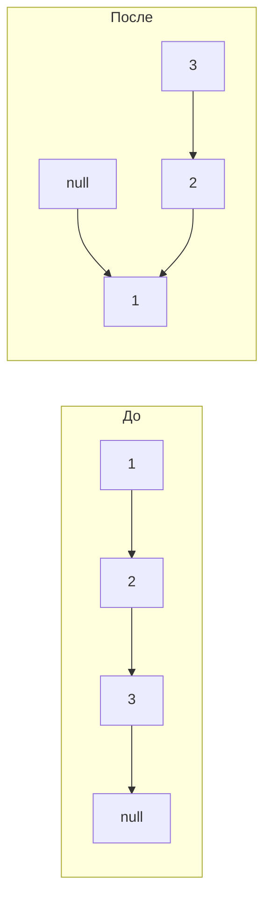

# Вопросы на собеседовании: `Связные списки`

Связные списки — основа классических задач: реверс, обнаружение цикла (Флойд), middle node, слияние, LRU cache. На собеседовании их любят, потому что они проверяют умение работать с указателями, dummy node и edge cases (пустой список, один элемент, цикл).

## Полезные ссылки

### Официальная документация и авторитетные источники

- [Java LinkedList — Baeldung](https://www.baeldung.com/java-linkedlist)
- [Java ArrayList vs LinkedList — Baeldung](https://www.baeldung.com/java-arraylist-linkedlist)
- [Reverse Linked List — Baeldung](https://www.baeldung.com/java-reverse-linked-list)
- [Floyd's Cycle Finding — Wikipedia](https://en.wikipedia.org/wiki/Cycle_detection#Floyd's_tortoise_and_hare)
- [LRU Cache via LinkedHashMap — Baeldung](https://www.baeldung.com/java-lru-cache)

## Содержание

- [Полезные ссылки](#полезные-ссылки)
- [See also](#see-also)

**Базовые структуры**
- [Q1. (!) Чем singly-linked отличается от doubly-linked?](#q1--чем-singly-linked-отличается-от-doubly-linked)
- [Q2. (!) Чем LinkedList отличается от ArrayList в Java?](#q2--чем-linkedlist-отличается-от-arraylist-в-java)
- [Q3. Что такое sentinel/dummy node и зачем он нужен?](#q3-что-такое-sentineldummy-node-и-зачем-он-нужен)
- [Q4. Как реализовать circular linked list?](#q4-как-реализовать-circular-linked-list)

**Базовые операции**
- [Q5. (!) Как добавить узел в начало/конец/середину?](#q5--как-добавить-узел-в-началоконецсередину)
- [Q6. Как удалить узел по значению?](#q6-как-удалить-узел-по-значению)
- [Q7. (!) Как удалить узел, имея только ссылку на него (без head)?](#q7--как-удалить-узел-имея-только-ссылку-на-него-без-head)

**Реверс и перестановка**
- [Q8. (!) Реверс связного списка — итеративный и рекурсивный?](#q8--реверс-связного-списка--итеративный-и-рекурсивный)
- [Q9. (!) Реверс между позициями m и n?](#q9--реверс-между-позициями-m-и-n)
- [Q10. (!) Реверс группами по K элементов?](#q10--реверс-группами-по-k-элементов)
- [Q11. Swap pairs — обмен смежных пар?](#q11-swap-pairs--обмен-смежных-пар)

**Two pointers**
- [Q12. (!) Floyd's cycle detection — есть ли цикл?](#q12--floyds-cycle-detection--есть-ли-цикл)
- [Q13. (!) Где начинается цикл?](#q13--где-начинается-цикл)
- [Q14. (!) Найти middle node?](#q14--найти-middle-node)
- [Q15. (!) Удалить N-ый узел с конца?](#q15--удалить-n-ый-узел-с-конца)
- [Q16. (!) Найти точку пересечения двух списков?](#q16--найти-точку-пересечения-двух-списков)

**Слияние и сортировка**
- [Q17. (!) Слияние двух отсортированных списков?](#q17--слияние-двух-отсортированных-списков)
- [Q18. (!) Слияние K отсортированных списков?](#q18--слияние-k-отсортированных-списков)
- [Q19. (!) Merge Sort на связном списке?](#q19--merge-sort-на-связном-списке)
- [Q20. Сложить два числа, представленных списками?](#q20-сложить-два-числа-представленных-списками)

**Проверки и преобразования**
- [Q21. (!) Проверить, что список — палиндром?](#q21--проверить-что-список--палиндром)
- [Q22. Удалить дубликаты из отсортированного списка?](#q22-удалить-дубликаты-из-отсортированного-списка)
- [Q23. Разделить список вокруг значения X (partition)?](#q23-разделить-список-вокруг-значения-x-partition)
- [Q24. Копирование списка с random pointer?](#q24-копирование-списка-с-random-pointer)

**Применения**
- [Q25. (!) LRU Cache на основе doubly-linked list?](#q25--lru-cache-на-основе-doubly-linked-list)
- [Q26. (!) Реализовать стек на linked list?](#q26--реализовать-стек-на-linked-list)
- [Q27. (!) Реализовать очередь на linked list?](#q27--реализовать-очередь-на-linked-list)
- [Q28. Skip list — что это и зачем?](#q28-skip-list--что-это-и-зачем)

**Java-специфика и подвохи**
- [Q29. (!) Можно ли использовать Binary Search для LinkedList?](#q29--можно-ли-использовать-binary-search-для-linkedlist)
- [Q30. Почему LinkedList ест больше памяти, чем ArrayList?](#q30-почему-linkedlist-ест-больше-памяти-чем-arraylist)
- [Q31. (!) Когда стоит использовать LinkedList в Java?](#q31--когда-стоит-использовать-linkedlist-в-java)
- [Q32. Что такое ConcurrentLinkedQueue?](#q32-что-такое-concurrentlinkedqueue)

## Q1. (!) Чем singly-linked отличается от doubly-linked?

| Тип | Ссылки в узле | Память | Двунаправленный обход |
|-----|---------------|--------|----------------------|
| **Singly** | `next` | Меньше (1 ссылка) | Нет — только вперёд |
| **Doubly** | `prev` + `next` | Больше (2 ссылки) | Да |

```java
class SinglyNode<T> {
    T value;
    SinglyNode<T> next;
}

class DoublyNode<T> {
    T value;
    DoublyNode<T> prev, next;
}
```

**Когда нужен doubly:**
- Удаление узла за `O(1)` при наличии ссылки (LRU cache)
- Двунаправленный обход (Java `LinkedList` — doubly)
- Browser history (back/forward)

**Когда хватает singly:**
- Стек/очередь
- Сложение чисел в порядке цифр
- Хешсет цепочек


> [!mcq] Чем принципиально отличается singly-linked от doubly-linked списка?
>
> - [x] A. Doubly хранит `prev` + `next`, что даёт `O(1)` удаление узла по ссылке и двунаправленный обход; singly хранит только `next` и требует `O(n)` поиска предшественника.
>
>     **Развёрнутое объяснение.** В singly-linked каждый узел содержит только `next`, поэтому чтобы удалить узел `x`, нужно сначала найти его предшественника за `O(n)` (пройти от head). В doubly-linked есть `x.prev` — удаление становится `O(1)`: `x.prev.next = x.next; x.next.prev = x.prev`. За эту скорость платят +1 ссылкой на узел (~+8 байт `prev` на 64-битной JVM, ≈ +25% к размеру узла). Именно поэтому Java `LinkedList` сделан doubly: он реализует `Deque`, поддерживает `descendingIterator()`, а `ListIterator.remove()` работает за `O(1)`.
>
>     **Пример.** В LRU-cache на 1M элементов doubly-list позволяет «выкинуть» наименее свежий узел за один `node.prev.next = node.next` без поиска. Если бы взяли singly — каждый eviction стоил бы `O(n)`, и cache p99 latency вырос бы с 10µs до десятков миллисекунд под нагрузкой.
>
>     **Когда применять.** Doubly — там, где есть ссылка на узел и нужно его удалить за `O(1)` (LRU/LFU кэши, MRU-списки, browser history back/forward, `LinkedHashMap` с `accessOrder=true`). Singly — там, где обход односторонний и каждый байт памяти важен (стек, очередь FIFO с двумя указателями, хэш-цепочки в open hashing).
>
>     **Подводные камни.** В doubly при удалении надо аккуратно обновлять обе ссылки — забыл `next.prev = node.prev` и получил dangling reference. При итерации с `remove()` Java `LinkedList` иногда удивляет `ConcurrentModificationException`, если структуру меняют через `list.remove(obj)` а не через `iterator.remove()`. Память: на 1M узлов doubly съест примерно на 8MB больше singly.
>
>     **Связанные вопросы.** [[linked-lists-interview#Q2]] LinkedList vs ArrayList; [[linked-lists-interview#Q25]] LRU Cache на doubly-list; [[linked-lists-interview#Q30]] память LinkedList.
>
> - [ ] B. Singly быстрее работает с памятью, потому что хранит данные подряд и поэтому cache-friendly.
>
>     **Что на самом деле.** Это путаница с массивами. И singly, и doubly разбросаны по куче — узлы аллоцируются отдельно через `new Node()`, ссылки `next`/`prev` указывают на произвольные адреса. Cache locality плохая у обоих типов linked list; cache-friendly — это `ArrayList`/`Object[]`, где элементы лежат в одном непрерывном блоке памяти.
>
>     **Откуда путаница.** Слово «list» новички ассоциируют с массивом и думают, что любая «list» структура хранит данные подряд. Plus, в учебниках linked list рисуют горизонтально как массив, и это создаёт ложный визуальный образ непрерывного хранения.
>
>     **Если бы это было правдой.** Тогда `LinkedList.get(i)` работал бы за `O(1)` через арифметику адресов — но в JDK он явно `O(n)`. На реальных бенчмарках линейный обход `LinkedList` в 3-10 раз медленнее `ArrayList` именно из-за cache miss на каждом dereference `next`.
>
>     **Как было бы правильно.** Признать, что singly и doubly одинаково cache-unfriendly; разница между ними — в наличии `prev` для `O(1)` удаления по ссылке, а не в layout памяти.
>
> - [ ] C. Doubly умеет работать как circular, а singly — нет.
>
>     **Что на самом деле.** Circular — ортогональное свойство: `tail.next = head`. И singly, и doubly могут быть circular. Circular singly применяется в round-robin шедулерах, circular doubly (как `list_head` в Linux kernel) — в самом ядре Linux для всех intrusive lists. Это две независимые оси: singly/doubly × linear/circular.
>
>     **Откуда путаница.** Иллюстрации circular doubly встречаются чаще, поэтому возникает ассоциация «circular = doubly». На самом деле circular singly проще в реализации и регулярно используется в game loops, token-ring протоколах, аудиоплеерах с repeat.
>
>     **Если бы это было правдой.** Тогда было бы невозможно реализовать round-robin scheduler на singly-list, но Linux CFS и многие планировщики 70-90х именно так и работали — с circular singly. И невозможно было бы построить Josephus problem на singly, что противоречит стандартным алгоритмическим задачам.
>
>     **Как было бы правильно.** Объяснить, что singly/doubly и linear/circular — независимые свойства; circular добавляется заменой `null` на ссылку на head в любом из вариантов.
>
> - [ ] D. В doubly нельзя реализовать стек, нужен singly.
>
>     **Что на самом деле.** Наоборот: на doubly можно делать всё, что на singly, плюс больше. Java `Deque` (через `LinkedList`) одновременно работает и как стек (`push`/`pop`), и как очередь (`offer`/`poll`). Singly достаточно для стека (push/pop на head за `O(1)`), но не обязателен — doubly справится не хуже.
>
>     **Откуда путаница.** Студенты учат стек на singly как «минимальную достаточную реализацию» и запоминают это как ограничение. Plus, в C-учебниках doubly считается «избыточным» для стека и об этом пишут как о признаке плохого дизайна.
>
>     **Если бы это было правдой.** Тогда `java.util.LinkedList` (doubly) не мог бы реализовывать `Deque.push()/pop()` — но это публичный API, документированный с Java 6, миллионы строк production-кода используют его как стек.
>
>     **Как было бы правильно.** Признать, что doubly — надмножество singly по возможностям: всё, что делает singly, doubly тоже делает (плюс `O(1)` удаление по ссылке и обратный обход).

## Q2. (!) Чем LinkedList отличается от ArrayList в Java?

| Операция | ArrayList | LinkedList |
|----------|-----------|------------|
| `get(i)` | `O(1)` | `O(n)` (или `O(min(i, n-i))` с оптимизацией) |
| `add(e)` (в конец) | `O(1)` амортиз. | `O(1)` |
| `add(0, e)` (в начало) | `O(n)` | `O(1)` |
| `remove(i)` | `O(n)` | `O(n)` (поиск) + `O(1)` (удаление) |
| Память на элемент | 1 ссылка | 3 ссылки (`prev`, `next`, `value`) + объект Node |
| Cache locality | Отличная | Плохая |

```java
// LinkedList в Java реализует Deque — отличный выбор для FIFO/LIFO
LinkedList<Integer> queue = new LinkedList<>();
queue.offer(1); queue.offer(2);
queue.poll(); // 1

// Но как очередь чаще предпочитают ArrayDeque — быстрее, меньше памяти
Deque<Integer> deque = new ArrayDeque<>();
```

**На практике:** даже для частых вставок в начало `ArrayDeque` обычно быстрее `LinkedList` благодаря лучшей локальности. `LinkedList` оправдан только когда нужны итераторы с `remove()` посередине без сдвига.

Подробнее — в [Java Collections](../../programming-languages/java/java-collections-interview.md).


> [!mcq] Команда выбирает структуру для хранения списка из 100k элементов с частыми `get(i)` по индексу. Почему `ArrayList` обычно лучше `LinkedList`?
>
> - [ ] A. LinkedList медленнее на `add()` в конец, чем ArrayList, и поэтому проигрывает.
>
>     **Что на самом деле.** Наоборот, на `add(e)` в конец LinkedList стабильно `O(1)` — простая привязка к `tail`. ArrayList амортизированно `O(1)`, но периодически требует ресайза массива (создание нового `Object[]` × 1.5 и копирование `O(n)`). По вставке в конец LinkedList в среднем не хуже, иногда даже стабильнее (нет latency spikes от grow).
>
>     **Откуда путаница.** Common knowledge «LinkedList медленный» обобщается на все операции, хотя на самом деле он медленный именно на random access и memory footprint, а не на append. Plus, ArrayList.add() кажется «простым массивом», и нет интуиции про скрытые ресайзы.
>
>     **Если бы это было правдой.** Тогда `ArrayDeque` (тоже array-based) на enqueue был бы быстрее `LinkedList`, что в JMH-бенчмарках Doug Lea опровергается: на append-heavy workload разница ничтожна, ArrayDeque выигрывает только за счёт лучшей cache locality на обходе.
>
>     **Как было бы правильно.** Аргумент должен быть про `get(i)`, а не про `add()`: именно random access — это где ArrayList даёт 50-100× выигрыша через арифметику адресов в L1-кэше.
>
> - [x] B. `ArrayList.get(i)` работает за `O(1)` через арифметику адресов в непрерывном массиве, а `LinkedList.get(i)` обходит цепочку за `O(n)` с плохой cache locality.
>
>     **Развёрнутое объяснение.** ArrayList хранит элементы в одном `Object[]`, поэтому `get(i)` — это `array[i]`: одна арифметическая операция + одно чтение, скорее всего из L1-кэша при последовательном доступе (prefetcher CPU подтягивает соседние строки кэша). LinkedList: каждый узел — отдельный `Node` объект в куче, ссылки `prev`/`next` указывают на произвольные адреса. `get(i)` идёт по цепочке (JDK оптимизирует до `O(min(i, n-i))`, начиная с ближайшего конца), но каждый dereference — cache miss и random memory access. На 100k элементах разница 50-100×. Память: LinkedList — ~40 байт на узел (16 байт header + 24 байта на 3 ссылки) vs ~8 байт на элемент в ArrayList — в 5 раз больше.
>
>     **Пример.** В JMH-бенчмарке (`@Benchmark public int sumByIndex()`) на 100k Integer: ArrayList.get по всем индексам ≈ 1-2 мс, LinkedList.get тех же индексов ≈ 100-200 мс. Если в production-коде есть `for (int i = 0; i < list.size(); i++) list.get(i)` и list — LinkedList, получаем `O(n²)` вместо ожидаемого `O(n)`: 10к элементов = 100M операций, p99 latency взлетает в 1000 раз.
>
>     **Когда применять.** ArrayList — почти всегда: random access (`get`/`set` по индексу), последовательный обход (cache-friendly), компактное хранение. ArrayDeque — если нужна FIFO/LIFO семантика. LinkedList — крайне редко: только когда `Iterator.remove()` в середине под большим объёмом удалений действительно профилируется как bottleneck.
>
>     **Подводные камни.** Если меняем LinkedList на ArrayList — не забыть, что `ArrayList.remove(0)` стоит `O(n)` (сдвиг массива), тогда как `LinkedList.removeFirst()` это `O(1)`. Для частых head-операций берём `ArrayDeque`, а не `ArrayList`. Также: `ArrayList` не sync, для concurrent контекста — `CopyOnWriteArrayList` (для read-heavy) или `Collections.synchronizedList`.
>
>     **Связанные вопросы.** [[linked-lists-interview#Q1]] singly vs doubly; [[linked-lists-interview#Q29]] binary search на LinkedList; [[linked-lists-interview#Q31]] когда брать LinkedList.
>
> - [ ] C. LinkedList не поддерживает `Iterable`, поэтому его нельзя использовать в `for-each`.
>
>     **Что на самом деле.** Оба класса реализуют `List` → `Collection` → `Iterable<E>`. `for-each` работает для обоих, разница в производительности: `for-each` по LinkedList использует ListIterator (один проход `O(n)`), а индексный `for (int i; i < size; i++) list.get(i)` — катастрофа `O(n²)`. Поэтому правило: по LinkedList идти только через iterator/forEach, никогда — через индекс.
>
>     **Откуда путаница.** Возможно человек путает с устаревшими интерфейсами или с примитивами (`int[]` реально не реализует `Iterable`, но это про массивы, не про коллекции).
>
>     **Если бы это было правдой.** Тогда `LinkedList<String> list = ...; for (String s : list) {...}` не компилировался бы — но это валидный код с момента появления Java 5 (generics + foreach), что разоблачит ответ за 2 секунды.
>
>     **Как было бы правильно.** Признать что оба `Iterable`, но обход LinkedList через индексный цикл — `O(n²)` ловушка; правильно использовать `for-each` или `Iterator`.
>
> - [ ] D. LinkedList в Java — это singly-linked, поэтому он медленнее doubly-linked ArrayList.
>
>     **Что на самом деле.** Двойная ошибка. Во-первых, `java.util.LinkedList` — doubly-linked (хранит `prev` и `next`), реализует `Deque`. Во-вторых, `ArrayList` вообще не «linked» — это динамический массив на основе `Object[]`, у него нет ссылок между элементами в принципе. Сравнивать «singly vs doubly» здесь неприменимо.
>
>     **Откуда путаница.** Студенты иногда выучивают «singly = быстрее, doubly = медленнее из-за лишних ссылок» и применяют это там, где речь вообще не про linked list. Plus, путают LinkedList с самописными singly-реализациями из учебников.
>
>     **Если бы это было правдой.** Тогда `LinkedList.descendingIterator()` не существовал бы (нет `prev` для обратного обхода) — но это публичный API с Java 6 и часть `Deque` контракта. И `removeLast()` стоил бы `O(n)` вместо документированного `O(1)`.
>
>     **Как было бы правильно.** Признать, что LinkedList — doubly, ArrayList — массив (не linked вообще), а разница в `get(i)` объясняется арифметикой адресов vs обходом цепочки, не количеством ссылок.

## Q3. Что такое sentinel/dummy node и зачем он нужен?

**Dummy/sentinel node** — фиктивный узел перед `head`. Упрощает код, убирая edge case «пустой список или удаление head».

```java
ListNode removeElements(ListNode head, int val) {
    ListNode dummy = new ListNode(0);
    dummy.next = head;
    ListNode curr = dummy;

    while (curr.next != null) {
        if (curr.next.val == val) {
            curr.next = curr.next.next;
        } else {
            curr = curr.next;
        }
    }
    return dummy.next; // возвращаем настоящий head
}
```

Без dummy пришлось бы отдельно обрабатывать случай удаления head. Dummy node — обязательный паттерн для большинства задач на связные списки.


> [!mcq] Зачем в задачах на связные списки добавляют `dummy = new ListNode(0); dummy.next = head` в начале функции?
>
> - [ ] A. Dummy node ускоряет операции с `O(n)` до `O(1)` за счёт кеширования head.
>
>     **Что на самом деле.** Сложность не меняется — dummy не кэширует head и ничего не индексирует, это просто дополнительный узел в памяти. Алгоритм по-прежнему проходит список за `O(n)`, но без отдельной ветки `if (head.val == val) head = head.next`. Это упрощение кода, а не оптимизация Big-O.
>
>     **Откуда путаница.** Слово «упрощение» часто слышат как «ускорение». Plus, junior-разработчики иногда читают LeetCode editorial фразу «using dummy makes code cleaner» и интерпретируют clean code = fast code.
>
>     **Если бы это было правдой.** Тогда `removeElements(head, val)` с dummy выполнялся бы за `O(1)` независимо от длины списка, и можно было бы удалять элементы из миллиардного списка за наносекунды — что нарушает информационно-теоретическую границу: чтобы проверить каждый элемент, нужно его прочитать.
>
>     **Как было бы правильно.** Признать, что dummy — про code clarity и снижение количества веток, а не про сложность; Big-O остаётся `O(n)`.
>
> - [ ] B. Dummy node нужен только в circular списках, чтобы tail указывал на dummy вместо null.
>
>     **Что на самом деле.** В circular списках обычно dummy не используется (concept «sentinel ring» — редкость, чаще просто `tail.next = head`). А вот в линейных singly-list задачах LeetCode (`removeElements` 203, `mergeTwoLists` 21, `partition` 86, `swapPairs` 24, `oddEvenList` 328) dummy — стандартный приём именно потому, что head может удаляться/меняться.
>
>     **Откуда путаница.** Слово «sentinel» используется и для dummy node, и для маркера конца цикла — отсюда смешение применений. Plus, в Linux kernel `list_head` это circular doubly с sentinel — но это специфичный паттерн, не общее правило.
>
>     **Если бы это было правдой.** Тогда reference-решения на LeetCode для линейных задач не использовали бы dummy — но грепнешь `dummy` в editorial-ах и увидишь сотни случаев именно в линейных list-задачах.
>
>     **Как было бы правильно.** Сказать что dummy применяется в линейных singly-list для устранения edge case с head; circular ему ортогонален.
>
> - [x] C. Dummy убирает edge case «удаление/изменение head» — алгоритм единообразно работает с `curr.next` и в конце возвращает `dummy.next` как новый head.
>
>     **Развёрнутое объяснение.** Без dummy при удалении узлов нужно отдельно обрабатывать `if (head.val == val) head = head.next` — иначе при удалении первого элемента локальная переменная `head` не обновится для caller'а. С dummy все «настоящие» узлы становятся «не-head» с точки зрения алгоритма: `dummy.next` указывает на текущий первый узел, и условие удаления `curr.next = curr.next.next` работает для всех позиций единообразно. В конце `return dummy.next` отдаёт актуальный начало списка — даже если оригинальный head был удалён или подменён.
>
>     **Пример.** В `mergeTwoLists(l1, l2)`: без dummy надо отдельно выбирать первый узел («какой из l1.val/l2.val меньше станет head?») и потом подцеплять остальные. С dummy: `curr = dummy`, в цикле `curr.next = (l1.val <= l2.val) ? l1 : l2`, в конце `return dummy.next`. Кода в 2 раза меньше, и edge case «один из списков пустой» обрабатывается тем же кодом.
>
>     **Когда применять.** Везде, где head списка может: (а) быть удалён (`removeElements`), (б) поменяться (`mergeTwoLists`, `partition`), (в) быть `null` на входе. В Java реализациях `Deque` и `ConcurrentLinkedQueue` (Doug Lea) sentinel-узлы — стандарт для устранения null-checks. На code review dummy снимает 30-50% багов с «забыл обработать удаление первого элемента».
>
>     **Подводные камни.** Не забыть `return dummy.next`, а не `return head` — `head` может уже не быть первым после операций. Если работаем с `Comparable` или дженериками, у dummy должно быть valid-значение (например `new ListNode(0)` для `int`, или nullable wrapper для `T`). В circular списках dummy менее естественен — обычно обходятся без него.
>
>     **Связанные вопросы.** [[linked-lists-interview#Q6]] удаление по значению; [[linked-lists-interview#Q17]] merge two sorted; [[linked-lists-interview#Q23]] partition list.
>
> - [ ] D. Dummy защищает от `NullPointerException` при пустом списке (`head == null`).
>
>     **Что на самом деле.** Это побочный эффект, а не основная функция. Защита от NPE достигается проверкой `while (curr.next != null)` или `if (head == null) return null` в начале — без dummy. Главное назначение dummy — единообразие обработки head во всех ветках алгоритма, чтобы не было отдельного `if (head.val == val)` блока.
>
>     **Откуда путаница.** Разработчик добавил dummy, заметил что NPE «исчез» (потому что `dummy.next` валиден даже когда `head == null`), и сделал ложную каузальную связь «dummy = от NPE». На самом деле NPE убирает корректная null-проверка цикла, не сам dummy.
>
>     **Если бы это было правдой.** Тогда задачи типа `removeElements(null, 5)` падали бы без dummy — но они корректно возвращают null при `while (head != null)` обходе. И не было бы причины использовать dummy в задачах с заведомо непустым head (LeetCode constraints).
>
>     **Как было бы правильно.** Объяснить что dummy — про единообразие edge-case обработки head, а защита от NPE — это просто null-check на входе или в условии цикла.

## Q4. Как реализовать circular linked list?

В **circular** списке `tail.next = head` (а не `null`). Используется в очередях задач (round-robin), играх (cyclic players).

```java
class CircularList<T> {
    private Node<T> tail; // храним только tail для O(1) добавления

    void add(T value) {
        Node<T> node = new Node<>(value);
        if (tail == null) {
            node.next = node;
        } else {
            node.next = tail.next; // новый указывает на head
            tail.next = node;
        }
        tail = node;
    }

    void traverse() {
        if (tail == null) return;
        Node<T> curr = tail.next; // head
        do {
            System.out.println(curr.value);
            curr = curr.next;
        } while (curr != tail.next);
    }
}
```

Хранение `tail` (а не `head`) даёт `O(1)` для `addFirst` и `addLast` — `head` доступен через `tail.next`.


> [!mcq] Почему в реализации circular linked list обычно хранят ссылку на `tail`, а не на `head`?
>
> - [ ] A. Потому что `head` в circular list технически не существует — все узлы равноправны, и хранить надо «любой» узел, который традиционно называют `tail`.
>
>     **Что на самом деле.** В circular list `head` существует логически — это узел, с которого начинают обход или вставку. Просто структурно `tail.next == head`, поэтому имея `tail`, можно получить `head` за `O(1)` через `tail.next`. «Равноправность узлов» — философский тезис, не имеющий отношения к производительности.
>
>     **Откуда путаница.** Студенты иногда путают абстрактную математическую модель circular list (cycle graph без начала) с её реализацией в коде, где конкретный узел всё же выделен как entry point.
>
>     **Если бы это было правдой.** Тогда обход `do {...} while (curr != start)` не имел бы смысла — но он реально используется как стандартный паттерн в Linux `list_head`, и `start` явно требуется как точка отсчёта.
>
>     **Как было бы правильно.** Объяснить что `tail` хранится не из-за «равноправности», а потому что даёт `O(1)` доступ и к concat-end, и к head через `tail.next`.
>
> - [ ] B. Хранение `tail` экономит память по сравнению с хранением `head`.
>
>     **Что на самом деле.** Память расходуется одинаково — одна ссылка на узел в обоих случаях. Разница не в количестве байт, а в том, какие операции получают `O(1)`. Хранить `tail` выгодно функционально, не по памяти.
>
>     **Откуда путаница.** «Экономия памяти» — частый псевдо-аргумент в junior-ответах: разработчик слышит «лучшая реализация» и автоматически приписывает причину «меньше памяти», даже когда речь о времени.
>
>     **Если бы это было правдой.** Тогда хранение обоих (`head` и `tail`) вместе должно было бы давать 2× память — но это всего лишь +8 байт на структуру, что мизер на фоне самих узлов.
>
>     **Как было бы правильно.** Сказать что выбор `tail` — про O(1) вставку и в начало, и в конец, а не про экономию памяти.
>
> - [ ] C. С `head` циклический обход просто не работает, потому что `head.prev` указывает на `null`.
>
>     **Что на самом деле.** В circular list никакой узел не указывает на `null` — `tail.next = head` замыкает кольцо. Циклический обход прекрасно работает и от `head`: `Node curr = head; do { ...; curr = curr.next; } while (curr != head);` — стандартный идиом.
>
>     **Откуда путаница.** Смешение linear singly (`tail.next == null`) с circular (`tail.next == head`). В linear обход от head работает по `null`-условию, в circular — по `curr == start`-условию.
>
>     **Если бы это было правдой.** Тогда Linux kernel `list_for_each(pos, head)` падал бы на `NullPointerException` — но это макрос, который десятилетиями работает в ядре на миллиардах устройств.
>
>     **Как было бы правильно.** Признать, что и от `head`, и от `tail` обход работает (через `curr == start` условие); выбор `tail` — про производительность вставок.
>
> - [x] D. Имея `tail`, получаем `head` за `O(1)` через `tail.next`, поэтому и `addFirst`, и `addLast` становятся `O(1)`; а если хранить только `head`, добавление в конец требует `O(n)` обхода до tail.
>
>     **Развёрнутое объяснение.** В circular list `tail.next == head`. Если в структуре есть только `tail`, то `head` доступен бесплатно (`tail.next`), новый узел в начало вставляется как `node.next = tail.next; tail.next = node;` — O(1). Новый узел в конец: `node.next = tail.next; tail.next = node; tail = node;` — тоже O(1). Если бы хранили только `head`, чтобы дойти до tail для `addLast`, пришлось бы пройти весь список (`O(n)`), что убивает преимущество linked-структуры на append-heavy workloads.
>
>     **Пример.** В round-robin планировщике задач (cyclic players в Tarantool, raft-rpc round-robin polling) нужны и `addLast` (новая задача в очередь), и быстрый доступ к `head` (текущая задача). Структура с одним `tail` даёт оба `O(1)`; вариант с одним `head` дал бы `O(n)` на `addLast`, что не подходит для тысяч задач/сек.
>
>     **Когда применять.** Любая circular list реализация где нужны вставки в оба конца за `O(1)`: token-ring протоколы, audio-плееры с repeat-all, cyclic buffers (хотя для них чаще берут array-based ring buffer), Josephus problem. В Linux kernel `list_head` — это circular doubly, и там хранится sentinel-узел, через который доступны оба конца.
>
>     **Подводные камни.** При `addFirst`/`addLast` на пустом списке нужно отдельно обработать `tail == null` (новый узел `node.next = node`, `tail = node`). Удаление tail требует `O(n)` для обновления предыдущего узла (если только это не doubly). Удаление с проверкой «это последний узел в кольце?» — частый bug source: забыли `tail == head` в singly circular ⇒ infinite loop.
>
>     **Связанные вопросы.** [[linked-lists-interview#Q1]] singly vs doubly; [[linked-lists-interview#Q5]] addFirst/addLast; [[linked-lists-interview#Q27]] очередь на linked list.

## Q5. (!) Как добавить узел в начало/конец/середину?

```java
class SinglyLinkedList<T> {
    Node<T> head, tail;

    // Добавление в начало — O(1)
    void addFirst(T value) {
        Node<T> node = new Node<>(value);
        node.next = head;
        head = node;
        if (tail == null) tail = node;
    }

    // Добавление в конец — O(1) при наличии tail
    void addLast(T value) {
        Node<T> node = new Node<>(value);
        if (tail == null) {
            head = tail = node;
        } else {
            tail.next = node;
            tail = node;
        }
    }

    // Добавление по позиции — O(n)
    void addAt(int index, T value) {
        if (index == 0) { addFirst(value); return; }
        Node<T> curr = head;
        for (int i = 0; i < index - 1 && curr != null; i++) {
            curr = curr.next;
        }
        if (curr == null) throw new IndexOutOfBoundsException();
        Node<T> node = new Node<>(value);
        node.next = curr.next;
        curr.next = node;
        if (node.next == null) tail = node;
    }
}
```

**Без `tail`** — `addLast` становится `O(n)` (нужно дойти до конца). Поэтому реальные реализации хранят и `head`, и `tail`.


> [!mcq] Почему `addLast` в singly-linked list с одним только `head` — это `O(n)`, а с дополнительным `tail` — `O(1)`?
>
> - [x] A. Чтобы вставить узел после последнего, нужна ссылка на этот последний узел; с одним `head` приходится пройти весь список за `O(n)`, а отдельно хранимый `tail` сразу даёт нужный указатель и операция становится `O(1)`.
>
>     **Развёрнутое объяснение.** В singly-linked list связь однонаправленная: имея узел, мы знаем только `next`. Чтобы привязать новый узел в конец, нужно установить `lastNode.next = newNode`, а для этого надо получить ссылку на `lastNode`. С одним `head` единственный способ — итерация `while (curr.next != null) curr = curr.next`, что `O(n)`. Хранение `tail` как отдельного поля решает проблему: `tail.next = node; tail = node;` — две операции, `O(1)`. Доплата: одна ссылка в структуре и +1 обновление `tail` на каждой вставке.
>
>     **Пример.** `LinkedQueue.enqueue()` в потоковой обработке логов (1М событий/сек): с одним `head` каждый enqueue стоил бы `O(n)`, на n=10к очередь захлёбывалась бы (10⁸ операций/сек > CPU). С `tail` каждый enqueue — три инструкции, очередь спокойно тянет нагрузку. Точно по этой причине `java.util.LinkedList` хранит и `first`, и `last`.
>
>     **Когда применять.** Любая структура с частым добавлением в конец: очередь FIFO, billing event log, undo-history (если append-only), worker task queue. В стеке `tail` обычно не нужен — push/pop работают через `head`. Если структура иммутабельная (persistent list à la Clojure/Haskell), `tail` нельзя поддерживать без полного копирования, и тогда reverse + cons — стандартный приём.
>
>     **Подводные камни.** При удалении последнего узла надо обновить `tail` на предыдущий — а в singly это `O(n)` (нет `prev`). Поэтому Java `LinkedList` — doubly, чтобы `removeLast` тоже был `O(1)`. На пустом списке `addLast` требует обработки: оба поля `head` и `tail` инициализируются на новый узел. Забыл — получишь NPE или повреждённую структуру.
>
>     **Связанные вопросы.** [[linked-lists-interview#Q1]] singly vs doubly; [[linked-lists-interview#Q4]] circular tail trick; [[linked-lists-interview#Q27]] queue на linked list.
>
> - [ ] B. `addLast` в singly всегда `O(1)`, потому что у каждого узла можно «угадать» позицию последнего через хэширование адреса.
>
>     **Что на самом деле.** Никакого «угадывания позиции через хэш» в linked list не существует. Узел в куче имеет адрес, но этот адрес не несёт информации о позиции узла в списке. Чтобы добраться до tail из head, нужно физически пройти по `next`-ссылкам — это и есть `O(n)`.
>
>     **Откуда путаница.** Возможно человек смешивает HashMap (`O(1)` доступ по ключу) и LinkedList. Хэширование к linked list не применимо: связь определяется ссылками, а не функцией ключа.
>
>     **Если бы это было правдой.** Тогда `LinkedList.get(i)` тоже был бы `O(1)` через тот же «хэш по адресу» — но в JDK он чётко документирован как `O(n)`, и JMH-бенчмарки это подтверждают (1-200мс на 100к индексах).
>
>     **Как было бы правильно.** Признать что в linked list нет «фокусов с хэшированием»; чтобы `addLast` был `O(1)`, надо явно хранить ссылку на tail.
>
> - [ ] C. Разница `O(n)` vs `O(1)` объясняется тем, что без `tail` JIT не может заинлайнить метод `add`.
>
>     **Что на самом деле.** Сложность алгоритма определяется его структурой, а не JIT-оптимизациями. JIT может ускорить операцию в константу раз (убрать bounds-check, заинлайнить, развернуть цикл), но не сменит асимптотику с `O(n)` на `O(1)`. Цикл `while (curr.next != null) curr = curr.next` остаётся `O(n)` независимо от того, заинлайнен ли он.
>
>     **Откуда путаница.** Junior-разработчики иногда смешивают «производительность» (константные оптимизации) и «сложность» (асимптотика). JIT — про производительность, Big-O — про алгоритм.
>
>     **Если бы это было правдой.** Тогда `-Xint` (interpreted mode, без JIT) делал бы операцию ещё медленнее в `n` раз — но `O(n)` это уже корректный «без JIT» вариант; JIT только убирает константный overhead.
>
>     **Как было бы правильно.** Связать разницу с информацией: для `O(1)` нужна прямая ссылка на нужный узел; без неё — обход `O(n)` независимо от JIT.
>
> - [ ] D. Без `tail` `addLast` всё равно `O(1)`, потому что JVM хранит длину списка и может «прыгнуть» сразу в конец массива нодов.
>
>     **Что на самом деле.** Linked list — это НЕ массив нодов, узлы разбросаны по куче. JVM не «хранит длину» как индексируемый массив; она знает `size` как поле для `size()` метода, но это не даёт прямого доступа к последнему узлу. Чтобы перейти от индекса к узлу, всё равно надо обходить ссылки.
>
>     **Откуда путаница.** ArrayList действительно даёт `O(1)` `add` в конец через `array[size++]`, потому что под капотом массив. Кандидат экстраполирует это на LinkedList, не понимая разницы в layout.
>
>     **Если бы это было правдой.** Тогда `LinkedList.get(size-1)` работал бы за `O(1)` — но он `O(1)` только потому, что в Java реализации хранится `last`-указатель (то есть аналог `tail`!), а не из-за «индексации в массив нодов».
>
>     **Как было бы правильно.** Объяснить, что `O(1)` в `LinkedList.addLast()` достигается именно благодаря хранимому полю `last` (=tail), а не какой-то магии массива; самописная singly без tail имеет `addLast = O(n)`.

## Q6. Как удалить узел по значению?

```java
ListNode removeFirst(ListNode head, int val) {
    ListNode dummy = new ListNode(0, head);
    ListNode curr = dummy;
    while (curr.next != null) {
        if (curr.next.val == val) {
            curr.next = curr.next.next;
            return dummy.next; // удалили первое вхождение
        }
        curr = curr.next;
    }
    return dummy.next;
}

// Удалить ВСЕ вхождения
ListNode removeAll(ListNode head, int val) {
    ListNode dummy = new ListNode(0, head);
    ListNode curr = dummy;
    while (curr.next != null) {
        if (curr.next.val == val) curr.next = curr.next.next;
        else                       curr = curr.next;
    }
    return dummy.next;
}
```

`O(n)` время, `O(1)` память. Dummy node убирает edge case удаления head.


> [!mcq] Какой шаблон удаления узла по значению в singly-linked list работает корректно для всех позиций, включая первый и последний элемент?
>
> - [ ] A. Пройти список и при `curr.val == val` сделать `curr = curr.next` — это переключит ссылку на следующий узел.
>
>     **Что на самом деле.** `curr = curr.next` меняет только локальную переменную, а не ссылку из предыдущего узла. Список снаружи остаётся неизменным — целевой узел всё ещё связан с предшественником, утечка устранения. Это типичная ошибка «думал что меняю структуру, а менял указатель в стеке».
>
>     **Откуда путаница.** В языках с reference semantics новички часто думают, что переприсваивание переменной модифицирует объект. На самом деле это меняет binding имени, не сам узел.
>
>     **Если бы это было правдой.** Тогда любой обход `while (curr != null) curr = curr.next` физически разрывал бы список — но это стандартный idiom для read-only traversal, миллионы строк production-кода полагаются на то что он не модифицирует структуру.
>
>     **Как было бы правильно.** Хранить ссылку на предшественника (`prev`) и делать `prev.next = curr.next`, либо использовать dummy node + работать с `curr.next.val == val`.
>
> - [x] B. Использовать dummy node + обход через `curr.next.val == val`: при совпадении делать `curr.next = curr.next.next`, при несовпадении — `curr = curr.next`; в конце вернуть `dummy.next`.
>
>     **Развёрнутое объяснение.** Dummy узел перед head делает «удаление первого элемента» обычной операцией: мы всегда смотрим на `curr.next`, поэтому `curr.next = curr.next.next` корректно отвязывает любой узел независимо от его позиции. На несовпадении двигаем `curr = curr.next` — это итерация. В конце `return dummy.next` — актуальный head после возможной подмены. Сложность `O(n)` времени и `O(1)` памяти, проходим список один раз.
>
>     **Пример.** `removeElements(head, 6)` для `1→2→6→3→4→5→6`: после прохода получаем `1→2→3→4→5`, оба вхождения шестёрки убраны единым кодом без отдельной ветки «если это первый узел». LeetCode 203 — точная задача, top-voted solution использует именно этот шаблон.
>
>     **Когда применять.** Любая задача с удалением по значению/предикату из singly-list: `removeElements`, `deleteDuplicates`, `partition`, custom фильтрация. Также применимо для filter-операций над event stream с linked storage. В Java `LinkedList.removeIf(predicate)` работает по похожему принципу через `ListIterator`.
>
>     **Подводные камни.** Если значение нужно удалить только первое вхождение — добавить `return dummy.next` сразу после удаления. Для doubly-list нужно обновить ещё и `next.prev`, иначе обратный обход сломается. На concurrent-структурах нужны CAS-операции (см. `ConcurrentLinkedQueue`); этот наивный код не thread-safe.
>
>     **Связанные вопросы.** [[linked-lists-interview#Q3]] dummy node; [[linked-lists-interview#Q7]] удаление без head; [[linked-lists-interview#Q22]] удаление дубликатов.
>
> - [ ] C. Удалить можно только последний узел: пройти до tail и поставить `tail = null`.
>
>     **Что на самом деле.** Это удаление по позиции (последний), а не по значению. Задача «удалить узел со значением X» требует найти любой узел с этим значением, который может быть где угодно — в начале, середине или конце. Сводить всё к удалению tail — путаница задач.
>
>     **Откуда путаница.** Возможно ассоциация с стеком, где удаление возможно только из вершины. В linked list это ограничение не действует — можно удалить любой узел при наличии ссылки на предшественника.
>
>     **Если бы это было правдой.** Тогда `removeElements(head, val)` (LeetCode 203) был бы невыполним — но это базовая задача, решаемая за `O(n)` обычным обходом со связкой `prev`.
>
>     **Как было бы правильно.** Описать общий шаблон обхода singly-list с dummy node и пере-связыванием `prev.next = curr.next`, работающий для любой позиции.
>
> - [ ] D. Конвертировать список в `ArrayList`, удалить по индексу, перестроить linked list обратно.
>
>     **Что на самом деле.** Технически работает, но это `O(n)` времени + `O(n)` памяти на временный массив + дополнительный проход на rebuild. Прямое решение в один проход `O(n)` времени и `O(1)` памяти — на порядок эффективнее.
>
>     **Откуда путаница.** «Если не знаешь как — приведи к знакомой структуре». Это валидный pattern в общем случае, но для linked list задач он считается анти-паттерном: показывает что кандидат не освоил саму DS.
>
>     **Если бы это было правдой.** Тогда in-place операции на linked list не имели бы смысла, и LeetCode/Cracking the Coding Interview не уделяли бы им столько внимания. На реальном code review такой код просят переписать на in-place решение.
>
>     **Как было бы правильно.** Решать задачу в native-форме linked list (обход с `prev`/dummy + пере-связывание ссылок), не конвертируя в массив.

## Q7. (!) Как удалить узел, имея только ссылку на него (без head)?

Классический трюк: **скопировать значение из next, удалить next**.

```java
void deleteNode(ListNode node) {
    if (node == null || node.next == null) return; // не работает для tail
    node.val = node.next.val;
    node.next = node.next.next;
}
```

**Ограничение:** не работает для последнего узла (нет `next`). В таких задачах обычно гарантируется, что удаляемый узел — не последний.

`O(1)` время. Без копирования значения пришлось бы пройти список с начала — `O(n)`.


> [!mcq] Дан указатель на узел `node` посередине singly-linked list (без доступа к `head`). Как удалить этот узел за `O(1)`?
>
> - [ ] A. За `O(1)` это невозможно: без `head` нет способа дойти до предшественника узла, поэтому минимум `O(n)`.
>
>     **Что на самом деле.** За `O(1)` это возможно через трюк «скопировать значение из next, удалить next». Прямого способа отвязать узел от предшественника действительно нет (singly не хранит `prev`), но задача сводится к замещению значения: `node.val = node.next.val; node.next = node.next.next;`. Это удаляет физически `node.next`, но значение в позиции `node` теперь как если бы удалили `node`.
>
>     **Откуда путаница.** Интуиция «удалить узел = выкинуть его из цепочки» подсказывает, что нужно обновить ссылку предшественника. Если на трюк копирования значения не натыкался — задача кажется неразрешимой.
>
>     **Если бы это было правдой.** Тогда задача LeetCode 237 «Delete Node in a Linked List» не существовала бы — но она есть, с обязательным constraint «нет доступа к head, O(1) ожидается».
>
>     **Как было бы правильно.** Подменить значение узла на значение следующего и удалить следующий: `node.val = node.next.val; node.next = node.next.next` — `O(1)`.
>
> - [ ] B. Установить `node = null` — сборщик мусора уничтожит узел и связь автоматически разорвётся.
>
>     **Что на самом деле.** `node = null` меняет только локальную переменную; объект-узел не освобождается, пока на него есть ссылка из предыдущего узла. Сборщик мусора (GC) работает по достижимости из GC roots — узел всё ещё достижим через `prev.next`, поэтому остаётся жить. Список снаружи неизменен.
>
>     **Откуда путаница.** Новички в Java думают, что `null`-присваивание «удаляет объект». На самом деле оно убирает только одну ссылку из локального scope; GC решает позже, есть ли другие достижимые ссылки.
>
>     **Если бы это было правдой.** Тогда `Object obj = something; obj = null;` физически уничтожало бы объект — но `something` всё ещё валиден, объект достижим через него.
>
>     **Как было бы правильно.** Признать, что null-присваивание ничего не отвязывает; для физического удаления нужно изменить `prev.next` или применить трюк подмены значения с `node.next`.
>
> - [x] C. Скопировать значение из `node.next` в `node`, потом отвязать `node.next`: `node.val = node.next.val; node.next = node.next.next` — это эквивалентно удалению `node`, но физически удаляется `node.next`.
>
>     **Развёрнутое объяснение.** Прямого способа исключить `node` из цепочки нет — singly не даёт ссылку на предшественника. Но нас интересует наблюдаемый результат (узла с этим значением больше нет в списке), а не физическое удаление конкретного объекта в памяти. Подменяем значение `node` на значение его следующего узла и отбрасываем следующий узел: `node.val = node.next.val; node.next = node.next.next;`. Снаружи это выглядит как если бы исчез `node` со своим значением. `O(1)` времени, `O(1)` памяти, всего две операции.
>
>     **Пример.** LeetCode 237 «Delete Node in a Linked List» формулирует задачу именно так: дан только `node`, нужно сделать список таким, как будто `node` нет. Top-voted solution — ровно этот трюк подмены значения. Используется в реальных задачах: удаление текущего элемента в iterator-based обходе, deduplication по hash в реальном времени.
>
>     **Когда применять.** Когда есть гарантия, что `node` не последний (есть `node.next`). В системах с immutable nodes (как у Clojure) это не работает — нельзя мутировать `val`. Также при условии, что узлы не содержат identity-related информации (например, если внешние объекты держат ссылку на конкретный узел по тождеству — они увидят подменённое значение, что может быть бага).
>
>     **Подводные камни.** Не работает для последнего узла (`node.next == null`) — там нужен доступ к предшественнику. LeetCode 237 явно говорит «`node` is not the last node». В doubly-list нужно дополнительно обновить `node.prev` или применить классическое удаление. При concurrent доступе подмена `node.val` создаёт race: другой поток может прочитать «между» обновлениями. Также: если узел — ключ в HashMap по identity (`==`), он остаётся живым с подменённым значением — потенциальный bug.
>
>     **Связанные вопросы.** [[linked-lists-interview#Q1]] singly vs doubly; [[linked-lists-interview#Q6]] удаление по значению; [[linked-lists-interview#Q3]] dummy node.
>
> - [ ] D. Сначала пройти список с начала, найти `head`, потом обычное удаление через `prev`.
>
>     **Что на самом деле.** Задача явно говорит «нет доступа к head» — поэтому пройти список с начала нельзя, мы изолированы в одной точке. Даже если бы можно было, обход стоил бы `O(n)`, что нарушает целевую сложность `O(1)`.
>
>     **Откуда путаница.** Шаблон «всегда есть head» так глубоко зашит в задачи на linked list, что constraint «без head» воспринимается как условность, которую можно обойти. На самом деле он жёсткий — это часть задачи.
>
>     **Если бы это было правдой.** Тогда LeetCode 237 не имел бы смысла как отдельная задача с O(1) constraint — она существует именно потому, что без head обычный подход не работает.
>
>     **Как было бы правильно.** Принять ограничение «нет head» как данность и решить через трюк подмены значения с `node.next` — единственный способ за `O(1)` без head.

## Q8. (!) Реверс связного списка — итеративный и рекурсивный?

```java
// Итеративный — O(n) время, O(1) память
ListNode reverse(ListNode head) {
    ListNode prev = null, curr = head;
    while (curr != null) {
        ListNode next = curr.next;
        curr.next = prev;
        prev = curr;
        curr = next;
    }
    return prev; // новый head
}

// Рекурсивный — O(n) время и стек
ListNode reverseRecursive(ListNode head) {
    if (head == null || head.next == null) return head;
    ListNode newHead = reverseRecursive(head.next);
    head.next.next = head;  // следующий теперь указывает на нас
    head.next = null;       // обнуляем нашу старую ссылку
    return newHead;
}
```



Итеративный — стандарт для production: меньше памяти, без риска stack overflow.


> [!mcq] Какой вариант реверса singly-linked list работает за `O(n)` времени и `O(1)` дополнительной памяти?
>
> - [ ] A. Рекурсивный реверс — самый эффективный по памяти, потому что Java JIT раскрывает хвостовую рекурсию.
>
>     **Что на самом деле.** JVM (HotSpot) не делает tail-call optimization для общего случая — каждый рекурсивный вызов добавляет фрейм в стек, поэтому рекурсивный реверс требует `O(n)` стека. На длинных списках (>10⁴-10⁵ узлов) можно получить `StackOverflowError`. Это противоположно «эффективный по памяти».
>
>     **Откуда путаница.** Студенты, знающие про TCO в Scala/Kotlin (через `tailrec`) или Scheme, экстраполируют это на Java. Plus, рекурсия часто описывается как «элегантное решение» — слово «элегантный» путают с «эффективный».
>
>     **Если бы это было правдой.** Тогда reverse рекурсивно на списке из 10⁶ узлов не падал бы — но JMH-бенчмарк прямо это демонстрирует через `-Xss512k` (стек переполняется на ~10⁴ узлов).
>
>     **Как было бы правильно.** Сказать что рекурсивный реверс — `O(n)` стека (риск SO), итеративный — `O(1)` дополнительной памяти и предпочтителен в production.
>
> - [ ] B. Использовать `Collections.reverse(linkedList)` — это in-place с `O(1)` памяти, потому что Java оптимизирует под doubly-linked.
>
>     **Что на самом деле.** `Collections.reverse(List)` работает по интерфейсу `List`, swap-ит элементы через `list.set(i, list.set(n-1-i, list.get(i)))`. На LinkedList каждый `get(i)/set(i)` это `O(n)`, итого получается `O(n²)` времени. Памяти `O(1)` — правда, но цена за время катастрофическая.
>
>     **Откуда путаница.** Логично предположить, что в JDK для LinkedList есть специализированная быстрая реализация — но `Collections.reverse` универсальный и работает через `List` интерфейс без типового полиморфизма по реализации.
>
>     **Если бы это было правдой.** Тогда `Collections.reverse` на LinkedList был бы конкурентен с custom-реализацией — но JMH показывает 10-100× разницу на 10⁴ элементах не в пользу `Collections.reverse`.
>
>     **Как было бы правильно.** Признать `Collections.reverse(LinkedList)` как `O(n²)` ловушку; для in-place реверса использовать кастомный итеративный код или `descendingIterator` + перекопирование.
>
> - [ ] C. Реверс невозможен за `O(1)` доп. памяти — нужен временный массив для хранения node-ов в обратном порядке, иначе теряются ссылки.
>
>     **Что на самом деле.** Реверс на singly за `O(1)` памяти прекрасно работает через три указателя (`prev`, `curr`, `next`) — стандартный алгоритм. Сохраняется только `curr.next` перед перезаписью, не весь список. Никакого массива не требуется.
>
>     **Откуда путаница.** Если не видел трюк с тремя указателями, кажется, что для разворота надо «развернуть» каждую ссылку, для чего «нужна память на хранение узлов». На самом деле нужны только три текущих указателя.
>
>     **Если бы это было правдой.** Тогда in-place реверс был бы невозможен, и `Collections.reverse` тратил бы `O(n)` дополнительной памяти на временный список — но это не так, реверс делается без аллокации.
>
>     **Как было бы правильно.** Показать алгоритм с тремя указателями: `prev=null; while (curr) { next = curr.next; curr.next = prev; prev = curr; curr = next; }` — `O(n)` времени, `O(1)` памяти.
>
> - [x] D. Итеративный реверс с тремя указателями (`prev`, `curr`, `next`): на каждой итерации сохраняем `next = curr.next`, разворачиваем `curr.next = prev`, сдвигаем `prev = curr; curr = next` — `O(n)` времени, `O(1)` памяти.
>
>     **Развёрнутое объяснение.** Базовый алгоритм реверса singly-list — итерация с тремя локальными указателями. `prev` хранит уже развёрнутую часть (изначально null), `curr` — текущий обрабатываемый узел, `next` — буфер на одну итерацию вперёд. На каждом шаге запоминаем `next = curr.next` (иначе после `curr.next = prev` потеряем ссылку), разворачиваем ссылку `curr.next = prev`, сдвигаем оба указателя на следующий узел. После цикла `prev` указывает на новый head (бывший tail). Память — три переменные независимо от длины, времени `O(n)` ровно один проход.
>
>     **Пример.** В production-коде Apache Kafka (внутри `RecordBatchIterator`) и в `java.util.Collections.reverse(ArrayList)` — оба используют именно этот pattern (для массивов через индексы, для linked list через указатели). LeetCode 206 «Reverse Linked List» — каноническая задача, top-voted solution это ровно тот код.
>
>     **Когда применять.** Любая задача с реверсом или его подмножеством: `isPalindrome` (реверс второй половины), `addTwoNumbers` (если числа в прямом порядке — реверс на входе), `reverseKGroup`, `reverseBetween`. Также при оптимизации памяти на embedded-системах, где `O(n)` стека рекурсии недопустимо.
>
>     **Подводные камни.** Не забыть инициализацию `prev = null` (а не `head` или какой-то ListNode) — иначе результат завернётся в цикл. Не забыть `return prev` после цикла, а не `curr` (curr будет null). На doubly-list реверс требует обновления и `prev`-ссылки: swap `prev`/`next` в каждом узле + поменять head/tail местами. В concurrent сценарии без блокировок реверс невозможен — структура временно невалидна.
>
>     **Связанные вопросы.** [[linked-lists-interview#Q9]] reverse между m и n; [[linked-lists-interview#Q10]] reverse k-group; [[linked-lists-interview#Q21]] палиндром через reverse.

## Q9. (!) Реверс между позициями m и n?

```java
ListNode reverseBetween(ListNode head, int m, int n) {
    ListNode dummy = new ListNode(0, head);
    ListNode prev = dummy;

    // Шаг 1: дошли до позиции m-1
    for (int i = 0; i < m - 1; i++) prev = prev.next;

    // Шаг 2: реверсим n-m+1 узлов между prev и after
    ListNode curr = prev.next;
    for (int i = 0; i < n - m; i++) {
        ListNode next = curr.next;
        curr.next = next.next;
        next.next = prev.next;
        prev.next = next;
    }
    return dummy.next;
}
```

Один проход, `O(n)` время, `O(1)` память. Использует приём «головной вставки» — каждый следующий узел вставляется сразу после `prev`.


> [!mcq] Какой подход к реверсу узлов между позициями m и n даёт один проход и `O(1)` дополнительной памяти?
>
> - [x] A. Использовать dummy node + указатель `prev` на узел перед m; затем для каждого узла за `prev` применять «head insertion» — переставлять текущий следующий узел сразу после `prev`, всего n−m итераций.
>
>     **Развёрнутое объяснение.** Алгоритм называется «in-place head insertion». Dummy перед head устраняет edge case `m == 1`. Двигаем `prev` до позиции `m−1` за `O(m)`. Затем `curr = prev.next` — это будущий хвост развёрнутого участка. На каждой из `n−m` итераций берём `next = curr.next`, вырезаем его и вставляем сразу за `prev`: `curr.next = next.next; next.next = prev.next; prev.next = next`. После цикла участок развёрнут, всё за один проход и `O(1)` памяти.
>
>     **Пример.** LeetCode 92 «Reverse Linked List II» — каноническая задача. Для `1→2→3→4→5`, m=2, n=4: после реверса получаем `1→4→3→2→5`. На реальной системе сжатия логов (`OkHttp` interceptors переставляют middleware-цепочку аналогично) такая операция нужна, когда хочется развернуть подсегмент без копирования.
>
>     **Когда применять.** Реверс подсегмента в LRU/LFU кэшах при rebalancing, инверсия частичной последовательности в text editor undo-history, реверс участка в графе диалога. В Apache Spark RDD `flatMap` использует похожий паттерн при reverse-partition.
>
>     **Подводные камни.** Не забыть dummy — иначе при `m == 1` head надо обновлять отдельно. Off-by-one на счётчике (`n−m` итераций, не `n−m+1`) — частая ошибка. Если `m == n`, цикл просто не выполнится — это корректно, ничего не реверсим.
>
>     **Связанные вопросы.** [[linked-lists-interview#Q8]] базовый reverse; [[linked-lists-interview#Q10]] reverse k-group; [[linked-lists-interview#Q3]] dummy node.
>
> - [ ] B. Скопировать узлы `[m..n]` в массив, развернуть массив через `Collections.reverse()`, прицепить обратно — это самый понятный способ.
>
>     **Что на самом деле.** Так получается `O(n)` доп. памяти на массив + два прохода (копия туда и обратно). Это рабочий, но неоптимальный код, противоречащий типичному ожиданию `O(1)` доп. памяти в задачах на linked list.
>
>     **Откуда путаница.** Подход «свести к массиву» — частая защитная стратегия, когда не уверен в pointer-манипуляциях. Но для LeetCode-style и production-кода ожидается native-решение на ссылках.
>
>     **Если бы это было правдой.** Тогда задачи на linked list-структуры в Cracking the Coding Interview и LeetCode editorial решались бы конвертацией в массив — но они явно требуют in-place подход с `O(1)` доп. памяти.
>
>     **Как было бы правильно.** Перейти на in-place head-insertion с dummy: один проход, `O(1)` памяти.
>
> - [ ] C. Применить рекурсивный реверс к подсписку от позиции m до позиции n, потом сшить с остатком.
>
>     **Что на самом деле.** Рекурсия работает, но даёт `O(n−m)` стека вместо `O(1)`. На длинных интервалах (миллион узлов) вылетит StackOverflowError. И рекурсивный реверс — не «к подсписку», а развёртка ссылок, что требует аккуратной сшивки границ.
>
>     **Откуда путаница.** Рекурсия — стандартное упражнение для базового reverse. Студенты переносят это на reverseBetween, не замечая, что O(n) стека неприемлемо для длинных интервалов.
>
>     **Если бы это было правдой.** Тогда production-реализации в JDK и Apache Commons использовали бы рекурсию — но они итеративные именно для избежания SO.
>
>     **Как было бы правильно.** Заменить рекурсию на итеративную head-insertion с dummy и тремя указателями.
>
> - [ ] D. Просто вызвать `Collections.reverse(linkedList.subList(m, n+1))` — Java сделает всё оптимально.
>
>     **Что на самом деле.** `subList(m, n+1).reverse()` работает через `List`-интерфейс с `get(i)/set(i)`, что на `LinkedList` даёт `O(n²)` времени. Plus, `subList` возвращает view, не копию, но операции через него всё равно идут через индексные get/set.
>
>     **Откуда путаница.** Standard library решения «должны быть оптимальные». Это неверно: `Collections.reverse` универсальный, не специализирован под LinkedList.
>
>     **Если бы это было правдой.** JMH-бенчмарк показал бы линейное время для `Collections.reverse` на LinkedList — но он показывает `O(n²)`, на 10⁴ элементах разница в 1000× с custom-кодом.
>
>     **Как было бы правильно.** Реализовать in-place head-insertion на ссылках напрямую; не полагаться на `Collections.reverse` для LinkedList.

## Q10. (!) Реверс группами по K элементов?

```java
ListNode reverseKGroup(ListNode head, int k) {
    // Проверяем, есть ли k элементов
    ListNode curr = head;
    for (int i = 0; i < k; i++) {
        if (curr == null) return head; // меньше k — оставляем как есть
        curr = curr.next;
    }

    // Реверсим первые k
    ListNode prev = null, c = head;
    for (int i = 0; i < k; i++) {
        ListNode next = c.next;
        c.next = prev;
        prev = c;
        c = next;
    }

    // head теперь хвост первой группы — рекурсивно соединяем со следующей
    head.next = reverseKGroup(c, k);
    return prev;
}
```

`O(n)` время, `O(n/k)` стек из-за рекурсии. Итеративная версия сложнее, но даёт `O(1)` память.


> [!mcq] Какой инвариант обязателен при реверсе linked list группами по K, если в конце осталось меньше K узлов?
>
> - [ ] A. Последняя неполная группа тоже должна быть развёрнута, иначе порядок сломается.
>
>     **Что на самом деле.** Стандартная формулировка LeetCode 25 «Reverse Nodes in k-Group» требует ОСТАВИТЬ неполную последнюю группу без реверса. Это часть контракта задачи: если узлов в группе меньше K, они остаются в исходном порядке.
>
>     **Откуда путаница.** Если не читать постановку, кажется логичным «дореверсить всё». На реальном собеседовании этот недочёт стоит правильности — интервьюер передаёт edge case и видит баг.
>
>     **Если бы это было правдой.** Для `1→2→3→4→5`, k=3 ожидаемый ответ был бы `3→2→1→5→4`, но эталон LeetCode даёт `3→2→1→4→5` — последние 2 узла без реверса.
>
>     **Как было бы правильно.** Перед каждой группой проверять, есть ли K узлов; если нет — оставить как есть и завершить.
>
> - [x] B. Перед реверсом каждой группы пройти K шагов и проверить, что узлов достаточно; если меньше K — оставить хвост в исходном порядке и вернуть head.
>
>     **Развёрнутое объяснение.** Алгоритм: на каждой итерации делаем lookahead — идём K шагов от текущего head. Если упёрлись в null до K — возвращаем head как есть. Если K узлов есть — реверсим первые K стандартным трёхуказательным методом, затем рекурсивно (или итеративно) обрабатываем остаток. После реверса бывший head становится хвостом группы — его `next` мы сшиваем с результатом обработки следующей группы. `O(n)` времени, `O(n/k)` стека рекурсии (или `O(1)` итеративно с tail-tracking).
>
>     **Пример.** LeetCode 25 «Reverse Nodes in k-Group»: для `1→2→3→4→5`, k=2 — ответ `2→1→4→3→5`. Используется в реальных задачах: batch-processing цепочки событий в reverse-порядке (например, retry recent failures в Apache Pulsar), pagination cursors в кастомных бэкендах.
>
>     **Когда применять.** Когда нужно развернуть подсегменты фиксированной длины: chunked processing, retry-policies с reverse-iteration, blockchain-like структуры с reverse-traversal сегментов. Также при обработке message queue, где сообщения группируются батчами.
>
>     **Подводные камни.** Off-by-one в счётчике K — частая ошибка (надо ровно K шагов lookahead, не K+1). Сшивка между группами: после реверса первый узел становится хвостом, и его `next` должен указывать на head следующей развёрнутой группы. На больших списках рекурсия даёт `O(n/k)` стека — для k=1 это `O(n)`, риск SO. Итеративная версия сложнее, но даёт `O(1)`.
>
>     **Связанные вопросы.** [[linked-lists-interview#Q8]] базовый reverse; [[linked-lists-interview#Q9]] reverse between; [[linked-lists-interview#Q11]] swap pairs как частный случай.
>
> - [ ] C. Если осталось меньше K — паниковать и бросать `IllegalArgumentException`, потому что задача невыполнима.
>
>     **Что на самом деле.** Задача выполнима для любой длины: неполный хвост — корректное состояние, обрабатываем его как «нет реверса». Бросать исключение не нужно и противоречит контракту LeetCode 25.
>
>     **Откуда путаница.** Defensive programming школа учит «бросай исключение на edge case». Здесь edge case — нормальное состояние, не ошибка.
>
>     **Если бы это было правдой.** Тогда `reverseKGroup([1,2,3,4,5], 3)` падал бы на исключении — но это валидный вход с ожидаемым ответом `3→2→1→4→5`.
>
>     **Как было бы правильно.** Возвращать оставшийся хвост как есть, не бросая исключений.
>
> - [ ] D. Дополнить хвост `null`-узлами до длины K, развернуть, потом удалить добавленные.
>
>     **Что на самом деле.** Это over-engineering: добавление dummy-узлов и их удаление усложняет код и даёт лишнюю аллокацию. Stock-алгоритм просто проверяет наличие K узлов перед реверсом.
>
>     **Откуда путаница.** «Padding» — техника из обработки строк и массивов (дополнить нулями до кратной длины). На linked list она избыточна — лучше явная проверка.
>
>     **Если бы это было правдой.** Тогда нужно было бы хранить количество добавленных padding-узлов и удалять их после реверса — увеличение сложности кода без выгоды.
>
>     **Как было бы правильно.** Проверять лимит K шагов вперёд через простую итерацию; если меньше — оставлять хвост.

## Q11. Swap pairs — обмен смежных пар?

```java
ListNode swapPairs(ListNode head) {
    ListNode dummy = new ListNode(0, head);
    ListNode prev = dummy;

    while (prev.next != null && prev.next.next != null) {
        ListNode first = prev.next;
        ListNode second = first.next;
        // меняем местами
        first.next = second.next;
        second.next = first;
        prev.next = second;
        // двигаемся вперёд
        prev = first;
    }
    return dummy.next;
}
```

Частный случай `reverseKGroup` для `k=2`. `O(n)` время, `O(1)` память.


> [!mcq] Swap pairs — обмен смежных пар в singly-linked list. Какое решение наиболее лаконично и работает за `O(1)` доп. памяти?
>
> - [ ] A. Скопировать узлы в массив, развернуть пары через `for i in range(0, n, 2): swap(arr[i], arr[i+1])`, потом перестроить linked list обратно.
>
>     **Что на самом деле.** Это `O(n)` доп. памяти и три прохода (копия, swap, rebuild). Native решение на ссылках делает то же самое за один проход и `O(1)` памяти.
>
>     **Откуда путаница.** «Через массив всегда проще» — общее правило, но для linked list это анти-паттерн в задачах с явным требованием in-place.
>
>     **Если бы это было правдой.** Тогда `Collections.sort` на LinkedList тоже должно бы конвертировать в массив — оно так и делает (через `toArray`), но это компромисс ради `O(n log n)` сложности; для swap pairs он не оправдан.
>
>     **Как было бы правильно.** Решать через указатели напрямую: dummy + три ссылки `prev`, `first`, `second`.
>
> - [ ] B. Применить `Collections.swap(list, i, i+1)` в цикле по парам — Java оптимизирует под LinkedList.
>
>     **Что на самом деле.** `Collections.swap` использует `list.set(i, list.set(j, list.get(i)))` — на LinkedList каждый `get/set` это `O(n)`, итого `O(n²)` для всех пар. Свап через ссылки занимает `O(1)` на пару, итого `O(n)`.
>
>     **Откуда путаница.** Логично предположить, что JDK оптимизирует общие операции под конкретные реализации. Это не так — `Collections.swap` универсален.
>
>     **Если бы это было правдой.** JMH-бенчмарк показал бы линейное время для `Collections.swap` на LinkedList — но он `O(n²)`.
>
>     **Как было бы правильно.** Перейти на пointer-манипуляцию с dummy node, обрабатывая по две ссылки за итерацию.
>
> - [x] C. Использовать dummy node + указатель `prev`; в цикле брать `first = prev.next`, `second = first.next`, переставлять ссылки `first.next = second.next; second.next = first; prev.next = second`, двигать `prev = first`.
>
>     **Развёрнутое объяснение.** Каждая итерация переставляет ровно две ссылки за `O(1)`. Dummy убирает edge case первого свапа (когда head меняется). После свапа `first` становится вторым в паре, поэтому `prev = first` готовит к следующей паре. Цикл идёт пока `prev.next != null && prev.next.next != null` — обрабатываем только полные пары, последний нечётный узел оставляем как есть. `O(n)` времени, `O(1)` памяти, один проход.
>
>     **Пример.** LeetCode 24 «Swap Nodes in Pairs»: для `1→2→3→4` ответ `2→1→4→3`. В реальном коде применяется при обработке pair-encoded данных: например, в Apache Avro для swap между key-value pairs в stream-обработке.
>
>     **Когда применять.** Любая задача с обменом смежных пар: pair-swap при decoding, рекурсивные паттерны с k=2, audio-stream interleaving. Также как частный случай `reverseKGroup(head, 2)`.
>
>     **Подводные камни.** Не забыть `prev = first`, а не `prev = second` — иначе бесконечный цикл. Если узлов нечётно, последний остаётся как есть — это корректно. На doubly-list нужно дополнительно обновить `prev`-ссылки в свапнутых узлах.
>
>     **Связанные вопросы.** [[linked-lists-interview#Q10]] reverse k-group; [[linked-lists-interview#Q8]] базовый reverse; [[linked-lists-interview#Q3]] dummy node.
>
> - [ ] D. Применить рекурсию: `swap(head.next.next) → new head.next.next.next = head → ...`.
>
>     **Что на самом деле.** Рекурсивное решение работает и даёт элегантный код, но требует `O(n)` стека. Итеративный вариант с dummy предпочтителен — `O(1)` памяти, нет риска StackOverflow.
>
>     **Откуда путаница.** Рекурсивные решения красивы в Haskell/Scheme и часто приводятся в учебниках как первое решение. На Java для production они не подходят из-за стека.
>
>     **Если бы это было правдой.** Тогда `java.util.LinkedList` имел бы рекурсивные методы — но он итеративный именно для избежания SO на длинных списках.
>
>     **Как было бы правильно.** Использовать итеративный pointer-manipulation, оставив рекурсию как академический вариант для понимания.

## Q12. (!) Floyd's cycle detection — есть ли цикл?

**Алгоритм Флойда (tortoise and hare):** два указателя, slow двигается на 1, fast на 2. Если есть цикл — они встретятся.

```java
boolean hasCycle(ListNode head) {
    ListNode slow = head, fast = head;
    while (fast != null && fast.next != null) {
        slow = slow.next;
        fast = fast.next.next;
        if (slow == fast) return true;
    }
    return false;
}
```

`O(n)` время, `O(1)` память. Альтернатива — `HashSet<ListNode>` — `O(n)` по обоим. Преимущество Floyd — константная память.

**Почему работает:** в цикле длины `L` относительная скорость fast против slow — 1. За `L` шагов fast «догонит» slow.


> [!mcq] Почему алгоритм Флойда (`slow` шагает по 1, `fast` — по 2) гарантированно обнаружит цикл в linked list за `O(n)` времени и `O(1)` памяти?
>
> - [ ] A. Потому что `fast` обходит весь список и проверяет каждый узел на `==` с `slow`.
>
>     **Что на самом деле.** `fast` НЕ проверяет каждый узел; сравнение `slow == fast` происходит только в текущей паре после очередного шага. И не «весь список» — fast выходит из цикла, если упёрся в `null` (нет цикла), либо встретился со slow внутри цикла.
>
>     **Откуда путаница.** Описание «два указателя бегают» создаёт впечатление, что они «сканируют» список. На самом деле они выполняют конкретную сходимость в цикле, не сканирование.
>
>     **Если бы это было правдой.** Сложность была бы `O(n²)` (для каждой позиции fast проверять все позиции slow). На самом деле `O(n)` — оба указателя проходят список не более 2× раз.
>
>     **Как было бы правильно.** Сравнение `slow == fast` происходит на каждой итерации, но это `O(1)` per step; всего шагов `O(n)`, итого `O(n)`.
>
> - [ ] B. Потому что fast вернётся в head через `n` шагов и встретит slow.
>
>     **Что на самом деле.** В обычном (нециклическом) списке fast никогда не вернётся в head — список не замкнут. В циклическом fast «обгоняет» slow на 1 каждый шаг внутри цикла, и встреча происходит до того, как fast делает полный круг.
>
>     **Откуда путаница.** Возможно ассоциация с circular linked list, где `tail.next = head`. Но Floyd работает и для обычных list с циклом «в середине» (когда какой-то узел указывает обратно).
>
>     **Если бы это было правдой.** Для нециклических списков Floyd бы зацикливался — но он корректно возвращает false при `fast == null`.
>
>     **Как было бы правильно.** Объяснить через относительную скорость: fast приближается к slow на 1 за шаг; в цикле длины L встреча гарантирована за ≤ L шагов.
>
> - [ ] C. Потому что в цикле длины L указатели делят `L` пополам и встречаются в середине.
>
>     **Что на самом деле.** Это неверная интуиция — указатели НЕ делят цикл пополам и не встречаются в середине. Точка встречи зависит от длины «хвоста» μ и длины цикла L; формально на расстоянии `(μ + k) mod L` от начала цикла, где `k` — какое-то число < L.
>
>     **Откуда путаница.** Геометрическая интуиция «середина круга» сбивает: кажется, что fast «обгоняет» в одной из ключевых точек цикла, например середине. На самом деле точка встречи определяется длиной хвоста.
>
>     **Если бы это было правдой.** Тогда «начало цикла = точка встречи + L/2» был бы простой формулой — но он другой (от точки встречи до начала цикла нужно пройти `μ` шагов, что и используется во второй фазе).
>
>     **Как было бы правильно.** Указатели встречаются где-то внутри цикла, конкретная точка зависит от соотношения μ и L; для нахождения начала цикла применяется дополнительная фаза с переустановкой одного указателя в head.
>
> - [x] D. Внутри цикла относительная скорость `fast` против `slow` — 1 узел/шаг; за каждый шаг fast приближается к slow ровно на 1; в цикле длины L встреча гарантирована не более чем за L шагов после захода slow в цикл.
>
>     **Развёрнутое объяснение.** Когда оба указателя в цикле, рассмотрим разность позиций в виде «расстояния по часовой стрелке от slow до fast». Каждый шаг fast двигается на 2, slow на 1, поэтому fast приближается к slow на 1 узел/шаг (или удаляется на L−1, что эквивалентно −1 mod L). Если бы fast уходил, расстояние росло бы, но в цикле длины L всегда замыкается. За не более чем L шагов после захода slow в цикл fast «нагонит» slow ровно в одной из позиций. Если цикла нет, fast рано или поздно упрётся в `null`, что детектируется.
>
>     **Пример.** Реальное использование: Java HashMap до JDK 8 имел uncommon path с создаваемыми циклами в bucket-цепочках под concurrent modification — это приводило к infinite loop в `get()`. Если бы код проверял через Floyd, проблема была бы обнаружена. Алгоритм Floyd также применяется в random number generators для проверки длины цикла Mersenne Twister.
>
>     **Когда применять.** Любая задача с поиском цикла в linked-структуре: detect cycle in linked list, Happy Number (LeetCode 202), повторяющаяся последовательность в random gen, finding the duplicate number (LeetCode 287 через value-as-pointer трюк). Также при детекции infinite-loop в RPC retry-chain.
>
>     **Подводные камни.** Не проверить `fast != null && fast.next != null` — упадёт NPE на `fast.next.next`. После обнаружения цикла нужна вторая фаза для нахождения начала (см. Q13). На очень коротких списках с малым циклом константа маленькая, но всё равно `O(n)` асимптотически. Floyd работает только для list-like структур с одним `next` — на multigraph не подходит.
>
>     **Связанные вопросы.** [[linked-lists-interview#Q13]] где начинается цикл; [[linked-lists-interview#Q14]] middle node через slow/fast; [[linked-lists-interview#Q21]] палиндром через slow/fast.

## Q13. (!) Где начинается цикл?

После того как slow и fast встретились, переместить один указатель в head и двигать оба со скоростью 1 — встретятся в начале цикла.

```java
ListNode detectCycle(ListNode head) {
    ListNode slow = head, fast = head;

    // Фаза 1: проверка цикла
    while (fast != null && fast.next != null) {
        slow = slow.next;
        fast = fast.next.next;
        if (slow == fast) {
            // Фаза 2: ищем начало
            ListNode start = head;
            while (start != slow) {
                start = start.next;
                slow = slow.next;
            }
            return start;
        }
    }
    return null;
}
```

**Почему работает:** пусть `μ` — длина «хвоста» до цикла, `λ` — длина цикла. Когда они встречаются, slow прошёл `μ + k` (где `k < λ`), fast — `2(μ + k)`. Разница `μ + k` кратна `λ`. От места встречи до начала цикла — `λ - k` шагов; от head до начала цикла — `μ` шагов. Поскольку `μ + k = nλ`, то `μ = nλ - k`, что mod `λ` равно `λ - k`.

`O(n)` время, `O(1)` память.


> [!mcq] После того как `slow` и `fast` встретились во второй фазе Floyd, как найти узел — начало цикла?
>
> - [x] A. Поставить один указатель обратно в `head`, оставить второй в точке встречи, двигать оба со скоростью 1 — встретятся ровно в начале цикла.
>
>     **Развёрнутое объяснение.** Пусть `μ` — длина хвоста (от head до начала цикла), `λ` — длина цикла. Когда slow и fast встретились, slow прошёл `μ+k` шагов (где `0 ≤ k < λ`), fast — `2(μ+k)`. Разница `μ+k` должна быть кратна `λ` (fast сделал на N кругов больше): `μ + k = N·λ`, отсюда `μ = N·λ − k`. Если от head пойти `μ` шагов, попадём в начало цикла. Если от точки встречи пойти `μ` шагов (по циклу), также окажемся в начале цикла, потому что `μ mod λ = (−k) mod λ = λ − k`, и пройдя `λ−k` шагов из точки встречи, мы попадаем в начало цикла. Поскольку оба двигаются со скоростью 1, они встретятся именно в начале цикла за `μ` шагов.
>
>     **Пример.** LeetCode 142 «Linked List Cycle II»: для списка `1→2→3→4→5→3` (цикл начинается в узле 3), Floyd встречает slow/fast в узле 4 или 5 (зависит от длины); вторая фаза переводит указатель в head, и через 2 шага оба окажутся в узле 3 — начало цикла. Применяется в JVM heap analysis для детекции циклических ссылок, в системах reference counting (отдельные приложения).
>
>     **Когда применять.** Когда нужно не только узнать «есть ли цикл», но и где он начинается: разрыв циклов в графах с зависимостями (build systems, DI containers), детекция repeated state в state machines, реверс-инжиниринг где первый известный «нелогичный» переход указывает на bug.
>
>     **Подводные камни.** Алгоритм работает только если первая фаза действительно обнаружила цикл (то есть `slow == fast`); если `fast == null`, цикла нет и вторая фаза неприменима. Не перепутать «точку встречи» с «началом цикла» — это разные позиции в общем случае. На singly-list разорвать цикл потом сложно (нужен `prev`), на doubly — проще.
>
>     **Связанные вопросы.** [[linked-lists-interview#Q12]] Floyd базовый; [[linked-lists-interview#Q14]] middle node; [[linked-lists-interview#Q16]] точка пересечения двух списков.
>
> - [ ] B. Запустить ещё одну фазу с обоими указателями из точки встречи, но `fast` уже на скорости 1; через `λ` шагов оба окажутся в начале.
>
>     **Что на самом деле.** Если оба двигаются с одной скоростью из точки встречи, они никогда не разойдутся — `fast == slow` всегда. Алгоритм не сработает. Нужно переместить один из указателей в head, и оба идти со скоростью 1 — тогда сходимость гарантирована.
>
>     **Откуда путаница.** Студенты, не дочитав описание Floyd, путают «два указателя из точки встречи» с «один из head, один из точки встречи».
>
>     **Если бы это было правдой.** Алгоритм цикла не работал бы — оба указателя двигались бы синхронно, не сходясь к началу.
>
>     **Как было бы правильно.** Один указатель — в head, второй остаётся в точке встречи; двигать оба со скоростью 1 до встречи.
>
> - [ ] C. Использовать `HashSet<ListNode>` — добавлять каждый посещённый узел; первый дубликат и есть начало цикла.
>
>     **Что на самом деле.** HashSet-подход работает и даёт правильный ответ, но требует `O(n)` доп. памяти на хэш. Floyd экономит память до `O(1)`. Если константа памяти важна (embedded, очень большие списки), Floyd предпочтительнее.
>
>     **Откуда путаница.** HashSet — более интуитивный подход и часто первое решение, которое приходит в голову. Floyd — оптимизация по памяти, требующая чуть больше теоретического обоснования.
>
>     **Если бы это было правдой.** Тогда Floyd не упоминался бы в учебниках — но именно он preferred-решение из-за `O(1)` памяти.
>
>     **Как было бы правильно.** Если важна память — Floyd с двумя фазами; если важна простота и память не лимит — HashSet.
>
> - [ ] D. Невозможно найти начало цикла без знания длины списка — нужно сначала измерить длину, а потом дойти от head `(n − λ)` шагов.
>
>     **Что на самом деле.** Floyd позволяет найти начало без измерения длины — это его математическая красота. Длина цикла `λ` тоже не обязательна для решения, она выводится из шагов между встречами.
>
>     **Откуда путаница.** Если не видел доказательство Floyd, кажется, что без знания общей структуры не обойтись. На самом деле двух указателей и арифметики mod достаточно.
>
>     **Если бы это было правдой.** Алгоритм требовал бы предварительного полного прохода — это `O(n)` лишний, плюс на циклическом списке такой проход вообще не завершится.
>
>     **Как было бы правильно.** Использовать вторую фазу Floyd с переустановкой одного указателя в head — без знания длины.

## Q14. (!) Найти middle node?

```java
ListNode middleNode(ListNode head) {
    ListNode slow = head, fast = head;
    while (fast != null && fast.next != null) {
        slow = slow.next;
        fast = fast.next.next;
    }
    return slow;
}
```

Когда fast достигает конца, slow — середина. Для **чётного** числа узлов вернёт второй из двух центральных. Для **первого** из двух центральных — `while (fast.next != null && fast.next.next != null)`.

`O(n)` время, `O(1)` память. Используется в Merge Sort на linked list.


> [!mcq] Какой подход к нахождению middle node в singly-linked list даёт один проход и `O(1)` доп. памяти?
>
> - [ ] A. Сначала пройти список для подсчёта длины `n`, потом ещё раз пройти `n/2` шагов — итого два прохода.
>
>     **Что на самом деле.** Технически работает за `O(n)` времени и `O(1)` памяти, но требует ДВА прохода (всего `1.5·n` операций). Floyd-стиль slow/fast даёт результат за один проход (`n` операций) — это и есть оптимизация.
>
>     **Откуда путаница.** Подход с подсчётом — самый интуитивный («сначала знаю размер, потом ищу середину») и часто первый. Slow/fast — менее очевидный, но более элегантный.
>
>     **Если бы это было правдой.** Тогда slow/fast pattern не упоминался бы в LeetCode editorial для задачи 876 «Middle of the Linked List» — но он там top-voted.
>
>     **Как было бы правильно.** Перейти на slow/fast: одна итерация с двумя указателями, slow двигается на 1, fast — на 2.
>
> - [x] B. Два указателя slow/fast из head: slow двигается на 1, fast — на 2; когда fast достигает конца, slow указывает на середину.
>
>     **Развёрнутое объяснение.** Инвариант: к моменту, когда fast прошёл `k` шагов, slow прошёл `k/2`. Когда fast упёрся в null (или `null.next`), он прошёл `n` шагов, значит slow прошёл `n/2` — это и есть середина. Один проход, `O(n)` времени, `O(1)` памяти. Для чётной длины существуют два «средних» — выбор зависит от условия выхода: `while (fast != null && fast.next != null)` возвращает второй из двух (LeetCode 876 это и просит); `while (fast.next != null && fast.next.next != null)` — первый.
>
>     **Пример.** В реализации Merge Sort на linked list нужен middle node для разделения списка пополам (LeetCode 148 «Sort List»). Также применяется для split в isPalindrome (LeetCode 234) — разворачиваем вторую половину после нахождения середины. В Apache Spark RDD partitioning по «medianа узлов» использует похожий подход.
>
>     **Когда применять.** Любая split-задача на linked list: Merge Sort, palindrome check, split-half processing для parallel-обработки. Также для нахождения medianа в streaming без знания длины (но это не точная медиана значений, а медиана позиций).
>
>     **Подводные камни.** Чётная/нечётная длина даёт разный результат — нужно знать, какой из двух средних возвращается. Edge case: `head == null` — оба указателя null, нужна явная проверка. `head.next == null` — один узел, slow = head, fast никогда не двигается; результат корректен (сам head — середина).
>
>     **Связанные вопросы.** [[linked-lists-interview#Q12]] Floyd cycle; [[linked-lists-interview#Q19]] Merge Sort через middle; [[linked-lists-interview#Q21]] палиндром через middle+reverse.
>
> - [ ] C. Скопировать в `ArrayList`, взять `arrayList.get(arrayList.size() / 2)`.
>
>     **Что на самом деле.** `O(n)` времени + `O(n)` доп. памяти на массив. Slow/fast даёт тот же ответ за `O(n)` времени и `O(1)` памяти.
>
>     **Откуда путаница.** Конверсия в массив — защитная стратегия для тех, кто не освоил pointer-патерны. Допустимо как backup, не как первый выбор.
>
>     **Если бы это было правдой.** Тогда задача 876 не имела бы alternative-решения через slow/fast — но именно оно top-voted.
>
>     **Как было бы правильно.** Решать через slow/fast напрямую, без конверсии.
>
> - [ ] D. Рекурсивно делить пополам и возвращать первый узел правой половины.
>
>     **Что на самом деле.** «Делить пополам» в singly-list требует знания длины каждой части, что снова сводится к подсчёту. Plus, рекурсия даёт `O(log n)` стека минимум — что хуже `O(1)` у slow/fast.
>
>     **Откуда путаница.** Divide-and-conquer pattern из массивов: binary search «делит пополам» за `O(log n)`. На linked list это не работает напрямую — нет random access.
>
>     **Если бы это было правдой.** Тогда binary search на LinkedList тоже был бы эффективен — но он `O(n log n)` хуже линейного `O(n)` (см. Q29).
>
>     **Как было бы правильно.** Slow/fast pattern — линейный, in-place, `O(1)` памяти.

## Q15. (!) Удалить N-ый узел с конца?

**One-pass через two pointers:** fast уходит на N шагов вперёд, потом оба двигаются вместе.

```java
ListNode removeNthFromEnd(ListNode head, int n) {
    ListNode dummy = new ListNode(0, head);
    ListNode slow = dummy, fast = dummy;

    // fast уходит на n+1 шагов вперёд
    for (int i = 0; i <= n; i++) fast = fast.next;

    // Двигаем оба, пока fast не дойдёт до конца
    while (fast != null) {
        slow = slow.next;
        fast = fast.next;
    }

    // slow указывает на узел перед удаляемым
    slow.next = slow.next.next;
    return dummy.next;
}
```

Один проход, `O(n)` время, `O(1)` память. Без dummy node удаление head стало бы edge case.


> [!mcq] Какой подход к удалению N-ого узла с конца singly-linked list требует ровно одного прохода?
>
> - [ ] A. Сначала пройти список и посчитать длину `len`, потом пройти ещё раз до позиции `len − n − 1` и удалить следующий узел.
>
>     **Что на самом деле.** Это два прохода — корректно работает, `O(n)`, но не «один проход». Альтернатива со slow/fast и gap `n+1` даёт результат за единственный обход.
>
>     **Откуда путаница.** Подход с подсчётом самый очевидный. Часто на собеседовании просят именно «one-pass» — нужно знать gap-trick.
>
>     **Если бы это было правдой.** Тогда задача LeetCode 19 «Remove Nth Node From End» не была бы тегирована как Two Pointers — но это её основная техника.
>
>     **Как было бы правильно.** Поставить fast на n+1 шагов вперёд slow, потом двигать оба до конца — это single-pass.
>
> - [ ] B. Использовать `HashMap<Integer, ListNode>`, мапить индекс → узел, потом достать `map.get(len - n)`.
>
>     **Что на самом деле.** Требует `O(n)` доп. памяти на хэш. Slow/fast — `O(1)` памяти. Plus, всё равно надо пройти список один раз для построения map, итого тот же `O(n)` времени, но с overhead на boxing/hashing.
>
>     **Откуда путаница.** HashMap решает многие задачи через memoization. Здесь это излишне — нет повторных запросов, можно обойтись двумя указателями.
>
>     **Если бы это было правдой.** Тогда `LinkedList.iterator()` хранил бы такую map — но он не хранит, доступ по индексу `O(n)`.
>
>     **Как было бы правильно.** Slow/fast с gap=n+1 — `O(n)` времени, `O(1)` памяти, single-pass.
>
> - [x] C. Использовать dummy node + два указателя slow и fast: fast уходит на `n+1` шагов вперёд (от dummy), потом двигаем оба со скоростью 1, пока fast не дойдёт до null — slow окажется на узле перед удаляемым.
>
>     **Развёрнутое объяснение.** Идея: поддерживать gap = n+1 между slow и fast. Когда fast уйдёт за конец, slow окажется ровно на `(длина − n − 1)`-ой позиции — это узел ПЕРЕД удаляемым. Делаем `slow.next = slow.next.next` — удаляем нужный узел. Dummy node перед head обрабатывает edge case `n == длина` (удаляем head): при gap n+1, fast стартует с (n+1)-ого узла от dummy, что физически = n-ый узел от настоящего head. Один проход, `O(n)` времени, `O(1)` памяти.
>
>     **Пример.** LeetCode 19 «Remove Nth Node From End»: для `1→2→3→4→5`, n=2 — удаляем `4`, результат `1→2→3→5`. Применяется в pagination: «удалить N-ое сообщение с конца истории» в чат-приложениях, log-rotation policies где сохраняем последние K, удаляя (K+1)-ое.
>
>     **Когда применять.** Любая задача «N-ый с конца» без подсчёта длины: tail-trimming, sliding window от конца, retain-last-K policies. Two-pointer gap-pattern также используется для пересечения списков, intersection-finding, k-th from end queries.
>
>     **Подводные камни.** Off-by-one: gap должен быть `n+1`, чтобы slow остановился на узле ПЕРЕД удаляемым (а не на самом удаляемом — мы не можем удалить узел через себя в singly без head). Edge case `n == длина` — удаляем head, dummy спасает от спецветки. Если `n > длина` — невалидный вход, lookahead упрётся в null до n шагов.
>
>     **Связанные вопросы.** [[linked-lists-interview#Q14]] middle node через slow/fast; [[linked-lists-interview#Q3]] dummy node; [[linked-lists-interview#Q16]] gap для пересечения.
>
> - [ ] D. Реверсировать список, удалить `n`-ый с начала, реверсировать обратно.
>
>     **Что на самом деле.** Технически работает за `O(n)`, но требует ТРЁХ проходов (reverse + remove + reverse). Slow/fast — один проход. Plus, два разворота меняют структуру, что может ломать внешние ссылки на узлы.
>
>     **Откуда путаница.** Reverse — мощный приём, и его применяют к месту и не к месту. Здесь он избыточен.
>
>     **Если бы это было правдой.** Тогда production-код использовал бы reverse — но он использует gap-pattern, который не модифицирует структуру вне нужной точки.
>
>     **Как было бы правильно.** Two pointers с gap=n+1 — single-pass без модификации структуры.

## Q16. (!) Найти точку пересечения двух списков?

```java
ListNode getIntersection(ListNode a, ListNode b) {
    if (a == null || b == null) return null;
    ListNode pA = a, pB = b;

    // Каждый указатель проходит свой список + чужой
    // Если есть пересечение — встретятся в нём (через 2 итерации макс)
    while (pA != pB) {
        pA = (pA == null) ? b : pA.next;
        pB = (pB == null) ? a : pB.next;
    }
    return pA; // null если нет пересечения, или узел пересечения
}
```

**Идея:** если списки имеют длины `m` и `n` и пересекаются, то `pA` пройдёт `m + n` шагов, как и `pB` — они встретятся в точке пересечения. Если не пересекаются — оба станут `null` одновременно.

`O(m + n)` время, `O(1)` память.


> [!mcq] Два singly-linked list могут пересекаться в одном узле (общий хвост). Какой подход находит точку пересечения за `O(n+m)` времени и `O(1)` памяти?
>
> - [ ] A. Использовать `HashSet<ListNode>` — добавить все узлы первого списка, потом пройти второй и вернуть первый узел, который уже в множестве.
>
>     **Что на самом деле.** Работает за `O(n+m)` времени, но `O(n)` памяти. Two-pointer pattern с переключением даёт `O(1)` памяти при том же времени — это и есть оптимальное решение.
>
>     **Откуда путаница.** HashSet — очевидное решение и часто первое, что приходит в голову. Two-pointer pattern требует понимания трюка «эквивалентных длин путей».
>
>     **Если бы это было правдой.** Тогда LeetCode 160 «Intersection of Two Linked Lists» не имел бы tag «Two Pointers» — но это его основная техника.
>
>     **Как было бы правильно.** Использовать pointer-swap pattern: pA проходит A, потом B; pB — B, потом A; встреча в точке пересечения или null.
>
> - [ ] B. Сравнивать хвосты обоих списков: если они указывают на один и тот же tail-узел, пересечение есть; вернуть последний узел перед расхождением.
>
>     **Что на самом деле.** «Расхождение от конца» работает только если идти С КОНЦА (нужны `prev` ссылки — singly не даёт). На singly можно сравнить tail (`pA == pB`), что обнаружит факт пересечения, но не найдёт точку — обратный обход невозможен.
>
>     **Откуда путаница.** На doubly это бы работало; на singly без prev — нет. Smешение возможностей.
>
>     **Если бы это было правдой.** Тогда задача решалась бы за O(min(n,m)) с конца — но обратный обход в singly невозможен.
>
>     **Как было бы правильно.** Применить two-pointer с переключением, который эквивалентно «выравнивает» длины путей.
>
> - [ ] C. Замерить длины обоих списков; передвинуть указатель более длинного на разность; двигать оба синхронно — пересечение в первой одинаковой позиции.
>
>     **Что на самом деле.** Это рабочее, корректное решение `O(n+m)` времени, `O(1)` памяти — но требует ТРЁХ проходов (длина A, длина B, синхронный поиск). Two-pointer swap-pattern даёт то же за ДВА прохода и более элегантный код.
>
>     **Откуда путаница.** Подход с измерением длин — самый интуитивный и логичный. Swap-pattern — оптимизация, не очевидная без объяснения.
>
>     **Если бы это было правдой.** Тогда LeetCode editorial рекомендовал бы его как основной — но swap-pattern там #1.
>
>     **Как было бы правильно.** Можно использовать длины как альтернативу (тоже принимается), но swap-pattern лаконичнее и требует меньше операций.
>
> - [x] D. Два указателя pA и pB начинают с head A и head B; на каждом шаге двигаются на 1; когда упираются в конец списка, переключаются на head другого списка; через не более `m+n` шагов оба указателя либо встретятся в точке пересечения, либо станут `null` (нет пересечения).
>
>     **Развёрнутое объяснение.** Идея: если списки пересекаются и имеют длины `a` (только в A) + `c` (общий хвост) + `b` (только в B), то pA пройдёт `a + c + b` шагов, pB — `b + c + a` шагов — одинаковая величина. Поэтому оба указателя одновременно окажутся в первом общем узле. Если списки не пересекаются — оба пройдут `a + b` шагов, окажутся `null` в одно и то же время, цикл выйдет. Один или два прохода (зависит от того, как считать), `O(m+n)` времени, `O(1)` памяти.
>
>     **Пример.** LeetCode 160 «Intersection of Two Linked Lists»: списки `1→2→3` и `4→3` пересекаются в узле `3`; алгоритм корректно его находит. В реальности применяется при merging Git branches (нахождение common ancestor через linked list of commits), при сравнении trace в distributed tracing систем (Jaeger, Zipkin).
>
>     **Когда применять.** Любая задача с нахождением общего узла/предка между двумя цепями: Git merge-base, suffix tree intersection, common ancestor в Spring AOP advice chain. Также для синхронизации двух потоков, имеющих общую точку схождения.
>
>     **Подводные камни.** Если списки имеют одинаковую длину и не пересекаются, оба указателя одновременно проходят свои списки и оба обнуляются — это корректно (`pA == pB == null`, цикл выходит). Если списки имеют разную длину, переключения сглаживают разницу — это самое неочевидное место. Алгоритм не работает для циклических списков — они никогда не достигнут null.
>
>     **Связанные вопросы.** [[linked-lists-interview#Q12]] Floyd для cycle; [[linked-lists-interview#Q14]] middle node; [[linked-lists-interview#Q15]] gap-pattern для N-ого с конца.

## Q17. (!) Слияние двух отсортированных списков?

```java
ListNode mergeTwoLists(ListNode l1, ListNode l2) {
    ListNode dummy = new ListNode(0);
    ListNode curr = dummy;

    while (l1 != null && l2 != null) {
        if (l1.val <= l2.val) {
            curr.next = l1;
            l1 = l1.next;
        } else {
            curr.next = l2;
            l2 = l2.next;
        }
        curr = curr.next;
    }
    curr.next = (l1 != null) ? l1 : l2; // прицепляем хвост
    return dummy.next;
}
```

`O(n + m)` время, `O(1)` память (без новых узлов — переиспользуем существующие).


> [!mcq] Какой подход к слиянию двух отсортированных singly-linked list даёт `O(n+m)` времени, `O(1)` доп. памяти и переиспользует существующие узлы (без аллокации новых)?
>
> - [x] A. Создать dummy node, в цикле сравнивать `l1.val` и `l2.val`, прицеплять меньший к хвосту результата (`curr.next = ...`) и продвигать соответствующий указатель; в конце прицепить остаток непустого списка.
>
>     **Развёрнутое объяснение.** Базовый merge: dummy узел даёт «фиктивный head», `curr` указывает на последний прицепленный узел результата. На каждой итерации сравниваем `l1.val <= l2.val` и прицепляем соответствующий узел: `curr.next = l1; l1 = l1.next` (или для l2). Двигаем `curr = curr.next`. Когда один из списков исчерпан, остаток другого подцепляем одной операцией: `curr.next = (l1 != null) ? l1 : l2`. Возвращаем `dummy.next`. `O(n+m)` времени (один проход), `O(1)` памяти (только указатели), узлы переиспользуются, новых не создаём.
>
>     **Пример.** LeetCode 21 «Merge Two Sorted Lists»: для `1→3→5` и `2→4→6` ответ `1→2→3→4→5→6`. Это базовый строительный блок для Merge Sort на linked list (LeetCode 148) и Merge K Sorted Lists (LeetCode 23). Применяется в external sorting: merge sorted runs из файлов в одно sorted output, в реализации `PriorityBlockingQueue` partial merge на shutdown.
>
>     **Когда применять.** Слияние двух уже отсортированных коллекций без копирования: streaming-merge from two sources, multi-shard query result combining (Cassandra, Mongo), merge step в Merge Sort. На массивах принцип тот же, но требуется доп. массив `O(n+m)` — на linked list этого можно избежать.
>
>     **Подводные камни.** Не забыть прицепить хвост — без `curr.next = (l1 != null) ? l1 : l2` пропустится остаток. Stable merge: при равных `<=` берём из l1, чтобы сохранить relative order (важно для Merge Sort). Если один из списков null на входе — возвращаем второй (dummy + цикл всё обработает корректно). На doubly нужно дополнительно обновлять `prev` — иначе обратный обход сломается.
>
>     **Связанные вопросы.** [[linked-lists-interview#Q18]] merge K sorted; [[linked-lists-interview#Q19]] merge sort; [[linked-lists-interview#Q3]] dummy node.
>
> - [ ] B. Скопировать оба списка в `PriorityQueue`, потом извлекать минимумы — даст отсортированный результат.
>
>     **Что на самом деле.** Работает, но `O((n+m) log(n+m))` времени и `O(n+m)` памяти. Two-pointer merge для двух уже отсортированных списков — `O(n+m)` времени, `O(1)` памяти. PQ оправдан для K списков (Q18), не для двух.
>
>     **Откуда путаница.** PriorityQueue — универсальное решение для merge. Здесь оно overkill: два отсортированных списка можно слить linear-pass.
>
>     **Если бы это было правдой.** Тогда `Stream.concat(s1, s2).sorted()` был бы рекомендован для merge sorted — но for sorted inputs линейный merge всегда быстрее.
>
>     **Как было бы правильно.** Использовать two-pointer merge с dummy — `O(n+m)` времени, `O(1)` памяти.
>
> - [ ] C. Соединить оба списка в один длиной `n+m`, потом отсортировать через `Collections.sort` — самый быстрый way.
>
>     **Что на самом деле.** `O((n+m) log(n+m))` времени и `O(n+m)` памяти (Collections.sort конвертирует в массив). Использует уже имеющуюся отсортированность входов — это потеря информации.
>
>     **Откуда путаница.** Если не видел merge-pattern, кажется, что «давай объединим и отсортируем» проще. На самом деле теряется linear-time для уже сортированных входов.
>
>     **Если бы это было правдой.** Тогда классический merge sort не имел бы смысла — но именно линейный merge делает его `O(n log n)` вместо `O(n² log n)`.
>
>     **Как было бы правильно.** Использовать information о отсортированности через two-pointer merge.
>
> - [ ] D. Создать новый список и копировать значения через `new ListNode(val)` — оригинальные списки нельзя модифицировать.
>
>     **Что на самом деле.** Если задача не запрещает модификацию, можно переиспользовать узлы (in-place merge) — это экономит `O(n+m)` аллокаций. Если требуется immutable input (rare), тогда копирование оправдано, но это редкое требование. LeetCode 21 явно позволяет переиспользование.
>
>     **Откуда путаница.** Defensive coding: «не модифицируй вход». В алгоритмических задачах часто modification — это feature, не bug.
>
>     **Если бы это было правдой.** Тогда in-place sorting тоже было бы запрещено — но `Collections.sort` сортирует in-place.
>
>     **Как было бы правильно.** Переиспользовать узлы через перенаправление `next`; если контракт требует immutability — явно скопировать узлы (дополнительная `O(n+m)` память).

## Q18. (!) Слияние K отсортированных списков?

**Через PriorityQueue (min-heap):** `O(N log k)`, где `N` — общее число узлов.

```java
ListNode mergeKLists(ListNode[] lists) {
    PriorityQueue<ListNode> pq = new PriorityQueue<>(
        Comparator.comparingInt(n -> n.val)
    );
    for (ListNode head : lists) {
        if (head != null) pq.offer(head);
    }

    ListNode dummy = new ListNode(0);
    ListNode curr = dummy;
    while (!pq.isEmpty()) {
        ListNode node = pq.poll();
        curr.next = node;
        curr = node;
        if (node.next != null) pq.offer(node.next);
    }
    return dummy.next;
}
```

**Альтернатива через Divide and Conquer:** попарное слияние, `O(N log k)`, обычно быстрее на практике (меньше overhead на heap).


> [!mcq] Какой подход к слиянию K отсортированных linked list даёт сложность `O(N log k)`, где N — суммарное число узлов?
>
> - [ ] A. Поочерёдно сливать первые два списка, потом результат с третьим, и так далее — это `O(N log k)`.
>
>     **Что на самом деле.** Последовательное попарное слияние даёт `O(N · k)` времени, не `O(N log k)`. На первом merge: `n1+n2` операций; на втором: `(n1+n2)+n3` (т.е. часть данных перепроходим); и так далее. Сумма = `O(k·N)`, что значительно хуже `O(N log k)` особенно для больших k.
>
>     **Откуда путаница.** Звучит логично: «много merge → log от количества». На самом деле logarithm появляется только если делать divide-and-conquer (попарное слияние на уровнях), а не sequential.
>
>     **Если бы это было правдой.** Тогда LeetCode 23 «Merge k Sorted Lists» давал бы TLE для divide-and-conquer и sequential одинаково — но sequential реально TLE на k=10⁴, divide-and-conquer проходит.
>
>     **Как было бы правильно.** Использовать min-heap (PriorityQueue) с k начальными элементами, либо divide-and-conquer pairwise по уровням `log k`.
>
> - [x] B. Завести `PriorityQueue<ListNode>` (min-heap) по `node.val`, инициализировать первыми узлами k списков; на каждом шаге извлекать минимум, прицеплять к результату и пушить `next` извлечённого узла; всего N извлечений по `O(log k)`.
>
>     **Развёрнутое объяснение.** Min-heap размером ≤ k содержит «текущий top» каждого списка. На каждой итерации: poll() — `O(log k)`, прицепить к результирующему хвосту — `O(1)`, push `node.next` (если не null) — `O(log k)`. Всего N итераций, итого `O(N log k)` времени, `O(k)` памяти на heap. Альтернатива — divide-and-conquer: pairwise merge между уровнями `log k`, на каждом уровне суммарно `O(N)` операций (`O(N · log k)` total) — та же асимптотика, обычно чуть быстрее в константе из-за меньшего overhead.
>
>     **Пример.** LeetCode 23 «Merge k Sorted Lists»: для `[[1,4,5], [1,3,4], [2,6]]` ответ `1→1→2→3→4→4→5→6`. Применяется в external sorting (merge sorted files), в распределённых системах для merge shard results (например, Elasticsearch search across shards), в MapReduce reduce-phase merge sorted runs.
>
>     **Когда применять.** Когда K источников отсортированы и нужно получить один отсортированный поток: external sort, multi-shard DB queries, parallel processing pipelines с sorted output, music playlists merge by timestamp. PriorityQueue особенно удобен для streaming-merge (новые элементы приходят постепенно).
>
>     **Подводные камни.** Comparator: `Comparator.comparingInt(n -> n.val)` — не забыть, иначе PQ не знает как сравнивать. Не пушить `null` (если `node.next == null`) — иначе NPE при следующем poll. Stable merge: PQ не гарантирует stable order для equal values; для stable нужно дополнительный tie-breaker (например, индекс списка). На K=2 PQ overkill — лучше прямой two-pointer merge.
>
>     **Связанные вопросы.** [[linked-lists-interview#Q17]] merge two sorted; [[linked-lists-interview#Q19]] merge sort; [[heaps-interview#Q1]] min-heap основы.
>
> - [ ] C. Конкатенировать все K списков в один, потом отсортировать через Merge Sort на linked list — `O(N log N)`.
>
>     **Что на самом деле.** Корректно даёт результат за `O(N log N)` — что в случае `N = k · n_avg` равно `O(k·n · log(k·n))`. Это хуже `O(N log k)` в `log N / log k` раз. На K=10, N=10⁶ разница в `log 10⁶ / log 10 = 6` раз — существенно.
>
>     **Откуда путаница.** Звучит как «объединили и отсортировали» — забываем о preserved order in inputs. На уже отсортированных входах merge даёт линейное по N решение (с log k overhead на heap).
>
>     **Если бы это было правдой.** Тогда LeetCode 23 решался бы конкатенацией + sort — но это TLE на больших входах.
>
>     **Как было бы правильно.** Использовать min-heap или divide-and-conquer pairwise merge — `O(N log k)`.
>
> - [ ] D. Запустить slow/fast по всем K спискам параллельно — каждый шаг даст медианный узел, его прицепить к результату.
>
>     **Что на самом деле.** Slow/fast применим для нахождения middle одного списка, не для merge нескольких. «Медианный узел из K» не имеет смысла как операция в slow/fast pattern. Это смешение алгоритмов.
>
>     **Откуда путаница.** Slow/fast — известная техника. Студент пытается применить её к незнакомой задаче без понимания, что она делает.
>
>     **Если бы это было правдой.** Slow/fast pattern был бы универсальным merge-инструментом — но он специфичен для нахождения середины/цикла.
>
>     **Как было бы правильно.** Применить корректный алгоритм для K-way merge: min-heap или divide-and-conquer.

## Q19. (!) Merge Sort на связном списке?

Стабильная сортировка `O(n log n)` без дополнительных массивов (но `O(log n)` стек).

```java
ListNode sortList(ListNode head) {
    if (head == null || head.next == null) return head;

    // 1. Найти середину и разделить
    ListNode slow = head, fast = head, prev = null;
    while (fast != null && fast.next != null) {
        prev = slow;
        slow = slow.next;
        fast = fast.next.next;
    }
    prev.next = null; // разрываем

    // 2. Рекурсивно отсортировать половины
    ListNode left = sortList(head);
    ListNode right = sortList(slow);

    // 3. Слияние
    return mergeTwoLists(left, right);
}
```

Для массивов лучше Quick Sort (in-place, лучше cache). Для linked list Merge Sort предпочтительнее — Quick Sort требует random access для эффективного pivot.


> [!mcq] Почему Merge Sort предпочтительнее Quick Sort для сортировки singly-linked list, хотя для массивов часто наоборот?
>
> - [ ] A. Quick Sort нельзя применить к linked list — он требует случайного доступа к pivot.
>
>     **Что на самом деле.** Quick Sort применим к linked list, но эффективен только если pivot выбирается правильно (head, иначе нужен random access за `O(n)`). Просто он менее удобен и теряет cache-locality преимущества, которые делают его быстрым на массивах.
>
>     **Откуда путаница.** Студенты иногда обобщают «random access не работает» в «алгоритм не работает». На самом деле Quick Sort работает на linked list, просто хуже.
>
>     **Если бы это было правдой.** Тогда не существовало бы реализаций Quick Sort на linked list — но они есть, и используются в educational целях.
>
>     **Как было бы правильно.** Quick Sort применим, но даёт худший константный фактор; Merge Sort — натуральнее ложится на linked list структуру.
>
> - [ ] B. Merge Sort быстрее на linked list, чем Quick Sort, асимптотически (`O(n)` vs `O(n log n)`).
>
>     **Что на самом деле.** Оба алгоритма имеют одинаковую сложность `O(n log n)` average. Quick Sort может деградировать до `O(n²)` worst case на плохом pivot. Merge Sort гарантированно `O(n log n)` worst и average.
>
>     **Откуда путаница.** Смешение «лучше для linked list» с «асимптотически быстрее». Преимущество Merge Sort на linked list — в константе и устранении worst-case деградации, не в асимптотике.
>
>     **Если бы это было правдой.** Существовала бы линейная сортировка через merge — но это нарушает information-theoretic lower bound `Ω(n log n)` для comparison sort.
>
>     **Как было бы правильно.** Оба `O(n log n)` в среднем; Merge Sort устойчивее по worst-case и натуральнее для linked list.
>
> - [x] C. Merge Sort работает с разделением через slow/fast pointer (`O(n)` per split) и стабильным merge через переподключение ссылок без копирования; Quick Sort требует random access к pivot за `O(n)` per pivot-выбор, что убивает преимущество на массивах (cache locality + in-place partition).
>
>     **Развёрнутое объяснение.** На массивах Quick Sort выигрывает за счёт: (а) cache-friendly последовательного доступа в partition, (б) in-place partition без аллокации. На linked list оба эти преимущества теряются: узлы разбросаны по куче (cache miss на каждом `next`), а partition требует обхода для нахождения pivot позиции. Merge Sort, напротив, естественно ложится на linked list: split через slow/fast — `O(n)`, merge — `O(n)` через перепривязку ссылок, без аллокаций. Доп. memory: `O(log n)` стека рекурсии, не `O(n)` как у наивной реализации на массивах. Итого `O(n log n)` времени, `O(log n)` памяти, стабильная сортировка.
>
>     **Пример.** В JDK `java.util.LinkedList.sort()` использует именно Merge Sort (через `Collections.sort()` → `Arrays.sort()` на конвертированном в массив виде, но академический подход к linked list — именно Merge). В Apache Beam pipelines, где сортируются streams in-memory, реализации часто строят linked merge sort для O(1) memory на split-операции.
>
>     **Когда применять.** Сортировка singly-list или doubly-list без копирования в массив: in-memory log processing, sorting result streams, custom DSL parsers с linked tokens. Также для stable sort, когда стабильность критична (например, multi-key sort, где порядок по предыдущему ключу должен сохраняться).
>
>     **Подводные камни.** Не забыть `prev.next = null` перед рекурсивным вызовом на правой половине — иначе разрыв списка не произойдёт и алгоритм не сойдётся. Рекурсия даёт `O(log n)` стека — на очень длинных списках (n > 10⁶) может быть проблема, но обычно достаточно. Если требуется bottom-up iterative merge sort — сложнее код, но `O(1)` стека.
>
>     **Связанные вопросы.** [[linked-lists-interview#Q14]] middle через slow/fast; [[linked-lists-interview#Q17]] merge two sorted; [[linked-lists-interview#Q18]] merge K sorted.
>
> - [ ] D. Merge Sort на linked list работает за `O(n)` — это и есть преимущество.
>
>     **Что на самом деле.** Merge Sort везде `O(n log n)` (это comparison-sort, ниже не уйдёт по information theory). Линейные сортировки (counting/radix) работают только для специальных типов данных и не применяются к произвольным comparable.
>
>     **Откуда путаница.** Студенты иногда смешивают `O(n)` для merge step (одного уровня) с общей сложностью алгоритма. Merge step `O(n)`, но уровней `log n`, итого `O(n log n)`.
>
>     **Если бы это было правдой.** Существовала бы линейная comparison sort — что противоречит классическому результату Cormen et al.
>
>     **Как было бы правильно.** Сказать что Merge Sort даёт `O(n log n)` (как и Quick на массивах), но без cache-penalty Quick Sort'а на linked list.

## Q20. Сложить два числа, представленных списками?

Числа в обратном порядке: `2 → 4 → 3` = 342, `5 → 6 → 4` = 465. Результат: `7 → 0 → 8` = 807.

```java
ListNode addTwoNumbers(ListNode l1, ListNode l2) {
    ListNode dummy = new ListNode(0);
    ListNode curr = dummy;
    int carry = 0;

    while (l1 != null || l2 != null || carry != 0) {
        int sum = carry;
        if (l1 != null) { sum += l1.val; l1 = l1.next; }
        if (l2 != null) { sum += l2.val; l2 = l2.next; }
        carry = sum / 10;
        curr.next = new ListNode(sum % 10);
        curr = curr.next;
    }
    return dummy.next;
}
```

`O(max(n, m))` время. Если числа в **прямом** порядке — реверс или стек.


> [!mcq] Два числа представлены singly-linked list, где цифры идут в обратном порядке (head = младший разряд). Как реализовать их сумму?
>
> - [ ] A. Распарсить оба списка в `BigInteger` через цифры, сложить, преобразовать обратно в linked list.
>
>     **Что на самом деле.** Технически работает, но это `O(n+m)` парсинга + `O(n+m)` обратной конверсии + работа с BigInteger overhead. Native решение через один проход с carry даёт `O(max(n,m))` без аллокаций промежуточных объектов.
>
>     **Откуда путаница.** BigInteger — стандартный класс для произвольной арифметики. Кажется логичным «использовать готовое».
>
>     **Если бы это было правдой.** Тогда LeetCode 2 «Add Two Numbers» решался бы через BigInteger как top-voted — но top-voted это in-place pointer-traversal с carry.
>
>     **Как было бы правильно.** Реализовать sum-with-carry прямо на linked list, без промежуточной конверсии.
>
> - [ ] B. Реверсировать оба списка, сложить как обычные числа (от старшего к младшему), реверсировать результат.
>
>     **Что на самом деле.** Reverse не нужен — обратный порядок в списках уже даёт младший разряд первым, что СОВПАДАЕТ с естественным порядком сложения столбиком (carry распространяется от младших к старшим). Reverse — лишние два прохода.
>
>     **Откуда путаница.** «Обратный порядок» звучит как «надо развернуть». На самом деле порядок «least significant first» — оптимальный для арифметики.
>
>     **Если бы это было правдой.** Тогда LeetCode 2 явно требовал бы reverse-step — но он не требует, и top-voted решение без reverse.
>
>     **Как было бы правильно.** Не реверсить — идти от head обоих списков с carry, прицепляя цифры результата к новому списку.
>
> - [ ] C. Идти по обоим спискам параллельно, сравнивать значения и брать максимум — это даст правильную сумму.
>
>     **Что на самом деле.** Это не сумма, это max. Сумма требует сложения каждой пары цифр с учётом carry. «Максимум» — отдельная задача, никак не связанная со сложением чисел.
>
>     **Откуда путаница.** Возможно неправильное понимание формулировки задачи.
>
>     **Если бы это было правдой.** Тогда `342 + 465 = 465` (или 342, кто больше) — что неверно. Правильный ответ `807`.
>
>     **Как было бы правильно.** Складывать `l1.val + l2.val + carry`, прицеплять `sum % 10` к результату, переносить `sum / 10` в carry для следующего разряда.
>
> - [x] D. В цикле идти по обоим спискам синхронно: на каждом шаге `sum = l1.val + l2.val + carry`, прицеплять `new ListNode(sum % 10)` к результату, обновлять `carry = sum / 10`; цикл идёт пока есть хоть один из списков или carry; не забыть финальный carry-узел.
>
>     **Развёрнутое объяснение.** Естественный sum-with-carry: dummy node для результата, `curr` для прицепления, переменная carry. Условие цикла — `l1 != null || l2 != null || carry != 0` — обрабатывает разные длины списков и финальный перенос. В теле: добавляем доступные `l1.val` и `l2.val` к sum, продвигаем соответствующий указатель. После цикла `dummy.next` — head ответа. `O(max(n,m))` времени, `O(max(n,m))` памяти (на узлы результата — оригиналы не модифицируются).
>
>     **Пример.** LeetCode 2 «Add Two Numbers»: `2→4→3` (342) + `5→6→4` (465) = `7→0→8` (807). Применяется в реальных задачах: addition больших чисел в blockchain (Bitcoin scripting), arbitrary precision arithmetic в библиотеках типа Apfloat. В JDK `BigInteger.add()` под капотом работает через массивы 32-битных слов, но logic такой же — sum + carry по разрядам.
>
>     **Когда применять.** Любая поразрядная арифметика, представленная связной структурой: addition multi-precision numbers, polynomial addition (где каждый узел — коэффициент при `x^i`). Также как pattern для streaming-add: складываем два потока цифр без знания общей длины.
>
>     **Подводные камни.** Не забыть финальный carry: если последняя пара даёт carry=1 (например `9+9=18`), нужен дополнительный узел `1` в конце — условие `carry != 0` в цикле спасает. Не забыть, что `l1` и `l2` могут быть разной длины — условие `l1 != null || l2 != null` обрабатывает это. Если числа в прямом порядке (старший разряд первым), нужно сначала реверсить или использовать стек.
>
>     **Связанные вопросы.** [[linked-lists-interview#Q8]] reverse (для чисел в прямом порядке); [[linked-lists-interview#Q3]] dummy node; [[linked-lists-interview#Q17]] merge two lists pattern.

## Q21. (!) Проверить, что список — палиндром?

```java
boolean isPalindrome(ListNode head) {
    if (head == null || head.next == null) return true;

    // 1. Найти середину
    ListNode slow = head, fast = head;
    while (fast != null && fast.next != null) {
        slow = slow.next;
        fast = fast.next.next;
    }

    // 2. Реверсировать вторую половину
    ListNode second = reverse(slow);

    // 3. Сравнить две половины
    ListNode first = head;
    while (second != null) {
        if (first.val != second.val) return false;
        first = first.next;
        second = second.next;
    }
    return true;
}

ListNode reverse(ListNode head) {
    ListNode prev = null, curr = head;
    while (curr != null) {
        ListNode next = curr.next;
        curr.next = prev;
        prev = curr;
        curr = next;
    }
    return prev;
}
```

`O(n)` время, `O(1)` память. Альтернатива — скопировать в `ArrayList` и проверить — `O(n)` память.


> [!mcq] Какой подход проверки singly-linked list на палиндромность работает за `O(n)` времени и `O(1)` доп. памяти?
>
> - [x] A. Найти середину slow/fast pointer'ами, развернуть вторую половину in-place, сравнить first half с reversed second; по желанию — восстановить структуру обратным reverse.
>
>     **Развёрнутое объяснение.** Три фазы: (1) slow/fast двигаются — slow попадает на середину за `O(n)`; (2) реверс правой половины in-place через трёхуказательную технику — `O(n/2)`; (3) сравнение left и reversed-right поэлементно — `O(n/2)`. Итого `O(n)` времени, `O(1)` памяти. Если важно вернуть структуру в исходный вид (например, для read-only API), фаза 4: реверсить правую половину обратно — ещё `O(n/2)`.
>
>     **Пример.** LeetCode 234 «Palindrome Linked List»: для `1→2→2→1` ответ true, для `1→2→3` — false. Применяется в DNA-sequence comparison (палиндромные последовательности — биологически значимые мотивы), в text-processing для классических задач (палиндромные substrings). В реальных системах редко, но как алгоритмический паттерн — основа multiple задач.
>
>     **Когда применять.** Любая задача с симметрией списка: палиндром-check, reverse-and-compare (например, list равен своему reverse?), middle-out processing. Также как обучающий пример комбинации трёх техник: slow/fast + reverse + two-pointer compare.
>
>     **Подводные камни.** Для нечётной длины середина — это центральный узел, можно его пропустить при сравнении (он сам с собой) или сравнить с собой (тривиально true). Точное условие выхода slow зависит от того, какой middle нужен — для палиндрома удобнее «второй из двух средних» при чётной длине. После reverse правой половины first half всё ещё валиден (он не модифицировался). Reverse мутирует структуру — если API contract immutability, нужна копия (тогда O(n) памяти).
>
>     **Связанные вопросы.** [[linked-lists-interview#Q14]] middle node; [[linked-lists-interview#Q8]] reverse list; [[linked-lists-interview#Q12]] slow/fast pattern.
>
> - [ ] B. Скопировать все значения в `ArrayList`, потом проверить два указателя слева и справа.
>
>     **Что на самом деле.** Работает за `O(n)` времени, но `O(n)` памяти. Достаточно для leetcode-acceptance, но не оптимально по памяти. На больших списках (миллион узлов) лишний массив — не маленький overhead.
>
>     **Откуда путаница.** Самый интуитивный подход. На собеседовании это допустимо как первое решение, потом проинтервьюер попросит улучшить до O(1) памяти.
>
>     **Если бы это было правдой.** Тогда LeetCode 234 follow-up «Could you do it in O(n) time and O(1) space?» не существовал бы — но он именно про это просит.
>
>     **Как было бы правильно.** Использовать slow/fast + reverse half для `O(1)` памяти.
>
> - [ ] C. Рекурсивно сравнивать первый и последний элементы, потом второй и предпоследний, и так далее.
>
>     **Что на самом деле.** Рекурсивный подход работает, но требует `O(n)` стека — даже хуже, чем `O(n)` памяти на ArrayList (стек дороже). Plus, доступ к «последнему» в singly требует обхода — наивная рекурсия даст `O(n²)`.
>
>     **Откуда путаница.** Рекурсивная симметрия выглядит элегантно. На singly без `prev` это даёт квадратичную сложность.
>
>     **Если бы это было правдой.** Тогда на длинных списках был бы SO, и LeetCode выдавал бы 'Memory Limit Exceeded' для рекурсивного решения — что часто и бывает.
>
>     **Как было бы правильно.** Slow/fast + reverse — итеративный с константной памятью.
>
> - [ ] D. Превратить значения в строку, через `new StringBuilder(s).reverse().toString().equals(s)`.
>
>     **Что на самом деле.** Работает за `O(n)` времени, но `O(n)` памяти + проблемы с разделителями (если значения многозначные, `123` и `12,3` не различить без separator). Plus, конверсия `int → String → reverse → compare` — overhead vs прямое сравнение.
>
>     **Откуда путаница.** String-based palindrome — известная задача. Перенос на linked list создаёт впечатление, что подход универсальный.
>
>     **Если бы это было правдой.** Для значений `[1, 22, 1]` строка `1221` совпала бы с reverse — но это НЕ палиндром в смысле списка (узлы `1, 22, 1`).
>
>     **Как было бы правильно.** Сравнивать узел-по-узлу через slow/fast + reverse half — без конверсии в строку.

## Q22. Удалить дубликаты из отсортированного списка?

```java
ListNode deleteDuplicates(ListNode head) {
    ListNode curr = head;
    while (curr != null && curr.next != null) {
        if (curr.val == curr.next.val) {
            curr.next = curr.next.next;
        } else {
            curr = curr.next;
        }
    }
    return head;
}

// Удалить ВСЕ дубликаты (LeetCode 82) — оставить только уникальные
ListNode deleteDuplicatesAll(ListNode head) {
    ListNode dummy = new ListNode(0, head);
    ListNode prev = dummy;
    while (head != null) {
        if (head.next != null && head.val == head.next.val) {
            while (head.next != null && head.val == head.next.val) head = head.next;
            prev.next = head.next;
        } else {
            prev = prev.next;
        }
        head = head.next;
    }
    return dummy.next;
}
```

`O(n)` время, `O(1)` память.


> [!mcq] В отсортированном singly-linked list нужно удалить все дубликаты (оставить по одному экземпляру каждого значения). Какой подход — `O(n)` времени, `O(1)` памяти, один проход?
>
> - [ ] A. Использовать `HashSet<Integer>` для отслеживания виденных значений; если значение узла в set — удалять, иначе добавлять.
>
>     **Что на самом деле.** Работает для НЕотсортированного списка, но для отсортированного — over-engineering: соседние дубликаты идут подряд, можно просто сравнивать `curr.val == curr.next.val` без хэша. HashSet даёт `O(n)` доп. памяти, что нарушает constraint.
>
>     **Откуда путаница.** HashSet — универсальное решение для дедупликации. Студенты применяют его независимо от того, отсортирован ли вход.
>
>     **Если бы это было правдой.** Тогда LeetCode 83 не имел бы `O(1)` follow-up — но он именно про это.
>
>     **Как было бы правильно.** Для отсортированного — сравнение соседей: `if (curr.val == curr.next.val) curr.next = curr.next.next`.
>
> - [x] B. Идти одним указателем `curr`; если `curr.val == curr.next.val`, делать `curr.next = curr.next.next` (пропустить дубликат); иначе двигаться `curr = curr.next`.
>
>     **Развёрнутое объяснение.** Для отсортированного списка дубликаты всегда соседи, поэтому достаточно сравнивать `curr` и `curr.next`. Если равны — пропускаем `curr.next` через `curr = curr.next.next`. Важно: на равенстве НЕ продвигаем `curr` — может быть несколько подряд дубликатов (`1→1→1→2`), и нужно пропустить все. На неравенстве — `curr = curr.next`. Итого один проход, `O(n)` времени, `O(1)` памяти. Не нужен dummy node, потому что head точно остаётся в результате (мы удаляем только последующие копии).
>
>     **Пример.** LeetCode 83 «Remove Duplicates from Sorted List»: для `1→1→2→3→3` ответ `1→2→3`. Применяется в обработке отсортированных DB queries для unique values, в de-dup отсортированных log streams (timestamp-sorted events), в Cassandra для tombstone removal в sorted partitions.
>
>     **Когда применять.** Любая дедупликация отсортированного входа: SQL `SELECT DISTINCT` на sorted intermediate, log compaction в Kafka (sorted by key offset), unique-step в streaming pipelines. Если список не отсортирован — нужен HashSet или сначала сортировать.
>
>     **Подводные камни.** Пустой список — `head == null` — нужно явно проверить, иначе NPE на `head.next`. Не продвигать `curr` на удалении, иначе пропустим следующий дубликат (`1→1→1`: после удаления первого `curr` уже на втором `1`, и сравнение с третьим `1` корректно). Если требуется удалить ВСЕ дубликаты (включая оригиналы, как в LeetCode 82) — алгоритм сложнее, нужен dummy и lookahead.
>
>     **Связанные вопросы.** [[linked-lists-interview#Q6]] удаление по значению; [[linked-lists-interview#Q3]] dummy для удаления head; [[arrays-strings-interview#Q1]] dedupe в массиве.
>
> - [ ] C. Конвертировать в `Set<Integer>`, потом обратно в LinkedList — Set автоматически удалит дубликаты.
>
>     **Что на самом деле.** Работает, но `O(n)` доп. памяти + дополнительный проход + `HashSet` не сохраняет порядок (нужен `LinkedHashSet`). Native dedupe соседей даёт `O(1)` памяти за один проход.
>
>     **Откуда путаница.** «Set гарантирует уникальность» — частое решение для dedup в массивах. На отсортированном linked list это overkill.
>
>     **Если бы это было правдой.** Тогда `LinkedList.stream().distinct().collect(...)` был бы рекомендуемым подходом — он работает, но `O(n)` памяти, не оптимален для in-place.
>
>     **Как было бы правильно.** Native compare-and-skip для соседних узлов — `O(1)` памяти.
>
> - [ ] D. Реверсировать список, удалить дубликаты «справа налево», реверсировать обратно.
>
>     **Что на самом деле.** Reverse не нужен — после reverse список остаётся отсортированным (в обратном порядке), но логика dedupe соседей та же. Это два лишних прохода (reverse + reverse back) без выгоды.
>
>     **Откуда путаница.** «Reverse — мощный инструмент» — иногда применяется без причины.
>
>     **Если бы это было правдой.** Тогда top-voted LeetCode solution делал бы reverse — но он этого не делает.
>
>     **Как было бы правильно.** Просто пройти список с compare-and-skip, без реверсов.

## Q23. Разделить список вокруг значения X (partition)?

Узлы со значением `< x` идут до узлов со значением `>= x`, сохраняя относительный порядок.

```java
ListNode partition(ListNode head, int x) {
    ListNode beforeDummy = new ListNode(0), afterDummy = new ListNode(0);
    ListNode before = beforeDummy, after = afterDummy;

    while (head != null) {
        if (head.val < x) {
            before.next = head;
            before = before.next;
        } else {
            after.next = head;
            after = after.next;
        }
        head = head.next;
    }
    after.next = null;
    before.next = afterDummy.next;
    return beforeDummy.next;
}
```

Два dummy node — для двух частей. Соединяем в конце. `O(n)` время, `O(1)` память.


> [!mcq] Дан singly-linked list и значение X. Нужно расположить все узлы со значением `< x` до всех узлов со значением `>= x`, сохраняя относительный порядок внутри каждой группы. Какой подход даёт `O(n)` времени и `O(1)` доп. памяти?
>
> - [ ] A. Скопировать все узлы со значением `< x` в один ArrayList, остальные — в другой, потом построить linked list из ArrayList1 + ArrayList2.
>
>     **Что на самом деле.** Работает, но `O(n)` доп. памяти на массивы. Native решение с двумя dummy-nodes даёт `O(1)` памяти.
>
>     **Откуда путаница.** «Сортировка через bucketing» — известный паттерн. Здесь он избыточен — bucketing можно делать через две связные цепочки без массивов.
>
>     **Если бы это было правдой.** Тогда LeetCode 86 не имел бы `O(1)` follow-up — но он это требует.
>
>     **Как было бы правильно.** Использовать два dummy-node (один для `< x`, второй для `>= x`), прицеплять узлы в соответствующую цепочку, в конце соединить.
>
> - [ ] B. Quick Sort partition — выбрать pivot=x, сделать in-place partition.
>
>     **Что на самом деле.** Quick Sort partition не сохраняет relative order (это unstable). Задача требует STABLE partition: внутри каждой группы (`< x` и `>= x`) относительный порядок исходного списка должен сохраниться. Quick partition этого не гарантирует.
>
>     **Откуда путаница.** Слово «partition» одинаковое в Quick Sort и в задаче. Семантика разная: QS — без сохранения порядка, задача — со stability.
>
>     **Если бы это было правдой.** Для `1→4→3→2→5→2`, x=3 QS partition мог бы дать `1→2→2→4→3→5` (нестабильно), но задача требует `1→2→2→4→3→5` ровно потому что внутри `<3` это `1,2,2` (порядок сохранён) и `>=3` это `4,3,5` (тоже).
>
>     **Как было бы правильно.** Использовать STABLE partition через две цепочки — это и сохраняет порядок, и работает за `O(n)`.
>
> - [x] C. Использовать два dummy-node `beforeDummy` и `afterDummy` + два хвостовых указателя `before` и `after`; проходя список, прицеплять `curr` к нужной цепочке; в конце соединить `before.next = afterDummy.next; after.next = null` и вернуть `beforeDummy.next`.
>
>     **Развёрнутое объяснение.** Создаём две независимые цепочки: `before` для узлов со значением `< x` и `after` для остальных. Dummy-nodes устраняют edge case первого узла в каждой цепочке. На каждом шаге `curr.val < x ? before.next = curr : after.next = curr`, продвигаем соответствующий хвост. После прохода соединяем `before` с началом `after`-цепи и обязательно ставим `after.next = null`, иначе хвост может образовать цикл. `O(n)` времени, `O(1)` памяти (две доп. ссылки + два dummy), порядок внутри групп сохраняется (stable).
>
>     **Пример.** LeetCode 86 «Partition List»: для `1→4→3→2→5→2`, x=3 ответ `1→2→2→4→3→5`. Применяется в реальных задачах: разделение событий по приоритету в очереди (high/low queues), бакетинг логов по severity, partition `is_active` записей в DB up-stream фильтрации.
>
>     **Когда применять.** Stable partition по любому предикату: filter high/low priority, separate cached/uncached resources, split data by threshold для дальнейшей parallel-обработки. Pattern с двумя cnцелями применим и для split-into-three (negative/zero/positive), как в Dutch National Flag.
>
>     **Подводные камни.** Не забыть `after.next = null` — иначе хвостовой узел может ссылаться на середину before-цепочки (создание цикла). Если все узлы `< x` или все `>= x`, одна из цепочек остаётся пустой — алгоритм всё ещё корректен благодаря dummy. На doubly-list нужно дополнительно обновить `prev`-ссылки при пере-связывании.
>
>     **Связанные вопросы.** [[linked-lists-interview#Q3]] dummy node; [[linked-lists-interview#Q6]] удаление с dummy; [[linked-lists-interview#Q17]] merge two lists pattern.
>
> - [ ] D. Сортировать весь список через Merge Sort — тогда все `< x` окажутся слева автоматически.
>
>     **Что на самом деле.** Полная сортировка даёт `O(n log n)` времени, что хуже `O(n)` partition. Plus, сортировка меняет порядок внутри групп (по value), а задача требует сохранения исходного порядка (stable partition по предикату, не sort).
>
>     **Откуда путаница.** «Если отсортирую — partition автоматический» — иллюзия. На самом деле sort даёт `< x` элементы по возрастанию значения, не в исходном порядке.
>
>     **Если бы это было правдой.** Тогда LeetCode 86 был бы тривиальным wrapper над sort — но он отдельная задача именно потому, что partition сохраняет относительный порядок без полной сортировки.
>
>     **Как было бы правильно.** Использовать stable partition через две цепочки — `O(n)` и сохраняет порядок.

## Q24. Копирование списка с random pointer?

Каждый узел имеет `next` и `random`. Глубокая копия — `O(n)`.

```java
class Node {
    int val;
    Node next, random;
    Node(int val) { this.val = val; }
}

// O(n) время, O(n) память — HashMap
Node copyRandomList(Node head) {
    if (head == null) return null;
    Map<Node, Node> map = new HashMap<>();

    // Первый проход — клонируем узлы
    Node curr = head;
    while (curr != null) {
        map.put(curr, new Node(curr.val));
        curr = curr.next;
    }

    // Второй проход — настраиваем next и random
    curr = head;
    while (curr != null) {
        map.get(curr).next = map.get(curr.next);
        map.get(curr).random = map.get(curr.random);
        curr = curr.next;
    }
    return map.get(head);
}

// O(n) время, O(1) доп. памяти — interleaving
Node copyRandomListO1(Node head) {
    if (head == null) return null;

    // 1. Вставить копии после оригиналов: A → A' → B → B'
    Node curr = head;
    while (curr != null) {
        Node copy = new Node(curr.val);
        copy.next = curr.next;
        curr.next = copy;
        curr = copy.next;
    }

    // 2. Настроить random для копий
    curr = head;
    while (curr != null) {
        if (curr.random != null) curr.next.random = curr.random.next;
        curr = curr.next.next;
    }

    // 3. Разделить два списка
    Node copyHead = head.next;
    curr = head;
    while (curr != null) {
        Node copy = curr.next;
        curr.next = copy.next;
        copy.next = (copy.next != null) ? copy.next.next : null;
        curr = curr.next;
    }
    return copyHead;
}
```


> [!mcq] В singly-linked list каждый узел имеет `next` и `random` (произвольная ссылка на любой узел в этом же списке или null). Какой подход к глубокому копированию даёт `O(n)` времени и `O(1)` доп. памяти (кроме узлов копии)?
>
> - [ ] A. Скопировать узлы через `Cloneable`/`clone()` — Java сама обработает связи.
>
>     **Что на самом деле.** `Object.clone()` делает shallow copy: новый узел будет иметь те же ссылки `next` и `random` на ОРИГИНАЛЬНЫЕ узлы, не на копии. Это не глубокое копирование — две версии будут перекрёстно связаны.
>
>     **Откуда путаница.** `clone()` в Java часто voодя в заблуждение: имя «clone» подразумевает deep copy, но реально это shallow.
>
>     **Если бы это было правдой.** Тогда LeetCode 138 «Copy List with Random Pointer» был бы решён за 1 строку — но это medium-задача именно потому, что random-pointer требует двухпроходного резолва.
>
>     **Как было бы правильно.** Реализовать deep copy явно: первый проход создаёт узлы, второй — устанавливает next/random на копии.
>
> - [ ] B. Использовать `HashMap<Node, Node>` для маппинга оригинал → копия, два прохода: создать копии и map'ить, потом установить next/random.
>
>     **Что на самом деле.** Работает, но требует `O(n)` дополнительной памяти на HashMap. Корректный, часто принимаемый подход на LeetCode 138, но не optimal по памяти. Существует in-place решение с `O(1)` дополнительной памяти через interleaving.
>
>     **Откуда путаница.** HashMap-подход самый интуитивный. Многие LeetCode решения останавливаются на нём — пройдёт acceptance, но не optimum.
>
>     **Если бы это было правдой.** Тогда `O(1)` follow-up для LeetCode 138 не существовал бы — но он есть.
>
>     **Как было бы правильно.** Использовать interleaving: вставить копии после оригиналов, потом resolve random, потом разделить — `O(1)` доп. памяти.
>
> - [ ] C. Запустить Floyd cycle detection для нахождения random-связи; копировать узлы вместе со ссылками.
>
>     **Что на самом деле.** Floyd детектирует цикл по `next`-ссылкам, не имеет отношения к random-pointer. Random — это произвольная топология (DAG, граф), Floyd не применим.
>
>     **Откуда путаница.** Студенты, помнящие Floyd как «алгоритм для linked list», применяют его без понимания. Floyd специфичен для one-direction cycle in singly-list.
>
>     **Если бы это было правдой.** Floyd работал бы для arbitrary graphs — но он узко-специальный.
>
>     **Как было бы правильно.** Использовать interleaving (вставить копии в оригинальную цепочку, resolve random через `curr.next.random = curr.random.next`, потом split) или HashMap-подход.
>
> - [x] D. Interleaving: (1) после каждого оригинального узла вставить его копию (`A→A'→B→B'→...`); (2) для каждого оригинального `curr` установить `curr.next.random = curr.random.next` (это устанавливает random копии на копию того, на что random оригинала указывал); (3) расщепить интерливд список на оригинал и копию — обновляя `next`-ссылки в двух цепях.
>
>     **Развёрнутое объяснение.** Идея гениальна: вместо отдельного HashMap для mapping оригинал→копия, делаем копию ФИЗИЧЕСКИ соседом оригинала в одной цепи. Тогда `curr.next` — это всегда копия `curr`. Когда нужно `curr.random.next` — это копия того узла, на который указывал `curr.random`. Три фазы: (а) вставка копий — `O(n)`; (б) установка random — `O(n)`, формула `copy.random = original.random.next` (где `original.random.next` это копия, потому что после фазы а они соседи); (в) разделение — `O(n)`. Итого `O(n)` времени, `O(1)` доп. памяти (только узлы копии, что неизбежно).
>
>     **Пример.** LeetCode 138 «Copy List with Random Pointer»: эта техника часто называется «trick» — она элегантнее HashMap-подхода. Реально применяется в snapshot-based concurrent структурах (snapshot на момент времени без дополнительной памяти), в реализациях persistent data structures (Clojure rich hickey style).
>
>     **Когда применять.** Когда нужно сделать deep-copy structure с дополнительными pointers без extra memory. Также применимо для общих графовых copy-задач, если можно сохранить parent-child relations в оригинале на время копирования. На distributed systems аналогичный паттерн применяется для in-place snapshot.
>
>     **Подводные камни.** На фазе (б) `curr.random` может быть null — нужна явная проверка `if (curr.random != null)`. На фазе (в) важно правильно расщепить: оригиналы должны указывать на оригиналы, копии — на копии. Off-by-one легко допустить. На concurrent доступе interleaved-state невалиден для readers — нужны блокировки на всё время операции. На doubly random pointer добавляет ещё измерение — но идея interleaving обобщается.
>
>     **Связанные вопросы.** [[linked-lists-interview#Q1]] singly vs doubly; [[hash-tables-interview#Q1]] HashMap basics (для альтернативного подхода); [[graphs-interview#Q1]] графовое копирование.

## Q25. (!) LRU Cache на основе doubly-linked list?

**LRU = Least Recently Used.** Кэш фиксированного размера, при переполнении удаляет самый давно использованный элемент.

```java
class LRUCache {
    private final int capacity;
    private final Map<Integer, Node> map = new HashMap<>();
    private final Node head = new Node(0, 0); // dummy
    private final Node tail = new Node(0, 0); // dummy

    public LRUCache(int capacity) {
        this.capacity = capacity;
        head.next = tail;
        tail.prev = head;
    }

    public int get(int key) {
        if (!map.containsKey(key)) return -1;
        Node node = map.get(key);
        moveToFront(node);
        return node.value;
    }

    public void put(int key, int value) {
        if (map.containsKey(key)) {
            Node node = map.get(key);
            node.value = value;
            moveToFront(node);
        } else {
            if (map.size() >= capacity) {
                Node lru = tail.prev;
                remove(lru);
                map.remove(lru.key);
            }
            Node node = new Node(key, value);
            addToFront(node);
            map.put(key, node);
        }
    }

    private void moveToFront(Node node) { remove(node); addToFront(node); }
    private void remove(Node node) {
        node.prev.next = node.next;
        node.next.prev = node.prev;
    }
    private void addToFront(Node node) {
        node.next = head.next;
        node.prev = head;
        head.next.prev = node;
        head.next = node;
    }

    private static class Node {
        int key, value;
        Node prev, next;
        Node(int k, int v) { key = k; value = v; }
    }
}
```

`O(1)` для `get` и `put`. **HashMap** даёт быстрый поиск, **doubly-linked list** — быстрое удаление и добавление в начало.

**Лайфхак для интервью:** в Java это можно реализовать в **5 строк** через `LinkedHashMap` с `accessOrder = true` — см. [Hash Tables](hash-tables-interview.md) и `java.util.LinkedHashMap`.


> [!mcq] Почему классическая реализация LRU Cache (`get/put` за `O(1)`) использует HashMap + doubly-linked list, а не просто HashMap или просто linked list?
>
> - [x] A. HashMap даёт `O(1)` поиск ключа → узел, а doubly-linked list — `O(1)` удаление узла по ссылке (`prev`/`next`) и `O(1)` вставку в начало; обе структуры синхронизируются: `get`/`put` обновляют HashMap и перемещают узел в начало list за `O(1)`.
>
>     **Развёрнутое объяснение.** Требование `O(1)` для всех операций даёт два infrastructure: (а) поиск элемента по ключу — `HashMap` (за `O(1)` amortized); (б) eviction LRU — нужно знать «самый давно использованный», что естественно представить как конец list, и удалить его за `O(1)`, что требует doubly (singly даст `O(n)` поиска предшественника). Doubly-list поддерживает порядок «most recent → least recent»: новые/только что использованные узлы — в начале (head.next), старые — в конце (tail.prev). На `get(key)`: HashMap.get(key) — `O(1)` находим узел, перемещаем его в начало через `remove(node) + addToFront(node)` — обе операции `O(1)` благодаря prev/next. На `put`: если ключ есть — update + move to front; если нет и кэш полон — evict tail.prev (LRU), потом add new node to front, обновить HashMap. Каждая операция `O(1)`.
>
>     **Пример.** LeetCode 146 «LRU Cache»: классическая реализация. Применяется в page cache OS (Linux page replacement), Redis `maxmemory-policy allkeys-lru`, в JVM `LinkedHashMap` с `accessOrder=true` (sledgehammer-решение в Java: `removeEldestEntry` override). В JCS (Java Caching System), Ehcache, Caffeine — все основаны на похожих структурах.
>
>     **Когда применять.** Любой кэш с size-limit и LRU evicition policy: HTTP response cache, DB query cache, ORM hibernate L2 cache, в-памяти cache для CDN edge nodes. Caffeine pioneering W-TinyLFU — это extension LRU с дополнительной статистикой. Если eviction policy другая (LFU, FIFO, ARC), структура немного другая.
>
>     **Подводные камни.** Dummy head и tail nodes значительно упрощают edge cases (вставка/удаление на границах). Concurrent доступ требует блокировок или специальной concurrent структуры (Caffeine использует Buffered Writes pattern). Capacity check: `if (map.size() > capacity)` — может вытеснить только что вставленный узел при race; лучше использовать `>= capacity` ДО вставки. HashMap key должен быть immutable, иначе hash может «потеряться».
>
>     **Связанные вопросы.** [[linked-lists-interview#Q1]] зачем doubly; [[hash-tables-interview#Q10]] LinkedHashMap; [[linked-lists-interview#Q26]] stack on linked list.
>
> - [ ] B. HashMap + singly-linked list тоже работает — singly даёт `O(1)` удаление, не нужно doubly.
>
>     **Что на самом деле.** Singly даёт `O(1)` удаление ТОЛЬКО ИЗ HEAD. Для удаления внутреннего узла (для перемещения в начало после `get`) нужно знать предшественника — на singly это `O(n)` поиска. Поэтому LRU на singly не достигает `O(1)` для `get` с обновлением порядка.
>
>     **Откуда путаница.** Студенты иногда путают «удаление в singly возможно» с «удаление в singly за O(1)». Возможно — да, за O(1) — только для известного предшественника.
>
>     **Если бы это было правдой.** Java `LinkedHashMap` использовал бы singly — но он использует doubly для тех же причин.
>
>     **Как было бы правильно.** Для O(1) удаления внутреннего узла нужен `prev`-указатель, что есть в doubly-list.
>
> - [ ] C. Достаточно только HashMap — LinkedHashMap уже имеет всё нужное, без отдельного linked list.
>
>     **Что на самом деле.** LinkedHashMap — это И ЕСТЬ HashMap + doubly-linked list (его внутренние Entry имеют `before`/`after` ссылки). Просто оба объединены в одну реализацию. С `accessOrder=true` LinkedHashMap превращается в LRU cache. Поэтому «достаточно только HashMap» — формально верно, но HashMap здесь специальный (LinkedHashMap), что и доказывает «нужны обе структуры».
>
>     **Откуда путаница.** Изящный wording: можно сказать «только HashMap», подразумевая LinkedHashMap, но это маскирует наличие doubly-list внутри.
>
>     **Если бы это было правдой.** Обычный HashMap не отслеживает порядок доступа — `entrySet().iterator()` не вернёт элементы в порядке последнего use. Нужна именно LinkedHashMap-семантика.
>
>     **Как было бы правильно.** Сказать что LinkedHashMap = HashMap + embedded doubly-list, и это сочетание необходимо для O(1) LRU.
>
> - [ ] D. Можно использовать только linked list без HashMap — поиск ключа делается обходом за `O(n)`, что приемлемо для маленьких кэшей.
>
>     **Что на самом деле.** `O(n)` поиск на каждый `get`/`put` — это нарушает контракт `O(1)` для всех операций. На маленьких кэшах (~100 элементов) разница незаметна, но реальные кэши (10⁴-10⁶ элементов) с `O(n)` лукапом непригодны.
>
>     **Откуда путаница.** «Маленький кэш — простая реализация». На самом деле LRU как алгоритм гарантирует `O(1)` именно из-за hash+list combo.
>
>     **Если бы это было правдой.** Тогда Redis LRU policy работал бы за `O(n)` per request — но Redis specifically оптимизирован для миллионов keys и требует sub-millisecond latency.
>
>     **Как было бы правильно.** Для O(1) lookup нужен HashMap; для O(1) eviction LRU — doubly-list. Без HashMap получим O(n) get/put.

## Q26. (!) Реализовать стек на linked list?

```java
class LinkedStack<T> {
    private Node<T> top;
    private int size;

    void push(T value) {
        Node<T> node = new Node<>(value);
        node.next = top;
        top = node;
        size++;
    }

    T pop() {
        if (top == null) throw new EmptyStackException();
        T value = top.value;
        top = top.next;
        size--;
        return value;
    }

    T peek() {
        if (top == null) throw new EmptyStackException();
        return top.value;
    }

    boolean isEmpty() { return top == null; }
    int size() { return size; }

    private static class Node<T> {
        T value;
        Node<T> next;
        Node(T value) { this.value = value; }
    }
}
```

Все операции `O(1)`. Альтернатива — `ArrayDeque` (быстрее на практике).


> [!mcq] Какая характеристика реализации стека на singly-linked list объясняет, почему `push`, `pop`, `peek` все `O(1)`?
>
> - [ ] A. Потому что linked list использует `O(1)` arithmetic для индексации.
>
>     **Что на самом деле.** Linked list НЕ использует индексацию (это особенность массивов). `O(1)` для стека на linked list достигается тем, что все операции — на head (top), что не требует прохода по списку.
>
>     **Откуда путаница.** Смешение arrays и linked list. Arrays — arithmetic indexing, linked list — pointer chasing.
>
>     **Если бы это было правдой.** Тогда `get(i)` на linked list тоже был бы `O(1)` — но он `O(n)`.
>
>     **Как было бы правильно.** Сказать что push/pop/peek работают только на head, что не требует обхода — отсюда `O(1)` независимо от размера.
>
> - [x] B. Все операции работают только на head: push добавляет узел перед head (`new.next = head; head = new`), pop возвращает и удаляет head (`val = head.val; head = head.next`), peek читает `head.val`; ни одна операция не требует обхода списка.
>
>     **Развёрнутое объяснение.** Стек — LIFO. Если top — это head, то push/pop/peek все локальные операции у head: push создаёт новый узел и переставляет head — две операции; pop читает head.val и сдвигает head на head.next — две операции; peek просто читает head.val. Никакого обхода. `O(1)` для всех. Альтернатива — top на tail в singly без back-pointer — push был бы `O(n)` (надо дойти до tail), что хуже. Если выбрать tail на doubly — также `O(1)`, но overhead +prev ссылки не нужен для стека.
>
>     **Пример.** JVM call stack — концептуально linked list of stack frames, push/pop при method enter/exit. JavaScript engines (V8) реализуют bytecode стек похоже. В Java `Deque.push()/pop()` через `LinkedList` или `ArrayDeque` — оба `O(1)`. Реальный use: undo stack в text editors, call-stack tracing, parsing recursive grammars.
>
>     **Когда применять.** Любой LIFO contract: parser stacks (recursive descent), call-frame management, backtracking (DFS, N-queens), expression evaluation, browser history (back-stack). Если нужны eе расширенные операции (size, contains, iteration) — стандартные Java коллекции (ArrayDeque preferred for performance).
>
>     **Подводные камни.** EmptyStackException на pop()/peek() пустого стека — нужна явная проверка `head == null`. Иначе NPE. Thread-safety: для concurrent доступа нужен `ConcurrentLinkedDeque` или synchronization (но синхронизированный стек — bottleneck; lock-free deque сложнее). Iteration order: стек итерируется от top к bottom, что не всегда intuitive.
>
>     **Связанные вопросы.** [[linked-lists-interview#Q27]] queue на linked list (tail-based); [[linked-lists-interview#Q31]] LinkedList vs ArrayDeque; [[stacks-queues-interview#Q1]] стек основы.
>
> - [ ] C. Потому что JVM кэширует head в L1-кэше CPU — поэтому все операции быстрые.
>
>     **Что на самом деле.** JVM не имеет специального кэширования head в L1. CPU кэширование происходит на уровне memory access pattern — частый доступ к одному адресу попадает в L1 autoматически. Но это про CONSTANTS, не про асимптотику. `O(1)` определяется алгоритмически, не cache-эффектами.
>
>     **Откуда путаница.** Cache locality — известное преимущество массивов. Кандидат экстраполирует это на linked list, что неверно.
>
>     **Если бы это было правдой.** Тогда `ArrayDeque.push` (тоже O(1)) не имел бы преимущества по скорости — но он реально быстрее именно из-за array layout и cache locality.
>
>     **Как было бы правильно.** Объяснить через локальность операций (только head), не через cache.
>
> - [ ] D. Потому что стек на linked list использует `tail` для push и `head` для pop, разделяя нагрузку.
>
>     **Что на самом деле.** Это описание ОЧЕРЕДИ (FIFO), не стека (LIFO). Стек добавляет и забирает с одного конца (top = head обычно). Если push на tail, а pop на head — получится очередь, не стек.
>
>     **Откуда путаница.** Смешение stack и queue concepts. Оба используют linked list, но операции на разных концах.
>
>     **Если бы это было правдой.** Семантика была бы FIFO, не LIFO — push 1,2,3 + pop вернул бы 1 (а не 3, как стек).
>
>     **Как было бы правильно.** Стек: обе операции на head. Очередь: enqueue на tail, dequeue на head.

## Q27. (!) Реализовать очередь на linked list?

```java
class LinkedQueue<T> {
    private Node<T> head, tail;
    private int size;

    void enqueue(T value) {
        Node<T> node = new Node<>(value);
        if (tail == null) {
            head = tail = node;
        } else {
            tail.next = node;
            tail = node;
        }
        size++;
    }

    T dequeue() {
        if (head == null) throw new NoSuchElementException();
        T value = head.value;
        head = head.next;
        if (head == null) tail = null;
        size--;
        return value;
    }

    int size() { return size; }
    boolean isEmpty() { return head == null; }

    private static class Node<T> {
        T value;
        Node<T> next;
        Node(T value) { this.value = value; }
    }
}
```

`O(1)` для обеих операций — благодаря хранению `tail`. Без `tail` enqueue был бы `O(n)`.


> [!mcq] В реализации очереди FIFO на singly-linked list почему важно хранить и `head`, и `tail`, а не только `head`?
>
> - [ ] A. Без `tail` теряется информация о размере очереди.
>
>     **Что на самом деле.** Размер очереди отслеживается отдельным полем `int size`, не через tail. `tail` нужен для `O(1)` enqueue (добавление в конец).
>
>     **Откуда путаница.** Junior-разработчики иногда смешивают разные роли tail-указателя.
>
>     **Если бы это было правдой.** Тогда стек тоже хранил бы tail для размера — но `LinkedStack` обычно хранит только head + size.
>
>     **Как было бы правильно.** Размер хранится отдельно; tail нужен исключительно для быстрого доступа к концу при enqueue.
>
> - [ ] B. Без `tail` нельзя гарантировать порядок FIFO.
>
>     **Что на самом деле.** Порядок FIFO определяется структурой: enqueue добавляет в конец, dequeue — забирает с начала. Это можно сделать и без отдельного tail (с обходом до tail на enqueue), просто медленнее (`O(n)` вместо `O(1)`).
>
>     **Откуда путаница.** Смешение «возможности FIFO» и «производительности FIFO».
>
>     **Если бы это было правдой.** Тогда очередь без tail работала бы в LIFO-порядке — что не так, она FIFO независимо от наличия tail.
>
>     **Как было бы правильно.** FIFO работает с/без tail; tail нужен для асимптотической эффективности (`O(1)` enqueue).
>
> - [x] C. С только head операция enqueue требует прохода до конца списка за `O(n)`; с дополнительным `tail` enqueue становится `O(1)` (`tail.next = node; tail = node`); и dequeue с head — `O(1)` независимо от tail.
>
>     **Развёрнутое объяснение.** Очередь FIFO: enqueue в конец, dequeue с начала. Без tail-указателя enqueue требует обхода списка для нахождения последнего узла — `O(n)`. С tail — две операции: `tail.next = newNode; tail = newNode`. Dequeue (с head) и так `O(1)` — `head = head.next`. Поэтому хранение tail превращает enqueue из `O(n)` в `O(1)`, и общий contract FIFO с `O(1)` обеими операциями достигается. На пустой очереди enqueue инициализирует и head, и tail; на dequeue последнего элемента — оба становятся null. Альтернатива — doubly-list с `tail.prev` — также `O(1)`, но прибавляет `prev`-ссылку, что для простой FIFO избыточно (если не нужны удаления из середины).
>
>     **Пример.** `LinkedBlockingQueue` в java.util.concurrent — singly-list с head/tail и separate ReentrantLock на каждый конец (Doug Lea, two-lock queue design). Это позволяет одновременно enqueue и dequeue из разных потоков. В Kafka, RabbitMQ внутренние очереди использовать похожий design. Real-time scheduling в Linux kernel — task queues based on linked-list-with-tail.
>
>     **Когда применять.** Любой FIFO contract: task queue для thread pool, message broker partitions, BFS frontier, request queue в web servers, audio/video frame buffer. Если нужна priority — `PriorityBlockingQueue` (heap-based, не FIFO). Если concurrent — `ConcurrentLinkedQueue` (lock-free Michael-Scott).
>
>     **Подводные камни.** На dequeue последнего элемента не забыть `if (head == null) tail = null` — иначе tail указывает на освобождённый узел. На concurrent доступе одиночный lock на всю структуру — bottleneck; lock-free (CAS-based) сложнее. `size()` тоже хранится отдельно или вычисляется `O(n)` при запросе — `ConcurrentLinkedQueue.size()` именно `O(n)`.
>
>     **Связанные вопросы.** [[linked-lists-interview#Q26]] стек на linked list; [[linked-lists-interview#Q32]] ConcurrentLinkedQueue; [[stacks-queues-interview#Q3]] queue patterns.
>
> - [ ] D. С `tail` можно реализовать LIFO-семантику; без tail — только FIFO.
>
>     **Что на самом деле.** LIFO/FIFO определяется тем, на каком конце операции происходят, а не наличием tail. Стек (LIFO) можно сделать без tail (обе операции на head). Очередь (FIFO) можно сделать без tail, но enqueue будет `O(n)`.
>
>     **Откуда путаница.** Смешение «функциональность» (FIFO vs LIFO) и «производительность» (O(1) vs O(n)).
>
>     **Если бы это было правдой.** Тогда стандартная очередь без tail вернула бы LIFO order — но она FIFO независимо от tail (просто медленный).
>
>     **Как было бы правильно.** Tail — про производительность (O(1) enqueue), не про семантику FIFO.

## Q28. Skip list — что это и зачем?

**Skip list** — вероятностная структура, реализующая **отсортированный linked list с быстрым поиском** за `O(log n)`. Каждый узел может иметь несколько уровней «forward» ссылок:

```
Уровень 3: head ─────────────────→ 30 ────────→ null
Уровень 2: head ────→ 10 ────────→ 30 ────────→ null
Уровень 1: head ────→ 10 → 20 ──→ 30 → 40 ──→ null
Уровень 0: head ──→ 5→10→15→20→25→30→35→40 ──→ null
```

Поиск идёт сверху вниз — пропускаем узлы. Уровень узла выбирается случайно (геометрическое распределение).

**Применение:** `ConcurrentSkipListMap` в Java — concurrent аналог `TreeMap`. Используется в Redis (sorted sets), LevelDB, Cassandra.

**Преимущества над BST:** проще реализовать concurrent версию (не нужны блокировки на ребалансировку).


> [!mcq] Что такое Skip List и какое его ключевое преимущество перед сбалансированным BST (например, Red-Black Tree)?
>
> - [ ] A. Skip List — это специальная реализация сортированного массива, использующая бинарный поиск.
>
>     **Что на самом деле.** Skip List — это вероятностная структура на основе linked list, НЕ массива. Каждый узел имеет несколько уровней forward-ссылок, выбираемых случайно. Поиск идёт сверху вниз через уровни, что даёт `O(log n)` без массива.
>
>     **Откуда путаница.** «Sorted, log n» — ассоциации со sorted array + binary search. Skip List другая структура.
>
>     **Если бы это было правдой.** Тогда Redis sorted sets реализовались бы через array — но они через Skip List именно из-за `O(log n)` insertion (array требует `O(n)` сдвига).
>
>     **Как было бы правильно.** Skip List — это многоуровневый linked list с probabilistic balancing.
>
> - [ ] B. Skip List быстрее BST за счёт лучшей cache locality.
>
>     **Что на самом деле.** Skip List на linked-list structure имеет ХУДШУЮ cache locality (узлы разбросаны по куче). BST также имеет проблемы с cache locality (узлы тоже разбросаны), но в среднем не хуже. Преимущество Skip List — в простоте concurrent-реализации, не в cache.
>
>     **Откуда путаница.** Cache locality — общая тема для performance. Применяется не туда.
>
>     **Если бы это было правдой.** Single-threaded benchmarks показывали бы Skip List быстрее BST — но реально они comparable, BST даже чуть быстрее в среднем.
>
>     **Как было бы правильно.** Преимущество Skip List — concurrent-friendly реализация (не нужны блокировки на ребалансировку, как в BST).
>
> - [ ] C. Skip List гарантирует `O(log n)` worst-case, в отличие от probabilistic BST.
>
>     **Что на самом деле.** Наоборот: Skip List — PROBABILISTIC, его `O(log n)` — это expected (среднее), не worst-case. Сбалансированный BST (Red-Black, AVL) гарантирует `O(log n)` WORST-case. Worst-case Skip List технически `O(n)` с очень малой вероятностью.
>
>     **Откуда путаница.** Студенты иногда путают, какая структура probabilistic. Skip List — да, balanced BST — нет.
>
>     **Если бы это было правдой.** Тогда Skip List вытеснил бы BST везде — но в стандартных библиотеках Sorted Map обычно через BST (TreeMap = Red-Black), потому что BST даёт твёрдые гарантии.
>
>     **Как было бы правильно.** BST даёт worst-case `O(log n)`; Skip List — expected `O(log n)`. Skip List выигрывает в concurrent-сценариях из-за простоты lock-free реализации.
>
> - [x] D. Skip List — это многоуровневый linked list, где каждый узел имеет случайное число forward-ссылок (геометрическое распределение); поиск/insert/delete `O(log n)` ожидаемое; ключевое преимущество перед BST — простота lock-free и fine-grained-lock реализаций (нет дорогих ребалансировок), что критично для concurrent-структур.
>
>     **Развёрнутое объяснение.** Структура: уровень 0 — обычный sorted linked list; уровни выше — «express lanes», содержат подмножество узлов (вероятностно ~n/2, n/4, ...). При добавлении узла его максимальный уровень выбирается случайно (бросок монеты до орла). Поиск идёт сверху вниз: на каждом уровне идёт вправо пока возможно, потом спускается; всего `O(log n)` шагов в среднем. Concurrency-преимущество: при модификации меняются только локальные forward-ссылки (без глобальной ребалансировки), что даёт fine-grained locking или CAS-based lock-free updates. В BST даже один insert может потребовать rotation вверх по всему пути, что блокирует большую часть дерева.
>
>     **Пример.** Java `ConcurrentSkipListMap` — concurrent-аналог TreeMap, специально на Skip List ради concurrent-эффективности. Redis Sorted Sets (ZSET) — реализованы через Skip List + Hash Table для `ZADD`/`ZRANGEBYSCORE`. LevelDB, RocksDB используют Skip List в MemTable (in-memory sorted buffer перед flush на диск). Cassandra — также для in-memory sorted structures.
>
>     **Когда применять.** Concurrent sorted map/set: `ConcurrentSkipListMap` для replacement of `TreeMap` в multi-threaded code. In-memory sorted structures с frequent insertions: time-series buffers, sorted message queues, LSM-trees (LevelDB MemTable). Когда нужны range queries: `subMap`, `headMap`, `tailMap` — Skip List поддерживает их efficiently.
>
>     **Подводные камни.** Worst-case `O(n)` — с вероятностью exp(-Θ(n)) (астрономически малой, но не нулевой). Memory overhead: каждый узел имеет 1-логарифм-средне-ссылок, что больше чем 2 у BST. Performance constant-factor: BST часто быстрее в single-threaded из-за более компактной структуры. Implementation сложнее линейного linked list — нужна корректная вероятностная логика выбора уровней.
>
>     **Связанные вопросы.** [[trees-interview#Q1]] BST основы; [[trees-interview#Q5]] Red-Black Tree; [[linked-lists-interview#Q32]] ConcurrentLinkedQueue (другой lock-free pattern).

## Q29. (!) Можно ли использовать Binary Search для LinkedList?

**Формально — да**, но **неэффективно**: доступ к середине списка требует `O(n/2)`, что убивает преимущество деления пополам. Итоговая сложность — `O(n log n)`, что хуже линейного поиска `O(n)`.

Альтернативы для отсортированных связных списков:
- **Skip List** — `O(log n)` поиск
- **Tree** — `O(log n)` если сбалансировано
- **Конвертация в массив** — `O(n)` копирование + `O(log n)` поиск

```java
// Это работает, но медленно для длинных списков
int idx = Collections.binarySearch(linkedList, key);
```

`Collections.binarySearch(LinkedList, key)` внутри использует итератор и `O(n)` доступ к середине.


> [!mcq] Почему `Collections.binarySearch(linkedList, key)` хоть и работает, но крайне неэффективен на LinkedList?
>
> - [x] A. Binary search требует `O(1)` доступ к середине; на LinkedList доступ к середине через iterator — `O(n)`; на каждом шаге деления пополам это `O(n)` обход, итого `O(n log n)`, что хуже линейного поиска `O(n)`.
>
>     **Развёрнутое объяснение.** Binary search на массиве: на каждой итерации делит диапазон пополам через `mid = (lo + hi) / 2; arr[mid]` — это `O(1)` благодаря random access. Итого `O(log n)` шагов × `O(1)` доступа = `O(log n)` total. На linked list random access невозможен — каждый `get(mid)` требует `O(n/2)` обхода от head (или с обоих концов, JDK оптимизирует до `O(min(mid, n-mid))`). Итого `log n` шагов × `O(n)` access = `O(n log n)`. При этом линейный поиск (`indexOf` или итерация) — `O(n)`. Получается, бинарный поиск медленнее на linked list в фактор `log n`.
>
>     **Пример.** Если у вас 1М элементов в LinkedList: линейный `indexOf` — ~1М операций ≈ несколько мс. `Collections.binarySearch` — `1М × log(1М)` ≈ 20М операций ≈ десятки мс. JDK документирует `Collections.binarySearch(List, key)`: «If the specified list does not implement the RandomAccess interface, this implementation will use the recursive algorithm.» — что и даёт `O(n log n)` для LinkedList.
>
>     **Когда применять.** Не применять `binarySearch` к LinkedList в production. Если нужен sorted lookup за `O(log n)`: TreeMap, ConcurrentSkipListMap, sorted ArrayList или array. Для linked list поиск всегда linear; альтернативно — переход на Skip List, если concurrent.
>
>     **Подводные камни.** JDK не выбросит exception, просто молча работает медленно — `Collections.binarySearch(linkedList)` валидный код. Code review обычно ловит это. `LinkedList.indexOf(o)` — линейный, но обычно быстрее `binarySearch` на ней благодаря отсутствию рекурсивных делений. Если список реализует `RandomAccess` (как ArrayList), `binarySearch` использует индексный вариант с `O(log n)` — это работает для ArrayList.
>
>     **Связанные вопросы.** [[linked-lists-interview#Q2]] LinkedList vs ArrayList get(i); [[linked-lists-interview#Q28]] Skip List как альтернатива; [[arrays-strings-interview#Q5]] binary search.
>
> - [ ] B. Binary search на LinkedList работает за `O(log² n)` — это всё ещё лучше линейного.
>
>     **Что на самом деле.** `O(log² n)` неверно — каждое деление пополам стоит `O(n)` access, не `O(log n)`. Получается `O(n log n)`, а не `O(log² n)`. Plus, `O(log² n)` сравнивается с `O(n)` неправильно: для `n=10⁶`, `log² n ≈ 400`, что лучше `n=10⁶`. Но реальная сложность `n log n ≈ 2×10⁷`, что хуже.
>
>     **Откуда путаница.** Студенты иногда «угадывают» сложность, не считая шаги. `log² n` звучит правдоподобно для двух уровней «log».
>
>     **Если бы это было правдой.** Тогда `binarySearch` на LinkedList был бы fast enough для production — но он явно медленнее линейного поиска.
>
>     **Как было бы правильно.** `O(n log n)` — хуже линейного `O(n)` на linked list.
>
> - [ ] C. Binary search не работает на LinkedList — JDK выбрасывает `UnsupportedOperationException`.
>
>     **Что на самом деле.** JDK НЕ выбрасывает исключение. `Collections.binarySearch(List, key)` работает на любом List, просто на не-RandomAccess реализациях использует iterator-based вариант — корректный, но медленный.
>
>     **Откуда путаница.** «Не может работать» — преувеличение. Может, но плохо.
>
>     **Если бы это было правдой.** Тогда любая попытка binarySearch на LinkedList падала бы — но valid Java код.
>
>     **Как было бы правильно.** Работает, но `O(n log n)` вместо ожидаемого `O(log n)` — нужно избегать в production.
>
> - [ ] D. JDK оптимизирует binarySearch на LinkedList через специальный JIT-compile, делая его быстрее.
>
>     **Что на самом деле.** JIT может оптимизировать константный фактор (инлайнинг, escape analysis), но не сменит асимптотику. Алгоритм binarySearch на LinkedList структурно даёт `O(n log n)` независимо от JIT.
>
>     **Откуда путаница.** Junior-разработчики иногда приписывают JIT'у магические способности по optimization асимптотики.
>
>     **Если бы это было правдой.** Тогда `LinkedList.get(i)` тоже был бы `O(1)` через JIT — но он `O(n)` независимо от JIT.
>
>     **Как было бы правильно.** JIT не меняет асимптотику; binarySearch на LinkedList — `O(n log n)`.

## Q30. Почему LinkedList ест больше памяти, чем ArrayList?

| Структура | Память на элемент |
|-----------|-------------------|
| `ArrayList<Integer>` | ~16 байт (ссылка + Integer) |
| `LinkedList<Integer>` | ~48 байт (Node + 2 ссылки + Integer) |

**Каждый узел `LinkedList`** — это объект с тремя полями (`prev`, `next`, `item`) + 16 байт overhead на JVM-заголовок объекта. Для 10⁶ Integer: `ArrayList` — ~16MB, `LinkedList` — ~48MB.

Плюс **плохая cache locality**: узлы могут лежать в разных страницах памяти, каждое чтение — потенциальный cache miss.


> [!mcq] На 1М `Integer` элементов, `LinkedList<Integer>` потребляет примерно в 3-5 раз больше памяти, чем `ArrayList<Integer>`. Какое объяснение основное?
>
> - [ ] A. LinkedList использует double-precision floating point для хранения индексов, что увеличивает память.
>
>     **Что на самом деле.** LinkedList не хранит индексы (индексы вычисляются на лету при `get(i)`). Память расходуется на Node-объекты с 2 ссылками (`prev`, `next`) + item ссылка + JVM header.
>
>     **Откуда путаница.** Фантазии про «double-precision» — нет никаких индексов в Node.
>
>     **Если бы это было правдой.** JDK исходники показали бы поле double — но Node имеет только `T item; Node prev; Node next`.
>
>     **Как было бы правильно.** Память LinkedList — на Node objects (3 ссылки + header per element).
>
> - [x] B. Каждый элемент в LinkedList — это отдельный объект `Node` с заголовком (~16 байт на JVM) + три ссылки (`prev`, `next`, `item`) ≈ 40 байт vs ~8 байт на элемент в ArrayList (просто `Object[]`-ссылка + Integer); итого 5× разница на чистых данных + плохая cache locality.
>
>     **Развёрнутое объяснение.** JVM выделяет каждому объекту минимум 16 байт header (mark word + klass pointer). Node имеет три ссылки (`prev`, `next`, `item`) — на 64-bit JVM с compressed oops это 4 байта каждая (12 байт), без compressed — 24 байта. Итого ~28-40 байт per Node. Плюс сам `Integer` объект (16 байт header + 4 байта value + padding = 16-24 байта). ArrayList: `Object[]` хранит только ссылки на Integer, ~4 байта per slot (с compressed oops), плюс Integer (~16 байт). Соотношение: LinkedList ~56 байт/элемент, ArrayList ~20 байт/элемент — в 2.5-3× разница. Plus, LinkedList объекты разбросаны по куче — cache miss на каждый `next` обход (vs sequential array). На 1М элементах LinkedList — ~56MB, ArrayList — ~20MB.
>
>     **Пример.** Реальный JMH-benchmark или OpenJDK `JOL` (Java Object Layout) tool показывает точные размеры. На 10⁶ Integer: ArrayList — ~16-24MB (зависит от boxed/primitive); LinkedList — ~40-60MB. На primitives `int[]` — всего 4MB. Это причина, почему высокопроизводительные системы (Apache Spark, Kafka) используют `int[]`, не `LinkedList<Integer>` или даже `ArrayList<Integer>`.
>
>     **Когда применять.** При выборе structure для memory-constrained systems: embedded, edge devices, in-memory caches. Также при profiling OOM: если LinkedList выбран без обоснования, его замена на ArrayList может высвободить значительный heap. Понимание Node overhead помогает оценивать memory budget для structures.
>
>     **Подводные камни.** 32-bit JVM: размеры ссылок другие (4 байта без compressed oops). Compressed oops отключены если heap > 32GB — тогда ссылки 8 байт каждая. Padding/alignment: JVM выравнивает объекты на 8-байт boundary, реальный размер может быть округлён вверх. Cache miss penalty: LinkedList traversal в production может быть в 3-10× медленнее ArrayList на длинных списках именно из-за non-sequential memory access.
>
>     **Связанные вопросы.** [[linked-lists-interview#Q2]] LinkedList vs ArrayList performance; [[linked-lists-interview#Q31]] когда брать LinkedList; [[arrays-strings-interview#Q1]] arrays vs collections.
>
> - [ ] C. LinkedList дублирует каждый элемент дважды (для prev и next) — отсюда удвоенная память.
>
>     **Что на самом деле.** Нет дублирования значений — `prev` и `next` это ССЫЛКИ на другие Node, не копии item. Каждый item хранится ровно один раз. Overhead — это на Node header + 3 ссылки, не на дублирование данных.
>
>     **Откуда путаница.** Слово «duplicate» возникает из ошибочной интуиции «двунаправленный = две копии».
>
>     **Если бы это было правдой.** На 1М элементов LinkedList был бы 2× больше ArrayList — но реально 3-5×, что объясняется именно Node overhead, не дублированием.
>
>     **Как было бы правильно.** Объяснить через Node header + 3 ссылки on Java JVM.
>
> - [ ] D. LinkedList использует garbage collection meta-data на каждый Node, что увеличивает память на ~50%.
>
>     **Что на самом деле.** GC meta-data — это часть object header (16 байт включает mark word, используемый GC). Это не «дополнительно 50%», а уже учтено в Node header. Реальный overhead — это сам Node объект с ссылками.
>
>     **Откуда путаница.** Студенты иногда смешивают object header (всегда есть для каждого объекта) и GC-specific data (mark bits, для каких-то алгоритмов).
>
>     **Если бы это было правдой.** Тогда любые объекты потребляли бы +50% от GC — но это false; header ~16 байт фиксированный для всех objects.
>
>     **Как было бы правильно.** Node header — стандартный 16 байт; основной overhead — это сам Node + 3 ссылки vs прямое хранение в Object[] у ArrayList.

## Q31. (!) Когда стоит использовать LinkedList в Java?

В большинстве случаев — **никогда**. `ArrayDeque` лучше для FIFO/LIFO, `ArrayList` лучше для случайного доступа.

Реальные случаи для `LinkedList`:
1. **Iterator.remove() в середине** — без сдвига массива
2. **Implementation реализует `List` И `Deque`** — если по контракту нужно оба интерфейса
3. **Очень много вставок/удалений в середину при наличии итератора**

```java
// Удаление половины элементов — LinkedList выигрывает
Iterator<Integer> it = list.iterator();
while (it.hasNext()) {
    if (someCondition(it.next())) it.remove(); // O(1) для LinkedList
}
```

В большинстве enterprise-кода `LinkedList` появляется по инерции — нужно избегать.


> [!mcq] В каком сценарии `java.util.LinkedList` действительно лучше альтернатив (ArrayList, ArrayDeque)?
>
> - [ ] A. Когда нужны быстрые операции `get(i)` по индексу — LinkedList оптимизирован JDK.
>
>     **Что на самом деле.** `LinkedList.get(i)` — `O(n)`, или `O(min(i, n-i))` с оптимизацией JDK (идёт с ближайшего конца). ArrayList — `O(1)`. LinkedList ВСЕГДА хуже на random access.
>
>     **Откуда путаница.** Junior-разработчики путают LinkedList с эффективностью на основе «linked = быстрый».
>
>     **Если бы это было правдой.** JMH-бенчмарки показали бы LinkedList лучше — но они показывают противоположное.
>
>     **Как было бы правильно.** Random access — это ArrayList; LinkedList лучше только в специфичных сценариях с iterator-based modifications.
>
> - [ ] B. Когда нужна thread-safety — LinkedList synchronized по умолчанию.
>
>     **Что на самом деле.** `java.util.LinkedList` НЕ thread-safe. Для concurrent — `LinkedBlockingQueue`, `ConcurrentLinkedQueue`, `CopyOnWriteArrayList`. LinkedList — sync only через `Collections.synchronizedList(linkedList)` wrapper.
>
>     **Откуда путаница.** Возможно ассоциация с `Vector` или `Hashtable` — старые synchronized коллекции. LinkedList в этом ряду нет.
>
>     **Если бы это было правдой.** Все методы LinkedList были бы `synchronized` — но это явно не так в JDK.
>
>     **Как было бы правильно.** Для concurrent брать concurrent-specific коллекции; LinkedList не для thread-safety.
>
> - [x] C. Когда нужны частые удаления из середины через `ListIterator.remove()` или `addAll` на больших offset'ах с уже полученным iterator'ом — это `O(1)` для LinkedList vs `O(n)` сдвиг для ArrayList; для FIFO/LIFO лучше ArrayDeque (быстрее за счёт array layout).
>
>     **Развёрнутое объяснение.** Реальные сценарии для LinkedList в современной Java крайне узкие: (а) iterator-based modifications в середине списка под большим объёмом — `ListIterator.remove()` за `O(1)`, тогда как ArrayList требует `O(n)` сдвига; (б) когда тип контракта явно требует `List` И `Deque` одновременно (рiдкое). Для FIFO/LIFO в подавляющем большинстве случаев `ArrayDeque` быстрее (cache locality, нет per-node allocation). Для индексного доступа — ArrayList. В Effective Java (Joshua Bloch) явно говорится: «In most cases, you should use ArrayList instead of LinkedList».
>
>     **Пример.** Real use case (редкий): in-memory queue с frequent modifications by iterator (например, retry-policy processor, который проходит по queue и пере-добавляет некоторые элементы). Даже там `ArrayDeque` или specialized data structure часто лучше. Caffeine cache uses specialized linked list internally, но не java.util.LinkedList.
>
>     **Когда применять.** Очень редко: после profile'инга, который показал bottleneck именно на iterator.remove() или middle-insertions. По-умолчанию — `ArrayList` для list, `ArrayDeque` для FIFO/LIFO.
>
>     **Подводные камни.** Дефолтный выбор LinkedList «по инерции» — частый source of unnecessary memory consumption + cache misses. Indexed iteration по LinkedList (`for i in 0..size`) — катастрофическая `O(n²)` ловушка. Если меняешь LinkedList на ArrayList, проверь, что код не использует Deque-specific методы (`offerFirst`, `pollLast`).
>
>     **Связанные вопросы.** [[linked-lists-interview#Q2]] LinkedList vs ArrayList; [[linked-lists-interview#Q30]] память LinkedList; [[linked-lists-interview#Q32]] ConcurrentLinkedQueue.
>
> - [ ] D. Когда нужен `O(1)` access по индексу через JIT-оптимизацию.
>
>     **Что на самом деле.** JIT не оптимизирует `LinkedList.get(i)` до `O(1)` — асимптотика структурная. `O(1)` access — это ArrayList feature.
>
>     **Откуда путаница.** Снова приписывание JIT'у магических способностей по optimization асимптотики.
>
>     **Если бы это было правдой.** Тогда `LinkedList.get(500_000)` на 1М-listе был бы константный по времени — но он `O(n)`.
>
>     **Как было бы правильно.** Для O(1) index access — ArrayList; LinkedList не для random access.

## Q32. Что такое ConcurrentLinkedQueue?

**`ConcurrentLinkedQueue<T>`** — потокобезопасная FIFO-очередь на основе **lock-free** алгоритма (Michael & Scott, 1996). Использует `CAS` (compare-and-swap) операции вместо блокировок.

```java
ConcurrentLinkedQueue<Integer> queue = new ConcurrentLinkedQueue<>();
queue.offer(1);  // потокобезопасно
queue.poll();    // потокобезопасно
```

**Преимущества:**
- Без блокировок — нет контеншена и context switches
- Хорошо масштабируется на много ядер

**Недостатки:**
- `size()` — `O(n)` (нужно пройти весь список)
- Нет блокирующих операций (`take()`, `put()`)
- Высокий аллокационный давление (новые узлы)

Для **блокирующих** очередей — `LinkedBlockingQueue` или `ArrayBlockingQueue`. Подробнее — в [Java Concurrency](../../programming-languages/java/java-concurrency-interview.md).


> [!mcq] Чем `ConcurrentLinkedQueue<T>` принципиально отличается от `LinkedBlockingQueue<T>`?
>
> - [ ] A. ConcurrentLinkedQueue обеспечивает FIFO порядок, а LinkedBlockingQueue — LIFO.
>
>     **Что на самом деле.** Обе очереди FIFO. Различие в семантике блокировок (lock-free vs blocking) и в поддержке bounded/unbounded, но не в порядке.
>
>     **Откуда путаница.** Junior-разработчики иногда смешивают типы очередей. LIFO — это стек, не очередь.
>
>     **Если бы это было правдой.** Тогда `LinkedBlockingQueue.poll()` возвращал бы last-added — но он FIFO, возвращает first-added.
>
>     **Как было бы правильно.** Обе FIFO; отличие — в blocking vs non-blocking семантике.
>
> - [ ] B. ConcurrentLinkedQueue хранит элементы в HashMap, а LinkedBlockingQueue — в linked list.
>
>     **Что на самом деле.** Обе используют linked list as internal structure. ConcurrentLinkedQueue — Michael-Scott lock-free queue (singly-linked с CAS). LinkedBlockingQueue — singly-linked с двумя ReentrantLock (head и tail).
>
>     **Откуда путаница.** Возможно ассоциация «concurrent = HashMap» из-за ConcurrentHashMap. Но ConcurrentLinkedQueue базируется на linked list.
>
>     **Если бы это было правдой.** ConcurrentLinkedQueue не имел бы FIFO порядка (HashMap не упорядочена) — но он FIFO.
>
>     **Как было бы правильно.** Обе — linked list-based, отличие в способе синхронизации.
>
> - [ ] C. ConcurrentLinkedQueue имеет bounded capacity, LinkedBlockingQueue — unbounded.
>
>     **Что на самом деле.** Наоборот: `ConcurrentLinkedQueue` — UNBOUNDED (нет capacity limit); `LinkedBlockingQueue` может быть и unbounded (default), и bounded (capacity constructor). Это противоположное утверждение.
>
>     **Откуда путаница.** Студенты иногда запоминают характеристики двух классов и путают, у кого какая.
>
>     **Если бы это было правдой.** ConcurrentLinkedQueue имел бы capacity constructor — но у него только default.
>
>     **Как было бы правильно.** ConcurrentLinkedQueue — unbounded; LinkedBlockingQueue — optionally bounded.
>
> - [x] D. ConcurrentLinkedQueue — lock-free (Michael-Scott алгоритм через CAS), unbounded, без блокирующих операций (`offer`/`poll` неблокирующие, могут возвращать null если пусто); LinkedBlockingQueue — lock-based (two locks: head/tail), optionally bounded, поддерживает блокирующие `put`/`take`, ждущие пока есть space/данные.
>
>     **Развёрнутое объяснение.** ConcurrentLinkedQueue реализует non-blocking FIFO через CAS-операции (compare-and-swap) на ссылки head/tail. Каждый поток продвигается независимо, нет ожидания на lock; высокая throughput на multi-core. Trade-off: нет блокирующих операций (`put`/`take` отсутствуют), `size()` — `O(n)` (нужен полный обход), высокая allocation pressure (новый Node на каждый offer). LinkedBlockingQueue использует ReentrantLock + Condition: `putLock` для writers, `takeLock` для readers — два потока могут одновременно enqueue и dequeue. `put()` ждёт пока в bounded queue появится место; `take()` ждёт пока есть элемент. Lower throughput на uncontended случае, но предсказуемое поведение и BlockingQueue contract.
>
>     **Пример.** ConcurrentLinkedQueue: producer-consumer high-throughput с non-blocking semantics, например event bus в высоконагруженной системе, где producer не должен блокироваться. LinkedBlockingQueue: thread pool work queue (ExecutorService по умолчанию использует LinkedBlockingQueue для unbounded или ArrayBlockingQueue для bounded), backpressure pattern в reactive streams.
>
>     **Когда применять.** ConcurrentLinkedQueue: высокая throughput, нет необходимости в backpressure, размер не ограничен (или контролируется upstream). LinkedBlockingQueue: thread pools, producer-consumer с rate-limiting (bounded), backpressure. `ArrayBlockingQueue` — bounded array-based, лучше memory layout, но фиксированный размер с начала. `LinkedTransferQueue` — гибрид, hand-off pattern.
>
>     **Подводные камни.** ConcurrentLinkedQueue.size() — `O(n)` и может быть inconsistent (другой поток модифицирует во время подсчёта). Не использовать size() в hot path. LinkedBlockingQueue: при unbounded и быстром producer может OOM (типичная ошибка в Spring `@Async` без bounded queue config). Memory: ConcurrentLinkedQueue создаёт мусора больше (каждый Node) — может быть GC pressure. Both: poll/peek могут возвращать null — не путать с «нет элемента» vs «null значение» (хранение null не разрешено).
>
>     **Связанные вопросы.** [[linked-lists-interview#Q27]] queue на linked list; [[linked-lists-interview#Q28]] Skip List concurrent pattern; [[java-concurrency-interview#Q5]] BlockingQueue patterns.

---

## See also

- [Алгоритмы (обзор)](../algorithms-interview.md) — карта алгоритмических тем
- [Массивы и строки](arrays-strings-interview.md) — параллельная категория линейных DS
- [Стеки и очереди](stacks-queues-interview.md) — где linked list — внутренняя реализация
- [Деревья](trees-interview.md) — расширение идеи связной структуры
- [Хеш-таблицы](hash-tables-interview.md) — chained hashing на linked lists
- [Алгоритмы сортировки](../sorting-searching/sorting-algorithms-interview.md) — Merge Sort on linked list
- [Two Pointers](../algorithmic-paradigms/two-pointers-sliding-window-interview.md) — slow/fast применяются здесь
- [Анализ сложности](../complexity/complexity-analysis-interview.md) — амортизированная сложность операций
- [Java Collections](../../programming-languages/java/java-collections-interview.md) — LinkedList vs ArrayList vs ArrayDeque
- [Java Concurrency](../../programming-languages/java/java-concurrency-interview.md) — ConcurrentLinkedQueue, lock-free
- [Графы](graphs-interview.md)
- [Кучи (Heaps)](heaps-interview.md)
