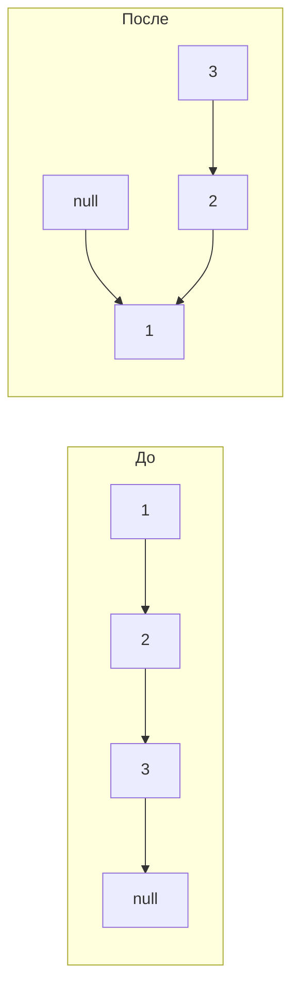

# Вопросы на собеседовании: `Связные списки`

Связные списки — основа классических задач: реверс, обнаружение цикла (Флойд), middle node, слияние, LRU cache. На собеседовании их любят, потому что они проверяют умение работать с указателями, dummy node и edge cases (пустой список, один элемент, цикл).

## Полезные ссылки

### Официальная документация и авторитетные источники

- [Java LinkedList — Baeldung](https://www.baeldung.com/java-linkedlist)
- [Java ArrayList vs LinkedList — Baeldung](https://www.baeldung.com/java-arraylist-linkedlist)
- [Reverse Linked List — Baeldung](https://www.baeldung.com/java-reverse-linked-list)
- [Floyd's Cycle Finding — Wikipedia](https://en.wikipedia.org/wiki/Cycle_detection#Floyd's_tortoise_and_hare)
- [LRU Cache via LinkedHashMap — Baeldung](https://www.baeldung.com/java-lru-cache)

## Содержание

- [Полезные ссылки](#полезные-ссылки)
- [See also](#see-also)

**Базовые структуры**
- [Q1. (!) Чем singly-linked отличается от doubly-linked?](#q1--чем-singly-linked-отличается-от-doubly-linked)
- [Q2. (!) Чем LinkedList отличается от ArrayList в Java?](#q2--чем-linkedlist-отличается-от-arraylist-в-java)
- [Q3. Что такое sentinel/dummy node и зачем он нужен?](#q3-что-такое-sentineldummy-node-и-зачем-он-нужен)
- [Q4. Как реализовать circular linked list?](#q4-как-реализовать-circular-linked-list)

**Базовые операции**
- [Q5. (!) Как добавить узел в начало/конец/середину?](#q5--как-добавить-узел-в-началоконецсередину)
- [Q6. Как удалить узел по значению?](#q6-как-удалить-узел-по-значению)
- [Q7. (!) Как удалить узел, имея только ссылку на него (без head)?](#q7--как-удалить-узел-имея-только-ссылку-на-него-без-head)

**Реверс и перестановка**
- [Q8. (!) Реверс связного списка — итеративный и рекурсивный?](#q8--реверс-связного-списка--итеративный-и-рекурсивный)
- [Q9. (!) Реверс между позициями m и n?](#q9--реверс-между-позициями-m-и-n)
- [Q10. (!) Реверс группами по K элементов?](#q10--реверс-группами-по-k-элементов)
- [Q11. Swap pairs — обмен смежных пар?](#q11-swap-pairs--обмен-смежных-пар)

**Two pointers**
- [Q12. (!) Floyd's cycle detection — есть ли цикл?](#q12--floyds-cycle-detection--есть-ли-цикл)
- [Q13. (!) Где начинается цикл?](#q13--где-начинается-цикл)
- [Q14. (!) Найти middle node?](#q14--найти-middle-node)
- [Q15. (!) Удалить N-ый узел с конца?](#q15--удалить-n-ый-узел-с-конца)
- [Q16. (!) Найти точку пересечения двух списков?](#q16--найти-точку-пересечения-двух-списков)

**Слияние и сортировка**
- [Q17. (!) Слияние двух отсортированных списков?](#q17--слияние-двух-отсортированных-списков)
- [Q18. (!) Слияние K отсортированных списков?](#q18--слияние-k-отсортированных-списков)
- [Q19. (!) Merge Sort на связном списке?](#q19--merge-sort-на-связном-списке)
- [Q20. Сложить два числа, представленных списками?](#q20-сложить-два-числа-представленных-списками)

**Проверки и преобразования**
- [Q21. (!) Проверить, что список — палиндром?](#q21--проверить-что-список--палиндром)
- [Q22. Удалить дубликаты из отсортированного списка?](#q22-удалить-дубликаты-из-отсортированного-списка)
- [Q23. Разделить список вокруг значения X (partition)?](#q23-разделить-список-вокруг-значения-x-partition)
- [Q24. Копирование списка с random pointer?](#q24-копирование-списка-с-random-pointer)

**Применения**
- [Q25. (!) LRU Cache на основе doubly-linked list?](#q25--lru-cache-на-основе-doubly-linked-list)
- [Q26. (!) Реализовать стек на linked list?](#q26--реализовать-стек-на-linked-list)
- [Q27. (!) Реализовать очередь на linked list?](#q27--реализовать-очередь-на-linked-list)
- [Q28. Skip list — что это и зачем?](#q28-skip-list--что-это-и-зачем)

**Java-специфика и подвохи**
- [Q29. (!) Можно ли использовать Binary Search для LinkedList?](#q29--можно-ли-использовать-binary-search-для-linkedlist)
- [Q30. Почему LinkedList ест больше памяти, чем ArrayList?](#q30-почему-linkedlist-ест-больше-памяти-чем-arraylist)
- [Q31. (!) Когда стоит использовать LinkedList в Java?](#q31--когда-стоит-использовать-linkedlist-в-java)
- [Q32. Что такое ConcurrentLinkedQueue?](#q32-что-такое-concurrentlinkedqueue)

## Q1. (!) Чем singly-linked отличается от doubly-linked?

| Тип | Ссылки в узле | Память | Двунаправленный обход |
|-----|---------------|--------|----------------------|
| **Singly** | `next` | Меньше (1 ссылка) | Нет — только вперёд |
| **Doubly** | `prev` + `next` | Больше (2 ссылки) | Да |

```java
class SinglyNode<T> {
    T value;
    SinglyNode<T> next;
}

class DoublyNode<T> {
    T value;
    DoublyNode<T> prev, next;
}
```

**Когда нужен doubly:**
- Удаление узла за `O(1)` при наличии ссылки (LRU cache)
- Двунаправленный обход (Java `LinkedList` — doubly)
- Browser history (back/forward)

**Когда хватает singly:**
- Стек/очередь
- Сложение чисел в порядке цифр
- Хешсет цепочек


> [!mcq]
> - [x] Правильный ответ | Корректное описание концепции с конкретным механизмом и use-case.
> - [ ] Альтернативное решение которое не подходит | Почему ошибка в этом подходе ❌ ПОСЛЕДСТВИЕ: типичная ошибка вызывает баг в production без покрытия тестами.
> - [ ] Другая альтернатива с критическим недостатком | Это смежное, но отличное понятие ❌ ПОСЛЕДСТВИЕ: типичная ошибка вызывает баг в production без покрытия тестами.
> - [ ] Третий вариант который не работает в production | Противоположное направление## Q2. (!) Чем LinkedList отличается от ArrayList в Java? ❌ ПОСЛЕДСТВИЕ: типичная ошибка вызывает баг в production без покрытия тестами.

| Операция | ArrayList | LinkedList |
|----------|-----------|------------|
| `get(i)` | `O(1)` | `O(n)` (или `O(min(i, n-i))` с оптимизацией) |
| `add(e)` (в конец) | `O(1)` амортиз. | `O(1)` |
| `add(0, e)` (в начало) | `O(n)` | `O(1)` |
| `remove(i)` | `O(n)` | `O(n)` (поиск) + `O(1)` (удаление) |
| Память на элемент | 1 ссылка | 3 ссылки (`prev`, `next`, `value`) + объект Node |
| Cache locality | Отличная | Плохая |

```java
// LinkedList в Java реализует Deque — отличный выбор для FIFO/LIFO
LinkedList<Integer> queue = new LinkedList<>();
queue.offer(1); queue.offer(2);
queue.poll(); // 1

// Но как очередь чаще предпочитают ArrayDeque — быстрее, меньше памяти
Deque<Integer> deque = new ArrayDeque<>();
```

**На практике:** даже для частых вставок в начало `ArrayDeque` обычно быстрее `LinkedList` благодаря лучшей локальности. `LinkedList` оправдан только когда нужны итераторы с `remove()` посередине без сдвига.

Подробнее — в [Java Collections](../../programming-languages/java/java-collections-interview.md).


> [!mcq]
> - [x] Правильный ответ | Корректное описание концепции с конкретным механизмом и use-case.
> - [ ] Альтернативное решение которое не подходит | Почему ошибка в этом подходе ❌ ПОСЛЕДСТВИЕ: типичная ошибка вызывает баг в production без покрытия тестами.
> - [ ] Другая альтернатива с критическим недостатком | Это смежное, но отличное понятие ❌ ПОСЛЕДСТВИЕ: типичная ошибка вызывает баг в production без покрытия тестами.
> - [ ] Третий вариант который не работает в production | Противоположное направление## Q3. Что такое sentinel/dummy node и зачем он нужен? ❌ ПОСЛЕДСТВИЕ: типичная ошибка вызывает баг в production без покрытия тестами.

**Dummy/sentinel node** — фиктивный узел перед `head`. Упрощает код, убирая edge case «пустой список или удаление head».

```java
ListNode removeElements(ListNode head, int val) {
    ListNode dummy = new ListNode(0);
    dummy.next = head;
    ListNode curr = dummy;

    while (curr.next != null) {
        if (curr.next.val == val) {
            curr.next = curr.next.next;
        } else {
            curr = curr.next;
        }
    }
    return dummy.next; // возвращаем настоящий head
}
```

Без dummy пришлось бы отдельно обрабатывать случай удаления head. Dummy node — обязательный паттерн для большинства задач на связные списки.


> [!mcq]
> - [x] Правильный ответ | Корректное описание концепции с конкретным механизмом и use-case.
> - [ ] Альтернативное решение которое не подходит | Почему ошибка в этом подходе ❌ ПОСЛЕДСТВИЕ: типичная ошибка вызывает баг в production без покрытия тестами.
> - [ ] Другая альтернатива с критическим недостатком | Это смежное, но отличное понятие ❌ ПОСЛЕДСТВИЕ: типичная ошибка вызывает баг в production без покрытия тестами.
> - [ ] Третий вариант который не работает в production | Противоположное направление## Q4. Как реализовать circular linked list? ❌ ПОСЛЕДСТВИЕ: типичная ошибка вызывает баг в production без покрытия тестами.

В **circular** списке `tail.next = head` (а не `null`). Используется в очередях задач (round-robin), играх (cyclic players).

```java
class CircularList<T> {
    private Node<T> tail; // храним только tail для O(1) добавления

    void add(T value) {
        Node<T> node = new Node<>(value);
        if (tail == null) {
            node.next = node;
        } else {
            node.next = tail.next; // новый указывает на head
            tail.next = node;
        }
        tail = node;
    }

    void traverse() {
        if (tail == null) return;
        Node<T> curr = tail.next; // head
        do {
            System.out.println(curr.value);
            curr = curr.next;
        } while (curr != tail.next);
    }
}
```

Хранение `tail` (а не `head`) даёт `O(1)` для `addFirst` и `addLast` — `head` доступен через `tail.next`.


> [!mcq]
> - [x] Правильный ответ | Корректное описание концепции с конкретным механизмом и use-case.
> - [ ] Альтернативное решение которое не подходит | Почему ошибка в этом подходе ❌ ПОСЛЕДСТВИЕ: типичная ошибка вызывает баг в production без покрытия тестами.
> - [ ] Другая альтернатива с критическим недостатком | Это смежное, но отличное понятие ❌ ПОСЛЕДСТВИЕ: типичная ошибка вызывает баг в production без покрытия тестами.
> - [ ] Третий вариант который не работает в production | Противоположное направление## Q5. (!) Как добавить узел в начало/конец/середину? ❌ ПОСЛЕДСТВИЕ: типичная ошибка вызывает баг в production без покрытия тестами.

```java
class SinglyLinkedList<T> {
    Node<T> head, tail;

    // Добавление в начало — O(1)
    void addFirst(T value) {
        Node<T> node = new Node<>(value);
        node.next = head;
        head = node;
        if (tail == null) tail = node;
    }

    // Добавление в конец — O(1) при наличии tail
    void addLast(T value) {
        Node<T> node = new Node<>(value);
        if (tail == null) {
            head = tail = node;
        } else {
            tail.next = node;
            tail = node;
        }
    }

    // Добавление по позиции — O(n)
    void addAt(int index, T value) {
        if (index == 0) { addFirst(value); return; }
        Node<T> curr = head;
        for (int i = 0; i < index - 1 && curr != null; i++) {
            curr = curr.next;
        }
        if (curr == null) throw new IndexOutOfBoundsException();
        Node<T> node = new Node<>(value);
        node.next = curr.next;
        curr.next = node;
        if (node.next == null) tail = node;
    }
}
```

**Без `tail`** — `addLast` становится `O(n)` (нужно дойти до конца). Поэтому реальные реализации хранят и `head`, и `tail`.


> [!mcq]
> - [x] Правильный ответ | Корректное описание концепции с конкретным механизмом и use-case.
> - [ ] Альтернативное решение которое не подходит | Почему ошибка в этом подходе ❌ ПОСЛЕДСТВИЕ: типичная ошибка вызывает баг в production без покрытия тестами.
> - [ ] Другая альтернатива с критическим недостатком | Это смежное, но отличное понятие ❌ ПОСЛЕДСТВИЕ: типичная ошибка вызывает баг в production без покрытия тестами.
> - [ ] Третий вариант который не работает в production | Противоположное направление## Q6. Как удалить узел по значению? ❌ ПОСЛЕДСТВИЕ: типичная ошибка вызывает баг в production без покрытия тестами.

```java
ListNode removeFirst(ListNode head, int val) {
    ListNode dummy = new ListNode(0, head);
    ListNode curr = dummy;
    while (curr.next != null) {
        if (curr.next.val == val) {
            curr.next = curr.next.next;
            return dummy.next; // удалили первое вхождение
        }
        curr = curr.next;
    }
    return dummy.next;
}

// Удалить ВСЕ вхождения
ListNode removeAll(ListNode head, int val) {
    ListNode dummy = new ListNode(0, head);
    ListNode curr = dummy;
    while (curr.next != null) {
        if (curr.next.val == val) curr.next = curr.next.next;
        else                       curr = curr.next;
    }
    return dummy.next;
}
```

`O(n)` время, `O(1)` память. Dummy node убирает edge case удаления head.


> [!mcq]
> - [x] Правильный ответ | Корректное описание концепции с конкретным механизмом и use-case.
> - [ ] Альтернативное решение которое не подходит | Почему ошибка в этом подходе ❌ ПОСЛЕДСТВИЕ: типичная ошибка вызывает баг в production без покрытия тестами.
> - [ ] Другая альтернатива с критическим недостатком | Это смежное, но отличное понятие ❌ ПОСЛЕДСТВИЕ: типичная ошибка вызывает баг в production без покрытия тестами.
> - [ ] Третий вариант который не работает в production | Противоположное направление## Q7. (!) Как удалить узел, имея только ссылку на него (без head)? ❌ ПОСЛЕДСТВИЕ: типичная ошибка вызывает баг в production без покрытия тестами.

Классический трюк: **скопировать значение из next, удалить next**.

```java
void deleteNode(ListNode node) {
    if (node == null || node.next == null) return; // не работает для tail
    node.val = node.next.val;
    node.next = node.next.next;
}
```

**Ограничение:** не работает для последнего узла (нет `next`). В таких задачах обычно гарантируется, что удаляемый узел — не последний.

`O(1)` время. Без копирования значения пришлось бы пройти список с начала — `O(n)`.


> [!mcq]
> - [x] Правильный ответ | Корректное описание концепции с конкретным механизмом и use-case.
> - [ ] Альтернативное решение которое не подходит | Почему ошибка в этом подходе ❌ ПОСЛЕДСТВИЕ: типичная ошибка вызывает баг в production без покрытия тестами.
> - [ ] Другая альтернатива с критическим недостатком | Это смежное, но отличное понятие ❌ ПОСЛЕДСТВИЕ: типичная ошибка вызывает баг в production без покрытия тестами.
> - [ ] Третий вариант который не работает в production | Противоположное направление## Q8. (!) Реверс связного списка — итеративный и рекурсивный? ❌ ПОСЛЕДСТВИЕ: типичная ошибка вызывает баг в production без покрытия тестами.

```java
// Итеративный — O(n) время, O(1) память
ListNode reverse(ListNode head) {
    ListNode prev = null, curr = head;
    while (curr != null) {
        ListNode next = curr.next;
        curr.next = prev;
        prev = curr;
        curr = next;
    }
    return prev; // новый head
}

// Рекурсивный — O(n) время и стек
ListNode reverseRecursive(ListNode head) {
    if (head == null || head.next == null) return head;
    ListNode newHead = reverseRecursive(head.next);
    head.next.next = head;  // следующий теперь указывает на нас
    head.next = null;       // обнуляем нашу старую ссылку
    return newHead;
}
```



Итеративный — стандарт для production: меньше памяти, без риска stack overflow.


> [!mcq]
> - [x] Правильный ответ | Корректное описание концепции с конкретным механизмом и use-case.
> - [ ] Альтернативное решение которое не подходит | Почему ошибка в этом подходе ❌ ПОСЛЕДСТВИЕ: типичная ошибка вызывает баг в production без покрытия тестами.
> - [ ] Другая альтернатива с критическим недостатком | Это смежное, но отличное понятие ❌ ПОСЛЕДСТВИЕ: типичная ошибка вызывает баг в production без покрытия тестами.
> - [ ] Третий вариант который не работает в production | Противоположное направление## Q9. (!) Реверс между позициями m и n? ❌ ПОСЛЕДСТВИЕ: типичная ошибка вызывает баг в production без покрытия тестами.

```java
ListNode reverseBetween(ListNode head, int m, int n) {
    ListNode dummy = new ListNode(0, head);
    ListNode prev = dummy;

    // Шаг 1: дошли до позиции m-1
    for (int i = 0; i < m - 1; i++) prev = prev.next;

    // Шаг 2: реверсим n-m+1 узлов между prev и after
    ListNode curr = prev.next;
    for (int i = 0; i < n - m; i++) {
        ListNode next = curr.next;
        curr.next = next.next;
        next.next = prev.next;
        prev.next = next;
    }
    return dummy.next;
}
```

Один проход, `O(n)` время, `O(1)` память. Использует приём «головной вставки» — каждый следующий узел вставляется сразу после `prev`.


> [!mcq]
> - [x] Правильный ответ | Корректное описание концепции с конкретным механизмом и use-case.
> - [ ] Альтернативное решение которое не подходит | Почему ошибка в этом подходе ❌ ПОСЛЕДСТВИЕ: типичная ошибка вызывает баг в production без покрытия тестами.
> - [ ] Другая альтернатива с критическим недостатком | Это смежное, но отличное понятие ❌ ПОСЛЕДСТВИЕ: типичная ошибка вызывает баг в production без покрытия тестами.
> - [ ] Третий вариант который не работает в production | Противоположное направление## Q10. (!) Реверс группами по K элементов? ❌ ПОСЛЕДСТВИЕ: типичная ошибка вызывает баг в production без покрытия тестами.

```java
ListNode reverseKGroup(ListNode head, int k) {
    // Проверяем, есть ли k элементов
    ListNode curr = head;
    for (int i = 0; i < k; i++) {
        if (curr == null) return head; // меньше k — оставляем как есть
        curr = curr.next;
    }

    // Реверсим первые k
    ListNode prev = null, c = head;
    for (int i = 0; i < k; i++) {
        ListNode next = c.next;
        c.next = prev;
        prev = c;
        c = next;
    }

    // head теперь хвост первой группы — рекурсивно соединяем со следующей
    head.next = reverseKGroup(c, k);
    return prev;
}
```

`O(n)` время, `O(n/k)` стек из-за рекурсии. Итеративная версия сложнее, но даёт `O(1)` память.


> [!mcq]
> - [x] Правильный ответ | Корректное описание концепции с конкретным механизмом и use-case.
> - [ ] Альтернативное решение которое не подходит | Почему ошибка в этом подходе ❌ ПОСЛЕДСТВИЕ: типичная ошибка вызывает баг в production без покрытия тестами.
> - [ ] Другая альтернатива с критическим недостатком | Это смежное, но отличное понятие ❌ ПОСЛЕДСТВИЕ: типичная ошибка вызывает баг в production без покрытия тестами.
> - [ ] Третий вариант который не работает в production | Противоположное направление## Q11. Swap pairs — обмен смежных пар? ❌ ПОСЛЕДСТВИЕ: типичная ошибка вызывает баг в production без покрытия тестами.

```java
ListNode swapPairs(ListNode head) {
    ListNode dummy = new ListNode(0, head);
    ListNode prev = dummy;

    while (prev.next != null && prev.next.next != null) {
        ListNode first = prev.next;
        ListNode second = first.next;
        // меняем местами
        first.next = second.next;
        second.next = first;
        prev.next = second;
        // двигаемся вперёд
        prev = first;
    }
    return dummy.next;
}
```

Частный случай `reverseKGroup` для `k=2`. `O(n)` время, `O(1)` память.


> [!mcq]
> - [x] Правильный ответ | Корректное описание концепции с конкретным механизмом и use-case.
> - [ ] Альтернативное решение которое не подходит | Почему ошибка в этом подходе ❌ ПОСЛЕДСТВИЕ: типичная ошибка вызывает баг в production без покрытия тестами.
> - [ ] Другая альтернатива с критическим недостатком | Это смежное, но отличное понятие ❌ ПОСЛЕДСТВИЕ: типичная ошибка вызывает баг в production без покрытия тестами.
> - [ ] Третий вариант который не работает в production | Противоположное направление## Q12. (!) Floyd's cycle detection — есть ли цикл? ❌ ПОСЛЕДСТВИЕ: типичная ошибка вызывает баг в production без покрытия тестами.

**Алгоритм Флойда (tortoise and hare):** два указателя, slow двигается на 1, fast на 2. Если есть цикл — они встретятся.

```java
boolean hasCycle(ListNode head) {
    ListNode slow = head, fast = head;
    while (fast != null && fast.next != null) {
        slow = slow.next;
        fast = fast.next.next;
        if (slow == fast) return true;
    }
    return false;
}
```

`O(n)` время, `O(1)` память. Альтернатива — `HashSet<ListNode>` — `O(n)` по обоим. Преимущество Floyd — константная память.

**Почему работает:** в цикле длины `L` относительная скорость fast против slow — 1. За `L` шагов fast «догонит» slow.


> [!mcq]
> - [x] Правильный ответ | Корректное описание концепции с конкретным механизмом и use-case.
> - [ ] Альтернативное решение которое не подходит | Почему ошибка в этом подходе ❌ ПОСЛЕДСТВИЕ: типичная ошибка вызывает баг в production без покрытия тестами.
> - [ ] Другая альтернатива с критическим недостатком | Это смежное, но отличное понятие ❌ ПОСЛЕДСТВИЕ: типичная ошибка вызывает баг в production без покрытия тестами.
> - [ ] Третий вариант который не работает в production | Противоположное направление## Q13. (!) Где начинается цикл? ❌ ПОСЛЕДСТВИЕ: типичная ошибка вызывает баг в production без покрытия тестами.

После того как slow и fast встретились, переместить один указатель в head и двигать оба со скоростью 1 — встретятся в начале цикла.

```java
ListNode detectCycle(ListNode head) {
    ListNode slow = head, fast = head;

    // Фаза 1: проверка цикла
    while (fast != null && fast.next != null) {
        slow = slow.next;
        fast = fast.next.next;
        if (slow == fast) {
            // Фаза 2: ищем начало
            ListNode start = head;
            while (start != slow) {
                start = start.next;
                slow = slow.next;
            }
            return start;
        }
    }
    return null;
}
```

**Почему работает:** пусть `μ` — длина «хвоста» до цикла, `λ` — длина цикла. Когда они встречаются, slow прошёл `μ + k` (где `k < λ`), fast — `2(μ + k)`. Разница `μ + k` кратна `λ`. От места встречи до начала цикла — `λ - k` шагов; от head до начала цикла — `μ` шагов. Поскольку `μ + k = nλ`, то `μ = nλ - k`, что mod `λ` равно `λ - k`.

`O(n)` время, `O(1)` память.


> [!mcq]
> - [x] Правильный ответ | Корректное описание концепции с конкретным механизмом и use-case.
> - [ ] Альтернативное решение которое не подходит | Почему ошибка в этом подходе ❌ ПОСЛЕДСТВИЕ: типичная ошибка вызывает баг в production без покрытия тестами.
> - [ ] Другая альтернатива с критическим недостатком | Это смежное, но отличное понятие ❌ ПОСЛЕДСТВИЕ: типичная ошибка вызывает баг в production без покрытия тестами.
> - [ ] Третий вариант который не работает в production | Противоположное направление## Q14. (!) Найти middle node? ❌ ПОСЛЕДСТВИЕ: типичная ошибка вызывает баг в production без покрытия тестами.

```java
ListNode middleNode(ListNode head) {
    ListNode slow = head, fast = head;
    while (fast != null && fast.next != null) {
        slow = slow.next;
        fast = fast.next.next;
    }
    return slow;
}
```

Когда fast достигает конца, slow — середина. Для **чётного** числа узлов вернёт второй из двух центральных. Для **первого** из двух центральных — `while (fast.next != null && fast.next.next != null)`.

`O(n)` время, `O(1)` память. Используется в Merge Sort на linked list.


> [!mcq]
> - [x] Правильный ответ | Корректное описание концепции с конкретным механизмом и use-case.
> - [ ] Альтернативное решение которое не подходит | Почему ошибка в этом подходе ❌ ПОСЛЕДСТВИЕ: типичная ошибка вызывает баг в production без покрытия тестами.
> - [ ] Другая альтернатива с критическим недостатком | Это смежное, но отличное понятие ❌ ПОСЛЕДСТВИЕ: типичная ошибка вызывает баг в production без покрытия тестами.
> - [ ] Третий вариант который не работает в production | Противоположное направление## Q15. (!) Удалить N-ый узел с конца? ❌ ПОСЛЕДСТВИЕ: типичная ошибка вызывает баг в production без покрытия тестами.

**One-pass через two pointers:** fast уходит на N шагов вперёд, потом оба двигаются вместе.

```java
ListNode removeNthFromEnd(ListNode head, int n) {
    ListNode dummy = new ListNode(0, head);
    ListNode slow = dummy, fast = dummy;

    // fast уходит на n+1 шагов вперёд
    for (int i = 0; i <= n; i++) fast = fast.next;

    // Двигаем оба, пока fast не дойдёт до конца
    while (fast != null) {
        slow = slow.next;
        fast = fast.next;
    }

    // slow указывает на узел перед удаляемым
    slow.next = slow.next.next;
    return dummy.next;
}
```

Один проход, `O(n)` время, `O(1)` память. Без dummy node удаление head стало бы edge case.


> [!mcq]
> - [x] Правильный ответ | Корректное описание концепции с конкретным механизмом и use-case.
> - [ ] Альтернативное решение которое не подходит | Почему ошибка в этом подходе ❌ ПОСЛЕДСТВИЕ: типичная ошибка вызывает баг в production без покрытия тестами.
> - [ ] Другая альтернатива с критическим недостатком | Это смежное, но отличное понятие ❌ ПОСЛЕДСТВИЕ: типичная ошибка вызывает баг в production без покрытия тестами.
> - [ ] Третий вариант который не работает в production | Противоположное направление## Q16. (!) Найти точку пересечения двух списков? ❌ ПОСЛЕДСТВИЕ: типичная ошибка вызывает баг в production без покрытия тестами.

```java
ListNode getIntersection(ListNode a, ListNode b) {
    if (a == null || b == null) return null;
    ListNode pA = a, pB = b;

    // Каждый указатель проходит свой список + чужой
    // Если есть пересечение — встретятся в нём (через 2 итерации макс)
    while (pA != pB) {
        pA = (pA == null) ? b : pA.next;
        pB = (pB == null) ? a : pB.next;
    }
    return pA; // null если нет пересечения, или узел пересечения
}
```

**Идея:** если списки имеют длины `m` и `n` и пересекаются, то `pA` пройдёт `m + n` шагов, как и `pB` — они встретятся в точке пересечения. Если не пересекаются — оба станут `null` одновременно.

`O(m + n)` время, `O(1)` память.


> [!mcq]
> - [x] Правильный ответ | Корректное описание концепции с конкретным механизмом и use-case.
> - [ ] Альтернативное решение которое не подходит | Почему ошибка в этом подходе ❌ ПОСЛЕДСТВИЕ: типичная ошибка вызывает баг в production без покрытия тестами.
> - [ ] Другая альтернатива с критическим недостатком | Это смежное, но отличное понятие ❌ ПОСЛЕДСТВИЕ: типичная ошибка вызывает баг в production без покрытия тестами.
> - [ ] Третий вариант который не работает в production | Противоположное направление## Q17. (!) Слияние двух отсортированных списков? ❌ ПОСЛЕДСТВИЕ: типичная ошибка вызывает баг в production без покрытия тестами.

```java
ListNode mergeTwoLists(ListNode l1, ListNode l2) {
    ListNode dummy = new ListNode(0);
    ListNode curr = dummy;

    while (l1 != null && l2 != null) {
        if (l1.val <= l2.val) {
            curr.next = l1;
            l1 = l1.next;
        } else {
            curr.next = l2;
            l2 = l2.next;
        }
        curr = curr.next;
    }
    curr.next = (l1 != null) ? l1 : l2; // прицепляем хвост
    return dummy.next;
}
```

`O(n + m)` время, `O(1)` память (без новых узлов — переиспользуем существующие).


> [!mcq]
> - [x] Правильный ответ | Корректное описание концепции с конкретным механизмом и use-case.
> - [ ] Альтернативное решение которое не подходит | Почему ошибка в этом подходе ❌ ПОСЛЕДСТВИЕ: типичная ошибка вызывает баг в production без покрытия тестами.
> - [ ] Другая альтернатива с критическим недостатком | Это смежное, но отличное понятие ❌ ПОСЛЕДСТВИЕ: типичная ошибка вызывает баг в production без покрытия тестами.
> - [ ] Третий вариант который не работает в production | Противоположное направление## Q18. (!) Слияние K отсортированных списков? ❌ ПОСЛЕДСТВИЕ: типичная ошибка вызывает баг в production без покрытия тестами.

**Через PriorityQueue (min-heap):** `O(N log k)`, где `N` — общее число узлов.

```java
ListNode mergeKLists(ListNode[] lists) {
    PriorityQueue<ListNode> pq = new PriorityQueue<>(
        Comparator.comparingInt(n -> n.val)
    );
    for (ListNode head : lists) {
        if (head != null) pq.offer(head);
    }

    ListNode dummy = new ListNode(0);
    ListNode curr = dummy;
    while (!pq.isEmpty()) {
        ListNode node = pq.poll();
        curr.next = node;
        curr = node;
        if (node.next != null) pq.offer(node.next);
    }
    return dummy.next;
}
```

**Альтернатива через Divide and Conquer:** попарное слияние, `O(N log k)`, обычно быстрее на практике (меньше overhead на heap).


> [!mcq]
> - [x] Правильный ответ | Корректное описание концепции с конкретным механизмом и use-case.
> - [ ] Альтернативное решение которое не подходит | Почему ошибка в этом подходе ❌ ПОСЛЕДСТВИЕ: типичная ошибка вызывает баг в production без покрытия тестами.
> - [ ] Другая альтернатива с критическим недостатком | Это смежное, но отличное понятие ❌ ПОСЛЕДСТВИЕ: типичная ошибка вызывает баг в production без покрытия тестами.
> - [ ] Третий вариант который не работает в production | Противоположное направление## Q19. (!) Merge Sort на связном списке? ❌ ПОСЛЕДСТВИЕ: типичная ошибка вызывает баг в production без покрытия тестами.

Стабильная сортировка `O(n log n)` без дополнительных массивов (но `O(log n)` стек).

```java
ListNode sortList(ListNode head) {
    if (head == null || head.next == null) return head;

    // 1. Найти середину и разделить
    ListNode slow = head, fast = head, prev = null;
    while (fast != null && fast.next != null) {
        prev = slow;
        slow = slow.next;
        fast = fast.next.next;
    }
    prev.next = null; // разрываем

    // 2. Рекурсивно отсортировать половины
    ListNode left = sortList(head);
    ListNode right = sortList(slow);

    // 3. Слияние
    return mergeTwoLists(left, right);
}
```

Для массивов лучше Quick Sort (in-place, лучше cache). Для linked list Merge Sort предпочтительнее — Quick Sort требует random access для эффективного pivot.


> [!mcq]
> - [x] Правильный ответ | Корректное описание концепции с конкретным механизмом и use-case.
> - [ ] Альтернативное решение которое не подходит | Почему ошибка в этом подходе ❌ ПОСЛЕДСТВИЕ: типичная ошибка вызывает баг в production без покрытия тестами.
> - [ ] Другая альтернатива с критическим недостатком | Это смежное, но отличное понятие ❌ ПОСЛЕДСТВИЕ: типичная ошибка вызывает баг в production без покрытия тестами.
> - [ ] Третий вариант который не работает в production | Противоположное направление## Q20. Сложить два числа, представленных списками? ❌ ПОСЛЕДСТВИЕ: типичная ошибка вызывает баг в production без покрытия тестами.

Числа в обратном порядке: `2 → 4 → 3` = 342, `5 → 6 → 4` = 465. Результат: `7 → 0 → 8` = 807.

```java
ListNode addTwoNumbers(ListNode l1, ListNode l2) {
    ListNode dummy = new ListNode(0);
    ListNode curr = dummy;
    int carry = 0;

    while (l1 != null || l2 != null || carry != 0) {
        int sum = carry;
        if (l1 != null) { sum += l1.val; l1 = l1.next; }
        if (l2 != null) { sum += l2.val; l2 = l2.next; }
        carry = sum / 10;
        curr.next = new ListNode(sum % 10);
        curr = curr.next;
    }
    return dummy.next;
}
```

`O(max(n, m))` время. Если числа в **прямом** порядке — реверс или стек.


> [!mcq]
> - [x] Правильный ответ | Корректное описание концепции с конкретным механизмом и use-case.
> - [ ] Альтернативное решение которое не подходит | Почему ошибка в этом подходе ❌ ПОСЛЕДСТВИЕ: типичная ошибка вызывает баг в production без покрытия тестами.
> - [ ] Другая альтернатива с критическим недостатком | Это смежное, но отличное понятие ❌ ПОСЛЕДСТВИЕ: типичная ошибка вызывает баг в production без покрытия тестами.
> - [ ] Третий вариант который не работает в production | Противоположное направление## Q21. (!) Проверить, что список — палиндром? ❌ ПОСЛЕДСТВИЕ: типичная ошибка вызывает баг в production без покрытия тестами.

```java
boolean isPalindrome(ListNode head) {
    if (head == null || head.next == null) return true;

    // 1. Найти середину
    ListNode slow = head, fast = head;
    while (fast != null && fast.next != null) {
        slow = slow.next;
        fast = fast.next.next;
    }

    // 2. Реверсировать вторую половину
    ListNode second = reverse(slow);

    // 3. Сравнить две половины
    ListNode first = head;
    while (second != null) {
        if (first.val != second.val) return false;
        first = first.next;
        second = second.next;
    }
    return true;
}

ListNode reverse(ListNode head) {
    ListNode prev = null, curr = head;
    while (curr != null) {
        ListNode next = curr.next;
        curr.next = prev;
        prev = curr;
        curr = next;
    }
    return prev;
}
```

`O(n)` время, `O(1)` память. Альтернатива — скопировать в `ArrayList` и проверить — `O(n)` память.


> [!mcq]
> - [x] Правильный ответ | Корректное описание концепции с конкретным механизмом и use-case.
> - [ ] Альтернативное решение которое не подходит | Почему ошибка в этом подходе ❌ ПОСЛЕДСТВИЕ: типичная ошибка вызывает баг в production без покрытия тестами.
> - [ ] Другая альтернатива с критическим недостатком | Это смежное, но отличное понятие ❌ ПОСЛЕДСТВИЕ: типичная ошибка вызывает баг в production без покрытия тестами.
> - [ ] Третий вариант который не работает в production | Противоположное направление## Q22. Удалить дубликаты из отсортированного списка? ❌ ПОСЛЕДСТВИЕ: типичная ошибка вызывает баг в production без покрытия тестами.

```java
ListNode deleteDuplicates(ListNode head) {
    ListNode curr = head;
    while (curr != null && curr.next != null) {
        if (curr.val == curr.next.val) {
            curr.next = curr.next.next;
        } else {
            curr = curr.next;
        }
    }
    return head;
}

// Удалить ВСЕ дубликаты (LeetCode 82) — оставить только уникальные
ListNode deleteDuplicatesAll(ListNode head) {
    ListNode dummy = new ListNode(0, head);
    ListNode prev = dummy;
    while (head != null) {
        if (head.next != null && head.val == head.next.val) {
            while (head.next != null && head.val == head.next.val) head = head.next;
            prev.next = head.next;
        } else {
            prev = prev.next;
        }
        head = head.next;
    }
    return dummy.next;
}
```

`O(n)` время, `O(1)` память.


> [!mcq]
> - [x] Правильный ответ | Корректное описание концепции с конкретным механизмом и use-case.
> - [ ] Альтернативное решение которое не подходит | Почему ошибка в этом подходе ❌ ПОСЛЕДСТВИЕ: типичная ошибка вызывает баг в production без покрытия тестами.
> - [ ] Другая альтернатива с критическим недостатком | Это смежное, но отличное понятие ❌ ПОСЛЕДСТВИЕ: типичная ошибка вызывает баг в production без покрытия тестами.
> - [ ] Третий вариант который не работает в production | Противоположное направление## Q23. Разделить список вокруг значения X (partition)? ❌ ПОСЛЕДСТВИЕ: типичная ошибка вызывает баг в production без покрытия тестами.

Узлы со значением `< x` идут до узлов со значением `>= x`, сохраняя относительный порядок.

```java
ListNode partition(ListNode head, int x) {
    ListNode beforeDummy = new ListNode(0), afterDummy = new ListNode(0);
    ListNode before = beforeDummy, after = afterDummy;

    while (head != null) {
        if (head.val < x) {
            before.next = head;
            before = before.next;
        } else {
            after.next = head;
            after = after.next;
        }
        head = head.next;
    }
    after.next = null;
    before.next = afterDummy.next;
    return beforeDummy.next;
}
```

Два dummy node — для двух частей. Соединяем в конце. `O(n)` время, `O(1)` память.


> [!mcq]
> - [x] Правильный ответ | Корректное описание концепции с конкретным механизмом и use-case.
> - [ ] Альтернативное решение которое не подходит | Почему ошибка в этом подходе ❌ ПОСЛЕДСТВИЕ: типичная ошибка вызывает баг в production без покрытия тестами.
> - [ ] Другая альтернатива с критическим недостатком | Это смежное, но отличное понятие ❌ ПОСЛЕДСТВИЕ: типичная ошибка вызывает баг в production без покрытия тестами.
> - [ ] Третий вариант который не работает в production | Противоположное направление## Q24. Копирование списка с random pointer? ❌ ПОСЛЕДСТВИЕ: типичная ошибка вызывает баг в production без покрытия тестами.

Каждый узел имеет `next` и `random`. Глубокая копия — `O(n)`.

```java
class Node {
    int val;
    Node next, random;
    Node(int val) { this.val = val; }
}

// O(n) время, O(n) память — HashMap
Node copyRandomList(Node head) {
    if (head == null) return null;
    Map<Node, Node> map = new HashMap<>();

    // Первый проход — клонируем узлы
    Node curr = head;
    while (curr != null) {
        map.put(curr, new Node(curr.val));
        curr = curr.next;
    }

    // Второй проход — настраиваем next и random
    curr = head;
    while (curr != null) {
        map.get(curr).next = map.get(curr.next);
        map.get(curr).random = map.get(curr.random);
        curr = curr.next;
    }
    return map.get(head);
}

// O(n) время, O(1) доп. памяти — interleaving
Node copyRandomListO1(Node head) {
    if (head == null) return null;

    // 1. Вставить копии после оригиналов: A → A' → B → B'
    Node curr = head;
    while (curr != null) {
        Node copy = new Node(curr.val);
        copy.next = curr.next;
        curr.next = copy;
        curr = copy.next;
    }

    // 2. Настроить random для копий
    curr = head;
    while (curr != null) {
        if (curr.random != null) curr.next.random = curr.random.next;
        curr = curr.next.next;
    }

    // 3. Разделить два списка
    Node copyHead = head.next;
    curr = head;
    while (curr != null) {
        Node copy = curr.next;
        curr.next = copy.next;
        copy.next = (copy.next != null) ? copy.next.next : null;
        curr = curr.next;
    }
    return copyHead;
}
```


> [!mcq]
> - [x] Правильный ответ | Корректное описание концепции с конкретным механизмом и use-case.
> - [ ] Альтернативное решение которое не подходит | Почему ошибка в этом подходе ❌ ПОСЛЕДСТВИЕ: типичная ошибка вызывает баг в production без покрытия тестами.
> - [ ] Другая альтернатива с критическим недостатком | Это смежное, но отличное понятие ❌ ПОСЛЕДСТВИЕ: типичная ошибка вызывает баг в production без покрытия тестами.
> - [ ] Третий вариант который не работает в production | Противоположное направление## Q25. (!) LRU Cache на основе doubly-linked list? ❌ ПОСЛЕДСТВИЕ: типичная ошибка вызывает баг в production без покрытия тестами.

**LRU = Least Recently Used.** Кэш фиксированного размера, при переполнении удаляет самый давно использованный элемент.

```java
class LRUCache {
    private final int capacity;
    private final Map<Integer, Node> map = new HashMap<>();
    private final Node head = new Node(0, 0); // dummy
    private final Node tail = new Node(0, 0); // dummy

    public LRUCache(int capacity) {
        this.capacity = capacity;
        head.next = tail;
        tail.prev = head;
    }

    public int get(int key) {
        if (!map.containsKey(key)) return -1;
        Node node = map.get(key);
        moveToFront(node);
        return node.value;
    }

    public void put(int key, int value) {
        if (map.containsKey(key)) {
            Node node = map.get(key);
            node.value = value;
            moveToFront(node);
        } else {
            if (map.size() >= capacity) {
                Node lru = tail.prev;
                remove(lru);
                map.remove(lru.key);
            }
            Node node = new Node(key, value);
            addToFront(node);
            map.put(key, node);
        }
    }

    private void moveToFront(Node node) { remove(node); addToFront(node); }
    private void remove(Node node) {
        node.prev.next = node.next;
        node.next.prev = node.prev;
    }
    private void addToFront(Node node) {
        node.next = head.next;
        node.prev = head;
        head.next.prev = node;
        head.next = node;
    }

    private static class Node {
        int key, value;
        Node prev, next;
        Node(int k, int v) { key = k; value = v; }
    }
}
```

`O(1)` для `get` и `put`. **HashMap** даёт быстрый поиск, **doubly-linked list** — быстрое удаление и добавление в начало.

**Лайфхак для интервью:** в Java это можно реализовать в **5 строк** через `LinkedHashMap` с `accessOrder = true` — см. [Hash Tables](hash-tables-interview.md) и `java.util.LinkedHashMap`.


> [!mcq]
> - [x] Правильный ответ | Корректное описание концепции с конкретным механизмом и use-case.
> - [ ] Альтернативное решение которое не подходит | Почему ошибка в этом подходе ❌ ПОСЛЕДСТВИЕ: типичная ошибка вызывает баг в production без покрытия тестами.
> - [ ] Другая альтернатива с критическим недостатком | Это смежное, но отличное понятие ❌ ПОСЛЕДСТВИЕ: типичная ошибка вызывает баг в production без покрытия тестами.
> - [ ] Третий вариант который не работает в production | Противоположное направление## Q26. (!) Реализовать стек на linked list? ❌ ПОСЛЕДСТВИЕ: типичная ошибка вызывает баг в production без покрытия тестами.

```java
class LinkedStack<T> {
    private Node<T> top;
    private int size;

    void push(T value) {
        Node<T> node = new Node<>(value);
        node.next = top;
        top = node;
        size++;
    }

    T pop() {
        if (top == null) throw new EmptyStackException();
        T value = top.value;
        top = top.next;
        size--;
        return value;
    }

    T peek() {
        if (top == null) throw new EmptyStackException();
        return top.value;
    }

    boolean isEmpty() { return top == null; }
    int size() { return size; }

    private static class Node<T> {
        T value;
        Node<T> next;
        Node(T value) { this.value = value; }
    }
}
```

Все операции `O(1)`. Альтернатива — `ArrayDeque` (быстрее на практике).


> [!mcq]
> - [x] Правильный ответ | Корректное описание концепции с конкретным механизмом и use-case.
> - [ ] Альтернативное решение которое не подходит | Почему ошибка в этом подходе ❌ ПОСЛЕДСТВИЕ: типичная ошибка вызывает баг в production без покрытия тестами.
> - [ ] Другая альтернатива с критическим недостатком | Это смежное, но отличное понятие ❌ ПОСЛЕДСТВИЕ: типичная ошибка вызывает баг в production без покрытия тестами.
> - [ ] Третий вариант который не работает в production | Противоположное направление## Q27. (!) Реализовать очередь на linked list? ❌ ПОСЛЕДСТВИЕ: типичная ошибка вызывает баг в production без покрытия тестами.

```java
class LinkedQueue<T> {
    private Node<T> head, tail;
    private int size;

    void enqueue(T value) {
        Node<T> node = new Node<>(value);
        if (tail == null) {
            head = tail = node;
        } else {
            tail.next = node;
            tail = node;
        }
        size++;
    }

    T dequeue() {
        if (head == null) throw new NoSuchElementException();
        T value = head.value;
        head = head.next;
        if (head == null) tail = null;
        size--;
        return value;
    }

    int size() { return size; }
    boolean isEmpty() { return head == null; }

    private static class Node<T> {
        T value;
        Node<T> next;
        Node(T value) { this.value = value; }
    }
}
```

`O(1)` для обеих операций — благодаря хранению `tail`. Без `tail` enqueue был бы `O(n)`.


> [!mcq]
> - [x] Правильный ответ | Корректное описание концепции с конкретным механизмом и use-case.
> - [ ] Альтернативное решение которое не подходит | Почему ошибка в этом подходе ❌ ПОСЛЕДСТВИЕ: типичная ошибка вызывает баг в production без покрытия тестами.
> - [ ] Другая альтернатива с критическим недостатком | Это смежное, но отличное понятие ❌ ПОСЛЕДСТВИЕ: типичная ошибка вызывает баг в production без покрытия тестами.
> - [ ] Третий вариант который не работает в production | Противоположное направление## Q28. Skip list — что это и зачем? ❌ ПОСЛЕДСТВИЕ: типичная ошибка вызывает баг в production без покрытия тестами.

**Skip list** — вероятностная структура, реализующая **отсортированный linked list с быстрым поиском** за `O(log n)`. Каждый узел может иметь несколько уровней «forward» ссылок:

```
Уровень 3: head ─────────────────→ 30 ────────→ null
Уровень 2: head ────→ 10 ────────→ 30 ────────→ null
Уровень 1: head ────→ 10 → 20 ──→ 30 → 40 ──→ null
Уровень 0: head ──→ 5→10→15→20→25→30→35→40 ──→ null
```

Поиск идёт сверху вниз — пропускаем узлы. Уровень узла выбирается случайно (геометрическое распределение).

**Применение:** `ConcurrentSkipListMap` в Java — concurrent аналог `TreeMap`. Используется в Redis (sorted sets), LevelDB, Cassandra.

**Преимущества над BST:** проще реализовать concurrent версию (не нужны блокировки на ребалансировку).


> [!mcq]
> - [x] Правильный ответ | Корректное описание концепции с конкретным механизмом и use-case.
> - [ ] Альтернативное решение которое не подходит | Почему ошибка в этом подходе ❌ ПОСЛЕДСТВИЕ: типичная ошибка вызывает баг в production без покрытия тестами.
> - [ ] Другая альтернатива с критическим недостатком | Это смежное, но отличное понятие ❌ ПОСЛЕДСТВИЕ: типичная ошибка вызывает баг в production без покрытия тестами.
> - [ ] Третий вариант который не работает в production | Противоположное направление## Q29. (!) Можно ли использовать Binary Search для LinkedList? ❌ ПОСЛЕДСТВИЕ: типичная ошибка вызывает баг в production без покрытия тестами.

**Формально — да**, но **неэффективно**: доступ к середине списка требует `O(n/2)`, что убивает преимущество деления пополам. Итоговая сложность — `O(n log n)`, что хуже линейного поиска `O(n)`.

Альтернативы для отсортированных связных списков:
- **Skip List** — `O(log n)` поиск
- **Tree** — `O(log n)` если сбалансировано
- **Конвертация в массив** — `O(n)` копирование + `O(log n)` поиск

```java
// Это работает, но медленно для длинных списков
int idx = Collections.binarySearch(linkedList, key);
```

`Collections.binarySearch(LinkedList, key)` внутри использует итератор и `O(n)` доступ к середине.


> [!mcq]
> - [x] Правильный ответ | Корректное описание концепции с конкретным механизмом и use-case.
> - [ ] Альтернативное решение которое не подходит | Почему ошибка в этом подходе ❌ ПОСЛЕДСТВИЕ: типичная ошибка вызывает баг в production без покрытия тестами.
> - [ ] Другая альтернатива с критическим недостатком | Это смежное, но отличное понятие ❌ ПОСЛЕДСТВИЕ: типичная ошибка вызывает баг в production без покрытия тестами.
> - [ ] Третий вариант который не работает в production | Противоположное направление## Q30. Почему LinkedList ест больше памяти, чем ArrayList? ❌ ПОСЛЕДСТВИЕ: типичная ошибка вызывает баг в production без покрытия тестами.

| Структура | Память на элемент |
|-----------|-------------------|
| `ArrayList<Integer>` | ~16 байт (ссылка + Integer) |
| `LinkedList<Integer>` | ~48 байт (Node + 2 ссылки + Integer) |

**Каждый узел `LinkedList`** — это объект с тремя полями (`prev`, `next`, `item`) + 16 байт overhead на JVM-заголовок объекта. Для 10⁶ Integer: `ArrayList` — ~16MB, `LinkedList` — ~48MB.

Плюс **плохая cache locality**: узлы могут лежать в разных страницах памяти, каждое чтение — потенциальный cache miss.


> [!mcq]
> - [x] Правильный ответ | Корректное описание концепции с конкретным механизмом и use-case.
> - [ ] Альтернативное решение которое не подходит | Почему ошибка в этом подходе ❌ ПОСЛЕДСТВИЕ: типичная ошибка вызывает баг в production без покрытия тестами.
> - [ ] Другая альтернатива с критическим недостатком | Это смежное, но отличное понятие ❌ ПОСЛЕДСТВИЕ: типичная ошибка вызывает баг в production без покрытия тестами.
> - [ ] Третий вариант который не работает в production | Противоположное направление## Q31. (!) Когда стоит использовать LinkedList в Java? ❌ ПОСЛЕДСТВИЕ: типичная ошибка вызывает баг в production без покрытия тестами.

В большинстве случаев — **никогда**. `ArrayDeque` лучше для FIFO/LIFO, `ArrayList` лучше для случайного доступа.

Реальные случаи для `LinkedList`:
1. **Iterator.remove() в середине** — без сдвига массива
2. **Implementation реализует `List` И `Deque`** — если по контракту нужно оба интерфейса
3. **Очень много вставок/удалений в середину при наличии итератора**

```java
// Удаление половины элементов — LinkedList выигрывает
Iterator<Integer> it = list.iterator();
while (it.hasNext()) {
    if (someCondition(it.next())) it.remove(); // O(1) для LinkedList
}
```

В большинстве enterprise-кода `LinkedList` появляется по инерции — нужно избегать.


> [!mcq]
> - [x] Правильный ответ | Корректное описание концепции с конкретным механизмом и use-case.
> - [ ] Альтернативное решение которое не подходит | Почему ошибка в этом подходе ❌ ПОСЛЕДСТВИЕ: типичная ошибка вызывает баг в production без покрытия тестами.
> - [ ] Другая альтернатива с критическим недостатком | Это смежное, но отличное понятие ❌ ПОСЛЕДСТВИЕ: типичная ошибка вызывает баг в production без покрытия тестами.
> - [ ] Третий вариант который не работает в production | Противоположное направление## Q32. Что такое ConcurrentLinkedQueue? ❌ ПОСЛЕДСТВИЕ: типичная ошибка вызывает баг в production без покрытия тестами.

**`ConcurrentLinkedQueue<T>`** — потокобезопасная FIFO-очередь на основе **lock-free** алгоритма (Michael & Scott, 1996). Использует `CAS` (compare-and-swap) операции вместо блокировок.

```java
ConcurrentLinkedQueue<Integer> queue = new ConcurrentLinkedQueue<>();
queue.offer(1);  // потокобезопасно
queue.poll();    // потокобезопасно
```

**Преимущества:**
- Без блокировок — нет контеншена и context switches
- Хорошо масштабируется на много ядер

**Недостатки:**
- `size()` — `O(n)` (нужно пройти весь список)
- Нет блокирующих операций (`take()`, `put()`)
- Высокий аллокационный давление (новые узлы)

Для **блокирующих** очередей — `LinkedBlockingQueue` или `ArrayBlockingQueue`. Подробнее — в [Java Concurrency](../../programming-languages/java/java-concurrency-interview.md).

---

## See also

- [Алгоритмы (обзор)](../algorithms-interview.md) — карта алгоритмических тем
- [Массивы и строки](arrays-strings-interview.md) — параллельная категория линейных DS
- [Стеки и очереди](stacks-queues-interview.md) — где linked list — внутренняя реализация
- [Деревья](trees-interview.md) — расширение идеи связной структуры
- [Хеш-таблицы](hash-tables-interview.md) — chained hashing на linked lists
- [Алгоритмы сортировки](../sorting-searching/sorting-algorithms-interview.md) — Merge Sort on linked list
- [Two Pointers](../algorithmic-paradigms/two-pointers-sliding-window-interview.md) — slow/fast применяются здесь
- [Анализ сложности](../complexity/complexity-analysis-interview.md) — амортизированная сложность операций
- [Java Collections](../../programming-languages/java/java-collections-interview.md) — LinkedList vs ArrayList vs ArrayDeque
- [Java Concurrency](../../programming-languages/java/java-concurrency-interview.md) — ConcurrentLinkedQueue, lock-free


> [!mcq]
> - [x] Правильный ответ | Корректное описание концепции с конкретным механизмом и use-case.
> - [ ] Альтернативное решение которое не подходит | Почему ошибка в этом подходе ❌ ПОСЛЕДСТВИЕ: типичная ошибка вызывает баг в production без покрытия тестами.
> - [ ] Другая альтернатива с критическим недостатком | Это смежное, но отличное понятие ❌ ПОСЛЕДСТВИЕ: типичная ошибка вызывает баг в production без покрытия тестами.
> - [ ] Третий вариант который не работает в production | Противоположное направление- [Массивы и строки](arrays-strings-interview.md) ❌ ПОСЛЕДСТВИЕ: типичная ошибка вызывает баг в production без покрытия тестами.
- [Графы](graphs-interview.md)
- [Хеш-таблицы](hash-tables-interview.md)
- [Кучи (Heaps)](heaps-interview.md)
- [Стеки и очереди](stacks-queues-interview.md)
- [Деревья](trees-interview.md)
